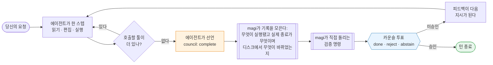
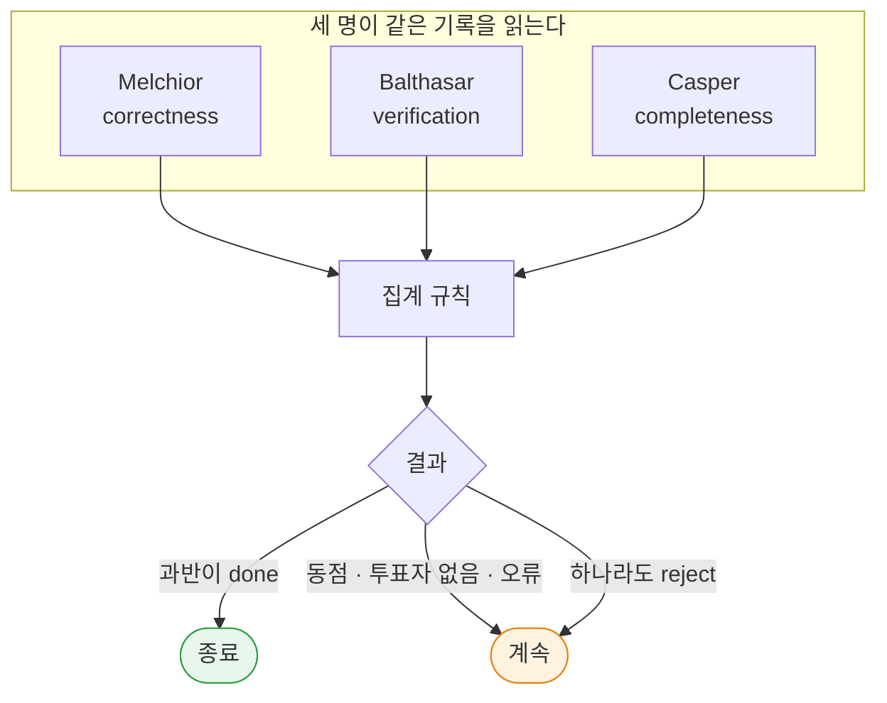
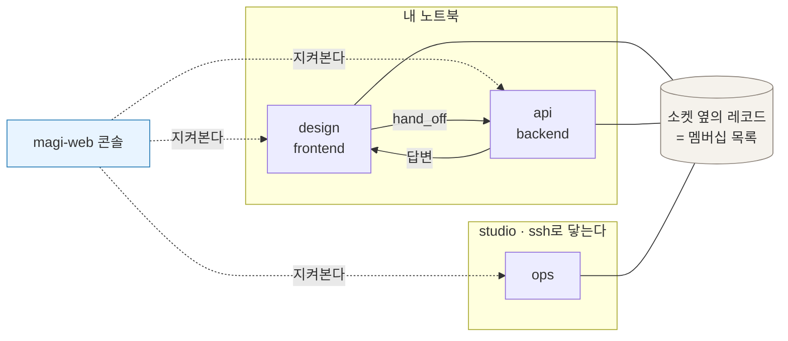
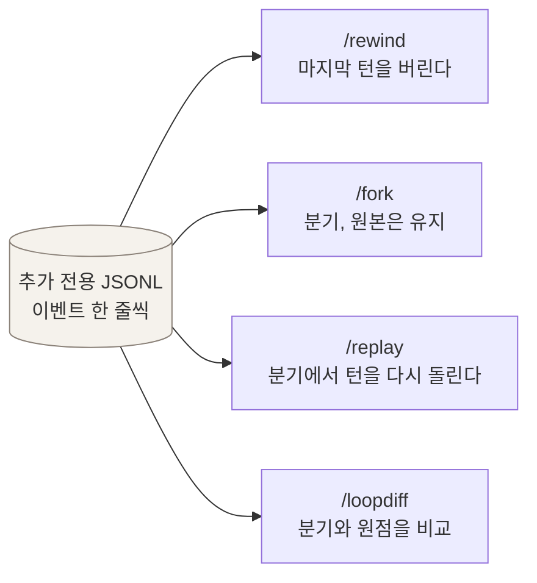
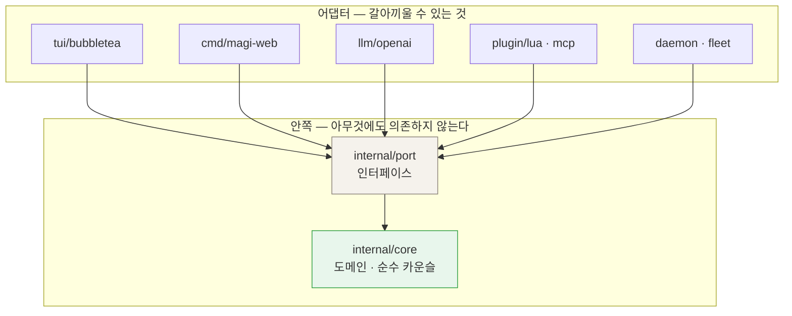

<div align="center">

# magi

### 스스로 "다 했다"고 선언할 수 없는 터미널 코딩 에이전트

대부분의 에이전트 루프에서는 모델이 툴 호출을 멈추면 턴이 끝납니다. magi는 다르게 끝냅니다.
에이전트가 끝났다고 *선언*해야 하고, 서로 다른 렌즈로 그 턴을 읽는 카운슬 세 명이 기록으로 그
선언을 받쳐줄 수 있는지 투표합니다. magi가 직접 돌리는 검증 명령은 테스트가 뒷받침하지 않는
"완료"를 거부할 수 있습니다.

[English](README.md) · [한국어](README.ko.md) · [매뉴얼](docs/MANUAL.ko.md) · [라이브 데모](https://sayaya1090.github.io/magi/)

[](https://github.com/sayaya1090/magi/actions/workflows/ci.yml)
[](https://github.com/sayaya1090/magi/actions/workflows/ci.yml)


</div>

---

## 어떻게 생겼나

터미널에서 턴 하나가 돌아가는 모습입니다. 에이전트가 읽고, 고치고, 테스트를 돌린 다음, 세 명이
그걸로 끝난 것인지 투표합니다.

<div align="center">

</div>

같은 데몬들을 브라우저에서 본 모습입니다. 내 머신 위의 모든 컴패니언, 각자 지금 무엇을 하는지,
그리고 나에게 답을 기다리는 것들:

<div align="center">
<a href="https://sayaya1090.github.io/magi/">
  
</a>

<sub><a href="https://sayaya1090.github.io/magi/">라이브 데모 열기</a> — 진짜 페이지에 목 데이터라, 서버가 필요 없습니다.</sub>
</div>

---

## 이 프로젝트가 붙잡고 있는 문제

에이전트 루프에는 어려운 질문이 하나 있습니다. **턴은 언제 진짜로 끝나는가?**

이 답을 암묵에 맡기면, 그러니까 모델이 툴 호출을 멈추면 턴이 끝나는 방식으로 두면, 생각하다 만 턴과
정말로 끝낸 턴이 똑같아 보입니다. 그래서 두 가지 실패가 함께 나옵니다. 4분의 3쯤에서 멈추는
에이전트, 그리고 영영 멈추지 않는 에이전트.

magi는 종료를 **정당화가 필요한 행위**로 만듭니다.



정작 볼 만한 것은 그 게이트가 완료를 **거부하는** 장면입니다:

```text
you ▸ deploy 명령에 --dry-run 플래그 추가해줘

  … 에이전트가 cmd/deploy.go를 읽고 편집, go build 실행 …

  ⚙ council {complete: true}          에이전트가 끝났다고 말한다

  ⚖ 카운슬이 기록을 읽는다
     ── MAGI가 관찰한 것
        변경: cmd/deploy.go
        정상 실행: go build ./...
     ── 지금 이 순간의 워크스페이스 (기록이 아니라 방금 읽은 것)
        cmd/deploy.go — 4,102 바이트, 12초 전 수정

     ● Balthasar [verification]  새 플래그를 실행해 보는 것이 없다 — `go test ./cmd`는 돈 적이 없다
     → 승인하지 않음. 에이전트는 계속 일한다

  … 에이전트가 테스트를 추가하고 go test 실행 …

  ⚙ council {complete: true}   →   승인   ✓ 턴 종료
```

magi의 나머지 부분에 특별한 것은 없습니다. 전부 이 결정이 딛고 설 바닥을 만들기 위해 있습니다.
실제로 무슨 일이 있었는지에 대한 기록, 들여다보고 다시 돌릴 수 있는 루프, 그리고 여러 에이전트를
한꺼번에 돌리며 감독하는 방법입니다.

---

## 카운슬

루프가 그냥 끝났을 지점에서 각 멤버가 **done**·**reject**·**abstain** 중 하나에 투표하고, 순수
집계 함수가 그 표를 하나의 결정으로 바꿉니다. 기본 세 명의 이름은 MAGI에서 따왔습니다. 셋이 다른
점은 "무엇을 보라고 들었는가" 하나뿐입니다.

| 멤버 | 렌즈 | 던지는 질문 |
|---|---|---|
| **Melchior** | `correctness` | 이 작업은 올바른가? 엣지 케이스, 회귀는? |
| **Balthasar** | `verification` | 동작한다는 *증거*가 있는가 — 빌드와 테스트가 실제로 돌았는가? |
| **Casper** | `completeness` | 과제가 요구한 것을 다 했는가? |



집계 규칙은 설정할 수 있습니다. 그리고 **모호한 결과는 전부 '완료'가 아니라 '계속'으로
떨어집니다**:

| 규칙 | 언제 끝나는가 |
|---|---|
| `majority` *(기본)* | 투표한 멤버의 과반이 done. 동점이면 계속 |
| `unanimous` | 전원이 done |
| `quorum:k` | 최소 *k* 명이 done |
| `weighted:θ` | done 가중치 비율이 임계값 θ 이상 |
| `veto:Name` | 지목된 멤버가 혼자서 어떤 완료든 거부할 수 있습니다 |

오류가 났거나, 시간이 초과했거나, 읽을 수 없는 답을 준 멤버는 게이트를 막는 대신 **기권**합니다.
그래서 불안정한 모델은 투표를 약하게 만들 뿐 루프를 얼리지는 못합니다. 라운드에는 상한이 있고,
무진전 감지가 같은 지적의 되풀이를 끊습니다.

> 집계는 `internal/core/council`에 순수 도메인 코드로 들어 있습니다. I/O도 LLM도 없어서 단독으로
> 단위 테스트가 됩니다. "한 모델이 아니라 카운슬이 결정한다"가 프롬프트에 적힌 문장이 아니라
> **테스트할 수 있는 성질**이 되는 건 이 분리 덕분입니다.

묻는 것과 선언하는 것은 별개입니다. `council{question}`은 확신이 안 서는 것에 대해 멤버들의 읽기를
받아올 뿐, 아무것도 끝내지 않습니다.

---

## 투표가 딛고 서는 기록

멤버들은 에이전트가 스스로 요약한 작업을 보고 판정하지 않습니다. 애초에 모든 툴 호출을 승인하는 게
magi 자신이니, **magi가 기록한 것**에 에이전트의 보고를 대어 판정합니다:

- 실행된 모든 명령과 그것이 **실제로** 어떻게 끝났는지. 파이프의 어느 단계가 실패했는지까지 남습니다.
- 이번 턴에 에이전트가 한 편집을 파일별 before → after 디프로.
- 완료를 선언하는 시점에 워크스페이스를 새로 읽은 결과. 과제 시작 이후 수정된 파일, 아직 살아 있는
  백그라운드 작업, 그리고 **기록에는 썼다는데 디스크에 없는 경로**입니다.

그 위에 에이전트가 손댈 수 없는 검증 명령이 얹힙니다:

```toml
[council]
verify = "go test ./..."   # 완료 게이트에서 magi가 직접 이것을 돌린다
```

최종 권한은 종료 코드에 있습니다. 0이 아니면 멤버들이 뭐라고 투표했든 완료를 **거부**하고, 그 출력은
에이전트의 주장이 아니라 magi가 돌린 증거로 멤버들에게 보여집니다. `go test`라면 magi가 `-json`으로
한 번 더 돌립니다. 초록색 테스트가 거짓말하는 흔한 두 가지를 잡기 위해서입니다:

- 아무것도 돌리지 않는 `TestMain`. 비었거나 꺼진 스위트가 그래도 0으로 끝나는 경우입니다.
- 테스트를 돌려 실패를 보고도 `os.Exit(0)`을 부르는 `TestMain`.

둘 중 하나라도 걸리면 "done"이 *계속*으로 바뀌고, 증거가 무슨 일이 있었는지 지목합니다. 미리 써둔
검사는 작업에 대해 틀릴 수 있지만, 무엇을 승인했는지의 기록은 무엇이 실행됐는지에 대해 틀릴 수
없습니다.

---

## 하나 이상 돌리기

워크스페이스 하나에 묶인 magi 하나를 **컴패니언**이라고 부릅니다. 저장소 자신의 설정에 이름과 역할을
적어 두면, 그때부터 "무엇을 위한 것인지"로 부를 수 있습니다:

```toml
# .magi/config.toml — 저장소와 함께 따라다닙니다
[companion]
name = "design"
role = "디자인 시스템: 컴포넌트 스펙과 시각 리뷰"
team = "frontend"     # 선택
```



- **`companions`** — 다른 컴패니언들을 나열합니다. 각 워크스페이스가 무엇을 *배웠는지*까지 함께
  나오는데, 전문가가 나머지 눈에 띄게 되는 통로가 이것입니다.
- **`companion_can`** — 그중 하나에게 실제로 무엇을 할 수 있는지 물어봅니다.
- **`hand_off`** — 하나에게 작업의 일부를 넘기고 내 일을 계속합니다. 요청에는 목적과 함께 답이 돌아와야
  할 형식이 실리고, 답은 끝났을 때 내 대화에 도착합니다. 컴패니언은 한 번에 한 턴만 돌고 그동안 들어온
  것은 큐에 쌓는데, 얼마나 쌓였는지가 자기 레코드에 공개됩니다. 그래서 맡길 사람을 고르는 쪽에서 누가
  한가한지 볼 수 있습니다.
- **회의** — 여러 컴패니언을 하나의 질문에 붙여 놓고, 읽기 전용으로, 각자 무엇을 할지 알게 될 때까지
  이야기하게 합니다.

레지스트리도, 게이트웨이도, 열린 포트도 없습니다. 데몬마다 자기 소켓 옆에 레코드를 쓰고 **그 디렉토리가
곧 멤버십 목록**입니다. 머신을 넘어갈 때도 같은 레코드를 ssh로 주고받습니다. `magi --join-cluster
<host>`를 한 번 실행하면 그다음부터는 데몬들이 서로를 최신으로 유지하고, 한 시간 넘게 못 본 상대는
잊습니다. 작업도 같은 길로 건너가기 때문에 magi는 자기 포트를 열지 않고 자기 자격증명도 갖지 않습니다.

---

## 콘솔

```sh
./magi --daemon      # UI 없는 엔진. 아무도 안 보고 있어도 계속 일합니다
./magi --attach      # 이 워크스페이스의 데몬에 터미널 UI를 붙입니다
./magi --agents      # 이 머신의 모든 magi와 각자 하는 일
./magi-web           # 같은 것을 브라우저에서, 127.0.0.1:7777
./magi-web -exposed  # 인증 프록시 뒤에서: 셸 없음, MCP 쓰기 없음, 모든 변경 기록
```

<div align="center">
<a href="https://sayaya1090.github.io/magi/?d=%2Fdemo%2Fdesign.sock">
  
</a>

<sub>컴패니언 하나: 진짜 종료 코드가 보이는 실시간 전사와, 승인을 기다리는 위험한 명령.</sub>
</div>

<table>
<tr>
<td width="50%" valign="top">
<a href="https://sayaya1090.github.io/magi/?d=%2Fdemo%2Fdesign.sock"></a><br>
<b>대화 옆의 작업공간.</b> 컴패니언이 보는 그대로의 파일 트리와 git 상태입니다. 파일을 열면 에이전트가 쓰는 줄 번호 그대로 읽을 수 있고, 그 자리에서 고칠 수도 있습니다.
</td>
<td width="50%" valign="top">
<a href="https://sayaya1090.github.io/magi/?v=meet"></a><br>
<b>회의.</b> 여러 컴패니언을 하나의 질문에 붙여 각자 할 일을 알게 하고, 결론을 각각 업무로 내보냅니다.
</td>
</tr>
<tr>
<td width="50%" valign="top">
<a href="https://sayaya1090.github.io/magi/?v=skills"></a><br>
<b>지식.</b> 팀이 배운 스킬과 적어둔 메모리입니다. 각각 어디까지 닿는지가 붙어 있습니다. 이 컴패니언만, 이 팀, 아니면 여기 있는 모든 컴패니언.
</td>
<td width="50%" valign="top">
<a href="https://sayaya1090.github.io/magi/?v=skills"></a><br>
<b>공유 위키.</b> 컴패니언들이 최신 상태로 유지하는 정설 페이지입니다. 쌓이는 게 아니라 제자리에서 갱신됩니다. 은퇴한 페이지는 왜 더 이상 사실이 아닌지와 함께 읽을 수 있게 남습니다.
</td>
</tr>
<tr>
<td width="50%" valign="top">
<a href="https://sayaya1090.github.io/magi/?v=board"></a><br>
<b>보드.</b> 하루의 작업이 카드로. 팀마다 한 열, 에이전트가 각 조각에 붙인 라벨로 묶입니다.
</td>
<td width="50%" valign="top">
<a href="https://sayaya1090.github.io/magi/"></a><br>
<b>휴대폰에서.</b> 같은 콘솔이라 승인이나 답변을 책상에 돌아올 때까지 미루지 않아도 됩니다.
</td>
</tr>
</table>

---

## 무엇이 들어 있나

| | 기능 | 실제로 무슨 뜻인가 |
|---|---|---|
| 🗳️ | **합의 기반 종료** | 세 멤버가 *done / reject / abstain*에 투표하고, 단위 테스트된 순수 규칙이 집계합니다. reject가 나오면 그들의 피드백이 합쳐져 다음 지시가 됩니다. |
| 🔒 | **magi가 직접 돌리는 검증 명령** | `[council] verify`를 테스트 명령에 겨눠 두면, 0이 아닌 종료는 멤버들이 뭐라고 투표했든 완료를 거부합니다. `go test`라면 꺼진 스위트나 강제 `exit 0`으로 가려진 실패까지 잡습니다. |
| 🧾 | **주장이 아니라 기록** | magi가 모든 툴 호출을 승인하므로, 어떤 명령이 돌았고 실제로 어떻게 끝났는지(파이프의 어느 단계가 실패했는지 포함), 어떤 파일에 썼는지를 압니다. 완료 선언마다 워크스페이스를 새로 읽는 것은 별도. |
| 🖥️ | **여러 에이전트를 위한 콘솔** | 내 머신들의 모든 컴패니언을 브라우저에서 감독합니다. 중단·질문 답변·명령 승인·배운 것 읽기, 그리고 하나가 막히면 휴대폰으로 알림이 옵니다. |
| ✨ | **에디터 자동완성과 프롬프트 제안** | 웹 에디터의 고스트 텍스트 완성, 그리고 두 입력창의 다음 지시 제안입니다. 내가 과거에 쓴 프롬프트에서 배웁니다. 각각 내가 지정한 빠른 프로파일 위의 얇은 호출이라, 키 입력이 턴 기계장치를 기다릴 일이 없습니다. *룩오버*를 켜면 편집하는 동안 모델이 어깨 너머로 읽고 최대 세 개의 지적을 정확한 줄에 붙여 줍니다. |
| 🔄 | **스스로 최신을 유지하는 함대** | 인스턴스끼리 버전과 능력을 주고받고, 콘솔은 각 컴패니언의 빌드를 보여주며, 데몬은 스스로 갱신합니다. 체크섬을 검증해 받고, 새 빌드가 안 돌면 **롤백**하는 예비 점검을 거친 뒤, 대화를 유지한 채 제자리에서 재시작합니다. 머신을 넘어가지 않고, 직접 만든 소스 빌드는 절대 덮어쓰지 않습니다. |
| 🤝 | **컴패니언과 핸드오프** | 워크스페이스에 이름과 역할을 주고 그것이 무엇인지로 부릅니다. `hand_off`는 전문가에게 작업 조각을 넘기고 내 일을 계속하게 해 주며, 답은 끝났을 때 내 대화에 도착합니다. |
| 🗣️ | **회의** | 여러 컴패니언이 하나의 질문을 읽기 전용으로 논의해 각자 할 일을 알게 되고, 그다음 작업이 배분됩니다. |
| ⏮️ | **들여다볼 수 있는 루프** | 모든 턴이 추가 전용 JSONL로 이벤트 소싱되므로 `/rewind`·`/fork`·`/replay`·`/loopdiff`가 따로 만들어야 할 기능이 아니라 평범한 조작이 됩니다. |
| 📦 | **자기완결 바이너리** | 순수 Go, CGO 없음. 에이전트와 선택적 콘솔이 각각 정적 바이너리 하나입니다. [Ollama](https://ollama.com)를 로컬로 쓰거나 무료 클라우드 티어로, 또는 OpenAI 호환 엔드포인트라면 무엇이든. |
| 🔌 | **내 코딩 CLI가 곧 백엔드** | 번들 플러그인(기본 꺼짐)으로 Claude Code·Codex·Antigravity가 LLM 백엔드 자체가 됩니다 — 각자 자기 CLI 위에 OpenAI shim을 서빙하고, magi의 툴콜은 왕복하며, CLI는 언어모델 역할에 묶입니다(자체 툴은 꺼진 채 — 실측). 콘솔이나 `/providers`에서 컴패니언별로 백엔드를 고르고, 언제든 Ollama로 되돌릴 수 있습니다. |

---

## 루프는 열어볼 수 있는 객체다

모든 턴이 추가 전용 JSONL 로그로 이벤트 소싱됩니다. 아래 네 명령이 특별한 기능이 아니라 평범한
조작인 이유가 그것입니다:



| 명령 | 무엇을 주는가 |
|---|---|
| `/loop` | 루프 지도 — 턴 · 스텝 · 카운슬 라운드를 한눈에 |
| `/context` | 컨텍스트 윈도우를 정확히 무엇이 채우고 있는지 (사용량 · 압축) |
| `/rewind` | 마지막 사용자 턴(들)을 되돌립니다 |
| `/fork` | 다른 시도를 위해 세션을 분기합니다. 원본은 그대로 남습니다 |
| `/replay` | 분기에서 마지막 턴을 다시 돌립니다 |
| `/loopdiff` | 분기를 갈라져 나온 지점과 비교합니다 |

---

## 빠른 시작

### 필요한 것

- 빌드하려면 **Go 1.26+**.
- **OpenAI 호환 LLM 백엔드.** [Ollama](https://ollama.com)가 가장 손이 덜 갑니다. 기본 모델
  `gpt-oss:120b-cloud`는 Ollama 무료 클라우드 티어에서 돌아가므로 GPU가 필요 없고, 한 번 로그인하면
  됩니다:

  ```sh
  ollama signin            # 무료 티어. 기본 모델은 Ollama 클라우드에서 돈다
  ```

  이미 결제해 쓰는 코딩 에이전트 CLI — Claude Code, Codex, Antigravity — 를 백엔드로 쓸 수도
  있습니다. 기본 꺼짐인 번들 플러그인을 켜면 됩니다(`[plugins.claudecode] enabled = true`;
  MANUAL §9).

  전부 내 머신에서 돌리고 싶다면 로컬 모델을 받아 그쪽을 가리키면 됩니다:

  ```sh
  ollama pull qwen3-coder:30b
  ./magi --model qwen3-coder:30b        # 또는 MAGI_MODEL=…
  ```

  > 로컬 모델 고르기에 대해: 에이전트 루프에서 중요한 것은 *토큰*을 얼마나 빨리 뽑느냐이고, 그것은
  > 파일 크기가 아니라 **활성** 파라미터 수를 따릅니다. 활성 3B쯤인 MoE 모델이 같은 크기의 덴스 27B보다
  > 몇 배 빠릅니다. 아주 작은 모델(`llama3.1:8b` 부류)은 인사를 할 때도 툴 호출 JSON을 뱉곤 해서,
  > 속도와 무관하게 잘 맞지 않습니다.

  vLLM·LiteLLM·호스팅 API 등 OpenAI 호환 엔드포인트라면 무엇이든 됩니다. 설정 절을 참고하세요.

### 설치

```sh
# 미리 빌드된 바이너리
curl -fsSL https://raw.githubusercontent.com/sayaya1090/magi/main/scripts/install.sh | bash

# Homebrew
brew install sayaya1090/tap/magi
```

### 소스에서 빌드

```sh
make build        # CGO_ENABLED=0, 버전 주입 → ./magi
make web          # 브라우저 콘솔 → ./magi-web
# 또는 직접:
CGO_ENABLED=0 go build -o magi     ./cmd/magi
CGO_ENABLED=0 go build -o magi-web ./cmd/magi-web
```

순수 Go에 CGo가 없어서 결과물은 정적 바이너리 하나입니다. `magi`가 에이전트(TUI와 데몬)이고,
`magi-web`은 선택적 콘솔입니다. 아무 데나 복사해서 실행하면 됩니다.

### 실행

```sh
./magi                         # 대화형 TUI
./magi -p "explain main.go"    # 헤드리스 1회 실행 (--output json이면 JSONL 이벤트 스트림)
./magi --version               # 버전 출력
./magi --update                # 바이너리와 관리되는 플러그인 갱신 (체크섬 검증)
```

TUI에서는 **Enter**로 보내고, **Esc**로 실행 중인 턴을 멈추고, **Ctrl+Q** 또는 `/quit`으로
나갑니다. 위험한 툴(`write`·`edit`·`bash`)은 먼저 물어봅니다 — `y` 허용, `a` 항상, `n` 거부.
마크다운과 문법 강조는 터미널의 다크/라이트를 따라갑니다. `/`를 치면 명령 팔레트가 열립니다.

---

## 설정

첫 실행 때 주석이 달린 `config.toml`이 만들어지고, 그 뒤로는 덮어쓰지 않습니다. 우선순위는
**플래그 > 환경변수 > 설정파일 > 기본값** 순입니다.

| 플래그 | 환경변수 | 기본값 | 용도 |
|---|---|---|---|
| `--model` | `MAGI_MODEL` | `gpt-oss:120b-cloud` | 모델 id (Ollama 무료 클라우드 티어. `ollama signin`) |
| `--base-url` | `MAGI_BASE_URL` | `http://localhost:11434/v1` | OpenAI 호환 base URL |
| `--permission` | `MAGI_PERMISSION` | TUI `ask` / 헤드리스 `allow` | `ask` \| `auto` \| `allow` \| `deny` |
| `--output` | — | `text` | `text` \| `json` (헤드리스) |
| — | `MAGI_API_KEY` | *(없음)* | 원격 백엔드용 키 (Ollama는 불필요) |

이름 붙인 백엔드를 쓰면 잡일에는 싼 모델을, 중요한 데는 강한 모델을 둘 수 있습니다. 프로파일을
정의한 뒤 서브에이전트(`/subagents`)나 카운슬 멤버, 자동완성 헬퍼를 그쪽으로 가리키면 됩니다:

```toml
[llm.profiles.fast]          # ${ENV}가 확장되므로 키는 파일 밖에 둔다
base_url = "https://fast.gateway/v1"
api_key  = "${FAST_KEY}"
model    = "gpt-oss:20b"
```

전체 레퍼런스는 [매뉴얼](docs/MANUAL.ko.md#3-설정)에 있습니다.

---

## 툴과 확장

**내장 툴:** `read` · `write` · `edit` · `multiedit` · `grep` · `glob` · `list` · `bash`
(타임아웃 · 종료 코드 · `background`) · `bash_output` · `bash_input` · `bash_kill` · `wait_for` ·
`port_owner` · `recall_context` · `recall_memory` · `webfetch` · `websearch` · `todowrite` ·
`council` (읽기를 청하거나, 끝났다고 선언) · `remember` (공유 메모리와 위키) · `skill` ·
`companions` · `companion_can` · `hand_off` · `ask_user`와 `route_interjection` (대화형 전용).

편집한 뒤에는 진단 피드백(gofmt · go vet · py_compile · LSP)이 되돌아와서 에이전트가 스스로 고칠 수
있습니다. 읽기 전용 툴은 한 턴 안에서 병렬로 돕니다.

- **기본은 에이전트 하나.** 켜기 전에는 둘째가 스폰되지 않습니다. 서브에이전트는 플러그인에서 오고, magi는 하나도 번들하지
  않습니다. 설치한 것을 켜는 자리가 `/subagents`입니다.
  플러그인의 자식들은 충돌할 수 없을 때 병렬로 돌 수 있습니다: 읽기 전용 자식이거나, 각자 자기 체크아웃을
  받는 쓰기 자식(`isolated_children` — 자식마다 git 클론, 셸은 거기 갇히고, 호출자가 말할 때만 커밋
  범위로 병합됩니다). [EXTENDING](docs/EXTENDING.ko.md)을 참고하세요.
- **프로젝트 메모리.** `AGENTS.md`(그리고 `.magi/AGENTS.md`와 전역 파일)는 **압축을 견디는** 지속
  컨텍스트입니다.
- **컨텍스트 인식 압축.** 모델 윈도우의 약 80%를 넘으면 오래된 턴이 요약되고 최근 것은 남습니다.
  헤더에 `ctx 42%` 미터가 있습니다.
- **공유 경험.** 팀이 함께 쓰는 git 기반 스킬·메모리·위키 저장소입니다. `remember`가 쓰고
  `recall_memory`가 읽습니다.
- **Lua 플러그인.** `<config>/plugins/`에 `plugin.toml`과 `init.lua`를 넣으면 자동 로드·핫 리로드·
  샌드박스. [plugins/examples/wordcount](plugins/examples/wordcount) 참고.
- **MCP 서버.** `config.toml`에 선언해 두면 시작할 때 그 툴들이 등록됩니다.
- **무인 작업.** `schedule`과 `[cron]`이 아무도 안 볼 때 작업을 돌립니다.

---

## 아키텍처

magi는 포트와 어댑터 구조입니다. 코어 도메인은 UI도, LLM도, 플러그인도 모르고, 의존성 방향은 늘
안쪽을 향합니다.



```
cmd/magi            진입점 (와이어링)
cmd/magi-web        콘솔 — 같은 데몬들 위의 읽기 위주 웹 뷰
internal/core       도메인 — 어떤 어댑터에도 의존하지 않습니다 (순수 카운슬 포함)
internal/port       포트(인터페이스) — LLM, Store, Council, PluginHost …
internal/adapter    어댑터 — llm/openai · tui/bubbletea · plugin/lua · mcp · council/llm ·
                    daemon (소켓 위의 엔진) · fleet (모든 magi가 무엇을 하는지)
plugins/examples    예제 Lua 플러그인
docs                ARCHITECTURE · DESIGN · SPEC · MANUAL · UI · EXTENDING · DIAGRAMS · BENCHMARK
```

| 선택 | 이유 |
|---|---|
| **Go** | 정적 바이너리 하나, 손쉬운 크로스 컴파일, 간단한 자기 갱신, 고루틴 동시성 |
| **Bubble Tea (Charm)** | 다듬어진 TUI의 표준. 마크다운·코드 렌더링이 기본 제공 |
| **Lua (gopher-lua)** | 순수 Go 임베드라 빌드가 CGo 없이 유지되고, 핫 리로드와 샌드박스가 자연스럽습니다 |
| **이벤트 소싱 JSONL** | 관찰 가능하고, 재생 가능하고, 분기 가능한 루프 |
| **OpenAI 호환 LLM** | 프로토콜 어댑터 하나로 로컬(Ollama·vLLM)과 호스팅 엔드포인트 양쪽에 닿습니다 |

더 읽을 것: [ARCHITECTURE](docs/ARCHITECTURE.ko.md) · [UI](docs/UI.ko.md) ·
[DESIGN](docs/DESIGN.ko.md) · [EXTENDING](docs/EXTENDING.ko.md) · [SPEC](docs/SPEC.ko.md) ·
[DIAGRAMS](docs/DIAGRAMS.ko.md) ·
[BENCHMARK](docs/BENCHMARK.ko.md) — magi가 Terminal-Bench 2.1에서 받는 점수, 그리고 직접 돌리는 법.

---

## 보안

magi는 내 파일을 읽고, 고치고, 명령을 실행합니다. 모델과 내 기계 사이에 서 있는 것은 deny 바닥, 서로
독립인 두 축, 그리고 `--permission allow`에서도 발화하는 스캔입니다. [SECURITY.ko.md](SECURITY.ko.md)가 그것을 한자리에 적은 문서입니다. 툴 게이트, 신뢰 경계로서의
워크스페이스, 콘솔이 무엇을 인증하고 무엇을 인증하지 않는지, 그리고 두 번 읽을 값이 있는 절 — 무엇을 일부러
막지 않는지.

## 라이선스

**Apache-2.0** — [LICENSE](LICENSE) 참고. 서드파티 코드를 재사용할 때는 `NOTICE`와
`THIRD_PARTY_LICENSES` 파일을 그대로 유지할 것.
