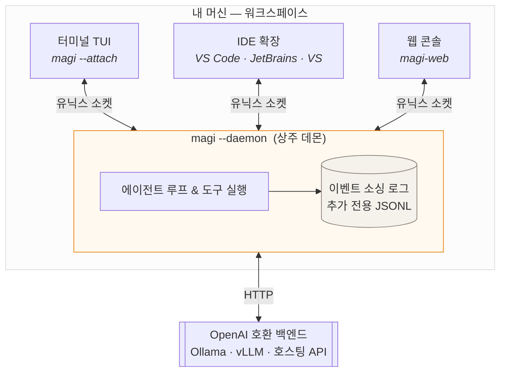
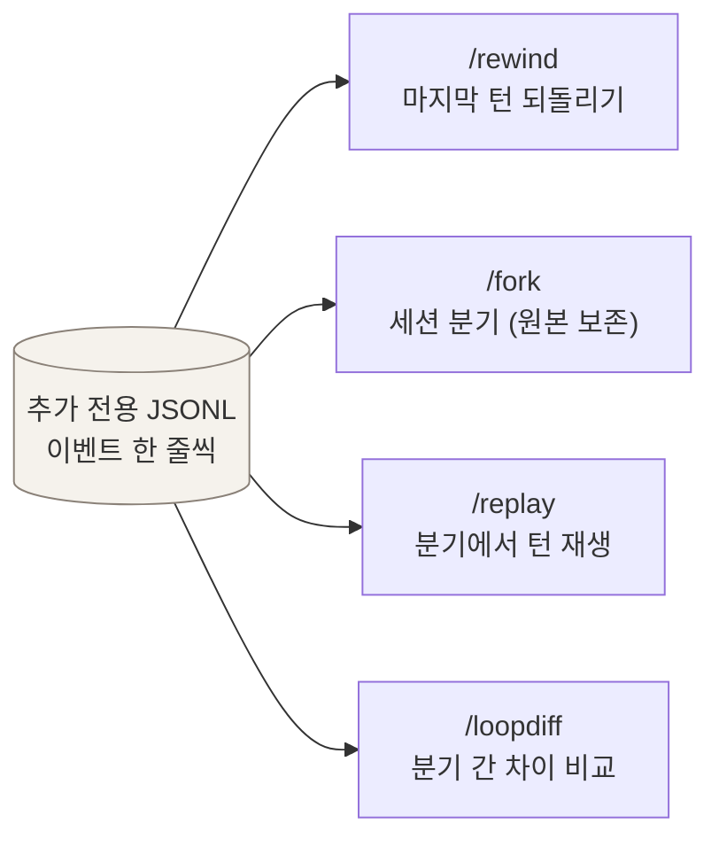
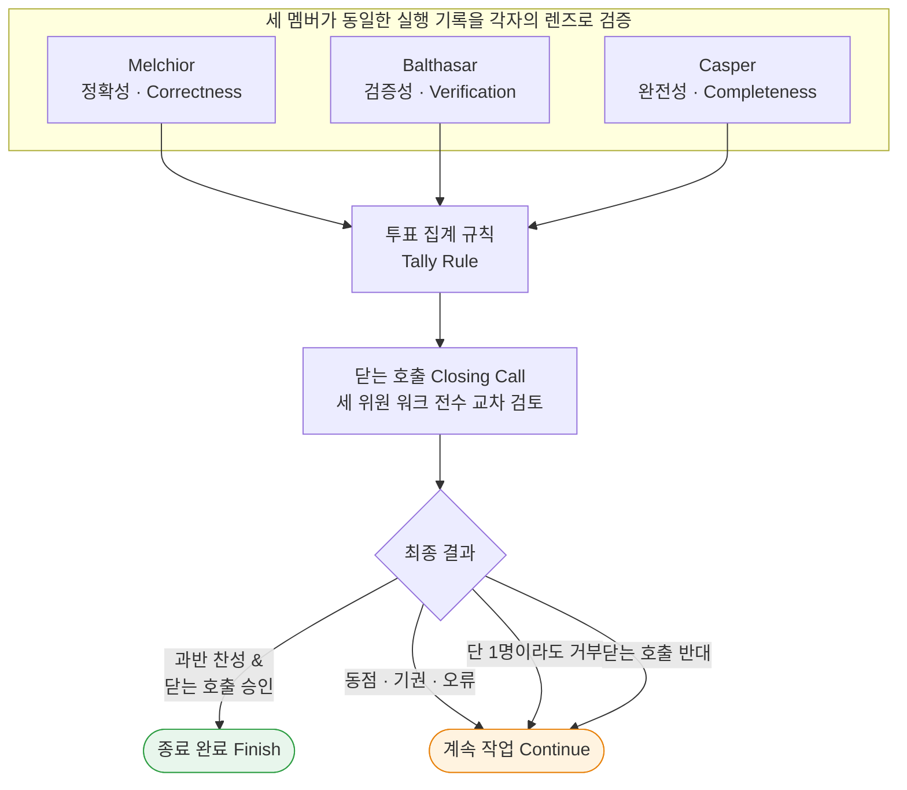
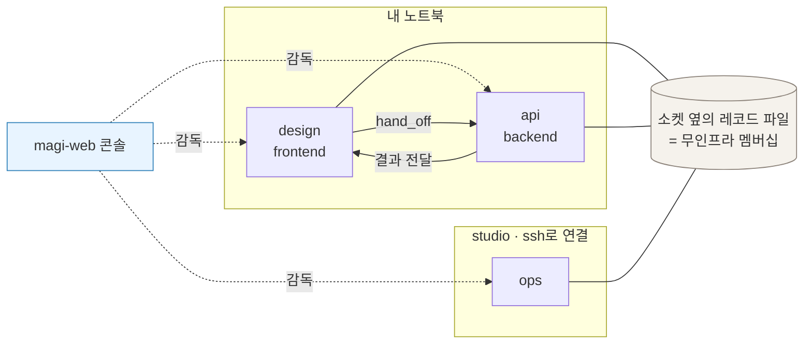
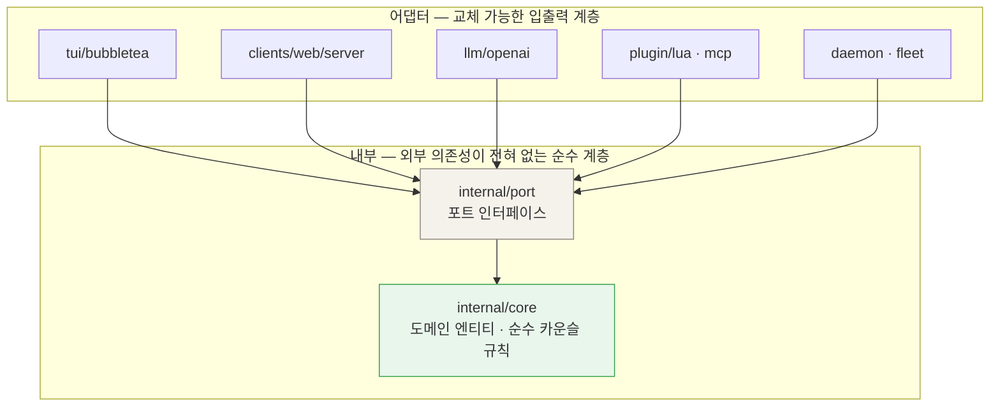

<div align="center">

# magi

### 창을 닫아도, 도구를 바꿔도 작업이 끊기지 않는 상주형 코딩 에이전트

**Go 기반 단일 정적 바이너리 AI 코딩 에이전트**. 워크스페이스마다 독립된 데몬으로 상주하며, 터미널 TUI·웹 콘솔·IDE(VS Code·JetBrains·Visual Studio) 어디서든 로컬 소켓으로 붙고 떨어질 수 있습니다.
모든 작업과 결정은 추가 전용(append-only) JSONL 로그로 이벤트 소싱되어 언제든 턴을 되돌리거나(`/rewind`) 분기(`/fork`)할 수 있으며, 3인 카운슬 검증 게이트가 거짓 완료를 걸러냅니다.

[English](README.md) · [한국어](README.ko.md) · [매뉴얼](docs/MANUAL.ko.md) · [사이트](https://sayaya1090.github.io/magi/) · [라이브 데모](https://sayaya1090.github.io/magi/demo/)

[](https://github.com/sayaya1090/magi/actions/workflows/ci.yml)
[](https://github.com/sayaya1090/magi/actions/workflows/ci.yml)


</div>

---

## ⚡ 빠른 시작 (Quick Start)

### 설치 (Installation)

```sh
# 미리 빌드된 바이너리 (macOS / Linux)
curl -fsSL https://raw.githubusercontent.com/sayaya1090/magi/main/scripts/install.sh | bash

# 또는 Homebrew
brew install sayaya1090/tap/magi

# 소스 빌드 (Go 1.26+ 필요, CGO 없음)
git clone https://github.com/sayaya1090/magi.git && cd magi && make build
```

### 실행 (Running)

OpenAI 호환 엔드포인트라면 무엇이든 지원합니다. [Ollama](https://ollama.com) 무료 클라우드 티어나 로컬 모델과 바로 연동됩니다:

```sh
# 터미널 대화형 TUI 바로 시작
./magi

# 원하는 모델 지정 (로컬 또는 원격)
./magi --model qwen3-coder:30b

# 백그라운드 상주 데몬으로 실행 (창을 닫아도 유지)
./magi --daemon --detach

# 실행 중인 데몬에 터미널 TUI 붙이기 (언제든 탈착 가능)
./magi --attach

# 브라우저 웹 콘솔 열기 (127.0.0.1:7777)
./magi-web
```

---

## 🌟 왜 magi인가? (Why magi?)



### 1. 🖥️ 창을 닫아도 끊기지 않는 상주 데몬 (Resident Daemon)
대부분의 코딩 에이전트는 터미널 창을 닫으면 작업과 맥락이 사라집니다. magi는 **워크스페이스마다 독립 데몬이 상주**합니다:
- **어디서든 자유로운 접속**: 터미널 TUI, 웹 콘솔, VS Code, JetBrains 어디서든 소켓으로 붙었다가 자유롭게 떨어질 수 있습니다.
- **장기 실행 안정성**: 무거운 빌드나 긴 테스트를 걸어두고 IDE를 닫아도, 데몬은 백그라운드에서 묵묵히 작업을 완수합니다.

### 2. ⏪ 로그가 곧 상태다 — 이벤트 소싱 타임머신 (Event-Sourced Time Travel)
모든 턴과 도구 호출 결과는 추가 전용(append-only) JSONL 파일에 이벤트로 기록됩니다.
- 복잡한 DB 없이도 **`/rewind` (마지막 턴 되돌리기)**, **`/fork` (새로운 시도를 위한 세션 분기)**, **`/replay`**가 로그 줄 수만 다루는 가벼운 조작으로 완벽하게 동작합니다.
- 예기치 않게 프로세스가 죽더라도 이벤트 로그 재생을 통해 1초 만에 이전 상태를 복구합니다.

### 3. ⚖️ 3인 카운슬 — 거짓 완료 차단 게이트 (Council Consensus Gate)
모델이 도구 호출을 멈췄다고 해서 과제가 실제로 끝난 것은 아닙니다. magi는 에이전트가 `council{complete: true}`로 종료를 선언해야 하며, 독립된 세 멤버가 실제 기록을 대조 검증합니다:
- **Melchior (정확성)**: 과제의 글자 그대로 요구사항 충족 여부 검증
- **Balthasar (검증성)**: 테스트와 코드가 실제로 빌드되고 정상 실행되었는지 검증
- **Casper (완전성)**: 요구사항 중 빠뜨린 세부 항목이 없는지 전수 검증
> 위원들의 피드백은 거부 시 다음 턴의 명확한 지시문이 되어 에이전트의 헛바퀴 루프를 끊습니다.

### 4. 🌐 인프라 없는 플릿 & 컴패니언 (Zero-Infra Fleet & Companions)
- 중앙 레지스트리 서버나 복잡한 포트 설정 없이, 데몬이 로컬 소켓 옆에 기록하는 파일만으로 서로를 발견합니다.
- 머신을 건너갈 때도 기존 ssh 통로를 그대로 활용하므로 외부 포트를 열지 않습니다.
- **`hand_off`**: 전문화된 다른 워크스페이스 컴패니언에게 비동기로 작업을 넘기고, 내 턴은 멈춤 없이 계속 진행할 수 있습니다.

---

## 📸 어떻게 생겼나 (What It Looks Like)

<div align="center">

<p><sub>터미널 TUI: 실시간 도구 실행 결과와 카운슬 3인의 투표 집계</sub></p>
</div>

<div align="center">
<a href="https://sayaya1090.github.io/magi/demo/">
  
</a>
<p><sub>웹 콘솔 (<a href="https://sayaya1090.github.io/magi/demo/">라이브 데모</a>): 여러 워크스페이스의 컴패니언 상태와 진행 작업을 한눈에 감독</sub></p>
</div>

<div align="center">
<a href="https://sayaya1090.github.io/magi/demo/?d=%2Fdemo%2Fdesign.sock">
  
</a>
<p><sub>컴패니언 상세: 진짜 종료 코드가 보이는 실시간 전사와 권한 승인 인터페이스</sub></p>
</div>

<table>
<tr>
<td width="50%" valign="top">
<a href="https://sayaya1090.github.io/magi/demo/?d=%2Fdemo%2Fdesign.sock"></a><br>
<b>대화 옆의 작업공간.</b> 컴패니언이 보는 파일 트리와 git 상태를 실시간 확인하고 직접 편집합니다.
</td>
<td width="50%" valign="top">
<a href="https://sayaya1090.github.io/magi/demo/?v=meet"></a><br>
<b>회의.</b> 여러 컴패니언을 하나의 질문에 붙여 각자 할 일을 조율하고 업무를 자동 분배합니다.
</td>
</tr>
<tr>
<td width="50%" valign="top">
<a href="https://sayaya1090.github.io/magi/demo/?v=skills"></a><br>
<b>지식.</b> 팀이 배운 스킬과 기억(Memory)의 도달 범위(컴패니언/팀/전역)를 한눈에 관리합니다.
</td>
<td width="50%" valign="top">
<a href="https://sayaya1090.github.io/magi/demo/?v=skills"></a><br>
<b>공유 위키.</b> 컴패니언들이 작성하고 유지하는 정설 문서입니다. 변경 이력과 은퇴 사유가 보존됩니다.
</td>
</tr>
<tr>
<td width="50%" valign="top">
<a href="https://sayaya1090.github.io/magi/demo/?v=board"></a><br>
<b>보드.</b> 하루 동안 진행된 작업들이 팀별 열과 상태 라벨 카드로 정리됩니다.
</td>
<td width="50%" valign="top">
<a href="https://sayaya1090.github.io/magi/demo/"></a><br>
<b>모바일 대응.</b> 자리 밖에서도 스마트폰으로 알림을 받고 위험한 명령 승인과 답변을 처리합니다.
</td>
</tr>
</table>

---

## ⏪ 이벤트 소싱 루프 제어 (Inspectable & Replayable Loop)

모든 턴이 추가 전용 JSONL 로그로 이벤트 소싱됩니다. 별도 데이터베이스 없이도 아래 명령어들이 파일 줄 수 기반의 가벼운 조작으로 완벽하게 동작합니다:



| 명령 | 무엇을 주는가 |
|---|---|
| `/loop` | 루프 지도 — 턴 · 스텝 · 카운슬 라운드를 한눈에 파악 |
| `/context` | 컨텍스트 윈도우를 채우고 있는 토큰 비율 및 압축 현황 |
| `/rewind` | 실패하거나 원치 않는 마지막 사용자 턴(들)을 깨끗이 되돌림 |
| `/fork` | 다른 해결책을 시도하기 위해 세션을 분기 (원본 세션은 보존) |
| `/replay` | 분기된 세션에서 마지막 턴을 다시 실행 |
| `/loopdiff` | 분기된 세션을 원래 갈라져 나온 지점과 비교 |

---

## ⚖️ 3인 카운슬과 검증 게이트 (The Council & Verification Gate)

에이전트가 "다 끝났다"고 선언할 때, 세 멤버가 각자의 렌즈로 실제 실행 기록을 대조 검증합니다.



| 멤버 | 검증 렌즈 | 최우선 탐색 경로 |
|---|---|---|
| **Melchior** | `correctness` (정확성) | 요구사항의 글자 그대로의 수치, 파일명, 규격 충족 여부 |
| **Balthasar** | `verification` (검증성) | 코드가 실제로 빌드되고 테스트가 정상 통과했는지의 실행 증거 |
| **Casper** | `completeness` (완전성) | 요구사항 중 지나치기 쉬운 부가 지시나 에지 케이스 누락 여부 |

### 투표 집계 규칙

| 규칙 | 언제 끝나는가 |
|---|---|
| `majority` *(기본)* | 투표한 멤버의 과반이 done. 동점이면 계속 진행 |
| `unanimous` | 전원이 done이어야 종료 |
| `quorum:k` | 최소 *k* 명이 done이어야 종료 |
| `weighted:θ` | done 가중치 비율이 임계값 θ 이상일 때 종료 |
| `veto:Name` | 지목된 특정 멤버가 거부권을 행사할 수 있음 |

- **주장이 아닌 기록 검증**: 에이전트의 자체 설명이 아니라, 실제로 실행된 셸 명령 종료 코드와 파일 수정 디프(diff)만을 근거로 삼습니다.
- **워크시트 선작성**: 위원들은 판정을 내리기 전에 요구사항마다 충족 여부와 툴 출력 증거(`SATISFIED` / `UNSATISFIED` / `NO-EVIDENCE`)를 반드시 먼저 기재해야 합니다.
- **단방향 판정 제약**: 닫는 검토(Closing Call)는 합의된 `done`을 기각하여 `continue`로 바꿀 수는 있어도, 반대로 미완료 상태를 자의적으로 `done`으로 승격시킬 수는 없습니다.

---

## 🤝 멀티 에이전트 협동 — 컴패니언과 플릿 (Companions & Fleet)

워크스페이스 하나에 묶인 magi 인스턴스를 **컴패니언**이라고 부릅니다. `.magi/config.toml`에 이름과 역할을 선언하면 동료 컴패니언들과 협동할 수 있습니다:

```toml
# .magi/config.toml — 저장소에 커밋되어 함께 공유됩니다
[companion]
name = "design"
role = "디자인 시스템: 컴포넌트 스펙과 시각 리뷰"
team = "frontend"
```



- **`companions`**: 클러스터 내의 모든 컴패니언 목록과 각자가 학습한 스킬을 탐색합니다.
- **`companion_can`**: 특정 컴패니언의 세부 전문 능력과 지원 가능한 태스크를 조회합니다.
- **`hand_off`**: 전문 영역의 컴패니언에게 하위 작업을 비동기로 위임하고, 내 워크스페이스 작업은 멈춤 없이 계속 진행합니다.
- **무인프라 디스커버리**: 별도 레지스트리 서버 없이 로컬 소켓 옆의 상태 파일만으로 멤버십을 구성하며, 원격 머신 간 통신도 기존 SSH 터널을 그대로 활용합니다.


---

## 🛠️ 설정 (Configuration)

첫 실행 시 주석이 포함된 `config.toml`이 자동 생성됩니다. 우선순위는 **CLI 플래그 > 환경 변수 > 설정 파일 > 기본값** 순입니다.

| 플래그 | 환경변수 | 기본값 | 용도 |
|---|---|---|---|
| `--model` | `MAGI_MODEL` | `gpt-oss:120b-cloud` | 모델 ID (Ollama 무료 클라우드 또는 로컬 모델) |
| `--base-url` | `MAGI_BASE_URL` | `http://localhost:11434/v1` | OpenAI 호환 엔드포인트 Base URL |
| `--permission` | `MAGI_PERMISSION` | TUI `ask` / 헤드리스 `allow` | 도구 권한 (`ask` \| `auto` \| `allow` \| `deny`) |
| `--output` | — | `text` | 헤드리스 출력 형식 (`text` \| `json`) |
| — | `MAGI_API_KEY` | *(없음)* | API 인증 키 (로컬 Ollama는 불필요) |

비용 절감을 위해 서브에이전트나 카운슬 멤버별로 서로 다른 모델 프로파일을 매핑할 수 있습니다:

```toml
[llm.profiles.fast]
base_url = "https://fast.gateway/v1"
api_key  = "${FAST_KEY}"
model    = "gpt-oss:20b"
```

자세한 설정 옵션은 [매뉴얼](docs/MANUAL.ko.md#3-설정)을 참고하세요.

---

## 🧰 도구와 확장 (Tools & Extensions)

- **핵심 도구군**: `read`, `write`, `edit`, `multiedit`, `grep`, `glob`, `list`, `bash` (백그라운드 실행 및 입출력 제어 지원), `wait_for`, `webfetch`, `websearch`.
- **협업 & 카운슬 도구**: `council` (조언 요청 또는 종료 선언), `companions`, `companion_can`, `hand_off`, `ask_user`.
- **기억 & 위키**: `remember`, `recall_memory`, `recall_context`.
- **Lua 플러그인**: `<config>/plugins/`에 `plugin.toml`과 `init.lua`를 두어 핫 리로드 가능한 확장 도구를 추가할 수 있습니다.
- **MCP (Model Context Protocol)**: `config.toml`에 MCP 서버를 등록하여 표준 도구를 바로 연동합니다.
- **백그라운드 스케줄링**: `schedule` 및 `[cron]` 설정을 통해 무인 자동화 작업을 정기 실행합니다.

---

## 🏗️ 아키텍처 (Architecture)

magi는 클린 헥사고날(Ports & Adapters) 아키텍처를 엄격히 준수합니다. 코어 도메인은 UI, LLM 어댑터, 외부 플러그인에 일절 의존하지 않습니다.



```
cmd/magi            진입점 및 런타임 와이어링
clients/web/server  웹 콘솔 서버 (데몬 소켓 통신)
clients/web/ui      웹 프론트엔드 UI 모듈 (GWT 구조)
internal/core       순수 도메인 로직 (이벤트 소싱 세션, 카운슬 규칙)
internal/port       핵심 인터페이스 정의 (LLM, Store, Council 등)
internal/adapter    구체적 어댑터 구현체 (Bubble Tea TUI, OpenAI LLM, 데몬 소켓 등)
plugins/examples    Lua 플러그인 예제
docs                설계, 아키텍처, 매뉴얼 및 벤치마크 상세 문서
```

| 기술 선택 | 도입 이유 |
|---|---|
| **Go (단일 바이너리)** | CGO 없는 정적 바이너리 배포, 손쉬운 크로스 컴파일, 가벼운 고루틴 동시성 |
| **Bubble Tea** | 터미널 친화적이고 안정적인 TUI 렌더링 프레임워크 |
| **Lua (gopher-lua)** | CGO 없이 바이너리에 내장되는 안전한 스크립팅 및 핫 리로드 지원 |
| **이벤트 소싱 JSONL** | 투명한 추적성, 무손실 세션 재생, 가벼운 타임머신 분기 구현 |
| **OpenAI 호환 프로토콜** | 단일 어댑터로 Ollama, vLLM, 클라우드 호스팅 모델 전반 지원 |

더 자세한 내용은 [ARCHITECTURE](docs/ARCHITECTURE.ko.md) 및 [DESIGN](docs/DESIGN.ko.md) 문서를 참고하세요.

---

## 🔒 보안 (Security)

magi는 로컬 시스템의 파일을 읽고 수정하며 셸 명령을 실행합니다. 안전한 실행을 위해 다층 방어 체계를 갖추고 있습니다:
- 기본 deny 보안 정책과 워크스페이스 격리 경계
- 고위험 도구(`write`, `edit`, `bash`) 실행 전 사용자 확인 프롬프트 (`--permission ask`)
- `--permission allow` 상태에서도 위험 명령 패턴을 실시간 탐지하는 가드 스캐너 내장

상세한 보안 모델 및 설정은 [SECURITY.ko.md](SECURITY.ko.md)에서 확인하실 수 있습니다.

---

## 📄 라이선스 (License)

**Apache-2.0** — 자세한 내용은 [LICENSE](LICENSE)를 참고하세요.
외부 오픈소스 라이브러리 라이선스는 `NOTICE` 및 `THIRD_PARTY_LICENSES`에 명시되어 있습니다.
