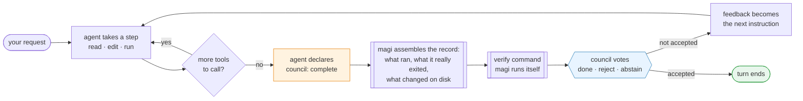
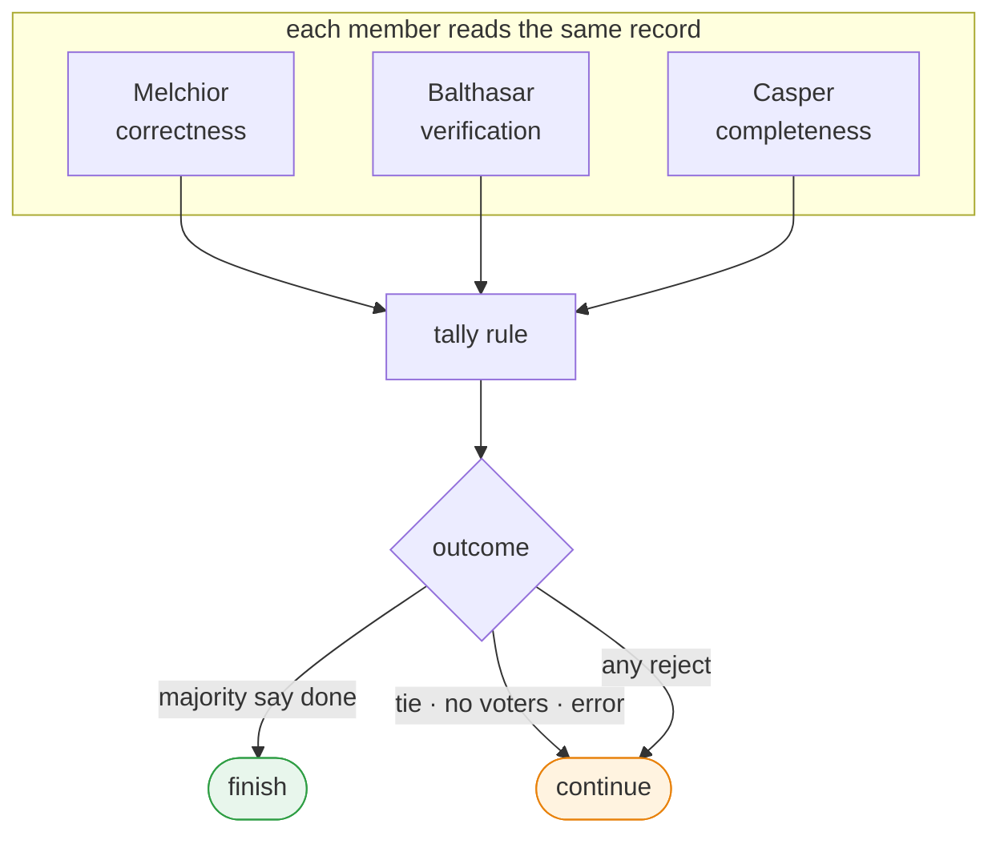
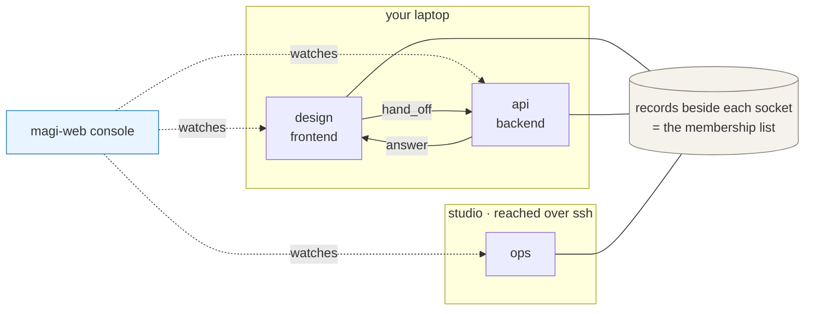
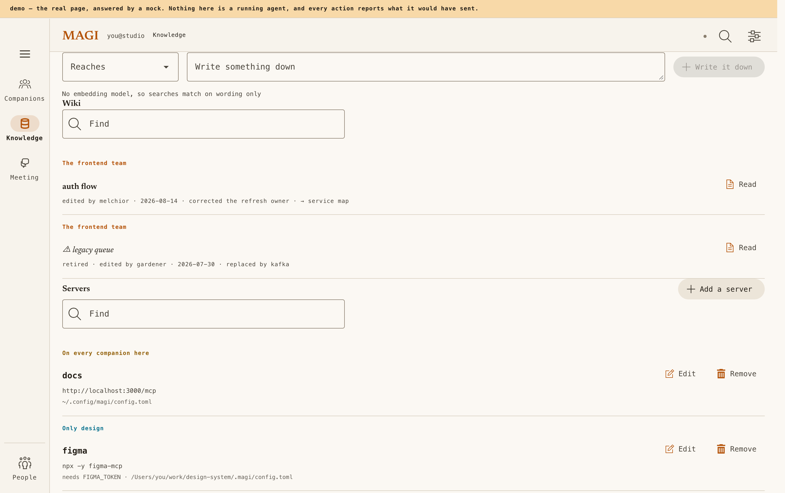
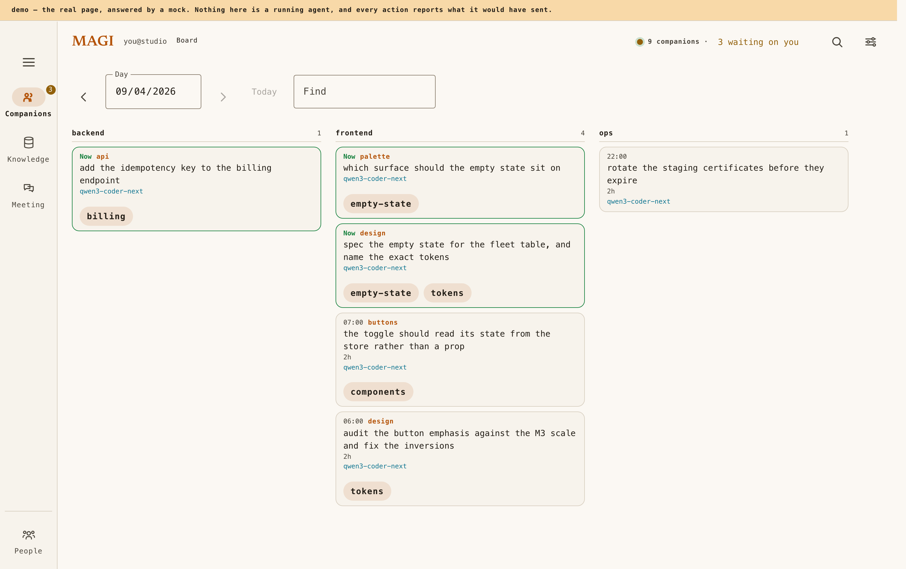
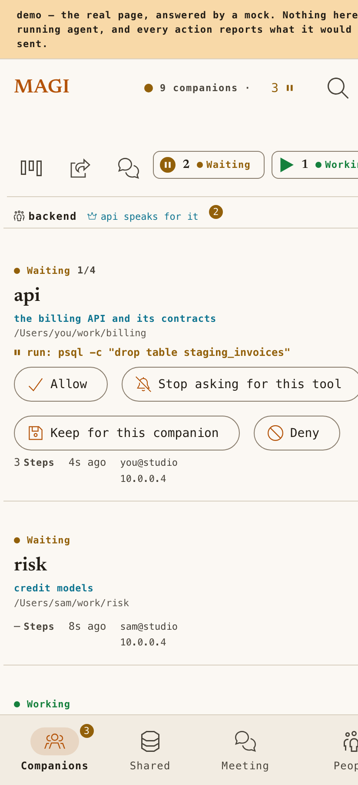
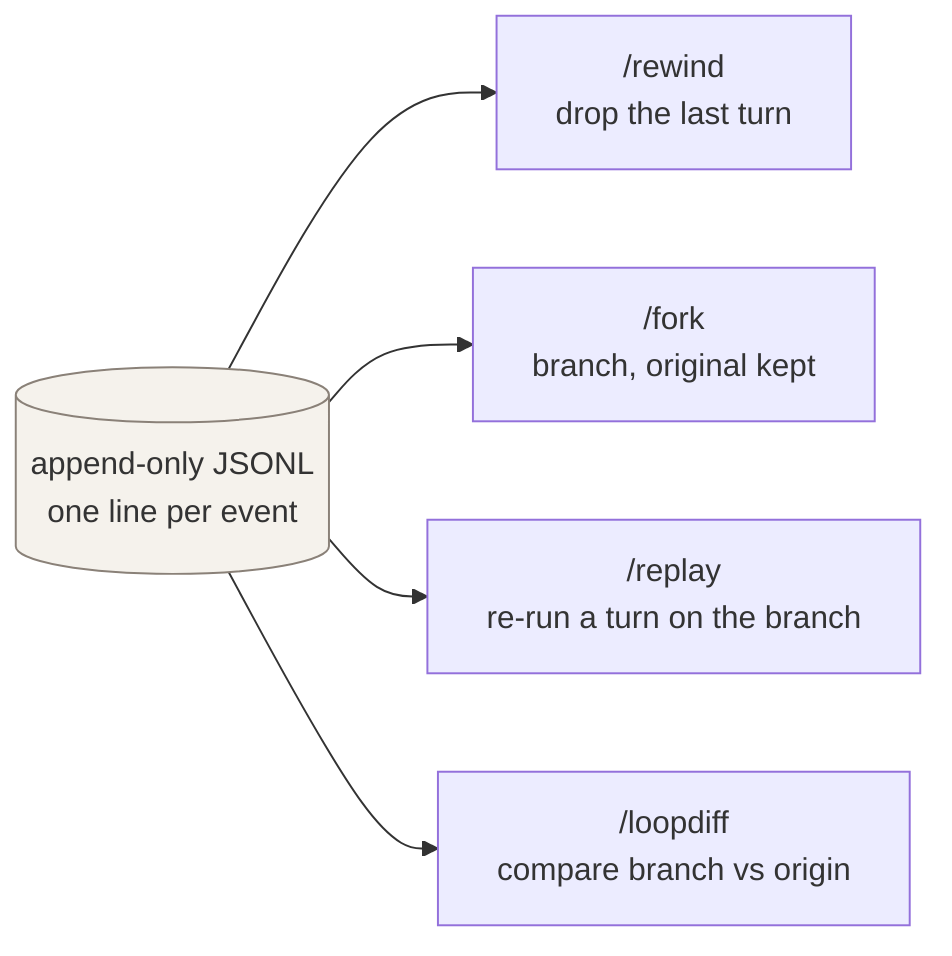
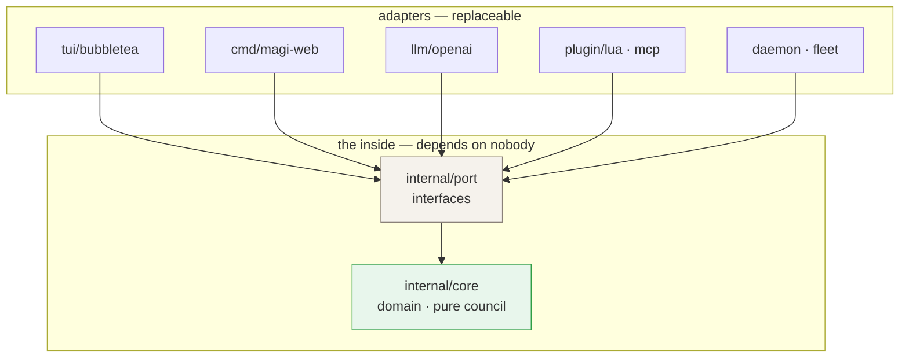

<div align="center">

# magi

### A terminal coding agent that isn't allowed to declare itself finished.

In most agent loops the turn ends when the model stops calling tools. magi ends it differently.
The agent has to *declare* that it is done, and three council members vote on whether the record
backs that up, each reading the turn through a different lens. A verification command that magi
runs itself can refuse a "done" the tests don't support.

[English](README.md) · [한국어](README.ko.md) · [Manual](docs/MANUAL.md) · [Live demo](https://sayaya1090.github.io/magi/)

[](https://github.com/sayaya1090/magi/actions/workflows/ci.yml)
[](https://github.com/sayaya1090/magi/actions/workflows/ci.yml)


</div>

---

## What it looks like

One turn in the terminal: the agent reads, edits, runs the tests, and then the three members vote
on whether that adds up to finished.

<div align="center">

</div>

The same daemons, watched from a browser. Every companion on your machines, what each is doing, and
the ones that need an answer from you:

<div align="center">
<a href="https://sayaya1090.github.io/magi/">
  
</a>

<sub><a href="https://sayaya1090.github.io/magi/">Open the live demo</a>. It is the real page with mocked data; no server needed.</sub>
</div>

---

## The problem this is built around

An agent loop has one hard question: **when is the turn actually finished?**

Leave the answer implicit, so that a turn ends when the model stops calling tools, and a turn
that trailed off mid-thought looks exactly like one that is genuinely done. You get both failure
modes. Agents that stop three quarters of the way through, and agents that never stop at all.

magi makes ending an act that has to be justified:



Here is that gate refusing a finish, which is the case worth showing:

```text
you ▸ add a --dry-run flag to the deploy command

  … agent reads cmd/deploy.go, edits it, runs go build …

  ⚙ council {complete: true}          the agent says it is finished

  ⚖ the council reads the record
     ── WHAT MAGI OBSERVED
        changed: cmd/deploy.go
        ran clean: go build ./...
     ── THE WORKSPACE RIGHT NOW (read just now, not from the record)
        cmd/deploy.go — 4,102 bytes, modified 12s ago

     ● Balthasar [verification]  nothing runs the new flag — `go test ./cmd` was never run
     → not accepted; the agent keeps working

  … agent adds a test, runs go test …

  ⚙ council {complete: true}   →   accepted   ✓ turn over
```

Nothing else in magi is unusual. The rest of it exists so that this one decision has something
solid to stand on: a record of what really happened, a loop you can inspect and replay, and a way
to run and supervise several agents at once.

---

## The council

At the point where the loop would otherwise end, each member votes **done**, **reject** or
**abstain**, and a pure tally function turns those votes into one decision. The three defaults are
named after the MAGI. They differ in one thing only: what each is told to look for.

| Member | Lens | The question it asks |
|---|---|---|
| **Melchior** | `correctness` | Is the work correct? Edge cases, regressions? |
| **Balthasar** | `verification` | Is there evidence it works — did the build and tests run? |
| **Casper** | `completeness` | Did it do everything the task asked for? |



The tally rule is configurable. Whatever you pick, an ambiguous outcome always resolves to
*continue*:

| Rule | Finishes when… |
|---|---|
| `majority` *(default)* | a strict majority of voting members say done; a tie continues |
| `unanimous` | every member says done |
| `quorum:k` | at least *k* members say done |
| `weighted:θ` | the done-weight share meets threshold θ |
| `veto:Name` | a named member can refuse any finish on its own |

A member that errors, times out, or returns something unparseable **abstains** instead of blocking
the gate. A flaky model degrades the vote; it cannot freeze the loop. Rounds are capped, and
no-progress detection stops the council churning on the same objection.

> The tally lives in `internal/core/council` as pure domain code: no I/O, no LLM, unit-tested on
> its own. That separation is what makes "the council decides, not one model" something you can
> test. Otherwise it would be a sentence in a prompt and nothing more.

Asking is separate from declaring. `council{question}` gets the members' reading on something you
are unsure about and ends nothing.

---

## The record the vote is based on

Members don't judge the agent's summary of its work. They judge that report against what magi
itself recorded. magi grants every tool call, so it already knows:

- every command that ran and how it really ended, down to which stage of a pipe failed;
- the agent's own edits this turn, as a per-file before → after diff;
- on a completion claim, a fresh read of the workspace: files modified since the task began,
  background jobs still alive, and any path the record says was written that isn't on disk.

On top of that sits a verification command that the agent has no way to influence:

```toml
[council]
verify = "go test ./..."   # magi runs THIS itself, at the finish gate
```

Its exit code is authoritative. Non-zero refuses the finish whatever the members voted, and they
see the output as magi-run evidence, not as something the agent reported. For `go test` magi goes
further and re-runs it under `-json`, which catches the two usual ways a green suite lies:

- a `TestMain` that runs nothing, so an empty or disabled suite still exits 0;
- a `TestMain` that runs the tests, sees them fail, and calls `os.Exit(0)` anyway.

Either one turns a "done" into *continue*, with the evidence naming what happened. A check written
in advance can be wrong about the work. A record of what was granted cannot be wrong about what
ran.

---

## Running more than one

One magi bound to one workspace is a **companion**. Give it a name and a role in the repo's own
config, and it becomes addressable by what it is for:

```toml
# .magi/config.toml — travels with the repo
[companion]
name = "design"
role = "the design system: component specs and visual review"
team = "frontend"     # optional
```



- **`companions`** lists the others, including what each workspace has learned, which is how a
  specialist becomes visible to the rest.
- **`companion_can`** asks one of them what it can actually do.
- **`hand_off`** gives one a piece of the work and carries on; the request states its purpose and
  the form the answer must take, and the answer lands in your conversation when it is finished. A
  companion does one turn at a time and queues what arrives meanwhile, and how much is queued is
  published in its record, so whoever is choosing can see who is free.
- **Meetings** put several companions on one question, read-only, until each knows what to do.

There is no registry, no gateway and no open port. Every daemon writes a record beside its socket,
and that directory *is* the membership list. Across machines it is the same records, traded over
ssh. Run `magi --join-cluster <host>` once and the daemons keep each other current from then on,
forgetting anyone they haven't seen for an hour. Work crosses the same way, which is why magi opens
no port of its own and holds no credential of its own.

---

## The console

```sh
./magi --daemon      # the engine, no UI — keeps working while nothing is watching
./magi --attach      # attach a terminal UI to this workspace's daemon
./magi --agents      # every magi on this machine, and what each is doing
./magi-web           # the same in a browser at 127.0.0.1:7777
./magi-web -exposed  # behind an authenticating proxy: no shell, no MCP writes, every change logged
```

<div align="center">
<a href="https://sayaya1090.github.io/magi/?d=%2Fdemo%2Fdesign.sock">
  
</a>

<sub>One companion: the live transcript with true exit codes, and a dangerous command waiting for your approval.</sub>
</div>

<table>
<tr>
<td width="50%" valign="top">
<a href="https://sayaya1090.github.io/magi/?d=%2Fdemo%2Fdesign.sock"></a><br>
<b>The workspace, beside the conversation.</b> The file tree and the git state as the companion sees them; open a file and read it with the agent's own line numbers, or edit it in place.
</td>
<td width="50%" valign="top">
<a href="https://sayaya1090.github.io/magi/?v=meet"></a><br>
<b>Meetings.</b> Put several companions on one question until each knows what to do, then send each conclusion out as work.
</td>
</tr>
<tr>
<td width="50%" valign="top">
<a href="https://sayaya1090.github.io/magi/?v=skills"></a><br>
<b>Knowledge.</b> The skills a team has learned and the memories it keeps, each labelled with how far it reaches — this companion, this team, or every companion here.
</td>
<td width="50%" valign="top">
<a href="https://sayaya1090.github.io/magi/?v=skills"></a><br>
<b>A shared wiki.</b> Canonical pages the companions keep current — updated in place, not piled up. A retired page stays readable with the reason it stopped being true.
</td>
</tr>
<tr>
<td width="50%" valign="top">
<a href="https://sayaya1090.github.io/magi/?v=board"></a><br>
<b>Board.</b> A day of work as cards, a column per team, grouped by the label the agent gave each piece.
</td>
<td width="50%" valign="top">
<a href="https://sayaya1090.github.io/magi/"></a><br>
<b>On a phone.</b> The same console, so an approval or an answer doesn't have to wait until you are back at the desk.
</td>
</tr>
</table>

---

## What you get

| | Feature | What it means in practice |
|---|---|---|
| 🗳️ | **Consensus termination** | Three members vote *done / reject / abstain*; a pure, unit-tested rule tallies them. A reject feeds their aggregated feedback back in as the next instruction. |
| 🔒 | **A verify command magi runs itself** | Point `[council] verify` at your test command. A non-zero exit refuses the finish whatever the members voted, and for `go test` magi also catches a disabled suite or a failure masked by a forced `exit 0`. |
| 🧾 | **A record, not a claim** | magi grants every tool call, so it knows which commands ran, their real exit (including which stage of a pipe failed), and which files they wrote — plus a fresh read of the workspace on every "done". |
| 🖥️ | **A console for many agents** | Supervise every companion on your machines from a browser: interrupt, answer a question, approve a command, read what they have learned, and get a push notification when one blocks. |
| ✨ | **Editor completion and prompt suggestion** | Ghost-text completion in the web editor and next-instruction suggestions in both composers, learned from your own past prompts. Each is a thin call on a fast profile you route, so a keystroke never waits on the turn machinery. Turn on *look-over* and the model reads over your shoulder as you edit, anchoring at most three findings to their exact lines. |
| 🔄 | **A fleet that keeps itself current** | Instances trade versions and capabilities over the wire, the console shows each companion's build, and a daemon can update itself: checksum-verified download, a pre-flight with rollback if the new build won't run, then an in-place restart that keeps the conversation. Never across machines, never over your own source builds. |
| 🤝 | **Companions and hand-off** | Give a workspace a name and a role, then address it by what it is. `hand_off` gives a specialist a piece of the work and keeps going; the answer arrives in your conversation when it's done. |
| 🗣️ | **Meetings** | Several companions talk through one question, read-only, until each knows what to do — then the work is handed out. |
| ⏮️ | **An inspectable loop** | Every turn is event-sourced to append-only JSONL, so `/rewind`, `/fork`, `/replay` and `/loopdiff` are ordinary operations rather than features to be built. |
| 📦 | **Self-contained binaries** | Pure Go, CGO-free: the agent and the optional console, each a static binary. Works against [Ollama](https://ollama.com) locally or its free cloud tier, or any OpenAI-compatible endpoint. |

---

## The loop is an object you can open

Every turn is event-sourced to an append-only JSONL log. The four commands below fall out of that
almost for free:



| Command | What it gives you |
|---|---|
| `/loop` | the loop map: turns · steps · council rounds at a glance |
| `/context` | exactly what is filling the context window (usage · compactions) |
| `/rewind` | roll back the last user turn(s) |
| `/fork` | branch the session to try something else, original kept |
| `/replay` | re-run the last turn on a branch |
| `/loopdiff` | compare a branch against the point it forked from |

---

## Quick start

### Requirements

- **Go 1.26+** to build.
- **An OpenAI-compatible LLM backend.** [Ollama](https://ollama.com) is the easy one. The default
  model is `gpt-oss:120b-cloud`, which runs on Ollama's free cloud tier — no GPU, one sign-in:

  ```sh
  ollama signin            # free tier; the default model runs in Ollama's cloud
  ```

  To stay entirely local, pull a model and point magi at it:

  ```sh
  ollama pull qwen3-coder:30b
  ./magi --model qwen3-coder:30b        # or MAGI_MODEL=…
  ```

  > A note on picking a local model: what matters for an agent loop is how fast it produces
  > *tokens*, and that follows the **active** parameter count, not the download size. A 30B
  > mixture-of-experts model with ~3B active runs several times faster than a dense 27B, even
  > though the files are the same size. Very small models (`llama3.1:8b` and friends) tend to emit
  > tool-call JSON even when greeting you, so they are a poor fit whatever their speed.

  Any OpenAI-compatible endpoint works too — vLLM, LiteLLM, hosted APIs. See Configuration.

### Install

```sh
# Pre-built binary
curl -fsSL https://raw.githubusercontent.com/sayaya1090/magi/main/scripts/install.sh | bash

# Homebrew
brew install sayaya1090/tap/magi
```

### Build from source

```sh
make build        # CGO_ENABLED=0, version injected → ./magi
make web          # the browser console → ./magi-web
# or directly:
CGO_ENABLED=0 go build -o magi     ./cmd/magi
CGO_ENABLED=0 go build -o magi-web ./cmd/magi-web
```

Pure Go, no CGo, so each is a self-contained static binary. `magi` is the agent — the TUI and the
daemon; `magi-web` is the optional console. Copy either anywhere and run it.

### Run

```sh
./magi                         # interactive TUI
./magi -p "explain main.go"    # headless, one shot (--output json for a JSONL event stream)
./magi --version               # print version
./magi --update                # update the binary and managed plugins (checksum-verified)
```

In the TUI: **Enter** sends, **Esc** interrupts the running turn, **Ctrl+Q** or `/quit` exits.
Dangerous tools (`write`, `edit`, `bash`) ask first — `y` allow, `a` always, `n` deny. Markdown and
syntax highlighting follow your terminal's dark or light theme. Type `/` for the command palette.

---

## Configuration

A commented `config.toml` is written on first run and never overwritten afterwards. Precedence is
**flags > env > config > defaults**.

| Flag | Env | Default | Purpose |
|---|---|---|---|
| `--model` | `MAGI_MODEL` | `gpt-oss:120b-cloud` | model id (Ollama free cloud tier; `ollama signin`) |
| `--base-url` | `MAGI_BASE_URL` | `http://localhost:11434/v1` | OpenAI-compatible base URL |
| `--permission` | `MAGI_PERMISSION` | TUI `ask` / headless `allow` | `ask` \| `auto` \| `allow` \| `deny` |
| `--output` | — | `text` | `text` \| `json` (headless) |
| — | `MAGI_API_KEY` | *(none)* | key for remote backends (Ollama needs none) |

Named backends let you put cheap models on grunt work and strong ones where it counts. Define a
profile, then point a subagent (`/subagents`), a council member, or the completion helpers at it:

```toml
[llm.profiles.fast]          # ${ENV} is expanded, so keys stay out of the file
base_url = "https://fast.gateway/v1"
api_key  = "${FAST_KEY}"
model    = "gpt-oss:20b"
```

The full reference is in the [Manual](docs/MANUAL.md#3-configuration).

---

## Tools and extending

**Built-in tools:** `read` · `write` · `edit` · `multiedit` · `grep` · `glob` · `list` · `bash`
(timeout · exit code · `background`) · `bash_output` · `bash_input` · `bash_kill` · `wait_for` ·
`port_owner` · `recall_context` · `recall_memory` · `webfetch` · `websearch` · `todowrite` ·
`council` (ask for a reading, or declare finished) · `remember` (shared memory and wiki) · `skill` ·
`companions` · `companion_can` · `hand_off` · `ask_user` and `route_interjection` (interactive only).

After an edit, diagnostic feedback (gofmt, go vet, py_compile, LSP) flows back so the agent can
correct itself. Read-only tools run in parallel within a turn.

- **One agent by default.** magi ships no subagents of its own. If you want one it comes from a
  plugin (`/subagents` switches it on); one example ships, off: **Seele**, a planner with no write
  tools. A plugin's children can run in parallel when they cannot collide — read-only children, or
  writing children that each get their own checkout (`isolated_children`: a git clone per child,
  shell confined to it, work merged back as a commit range only when the caller says so). See
  [EXTENDING](docs/EXTENDING.md).
- **Project memory.** `AGENTS.md` — plus `.magi/AGENTS.md` and a global one — is durable context
  that survives compaction.
- **Context-aware compaction.** Past roughly 80% of the model's window, older turns are summarized
  while recent ones are kept; a `ctx 42%` meter sits in the header.
- **Shared experience.** A git-backed store of skills, memories and wiki pages the team shares; the
  `remember` tool writes to it and `recall_memory` reads from it.
- **Lua plugins.** Drop a `plugin.toml` and `init.lua` into `<config>/plugins/`; auto-loaded,
  hot-reloaded, sandboxed. See [plugins/examples/wordcount](plugins/examples/wordcount).
- **MCP servers.** Declare them in `config.toml` and their tools register at startup.
- **Unattended work.** `schedule` and `[cron]` run jobs while nothing is watching.

---

## Architecture

magi is ports and adapters: the core domain knows nothing about the UI, the LLM or plugins, and the
dependency direction always points inward.



```
cmd/magi            entrypoint (wiring)
cmd/magi-web        the console — a read-mostly web view over the same daemons
internal/core       domain — depends on no adapter (including the pure council)
internal/port       ports (interfaces) — LLM, Store, Council, PluginHost …
internal/adapter    adapters — llm/openai · tui/bubbletea · plugin/lua · mcp · council/llm ·
                    daemon (the engine over a socket) · fleet (what every magi is doing)
plugins/examples    example Lua plugins
docs                ARCHITECTURE · DESIGN · SPEC · MANUAL · UI · EXTENDING · DIAGRAMS
```

| Choice | Why |
|---|---|
| **Go** | one static binary, trivial cross-compilation, easy self-update, goroutine concurrency |
| **Bubble Tea (Charm)** | the standard for polished TUIs; markdown and code rendering out of the box |
| **Lua (gopher-lua)** | a pure-Go embed, so the build stays CGo-free; hot-reload and sandboxing come naturally |
| **Event-sourced JSONL** | an observable, replayable, forkable loop |
| **OpenAI-compatible LLM** | one protocol adapter reaches local (Ollama, vLLM) and hosted endpoints alike |

Further reading: [ARCHITECTURE](docs/ARCHITECTURE.md) · [UI](docs/UI.md) · [DESIGN](docs/DESIGN.md) ·
[EXTENDING](docs/EXTENDING.md) · [SPEC](docs/SPEC.md) · [DIAGRAMS](docs/DIAGRAMS.md).
Korean editions sit beside each one (`*.ko.md`).

---

## License

**Apache-2.0** — see [LICENSE](LICENSE). When reusing third-party code, keep the `NOTICE` and
`THIRD_PARTY_LICENSES` files intact.
