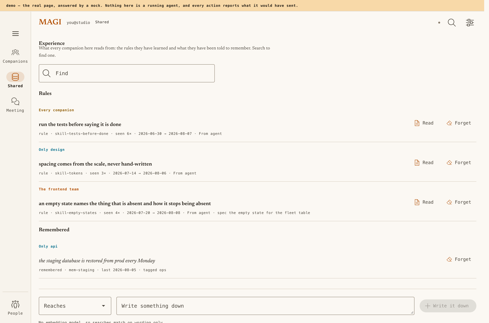

<div align="center">

# magi

### A terminal AI coding agent that doesn't decide it's done on its own.

Most agents let a single model call its own work finished — so they stop early, or churn forever.
**magi puts the decision to a vote.** Three specialists, each with a different lens, read what
*actually* happened and only let the turn end when they agree — and a verification command **magi
runs itself** can veto a "done" the tests don't back up.

[English](README.md) · [한국어](README.ko.md) · [Manual](docs/MANUAL.md) · [Live demo](https://sayaya1090.github.io/magi/)

[](https://github.com/sayaya1090/magi/actions/workflows/ci.yml)
[](https://github.com/sayaya1090/magi/actions/workflows/ci.yml)


</div>

---

<div align="center">

### Run one in your terminal. Watch a whole team of them from your browser.

<a href="https://sayaya1090.github.io/magi/">
  
</a>

*The console — every magi on your machines, what each is doing, and the two that need you.
[Try the live demo →](https://sayaya1090.github.io/magi/) (the real page, mocked data, no server.)*

</div>

---

## The one idea

An agent loop has exactly one hard question: **when is the turn actually finished?**

Leave it implicit — the turn ends when the model stops calling tools — and a turn that trailed off
mid-thought looks identical to one that is genuinely done. magi makes ending an **act**: the agent
*declares* it, and a council reads the record of what happened before the turn is allowed to close.

```text
you ▸ add a --dry-run flag to the deploy command

  … agent reads cmd/deploy.go, edits it, runs go build …

  ⚙ council {complete: true}          the agent says it is finished

  ⚖ the council reads the record
     ── WHAT MAGI OBSERVED
        changed: cmd/deploy.go
        ran clean: go build ./...
     ── THE WORKSPACE RIGHT NOW (read just now, not from the record)
        cmd/deploy.go — 4,102 bytes, modified 12s ago

     ● Balthasar [verification]  nothing runs the new flag — `go test ./cmd` was never run
     → not accepted yet; the agent keeps working

  … agent adds a test, runs go test …

  ⚙ council {complete: true}   →   accepted   ✓ turn over
```

The decision to stop is taken away from any single model and given to a **consensus council**. That
one change is the project's whole reason to exist; everything else is built to make that loop
**observable, steerable, and reproducible** — and to let you run and supervise many of them at once.

---

## What you get

|  | Feature | What it means |
|---|---|---|
| 🗳️ | **Consensus termination** | Three members vote *done / reject / abstain*; a pure, unit-tested rule tallies them. A `reject` feeds their aggregated feedback back in as the next instruction. |
| 🔒 | **A verify command magi runs itself** | Point `[council] verify` at your test command. magi runs it at the finish gate — a non-zero exit **refuses** the finish whatever the members voted. For `go test` it even catches a suite disabled or a failure masked behind a forced `exit 0`. |
| 🧾 | **A record, not a claim** | magi grants every tool call, so it knows which commands ran, their *real* exit (including which stage of a pipe failed), and which files they wrote — plus a fresh read of the workspace on every "done". |
| 🖥️ | **A web console for many agents** | Supervise every companion on your machines from a browser: interrupt, answer a question, approve a command, read what they've learned, get pinged on your phone when one blocks. |
| ✨ | **Editor completion & prompt suggestion** | Inline ghost-text code completion in the web editor, and next-instruction suggestions in both composers (web + TUI) learned from your own past prompts. Each is a thin, no-council call on a **fast profile you route** — a keystroke never waits on the turn machinery — and the file you're editing rides into the agent's context. Opt in to **look-over** and the model reads over your shoulder as you edit, anchoring at most three findings to their exact lines, in your language. |
| 🔄 | **A fleet that keeps itself current** | Instances handshake versions and capabilities over the wire, the console shows each companion's build, and a daemon updates itself: checksum-verified download, a pre-flight with **rollback** if the new build won't run, then an in-place restart that keeps the same conversation. Automatic (toggleable) or one button — and never across machines, never on your own source builds. |
| 🤝 | **Companions & hand-off** | Give a workspace a name and a role; address it by what it *is*. `hand_off` gives a specialist a piece of the work and keeps going — the answer arrives in your conversation when it's done. |
| 🗣️ | **Meetings** | Several companions talk through one question, read-only, until each knows what to do — then the work is handed out. |
| ⏮️ | **An inspectable loop** | Every turn is event-sourced to append-only JSONL, so you can `/rewind`, `/fork`, `/replay`, and `/loopdiff` — the loop is a real object, not a black box. |
| 📦 | **Self-contained binaries** | Pure Go, CGO-free — the agent, plus an optional browser console, each a static binary. Local-first on [Ollama](https://ollama.com)'s free cloud tier — no GPU, `ollama signin` once — or any OpenAI-compatible endpoint. |

---

## The council

At the moment the loop would naturally end, a council of members votes **done**, **reject**, or
**abstain**, and a pure consensus rule turns those votes into one decision. The three default
members — the **MAGI** — each judge through a different lens:

| Member | Lens | Asks |
|---|---|---|
| **Melchior** | `correctness` | Is the work correct? Edge cases, regressions? |
| **Balthasar** | `verification` | Is there *evidence* it works — do build/tests pass? No claims on faith. |
| **Casper** | `completeness` | Did it do everything the task asked? Nothing left unfinished? |

**Consensus, not a single judge.** The tally rule is configurable:

| Rule | Finishes when… |
|---|---|
| `majority` *(default)* | a strict majority of voting members say done (a tie continues) |
| `unanimous` | every member says done |
| `quorum:k` | at least *k* members say done |
| `weighted:θ` | the done-weight share meets threshold θ |
| `veto:Name` | a named member can veto any finish |

**Built so it can never trap or rubber-stamp the loop:** a tie, an unmet quorum, no voters, or an
error all resolve to *continue* — it finishes only on affirmative agreement, never on ambiguity.
No-progress detection stops it churning, rounds are capped, and a member that errors or returns
garbage **abstains** rather than blocking the gate.

> The consensus logic lives in `internal/core/council` as **pure domain code** — no I/O, no LLM.
> That separation is what lets *"the council decides, not one model"* be a tested invariant instead
> of a hopeful prompt.

---

## The record — and a check the agent can't fake

Members don't judge on vibes. They judge the agent's *report* against the *task* on what **magi
itself recorded**: every command it granted and how that command really ended, the agent's own edits
this turn as a per-file before→after diff, and — on a completion claim — a fresh read of the
workspace (files modified since the task began, background jobs still alive, any path the record says
was written that isn't on disk).

On top of that record sits a **fixed verification harness the agent cannot subvert**:

```toml
[council]
verify = "go test ./..."   # magi runs THIS itself at the finish gate
```

Its exit code is authoritative. A non-zero exit **refuses** the finish whatever the members voted,
and its output is shown to them as magi-run evidence rather than the agent's self-report. For a
`go test` command magi goes further and re-runs it under `-json`, so the two classic ways to fake a
green suite are both caught:

- a `TestMain` that **runs nothing** (an empty/disabled suite that still exits 0), and
- a `TestMain` that runs the tests, sees them fail, and **forces `os.Exit(0)`** over the failure.

Either one turns a "done" vote into *continue*, with evidence naming the failure. A check written in
advance can be wrong about the work; a record of what was granted cannot be wrong about what ran.

Asking is separate from declaring: `council{question}` gets the members' reading on something you're
unsure of, and it ends nothing.

---

## The console — and a team of companions

<div align="center">
<a href="https://sayaya1090.github.io/magi/">
  
</a>

*One companion's page: the live transcript with true exit codes, and a dangerous command held for your approval.*
</div>

<table>
<tr>
<td width="50%" valign="top"><a href="https://sayaya1090.github.io/magi/?v=meet"></a><br><b>Meetings.</b> Put several companions on one question until each knows what to do.</td>
<td width="50%" valign="top"><a href="https://sayaya1090.github.io/magi/?v=board"></a><br><b>Board.</b> A day of work as cards, a column per team, grouped by label.</td>
</tr>
<tr>
<td width="50%" valign="top"><a href="https://sayaya1090.github.io/magi/?v=skills"></a><br><b>Shared brain.</b> The rules the team has learned and the facts they remember — each scoped to who it reaches.</td>
<td width="50%" valign="top"><a href="https://sayaya1090.github.io/magi/"></a><br><b>On your phone.</b> The same console, so you can approve or answer from anywhere.</td>
</tr>
</table>

One magi bound to one workspace is a **companion**. Give it a name and a role and it becomes
addressable by what it is *for*:

```toml
# .magi/config.toml — travels with the repo
[companion]
name = "design"
role = "the design system: component specs and visual review"
team = "frontend"     # optional
```

- **`companions`** lists the others — including what each workspace has *learned*, which is how a
  specialist becomes visible.
- **`companion_can`** asks one of them what it can actually do.
- **`hand_off`** gives it a piece of the work and keeps going; the request carries its purpose and
  the **form** the answer must come back in, and the answer lands in your conversation when it
  finishes. A companion does **one turn at a time** and **queues** what arrives meanwhile — how much
  is queued rides in its published record, so whoever is choosing can see who is free.
- **Meetings** put several companions on one question until each knows what to do.

**No registry, no gateway, no open port.** Every daemon publishes a record beside its socket, and
that directory *is* the membership. Across machines it's the same records, traded over **ssh** —
`magi --join-cluster <host>` once, then the daemons keep each other current and forget anyone they
haven't seen for an hour. Work crosses the same way, so magi opens no port of its own and holds no
credential of its own.

Watch it all from your terminal, or from the browser:

```sh
./magi --daemon                # the engine with no UI — keeps working while nothing watches
./magi --attach                # attach a terminal UI to this workspace's daemon
./magi --agents                # every magi on this machine, and what each is doing
./magi-web                     # the same in a browser (127.0.0.1:7777) — interrupt, answer,
                               # read what they've learned, be pinged on your phone when one blocks
./magi-web -exposed            # behind an authenticating proxy: no shell, no MCP writes, every change logged
```

---

## The loop is a first-class object

Not a black box between you and the model — a thing you can inspect, branch, and replay.

| Command | What it gives you |
|---|---|
| `/loop` | the loop map — turns · steps · council rounds at a glance |
| `/context` | exactly what's filling the context window (usage · compactions) |
| `/rewind` | roll back the last user turn(s) |
| `/fork` | branch the session to try an alternative, original kept |
| `/replay` | re-run the last turn on a branch |
| `/loopdiff` | compare a branch against its fork origin |

Every turn is **event-sourced** to an append-only JSONL log — which is exactly what makes rewind,
fork, and replay possible. The loop is observable and reproducible, not ephemeral.

---

## Quick start

### Requirements

- **Go 1.26+** (to build).
- **An OpenAI-compatible LLM backend.** [Ollama](https://ollama.com) is recommended. The default
  model is **`gpt-oss:120b-cloud`**, a strong model on Ollama's **free cloud tier** — no GPU, just
  sign in once:
  ```sh
  ollama signin                   # free tier; the default gpt-oss:120b-cloud runs in Ollama's cloud
  ```
  Prefer to run **fully local**? Pull a model and point magi at it:
  ```sh
  ollama pull qwen3-coder:30b
  ./magi --model qwen3-coder:30b  # strongest local coder (~24 GB GPU); or MAGI_MODEL=…
  ```
  > Any OpenAI-compatible endpoint works (vLLM, LiteLLM, hosted APIs) — see Configuration. Very
  > small models (e.g. `llama3.1:8b`) tend to emit tool-call JSON even when greeting you, so they're
  > a poor fit.

### Install

```sh
# Pre-built binary
curl -fsSL https://raw.githubusercontent.com/sayaya1090/magi/main/scripts/install.sh | bash

# Homebrew
brew install sayaya1090/tap/magi
```

### Build from source

```sh
make build        # CGO_ENABLED=0, version injected → ./magi
make web          # the browser console → ./magi-web
# or, directly:
CGO_ENABLED=0 go build -o magi     ./cmd/magi
CGO_ENABLED=0 go build -o magi-web ./cmd/magi-web
```

Pure Go, no CGo — each is a self-contained static binary. `magi` is the agent
(the TUI and the daemon); `magi-web` is the optional browser console. Copy either
anywhere and run.

### Run

```sh
./magi                         # interactive TUI
./magi -p "explain main.go"    # headless, one-shot (add --output json for a JSONL event stream)
./magi --version               # print version
./magi --update                # update the binary AND managed plugins (checksum-verified)
```

**In the TUI:** **Enter** sends · **Esc** interrupts the running turn · **Ctrl+Q** / `/quit` exits.
Dangerous tools (`write`/`edit`/`bash`) ask before they run (`y` allow · `a` always · `n` deny).
Markdown and syntax highlighting adapt to dark/light terminals automatically. Type `/` for an
autocompleting command palette.

---

## Configuration

A commented `config.toml` is generated on first run (and never clobbered after). Precedence is
**flags > env > config > defaults**.

| Flag | Env | Default | Purpose |
|---|---|---|---|
| `--model` | `MAGI_MODEL` | `gpt-oss:120b-cloud` | model id (Ollama free cloud tier; `ollama signin`) |
| `--base-url` | `MAGI_BASE_URL` | `http://localhost:11434/v1` | OpenAI-compatible base URL |
| `--permission` | `MAGI_PERMISSION` | TUI `ask` / headless `allow` | `ask` \| `auto` \| `allow` \| `deny` |
| `--output` | — | `text` | `text` \| `json` (headless) |
| — | `MAGI_API_KEY` | *(none)* | key for remote backends (Ollama needs none) |

**Named backends** — cheap models for grunt work, strong ones where it counts. Define a profile,
then point a subagent (`/subagents`), a council member, or the completion helpers at it:

```toml
[llm.profiles.fast]          # named backends; ${ENV} is expanded
base_url = "https://fast.gateway/v1"
api_key  = "${FAST_KEY}"
model    = "gpt-oss:20b"
```

Full reference in the [Manual](docs/MANUAL.md#3-configuration).

---

## Tools & extending

**Built-in tools:** `read` · `write` · `edit` · `multiedit` · `grep` · `glob` · `list` · `bash`
(timeout · exit code · `background`) · `bash_output` · `bash_input` · `bash_kill` · `wait_for` ·
`port_owner` · `recall_context` · `recall_memory` · `webfetch` · `websearch` · `todowrite` ·
`council` (ask for a reading, or declare finished) · `remember` (shared memory) · `skill` ·
`companions` · `companion_can` · `hand_off` · `ask_user` and `route_interjection` (interactive only).

After an edit, **diagnostic feedback** (gofmt / go vet / py_compile / LSP) flows back so the agent
self-corrects. Read-only tools run in parallel within a turn.

- **One agent by default.** magi ships no subagents of its own; a subagent, if you want one, comes
  from a plugin (`/subagents` switches it on). One example ships, off: **Seele**, a planner with no
  write tools. A plugin's children can run **in parallel** when they cannot collide — read-only
  children, or writing children that each get their **own checkout** (`isolated_children`: a git
  clone per child, shell confined to it, work merged back as a commit range only when the caller
  says so). See [EXTENDING](docs/EXTENDING.md).
- **Project memory** — `AGENTS.md` (plus `.magi/AGENTS.md` and a global one) is durable context that
  *survives compaction*.
- **Context-aware auto-compaction** — past ~80% of the model window, older turns are summarized while
  recent ones are kept; a `ctx 42%` meter sits in the header.
- **Shared experience** — a git-backed memory/skill store the team can share; the `remember` tool
  feeds a review queue.
- **Lua plugins** — drop a `plugin.toml` + `init.lua` into `<config>/plugins/`; auto-loaded,
  hot-reloaded, sandboxed. See [plugins/examples/wordcount](plugins/examples/wordcount).
- **MCP servers** — declare them in `config.toml` and their tools register at startup.
- **Unattended work** — `schedule` / `[cron]` run jobs while nothing is watching.

---

## Architecture

magi is **ports & adapters (hexagonal)**: the core domain knows nothing about the UI, the LLM, or
plugins — adapters plug into it, and the dependency direction is always inward.

```
cmd/magi            entrypoint (wiring)
cmd/magi-web        the console — a read-mostly web view over the same daemons
internal/core       domain — depends on no adapter (incl. the pure council)
internal/port       ports (interfaces) — LLM, Store, Council, PluginHost …
internal/adapter    adapters — llm/openai · tui/bubbletea · plugin/lua · mcp · council/llm ·
                    daemon (the engine over a socket) · fleet (what every magi is doing)
plugins/examples    example Lua plugins
docs                ARCHITECTURE · DESIGN · SPEC · MANUAL · UI · EXTENDING · DIAGRAMS
```

| Choice | Why |
|---|---|
| **Go** | one static binary, trivial cross-compile, easy self-update, goroutine concurrency |
| **Bubble Tea (Charm)** | the standard for polished TUIs; markdown/code rendering turnkey |
| **Lua (gopher-lua)** | pure-Go embed (keeps the CGo-free build), natural hot-reload + sandbox |
| **Event-sourced JSONL** | an observable, replayable, fork-able loop |
| **OpenAI-compatible LLM** | one protocol adapter → local (Ollama/vLLM) or any hosted endpoint |

Deeper reading: [ARCHITECTURE](docs/ARCHITECTURE.md) · [UI](docs/UI.md) · [DESIGN](docs/DESIGN.md) ·
[EXTENDING](docs/EXTENDING.md) · [SPEC](docs/SPEC.md) · [DIAGRAMS](docs/DIAGRAMS.md).
Korean editions live beside each (`*.ko.md`).

---

## License

**Apache-2.0** — see [LICENSE](LICENSE). When reusing third-party code, keep the `NOTICE` and
`THIRD_PARTY_LICENSES` files intact.
