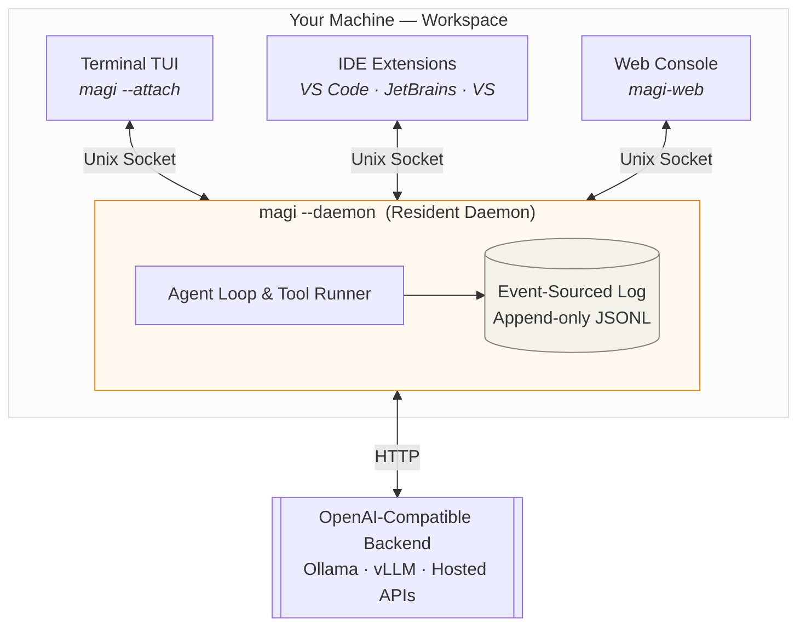
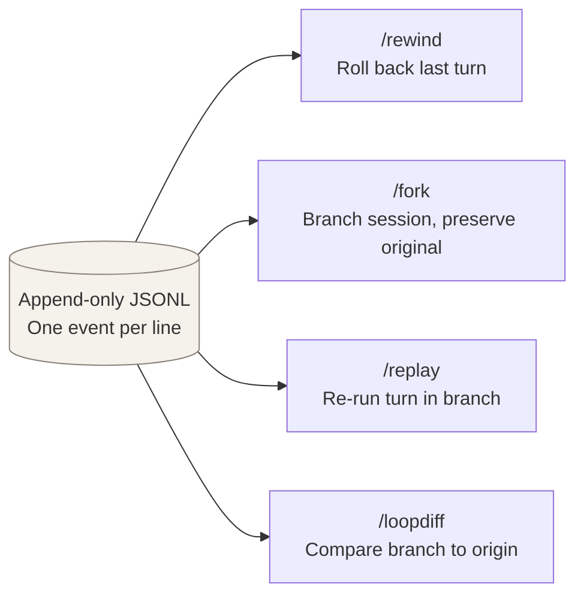
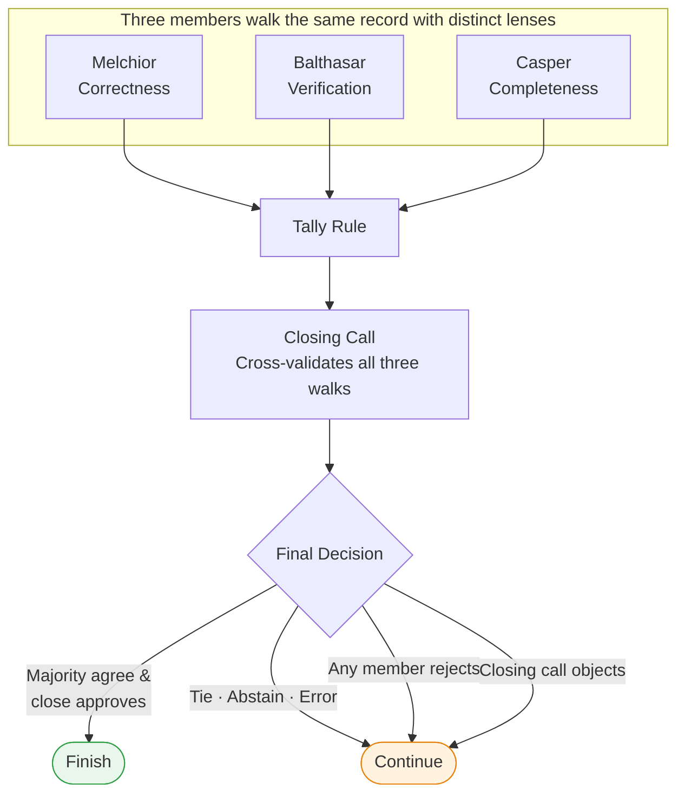
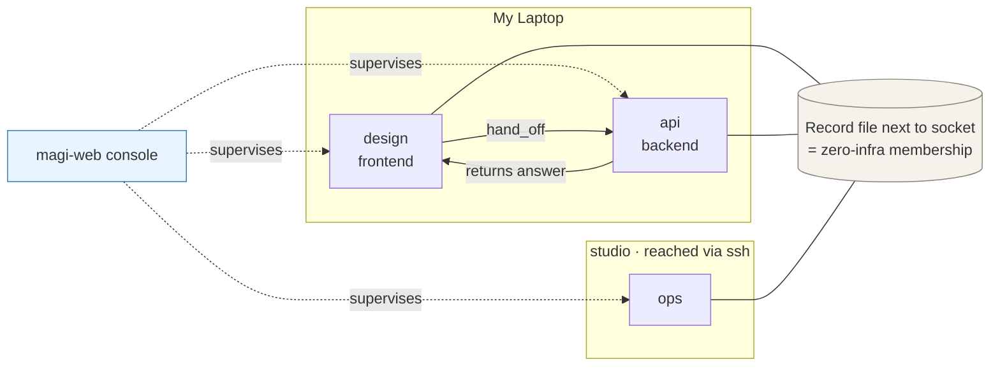
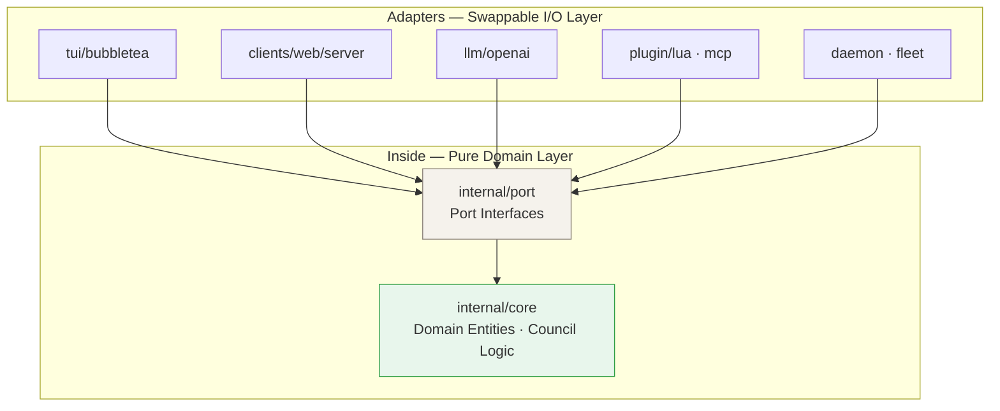

<div align="center">

# magi

### A persistent coding agent that never drops work when you close the window or switch tools

**A single-binary Go AI coding agent**. Runs as an independent resident daemon per workspace, allowing terminal TUIs, web consoles, and IDEs (VS Code, JetBrains, Visual Studio) to attach and detach seamlessly over local sockets.
Every turn and decision is event-sourced into an append-only JSONL log—making `/rewind` and `/fork` natural operations—while a 3-member council consensus gate prevents premature and unverified completion.

[English](README.md) · [한국어](README.ko.md) · [Manual](docs/MANUAL.md) · [Site](https://sayaya1090.github.io/magi/) · [Live demo](https://sayaya1090.github.io/magi/demo/)

[](https://github.com/sayaya1090/magi/actions/workflows/ci.yml)
[](https://github.com/sayaya1090/magi/actions/workflows/ci.yml)


</div>

---

## ⚡ Quick Start

### Installation

```sh
# Pre-built binary (macOS / Linux)
curl -fsSL https://raw.githubusercontent.com/sayaya1090/magi/main/scripts/install.sh | bash

# Or via Homebrew
brew install sayaya1090/tap/magi

# Build from source (Requires Go 1.26+, no CGO)
git clone https://github.com/sayaya1090/magi.git && cd magi && make build
```

### Running

Works with any OpenAI-compatible endpoint. Out-of-the-box support for [Ollama](https://ollama.com) (free cloud tier or local models):

```sh
# Start interactive terminal TUI
./magi

# Specify a model (local or remote)
./magi --model qwen3-coder:30b

# Run as a background resident daemon (persists even if window closes)
./magi --daemon --detach

# Attach terminal TUI to running daemon (attach/detach freely)
./magi --attach

# Open web console in browser (127.0.0.1:7777)
./magi-web
```

---

## 🌟 Why magi?



### 1. 🖥️ Resident Daemon — Work Never Dies on Window Close
With most coding agents, closing the terminal window immediately destroys ongoing work and conversation context. magi decouples the agent engine into an **independent resident daemon per workspace**:
- **Attach from anywhere**: Connect seamlessly via terminal TUI, web console, VS Code, or JetBrains plugins, and detach at any time without disturbing the agent.
- **Long-running stability**: Kick off heavy builds or lengthy test suites and shut your IDE. The daemon continues working quietly in the background.

### 2. ⏪ State is the Log — Event-Sourced Time Travel
Every turn, decision, and tool execution is recorded as an immutable event in an append-only JSONL file.
- **`/rewind` (step back the last turn)**, **`/fork` (branch session for alternate approaches)**, and **`/replay`** are lightweight, native operations that manipulate line pointers rather than managing complex database states.
- If a process unexpectedly crashes, replay guarantees instant recovery to the exact prior state within a single second.

### 3. ⚖️ 3-Member Council — Gate Against Premature Completion
A turn is not finished simply because a model stopped emitting tool calls. magi requires the agent to explicitly declare completion via `council{complete: true}`, after which three distinct council members verify the claim against ground truth:
- **Melchior (Correctness)**: Verifies exact adherence to task requirements, literal values, and stated constraints.
- **Balthasar (Verification)**: Confirms that code actually compiles, runs, and passes tests through concrete execution output.
- **Casper (Completeness)**: Ensures no edge cases, secondary instructions, or subtle details were overlooked.
> On rejection, council feedback directly forms the prompt for the next turn, breaking unproductive loops.

### 4. 🌐 Zero-Infra Fleet & Companions
- Requires no central coordinator server or complex port forwarding: daemons discover each other purely through record files written beside local Unix sockets.
- Crosses machines using existing SSH channels without opening external listening ports.
- **`hand_off`**: Asynchronously delegates sub-tasks to specialized companions in other workspaces while your own turn proceeds without interruption.

---

## 📸 What It Looks Like

<div align="center">

<p><sub>Terminal TUI: Real-time tool output and council member voting breakdown</sub></p>
</div>

<div align="center">
<a href="https://sayaya1090.github.io/magi/demo/">
  
</a>
<p><sub>Web Console (<a href="https://sayaya1090.github.io/magi/demo/">Live Demo</a>): Monitor all companions and active tasks across workspaces</sub></p>
</div>

<div align="center">
<a href="https://sayaya1090.github.io/magi/demo/?d=%2Fdemo%2Fdesign.sock">
  
</a>
<p><sub>Companion Detail: Live transcript with real exit codes and approval controls for risky actions</sub></p>
</div>

<table>
<tr>
<td width="50%" valign="top">
<a href="https://sayaya1090.github.io/magi/demo/?d=%2Fdemo%2Fdesign.sock"></a><br>
<b>Workspace beside chat.</b> Real-time file tree and git status exactly as seen by the companion. Edit files directly in-place.
</td>
<td width="50%" valign="top">
<a href="https://sayaya1090.github.io/magi/demo/?v=meet"></a><br>
<b>Meetings.</b> Bring multiple companions together around a single question to coordinate tasks and divide work.
</td>
</tr>
<tr>
<td width="50%" valign="top">
<a href="https://sayaya1090.github.io/magi/demo/?v=skills"></a><br>
<b>Knowledge.</b> Manage skills and memories learned by teams, scoped to companion, team, or entire fleet.
</td>
<td width="50%" valign="top">
<a href="https://sayaya1090.github.io/magi/demo/?v=skills"></a><br>
<b>Shared Wiki.</b> Canonical documentation maintained in-place by companions, preserving historical changes and retired pages.
</td>
</tr>
<tr>
<td width="50%" valign="top">
<a href="https://sayaya1090.github.io/magi/demo/?v=board"></a><br>
<b>Board.</b> Daily work organized into task cards grouped by team column and companion-assigned labels.
</td>
<td width="50%" valign="top">
<a href="https://sayaya1090.github.io/magi/demo/"></a><br>
<b>Mobile ready.</b> Review notifications, answer prompts, and grant permissions from your phone away from the desk.
</td>
</tr>
</table>

---

## ⏪ Inspectable & Replayable Loop

Every turn is event-sourced into an append-only JSONL log. Without a complex database, these commands operate as fast, reliable native actions:



| Command | What it provides |
|---|---|
| `/loop` | Visual loop map — turns, steps, and council rounds at a glance |
| `/context` | Token breakdown and compression status of the active context window |
| `/rewind` | Undoes the last user turn(s) cleanly to restart from an earlier state |
| `/fork` | Branches current session to explore alternative paths while preserving origin |
| `/replay` | Re-executes the last turn inside a branched session |
| `/loopdiff` | Diffs the state of a branch against the point it diverged from |

---

## ⚖️ The Council & Verification Gate

When the agent declares completion, three members walk the actual execution log through distinct evaluation lenses.



| Member | Lens | Primary Route |
|---|---|---|
| **Melchior** | `correctness` | Task's literal requirements: exact values, names, schema constraints |
| **Balthasar** | `verification` | Real execution output: did builds succeed and tests actually pass? |
| **Casper** | `completeness` | Thoroughness: checks all subtle requirements and edge cases |

### Tally Rules

| Rule | When it finishes |
|---|---|
| `majority` *(default)* | Strict majority of voting members say done; a tie continues |
| `unanimous` | Every member must vote done |
| `quorum:k` | At least *k* members must vote done |
| `weighted:θ` | Proportion of done weight reaches threshold θ |
| `veto:Name` | Named member can unilaterally refuse completion |

- **Ground truth over claims**: Judges only against recorded command outputs, exit codes, and before/after file diffs—never against the agent's self-reported summary.
- **Walk before verdict**: Members must fill in requirement rows settled by verbatim tool output (`SATISFIED` / `UNSATISFIED` / `NO-EVIDENCE`) before they are permitted to emit a final verdict.
- **One-way verification clamp**: The closing call can demote a `done` decision to `continue`, but can never overturn a `continue` into `done`.

---

## 🤝 Multi-Agent Collaboration — Companions & Fleet


A magi instance bound to a workspace is called a **companion**. Declare its role in `.magi/config.toml` to collaborate across repositories:

```toml
# .magi/config.toml — committed to the repository and shared
[companion]
name = "design"
role = "Design system: component specs and visual review"
team = "frontend"
```



- **`companions`**: Lists all known companions in the cluster along with skills each has acquired.
- **`companion_can`**: Queries a specific companion for its detailed capabilities and supported operations.
- **`hand_off`**: Delegates a sub-task asynchronously to a specialized companion while current work continues.
- **Zero-infrastructure discovery**: No registry daemon or port opening required; membership is discovered via filesystem records adjacent to local Unix sockets and propagated over SSH.

---

## 🛠️ Configuration

On first run, a documented `config.toml` is created. Precedence is **CLI flag > Environment variable > Config file > Default**:

| Flag | Environment Variable | Default | Purpose |
|---|---|---|---|
| `--model` | `MAGI_MODEL` | `gpt-oss:120b-cloud` | Model ID (Ollama cloud tier or local model) |
| `--base-url` | `MAGI_BASE_URL` | `http://localhost:11434/v1` | OpenAI-compatible endpoint URL |
| `--permission` | `MAGI_PERMISSION` | TUI `ask` / Headless `allow` | Tool permission policy (`ask` \| `auto` \| `allow` \| `deny`) |
| `--output` | — | `text` | Headless output format (`text` \| `json`) |
| — | `MAGI_API_KEY` | *(empty)* | API key for remote providers (not needed for local Ollama) |

Map specific models to subagents, council members, or auto-completion helpers:

```toml
[llm.profiles.fast]
base_url = "https://fast.gateway/v1"
api_key  = "${FAST_KEY}"
model    = "gpt-oss:20b"
```

See [Manual](docs/MANUAL.md#3-configuration) for complete configuration options.

---

## 🧰 Tools & Extensions

- **Core tools**: `read`, `write`, `edit`, `multiedit`, `grep`, `glob`, `list`, `bash` (supports background jobs, piping, and stdin/out), `wait_for`, `webfetch`, `websearch`.
- **Council & Collaboration**: `council` (request guidance or declare turn complete), `companions`, `companion_can`, `hand_off`, `ask_user`.
- **Memory & Wiki**: `remember`, `recall_memory`, `recall_context`.
- **Lua Plugins**: Drop `plugin.toml` and `init.lua` into `<config>/plugins/` for sandboxed, hot-reloading extensions.
- **MCP (Model Context Protocol)**: Connect external MCP servers declared directly in `config.toml`.
- **Background Scheduling**: Automated cron and scheduled jobs via `schedule` and `[cron]`.

---

## 🏗️ Architecture

magi follows a clean hexagonal (Ports & Adapters) architecture. The core domain contains zero dependencies on UI frameworks, LLM adapters, or plugin systems:



```
cmd/magi            Entrypoint and runtime wiring
clients/web/server  Web console server (communicates with daemons over socket)
clients/web/ui      Console front-end UI modules (GWT layout)
internal/core       Pure domain logic (event-sourced session, council rules)
internal/port       Port interface contracts (LLM, Store, Council, etc.)
internal/adapter    Concrete adapters (Bubble Tea TUI, OpenAI LLM, daemon sockets)
plugins/examples    Example Lua plugins
docs                Design specs, architecture, manual, and benchmark guides
```

| Choice | Rationale |
|---|---|
| **Go (Single binary)** | CGO-free static binary, easy cross-compilation, lightweight goroutine concurrency |
| **Bubble Tea** | Standard terminal framework providing robust Markdown and syntax-highlighted rendering |
| **Lua (gopher-lua)** | Pure Go scripting runtime preserving CGO-free builds with safe sandboxing and hot reloads |
| **Event-sourced JSONL** | Full auditability, zero-loss replay, and lightweight branching time-travel |
| **OpenAI Compatible** | Single protocol adapter for Ollama, vLLM, and all standard hosted model providers |

For in-depth explanations, see [ARCHITECTURE](docs/ARCHITECTURE.md) and [DESIGN](docs/DESIGN.md).

---

## 🔒 Security

magi reads, edits, and executes shell commands on your local machine. It defends system integrity with multiple independent layers:
- Deny-by-default permission model with clear workspace trust boundaries.
- User confirmation prompts on risky tools (`write`, `edit`, `bash`) under `--permission ask`.
- An active command scanner that inspects commands for dangerous patterns even when configured with `--permission allow`.

Read [SECURITY.md](SECURITY.md) for full details on security boundaries and intentional trust models.

---

## 📄 License

**Apache-2.0** — See [LICENSE](LICENSE) for details.
Third-party licenses are acknowledged in `NOTICE` and `THIRD_PARTY_LICENSES`.
