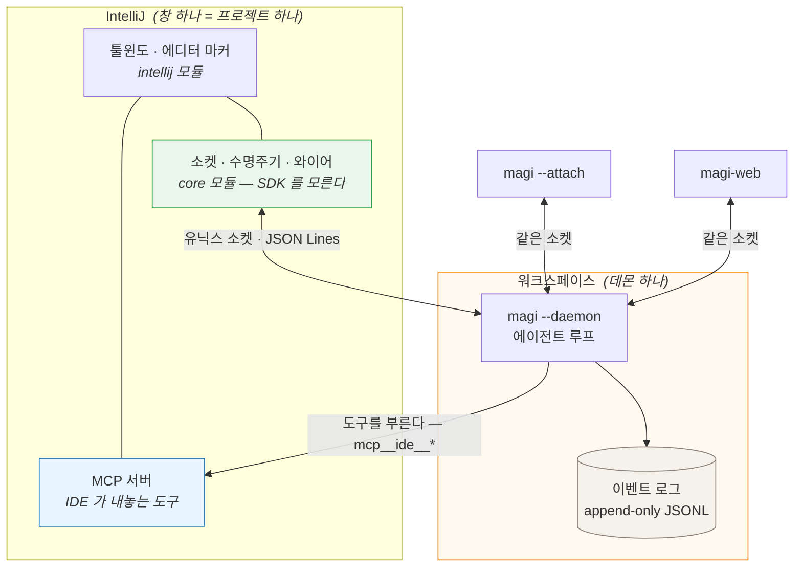
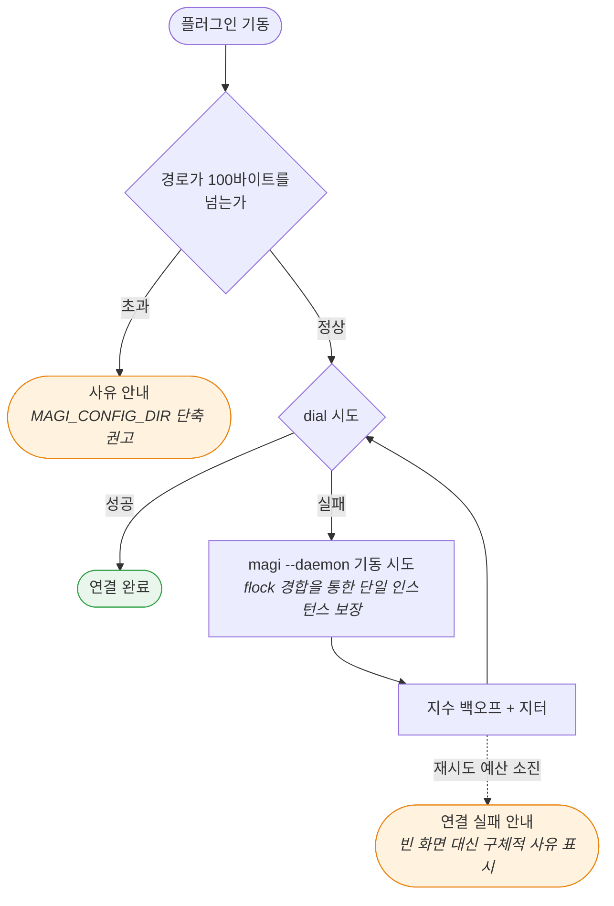
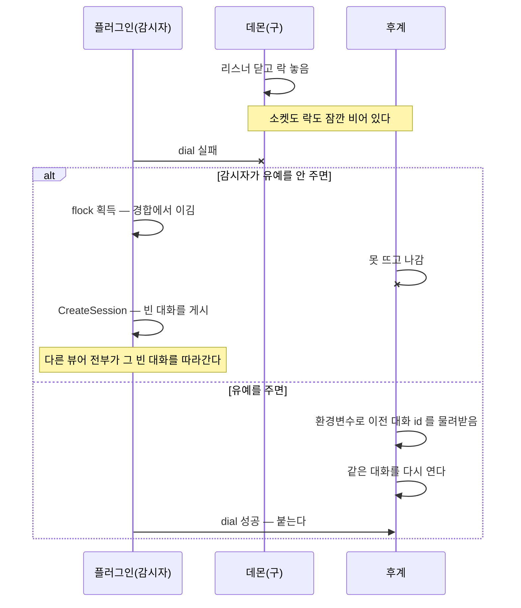
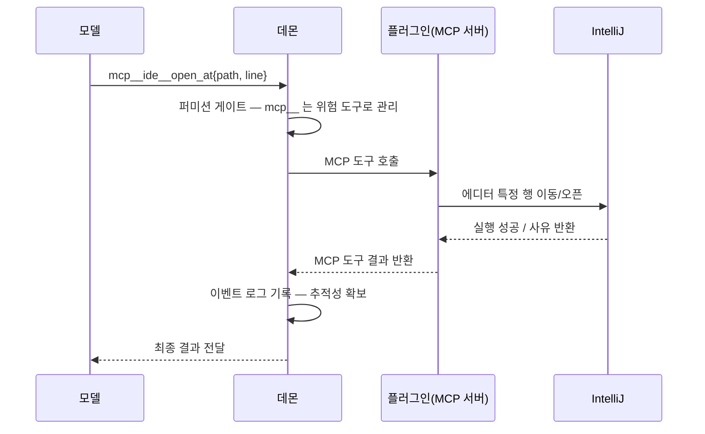

# clients/jetbrains/ — JetBrains IDE 플러그인 (IDE 안의 코딩 에이전트)

[↑ 저장소](../../README.md) · [사용자 매뉴얼](../../docs/MANUAL.ko.md) · [화면 설계](../../docs/UI.ko.md) · [플랫폼 규약 대조표](docs/PLATFORM.ko.md) · [무엇을 어디서 재나](docs/TESTING.ko.md) · [형제: 문서 에이전트](../powerpoint/DESIGN.md)


> **TL;DR (1분 요약)**
> - **역할**: JetBrains IDE(IDEA, PyCharm, WebStorm, GoLand 등 공통 IntelliJ Platform)에서 연 프로젝트의 magi 데몬과 통신하는 공식 플러그인입니다.
> - **양방향 구조**: 데몬 상태와 대화 전사를 읽는 **뷰어(Viewer)** 역할(유닉스 도메인 소켓)과, 에이전트가 에디터와 버퍼를 제어할 수 있도록 도구를 노출하는 **손(Hand)** 역할(내장 MCP 서버 `mcp__ide__*`)을 동시에 수행합니다.
> - **빌드 & 검증**:
>   - 단위 테스트: `cd clients/jetbrains/plugin && ./gradlew :core:test` (SDK 없이 순수 JVM 고속 검증)
>   - 플러그인 빌드: `cd clients/jetbrains/plugin && ./gradlew :intellij:buildPlugin`
>
> ---
>
> **문서 참조 및 검증 원칙**
> - 본 문서는 플러그인의 설계 및 데몬 연동 규약의 현행 레퍼런스입니다. magi 본체의 핵심 계약은 [ARCHITECTURE.md](../../docs/ARCHITECTURE.md)가 우선하며, 본 문서는 플러그인이 그 계약을 활용하는 방식을 다룹니다.
> - **심볼 기반 인용**: 코드 수정 시 줄 번호가 쉽게 어긋나는 문제를 방지하기 위해, 본문의 코드 참조는 줄 번호 대신 **정확한 파일 경로와 심볼명(타입/함수) 또는 고유 주석 문구**를 명시합니다.
> - **CI 인용 자동 검증**: CI 파이프라인의 `tools/citecheck.py`가 문서 내에 명시된 파일 경로와 심볼이 실제 소스 코드에 존재하는지 전수 검증합니다.
>
> ---

IDE에서 열어 둔 프로젝트를 **독립된 컴패니언**으로 연동합니다. 플러그인이 활성화되면 해당 프로젝트 워크스페이스의 데몬을 자동으로 탐색하여 연결하며, 실행 중인 데몬이 없으면 새로 구동합니다.

### 1. 플랫폼 아키텍처 및 호환성
- **IntelliJ Platform 공통 의존**: JetBrains 제품군(IDEA, PyCharm, WebStorm, GoLand 등)은 모두 공통의 IntelliJ Platform 기반 위에서 동작합니다. 본 플러그인은 특정 언어나 상위 제품 전용 SDK가 아닌 공통 플랫폼 모듈(`com.intellij.modules.platform`)에만 의존하므로, 모든 JetBrains 계열 IDE에 폭넓게 설치·실행됩니다.
- **실측 호환성 검증**: CI 릴리스 파이프라인에 JetBrains Plugin Verifier를 연동하여 실제 IDE 런타임 호환성을 자동 검증합니다 (IU-261, IU-262, PY-261 전체 Compatible 검증 완료).

### 2. 플러그인의 이중 역할 (뷰어 & 손)
- **뷰어 (Viewer)**: 터미널 TUI(`magi --attach`) 및 브라우저 웹 콘솔과 동일하게, 로컬 유닉스 소켓을 통해 데몬의 이벤트 로그를 구독하여 대화 전사와 실행 상태를 실시간 렌더링합니다 (§3).
- **손 (Hand / MCP 도구)**: 에이전트의 요청에 따라 IDE 내부의 에디터 열기, 버퍼 편집, 진단 결과 전송 등을 수행하는 내장 MCP 서버(`mcp__ide__*`) 역할을 수행합니다 (§5).
- **상태의 단일 진실 공급원**: 모든 작업과 세션의 정본(Source of Truth)은 백그라운드 데몬입니다. 플러그인의 로컬 계산값과 데몬의 이벤트가 다를 경우 항상 데몬의 기록을 따릅니다.



**두 화살표의 반대 방향성은 본 아키텍처의 핵심 특성입니다.** 좌측은 플러그인이 데몬의 상태를 **조회(Query)**하는 단방향 경로이고(뷰어), 우측은 데몬이 에디터 제어를 위해 플러그인을 **호출(Invoke)**하는 역방향 경로입니다(손). 두 경로는 연결 수명과 프로토콜이 분리되어 있습니다 — 조회 경로는 유닉스 도메인 소켓 기반 락스텝 통신이며, 호출 경로는 내장 MCP 인터페이스입니다. 이러한 분리 구조의 기술적 근거는 §5에서 상술합니다.

---

## 0. 용어 정의

본 아키텍처에서 사용하는 핵심 용어 정의 및 설계 맥락은 다음과 같습니다(각 항목은 배경 경위 → 정의 → 시스템적 효과 순으로 기술).

- **워크스페이스 키(WorkspaceKey):** 단일 저장소를 복수 디렉토리에 체크아웃한 경우 컴패니언 인스턴스 역시 격리되어야 하나, 전체 파일 경로를 그대로 파일명에 사용할 수는 없습니다. 이에 따라 `WorkspaceKey`는 기준 디렉토리 이름과 전체 경로의 해시값을 조합하여 산출합니다(`internal/adapter/daemon/publish.go`의 `WorkspaceKey`). 이를 통해 관리자가 파일시스템 상에서 직관적으로 대조할 수 있으며, 독립 체크아웃 간에 서로 다른 소켓 엔드포인트가 할당됩니다.
- **데몬(Daemon):** UI 없이 백그라운드에서 동작하는 핵심 엔진입니다. 워크스페이스당 단일 인스턴스로 상주하며, 소켓 경로는 `<configDir>/daemon-<WorkspaceKey>.sock` 규칙을 따릅니다(`publish.go`의 `SocketPath`). 모든 뷰어 연결이 해제되더라도 백그라운드 작업을 중단 없이 지속합니다.
- **뷰어(Viewer):** 데몬에 연결하여 상태를 관찰하고 사용자 명령을 전달하는 UI 인터페이스입니다. 뷰어는 데몬의 생명주기를 소유하지 않으므로 **디태치(Detach)가 데몬의 정지를 의미하지 않습니다**(`cmd/magi/attach.go`, 주석 "Detaching a viewer must not reap the daemon's work": 연결 종료 시 데몬의 백그라운드 작업이나 LSP 풀이 함께 회수되지 않도록 보장).
- **문(Door):** 소켓 상에서 데몬이 노출하는 RPC 메서드 엔드포인트입니다. 신규 프로세스가 파일시스템을 직접 탐색하여 데몬이 이미 유지 중인 상태를 재연산하는 비효율을 배제하고, 데몬의 인터페이스를 통해 직접 질의하는 창구입니다.
- **착지(Landing):** 단일 턴 실행의 종료 상태를 의미합니다. 카운슬 합의를 통과하면 정상 완료되며, 명시적 완료 선언 없이 턴 예산이 소진되면 `UNVERIFIED` 사유를 수반하여 종료됩니다. 플러그인은 두 종료 유형을 시각적으로 명확히 구분하여 렌더링해야 합니다.

---

## 0.5 핵심 불변식

시스템 안정성을 위해 설정된 전역 아키텍처 불변식입니다. 신규 화면이나 엔드포인트를 추가할 때 아래 원칙의 준수 여부를 선행 검증해야 합니다(괄호 내 표기는 상세 기술 절).

1. **데몬 단일 진실 공급원:** 플러그인이 로컬 계산한 값과 데몬이 통지한 상태가 상충할 경우 항상 데몬의 기록을 정본으로 채택합니다.
2. **소켓 통신의 락스텝 준수:** 명시적으로 요청하지 않은 프레임은 전송하지도 수신을 기대하지도 않습니다. 비동기 스트리밍이 요구되는 경우 전용 소켓 채널을 독립 개설합니다. (§2 · §4)
3. **상태 파일 영속화 지양:** 런타임에서 연산 가능한 값은 파일로 남기지 않으며, 실시간으로 조회 불가능한 상태는 존재하지 않는 것으로 간주합니다. `<socket>.stopped` 등의 상태 파일을 도입했다가 폐기한 이력이 이를 입증합니다. (§2)
4. **상태 관찰을 위한 부수 효과 금지:** 락(Lock) 획득 여부를 조회하기 위해 실제 락을 선점하는 등의 상호 배제 침범을 금지합니다. 확인 자체가 경합을 유발하는 질문은 설계 차원에서 배제합니다. (§2)
5. **파생 상태 로직의 코어 단일화:** 코틀린 계층에서 전사, 명단, 컨텍스트 파생 연산을 중복 구현하지 않습니다. 복수 구현은 필연적으로 런타임 상태 괴리를 야기합니다. (§3)
6. **사용자 변경 사항의 에이전트 가시성 보장:** IDE 환경에서 사용자가 직접 수정한 버퍼 내용은 에이전트가 즉각 인지할 수 있도록 에디터 훅 및 VFS 동기화를 보장합니다. (§5)
7. **모호한 빈 화면 금지:** 연결 실패나 프로세스 종료 등의 결함 상태를 빈 화면으로 은폐하지 않고 구체적인 사유를 명시합니다. 빈 화면은 '정상적인 대기 상태'로 오인될 수 있기 때문입니다. (§2 · §3)
8. **실행 중인 데몬의 전역 설정 임의 변경 금지:** 승인 권한 모드나 등록된 도구 서버 설정 등 타 클라이언트(TUI, CLI)와 공유 중인 전역 런타임 상태를 특정 IDE 창이 일방적으로 덮어쓰지 않습니다. (§2 · §4)

---

## 1. 디렉토리

```
clients/jetbrains/
├── README.md          # 이 문서 — 설계
└── plugin/
    ├── settings.gradle.kts
    ├── gradle/libs.versions.toml   # 버전은 여기 한 곳
    ├── core/              # 평범한 Kotlin/JVM. IntelliJ SDK 를 모른다
    │   └── …/ide/model/        와이어 DTO — Go 의 json 태그와 이름이 같다
    │   └── …/ide/usecase/      규칙. Ports.kt 가 전송에게 물을 것을 선언한다
    │   └── …/ide/transport/    그 포트의 유닉스 소켓 구현 + 소켓 경로 계산
    └── intellij/          # IntelliJ Platform. 화면만 여기 산다
        └── …/ide/ui/           조립 지점 — 여기서 SocketDaemons 를 꽂는다
    └── tools/citecheck.py  # 이 문서와 주석의 인용이 아직 무언가를 가리키는지
```

**테스트 용이성을 위한 모듈 분리:** `core` 모듈이 IntelliJ SDK에 의존하지 않으므로 화면 렌더링 없이도 연동 규약과 비즈니스 로직을 독립 검증할 수 있으며, SDK 환경이 갖춰지지 않은 곳에서도 컴파일됩니다. 의존성은 `intellij → core` 단방향만 허용되며, 역방향 의존이 발생하지 않도록 엄격히 분리합니다.

**계층 역전 구조 (usecase → transport 포트 분리):** 초기 설계에서는 비즈니스 로직(`Companion`, `Assist`, `DaemonLifecycle`)이 구체 구현체인 `DaemonClient`에 직접 의존했습니다. 이는 일반 로컬 환경에서는 문제가 없으나, Gateway나 WSL 등 소켓 엔드포인트가 분리된 원격 개발 환경에서 전송 계층을 유연하게 교체하기 어렵게 만듭니다. "언제 `steer`이고 언제 `submit`인가"와 같은 도메인 규칙이 소켓 전송 세부 구현(`SocketChannel`)에 결합되지 않도록 인터페이스(Port) 기반으로 분리했습니다.

포트 인터페이스는 `usecase/Ports.kt`에 정의된 `Daemon`(`exchange`, `stream`, `close`)과 `Daemons`(`connect`, `reach`, `unusable`) 총 6개 함수입니다. 기존에 `DaemonLifecycle`이 파일시스템 검사(`Files.exists`, `SocketPath.tooLong`)를 직접 수행하던 것을 `Daemons` 포트로 이전하여 전송 계층의 책임을 일원화했습니다. 또한 `reach` 함수가 소켓 연결과 파일 조회를 원자적으로 처리하도록 구성하여, 프로세스 확인과 파일 존재 검사 사이의 시간차(경쟁 상태)로 인해 비정상 종료된 데몬이 정상 종료로 잘못 판정되는 오류를 방지합니다.

포트 추상화를 통해 실제 소켓이나 대기 시간 없이도 페이크 객체를 주입하여 상태 판정 로직을 순수 단위 테스트(`DaemonLifecycleTest`)로 안정적으로 검증할 수 있게 되었습니다. 재기동 백오프는 제품 기동 경로(`ui/StartDaemon.kt`)가 쓰는 `Launches` 가 맡고 `LaunchesTest` 가 잽니다. 와이어 DTO를 별도의 도메인 엔티티로 매핑하지 않고 직접 사용하는 이유는 데몬 프로토콜과의 중복 정의를 방지하기 위함입니다. 도메인 규칙을 플러그인 계층에서 독자 정의하면 양측 구현 간에 괴리가 발생할 수 있으므로, 데몬이 제공하는 스키마와 어휘를 단일 진실 공급원으로 직접 활용합니다. 이 아키텍처 경계는 `ArchitectureTest`를 통해 상시 검증됩니다. `clients/web/ui`의 `interfaces → usecase → domain` 구조와 계층 방향은 같지만, 해당 UI의 `domain`에는 순수 비즈니스 규칙이 위치하는 반면 본 플러그인의 `model`은 와이어 DTO 계층으로서 별도의 순수 도메인 계층 없이 단방향 의존 구조만 차용합니다.

---

## 2. 켤 때: 띄우거나, 붙거나

**안정화 구현 기준(2026-09-11):** 이 절에는 이전 설계의 경위와 현행 구현 설명이 함께 있습니다. 새 수명주기 작업은 [공통 설계](../../docs/CLIENT_LIFECYCLE.ko.md)의 소유자/관찰자 구분, Windows 후계 프로세스 인계, 재시도 예산, 인수 매트릭스를 따릅니다. 새 코어 인터페이스는 아직 구현 목표입니다.

### 소켓 경로를 어떻게 만드나

`SocketPath(configDir, workdir)`에 두 조각이 든다(`publish.go` 의 `SocketPath`). 둘 다 틀리기 쉽다.

**`workdir`는 심링크를 푼 뒤에 해시한다.** `/tmp/x`와 `/private/tmp/x`는 같은 디렉토리인데 해시가
달라 "여기 데몬 없음"이 된다. 실측된 방식 그대로다(`publish.go` 의 `WorkspaceKey` 안 `filepath.EvalSymlinks`). JVM 쪽은
`Path.toRealPath()`가 같은 일을 한다. IntelliJ의 `project.basePath`는 심링크를 푼다는 보장이 없으니
플러그인이 직접 푼다.

**`configDir`는 `MAGI_CONFIG_DIR`이 있으면 그것, 없으면 `os.UserConfigDir()/magi`다**
(`internal/adapter/platform/platform.go` 의 `ConfigDir`). 여기가 조용한 함정이다. macOS에서 Dock으로 띄운 IDE는
셸 프로필의 환경변수를 물려받지 않으므로, `MAGI_CONFIG_DIR`을 쓰는 사용자는 **플러그인과 터미널이
서로 다른 소켓 경로를 계산한다.** 한 워크스페이스에 데몬이 둘 생기거나, 하나가 도는데 "없다"고
나온다. 플러그인은 (a) 사용자가 지정할 수 있게 하고, (b) 데몬을 띄울 때 **경로를 계산할 때 쓴 것과
같은 환경**으로 띄우고, (c) 지금 어느 config 디렉토리를 보고 있는지를 설정 화면에 적는다.

**경로가 100바이트를 넘으면 그 사유를 그대로 보여 준다.** magi가 전용 에러를 준비해 두었고 해법까지
문장에 들어 있다(`publish.go` 의 `tooLong`, "set MAGI_CONFIG_DIR to somewhere shorter"). 이것을 "데몬 없음"으로
읽으면 사용자는 영원히 고칠 수 없는 실패를 본다.

### 소켓 연결(dial) 중심의 분기 판정

| 관찰 | 의미 | 플러그인 동작 |
|---|---|---|
| dial 성공 | 데몬 정상 실행 중 | **기존 데몬에 연결.** 신규 프로세스를 띄우지 않음 |
| dial 실패 | 미실행, 비정상 종료, 기동 진행 중 | `magi --daemon` 기동을 시도함 |



**실패 원인을 분기하지 않고 단일화하는 이유:** 데몬 부재, 비정상 종료, 기동 진행 중 세 경우 모두 신규 기동을 시도하는 것이 동일한 해법이기 때문입니다. 데몬 기동을 시도하면 `flock` 기반의 상호 배제를 통해 단일 인스턴스가 보장되며, 이미 실행 중인 데몬이 있으면 기동이 안전하게 실패하여 기존 데몬에 연결하면 됩니다.

기동 경합에서 탈락한 프로세스는 지수 백오프와 무작위 지터(jitter)를 두고 다시 소켓 연결(dial)을 시도합니다. 동일 프로젝트를 복수의 IDE 창으로 열 때 발생하는 동시 기동 경쟁은 정상적인 시나리오이며, 지터를 적용하지 않으면 여러 창이 동일한 주기로 재시도하여 경합이 지속됩니다(`clients/powerpoint/DESIGN.md` 의 "5.3 획득-또는-접속").

최대 재시도 횟수를 소진하고도 연결에 실패하면 툴윈도에 실패 사유를 명확히 출력합니다. 빈 화면은 '정상적인 대기 상태'로 오인될 수 있으므로 결함 상태를 있는 그대로 표시합니다(`docs/UI.md` 의 "The rules this page keeps").

락 파일을 플러그인이 직접 검사하거나 점유하지 않습니다. 첫째, `flock`을 확인하기 위해 플러그인이 락을 선점하면 실제 데몬의 기동을 차단하는 부수 효과가 발생합니다. 둘째, magi는 `flock(2)`을 사용하고(`claim_unix.go` 의 `claimPath`), JVM의 `FileChannel.tryLock()`은 리눅스 및 macOS에서 `fcntl` 레코드 락으로 동작하여 상호 배제가 성립하지 않습니다.

소켓 파일 역시 플러그인이 임의로 삭제하지 않습니다. magi의 `Listen` 함수는 락을 먼저 선점한 뒤 소켓 연결 가능 여부를 검증하여 안전하게 정리합니다(`internal/adapter/daemon/serve.go` 의 `Listen`, 주석 "removing a LIVE one succeeds, silently orphans the running"). 이 검증 절차 없이 소켓 파일을 삭제하면 정상 동작 중인 데몬의 리스너가 고아(orphan) 상태가 되는 결함이 발생합니다(`claim_unix.go` 머리 주석, "Measured at 25 out of 300").

### IDE가 시작한 컴패니언의 종료

2026-09-11부터 플러그인이 시작한 컴패니언은 프로젝트를 닫거나 IDE를 종료할 때 함께 종료합니다.
`StartDaemon.start`는 `magi --daemon`의 프로세스 핸들을 프로젝트 서비스가 보관하도록 하고,
발행된 PID가 그 자식과 일치하고 소켓이 응답해야 기동 성공으로 처리합니다.
종료 시에는 소켓으로 `shutdown`을 요청하고, 응답하지 않는 자식은 프로세스 핸들로 종료합니다.
다른 곳에서 시작한 데몬에 연결한 경우에는 프로세스 핸들을 소유하지 않으므로 종료하지 않습니다.

시작 실패 시 재시도는 프로젝트 서비스의 15초 감시 주기와 `Restarts` 예산(최대 3회, 최소 60초 간격)으로
제한합니다. 다운로드 완료 전에 프로젝트가 닫히면 `DaemonProcess`가 늦은 기동을 거부합니다.
기동 로그는 `<소켓>.ide.log`에 기록하고, 실패 알림에는 최대 8KB 범위에서 마지막 세 줄을 포함합니다.
`MAGI_SOCKET_DIR` 환경변수는 소켓 위치에만 적용하며 설정과 바이너리 캐시 경로를 변경하지 않습니다.

과거에는 IDE 종료 후에도 작업을 계속하도록 `--detach`를 사용했습니다(2026-09-01).
현재 플러그인은 사용자의 종료 동작 요청에 따라 이 플래그를 사용하지 않습니다.
독립 실행이 필요하면 IDE를 열기 전에 터미널에서 `magi --daemon --detach`로 시작합니다.

### 붙어 있는 동안 데몬이 죽으면

**다시 띄운다.** 워크스페이스에 데몬 하나가 계속 있는 것이 목표 상태이고, 플러그인은 그 상태를
유지하는 쪽이다. 다만 "안 보인다"에는 세 가지 다른 사정이 섞여 있어서 즉시 재기동하면 틀린다.

| 사정 | 겉보기 | 옳은 반응 |
|---|---|---|
| 연결만 끊김 | dial은 되는데 우리 소켓이 닫힘 | 다시 dial. 기동하지 않는다 |
| 자기재시작(업데이트) | 짧은 dial 실패, 곧 돌아옴 | 유예. **이 경합은 져야 한다** |
| 진짜 죽음 | 유예를 넘겨도 dial 실패 | 기동한다 |

자기재시작이 실제로 저 창을 만든다. 유닉스에서는 데몬이 리스너를 닫고 **락까지 놓은 뒤**
`syscall.Exec`으로 같은 PID 위에 새 이미지를 올린다(`internal/graceful/graceful_unix.go` 의 `reexec`,
`internal/adapter/daemon/serve.go` 의 `Serve` 주석). 윈도우는 execve가 없어 후계 프로세스를 띄우고 자기는 나간다
(`graceful_windows.go` 의 `reexec`). 어느 쪽이든 소켓도 락도 잠깐 비어 있다. 그러니 락이 비었다는 것으로
죽음을 판정할 수 없다. 그리고 이 일은 사람이 부를 때만 나지 않는다. 자동 업데이트 루프가 자기
일정으로도 재시작한다(`cmd/magi/autoupdate.go`).



**재시작 경합 시 후계 프로세스 우선 보장:** 감시자가 후계 프로세스 기동보다 먼저 새 데몬을 실행하면 안 됩니다. 후계 데몬은 이전 대화 ID를 환경변수로 전달받아 기존 대화를 복원하지만(`cmd/magi/main.go` 의 `restartSessionEnv`, 소비는 같은 파일의 `os.Getenv(restartSessionEnv)`), 플러그인이 선점하여 기동하면 빈 대화를 새로 생성(`CreateSession` 호출)하여 다른 뷰어들까지 빈 대화를 바라보게 됩니다(`daemon.PublishedSession` 호출). 따라서 재시작 시간보다 충분히 긴 유예 시간을 두어 후계 프로세스가 안정적으로 기동할 수 있도록 대기합니다.

**비정상 종료 후 재기동 시 세션 복원:** 데몬이 크래시 등으로 종료되어 플러그인이 새로 기동하는 경우에도 기존 대화 세션을 이어가야 합니다. 현재 플러그인은 기동 후 `resume` 요청을 전송하여 세션 복구를 시도합니다. 향후 magi CLI에 `--resume <sessionId>` 플래그가 지원되거나 기동 시 마지막 세션을 자동 감지하도록 코어 인터페이스 개선이 권장됩니다.

**소켓 연결(dial)을 통한 기동 완료 판정:** `<socket>.session` 파일 존재 여부만으로 판정하지 않습니다. `SIGKILL` 등으로 비정상 종료된 경우 해당 파일이 남아 있을 수 있으므로(`internal/adapter/daemon/serve.go` 의 `Serve`, 주석 "a daemon killed with SIGKILL leaves the file behind"), 실제 소켓 연결과 파일의 `pid`·`started` 메타데이터 갱신 여부를 함께 확인하여 기동을 검증합니다(`wire_invariant_test.go` 의 `TestWireStructsAreAdditiveOnly`).

**크래시 루프 방지 및 재시도 상한:** 반복적인 비정상 종료 발생 시 무한 재기동 루프를 방지합니다. 현행 `Restarts`는 최대 3회와 시도 간 최소 60초를 적용하고 연결 성공 시 초기화합니다. 새 구현은 공통 설계 §5의 이동 구간·실패 후 차단·60초 안정 연결 기준으로 수렴하고, 반복 크래시를 주입하여 검증합니다.

**뷰어 상주 시에만 동작하는 감시 구조:** 본 플러그인의 데몬 감시는 워크스페이스가 IDE 창에 열려 있을 때만 유효합니다. 워크스페이스는 동적으로 생성·삭제되므로 OS 전역 데몬 감시자(LaunchAgent, 작업 스케줄러)를 정적으로 사전 등록하기 어려우며, IDE 창이 모두 닫힌 동안에는 플러그인 레벨의 감시가 동작하지 않습니다.

### 사용자 정지 요청과 비정상 종료의 구분

사용자가 A 창에서 `Stop companion`을 실행했을 때 다른 IDE 창의 감시자가 이를 프로세스 비정상 종료로 오인하여 자동 재기동하면 안 됩니다. 정상적인 종료는 소켓과 세션 레코드를 안전하게 정리하지만(`internal/adapter/daemon/serve.go` 및 `publish.go`), `SIGKILL`의 경우 파일이 남을 수 있습니다.

상태 표식 파일(`.stopped` 등)은 비정상 중단 시 디스크에 잔류하여 후속 기동을 영구 차단할 위험이 있으므로 사용하지 않으며(`docs/ARCHITECTURE.md` §11), 소켓 통신의 락스텝 특성상 종료 프레임을 삽입할 수도 없습니다(`serveConn`: 진행 중인 요청-응답 순서 보장). 대신 파일시스템 상태와 소켓 연결 실패 유형을 기반으로 종료 사유를 판정합니다:

| 관찰 상태 | 판정 의미 | 감시자 동작 |
|---|---|---|
| 소켓 파일이 명확히 존재하지 않음 | 정상 종료 완료 | **자동 재기동하지 않음** |
| 연결 거절 (`ECONNREFUSED`) | 프로세스 비정상 중단 | 자동 재기동 수행 |
| 연결 시도 자체가 불가능함 | 상태 불확실 (권한/경로 오류 등) | **자동 재기동하지 않음** |

이 판정 로직을 통해 정상적인 종료와 비정상 크래시를 정확히 구분합니다. 연결 거절(`ConnectException`)만이 유효한 프로세스 중단 신호이며, 경로 부재나 파일 형식 불일치(`SocketException`), 디렉토리 접근 불가(`BindException`) 등은 불확실한 상태(`Reach` enum)로 처리하여 무분별한 재기동을 방지합니다.

정상적인 `Stop` 명령 및 `magi --stop`은 소켓 파일을 삭제하므로 자동 재기동되지 않습니다. 반면 데몬이 내부 오류로 정상 종료 루틴(defer)을 거쳐 자진 종료한 경우에도 소켓이 삭제되므로 자동 재기동 대상에서 제외됩니다.

### 다중 플러그인 인스턴스 동작

동일 머신에서 복수의 IDE 창이나 클라이언트가 구동 중일 때 별도의 프로세스 간 조정 프로토콜을 구현하지 않고 표준 메커니즘을 활용합니다:

- **단일 데몬 인스턴스 보장:** 여러 감시자가 동시에 재기동을 시도하더라도 `flock`을 선점한 프로세스 하나만 바인드에 성공하며(`claim_unix.go` 의 `claimPath`), 경합에서 탈락한 프로세스는 에러 대신 기존 데몬에 연결(dial)합니다.
- **실행 상태 확인:** 파일 존재 여부가 아닌 소켓 연결(dial) 성공 여부로 데몬의 정상 구동을 검증합니다.

감시는 **워크스페이스 단위**로 격리되므로, 서로 다른 프로젝트를 연 창들은 독립된 데몬을 참조하며 상호 간섭이 발생하지 않습니다.

### 동일 워크스페이스를 서로 다른 IDE로 동시 실행하는 경우

동일한 프로젝트 디렉토리를 IntelliJ IDEA와 PyCharm 등으로 동시에 여는 환경(`com.intellij.modules.platform` 공통 플러그인 설치)에서의 동작은 다음과 같습니다:

1. **데몬 인스턴스는 하나로 유지됩니다:** 동일한 워크스페이스 경로 해시로 소켓 경로를 산출하므로, 먼저 기동된 IDE가 데몬을 실행하고 후속 IDE는 기존 데몬에 연결됩니다.
2. **열린 버퍼 상태 동기화:** 데몬의 `openFiles` 레지스트리는 세션 ID(`SessionID`)를 키로 사용하므로(`internal/app/app.go`), 두 IDE가 번갈아 버퍼 정보를 전송할 경우 최근에 편집 이벤트(600ms 디바운스, `36157222`)를 발생시킨 IDE의 활성 파일 정보로 갱신됩니다.
3. **MCP 도구 서버(`jetbrains`)는 단일 인스턴스만 등록 가능:** 플러그인의 MCP 등록 이름은 `jetbrains`로 고정되어 있으며(§4), 코어 매니저는 동일 이름의 서버 중복 등록을 거부합니다(`internal/adapter/mcp/manager.go` 의 `registerClient`). 따라서 먼저 연결된 IDE가 편집 도구(`apply_edit`)를 전담하고, 후속 IDE는 조회 전용 뷰어로 동작합니다.
   - 이러한 제한이 발생할 경우 두 번째 IDE의 툴윈도에 "이 워크스페이스의 편집 도구는 먼저 실행된 IDE 인스턴스가 점유 중"임을 명확히 표시하여 사용자의 혼선을 방지합니다(§0.5-7).

### 바이너리를 어디서 찾는가

`magi`가 있어야 데몬을 띄운다. 순서는 설정에 적힌 경로 → `PATH` → 없으면 기동하지 않고 툴윈도에
"magi를 못 찾았다, 경로를 지정하거나 설치하라"를 띄운다. 플러그인이 바이너리를 다운로드하지 않는다.
`--update`는 magi 자신의 일이고, 체크섬 검증과 롤백이 거기 붙어 있다.

### 퍼미션 모드는 건드리지 않는다

데몬의 기본은 `allow`다. 아무도 안 보는 동안 도는 일이 사람을 기다리며 서면 안 되기 때문이다
(SECURITY.md §7). IDE에서는 사람이 보고 있으니 `auto`가 나아 보이는데, **그 직관이 틀린다.**

무응답 프롬프트는 `Permission() == "allow"`일 때만 통과로 해소된다(`internal/app/permission.go` 의 `requestPermission`).
`auto`에서는 3분(`cmd/magi/agents.go` 의 `daemonAnswerWait`)을 다 태운 뒤 **거부**로 끝난다. 그리고 그 타이머는 데몬이면
모드와 무관하게 항상 걸려 있다(`cmd/magi/agents.go` 의 `answerableRun`). 그러니 `auto`로 켜 둔 채 IDE를 닫으면
컴패니언은 게이트가 걸린 호출마다 3분을 서 있다가 거절당한다. SECURITY.md §7이 데몬 기본을 `allow`로
둔 이유가 바로 그 문장이다.

그래서 플러그인은 **`--permission`을 붙이지 않는다.** 우선순위가 플래그 > env > config이므로
(MANUAL §3), 붙이는 순간 사용자가 `config.toml`에 적어 둔 값을 매번 조용히 덮기도 한다. 하필 그
설정은 이 에이전트가 자기 머신에서 무엇을 해도 되는지를 정하는 값이다.

대신 세 가지를 한다. 지금 어떤 모드로 도는지를 상태 표시줄에 **항상 보이게** 두고, 바꾸고 싶으면 한 번
눌러 `set-permission`을 보내고(`internal/adapter/daemon/client.go` 의 `Client.SetPermission`), **`ask`나 `auto`로 바꿀 때는 "지켜보는 사람이 없으면
호출마다 3분 뒤 거부된다"를 그 자리에서 말한다.** 이미 도는 데몬에 붙을 때는 그 데몬의 모드를 절대
바꾸지 않는다. 다른 창이나 터미널이 고른 값이다.

---

## 3. 읽기와 쓰기는 다른 통로다

두 기존 뷰어가 이미 같은 모양이다.

- `magi --attach`의 `attached`는 `*app.App`을 임베드해 **읽고**, `daemon.Client`로 **쓴다**
  (`cmd/magi/attach.go` 의 `attached`).
- `magi-web`은 LLM도 툴도 없는 자기 App으로 로그를 읽고, 변경 라우트만 소켓으로 넘긴다.

JVM에는 `app.App`이 없다. 그래서 이 문서가 답해야 하는 질문은 하나다: **읽기 쪽 파생을 어디서
하는가.**

| 안 | 방법 | 대가 |
|---|---|---|
| A | JSONL 로그를 코틀린이 직접 파싱 | 파생 구현이 둘이 된다. 이벤트 재구성·툴 결과 렌더·컨텍스트 계량이 Go와 Kotlin 양쪽에 생기고, 조용히 갈라진다 |
| B | `magi-web`을 자식 프로세스로 띄우고 HTTP/SSE를 쓴다 | 파생은 하나로 유지된다. 대신 프로세스 둘, 루프백 포트 하나, 그리고 자체 인증이 없는 콘솔을 IDE가 연다는 정책 결정 |
| C | **데몬에 읽기 문을 낸다** | 파생이 Go 한 곳에 남고, 상대는 소켓 하나뿐이다. 데몬 쪽 작업이 있고, 데몬이 죽으면 읽을 것도 없어진다 |

**C를 채택한다.** 근거는 셋이다.

1. 이미 데몬이 파생을 서빙하고 있다. `Jobs`·`Status`·`Git`·`GitDiff`·
   `PRFacts`는 계산된 답을 소켓으로 돌려주는 메서드다.
2. IDE가 필요로 하는 동작의 대부분이 **이미 소켓 메서드다.** `magi-web`이 `/look` `/complete`
   `/open-file` `/suggest` `/save` `/git-do` `/file-do` `/git-msg` `/pr-msg` `/git-pr`에서 하는 일은
   전부 `daemon.Client`의 `LookOver`·`CompleteCode`·`SetOpenFile`·`Suggest`·`PatchFile`·`WriteTool`·
   `GitDo`·`FileDo`·`DraftCommit`·`DraftPR`·`OpenPR` 호출이다. 플러그인은 같은 것을 그대로 부른다.
3. 와이어가 **추가만 허용**하도록 이미 테스트로 못 박혀 있다(`wire_invariant_test.go` 의 `TestWireStructsAreAdditiveOnly`). 필드를
   지우거나 이름을 바꾸면 실패하고, 더하는 것은 통과한다. 읽기 문을 내는 일은 그 규칙이 전제하는
   종류의 변경이다.

이 추가는 **보안 경계를 넓히지 않는다.** 새 메서드는 컨트롤 소켓에 붙고, 그 소켓은 만들어지는 첫
순간부터 소유자만 닿는다(`listen_unix.go` 의 `listenOwnerOnly` 가 umask를 `0o177`로 뒤집는다). 다른 머신이 오는 문은
`--fleet-door`이고 거기는 `about, hand, hand-state, watch` 넷만 지난다(`cmd/magi/door.go` 의 `doorMethods`). 그
목록에 아무것도 더하지 않는다.

### 안 C(데몬 직접 질의) 채택 시 고려사항 및 한계

**다수 엔드포인트 지원 필요:** `magi-web`이 내부 스토어에서 직접 파생하는 상태는 `ContextStateOf`·`PlanOf`·`LoopMap`·`SessionDiff`·`ChildSessions`·`SessionState`·`UnfinishedTurnOf`·`CouncilMarks`·`CouncilEvidenceOf`·`ListSessions`·`RankSessions` 등 11개 내외입니다(`clients/web/server` 의 구현 참조). 플러그인 초기 구현에서는 전사와 카운슬 정보부터 단계적으로 연동하며, 추가 화면 확장에 맞춰 필요한 엔드포인트를 순차 연계합니다.

**데몬 종료 시 과거 기록 조회 제약:** `magi-web`이나 `magi --attach`는 자체 로그 리더를 포함하여 데몬 프로세스가 종료된 후에도 디스크의 과거 로그를 직접 읽을 수 있으나, 플러그인은 데몬 소켓 RPC에 의존하므로 데몬이 종료되면 추가 조회가 제한됩니다. 따라서 전사 창은 마지막으로 수신한 프레임을 그대로 유지한 채 데몬 연결이 끊겼음을 명시하여, 단순 빈 화면과 장애 상태를 명확히 구분합니다(`docs/UI.md` §4-3: 상태의 명확성 원칙).

### 전사(Transcript) 스트림 구현

데몬 프로토콜에 `transcript` 스트리밍 메서드가 구현되었습니다(`protocol.go` 의 `Transcriber`). 과거 로그 재생 후 실시간 스트림으로 전환되며, 요청 인자는 `session`과 `since`입니다. 플러그인은 `Transcript.kt`가 스트림 연결을 **단독으로 소유**하고 화면 UI는 `Sink` 인터페이스로 구독합니다. 스트림 채널은 락스텝 방식이 아닌 스트리밍 전용이므로 타 RPC 호출과 결합하지 않고 독립 개설합니다.

**클라이언트 기반 행 렌더링:** 데몬의 책임은 원시 로그 이벤트 전송까지이며, 이벤트를 화면 표시 행으로 가공하는 셰이퍼(`usecase/Rows.kt`)는 각 클라이언트가 독립적으로 구현하되 공유된 어휘 규약을 준수합니다. 행 모델, 이벤트 변환 규칙, 골든 테스트는 `docs/TRANSCRIPT.ko.md`에 정의되어 있습니다.

**실환경 동작 검증:** 데몬을 구동하여 소켓 질의 시 정상 응답과 커서 범위 초과 거절(`since ... is past the end of this session's log`)이 정확히 반환됨을 확인했습니다. 빈 로그 대기 및 라이브 스트림 전환 규약 역시 단위 테스트(`TranscriptTest`)를 통해 순서 및 커서 통지 동작을 검증했습니다.

### 전사 엔드포인트 설계 배경

플러그인에 가장 먼저 요구된 기능은 대화 전사 렌더링이었습니다. 초기에는 웹 콘솔과 렌더러 로직을 공유하는 방안을 검토했으나, 서버 구조 개편에 따라 데몬은 표준 이벤트 스트림(`transcript`)을 제공하고 표시 가공은 클라이언트가 전담하는 방향으로 정리되었습니다.

### 스트리밍

`watch` 메서드처럼 `transcript` 역시 연결 수립 후 데몬이 프레임을 비동기로 밀어주는 전용 스트림 방식으로 동작합니다.

`watch` 메서드는 `Handover` 전용 엔드포인트이므로 범용 전사 스트리밍에 재사용할 수 없으며, 전사용 독립 메서드가 필요합니다. PowerPoint 클라이언트(`helper`)는 Go 내부 모듈로 구현되어 `App.Subscribe`에 직접 접근할 수 있으나, JVM 환경인 본 플러그인은 소켓 통신을 거쳐야 하므로 데몬 레벨의 전용 스트리밍 메서드 제공이 필수적입니다.

**구독 시 재생(Replay) 보장:** 소켓 연결 즉시 이전 로그를 먼저 순차 수신한 뒤 라이브 이벤트로 전환됩니다. 늦게 연결된 클라이언트도 이전 대화 맥락을 온전히 확보할 수 있도록 보장합니다(`internal/app/app.go` 의 `Subscribe` 규약).

**단일 스트림 원칙:** 동일 창 내에서 복수의 툴윈도가 각자 스트림을 개설하면 중복 파싱 오버헤드가 발생하므로, 스트림 연결은 `usecase` 계층이 단독으로 소유하고 개별 화면은 이를 구독하는 형태로 동작합니다.

---

## 4. 와이어 프로토콜

통신 단위는 줄바꿈으로 구분된 단일 JSON 객체(JSON Lines)입니다(`protocol.go` 의 `Request` 참조). 서버는 `bufio.Scanner`, 클라이언트는 `json.NewEncoder` 기반으로 처리합니다(`internal/adapter/daemon/serve.go` 의 `serveConn` 및 `newClient`).

요청 필드: `method, session, text, callId, decision, answer, name, looking, meeting, n, args, ask`.
응답 필드: `ok, error, waiting, doing, out, exit, permission, user, jobs, tools, models, why, session, handover, version, proto, caps`(`wire_invariant_test.go` 의 `TestWireStructsAreAdditiveOnly`).

전송 프로토콜은 모든 플랫폼에서 AF_UNIX를 사용합니다. Windows 역시 소켓 디렉토리 ACL로 권한을 제어합니다(`listen_windows.go` 의 `listenOwnerOnly`). JVM은 `UnixDomainSocketAddress` 및 `SocketChannel`을 통해 연결하며, 이는 JDK 16 이상의 런타임을 요구합니다.

**버전 및 기능 협상:** 연결 초기 `about` 메서드를 통해 응답의 `version`·`proto`·`caps`를 확인합니다. 데몬이 특정 기능을 지원하지 않는 빌드인 경우 화면을 빈 상태로 두지 않고 버전 불일치 사유를 사용자에게 안내합니다. 기능 지원 여부는 `caps` 배열의 `tool-servers` 등을 확인하여 판별합니다.

### `mcp-attach` / `mcp-detach` 엔드포인트 규약

코어 프로토콜(`doors.go`)의 디스패치에 `mcp-attach`와 `mcp-detach`가 정의되어 있으며, Go 클라이언트 구현은 `internal/adapter/daemon/client.go`의 `Client.AttachMCP` 및 `Client.DetachMCP`를 통해 호출됩니다.

플러그인에서 호출 시 MCP 등록 이름은 `McpName.VALUE` 상수를 준수하며, detach 호출 시 반환되는 `(false, nil)`은 실패가 아닌 정상적인 '기등록 해제 완료' 상태로 취급합니다.

| 엔드포인트 | 요청 인자 | 동작 설명 |
|---|---|---|
| `mcp-attach` | `name`, `url`, `headers`(선택) | 실행 중인 컴패니언에 HTTP MCP 서버를 동적으로 등록함 |
| `mcp-detach` | `name` | 등록된 MCP 서버를 해제함 |

`name` 은 네임스페이스가 된다. 붙고 나면 도구가 `mcp__<name>__<tool>` 로 목록에 들어간다
(`internal/app/execute.go` 의 `gateAllowlist`). 응답은 `ok`, 실패면 `error`, 성공이면 등록된 도구 이름을 `tools` 에
싣는다 — 호출자가 무엇이 생겼는지 알아야 화면에 그린다. 셋 다 이미 있는 응답 필드다.

**실패는 구분되어야 한다.** "안 붙었다" 하나로 뭉치면 사용자가 고칠 수가 없다. 최소한 이 넷이다:
서버에 못 닿음(URL·포트 문제) / 그 이름이 이미 붙어 있음 / 이름이 내장 도구를 가림 / 정책이 거부함.

둘째 것은 **문이 새로 막을 필요가 없다.** `registerClient` 가 이미 거부한다. 그 방어가 들어온 사유가
이 문의 사유이기도 하다 — 커밋 `449d02bc` 가 "설정 맵에서만 이름이 오는 동안에는 도달 불가였다"고
적는데, 밖에서 런타임에 붙이기 시작하면 도달 가능해지는 결함이었다. 맵이 두 번째를 조용히 받아
첫 연결이 영영 안 닫히고 `Remove(name)` 이 절반만 지우던 것이다.

**런타임 전용이고 config 에 쓰지 않는다.** `internal/adapter/mcp/manager.go` 의 `AddHTTPDynamic` 과
`Remove` 가 이미 그 자리다(이 파일은 지금 손이 가고 있어 줄 번호 대신 함수 이름으로 짚는다). config 에 쓰면 서버가 없는 날에도 `[mcp.<name>]` 이 남아 매 기동마다
붙으러 간다. 그리고 **`[mcp]` 는 플러그인이 grant 를 받아도 못 만지는 섹션**이라
(`internal/adapter/plugin/lua/permission.go` 의 `denyConfigSections`), 그 옆에 config 를 쓰는 길을 내면 닫아 둔 문 옆의
쪽문이 된다.

**그래서 데몬이 재시작하면 붙은 것이 사라진다.** 이건 결함이 아니라 런타임 전용의 값이고, 대신
**붙이는 쪽이 다시 붙일 책임을 진다.** §2의 감시자가 재접속을 이미 감지하므로 그 자리에서 다시
`mcp-attach` 를 보낸다.

#### 이 플러그인이 쓰는 이름 — `jetbrains`

**고정이고, 인스턴스마다 다르게 짓지 않는다.** 붙고 나면 도구가 `mcp__jetbrains__apply_edit` 로
목록에 들어간다.

결정적인 이유는 하나다. `mcp__` 접두는 **무조건 위험 도구**라(`internal/app/execute.go`) 파일 하나
여는 데도 매번 확인이 뜨고, 그걸 면하는 **유일한 수단이 오퍼레이터가 쓰는 allow 룰**이다. 이름에
PID 나 창 번호를 넣으면 그 룰이 재시작마다 무효가 된다. 유일한 완화책을 못 쓰게 만드는 이름은 고를
이유가 없다.

**기준은 도구 한 벌에 이름 하나다.** IDEA·PyCharm·GoLand 는 같은 플러그인이 같은 도구를 내놓으므로
한 이름이 맞고, 그래서 제품명이 아니라 플랫폼 이름이다. 반대로 넓게 지으면 나중에 다른 도구 벌이 붙을
자리가 없어진다 — 한 이름에 서버 둘은 코어가 거부한다. 형제 프로젝트가 **같은 기준으로 방향이 반대인
결론**에 닿았다: `office` 를 기각하고 `ppt` 로 좁혔다. Word 애드인이 생기면 도구가 다른 벌이라서다.

이름은 **자기 자신으로 다듬어져야 한다.** 코어가 `[a-zA-Z0-9_-]` 만 남기고 나머지를 `_` 로 바꾸므로
(`internal/adapter/mcp/manager.go` 의 `sanitizeToolPart`), 다듬어진 뒤 달라지는 이름을 고르면 사람이 목록에서 보는
이름과 allow 룰에 적어야 하는 이름이 갈린다. `jetbrains` 는 그 조건을 만족한다. 제품명(`intellij`)이
아니라 플랫폼 이름인 이유는 PyCharm·GoLand 도 같은 플러그인이기 때문이다.

이 규칙은 산문으로만 두지 않았다. `McpName` 에 값과 성질이 있고 테스트가 건다 — 이름을 바꾸려는
다음 사람이 거기서 걸린다.

#### 거절 둘은 뜻이 다르다

**한 워크스페이스에 손은 하나다.** 데몬이 워크스페이스당 하나이고 프로젝트가 창당 하나이므로 보통
정확히 하나가 붙는다. 같은 프로젝트를 두 창으로 열면 둘째가 거절당하는데, **그건 결함이 아니라
규칙이 도는 것**이다. 형제 프로젝트가 덱에 대해 세운 "한 문서에 손은 하나"와 같다.

다만 코어가 내는 두 문장은 사람이 할 일이 서로 다르다.

| 코어의 사유 | 뜻 | 사람이 할 일 |
|---|---|---|
| `… is the name of a tool this companion already has` | 내장 도구와 이름이 같다(`read`·`bash` 같은) | 다른 이름을 골라라 |
| `… is already attached` | 이 워크스페이스의 손이 이미 있다 | 다른 창을 보라 |
| `… collides with "X"` | 설정에 적힌 서버가 다듬어진 뒤 같은 이름이 됐다 | 그 서버 이름을 고쳐라 |

첫째는 앞의 둘보다 **먼저** 걸린다(`internal/app/app.go` 의 `AttachToolServer`). 이미 붙은 MCP
서버의 도구와는 사실상 안 부딪힌다 — 그쪽은 레지스트리에 `mcp__jetbrains__apply_edit` 같은
네임스페이스 이름으로 들어 있어서, 서버 이름을 문자 그대로 그렇게 지어야 겹친다. 그리고 그 자리에서
네임스페이스 충돌은 **일부러 안 본다** — 다듬는 일이 어댑터 것이라 코어가 자기 판본을 계산하면 두
답이 갈린다는 사유가 주석에 있다. 우리가 두 번 밟은 그 결함이다.

문장은 그대로 보여 주되 **무엇을 해야 하는지는 갈라서** 말한다. 그러지 않으면 사용자가 창을 찾다가
설정 문제를 못 본다.

#### 다시 붙을 때

붙은 것은 런타임 전용이라 데몬이 재시작하면 사라진다. 그런데 데몬이 안 죽고 **연결만** 끊겼다 붙는
경우도 있어서, 그때는 옛 등록이 남아 있고 그대로 붙으면 `already attached` 를 받는다. 그러니
**떼고 붙는다.** 코어의 detach 는 없는 이름에 `(false, nil)` 을 주고 그것을 "재접속하는 호출자에게는
에러가 아니다"라고 못 박아 두었으므로, 이 순서가 안전하다.

**우리가 붙이지 않은 것은 떼지 않는다.** 설정에 선언된 서버는 코어가 문을 통한 detach 를 거부한다
("the door removes only what it attached"). 그 거부를 삼키고 넘어가면 안 된다.

**권한 논증.** 어떤 MCP 서버를 돌릴지는 오퍼레이터가 정한다는 규칙이 세 자리에 일관되게 있다 —
위의 `denyConfigSections`, `register_mcp` 의 capability 가 설치 시점 부여라는 것, 공유 콘솔의 `/mcp`
쓰기 거부(`clients/web/server/mcp.go` 의 `server.mcpWrite`). 소켓은 0600 이라(`internal/adapter/daemon/serve.go` 의 `Listen`) 호출자가 곧 머신 주인이므로
이 문은 공유 안 된 콘솔과 같은 자리다. 한 칸 더 있다 — 콘솔이 거부하는 대상은 주석이
*"a command line this machine will spawn"* 이라고 규정하는데, `mcp-attach` 가 받는 것은 URL이라
**스폰이 없다.** 그래서 같은 등급이 아니라 한 칸 약하다.

---

## 5. 무엇을 만드나 — 화면과 손

### 화면 — IDE와 겹치는 것은 만들지 않는다

`docs/proposals/ide-features-2026-08-14.md`가 세운 필터를 그대로 승계한다. 어떤 기능이 자리를 얻으려면
(a) 에이전트가 무엇을 했는지 이해하게 하거나, (b) 일하는 중에 정확히 개입하게 하거나, (c) 착지 전에
결과를 검사하게 해야 한다.

그 제안은 브라우저 콘솔을 위해 쓰였고, 거기서는 파일 트리·에디터·diff 뷰어·VCS 패널·터미널을 전부
직접 만들어야 했다. **IDE에는 그게 이미 다 있다.** 그래서 목록이 뒤집힌다.

| 콘솔이 만들어야 했던 것 | 플러그인이 하는 일 |
|---|---|
| 파일 트리 | IntelliJ Project 뷰 |
| 에디터, 저장 충돌 감지 | IntelliJ 에디터 |
| diff 뷰어, side-by-side | `DiffManager` |
| 소스 컨트롤 패널, 커밋 UI | IntelliJ VCS |
| 파일 내 검색 | IntelliJ Find in Files |
| 터미널 | IntelliJ Terminal |
| 명령 팔레트 | Search Everywhere / Actions |

남는 것이 플러그인이 실제로 만들 것이다.

1. **전사 툴윈도.** 스텝, 툴 호출과 진짜 종료 코드, 카운슬 라운드와 세 위원의 판정, 착지가
   VERIFIED인지 UNVERIFIED인지. `line`의 `ok`가 없으면 "도는 중"으로 그린다.
2. **컴포저.** 턴 중에도 입력이 열려 있고 보내면 `steer`다. 돌지 않을 때는 `submit`.
3. **퍼미션 프롬프트.** 응답의 `waiting`이 실어 온다(`protocol.go` 의 `Response`): `id`(답이 실어야 할 call
   id)·`kind`(`permission` | `question`)·`what`·`args`·`reason`·`options`·`report`·`index`·`total`·
   `since`. IDE 알림으로 띄우되 답하는 자리는 툴윈도 안이고, 답은 `answer`로 되돌린다.

   이 대목이 §3의 결정을 다시 증명한다. `permission.requested`는 **전이 이벤트라 로그에 없다.**
   그래서 데몬이 대기 중인 프롬프트를 한 곳에서 다시 조립해 준다(`protocol.go` 의 `Waiting`, 주석: 두 번째
   클라이언트가 자기 버전을 쓰면 네 필드 중 셋만 채운 프롬프트가 그럴듯하게 보이면서 아무것도
   답하지 못한다). JSONL만 꼬리 무는 플러그인은 **퍼미션 프롬프트를 영영 못 본다.**
4. **문제 판.** 컴패니언 자신이 돌린 실행에서 나온 실패와 카운슬의 반대 의견. **어느 호출에서
   언제 나왔는지가 항목마다 붙는다** — 낡은 문제 목록은 없느니만 못하고, 그 답은 목록을 지우는 것이
   아니라 **출처를 적는 것**이다.

   ⚠ **이 항목은 한때 "거터와 Problems 뷰"라고 적혀 있었고, 재보니 둘 다 아니었다.**

   - **카운슬 반대는 거터에 못 단다.** `CouncilVerdictData` 가 싣는 것은 `round`·`member`·`lens`·
     `decision`·`rationale`·`cite` 이고 **경로가 없다.** 걸 자리가 없어서 판에만 적고, 문제 목록과
     **섞지 않는다** — 섞으면 "클릭하면 어디로 가지"가 답 없이 생긴다.
   - **빌드·테스트 출력은 산문이다.** 툴체인마다 모양이 달라 일반 파서는 끝이 없고, **틀린 마커는
     없는 마커보다 나쁘다** — 이 항목 자신이 그렇게 적는다. 그래서 **앵커만** 읽는다
     (`경로:줄[:칸]`). 못 읽으면 항목이 안 눌릴 뿐 사라지지도, 엉뚱한 줄을 가리키지도 않는다.
     **실패 모양이 "안 눌린다"인 것이 이 선택의 값이다.**
   - **IntelliJ 자신의 Problems 뷰에 넣지 않는다.** 거기는 IDE 가 자기 인스펙션으로 채우는
     자리이고, 컴패니언이 본 것을 섞으면 **누가 언제 말한 것인지가 사라진다** — §5-4 가 요구하는
     것이 정확히 그 둘이다.

   앵커 파싱이 임의의 컴파일러 출력 해석이 아닌 이유가 하나 있다. magi 의 진단은 그 모양을
   **한 자리에서만** 만든다(`lspdiagnose.go` 의 `Fprintf`). 그러니 이것은 알려진 한 함수의 역이고,
   빌드 출력이 우연히 같은 모양이면 덤으로 걸린다.

   그리고 **"했음"과 "실패"를 가른다.** 코어의 `ToolResult` 가 `Advisory` 를 실어 주는데, 파일을
   **쓴 뒤** 언어 서버가 한 지적은 `IsError` 를 달지만 그 일은 일어났다. 둘을 같은 ✗ 로 그렸더니
   디스크에 파일이 있는데 화면이 실패라고 했다 — 코어가 실측으로 적어 둔 사고다.
5. **줄을 쓴 턴.** 이 줄을 어느 턴이 썼고 그 턴은 무엇을 하라는 요청이었나. IDE의 blame이 답하는
   "누가·어느 커밋"과 다른 질문이고, magi만 답할 수 있다 — 커밋 하나에 턴이 여럿 들어 있고, 커밋
   안 된 편집에는 blame 이 아예 답하지 않는다.

   **줄 단위로 소리 나게 답할 수 있는 범위가 좁고, 그래서 좁게 답한다.** `edit` 은 `at`/`to` 로
   줄을 짚을 수 있는데(도구 스키마가 그렇게 적는다) **뒤에 온 편집이 줄을 밀어낸다.** 같은 파일에
   편집이 하나만 더 와도 앞의 `at` 은 지금 파일에서 다른 줄이다. `old`/`new` 형태에는 줄이 아예
   없고 `write` 는 통째로 쓴다.

   그래서 **마지막 편집이 짚은 범위만** 답한다 — 그 뒤에 아무것도 안 왔으므로 안 밀렸다는 것이
   확실한 유일한 경우다. 그 밖에는 **"이 줄은 못 짚는다"고 말하고 파일을 건드린 턴 목록을 대신
   내놓는다.** 못 짚는 것이 아무것도 못 말하는 것은 아니다 — 모르는 자리에 이름을 붙이는 것이
   §5-5 가 요구하는 "추측하지 않는다"의 실행이다.

   ⚠ **이 창이 열린 뒤에 받은 전사만 안다.** 데몬이 재생해 준 만큼이 전부이고 그전은 모른다.
   그것도 그렇게 말한다.
6. **상태 표시줄.** 컴패니언이 도는지, 사람을 기다리는지, 어떤 승인 모드인지. **툴윈도의 중복이
   아니다** — 툴윈도는 게으르다. 사람이 열기 전에는 만들어지지도 않는다(샌드박스 IDE 에서 실측:
   플러그인은 로드되는데 사실 판이 데몬에 접속조차 하지 않았다). 창 둘뿐이면 "컴패니언이 일하는
   중"과 "아무도 판을 안 열었다"가 화면에서 같아 보인다.

### 어디에 놓나 — 독 배치

콘솔의 컴패니언 화면은 `docs/UI.md` §2.2 가 정한 모양이 있다: **840px 이상에서 두 칼럼 — 대화, 그
옆에 사실 판.** 그리고 그 옆 칼럼은 **sticky** 다("a plan that scrolls away is one you re-find").
워크스페이스 판을 열면 파일 트리와 git 카드가 왼쪽에 서고 대화는 가운데에 남는다.

같은 배치를 IDE 로 옮기면 **절반이 사라진다.** 콘솔이 왼쪽과 가운데를 직접 만든 것은 브라우저에
에디터도 프로젝트 트리도 없어서였고, IDE 에는 둘 다 있다.

| 콘솔 (`docs/UI.md` §2.2) | IDE 에서 | 누가 만드나 |
|---|---|---|
| 워크스페이스 판 — 파일 트리, git 카드 | 좌측 | **IntelliJ** — Project 뷰, Git 툴윈도 |
| (없음 — 브라우저에 에디터가 없다) | 중앙 상단 — 편집 중인 파일 | **IntelliJ** 에디터 |
| 가운데 칼럼 — 전사와 컴포저 | **하단 독** | 플러그인 |
| 옆 칼럼(sticky) — 사실·계획·건넨 일·받은 지시 | **우측 툴윈도** | 플러그인 |

**대화가 오른쪽이 아니라 아래로 가는 이유.** 콘솔에서 대화가 가운데인 것은 그것이 그 화면의 주인공이기
때문이다. IDE 에서 가운데는 **고치는 것**의 자리이고, 그 자리를 빼앗으면 §5 의 첫 규칙("IDE 와 겹치는
것은 만들지 않는다")을 배치로 어기는 셈이 된다. 그리고 계속 흘러내리는 글을 IntelliJ 가 두는 자리는
아래다 — Run, Terminal, Build 가 전부 거기 있다. 남의 집 관용구를 이긴다고 주장할 근거가 없다.

**옆 칼럼이 오른쪽으로 가면 sticky 는 공짜로 따라온다.** 콘솔이 CSS 로 붙들어야 했던 성질 — 대화가
스크롤해도 계획은 제자리 — 은 툴윈도가 원래 독립적이라 저절로 성립한다. 콘솔이 치른 대가를 안 치른다.

**이 배치는 §3 의 미룬 값을 앞당긴다.** §3 은 읽기 문 열한 개를 "화면이 생길 때 따라간다"고 미뤘는데,
이 화면이 그 화면이다. 필요한 순서는 이렇다.

| 우측 판의 장 | 어디서 오나 | 오늘 되나 |
|---|---|---|
| 사실 — 상태·모드 | `status` → `protocol.go` 의 `Status` | **된다** |
| 사실 — 컨텍스트·압축 | `ContextStateOf` | 새 문 |
| 계획 | `PlanOf` | 새 문 |
| 예약 | `jobs` → `protocol.go` 의 `Jobs` 의 `Queued` | **된다** |
| 크론 | 콘솔은 **config** 에서 읽는다(`clients/web/server/cron.go` 의 `jobsFor`) | 데몬 문이 아니다 |
| 건넨 일 | `fleet.Handoffs` — 받은 쪽 전사들을 재생한다 | 새 문 |
| 받은 지시 | 로그 파생 | 새 문 |
| 하단 독 — 전사 | `transcript` | 새 문(§8) |

**두 칸은 한때 "된다"로 적혀 있었고 틀렸다.** `hand-state` 는 목록이 아니라 `Handed(receipt)` — **이미
들고 있는 접수증 하나**에 답한다. 건넨 일의 목록은 콘솔이 `fleet.Handoffs` 로 받은 쪽들의 전사를
재생해 만드는 것이고 소켓 메서드가 아니다. 그리고 `Jobs` 에는 크론이 없다(`Background`·`Children`·
`Queued` 뿐). 문 이름이 그럴듯해서 확인 없이 적었던 것인데, **이 표의 값은 "새 문이 몇 개 필요한가"라
틀리면 코어 쪽에 잘못된 견적이 나간다.**

**그래도 우측 판이 하단 독보다 먼저 선다.** 다섯 장 중 둘이 오늘 있는 메서드로 서고, 전사는 문
하나를 통째로 기다린다. 순서를 뒤집으면 사람이 보는 것이 한동안 빈 창 하나뿐이다.

빈 자리는 빈 채로 두지 않는다. 판이 통째로 비면 콘솔이 하는 말을 그대로 한다 — 빈 기둥은 "아직 안
왔다"로 읽히는데, 실제로는 "이 컴패니언은 계획을 안 세웠다"이거나 "이 빌드에 그 문이 없다"이고 셋은
다른 사실이다(§0.5-7).

### 어떻게 그리나 — 색은 터미널 것, 판은 IDE 것

`docs/UI.md` §6.8 의 표가 콘솔과 TUI 를 한 줄로 묶는다: 팔레트는 **TUI 가 원본이고 콘솔이 그대로
가져간다**(`the original (styles.go)` / `takes it verbatim`). 세 번째 화면이 생겼으니 같은 줄에
선다 — `internal/adapter/tui/styles.go` 의 `nervDark`·`nervLight` 가 원본이고, 플러그인은 그것을
`Palette.kt` 로 옮겨 적는다. 한 물건을 세 화면이 세 색으로 그리면 사람이 그 물건을 세 번 배운다.

**팔레트 정합성 자동 검증:** 문서상의 서술만으로는 코드 변경 시 색상 일관성이 훼손되기 쉬우므로, 단위 테스트(`PaletteTest.kt`)가 원본(`internal/adapter/tui/styles.go`)을 직접 읽어 역할별 색상값을 자동 대조합니다. TUI 원본에 정의된 색상이 플러그인에 누락되거나 변형된 경우 테스트가 실패하도록 구성하여 단일 진실 공급원을 유지합니다.

⚠ **빌드 입력 의존성 설정:** 원본 파일이 Gradle 프로젝트 외부에 위치하므로, 해당 파일이 변경되었을 때 `:core:test`가 UP-TO-DATE로 건너뛰지 않도록 코어 빌드 스크립트에서 원본 파일을 `paletteOrigin` 입력으로 지정하고 시스템 프로퍼티로 경로를 전달합니다. 이를 통해 원본 색상 수정 시 테스트가 누락 없이 재실행됩니다.

**IDE 테마와의 조화:** 콘솔 웹 UI는 배경색까지 자체 팔레트로 렌더링하지만, 플러그인이 배경색을 독자 지정하면 IDE 고유의 룩앤필(Run·Terminal 툴윈도)과 이질감이 발생합니다. 따라서 `Look.kt`는 패널 및 테두리 배경을 IDE 기본 테마에 위임하고, 실패·경고·성공 및 카운슬 위원 상태 등 **의미가 담긴 전경 텍스트 색상만** 팔레트에서 가져와 적용합니다.

**색상의 의미론적 활용:** 색상은 단순 시각적 장식이 아닌 시스템 상태 전달 수단입니다. 카운슬 위원 3인의 렌더링 색상은 웹 콘솔의 `Rows.java` 기준과 일치시킵니다. 또한 상태는 텍스트 라벨로 1차 명시하고 색상은 보조 지표로 활용하여 접근성을 확보합니다.

**고정폭 폰트 규약:** 라벨, 상태 코드, 경로, 식별자, 전사 등은 `docs/UI.md` §3.3 규약에 따라 고정폭 폰트를 적용하며, 별도 글꼴을 지정하지 않고 IDE 에디터에 설정된 폰트를 그대로 계승합니다(`Look.kt` 의 `mono`).

### IDE 제어 도구 (내장 MCP 서버 연동)

**내장 MCP 서버 구현 현황:** `usecase/Hand.kt`에서 도구 인터페이스를 정의하고, `transport/HandServer.kt`가 루프백 HTTP 서버로 MCP 엔드포인트를 노출하며, `IdeHand.kt`가 IntelliJ 편집기 API를 직접 제어합니다. IDE 창이 활성화되면 MCP 서버가 구동되고 `mcp-attach`를 통해 데몬 컴패니언에 등록됩니다.

**초기 제공 도구 (`show`, `apply_edit`):** 에이전트가 IDE를 제어하는 핵심 도구로 파일 특정 행 이동(`show`)과 열린 문서 버퍼 수정(`apply_edit`) 2종을 우선 제공합니다. 기존 코어가 지원하는 파일시스템 기반 수정과 달리, IntelliJ의 `WriteCommandAction`을 거쳐 수정하면 로컬 히스토리(Local History), 되돌리기(Undo), 인스펙션 재실행 및 열린 편집기 버퍼 동기화가 플랫폼 네이티브 수준으로 온전히 보장됩니다.

**루프백 바인딩 및 토큰 인증:** 소켓과 달리 루프백 포트는 머신 내 다른 프로세스에서도 접근할 수 있으므로, MCP 서버 등록 시 고유 토큰을 헤더로 전달하여 매 요청마다 인증을 검증합니다. 포트는 `0`으로 바인딩하여 OS가 할당한 실제 포트를 사용합니다.

**SSE 배제 및 JSON 전송:** 단일 요청-응답 구조로 충분하므로 불필요한 SSE 스트리밍 복잡도를 배제하고 표준 JSON 통신을 사용합니다.

#### MCP 상호운용성 검증

코어 명세를 바탕으로 구현한 뒤 실제 Go MCP 클라이언트(`mcp.Manager.AddHTTPDynamic`)와 연동 테스트를 진행했습니다. 초기 검증에서 알림 응답으로 HTTP 202를 반환했을 때 코어 전송 레이어가 200과 204만 허용하여 연결이 거부되는 현상이 발견되었으며, 이를 204 응답으로 수정하여 호환성을 확보했습니다.

이러한 규약 차이를 조기에 포착하기 위해 `HandInteropTest`는 환경변수(`MAGI_HAND_INTEROP=1`) 기반으로 실제 Go 클라이언트를 호출하여 프로토콜 상호운용성을 지속 검증합니다.

### MCP 도구 호출 아키텍처

플러그인은 단순 관찰(뷰어)에 그치지 않고, 에이전트의 요청에 따라 IDE 내부 에디터를 제어하거나 버퍼를 직접 수정합니다.

소켓 통신이 락스텝 규약을 따르므로 데몬이 뷰어 연결을 통해 임의로 비동기 명령을 전송할 수 없습니다(§2, `internal/adapter/daemon/serve.go` 의 `serveConn`). 따라서 에이전트의 IDE 제어는 플러그인이 내장 MCP 서버를 띄워 도구를 노출하고, 에이전트가 이를 표준 도구(`mcp__ide__*`)로 호출하는 방식으로 동작합니다. 이를 통해 도구 호출 기록이 데몬의 이벤트 로그에 투명하게 남으므로 감사 및 원인 추적이 가능해집니다.



도구는 두 종류다. **보여주기**(`open_at`, `show_diff`)는 부작용이 화면뿐이고, **고치기**(`apply_edit`)는
워크스페이스를 바꾼다.

**이제 코어 `edit` 을 대체할 수 있다.** 처음에는 "저장 안 된 버퍼에만 쓰고 나머지는 코어가"로 적었는데,
그 전제가 바뀌었다. 코어가 편집을 **툴 이름으로** 알아보던 자리가 다섯 있었고(가드의 mutation 통지,
편집 후 진단, self-revert, 카운슬 증거, 비밀 floor) 이름이 다르면 다섯이 다 조용히 빠졌다. 지금은
`internal/port` 의 `FileTool` 이 그 질문을 이름에서 **선언**으로 옮겼다:

```go
type FileTool interface {
    FileArg(args json.RawMessage) string  // 어느 인자가 경로인가
    WritesFile() bool                      // 읽기만인가, 바꾸는가
}
```

이걸 구현하면 `mcp__jetbrains__edit` 도 `write` 와 같은 대접을 받는다 — 시크릿·가드레일 거부가
**호출 전에** 서고, 카운슬은 before→after 를 받고, 편집 후 진단이 돌고, 가드가 경로별 에포크를 올린다.
선언하지 않은 툴은 그대로다(인자 이름이 우연히 `path` 라고 파일 툴이 되지 않는다).

**계약은 섰고 배선은 아직이다.** 지금 `FileArg`/`WritesFile` 을 구현하는 타입이 비-테스트 Go 에
**하나도 없고**, MCP 툴이 자기를 그렇게 소개할 통로도 없다 — `mcpTool` 은 `Name`/`Description`/
`Schema`/`Execute` 넷뿐이고, 전선의 툴 서술도 `{name, description, inputSchema}` 뿐이라 표준
`annotations` 를 안 읽는다. 그러니 이 플러그인이 오늘 편집 툴을 내놓아도 선언이 코어에 닿지 못한다.
막힌 자리가 어디인지가 분명하므로 "될까"가 아니라 "이 통로를 내면 된다"이고, 그건 코어 쪽 일이다.

**그래서 IDE 가 편집을 맡는 것이 값을 갖는다.** 코어 `edit` 은 디스크를 고치므로 IDE 는 그 변경을
이벤트로 못 본다 — VFS 갱신도, Local History 도, Undo 도, 인스펙션 재실행도 안 걸린다. 플러그인을
지나면 문서 모델에 적용되어 그 전부가 붙고, 사람이 저장 안 한 버퍼와도 안 어긋난다.

**대신 선언에 붙는 계약이 하나 있다.** 선언한 경로가 **툴이 실제로 여는 경로여야** 한다. 다른 것을
열면 바닥은 선언한 쪽을 보고, `.env` 방어가 선언과 실제 사이로 샌다. 워크스페이스 신뢰 경계와 같은
종류의 계약이다 — 검사하는 것이 아니라 지키기로 하는 것.

**읽기도 같은 이유로 걸린다.** 사람이 저장을 안 하면 magi의 `read`는 디스크를 읽고 에이전트는 낡은
내용을 추론한다. magi에 자리가 하나 있다 — `SetOpenFile(path, text)`가 에디터의 저장 안 된 버퍼를
다음 턴을 위해 기록한다(`cmd/magi/main.go` 의 `daemonEngine.SetOpenFile`, `internal/app/app.go` 의 `App` 이 가진 `openFiles`). 다만 그건
**콘솔 에디터의 현재 버퍼 하나**이고 완성·룩오버가 읽는 자리라, `read` 툴은 그것을 안 본다. 플러그인은
이 자리를 쓰되, `read`가 열린 버퍼를 보게 할지는 코어 결정이라 여기서 정하지 않는다.

**이 요구가 §3의 결론을 하나 바꾼다.** 뷰어였을 때 필요한 문은 `transcript` 하나였다. 지금은
**밖에서 "이 컴패니언에 이 도구 서버를 붙여라"라고 말할 문**이 하나 더 필요하고, 그런 메서드가 데몬에
없다. 런타임 등록은 `Manager.AddHTTPDynamic`(`internal/adapter/mcp/manager.go`)으로 프로세스
안에서만 열려 있고, `[mcp]` config는 플러그인이 grant를 받아도 못 만진다
(`internal/adapter/plugin/lua/permission.go` 의 `denyConfigSections`). 형제 프로젝트가 같은 벽에 먼저 부딪혀
`mcp-attach{name, url, headers}` door를 제안하고 있다. **같은 문을 쓴다.** 두 플러그인이 각자 우회를
만드는 것이 가장 나쁜 결과다. 붙는 것은 런타임 전용이고 config에 안 쓴다 — 헬퍼가 없는 날에도 남아
매 기동마다 붙으러 가는 항목이 생기면 안 된다.

전송은 루프백 HTTP다. JVM은 유닉스 소켓도 열 수 있지만, magi의 MCP 클라이언트가 자기가 띄우지 않은
서버에 붙는 길이 Streamable HTTP이고(`manager.go` 의 `AddStdio`) 그 길이 이미 있다.

**대가 하나.** `mcp__` 접두가 붙은 도구는 전부 위험 도구로 취급된다(`internal/app/execute.go` 의 `dangerGated`).
`apply_edit`에는 맞지만 `open_at`에도 걸리므로 파일 하나 여는 데 매번 확인이 뜬다. 오퍼레이터가
allow 룰로 보여주기 도구만 통과시키는 것이 지금 있는 답이고, 그 판단은 사람 몫이다.

### 거들기 넷 — 콘솔에 있는 것을 그대로

콘솔이 에디터 옆에서 내주는 넷을 IDE 로 옮긴다. 데몬 메서드가 이미 있고, `internal/adapter/daemon/client.go` 의
`CompleteCode` 주석이 **"the endpoint a future IDE extension would call for the same thing"** 이라고
적어 둔 자리가 바로 여기다.

| 무엇 | 데몬 메서드 | 지금 |
|---|---|---|
| 컴포저 제안 | `suggest` | 툴윈도 컴포저에 붙었다. 400ms 디바운스, Tab 으로 받는다 |
| 열린 버퍼 알림 | `open-file` | 타이핑마다 보낸다(600ms 디바운스). 탭이 닫히면 빈 텍스트로 지운다 |
| 코드 완성 | `complete` | core 에 있고 화면은 아직 — IntelliJ 인라인 완성 API 가 붙을 자리 |
| 룩오버 | `look-over` | core 에 있고 화면은 아직 — 거터에 앵커링할 자리 |

**연결을 따로 판다.** 넷 다 모델 호출이라 초 단위로 걸리고, 락스텝 연결 하나를 물면 그동안 그
연결의 다른 교환이 전부 선다. 콘솔이 같은 이유로 풀링된 연결 대신 `alone()` 을 쓴다
(`clients/web/server/files.go` 의 완성 라우트들). 그래서 `Assist` 는 열려 있는 클라이언트가 아니라
**여는 방법**을 받는다.

**대기 표시는 불리언이 아니라 센다.** 손으로 부른 요청과 디바운스가 부른 요청이 같은 표시를
공유하는데, 불리언이면 먼저 끝난 한쪽이 아직 도는 다른 쪽의 표시를 꺼 버린다.

**켜고 끄는 것은 magi 의 `[autocomplete]` 가 정한다.** 플러그인이 두 번째 스위치를 만들지 않는다 —
한 결정에 스위치가 둘이면 사용자가 어느 쪽이 이겼는지 모른다.

옮기다 두 번 틀렸고 둘 다 조용히 안 되는 종류라 적어 둔다. 룩오버의 **데몬 메서드는 `look-over`
이고 `/look` 은 콘솔 라우트 이름**이다 — 라우트를 보고 옮기면 틀린다. 그리고 완성의 커서 양쪽은
`text` 가 아니라 **`args` 에 JSON 으로** 간다. `Text` 하나로는 한쪽밖에 못 싣는다는 것이 원본
주석의 사유다.

### 사람이 몰래 고친 파일을 컴패니언에게 알린다

제안 §4의 한 줄은 **사람이 컴패니언 모르게 워크스페이스를 바꾸는 길을 열지 않는다**이다. IDE는 원래
사람이 파일을 직접 고치는 곳이라 이 규칙이 훨씬 어렵다.

여기서 "턴이 시작될 때 컴패니언이 트리를 다시 읽으니 괜찮다"고 넘어갈 뻔했는데 **그런 재독은
없다.** 매 스텝 붙는 것은 `volatileContext`(계획·경험·회수·런 상태, `internal/app/prompt.go` 의 `volatileContext`)와
`envInfo`(OS·아키텍처·셸·워크디렉토리·날짜, `internal/app/prompt.go` 의 `envInfo`)뿐이다. 트리를 훑거나 git 상태를 읽는
단계는 없다. 모델은 툴을 불러야만 파일을 안다. 제안이 "에이전트가 감지할 수 없는 방식으로 컨텍스트를
틀리게 만든다"고 지목한 상황이 정확히 이것이다.

그러므로 침묵은 답이 아니고, 플러그인이 할 일이 하나 생긴다. **플러그인은 프로젝트의 모든 VFS 변경을
안다.** 그 사실을 컴패니언에게 흘려 준다. 최소한은 다음 턴이 시작될 때 "지난 스텝 이후 컴패니언 밖에서
바뀐 파일 N개: …"를 한 줄로 실어 주는 것이고, 그 한 줄이 모델에게 "읽어라"라고 말한다. 플러그인이
제공하는 변경 경로가 전부 소켓을 지나야 한다는 규칙은 그대로 두되, **사람이 IDE로 직접 고친 것까지
보이게** 만드는 것이 이 규칙을 실제로 지키는 방법이다.

에디터 자동완성(`CompleteCode`)과 룩오버(`LookOver`)는 원래 이 규칙 안에 있다. 둘 다 제안일 뿐 적용은
사람이 하고, `SetOpenFile`로 컴패니언이 지금 열린 파일을 안다.

⚠ **그 마지막 문장이 이 절의 결론을 샀고, 한동안 틀린 문장이었다.** 「안다」가 참이려면 보내는
사건이 **타이핑**이어야 하는데 `OpenBufferListener` 는 `selectionChanged` 에서만 보냈다 — 컴패니언이
안 것은 열린 파일이 아니라 **탭을 바꾼 순간의 사본**이었고, 탭을 닫아도 안 지웠다. §0.5-6 이
지켜진 것이 아니라 지켜진다고 **적혀** 있었던 것이다. `36157222` 가 문을 타이핑에 걸고 `fileClosed`
에 지우는 갈래를 냈다. 규칙만 적지 않고 **무엇이 그 규칙을 참으로 만드는지**를 같이 적는 이유가
이것이다 — 그게 없으면 이 문장이 다시 조용히 거짓이 되어도 아무도 안 센다.

---

## 6. 함정

측정되었거나 코드에 근거가 있는 것만 적는다.

- **두 뷰어 동시.** TUI와 플러그인이 같이 붙어 있을 수 있다. 정상이고 막지 않는다. 다만 퍼미션
  프롬프트는 먼저 답한 쪽이 이기므로, 플러그인은 자기가 띄운 알림을 `callId`로 취소할 수 있어야 한다.
- **다른 뷰어가 대화를 옮긴다.** TUI나 콘솔이 언제든 `resume`으로 데몬을 다른 세션에 앉힐 수 있다
  (`doors.go` 의 `resume` 분기). 플러그인이 기억한 세션 id는 그 순간 낡는다. 따라갈지 붙박을지를 정해야 하고,
  이 문서는 **따라간다**로 둔다. 데몬이 지금 무슨 대화를 하는지가 정본이기 때문이다.
- **느린 모델 호출이 연결을 물고 있는 것.** 콘솔은 이 때문에 풀링된 연결과 별도로 일회용 연결을
  판다(`clients/web/server/main.go` 의 `server.alone`, `cmd/magi/attach.go` 의 `attached.sock`). 커밋 메시지 초안 같은 호출은 전사
  스트림과 같은 연결을 쓰면 안 된다.
- **워크스페이스 설정은 신뢰 경계다.** 클론해 온 저장소의 `.magi/config.toml`은 조일 수만 있고
  `.magi/plugins/`는 `magi --trust` 전에는 안 돈다(SECURITY.md §2). 플러그인이 IDE의 "신뢰된
  프로젝트" 표시를 magi의 trust로 자동 번역하면 안 된다. 두 신뢰는 다른 질문이다.
- **플러그인은 콘솔의 역할 검사를 지나지 않는다.** `magi-web`은 `auth.toml`로 사람마다 할 수 있는 일을
  가르지만(SECURITY.md §8), 플러그인은 소켓을 직접 연다. 그래도 되는 이유는 그 소켓이 0600이고 그
  사용자 것이기 때문이다(`internal/adapter/daemon/serve.go` 의 `Listen` 이 하는 `os.Chmod`. `listen_unix.go` 의 `listenOwnerOnly` 가 하는 umask 뒤집기는 유닉스
  전용이라 양쪽을 덮는 것은 chmod 쪽이다). 즉 **플러그인 사용자는 언제나 그 머신의 소유자**이고,
  역할이 갈릴 사람이 애초에 없다. SECURITY.md를 읽고 온 사람이 물을 질문이라 적어 둔다.

---

## 7. 검증

- **기동 갈래.** 데몬 없음 / 살아있음 / 죽은 소켓만 남음 / 다른 magi가 기동 중, 네 가지를 만들고
  워크스페이스에 데몬이 하나 서는지 본다. 죽은 소켓은 데몬을 `SIGKILL`해 만든다. §2가 이 넷을
  **구분하지 않기로** 했으므로, 시험도 갈래를 맞혔는지가 아니라 결과가 같은지를 본다.
- **떼어 냄.** 데몬을 띄운 뒤 IDE를 죽인다. 데몬이 살아 있어야 하고, 그 stderr가 로그 파일에 계속
  쌓여야 한다. 윈도우에서 따로 확인한다. Job Object는 유닉스에 없는 실패다.
- **감시 세 케이스.** (a) `SIGKILL` 뒤 데몬이 다시 서고 **같은 세션**으로 돌아오는지. (b) `restart`
  메서드로 자기재시작을 시킨 동안 감시자가 **지는지** — 이겨서 빈 세션이 게시되면 실패다. (c)
  즉사하는 설정으로 데몬을 만들어 세 번 만에 감시가 멈추고 stderr가 보이는지.
- **감시자 여럿.** 같은 프로젝트를 연 IDE 창 셋을 띄우고 데몬을 죽인다. 데몬이 하나만 서야 하고,
  진 감시자 둘은 에러를 사용자에게 띄우지 않아야 한다. 한 창에서 `Stop`을 누르면 나머지 둘이
  되살리지 않아야 한다.
- **손이 아닌 쪽이 자기가 손이 아니라는 것을 화면에서 아는가.** 같은 워크스페이스를 IDE 두 종류로
  열고, 에이전트에게 파일을 고치라고 시킨다. 편집은 먼저 붙은 쪽에서 일어나는데, **둘째 IDE 가 그
  사실을 말해야 한다.**

  위의 "끝내 못 붙으면 말한다"와 **다른 상태다.** 저쪽은 못 붙은 것이고 이쪽은 붙었는데 손이 아닌
  것인데, 사람이 보는 증상은 둘 다 "아무 일도 안 일어난다"로 같다. 그래서 따로 시험한다. 형제
  프로젝트와 공유하는 다섯째 문장이고(§9), 거기서는 축이 다르다 — 창 둘이 보통 **다른 문서**를
  들고 있어 경쟁이 아니다.
- **config 디렉토리 어긋남.** `MAGI_CONFIG_DIR`을 셸에만 설정하고 IDE를 Dock으로 띄운다. 데몬이 둘
  생기지 않아야 한다.
- **소켓 이름 골든 — 기대값을 아무도 손으로 적지 않는다.** 이 이식이 네 번 갈렸는데(대소문자,
  반쯤 푼 경로, 절반만 걸은 경로, 안 접힌 `..`) **네 번 다 손으로 적었으면 못 맞혔을 값**이었다.
  손으로 적은 기대값은 적는 사람이 이미 아는 것만 덮는다. 그래서 골든은 Go 테스트가 실제
  `EvalSymlinks`·`WorkspaceKey` 를 돌려 만들고, 이쪽은 그 파일을 읽어 같은 배치를 세우고 맞댄다
  (`MAGI_GOLDEN_UPDATE=1 go test ./internal/adapter/daemon/ -run Golden`).

  자리표 둘을 헷갈리면 시험이 헐거워진다. **`$ROOT` 는 만들어진 그대로의 임시 디렉토리**이고 —
  macOS 에서는 그 자체가 `/var → /private/var` 뒤에 있어서 **그 긴 사슬이 재려는 것**이다 — 답은
  해소된 형태 기준이라 `$REAL` 이다. 한때 이쪽이 `$ROOT` 를 해소해서 썼고, 그러면 Go 가 잰 것보다
  한 홉 짧은 사슬을 걷는다. 트리도 양쪽이 **같은 layout 줄**을 읽어 세운다. 한 낱말을 두 곳에서
  세면 두 곳이 달라진다.

  **깨뜨려서 확인한다.** `digits` 를 한 글자 바꾸면 순수 함수 쪽이, `..` 되감기를 어휘적으로
  바꾸면 해소 쪽이 깨져야 한다. 처음 고른 글자(`a`)로는 안 깨졌는데 **골든 다섯 개에 `a` 가 하나도
  없어서**였다 — 깨뜨리는 시험도 실제로 쓰이는 값을 골라야 한다.
- **와이어 골든.** 요청·응답 JSON을 고정 문자열로 두고 코틀린 DTO가 그대로 읽는지 본다. Go 쪽
  `wire_invariant_test.go`와 짝이다. 한쪽만 있으면 필드가 조용히 갈라진다.
- **수명주기 규칙 — 소켓 없이.** 판정 셋(살았다·나갔다·죽었다), 기동을 한 번만 하는지, 못 붙으면
  빈 화면 대신 이유를 말하는지, 백오프가 늘어나다 상한에서 멈추는지, 지터가 실제로 붙는지. 전송과
  자는 것과 난수를 전부 주입하므로 벽시계를 안 기다린다 — 시험이 벽시계를 기다리면 느린 것이
  문제가 아니라 **CI 에서 가끔 실패**하는 것이 문제다.
- **경계.** `ArchitectureTest` 가 `usecase` 의 `import` 줄을 읽어 `transport` 가 없는지 본다.
  리플렉션으로는 안 되는데, 인터페이스만 쓰는 코드와 구현을 직접 부르는 코드가 런타임에는 구분이
  안 되고 여기서 막고 싶은 것이 정확히 그 구분이기 때문이다. 시험이 **빈 디렉토리를 읽고 조용히
  초록**이 되는 것을 막으려고 파일 목록도 같이 못박는다.
- **색이 아직 터미널 것인가.** `PaletteTest.kt` 가 `internal/adapter/tui/styles.go` 를 읽어
  `Palette.kt` 의 값과 맞댄다. 검사 자체보다 어려운 것이 **그 검사가 실제로 도는 것**이었다 —
  원본이 gradle 프로젝트 밖이라 그것만 바뀌면 `:core:test` 가 UP-TO-DATE 로 건너뛴다. 그래서
  코어 빌드 스크립트가 원본을 `paletteOrigin` 으로 입력에 걸고 같은 자리에서 경로를 넘긴다(§5).
  깨뜨려 확인했다: 복사본 트리에서 원본 한 글자를 바꾸면 시험이 다시 돌아 실패하고, 원본을
  치우면 조용히 초록이 되는 대신 문장을 대고 실패한다.
- **인용이 아직 무언가를 가리키는가.** `tools/citecheck.py` 가 이 문서와 Kotlin 주석, 그리고 **형제
  문서**의 심볼·인용문을 원본에 맞춰 본다.

  ⚠ **이 검사가 답하지 않는 것 둘. 첫째,** 인용한 제목이 **존재하는지**는 보지만 그것이 **그 주장에
  맞는 제목인지**는 못 본다. 형제 문서의 우회 대가를 §5.7("채팅창 — 방향이 둘이다")로 짚을 뻔했는데
  실제 자리는 §12 의 "어디에 살 것인가"였다 — **검사기는 통과시키고 가리키는 데는 틀린** 상태가
  됐을 것이다. 형제가 알려 줘서 고쳤다. 기계가 보는 것은 손가락이 무언가를 가리키는지이지 **맞는
  것을** 가리키는지가 아니고, 그 절반은 여전히 사람이 한다.

  ⚠ **둘째, 파일을 안 댄 손가락은 검사에 들지도 않는다.** 심볼 인용은 `파일` + `심볼` 짝으로만
  잡힌다. 이름만 적은 것은 댈 파일이 없어서 **BAD 도 아니고 「검사 못 한 언급」에도 안 든다** — 파일을
  심볼 없이 가리킨 것은 성실하게 나열하면서 그 반대는 나열조차 안 했다. 형제 문서에서 실제로 없는
  타입 이름 하나가 이 구멍으로 통과했다. 그래서 **심볼은 파일과 같이 적는다**. 지문이 남는 것이
  다행인데, 짝을 붙이는 순간 검사한 심볼 수가 하나 늘고 **안 늘면 안 꽂힌 것**이다.

  나무 전체에서 이름을 찾아보는 검사는 **재 보고 안 넣었다.** 2026-08-29 코퍼스에서 그것은 115 개를
  물고 그중 진짜는 0 이며(전부 `Office.EventType`·`DiffManager`·`KeepAlive` 같은 남의 API), 정작 실제로
  통과했던 그 이름은 못 잡는다 — 마지막 조각이 이 저장소에 있기 때문이다. 못 보는 자리를 못 보는
  채로 **적어 두는 것**까지가 지금 할 수 있는 전부다.

  **절 번호는 줄 번호와 같은 성질이라 안 쓴다.** 위치이지 이름이라 절을 재배치하면 조용히 딴 데를
  가리킨다. 그래서 형제 문서를 짚을 때는 **제목을 번호까지 인용**한다 — 재번호와 개제가 둘 다
  걸린다. 규칙을 세우자마자 값이 났다: 이쪽이 그쪽 절 제목 하나를 기억으로 지어냈고(실제는
  "5.4 죽으면 다시") 검사기가 잡았다. 제목이 12자에 못 미쳐 못 거는 절은 그 절의 문장을 대신
  인용한다.

  검사는 **자기 레인**에서 돈다(`.github/workflows/citations.yml`). 썩는 계기가 셋인데 — Go 쪽
  rename, 이 문서들의 편집, 형제 문서의 편집 — 기존 두 레인 중 어느 것도 셋을 다 못 봤다.
  `clients/powerpoint/DESIGN.md` 만 바뀌면 **아무 레인도 안 돌았다.** `paths` 는 짐작이 아니라
  인용된 파일을 세서 정했다.
- **도표가 아직 파싱되는가.** 같은 레인에서 `tools/mermaidcheck/check.mjs` 가 추적되는 마크다운
  전체의 mermaid 블록을 mermaid 자신의 `parse()` 에 물린다 — **114개**(2026-08-28 실측). 이것이
  눈으로 못 잡는 부류인 것은 형제 문서에서 증명됐다: 라벨 따옴표 하나가 안 닫혀 도표가 통째로 파스
  에러를 내고 있었는데 아무도 몰랐다. 렌더된 그림을 보는 사람이 없으면 깨진 도표는 조용하다.

  **브라우저를 안 띄운다.** 앞선 판본은 Playwright 로 헤드리스 크로미움을 띄우고 CDN 에서 mermaid 를
  받았는데(스크래치에 있던 것) 그건 몇십 초짜리 레인에 못 붙는다. mermaid 11 의 `parse()` 는 jsdom
  하나면 Node 에서 돈다.

  만들면서 배운 것 둘. `globalThis` 에 DOM 을 넣는 **순서**가 중요하다 — mermaid 는 임포트 시점에
  DOMPurify 를 잡으므로 나중에 주면 늦고, 114개 중 92개가 `DOMPurify.addHook is not a function` 으로
  실패한다(**도표가 아니라 환경이 낸 실패**였다). 그리고 Node 24 의 `globalThis.navigator` 는 getter
  뿐이라 대입이 던진다 — `defineProperty` 로 넣는다.

  ⚠ **에러가 대는 줄 번호는 한 칸 밀릴 수 있다.** 여는 따옴표만 있으면 파서가 라벨을 닫는 `|` 를
  문자열 안으로 삼키고 다음 줄에 가서야 못 맞춘다. 그래서 검사기는 **블록의 첫 줄 위치를 같이
  적는다** — 사람이 세어 볼 앵커가 필요하다. 깨뜨려 확인한 것 셋: 종류 오타, 화살표 문법, 라벨
  따옴표 안 닫힘. 깨뜨려서 확인한 것 **열셋**: 심볼 이름(md·kt), 인용문 한 글자, 줄 번호 복귀
  (md·kt), 모호한 맨몸 파일명, Go 메서드 리시버, 숫자 든 심볼, 파일 이름이 바뀜(심볼·맨몸·인용문
  세 모양 전부), 그리고 **음성 시험** 둘 — 코드의 문자열 리터럴에 든 파일 이름은 잡히면 **안 되고**
  같은 이름이 주석에 들어오면 잡혀야 한다.

  절반 가까이가 **검사기 자신의 구멍**이었고 전부 깨뜨려 보고서야 나왔다. 심볼 정규식이 숫자를 안
  받았다. 줄 번호 패턴이 앞 백틱을 요구해서 KDoc 에 옛 형태(`파일.go` 뒤에 콜론과 줄 번호)를
  되돌려도 통과했다. 확장자 뒤 경계가 없어 `settings.gradle.kts` 의 꼬리 `s` 를 잘라 먹고 없는 파일이라고
  했다. 그리고 제일 큰 것 — **없는 파일을 조용히 넘겼다.** 데몬의 큰 파일 하나를 옮기면 그 파일 인용이
  전부 검사에서 빠지면서 총계는 그대로 0 이 되는 상태였다. 지금은 실패다.

  관용을 넓히는 대신 **보는 범위를 좁혔다.** Kotlin 은 주석만 본다 — `completeCode` 에 넘기는 가짜 파일 이름은 시험 픽스처이지
  손가락이 아니다. 마크다운은 머리말과 코드 펜스를 뺀다(규칙을 적는
  자리와 디렉토리 트리 그림). 색인은 git 이 추적하는 것만 담는다 — 트리를 그냥 걸었더니
  `bench/harbor/state` 의 생성물이 딸려 와 저장소 루트의 README 이름이 열한 갈래가 됐고, 멀쩡한
  인용이 "모호하다"로 실패했다.
- **IDEA 말고도 도는가.** `verifyPlugin` 이 바이트코드를 `sinceBuild` 범위의 각 IDE 에 대고 돌려
  없는 호출을 찾는다. 대는 IDE 는 `recommended()` 에 PyCharm 하나를 더한 것이다 — PyCharm 이 흔한
  IDE 중 IDEA 에서 가장 멀다(자바가 없다). **릴리스 레인에서만 돈다**: 1.7GB 를 받고 6분이 걸리는데,
  이것이 잡는 것(IDEA 에 있고 PyCharm 에 없는 클래스)은 코드 변경과 함께 오지 문서 편집과 함께 오지
  않는다.

  여기서도 IDEA 에서 배운 함정을 다시 밟았다. `PyCharmCommunity` 를 적었더니 검증기가
  "PyCharm Community (PC) is no longer published since 2025.3" 이라고 답했다 — Community 판이
  따로 배포되지 않는 제품이 IDEA 만이 아니다. 통합판 이름(`PyCharm`)을 쓴다.

  **보고서가 빈 적은 없고 앞으로도 없다.** deprecated 4건·experimental 6건이 늘 뜨는데 전부
  `ToolWindowFactory` 의 default 메서드다 — Kotlin 클래스가 그 자바 인터페이스를 구현하면 컴파일러가
  구현체를 만들어 넣는다. 우리가 부른 것이 아니라 세는 숫자를 쫓으면 안 되고, 읽을 것은 verdict
  줄이다.
- **경로를 스스로 유도하는가.** 라이브 데몬 시험은 소켓 경로를 **받아서** 붙으므로 전송만 재고
  `configDir()` 은 안 잰다. 그런데 플러그인이 실제로 하는 일은 워크디렉토리 하나에서 경로를
  **유도**하는 것이고, 거기가 틀리면 증상이 "여기 데몬 없음"이다 — 참이 아니면서 참처럼 보이는 그
  실패다. `ConfigDirProbeTest` 가 `MAGI_IDE_PROBE_WORKDIR` 와 `MAGI_IDE_PROBE_SOCK` 를 함께 받아
  그 자리를 잰다. 2026-08-28 실물 데몬으로 통과.
- **샌드박스 IDE 에서 한 번 띄운다.** 단위 시험이 닿지 않는 자리가 있다 — 확장점이 정말 붙는지,
  플러그인이 로드되는지, 그리고 **IntelliJ `Project` 를 요구해서 시험을 못 쓴 코드**가 실제로
  도는지. `./gradlew :intellij:runIde --args=<워크스페이스>` 로 띄우고 샌드박스의 `idea.log` 를
  읽는다: `Loaded custom plugins: magi`, ERROR 0, `dev.sayaya` 스택 없음.

  **이것이 실제로 결함을 하나 잡았다.** `Workspace.onDaemon` 이 정상일 때마다 "데몬 없음"을 말한
  뒤 이어서 성공하고 있었다(폴 46회 전부 trouble 과 ok 가 같은 밀리초). 원인은 코틀린 문법이고
  `ArchitectureTest` 가 그 모양을 이제 막는다.
- **고쳤지만 못 잰 것을 여기 적어 둔다.** `intellij` 에는 테스트 소스셋이 없다 — `Project` 를
  요구하는 코드를 단위 시험으로 못 세운다. 그러면 거기 고침은 **다음 사람이 지워도 아무것도 안
  빨개진다.** 재는 자리가 생길 때까지 목록으로 대신 세워 둔다. 셋 다 관측은 있으니 `runIde` 로
  손으로는 볼 수 있다.

  | 고침 | 관측(runIde 에서) |
  |---|---|
  | `began()` — 붙은 것을 말한다 | 데몬을 **먼저** 띄우고 창을 열면 빈 전사에도 `— 전사에 붙었다.` 가 한 줄 뜬다 |
  | 첫 붙기 실패에 말+재시도 | 데몬 **없이** 창을 열면 `— 전사에 못 붙었다. 다시 붙어 본다.`, 그다음 데몬을 띄우면 30초 안에 `— 전사에 붙었다.` |
  | `ended` 의 갈래 셋 | 데몬을 죽이면 `— 전사가 끊겼다: …. 다시 붙어 본다.`, 창을 닫으면 아무 말도 안 나가고 되살아나지도 않는다 |
  | `dispose()` — 손을 거둔다 | 창을 닫은 뒤 `magi` 쪽에서 손이 안 붙어 있다 |

  **핵심 규칙은 그때그때 `core` 로 내린다.** `End` 와 `began` 이 그렇게 옮겨졌고, 옮긴 만큼은
  `TranscriptTest` 가 건다. 위 표에 남는 것은 **화면이 무슨 글자를 쓰는가**뿐이다 — 규칙은 아래에
  있고 표현만 위에 있는 모양이 목표다. 아직 못 옮긴 것: 첫 붙기 실패의 판단은 소켓 경로 유도와
  `Project` 에 함께 걸려 있어 `core` 로 안 내려간다.

- **라이브 데몬.** 골든이 맞아도 전송이 틀리면 소용없으므로 한 번은 실물에 붙는다. 이 트리의 관례대로
  env로 잠근다 — `MAGI_IDE_PROBE_SOCK=<socket> ./gradlew :core:test`. 부르는 것은 `about` 과 `models`
  뿐이라 턴을 안 건드리고, 같은 요청을 두 번 보내 답이 밀리지 않는 것으로 락스텝을 확인한다.

빌드는 `cd clients/jetbrains/plugin && ./gradlew build` 하나다. `core` 만 보려면 `:core:test`.

**CI 는 레인 둘이고, `clients/web/` 과 같은 방식이다.** 이 클라이언트만 건드린 푸시는 Go CI 를 안 돌린다
(`ci.yml` 의 `paths-ignore` 에 `clients/**` 가 있다). 그리고 코어 변경이 안 건드린 IDE 를 받느라
몇 분을 쓰지 않는다.

| 레인 | 언제 | 무엇 |
|---|---|---|
| `test-jetbrains.yml` | `clients/jetbrains/**` 푸시·PR | `citecheck.py`(초), `:core:test`(SDK 없이 몇 초), 그다음 플러그인 조립 |
| `ci.yml` | 코어 변경 | `citecheck.py` 를 **여기서도** 부른다 — 아래 |
| `release-jetbrains.yml` | `jetbrains-v*` 태그 | 테스트 → **IDE 호환 검증** → zip → 릴리스 |

**`citecheck.py` 가 두 레인에 다 있는 이유.** 이 문서의 인용이 썩는 것은 **Go 쪽에서 이름이 바뀔
때**인데, `test-jetbrains.yml` 은 `clients/jetbrains/**` 필터라 그 rename 을 아예 못 본다. 한쪽만
두면 정작 원인이 되는 변경이 검사를 안 지난다.

`core` 를 먼저 따로 돌리는 이유가 있다. 이식이 깨지면 거의 항상 거기가 깨지는데, `intellij` 은
컴파일하려고 IDE 를 통째로(~1GB) 받는다. 그래서 실패가 다운로드 **뒤**가 아니라 1분 안에 온다.
라이브 데몬 테스트는 CI 에서 건너뛴다 — `MAGI_IDE_PROBE_SOCK` 도 데몬도 없고, 그것이 보완하는
골든은 결정적이라 그대로 돈다.

**태그는 `jetbrains-v*` 다.** 코어 바이너리는 `v*` 로 goreleaser 를 타는데 그 에셋 이름이
자기업데이트가 읽는 계약이라(`magi_<OS>_<arch>`) 여기가 그 기차에 타면 안 된다. `clients/web/` 이
`web-v*` 로 따로 가는 것과 같은 사유다. 버전은 **태그에서만** 온다 — `plugin.xml` 에 `<version>`
을 두지 않는다. 한 숫자를 두 곳에서 말하면 한 곳을 잊는다.
- **파생 대조.** 같은 세션에 대해 플러그인이 그린 전사와 콘솔이 그린 전사를 행 단위로 비교한다.
  `clients/web/ui`가 `scratchpad/cssdiff*.mjs`로 두 콘솔을 수치 비교한 것과 같은 목적이고, 같은 이유로
  필요하다. 눈으로는 비슷해 보였다는 사고가 거기서 네 건 잡혔다(`clients/web/ui/README.md` 의 "클린 아키텍처 규칙").

---

## 8. 향후 검토 및 과제

각 과제는 완료 조건 및 시스템에 미치는 영향을 명확히 하여 관리합니다.

- ~~**IntelliJ Platform 최소 버전:**~~ 결정 완료. IDEA 2026.1(`sinceBuild = 261`), IntelliJ Platform Gradle Plugin 2.18.1, Kotlin 2.4.10, Gradle 9.3, JDK 21 툴체인. Community 에디션(`IC`)이 별도 배포되지 않는 플랫폼 변경에 맞춰 통합 배포판(`intellijIdea`)을 사용합니다.
- **전사(Transcript) RPC 엔드포인트 세부 사양:** `transcript` 메서드에 `session`과 `since`를 전달하는 구조로 구현되었습니다. 추가 검토 과제는 대화가 끊겼다가 재접속했을 때 누락 구간을 효율적으로 파악하는 동기화 메커니즘입니다.
  - 기존 `watch` 메서드는 `Handover` 전용이며 스트리밍 토큰이 아닌 상태 문장만 전달하므로, 범용 대화 전사 스트리밍에는 적합하지 않습니다.
  - `since` 인자가 생략되거나 `-1`인 경우 전체 로그를 재생(`lastSeq = -1`)하며, 세션이 전환되면 커서를 다시 초기화하여 이전 대화 기록 누락을 방지합니다.
- **자기재시작 유예 시간(Grace Period) 측정:** §2에 명시된 감시자 양보 정책을 위해 유닉스 및 윈도우 환경에서의 실제 재시작 소요 시간을 측정하여 기준값을 도출합니다.
  - macOS 환경 실측 결과(2026-08-28): `restart` 요청 후 소켓 재응답까지 5회 측정 평균 약 390ms(379~393ms)가 소요되었습니다. 이는 빈 워크스페이스 기준이므로, 플러그인 로드 및 MCP 등록 오버헤드를 고려하여 실제 유예 시간을 여유 있게 설정합니다.
  - 윈도우 환경의 경우 프로세스 생성 방식의 차이(`reexec`)로 인해 추가적인 지연이 예상되므로 플랫폼별 실측에 따른 보정이 필요합니다.
- **세션 복구(Resume) 개선:** 플러그인의 사후 `resume` 요청 대신 `--resume <sessionId>` CLI 플래그를 신설하거나, 데몬 기동 시 워크스페이스의 직전 게시 세션을 자동 로드하는 방식의 개선을 검토합니다.
- **컨텐트 루트가 여럿인 프로젝트.** magi의 워크스페이스는 디렉토리 하나이고 `project.basePath`를
  쓰기로 했는데, 모노레포처럼 루트가 여럿이면 그게 맞는 답인지 확실하지 않다. 루트마다 컴패니언을
  두는 것이 magi의 모양에는 더 맞지만, 그러면 IDE 창 하나가 데몬 여럿을 감시하게 된다.

  **쟀다(2026-08-28).** 모듈 둘짜리 프로젝트를 만들어 — 하나는 프로젝트 아래, 하나는 **바깥** —
  샌드박스 IDE 에 열고 찍었다:

  ```
  basePath = …/multi-ws
  root module=alpha  path=…/multi-ws/alpha     ← 안
  root module=beta   path=…/outside-root       ← 밖
  ```

  **컨텐트 루트는 `basePath` 밖에 있을 수 있다.** 가정이 아니라 실측이고, 모노레포가 아니라
  평범한 `.iml` 둘로 재현된다.

  **그리고 그 결과가 조용하다.** magi 의 파일 툴은 워크스페이스에 갇혀서 밖을 짚으면
  `"%s is outside this workspace"` 로 거절한다(`internal/app/query.go`). 그러면 사람은 Project 뷰에서
  `outside-root/src/B.java` 를 **보면서** 컴패니언에게 그걸 시킬 수 없고, 거절 문장은 IDE 가 왜
  그 파일을 보여 주는지 설명하지 않는다. 화면과 에이전트가 서로 다른 워크스페이스를 믿는다.

  **(b) 를 골랐고 넣었다.** 갈래는 셋이었다 — (a) 루트마다 컴패니언(magi 의 모양엔 맞지만 IDE 창
  하나가 데몬 여럿을 감시하게 된다), (b) `basePath` 유지 + 밖에 있는 루트를 **말한다**, (c) 사람이
  고르게 한다. (a) 는 감시 모델을 통째로 바꾸고 (c) 는 (b) 없이는 물을 재료가 없다.

  `Workspace.rootsOutsideWorkspace` 가 `ModuleManager` 의 컨텐트 루트를 `basePath` 와 대 보고, 밖에
  있는 것을 **거절이 오기 전에** 말한다(§0.5-7). 경로 비교로만 판정하고 심링크는 안 푼다 — 이것은
  사람에게 보여 줄 말이지 툴 게이트가 아니고, 진짜 판정은 코어가 자기 규칙으로 한다. 여기서
  흉내내면 **두 번째 표현**이 생긴다.

  **처음엔 우측 판에만 뒀고, 그건 틀렸다.** 실측하니 루트가 밖에 있는 프로젝트에서 그 판이
  만들어지지도 않아 경고가 **계산조차 안 됐다** — 툴윈도가 게으르다는 것을 이 문서가 두 절 위에
  적어 놓고 바로 아래에서 어겼다. 그래서 상태 표시줄이 같이 말한다(거기는 게으르지 않다).
  실측: `multi-ws` 에서 1, 단일 루트에서 0.
- ~~**데몬을 어떻게 떼어 놓고 띄우는가.**~~ **닫혔다(2026-09-01).** §2 에 기전을 적었다가 물렸던
  자리다 — JVM 에서 부를 수 있는 수단이 없었다. 답은 거기 적어 둔 세 선택지의 마지막이었고,
  코어가 `--daemon --detach` 로 냈다. 재야 할 것으로 남겼던 (a)·(b)·(c) 는 그래서 재지 않는다:
  띄워지는 쪽이 스스로 세션을 이끌면 IDE 가 무엇을 하든 상관이 없다. 실측은 §2.

  형제 프로젝트가 이 근처에서 하나 더 짚었다: `CREATE_NEW_PROCESS_GROUP` 은 이 트리에서
  `internal/graceful/graceful_windows.go` 의 `reexec` **한 곳뿐**이고, 자식을 띄우는
  `internal/adapter/platform/detach_windows.go` 는 no-op 이다. 다만 그 `detach` 는 **출력을 캡처하는
  셸 명령**용이지 데몬 기동용이 아니라(그 파일 주석이 그렇게 적는다) 이 플러그인의 경로와는 다르다.
  이쪽이 `DETACHED_PROCESS` 를 얻을 수 있다면 콘솔 자체가 없으므로 Ctrl-C 문제는 함께 사라진다.
- **원격 개발.** JetBrains Remote Development나 WSL·devcontainer에서는 IDE 프런트엔드와 코드가 다른
  호스트에 있다. 소켓은 코드가 있는 쪽에 생기므로 플러그인의 백엔드 부분이 거기서 돌아야 한다.

  **절반은 쟀다(2026-08-28).** `./gradlew :intellij:runIdeSplitMode` 로 띄우고 샌드박스가 갈라 놓은
  두 로그를 읽었다:

  | | |
  |---|---|
  | `log_runIdeBackend/idea.log` | `Loaded custom plugins: magi (0.0.0-dev)` |
  | `log_runIdeFrontend/…/idea.log` | `Loaded custom plugins: magi (0.0.0-dev)` |

  **양쪽에 로드된다.** 예상대로였고, 그래서 결함이 하나 확정됐다 — 프런트엔드에는 코드도 소켓도
  없으므로 `Workspace.socket()` 이 **프런트엔드 머신의 경로**를 계산하고 화면은 "데몬이 없다"고
  말한다. 그 말은 거짓이다. 데몬은 있고 반대편에 있다. §0.5-7 이 금하는 바로 그 모양이라(모름을
  없음으로) 어느 쪽이든 **말을 고쳐야** 한다.

  **남은 절반:** 플랫폼이 "이 플러그인은 백엔드에서만 산다"를 선언하게 해 주는가. SDK 디스크립터를
  뒤져 찾지 못했으나 **없다고 적지 않는다** — 오늘 같은 방식의 jar 검색이 `InlineCompletionProvider`
  를 "없음"이라고 답했고 그것은 틀렸다. 컴파일러나 문서에 물어야 한다. 선언이 없으면 답은 화면 쪽이다:
  프런트엔드에서는 "이 창은 코드가 있는 쪽이 아니다"라고 말하는 것.
- ~~**`caps` 를 두 뜻으로 갈라야 한다.**~~ 미결이 아니라 **화면을 그릴 때 지킬 것**이다(여기 남기는
  이유는 지킬 사람이 이 목록을 읽어서다). 답은 이미 정해져 있다 — `PeerSupports` 는
  `c.peer == nil` 일 때도 false 를 준다(`internal/adapter/daemon/client.go` 의 `PeerSupports`) — **"이 빌드는 문이 없다"와 "아직 안
  물어봤다"가 같은 답으로 온다.** `Hello` 가 `(PeerInfo, error)` 를 주므로 에러는 "지금 못 물었다"
  (재시도)이고, 성공하고도 cap 이 없으면 "못 받는 빌드"(제안하지 않음)다. 그리고 그 답이
  `Client` 인스턴스에 캐시되므로(`c.peer`), 고른 클라이언트를 attach 까지 쥐고 있어야 두 번 안 묻는다.
- **IDE 두 종류가 같은 워크스페이스를 열었을 때 누가 손인가.** §2 가 갈래 셋을 적었고 그중 둘이 여기
  걸린다. **버퍼**는 지금 마지막에 **친** IDE 가 이기는데(`36157222` 전에는 마지막에 클릭한 쪽),
  그것이 옳은 답일 수 있으나 **결정된 적이 없다** — `SetOpenFile` 은 편집기 하나를 상정하고 쓰였다. **손**은 이름이 고정이라 먼저 붙은 쪽만
  되고, 둘째에게 그 사실을 어떻게 보일지가 안 정해졌다. 손을 붙이는 날 같이 정한다.
- **거들기가 조용한 것과 꺼져 있는 것이 화면에서 같다.** §5 는 거들기가 실패해도 조용하기로 정했고
  그건 맞다 — 타이핑 중에 뜨는 에러 상자는 도움이 아니다. 그런데 **네 상황이 하나로 붕괴한다**:
  (1) magi 의 `[autocomplete]` 가 꺼져 있다, (2) 모델이 낼 말이 없다, (3) 데몬에 못 닿았다,
  (4) 연결이 깨졌다. 코어의 `CompleteCode` 가 꺼져 있을 때 **에러가 아니라 빈 문자열**을 주므로
  (1) 과 (2) 는 와이어에서도 구분이 안 된다.

  (3)(4) 는 상태 표시줄이 이미 덮는다 — 거기가 게으르지 않아서 "데몬 없음"이 뜬다. 남는 것은
  **(1) 이 어디에도 안 보인다**는 것이다. 사람이 플러그인을 켜고 타이핑하는데 회색 글씨가 안 뜨고
  **왜인지 말해 주는 자리가 없다.**

  **닫는 것:** 지금은 못 읽는다. `status` 가 그 사실을 안 싣고, 콘솔은 소켓이 아니라 **config 를 직접**
  읽는다(`clients/web/server/autocomplete.go`) — 같은 머신이라 그럴 수 있는 것이다. 플러그인이 같은 짓을
  하면 **두 번째 표현**이 생기고, 프로젝트 오버라이드 병합까지 흉내내야 한다. 그래서 답은 `status`
  에 필드 하나이고 코어 결정이다. 전사 문만큼 크지 않아 그 요구서에 곁들일 만하다.

  형제 프로젝트가 같은 부류의 변종을 냈다 — 그쪽은 게으른 자리가 아니라 **만료되는 자리**였다.
  1.5초 경주가 진짜 호스트 안에서도 돌아서, 찬 시작이면 사람이 진짜 화면 안에서 가짜 데이터를 본다.
  거기서 나온 규칙이 여기에도 맞다: **방금 누른 사람에게 하는 말은 사라져도 되지만, 화면이 지금
  거짓말을 하고 있다는 말은 사라지면 안 된다.**
- **`read`가 열린 버퍼를 보게 할 것인가.** §5의 손이 `SetOpenFile`로 저장 안 된 버퍼를 알려도 `read`
  툴은 여전히 디스크를 읽는다. 에이전트가 낡은 내용을 추론하는 창이 남는다는 뜻인데, 고치는 자리가
  코어라 여기서 정하지 않는다. 플러그인 쪽 임시방편은 고치기 전에 IDE 읽기 도구를 부르게 하는 것인데
  그건 §5가 경계한 "겹치는 도구"라 기본으로 두지 않는다.
- ~~**`mcp-attach` 문의 인자와 권한.**~~ 계약은 §4에, 이름 규칙도 §4에 정했다. 코어가 sanitise
  충돌을 이미 거부하고(`registerClient`) 두 거절을 다른 문장으로 낸다. 남은 것은 붙이는 코드
  자체이고, 그건 IDE 편집 도구를 만들 때 같이 온다.
- ~~**`magi-web`과의 관계.**~~ 미결이 아니라 결정이다. 플러그인이 콘솔을 대체하지 않는다 — 콘솔은
  여러 머신의 여러 컴패니언을 감독하는 자리이고, 플러그인은 한 프로젝트 안에서 일하는 자리다.
  **닫을 것이 없으므로 목록에서 취소선으로 둔다**: 미결로 두면 누군가 이것을 다룰 일로 읽는다.

---

## 9. 형제 프로젝트와 공유하는 규율

같은 저장소에 `clients/powerpoint/DESIGN.md`가 있다. 처음에는 자기 코어 데몬(사용자당 하나)을 갖는
설계라 이 문서의 워크스페이스당 하나와 부딪혔는데, **지금 판본은 코어를 안 만들고 magi에 MCP 서버로
붙는다.** magi가 코어이고 그쪽은 덱을 만지는 도구를 내놓는 쪽이라, 부딪히던 것이 없어졌다.

**공유 패키지는 만들지 않는다.** magi는 Go, 이 플러그인은 JVM, 그쪽 헬퍼와 애드인은 또 다른
런타임이라 한 패키지로 셋을 덮을 수 없다. 실제로 공유되는 것은 코드가 아니라 **규율과 그것을 지키는지
보는 시험**이고, §7의 앞 다섯 항목이 그 시험이다. 세 구현이 같은 문장을 통과해야 한다. 특히 첫 항목은
**갈래를 구분하지 않아야 통과**한다 — 의도가 표에 안 적히면 다음 사람이 갈래를 다시 나눈다.

서로 빌린 것은 양방향이다. 이 문서 §2는 그쪽에서 **백오프와 지터**, **끝내 못 붙으면 말하기**를
가져왔다. 그쪽은 magi의 "락 먼저, 바인드, 그다음 공표"와 이 문서의 "락을 열어 보는 행위가 상태를
바꾼다", 그리고 **세 실패를 구분하지 않는다**를 가져갔다.

**`<socket>.stopped`는 쓰지 않는다.** 이 문서가 한때 세웠다가 버린 안이고 그쪽도 따라 버렸다. 사유는
§2의 "사람이 끈 것과 죽은 것"에 있다 — 상태 파일은 커널도 defer도 뒤를 봐주지 않아 낡은 채 남고,
같은 판정이 디스크에서 유도된다.

magi 쪽에서 그 제품을 막고 있던 것들은 하루 사이에 닫혔다 — MCP 이미지 컨텐트 블록이 버려지던 것,
그 고침이 세 층이라는 것, 그리고 `model.Vision` 이 죽은 플래그였던 것까지. 지금은 어댑터가 이미지를
싣고(`internal/adapter/llm/openai/images.go`) `Vision` 을 읽는다. 이 플러그인은 이미지 증거를 안 쓰므로
어느 쪽으로도 영향을 받지 않았지만, **선행조건을 적어 둔 문장은 그 조건이 닫히면 거짓이 된다** —
그래서 여기 남겨 두지 않고 고친다.
