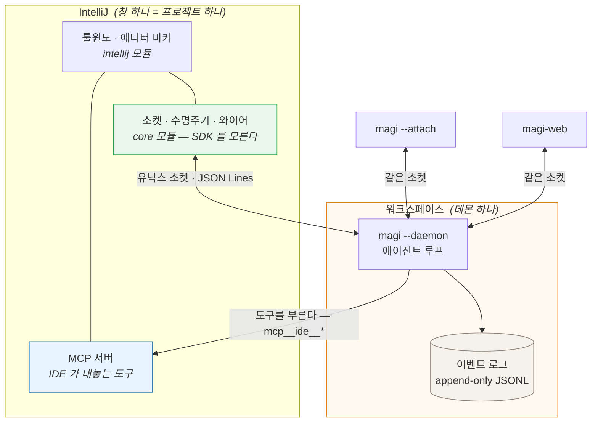
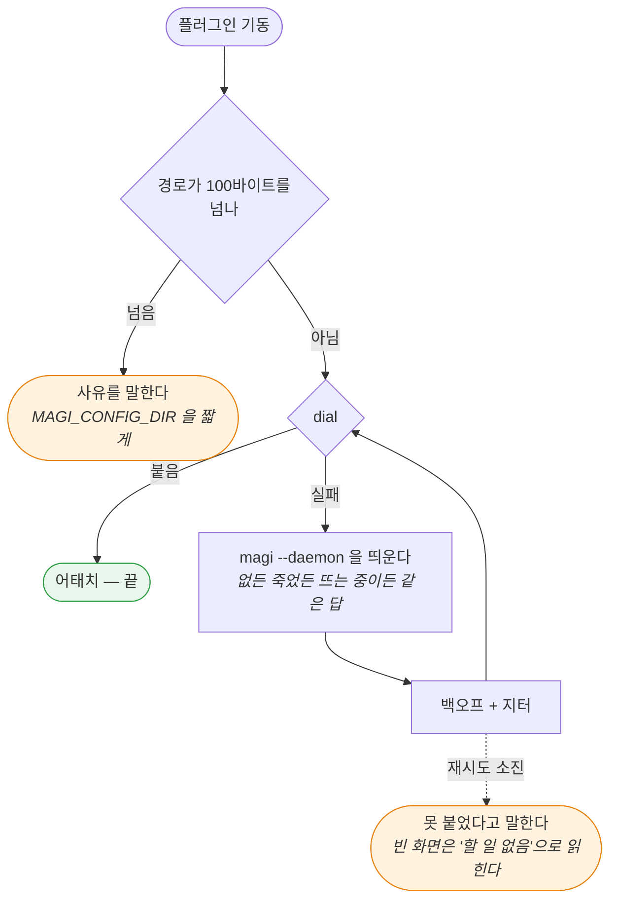
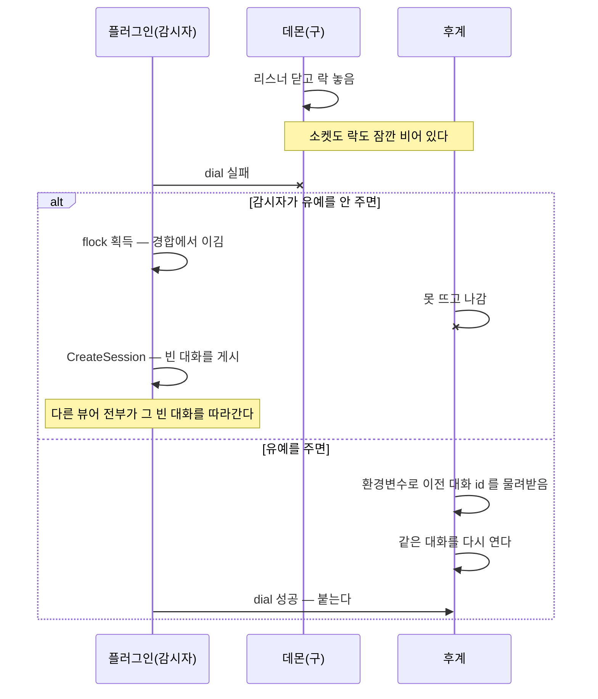
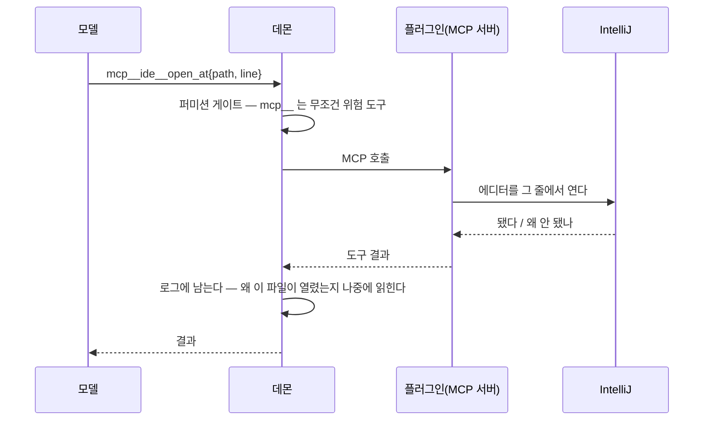

# clients/jetbrains/ — JetBrains IDE 플러그인 (IDE 안의 코딩 에이전트)

[↑ 저장소](../../README.md) · [형제: 문서 에이전트](../powerpoint/DESIGN.md)

> **이 클라이언트의 현행 레퍼런스.** 코드와 어긋나면 코드가 이기고, 어긋난 것을 발견하면 여기를
> 고친다. magi 본체의 계약을 서술하는 자리에서는 `docs/ARCHITECTURE.md` 가 이긴다 — 여기 적힌
> `daemon.go` 인용은 그 계약을 **이 클라이언트가 어떻게 쓰는지**를 말할 뿐이다.
>
> **인용은 줄 번호로 적지 않는다. 심볼로 적거나, 주석의 한 줄을 따옴표로 옮긴다.** 처음에는 "손이
> 가는 파일만 심볼, 안정된 자리는 줄 번호"라는 규칙이었는데, 안정된 자리도 안정적이지 않았다. 하루
> 만에 인용 일흔 개 중 열셋이 밀렸다 — `daemon.go:587`(WorkspaceKey)은 `typ =
> event.TypePermissionRequested` 를, `main.go:1097`(디태치 주석)은 `if bound != nil` 을,
> `daemon.go:1701`(`set-permission`)은 `Client.Hand` 를 가리키고 있었다. **인용한 사실은 하나도
> 틀리지 않았다. 썩은 것은 손가락뿐이다.** 그런데 이 문서의 목적의 절반이 손가락이다.
>
> 심볼도 이름이 바뀌면 똑같이 썩는다. 다른 점은 **기계가 확인할 수 있다**는 것뿐이라,
> `tools/citecheck.py` 가 CI에서 이 문서의 모든 심볼과 인용문을 원본에 맞춰 본다. 인용문은 **한
> 줄에 담기는 조각**이어야 한다 — grep 이 줄 단위여서, 주석에서 줄바꿈을 넘어가는 문장은 존재해도
> 안 찾힌다. 검사기를 처음 돌렸을 때 방금 쓴 인용문이 그 두 가지로 다 걸렸다(원문은 "25 **out of**
> 300" 인데 "25 of 300" 으로 적었고, 고친 뒤에도 줄바꿈을 넘어갔다).

IDE에서 열어 둔 프로젝트를 **컴패니언 하나**로 만든다. 플러그인이 켜지면 그 워크스페이스의 데몬을
찾고, 없으면 띄우고, 있으면 붙는다.

**이름이 왜 셋인가.** `clients/jetbrains/` 는 만드는 회사, `plugin/intellij/` 모듈은 **IntelliJ
Platform** — JetBrains 가 IDEA·PyCharm·WebStorm·GoLand·RubyMine 을 전부 그 위에 올리는 공통 바닥의
정식 이름이다. PyCharm 안에서도 API 네임스페이스는 `com.intellij.*` 이고 빌드 도구 이름도 "IntelliJ
Platform Gradle Plugin" 이다. 그러니 모듈 이름은 제품 IDEA 가 아니라 그 바닥을 가리킨다.

**IDEA 와 PyCharm 은 다른 제품이 맞다** — 번들된 SDK 도 언어 지원도 다르고 따로 판다. 다른 것은 그
위층이고, 이 플러그인은 아래층에만 의존한다(`plugin.xml` 의 `com.intellij.modules.platform`). 컴파일은
IDEA SDK 에 대고 하는데, 그것이 상위집합이라 그런 것이지 IDEA 전용이라는 뜻이 아니다. 문서 제목이
한동안 "IntelliJ 플러그인" 이었고 그건 틀린 말이었다.

**그리고 그것을 이제 잰다.** "모든 JetBrains IDE 에 설치된다"는 한동안 `depends` 선언에서 **유도한**
말이었고 아무도 확인한 적이 없었다. Plugin Verifier 를 릴리스 레인에 넣었다(§7). 2026-08-28 실측:
IU-261 · IU-262 · **PY-261 세 곳 전부 Compatible.**

플러그인은 두 가지를 겸한다. 하나는 magi의 **세 번째 뷰어**다 — 앞의 둘인 `magi --attach`의 TUI와
`cmd/magi-web`의 브라우저 콘솔과 같은 계약을 쓴다(로그를 읽고 소켓으로 쓴다). 다른 하나는 **손**이다.
에이전트가 요청하면 IDE에 내용을 띄우고, 열린 버퍼를 고친다. 뷰어 쪽은 §3이, 손 쪽은 §5가 다룬다.

정본은 여전히 돌아가는 데몬이다. 플러그인이 계산한 값과 데몬이 말한 값이 다르면 데몬이 맞다.



**화살표 두 개가 방향이 반대인 것이 이 그림의 요점이다.** 왼쪽은 플러그인이 데몬에 **묻는** 것이고
(뷰어), 오른쪽은 데몬이 플러그인을 **부르는** 것이다(손). 둘은 같은 연결이 아니고 같은 프로토콜도
아니다 — 묻는 쪽은 소켓, 불리는 쪽은 MCP다. 왜 그래야 하는지는 §5에 있다.

---

## 0. 용어

이 트리가 만든 말이라 먼저 정의한다. 각 항목은 경위 → 정의 → 효과 순이다.

**워크스페이스 키.** 한 저장소를 두 곳에 체크아웃하면 컴패니언도 둘이어야 하는데, 경로를 그대로
쓰면 파일 이름이 못 된다. 그래서 `WorkspaceKey`는 베이스 디렉토리 이름 + 전체 경로 해시다
(`internal/adapter/daemon/daemon.go` 의 `WorkspaceKey`). 덕분에 `ls`로 사람이 자기 것을 찾을 수 있고, 두 체크아웃이
서로 다른 소켓을 갖는다.

**데몬.** UI 없이 도는 엔진. 워크스페이스당 하나이고, 소켓은
`<configDir>/daemon-<WorkspaceKey>.sock` (`daemon.go` 의 `SocketPath`). 뷰어가 다 떨어져도 계속 일한다.

**뷰어.** 데몬에 붙어 보고 지시하는 화면. 데몬을 소유하지 않으므로 **디태치는 정지가 아니다**
(`cmd/magi/main.go`, 주석 "Detaching a viewer must not reap the daemon's work": 붙었던 프로세스가 배경 작업이나 LSP 풀을 거둬가면 안 된다).

**문(door).** 소켓 위에서 데몬이 받는 메서드 하나. 새 프로세스가 파일을 뒤져 데몬이 이미 아는 것을
다시 유도하는 대신, 데몬에게 물어보는 통로다.

**착지(landing).** 턴이 끝나는 것. 카운슬이 수락하면 그냥 끝나고, 선언 없이 예산이 다하면
`UNVERIFIED` 사유를 실은 채 끝난다. 플러그인은 이 둘을 다르게 그려야 한다.

---

## 0.5 불변식

문서 곳곳에서 근거와 함께 세운 규칙을 한자리에 모은다. 새 화면이나 새 문을 낼 때 이 여덟 개를
깨는지부터 본다. 각 줄의 사유는 괄호 안 절에 있다.

1. **데몬이 정본이다.** 플러그인이 계산한 값과 데몬이 말한 값이 다르면 데몬이 맞다.
2. **소켓은 락스텝이다.** 청하지 않은 프레임을 보내지도, 오리라 기대하지도 않는다. 스트림이
   필요하면 연결을 따로 판다. (§2 · §4)
3. **상태 파일을 만들지 않는다.** 유도할 수 있는 것은 유도하고, 유도할 수 없는 사실은 지금 없다.
   `<socket>.stopped` 를 세웠다가 버린 자리가 그 시험이었다. (§2)
4. **알아보려고 상태를 바꾸지 않는다.** 락을 확인하려면 잡아야 하고, 잡으면 막는다. 그런 질문은
   묻지 않는 것이 답이다. (§2)
5. **파생은 Go 한 곳에 남는다.** 코틀린이 전사·명단·컨텍스트의 두 번째 구현을 만들지 않는다.
   두 벌은 조용히 갈라진다. (§3)
6. **사람이 바꾼 것은 컴패니언이 볼 수 있어야 한다.** IDE 는 사람이 직접 고치는 곳이고, 그걸
   막을 수는 없으니 보이게 한다. (§5)
7. **빈 화면으로 "모른다"를 말하지 않는다.** 못 붙었으면 못 붙었다고, 데몬이 죽었으면 죽었다고
   적는다. 빈 화면은 "할 일 없음"으로 읽힌다. (§2 · §3)
8. **이미 도는 데몬의 설정을 바꾸지 않는다.** 퍼미션 모드도, 붙은 도구 서버도. 다른 창이나
   터미널이 고른 값이다. (§2 · §4)

---

## 1. 디렉토리

```
clients/jetbrains/
├── README.md          # 이 문서 — 설계
└── plugin/
    ├── settings.gradle.kts
    ├── gradle/libs.versions.toml   # 버전은 여기 한 곳
    ├── core/              # 평범한 Kotlin/JVM. IntelliJ SDK 를 모른다
    │   └── …/ide/model/        와이어 DTO — Go 의 json 태그와 이름이 같다
    │   └── …/ide/usecase/      규칙. Ports.kt 가 전송에게 물을 것을 선언한다
    │   └── …/ide/transport/    그 포트의 유닉스 소켓 구현 + 소켓 경로 계산
    └── intellij/          # IntelliJ Platform. 화면만 여기 산다
        └── …/ide/ui/           조립 지점 — 여기서 SocketDaemons 를 꽂는다
    └── tools/citecheck.py  # 이 문서와 주석의 인용이 아직 무언가를 가리키는지
```

**모듈 둘로 나눈 것은 취향이 아니라 시험 가능성이다.** `core` 가 SDK 를 모르므로 화면 없이 계약을
시험할 수 있고, SDK 를 못 받는 자리에서도 컴파일된다. 의존은 `intellij → core` 한 방향뿐이고, 그
반대가 생기면 `core` 가 SDK 를 끌어온다.

**`core` 안에서는 `usecase` 가 안쪽이고 `transport` 가 바깥이다.** 처음에는 반대였다 — `Companion`,
`Assist`, `DaemonLifecycle` 셋이 구체 클래스 `DaemonClient` 를 직접 잡고 있었다. 돌아가는 데는 문제가
없었고, 이 역전이 막는 것은 오늘의 고장이 아니라 **원격 개발**이다. Gateway 나 WSL 에서는 소켓이 다른
호스트에 있어 전송이 진짜로 달라지는데, 그때 "언제 `steer` 이고 언제 `submit` 인가" 같은 규칙까지
`SocketChannel` 을 안다는 이유로 따라 움직이면 갈아 끼울 수가 없다.

포트는 `usecase/Ports.kt` 에 둘, 통틀어 다섯 함수다. `Daemon` 이 `exchange`·`close`,
`Daemons` 가 `connect`·`alive`·`present`·`unusable`. 뒤의 둘은 원래 `DaemonLifecycle` 이
`Files.exists` 와 `SocketPath.tooLong` 으로 직접 하던 것을 옮긴 것이다. 규칙 쪽에 남겨 두면 "전송을
import 하지 않는다, 단 `SocketPath` 는 빼고"가 되고, **예외 하나짜리 경계는 곧 예외 둘이 된다.**

값이 실제로 나온 자리는 시험이다. `DaemonLifecycle` 은 백오프·지터·판정 셋을 다 갖고 있으면서
**시험이 하나도 없었다** — 시험하려면 진짜 소켓을 여닫고 진짜로 자야 했기 때문이다. 포트가 생기자
페이크 하나로 열 개가 붙었다(`DaemonLifecycleTest`).

**와이어 DTO 를 도메인 엔티티로 옮기지는 않는다.** 클린 아키텍처의 통상 처방이지만 여기서 그러면
데몬 계약의 **두 번째 표현**이 생긴다. 이 저장소가 이미 겪은 결함이다 — 같은 규칙을 두 곳에 적었더니
`sanitize` 가 갈렸고 문서가 코드와 갈렸다. 이 플러그인에는 "턴이란 무엇인가"에 대한 독자적 규칙이
없다. **데몬의 어휘가 곧 도메인이다.** 경계는 `ArchitectureTest` 가 얼려 둔다. `web/ui` 의 `interfaces → usecase → domain` 과 방향은 같지만
같은 규칙은 아니다(`web/ui/README.md` 의 "클린 아키텍처 규칙") — 거기 `domain` 에는 순수 규칙이 살고, 여기 `model` 은
와이어 DTO뿐이라 순수 층이 없다. 방향만 빌린다.

---

## 2. 켤 때: 띄우거나, 붙거나

### 소켓 경로를 어떻게 만드나

`SocketPath(configDir, workdir)`에 두 조각이 든다(`daemon.go` 의 `SocketPath`). 둘 다 틀리기 쉽다.

**`workdir`는 심링크를 푼 뒤에 해시한다.** `/tmp/x`와 `/private/tmp/x`는 같은 디렉토리인데 해시가
달라 "여기 데몬 없음"이 된다. 실측된 방식 그대로다(`daemon.go` 의 `WorkspaceKey` 안 `filepath.EvalSymlinks`). JVM 쪽은
`Path.toRealPath()`가 같은 일을 한다. IntelliJ의 `project.basePath`는 심링크를 푼다는 보장이 없으니
플러그인이 직접 푼다.

**`configDir`는 `MAGI_CONFIG_DIR`이 있으면 그것, 없으면 `os.UserConfigDir()/magi`다**
(`internal/adapter/platform/platform.go` 의 `ConfigDir`). 여기가 조용한 함정이다. macOS에서 Dock으로 띄운 IDE는
셸 프로필의 환경변수를 물려받지 않으므로, `MAGI_CONFIG_DIR`을 쓰는 사용자는 **플러그인과 터미널이
서로 다른 소켓 경로를 계산한다.** 한 워크스페이스에 데몬이 둘 생기거나, 하나가 도는데 "없다"고
나온다. 플러그인은 (a) 사용자가 지정할 수 있게 하고, (b) 데몬을 띄울 때 **경로를 계산할 때 쓴 것과
같은 환경**으로 띄우고, (c) 지금 어느 config 디렉토리를 보고 있는지를 설정 화면에 적는다.

**경로가 100바이트를 넘으면 그 사유를 그대로 보여 준다.** magi가 전용 에러를 준비해 두었고 해법까지
문장에 들어 있다(`daemon.go` 의 `tooLong`, "set MAGI_CONFIG_DIR to somewhere shorter"). 이것을 "데몬 없음"으로
읽으면 사용자는 영원히 고칠 수 없는 실패를 본다.

### 갈래는 dial 하나로 정한다

| 관찰 | 뜻 | 플러그인 동작 |
|---|---|---|
| dial 성공 | 데몬이 산다 | **붙는다.** 새로 띄우지 않는다 |
| dial 실패 | 없거나, 죽었거나, 지금 뜨는 중 | `magi --daemon`을 시도한다 |



**세 가지 실패를 구분하지 않는다.** 어느 쪽이든 답이 같기 때문이다. 띄워 보고 `flock`이 판정하게
둔다. 이미 도는 데몬이 있으면 기동이 실패하고, 그 실패가 곧 "붙어라"라는 답이다.

**진 쪽은 지수 백오프와 지터를 넣어 다시 dial한다.** 기동 경쟁에서 지는 것은 예외가 아니라 정상이다.
같은 프로젝트를 연 IDE 창 셋이 한꺼번에 뜨는 일이 흔하고, 지터가 없으면 셋이 같은 박자로 재시도해
같은 순간에 또 부딪힌다. 형제 프로젝트가 같은 이유로 같은 답을 냈다
(`clients/powerpoint/DESIGN.md` 의 "5.3 획득-또는-접속").

**끝내 못 붙으면 말한다.** 재시도를 다 쓰고도 실패하면 툴윈도를 빈 채로 두지 않고 못 붙었다고 그
사유와 함께 적는다. 빈 화면은 "할 일 없음"처럼 보이는데 사실은 "모른다"이고, 이 트리는 그 둘을
구분한다(`docs/UI.md` 의 "The rules this page keeps").

**락 파일을 열어 보지 않는다.** 두 가지 이유가 각각으로 충분하다. 첫째, `flock`으로 확인하려면 락을
직접 잡아야 하는데 성공하면 플러그인이 그 락을 쥐고 진짜 데몬을 막는다. 둘째, **애초에 확인할 수도
없다.** magi는 `flock(2)`을 쓰고(`claim_unix.go` 의 `claimPath`) 자바의 `FileChannel.tryLock()`은 리눅스·macOS에서
`fcntl` 레코드 락으로 내려가는데, 이 둘은 서로 충돌하지 않는다. 잡히지도 않고 잡아도 소용없다.

**소켓 파일도 지우지 않는다.** magi의 `Listen`이 그 일을 이미 안전하게 한다. 순서가 핵심이다. 먼저
클레임을 잡고, 그다음 dial로 "정말 아무도 안 듣는다"를 증명하고, 그때서야 지운다
(`daemon.go` 의 `Listen`, 주석 "removing a LIVE one succeeds, silently orphans the running": 살아있는 소켓을 지우면 성공하면서 도는 데몬의 리스너를 조용히 고아로
만든다). 그 증명 없이 플러그인이 먼저 지우면 정확히 그 사고가 난다. 클레임을 안 잡고 하던 시절의
실측이 300회 동시 기동 중 25회다(`claim_unix.go` 머리 주석, "Measured at 25 out of 300").

### 데몬을 IDE에서 떼어 놓고 띄운다

**`magi --daemon`은 스스로 배경으로 가지 않는다.** `cmd/magi` 어디에도 `setsid`도 fork도 없고, 그냥
소켓과 세션을 찍고 서빙한다(`cmd/magi/main.go` 의 `run`, `daemon.Serve` 호출). `ProcessBuilder`로 그냥 띄우면 유닉스에서는
IDE의 프로세스 그룹에 남고, 윈도우에서는 IDE의 Job Object에 묶여 **IDE와 함께 죽는다.** "IDE를 닫아도
데몬은 남는다"가 공짜로 되지 않는다.

그래서 플러그인이 떼어 준다. 유닉스는 자식을 새 세션으로 보내고(magi 자신이 배경 작업에 쓰는 것과
같은 수단이다, `internal/adapter/platform/detach_unix.go` 의 `detach`), 윈도우는 `DETACHED_PROCESS`와
`CREATE_BREAKAWAY_FROM_JOB`을 준다.

**stderr는 파일로 보낸다.** 크래시 루프를 진단하려면 마지막 기동의 stderr가 있어야 하는데, 떼어 낸
프로세스의 출력은 IDE가 죽으면 갈 곳이 없다. config 디렉토리 아래 소켓 이름을 딴 로그 파일 하나면
된다.

### 붙어 있는 동안 데몬이 죽으면

**다시 띄운다.** 워크스페이스에 데몬 하나가 계속 있는 것이 목표 상태이고, 플러그인은 그 상태를
유지하는 쪽이다. 다만 "안 보인다"에는 세 가지 다른 사정이 섞여 있어서 즉시 재기동하면 틀린다.

| 사정 | 겉보기 | 옳은 반응 |
|---|---|---|
| 연결만 끊김 | dial은 되는데 우리 소켓이 닫힘 | 다시 dial. 기동하지 않는다 |
| 자기재시작(업데이트) | 짧은 dial 실패, 곧 돌아옴 | 유예. **이 경합은 져야 한다** |
| 진짜 죽음 | 유예를 넘겨도 dial 실패 | 기동한다 |

자기재시작이 실제로 저 창을 만든다. 유닉스에서는 데몬이 리스너를 닫고 **락까지 놓은 뒤**
`syscall.Exec`으로 같은 PID 위에 새 이미지를 올린다(`internal/graceful/graceful_unix.go` 의 `reexec`,
`daemon.go` 의 `Serve` 주석). 윈도우는 execve가 없어 후계 프로세스를 띄우고 자기는 나간다
(`graceful_windows.go` 의 `reexec`). 어느 쪽이든 소켓도 락도 잠깐 비어 있다. 그러니 락이 비었다는 것으로
죽음을 판정할 수 없다. 그리고 이 일은 사람이 부를 때만 나지 않는다. 자동 업데이트 루프가 자기
일정으로도 재시작한다(`cmd/magi/autoupdate.go`).



**그 경합에서 감시자는 반드시 져야 한다.** 앞서 "결과가 같으니 무해하다"고 쓸 뻔했는데, 같지 않다.
후계는 이전 대화 id를 환경변수로 물려받아 그 대화를 다시 연다(`cmd/magi/main.go` 의 `restartSessionEnv`, 소비는
같은 파일의 `os.Getenv(restartSessionEnv)`). 감시자가 이겨서 후계가 못 뜨면 감시자의 데몬은 `CreateSession`으로 **빈 대화를 새로 만들어
게시하고**(`cmd/magi/main.go` 의 `a.CreateSession` 호출), `RunCron`이 그 위에서 시작하며(`cmd/magi/main.go` 의 `a.RunCron` 호출), 다른 뷰어는 전부
`PublishedSession`으로 그 빈 대화를 따라간다(`cmd/magi/main.go` 의 `daemon.PublishedSession` 호출). 자기 자신만 나중에 `resume`으로
돌아오는 것은 고침이 아니다. 나머지 모두에게 결함이 재현된다. 그래서 유예는 재시작 창보다 넉넉히
길어야 하고, 이 값은 실측해서 정한다.

**진짜로 죽어서 감시자가 띄우는 경우에는 세션을 이어붙여야 한다.** 이때도 후계가 아니므로 환경변수를
못 받고 빈 대화로 간다. 플러그인이 `resume`을 보내 되돌릴 수는 있지만 위와 같은 이유로 늦다. 올바른
답은 magi 쪽에 있다. `--resume <sessionId>` 플래그를 내거나, 데몬이 뜰 때 자기 워크스페이스의 마지막
게시 세션을 읽게 하는 것이다. 지금 플래그 52개 중 세션을 지정하는 것이 없다. 플러그인 단독으로 할 수
있는 것은 `resume` 뿐이고, 그건 임시방편이라고 적어 둔다.

**기동이 됐는지는 dial로 판정한다.** `<socket>.session`이 나타났는지로 보면 안 된다. SIGKILL로 죽은
데몬은 그 파일을 **남기고** 가므로(`daemon.go` 의 `Serve`, 주석 "a daemon killed with SIGKILL leaves the file behind") 조건이 t=0에 이미 참이다. 파일을 쓰려면 기동
전에 읽어 둔 `pid`·`started`와 달라졌는지까지 봐야 한다(둘 다 와이어 불변 필드다,
`wire_invariant_test.go` 의 `TestWireStructsAreAdditiveOnly`).

**크래시 루프에서 손을 뗀다.** 60초 안에 세 번 띄웠는데 또 죽으면 감시를 멈추고, 로그 파일에 남은
마지막 stderr를 툴윈도에 그대로 보여 준다. 설정 하나가 잘못돼 데몬이 즉사하는 경우 무한 재기동은
문제를 숨기기만 한다.

**IDE가 하나도 안 떠 있으면 아무도 감시하지 않는다.** 이 설계의 한계이고 적어 둔다. 형제 프로젝트는
이 자리를 OS 감독자(macOS LaunchAgent의 `KeepAlive`, 윈도우 예약 작업)에 맡기고 자체 선출은 감독자가
없거나 아직 안 돌 때만 메우게 했다(`clients/powerpoint/DESIGN.md` 의 "감독은 OS에 맡기되, 감독자는 의도를 모른다"). 그쪽에서 사용자당 하나인 것은
**헬퍼**라 정적인 감독자 항목 하나로 덮이지만, magi의 데몬은 워크스페이스마다 하나이고 워크스페이스는
생겼다 없어진다. 열어 본 적 없는 프로젝트의 데몬을 launchd에 미리 등록할 수는 없다. 그래서 여기서는
감시가 뷰어의 일이고, 뷰어가 없는 동안은 감시도 없다.

### 사람이 끈 것과 죽은 것

사용자가 A 창에서 `Stop companion`을 눌렀는데 B 창의 감시자가 그것을 죽음으로 읽으면 정지 버튼이
동작하지 않는다. 그런데 디스크는 이 둘을 절반만 구분해 준다. 깨끗한 종료는 소켓과 레코드를 지우고
가지만(`daemon.go` 의 `Serve` 가 나가며 소켓을, `Publish` 가 돌려주는 정리 함수가 레코드를 지운다), SIGKILL은 둘 다 남긴다
(`daemon.go` 의 `Serve`). 남은 절반 — 사람이 껐나, 데몬이 자기 오류로 나갔나 — 은 파일로 안 보인다.

**상태 파일을 만들지 않는다.** 이 트리의 규칙은 "아무것도 status 파일을 쓰지 않으므로 낡을 수가
없다"이고(`docs/ARCHITECTURE.md` §11, `docs/UI.md` 의 "The rules this page keeps"), `.stopped` 같은 표식은 정확히 그 규칙이 막는
것이다. `.lock`은 커널이 거두고 `.session`은 defer가 지우지만, 표식 뒤에는 커널도 defer도 없다.
누군가 터미널에서 `magi --daemon`으로 다시 켜면 그 표식은 영원히 낡은 채 남아 그 워크스페이스를
영영 감시 대상에서 빼 버린다.

**데몬이 나가면서 말하게 하는 것도 안 된다.** 열린 연결에 작별 프레임을 밀어 넣는 안을 세웠다가
버렸다. 그 소켓은 **락스텝**이다. `Client.exchange`가 뮤텍스를 잡고 요청 한 줄을 쓴 뒤 **다음 한
줄을 그 요청의 답으로** 읽으므로, 청하지 않은 프레임은 진행 중인 호출의 답으로 소비되거나 버퍼에
남아 다음 호출의 답이 된다. 그 뒤로 그 연결의 모든 교환이 한 칸씩 밀린다. 데몬 자신이 이것을 불변식으로
적어 두었고, 유일한 예외인 `watch`가 예외인 이유가 바로 연결을 통째로 넘겨받기 때문이라고 밝힌다
(`daemon.go` 의 `serveConn`: "A UI's connection, which interleaves calls under one mutex, never sees an
unsolicited frame"). 추가-전용 규칙은 **필드 이름**에 대한 것이지(`wire_invariant_test.go` 의 `requireFields`)
프레이밍에 대한 것이 아니다.

**대신 디스크에서 유도한다.** 위의 절반이 이미 답을 준다.

| 관찰 | 뜻 | 감시자 |
|---|---|---|
| 소켓 파일 없음 | 질서 있게 나갔다 | **되살리지 않는다** |
| 소켓 파일 있는데 dial 실패 | 죽임을 당했다 | 되살린다 |

깨끗한 종료는 소켓을 지우고 가고 SIGKILL은 남긴다. 그러니 "사람이 껐다"는 **되살리지 않는 쪽에 이미
들어가 있다.** 표식도, 프레임도, 창들 사이의 합의도 필요 없다. A 창에서 누른 `Stop`이 B 창에서도
동작하고, 터미널의 `magi --stop`도 같은 경로로 덮인다.

이 규칙이 함께 가져가는 것을 숨기지 않는다. **데몬이 자기 오류로 스스로 나간 경우도 되살리지
않는다.** defer가 도는 종료는 전부 소켓을 지우고 가기 때문이다. 나가기로 **결정한** 프로세스를 다시
세우지 않는 쪽을 고른다. 죽임을 당한 것과 스스로 나간 것은 다른 사건이고, 감시가 메워야 할 것은
앞엣것이다.

### 플러그인이 여럿일 때

한 머신에 IDE 창이 여럿이고, 다른 IDE의 플러그인이나 다른 도구가 같은 일을 할 수도 있다. **조정
프로토콜을 만들지 않는다.** 이미 있는 것으로 충분하다.

- **누가 데몬인가는 `flock`이 정한다.** 감시자 N개가 동시에 재기동을 시도해도 하나만 바인드하고
  나머지는 "another magi is starting or running"을 받는다(`claim_unix.go` 의 `claimPath`). 진 쪽은 이것을
  에러로 띄우지 않고 그냥 다시 dial한다. 원하던 결과가 이미 이루어졌기 때문이다.
- **누가 살아있는가는 dial이 말한다.** 위의 이유로 파일 존재는 답이 아니다.

감시는 **워크스페이스 단위**다. 창 여럿이 같은 프로젝트를 열면 감시자도 여럿이지만 데몬은 하나이고,
서로를 몰라도 된다. 다른 프로젝트의 데몬은 감시하지 않는다.

### 한 워크스페이스를 IDE 두 종류로 열면

같은 폴더를 IntelliJ IDEA 와 PyCharm 으로 동시에 여는 것은 **드문 일이 아니다** — 서버가 자바이고
스크립트가 파이썬인 저장소에서 흔하다. 그리고 이 플러그인은 `plugin.xml` 이
`com.intellij.modules.platform` 에만 의존하므로 **모든 JetBrains IDE 에 설치된다**(`modules.java`
였다면 PyCharm 에는 안 붙는다). 그러니 가정이 아니라 일어나는 일이다.

`WorkspaceKey` 는 워크스페이스 **경로**로 만들고 IDE 종류가 안 들어간다. 그래서 셋이 갈린다.

**① 데몬은 하나다 — 의도한 대로 된다.** 둘이 같은 소켓 경로를 계산하고, 먼저 뜬 쪽이 띄우고 나중
쪽이 붙는다. 위의 `flock` 규칙이 그대로 적용된다. 여기는 고칠 것이 없다.

**② 열린 버퍼는 서로를 덮어쓴다 — 지금 이미 그렇다.** `openFiles` 는 `session.SessionID` 가 키다
(`internal/app/app.go` 의 `App`). 두 IDE 가 같은 게시 세션에 붙으므로 **같은 칸**에 쓴다. PyCharm 이
`foo.py` 를, IDEA 가 `bar.java` 를 보내면 나중 것이 이긴다. `OpenBufferListener` 가
`selectionChanged` 마다 쏘므로 실제로는 **사람이 마지막으로 클릭한 IDE** 가 이긴다.

**그리고 모델은 그 모호함을 볼 방법이 없다.** 키가 세션이라 구조상 기록자 한 명짜리 칸이고, 도구
결과에는 "이것이 두 편집기 중 어느 쪽이 마지막에 말한 것인지"가 안 실린다. 마지막이 이기게 두기로
정하더라도 **그 사실이 결과에 실려야** 모델이 자기가 무엇을 보고 있는지 안다(§0.5 — 모름은 모름으로).

이것을 결함이라고 부르기 전에 따져야 할 것이 있다. 사람이 방금 클릭한 창이 사람이 보고 있는
곳이므로 **마지막이 이기는 것이 맞는 답일 수 있다.** 문제는 그것이 설계가 아니라 사고라는 점이다 —
`SetOpenFile` 은 콘솔 편집기 하나를 상정하고 쓰였고, 두 IDE 가 번갈아 쏠 때 무엇이 옳은지는 아무 데도
안 적혀 있다. 결정하고 적기 전까지는 우연이다. 덧붙여 `ambientTTL` 이 지나면 조용히 사라지므로,
"왜 에이전트가 내가 보던 파일을 모르지"의 원인이 둘이 된다.

**③ 손은 하나만 될 수 있다 — 앞으로 확실히 부딪힌다.** MCP 이름을 `jetbrains` 로 **고정**했고(§4),
코어는 같은 이름 둘을 거부한다: `"jetbrains" is already attached; two servers cannot share one name`
(`internal/adapter/mcp/manager.go` 의 `registerClient`). 그러면 둘째 IDE 는 뷰어로만 살고,
에이전트의 `apply_edit` 는 **먼저 붙은 IDE** 로만 간다. 사람이 PyCharm 을 보고 있어도 편집은 IDEA 에서
일어난다.

이름을 IDE 별로 나누는 것은 답이 아니다. 고정한 근거가 "`mcp__` 도구는 항상 위험 도구로 취급되고
(`internal/app/execute.go` 의 `dangerGated`) allow 규칙은 이름에 걸리므로, 이름이 바뀌면 사람이 써
둔 규칙이 무효가 된다"이고 그 근거는 IDE 가 둘이어도 그대로다.

**규칙은 "같은 자원을 둘이 잡을 때의 선착순"이다.** "컴패니언당 손은 하나"라고 적고 싶은 유혹이
있는데 그러면 **경쟁이 아닌 경우까지 덮는다** — 프로젝트 둘을 각각 연 IDE 창 둘은 워크스페이스가
달라 데몬도 다르고 네임스페이스도 별개라 아무것도 안 부딪힌다. 부딪히는 것은 **같은 워크스페이스**를
둘이 열었을 때뿐이다. (형제 프로젝트는 같은 고정 이름을 쓰면서도 이 벽에 안 닿는데, 붙는 주체가
창이 아니라 사용자당 하나인 헬퍼라서다 — 창이 둘이면 둘째는 붙는 대신 선 헬퍼에 합류한다.
`clients/powerpoint/DESIGN.md` 의 "5.2 헬퍼는 사용자당 하나 — 데몬과 같은 축이 아니다".)

그리고 거절을 삼키지 말고 **보여야** 한다 — "이 워크스페이스의 손은 IntelliJ IDEA 가 잡고 있다"를
둘째 IDE 의 툴윈도에 적는다. 손이 아닌 것과 고장난 것은 다른 사건이고, §0.5-7 이 그 둘을 빈 화면으로
합치지 말라고 한다. **못 붙은 것과도 다르다** — 붙기는 붙었는데 손이 아닌 상태이고, 사용자가 보는
증상은 둘 다 "아무 일도 안 일어난다"로 같다.

오늘 ③은 아직 안 터진다. 손을 아직 안 붙였기 때문이다(`McpName` 은 있고 `mcp-attach` 를 부르는
자리는 없다). 붙이는 날 같이 정해야 하는 것이라 여기 적어 둔다.

### 바이너리를 어디서 찾는가

`magi`가 있어야 데몬을 띄운다. 순서는 설정에 적힌 경로 → `PATH` → 없으면 기동하지 않고 툴윈도에
"magi를 못 찾았다, 경로를 지정하거나 설치하라"를 띄운다. 플러그인이 바이너리를 다운로드하지 않는다.
`--update`는 magi 자신의 일이고, 체크섬 검증과 롤백이 거기 붙어 있다.

### 퍼미션 모드는 건드리지 않는다

데몬의 기본은 `allow`다. 아무도 안 보는 동안 도는 일이 사람을 기다리며 서면 안 되기 때문이다
(SECURITY.md §7). IDE에서는 사람이 보고 있으니 `auto`가 나아 보이는데, **그 직관이 틀린다.**

무응답 프롬프트는 `Permission() == "allow"`일 때만 통과로 해소된다(`internal/app/permission.go` 의 `requestPermission`).
`auto`에서는 3분(`cmd/magi/agents.go` 의 `daemonAnswerWait`)을 다 태운 뒤 **거부**로 끝난다. 그리고 그 타이머는 데몬이면
모드와 무관하게 항상 걸려 있다(`cmd/magi/agents.go` 의 `answerableRun`). 그러니 `auto`로 켜 둔 채 IDE를 닫으면
컴패니언은 게이트가 걸린 호출마다 3분을 서 있다가 거절당한다. SECURITY.md §7이 데몬 기본을 `allow`로
둔 이유가 바로 그 문장이다.

그래서 플러그인은 **`--permission`을 붙이지 않는다.** 우선순위가 플래그 > env > config이므로
(MANUAL §3), 붙이는 순간 사용자가 `config.toml`에 적어 둔 값을 매번 조용히 덮기도 한다. 하필 그
설정은 이 에이전트가 자기 머신에서 무엇을 해도 되는지를 정하는 값이다.

대신 세 가지를 한다. 지금 어떤 모드로 도는지를 상태 표시줄에 **항상 보이게** 두고, 바꾸고 싶으면 한 번
눌러 `set-permission`을 보내고(`daemon.go` 의 `Client.SetPermission`), **`ask`나 `auto`로 바꿀 때는 "지켜보는 사람이 없으면
호출마다 3분 뒤 거부된다"를 그 자리에서 말한다.** 이미 도는 데몬에 붙을 때는 그 데몬의 모드를 절대
바꾸지 않는다. 다른 창이나 터미널이 고른 값이다.

---

## 3. 읽기와 쓰기는 다른 통로다

두 기존 뷰어가 이미 같은 모양이다.

- `magi --attach`의 `attached`는 `*app.App`을 임베드해 **읽고**, `daemon.Client`로 **쓴다**
  (`cmd/magi/attach.go` 의 `attached`).
- `magi-web`은 LLM도 툴도 없는 자기 App으로 로그를 읽고, 변경 라우트만 소켓으로 넘긴다.

JVM에는 `app.App`이 없다. 그래서 이 문서가 답해야 하는 질문은 하나다: **읽기 쪽 파생을 어디서
하는가.**

| 안 | 방법 | 대가 |
|---|---|---|
| A | JSONL 로그를 코틀린이 직접 파싱 | 파생 구현이 둘이 된다. 이벤트 재구성·툴 결과 렌더·컨텍스트 계량이 Go와 Kotlin 양쪽에 생기고, 조용히 갈라진다 |
| B | `magi-web`을 자식 프로세스로 띄우고 HTTP/SSE를 쓴다 | 파생은 하나로 유지된다. 대신 프로세스 둘, 루프백 포트 하나, 그리고 자체 인증이 없는 콘솔을 IDE가 연다는 정책 결정 |
| C | **데몬에 읽기 문을 낸다** | 파생이 Go 한 곳에 남고, 상대는 소켓 하나뿐이다. 데몬 쪽 작업이 있고, 데몬이 죽으면 읽을 것도 없어진다 |

**C를 채택한다.** 근거는 셋이다.

1. 이미 데몬이 파생을 서빙하고 있다. `Jobs`·`Status`·`Git`·`GitDiff`·
   `PRFacts`는 계산된 답을 소켓으로 돌려주는 메서드다.
2. IDE가 필요로 하는 동작의 대부분이 **이미 소켓 메서드다.** `magi-web`이 `/look` `/complete`
   `/open-file` `/suggest` `/save` `/git-do` `/file-do` `/git-msg` `/pr-msg` `/git-pr`에서 하는 일은
   전부 `daemon.Client`의 `LookOver`·`CompleteCode`·`SetOpenFile`·`Suggest`·`PatchFile`·`WriteTool`·
   `GitDo`·`FileDo`·`DraftCommit`·`DraftPR`·`OpenPR` 호출이다. 플러그인은 같은 것을 그대로 부른다.
3. 와이어가 **추가만 허용**하도록 이미 테스트로 못 박혀 있다(`wire_invariant_test.go` 의 `TestWireStructsAreAdditiveOnly`). 필드를
   지우거나 이름을 바꾸면 실패하고, 더하는 것은 통과한다. 읽기 문을 내는 일은 그 규칙이 전제하는
   종류의 변경이다.

이 추가는 **보안 경계를 넓히지 않는다.** 새 메서드는 컨트롤 소켓에 붙고, 그 소켓은 만들어지는 첫
순간부터 소유자만 닿는다(`listen_unix.go` 의 `listenOwnerOnly` 가 umask를 `0o177`로 뒤집는다). 다른 머신이 오는 문은
`--fleet-door`이고 거기는 `about, hand, hand-state, watch` 넷만 지난다(`cmd/magi/door.go` 의 `doorMethods`). 그
목록에 아무것도 더하지 않는다.

### C의 크기와 대가를 줄여 말하지 않는다

**한 메서드가 아니다.** `magi-web`이 스토어에서 직접 파생하는 것은 `ContextStateOf`·`PlanOf`·
`LoopMap`·`SessionDiff`·`ChildSessions`·`SessionState`·`UnfinishedTurnOf`·`CouncilMarks`·
`CouncilEvidenceOf`·`ListSessions`·`RankSessions`로 열한 개 남짓이다(`cmd/magi-web` 의 `server.context`,
`server.plan`, `server.loop`, `server.subagents`, `server.history`, `server.search`). 플러그인이 첫판에
필요한 것은 전사와 카운슬 정도이고 나머지는 화면이 생길 때 따라간다.

**데몬이 죽으면 읽을 것도 사라진다.** 이것이 A·B에 없는 C의 진짜 대가다. `magi-web`과
`magi --attach`는 자기 리더를 들고 있어서 데몬이 없어도 지난 기록을 읽는다. 플러그인은 못 읽는다.
하필 §2의 크래시 루프 경로가 바로 그때 걸리므로, **감시를 포기한 화면에서 사용자가 죽기 직전 상황을
못 읽는** 상태가 된다.

받아들이되 숨기지 않는다. 전사 창은 마지막으로 받은 프레임을 지우지 않고 그대로 세워 둔 채, 이것이
멈춘 그림이고 데몬이 없다고 말한다. 빈 화면과 "아무 일도 없었다"를 구분하는 것이 이 트리의 규칙이다
(`docs/UI.md` §4-3: 모름은 모름으로).

### 없는 것: 전사

플러그인에 가장 먼저 필요한 것은 전사다. 그 모양은 이미 정의돼 있다. `cmd/magi-web/main.go` 의 `line` 구조체가 가진
`line`이 `who, text, tool, args, note, ok, out, pending, round, decision, member, at, diff,
abandoned, by`를 갖는다. `ok`가 포인터라서 "아직 안 끝난 호출"과 "실패한 호출"이 구분된다.

그러니 **새 렌더러를 만들지 않는다.** 그 렌더 함수를 두 호출자가 같이 쓰는 자리로 옮기고, 데몬에
`transcript` 메서드를 낸다. 콘솔과 플러그인이 같은 행을 받는다.

### 스트리밍

`watch`가 이미 연결 하나를 스트림으로 바꾼다. 다른 메서드는 안 그런다(`daemon.go` 의 `serveConn`). 전사도
같은 방식으로 낸다: 한 줄 요청, 그 뒤로는 데몬이 프레임을 밀어 준다.

**`watch` 를 빌려 쓸 수는 없다.** 그것이 흘리는 것은 `Handover` 이고, 그것도 `Name` 에 실은 **접수증
하나**의 것이다(`daemon.go` 의 `Client.Watch` 는 `each func(Handover) bool` 을 받는다). 그리고 데몬은
`Taker` 가 아닌 엔진에게는 "this daemon cannot be handed work" 로 거절한다. 그러니 `watch` 에서 가져올
것은 **프레이밍의 선례**뿐이고 — 요청 한 줄, 그다음부터 연결이 통째로 넘어감 — 전사는 새 메서드다.

형제 프로젝트가 같은 벽을 먼저 만났고 **다른 답을 얻었다.** 그쪽 헬퍼는 magi 모듈 **안**이라
`App.Subscribe` 에 직접 붙어 아래로 릴레이할 수 있다(`cmd/magi/attach.go` 의 `attached` 가 하는 그 일).
이 플러그인에는 그 길이 없다 — JVM 이고 소켓 하나뿐이다. §3 이 안 C 를 고른 이유가 여기서 한 번 더
확인된다: 우리에게 프로세스 안의 지름길이 아예 없다.

**구독은 재생으로 시작한다.** 붙는 순간 지금까지의 로그를 먼저 받고 그다음 라이브를 받는다. 늦게 붙은
클라이언트가 앞을 못 보면 안 된다. magi의 `Subscribe`가 이미 그 계약이고(`internal/app/app.go` 의 `Subscribe`:
영속 이벤트를 리플레이한 뒤 라이브로 잇는다), 콘솔도 첫 패스를 `lastSeq = -1`로 열어 백로그를 통째로
받는다. 새 `transcript` 메서드가 지켜야 할 계약이 그것이다.

폴링 간격은 콘솔이 실측한 값을 따른다. 전사는 400ms(`cmd/magi-web/main.go` 의 `server.events`), 명단은
700ms(`cmd/magi-web/main.go` 의 `server.fleetStream`). 데몬이 미는 쪽이 되면 그 값은 데몬 안으로 들어가고 플러그인은 안
갖는다.

**창 하나에 스트림 하나.** 콘솔이 브라우저 연결 6개 한도에서 배운 규칙이다. IDE에는 그 한도가 없지만
같은 이유가 남는다: 툴윈도 셋이 각자 스트림을 열면 같은 프레임을 세 번 파싱한다. 스트림은
`usecase`가 단독으로 소유하고 화면은 구독만 한다.

---

## 4. 와이어

한 줄에 JSON 객체 하나. 프레이밍이 그 이상 필요 없고 `nc`로 사람이 읽을 수 있다
(`daemon.go` 의 `Request` 주석, "One object per line"). 서버는 `bufio.Scanner`, 클라이언트는 `json.NewEncoder`
(`daemon.go` 의 `serveConn` 과 `newClient`).

요청 필드: `method, session, text, callId, decision, answer, name, looking, meeting, n, args, ask`.
응답 필드: `ok, error, waiting, doing, out, exit, permission, user, jobs, tools, models, why,
session, handover, version, proto, caps`(`wire_invariant_test.go` 의 `TestWireStructsAreAdditiveOnly`).

전송은 어디서나 AF_UNIX다. Windows도 마찬가지고, 거기서는 소켓이 담긴 디렉토리의 ACL이 권한을
정한다(`listen_windows.go` 의 `listenOwnerOnly`). JVM은 `UnixDomainSocketAddress` + `SocketChannel`로 같은 것을 연다.
이것이 **JDK 16 이상을 요구하고**, 그 요구가 지원 가능한 IDE 최소 버전을 정한다. 열린 질문이 아니라
제약이다.

**버전 협상은 `about`으로 한다.** 응답의 `version`·`proto`·`caps`를 읽는다. 다만 지금 `Caps()`는
`{"handshake"}` 하나만 돌려준다(`daemon.go` 의 `Caps`). 그러니 오늘 나가는 어떤 데몬에도 `transcript`
capability가 없고, 플러그인은 자기 주력 창을 못 여는 상태를 **정상 경로로** 다뤄야 한다. 그 화면은
빈 채로 두지 않고, 데몬이 이 기능을 모르는 빌드라고 말하고 버전을 함께 보여 준다. 없는 메서드를 불러
에러를 읽는 방식으로 알아내지 않는다.

문이 있는 빌드인지는 **`caps` 의 `tool-servers`** 로 안다. 한때 문은 착지했는데 광고가 안 따라와서
`{"handshake"}` 하나였고, 그러면 알 길이 위 규칙이 금지한 그 방법(불러 보고 에러 읽기)밖에 없었다.
이 저장소가 이름 붙인 드리프트는 광고가 구현보다 **앞서는** 쪽인데 그건 **반대 방향**이었다 — 구현이
광고보다 앞섰고, 조용한 만큼 더 늦게 보인다. 지금은 `{"handshake", "tool-servers"}` 다.

### `mcp-attach` / `mcp-detach` — 착지함

**착지했다.** 여기 적힌 계약대로 코어에 들어갔다 — `daemon.go` 의 디스패치에 `mcp-attach` 와
`mcp-detach` 가 있고, Go 쪽 호출자는 `daemon.Client.AttachMCP(name, url, headers) → []string` 과
`daemon.Client.DetachMCP(name) → (removed bool, err error)` 다. **이 플러그인의 메서드가 아니다** —
코틀린에는 아직 부르는 자리가 없고 `Wire.Request` 에 `url`·`headers` 필드만 생겼다. 두 제품이 같은
문을 쓰므로 모양은 계속 여기 둔다.

부를 자리가 생기면 둘을 지킨다. **이름은 문자열 리터럴이 아니라 `McpName.VALUE` 를 지난다** — 호출부가
`"jetbrains"` 를 다시 적으면 상수를 둔 이유가 그 자리에서 없어진다. 그리고 **detach 의 `false, nil` 을
삼키지 않는다**: 그건 실패가 아니라 "뗄 것이 없었다"이고, 크래시 뒤 재접속하는 쪽에는 정상이다.

| | 요청 | 뜻 |
|---|---|---|
| `mcp-attach` | `name`, `url`, `headers`(선택) | 이 컴패니언에 HTTP MCP 서버를 **런타임으로** 붙인다 |
| `mcp-detach` | `name` | 떼어 낸다 |

`name` 은 네임스페이스가 된다. 붙고 나면 도구가 `mcp__<name>__<tool>` 로 목록에 들어간다
(`internal/app/execute.go` 의 `gateAllowlist`). 응답은 `ok`, 실패면 `error`, 성공이면 등록된 도구 이름을 `tools` 에
싣는다 — 호출자가 무엇이 생겼는지 알아야 화면에 그린다. 셋 다 이미 있는 응답 필드다.

**실패는 구분되어야 한다.** "안 붙었다" 하나로 뭉치면 사용자가 고칠 수가 없다. 최소한 이 넷이다:
서버에 못 닿음(URL·포트 문제) / 그 이름이 이미 붙어 있음 / 이름이 내장 도구를 가림 / 정책이 거부함.

둘째 것은 **문이 새로 막을 필요가 없다.** `registerClient` 가 이미 거부한다. 그 방어가 들어온 사유가
이 문의 사유이기도 하다 — 커밋 `449d02bc` 가 "설정 맵에서만 이름이 오는 동안에는 도달 불가였다"고
적는데, 밖에서 런타임에 붙이기 시작하면 도달 가능해지는 결함이었다. 맵이 두 번째를 조용히 받아
첫 연결이 영영 안 닫히고 `Remove(name)` 이 절반만 지우던 것이다.

**런타임 전용이고 config 에 쓰지 않는다.** `internal/adapter/mcp/manager.go` 의 `AddHTTPDynamic` 과
`Remove` 가 이미 그 자리다(이 파일은 지금 손이 가고 있어 줄 번호 대신 함수 이름으로 짚는다). config 에 쓰면 서버가 없는 날에도 `[mcp.<name>]` 이 남아 매 기동마다
붙으러 간다. 그리고 **`[mcp]` 는 플러그인이 grant 를 받아도 못 만지는 섹션**이라
(`internal/adapter/plugin/lua/permission.go` 의 `denyConfigSections`), 그 옆에 config 를 쓰는 길을 내면 닫아 둔 문 옆의
쪽문이 된다.

**그래서 데몬이 재시작하면 붙은 것이 사라진다.** 이건 결함이 아니라 런타임 전용의 값이고, 대신
**붙이는 쪽이 다시 붙일 책임을 진다.** §2의 감시자가 재접속을 이미 감지하므로 그 자리에서 다시
`mcp-attach` 를 보낸다.

#### 이 플러그인이 쓰는 이름 — `jetbrains`

**고정이고, 인스턴스마다 다르게 짓지 않는다.** 붙고 나면 도구가 `mcp__jetbrains__apply_edit` 로
목록에 들어간다.

결정적인 이유는 하나다. `mcp__` 접두는 **무조건 위험 도구**라(`internal/app/execute.go`) 파일 하나
여는 데도 매번 확인이 뜨고, 그걸 면하는 **유일한 수단이 오퍼레이터가 쓰는 allow 룰**이다. 이름에
PID 나 창 번호를 넣으면 그 룰이 재시작마다 무효가 된다. 유일한 완화책을 못 쓰게 만드는 이름은 고를
이유가 없다.

**기준은 도구 한 벌에 이름 하나다.** IDEA·PyCharm·GoLand 는 같은 플러그인이 같은 도구를 내놓으므로
한 이름이 맞고, 그래서 제품명이 아니라 플랫폼 이름이다. 반대로 넓게 지으면 나중에 다른 도구 벌이 붙을
자리가 없어진다 — 한 이름에 서버 둘은 코어가 거부한다. 형제 프로젝트가 **같은 기준으로 방향이 반대인
결론**에 닿았다: `office` 를 기각하고 `ppt` 로 좁혔다. Word 애드인이 생기면 도구가 다른 벌이라서다.

이름은 **자기 자신으로 다듬어져야 한다.** 코어가 `[a-zA-Z0-9_-]` 만 남기고 나머지를 `_` 로 바꾸므로
(`internal/adapter/mcp/manager.go` 의 `sanitizeToolPart`), 다듬어진 뒤 달라지는 이름을 고르면 사람이 목록에서 보는
이름과 allow 룰에 적어야 하는 이름이 갈린다. `jetbrains` 는 그 조건을 만족한다. 제품명(`intellij`)이
아니라 플랫폼 이름인 이유는 PyCharm·GoLand 도 같은 플러그인이기 때문이다.

이 규칙은 산문으로만 두지 않았다. `McpName` 에 값과 성질이 있고 테스트가 건다 — 이름을 바꾸려는
다음 사람이 거기서 걸린다.

#### 거절 둘은 뜻이 다르다

**한 워크스페이스에 손은 하나다.** 데몬이 워크스페이스당 하나이고 프로젝트가 창당 하나이므로 보통
정확히 하나가 붙는다. 같은 프로젝트를 두 창으로 열면 둘째가 거절당하는데, **그건 결함이 아니라
규칙이 도는 것**이다. 형제 프로젝트가 덱에 대해 세운 "한 문서에 손은 하나"와 같다.

다만 코어가 내는 두 문장은 사람이 할 일이 서로 다르다.

| 코어의 사유 | 뜻 | 사람이 할 일 |
|---|---|---|
| `… is the name of a tool this companion already has` | 내장 도구와 이름이 같다(`read`·`bash` 같은) | 다른 이름을 골라라 |
| `… is already attached` | 이 워크스페이스의 손이 이미 있다 | 다른 창을 보라 |
| `… collides with "X"` | 설정에 적힌 서버가 다듬어진 뒤 같은 이름이 됐다 | 그 서버 이름을 고쳐라 |

첫째는 앞의 둘보다 **먼저** 걸린다(`internal/app/app.go` 의 `AttachToolServer`). 이미 붙은 MCP
서버의 도구와는 사실상 안 부딪힌다 — 그쪽은 레지스트리에 `mcp__jetbrains__apply_edit` 같은
네임스페이스 이름으로 들어 있어서, 서버 이름을 문자 그대로 그렇게 지어야 겹친다. 그리고 그 자리에서
네임스페이스 충돌은 **일부러 안 본다** — 다듬는 일이 어댑터 것이라 코어가 자기 판본을 계산하면 두
답이 갈린다는 사유가 주석에 있다. 우리가 두 번 밟은 그 결함이다.

문장은 그대로 보여 주되 **무엇을 해야 하는지는 갈라서** 말한다. 그러지 않으면 사용자가 창을 찾다가
설정 문제를 못 본다.

#### 다시 붙을 때

붙은 것은 런타임 전용이라 데몬이 재시작하면 사라진다. 그런데 데몬이 안 죽고 **연결만** 끊겼다 붙는
경우도 있어서, 그때는 옛 등록이 남아 있고 그대로 붙으면 `already attached` 를 받는다. 그러니
**떼고 붙는다.** 코어의 detach 는 없는 이름에 `(false, nil)` 을 주고 그것을 "재접속하는 호출자에게는
에러가 아니다"라고 못 박아 두었으므로, 이 순서가 안전하다.

**우리가 붙이지 않은 것은 떼지 않는다.** 설정에 선언된 서버는 코어가 문을 통한 detach 를 거부한다
("the door removes only what it attached"). 그 거부를 삼키고 넘어가면 안 된다.

**권한 논증.** 어떤 MCP 서버를 돌릴지는 오퍼레이터가 정한다는 규칙이 세 자리에 일관되게 있다 —
위의 `denyConfigSections`, `register_mcp` 의 capability 가 설치 시점 부여라는 것, 공유 콘솔의 `/mcp`
쓰기 거부(`cmd/magi-web/mcp.go` 의 `server.mcpWrite`). 소켓은 0600 이라(`daemon.go` 의 `Listen`) 호출자가 곧 머신 주인이므로
이 문은 공유 안 된 콘솔과 같은 자리다. 한 칸 더 있다 — 콘솔이 거부하는 대상은 주석이
*"a command line this machine will spawn"* 이라고 규정하는데, `mcp-attach` 가 받는 것은 URL이라
**스폰이 없다.** 그래서 같은 등급이 아니라 한 칸 약하다.

---

## 5. 무엇을 만드나 — 화면과 손

### 화면 — IDE와 겹치는 것은 만들지 않는다

`docs/proposals/ide-features-2026-08-14.md`가 세운 필터를 그대로 승계한다. 어떤 기능이 자리를 얻으려면
(a) 에이전트가 무엇을 했는지 이해하게 하거나, (b) 일하는 중에 정확히 개입하게 하거나, (c) 착지 전에
결과를 검사하게 해야 한다.

그 제안은 브라우저 콘솔을 위해 쓰였고, 거기서는 파일 트리·에디터·diff 뷰어·VCS 패널·터미널을 전부
직접 만들어야 했다. **IDE에는 그게 이미 다 있다.** 그래서 목록이 뒤집힌다.

| 콘솔이 만들어야 했던 것 | 플러그인이 하는 일 |
|---|---|
| 파일 트리 | IntelliJ Project 뷰 |
| 에디터, 저장 충돌 감지 | IntelliJ 에디터 |
| diff 뷰어, side-by-side | `DiffManager` |
| 소스 컨트롤 패널, 커밋 UI | IntelliJ VCS |
| 파일 내 검색 | IntelliJ Find in Files |
| 터미널 | IntelliJ Terminal |
| 명령 팔레트 | Search Everywhere / Actions |

남는 것이 플러그인이 실제로 만들 것이다.

1. **전사 툴윈도.** 스텝, 툴 호출과 진짜 종료 코드, 카운슬 라운드와 세 위원의 판정, 착지가
   VERIFIED인지 UNVERIFIED인지. `line`의 `ok`가 없으면 "도는 중"으로 그린다.
2. **컴포저.** 턴 중에도 입력이 열려 있고 보내면 `steer`다. 돌지 않을 때는 `submit`.
3. **퍼미션 프롬프트.** 응답의 `waiting`이 실어 온다(`daemon.go` 의 `Response`): `id`(답이 실어야 할 call
   id)·`kind`(`permission` | `question`)·`what`·`args`·`reason`·`options`·`report`·`index`·`total`·
   `since`. IDE 알림으로 띄우되 답하는 자리는 툴윈도 안이고, 답은 `answer`로 되돌린다.

   이 대목이 §3의 결정을 다시 증명한다. `permission.requested`는 **전이 이벤트라 로그에 없다.**
   그래서 데몬이 대기 중인 프롬프트를 한 곳에서 다시 조립해 준다(`daemon.go` 의 `Waiting`, 주석: 두 번째
   클라이언트가 자기 버전을 쓰면 네 필드 중 셋만 채운 프롬프트가 그럴듯하게 보이면서 아무것도
   답하지 못한다). JSONL만 꼬리 무는 플러그인은 **퍼미션 프롬프트를 영영 못 본다.**
4. **문제 마커.** 컴패니언 자신이 돌린 빌드·테스트 출력과 카운슬의 반대 의견을 에디터 거터와
   Problems 뷰에 올린다. **어느 실행에서 나온 것인지와 언제인지를 같이 적는다.** 낡은 문제 목록은
   없느니만 못하다.
5. **줄을 쓴 턴.** 이 줄을 어느 턴이 썼고 그 턴은 무엇을 하라는 요청이었나. IDE의 blame이 답하는
   "누가·어느 커밋"과 다른 질문이고, magi만 답할 수 있다. 답을 못 낼 때는 추측하지 않고 못 낸다고
   말한다.
6. **상태 표시줄.** 컴패니언이 도는지, 사람을 기다리는지, 어떤 승인 모드인지. **툴윈도의 중복이
   아니다** — 툴윈도는 게으르다. 사람이 열기 전에는 만들어지지도 않는다(샌드박스 IDE 에서 실측:
   플러그인은 로드되는데 사실 판이 데몬에 접속조차 하지 않았다). 창 둘뿐이면 "컴패니언이 일하는
   중"과 "아무도 판을 안 열었다"가 화면에서 같아 보인다.

### 어디에 놓나 — 독 배치

콘솔의 컴패니언 화면은 `docs/UI.md` §2.2 가 정한 모양이 있다: **840px 이상에서 두 칼럼 — 대화, 그
옆에 사실 판.** 그리고 그 옆 칼럼은 **sticky** 다("a plan that scrolls away is one you re-find").
워크스페이스 판을 열면 파일 트리와 git 카드가 왼쪽에 서고 대화는 가운데에 남는다.

같은 배치를 IDE 로 옮기면 **절반이 사라진다.** 콘솔이 왼쪽과 가운데를 직접 만든 것은 브라우저에
에디터도 프로젝트 트리도 없어서였고, IDE 에는 둘 다 있다.

| 콘솔 (`docs/UI.md` §2.2) | IDE 에서 | 누가 만드나 |
|---|---|---|
| 워크스페이스 판 — 파일 트리, git 카드 | 좌측 | **IntelliJ** — Project 뷰, Git 툴윈도 |
| (없음 — 브라우저에 에디터가 없다) | 중앙 상단 — 편집 중인 파일 | **IntelliJ** 에디터 |
| 가운데 칼럼 — 전사와 컴포저 | **하단 독** | 플러그인 |
| 옆 칼럼(sticky) — 사실·계획·건넨 일·받은 지시 | **우측 툴윈도** | 플러그인 |

**대화가 오른쪽이 아니라 아래로 가는 이유.** 콘솔에서 대화가 가운데인 것은 그것이 그 화면의 주인공이기
때문이다. IDE 에서 가운데는 **고치는 것**의 자리이고, 그 자리를 빼앗으면 §5 의 첫 규칙("IDE 와 겹치는
것은 만들지 않는다")을 배치로 어기는 셈이 된다. 그리고 계속 흘러내리는 글을 IntelliJ 가 두는 자리는
아래다 — Run, Terminal, Build 가 전부 거기 있다. 남의 집 관용구를 이긴다고 주장할 근거가 없다.

**옆 칼럼이 오른쪽으로 가면 sticky 는 공짜로 따라온다.** 콘솔이 CSS 로 붙들어야 했던 성질 — 대화가
스크롤해도 계획은 제자리 — 은 툴윈도가 원래 독립적이라 저절로 성립한다. 콘솔이 치른 대가를 안 치른다.

**이 배치는 §3 의 미룬 값을 앞당긴다.** §3 은 읽기 문 열한 개를 "화면이 생길 때 따라간다"고 미뤘는데,
이 화면이 그 화면이다. 필요한 순서는 이렇다.

| 우측 판의 장 | 어디서 오나 | 오늘 되나 |
|---|---|---|
| 사실 — 상태·모드 | `status` → `daemon.go` 의 `Status` | **된다** |
| 사실 — 컨텍스트·압축 | `ContextStateOf` | 새 문 |
| 계획 | `PlanOf` | 새 문 |
| 예약 | `jobs` → `daemon.go` 의 `Jobs` 의 `Queued` | **된다** |
| 크론 | 콘솔은 **config** 에서 읽는다(`cmd/magi-web/cron.go` 의 `jobsFor`) | 데몬 문이 아니다 |
| 건넨 일 | `fleet.Handoffs` — 받은 쪽 전사들을 재생한다 | 새 문 |
| 받은 지시 | 로그 파생 | 새 문 |
| 하단 독 — 전사 | `transcript` | 새 문(§8) |

**두 칸은 한때 "된다"로 적혀 있었고 틀렸다.** `hand-state` 는 목록이 아니라 `Handed(receipt)` — **이미
들고 있는 접수증 하나**에 답한다. 건넨 일의 목록은 콘솔이 `fleet.Handoffs` 로 받은 쪽들의 전사를
재생해 만드는 것이고 소켓 메서드가 아니다. 그리고 `Jobs` 에는 크론이 없다(`Background`·`Children`·
`Queued` 뿐). 문 이름이 그럴듯해서 확인 없이 적었던 것인데, **이 표의 값은 "새 문이 몇 개 필요한가"라
틀리면 코어 쪽에 잘못된 견적이 나간다.**

**그래도 우측 판이 하단 독보다 먼저 선다.** 다섯 장 중 둘이 오늘 있는 메서드로 서고, 전사는 문
하나를 통째로 기다린다. 순서를 뒤집으면 사람이 보는 것이 한동안 빈 창 하나뿐이다.

빈 자리는 빈 채로 두지 않는다. 판이 통째로 비면 콘솔이 하는 말을 그대로 한다 — 빈 기둥은 "아직 안
왔다"로 읽히는데, 실제로는 "이 컴패니언은 계획을 안 세웠다"이거나 "이 빌드에 그 문이 없다"이고 셋은
다른 사실이다(§0.5-7).

### 손 — 에이전트가 IDE에게 시키는 것

플러그인은 보기만 하지 않는다. 에이전트가 요청하면 **IDE에 내용을 띄우고**(파일을 그 줄에서 열기,
diff 보여주기), **파일을 고친다.** 그런데 그 요청이 오는 통로가 스트림이 아니다.

**데몬은 뷰어에게 명령을 밀어 넣을 수 없다.** 컨트롤 소켓이 락스텝이라 청하지 않은 프레임이 진행 중인
호출의 답으로 소비된다(§2, `daemon.go` 의 `serveConn`). 그러니 "IDE에게 시킨다"는 것은 **에이전트가 IDE가 내놓은
도구를 부르는 것**이어야 한다. 그 모양이 이미 1급으로 있다 — 플러그인이 **MCP 서버**가 되고, 도구는
`mcp__ide__open_at` 같은 이름으로 컴패니언의 도구 목록에 들어간다. 네임스페이스 강제·서버 사망 시
자동 제거가 딸려 오고, 무엇보다 **호출이 로그에 남는다.** 사람이 나중에 "왜 이 파일이 열렸나"를 읽을 수
있다.



도구는 두 종류다. **보여주기**(`open_at`, `show_diff`)는 부작용이 화면뿐이고, **고치기**(`apply_edit`)는
워크스페이스를 바꾼다.

**이제 코어 `edit` 을 대체할 수 있다.** 처음에는 "저장 안 된 버퍼에만 쓰고 나머지는 코어가"로 적었는데,
그 전제가 바뀌었다. 코어가 편집을 **툴 이름으로** 알아보던 자리가 다섯 있었고(가드의 mutation 통지,
편집 후 진단, self-revert, 카운슬 증거, 비밀 floor) 이름이 다르면 다섯이 다 조용히 빠졌다. 지금은
`internal/port` 의 `FileTool` 이 그 질문을 이름에서 **선언**으로 옮겼다:

```go
type FileTool interface {
    FileArg(args json.RawMessage) string  // 어느 인자가 경로인가
    WritesFile() bool                      // 읽기만인가, 바꾸는가
}
```

이걸 구현하면 `mcp__jetbrains__edit` 도 `write` 와 같은 대접을 받는다 — 시크릿·가드레일 거부가
**호출 전에** 서고, 카운슬은 before→after 를 받고, 편집 후 진단이 돌고, 가드가 경로별 에포크를 올린다.
선언하지 않은 툴은 그대로다(인자 이름이 우연히 `path` 라고 파일 툴이 되지 않는다).

**계약은 섰고 배선은 아직이다.** 지금 `FileArg`/`WritesFile` 을 구현하는 타입이 비-테스트 Go 에
**하나도 없고**, MCP 툴이 자기를 그렇게 소개할 통로도 없다 — `mcpTool` 은 `Name`/`Description`/
`Schema`/`Execute` 넷뿐이고, 전선의 툴 서술도 `{name, description, inputSchema}` 뿐이라 표준
`annotations` 를 안 읽는다. 그러니 이 플러그인이 오늘 편집 툴을 내놓아도 선언이 코어에 닿지 못한다.
막힌 자리가 어디인지가 분명하므로 "될까"가 아니라 "이 통로를 내면 된다"이고, 그건 코어 쪽 일이다.

**그래서 IDE 가 편집을 맡는 것이 값을 갖는다.** 코어 `edit` 은 디스크를 고치므로 IDE 는 그 변경을
이벤트로 못 본다 — VFS 갱신도, Local History 도, Undo 도, 인스펙션 재실행도 안 걸린다. 플러그인을
지나면 문서 모델에 적용되어 그 전부가 붙고, 사람이 저장 안 한 버퍼와도 안 어긋난다.

**대신 선언에 붙는 계약이 하나 있다.** 선언한 경로가 **툴이 실제로 여는 경로여야** 한다. 다른 것을
열면 바닥은 선언한 쪽을 보고, `.env` 방어가 선언과 실제 사이로 샌다. 워크스페이스 신뢰 경계와 같은
종류의 계약이다 — 검사하는 것이 아니라 지키기로 하는 것.

**읽기도 같은 이유로 걸린다.** 사람이 저장을 안 하면 magi의 `read`는 디스크를 읽고 에이전트는 낡은
내용을 추론한다. magi에 자리가 하나 있다 — `SetOpenFile(path, text)`가 에디터의 저장 안 된 버퍼를
다음 턴을 위해 기록한다(`cmd/magi/main.go` 의 `daemonEngine.SetOpenFile`, `internal/app/app.go` 의 `App` 이 가진 `openFiles`). 다만 그건
**콘솔 에디터의 현재 버퍼 하나**이고 완성·룩오버가 읽는 자리라, `read` 툴은 그것을 안 본다. 플러그인은
이 자리를 쓰되, `read`가 열린 버퍼를 보게 할지는 코어 결정이라 여기서 정하지 않는다.

**이 요구가 §3의 결론을 하나 바꾼다.** 뷰어였을 때 필요한 문은 `transcript` 하나였다. 지금은
**밖에서 "이 컴패니언에 이 도구 서버를 붙여라"라고 말할 문**이 하나 더 필요하고, 그런 메서드가 데몬에
없다. 런타임 등록은 `Manager.AddHTTPDynamic`(`internal/adapter/mcp/manager.go`)으로 프로세스
안에서만 열려 있고, `[mcp]` config는 플러그인이 grant를 받아도 못 만진다
(`internal/adapter/plugin/lua/permission.go` 의 `denyConfigSections`). 형제 프로젝트가 같은 벽에 먼저 부딪혀
`mcp-attach{name, url, headers}` door를 제안하고 있다. **같은 문을 쓴다.** 두 플러그인이 각자 우회를
만드는 것이 가장 나쁜 결과다. 붙는 것은 런타임 전용이고 config에 안 쓴다 — 헬퍼가 없는 날에도 남아
매 기동마다 붙으러 가는 항목이 생기면 안 된다.

전송은 루프백 HTTP다. JVM은 유닉스 소켓도 열 수 있지만, magi의 MCP 클라이언트가 자기가 띄우지 않은
서버에 붙는 길이 Streamable HTTP이고(`manager.go` 의 `AddStdio`) 그 길이 이미 있다.

**대가 하나.** `mcp__` 접두가 붙은 도구는 전부 위험 도구로 취급된다(`internal/app/execute.go` 의 `dangerGated`).
`apply_edit`에는 맞지만 `open_at`에도 걸리므로 파일 하나 여는 데 매번 확인이 뜬다. 오퍼레이터가
allow 룰로 보여주기 도구만 통과시키는 것이 지금 있는 답이고, 그 판단은 사람 몫이다.

### 거들기 넷 — 콘솔에 있는 것을 그대로

콘솔이 에디터 옆에서 내주는 넷을 IDE 로 옮긴다. 데몬 메서드가 이미 있고, `daemon.go` 의
`CompleteCode` 주석이 **"the endpoint a future IDE extension would call for the same thing"** 이라고
적어 둔 자리가 바로 여기다.

| 무엇 | 데몬 메서드 | 지금 |
|---|---|---|
| 컴포저 제안 | `suggest` | 툴윈도 컴포저에 붙었다. 400ms 디바운스, Tab 으로 받는다 |
| 열린 버퍼 알림 | `open-file` | 에디터 선택이 바뀔 때 보낸다 |
| 코드 완성 | `complete` | core 에 있고 화면은 아직 — IntelliJ 인라인 완성 API 가 붙을 자리 |
| 룩오버 | `look-over` | core 에 있고 화면은 아직 — 거터에 앵커링할 자리 |

**연결을 따로 판다.** 넷 다 모델 호출이라 초 단위로 걸리고, 락스텝 연결 하나를 물면 그동안 그
연결의 다른 교환이 전부 선다. 콘솔이 같은 이유로 풀링된 연결 대신 `alone()` 을 쓴다
(`cmd/magi-web/files.go` 의 완성 라우트들). 그래서 `Assist` 는 열려 있는 클라이언트가 아니라
**여는 방법**을 받는다.

**대기 표시는 불리언이 아니라 센다.** 손으로 부른 요청과 디바운스가 부른 요청이 같은 표시를
공유하는데, 불리언이면 먼저 끝난 한쪽이 아직 도는 다른 쪽의 표시를 꺼 버린다.

**켜고 끄는 것은 magi 의 `[autocomplete]` 가 정한다.** 플러그인이 두 번째 스위치를 만들지 않는다 —
한 결정에 스위치가 둘이면 사용자가 어느 쪽이 이겼는지 모른다.

옮기다 두 번 틀렸고 둘 다 조용히 안 되는 종류라 적어 둔다. 룩오버의 **데몬 메서드는 `look-over`
이고 `/look` 은 콘솔 라우트 이름**이다 — 라우트를 보고 옮기면 틀린다. 그리고 완성의 커서 양쪽은
`text` 가 아니라 **`args` 에 JSON 으로** 간다. `Text` 하나로는 한쪽밖에 못 싣는다는 것이 원본
주석의 사유다.

### 사람이 몰래 고친 파일을 컴패니언에게 알린다

제안 §4의 한 줄은 **사람이 컴패니언 모르게 워크스페이스를 바꾸는 길을 열지 않는다**이다. IDE는 원래
사람이 파일을 직접 고치는 곳이라 이 규칙이 훨씬 어렵다.

여기서 "턴이 시작될 때 컴패니언이 트리를 다시 읽으니 괜찮다"고 넘어갈 뻔했는데 **그런 재독은
없다.** 매 스텝 붙는 것은 `volatileContext`(계획·경험·회수·런 상태, `internal/app/prompt.go` 의 `volatileContext`)와
`envInfo`(OS·아키텍처·셸·워크디렉토리·날짜, `internal/app/prompt.go` 의 `envInfo`)뿐이다. 트리를 훑거나 git 상태를 읽는
단계는 없다. 모델은 툴을 불러야만 파일을 안다. 제안이 "에이전트가 감지할 수 없는 방식으로 컨텍스트를
틀리게 만든다"고 지목한 상황이 정확히 이것이다.

그러므로 침묵은 답이 아니고, 플러그인이 할 일이 하나 생긴다. **플러그인은 프로젝트의 모든 VFS 변경을
안다.** 그 사실을 컴패니언에게 흘려 준다. 최소한은 다음 턴이 시작될 때 "지난 스텝 이후 컴패니언 밖에서
바뀐 파일 N개: …"를 한 줄로 실어 주는 것이고, 그 한 줄이 모델에게 "읽어라"라고 말한다. 플러그인이
제공하는 변경 경로가 전부 소켓을 지나야 한다는 규칙은 그대로 두되, **사람이 IDE로 직접 고친 것까지
보이게** 만드는 것이 이 규칙을 실제로 지키는 방법이다.

에디터 자동완성(`CompleteCode`)과 룩오버(`LookOver`)는 원래 이 규칙 안에 있다. 둘 다 제안일 뿐 적용은
사람이 하고, `SetOpenFile`로 컴패니언이 지금 열린 파일을 안다.

---

## 6. 함정

측정되었거나 코드에 근거가 있는 것만 적는다.

- **두 뷰어 동시.** TUI와 플러그인이 같이 붙어 있을 수 있다. 정상이고 막지 않는다. 다만 퍼미션
  프롬프트는 먼저 답한 쪽이 이기므로, 플러그인은 자기가 띄운 알림을 `callId`로 취소할 수 있어야 한다.
- **다른 뷰어가 대화를 옮긴다.** TUI나 콘솔이 언제든 `resume`으로 데몬을 다른 세션에 앉힐 수 있다
  (`daemon.go` 의 `resume` 분기). 플러그인이 기억한 세션 id는 그 순간 낡는다. 따라갈지 붙박을지를 정해야 하고,
  이 문서는 **따라간다**로 둔다. 데몬이 지금 무슨 대화를 하는지가 정본이기 때문이다.
- **느린 모델 호출이 연결을 물고 있는 것.** 콘솔은 이 때문에 풀링된 연결과 별도로 일회용 연결을
  판다(`cmd/magi-web/main.go` 의 `server.alone`, `cmd/magi/attach.go` 의 `attached.sock`). 커밋 메시지 초안 같은 호출은 전사
  스트림과 같은 연결을 쓰면 안 된다.
- **워크스페이스 설정은 신뢰 경계다.** 클론해 온 저장소의 `.magi/config.toml`은 조일 수만 있고
  `.magi/plugins/`는 `magi --trust` 전에는 안 돈다(SECURITY.md §2). 플러그인이 IDE의 "신뢰된
  프로젝트" 표시를 magi의 trust로 자동 번역하면 안 된다. 두 신뢰는 다른 질문이다.
- **플러그인은 콘솔의 역할 검사를 지나지 않는다.** `magi-web`은 `auth.toml`로 사람마다 할 수 있는 일을
  가르지만(SECURITY.md §8), 플러그인은 소켓을 직접 연다. 그래도 되는 이유는 그 소켓이 0600이고 그
  사용자 것이기 때문이다(`daemon.go` 의 `Listen` 이 하는 `os.Chmod`. `listen_unix.go` 의 `listenOwnerOnly` 가 하는 umask 뒤집기는 유닉스
  전용이라 양쪽을 덮는 것은 chmod 쪽이다). 즉 **플러그인 사용자는 언제나 그 머신의 소유자**이고,
  역할이 갈릴 사람이 애초에 없다. SECURITY.md를 읽고 온 사람이 물을 질문이라 적어 둔다.

---

## 7. 검증

- **기동 갈래.** 데몬 없음 / 살아있음 / 죽은 소켓만 남음 / 다른 magi가 기동 중, 네 가지를 만들고
  워크스페이스에 데몬이 하나 서는지 본다. 죽은 소켓은 데몬을 `SIGKILL`해 만든다. §2가 이 넷을
  **구분하지 않기로** 했으므로, 시험도 갈래를 맞혔는지가 아니라 결과가 같은지를 본다.
- **떼어 냄.** 데몬을 띄운 뒤 IDE를 죽인다. 데몬이 살아 있어야 하고, 그 stderr가 로그 파일에 계속
  쌓여야 한다. 윈도우에서 따로 확인한다. Job Object는 유닉스에 없는 실패다.
- **감시 세 케이스.** (a) `SIGKILL` 뒤 데몬이 다시 서고 **같은 세션**으로 돌아오는지. (b) `restart`
  메서드로 자기재시작을 시킨 동안 감시자가 **지는지** — 이겨서 빈 세션이 게시되면 실패다. (c)
  즉사하는 설정으로 데몬을 만들어 세 번 만에 감시가 멈추고 stderr가 보이는지.
- **감시자 여럿.** 같은 프로젝트를 연 IDE 창 셋을 띄우고 데몬을 죽인다. 데몬이 하나만 서야 하고,
  진 감시자 둘은 에러를 사용자에게 띄우지 않아야 한다. 한 창에서 `Stop`을 누르면 나머지 둘이
  되살리지 않아야 한다.
- **손이 아닌 쪽이 자기가 손이 아니라는 것을 화면에서 아는가.** 같은 워크스페이스를 IDE 두 종류로
  열고, 에이전트에게 파일을 고치라고 시킨다. 편집은 먼저 붙은 쪽에서 일어나는데, **둘째 IDE 가 그
  사실을 말해야 한다.**

  위의 "끝내 못 붙으면 말한다"와 **다른 상태다.** 저쪽은 못 붙은 것이고 이쪽은 붙었는데 손이 아닌
  것인데, 사람이 보는 증상은 둘 다 "아무 일도 안 일어난다"로 같다. 그래서 따로 시험한다. 형제
  프로젝트와 공유하는 다섯째 문장이고(§9), 거기서는 축이 다르다 — 창 둘이 보통 **다른 문서**를
  들고 있어 경쟁이 아니다.
- **config 디렉토리 어긋남.** `MAGI_CONFIG_DIR`을 셸에만 설정하고 IDE를 Dock으로 띄운다. 데몬이 둘
  생기지 않아야 한다.
- **소켓 이름 골든 — 기대값을 아무도 손으로 적지 않는다.** 이 이식이 네 번 갈렸는데(대소문자,
  반쯤 푼 경로, 절반만 걸은 경로, 안 접힌 `..`) **네 번 다 손으로 적었으면 못 맞혔을 값**이었다.
  손으로 적은 기대값은 적는 사람이 이미 아는 것만 덮는다. 그래서 골든은 Go 테스트가 실제
  `EvalSymlinks`·`WorkspaceKey` 를 돌려 만들고, 이쪽은 그 파일을 읽어 같은 배치를 세우고 맞댄다
  (`MAGI_GOLDEN_UPDATE=1 go test ./internal/adapter/daemon/ -run Golden`).

  자리표 둘을 헷갈리면 시험이 헐거워진다. **`$ROOT` 는 만들어진 그대로의 임시 디렉토리**이고 —
  macOS 에서는 그 자체가 `/var → /private/var` 뒤에 있어서 **그 긴 사슬이 재려는 것**이다 — 답은
  해소된 형태 기준이라 `$REAL` 이다. 한때 이쪽이 `$ROOT` 를 해소해서 썼고, 그러면 Go 가 잰 것보다
  한 홉 짧은 사슬을 걷는다. 트리도 양쪽이 **같은 layout 줄**을 읽어 세운다. 한 낱말을 두 곳에서
  세면 두 곳이 달라진다.

  **깨뜨려서 확인한다.** `digits` 를 한 글자 바꾸면 순수 함수 쪽이, `..` 되감기를 어휘적으로
  바꾸면 해소 쪽이 깨져야 한다. 처음 고른 글자(`a`)로는 안 깨졌는데 **골든 다섯 개에 `a` 가 하나도
  없어서**였다 — 깨뜨리는 시험도 실제로 쓰이는 값을 골라야 한다.
- **와이어 골든.** 요청·응답 JSON을 고정 문자열로 두고 코틀린 DTO가 그대로 읽는지 본다. Go 쪽
  `wire_invariant_test.go`와 짝이다. 한쪽만 있으면 필드가 조용히 갈라진다.
- **수명주기 규칙 — 소켓 없이.** 판정 셋(살았다·나갔다·죽었다), 기동을 한 번만 하는지, 못 붙으면
  빈 화면 대신 이유를 말하는지, 백오프가 늘어나다 상한에서 멈추는지, 지터가 실제로 붙는지. 전송과
  자는 것과 난수를 전부 주입하므로 벽시계를 안 기다린다 — 시험이 벽시계를 기다리면 느린 것이
  문제가 아니라 **CI 에서 가끔 실패**하는 것이 문제다.
- **경계.** `ArchitectureTest` 가 `usecase` 의 `import` 줄을 읽어 `transport` 가 없는지 본다.
  리플렉션으로는 안 되는데, 인터페이스만 쓰는 코드와 구현을 직접 부르는 코드가 런타임에는 구분이
  안 되고 여기서 막고 싶은 것이 정확히 그 구분이기 때문이다. 시험이 **빈 디렉토리를 읽고 조용히
  초록**이 되는 것을 막으려고 파일 목록도 같이 못박는다.
- **인용이 아직 무언가를 가리키는가.** `tools/citecheck.py` 가 이 문서와 Kotlin 주석, 그리고 **형제
  문서**의 심볼·인용문을 원본에 맞춰 본다.

  **절 번호는 줄 번호와 같은 성질이라 안 쓴다.** 위치이지 이름이라 절을 재배치하면 조용히 딴 데를
  가리킨다. 그래서 형제 문서를 짚을 때는 **제목을 번호까지 인용**한다 — 재번호와 개제가 둘 다
  걸린다. 규칙을 세우자마자 값이 났다: 이쪽이 그쪽 절 제목 하나를 기억으로 지어냈고(실제는
  "5.4 죽으면 다시") 검사기가 잡았다. 제목이 12자에 못 미쳐 못 거는 절은 그 절의 문장을 대신
  인용한다.

  검사는 **자기 레인**에서 돈다(`.github/workflows/citations.yml`). 썩는 계기가 셋인데 — Go 쪽
  rename, 이 문서들의 편집, 형제 문서의 편집 — 기존 두 레인 중 어느 것도 셋을 다 못 봤다.
  `clients/powerpoint/DESIGN.md` 만 바뀌면 **아무 레인도 안 돌았다.** `paths` 는 짐작이 아니라
  인용된 파일을 세서 정했다.
- **도표가 아직 파싱되는가.** 같은 레인에서 `tools/mermaidcheck/check.mjs` 가 추적되는 마크다운
  전체의 mermaid 블록을 mermaid 자신의 `parse()` 에 물린다 — **114개**(2026-08-28 실측). 이것이
  눈으로 못 잡는 부류인 것은 형제 문서에서 증명됐다: 라벨 따옴표 하나가 안 닫혀 도표가 통째로 파스
  에러를 내고 있었는데 아무도 몰랐다. 렌더된 그림을 보는 사람이 없으면 깨진 도표는 조용하다.

  **브라우저를 안 띄운다.** 앞선 판본은 Playwright 로 헤드리스 크로미움을 띄우고 CDN 에서 mermaid 를
  받았는데(스크래치에 있던 것) 그건 몇십 초짜리 레인에 못 붙는다. mermaid 11 의 `parse()` 는 jsdom
  하나면 Node 에서 돈다.

  만들면서 배운 것 둘. `globalThis` 에 DOM 을 넣는 **순서**가 중요하다 — mermaid 는 임포트 시점에
  DOMPurify 를 잡으므로 나중에 주면 늦고, 114개 중 92개가 `DOMPurify.addHook is not a function` 으로
  실패한다(**도표가 아니라 환경이 낸 실패**였다). 그리고 Node 24 의 `globalThis.navigator` 는 getter
  뿐이라 대입이 던진다 — `defineProperty` 로 넣는다.

  ⚠ **에러가 대는 줄 번호는 한 칸 밀릴 수 있다.** 여는 따옴표만 있으면 파서가 라벨을 닫는 `|` 를
  문자열 안으로 삼키고 다음 줄에 가서야 못 맞춘다. 그래서 검사기는 **블록의 첫 줄 위치를 같이
  적는다** — 사람이 세어 볼 앵커가 필요하다. 깨뜨려 확인한 것 셋: 종류 오타, 화살표 문법, 라벨
  따옴표 안 닫힘. 깨뜨려서 확인한 것 **열셋**: 심볼 이름(md·kt), 인용문 한 글자, 줄 번호 복귀
  (md·kt), 모호한 맨몸 파일명, Go 메서드 리시버, 숫자 든 심볼, 파일 이름이 바뀜(심볼·맨몸·인용문
  세 모양 전부), 그리고 **음성 시험** 둘 — 코드의 문자열 리터럴에 든 파일 이름은 잡히면 **안 되고**
  같은 이름이 주석에 들어오면 잡혀야 한다.

  절반 가까이가 **검사기 자신의 구멍**이었고 전부 깨뜨려 보고서야 나왔다. 심볼 정규식이 숫자를 안
  받았다. 줄 번호 패턴이 앞 백틱을 요구해서 KDoc 에 옛 형태(`파일.go` 뒤에 콜론과 줄 번호)를
  되돌려도 통과했다. 확장자 뒤 경계가 없어 `settings.gradle.kts` 의 꼬리 `s` 를 잘라 먹고 없는 파일이라고
  했다. 그리고 제일 큰 것 — **없는 파일을 조용히 넘겼다.** `daemon.go` 를 옮기면 그 파일 인용이
  전부 검사에서 빠지면서 총계는 그대로 0 이 되는 상태였다. 지금은 실패다.

  관용을 넓히는 대신 **보는 범위를 좁혔다.** Kotlin 은 주석만 본다 — `completeCode` 에 넘기는 가짜 파일 이름은 시험 픽스처이지
  손가락이 아니다. 마크다운은 머리말과 코드 펜스를 뺀다(규칙을 적는
  자리와 디렉토리 트리 그림). 색인은 git 이 추적하는 것만 담는다 — 트리를 그냥 걸었더니
  `bench/harbor/state` 의 생성물이 딸려 와 저장소 루트의 README 이름이 열한 갈래가 됐고, 멀쩡한
  인용이 "모호하다"로 실패했다.
- **IDEA 말고도 도는가.** `verifyPlugin` 이 바이트코드를 `sinceBuild` 범위의 각 IDE 에 대고 돌려
  없는 호출을 찾는다. 대는 IDE 는 `recommended()` 에 PyCharm 하나를 더한 것이다 — PyCharm 이 흔한
  IDE 중 IDEA 에서 가장 멀다(자바가 없다). **릴리스 레인에서만 돈다**: 1.7GB 를 받고 6분이 걸리는데,
  이것이 잡는 것(IDEA 에 있고 PyCharm 에 없는 클래스)은 코드 변경과 함께 오지 문서 편집과 함께 오지
  않는다.

  여기서도 IDEA 에서 배운 함정을 다시 밟았다. `PyCharmCommunity` 를 적었더니 검증기가
  "PyCharm Community (PC) is no longer published since 2025.3" 이라고 답했다 — Community 판이
  따로 배포되지 않는 제품이 IDEA 만이 아니다. 통합판 이름(`PyCharm`)을 쓴다.

  **보고서가 빈 적은 없고 앞으로도 없다.** deprecated 4건·experimental 6건이 늘 뜨는데 전부
  `ToolWindowFactory` 의 default 메서드다 — Kotlin 클래스가 그 자바 인터페이스를 구현하면 컴파일러가
  구현체를 만들어 넣는다. 우리가 부른 것이 아니라 세는 숫자를 쫓으면 안 되고, 읽을 것은 verdict
  줄이다.
- **경로를 스스로 유도하는가.** 라이브 데몬 시험은 소켓 경로를 **받아서** 붙으므로 전송만 재고
  `configDir()` 은 안 잰다. 그런데 플러그인이 실제로 하는 일은 워크디렉토리 하나에서 경로를
  **유도**하는 것이고, 거기가 틀리면 증상이 "여기 데몬 없음"이다 — 참이 아니면서 참처럼 보이는 그
  실패다. `ConfigDirProbeTest` 가 `MAGI_IDE_PROBE_WORKDIR` 와 `MAGI_IDE_PROBE_SOCK` 를 함께 받아
  그 자리를 잰다. 2026-08-28 실물 데몬으로 통과.
- **샌드박스 IDE 에서 한 번 띄운다.** 단위 시험이 닿지 않는 자리가 있다 — 확장점이 정말 붙는지,
  플러그인이 로드되는지, 그리고 **IntelliJ `Project` 를 요구해서 시험을 못 쓴 코드**가 실제로
  도는지. `./gradlew :intellij:runIde --args=<워크스페이스>` 로 띄우고 샌드박스의 `idea.log` 를
  읽는다: `Loaded custom plugins: magi`, ERROR 0, `dev.sayaya` 스택 없음.

  **이것이 실제로 결함을 하나 잡았다.** `Workspace.onDaemon` 이 정상일 때마다 "데몬 없음"을 말한
  뒤 이어서 성공하고 있었다(폴 46회 전부 trouble 과 ok 가 같은 밀리초). 원인은 코틀린 문법이고
  `ArchitectureTest` 가 그 모양을 이제 막는다.
- **라이브 데몬.** 골든이 맞아도 전송이 틀리면 소용없으므로 한 번은 실물에 붙는다. 이 트리의 관례대로
  env로 잠근다 — `MAGI_IDE_PROBE_SOCK=<socket> ./gradlew :core:test`. 부르는 것은 `about` 과 `models`
  뿐이라 턴을 안 건드리고, 같은 요청을 두 번 보내 답이 밀리지 않는 것으로 락스텝을 확인한다.

빌드는 `cd clients/jetbrains/plugin && ./gradlew build` 하나다. `core` 만 보려면 `:core:test`.

**CI 는 레인 둘이고, `web/` 과 같은 방식이다.** 이 클라이언트만 건드린 푸시는 Go CI 를 안 돌린다
(`ci.yml` 의 `paths-ignore` 에 `clients/**` 가 있다). 그리고 코어 변경이 안 건드린 IDE 를 받느라
몇 분을 쓰지 않는다.

| 레인 | 언제 | 무엇 |
|---|---|---|
| `test-jetbrains.yml` | `clients/jetbrains/**` 푸시·PR | `citecheck.py`(초), `:core:test`(SDK 없이 몇 초), 그다음 플러그인 조립 |
| `ci.yml` | 코어 변경 | `citecheck.py` 를 **여기서도** 부른다 — 아래 |
| `release-jetbrains.yml` | `jetbrains-v*` 태그 | 테스트 → **IDE 호환 검증** → zip → 릴리스 |

**`citecheck.py` 가 두 레인에 다 있는 이유.** 이 문서의 인용이 썩는 것은 **Go 쪽에서 이름이 바뀔
때**인데, `test-jetbrains.yml` 은 `clients/jetbrains/**` 필터라 그 rename 을 아예 못 본다. 한쪽만
두면 정작 원인이 되는 변경이 검사를 안 지난다.

`core` 를 먼저 따로 돌리는 이유가 있다. 이식이 깨지면 거의 항상 거기가 깨지는데, `intellij` 은
컴파일하려고 IDE 를 통째로(~1GB) 받는다. 그래서 실패가 다운로드 **뒤**가 아니라 1분 안에 온다.
라이브 데몬 테스트는 CI 에서 건너뛴다 — `MAGI_IDE_PROBE_SOCK` 도 데몬도 없고, 그것이 보완하는
골든은 결정적이라 그대로 돈다.

**태그는 `jetbrains-v*` 다.** 코어 바이너리는 `v*` 로 goreleaser 를 타는데 그 에셋 이름이
자기업데이트가 읽는 계약이라(`magi_<OS>_<arch>`) 여기가 그 기차에 타면 안 된다. `web/` 이
`web-v*` 로 따로 가는 것과 같은 사유다. 버전은 **태그에서만** 온다 — `plugin.xml` 에 `<version>`
을 두지 않는다. 한 숫자를 두 곳에서 말하면 한 곳을 잊는다.
- **파생 대조.** 같은 세션에 대해 플러그인이 그린 전사와 콘솔이 그린 전사를 행 단위로 비교한다.
  `web/ui`가 `scratchpad/cssdiff*.mjs`로 두 콘솔을 수치 비교한 것과 같은 목적이고, 같은 이유로
  필요하다. 눈으로는 비슷해 보였다는 사고가 거기서 네 건 잡혔다(`web/ui/README.md` 의 "클린 아키텍처 규칙").

---

## 8. 아직 정하지 않은 것

- ~~**IntelliJ Platform 최소 버전.**~~ 정해졌다. IDEA 2026.1(`sinceBuild = 261`), IntelliJ Platform
  Gradle Plugin 2.18.1, Kotlin 2.4.10, Gradle 9.3, JDK 21 툴체인. 조회해서 정했고 빌드가 통과한다.
  하나 배웠다 — **Community 판(`IC`)은 2025.3부터 따로 배포되지 않아** `intellijIdeaCommunity` 가 아니라
  `intellijIdea` 를 쓴다. 플러그인이 그 사실을 에러 메시지로 알려 준다. 남은 것은 `untilBuild` 를
  열어 둔 채로 갈지인데, 지금은 열어 뒀다.
- **전사 문의 정확한 이름과 인자.** `transcript`에 `session`·`since`를 받는 안이 자연스럽다. 남은
  것은 통째로 보낼지 증분으로 보낼지(콘솔은 통째로 보내고 diff 프로토콜이 없다), 그리고 **끊긴 뒤
  재접속했을 때 빠진 구간을 어떻게 아는지**다. `since`가 데몬 재시작을 건너뛰면 무슨 뜻인지도 같이
  정해야 한다.

  **이것이 이 클라이언트만의 미결이 아니다.** 형제 프로젝트가 같은 벽을 독립적으로 만났고 같은 세
  가지를 확인했다(`clients/powerpoint/DESIGN.md` 의 "5.7 채팅창 — 방향이 둘이다"): 문은 락스텝이라 청하지 않은 프레임을 못
  보내고, 예외인 `watch` 는 핸드오버 전용이며, 어태치 TUI 는 그래서 소켓이 아니라 이벤트 저장소를
  직접 구독한다.

  **그런데 요구는 그쪽이 아니라 이쪽에서 나가야 한다.** 그쪽에는 우회로가 있다 — 헬퍼가 대신
  구독해 흘려보낸다. 우회로가 있는 쪽의 "필요하다"는 요구의 근거로 약하다. 그리고 그 우회로에는
  ⚠ 가 붙어 있다: **헬퍼가 magi 모듈 안에서 빌드될 때만 성립한다.** 저장소 밖에 살면 그쪽도 문을
  청해야 한다. 그러니 이 요구가 증명하는 것은 "아무도 길이 없다"가 아니라 **"모듈 밖에는 길이
  없다"**이고, 이 플러그인이 그 사례다 — JVM 이고 소켓 하나뿐이다.

  **문이 생기면 둘 다 그것을 쓰는 편이 낫다** — 같은 스트림에 표현이 둘이면 갈린다. 문을 내는
  자리는 코어이고 여기서 정하지 않는다.
- **자기재시작 유예 값.** §2는 감시자가 그 경합에서 져야 한다고 정했지만, 유예 초를 정하려면 유닉스와
  윈도우 양쪽에서 재시작 창을 실제로 재야 한다. 크래시 루프 기준(60초에 3회)도 시작값이다.
- **세션 승계의 진짜 고침.** `--resume <sessionId>` 플래그를 내는 안과, 데몬이 뜰 때 자기 워크스페이스의
  마지막 게시 세션을 읽는 안. 후자가 모든 기동 경로를 덮지만 magi 쪽 결정이라 여기서 고르지 않는다.
- **컨텐트 루트가 여럿인 프로젝트.** magi의 워크스페이스는 디렉토리 하나이고 `project.basePath`를
  쓰기로 했는데, 모노레포처럼 루트가 여럿이면 그게 맞는 답인지 확실하지 않다. 루트마다 컴패니언을
  두는 것이 magi의 모양에는 더 맞지만, 그러면 IDE 창 하나가 데몬 여럿을 감시하게 된다.
- **원격 개발.** JetBrains Remote Development나 WSL·devcontainer에서는 IDE 프런트엔드와 코드가 다른
  호스트에 있다. 소켓은 코드가 있는 쪽에 생기므로 플러그인의 백엔드 부분이 거기서 돌아야 한다.
  IntelliJ의 플러그인 모델이 그것을 어떻게 나누는지 확인하지 않았다.
- **붙을 컴패니언을 고르는 화면을 그린다면 `caps` 를 두 뜻으로 갈라야 한다.** `PeerSupports` 는
  `c.peer == nil` 일 때도 false 를 준다(`daemon.go` 의 `PeerSupports`) — **"이 빌드는 문이 없다"와 "아직 안
  물어봤다"가 같은 답으로 온다.** `Hello` 가 `(PeerInfo, error)` 를 주므로 에러는 "지금 못 물었다"
  (재시도)이고, 성공하고도 cap 이 없으면 "못 받는 빌드"(제안하지 않음)다. 그리고 그 답이
  `Client` 인스턴스에 캐시되므로(`c.peer`), 고른 클라이언트를 attach 까지 쥐고 있어야 두 번 안 묻는다.
- **IDE 두 종류가 같은 워크스페이스를 열었을 때 누가 손인가.** §2 가 갈래 셋을 적었고 그중 둘이 여기
  걸린다. **버퍼**는 지금 마지막에 클릭한 IDE 가 이기는데, 그것이 옳은 답일 수 있으나 **결정된 적이
  없다** — `SetOpenFile` 은 편집기 하나를 상정하고 쓰였다. **손**은 이름이 고정이라 먼저 붙은 쪽만
  되고, 둘째에게 그 사실을 어떻게 보일지가 안 정해졌다. 손을 붙이는 날 같이 정한다.
- **`read`가 열린 버퍼를 보게 할 것인가.** §5의 손이 `SetOpenFile`로 저장 안 된 버퍼를 알려도 `read`
  툴은 여전히 디스크를 읽는다. 에이전트가 낡은 내용을 추론하는 창이 남는다는 뜻인데, 고치는 자리가
  코어라 여기서 정하지 않는다. 플러그인 쪽 임시방편은 고치기 전에 IDE 읽기 도구를 부르게 하는 것인데
  그건 §5가 경계한 "겹치는 도구"라 기본으로 두지 않는다.
- ~~**`mcp-attach` 문의 인자와 권한.**~~ 계약은 §4에, 이름 규칙도 §4에 정했다. 코어가 sanitise
  충돌을 이미 거부하고(`registerClient`) 두 거절을 다른 문장으로 낸다. 남은 것은 붙이는 코드
  자체이고, 그건 IDE 편집 도구를 만들 때 같이 온다.
- **`magi-web`과의 관계.** 플러그인이 콘솔을 대체하지 않는다. 콘솔은 여러 머신의 여러 컴패니언을
  감독하는 자리이고, 플러그인은 한 프로젝트 안에서 일하는 자리다.

---

## 9. 형제 프로젝트와 공유하는 규율

같은 저장소에 `clients/powerpoint/DESIGN.md`가 있다. 처음에는 자기 코어 데몬(사용자당 하나)을 갖는
설계라 이 문서의 워크스페이스당 하나와 부딪혔는데, **지금 판본은 코어를 안 만들고 magi에 MCP 서버로
붙는다.** magi가 코어이고 그쪽은 덱을 만지는 도구를 내놓는 쪽이라, 부딪히던 것이 없어졌다.

**공유 패키지는 만들지 않는다.** magi는 Go, 이 플러그인은 JVM, 그쪽 헬퍼와 애드인은 또 다른
런타임이라 한 패키지로 셋을 덮을 수 없다. 실제로 공유되는 것은 코드가 아니라 **규율과 그것을 지키는지
보는 시험**이고, §7의 앞 다섯 항목이 그 시험이다. 세 구현이 같은 문장을 통과해야 한다. 특히 첫 항목은
**갈래를 구분하지 않아야 통과**한다 — 의도가 표에 안 적히면 다음 사람이 갈래를 다시 나눈다.

서로 빌린 것은 양방향이다. 이 문서 §2는 그쪽에서 **백오프와 지터**, **끝내 못 붙으면 말하기**를
가져왔다. 그쪽은 magi의 "락 먼저, 바인드, 그다음 공표"와 이 문서의 "락을 열어 보는 행위가 상태를
바꾼다", 그리고 **세 실패를 구분하지 않는다**를 가져갔다.

**`<socket>.stopped`는 쓰지 않는다.** 이 문서가 한때 세웠다가 버린 안이고 그쪽도 따라 버렸다. 사유는
§2의 "사람이 끈 것과 죽은 것"에 있다 — 상태 파일은 커널도 defer도 뒤를 봐주지 않아 낡은 채 남고,
같은 판정이 디스크에서 유도된다.

magi 쪽에서 그 제품을 막고 있던 것들은 하루 사이에 닫혔다 — MCP 이미지 컨텐트 블록이 버려지던 것,
그 고침이 세 층이라는 것, 그리고 `model.Vision` 이 죽은 플래그였던 것까지. 지금은 어댑터가 이미지를
싣고(`internal/adapter/llm/openai/images.go`) `Vision` 을 읽는다. 이 플러그인은 이미지 증거를 안 쓰므로
어느 쪽으로도 영향을 받지 않았지만, **선행조건을 적어 둔 문장은 그 조건이 닫히면 거짓이 된다** —
그래서 여기 남겨 두지 않고 고친다.
