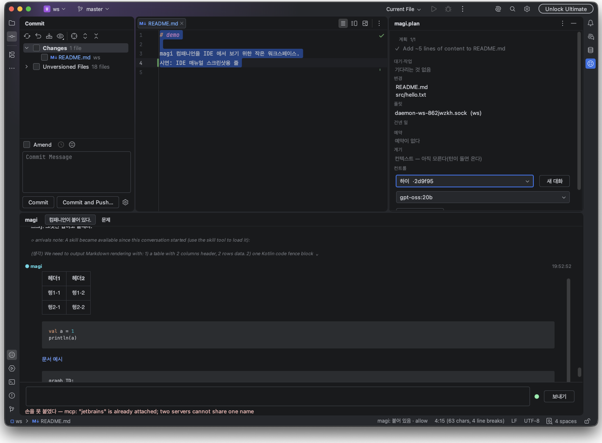
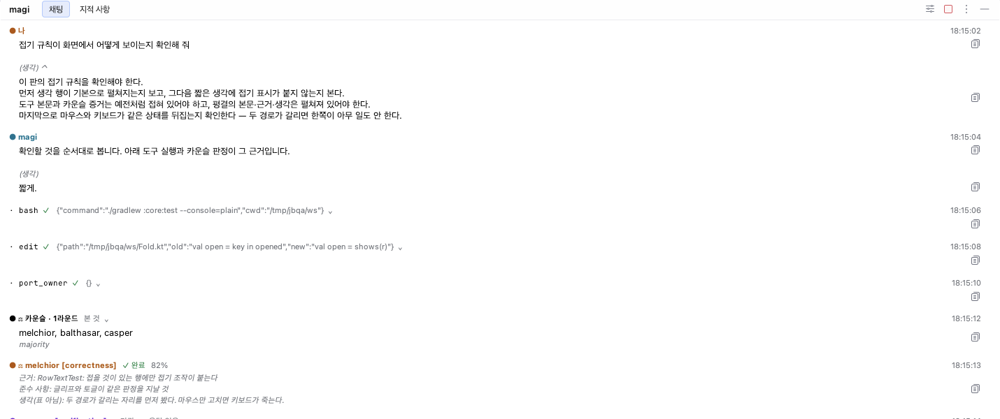
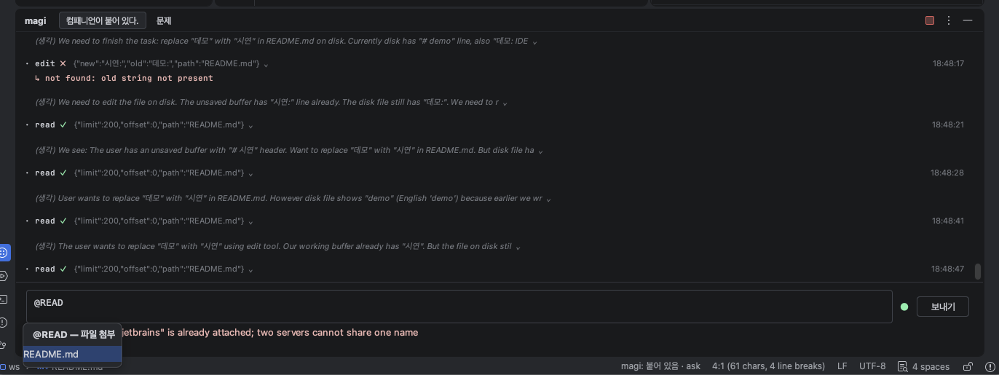
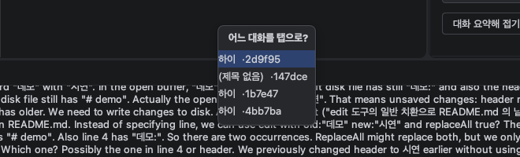
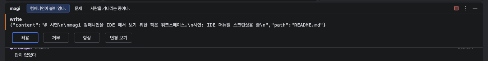
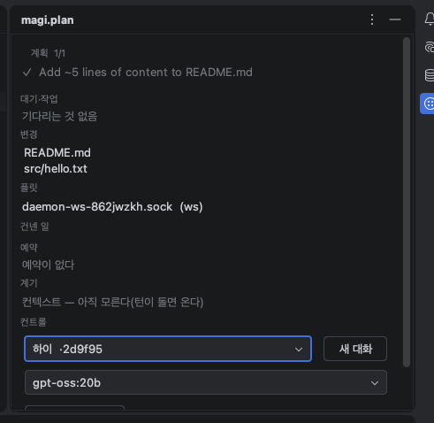
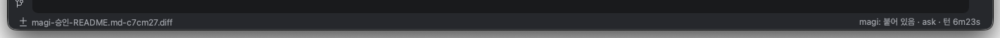
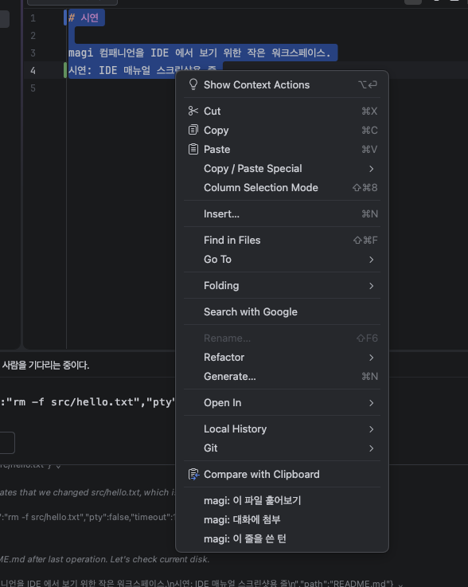
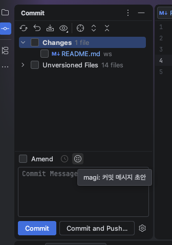
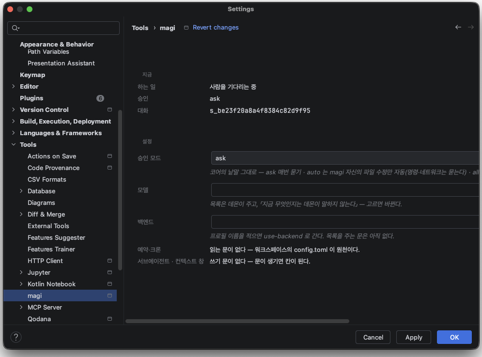

# magi IntelliJ 플러그인 — 사용자 매뉴얼

[↑ 클라이언트 개요](../README.md) · [화면 설계](./UI.ko.md) · [전사 셰이퍼 계약](./TRANSCRIPT.ko.md) · [무엇을 어디서 재나](./TESTING.ko.md) · [이웃 조사](./SURVEY.ko.md)

> **이 문서가 무엇인가.** 구현된 기능 전부를 **쓰는 사람의 눈**으로 적는다 — 기능마다 목적,
> 사용 방법, 화면. 왜 이렇게 설계했는지는 [화면 설계](./UI.ko.md)가 말하고, 여기는 어떻게
> 쓰는지만 말한다. 빠짐은 시험이 잰다: 플러그인이 IDE 에 광고한 면(액션·창·위젯)을
> `plugin.xml` 에서 유도해 이 문서와 대조하는 가드가 core 시험에 있다(`ManualTest`) —
> 새 기능이 광고되면 이 문서에 안 적히는 한 시험이 빨갛다.
>
> 스크린샷 슬롯은 각 절에 있다. *(스크린샷: …)* 표기가 그 자리다 — 캡처 절차는 [§9](#9-스크린샷-채우기).

## 1. 시작하기

**목적.** 프로젝트를 열면 그 워크스페이스의 magi 컴패니언이 붙는다 — **이미 도는** 데몬에 붙는다.
데몬이 없으면 그 사실을 말하고 1초→30초 백오프로 다시 붙어 본다 — 데몬을 띄우면 저절로 붙는다. 터미널 콘솔·웹 콘솔과 **같은 대화**를 IDE 안에서 보고 잇는 것이지,
IDE 전용 별개 채팅이 아니다.

**사용.** 설치 후 프로젝트를 열면 끝이다. 화면 셋이 생긴다:

| 자리 | 이름 | 무엇 |
|---|---|---|
| 하단 독 | **magi** | 대화(전사)와 입력줄, 「지적 사항」 탭 — §2 |
| 우측 독 | **magi.plan** | 계획과 계기·컨트롤 판 — §3 |
| 상태 표시줄 | magi 위젯 | 지금 뭔가 도는가, 항상 보이는 한 줄 — §4 |

에디터·프로젝트 뷰·콘솔·커밋 칸의 우클릭 메뉴에도 진입점이 선다(§5). 설정은
Settings → Tools → Magi (AI Assistant)(§6).

## 1a. magi를 아직 안 깔았다면

**플러그인만 설치하면 된다.** 프로젝트를 열었는데 이 워크스페이스의 엔진이 없고 `magi`도
찾을 수 없으면, 한 번 묻는다 — 「magi 0.29.0을 내려받아 이 워크스페이스에서 사용할까요?」

- **처음부터 최신을 받는다.** 설정의 `core.track=latest` 가 기본이고, 받기 직전에 릴리스
  목록을 물어 코어 열차의 최신 판을 고른다. 옛 판을 받아 놓고 데몬이 스스로 갱신하기를
  기다리지 않는다 — 처음 쓰는 사람에게 두 번 기다리라는 말이 되기 때문이다.
  못 물어보면(오프라인·호출 한도) 설정에 적힌 판으로 떨어져서, 네트워크 사정으로 설치가
  통째로 막히지는 않는다. `core.track=pinned` 로 하면 늘 그 판만 받는다.
- **코어가 자기 판을 내보내면** `core.latest`에 그 주소를 적는다(글자 한 줄). 그러면 호출
  한도도 JSON 파싱도 열차 고르기도 없어진다 — 미러도 정적 파일 하나면 된다. 지금은 그런
  자리가 없어 비어 있고, 그때는 아래 목록으로 간다.
- ⚠ **GitHub의 `/releases/latest`는 여기서 못 쓴다.** 이 저장소는 릴리스 열차가 셋이라
  (`v*` 코어 · `web-v*` · `jetbrains-v*`) 그 주소가 **날짜상 최신**을 가리킨다 — 2026-08-31에
  그것은 `web-v0.2.0`이었고 코어 자산은 그 태그에 없어 404였다. 그래서 목록에서 갈래를
  골라 쓴다(`core.tag`).
- **저장소가 사설이면** 자격 증명이 필요하다. 토큰은 **저장소에도 설정 파일에도 안 적는다** —
  `core.auth.env`에 **환경변수 이름**만 적으면(예: `MAGI_CORE_TOKEN`) 값은 사람의 셸에서
  읽는다. 사설 저장소의 자산은 브라우저 주소로 못 받으므로, 릴리스 목록에서 그 자산의 API
  주소를 뽑아 `Accept: application/octet-stream`과 함께 받는다(공개 저장소에서도 같은 주소가
  들어서 갈래를 만들지 않았다).
- **받는 자리는 설정 파일이 정한다**(`clients/jetbrains/plugin/intellij/src/main/resources/magi/core-release.properties`).
  사내 미러를 쓰거나 저장소를 옮겼으면 그 파일만 갈아 끼우면 된다 — 코드에 안 박혀 있다.
- **받은 것이 낸 것인지 확인한다.** 릴리스의 `checksums.txt`와 대조해서 다르면 **안 쓴다**.
- 받은 파일은 magi 설정 디렉토리 아래 `bin/<버전>/`에 둔다. 사람이 찾을 수 있는 자리다.
- **사내 미러가 사설 CA로 서 있다면** 설정 파일의 `core.insecure=true`로 인증서 검증을 끌 수
  있다(**기본은 꺼짐**). 켜면 **체크섬도 확인하지 않는다** — 체크섬 표가 같은 연결로 오는 이상
  중간에 있는 쪽이 파일과 표를 둘 다 바꿀 수 있어서, 그때의 확인은 보장처럼 보이기만 한다.
  약한 검사는 없는 검사보다 나쁘다. 받기 전 대화가 그 사실을 적는다. 평문 http는 이 값과
  무관하게 받지 않는다.
- **이미 `magi`가 PATH에 있으면 그것을 쓴다.** 사람이 깔아 둔 판이 그 사람의 판이고, 우리가
  받아 둔 것으로 덮으면 버전이 둘이 된다.

받기를 미뤄도 된다(「나중에」). 그때는 예전처럼 사람이 켤 때까지 기다린다.

### ⚠ IDE가 켠 엔진은 IDE와 함께 죽는다

`magi --daemon`은 **스스로 배경으로 가지 않는다.** IDE가 띄운 것은 IDE의 프로세스 그룹에
남으므로, IDE가 나가면 같이 나가고 그 그룹으로 오는 신호도 같이 받는다. 떼어 놓는 길을
플러그인 쪽에서 찾아봤지만 둘 다 막힌다 — `ProcessBuilder`에 생성 플래그 API가 없고, macOS에는
`setsid(1)`이 없다(README §2).

그래서 이렇게 다르다:

| 어떻게 켰나 | 수명 | 터미널·웹 콘솔과 공유 |
|---|---|---|
| **IDE가 자동으로** | IDE와 함께 | 켜져 있는 동안은 공유된다 |
| **터미널에서 `magi --daemon`** | 사람이 끌 때까지 | 그대로 |

오래 두고 쓸 엔진이 필요하면 터미널에서 켜는 편이 낫다. IDE는 이미 있는 것을 보면 **안 띄우고
그냥 붙는다.**

엔진이 나가면 플러그인이 **다시 띄운다** — 다만 무한히는 아니다. 프로젝트당 세 번까지, 최소
1분 간격으로. 계속 실패하는 것을 계속 되풀이하는 것은 회복이 아니라 소음이라서다. 붙는 데
성공하면 그 셈은 되돌아간다.

띄운 직후 몇 초 동안 상태 표시줄은 「시작하는 중…」이라고 적는다(실측: 첫 기동에 7초).

## 2. 하단 독 「magi」 — 대화

### 2.1 전사 읽는 법

**목적.** 컴패니언의 턴을 일어나는 그대로 본다. 원천은 데몬의 전사 스트림이라, 창을 껐다 켜도
같은 대화가 그대로 재생된다(컴팩션이 이벤트를 지우지 않는다 — 사람 뷰는 전부 보존).

**행의 종류.**
- **사람** — 보낸 글 그대로. 답을 기다리는 동안 왼쪽에 막대(pending)가 서고,
  `⌛ 대기`(큐에 있음) · `… 처리 중` · `✕ 버려짐` 표시가 붙는다.
- **magi** — 컴패니언의 답. **누르지 않아도** 마크다운이 그려진다: 굵게·목록·코드는 가벼운
  렌더로, 코드 펜스·표·링크·인용처럼 그것이 틀리게 그리는 답은 **IDE 마크다운 엔진**이 판
  안에서 직접(머메이드 다이어그램도 그쪽 능력 그대로). 엔진이 없는 IDE 면 가벼운 렌더로
  조용히 떨어진다.
- **(생각)** — 접힌 채 흐리게 첫 줄만. **클릭하면 펼쳐진다**(다시 클릭하면 접힘).
  마우스가 없어도 된다: 탭으로 행에 포커스를 주고 **Space** 또는 **Enter** 로 접었다 편다.
- **도구 한 행** — 이름+인자 요약 한 줄. 결과가 오면 같은 행에 ✓/✗ 가 얹힌다(갈라 그리지
  않는다 — "됐나"를 다른 행에서 찾게 하지 않는다). 됐는데 읽을 것이 있는 결과(advisory)는
  「✓ 읽을 것 있음」이 경고색으로 선다. 클릭해 펼치면 인자·실패 원문이
  고정폭으로 선다 — 옮겨 적은 증거라 산문 상한을 안 입는다.
- **카운슬** — melchior·balthasar·casper 는 자리 색을 받고, 판정과 keep·사유가 곁말로 선다
  (라운드 수는 상태 표시줄의 ⚖ 에 선다).

**펼친 `edit` 행의 「diff 뷰어로」.** 적용된 일반 치환 편집이면 단추가 서고, 누르면 인자의
old/new 원문 두 면이 IDE 나란히-보기로 열린다(제목 「이전/이후」). 앵커·replaceAll 편집과
실패한 호출에는 단추가 없다 — 인자가 전체 진실이 아닌 것을 두 면으로 그리면 왜곡이라서다.

**상태 점.** 입력줄 옆 점 하나가 연결 상태다 — 툴팁에 사유가 있다:

| 점 | 뜻 |
|---|---|
| ● (초록) | 전사에 붙어 있다 |
| ● (경고색) | 붙어 있는데 알릴 것이 있다(예: 커서 거절 사유) — 툴팁에 |
| ↻ | 끊겨서 다시 붙는 중 |
| ✕ (빨강) | 못 붙었다 — 툴팁이 사유를 말한다 |
| ◌ | 아직 안 붙았다 |

성공은 점이 말하고, **실패만** 알림줄에 글로 선다 — "붙었다/보냈다" 같은 자기 얘기로
대화 사이를 어지럽히지 않는다.

**못 닿을 때.** 데몬에 못 닿으면 제목표시줄의 수준 문구와 ✕ 상태 점(툴팁이 사유)이 말한다.
"낡았는데 자신만만"을 막는 배너("데몬에 못 닿는다 — 아래는 마지막으로 읽힌 값이다")는
우측 판(§3)에 선다.

### 2.2 「지적 사항」 탭

**목적.** 실패를 대화 흐름에서 잃지 않게, 실패의 첫 줄(160자)과 파일:줄 앵커만 모아
본다 — 전문은 전사의 그 도구 행을 펼치면 있다.

### 2.3 입력줄

**목적.** 이 대화에 말을 넣는다. **Enter 또는 「보내기」**로 보낸다.

- **칩(첨부).** 입력창 위에 `경로:시작-끝` 참조 칩이 선다 — 우클릭 「magi: 대화에 첨부」(§5)
  또는 `@` 멘션으로. ✕ 로 지운다. 보내면 **보낸 것만** 비워지고, 왕복 중 새로 세운 칩은
  남아서 다음에 간다. 본문 복사가 아니라 참조라, 컴패니언은 보내는 순간의 **디스크 원문**을
  읽는다(발췌는 코어가 렌더해 전사에 영속 — 재생·웹도 같은 것을 본다).
- **`@` 멘션.** 낱말 시작에서 `@이름`(2자 이상)을 치면 워크스페이스 파일 목록이 뜬다
  (알파벳순 앞 20, 잘리면 제목이 말한다). 고르면 칩이 서고, ESC 로 닫으면 같은 토큰으로는
  다시 안 뜬다.
- **줄바꿈과 성장.** Shift+Enter 가 줄을 바꾸고, 입력창은 1~5줄로 따라 자란다.
- **인라인 제안.** 치다 멈추면 입력줄 아래 "제안: …" 힌트가 서고 **Tab** 이 받아들인다 —
  에디터의 회색 자동완성(§5)과 같은 문, 다른 자리다.
- **알림줄.** 보내기 실패만 여기 선다 — "안 갔다: 사유". 성공은 전사에 행으로 온다.

### 2.4 제목표시줄과 기어

- **세우기**(정지 아이콘, 제목줄) — 도는 턴을 세운다. TUI 의 esc 와 같은 급이라 늘 보이되
  앞자리를 안 먹는다.
- **기어 메뉴** — 「대화 탭 열기…」(§2.5) · 「대화 요약해 접기 (compact)」 · 「마지막 턴
  되감기 (rewind)」. 결과는 라벨이 아니라 전사에 행으로 보고된다.
- 제목표시줄 텍스트 자체가 이 창의 **수준**(무슨 대화, 어떤 상태)을 말한다.

### 2.5 대화(세션) 탭

**목적.** 한 컴패니언의 여러 대화를 탭으로 나란히 본다.

**사용.** 기어 → 「대화 탭 열기…」 → 목록(최근 활동 순)에서 고르면 `·끝6자리` 이름의 고정
탭이 선다. 고정 탭은 그 대화만 본다 — 데몬이 대화를 옮겨도 안 따라가고(따라가는 것은 첫
탭의 몫), 탭의 ✕ 로 닫으면 그 대화의 스트림도 같이 닫힌다. **✕ 는 이렇게 연 탭에만 붙는다** —
「채팅」·「검토 결과」 같은 기본 탭은 닫히지 않는다(닫으면 되돌릴 길이 없다). **탭 전환은 보기다** — 데몬의 현재 대화를 바꾸지 않는다
(바꾸는 것은 우측 판의 대화 콤보, §3).

**양방향 확인.** 이 판이 겨눈 대화가 아닌 다른 대화의 턴이 도는 중에 보내려 하면 「보낸다/만다」로
묻는다 — 동시 턴은 파일 조작을 조정하지 않는다는 계약을 사람 결정으로 넘긴다.

### 2.6 승인 프롬프트

**목적.** 컴패니언이 위험한 일(편집·셸 등)을 하려면 사람의 허가가 필요하다 — 그 물음이 입력줄
위에 선다: 무엇을(도구 이름 굵게), 어디에(대상), 왜.

**사용.** **허용 / 거부 / 항상** 셋 중 하나. 편집 승인이면:
- **변경 보기** — 변화가 실려 온 승인(치환·write 등)이면 단추 하나가 서고, 누르면 **IDE
  편집창**에서 본다: 일반 치환 편집은 「물음 시점/제안」 두 면 나란히-보기("지금"이 아니다 —
  물음이 선 뒤에도 디스크는 변할 수 있다), 그 밖은 코어가 실은 diff 원문 탭. 독 안에 diff 를
  구겨 넣는 인라인 판은 없다 — IDE 가 더 잘 그리는 것은 IDE 에 넘긴다. 뷰어는 절대 변경을
  재계산하지 않고, 인자가 전체 진실일 때만 두 면을 그린다.
- **선택지 물음.** 컴패니언의 질문(선택지 있는 ask)은 선택지마다 단추가 서고, 물음이 여럿
  쌓이면 (i/N) 로 차례가 보인다. 화면이 못 그리는 모양의 물음은 그 사실이 문구로 선다.
물음이 오래되면 "이미 답했거나 만료됐다"로 정직하게 실패한다.

## 3. 우측 독 「magi.plan」 — 계기판

**목적.** 설정보다 자주 쓰지만 채팅보다는 덜 쓰는 컨트롤과, 서서 볼 가치가 있는 사실 하나
(계획)를 모은다.

| 구역 | 무엇 | 사용 |
|---|---|---|
| **계획** | 컴패니언의 todo — 진행 `계획 n/m` | 대화 창이 전사에 붙어 있어야 온다(원천이 전사 스트림) |
| **대기·작업** | 백그라운드 잡·큐의 대기(사람이 보낸 것, 남이 건넨 일 포함) | ✕ 로 잡을 세운다 |
| **변경** | 이 대화에서 컴패니언이 만진 파일들(성공한 편집·쓰기) | 파일을 클릭하면 **그 파일이 열리고 편집 화면에 변경 막대**가 선다 — 막대를 누르면 IDE 의 인라인 diff(되돌리기·복사)가 그 자리에 뜬다. 기준은 VCS 가 아는 이전 내용이고, 그것을 모르면 막대를 안 세운다 |
| **플릿** | 이 머신의 다른 컴패니언들 — 상태·대기 배지, 같은 워크스페이스 동거는 ⚠, 지금 없는 것은 목격담으로 흐리게(+마지막 본 지 얼마) 남는다 | 행을 **좌클릭**하면 부탁을 보낸다: "질문(읽기 전용)으로 보낼까? 아니오 = 일로 건넨다" |
| **건넨 일** | 부탁의 접수증과 답 — "도는 중" → "답: …" | 답은 자동 폴링으로 온다(회신 채널이 없어 hand-state 를 읽는다) |
| **예약** | 크론 — 이름·스케줄·다음 시각, **문제 있는 행이 이 판의 존재 이유다** | 없으면 "예약이 없다" |
| **계기** | 컨텍스트 사용량(k) | 턴이 돌면 온다 — 모름은 모름으로 |
| **컨트롤** | 대화 콤보(전환=데몬의 현재 대화 이동) · **새 대화** · 모델 콤보(고르면 바뀐다) · **대화 요약해 접기** | 문이 없는 데몬이면 그 사실이 그 자리에 선다("이 데몬엔 … 문이 없다") |

여기도 낡음 배너가 있다: "데몬에 못 닿는다 — 아래는 마지막으로 읽힌 값이다".

## 4. 상태 표시줄 위젯

**목적.** 툴윈도는 게으르다 — 안 열면 안 산다. "지금 뭔가 도는가"는 묻지 않아도 항상 보여야
하므로 상태 표시줄이 맡는다.

**읽는 법.** `magi: 작업 중 · 확인 · 턴 1m20s · ⚖ r2` 꼴 —
상태(작업 중/확인 대기 중/연결됨/실행되지 않음) · 승인 모드 · 턴 경과 · 카운슬 라운드.
턴 경과·라운드는 대화 창이 열려 있을 때만 안다 — 모름은 비워 둔다.

**마우스를 올리면** 워크스페이스 밖 콘텐트 루트 수가 뜬다(컴패니언이 그 루트는 못 읽는다는
뜻). 이 조각은 글자가 아니라 툴팁에 있다 — 상태 표시줄 한 줄의 폭은 줄:열·인코딩 같은 옆
위젯들과 나눠 쓰는 것이라, 길어지면 남의 자리를 밀어낸다.

**누르면** 하단 `magi` 독이 선다.

> 스크린샷은 낱말을 다듬기 전에 찍은 것이라 「붙어 있음」으로 보인다 — 지금 화면은 「연결됨」이다.

## 5. 에디터와 IDE 곳곳의 진입점

일이 이미 있는 자리에 단추를 둔다 — 단축키는 어느 것도 선점하지 않는다.

에디터 우클릭의 넷은 **「Magi (AI Assistant)」 하위 메뉴 하나**에 접혀 있다. 그 안에서는 항목마다 붙던
`magi: ` 접두가 빠진다 — 메뉴 이름이 이미 그 말을 했다. Find Action 이나 Keymap 에서
찾을 때는 접두가 그대로 붙어 뜬다(거기선 어느 플러그인 것인지가 안 보이므로).

| 진입점 | 어디 | 목적과 동작 |
|---|---|---|
| **magi: 채팅에 추가** | 에디터 우클릭(magi 메뉴) · 프로젝트 뷰 우클릭 | 선택영역(캐럿마다 `경로:줄범위`) 또는 고른 파일들을 다음 메시지의 참조 칩으로. 붙이는 순간 문서를 저장한다(컴패니언은 디스크를 읽으므로) |
| **magi에게 이 코드 물어보기** | Alt+Enter (인텐션) | 선택(없으면 캐럿 줄)을 참조로 첨부하고 대화 창을 열어 입력줄에 "이 코드에 대해: " 를 앉힌다 — 이어서 물음을 치면 된다 |
| **Magi 채팅에 이 코드 추가** | Alt+Enter | 고른 코드를 참조로만 붙인다(물음은 안 시작한다). **고른 것이 있을 때만** 뜬다 |
| **Magi로 이 파일 검토** | Alt+Enter | 「지금 검토」와 같은 일. **고른 것이 없을 때만** 뜬다 — 고르면 위의 첨부가 그 자리를 쓴다 |
| **이 줄을 작성한 Magi 작업 찾기** | Alt+Enter | 우클릭 것과 같은 답을 「검토 결과」 탭에 세운다. **이 창이 그 파일을 아는 게 있을 때만** 뜬다 — 「모른다」만 말하려고 Alt+Enter 한 줄을 차지하지 않는다 |
| **magi: 지금 검토** | 메인 툴바 오른쪽 · 에디터 우클릭(magi 메뉴) | 이 버퍼를 지금 읽고 **잘못돼 보이는 것만** 말한다 — 할 말이 없으면 아무것도 안 뜬다. 도는 동안 아이콘이 스피너로 바뀐다. 자동(§7의 타이핑 중 훑어보기)이 꺼져 있어도 이건 답한다. 툴바에서는 **숨지 않고 회색**이 된다 — 옆 아이콘이 밀리지 않게 |
| **magi: 이 파일 검토** | 에디터 우클릭(magi 메뉴) | 열린 버퍼(저장 안 한 내용 그대로)를 보내 훑게 하고, 답이 magi 창의 「검토 결과」 탭에 선다 |
| **magi: 이 줄을 작성한 작업 찾기** | 에디터 우클릭(magi 메뉴) | 이 줄을 어느 턴의 어느 도구가 썼는지 팝업으로 — 못 짚으면 못 짚는다고 말한다(창이 연 뒤의 전사만 안다) |
| **magi: 이 출력 설명** | 실행 콘솔·**터미널**(새 엔진) 우클릭 | 선택한 출력(스택트레이스 등, 64KB 상한)을 물음으로 보낸다 — 설명과 고칠 길 |
| **magi: 커밋 메시지 생성** | 커밋 칸 옆 | 스테이지된 변경으로 하우스 스타일 초안을 지어 칸에 앉힌다. 누른 뒤 친 글이 있으면 덮지 않는다(초안은 풍선으로) |
| **인라인 자동완성** | 커서 자리 회색 글씨 | 콘솔 `/complete` 와 같은 문 — magi 의 `[autocomplete]` 설정 하나로 켜고 끈다(플러그인에 둘째 스위치 없음). 접두·접미를 둘 다 보내 닫은 괄호를 또 닫지 않는다 |
| **열린 버퍼 자동 동봉** | (자동) | 열어 둔 파일과 저장 안 한 내용을 컴패니언이 안다 — 타이핑마다 밀어 넣는 ambient. 이웃 셋보다 신선한 컨텍스트다 |

실패는 어느 진입점이든 **풍선 알림**으로 말한다 — 채우려던 칸에 실패 문구를 쓰지 않는다.

## 6. 설정 — Settings → Tools → Magi (AI Assistant)

**목적.** 남는 상태의 자리. 값은 데몬이 원천이고, 화면을 여는 것이 곧 다시 읽기다.

- **지금** — 하는 일 · 승인 · 대화(읽기 전용 현황).
- **설정** — 승인 모드 넷: **확인**(ask) 매번 묻기 · **자동**(auto) magi 자신의
  파일 수정만 자동(명령·네트워크는 묻는다) · **허용**(allow) 전부 통과 · **차단**(deny) 전부 거부 —
  화면은 사람 말로 그리고 데몬에는 괄호 안의 토큰이 그대로 나간다 —
  어느 모드든 사람이 답하면 그 답이 이긴다. 모델(목록은 데몬이 준다 — 고르면 바뀐다) ·
  백엔드(프로필 이름).
- **magi 자동 실행**(기본 켜짐) — 프로젝트를 열 때 이 워크스페이스의 엔진이 꺼져 있으면
  켠다. **magi가 아예 없으면 한 번 묻고 내려받는다**(§1a). 프로젝트를 여럿 여는 사람에게
  엔진이 여럿 뜨는 것이 부담이면 여기서 끈다 — 끄면 예전처럼 사람이 켤 때까지 기다린다.
- **이 화면의 취향 셋**(웹 콘솔이 브라우저-로컬로 두는 그 스위치들): 「훑어보기」(기본 꺼짐,
  §6a) · 「자동완성」(회색 글씨, 기본 켜짐) · 「입력줄 제안」(Tab, 기본 켜짐). 컴패니언 쪽
  `[autocomplete]` 설정은 그것대로 여전히 이긴다 — 거기서 꺼져 있으면 여기서 켜도 빈 답이 온다.
- **config.toml에서 설정** — 모델을 정하는 자리는 여럿이다: `model`(대화 모델), `embed_model`
  (임베딩 — 없으면 회상이 문자열 검색에만 의존한다), `[llm.profiles.*]`(백엔드 프로필),
  `[autocomplete] code_profile / composer_profile`(자동완성용 빠른 프로필),
  `[subagents.*]`, `[templates]`. 이 창에서 바꿀 수 있는 것은 **대화 모델과 백엔드**뿐이고,
  나머지는 워크스페이스의 `config.toml`에서 고친다 — 데몬에 그 문이 아직 없기 때문이며,
  문이 생기면 이 자리에 칸이 선다(범용 config 문을 코어에 요청해 뒀다).
- 워크스페이스 밖 컨텐트 루트가 있으면 경고 행이 선다 — 컴패니언의 감옥은 프로젝트 디렉토리
  하나라 그 루트는 못 읽는다(상태 표시줄의 「못 만지는 루트 N」과 같은 사실).
- 문이 없는 항목은 **읽기 전용으로 사유가 적혀 있다** — "예약·크론: 읽는 문이 없다,
  워크스페이스의 config.toml 이 원천" 처럼. 없는 스위치를 그리지 않는다.

## 6a. 입력 중 검토(타이핑 중 훑어보기)

**목적.** 손을 잠시 멈추면 컴패니언이 지금 버퍼를 읽고 **잘못돼 보이는 것만** 말한다(버그·오타·
처리 안 된 경우). 할 말이 없으면 아무 말도 하지 않는다 — 침묵이 이 기능의 절반이다.

**사용.** Settings → Tools → Magi (AI Assistant) 의 「입력 중 검토」 체크를 켠다(**기본 꺼짐** — 멈출 때마다
컴패니언의 모델을 한 번 쓰는 비용은 고를 일이지 겪을 일이 아니다). 켜면 누를 것이 없다:
손을 멈추면 0.8초 뒤 요청이 나가고, 나머지는 모델 시간이다(가벼운 모델일수록 빠르다).
지금 당장 보고 싶으면 에디터 툴바의 **「지금 훑어보기」** 아이콘을 누른다 — 자동이 꺼져
있어도 답하고, 도는 동안 아이콘이 스피너가 된다.

**어디에 뜨나.** 줄에 걸리는 지적은 **그 줄 끝 회색 글씨**로(색은 테마가 정한 힌트 색),
걸 줄이 없는 말만 편집기 위 띠로 — 띠의 「전체 보기」는 원문을, 「닫기」는 그 말을 지운다.
저장하지 않고 대화에도 안 보낸다.

## 7. 알아두면 좋은 동작

- **편집이 에디터에 저절로 보인다.** 컴패니언(데몬)은 IDE 밖 프로세스라 원래는 포커스를
  나갔다 와야 IDE 가 디스크를 다시 읽는데, 플러그인이 편집 사실을 받으면 반 초 안에 그
  파일을 새로고침한다(대화 창이 전사에 붙어 있을 때 — 사실의 원천이 그 스트림이다)(경로를 모르는 셸 변이는 턴이 끝날 때 워크스페이스 한 번). 열린 파일에
  저장 안 한 편집이 있으면 IntelliJ 표준 충돌 대화상자가 뜬다.
- **데몬 응답 시한.** 데몬이 응답을 물고 늘어지면 120초에 연결을 끊고 사유를 말한다 —
  말없이 매달리지 않는다. 전사 스트림은 예외다(정당하게 오래 조용할 수 있다).
- **동시 턴은 조정되지 않는다.** 같은 워크스페이스에서 두 대화가 동시에 파일을 만지면
  충돌한다 — 그래서 §2.5 의 확인창이 묻는다.
- **IDE 를 껐다 켜도 대화는 그대로다.** 대화의 원천은 데몬이고, 창은 커서(`since`)로 이어
  붙는다. 컴팩션도 사람 뷰의 이벤트를 지우지 않는다.

## 8. 기능 대 이웃 — 어디까지 되나

Continue · JetBrains AI Assistant · Copilot 과의 기능 대조는 [이웃 조사](./SURVEY.ko.md)가
표로 관리한다. 요약: 첨부·선택영역·인라인 편집(2단)·자동완성·훑어보기는 착지, NES 와 이미지
첨부는 보류(사유 있음), 코드베이스 인덱싱은 채택 안 함(컴패니언의 실시간 검색과 이중 진실).

## 9. 스크린샷 채우기

이 문서의 *(스크린샷: …)* 슬롯은 `docs/img/` 의 파일명을 이름 댄다. 캡처 절차:

1. 샌드박스 기동: `MAGI_CONFIG_DIR=/tmp/m/cfg MAGI_NO_UPDATE_CHECK=1 ./gradlew --no-daemon :intellij:runIde` (plugin/ 에서).
2. 각 슬롯의 장면을 만들고 `screencapture -x docs/img/<이름>.png` 또는 ⇧⌘4 로 창을 캡처한다.
   - 터미널에서 캡처하려면 시스템 설정 → 개인정보 보호 및 보안 → **화면 및 시스템 오디오
     녹음**에 터미널 앱을 허가해야 한다.
3. 파일이 놓이면 슬롯 표기를 `` 으로 바꾼다.
