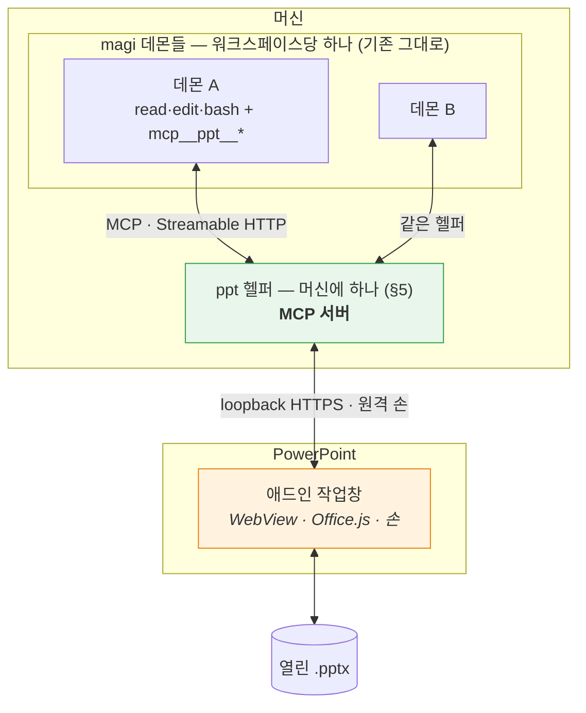
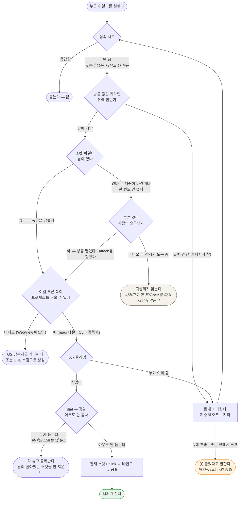

# PowerPoint MCP 플러그인 — 설계

Status: **제안. 구현하지 않았다.** (2026-08-28)

> **개정 (같은 날).** 첫 판본은 호스트 어댑터 계약을 직접 설계하고 새 코어 데몬을 두었다. 사용자가
> **도구를 MCP로 내놓으라**고 방향을 정했고, 그게 더 낫다 — 컨텍스트가 갈리지 않고(§4.2), 계약을
> 발명할 필요가 없으며(§4.3), `ide/`와의 데몬 범위 충돌이 통째로 사라진다. §0·§4·§5를 다시 썼다.
> 무엇이 어떻게 뒤집혔는지는 [`clients/jetbrains/README.md`](../jetbrains/README.md) §9에 남겼다. 두 플러그인이
> 주고받던 대화 문서 둘(`clients/jetbrains/INTEROP.md`·`clients/jetbrains/INTEROP-MCP.md`)은 각자의 설계 문서로 접었다.

> **개정 2 (같은 날).** 사용자가 §5의 전제를 바꿨다 — **애드인이 어느 컴패니언에 붙을지 고르고,
> 켜진 데몬이 하나도 없으면 덱이 있는 디렉토리에 띄운다.** PPT 파일에는 워크스페이스 개념이 없는
> 경우가 많다는 것이 이유다. §5.0을 새로 쓰고 §5.2·§5.6을 고쳤다. 같은 왕복에서 §7의 위원 축소가
> 틀렸다는 것이 드러나 그것도 뒤집었다.

> **인용 규약.** 커밋은 **제목**으로, 코드는 **심볼**로 짚는다 — 해시도 줄 번호도 쓰지 않는다.
> 2026-08-28 하루에 히스토리 재작성이 두 번, 줄 밀림이 세 번 있었고 그때마다 이 문서의 인용이
> 조용히 죽었다. 이 저장소의 커밋 제목은 문장이라 `git log --grep`으로 정확히 찾히고, 재작성에
> 안 죽는다. (`clients/jetbrains/README.md`도 같은 규약을 쓴다.)

> **닫힌 것 표기.** 닫힌 항목은 **제목에 취소선**을 긋고 그 자리에 지금 상태를 적는다. 본문은
> **남은 보장**과 커밋 제목으로 접는다 — 지우지 않는 것은 왜 그렇게 정해졌는지가 다음 결정의
> 근거라서고, 접는 것은 **제목만 읽고 지금 상태를 알 수 있어야** 해서다. 취소선이 없으면 지금
> 열려 있는 것이다. (하루에 결함 열몇 개가 닫히면서 이 문서가 연대기가 됐고, §4.4 ①은 제목이
> "이미지를 보낼 길이 없다"인데 본문 마흔 줄 아래에서 다 닫혔다고 말하고 있었다.)

> **개정 3 (같은 날).** 사용자가 **데이터를 이미지로 주고받는 것을 최대한 자제하라**고 정했다 —
> 붙을 모델이 멀티모달이라는 보장이 없기 때문이다. §2.2가 "픽셀이 우리의 우위"라고 쓴 것을
> 뒤집는다: 픽셀은 **마지막 수단**이고, 판정의 기본 경로는 숫자와 텍스트여야 한다. §2.2를 다시
> 쓰고 §4.4 ①의 결론을 고쳤다. 픽셀 없이 같은 질문에 답하는 길은
> [`CAPABILITIES.md`](CAPABILITIES.md) §10.6에 있다.

> **곁 문서.** [`CAPABILITIES.md`](CAPABILITIES.md) — 파워포인트가 실제로 무엇을 내주는지, 그리고
> 그것을 모델이 읽을 수 있는 모양으로 어떻게 세울지. 이 문서가 *무엇을 만들 것인가*를 정한다면
> 그쪽은 *재료가 무엇인가*에만 답한다. 부록 A와 겹치지 않게 썼다 — 픽셀을 얻는 세 경로(§2.2가
> 기대는 것), 덱 안에 상태를 적어 둘 자리 셋, 없는 것의 증명, 그리고 모델링 스케치가 거기 있다.

> 이 문서는 아직 코드가 없는 시점의 설계 의도다. 만들면서 어긋난 지점은 여기에 인라인으로
> 정정을 남기고, 지우지 않는다. 부록 A의 API 사실은 확인한 날짜와 출처를 달았다 — 그날 이후
> 마이크로소프트가 바꾼 것은 이 문서가 모른다.

---

## 0. 한 문장

**열려 있는 덱을 읽고, 사람이 말로 시킨 편집을 수행하고, 자기가 한 일이 실제로 그렇게 됐는지
확인한 뒤에야 끝났다고 말하는 에이전트.**

**에이전트는 magi다.** 이 프로젝트가 만드는 것은 에이전트가 아니라 **덱을 만지는 도구를 MCP로
내놓는 플러그인**과, 그 도구를 실제로 실행하는 머신에 하나뿐인 로컬 헬퍼다. 새 코어 데몬은 만들지
않는다 — 이유는 §4.2이고, 한 줄로는 **컨텍스트를 갈라놓지 않기 위해서**다. 저장소를 읽는 도구와
덱을 고치는 도구가 한 세션 안에 같이 있어야 그 둘을 잇는 브리프가 필요 없어진다.

**붙을 곳은 애드인이 고른다.** 켜져 있는 컴패니언 중에서 사람이 하나를 고르고, 하나도 없으면
**덱이 있는 디렉토리**에 띄운다 — PPT 파일에는 워크스페이스 개념이 없는 경우가 많기 때문이다(§5.0).

## 1. 무엇이 아닌가

경계를 먼저 적는다. 이 셋은 만들지 않는다.

- **문서 생성기가 아니다.** "이 마크다운으로 발표자료 만들어줘"는 다른 물건이다. 이건 *이미 있는*
  문서를 고친다. 생성은 나중에 얹을 수 있지만, 얹기 전까지는 없다고 말한다.
- **디자인 대행이 아니다.** "예쁘게 해줘"는 판정할 수 없는 요구다. 판정할 수 없는 것을 받으면
  끝났다고 말할 근거가 없어진다(§7).
- **자율 실행이 아니다.** 사람이 편집기를 열어두고 옆에 있는 상황을 전제한다. 사람 없이 도는
  배치 작업은 호스트 플러그인이 아니라 데몬에 직접 붙는 다른 클라이언트의 일이다.

## 2. 이 문제가 코딩 에이전트와 다른 세 지점

magi에서 배운 것을 그대로 옮기려다 부러지는 자리가 셋이다. 설계의 대부분이 여기서 나온다.
서술은 PowerPoint로 하지만, 셋 다 "편집기 안의 살아있는 문서"라는 상황 자체에서 나오므로
다음 호스트에도 그대로 온다.

### 2.1 되돌릴 곳이 없다

코딩 에이전트는 git 위에 산다. 클론이 있고, `base..HEAD`가 있고, 아니다 싶으면 되돌린다.
여기에는 **브랜치가 없다.** 대상은 사람이 지금 이 순간 열어놓고 보고 있는 문서 하나다.

후보 셋:

| 방법 | 되는 것 | 안 되는 것 |
|---|---|---|
| 편집기 자체 undo 스택에 맡긴다 | 공짜, 사람이 이미 아는 조작(⌘Z) | 플러그인 편집이 undo 스택에 어떻게 쌓이는지 **미검증**(S4). 한 번의 지시가 40개 도형을 고쳤을 때 ⌘Z 한 번에 다 돌아오는지, 40번 눌러야 하는지가 다르다 |
| 편집 전 스냅샷 | PowerPoint는 `slide.exportAsBase64()`가 슬라이드를 통째로 .pptx 바이트로 준다 — 완전한 원본 | 되돌리려면 그 바이트를 **다시 넣어야** 하는데, 넣는 문은 **제자리 교체가 아니라 삽입**이다(`insertSlidesFromBase64`, 1.2 — 부록 A). 복원한 장은 **id가 새것**이고, 왕복이 맞물리는지는 미검증(S5) |
| 객체 태그 저널 | `shape.tags`(1.3)에 편집 전 값을 적어두고 되돌린다 | 우리가 만든 변경만 되돌린다. 객체를 **삭제**한 경우는 태그도 같이 사라져 못 되돌린다 |

**결정:** 셋 다 쓴다. 순서는 ① 스냅샷(증거+최후수단) → ② 되돌리기는 태그 저널로
시도 → ③ 저널로 안 되는 것(삭제·구조 변경)은 **애초에 승인 없이 하지 않는다**(§8).
편집기의 undo는 우리가 통제하는 게 아니므로 계획에 넣지 않고, S4로 실태만 기록한다.

되돌리기는 **도구로 낸다**(`snapshot_slide` / `restore_slide`) — MCP에 "이 서버는 되돌릴 수 있다"를
선언하는 자리가 없기 때문이다(§4.4). 도구로 내면 에이전트가 쓸지 말지를 스스로 정하고, 안 쓴
것도 기록에 남는다.

**①의 주어를 안 적어서 두 문장이 어긋나 있었다.** 앞 판본은 ①을 ~~「스냅샷을 **항상** 뜬다」~~로
적고, 바로 다음 문단에서 「에이전트가 쓸지 말지를 **스스로 정한다**」고 적었다. 한 절 안에서
한쪽은 보장이라 하고 한쪽은 재량이라 한다. §6이 이 절을 인용하는 자리도 재량 쪽으로 읽고 있으니
(허용 규칙에 넣는 이유가 「모델이 안 부르게 된다」다) 실제로 굴러가던 것은 재량 쪽이다.

**그리고 헬퍼는 「항상」의 주어가 될 수 없다.** 헬퍼는 턴의 경계를 모른다 — 이 설계가 축을 그렇게
갈라 뒀다(§5.2: **덱은 헬퍼가 쥐고, 턴은 데몬이 돈다**). 게다가 데몬은 여럿일 수 있다(§5.6).
헬퍼에게 보이는 단위는 **호출**뿐이라, 헬퍼를 주어로 놓으면 「쓰기 호출마다 한 장」이 된다.
도형 40개를 고치는 지시 하나에 슬라이드 통째 .pptx 내보내기가 40번 도는데 — 부록 A에 적어 둔
MS의 주의는 *여러 슬라이드*를 뜨는 경우를 말하므로 이 경우를 그대로 덮지는 않는다 — **값보다
먼저 걸리는 것은 쓸모다**: 40장 중 **편집 전 상태는 첫 장뿐**이고 나머지 39장은 우리가 이미 만든
상태를 뜬 것이라, 최후수단으로는 한 장도 늘지 않으면서 값만 40배가 된다.

그래서 ①은 **보장이 아니라 규칙**이다. 스냅샷은 **모델이 뜬다.** 설계가 지는 몫은 「뜨게 만드는
것」이 아니라 **안 뜰 이유를 없애는 것**이다 — 허용 규칙에 넣어 사람의 클릭을 안 기다리게 하고(§6),
안 부른 것이 기록에 남게 한다. **자동으로 도는 최후수단은 이 설계에 없다**, 그렇게 적어 둔다.
(헬퍼가 「슬라이드 S의 마지막 변경이 우리 것이 아닐 때만」을 기준으로 자동화할 여지는 있다 —
호출이 아니라 그 슬라이드의 개정 쌍으로 재는 것이라 편집 한 줄기에 한 장이면 된다. 다만 S5가
닫히기 전에는 스냅샷이 **증거 전용**일 수도 있어, 복원에 못 쓸지도 모르는 것을 위해 기계를 먼저
만들지는 않는다.)

⚠ **「되돌린다」가 제자리 교체가 아니다 — 복원한 슬라이드는 id가 바뀐다.** 바이트를 도로 넣는 문은
하나뿐이고(`Presentation.insertSlidesFromBase64`, **1.2**라 우리 바닥 아래다) 문서가 그것을
*"Inserts the specified slides from a presentation into the current presentation"*로, 자리를
*"The new slides will be inserted **after** the slide with the given slide ID"*로 적는다.
바꿔치기가 아니라 **옆에 붙이는 것**이라 복원은 「넣고 원본을 지운다」 두 걸음이 되고, 살아남는
장은 **새 id를 단다.**

**값을 치르는 것은 되돌리기 자신이 아니라 그것을 가리키던 것들이다.** 안내의 항목(§6.1)도
인용(§5.8)도 슬라이드 id로 적혀 있어서, 복원 한 번에 그 전부가 **없는 슬라이드**를 가리킨다.
그나마 조용하지는 않다 — 문서가 *"If `targetSlideId` is invalid or if it's pointing to a
non-existing slide, the operation throws a `SlideNotFound` exception and no slides will be
inserted"*라고 적어, 낡은 id로 다시 넣으려는 쪽은 **던지고 아무것도 안 넣는다.** 그래서 규칙은
`restore_slide`의 결과가 **바뀐 id를 실어야 한다**는 것이다(§7의 「쓰기 도구의 결과가 before→after를
스스로 싣는다」가 여기서 한 번 더 걸린다). 안 실으면 다음 호출이 낡은 id로 가고, 사람은 되돌린
직후에 안내가 통째로 죽은 화면을 본다.

**서식은 기본값이 맞고 예제가 틀리다.** `formatting`의 기본이 *"KeepSourceFormatting"*이라
스냅샷을 그대로 되돌리는 데 맞는데, Learn의 예제는 `useDestinationTheme`을 넘긴다. 그 예제를
복원에 베끼면 되돌린 장이 **테마를 새로 입고** 돌아온다 — 되돌린 것처럼 보이지만 아니다.
**안 넘기는 것이 계약이다.**

### 2.2 "됐다"의 증거가 다르다

코딩 에이전트의 증거는 exit code와 파일 diff다. 둘 다 기계가 읽는 사실이다. 문서의 결과물은
**시각적**이고, 객체 모델이 "텍스트를 바꿨다"고 말해도 그 텍스트가 상자 밖으로 넘쳤는지는
모델이 모른다.

API에 답 하나가 있다. `slide.getImageAsBase64()`가 **슬라이드를 PNG로 렌더해 준다**(1.8).

~~그래서 판정 증거를 두 겹(기록·픽셀)으로 쌓는다 — 넘침·겹침·잘림처럼 객체 모델이 침묵하는 결함은
픽셀에서만 보인다.~~ **뒤집혔다 — 바로 아래 개정 3.** 두 겹이 세 겹이 되고 픽셀이 맨 뒤로 간다.
지운 자리를 남겨 두는 이유는 이 문단이 이 절의 원래 논거였기 때문이고, 그 논거가 지금 무엇으로
바뀌었는지가 다음 문단이다.

**개정 3 — 순서가 뒤집혔다.** 앞 판본은 픽셀을 이 제품의 우위로 놓았다. 사용자가 방향을 정했다:
**데이터를 이미지로 주고받는 것은 최대한 자제한다.** 근거는 우리가 반박할 수 없는 것이다 —
**붙을 모델이 멀티모달이라는 보장이 없다.** 애드인이 고르는 컴패니언은 로컬 모델일 수 있고(§5.0),
`seesImages`가 false를 답하면 그림은 그냥 안 실린다. 픽셀 위에 판정을 세우면 **그 모델에서는 판정
자체가 없어진다** — 없는 증거가 아니라 없는 기능이 된다.

그래서 이 절의 두 겹은 순서가 있다.

1. **기록** — 우리가 호출한 편집과 그 전후 객체 모델 값. 항상 돈다.
2. **숫자** — 상자의 좌표·크기에서 **계산으로** 나오는 것. 객체 모델이 침묵하는 것은 "텍스트가
   상자에 들어가는가"이지 **상자가 어디에 얼마만 한가**가 아니다. 후자는 API가 포인트 단위로 준다.

   ⚠ **앞 판본은 여기에 "넘침·겹침·잘림"을 한 줄로 적고 "둘 다 그림 없이 나온다"로 닫았다.
   셋의 사정이 다르다.** 개정 3이 판정의 무게를 이 층으로 옮겼으므로 이 층이 실제로 무엇을 주는지가
   그만큼 중요해졌다.
   - **겹침은 선다.** 사각형 둘의 교집합이고 필요한 값이 전부 객체 모델에 있다.
   - **슬라이드 밖으로 나갔는지는 페이지 크기가 있어야 하고, 1.8 안에서 그걸 얻을 수 있는지를
     아직 아무도 안 쟀다**(S12). S12를 §6.1의 핀에만 걸어 뒀는데 이 줄이 같은 값에 걸린다.
     못 얻으면 이 검사는 **기본 두 크기에서만** 선다 — 핀과 같은 정도로 줄어든다.
   - **넘침은 이 층에서 안 나온다.** 바로 위 문장이 객체 모델은 "텍스트가 상자에 들어가는가"에
     침묵한다고 적었는데 **넘침이 정확히 그 질문이다.** 글자 크기와 상자 크기만으로는 안 나온다 —
     줄바꿈 뒤 몇 줄이 되는지가 글꼴 메트릭에 달렸고 Office.js는 그것을 안 준다. 게다가 **자동
     축소가 켜져 있으면 넘치는 대신 줄어드는데**, 얼마나 줄었는지는 아래 3층이 "렌더에만 있다"고
     적은 바로 그것이다. 넘침과 자동 축소는 **같은 질문**인데 지금 층이 갈려 있다.
     작업창이 웹뷰라 캔버스로 재는 길이 있기는 하다 — 다만 그건 **아직 아무 데도 안 적힌 새
     기전**이고, 그 글꼴이 웹뷰에 있어야 하며, 어차피 근사다. 여기 적는 것은 답이 아니라 **이
     층이 지금 넘침을 못 준다는 사실**이고, 그것을 걸러 낼 자리는 M4다(§10).
3. **픽셀** — 위 둘로 답이 안 나오는 질문에만. 렌더는 **사람이 볼 때**와, 모델이 실제로 볼 수
   있다고 확인됐고(`seesImages`) 다른 길이 없을 때만 낸다.

세 번째가 필요한 질문이 남는다는 것은 사실이다 — 글꼴 치환, 자간, 자동 축소가 실제로 얼마나
줄였는지는 렌더에만 있다. 그러나 그건 **드문 질문**이지 기본 판정 경로가 아니다. 픽셀 없이 어디까지
가는지는 [`CAPABILITIES.md`](CAPABILITIES.md) §10.6에 적었다.

이미지 경로 자체는 세 층이 다 서 있다(§4.4 ①). **서 있는 것과 기본으로 쓰는 것은 다르다** — 세워
둔 채 아껴 쓴다. M4까지는 판정이 1·2로만 돌고, 그건 코딩 에이전트와 같은 조건이다.

### 2.3 읽기 천장과 쓰기 천장이 다르다 — 가장 중요한 사실

Office.js의 PowerPoint 객체 모델은 좁다. 그런데 **읽기에는 두 개의 비상구가 있다.**

| | 무엇으로 | 닿는 곳 |
|---|---|---|
| **읽기** | `slide.exportAsBase64()` (슬라이드 = .pptx 바이트) | **OOXML 전부** — 차트 데이터, SmartArt, 애니메이션, 발표자 노트까지 |
| | `slide.getImageAsBase64()` (PNG 렌더) | 최종 시각 결과 |
| | 객체 모델 (`shapes`, `textFrame`, `fill`, …) | 구조화된 값, 편집 가능한 것과 1:1 |
| **쓰기** | 객체 모델뿐(S5) | 텍스트·도형·서식·레이아웃·순서·하이퍼링크 · **표(단서는 아래 ⚠)** |

⚠ ~~**쓰기 줄에서 「표」를 내렸다 — 이 문서 안에서 답이 넷이라서다.**~~ **갈렸다 — 표는 쓸 수
있다.** 부록 A가 1.5·1.6에 썼던 방법(집합별·멤버별 페이지가 요약 페이지를 이긴다)을 그대로 썼고,
넷 중 **틀린 것은 하나뿐이었다.**

- 「1.8 = 바인딩, 도형, 표」와 「1.9 = 표 서식·관리」는 **둘 다 맞고 서로 안 부딪힌다.** 두 줄이
  가르는 것은 읽기/쓰기가 아니라 **만들 때 / 만든 뒤**다. 요약 한 줄끼리 비교하면 안 보인다.
- **틀린 것은 부록 A의 `Shape` 항목이었다.** `getTable`이 「읽기·이동만」 열에 있던 것도 그렇지만,
  더 큰 것은 **표를 만드는 API가 `Shape`에 없다**는 사실이다 — `addTable`은 `ShapeCollection`에
  있는데 부록 A에 `ShapeCollection` 항목이 없다. 그래서 **이 문서에는 표를 만드는 API가 나타날
  자리가 처음부터 없었다.** 틀린 칸은 눈에 띄지만 **없는 자리는 안 띈다.**
- §6에 표 도구가 없던 것은 그 결과다. 아래 §6에서 **둘을 더한다.**

**1.8이 주는 쓰기는 정확히 둘이다.**

1. **`ShapeCollection.addTable(rows, cols, options)` — 만들면서 다 준다.** `TableAddOptions`가
   값(`values`) · 행 높이 · 열 너비 · 병합 영역 · 셀별 서식(`specificCellProperties`) · 전체 셀
   서식(`uniformCellProperties`)을 받고, 그 셀 서식 안에 테두리 · 채움 · 폰트 · 정렬 · 들여쓰기 ·
   여백이 전부 들어 있다.
2. **`TableCell.text` — 만든 뒤에 고칠 수 있는 유일한 것.** 선언이 `text: string`이고 `readonly`가
   아니다. MS 자신의 예제가 `cell.text = …`로 값을 다시 쓴다.

**1.9가 가져가는 것은 「이미 있는 표를 다시 만지는 것」 전부다.** `rows`/`columns` 컬렉션(행·열
추가·삭제) · `clear` · `mergeCells` · 셀의 `resize`/`split`, 그리고 셀의 `borders` · `fill` ·
`font` · `horizontalAlignment` · `verticalAlignment` · `margins` · `indentLevel` · `textRuns` —
**1.8에서 만들 때 줄 수 있었던 바로 그 서식들이, 나중에 고치는 속성으로는 1.9다.** 같은 이름이
두 집합에 걸쳐 있어서 요약 줄로는 안 갈렸고, 그래서 이 문서가 넷으로 답했다.

**바닥(1.8)에서 이 모양이 뜻하는 것은 이상하고, 이상한 채로 적어 둔다** — 에이전트는 **서식까지
갖춘 표를 새로 만들 수는 있는데, 이미 있는 표의 서식은 못 고친다.** 「이 내용으로 표 만들어 줘」는
되고 「이 표 헤더 행만 강조해 줘」는 안 된다. 사람이 보기에 나란한 두 지시가 API 경계로는 반대편에
있다.

**그리고 이 항목 자체가 앞 문단의 예다.** 앞 문단은 못 하는 것을 광고하는 쪽만 걱정했는데,
갈리기 전 이 칸이 실제로 한 일은 **할 수 있는 것을 내린 것**이었다. 그대로 뒀으면 §6은 표 도구
없이 굳었고, 도구가 없는 능력은 아무도 다시 세러 오지 않는다. **두 방향이라는 말은 반대쪽도
같은 값으로 위험하다는 뜻이다.**

⚠ **그리고 「객체 모델뿐」도 아직 잰 값이 아니다.** S5가 재는 것이 정확히 *슬라이드 .pptx 바이트를
되돌려 넣는 경로가 있는가*이고(§9), 있으면 이 칸이 틀린 것이 된다. 그래도 제품이 안 흔들리는
이유는 **§6이 "있더라도 안 준다"고 정해 뒀기 때문**이지 이 칸이 맞아서가 아니다. 둘은 다르다 —
앞엣것은 플랫폼 사실이고 뒤엣것은 우리 선택이라, 사실 쪽을 확정으로 적어 두면 S5가 답을 가져와도
**아무도 이 표를 고치러 오지 않는다.** 그래서 칸에 S5를 달았다.

**비대칭이 제품의 모양을 정한다.** 에이전트는 차트가 잘못됐다는 것을 *볼 수* 있지만 *고칠 수*
없다. 애니메이션이 어색한 것을 알 수 있지만 손댈 수 없다. 발표자 노트를 읽을 수는 있어도 쓸
수는 없다.

이걸 숨기면 최악의 실패가 난다 — 에이전트가 "차트를 고쳤습니다"라고 말하고 아무것도 안 바뀌는
것. 그래서 **못 고치는 것은 도구를 아예 내놓지 않고, 발견하면 사람에게 넘긴다**(§6).
"보이지만 못 고침"은 이 제품의 1급 결과값이지 예외가 아니다.

MCP에서는 이 규칙이 서버 쪽 책임이 된다. `tools/list`에 올린 것은 반드시 실행돼야 한다 —
magi에서 광고와 실행이 어긋났을 때 모델이 그 도구를 부르고, 거부당하고, 다시 부르다 루프 가드에
죽은 기록이 있다.

## 3. 기술 스택 — 넷을 비교하고 하나를 고른다

이 절은 **첫 호스트에 대한 결정**이다. 코어의 스택이 아니다.

### 3.1 후보

- **A. Office Add-in (Office.js)** — 공식 확장 모델. WebView 안의 웹앱.
- **B. VSTO / COM 애드인 (.NET)** — PowerPoint 객체 모델 전부(VBA가 보는 그것). Windows 전용.
- **C. AppleScript / OSA 자동화** — macOS에서 PowerPoint를 밖에서 조종.
- **D. 플러그인 아님 — .pptx 파일 직접 조작** (python-pptx, OpenXML SDK).

### 3.2 비교

| 축 | A. Office.js | B. VSTO/COM | C. AppleScript | D. 파일 직접 |
|---|---|---|---|---|
| **개발 머신(macOS)에서 개발** | ✅ | ❌ Windows 전용 | ✅ | ✅ |
| 사용자 플랫폼 | Win·Mac 데스크톱 (**웹판은 §3.3 c에서 뺐다**) | Win만 | Mac만 | 무관(UI 없음) |
| 열린 문서에 붙기 | ✅ | ✅ | ✅ | ❌ 파일 잠김 |
| 읽기 천장 | 높음(OOXML+PNG, §2.3) | 최상(전 객체 모델) | 중간 | 최상 |
| 쓰기 천장 | 중간(객체 모델) | 최상 | 중간 | 최상 |
| UI 통합 | ✅ 작업창·리본 | ✅ | ❌ | ❌ |
| **로컬 프로세스 기동** | ❌ 샌드박스(§5.5) | ✅ | ✅ | ✅ |
| 배포 | 매니페스트+호스팅 | ClickOnce/MSI | 앱 번들 | — |

**웹판을 뺀 뒤에도 A가 이긴다.** 첫 줄이 혼자 결정하기 때문이다(§3.3 a) — 개발 머신이 macOS라
B는 애초에 후보가 아니고, 남은 셋 중 데스크톱 둘을 다 덮는 것은 A뿐이다. 웹판은 A의 **여유였지
근거가 아니었다.** 다만 표가 없는 여유를 광고하면 안 되므로 여기서도 지운다.

### 3.3 결정: **A. Office Add-in (Office.js), PowerPointApi 1.8 이상**

세 가지 근거이고, 첫 번째가 사실상 혼자 결정한다.

**(a) 개발 머신이 macOS다.** VSTO/COM은 Windows 전용이라 개발도 디버깅도 못 한다. C는 반대로
Windows 사용자를 버린다. D는 UI가 없어 §0의 물건이 아니다. 남는 건 A뿐이다.

**(b) 최소 버전이 1.8인 이유는 §2가 1.8에 걸려 있어서다.** `exportAsBase64`(OOXML 읽기),
`getImageAsBase64`(PNG 렌더), `slide.index`, `applyLayout` — §2.1의 스냅샷과 §2.2의 픽셀 증거를
떠받치는 넷이 **전부 1.8에서 들어왔다.** 1.7 이하로 내려가면 "읽고 판정하는" 물건 자체가 성립
안 한다. 판정을 포기할 바에는 지원 범위를 포기한다.

**(c) 1.8을 최소로 잡는 대가는 명확하고, 광고에 쓰지 말아야 한다.**

- Office on Mac **16.96 (25041326)** 이상, Windows **2504 (Build 18730.20030)** 이상
- **볼륨 라이선스/LTSC 영구 버전은 1.5까지 → 지원 불가.** 기업 표준 이미지가 LTSC면 이 제품은
  안 돈다. 이건 우회로가 없다.

  ⚠ **「1.5까지」는 LTSC 둘 중 하나에만 참이다.** 부록 A의 표에서 Windows LTSC 열이 세대를 가른다 —
  **Office LTSC 2024가 1.5까지고, 2021은 1.2까지다**(1.3부터 2024로 넘어간다). 여기 적힌 결론은
  안 바뀐다 — 둘 다 1.8 아래이므로 어느 쪽이든 안 돈다. 바뀌는 것은 **그것을 화면에서 알아보는
  법**이고, §12 #4가 정확히 거기 걸려 있었다.
- **iPad는 1.1까지 → 지원 불가.** 이 하나는 **축이 둘 다 막는다** — iPad에는 공유 런타임이 아예
  없고(부록 A), §5.7이 그것에 기대고 있다. 버전이 올라도 안 풀리는 쪽이다.
- **Office on the web은 API가 되는데도 불가(S10)** — 이건 1.8의 *대가*가 아니라 **다른 축의
  사실**이다. 부록 A의 표에서 웹 열은 1.8도 ✅고, 실제로 막는 것은 브라우저다(§5.5). 위 셋과 달리
  **버전을 올려서 풀 수 있는 게 아니다.**

  ⚠ **넷 중 이것만 아직 안 잰 것이다.** 위 셋은 벤더가 적어 둔 버전 사실이라 읽으면 끝나는데
  이것은 **재야 아는 것**이고, S10의 결과 열이 그렇게 적어 뒀다 — *"웹판만 막히면 §3.3(c)의 배제가
  **확정**되고"*. 확정될 것이라고 적힌 것을 이 절은 이미 확정으로 적고 있었고, §3.2의 플랫폼 줄은
  그 확정에 기대 **이미 지워졌다**("웹판은 §3.3 c에서 뺐다"). 그리고 §5.5는 막히는 *원인*을
  **추정으로 남긴다**고 명시하고, 그 근거의 질을 **제보자의 GitHub 이슈 하나**(닫힘, backlog 딱지,
  Microsoft 응답 없음)로 적어 뒀다.

  **그래서 반대 갈래가 착지할 자리를 여기 만든다.** S10의 결과 열에는 "웹판만 막히면"만 있고 **안
  막히면 어떻게 되는지가 없다.** 안 막히면 이 항목과 §3.2의 플랫폼 줄이 같이 돌아오고, 아래
  `OfficeOnline` 게이트가 빠진다. 적어 두지 않으면 S10이 그 답을 가져와도 고칠 자리를 아무도 못
  찾는다 — **배제를 유지하는 쪽에만 후속이 적혀 있으면 문서는 한 방향으로만 움직인다.**

**이 문서가 거는 요구 집합은 실은 둘이다.** §5.7의 채팅창과 §6의 물음이 **공유 런타임
(SharedRuntime 1.1)**에 기대는데, 그 바닥은 1.8보다 **낮다** — LTSC PowerPoint 2021에서도 된다
(부록 A). 그래서 이 두 번째 축은 위 목록에 아무것도 더 못 걸러낸다. 적어 두는 이유는 안 걸려서다:
확인하지 않고 넘어간 것과 확인해 보니 안 걸리는 것은 다르고, 나중에 바닥을 1.8 아래로 내리자는
말이 나오면 **그때는 이 축이 먼저 걸린다.**

런타임에 `Office.context.requirements.isSetSupported('PowerPointApi', '1.8')`로 확인하고,
아니면 **기능을 조용히 줄이지 말고 못 돈다고 말한다.** 매니페스트 `<Requirements>`로 막지 않는
이유는 그러면 애드인 목록에서 아예 사라져 사용자가 *왜* 없는지 모르기 때문이다.

⚠ 이 문장은 **최상위** `<Requirements>` 얘기다. `<VersionOverrides>` 안에는 하나 적혀 있고
(SharedRuntime 1.1, 공유 런타임을 켜는 값이라 뺄 수가 없다), 그쪽이 못 맞으면 사라지는 것은
애드인이 아니라 **리본 단추**다. 그래서 이 원칙은 거기서 절반만 지켜진다 — 부록 A에 적었다.

**그런데 이 확인 하나로는 위 넷 중 셋만 걸린다.** 웹판에서 `isSetSupported`는 **참을 준다** —
부록 A의 웹 열이 ✅이고, 그게 바로 위 네 번째 항목이 "다른 축"이라고 말한 뜻이다. 버전 축에서
통과하고 브라우저 축에서 막히므로 이 게이트만 두면 웹 사용자는 못 돈다는 말을 **듣지 못하고**
첫 헬퍼 호출의 fetch 실패로 알게 된다. 조용히 줄이지 않겠다는 바로 위 문장이 웹에서만 안
지켜지는 것이다. 축이 둘이면 묻는 것도 둘이어야 한다 — `Office.context.platform`이
`Office.PlatformType.OfficeOnline`이면 버전과 **무관하게** 같은 자리에서 멈춘다.

사유 문구는 **갈라야 한다.** 셋은 "Office를 올리세요"로 풀리고 웹판은 올려도 안 풀린다(§5.5).
같은 문구를 쓰면 사용자가 없는 업데이트를 찾으러 간다. 웹판에는 데스크톱 PowerPoint에서 열라고
말한다.

### 3.4 기각한 것을 다시 꺼낼 조건

- **B(VSTO)** — 스파이크에서 쓰기 천장이 실제 요구를 못 받치는 것으로 드러나고, 동시에 Windows
  전용 배포를 받아들일 수 있게 되면. **그때 magi도 헬퍼의 MCP 표면도 손대지 않는다** — VSTO
  애드인은 헬퍼가 부리는 또 하나의 손일 뿐이고, 도구 이름과 스키마는 그대로다. 이게 MCP를
  경계로 둔 값이다.
- **D(파일 직접)** — 사람 없이 도는 배치 작업이 필요해지면. 플러그인이 아니라 데몬에 붙는 다른
  클라이언트로 추가한다. 열린 문서와 충돌하므로 **닫힌 파일에만** 적용한다.

## 4. 구조 — 도구는 MCP로 준다

### 4.1 층



**새 코어 데몬은 없다.** magi가 코어다. PowerPoint 플러그인은 덱을 만지는 **도구를 MCP로 내놓는
쪽**이고, 그 도구는 magi의 도구 목록에 `mcp__ppt__set_text` 같은 이름으로 들어간다.

### 4.2 왜 이게 별도 코어보다 나은가 — 컨텍스트가 갈리지 않는다

이게 이 설계의 요구사항이다. 별도 코어 데몬을 두면 에이전트가 둘이 되고, 둘은 `hand_off`로
만난다 — 그 순간 **컨텍스트가 갈린다.** 저장소를 읽은 에이전트가 아는 것을 덱을 고치는 에이전트는
모르고, 그 사이를 브리프가 잇는데, 이 저장소가 브리프로 식별자를 잃는 것을 **6번 중 6번** 실측했다.

MCP로 내놓으면 한 세션 안에 **저장소 도구와 덱 도구가 같이 있다.** 에이전트가 `read`로 설계문서를
읽고 같은 턴에 `mcp__ppt__set_text`로 슬라이드를 고친다. 전달이 없으므로 전달에서 잃을 것도 없다.

부수 효과로 §4의 원래 걱정 — "코어가 PowerPoint를 알면 안 된다" — 이 **공짜로 해결된다.** MCP가
바로 그 경계이고, 우리가 계약을 발명하지 않아도 이미 있다. ~~magi 쪽 코드 변경은 원칙적으로 0이고,
`config.toml`에 `[mcp.ppt]` 한 블록이면 붙는다.~~ → **경계는 그대로인데 이 두 문장이 틀렸다.**
붙는 길은 config가 아니라 door이고(§5.0), 코어 변경도 0이 아니었다 — door와 이미지 경로가 이 설계
때문에 들어갔다. 산 원칙은 **"코어가 PowerPoint를 모른다"**이지 "코어를 안 고친다"가 아니었다.

### 4.3 MCP가 공짜로 주는 것

앞 판본이 직접 설계하려던 호스트 어댑터 계약이 거의 그대로 MCP에 있다.

| 내가 만들려던 것 | MCP의 대응 | 상태 |
|---|---|---|
| 호스트가 도구를 선언하고 코어는 발명하지 않는다 | `tools/list` | ✅ 있음 |
| 이름 네임스페이스 | `mcp__<서버>__<도구>` — magi가 강제 | ✅ 있음. 안 하면 서버가 내장 도구를 가린다는 사고 기록까지 있다 |
| 능력 협상 | MCP `initialize` 핸드셰이크 | ✅ 있음 |
| 미선언 인자 거부 | 도구의 JSON Schema | ✅ 있음 |
| 서버가 죽으면 도구가 사라진다 | magi의 MCP 매니저가 자동 제거 | ✅ 있음 |
| 손이 사라지면 턴 보류 | (없음 — 도구가 그냥 실패한다) | ⚠ §5.4 |

### 4.4 MCP가 안 주는 것 — 다섯. ①은 닫혔고, ②④는 설계로 답했고, ③⑤가 열려 있다

**~~① 모델에게 이미지를 보낼 길이 없다.~~ → 닫혔다 (2026-08-28). 세 층이 다 섰다.**

층이 셋이었다 — MCP 컨텐트 블록이 이미지를 못 담고(`contentBlock`에 `text`뿐), 툴 결과에 이미지를
실을 자리가 없고(`session.ToolResult`), LLM 어댑터가 멀티모달 요청을 아예 조립할 줄 몰랐다. 층 3은
magi가 한 번도 가진 적 없는 기능이라 작은 요청이 아니었는데, 하루에 커밋 여섯 개로 들어왔다 —
"a tool that answers with a picture is no longer answering with nothing" · "the runtime door, and a
picture keeps its own name" · "a model that can see is shown the picture, not told about it" ·
"four ways the picture budget was wrong, all of them at deck size" · "the same picture twice is one
picture, and the reason it was cut is said" · "the door was reachable in ways the config file never
was". 우리가 실측해 보낸 결함이 전부 닫혔다.

여기 한동안 **"결함 여덟"**이라고 수를 적어 뒀는데 뺀다. 그 수는 우리가 보낸 보고에서 나온 것이라
**이 저장소에서 확인할 길이 없다** — 커밋 여섯은 `git log`가 받치고, 여덟은 아무것도 안 받친다.
틀렸다는 게 아니라 **검사할 수 없는 수**라는 것이고, 그런 수는 아무도 안 볼 때 썩는다. 게다가 이
수에 걸린 설계 결정이 하나도 없다 — 설계가 기대는 것은 아래 보장이지 결함의 개수가 아니다.
**설계가 지금 기대는 보장만 남긴다:**

- 이미지 블록이 파일로 떨어지고(`data`/`mimeType` → `session.ToolResult.Images []ImageRef`),
  이름을 **내용으로** 짓는다(`images/<session>/<tool>-<sha256[:6]>.<ext>`). 그래서 슬라이드 3의
  참조가 9번 그림으로 해소되지 않는다 — 같은 툴을 수십 번 부르는 덱 작업이 정확히 그 모양이었다.
- vision 모델이면 그림이 **data URL로 실려 간다.** 툴 결과 메시지(role=tool)에는 자리가 없어
  **다음 사용자 메시지**로 가고, 대화에 `The images from tool call c1:` 한 줄이 더 남는다 — §2.2의
  픽셀 증거를 설계에 적을 때 그 줄이 보인다는 것을 감안한다. 못 보는 모델을 위해
  `[image: <mime> at <path>]` 줄은 **양쪽 경로 모두에** 남는다.
- 한 요청에 **네 장·4MB.** 첫 장은 예산을 넘겨도 타고(데몬이 이미 자기 상한 8MB로 걸렀다),
  초과분은 건너뛰되 걷기는 **계속하며**, 예산은 **뒤에서 앞으로** 미리 배분하고(오래된 것이 먼저
  먹지 않는다), 같은 경로는 **한 번만** 센다. 장수로 잘린 것과 크기로 잘린 것은 **다른 문장**으로
  말한다. 상한은 디스크 바이트가 아니라 **전선 바이트**(base64라 4/3배)로 센다.
- 그림은 나이로 지운다 — `SweepImages`가 한 달 지난 것과 그래서 빈 세션 폴더를 데몬 기동 때 걷어
  간다. 지워진 그림의 `[image: … at …]` 줄은 남고, 그 줄을 읽는 모든 독자가 없는 파일을 에러가
  아니라 부재로 다룬다. **청소 주기가 우리 크기에 맞는지는 아직 안 쟀다** — 덱 하나 리뷰가 렌더
  수십 장이다. S7이 같이 잰다(§9).
- `model.Vision`은 이제 **읽히는 값**이다(`App.VisionOf` → `openai.WithVision`, 정적 카탈로그는
  fallback 전용). 다만 `Registry.Get`이 못 맞춘 이름을 family로 떨어뜨려 아무도 선언한 적 없는
  `gpt-4o:textonly-distill`이 true로 답한다 — **코드가 아니라 주석의 보장**이 그 상속을 인정하는
  쪽으로 닫혔다. 애드인이 붙일 로컬 모델이 정확히 그 `:tag` 구간에 살기 때문에 우리에겐 남는
  사실이다(S7이 잰다).

~~**남은 것 하나, 주인이 없다.**~~ **틀린 진단이었다 — 닫는다.** 그림 파일이 워크스페이스
**밖**(데몬 데이터 디렉토리)이라 `read`가 거부한다고 적었고, 그래서 워크스페이스 안
`.magi/images/`로 옮기는 쪽이 감옥에 예외를 내는 것보다 낫다는 데까지 갔었다. **감옥이 막는 게
아니다.** 빌트인 `read`는 내용을 보고 `binary file: <path>`로 거부한다 — 감옥 안으로 옮겨도
같은 줄에서 같은 이유로 거부한다. **디렉토리를 옮겨서 새로 가능해지는 일이 하나도 없다.**
그리고 옮기는 쪽에 대가가 셋 있다.

- **오래 살라고 거기 둔 것이다.** 코어 주석이 그 이유를 적는다 — 로그가 그림을 이름으로 가리키고
  뷰어는 나중에 그 로그를 연다. 워크스페이스 안이면 체크아웃이 지워질 때 같이 죽는다.
- **30일 스위퍼가 사용자 작업 트리 안을 지우게 된다**(`SweepImages`, 데몬 기동 때 한 번).
  캐시 디렉토리를 쓸어내는 것과 남의 저장소 안을 지우는 것은 같은 행동이 아니다.
- **`.gitignore`가 필요해진다.** 코어 주석이 부피의 예로 든 것이 하필 *"a deck review writes tens
  of megabytes in an afternoon"* — 우리다.

(`.magi/` 자체는 하드 데니가 아니라는 건 확인했다. `guardrailGlobs`는 `**/.magi/config.toml`과
`**/.magi/plugins/**` 둘뿐이다. 그러니 그 이유로 막히지는 않는다 — 막을 이유가 위의 셋이다.)

**진짜로 없는 것은 따로 있고, 그건 우리가 안 만든다.** magi에는 **디스크의 그림을 턴 안으로 다시
들이는 경로가 아예 없다** — `read`에 이미지 분기가 없고, 그 일을 하는 다른 도구도 없다. 그림은
호출 결과의 content block으로만 들어온다. 그래서 다음 세션에서 지난 렌더를 다시 보려면 길이 없는데,
이것은 감옥 문제가 아니라 **없는 기능**이고 **개정 3이 만들지 말라고 한 바로 그 방향**이다.
답은 다시 렌더하는 것이고, 그건 우리 서버가 싸게 한다. 사람이 로그에서 그림을 여는 것은 애초에
magi의 `read`를 안 지난다 — OS로 연다.

**층이 다 섰다는 것과 이것을 기본 경로로 쓴다는 것은 다르다(개정 3).** 판정의 기본은 숫자와
텍스트고 픽셀은 마지막 수단이다 — 붙을 모델이 멀티모달이라는 보장이 없다. 그래서 위의 예산·중복
결함들은 **덜 자주 걸리는 대신, 걸릴 때는 사람이 보는 렌더에서 걸린다.** S7이 재는 것도 "되는가"가
아니라 **픽셀 없이 §2.2의 2단계(숫자)만으로 넘침·겹침을 몇 %나 잡는가**다(§9). 그 값이 높으면
개정 3은 제약이 아니라 그냥 옳은 설계다.

**② 모든 MCP 도구가 danger tool이다.** `internal/app/execute.go`의 `dangerGated`가 `mcp__` 접두사만 보고
위험 판정을 한다 — magi가 외부 서버가 무엇을 할지 증명할 수 없어서 고른 기본값이고, 옳다.
대가는 `list_slides` 같은 순수 읽기도 `ask`/`auto`에서 **매번 묻는다**는 것이다. 답은 허용 규칙이다:

```toml
allow = [
  "mcp__ppt__list_slides(**)", "mcp__ppt__read_slide(**)",
  "mcp__ppt__render_slide(**)", "mcp__ppt__export_slide_ooxml(**)",
  "mcp__ppt__find_shapes(**)", "mcp__ppt__snapshot_slide(**)",
  "mcp__ppt__advise(**)", "mcp__ppt__clear_advice(**)",
]
```

⚠ **앞 판본은 여기 `mcp__ppt__list_*(**)`라고 적었고, 그 줄은 안 먹는다 — 실측했다.** 규칙의
**도구 자리는 글롭이 아니다**: `internal/app/policy.go`의 `matches`가 `r.tool != "*" && r.tool !=
tool`로 **문자열 비교**를 하고, 와일드카드로 통하는 것은 도구 이름 전체가 `*`인 경우뿐이다.
글롭이 도는 곳은 괄호 안(주어)뿐이다. 그래서 `list_*`짜리 규칙은 `parseRule`을 **통과하고**
(문법이 틀린 게 아니다) 어떤 호출에도 안 걸린다. 괄호를 빼면 더 조용하다 — `parseRule`이
ok=false를 돌려주고 `newPolicy`가 그 줄을 **말없이 버린다.** 규칙 파일을 검사하는 자리는 코드
어디에도 없다.

**두 실패의 증상이 같고, 그게 「규칙을 아직 안 썼다」와도 같다:** 읽기마다 사람에게 물음이 뜬다.
`ask` 컴패니언에서 그건 `list_slides` 한 번에 클릭 한 번이라는 뜻이고, §2.1이 「안 뜰 이유를
없앤다」고 적은 스냅샷이 제일 먼저 무너진다.

**그래서 규칙은 도구마다 한 줄씩이고, 이 목록은 §6의 「덱을 안 고치는가」와 같이 움직인다.**
괄호 안은 `(**)`로 둔다 — 우리 도구에는 `path` 인자가 없어서 `subjectOf`가 **빈 문자열**을 주고
(`bash`·`wait_for`·`webfetch`가 아닌 것은 전부 `args["path"]`다), 빈 주어에 걸리는 글롭이라야
한다. `*(**)`는 **모든 도구**를 여는 규칙이라 쓰지 않는다.

**쓰기 도구는 규칙에 넣지 않는다.** 덱을 고치는 것은 물어야 하는 일이 맞다.

**③ 도구 호출 타임아웃이 60초다** (`internal/adapter/mcp/tool.go`의 `mcpTool.Execute`가 거는 `context.WithTimeout`). 100장 덱의 `export_slide_ooxml`이나 큰 슬라이드
렌더가 여기 걸릴 수 있다. §9의 S6이 이 수를 재야 한다.

~~한동안 이 수는 **타임아웃보다 나쁜 것**을 달고 있었다~~ — 수명 장치가 caller의 기한 초과까지
세어, 살아 있는 서버가 큰 덱 렌더 세 번이면 도구를 뺏겼다(내가 검토에서 실측: 애드인이 대화 중간에
사라진다는 뜻이다). **닫혔다** ("our own impatience is not evidence about the server") — 이제
`ctx.Err() == nil`일 때만 센다. **느린 것은 죽은 것이 아니다.** 60초는 여전히 재야 할 수지만,
넘긴 대가가 그 호출 하나로 끝난다.

**수를 재기 전에 코드가 이미 정해 놓은 것 셋**(재느라 미룰 이유가 없어서 먼저 읽었다).

- **60초는 줄어들기만 하고 늘어나지 않는다.** `context.WithTimeout(ctx, 60*time.Second)`는 caller의
  기한과 **짧은 쪽**을 택하므로, 호출자가 넉넉히 준다고 이 천장이 올라가지 않는다. 환경변수도 인자도
  없다(`MAGI_*_TIMEOUT` 계열에 MCP 몫이 없고, 이 패키지에서 **호출 시간을 정하는** 상수는 이것과
  `mcpRegisterTimeout` 30초 둘뿐이다 — 그 뒤로 상수가 늘긴 했으나 크기(`imageCap`)·보관 기간
  (`imageLifetime`)·횟수(`unreachableStreak`)라 이 천장과 무관하다). 대비되는 자리가 바로 옆에 있다 — magi 자기 `bash` 도구는 기본 **120초**에 호출자가
  **600초**까지 인자로 올린다(`defaultBashTimeout`/`maxBashTimeout`). 같은 렌더를 셸로 돌리면
  기본값이 이미 MCP 천장의 두 배고, 더 달라고 말할 수도 있다. **도구가 "이건 오래 걸린다"고 말할 길이
  없다는 점에서 §4.4 ⑤와 같은 모양이다.**
- **끊는 것은 이쪽뿐이고, 서버는 계속 돈다.** `Client.call`은 기한이 지나면 pending 슬롯을 지우고
  `ctx.Err()`를 낸다 — 뒤늦게 온 응답이 엉뚱한 호출로 가지 않으니 그 처리는 깨끗하다. 다만 클라이언트가
  보내는 알림은 `notifications/initialized` 하나뿐이라 **`notifications/cancelled`는 안 간다.**
  우리에게 이것은 "결과를 잃었다"가 아니다. **magi가 실패로 판정한 뒤에도 헬퍼가 덱을 계속 저장한다**는
  뜻이고, 그러면 다음 호출이 읽는 파일을 방금 "실패한" 호출이 쓰고 있다. 그래서 **쓰기 도구는 타임아웃이
  재시도 안전이 되도록 우리 쪽에서 만든다** — 저장은 원자적으로(임시 파일 + rename), 재시도는 이미
  끝난 작업 위에서 무해하게. 취소 알림이 오기를 전제하지 않는다. (코어가 그것을 보내 주면 낭비가
  줄지만, 그건 별건이고 이 의무를 없애 주지도 않는다.)
- **에러 문구가 누가 끊었는지를 말하지 않는다.** HTTP 경로에서 나오는 것은
  `Post "http://127.0.0.1:PORT/mcp": context deadline exceeded`이고, `tool.go`가 그것을 그대로
  `IsError: true`로 싣는다. **60초라는 말이 없고, 그 선을 magi가 그었다는 말이 없고, 서버가 아직 일하는
  중일 수 있다는 말이 없다.** 모델이 읽으면 "서버가 실패했다"로 읽힌다. 같은 문제를 같은 저장소가 이미
  한 번 풀었다 — `SocketPath.tooLong`은 OS가 "invalid argument"라고만 하는 자리에서 **사유를 직접
  만들어 붙인다.** 여기도 같은 처방이 되고, **이 수정은 60초가 얼마로 정해지든 상관없이 맞다**(재기
  전에 요청할 수 있는 유일한 몫이 이것이다).

즉 **수 자체는 S6 전까지 미측정으로 둔다.** 근거 없이 올려 달라고 하지 않는다.

**다만 S6이 무엇을 내놓으면 요청이 서는지는 지금 정할 수 있다** — 재기 전에 정해 두지 않으면
"느렸다"가 곧 "올려 달라"가 되고, 그건 근거가 아니라 인상이다. 가르는 선은 **쪼갤 수 있는가**다.
`list_slides`와 `find_shapes`는 덱 전체를 훑으므로 **우리가 나눌 수 있다**(범위 인자, 페이지).
`render_slide`와 `export_slide_ooxml`은 **슬라이드 하나가 이미 최소 단위**라 더 못 쪼갠다.

- **쪼갤 수 있는 호출이 60초를 넘긴다 → 우리 일이다.** 코어에 아무것도 안 청한다.
- **쪼갤 수 없는 호출 하나가 60초를 넘긴다 → 그때가 요청이 서는 유일한 자리다.** 슬라이드 한 장
  렌더가 천장을 넘으면 남는 길이 없다.
- 그리고 그때 청하는 것은 **더 큰 상수가 아니라 호출자가 말할 수 있는 인자**다. 모양은 이미 옆에
  있다 — `bash`가 기본 120초에 호출자가 `defaultBashTimeout`/`maxBashTimeout` 사이를 고른다.
  상수를 올리면 오래 걸릴 리 없는 호출까지 같이 오래 매달린다.

**④ MCP에 scope 개념이 없다.** 어느 문서를 고치라는 것인지 MCP는 모른다. 그래서 **도구 인자로
받는다** — 모든 도구가 `document`를 받고, 생략하면 지금 활성 문서다. 애드인이 여럿(창이 여럿)이면
헬퍼가 그 인자로 손을 고른다(§5.6).

**⑤ MCP 도구는 "내가 파일을 고친다"고 말할 길이 없다.** (2026-08-28에 새로 생긴 항목이다.)

코어에 `port.FileTool`이 들어왔다("a tool says it edits files, instead of magi recognising three
names"). **"이 호출은 파일 편집이었다"에 다섯 가지가 매달려 있다** — 비밀·가드레일 거부 바닥,
카운슬에게 보여 줄 호출 전 스냅샷, 편집 후 진단 패스, 반복 가드의 경로별 epoch, 이번 턴에 무엇이
바뀌었는지의 기록. 지금까지 이 다섯이 **툴 이름**으로 판정됐다(`write`/`edit`/`multiedit`, 읽기 쪽은
`read`/`grep`/`glob`/`list`). 커밋이 든 동기 사례가 정확히 우리다 — *"an editor plugin attaches a
tool that edits the same workspace and is called mcp\_\_jetbrains\_\_edit; a slide add-in the same."*

**그런데 선언할 자리가 아직 없다. 실측했다.**

- 비-테스트 Go 전체에서 `FileArg`/`WritesFile`를 구현하는 타입이 **0개**다. 나오는 곳은 선언
  (`internal/port/port.go`)과 읽는 곳(`internal/app/filetools.go`의 `touchesFileIn`) 둘뿐이다.
- `touchesFileIn`은 `reg.Get(name)`이 돌려준 값을 `port.FileTool`로 타입 단언한다. MCP 도구가
  레지스트리에 드는 값은 `internal/adapter/mcp/tool.go`의 `mcpTool`이고, 이 타입은
  `Name`/`Description`/`Schema`/`Execute` 넷만 갖는다.
- 전선에도 자리가 없다. `internal/adapter/mcp/jsonrpc.go`의 `toolDef`는 `{name, description,
  inputSchema}`뿐이고, MCP 표준의 `annotations`(`readOnlyHint` 등)를 **파싱하지 않는다**.

그러니 **이음매는 섰고 우리가 꽂을 구멍은 아직 없다.** 필요한 두 반쪽 중 `writes`는 MCP 표준
`annotations.readOnlyHint`가 이미 자리를 갖고 있으므로 파싱만 하면 되고, `fileArg`는 표준에 없어서
magi 규약이 필요하다(입력 스키마의 `x-magi-file-arg`가 후보다). **이름 규칙과 마찬가지로 정하는 쪽이
붙이는 쪽이므로 우리가 제안한다.**

**그런데 우리가 선언하면 다섯 중 둘만 우리 것이다.** 셋을 하나씩 재 보면:

| 매달린 것 | 덱에 걸면 |
| --- | --- |
| 비밀·가드레일 바닥 | `.pptx`는 `secretGlobs`에도 `guardrailGlobs`에도 없다 — 걸릴 것이 없다 |
| 편집 후 진단 | `internal/app/hooks.go`가 `filepath.Ext(path) == ".go"`로 막는다 — 덱에는 안 돈다 |
| 카운슬 before→after | **아래 참조** |
| 반복 가드 epoch | 유용하다 — 같은 슬라이드를 계속 고치는 것을 세는 축이 생긴다 |
| 턴 변경 기록 | ~~유용하다~~ → **안 선다 — 아래 두 번째 ⚠** |

**그리고 before→after 자리에 결함이 하나 있다. 재서 확인했다.** 스냅샷은
`internal/app/guard.go`의 `readForChange`인데 **256 KiB에서 끊고, 넘으면 `("", false)`를
돌려준다** — "부분은 파일이 아니다"라는 옳은 판단이다. 문제는 그 답을 받는 쪽이다:

```
readForChange(300KiB)  before="" readable=false  exists=true
  파일-툴 가지  (changeBefore == "" && pathExists) = true    ← tool_outcome.go
  bash 가지     (!existedBefore  && pathExists)    = false   ← 같은 파일, 다른 질문
```

**한 질문에 두 답이 있고, 틀린 쪽이 다른 쪽 주석이 경고하는 바로 그 답이다.** bash 쪽은 내용이
아니라 **stat**(`existedBefore`)으로 묻고 그 이유를 적어 두었다 — *"An absent path and an empty file
both read as '', so content alone cannot tell a creation or a deletion from a no-op."* 파일-툴 쪽은
내용으로 묻는다. `readForChange`가 준 `changeReadable`은 **저널로만 가고**(`execute.go`, `depth > 0`)
이 가지는 읽지 않는다. 그래서 **256 KiB를 넘는 파일에 쓰기가 일어나면 매번 "이 런이 그 경로를
만들었다"로 기록된다.** `.pptx`는 사실상 항상 그 위다.

그 기록이 무엇을 하는지도 실측했다 — `didCreate`를 읽는 유일한 자리가 되돌릴 수 없는 명령의
카운슬 게이트다(`internal/app/irreversible.go`):

```
rm -rf ~/Decks/q3.pptx   didCreate=false -> council gate=true  "rm -rf /Users/…/q3.pptx"
rm -rf ~/Decks/q3.pptx   didCreate=true  -> council gate=false ""
```

**오늘은 무해하다.** 빌트인 파일 도구는 워크스페이스 감옥 안에만 쓰고, 게이트는 트리 **밖** 경로만
보므로 둘이 만나지 않는다. **선언한 MCP 파일 도구가 그 만남을 만든다** — 감옥은 빌트인의
`resolvePath`에 있지 정책에 있지 않아서, 선언된 경로는 트리 밖일 수 있다. 덱 둘째 장을 다른
폴더에서 열면 정확히 그 모양이고, `.pptx`는 언제나 256 KiB를 넘는다. 그러면 **덱을 지우는 명령이
게이트를 건너뛴다.**

~~고치는 자리가 코어라 여기서 정하지 않는다.~~ → **닫혔다**("this run made it" is a question for the
filesystem, not for the content). 보낸 제안 그대로 들어갔다 — 호출 **전에** `pathExists`를 한 번
불러 `changeExisted`에 담고, 파일-툴 가지가 내용 대신 그것을 본다(`noteToolOutcome`의 조건이
`changeBefore == ""`에서 `!o.changeExisted`로 바뀌었다). stat은 바로 아래에서 자식 저널용으로 이미
찍고 있던 것이라 한 번 찍어 둘이 쓴다. 테스트 둘이 양쪽을 문다 — 큰 파일을 **편집**한 것은 창조로
기록되지 않고, 정말 없던 데서 쓴 파일은 **여전히** 기록된다(뒤쪽이 빠지면 게이트가 제 산출물을
영원히 물어본다).

⚠ **그리고 「턴 변경 기록」 칸이 틀렸다. 같은 256 KiB를 이쪽에서 한 번 더 밟는다.**

넘치는 파일에 `("", false)`가 돌아온다는 것은 위와 같은데, 이번에 문제인 것은 `false`가 아니라
**`""` 쪽**이다. 기록하는 자리가 반환값의 둘째를 **버린다** —
`internal/app/tool_outcome.go`의 `noteToolOutcome`이 `after, _ := readForChange(...)`로 받는다.
그래서 before도 after도 빈 문자열로 들어가고, 그다음은 기계적이다:

```
before="" after=""
  LineDiff("","")        -> ""        두 쪽이 같으면 빈 문자열   ← internal/core/change/change.go
  diffOnlyContext("")    -> true      빈 diff는 건너뛴다        ← buildCouncilChanges
  changes                -> ""        보여 줄 파일이 하나도 없다
  NoChanges              -> true                                ← council_advice.go
```

`internal/core/change/change.go`의 `LineDiff`는 두 쪽이 같으면 빈 문자열을 돌려주고, 빈 diff는
`internal/app/guard.go`의 `buildCouncilChanges`가 건너뛰며, 남은 문자열이 비면
`internal/app/council_advice.go`가 `NoChanges`를 참으로 세운다. 그리고 참일 때 위원이 받는 문장이
이것이다(`internal/adapter/council/llm/council.go`의 `evidence`):

```
# Changes
(none recorded — a read-only / investigation / answer turn: no file edits or signals to
inspect. … do not treat the absence of edits as a defect.)
```

**도형 마흔 개를 고친 턴이 「읽기만 한 턴」으로 소개된다.** 「편집이 없는 것을 결함으로 보지 말라」는
지시를 달고서.

**덱은 두 가지 이유로 각각 걸린다.** 하나는 방금 그 256 KiB다. 둘은 **애초에 디스크가 안 바뀐다는
것**이다 — 우리 도구는 PowerPoint를 시켜 고치지 파일을 쓰지 않으므로, 사람이 저장하기 전까지 그
경로의 바이트는 턴 전후로 같다. 캡을 올려도 둘째는 남고, 둘째만으로도 결과는 같다. **이건 코어의
결함이 아니다** — 파일을 안 쓰는 편집기에 파일 기반 증거가 안 서는 것뿐이다. 그래서 고쳐 달라고 할
것이 없고, **우리가 메울 것**이다.

**메울 자리는 하나뿐이다: `Actions`.** 도구 결과의 마지막 여덟 줄이고(§7), 그건 우리가 **쓰는**
것이다. 규칙이 여기서 나온다 — **쓰기 도구의 결과가 before→after를 스스로 실어야 한다.**
「슬라이드 3 · 도형 5: 제목 "전분기 요약" → "Q3 실적"」처럼 결과 한 줄에 바뀐 값이 들어 있지 않으면,
그 턴에 무엇이 바뀌었는지를 아는 사람이 **아무도 없다.** 덧붙여, 태스크가 이름 댄 식별자를 찾는
검사도 `Changes`와 `Actions`를 이어 붙여 훑으므로
(`internal/adapter/council/llm/literals.go`의 `literalsSection`) 앞쪽이 늘 비는 우리 턴에서는
**그 검사도 결과 여덟 줄에만 걸린다.**

**우리 쪽 결정은 하나 남는다: 선언할 것인가.** 지금 답은 **선언한다**이다 —
~~얻는 둘(epoch, 턴 기록)~~ **얻는 것은 epoch 하나**이고(턴 기록은 바로 위 ⚠에서 빠졌다), 못 얻는 넷은 손해가 아니라 무관이다.
하나를 위해 선언하는 것이 남는 장사인 이유는, 그 하나가 **「그 사이에 뭔가 바뀌었나」를
재는 유일한 축**이기 때문이다 — 덱에는 diff가 없으므로 제자리걸음을 잡을 다른 눈이 없다. 값은
§7에서 수로 나온다: 선언하지 않으면 카운슬 거절 3회에서 턴이 잘리고, 선언하면 8회다. ~~다만 위 결함이 닫히기 전에는 선언하지
않는다.~~ → **전제가 풀렸다.** 순서를 지킨 이유는 그대로 유효하다 — 반대로 갔으면 우리가 게이트를
끄는 첫 사례가 됐다. 이제 남은 것은 규약 제안 자체다(§12 ④).

**그리고 우리가 기다리던 코어 쪽 전제 하나가 방금 들어왔다.** 위 세 줄의 전선 구멍(`toolDef`가
`annotations`를 안 읽는 것)은 **그대로 열려 있다**(2026-08-28 재측정 — `toolDef`는 여전히
`{name, description, inputSchema}` 셋이고, `FileArg` 구현체는 비-테스트 전체에 0개다). 닫힌 것은
다른 절반, **선언한 뒤에 우리가 부딪힐 자리**다. 코어가 가드 슬롯을 갈랐다("give the loop guard its
own slot for a write that names no file") — `fileTouch`가 경로 옆에 **가드 키**를 따로 들고, 경로가
없으면 **도구 이름**(NUL 접두)이 그 자리에 선다. 그 커밋이 든 예가 글자 그대로 우리다 —
*"a slide add-in addressing slide 3 of the deck it is attached to."*

**그래서 우리 쪽 질문이 하나 더 생겼다: `FileArg`가 무엇을 돌려주나.** 덱 경로냐, 빈 문자열이냐.
가드 키가 갈리기 전에는 물을 수 없던 질문이다. 재 보면 **빈 문자열이 이긴다.**

| `FileArg` | epoch | 경로를 읽는 여섯 자리 | 반복 감지 | 디스크 |
| --- | --- | --- | --- | --- |
| 덱 경로 | 오른다 | 다 켜지는데 **우리 값은 0** | 슬롯 하나를 다 같이 쓴다 | 호출마다 `.pptx`를 **두 번** 읽는다 |
| `""` | 오른다 | 전부 조용히 건너뛴다 | **도구별로 갈린다** | 안 읽는다 |

- **여섯 자리에 값이 없다.** 비밀·가드레일은 `.pptx`가 목록에 없어 무관하고, 편집 후 진단은 `.go`만
  돌고, read-coverage는 우리 도구가 아니고, 스냅숏과 변경 기록은 **바로 위 ⚠에서 늘 빈다**. 남는
  created-set은 didCreate가 stat으로 바뀐 뒤로 무해해졌지만 무해한 것이지 유용한 것이 아니다.
- **디스크는 값이 아니라 낭비다.** 경로를 주면 호출 **전**에 한 번(`internal/app/execute.go`),
  **후**에 한 번(`noteToolOutcome`) 스냅숏을 뜬다. 도형 마흔 개짜리 일괄이면 `.pptx`를 여든 번,
  회당 최대 256 KiB 읽는다 — 그리고 그 결과는 위에서 본 대로 **전부 버려진다.**
- **반복 감지는 빈 문자열 쪽이 더 정확하다.** 슬롯이 도구 이름으로 갈리면
  `set_text(A)` → `move(B)` → `set_text(A)` → `move(B)`처럼 **두 도구가 번갈아 원위치시키는 진동**이
  각자의 슬롯에서 같은 서명으로 걸려 **양쪽 다 epoch를 안 올린다.** 경로 하나를 공유하면 매번
  직전 서명이 상대 것이라 **매 스윙이 진행으로 계상된다.** 우리가 실제로 빠질 루프가 앞엣것이다.

**그래서 `WritesFile()`은 참, `FileArg`는 빈 문자열이다.** 얻는 하나(epoch)는 그대로 얻고, 안 쓰는
여섯 자리는 애초에 안 켠다. 덧붙여 권한은 이 선택에 안 걸린다 — `--permission auto`가 안 묻고
넘기는 것은 `internal/app/filetools.go`의 `confinedEdit`, 즉 **magi 자신의 빌트인 셋**뿐이라
선언한 도구는 어느 쪽이든 묻는다.

**선언하기 전에 물은 것: 선언된 경로가 워크스페이스 밖이면 정책은 무엇을 하나.** 감옥을 규약과 같이
열어야 하는지가 걸려 있었다. 답은 **아니다**였고, 그 근거로 코어가 구멍 하나를 먼저 닫았다
("declaring adds obligations, and must not subtract a question").

그 구멍은 감옥이 아니라 **권한**에 있었다. `--permission auto`(accept-edits)가 파일 편집을 안 묻고
돌리는데, 그 문장은 편집이 `write`/`edit`/`multiedit` 셋이던 시절에 쓰였다 — 셋 다 magi 것이고
`resolvePath`가 가둔다. 인식자가 "툴이 스스로 답하는 질문"이 되면서 **지름길이 같이 넓어졌다.**
선언한 MCP 툴이 auto에서 안 묻고 돌 뻔했다 — 여태 **항상** 물어보던 것이. 그러면 선언의 첫 효용이
"파일 편집한다고 말하면 안 물어본다"가 된다. 지금은 지름길이 더 좁은 질문을 한다(`confinedEdit`:
magi **자신의** 쓰는 파일 툴인가).

**다만 그 좁은 질문이 지금은 이름으로 답해진다** — `confinedEdit`이 레지스트리를 안 보고 문자열만
보는데, 툴 레지스트리의 `Register`는 주석 그대로 *"adds or replaces a tool by name"*이고 Lua
`register_tool`에는 접두도 충돌 검사도 없다. 즉 `write`라는 이름을 덮은 플러그인이 그 지름길을
탄다. 코어에 보고했고(2026-08-28), **이 설계가 기대는 쪽은 영향이 없다** — 우리는 MCP 선언자라
어차피 물어보는 쪽에 있고, 표의 오른쪽 열은 그대로다. 여기 적어 두는 것은 표가 약속하는 성질이
지금 **문자열로 검사되고 있다**는 사실까지가 우리가 아는 것이기 때문이다.

그래서 **"선언은 순증한다"가 산문이 아니라 코드다.** 이 설계가 여기 기댄다:

| 선언하면 더해지는 것 | 선언해도 안 빠지는 것 |
| --- | --- |
| 시크릿·가드레일 하드 데니 바닥 | danger 게이트 — `mcp__` 접두는 `ask`/`auto`에서 프롬프트 |
| 호출 전 스냅샷(카운슬 증거) | auto의 지름길(이제 magi 자기 툴만) |
| 편집 후 진단 패스 | 되돌릴 수 없는 명령 게이트(reach로 판정 → 트리 밖은 여전히 묻는다) |
| 경로별 반복 가드 epoch | |
| 턴 기록, 그리고 위 `changeExisted` | |

**오른쪽 첫 칸에 "항상"이라고 적지 않은 이유가 있다.** `--permission allow`는 스위치가
`case "allow": return true`로 먼저 빠지고, 오퍼레이터 allow 룰(`policy.AllowedByRule`)도 프롬프트를
건너뛴다 — `dangerGated`의 주석 자신이 "waved through under allow"라고 적는다. 그 두 길은 결함이
아니라 모드가 이름대로 하는 것이고, **§5.0.6이 allow 룰을 `mcp__` 위험도구 기본값의 유일한 완화책으로
쓰기로 한 것과 같은 자리**다. 같은 문을 한 곳에서는 "항상 잠긴다"로, 다른 곳에서는 "우리가 연다"로
적으면 둘 중 하나는 거짓말이 된다.

**그래서 감옥은 열지 않는다.** 선언된 경로가 워크스페이스 밖일 수 있는 것은 구멍이 아니라
**요구사항**이다 — 덱은 `~/Decks`에 있고, MCP 툴은 별개 프로세스라 선언하기 **전에도** 거기 쓸 수
있었다. 선언은 그 능력을 주지 않고 그 경로에 **바닥을 씌운다**: 선언 안 하면 `.env`를 열어도 magi가
모르고, 선언하면 하드 데니다.

**규약의 모양(§12 ④에서 제안한다).** 아래 다섯 중 **1–3이 규약 자체**이고, **4–5는 그 규약이
붙기 전에 답해야 하는 것**이다 — 누가 구현하는가(4), 그리고 붙는 순간 도달 가능해지는 코어의
빈 구멍(5). 앞 판본이 여기 "세 가지가 정해졌다"고 적고 다섯을 나열해서, §12가 "정해진 셋은 이 절
**끝**에 있다"고 엉뚱한 데를 짚고 있었다. 셋은 끝이 아니라 앞이다:

1. **`writes`는 MCP 표준 `annotations.readOnlyHint`.** 자리가 이미 있으니 `toolDef`가 파싱하면 된다.
   **없으면 "쓴다"로 읽는다** — 모르는 것을 읽기전용으로 낙관하면 가드레일 바닥이 조용히 빠지고,
   반대로 틀리면 추적이 조금 더 도는 것뿐이다. 비대칭이 방향을 정한다.
2. **파일 인자는 `x-magi-file-arg`, 값은 최상위 인자 이름만.** JSON 포인터는 받지 않는다. 중첩을
   허용하면 바닥이 읽는 문자열과 툴이 실제로 여는 문자열 사이에 해석이 한 겹 더 끼는데, 그 겹이
   어긋나는 것이 이 저장소가 골든으로 막고 있는 바로 그 종류다.
3. **선언한 경로는 툴이 실제로 여는 경로여야 한다** — 그리고 **이것은 강제되지 않는다.** 바닥은
   선언한 쪽을 보므로 다른 것을 여는 툴은 바닥을 우회한다. 워크스페이스 신뢰 경계와 같은 종류의
   계약이라 적어 두는 것이 값이고, 지킬 수 있는 척하면 더 나쁘다.
4. **선언은 MCP 도구 전체가 아니라 선언한 도구만 한다.** Go의 메서드 집합은 정적이라
   `mcpTool`에 `FileArg`/`WritesFile`을 달면 **이 규약을 들어 본 적 없는 서버의 도구까지 전부**
   선언자가 된다. 그러면 `touchesFileIn`이 그것들에 대해 `(path: "", writes: true, ok: true)`를
   내는데, 지금은 `builtinFileTools`에 없어서 `ok: false`로 빠지던 것들이다. 코어가 방금
   `confinedEdit`으로 좁힌 것과 **정확히 반대 방향의 넓힘**이다. 그래서 `annotations`나
   `x-magi-file-arg` 중 하나라도 실제로 온 도구만 **다른 타입**(`mcpTool`을 감싼)으로 등록한다.
   안 온 도구는 오늘과 한 글자도 다르지 않게 둔다.
5. **`writes: true`인데 경로가 빈 경우를 코어가 아직 안 막는다** — 그리고 이것은 4를 지켜도 남는다
   (`readOnlyHint: false`만 적고 파일 인자를 안 적은 도구가 그 모양이다). **우리 쓰기 도구가 전부
   그 모양이다**: 덱을 경로가 아니라 `document`로 지목하기 때문에(§5.6) `x-magi-file-arg`에 넣을
   것이 애초에 없다. 오늘은 거의 도달 불가다(경로 없는 빌트인 쓰기는 실패하고 `!res.IsError`가
   막는다). **선언이 그것을 매 성공 호출마다 도달 가능하게 만든다.**

   **빈 경로가 닿는 자리를 전부 세어 봤다**(2026-08-28, 코어를 읽어 확인). **일곱 중 여섯은 이미
   막혀 있다** — `policy.go`의 거부 규칙(`touch.path != ""`), `execute.go`의 편집 전 스냅숏
   (`changePath != ""`), 같은 파일의 편집 후 진단(`diagnose`가 `path == ""`에서 바로 돌아온다),
   `tool_outcome.go`의 `noteCreated`(`p != ""` **그리고** `pathExists`), 바로 옆의
   `dropReadCoverage`(함수 첫 줄이 `path == ""`), `observed.go`의 변경 기록(`path != ""`).
   **안 막힌 하나가 루프 가드다** — 그리고 거기서만 빈 문자열이 무해하지 않다. `lastMut`은 경로로
   키를 잡는 맵이고 `""`도 **멀쩡한 키**라서다.

   그 한 칸을 두 군데가 읽는다. `mutated("")`는 `lastMut[""]`와 sig를 비교하므로, 호출마다 인자가
   다른 쓰기 도구들이 **번갈아** 불리면 매번 "새 판본"으로 읽혀 `sinceProgress`가 0으로 돌아가고
   stall 창이 다시 선다 — 이 저장소가 이름까지 붙여 둔 **미검증 mutation의 stall 방어 재충전**이다.
   `repeatEpoch`도 같은 칸을 읽는데(쓰기 도구면 `g.lastMut[touch.path]`를 반환한다), 그 위 주석이
   그 항의 할 일을 **「그 경로가 그 뒤로 바뀌었는가」**라고 적어 뒀다. 칸이 하나면 그 말이 성립을
   안 한다: 같은 `set_text`를 반복해도 사이에 `add_shape` 하나가 끼면 `lastMut[""]`가 덮여 반복
   횟수가 1부터 다시 센다. 주석이 **측정해서 고쳤다고 적어 둔 바로 그 실패**(같은 215바이트를
   아홉 번, 매번 `> /tmp/…`로 갈라서)가 경로 없는 도구에 대해 되살아난다.

   **그래서 앞 판본이 청한 수정은 틀렸다.** 여기 「`noteCreated`와 같은 빈-경로 가드를 `mutated`
   에도」라고 적었었는데, 그 여섯 자리에서 맞는 처방(빈 경로면 건너뛴다)이 **여기서는 정반대로
   해롭다.** 건너뛰면 성공한 덱 편집이 **진행으로 안 세어진다.**

   ~~그러면 잘 돌아가는 세션이 넛지를 받고 강제 종료된다.~~ — **강제 종료는 없다.** 그 기전은
   측정 뒤에 제거됐고(`shouldNudge` 주석: *"No force-stop is coming back … the wall clock is
   the only hard stop"*), `check`도 `block: false`만 돌려주고 유일한 호출자가 그 값을 버린다.
   재-암 캡도 그것과 같이 나갔다. **여기 남은 것은 말뿐이다** — 그리고 그게 더 나쁜 쪽인 이유가
   따로 있다.

   창은 두 가지로만 움직인다. `sinceProgress`의 **전체 리셋은 `mutated()`뿐**이고(그리고 구조적
   회복의 `resetStall`), `noteInspectProgress`는 **새로운** 읽기에 `lastStallAt`을 현재 위치로
   당긴다 — 리셋이 아니라 「창을 하나 더 사는」 것이다. 그러니 건너뛰기를 넣으면 **가드가
   뒤집힌다**: 슬라이드를 새로 읽기만 하는 세션은 매번 창을 사서 조용하고, **실제로 고치는
   세션**은 리셋도 못 받고 창도 못 사서 `noProgressNudge`(12)마다 「진전이 없다」를 맞는다.
   캡이 없으니 **12콜마다 무한히** 재-암된다. 죽지는 않는다 — 대신 잘 돌아가는 에이전트의
   컨텍스트에 **거짓 정체 통보가 영원히 주입된다.** 일하는 쪽만 골라 때리는 가드가 된다.

   (`sinceProgress`가 쓰기 때문에 빨리 오르는 것은 **아니다** — 매 호출 `check`에서 오르므로
   읽기든 쓰기든 같은 속도다. 갈리는 것은 속도가 아니라 **누가 창을 살 수 있는가**다.)

   **청하는 것은 겹치지 않는 키다.** `fileTouch`가 가드용 키를 하나 더 들고(경로가 있으면 경로,
   없으면 `"tool:"+이름`), `mutated`와 `repeatEpoch`만 그것을 쓴다. `path` 필드는 **비운 채 둔다** —
   여섯 자리가 그 필드를 경로로 읽고 있으므로 빈칸을 불투명 id 같은 것으로 채우면 그 여섯이 전부
   경로 아닌 문자열을 경로로 다루기 시작한다(편집마다 없는 파일로 LSP 진단을 12초 타임아웃까지
   몰고, 카운슬이 읽는 변경 목록에 파일 아닌 이름이 오른다). **없는 것은 없다고 두고, 키만 따로
   준다.** 이 수정은 우리 규약을 안 받아도 맞다.

### 4.5 전송은 HTTP여야 한다 — stdio가 아니라

magi의 MCP 클라이언트는 stdio와 Streamable HTTP를 둘 다 지원한다
(`internal/adapter/mcp/http_transport.go`). 여기서는 **HTTP만 맞다.**

stdio는 magi 데몬이 서버를 **자식 프로세스로 띄운다.** 그런데 magi 데몬은 워크스페이스당 하나라
여럿이고, 각자 자기 헬퍼를 띄우면 **같은 PowerPoint 애드인을 두고 헬퍼 N개가 싸운다.** 애드인은
하나뿐이므로 붙을 수 있는 헬퍼도 하나뿐이다.

HTTP면 헬퍼가 먼저 서고 데몬들이 클라이언트로 붙는다. 헬퍼의 수명이 magi 데몬의 수명과 분리되고,
이게 §5의 "머신에 하나"가 실제로 필요한 이유다.

---

## 5. 어디에 붙고, 누가 손을 쥐나

### 5.0 붙을 곳은 애드인이 고른다

**전제가 바뀌었다.** 앞 판본은 "config에 `[mcp.ppt]`를 적은 magi가 덱 도구를 갖는다"였다. 붙는
쪽이 magi였고 헬퍼는 가만히 있었다. 지금은 반대다 — **애드인이 어느 컴패니언에 붙을지 고르고, 그
컴패니언에 MCP를 준다.**

이유는 하나다. **PPT 파일에는 워크스페이스 개념이 없는 경우가 많다.** 저장소는 자기가 어디 사는지
알지만 덱은 그냥 파일이고, 바탕화면에 있거나 메일에서 방금 내려받았을 수 있다. 워크스페이스에서
데몬을 유도할 수 없으므로 **반대로 유도한다.**

- **켜진 데몬이 있으면 그중에서 고른다.** `daemon.List(configDir)`가 공표된 데몬 전부를 **dial까지
  해서** 돌려준다 — 워크디렉토리·이름·역할·팀·`Live`, 그리고 지금 무엇을 묻고 무엇을 하는 중인지
  까지(`internal/adapter/daemon/daemon.go`). 고르는 화면에 필요한 것이 이미 다 있고, SIGKILL로
  죽어 소켓만 남은 것도 **죽었다고 표시돼서** 온다. 새로 셀 것이 없다.
- **하나도 없으면 덱의 디렉토리에 띄운다.** 저장소 안의 덱이면 그 저장소가 워크스페이스가 되고,
  바탕화면의 덱이면 바탕화면이 된다. 후자가 이상해 보이지만 대안은 "워크스페이스 없음"이고 그건
  magi에 없는 상태다. **다만 그 선택이 곧 경계 선택이다 — §8의 「덱을 어디 두었는가가 곧 경계다」가 그 값이다.** 흔적은
  거의 남지 않는다: 기동만으로 `.magi/`를 만들지 않고, 있으면 읽을 뿐이다(`config.Load`,
  `expgit.New`는 디렉토리를 들고만 있고 `MkdirAll`은 쓰기 시점에 있다). 디렉토리는 `remember`가
  프로젝트 층에 처음 쓸 때 생긴다.
  ⚠ **저장 안 된 덱에는 그 디렉토리도 없다**(§5.6). 그때는 홈이나 임시 디렉토리로 대신하지 않고
  **저장하고 다시 열라고 말한다.** 이유는 바로 위 문장이다 — 디렉토리를 고르는 것이 곧 §8의 경계를
  고르는 것인데, **사용자가 안 고른 경계를 우리가 대신 고르는 것**이 그중 제일 나쁜 경우다. 첫 규칙은
  그대로 산다: 켜진 데몬이 있으면 저장 안 된 덱에도 붙을 곳이 있다.

  ⚠ **그리고 띄울 때 권한 모드를 말하지 않으면 게이트가 아예 없다.** 플래그도 config도 프로파일도
  비면 모드를 **기동 형태로** 정하고(`cmd/magi/main.go`의 `headless`), `--daemon`은 거기서
  headless 쪽이라 기본값이 `allow`다. 그리고 `internal/app/permission.go`의 `requestPermission`은 `allow`에서
  **맨 앞에서 참을 돌려준다** — 허용 규칙(§6)도 프롬프트도 전부 그 뒤에 있다. 즉 **우리가 띄운
  데몬은 기본값 그대로면 `delete_shape`까지 안 묻고 돈다.** §8이 「매 호출이 권한 게이트를
  지난다」고 적은 것은 `ask`/`auto`에서만 참이고, 하필 우리가 만드는 그 데몬이 예외다.

  **그래서 우리가 띄우는 데몬은 모드를 명시한다 — `ask`다.** 답할 UI가 있기 때문에 성립한다:
  채팅창이 그 UI이고, `--daemon`에 `ask`면 프롬프트가 붙은 UI로 가서 **답이 올 때까지 기다린다**
  (아무도 없으면 컴패니언이 `waiting`에 앉는다). `auto`를 안 고르는 이유는 답이 없을 때 정책으로
  흘려보내기 때문이다 — 사람이 자리를 비운 사이 덱이 바뀌는 것이 이 설계가 제일 피하려는 일이다.
  **이건 이미 켜져 있는 데몬에는 못 거는 규칙이다**: 그쪽 모드는 그 데몬을 띄운 사람이 정한 것이라
  우리가 덮어쓸 것이 아니고, 고르는 화면에서 **그 값을 보여 주는 것**까지가 우리 몫이다.

  ⚠ **그리고 말할 축이 하나가 아니다 — 샌드박스도 같이 말한다.** 권한과 나란한 두 번째 축인데
  기본값이 「안 감쌈」이다(§8). `workspace-write`를 같이 주지 않으면, §8이 「덱 디렉토리가 쓰기
  루트」라고 적은 문장을 세우는 설정이 **아무 데도 없다** — 그 문장은 기본값에 대한 서술이 아니라
  우리가 켜야 참이 되는 것이다. 그러니 우리가 띄우는 줄은 두 값을 다 든다: `ask`와 `workspace-write`.

  **두 값을 나란히 두면 세 번째 것이 따라 정해진다 — 네트워크다.** 샌드박스의 망 허용이 권한 축에
  묶여 있다: `cmd/magi/main.go`와 `internal/app/execute.go` 둘 다 `AllowNet`을
  `cfg.Permission == "allow"`로 준다. 우리는 `ask`이므로 **거짓**이고, 그러면 시트벨트에
  `(deny network*)`가 들어간다. 그래서 이 조합에서는 **그 데몬의 bash가 망을 못 쓴다.** 덱 작업은
  로컬이라 우리에게는 값이 아니지만, 같은 데몬에서 다른 일을 시키던 사람에게는 값이므로
  이 절 첫 항목의 고르는 화면에서 **우리가 띄운 데몬임을 그 값과 함께 보여 준다.**

  ⚠ **다만 우리 헬퍼는 이 감싸기에 안 걸린다 — 확인했다.** 감싸는 것은 데몬이 **스폰하는** MCP
  서버뿐이고(`cmd/magi/main.go`의 `Confine`), 우리는 §5.0.3에서 **URL로 붙는다**(`AddHTTPDynamic`).
  스폰이 없으니 프로파일도 안 걸리고, 망이 막힌 프로세스가 애드인의 루프백을 못 받는 사고도 안 난다.
  이건 운이 아니라 door를 URL로 잡은 선택의 값이다.
- **그래서 데몬 범위 충돌이 사라진다.** 이쪽도 **워크스페이스당 하나**다. `ide/`와 규칙이 같아졌다.
  사용자당 하나로 남는 것은 Office 애드인을 받아주는 로컬 헬퍼뿐이고(§5.2), 그건 magi 데몬이
  아니라 **다른 층**이다.

**~~⚠ 그런데 밖에서 붙일 door가 없다.~~ → 났다(§5.0.3). 아래는 그 요청이 선 경위다.**
요청하던 시점의 메서드 전량이 submit · steer · interrupt · permission · answer · resume · rewind ·
compact · set-model · set-permission · use-backend · reload-cron · hand 이었고, **MCP를 다루는 것이
하나도 없었다.** 지금은 `mcp-attach`·`mcp-detach` 둘이 있다.

런타임 등록 자체는 있다. `Manager.AddHTTP` / `AddHTTPDynamic` / `Remove`가 있고 **Lua 플러그인
브리지가 이미 그것을 부른다** — `magi.register_mcp{name=, url=, headers=fn}` → `AddHTTPDynamic`
(`internal/adapter/plugin/lua/bridge.go`). 즉 **프로세스 안에서는 열려 있고 밖에서는 닫혀 있다.**
`[mcp]`는 플러그인이 읽지도 쓰지도 못하는 config 섹션이기도 하다(`denyConfigSections`,
`internal/adapter/plugin/lua/permission.go`) — 설정을 고쳐 붙이는 길은 **의도적으로** 막혀 있다.

| | 무엇 | 새 표면 | 값 |
|---|---|---|---|
| **(가)** | 데몬에 `mcp-attach{name, url, headers}` 메서드 하나 | 프로토콜 메서드 1 | 밖에서 고른다는 요구에 정직하게 맞고, `ide/` 쪽 플러그인도 같은 door를 쓴다 |
| **(나)** | 고른 컴패니언이 로드하는 작은 Lua 플러그인이 `register_mcp`를 부른다 | 0 | 붙는 시점이 **플러그인 기동 때 한 번**이라 "지금 저 컴패니언에 붙어라"를 말할 수 없다 |

**(가)로 간다.** (나)를 접는 이유가 둘이다.

- **"고른다"가 안 된다.** 모든 컴패니언에 깔면 고르는 게 아니라 전부고, 덱을 만질 일 없는 코딩
  컴패니언까지 `mcp__ppt__*`를 단다. 그게 공짜가 아니다 — `internal/app/execute.go`가 `mcp__`
  접두를 **무조건 위험 도구로** 보므로(§4.4 ②) 목록만 길어지는 게 아니라 프롬프트마다 실린다.
  한 컴패니언에만 깔면 이번엔 "지금 붙어라"를 밖에서 말할 통로가 없어서, 플러그인이 폴링할
  **사이드 채널을 발명하게 된다** — §5.4에서 안 만들기로 한 바로 그 물건이다.
- **일부러 닫아 둔 문 옆에 쪽문을 내는 모양이다.** 위의 `denyConfigSections`가 그 문이다.

**그래서 (가)를 낼 때는 계보를 같이 적는다.** magi의 기존 입장은 코드 세 자리에서 일관된다 —
*어떤 MCP 서버를 돌릴지는 오퍼레이터가 설치·설정 시점에 정하고, 호출자가 런타임에 정하지 않는다.*
`denyConfigSections`의 `mcp`는 grant가 있어도 못 만진다. `magi.register_mcp`는 예외처럼 보이지만
`mcp` capability를 요구하고 **그 capability는 오퍼레이터가 그 플러그인을 설치하면서 준 것**이라
여전히 설치 시점 결정이다. 콘솔의 `/mcp` 쓰기는 공유 상태에서 거부되고, 사유 문자열이
`"changing which MCP servers this machine runs"`다(`cmd/magi-web/mcp.go`) — 목록 **읽기**는 열려
있고 바꾸기만 닫힌다.

세 자리가 전부 "이 결정은 머신 주인의 것"으로 수렴한다. 그런데 **데몬 소켓은 0600이고 호출자가 곧
그 주인이다**(`daemon.go`의 `os.Chmod(path, 0o600)`). 그러니 소켓 위의 `mcp-attach`는 공유되지
않은 콘솔의 `/mcp` 쓰기와 **같은 신뢰 등급**이고, 새 원칙을 세우는 게 아니라 이미 있는 원칙이 닿는
자리를 하나 더 여는 것이다. 한 칸 더 약하기도 하다 — `/mcp` 쓰기가 거부되는 이유는 항목이
**"이 머신이 다음 기동에 스폰할 커맨드 라인"**이어서인데, `mcp-attach`가 받는 것은 URL이라 스폰이
없다.

설계 디테일 둘:

- **런타임 전용. config에 쓰지 않는다.** `Manager.AddHTTPDynamic`과 `Remove`가 이미 런타임
  등록·해제를 한다. config에 쓰면 헬퍼가 없는 날에도 `[mcp.ppt]`가 남아 매 기동마다 붙으러 간다.
  애드인이 켜질 때마다 다시 붙는 모델이니 영속시킬 이유가 없고, 영속 안 시키면 **낡은 채 남는
  상태가 또 안 생긴다.**
- **`headers`를 함수 자리로 열어 둔다.** `AddHTTPDynamic`이 `headersFn`을 받는 이유가 토큰 갱신이고
  헬퍼는 토큰으로 인증한다(§5.5). door의 인자를 정적 map으로만 잡으면 나중에 못 늘린다.

**`transcript` 읽기 door와 한 묶음으로 내지 않는다.** `ide/` 쪽이 요청하는 것은 0600 소켓의
호출자가 로그에서 어차피 얻을 수 있는 것을 조립해 주는 정도라 등급이 낮고, `mcp-attach`는 **머신이
새 서버의 도구를 돌리게 만드는 것**이라 다른 등급이다. 묶으면 낮은 것이 높은 것에 묻어 들어가는
모양이 된다.

**같은 벽에 둘이 따로 도달했다.** `ide/` 쪽 플러그인도 뷰어에 머물지 않고 **손**이 되기로 하면서
자기 도구를 붙일 곳이 없다는 같은 결론에 닿았다(`clients/jetbrains/README.md`). 서로 상의해서 맞춘 게 아니라
각자 오다가 만난 자리이므로, `mcp-attach`는 **한 제품의 편의가 아니라 이음매의 구멍**이다. door를
낼 때 요구자는 둘이고, 그래서 인자는 우리 쪽 사정(`headers` 함수 자리)만으로 정하지 않는다.

(가)는 **magi 쪽 변경**이므로 §4.4 ①과 같은 트랙이었다. **그 트랙은 났다 — §5.0.3.**
그래서 M1은 config의 `[mcp.ppt]`가 아니라 **door로 간다.** S9가 이 결정을 검증했고(§5.0.2),
door가 나면서 새로 보이게 된 것은 §5.0.4에 적었다.

#### 5.0.1 door 계약 — 여기가 한 곳이다

두 제품이 같은 문을 쓰므로 계약은 한 곳에만 적는다. **여기다.** `ide/`는 이 절을 가리키고, 붙일
서버 모양이 달라 인자가 늘어야 하면 여기를 고친다. 구현은 코어 쪽 세션이 한다.

**대부분은 이미 정해져 있다** — `internal/adapter/mcp/manager.go`가 하는 일이 곧 계약이다.

- **요청: `mcp-attach{name, url, headers?}`. 그게 전부다.** `command`/`args`는 **받지 않는다.**
  이 door의 안전 논거가 "스폰이 없다"인데, 인자에 커맨드가 없으면 그 논거가 **코드에 남는다.**
  나중에 편의로 커맨드를 더하는 순간 논거가 조용히 사라지므로, 필요해지면 그건 이 door의 확장이
  아니라 **다른 door**다.
- **응답은 붙은 도구 이름이다.** `AddHTTP`가 이미 handshake와 `ListTools`까지 하고(30초 타임아웃,
  `mcpRegisterTimeout`) 실패하면 에러를 낸다. 그러니 응답이 ack가 아니라 **증거**일 수 있다 —
  `mcp__ppt__*` 몇 개가 실제로 등록됐는지. 애드인은 그걸로 "붙었다"를 확인하고, 못 붙었으면
  §9 「감시 세 케이스」의 (c)("할 일 없음처럼 보이지 않는가")를 피할 문장을 만든다.
- **실패 사유도 이미 셋 있다**: 이름 중복(`"%q is already attached; two servers cannot share one
  name"`), initialize 실패, list tools 실패. 새로 발명하지 않는다.

**~~⚠ 그런데 수명이 비어 있다. 이건 door 요청서에 실을 증거다.~~ → 닫혔다(§5.0.3, 같은 커밋).
아래는 그 요구가 선 경위이고, 계약으로 남은 것은 마지막 두 항목이다.**

`registerClient`는 등록 후 `<-client.Done()`을 기다렸다가 `Remove(name)`을 한다. stdio에서는
프로세스가 죽으면 파이프가 닫히고 `readLoop`가 끝나 `done`이 닫힌다 — 자동 청소가 돈다. **HTTP는
아니다.** `httpTransport.Done()`은 `Close()`가 불릴 때만 닫힌다(`http_transport.go`). 즉
**헬퍼가 죽어도 그 도구들은 목록에 그대로 남는다.** 게다가 이름은 한 번 쓰면 잠기므로, 애드인이
다시 켜져 같은 이름으로 붙으려 하면 **죽은 엔드포인트를 가리키는 등록 때문에 거부당한다.**

그래서 계약에 둘이 더 필요하다:

- **`mcp-detach{name}`이 같은 door의 일부다.** `Manager.Remove`가 이미 있으니 표면만 여는 것이다.
  재접속 경로는 detach → attach다.

  ⚠ **그 순서를 도는 것은 헬퍼이지 애드인이 아니다.** 앞 판본은 "애드인의 재접속 경로"라고 적어
  주어를 애드인에 뒀는데, 창이 둘이면 애드인 인스턴스도 둘이고(§5.6 첫 문장), 이름은 고정이며
  (§5.0.6), detach는 §5.4가 **"언제나"**로 적어 뒀다. 셋을 겹치면 **둘째 창이 열리는 것만으로
  첫째 창이 쓰던 등록이 떨어진다** — 둘이 같은 컴패니언을 골랐을 때, 그러니까 한 저장소에서 덱
  둘을 여는 가장 평범한 경우다. §5.0.4가 **"남의 이름을 떼는 사고가 정확히 우리 모양"**이라고
  적고 코어가 닫은 것은 door가 **config 것을** 떼는 쪽이고, 여기서는 떼는 쪽과 떼이는 쪽이 **둘 다
  door로 붙인 우리 것**이라 그 그물에 안 걸린다. 낫는다는 것도 위로가 안 된다 — 같은 URL로 다시
  붙으니 등록은 돌아오지만, 그 창 동안 첫째 컴패니언의 호출은 도구가 없어서 실패하고, 실패를
  **아무도 그 창과 연결하지 못한다.**

  **등록의 임자는 헬퍼다, 데몬마다 하나씩.** 헬퍼는 사용자당 하나이고(§5.2) 등록되는 URL이 그
  헬퍼의 것이므로, 데몬 하나에 붙는 일도 한 번이다. **이미 붙어 있는 데몬을 둘째 창이 고르면 그
  창은 아무것도 안 붙인다** — 붙일 것이 이미 거기 있고, 덱을 가르는 것은 이름이 아니라 `document`다
  (§5.0.6). M1의 순서가 **애드인 없이** 도는 것으로 적혀 있는 것이 이미 이 주어다(§10).
- **~~죽은 헬퍼가 영영 남지 않아야 한다.~~ → 닫혔다(§5.4).** 코어가 고른 것은 두 후보 중
  앞쪽이다 — 호출 실패 누적으로 데몬이 떨어낸다. 그 선택이 우리 재접속 순서에 무엇을 남기는지는
  §5.4에 적었다.

#### 5.0.2 ~~S9 결과 — (나)는 붙기는 하는데, 고를 수가 없다~~ → 끝났다. door가 답이 됐다

가짜 MCP 서버 하나(Streamable HTTP, 고정 문자열을 돌려주는 `ping`), `register_mcp` 한 줄이 전부인
플러그인, 빈 워크스페이스로 헤드리스 한 번 돌렸다. **남는 사실 셋:**

- **붙는 것 자체는 (나)로도 된다.** 모델이 `mcp__s9__ping`을 불렀고 카운슬 셋이 그 출력을 근거로
  SATISFIED를 냈다. 여기까지는 door 없이도 M1이 선다.
- **런타임에 고르는 것은 막힌다 — 예상과 다른, 더 낮은 이유로.** 데몬은 플러그인을 **아예 감시하지
  않는다**(`host.Watch`가 `if !headless` 안이고 애드인이 붙을 상대가 그 데몬이다. 실측: `init.lua`를
  고쳐도, 아무도 안 쓴 이름으로 바꿔도 handshake가 한 번도 더 안 왔다). 감시가 도는 인터랙티브에서도
  `Reload`가 같은 이름에서 "already attached"로 막힌다.
- **플러그인의 MCP 등록은 플러그인보다 오래 산다.** 언로드가 떼는 것은 `p.tools`뿐이고 `mcpMgr.Remove`를
  부르는 곳이 플러그인 경로에 없다. 이것이 §5.0.1 수명 결함과 같은 뿌리다.

**판정: door를 낸다.** (나)를 접는 근거가 "고를 수 없다"에서 **"데몬에는 리로드 자체가 없다"**로
내려갔다 — door 인자는 안 바뀌었고 바뀐 것은 근거의 층이다.

#### 5.0.3 door는 났다 (2026-08-28)

"the runtime door, and a picture keeps its own name"이 계약대로 구현했다. 확인한 것:

- **`mcp-attach{name, url, headers?}` / `mcp-detach{name}`**, `command`/`args` 없음. 응답은 붙은
  도구 이름(`Response.Tools`), 빈 배열과 `null`을 구분한다.
- 포트는 `port.ToolServers`(코어가 인터페이스를 들고 어댑터는 `mcp.Manager`가 만족), 데몬 쪽은
  `daemon.ToolServerHost` **선택적 인터페이스**라 못 붙이는 빌드는 그렇다고 답한다.
- **수명 결함이 같은 커밋에서 닫혔다.** 닿지 못한 호출 3연속이면 트랜스포트가 스스로 닫히고,
  기존 `<-client.Done()` 경로가 도구를 걷어 간다. 타이머 헬스체크가 아니라 **어차피 하던 호출**을
  세므로 아무도 안 부르는 서버는 비용이 0이다. 이 그물에 §5.0.2의 셋째(플러그인이 붙이고 안 떼는
  서버)도 함께 들어간다. HTTP 상태는 세지 않는다 — 500을 답하는 서버는 살아 있다.
- **권한 경계는 넓어지지 않았다.** 소켓에 닿는 프로세스가 데몬에게 임의 URL을 dial시킬 수 있지만,
  같은 소켓에 `shell` 메서드가 **이미** 있다. 소켓은 원래 전권이고 door가 그것을 바꾸지 않는다.
  (나중에 다시 꺼낼 논점이라 적어 둔다.)

그래서 §5.0의 **M1은 door로 간다.** (나)는 접는다.

#### 5.0.4 ~~door가 연 문제 셋 — 이름은 자물쇠가 아니었다~~ → 여덟 다 닫혔다. 남은 보장

셋 + 작은 넷 + 층 1의 base64 선검사를 실측해 보냈고, **여덟 다 닫혔다** (2026-08-28,
"the door was reachable in ways the config file never was" · "one word, counted in one place").
전부 door가 만든 것이 아니라 **door가 도달 가능하게 만든 것**이었다 — 이름이 사람이 config에
타이핑한 것이던 동안에는 못 일어났다. `5.0.1`의 계약은 그대로 옳았고 고친 곳은 `Manager`다.
**설계가 지금 기대는 보장:**

- **이름은 핸드셰이크 *전에* 예약된다.** 같은 이름 동시 attach 둘 중 하나만 성공한다(전에는 둘 다
  성공하고, 남지 않은 쪽 클라이언트가 닫히지도 않은 채 그 도구가 영원히 광고됐다). 실패 경로마다
  이름을 놓는다 — 쥐고 있으면 안 듣던 서버 하나 때문에 이름이 영영 타 버리고, 그쪽이 충돌보다 나쁘다.
- **맵 키가 도구 이름과 같은 방식으로 정리된 이름이다.** `ppt.one`과 `ppt_one`이 조용히 서로의
  도구를 가져가지 않고, 충돌은 **두 이름을 다 적어** 거절한다.
- **`mcp-detach`는 door가 붙인 것만 뗀다.** config로 선언된 서버는 이름을 알아도 안 떨어진다.
  **우리에게 직접 걸리던 것이다** — 애드인 여럿이 붙는 것을 전제로 설계했으니 남의 이름을 떼는
  사고가 정확히 우리 모양이었다.
- **"이미 깨끗했다"는 실패가 아니라 `Removed` 자기 필드다**(`DetachMCP`가 `(bool, error)`). 우리는
  `Response.Err`에서 빼자고만 했는데 코어가 한 칸 더 갔고, **자기 크래시 뒤 재접속하는 헬퍼**가
  정확히 이 경로다.
- **수명 그물은 door 것으로 좁히지 않았다.** 아무도 못 닿는 config 서버도 치워져야 하고 그게 그물이
  있는 이유다 — 우리는 detach만 보고 좁히자고 할 뻔했다.
- **네임스페이스 충돌 검사는 어댑터 한 곳에서만 센다.** 코어엔 코어가 답할 수 있는 것만 남았다
  (서버 이름이 `read`·`bash`일 수 없다). 한 단어를 두 곳에서 세어 실제로 어긋나 있었다 — 앱은
  타이핑된 이름으로 접두사를 만들고 매니저는 정리된 이름으로 맵을 잡았다.
- **이미지 상한은 디코드된 바이트에 걸린다.** 정확히 8MB인 그림과 76열로 줄바꿈된 base64가 거부되지
  않고(둘 다 실측했던 것), 선검사는 폭주 디코드를 막는 여유분으로만 남는다. SSE 스캐너의 줄 한계도
  상한에서 파생돼, 750KB쯤부터 "token too long"으로 죽던 것이 없어졌다.

#### 5.0.5 붙기 전에 물어본다 — `tool-servers`

**door가 광고 없이 착지했었다.** 디스패치에는 `mcp-attach`가 있는데 `Caps()`는 `{"handshake"}`
하나여서, 문이 있는 데몬인지 아는 길이 **불러 보고 에러를 읽는 것**밖에 없었다. 그건 핸드셰이크가
없애려고 있는 바로 그것이다. `ide/` 쪽이 먼저 짚었고("a landed door is not a proposal, and it
shipped without a cap"), 코어가 받았다("the door says it is there, and the tool-name rule gets its
own golden").

**그리고 그 cap이 빌드가 아니라 엔진에게 묻는다** — 우리가 짚었고 같은 날 닫혔다("the door's
capability is the engine's, not the build's"). `capsOf(eng)`가 `eng.(ToolServerHost)`가 참일 때만
`tool-servers`를 싣는다. 문이 **선택적 인터페이스**인 이상 상수로 답하면 광고해 놓고 거절하는 길이
한 층 아래에 그대로 남는데, 우리에게는 그 층이 사용자에게 보이는 층이다. **애드인은 목록에서
고르고, 고르는 순간 "이 컴패니언 됩니다"라고 말한 것이 된다.** 거절이 그 뒤에 도착하면 늦다. 그래서
우리가 이 답에 요구하는 것은 "이 빌드에 코드가 있다"가 아니라 **"지금 이 데몬이 받는다"**이고,
지금 그렇게 답한다.

**설계가 여기 기대는 것 넷:**

- **판정이 attach보다 앞이다.** §5.0의 고르는 화면은 `daemon.List`로 명단을 그리고, 후보마다
  `Client.Hello`로 핸드셰이크를 받아 `PeerSupports("tool-servers")`로 고를 수 있는지를 정한다.
  문 없는 컴패니언은 목록에서 **이유와 함께** 못 고르게 둔다 — §5.3의 "끝내 못 붙으면 말한다"보다
  한 발 앞이다.
- **명단과 cap은 다른 왕복이다.** `List`가 dial까지 하지만 싣는 것은 `Status`이지 핸드셰이크가
  아니다. 그러니 후보 수만큼 `about`이 한 번씩 더 든다.

  ⚠ **그 dial이 「뭘 묻는 중인지」보다 많이 실어 온다 — 앞 판본이 괄호 안에 그렇게만 적어 뒀다.**
  같은 호출이 `Asking`·`Doing`과 함께 **`Permission`·`Backend`·`User`**까지 채운다
  (`daemon.go`의 `List`). 그래서 §12 #2가 고르는 화면에 요구한 「주소를 그대로 적는다」와 「모드를
  적는다」는 **왕복이 하나 더 드는 일이 아니다** — 명단을 그리는 그 호출에 이미 실려 온다. 후보
  하나당 왕복은 **둘**이다: `List`의 프로브, 그리고 `about`.

  ⚠ **다만 세션이 없는 후보는 그 절반이 빈다.** `List`는 세션 id가 있을 때만 `Status`를 묻는다
  (`if sid == ""`이면 `Live`만 세우고 돌아간다). §5.3이 덱 디렉토리에 **방금 띄운** 데몬이
  정확히 그 모양이다. 그러니 화면은 「로컬/클라우드를 모른다」와 「빈 백엔드」를 **같이 그리면
  안 된다** — 후자를 로컬로 읽지 말라는 것이 §12 #2가 이미 적어 둔 경고이고, 여기서는 애초에
  **묻지도 않은** 상태가 하나 더 있다. `List`가 병렬 프로브를 도는
  것과 같은 이유로 이쪽도 병렬이어야 하고, **`List`의 `probeTimeout`처럼 각 왕복에 데드라인을
  건다** — 안 그러면 죽어 가는 데몬 하나가 목록 전체를 잡는다. 캐시는 `Client` **인스턴스**에
  붙으므로(`c.peer`), 후보마다 클라이언트를 열고 닫으면 캐시도 그 수명뿐이다. **고른 뒤 attach까지
  같은 클라이언트를 쥐고 있어야** "붙일 때 다시 안 묻는다"가 성립한다.
- **옛 데몬은 proto 0에 cap 없음으로 답한다.** 그걸 "문 없음"으로 읽는 것이 맞다. 애드인이 그
  컴패니언을 고르지 못하는 것은 결함이 아니라 정답이고, 화면은 "안 됨"이 아니라 **"이 컴패니언은
  도구 서버를 못 받는 빌드"**라고 적는다.
- **못 물어본 것과 못 받는 것은 다른 말이다.** `PeerSupports`는 거짓을 두 뜻으로 낸다 — 문이 없어서,
  그리고 **아직 `Hello`를 못 해서**(주석이 "false before the first Hello"라고 적는다). 보내는 쪽
  게이트로는 둘을 합치는 게 맞지만, **화면은 사람에게 사실을 적는 자리**라 합치면 안 된다. 데몬이
  바빴거나 프로브가 타임아웃했거나 소켓이 방금 죽은 후보를 "이 빌드는 도구 서버를 못 받는다"로
  그리면, 다시 물으면 될 것을 빌드의 성질로 적는 셈이다. `Hello`가 `(PeerInfo, error)`를 주므로
  그 자리에서 가른다: **에러면 "지금 물어보지 못했다"(다시 시도)**, 성공했는데 cap이 없으면 앞
  줄의 "못 받는 빌드"다. (코어 쪽이 짚었다.)

**그리고 같은 답에 우리가 볼 것이 하나 더 생겼다 — `transcript`다**(2026-08-28). 문이 나면서
`capsOf`가 `eng.(Transcriber)`일 때 그 이름을 같이 싣는데, 실린 이유가 위와 **똑같다**: 이 문이
있는 클라이언트는 로그를 못 읽는 쪽이라, 답이 없으면 방법을 불러 보고 문장을 되읽는 수밖에 없고
그러면 **방법을 모르는 빌드와 안 해 주겠다는 엔진이 구분되지 않는다.**

**우리에게 이건 왕복이 하나 더 드는 게 아니라 같은 왕복이 둘을 답하는 것이다.** 위 첫 항목이
후보마다 `Hello`를 한 번씩 하기로 이미 정해 뒀으므로, 고르는 화면은 그 한 답에서 `tool-servers`와
`transcript`를 같이 읽는다. **다만 둘을 한 칸에 그리면 안 된다** — 앞엣것이 없으면 그 컴패니언은
**못 고른다**(도구를 못 붙인다). 뒤엣것이 없으면 고를 수는 있고 **채팅창만 못 뜬다**(§5.7). 등급이
다른 둘을 「됨/안 됨」 한 칸으로 합치면, 도구는 다 도는데 화면이 안 뜨는 컴패니언과 애초에 아무것도
안 되는 컴패니언이 사용자에게 같은 모양으로 보인다.

#### 5.0.6 붙을 때 쓰는 이름 — `ppt`, 고정

door 계약이 이름을 인자로 받으므로 **고르는 쪽이 우리다.** `ide/`가 자기 몫을 정하면서 이 자리를
이쪽에 넘겼다("the name it attaches under is jetbrains, and it is fixed").

**값은 `ppt`다.** 도구는 `mcp__ppt__set_text`로 목록에 들어간다 — 이 문서가 §4.2부터 쓰던 그 이름
그대로다. 지켜야 하는 성질 넷:

- **고정이다. PID·창 번호·덱 이름을 안 넣는다.** `mcp__` 접두는 무조건 danger tool이고(§4.4 ②),
  그걸 면하는 **유일한 수단이 오퍼레이터의 allow 룰**이다(§4.4 ②의
  `allow = ["mcp__ppt__list_slides(**)", …]`). **그 룰의 도구 자리에는 와일드카드가 없으므로**
  (§4.4 ②) 규칙은 도구 이름을 **하나씩 그대로** 적는다 — 이름이 실행마다 바뀌면 그 룰이
  재시작마다 무효가 된다 —
  하나뿐인 완화책을 못 쓰게 만드는 이름은 고를 이유가 없다. 이 논거는 `ide/`에서 그대로 가져왔고,
  **두 제품이 상의 없이 같은 결론에 닿았다는 사실 자체가** 이게 제품 사정이 아니라는 증거다.
- **자기 자신으로 다듬어진다.** 코어가 이름을 `sanitizeToolPart`로 통과시킨다(`[a-zA-Z0-9_-]` 밖은
  `_`). 다듬은 뒤 달라지는 이름을 고르면 **사람이 목록에서 보는 이름과 allow 룰에 적어야 하는
  이름이 갈린다.** `ppt`는 소문자뿐이라 항등이다. **항등이라야 두 검사가 같은 문자열을 본다** —
  코어의 충돌 검사는 준 이름 그대로 보고(`App.AttachToolServer`), 네임스페이스 충돌은 다듬은
  키로 어댑터가 본다(`manager.go`). 코어가 자기 판본의 다듬기를 갖지 않으려고 일부러 나눈
  것이라 없앨 수 있는 갈래가 아니고, 항등인 이름에서만 그 갈래가 안 보인다. 다듬기 규칙 자체는
  이제 골든이 잰다(같은 커밋의 둘째 절반) — 손으로 적은 기대값이 그 이식에서 세 번 틀렸던
  자리다.
- **`office`가 아니다.** 이름 하나가 **도구 한 벌**이다. Word 애드인이 생기면 도구가 다른데 같은
  이름으로는 못 붙고(`manager.go`: *"two servers cannot share one name"*), 그때 `office`는 거짓이
  되거나 붙을 자리가 없어진다. 지금 넓게 지어 둘 이유가 없다 — 넓힐 일이 오면 그건 **새 이름**이다.
- **창이 둘이어도 이름은 하나다.** 손을 가르는 것은 이름이 아니라 `document` 인자다(§4.4 ④, §5.6).
  이름으로 가르면 데몬 하나에 `ppt-1`·`ppt-2`가 붙고 **모델이 어느 쪽이 어느 덱인지를 이름만 보고**
  판단해야 한다. 그건 도구 결과가 실어야 할 사실이지 이름이 실을 사실이 아니다.

**충돌은 안 난다.** 코어가 attach 때 **컴패니언이 이미 가진 도구 이름**과 겹치는지를 본다
(`App.AttachToolServer`: *"%q is the name of a tool this companion already has"*) — 서버 이름이
`read`나 `bash`일 수 없다는 뜻이고 `ppt`는 거기 없다. 같은 데몬에 IDE 플러그인이 같이 붙는 것이
설계 전제인데 그쪽은 `jetbrains`다. 데몬이 여럿이어도 네임스페이스가 데몬마다 별개라(§5.2: 헬퍼는
사용자당 하나, 데몬은 워크스페이스당 하나) 이름 하나로 충분하다.

**산문으로 두지 않는다.** 헬퍼 코드에 상수 하나를 두고, 잴 수 있는 성질(항등 다듬기, 내장 도구
이름 회피)을 테스트가 건다. 호출부가 `"ppt"`를 다시 적으면 상수를 둔 이유가 그 자리에서 없어진다.

### 5.1 왜 헬퍼가 따로 있어야 하나

**애드인이 직접 MCP 서버가 될 수 없다.** MCP 서버는 stdio로 스폰되거나 포트를 리슨해야 하는데,
WebView 안의 페이지는 **프로세스가 되지도 못하고 리슨하지도 못한다.** 브라우저 엔진에 인바운드
연결을 받는 수단이 없다.

그래서 헬퍼가 필요하다. 헬퍼는 두 얼굴이다 — magi 쪽으로는 **MCP 서버**, 애드인 쪽으로는
**원격 손을 부리는 클라이언트**. 도구 호출이 오면 애드인에게 넘기고, 애드인이 Office.js를
불러 결과를 돌려준다.

이건 §5.5의 W1(별도 앱 설치 + OS 감독자)이 어차피 필요했던 것과 같은 프로세스다. MCP로 가면서
그 프로세스에 **이름과 역할이 생겼다.**

### 5.2 헬퍼는 사용자당 하나 — 데몬과 같은 축이 아니다

PowerPoint 인스턴스가 하나이므로 애드인의 손도 하나이고, 그 손을 쥐는 헬퍼도 하나여야 한다.
앞 판본에서는 "에이전트 데몬을 사용자당 하나"라고 썼는데 그건 magi의 워크스페이스당 하나와
부딪혔다. **이제 부딪히지 않는다** — 데몬은 §5.0대로 **워크스페이스당 하나**이고(덱의 디렉토리가
워크스페이스다), 사용자당 하나인 것은 **헬퍼뿐**이다. 층이 다르므로 경쟁하지 않는다.

세는 축이 둘이라는 것을 문서와 UI가 흐리면 안 된다. **덱은 헬퍼가 쥐고, 턴은 데몬이 돈다.**
데몬 셋이 같은 헬퍼에 붙는 것은 정상이고(§5.6), 헬퍼 둘이 같은 덱을 쥐는 것은 결함이다.

정확히는 **사용자당 하나**다. 유닉스 소켓과 루프백 포트를 사용자 홈 아래 두면 다른 계정과 별개다.
문서와 UI에 그렇게 적는다 — 모호하게 두면 다중 사용자 머신에서 놀란다.

### 5.3 획득-또는-접속

헬퍼를 띄우려는 모든 것이 도는 절차 하나다. 다르게 구현된 두 벌은 반드시 어긋난다.



여섯 가지가 이 그림의 요점이고, 넷은 `clients/jetbrains/README.md` §2("2. 켤 때: 띄우거나, 붙거나")와
magi의 `claim_unix.go`에서 왔다.

- **락 먼저, 바인드, 그다음 공표.** magi가 이 순서를 사고로 배웠다 — 공표를 먼저 했더니 동시에
  시작한 둘이 서로의 레코드를 덮어쓰고 나가는 길에 승자의 것을 지웠다. 새로 발명하지 않는다.
- **접속 실패의 원인을 진단하지 않는다.** 소켓 파일이 없는 것과 아무도 안 듣는 것은 겉보기만
  다르고 답은 같다 — 시도하고 `flock`이 판정하게 둔다. 진단하려고 락을 열어 보면 **알아보는
  행위가 상태를 바꾼다**(`clients/jetbrains/README.md` §2).
- **잔재 소켓을 지우기 전에 dial로 증명한다.** 락만으로는 부족하다. magi의 순서는
  `claimPath` → **`net.Dial`** → `os.Remove`이고, 코드 옆에 이유가 적혀 있다 —
  *"This Remove is only safe BECAUSE the dial above proved nothing is listening"*
  (`internal/adapter/daemon/daemon.go`). 프로브가 잡는 것은 **클레임을 모르는 옛 빌드**가
  살아있는 소켓을 쥐고 있는 경우다. 락은 비어 있으니 새 프로세스가 락을 잡고 **남의 살아있는
  소켓을 지운다** — 유닉스 소켓은 평범한 디렉토리 엔트리라 산 것을 지워도 성공하고, 그 데몬의
  리스너는 조용히 고아가 된다. 자기 업데이트가 있는 제품이면 이 상황이 실제로 온다.
  (락 자체가 필요 없다는 뜻은 아니다. 락 없이 하는 "안 듣네 → 지우고 바인드"는 두 틈이 생겨
  동시에 시작한 둘이 둘 다 빠지고, magi가 **300회 중 25회**로 실측했다 — `claim_unix.go`.)
- **기동 가지는 프로세스를 띄울 수 있는 쪽만 탄다.** 애드인은 원리적으로 못 하므로 이 가지가
  막혀 있고, 그 사실이 그림에 보여야 한다. **기다리는 동안 조용히 있지 않고 왜 기다리는지 말한다.**
- **소켓이 없다는 것은 두 가지 뜻이고, 둘을 가르는 것은 파일이 아니라 부른 쪽이다.** 깨끗이 나간
  헬퍼는 소켓 파일을 안 남긴다(§5.4). **한 번도 안 뜬 헬퍼도 안 남긴다.** 앞 판본은 없음을 곧
  "깨끗이 나갔다"로 읽고 종점으로 보냈는데, 그러면 **헬퍼가 처음 뜨는 길이 이 그림에 아예 없다** —
  새 머신의 첫 실행이 "나가기로 한 프로세스"로 분류되고, 이 절차가 유일한 절차인 이상 헬퍼는
  영영 안 뜬다. 둘을 파일로 가르려면 durable 표식이 필요한데 그건 §5.4가 이유를 적어 버린 바로
  그것이다. 그래서 **가르는 축을 파일에서 부른 쪽으로 옮긴다** — 사람이 요구했으면 띄우고,
  감시가 도는 중이면 안 되살린다. **없음은 명시적 요구에 대한 반증이 아니다.**

  ⚠ **요구는 사건이지 상태가 아니다.** 창이 열려 있는 동안 계속 요구인 것으로 읽으면 이 축이
  무너진다 — 창은 대개 열려 있으니까. 요구인 것은 **여는 그 순간**과 명시적 attach뿐이고, 그
  뒤의 재접속은 전부 되살림이다. §10의 「감시자 여럿」이 정확히 이 구분에 걸린다: 한 창에서 끈
  헬퍼를 **열려 있는 나머지 두 창이 다시 세우면 실패다.**
- **끝내 못 붙으면 말한다.** "모르겠다"와 "없다"는 다르다. 헬퍼에 못 붙은 화면이 "할 일 없음"처럼
  보이면 안 된다.

### 5.4 죽으면 다시

- **끊김은 소켓이 알려준다.** 하트비트를 두지 않는다. 끊기면 §5.3을 다시 돈다.
- **소켓은 그런데 우리 *등록*은 그렇게 안 끊긴다 — 그리고 그물의 모양이 우리 순서를 정한다.**
  §5.0.1이 요구로만 적어 둔 것(손이 없는 `mcp__ppt__*`가 모델에게 광고되지 않을 것)은 그물 하나로
  닫혔다: 아무에게도 닿지 못한 호출이 **연속 세 번**이면 트랜스포트가 스스로 닫힌다
  (`internal/adapter/mcp/http_transport.go`의 `unreachableStreak`). 그물을 세운 사유가 곧 우리
  얘기다 — 크래시한 헬퍼가 도구를 광고만 한 채 남고, **그 헬퍼 자신의 재시작이 이름이 아직 잡혀
  있다는 이유로 거절됐다.** 요구가 닫혔으니 남는 것은 그물의 **모양**이고, 그게 우리에게 둘을 정한다.

  - **세는 것은 데몬이 어차피 하던 호출뿐이다.** 타이머 헬스체크가 아니다(주석이 그렇게 적어 뒀다 —
    아무도 안 부르는 서버는 남아 있어도 비용이 없고, 처음 건드리는 것이 치운다). 그러니
    **아무도 덱 도구를 안 부르는 동안 크래시한 헬퍼는 영영 안 치워진다.** 우리가 다시 떴을 때
    이름이 그대로 잡혀 있을 수 있고, `Manager.registerClient`는 그때 *"is already attached"*로
    거절한다. → **그래서 헬퍼가 자기 등록을 다시 세울 때는 언제나 `mcp-detach` → `mcp-attach`다**
    (§10 M1의 그 순서). **"언제나"의 범위는 헬퍼의 기동이지 창의 열림이 아니다** — 주어가 왜
    헬퍼인지는 §5.0.1에 적었다. 예의가
    아니라 필수인 이유가 하나 더 있다: 이름이 고정이라(§5.0.6) 잡힌 등록이 남아 있으면 **반드시**
    부딪힌다 — 다른 이름으로 피해 갈 여지가 설계상 없다. 깨끗한 상태의 detach가 실패가 아니라는
    것은 §5.0.4에 적힌 그 항목이다.
  - **세지 않는 것 둘이 우리를 지켜 준다.** *이쪽이 포기한 호출*은 안 센다 — 우리 60초 천장
    (§4.4 ③)도 사람의 인터럽트도 여기서는 똑같이 실패한 요청으로 보이지만 둘 다 **서버에 대한
    증거가 아니기 때문이다.** *HTTP 상태*도 안 센다 — 500을 답하는 서버는 살아 있고 힘든 것이지
    사라진 것이 아니다. 그러니 **오래 걸리는 렌더가 세 번 잘려도 헬퍼의 도구는 안 내려간다.**
    §4.4 ③이 말없이 기대고 있던 것이고, 확인했으니 여기 적는다.
- **자기재시작에는 유예를 준다.** 유닉스에서 graceful 재시작은 리스너를 닫고 **락까지 놓은 뒤**
  `syscall.Exec`한다(`internal/graceful/graceful_unix.go`). 소켓도 락도 잠깐 빈다. 유예가 없으면
  감시자가 그 창에서 경쟁 프로세스를 띄운다. **3초를 시작값으로 두되 실측 아님을 적어 둔다** —
  재시작 창을 실제로 재서 고쳐야 한다.
- **자기재시작은 유닉스에서 스포너를 안 죽이고, 윈도우에서는 죽인다.** 앞 항목이 "소켓도 락도 잠깐
  빈다"까지만 말하는데 그건 유닉스 얘기다. `internal/graceful`은 플랫폼이 갈린다 — 유닉스는
  `syscall.Exec`이라 **PID가 그대로고 이미지만 바뀐다.** 윈도우는 execve가 없어서
  `exec.Command(...).Start()`로 후계자를 띄우고 **자기는 `os.Exit(0)`으로 나간다**
  (`graceful_windows.go`). 그러므로 데몬이 헬퍼를 띄운 배치에서는 **윈도우에서 업데이트 한 번이
  스포너의 죽음이다** — 사람이 아무것도 안 눌렀는데.
  거기다 유닉스는 스포너가 **진짜로** 나가도 자식이 안 죽는다 — init에 재부모될 뿐이다. 그러니
  비대칭이 한 방향으로만 선다: **떼어 냄이 실제로 걸리는 쪽은 윈도우다.**

  여기서 요구 하나가 따라 나온다: **헬퍼를 띄우는 쪽이 윈도우에서 헬퍼를 부모의 콘솔에서 떼어 줘야
  한다.** magi는 자기 후계자에게는 이미 그렇게 한다(`CREATE_NEW_PROCESS_GROUP`, 주석이 *"나가는
  중인 부모의 그룹으로 간 Ctrl-C가 후계자까지 데려가지 않게"*라고 적어 뒀다).

  ⚠ **앞 판본이 여기서 `platform/detach_windows.go`가 아무것도 안 하는 것을 결함으로 적었다.
  물린다 — 그 파일은 이 일을 하는 자리가 아니다.** `detach()`의 호출자는 `platform.go`의
  `OS.Exec` 하나뿐이고, 그건 `cmd.Run()`으로 **출력을 잡는 동기 명령**이다. 유닉스 쪽 `Setsid`의
  명시된 목적도 그룹 격리가 아니라 **tty 분리**이며 격리는 부수효과다. 그러니 "윈도우가 안 한다"는
  비교의 대상이 애초에 아니었다. (`ide/` 쪽 세션이 짚었고, 호출자를 세어 확인했다.)

  물리고 나면 남는 것은 결함이 아니라 **빈자리**다 — **magi에는 오늘 오래 사는 자식을 띄우는 경로가
  아예 없다.** 그래서 이건 고칠 코드가 아니라 **헬퍼 기동을 처음 쓸 때 지켜야 할 것**이고, 지켜야
  할 때 이 문단을 다시 찾을 수 있게 여기 둔다.

  윈도우에서 무엇이 옳은지는 아직 안 정했다. 다만 후보 하나가 질문을 통째로 지운다 — 띄우는 쪽이
  `DETACHED_PROCESS`를 줄 수 있으면 **콘솔이 아예 없어서 콘솔 그룹 얘기가 사라진다.** 그때 남는
  것은 Job Object고, magi는 어디서도 Job을 안 쓰지만 **magi를 띄운 쪽이 쓰면 상속된다.**
  ⚠ 이 문단은 **코드를 읽어서 유도한 것이고 재 보지 않았다.** §9의 떼어 냄이 잴 자리다.
- **"일부러 껐다"는 기록하지 않는다 — 유도된다.** 앞 판본은 `<socket>.stopped` 표식을 두려 했다.
  **버린다.** magi를 읽어 보면 표식이 필요 없다: 깨끗한 종료는 나가면서 소켓 파일을 지우고
  (`daemon.go`의 `Serve` defer: `ln.Close()` → `os.Remove(d.path)` → `release()`), SIGKILL을
  당하면 파일이 남는다. 그러니 **소켓 파일이 없으면 되살리지 않고, 있는데 dial이 안 되면
  되살린다**가 그대로 유도된다. ⚠ **이건 되살리는 쪽에게만 하는 말이다.** 없음에는 "한 번도 안
  떴다"도 들어 있어서, 사람이 헬퍼를 요구한 경우까지 이 규칙으로 덮으면 첫 기동이 막힌다 — 가르는
  축은 §5.3에 있다.
  표식을 두면 안 되는 이유는 이 트리의 원칙 그대로다 — 기록된 사실은 낡을 수 있고, 표식 뒤에는
  커널도 `defer`도 없다. 사람이 터미널에서 헬퍼를 다시 켜면 표식은 낡은 채 영원히 남고,
  **하나뿐인 헬퍼가 통째로 감시에서 빠진다.** (이 정정은 `ide/` 쪽 세션의 반론에서 왔다. 앞 판본이
  `clients/jetbrains/README.md` §2를 근거로 표식을 채택했는데, 그 §2가 그사이 그 안을 버렸다 — 지금 경위는
  `clients/jetbrains/README.md` §9에 있다.)
  대가: 자기 오류로 스스로 나간 헬퍼도 안 살아난다. 나가기로 결정한 프로세스를 다시 세우지 않는
  쪽이 맞다.
- **크래시 루프에서 손을 뗀다.** 60초에 세 번 띄웠는데 또 죽으면 감시를 멈추고 마지막 stderr를
  그대로 보여 준다. 설정 하나가 잘못돼 즉사하는 경우 무한 재기동은 문제를 숨기기만 한다.
  **3회/60초도 실측이 아니라 시작값이다.**
- **감독은 OS에 맡기되, 감독자는 의도를 모른다.** macOS는 LaunchAgent(`KeepAlive`), Windows는
  예약 작업/서비스가 "죽으면 다시"를 우리 코드보다 안정적으로 해 준다. §5.3의 자체 선출은 그걸
  **대체하는 게 아니라** 감독자가 없거나 아직 안 돌 때를 메운다.
  ⚠ **다만 위의 유도 규칙은 감독자에게 안 듣는다.** `KeepAlive`는 사람이 껐는지 죽었는지 구분하지
  않고 되살린다. 그러므로 **"정지"는 감독자를 멈추는 것까지여야 한다** — 헬퍼 프로세스만 죽이는
  정지 버튼은 몇 초 뒤 되살아난다.
- **헬퍼는 애드인 없이도 산다.** 작업창을 닫아도 죽지 않는다. 다만 애드인이 없는 동안 덱 도구는
  **실패해야 하고, 실패 사유가 "PowerPoint에 붙어 있지 않다"여야 한다.** 조용히 빈 결과를 주면
  에이전트가 덱이 비어 있다고 읽는다.

### 5.5 애드인과 헬퍼 사이

애드인 페이지는 **반드시 https로 서빙**된다. 그 페이지에서 `http://127.0.0.1`을 부르면 혼합
콘텐츠로 차단된다 — **웹뷰가 루프백을 예외로 두지 않는 곳에서는.** 차단되면 루프백도 **https여야**
하고, 그러려면 로컬에서 신뢰되는 인증서가 필요하다. 개발용으로는 `office-addin-dev-certs`가 그 일을
하지만 **배포판에서 사용자 머신의 신뢰 저장소에 인증서를 넣는 것은 가볍게 볼 일이 아니다.**
S3에서 확인한다.

⚠ **그 단서가 이 문단의 절반이다.** 앞 판본은 조건 없이 "차단된다"로 적고 인증서를 확정 비용으로
넘겼는데, 아래 「회피처럼 보이는데 아닌 것」의 첫 항목이 **Chromium에는 사설 IP 리터럴 면제가
있다**고 적는다(부록 A — Chrome 공지가 실제로 받치는 둘 중 하나다). Windows 데스크톱의 웹뷰가
그 Chromium(WebView2)이므로 **이 문단이 Windows에서 참인지를 이 문서는 모른다.** 지금 서 있는
것은 **Mac(WKWebView)에서 참**이라는 것뿐이고, 나머지 절반은 §12 #3 ㄱ-2이자 S10의 프로브다.

방향도 뒤집혀 있다. 헬퍼가 도구 호출을 애드인에게 **밀어야** 하는데 애드인은 리슨을 못 하므로,
애드인이 먼저 붙어서 그 연결을 열어 둔다(WebSocket 또는 롱폴). 즉 **애드인이 접속하고, 호출은
그 연결을 거슬러 내려간다.**

**작별 프레임으로 죽음을 알리지 않는다.** 헬퍼가 나가면서 열린 연결에 한마디 하고 싶어지는데,
소켓 문에서는 그게 프로토콜을 깬다 — magi의 소켓은 락스텝이라 **청하지 않은 프레임이 진행 중인
호출의 답으로 소비된다**(`daemon.go`가 그 불변식을 주석으로 적었고, `watch`가 예외인 이유는 연결을
통째로 넘겨받기 때문이다). 애드인 쪽 전송은 WebSocket이라 사정이 다르지만, **MCP 쪽은 그 함정이
그대로 있다.** 죽음은 연결이 끊기는 것으로 알린다.

magi의 "아무것도 포트를 열지 않는다"는 여기서 지킬 수 없다. 지킬 수 없으므로 좁힌다 — 루프백에만
바인드하고(라우팅 가능한 주소면 거부), 기동 때 만든 토큰을 애드인이 제시하고, 오리진을 검사한다.
셋 다 테스트가 강제한다.

⚠ **그런데 그 토큰이 애드인에게 어떻게 가는지를 이 문서가 안 적었다.** 데몬 쪽은 문제가 아니다 —
같은 머신의 프로세스라 헬퍼가 남긴 것을 읽으면 되고, door의 `headersFn`이 그걸 싣는 자리다
(§5.0.1). **애드인 쪽이 안 풀린다.** 애드인 페이지는 원격 https 오리진의 웹 문서라 로컬 파일을
못 읽는다.

그리고 **오리진 검사로는 못 메운다.** 오리진 헤더를 강제하는 것은 브라우저뿐인데, 이 토큰이
막으려는 상대가 정확히 **브라우저가 아닌 것**이다 — §8이 그렇게 적었다("토큰이 새면 같은 머신의
아무 프로세스나 그 포트를 두드릴 수 있어서"). 그런 프로세스는 오리진을 원하는 대로 적는다. 그러니
애드인이 제시할 것이 없으면 헬퍼는 **애드인을 자칭하는 로컬 프로세스와 진짜 애드인을 구분할
수단이 없다.** 그 연결이 무엇인지를 보면 대가가 분명해진다 — 위 문단이 정한 대로 **헬퍼가 도구
호출을 밀어 내리는** 연결이라, 먼저 잡은 쪽이 덱 내용을 받아 가고 모델에게 지어낸 답을 돌려준다.
읽기 도구만으로도 유출이고, 답을 지어내면 §7의 판정이 통째로 거짓 위에 선다.

**덱에 넣는 길은 이미 닫혀 있다.** `document.settings`는 문서에 저장되므로 §5.6이 신원을 두고
거절한 그 대가를 그대로 문다(읽기만 하러 연 덱이 바뀐다). 게다가 비밀을 **사용자가 남에게 보내는
파일 안에** 넣는 것이다.

남는 후보는 둘이다 — **사람을 한 번 지나가게 하는 것**(헬퍼가 코드를 보이고 사용자가 창에 한 번
붙여 넣는다, 그다음은 오리진별 저장소가 든다)과 **애드인을 띄우는 경로에 실어 보내는 것**. 어느
쪽인지는 여기서 못 정한다 — §12 #7. 정해지기 전까지 §8의 "토큰으로 막는다"는 **데몬 쪽에만
참이다.**

⚠ **그 둘째 후보에 대가를 안 적었다 — 그런데 이 절이 그것을 적을 재료를 이미 다 갖고 있다.**
「애드인을 띄우는 경로」는 매니페스트의 `<SourceLocation>` 한 줄이고 그것은 **사이드로드하거나
카탈로그에 올리는 시점에 굳는다**(목업 매니페스트가 주소를 문자로 박아 둔 그 줄). 그런데 위
문단은 토큰을 **"기동 때 만든"** 것이라고 적었다. 설치 때 굳는 자리에 기동 때 나는 값을 실으려면
헬퍼가 **매 기동마다 사용자 매니페스트를 고쳐 써야** 하고, Windows에서 그 파일이 사는 곳은
**신뢰할 수 있는 카탈로그 — 공유 폴더**다. 그러면 바로 위에서 `document.settings`를 거절한 사유가
그대로 걸린다: 비밀을 **남이 읽는 파일 안에** 넣는 것이다. 이 후보가 서려면 토큰이 기동마다 새로
나지 않아야 하는데, 그건 후보가 아니라 **다른 설계**다.

⚠ **그리고 후보가 둘이 아니다 — §12 #3이 셋째를 열어 뒀는데 이 절이 모르고 있다.** 위 문단의
전제는 「애드인 페이지는 **원격** https 오리진의 웹 문서」인데, §12 #3은 AppSource를 사실상 접고
**사내 카탈로그 또는 sideload**로 기울었다. AppSource가 localhost 호스팅을 거부하는 사유를 §12 #3이
직접 적어 뒀다 — **심사자가 그 주소를 못 열어서**다. 심사자가 없는 두 경로에는 그 사유가 없고,
목업 매니페스트가 오늘 이미 그렇게 하고 있다. 즉 **헬퍼가 페이지를 직접 서빙하는 길**이 있고,
그러면 토큰은 전달할 것이 아니라 **페이지에 박혀 나오는 것**이라 이 질문이 통째로 사라진다.

  값은 치른다. 하나, **인증서가 조건부에서 필수로 바뀐다** — 지금은 Mac에서만 남아 있는 요구(위
  ⚠와 S10)가 모든 플랫폼에서 선다. 둘, `<SourceLocation>`이 **포트를 설치 시점에 박으므로** 헬퍼가
  매번 같은 포트를 잡아야 한다. §5.3이 소켓에 세운 획득-또는-접속을 포트에도 똑같이 걸어야 한다는
  뜻인데 **이 문서는 헬퍼가 포트를 어떻게 고르는지 아직 한 줄도 안 적었다.** 셋, 요청하는 쪽이
  공개 오리진이 아니게 되므로 **LNA의 모양이 달라진다** — 아래 문단이 「공개 오리진 → `127.0.0.1`
  이라 정확히 이 모양」이라고 적는 그 전제가 안 선다. 유리한 쪽이지만 **재 본 적이 없으므로 여기서
  결론을 내지 않는다.** S10에 프로브를 하나 더 건다.

**혼합 콘텐츠 뒤에 벽이 하나 더 있다 — 브라우저가 루프백을 권한 뒤로 넣었다.** Chrome 142(2025-10-28)
부터 **Local Network Access**가 공개 오리진에서 루프백·사설 주소로 가는 요청을 권한으로 가둔다.
애드인 페이지는 https **공개** 오리진이고 목적지는 `127.0.0.1`이라 **정확히 이 모양이다.** 위
문단의 혼합 콘텐츠와 **별개의 게이트**여서, https로 올려도 이건 안 풀린다.

보고된 증상은 **Office on the web에서 프롬프트조차 없이 차단**이다(`TypeError: Failed to fetch`,
*"Permission was denied for this request to access the `unknown` address space."*). Word·Excel·
PowerPoint 전부. 같은 보고가 **데스크톱 Office(Windows·Mac)는 정상**이라고 적고 사유를 "애드인은
iframe 제약 밖에서 돈다"로 든다.

여기서 **주장하는 것과 주장하지 않는 것**을 가른다.

- **사실로 받는 것**: LNA가 142에서 실제로 켜졌다는 것, iframe에서는 `allow="local-network-access"`
  로 **위임**돼야 한다는 것, 그리고 **Chrome 147부터 WebSocket·WebTransport까지** 확대된다는 것.
  마지막 것이 특히 나쁘다 — **위 문단이 고른 전송이 바로 그것이다.** 지금 데스크톱이 무사한 것과
  무관하게, 이 설계의 전송은 몇 판 뒤 게이트 안으로 들어온다.
  ⚠ 셋의 **출처가 서로 다르다.** 142와 혼합 콘텐츠 면제만 Chrome 자신의 공지에 있고, 147과 iframe
  위임은 다른 데서 온다. 한동안 셋을 한 링크 아래 묶어 뒀는데 그 링크는 셋 중 하나만 받친다.
  갈라 놓은 자리는 부록 A다.
- **추정으로 남기는 것**: 웹판이 막히는 *원인*이 Office가 그 iframe에 위임을 안 걸어서라는 것.
  증상과는 맞지만 **재 본 적이 없다.** 맞다면 고칠 수 있는 쪽은 Microsoft뿐이고 우리가 할 일이 없다.
  다만 **같은 기전이 M365의 다른 표면에서 확인됐다** — SharePoint Online이 모던 페이지에서 이
  속성을 떼어내고, Microsoft 직원이 *"by design"*이라고 답했다(부록 A). Office를 증명하진 않는다.
  올라간 것은 그럴듯함이지 확실성이 아니고, 그래서 이 항목은 계속 추정이다.
- **근거의 질**: 데스크톱이 무사하다는 것의 출처가 **제보자의 GitHub 이슈 하나**다(닫혔고 backlog
  딱지, Microsoft 응답 없음). 설계가 거기 기대고 있으므로 **S10에서 우리 타깃으로 직접 잰다.**

**그리고 데스크톱의 유예는 구조적인 게 아니다.** Windows 데스크톱의 웹뷰는 WebView2, 즉 Chromium
이다. 지금 안 걸리는 것이 "애드인은 이 게이트를 안 받는다"인지 "아직 안 왔다"인지 이 문서는 모른다.

**회피처럼 보이는데 아닌 것 둘.**

- LNA에는 **혼합 콘텐츠 면제**가 붙어 있다 — 목적지가 사설 IP 리터럴이면 브라우저가 미리 알기
  때문에 http도 통과시킨다. `127.0.0.1`이 거기 해당하므로 "그럼 인증서가 필요 없지 않나"가
  나오는데 **아니다 — 다만 서는 이유는 하나뿐이다.** Chromium 얘기라서다. Mac 데스크톱의 웹뷰는
  WKWebView라 이 면제가 없고, **그래서 https 요구가 지금 남아 있는 곳은 Mac이다.**

  ⚠ **앞 판본은 여기에 이유를 하나 더 얹었다** — "면제는 **권한이 떨어진 뒤**의 얘기고". 그건
  인증서 쪽에 아무것도 안 보탠다. **권한이 안 떨어지면 https도 못 지나간다**(LNA는 스킴을 안
  본다). 권한이 떨어지면 면제가 산다. 어느 갈래에서도 "그러니 인증서가 필요하다"가 안 나온다.
  다리가 둘인 것처럼 적어 두면 S10이 Windows에서 면제를 확인해도 **남은 다리 하나가 요구를 붙들고
  있는 것처럼 읽힌다** — 안 붙든다.

  ⚠ **그리고 면제가 fetch 얘기인지 전송 얘기인지를 안 갈랐다.** 근거로 댄 Chrome 공지는 같은
  페이지에서 WebSocket을 *"not yet gated"*로 적는다(부록 A) — 그 페이지가 서술하는 것은 fetch
  경로다. 그런데 이 절이 고른 전송은 WebSocket이라, https 페이지에서 `ws://127.0.0.1`이 면제를
  받는지는 **이 문서가 근거를 댄 적이 없다.** 인증서가 사라지려면 면제가 **전송에서** 살아야
  한다. S10은 LNA 게이트에 이미 "fetch만 재면 안 된다"를 걸어 뒀으므로 혼합 콘텐츠 프로브에도
  같은 것을 건다.
- 기업 정책 `LocalNetworkAccessAllowedForUrls`가 **요청하는 페이지의 오리진**을 허용목록에 넣는다.
  사내 배포(§12 #3)에서 쓸 수 있어 보이는데, **iframe 위임이 없는 경우까지 이게 덮지는 않는 것으로
  보인다** — 위임이 벗겨진 SharePoint 사례에서 제보자가 오리진을 허용목록에 넣고도 막혔다고 적는다
  (부록 A). ⚠ 그 문장은 결정적이지 않다: 제보자가 허용한 것을 *"target origin"*이라 부르는데, 이
  정책이 받는 것은 **요청하는** 오리진이라 애초에 다른 것을 넣었을 수 있다. 그래서 결론은 그대로
  둔다 — 권한 부여와 Permissions Policy 위임은 같은 게이트가 아니고, 하나로 다른 하나를 못 산다.

**설계에 지금 반영하는 것은 하나다: 지원 대상에서 웹판을 뺀다**(§3.3 c). **전송은 안 바꾼다** —
데스크톱에서 도는 한 §5.5는 서 있고, 그게 사실인지를 S10이 잰다.

### 5.6 문서가 여럿일 때

PowerPoint 창이 둘이면 애드인 인스턴스도 둘이고, 손도 둘이다. 헬퍼가 그것을 `document`로 가른다
(§4.4 ④).

**그런데 `document`가 무엇인지를 이 문서가 아직 안 적었다. 경로로 하면 안 된다 — 저장 안 된 덱에는
경로가 없다.** Microsoft 자신의 예제가 그 경우를 이렇게 다룬다: `getFilePropertiesAsync`의 url 을
받아 `if (fileUrl === "")`이면 *"The file hasn't been saved yet. Save the file and try again"*.
그리고 없음의 표기가 API 마다 다르다 — `Office.context.document.url`은 *"Returns null if the URL
is unavailable."*고 위 예제는 빈 문자열이다. 어느 쪽이든 **아직 저장 안 된 덱 둘은 같은 값을 준다.**

경로를 키로 삼는 순간 **아무것도 공유하지 않는 두 덱이 한 손을 다투는 것으로 읽힌다** — 바로 아래
"한 문서에 손은 하나"가 엉뚱한 것을 거절한다.

**Office가 후보를 하나 준다** — `context.presentation.id`(1.5). 그런데 레퍼런스가 적은 것이
*"Gets the ID of the presentation."* 한 줄뿐이라, **저장 안 된 덱 둘이 다른 값을 받는지, 저장이 그
값을 바꾸는지를 모른다.** 그 둘이 우리가 필요한 전부인데 문서가 침묵한다. **S11에서 잰다.** 다르고
안 바뀌면 그걸 쓰고, 아니면 **헬퍼가 붙는 시점에 발급하고 경로는 이름표로만 싣는다.** 어느 쪽이든
**경로는 키가 아니다.** 그래야 턴 중간에 저장해도(경로 없음 → 경로 있음) 손이 안 끊긴다. 발급한
신원 쪽으로 가면 헬퍼가 재시작할 때 그게 사라지는데, 그때 할 말은 아래 개정 카운터와 **같다 —
"모른다"고 하지 "같은 문서"라고 하지 않는다.**

덱 안에 신원을 박아 두는 길도 있다(`customXmlParts`는 1.7, `tags`는 1.3이라 최소 요구 안쪽이다).
**안 한다** — 이름을 붙이려고 파일을 고치는 것이고, 읽기만 하러 연 덱에서 "안 고쳤는데 바뀌었다"가
생긴다. 신원의 값이 그 대가만큼은 아니다.

**여기서 magi의 다른 클라이언트와 규칙이 갈리고, 갈린 채로 두는 것이 맞다.** IDE 플러그인 쪽은
워크스페이스 **경로가 곧 신원**이다 — 데몬 소켓 이름이 그 경로의 해시고, 그래서 "같은 곳을 연 둘"이
같은 손에 닿는 것이 정확히 원하는 바다. 이쪽은 그 축이 아예 없다. 저장 안 된 덱에는 경로가 없고,
경로가 생기는 순간(첫 저장)에도 문서는 같은 문서다. **축이 다르면 규칙도 달라야 한다.** 이 문단이
있는 이유는 나중에 누가 두 규칙을 보고 "왜 하나로 안 하지" 하며 합치려 들 때, 합칠 수 없는 이유가
여기 적혀 있게 하기 위해서다. 합치면 둘 중 하나는 반드시 틀린 것을 센다.

- **한 문서에 손은 하나 — 그 손은 붙는 자리가 아니라 쓰는 자리다.** 같은 문서로 쓰기가 겹치면
  헬퍼가 문서 단위로 줄 세우고 겹쳤다는 사실을 실어 보낸다(아래 1·2).
  ⚠ **두 번째 붙음을 거부한다는 뜻이 아니다.** 앞 판본이 "두 번째 손이 붙으려 하면 거부한다"고
  적었는데, 그 한 줄이 이 문서의 세 곳과 동시에 어긋났다 — 바로 아래 ⚠ 문단(일부러 두 번 붙이는
  것은 결함이 아니라 선택이고, 정당한 경우가 있다), §9의 **S8**(그 경로를 재야 한다 — 거부하면
  잴 것이 없다), 그리고 §5.7(**잠금의 폭은 Office.js 호출 하나이지 턴이 아니다**). 셋 다 두
  데몬이 실제로 붙어 있는 것을 전제한다. 붙는 것은 막지 않는다.
- **`document`를 생략하면 활성 문서다.** 다만 활성 문서는 사람이 창을 바꾸면 바뀌므로, **턴 안에서
  두 번 부르면 다른 문서일 수 있다.** 그래서 첫 호출의 결과에 어느 문서였는지를 실어 보내고,
  에이전트가 이후 호출에 그 id를 명시하게 유도한다.
- **없는 문서를 지목하면 에러다.** 빈 결과가 아니다 — "없다"와 "못 찾겠다"는 다른 행동을 부른다.

**그리고 magi 데몬도 여럿일 수 있다 — 이쪽이 더 나쁘다.** magi의 "한 워크스페이스에 한 턴"은
프로세스 하나가 보장하는 것이라, 데몬 A와 B는 **동시에 턴을 돈다.** 둘 다 같은 헬퍼에 붙어 있으면
둘 다 같은 덱을 고칠 수 있고 그 사이에는 아무것도 없다. 결과가 둘이고 두 번째가 조용하다.

⚠ **§5.0이 이 위험의 뿌리를 잘랐다.** 붙을 곳을 애드인이 **하나** 고르는 이상, 두 데몬이 한 덱을
만지는 상황은 사람이 **일부러 두 번 붙여야** 생긴다. 그건 알릴 결함이 아니라 선택이다. 그래도
기전을 지우지 않는 이유는 셋이다 — 일부러 붙이는 것이 정당한 경우가 있고(사람이 두 저장소에서 한
덱을 손보는 것), door가 났어도(§5.0.3) config로 붙이는 길은 **없어지지 않았고**, 무엇보다
~~door가 사고로 두 번 붙는 길을 새로 냈다~~ — 같은 이름 동시 attach가 둘 다 성공하던 것은
**닫혔다**(§5.0.4: 이름을 핸드셰이크 전에 예약한다). 그래서 지금 두 번 붙는 길은 **다시 "사람이
일부러"뿐**이지만, 위의 두 이유로 기전은 그대로 둔다.

1. **쓰기 충돌** — 명백하고 답도 명백하다. 헬퍼가 문서 단위로 직렬화하고, 기다리게 하거나 거절하되
   **거절 사유가 "다른 워크스페이스가 이 덱을 쓰는 중"이어야 한다.**
2. **거짓 완료** — 조용한 쪽. **카운슬은 자기 데몬의 기록을 읽는다.** A의 기록에 B의 편집은 없다.
   A가 "슬라이드 3 제목을 X로 바꿨다"를 자기 기록으로 확인하고 done을 선언하는 동안 B가 그것을
   Y로 덮었을 수 있다. **A의 기록은 참이고 A의 결론은 거짓이다.** 렌더를 떠도 안 잡힌다 — 판정과
   실제 사이에 B의 창이 있다. 이 저장소가 종료 판정에 쏟은 것은 "기록이 실제와 어긋나는" 경우를
   막는 것이었는데, 여기서는 **기록이 맞는데 세계가 움직인다.**

   **막지 않고 보이게 한다.** 헬퍼가 슬라이드별 개정 카운터를 들고, 매 쓰기 결과에 "그사이 남이
   이걸 바꿨다"를 실어 보낸다. 잠그는 안(도구로 lock/unlock, 또는 암묵 잠금+유휴 해제)은 **잘못
   잠갔을 때 빠져나올 길이 없어서** 뺐다 — 가드는 보고하고 결정하지 않는다는 magi의 판례와도 같다.

   ⚠ 개정 카운터는 **유도되지 않는 상태**라 헬퍼가 재시작하면 사라진다. 사라졌을 때는 **"모른다"를
   말해야지 "안 바뀌었다"를 말하면 안 된다.** 이게 §5.4에서 버린 `.stopped` 표식과 같은 실수처럼
   보이는데 **아니다. 실패의 방향이 반대다** — 표식은 진실보다 오래 사는 durable 상태라 조용히,
   영원히 거짓말을 했다. 카운터는 **사라지는** volatile 상태이고, 사라짐은 읽는 지점에서 탐지되지만
   낡음은 안 된다. 유도할 원본이 없다는 것이 여기서는 결함이 아니다.

   조건이 둘 붙는다.

   1. **"모른다"가 카운슬의 증거까지 닿아야 한다.** 도구 결과 본문에만 있으면 모자란다 — 모델이
      그 문장을 완료 주장에 안 실으면 카운슬은 **참인 기록을 읽고 거짓인 결론을 통과시킨다.**
      바로 위 (2)가 말한 그 실패다. magi에 이미 자리가 있다: 요구사항 워크의 `NO-EVIDENCE`는
      빈칸이 아니라 **기록된 답**이고(`docs/ARCHITECTURE.md`, 워크가 스키마에서 `decision`보다
      앞에 온다) 정확히 이 용도로 만들어졌다.
   2. **재시작 뒤의 값이 새 에포크로 알아볼 수 있어야 한다.** 0부터 다시 세면 재시작 전 값과 같아질
      수 있고, 그 순간 "안 바뀌었다"로 읽힌다. magi가 같은 문제를 가드에서 풀었다 — fingerprint에
      **mutation epoch**를 넣어 "파일이 바뀐 뒤의 같은 커맨드"가 반복으로 안 읽히게 했다
      (`internal/app/guard.go`). 그러므로 카운터 하나가 아니라 **`(epoch, count)` 쌍**을 든다.
      그러면 "모른다"가 주석이 아니라 **값 자체로** 표현된다.

### 5.7 채팅창 — 방향이 둘이다

여기까지 이 문서는 **한 방향만** 적었다: 모델 → magi → MCP → 헬퍼 → 애드인 → 덱. 그런데 사용자가
말을 거는 자리는 애드인이다. **애드인이 채팅창을 제공하고, 사용자가 거기 시킨 것이 모델을 거쳐
화면에 적용되고, 모델의 답이 같은 창에 보여야 한다.** 그러면 방향이 하나 더 생긴다:
사람 → 애드인 → 헬퍼 → 데몬 → 모델.

**새 프로토콜은 안 만든다 — 문에 이미 있다.** 데몬의 `dispatchNow`가 받는 것이 `submit`(새 말),
`steer`(도는 중에 끼어들기), `interrupt`(멈춰), `permission`(이 호출을 허락/거부),
`answer`(모델이 물은 것에 답)다. 채팅창은 **IDE 플러그인이 쓰는 그 문의 두 번째 손님**이고, 우리가
할 일은 UI뿐이다. 붙을 대화는 넘겨짚지 않고 소켓 옆의 공표(`Published`)에서 읽는다 — JetBrains
플러그인이 같은 이유로 같은 것을 읽는다.

**답을 받는 길은 그 문에 없다.** 소켓은 락스텝이라 청하지 않은 프레임을 못 보내고(§5.5), 예외인
`watch`는 핸드오버 전용이다. 어태치 TUI는 그래서 **소켓이 아니라 이벤트 저장소를 직접 구독한다**
(`cmd/magi/attach.go`의 `attached.Subscribe`가 `App.Subscribe`를 부르고, 데몬이 갈아탈 때
다시 붙는다). **브라우저 페이지는 그 파일을 못 읽는다.** 그러므로 **헬퍼가 대신 구독하고 애드인으로
흘려보낸다** — §5.5가 이미 연 그 연결(애드인이 접속하고 도구 호출이 거슬러 내려가는)을 **반대
방향으로 한 번 더** 쓴다. 새 포트도, 새 연결도, 코어 변경도 없다.

⚠ **이 길은 헬퍼가 magi의 이벤트 저장소를 읽을 수 있을 때만 성립한다** — 즉 헬퍼가 magi 모듈
안에서 빌드될 때만. 저장소 밖에 살면 문에 스트리밍 메서드를 새로 청해야 하고 그건 코어 변경이다.
§12 #5(어디에 사나)가 열린 질문으로 남아 있는데, **그 답이 이것을 정한다.** 열린 질문 둘이 실은
하나였다는 뜻이라 #5에 적어 둔다.

**~~그 메서드는 이미 설계돼 있고 요구자는 둘이다~~ → 그 메서드가 났다**(2026-08-28,
「a door that reads a conversation out」). 계약은 이제 형제 문서가 아니라 코어에 있다 —
`internal/adapter/daemon/daemon.go`의 `Transcriber`이고, 방법 이름은 `transcript`, 커서 인자는
`since`다. 아래 기본값 문단은 지어낸 요구가 아니라 **선 계약에 대한 서술로 바뀐다.**

⚠ **그 문은 연결을 통째로 가져간다 — 그래서 헬퍼는 소켓에 두 번 붙는다.** `transcript`는 `watch`와
같은 모양이다: 데몬 쪽은 스트림이 끝나면 연결도 끝내고(`daemon.go`가 그 자리에 *"this connection
was a stream"*이라고 적어 뒀다), 클라이언트 쪽은 `Client.Transcript`가 다른 모든 호출이 한 왕복만
잡는 그 뮤텍스를 **읽는 내내** 쥔다. 그러니 같은 `Client`로 `status`나 `permission`을 부르면
거절도 에러도 아니고 **그냥 안 돌아온다** — `Dial`은 데드라인을 안 걸어서 영영. 아래에서 정하는
「붙을 때 두 곳에 묻는다」는 그래서 왕복 둘이 아니라 **연결 둘**이다. 위 §5.5 문단의 「새 연결도
없다」는 애드인↔헬퍼 링크에 대한 말이고, **헬퍼↔데몬 쪽은 하나 는다.** 그리고 스트림 연결이
끊기는 것은 **에러로 안 온다**(문이 「깨끗한 끝은 에러가 아니다」라고 적는다). 되붙이는 규칙은
§5.4 그대로지만, **락스텝 연결이 멀쩡한 것은 스트림이 살아 있다는 증거가 아니다.**

**커서 없이 붙으면 전량이 온다.** 지어낼 값이 아니라 이미 서 있는 계약이라 그대로 따른다 —
스토어의 `filterFrom`이 `fromSeq > 0`일 때만 자르고 seq는 1부터 시작하므로 **0도 -1도 "전부"**이며,
콘솔이 첫 패스를 `lastSeq = -1`로 여는 것이 그 값이다. **두 번째 절반도 같이 따른다: 대화가 바뀌면
커서를 -1로 되돌린다.** 옛 커서를 새 대화에 들고 가면 그 대화의 앞을 못 본다.

**이 기본값에 제일 세게 기대는 쪽이 우리다.** IDE 플러그인은 IDE가 살아 있는 동안 커서를 들고 있을
수 있지만, **작업창은 PowerPoint를 껐다 켤 때마다 새로 붙는다.** 게다가 이 절 끝에 적는
`"lifetime": "long"`이 막아 주는 것은 창을 닫는 것이지 **PowerPoint를 끄는 것이 아니다.** 그러니
우리에게 이 기본값은 성능 얘기가 아니라 **"어제 하던 대화가 이어지는가"**다. 요구서에 그 비대칭을
적어 두는 이유가 이것이다 — 계약이 흔들리면 먼저 깨지는 쪽이 우리다.

⚠ **그리고 난 문이 우리 몫을 둘 얹었다 — 요구서를 쓸 때는 몰랐던 것이다.**

하나, **커서를 서버가 검사하고, 안 되면 소리 내어 거절한다.** 로그의 끝을 넘은 `since`는 그대로
안 쓰이고 전량으로 되돌려지는데, 그 사실이 **첫 이벤트보다 먼저** 프레임 하나로 온다 — 이벤트가
없고 사유만 실린 프레임이다(`internal/adapter/daemon/daemon.go`의 `answerable`). **그 프레임을 안
읽으면 화면에 있던 대화 뒤에 같은 대화의 처음이 붙는다.** 위 문단이 "작업창은 PowerPoint를 껐다 켤
때마다 새로 붙는다"고 적은 그 쪽이 정확히 이 프레임을 제일 자주 받는 쪽이다.

둘, **그 검사가 못 잡는 것을 문이 스스로 이름 대 두었다.** 어제 대화의 seq 40은 오늘 대화의 진짜
위치이고, 와이어에는 숫자만 있어서 **어느 로그에서 센 숫자인지가 실려 오지 않는다.** 그래서 세션
id를 seq 옆에 같이 들고 있는 것은 클라이언트 몫이다. 위 문단의 「대화가 바뀌면 커서를 -1로
되돌린다」가 그러니까 예의가 아니라 **문이 못 해 주겠다고 적어 둔 자리를 우리가 메우는 것**이다.

⚠ **문이 흘리는 것이 렌더가 아니다 — 요구서가 「콘솔의 `line`을 공유」로 적었던 자리가 뒤집혔다.**
`Response`의 `Event`가 **로그 자신의 이벤트를 그대로** 싣는다. 코어가 그렇게 고른 이유까지 적어
두었다: 로그의 어휘를 가진 클라이언트는 콘솔이 하는 일을 다 할 수 있지만 렌더만 받은 쪽은 못 하고,
한 스트림을 두 가지로 적으면 어느 한쪽을 고칠 때 갈라진다. **그래서 그리는 것은 읽는 쪽 일이다.**
우리에게 이건 §12 #5의 답을 바꾼다 — 밖으로 나갈 때 없어지는 것은 **저장소를 읽어야 한다는 조건**
하나이고, `internal/core/event/event.go`의 `Event`와 그 27가지 `Type`을 아는 코드는 **그대로
딸려 온다.** 채팅창에 필요한 것이 그중 몇 개뿐이라도, 모르는 종류를 조용히 버리면 그게 곧 §5.7이
피하려는 「아무도 안 보는 곳에서 대기」다.

**잠금을 모델 턴 너머로 들면 멈춘다.** 채팅창이 `submit`을 부르고 그 자리에서 답을 기다리는 동안,
그 턴의 모델이 `mcp__ppt__read_slide`를 부른다. 둘 다 **같은 헬퍼**를 지난다. §5.6의 "한 문서에
손은 하나"를 요청 잠금으로 구현하면 첫 요청이 두 번째를 기다리고 두 번째가 첫 번째를 기다린다.
그래서 규칙을 하나 못 박는다 — **잠금의 폭은 Office.js 호출 하나이지 턴이 아니다.** 채팅 제출은
던지고 즉시 돌아오고(응답은 "받았다"뿐), 모델의 말은 위 이벤트 흐름으로 온다.

**그리고 이 창이 없으면 §6의 안전 규칙이 사용자를 가둔다.** §6은 쓰기 도구를 허용 규칙에 **일부러
안 넣는다** — 덱을 고치는 것은 물어야 하는 일이니까. 물음은 `permission` 이벤트로 나가는데, 그걸
받아 볼 창이 없으면 **덱을 고치는 모든 호출이 아무도 안 보는 곳에서 대기한다.** 채팅창은 편의가
아니라 §6이 이미 기대고 있던 전제다.

**그리고 그 전제에는 전제가 하나 더 있다 — 매니페스트 한 줄이다.** 작업창은 기본값이면 사용자가
창을 닫는 순간 런타임이 통째로 죽는다. 그러면 이벤트를 구독하던 쪽이 사라지므로 위 문단의 사고가
"창이 없으면"이 아니라 **"창을 한 번 닫았으면"**으로 훨씬 쉽게 일어난다. `"lifetime": "long"`
(공유 런타임, 부록 A)이 그것을 막는다 — 창이 닫혀 있어도 코드가 살아 `permission`을 받고, 받으면
`Office.addin.showAsTaskpane()`으로 **스스로 창을 도로 연다.** 그리고 PowerPoint를 껐다 켠 뒤에도
그러려면 한 줄이 더 필요하다 — `Office.addin.setStartupBehavior(load)`. 그게 없으면 코드가 도는
시점이 "덱을 열 때"가 아니라 "사람이 창을 열 때"고, **그 덱에서 창을 한 번도 안 연 사용자에게는
그 한 줄조차 안 듣는다**(부록 A). 이건 선택 사항이 아니라 §6의
안전 규칙이 성립하기 위한 조건이고, 대가로 **작업창을 하나만 쓸 수 있다** — 채팅과 §6.1의 안내
목록은 같은 창의 두 영역이지 두 창이 아니다.

**그런데 전량이 와도 그 물음만은 안 온다 — 물음은 로그에 없다.** 위에서 커서 -1이 "전부"라고 적었는데,
그 전부는 **스토어에 쌓인 사실**이다. 권한 물음은 거기 안 쌓인다: `App.Subscribe`는 과거(스토어)와
현재(버스)를 이어 주는데 물음은 `publishTransient`로 **버스에만** 나가고, `Ask`의 주석이 그 이유를
못 박는다 — 물음은 *무엇이 일어났는가*에 대한 사실이 아니라 *무엇을 해야 하는가*에 대한 질문이라
로그에 적을 것이 아니다. 그래서 **물음이 뜬 뒤에 붙은 창은 대화를 통째로 받고도 그 물음만 못 본다.**

**그리고 "뒤에 붙는" 것이 우리에겐 예외가 아니라 일상이다.** 바로 위 문단의 `"lifetime": "long"`이
막아 주는 것은 창을 닫는 것이지 PowerPoint를 끄는 것이 아니라고 이미 적었다. 그러니 **껐다 켜는
매번이 그 경우**이고, 하필 그때 세워져 있는 물음이 §6이 기대고 있는 바로 그 물음이다. 구독만 하는
헬퍼는 **아무 데도 안 아파 보이면서** 덱을 고치는 호출을 아무도 안 보는 데 세워 둔다.

**얼마나 세워 두는지는 그 컴패니언의 모드가 정하고, 한쪽은 3분이다.** `answerBound()`는
`Permission()`이 `ask`가 **아닐 때만** `AnswerWait`을 건다. 데몬은 `answerableRun`이 참이라
그 값을 들고 있고(`daemonAnswerWait` = 3분), 그래서 갈린다 — `ask`면 사람이 올 때까지 서 있지만,
`auto`면 **3분 뒤 정책이 대신 결정한다.** 어느 쪽으로? `byPolicy`가 참이 되는 것은
`Permission()`이 `allow`일 때뿐이므로 `auto`에서는 **거부**다. 그리고 그 사실은 `noteUnanswered`가
대화에 한 줄로 적는다.

**이 실패는 멈춤이 아니라 조용한 기본값이라서 더 나쁘다.** 사용자는 거부한 적이 없는데 모델은
거부를 받는다. 사람이 막은 것과 구분할 수단이 모델에게 없으니 그 방법을 접고 다른 길을 찾는다 —
**아무도 안 본 화면 하나 때문에.** 그래서 위 규칙에 시한이 붙는다: 늦게 붙으면 물어볼 물음이
아예 없고, 그때 `status`가 비었다는 것은 "묻고 있는 게 없다"가 아니라 **"있었는지 없었는지
모른다"**다. 다행히 그 답은 스트림에 있다 — `noteUnanswered`가 남긴 줄은 사실이라 로그에 쌓인다.
**붙을 때 그 줄을 읽고 사람에게 말한다: 자리를 비운 사이 기본값으로 결정된 것이 있다고.**

**그 줄을 그리는 법까지 정해 둔다 — 두 가지로 틀릴 수 있고 둘 다 이미 일어난 적이 있다.**
`noteUnanswered`는 `appendPromptText`를 거치므로 그 줄은 `PromptSubmitted`로 오되 배우가
`system`/`permission`이다. 그래서 **말한 사람 안 보고 다 그리면** 정책이 내린 기본값이
*사용자가 한 말*로 붙고, **배우가 사람이 아니면 버리면** 아무것도 안 보인다 — 뒤엣것은 TUI가
실제로 겪은 결함이다(주석이 적어 두었다: 그때 풍성한 화면이 헤드리스보다 **덜** 보여 줬다).
답도 거기 있다: `model_event.go`가 `ActorSystem`인 `PromptSubmitted`를 말풍선이 아니라
**정보 줄**(`⟳ <배우> note: …`)로 그린다. 우리도 같은 층에 그린다 — 대화가 아니라 **일어난 일**로.

**그리고 §6이 고른 것의 뜻이 컴패니언마다 다르다.** §6은 쓰기를 허용 규칙에 안 넣기로 했는데
그 선택이 "사용자가 묻는 말을 듣는다"가 되려면 붙은 컴패니언이 `ask`나 `auto`여야 한다.
애드인이 §5.0에서 고르는 것은 **컴패니언이지 모드가 아니다.** `allow`인 컴패니언에 붙으면 §6의
물음은 애초에 안 뜨고 덱은 말없이 고쳐진다. 다행히 물어볼 곳은 이미 정해져 있다 — `answerStatus`가
`backend` 옆에 `permission`을 같이 싣는다. §12 #2가 고르는 화면에 주소를 적기로 했으니 **모드도
같은 줄에 적는다. 한 번 부르는 값이 둘이다.**

**답은 코어에 이미 있고 새 메서드가 아니다 — `status`다.** `answerStatus`가 응답에 `Waiting`을
실어 주고, `Waiting.Event()`가 받는 쪽에서 **원래의 그 이벤트를 다시 만든다**(그 주석이 이유를
적어 두었다 — 요약으로 그린 프롬프트는 아무도 답할 수 없다). 어태치 TUI가 이미 그 길로 그린다
(`cmd/magi/attach.go`). 그러니 규칙은 둘로 적힌다 — **붙을 때 두 곳에 묻는다: 스트림에 무엇이
일어났는지, `status`에 무엇을 묻고 있는지.**

**우리만 이러는 게 아니라는 것이 이 규칙의 값이다.** 웹 콘솔도 스트림으로는 그 물음을 못 받아
명단(`/fleet`)이 실어 주는 `AskID`로 답한다 — `server.answer`의 주석이 그 이유를 우리가 위에 적은
말과 똑같이 적어 두었다(물음은 데몬의 버스 것이라 이 프로세스에 이벤트로 오지 않는다). **브라우저에
사는 두 번째 화면이 독립적으로 같은 우회를 했다면 그건 우리 사정이 아니라 이 문의 모양이다.**
그래서 이건 작업창의 예외 처리가 아니라 **밖에서 그리는 창이면 다 지키는 규칙**으로 적는다.

**그리는 동안에도 계속 물어야 한다.** 권한 결정은 사실이라 답이 로그를 타고 저절로 오지만,
**질문의 답은 안 온다** — 답은 채널로 곧장 기다리던 도구에 가므로 그 물음이 끝났다는 유일한 신호가
**데몬이 더는 그것을 안 알리는 것**이다(`answeredElsewhere`가 그 비대칭을 적어 둔 자리다). 이걸
안 하면 TUI나 콘솔에서 답해 버린 물음을 작업창이 계속 그리고, 사용자의 클릭은 **아무도 안 기다리는
call id**로 간다.

**그 call id가 답의 주소다.** `dispatchNow`의 `permission`은 `CallID`와 `Decision`을 받는다 —
텍스트가 아니다. 그래서 이 답은 **채팅 턴이 아니다**: 대화가 아니라 호출에 붙고, 턴이 도는 중에
나가야 한다(§5.7의 잠금 규칙이 같은 이유로 있다). 목업의 `ChatPort`에는 아직 그 손이 없다 —
목업이 보이려던 것은 인용 제스처였다. 자리를 여기 못 박아 두니 붙일 때 이름을 다시 고민하지 않는다.

**그리고 그 `Decision`은 넷인데, 둘이 이 호출보다 넓다.** 보낼 수 있는 값은 `allow`·`deny`·
`always`·`persist`다(웹 콘솔이 그 넷만 받는다). `always`는 이번 호출이 아니라 **그 도구 이름
전부**를 세션 동안 열고, `persist`는 그것을 프로젝트 설정에 규칙으로 적어 재시작까지 넘긴다(§8).
그러니 단추 문구를 「허용」/「항상 허용」으로 적으면 안 된다 — **여는 폭을 문구에 적는다.**
「이번 호출만」과 「이 세션의 `set_text` 전부」는 사람이 다르게 누르는 두 문장이고, §8의 일괄
승인 조항이 지금 이 문구에 걸려 있다.

### 5.8 선택을 채팅에 인용하기 — 제스처는 못 보고, 누름은 볼 수 있다

요구: **사용자가 도형을 짚어 채팅창에 인용부호로 넣는다.** "이거 고쳐 줘"의 "이거"를 말로 풀어
쓰지 않게 하는 것이다. §6.1이 창→캔버스 화살표를 세웠으니 이건 그 **반대 방향**이다.

**원했던 제스처는 그대로는 안 된다 — 특수키+클릭을 애드인이 못 본다.** 애드인의 JS는 작업창
웹뷰 안에서 돌고, **캔버스의 마우스·키보드 이벤트는 거기 안 온다.** 수식어 키가 눌린 채였는지는
더더욱 모른다. §6.1이 적은 그 구멍과 같은 구멍이다: 사용자가 캔버스에서 한 일을 창이 **알려
받는** 길이 프로덕션에 없다.

**그런데 이 기능은 그 구멍을 안 지난다.** 알려 받을 필요가 없기 때문이다 — 사용자가 **인용하겠다고
누르는 그 순간이 이벤트**고, 그때 창이 `getSelectedShapes()`로 **물어보면 된다.** 없는 것은
푸시고 있는 것은 풀이다. 그래서 제스처를 한 번에서 두 번으로 나눈다:

1. 사용자가 도형을 **평소대로 클릭한다** — PowerPoint의 진짜 선택이다. 우리는 아무것도 안 한다.
2. 사용자가 **인용을 누른다.** 그 자리에서 선택을 읽어 채팅 입력칸에 인용 블록을 넣는다.

**누르는 자리는 둘이고, 지원 바닥이 다르다.**

| | 어디 | 바닥 | 비고 |
|---|---|---|---|
| **버튼** | 채팅창 입력칸 옆 `⌸ 선택 인용` | **§3.3 그대로** | 언제나 있는 길. 기본값이다 |
| **단축키** | `Ctrl+Shift+Alt+Q` 같은 것 | **더 높다 — 아래** | 손이 캔버스에 있을 때의 가속기 |

⚠ **단축키는 §3.3의 바닥을 올린다.** 공유 런타임 자체는 안 올렸지만(부록 A) **사용자 지정 단축키는
올린다** — PowerPoint에서 Windows **2601**(빌드 19628.20150) · Mac **16.105.2**(26012530)
이상이다. §3.3의 1.8 바닥(Windows 2504 · Mac 16.96)보다 **한참 위다.** 그래서 단축키는
**필수 기전이 아니라 있으면 좋은 것**으로 둔다 — `Office.actions.getShortcuts`로 있는지 보고,
없으면 버튼만 남기고 **그 사실을 조용히 넘기지 않는다**(§3.3의 규칙). 이것 때문에 제품 바닥을
2601로 올리는 것은 값이 안 맞는다.

**인용은 텍스트다.** 개정 3(이미지는 주로 쓰지 않는다)이 여기 그대로 걸린다. 인용 블록이 나르는
것은 사람이 읽을 한 줄과 도구가 쓸 신원이다 — `slideId` · `shapeId` · 이름 · `type` · 도형의
텍스트(길면 자른다). 축소판은 §6.1의 선택 사항인 핀 층이지 인용의 몸이 아니다.

**그런데 사람이 보는 것과 모델이 받는 것이 같지는 않다 — 갈리는 것은 크기다.** 목업의 인용 카드는
`type · 12.7×3.4cm`을 한 줄 더 보여 주는데 `Quote.toPrompt()`는 그 값을 **안 싣는다**. 빠뜨린 것이
아니라 인용의 성질에서 나온다. 인용은 **그 순간의 사진**이고(그래서 `Quote`는 얼어 있다), 사진
속의 치수는 사용자가 도형을 한 번 끌면 그 자리에서 낡는다. 사람에게는 "내가 짚은 게 이거 맞다"를
확인시켜 주는 값이라 낡아도 손해가 없지만, 모델에게 낡은 치수는 **그걸로 계산한 결과가 통째로
틀리는** 값이다. 그리고 모델에게는 낡지 않은 길이 이미 있다 — 신원을 받았으니 읽기 도구로 지금
값을 물으면 된다. 그러니 규칙은 하나로 적힌다: **신원은 인용이 나르고, 측정값은 도구가 나른다.**

**그림의 "슬라이드 4"는 공짜가 아니다 — 번호는 `Slide.index`(1.8)에서 오고, 그건 §3.3의 바닥과
같은 높이다.** 매니페스트로 안 막기로 했으니(§3.3) 바닥 아래 호스트에서도 창은 열리고, 거기서
이 속성을 `load`하면 **`sync`가 통째로 실패해 선택까지 잃는다.** 그래서 묻고 넣는다 —
`isSetSupported`는 동기라 왕복이 안 붙는다. 못 얻으면 카드는 **id를 적는다**(`슬라이드 s4f2a1`).
읽기 어렵지만 지어낸 번호보다 낫고, §3.3의 "조용히 넘기지 않는다"가 여기서도 같은 모양이다.
그리고 문서가 **zero-based**라고 적으므로 사람에게 보이는 번호는 `index + 1`이다.

**번호는 카드까지만 가고 모델에게는 안 간다.** 슬라이드를 한 번 끌어 옮기면 그 자리에서 낡는
값이라 크기와 같은 부류다 — 위 규칙 그대로, 신원은 인용이 나르고 위치는 도구가 나른다.

**같은 이유로 긴 글은 자르는데, 자르면 잘랐다고 적는다.** 안 적으면 모델은 받은 것을 **전문으로
읽고** 뒤쪽을 없는 셈 친 채 고친다 — 두 줄 넘친다던 제목이 실은 다섯 줄이었던 식이다. 그래서
블록에 `textTruncated=<원문 길이>`를 같이 실어 **전문이 필요하면 읽기 도구로 물으라는 신호**를
남긴다. 여기서도 규칙은 위와 같다: 인용은 무엇을 가리키는지를 나르고, 정확한 값은 도구가 나른다.

```
┌─ magi ──────────────────────────────┐
│                                     │
│  ┏━ 슬라이드 4 · 제목 개체틀 ━━━━━┓ │
│  ┃ "3분기 매출 현황 및 향후 전망" ┃ │
│  ┃ TextBox · 12.7×2.1cm      [×] ┃ │
│  ┗━━━━━━━━━━━━━━━━━━━━━━━━━━━━━━━┛ │
│  이 제목 두 줄로 넘치는데 줄여 줘   │
│                                     │
│              [⌸ 선택 인용]  [보내기]│
└─────────────────────────────────────┘
```

모델에게는 이렇게 간다 — 블록은 **사용자 말의 일부로** 붙고, 신원은 도구가 받을 수 있는 모양이다.

```
[인용] slide=s4f2a1 shape=sh8c30 type=TextBox name="제목 1"
       text="3분기 매출 현황 및 향후 전망"
이 제목 두 줄로 넘치는데 줄여 줘
```

**인용은 잠그지 않는다.** 인용한 뒤 사용자가 다른 것을 고르거나 그 도형을 지울 수 있다. 그러면
`shapeId`가 안 맞고, 그때 도구는 **찾을 수 없다고 말하고 멈춘다** — 비슷한 것을 찾아 대신 고치지
않는다. 인용은 그 순간의 사진이지 살아 있는 참조가 아니고, 그렇게 안 적으면 모델이 엉뚱한 도형을
고치고도 성공했다고 말한다.

**여러 개를 인용할 수 있다.** `getSelectedShapes`가 배열을 주므로 사용자가 셋을 잡고 누르면
블록이 셋이다. 다만 **슬라이드 하나 안에서만** 잡히므로(§6.1) 슬라이드를 넘는 인용은 두 번
누르는 것이다.

⚠ **버튼 길에는 재야 할 것이 하나 있다 — S14.** 사용자가 버튼을 누르려고 마우스를 작업창으로
옮기는 순간 **포커스가 캔버스를 떠난다.** 그때 PowerPoint가 도형 선택을 유지하는지를 문서가
안 적는다. 안 유지하면 버튼 길이 통째로 무너지고 단축키만 남는데, 그건 바닥이 2601이라
**기능이 사실상 최신 빌드 전용이 된다.** 그래서 이건 편의 기능의 스파이크가 아니라 **기능이
존재하는지**를 묻는 스파이크다.

**이 절은 목업으로 만져 볼 수 있다 — `mockup/`.** 채팅창·인용·안내가 도는 애드인이고,
`node clients/powerpoint/mockup/tools/serve.mjs` 로 브라우저에서 바로 열린다. 다만 **거기서
도는 것은 가짜 덱**이다. 이 문서를 쓰는 머신에 PowerPoint가 없어서 Office 어댑터는 한 번도
실행된 적이 없고, 목업의 README가 그 경계를 표로 갈라 둔다. 그러니까 목업이 답하는 것은
"화면이 이렇게 생겼다"까지고, **S13·S14는 여전히 안 잰 채로 남는다** — 다만 잴 도구는 이제
있다(`QuoteSelection`이 빈 선택과 날아간 선택을 갈라 돌려주는 것이 그 계기판이다).

## 6. MCP 서버가 내놓는 도구

헬퍼가 `tools/list`로 올리는 목록이다. magi에는 `mcp__ppt__<이름>`으로 보인다.

도구는 Office.js 호출 하나에 대응하고, 모델이 그걸 조합해서 못 하는 일이 있을 때만 새로 판다.
magi가 집계 도구 넷을 지우면서 세운 기준("호출 0회면 도구가 아니다")을 여기서도 쓴다 — 다만
그건 실측이 쌓인 뒤의 일이고, 지금은 최소로 시작한다.

**읽기**

| 도구 | 하는 일 |
|---|---|
| `list_slides` | 인덱스·id·레이아웃·도형 수. 덱 전체의 목차 |
| `read_slide` | 한 슬라이드의 도형을 구조화해서. 텍스트·위치·크기·서식·placeholder·alt text |
| `render_slide` | PNG 렌더(§2.2). **모델이 눈으로 볼 때만** — 비싸므로 매 스텝이 아니다 |
| `export_slide_ooxml` | OOXML 원문(§2.3). 객체 모델이 침묵하는 것(차트 데이터 등)을 볼 때 |
| `find_shapes` | 덱 전체에서 조건에 맞는 도형. "폰트가 X인 것 전부" 같은 일괄 작업의 입구 |

**쓰기** — `set_text` · `format_shape` · `move_shape` · `add_shape` · `delete_shape` ·
`apply_layout` · `reorder_slide` · `set_hyperlink` · **`add_table`** · **`set_table_cells`**.
전부 객체 모델에 1:1 대응한다.

표 도구 둘의 경계가 §2.3이 갈라 놓은 그 경계다. `add_table`은 `addTable`의 옵션을 그대로 받아
값과 서식을 **만들면서** 넣고, `set_table_cells`는 `TableCell.text`만 쓴다 — **서식 인자를 안
받는다.** 1.9라서 못 하는 것을 인자 자리로 광고하면, §2.3이 최악이라고 적은 실패("고쳤습니다"
하고 안 바뀌는 것)가 표에서 그대로 난다.

**되돌리기** — `snapshot_slide` · `restore_slide`(§2.1). MCP에 되돌리기 능력을 선언하는 자리가
없으므로 도구로 낸다.

**안내** — `advise` · `clear_advice`. 덱을 **안 고치면서** "여기를 이렇게" 를 화면에 붙인다. 아래
§6.1이 왜 이게 도형이 아닌지와 어디에 그려지는지를 적는다.

모든 도구가 `document`를 옵션으로 받는다(§4.4 ④). 생략하면 활성 문서다.

**그리고 모든 도구가 자기가 손댄 문서를 결과에 싣는다.** 이 절반이 앞 판본에 없었다. §5.6이
「첫 호출의 결과에 어느 문서였는지를 실어 보내고 에이전트가 이후 호출에 그 id를 명시하게 유도한다」
고 규칙을 세워 뒀는데, **그 규칙을 실을 자리가 도구 목록에는 없었다** — 위 읽기 표의 다섯 줄 중
어느 것도 덱의 신원을 안 돌려준다. 그러면 `document`는 모델이 **채울 수 없는 인자**가 된다.
생략 말고는 쓸 값이 없으니 언제나 활성 문서를 향하고, 창이 둘일 때 목표는 사람이 마지막에 누른
창을 조용히 따라간다. 인자 자리가 닿을 수 없는 덱을 광고하는 셈이라 §2.3이 최악이라고 적은 실패와
같은 종류이고, 여러 스텝짜리 편집이 **어느 호출도 말해 주지 않은 채** 두 덱에 나뉘어 떨어질 수
있다 — 사용자 규칙(모델이 모르는 부수효과 금지)에 정면으로 걸린다.

값의 모양은 §5.6이 정한다(경로가 아니다 — S11 전까지는 미정이고, 어느 쪽이든 경로는 키가 아니다).
여기서 정하는 것은 **누가 그 값을 처음 손에 쥐여 주는가**뿐이다: 목차인 `list_slides`가 입구이므로
그 결과가 신원과 이름표를 같이 싣고, 나머지 도구는 자기가 실제로 손댄 문서를 그대로 되돌려준다.
**되돌려주는 것이 「받은 인자」가 아니라 「실제로 손댄 문서」여야 한다** — 생략했을 때 답이 되는
쪽이 그것이고, 되받아 적기만 하면 생략한 호출은 여전히 아무것도 안 말한다.

**쓰기 결과가 지는 것이 하나 더 있다.** 위 읽기 표는 「하는 일」 칸으로 무엇을 돌려주는지를
적는데 쓰기 쪽은 이름만 나열돼 있어, §6만 읽고 만들면 **아무것도 안 싣는 쓰기**가 나온다.
§5.6이 거기 둘을 얹어 뒀다 — 겹쳤을 때의 거절 사유(「다른 워크스페이스가 이 덱을 쓰는 중」)와
슬라이드별 개정 쌍 `(epoch, count)`(그사이 남이 바꿨으면 그 사실을, 헬퍼가 재시작했으면
「모른다」를 — 「안 바뀌었다」가 아니라). 사유와 모양은 §5.6에 있고 여기서 다시 적지 않는다.
여기 있어야 하는 것은 **쓰기 결과가 비어 있지 않다는 사실**뿐이다.

**허용 규칙의 기준은 위 표의 제목이 아니라 "덱을 고치는가"다.** MCP 도구는 전부 danger tool이라
규칙이 없으면 `list_slides`도 매번 묻는다(§4.4 ②). 그래서 **덱을 안 고치는 것은 규칙에 넣고**,
고치는 것은 안 넣는다 — 덱을 고치는 것은 물어야 하는 일이 맞다.

**그리고 이 절의 판정이 곧 그 파일의 줄 수다.** 규칙의 도구 자리에는 와일드카드가 없어서(§4.4 ②)
「안 고치는 것」 하나가 규칙 한 줄이고, 여기에 읽기 도구를 하나 더하면 **오퍼레이터의 config도
같이 고쳐야 한다.** 안 고치면 새 도구만 매번 묻는데, 그 증상은 「규칙이 원래 없다」와 구분이 안
된다.

앞 판본은 이걸 "읽기에만 준다"로 적었다. 제목으로 가르면 도구 둘이 틀린 쪽에 선다.

- **`advise`·`clear_advice`는 넣는다.** 읽기 표에 없지만 덱을 안 고친다(§6.1). "읽기에만"으로
  적어 두면 §6.1이 제 규칙을 어기는 것처럼 읽힌다 — 어긴 것이 아니라 규칙 쪽이 좁게 적혀 있었다.
- **`snapshot_slide`는 넣고 `restore_slide`는 안 넣는다.** 되돌리기 둘을 한 덩이로 묶은 것이
  틀렸다. `exportAsBase64`는 덱을 **읽고**, `restore`는 덱을 **쓴다.** 묶어 두면 스냅샷이
  매번 사람의 클릭을 기다리는데, 그러면 이 설계의 **유일한 최후수단이 제일 비싼 호출**이 된다.
  §2.1이 「항상」을 보장이 아니라 규칙으로 적어 둔 대가가 여기서 치러진다 — 뜨는 주어가 모델이라면,
  **안 뜰 이유를 없애는 것이 설계가 할 수 있는 전부**다. 비싼 최후수단은 안 부르게 되고, 안 부르면 §2.1의 ①이
  종이 위에만 있다.

**의도적으로 선언하지 않는 것과 이유**

- **OOXML 직접 쓰기.** 읽기는 주지만 쓰기는 안 준다. 애초에 **부분을 쓰는 문이 없다** — 바이트를
  받는 것은 슬라이드를 통째로 넣는 `insertSlidesFromBase64` 하나뿐이고(부록 A), 그건 되돌리기가
  쓰는 문이다(§2.1·S5). 있더라도 안 준다 — 객체 모델을 우회한 쓰기는 기록도 되돌리기도 못 한다.
- **차트·SmartArt·애니메이션·발표자 노트 편집.** API가 없다(§2.3). §4.4의 규칙: **없는 능력은
  도구로 만들지 않는다.** 대신 `read_slide`가 "이건 차트이고 이 호스트는 못 고친다"를 결과에
  실어 보낸다.
- **이미 있는 표의 구조·서식 변경.** 행·열 추가·삭제, 병합, 셀 서식, 표 스타일 — 전부 1.9라
  바닥 위다(§2.3). **지우고 다시 만드는 우회를 쓰지 않는다**: 그 표에서 `read_slide`가 못 읽는
  것(셀 서식·스타일·병합)이 그 자리에서 전부 날아가고, 사용자에게는 「헤더 행만 강조」를 시켰더니
  표가 통째로 바뀐 것으로 보인다. 못 고치는 것으로 두고 사람에게 넘긴다.
- **마스터·레이아웃 편집.** 한 슬라이드를 고치랬는데 덱 전체가 바뀌는 것은 되돌릴 수 없는
  종류의 사고다. 레이아웃은 `apply_layout`으로 **고르기만** 한다.

### 6.1 안내는 도형이 아니다 — 가리킬 수는 있고, 말할 수는 없다

모델이 고쳐 주는 것 말고 **"어디를 어떻게 해야 한다"고 짚어 주기만** 해야 할 때가 있다. 요구는
분명하다: **실제 PPT 객체가 아닌, 화면상의 포스트잇 같은 것.**

**도형으로 그리는 길은 닫는다.** 텍스트 상자를 놓았다 지우는 것은 (1) 덱을 고치는 일이라 §2.1의
되돌리기가 걸리고, (2) 그 사이에 사용자가 저장하면 남고, (3) `add_shape`는 물어야 하는 도구인데
(§6) 안내는 물어서 될 일이 아니다. 안내가 산출물을 오염시키면 안내가 아니다.

**캔버스 위에 *그릴* 수는 없다. 그런데 *가리킬* 수는 있다.** 애드인이 UI를 내놓는 표면은 셋뿐이고
(부록 A) 어느 것도 캔버스 위의 겹침이 아니다 — **작업창**은 문서 옆에 도킹돼 슬라이드 좌표와
무관하고, **대화상자**는 문서 앞에 뜨지만 좌표에 못 붙고 떠 있는 동안 슬라이드를 못 만지고,
**콘텐츠 애드인**은 캔버스에 닿지만 닿는 이유가 **그 자체로 문서 객체이기 때문**이라 바로 위
문단이 도형을 거절한 이유 (1)과 (2)에 똑같이 걸린다(`disableSnapshot`은 스냅샷 이미지만 막고
참조는 문서에 남긴다). **없다는 말이 아니라 셋을 다 짚은 결과다.** 그러나 **선택은 옮길 수
있고 도형 단위까지 된다**: `Slide.setSelectedShapes(shapeIds)`(1.5, 빈 배열이면 선택 해제) ·
`Presentation.setSelectedSlides`(1.5) · `TextRange.setSelected()`(1.5). 셋 다 우리 바닥(1.8)
안쪽이다.

> 이 문단은 한 번 **틀리게 적혔다.** `Presentation`·`Shape`·`ShapeScopedCollection` 셋만 훑고
> "도형 단위 선택 설정자는 없다"고 썼다. 설정자는 **`Slide`에 있다** — 고르는 주체가 도형이 아니라
> 슬라이드이기 때문이다. 세 클래스에 없다는 **관측은 참이었고 결론이 거짓이었다.** 부록 A의 목록이
> 어긋나 있어서 잡혔고, 그것을 확인하다 요약 페이지의 1.5/1.6 뒤바뀜(부록 A)까지 나왔다.

그래서 안내는 **두 몫으로 갈린다. "여기"는 캔버스가 지고, "이렇게"는 작업창이 진다.** 항목을 누르면
그 슬라이드로 데려가고(`setSelectedSlides`) 그 도형을 잡는다(`setSelectedShapes`) — 진짜 선택
핸들이 붙으므로 좌표 환산도 축소판도 필요 없는, 가장 정확한 "여기"다. 말은 캔버스에 얹을 방법이
없으므로 창에 산다.

**화살표는 한쪽이다** — 창에서 캔버스로 간다. 반대로 사용자가 캔버스에서 고른 것을 창이 **따라가는**
길은 프로덕션에 없다(선택 변경 이벤트가 프리뷰이고 도형은 세지도 않는다, 부록 A). 읽는 것은
`getSelectedShapes`로 언제든 되지만 그건 물어볼 때 아는 것이지 알려 오는 것이 아니다.
**§5.8이 그 "물어볼 때"를 쓴다** — 사용자가 인용을 누르는 순간이 물을 때이므로, 알려 오는 길이
없어도 캔버스에서 창으로 오는 것이 하나 성립한다. 화살표가 한쪽인 것은 **자동으로** 따라가는
것에 대한 말이다.

**선택을 옮기는 것은 사용자가 항목을 눌렀을 때만 한다.** 모델이 부르는 도구로 만들지 않는다.
선택은 덱을 안 고치지만 **사용자가 보고 있는 화면을 고치고**, 문서가 적은 대로 기존 선택은
*"replaced"*되므로 **사용자가 잡고 있던 것을 뺏는다.** 안내 하나 붙었다고 남의 커서가 튀는 것은
안내가 아니라 방해다.

⚠ **다른 슬라이드의 도형을 잡을 때 순서를 모른다.** `setSelectedShapes`가 현재 보고 있지 않은
슬라이드에서 되는지를 문서가 안 적는다(Learn 예제는 `slides.getItemAt(0)`에 바로 부른다). 그래서
**슬라이드를 먼저 고르고 도형을 고른다** — 되든 안 되든 그 순서면 틀리지 않는다. S13에서 잰다.

⚠ **그 순서가 값을 하나 치른다 — 낡은 안내를 누르면 화면만 옮겨 가고 아무것도 안 잡힌다.**
안내는 모델이 말한 그 순간의 이름이지 살아 있는 참조가 아니다. 사용자가 그사이 그 도형을
지웠으면 실패하는 것은 `setSelectedShapes`인데, 위 순서 때문에 **슬라이드 이동은 이미 끝난
뒤다.** 사람이 보는 것은 「눌렀더니 딴 데로 가고 아무 일도 안 일어났다」이고, 안 눌린 것과
구분이 안 된다.

그래서 **둘을 못박는다.** 하나, 실패하면 **말한다** — 창에 사유를 띄운다. 조용히 실패하면
안내가 자기가 낡았다는 사실을 숨기는 것이 되고, §5.3이 「끝내 못 붙으면 말한다」로 세워 둔
것과 같은 규율이 여기서도 걸린다. 둘, **비슷한 도형을 찾아 대신 잡지 않는다.** §5.8이 쓰기
쪽에 정확히 같은 규칙을 두고 있고(「비슷한 것을 찾아 대신 고치지 않는다」), 가리키는 쪽만
관대하면 사용자는 **모델이 말한 것이 아닌 도형**에 선택 핸들이 붙은 화면을 보고 그것을
안내의 대상으로 믿는다. 지시가 틀리는 것보다 나쁜 것은 **틀린 채로 그럴듯한 것**이다.

그리고 **말은 작업창 안**에 산다. 두 층으로 나누고, **순서가 중요하다.**

1. **목록이 정본이다.** 항목마다 (슬라이드 · 도형 id · 무엇을 · 왜). 전부 텍스트다. 축소판이
   안 떠도, 화면이 좁아도, 슬라이드 크기를 몰라도 이건 산다.
   ⚠ **슬라이드는 번호로 적는다.** 모델은 id로 말하지만 사람에게 `s7`은 아무 뜻이 없고, 목록이
   정본인 이상 **눌러 보지 않고도 어디인지 알 수 있어야 한다** — 누르는 것은 사용자가 잡고
   있던 선택을 뺏는 일이라 확인용 누름이 공짜가 아니다. 번호는 §5.8과 같은 길(`Slide.index`,
   1.8)로 얻고, 못 얻으면 id를 적는다. 안내가 도착할 때마다 다시 묻는다 — 순서는 사용자
   손에서 바뀌고 **낡은 번호는 없는 번호보다 나쁘다.**
   ⚠ **그런데 네 칸이 언제나 다 차는 것은 아니다.** 「전체적으로 글꼴이 셋이다」 같은 안내에는
   슬라이드도 도형도 없다. 그런 항목은 **목록에 남되 안 눌린다** — 빼면 모델이 한 말이
   사라지고, 눌리는 것처럼 두면 눌렀을 때 갈 곳이 없다. 형제 프로젝트가 같은 날 같은 자리를
   재고 같은 답을 냈다(「the companion's own failures, with where they came from」): 경로가
   없는 항목을 경로가 있는 목록에 섞으면 **「이걸 누르면 뭐가 열리나」에 답이 없어진다.**
   그러니 `advise`의 인자에서 슬라이드와 도형은 **선택**이고 무엇을·왜만 필수이며, 목록은
   가리킬 곳이 있는 항목과 없는 항목을 **한눈에 가른다.**
2. **핀은 그 위에 얹는 층이다.** 작업창에 슬라이드 축소판을 그리고 항목을 그 자리에 찍는다.
   좌표는 `shape.left/top/width/height`(1.4)에서 온다.

**축소판은 사람 눈에 가는 픽셀이지 모델에 가는 픽셀이 아니다.** 헬퍼가 `getImageAsBase64`를 직접
불러 창에 그리는 것이고 **모델의 컨텍스트에는 안 들어간다.** §6의 `render_slide`와 같은 API를
부르지만 **받는 쪽이 다르다** — 픽셀을 주 경로로 삼지 않는다는 규칙(`CAPABILITIES.md` §10.6
"픽셀은 마지막 수단이다")은 모델에게 보내는 축의 규칙이고, 이 층은 그 축에 없다. 두 축을 한 단어로
부르면 이 구분이 사라지므로 문서와 코드에서 이름을 갈라 둔다(`render_slide` 대 `thumbnail`).

**pt → px 환산에 구멍이 하나 있다.** 도형 좌표는 포인트이고 축소판은 픽셀이라 슬라이드 치수가
필요한데, `pageSetup`은 **1.10**이라 우리 바닥(1.8) 위다 — **못 쓴다.** 다행히 PowerPoint의 기본
두 크기가 **높이를 공유한다**(4:3 = 10×7.5in, 16:9 = 13.333×7.5in → 둘 다 540pt). 그래서 **높이로
스케일하면 둘 다 맞는다.** ⚠ **사용자 지정 크기에서는 틀린다** — 그때 핀이 조용히 어긋나면 층 2가
층 1을 배신한다. S12에서 재고, 재기 전까지는 **비율이 두 기본값 중 하나가 아니면 핀을 안 찍고
목록과 선택만 쓴다.** 틀린 자리를 가리키는 것보다 안 가리키는 것이 낫다.

**핀이 없어도 안내는 성립한다.** 위에서 갈라 둔 덕에 그렇다 — "여기"를 캔버스가 지므로 핀은
**여러 슬라이드에 걸친 안내를 한눈에 보는 층**이지 유일한 지시자가 아니다(`setSelectedShapes`는
배열을 받아 도형 여럿을 같이 잡지만 **슬라이드 하나 안에서만** 잡는다). 그래서 S12가 나쁜 답을 가져와도 남는 것은 **목록과 진짜 선택**이고, 그건
줄어든 기능이지 깨진 기능이 아니다.

**도구 두 개의 계약.**

- `advise(items[])` — 창에 건다. **덱을 안 고친다.** 그래서 `annotations.readOnlyHint: true`를
  달고 파일 인자는 없다. ⚠ **다만 오늘 magi는 그 어노테이션을 안 읽는다** — `jsonrpc.go`의
  `toolDef`가 `{name, description, inputSchema}` 셋뿐이라 `annotations`는 통째로 버려진다
  (§4.4 ⑤). 그러니 이 줄은 **다른 클라이언트를 향한 선언이자 §4.4 ⑤ 규약이 붙을 자리를 미리
  맞춰 두는 것**이지 지금 무엇을 막고 있다는 뜻이 아니다. 지금 `advise`를 실제로 가르는 것은
  **이름 하나**다: `mcp__ppt__advise`도 danger-gated이므로(§4.4 ②) **읽기와 같이 허용 규칙에
  넣는다** — 쓰기 쪽이 아니다.
- `clear_advice()` — 걷는다. 되돌리기(§2.1)의 대상이 아니다. 되돌릴 것이 애초에 없다.
- **안내는 완료가 아니다.** §7이 "됐다"고 말하는 근거에 `advise` 호출을 넣지 않는다. 붙여 놓은
  포스트잇은 **한 일이 아니라 할 말**이고, 둘을 섞는 것이 이 저장소가 이름까지 붙여 둔 거짓 완료다.

## 7. 끝났다고 말하는 법

magi의 구조를 가져온다. 앞 판본은 여기서 **크기를 줄이려 했고, 그게 틀렸다** — 아래 "줄이지
않는다"가 그 정정이다.

**가져오는 것:**

- **끝은 선언이다.** 모델이 도구를 그만 부르는 것으로 턴이 끝나지 않는다. **`council` 도구를
  `complete: true`로 부르는 것**이 선언이고, 그때 판정이 돈다
  (`internal/adapter/tool/builtin/council.go`의 `Complete`) — 이건 magi의 도구지 이 플러그인이
  내놓는 것이 아니다.

  ⚠ **앞 판본은 그 도구를 ~~`declare_done`~~이라고 적었고, 그런 이름은 코어에 없다**(2026-08-28,
  이름으로 훑고 내장 도구 목록으로 한 번 더 확인). 오기 자체보다 나쁜 것은 **이 문서가 그것을 못
  걸러낸다는 점**이다 — 바로 다음 절이 「이건 magi의 도구지 우리가 내놓는 것이 아니다」라고 적어
  뒀으므로, 우리 쪽 빌드에는 그 이름을 찾을 자리가 아예 없다. 남의 이름을 적을 때는 **적는 쪽이
  확인하는 것 말고 걸릴 길이 없다.**

  **그리고 「안 끝난다」에는 바닥이 있다.** 요구는 **도구를 쓴 턴에만** 걸리고
  (`internal/app/loop_gates.go`의 `requireFinishDeclaration`), 조르기는 **세 번이 상한**이다
  (`declareAskCap`). 세 번째 뒤에도 선언이 없으면 턴은 그대로 착지하고 **사유가 기록에 남는다**
  (`undeclaredReason` — 「선언한 적이 없어 이 일을 받아들일지 물은 카운슬이 없다」). 즉 침묵은
  끝을 **막지 않고 끝의 종류를 바꾼다** — 아래 「세 번째 착지」가 그 자리다.

  ⚠ **그리고 이 창에서는 그 바닥을 조회가 밟는다.** 「도구를 쓴 턴」은 종류를 안 가린다
  (`internal/app/loop.go`의 `usedTools`는 도구 호출이 하나라도 서면 선다). 그러니 채팅창에
  「슬라이드 3에 뭐라 써 있어」라고 친 것도 `list_slides` 하나로 **선언 대상 턴**이 되고, 모델이
  답만 하고 조용해지면 조르기 세 번을 지나 **UNVERIFIED를 단 채로** 착지한다 — 아무것도 안 고친
  조회에. 사람이 보는 것은 답 밑에 붙은 「확인되지 않음」이다.

  **그래서 읽기만 한 턴도 선언하게 둔다.** 값을 비교하면 그쪽이 싸다 — 선언은 카운슬 한 판이고,
  안 하면 모델 왕복 세 번에 거짓 배너까지다. 다만 **유도할 자리가 한 곳뿐이다**: magi의 MCP
  클라이언트는 핸드셰이크 응답을 통째로 버려서(`internal/adapter/mcp/client.go`의 `Initialize`가
  결과를 `&struct{}{}`로 받는다) 서버가 적어 보내는 instructions가 모델에 **도달하지 않는다.**
  남는 것은 `tools/list`로 가는 **도구 설명문**뿐이고, 그래서 이 문단은 프롬프트가 아니라
  **읽기 도구 설명문의 요구사항**이다.

- **판정은 주장이 아니라 기록을 본다.** 모델이 "고쳤습니다"라고 쓴 문장이 아니라, 코어가 기록한
  편집 호출과 그 전후 값, 그리고 호스트가 내준 증거를 본다.

  ⚠ **다만 덱에는 그 「전후 값」이 안 남는다.** 카운슬이 「이번 턴의 편집」으로 받는 칸은 우리 턴에서
  **늘 비고**, 비면 위원은 「읽기만 한 턴이니 편집 없음을 결함으로 보지 말라」는 말을 함께 받는다.
  두 가지가 각각 그렇게 만든다 — 스냅숏이 256 KiB에서 끊기는 것, 그리고 우리가 파일을 안 쓰는 것.
  실측과 경로는 §4.4 ⑤에 적었다. **여기서는 결론만**: 우리 턴에서 「기록」은 사실상 `Actions`
  하나이고, 그건 도구 결과의 **마지막 여덟 줄**이다. 아래 「확인은 마지막에 한다」와 §4.4 ⑤의
  「쓰기 결과가 바뀐 값을 실어야 한다」가 둘 다 이 한 줄에서 나온다.
- **요구사항 워크.** 결론 전에 사람이 시킨 것을 한 줄씩 걸고 충족/미충족을 표시한다. 스키마에서
  워크가 결론보다 **앞에** 온다 — 결론을 먼저 정해놓고 근거를 짜맞추지 못하게.
- **세 번째 착지.** 성공/실패 이진이면 모델이 성공을 만들어낸다. **UNVERIFIED**를 둔다 —
  "바꾸긴 했는데 확인하지 못했다". 렌더가 실패했거나, 손이 사라졌거나(§5.4), 요구가 애초에
  판정 불가였거나, **호스트가 못 고치는 것을 발견했을 때**(§2.3)의 정직한 끝이다.

**MCP로 가면서 달라지는 것:**

- **증거를 따로 조립하지 않는다.** 카운슬은 이미 magi가 기록한 도구 결과를 읽으므로, `render_slide`가
  돌려준 것이 그 기록에 있으면 판정은 그걸 본다. 앞 판본은 호스트가 증거 종류를 선언하고 게이트가
  물어보는 구조였는데, MCP에는 그 자리가 없고 **필요도 없다** — 도구 결과가 곧 기록이다.

  ⚠ **「그 기록에 있으면」이 무엇에 걸리는지를 안 적어 뒀다. 둘이다.**

  **하나 — 창이 여덟이다.** 위원에게 가는 것은 그 턴 도구 결과의 **마지막 여덟 개**이고
  (`internal/app/council_gate.go`의 `councilActionsCap`), 항목당 4000바이트에서 잘린다
  (`councilActionCap`). 잘린 자리에 「앞선 N개는 안 보임」이 붙으므로 조용하지는 않다 — 코어가 그
  주석에 적어 둔 예가 하필 우리 경우다: **결과 40개짜리 턴은 여덟 개를 건넨다.** 도형 40개짜리
  일괄이 호출 40번으로 온다는 §8의 그 수와 같은 수다. 그러니 턴 앞머리에서 부른 렌더나 읽기는
  **판정에 도달하지 않는다.** 규칙 하나가 여기서 나온다 — **확인은 마지막에 한다.** 고친 뒤에
  읽기를 부르는 순서는 취향이 아니라 증거의 조건이다.

  **둘 — 그림은 아예 안 간다.** 렌더가 돌려주는 그림은 결과의 `Images`에 **참조로** 실리는데
  (`internal/core/session/session.go`의 `ToolResult`), 카운슬의 증거 조립은 `Content`의 **글만**
  읽고(`internal/app/council_evidence.go`의 `toolResultText`), 위원에게 나가는 메시지는 텍스트
  파트뿐이다(`internal/adapter/council/llm/panel.go`의 `send`). 그림이 모델에 닿는 길은 대화
  메시지를 조립하는 LLM 어댑터 쪽이고(`internal/adapter/llm/openai/images.go`의 `pickImages`),
  **카운슬은 그 길을 안 지난다.** 즉 §4.4 ①이 연 것은 **에이전트의 눈**이지 판정자의 눈이 아니다.

  **그래서 §2.2의 순서에 이유가 하나 더 붙는다.** 개정 3은 픽셀을 맨 뒤로 보내면서 근거를 「붙을
  모델이 멀티모달이라는 보장이 없다」로 들었는데, 여기 **모델이 멀티모달이어도 남는 근거**가 있다 —
  **판정자는 어느 경우에도 그림을 못 본다.** 그러니 시각적 결함 계열에서 「고쳤다」는 위원에게
  **에이전트의 서술로만** 도착하고, 카운슬의 지시문은 정확히 그 서술을 증거에서 뺀다
  (`internal/adapter/council/llm/council.go`의 `councilCore`). 결과는 UNVERIFIED다.
  **그게 옳다** — 아무도 못 본 것을 봤다고 통과시키는 것보다 낫다(위 「세 번째 착지」). 판정이
  실제로 읽는 것은 §2.2 2층의 **수**다: 겹침은 도형 둘의 좌표로 서고, 「슬라이드 밖」은 S12에
  걸려 있고, 넘침은 그 층에서 안 나온다. **그 세 사정이 곧 이 창에서 판정이 닿는 범위다.**
- 대신 **에이전트가 렌더를 부르지 않으면 픽셀 증거가 없다.** 게이트가 강제로 뽑아 올 수 없다.
  프롬프트로 유도하되, 안 불렀으면 안 불렀다는 것이 기록에 남는다 — 없는 증거를 있는 척하지 않는다.
- ~~§4.4 ①의 세 층이 풀리기 전까지는 어느 쪽이든 픽셀이 도착하지 않는다~~ → **세 층이 다 섰다**
  (§4.4 ①). `render_slide`는 목록에 **넣는다** — 넣지 않기로 했던 이유가 "아무것도 못 돌려주는
  도구를 광고하지 않는다"였고, 이제 돌려준다. 다만 개정 3에 따라 **부르는 빈도가 낮아야 한다.**

**줄이지 않는다 — 앞 판본이 여기서 틀렸다.**

앞 판본은 위원 셋을 하나로 줄이려 했다. 근거로 magi의 실측(렌즈만 다른 위원 셋이 **21표 전원 일치,
이견 0**)을 들었는데 **그 측정의 결론을 잘못 읽었다.** 그 문단은 이렇게 끝난다 — *"Independence is
not what you get from running the same weights again; it is what you get from different weights"*
(`docs/ARCHITECTURE.md`). 측정이 말한 것은 "셋이 무의미하다"가 아니라 **"같은 가중치 셋이
무의미하다"**이고, magi가 택한 처방도 축소가 아니라 렌즈별 route 추가와 **위원별 backend 핀**이었다.

그리고 그 핀은 내가 발명할 것이 아니라 **이미 깔려 있는 스위치다.** `council.Member`에
`Provider`/`Model` 필드가 있고, `OnePanel(members)`가 **백엔드를 공유하면 한 호출, 아니면 위원당 한
호출**로 갈라진다(`internal/core/council/council.go`). 주석이 그 설정의 요점을 적어 뒀다 — 약한
모델과 강한 모델이 같은 작업을 판정하게 하는 것. 그러니 "서로 다른 백엔드는 사용자가 갖췄다고 가정할
수 없다"는 앞 판본의 반론은 **설정 부담의 문제이지 기전의 문제가 아니다.**

정리하면 **증거의 질과 판정자의 수는 독립 변수다.** 하나가 얇아졌으니 다른 하나로 메우자는 거래가
게이트를 얇게 만드는 바로 그 동작이다. 위원은 **셋으로 두고**, 서로 다른 백엔드에 핀하는 것을 기본
권장으로 적는다. 백엔드가 하나뿐인 사용자에게는 그 사실을 말한다 — 지금 셋은 세 의견이 아니라 한
의견의 세 표본이라고.

**픽셀은 대부분의 주장에 필요 없다.**

§2.3이 적었듯 `exportAsBase64`는 OOXML 전부에 닿고, 그건 **구조화된 증거라 오늘 텍스트 경로로 그대로
흐른다** — §4.4 ①의 세 층과 무관하다. "슬라이드 3의 제목이 X인가"는 OOXML이 정확히 답하고, 렌더는
오히려 그걸 눈으로 판정하게 만든다.

⚠ 단 **zip base64를 통째로 뱉으면 안 된다. 헬퍼가 풀어서 해당 조각만 돌려준다.** magi의 도구 결과는
64KB에서 잘린다(`toolResultCap`, `internal/app/guard.go`). ~~그리고 잘린 JSON이 이벤트 마샬러에
거부당해 에이전트가 결과를 아예 못 받는다~~ → **그건 지금 코어가 아니다**(2026-08-28, `capToolResult`를
읽어 확인). 그 실측(같은 턴에 64KB+ 파일 둘, 둘 다 `data: null`)은 코드 주석에 **지금 모양이 왜
그런지의 근거로** 남아 있는 것이고, 오늘은 자르기가 **페이로드 안에서** 일어나고 결과를 다시 인코딩한다.

**그래도 결론은 그대로다 — 이유가 바뀔 뿐이고, 우리 경우엔 더 나쁜 쪽으로 바뀐다.**

- 헬퍼가 base64를 **문자열로** 돌려주면 그건 잘려서 온다 — 뒤에 "narrower range로 다시 부르라"는
  표시가 붙으므로 조용하지는 않다. **다만 base64의 앞부분은 조각이 아니라 쓰레기다.** 로그도 화면도
  자료가 온 것처럼 보이는데 풀면 아무것도 아니다. 잘림이 정직해도 **이 자료형에서는 정직함이 안 듣는다.**
- 헬퍼가 그것을 **객체로 감싸** 돌려주면 통째로 사라지고 대신 `[result omitted: N bytes of
  structured output exceeded the …]` 한 줄이 온다. 이쪽은 자료를 못 받았다는 것이 분명해서 낫지만,
  **한 번의 왕복을 통째로 버린다.**

즉 어느 쪽이든 **자르기가 우리 대신 범위를 좁혀 주지 못한다.** 좁히는 것은 헬퍼의 일이다.

**픽셀이 유일한 답인 것은 시각적 결함 계열뿐이다** — 넘침, 겹침, 슬라이드 밖으로 나감, 대비. OOXML은
값은 말하지만 **그게 어떻게 보이는지는 말하지 않는다.** 세 층은 다 섰지만(§4.4 ①) **부르는 범위는 그 계열로
좁힌다** — 마일스톤도 거기 걸리지 않게 둔다(M6).

**거절도 유한하다.** 아무것도 안 바뀐 채로 판정이 계속 거절하면 UNVERIFIED로 착지하고 멈춘다.
정직한 실패는 종점이지 루프가 아니다.

**재서 확인했고, 수가 둘이다**(`internal/app/council_advice.go`의 `noteCouncilRejection`) —
**연속 3회**(그 사이에 아무 변경이 없을 때)와 **한 턴 8회**(변경이 있든 없든 잠그는 절대 밸브).
어느 쪽이든 사유를 달고 착지한다. 그 앞에 하나가 더 있다: 같은 보고문으로 두 번 거절당한 뒤의
**세 번째 재선언은 위원을 아예 안 부른다**
(`internal/app/council_advice.go`의 `identicalRejections`). 첫 반복은 부른다 — 위원이 자기
앞선 반론을 되받아 보고 생각을 바꿀 수 있으므로.

⚠ **「아무것도 안 바뀌었다」를 재는 축이 magi에는 둘, 우리에게는 하나다.** 하나는 방금 §4.4 ⑤에서
빈다고 적은 `changes`이고, 다른 하나는 **뮤테이션 epoch**다. 우리 턴에서 앞엣것은 늘 비므로
`identicalRejections`의 판정은 사실상 **보고문 글자 비교**로 줄어든다 — 덱을 정말 고쳐 놓고 앞과
똑같은 문장으로 재선언하면 카운슬 한 판을 건너뛴다. ~~손해는 그 한 판에서 멈춘다(epoch가
움직였으므로 연속 카운터는 1로 되돌아간다).~~

⚠ **손해가 그 한 판이 아니다 — 건너뛰는 자리가 「안 바뀌었다」를 말로 단언한다**(2026-08-28,
코어를 읽어 확인). 건너뛴 자리는 에이전트에게 **「no new edits, no new result」**라고 답하고,
기록에는 **「without changing anything since the last councils said no」**를 남기며, 그 줄은
사람이 보는 화면까지 간다(`internal/app/council_view.go`의 `CouncilMark`가 그 note를 `Why`로
싣는다).
둘 다 epoch를 안 본다 — 건너뛸지는 `identicalRejections`가 정하고 거기엔 epoch가 안 들어간다.
그러니 epoch가 되돌리는 것은 **카운터뿐이고, 그 사이 한 말은 안 되돌린다.**

  **그리고 이 자리는 우리 쪽에서만 잘 열린다.** magi의 보통 경로에서는 파일을 고치면 `changes`가
  달라져 애초에 여기 못 온다 — 저 단언을 참으로 만들어 주던 것이 바로 §4.4 ⑤에서 비는 그 칸이다.
  칸이 비면 남는 방어는 **에이전트가 마침 다른 문장을 쓰는 것**뿐이다. 게이트가 실제로 재는 것보다
  **더 센 말을 하는 것**이고, 코어가 `undeclaredReason` 주석에 「이 프로젝트가 이미 한 번 값을
  치른 실패」라고 적어 둔 그 모양이다. 고칠 자리는 남의 코드지만 **한 줄이다** — 그 함수는
  `epoch`를 이미 인자로 받고 있고 이 분기에서만 안 쓴다. §12 #1에 ⑤로 올렸다.

**그리고 여기서 §4.4 ⑤의 결정이 값을 낸다.** `port.FileTool`을 **선언하지 않으면** 우리 편집은
그 epoch를 못 올린다 — 빌트인 이름도 아니고 bash도 아니라 세는 자리에 아예 안 들어간다. 그러면
카운슬이 거절할 때마다 「그 사이 변경 없음」이 참이 되어, **도형을 실제로 고치며 세 번 다시 낸
턴이 3회에서 UNVERIFIED로 잘린다** — 선언하면 그 자리는 8회다. 얻는 것이 epoch 하나뿐이라고
적었는데, **그 하나가 사는 곳이 여기다.**

## 8. 안전

- **범위는 좁게 시작한다.** 선택이 없으면 **현재 단위**(슬라이드)가 기본이고, 문서 전체 편집은
  사람이 명시적으로 말했을 때만이다. "폰트 다 바꿔줘"가 40장을 건드리기 전에 몇 장이 바뀔지
  말하고 묻는다.
- **되돌릴 수 없는 것은 승인을 받는다.** 삭제, N개 이상 일괄 변경, 레이아웃 교체. §2.1의
  저널로 못 되돌리는 것들이 정확히 이 목록이다.

  ⚠ **셋 중 「N개 이상 일괄 변경」만 설 자리가 없다.** 삭제와 레이아웃 교체는 도구 하나가 그
  행위 자체라 게이트가 그대로 본다. 일괄은 도구가 아니다 — §6의 쓰기는 객체 모델 호출에 1:1이라
  40개짜리 일괄이 게이트에는 **한 호출이 40번**으로 온다. 몇 개가 바뀌는지 아는 것은 모델뿐이고
  프롬프트에는 그 수가 실릴 칸이 없다. 그러니 「몇 장이 바뀔지 말하고 묻는다」의 주어도 결국
  모델이다 — §2.1 ①과 같은 종류로, **보장이 아니라 규칙**이다.

  **그리고 그 40번이 이 조항을 스스로 끈다.** 프롬프트의 「항상」은 **도구 이름 하나에** 걸린다:
  `internal/app/permission.go`의 `grants`가 키를 도구 이름으로 잡는다. `set_text`에 한 번 누르면
  그 세션의 모든 `set_text`가 어느 슬라이드든 무엇을 쓰든 안 묻고, 그 위의 `persist`를 고르면
  규칙으로 남아 재시작까지 넘는다(`internal/app/permission.go`의 `notePersistOutcome`). 그 규칙의
  모양은 `mcp__ppt__set_text(**)`이다 — bash가 아닌 도구에는 이름에 `(**)`를 붙이는 것이
  `internal/app/permission.go`의 `persistRule`이다. **제일 위험한 것이 제일 자주 물어서 제일 먼저 꺼진다.**

  ⚠ **다만 규칙이 남는 자리를 ~~`.magi/config.toml`~~로 적은 것은 틀렸다 — 다시 재서 고친다.**
  쓰는 것은 `cmd/magi/persisters.go`의 `permPersister`이고, 자리는 **컴패니언 자기 config**,
  `<설정디렉토리>/companions/<덱 디렉토리 이름>-<해시>/config.toml`이다
  (`internal/config/trust.go`의 `CompanionDir`, `internal/adapter/daemon/daemon.go`의 `WorkspaceKey`).
  코어가 옮긴 이유가 그 타입 주석에 있다 — 워크스페이스 파일에 붙이면 승인할 때마다 사용자 git
  트리가 더러워지고, 한 사람의 허락이 diff가 되어 팀에게 제안된다.

  **우리에게는 이게 두 번 걸린다.** 하나, §5.0이 워크스페이스를 **덱의 디렉토리**로 정했으므로,
  옮기기 전 코어였다면 「항상 · 이 프로젝트」 한 번이 **사용자 바탕화면에 `.magi/`를 만든다.**
  저장소도 프로젝트도 아닌 폴더에 설정 디렉토리가 생기는 것은 §5.0이 「흔적은 거의 남지 않는다」고
  적은 문장과 정면으로 어긋난다. 지금 코어에서는 안 생기고, **우리가 그 위에 기대고 있다.**
  둘, 키가 **심링크까지 푼 덱 디렉토리 경로**라 허락의 단위도 그 폴더다 — 덱을 다른 폴더로 옮기면
  다시 묻고, 같은 폴더의 다른 덱들은 그 허락을 **함께 쓴다.** 워크스페이스를 덱 위치로 정한 값이
  여기서 한 번 더 나온다.

  수를 게이트가 보게 하는 길은 하나뿐이다 — **일괄이 호출 하나가 되는 것.** 도형 목록을 인자로
  받는 도구면 프롬프트에 40이 실리고 「항상」도 그만큼 큰 결정이 된다. 다만 그건 §6의 1:1을 깨는
  것이고(§6이 새 도구를 파는 조건은 「조합해서 못 하는 일」인데, 이건 조합은 되고 **안 보일**
  뿐이다), 절반만 성공했을 때의 상태가 새 문제로 딸려 온다. **지금은 안 판다** — 일괄이 실제로
  몇 번 도는지가 S6에서 나오므로 그 수를 보고 정한다. 그때까지 우리가 하는 것은 §5.7의 프롬프트가
  **「항상」이 실제로 여는 폭을 그 문구에 적는 것**이다(「이 세션의 `set_text` 전부」). 폭을 안
  보여 주면서 누르게 하는 것이 이 조항이 꺼지는 실제 경로다.
- **문서는 사용자 것이다.** 사람이 지금 타이핑 중이거나 객체를 잡고 있으면 쓰지 않는다.
  에이전트가 사람 손에서 커서를 빼앗는 것은 어떤 이득으로도 못 갚는다.
- **읽은 것은 데이터지 지시가 아니다.** 문서 안의 텍스트가 "이전 지시를 무시하라"라고 적혀
  있어도 그건 문서 내용이다. 남이 보낸 파일을 여는 것이 정상 상황이므로 현실적인 표면이다.
- **헬퍼는 magi에게 외부 서버다.** magi가 이미 그렇게 다룬다 — 모든 MCP 도구가 danger tool이고
  (§4.4 ②) 매 호출이 권한 게이트를 지난다. ⚠ **다만 그 문장은 모드가 `ask`/`auto`일 때만 참이다.**
  `allow`에서는 게이트가 맨 앞에서 통과시켜 허용 규칙도 프롬프트도 안 지난다 — 그리고 우리가 띄우는
  데몬의 기본값이 하필 그것이라, 모드를 명시하는 것이 §5.0의 기동 규칙에 들어가 있다. 우리가 만든 서버라고 해서 그 게이트를 우회하지
  않는다. 덱을 안 고치는 도구에만 허용 규칙을 주는 것(§6)이 그 게이트를 쓰는 방법이지 끄는 방법이 아니다.

  ⚠ **그래도 `allow`가 전부를 통과시키지는 않는다 — 재 보니 바닥이 하나 남아 있다.** 모드를 보기
  **전에** 가드레일 정책이 먼저 돈다(`internal/app/execute.go`의 `gatePermission`이 첫 줄에서
  `internal/app/policy.go`의 `Decide`를 부른다). 그래서 `deny` 규칙에 걸리는 호출은 **어느 모드에서도**
  막히고, 스캐너가 강제한 `ask`는 `allow`에서도 프롬프트를 띄운다(답할 사람이 있을 때). 스캐너는 bash
  모양을 보는 것이라 우리 도구에는 안 걸리므로, **모드를 우리가 못 정하는 데몬에 붙었을 때 걸 수 있는
  것은 `deny` 규칙 하나뿐이다.** 그때의 답이 이것이다: `deny = ["mcp__ppt__delete_shape(**)"]`.

  **그 규칙이 가질 수 있는 모양은 하나뿐이라는 것까지 알고 써야 한다 — 전부 아니면 전무다.** 규칙의
  괄호 안은 「주제」와 맞춰 보는데, 주제를 뽑는 `internal/app/policy.go`의 `subjectOf`가 bash·wait_for·
  webfetch 밖의 모든 도구에서 **`path` 인자 하나만** 본다. 우리 도구에는 그 인자가 없으므로 주제는 늘
  빈 문자열이고, 빈 문자열에 걸리는 글롭은 `**`(와 `*`)뿐이다. 즉 **슬라이드 번호나 도형 id로 좁힌
  규칙은 영영 안 걸린다** — 조용히, 아무 말 없이. 덧붙여 이건 §4.4 ⑤에서 `FileArg`를 빈 문자열로 둔
  결정과 **무관하다**: `deny` 규칙은 도구 이름과 인자로 걸리지 파일 경로로 걸리지 않는다.
- **헬퍼에게는 애드인이 외부다.** 애드인이 보낸 것을 그대로 Office.js에 넘기지 않는다 — 슬라이드
  인덱스 범위, 문자열 길이, 도형 id의 존재를 검사한다. 루프백이라고 신뢰하지 않는 이유는
  토큰이 새면 같은 머신의 아무 프로세스나 그 포트를 두드릴 수 있어서다.
- **밖으로 나가는 것은 정한다.** 문서 본문과 렌더 이미지가 LLM 백엔드로 나간다. 사용자가
  이걸 알아야 하고, 로컬 백엔드를 고를 수 있어야 한다. 기본값을 클라우드로 두는 것은 결정이지
  기본이 아니다.
- **덱을 어디 두었는가가 곧 경계다.** §5.0에서 "데몬이 없으면 덱의 디렉토리에 띄운다"고 정했는데,
  그 디렉토리는 magi에서 **두 가지를 동시에** 뜻한다. 하나, 파일 도구의 감옥이다 — `resolvePath`가
  workdir 밖 경로를 거부하고 심링크로 빠져나가는 것까지 막는다
  (`internal/adapter/tool/builtin/pathutil.go`). 둘, `workspace-write` 샌드박스의 **쓰기 루트**다 —
  seatbelt 프로파일이 `file-write*`를 전부 막은 다음 `spec.Workdir`를 다시 열어 준다
  (`internal/adapter/tool/builtin/sandbox_darwin.go`). 그러니 덱이 `~/Desktop`에 있으면
  **바탕화면 전체가 읽기 감옥이자 쓰기 루트**가 된다. 덱 하나 고치자고 사진·영수증·남의 문서가
  같은 경계 안에 들어온다. 이건 magi의 결함이 아니라 워크스페이스가 원래 그런 것이고, 우리가
  워크스페이스를 **덱 위치로 정하기로 했기 때문에** 우리 쪽 결정이 된다. 최소한 고를 때
  보여준다 — 홈 디렉토리나 바탕화면처럼 넓은 곳이 나오면 무엇이 경계가 되는지 말하고 묻는다.
  좁히고 싶은 사람에게는 덱을 폴더 하나에 넣는 것이 답이고, 그건 우리가 강제할 일이 아니다.

  ⚠ **재 보니 그 「둘」 중 둘째는 기본값에서 아예 없다.** `workspace-write`는 기본이 아니다 —
  프로파일도 `sandbox` 키도 비면 `internal/app/config.go`의 `applyProfile`이 그 축을 **빈 채로**
  둔다(`withDefaults`가 부르고, 주석이 「empty Sandbox = unconfined」라고 적어 뒀다). 빈 값은
  `internal/port/port.go`의 `Confined`가 거짓이라
  `internal/adapter/tool/builtin/sandbox_darwin.go`의 `SandboxWrap`이 `(nil, false)`를 돌려준다.
  **안 감싼다.** 데몬이 뜨는 길이 그 길이다 — `cmd/magi/main.go`가 `cfg.Sandbox`를 그대로
  `app.New`에 넘기면 거기서 `withDefaults`를 지난다. 권한 축이 `allow`로 열려 있던 것과 같은
  모양이고(위 ⚠), 우리가 띄우는 데몬이 정확히 그 기본값으로 뜬다. **그래서 §5.0의 기동 규칙은
  축을 둘 다 말한다** — 거기에 적었다. 안 말하면 이 항목의 「쓰기 루트」는 아무 데도 안 걸린
  문장으로 남는다.

    (이 자리에 처음 적었던 `cmd/magi/main.go`의 `posture`는 **같은 두 축을 계산하지만 여기 안
    온다** — 프로젝트 설정이 머신 설정보다 느슨한지 견주는 자리에서만 불린다. 결론은 그대로고
    **가리킨 곳만 틀렸었다.** 이 문서가 심볼을 적는 이유가 읽는 사람을 그리로 보내려는
    것이므로, 안 도는 함수를 가리키는 것은 안 적은 것보다 나쁘다.)

  ⚠ **그리고 「읽기 감옥이자 쓰기 루트」에서 앞엣것은 파일 도구에만 걸린다.** 시트벨트 프로파일은
  `(allow default)`로 시작해 `file-write*`와 (요청했을 때) 네트워크만 막는다 — **읽기는 안 막는다.**
  게다가 감옥의 거부 문구가 밖으로 나가는 길로 **bash를 직접 알려 준다**(「read with `cat`」 —
  `internal/adapter/tool/builtin/pathutil.go`의 `outsideWorkdir`). 정확히 적으면 이렇다: 덱 디렉토리는
  **빌트인 파일 도구의** 읽기·쓰기 울타리이고, bash의 읽기는 `workspace-write`에서도 디스크 전체다.
  쓰기 루트도 워크디렉토리 하나가 아니다 — 같은 프로파일이 임시 디렉토리와
  `~/Library/Caches`·`~/go`·`~/.cache`·`~/.npm`·`~/.cargo`를 함께 열어 준다. 사람에게 「무엇이
  경계인가」를 말할 때 이 셋을 뭉뚱그리면 **우리가 안 지킬 약속을 하는 것**이다.

  **두 층은 실패하는 방식도 다르고, 그 차이가 사람에게 보여야 한다.** 감옥은 **도구 호출을
  거부하면서 어디가 울타리인지 말하고 bash라는 다른 층이 있다는 것까지 알려 준다**(`outsideWorkdir`의
  문구). 샌드박스는 아무 말도 하지 않는다 — 프로세스가 쓰기에서 EPERM을 받을 뿐이고, 그게 정책인지
  디스크 문제인지는 받은 쪽이 모른다. 그러니 "무엇이 경계인가"를 설명할 때 **거부되는 것과 그냥
  실패하는 것**을 나눠서 말한다.

## 9. 검증 계획 — 설계가 기대는 미검증 전제

이 문서의 여러 결정이 **아직 확인 안 된 전제** 위에 있다. 만들기 전에 스파이크로 확인한다.
각 항목에 "무엇이 나오면 설계가 바뀌는가"를 적어둔다 — 그게 없으면 스파이크가 아니라 구경이다.

| | 확인할 것 | 방법 | 이게 나오면 설계가 바뀐다 |
|---|---|---|---|
| **S1** | 1.8 API가 Mac에서 실제로 광고대로 도는가 | 빈 애드인으로 `exportAsBase64`/`getImageAsBase64`를 실호출 | 렌더가 안 되면 §2.2의 픽셀 증거가 사라지고, PowerPoint 호스트의 `evidence` 선언에서 `render`가 빠진다(§7은 그래도 돈다) |
| **S2** | 렌더 PNG가 판정에 쓸 만한 해상도·충실도인가 | 넘침·겹침·잘림을 일부러 만든 슬라이드를 렌더해 눈으로 확인 | 못 알아보면 픽셀은 사람용 표시로만 쓰고 판정 입력에서 뺀다 |
| **S3** | 루프백 https + 커스텀 URL 스킴 | 애드인에서 로컬 https 호출, 그리고 `pptagent://` 이동 | https가 막히면 §5.5가 무너져 전송을 다시 고른다. 스킴이 막히면 OS 감독자에만 기댄다. **브라우저의 LNA는 별개 게이트라 S10에서 따로 잰다** |
| **S4** | 플러그인 편집이 편집기 undo 스택에 어떻게 쌓이나 | 도형 10개를 한 번에 고치고 ⌘Z를 눌러본다 | 한 번에 다 돌아오면 §2.1의 저널 비중이 줄어든다. 10번 눌러야 하면 사용자에게 그렇게 말해야 한다 |
| **S5** | ~~되돌려 넣는 경로가 있는가~~ → **있다: `insertSlidesFromBase64`(1.2, 부록 A). 재는 것은 왕복이 맞물리는가** | `Slide.exportAsBase64`가 뱉은 바이트를 그대로 `insertSlidesFromBase64`에 넣어 본다 — 문서가 요구하는 것이 "a presentation"이라 **슬라이드 하나짜리 산출물이 그것으로 받아들여지는지**, 넣고 원본을 지웠을 때 도형 id와 태그(§2.1 ③)가 살아 오는지, 새 슬라이드 id가 무엇인지를 각각 적는다 | 안 맞물리면 스냅샷은 증거 전용이 되고 PowerPoint 호스트의 `undo` 선언에서 `snapshot`이 빠진다. 맞물려도 **id는 바뀌므로**(§2.1) `restore_slide`의 결과가 새 id를 실어야 한다. 도형 id가 안 살아 오면 태그 저널도 같이 죽어 §2.1의 ②까지 무너진다 |
| **S6** | 큰 덱에서 왕복 비용 | 100장 덱에서 `list_slides` + 슬라이드 하나 편집의 실측. **쪼갤 수 있는 호출과 없는 호출을 따로 적는다** — 덱 전체를 훑는 `list_slides`·`find_shapes`와, 슬라이드 하나가 최소 단위인 `render_slide`·`export_slide_ooxml` | 느리면 배치 호출을 넣는다. **MCP 도구 호출 타임아웃이 60초**(`tool.go`)라 그 선도 같이 잰다 — 이 수를 요청할지 말지가 여기 달렸다(§4.4 ③). **판정하는 수는 제일 느린 쪼갤 수 없는 호출 하나**다: 그게 60초를 넘길 때만 요청이 서고, 나머지는 우리가 나눈다 |
| **S7** | ~~모델이 이미지를 받을 수 있나~~ → **세 층이 다 섰고 결함 넷도 닫혔다(§4.4 ①). 남은 질문은 우리 크기에서 도는가** | 100장 덱을 실제로 리뷰하며 잰다: 슬라이드 하나만 고치고 다시 렌더했을 때 **바뀌지 않은 슬라이드의 같은 경로가 네 장 중 몇 장을 먹는지**(§4.4 ① ㄱ), 검토 루프 열 턴 동안 실제로 간 그림 수와 바이트, 애드인이 붙일 로컬 모델이 `Vision`으로 잡히는지(§4.4 ① ㄴ) | 넷은 실측으로 닫혔으니 이제 재야 할 것은 **남은 셋이 덱 크기에서 얼마나 무거운가**다. ㄱ은 성능이 아니라 정확도 문제다 — 예산을 먹은 만큼 다른 슬라이드가 안 보인다 |
| **S8** | 데몬 둘이 한 덱을 만질 때 | 워크스페이스 둘에서 같은 슬라이드를 동시에 고치게 한다. **붙이는 방법을 config에서 door로 바꾼다** — 그게 실제 경로다 | 거짓 완료가 재현되면(§5.6) 개정 카운터가 M5가 아니라 M3으로 올라온다. §5.0이 뿌리를 잘랐지만 **재현되는지는 재야 한다** — 일부러 두 번 붙이는 경로가 남아 있고, ~~§5.0.4 ①·③은 **일부러가 아닌** 경로다~~ → 그 둘은 닫혔다(§5.0.4). 남은 것은 일부러 붙이는 경로뿐이라 **시나리오가 사람이 두 번 붙이는 것으로 좁혀진다** |
| **S9** | `mcp-attach` door가 실제로 필요한가 | 켜진 데몬에 런타임으로 HTTP MCP 서버를 붙여 본다: (나)로 — 작은 Lua 플러그인 + `register_mcp` — 되는 데까지 가 보고 어디서 막히는지 적는다 | **돌렸다 → §5.0.2.** (나)는 기동 때 붙이는 데까지는 되고, 런타임에 고르는 것은 예상과 **다른 이유로** 막힌다 |
| **S10** | 브라우저의 Local Network Access가 **우리 타깃에서** 어디를 막나 | 데스크톱 PowerPoint(Mac 16.96+ · Windows 2504+)와 Office on the web에서 **같은** 루프백 https 호출을 하고 거부 사유를 그대로 적는다. Chrome은 `chrome://flags/#local-network-access-check`를 Enabled(Blocking)으로 두면 미리 재현된다. **fetch만 재면 안 된다** — 147이 게이트에 넣는 것은 WebSocket이고 그게 §5.5가 고른 전송이다. 그러니 같은 자리에서 fetch 한 번, WebSocket 핸드셰이크 한 번을 **따로** 걸고 각각의 거부 사유를 적는다. **그리고 https 말고 평문 루프백도 거는데, 여기서도 fetch(`http://127.0.0.1`)와 WebSocket(`ws://127.0.0.1`)을 따로 건다** — Chromium의 혼합 콘텐츠 면제가 WebView2에서 사는지가 §12 #3 ㄱ-2의 답인데, **인증서를 지우는 것은 전송 쪽 답뿐이다**(Mac은 WKWebView라 이미 아니다). 프롬프트가 뜨는지도 같이 적는다(부록 A의 벤더 공지 둘이 이 점에서 갈린다). **그리고 같은 호출을 로컬에서 서빙된 페이지에서 한 번 더 건다** — 헬퍼가 애드인 페이지를 직접 내주면 요청하는 쪽이 공개 오리진이 아니게 되고(§5.5), 그때 거부 사유가 달라지는지가 §12 #7의 셋째 후보가 서는지를 가른다 | **데스크톱도 막히면 §5.5의 전송이 무너진다** — 브라우저 밖을 도는 길(커스텀 스킴, 파일 폴링)로 다시 고르거나 §3.4의 B가 살아난다. **fetch는 되는데 WebSocket만 막히면** 전송을 롱폴로 내리는 것으로 끝나므로 그 갈래를 따로 본다. 웹판만 막히면 §3.3(c)의 배제가 확정되고 배포 형태가 사내 카탈로그로 굳는다(§12 #3) |
| **S11** | **문서 신원이 무엇인가** — 저장 안 된 덱에서도 서는가(§5.6) | 저장 전 새 덱 **둘**을 열고 각 창에서 `context.presentation.id` · `Office.context.document.url` · `getFilePropertiesAsync().url` 셋을 다 읽어 값을 비교한다. 그다음 한쪽을 저장하고 셋이 어떻게 바뀌는지, 특히 `id`가 그대로인지 본다 | 두 새 덱의 `id`가 다르고 저장이 그것을 안 바꾸면 §5.6의 키는 `presentation.id`다. 같거나 바뀌면 **헬퍼가 발급**하는 쪽으로 간다. 셋 다 못 가르면 저장 안 된 덱은 **거부하고 저장을 청한다**(§5.0) |
| **S12** | 슬라이드 치수를 **1.8 안에서** 얻을 수 있나(§6.1의 핀, 그리고 §2.2 2층의 「슬라이드 밖」) | 4:3 · 16:9 · 사용자 지정 크기 셋으로 덱을 만들고, `pageSetup` 없이 아는 길을 잰다 — **옵션 없는 `getImageAsBase64`의 픽셀 치수**(문서가 그것을 「the true size of the slide」라고 적는다 — 부록 A. 그래서 재는 것은 비율이 아니라 **픽셀↔포인트 배율**이고, 그 배율이 문서에 없다), `export_slide_ooxml`에 `p:sldSz`가 실려 오는지 | 못 얻으면 §6.1의 핀은 **기본 두 크기에서만** 뜨고 나머지는 목록과 선택만이며, §2.2 2층의 「슬라이드 밖」 검사도 같은 자리에서 같이 좁아진다. `sldSz`가 슬라이드 OOXML에 실려 오면 셋 다 정확해진다 |
| **S13** | **안 보고 있는 슬라이드의 도형을 잡을 수 있나**(§6.1의 "여기") | 3번 슬라이드를 보는 채로 5번 슬라이드의 도형에 `setSelectedShapes`를 부른다. 그다음 `setSelectedSlides`를 먼저 부르고 같은 것을 다시 한다. 각각 화면이 실제로 따라가는지, 조용히 아무 일도 안 일어나는지 본다 | 첫째가 되면 항목 클릭 한 번에 끝난다. 안 되면 **두 번 부르는 것이 계약**이 된다(문서가 침묵하므로 어느 쪽이든 그 순서로 적는다). 둘 다 안 되면 도형 지시를 핀에 넘기고, 그때는 S12가 **선택 과제가 아니라 필수**가 된다 |
| **S14** | **작업창으로 포커스가 가면 도형 선택이 남는가**(§5.8) | 도형을 셋 잡고 작업창 안을 클릭한 뒤 `getSelectedShapes()`를 부른다. 입력칸에 타이핑한 뒤에도 다시 부른다 | 남으면 §5.8의 버튼 길이 서고 단축키는 가속기로 남는다. 안 남으면 인용은 **단축키로만** 되고 그 바닥이 Windows 2601 · Mac 16.105.2라 사실상 최신 빌드 전용 기능이 된다 — 그때는 §12에 "인용을 그 값에 살 것인가"를 새 항목으로 올린다 |
**S9는 끝났다(§5.0.2). 남은 것 중 S1·S3·S10이 먼저다.** 셋 중 하나라도 안 되면 나머지는 의미가
없다. **S3과 S10은 같이 잰다** — 둘 다 "애드인이 루프백을 부를 수 있나"를 묻는데 막는 게이트가
달라서(혼합 콘텐츠 / 권한) 한 호출로 둘 다 나온다. 거부 사유 문자열이 어느 쪽인지를 가른다.
**S7의 세 층은 하루 만에 다 섰다**(§4.4 ①) — 별도 트랙으로 띄우고 결과를 기다리지 않기로 한 것이
맞았고, 그래서 S7은 이제 "되는가"가 아니라 **"우리 크기에서 도는가"**를 재는 항목으로 바뀌었다.

**§9에 `clients/jetbrains/README.md`("9. 형제 프로젝트와 공유하는 규율") §7의 앞 다섯 항목을 그대로
둔다** — 세 구현(magi·IDE 플러그인·헬퍼)이 같은 문장을 통과해야 하기 때문이고, 문장을 바꾸면 그
목적이 깨진다. 그쪽이 세는 수가 다섯이다("§7의 앞 다섯 항목이 그 시험이다").

> **앞 판본이 여기서 둘을 잃었다.** "세 시나리오"라고 적어 놓고 넷을 나열했고, 그쪽이 다섯이라고
> 세는 것과 셋 다 어긋났다. 잃은 것은 **떼어 냄**과 **감시자 여럿**이다. 그리고 잃은 방식이
> 우연이 아니다 — 그 둘은 IDE 어휘로 적혀 있어서("IDE를 죽인다", "IDE 창 셋") 이쪽에 옮길 때
> 번역이 필요했고, 번역이 필요한 항목이 조용히 빠졌다. **"그대로 둔다"고 적은 문장이 실제로는
> 요약이었다.** 그래서 다섯을 다 적고, 각 항목 뒤에 이쪽에서 그게 무엇인지를 붙인다 — 번역을
> 안 적어 두면 다음에도 같은 둘이 빠진다.

- **기동 갈래.** 데몬 없음 / 살아있음 / 죽은 소켓만 남음 / 동시 기동 — 결과가 언제나 "하나"인가.
  **구현이 갈래를 *구분하지 않아야* 통과한다**(§5.3). 시험이 재는 것은 판정이 아니라 결과다.
- **떼어 냄 — 앞 판본이 엉뚱한 프로세스를 죽이고 있었다.** "띄운 쪽을 죽인다"를 "PowerPoint를
  닫는다"로 옮겼는데, **애드인은 애초에 띄운 쪽이 아니다.** §5.3의 그림이 WebView 가지를 막아 둔
  그 사실이다. 번역이 필요한 항목이 조용히 빠졌다는 위의 진단이 여기에도 한 번 더 걸린다 —
  이번엔 빠진 게 아니라 **다른 것으로 바뀌었다.** 그래서 둘로 가른다.
  - **클라이언트 죽음 — PowerPoint를 닫는다.** 헬퍼는 살아 있어야 하고(§5.2: 헬퍼는 사용자당
    하나라 덱 하나의 수명에 매이지 않는다) 그 stderr가 계속 쌓여야 한다. 여전히 값진 시험이고
    **이쪽이 IDE보다 세게 걸린다** — IDE는 사람이 닫는 것이지만 PowerPoint는 문서를 닫기만 해도
    애드인이 사라진다. 다만 이게 재는 것은 떼어 냄이 아니라 **마지막 손이 없어져도 사는가**다.
  - **스포너 죽음 — 헬퍼를 띄운 magi 데몬·CLI·감독자를 죽인다.** 이쪽이 IDE 항목의 실제 번역이다.
    그리고 여기 **사람이 안 누르는 경로가 하나 더 있다**: 데몬이 업데이트 뒤 자기재시작을 하면
    윈도우에서는 스포너 프로세스가 정말로 나간다(§5.4). 그러니 이 케이스는 **윈도우에서 `update`
    한 번으로 재는 것**이 자연스럽다. 유닉스에서 같은 조작은 스포너를 안 죽이므로 **같은 시험이 두
    플랫폼에서 서로 다른 것을 잰다** — 결과에 그 사실을 적어야 한다. 같이 재는 것: 헬퍼가 부모의
    콘솔 그룹에 남아 있는가(§5.4).
- **감시 세 케이스.** (a) 강제 종료 뒤 다시 서고 **같은 대화**로 돌아오는가. (b) 자기재시작 창에서
  감시자가 **지는가** — 이겨서 경쟁 프로세스를 띄우면 실패다(§5.3의 유예 안). (c) 즉사하는
  설정으로 만들어 몇 번 만에 감시가 멈추고, 끝내 못 붙었을 때 화면이 **"할 일 없음"처럼 보이지
  않는가**.
- **감시자 여럿.** 이쪽 번역은 **덱 셋을 동시에 연 것**이다. 애드인 인스턴스 셋이 같은 헬퍼를
  겨냥하고, 헬퍼는 하나만 서야 하고, 진 둘은 사용자에게 에러를 띄우지 않아야 한다. 한 창에서
  헬퍼를 끄면 나머지 둘이 되살리지 않아야 한다(§5.3: 깨끗이 나간 것은 안 되살린다).
  **그리고 거울상을 같이 잰다 — 셋이 같은 컴패니언을 골랐을 때 둘째·셋째 창이 *열리는 것*으로
  첫째가 쓰던 등록이 떨어지지 않아야 한다**(§5.0.1: 등록의 임자는 헬퍼다). 앞의 것은 나감이 남을
  죽이는 경우고 이것은 **들어옴이 남을 죽이는 경우**라 같은 시험이 아니다.
- **손이 아닌 쪽이 자기가 손이 아니라는 것을 화면에서 아는가.** 같은 워크스페이스를 IDE 두 종류로
  열고, 에이전트에게 파일을 고치라고 시킨다. 편집은 먼저 붙은 쪽에서 일어나는데, **둘째 IDE가 그
  사실을 말해야 한다.** 여기서는 덱 둘이 같은 자리다(§5.6) — 다만 **문서가 다르면 경쟁이 아니다.**
  선착순은 같은 자원을 둘이 잡을 때의 얘기지, 서로 다른 것을 연 창 둘의 얘기가 아니다.

## 10. 마일스톤

1. **M0 — 스파이크.** S1·S3을 먼저, 그다음 나머지. 산출물은 코드가 아니라 이 문서의 정정.
2. **M1 — 헬퍼가 MCP 서버로 선다.** §5.3 획득-또는-접속, 수명주기(§5.4), Streamable HTTP.
   **애드인 없이** 가짜 손 하나로 도구를 답하게 하고, ~~`[mcp.ppt]`를 config에 넣어~~ →
   **door로 붙여서** magi에서 `mcp__ppt__*`가 도구 목록에 보이는지까지 확인한다. 순서는
   `about`으로 `tool-servers`를 확인(§5.0.5) → `mcp-detach{ppt}` → `mcp-attach{name:"ppt", url}`
   (§5.0.6)이고, **응답으로 돌아온 도구 이름이 곧 증거다**(§5.0.1). 여기까지가 "붙었다"의 정의다.
3. **M2 — 진짜 손.** 애드인이 헬퍼에 붙어 읽기 도구 다섯 개를 수행. 모델 없이 손으로 호출해서.
4. **M3 — 한 세션 안에서.** magi가 저장소 도구와 덱 도구를 **같은 턴에** 쓰는 것을 확인한다.
   §4.2가 사실인지의 시험이고, 이게 이 프로젝트의 존재 이유다.
5. **M4 — 종료 판정.** §7. **기록 증거만으로** 돈다 — ~~픽셀은 S7이 풀린 뒤다~~ → 픽셀 경로는
   이미 풀렸지만(§4.4 ①) 개정 3에 따라 **M4는 그것 없이 서야 한다.** 숫자와 텍스트만으로 판정이
   서는지가 여기서 걸러진다.
6. **M5 — 안전.** §8의 범위·승인·되돌리기, 그리고 개정 카운터 `(epoch, count)`(§5.6). S8에서
   거짓 완료가 재현되면 이 항목은 **M3으로 올라온다** — 조용한 오답은 늦게 고칠수록 비싸다.
7. **M6 — 픽셀 증거.** ~~S7의 세 층이 열리면~~ → **세 층은 열렸다**(§4.4 ①). 그래서 이 항목은
   더 이상 magi 일정에 걸려 있지 않고, 남은 일은 우리 것이다 — `render_slide`를 도구 목록에 넣고,
   **시각적 결함 계열로 호출 범위를 좁히고**(개정 3), §7을 다시 본다. 앞세울 것은 S7이 재는
   값이다: 픽셀 없이 몇 %가 잡히는가.

M4 전까지는 **아무한테도 쓰라고 하지 않는다.** 판정 없는 에이전트는 고쳤다고 말하고 안 고치는
물건이고, 그게 §0이 존재하는 이유다.

## 11. 의도적으로 하지 않는 것

- **자체 인증을 만들지 않는다.** 루프백에만 바인드하고 토큰으로 막는다(§5.5). 그 이상은 조직이
  이미 쓰는 수단에 맡긴다.
- **여러 머신에 걸치지 않는다.** 헬퍼는 사용자당 하나이고 그 머신 안에 있다. PowerPoint가 그
  머신에서 돌기 때문이지 설계 취향이 아니다. 함대·클러스터는 이 제품의 문제가 아니다.
- **문서를 대신 디자인하지 않는다.** §1.
- **매 스텝 렌더하지 않는다.** 비싸고, 대부분의 스텝은 픽셀을 볼 이유가 없다. 렌더는 모델이
  부를 때와 판정할 때만.
- **magi를 대신하지 않는다.** 루프도 판정도 기록도 magi 것이다. 이 프로젝트는 도구를 내놓고
  그것을 실행할 뿐이다.
- ~~**헬퍼가 magi를 찾아다니지 않는다.** 어떤 워크스페이스가 덱 도구를 쓸지는 그쪽 `config.toml`에
  사람이 적는다.~~ → **뒤집혔다(§5.0).** 이 줄은 §5.0이 "앞 판본"이라 부르며 버린 전제 그 자체다 —
  *"config에 `[mcp.ppt]`를 적은 magi가 덱 도구를 갖는다"*. 지금은 **애드인이 `daemon.List`로 켜진
  데몬을 훑어 고르고**, 하나도 없으면 덱의 디렉토리에 띄운다. 찾아다니는 것이 지금 하는 일이다.
  ⚠ **앞 판본이 여기서 한 문장을 더 얹었다가 틀렸다** — 「이 줄이 가리키는 config 경로는 magi가
  의도적으로 막아 둔 쪽」이라고 적었는데, `denyConfigSections`가 막는 것은 **플러그인**이다 —
  주석이 주어를 그렇게 적어 뒀다
  (`internal/adapter/plugin/lua/permission.go`: "a plugin may never read or write").
  **이 줄의 주어는 사람이고, 사람이 `config.toml`에 `[mcp.ppt]`를 적는 길은 오늘도 열려 있으며
  그게 정규 경로다.** §5.0.3은 주어를 정확히 적어 두었는데 여기로 옮겨
  적으면서 빠졌다 — §9가 「'그대로 둔다'고 적은 문장이 실제로는 요약이었다」고 진단한 그 손실이
  같은 문서 안에서 한 번 더 났다.

  **그래서 이 줄이 폐기된 이유는 「막혀 있어서」가 아니라 「답을 못 해서」다.** 사람이 적는
  config는 **설치 시점의 워크스페이스별 선언**이라 「지금, 저 컴패니언에 붙어라」를 말할 수
  없다 — §5.0.3이 (나)를 접으며 든 것과 같은 이유이고, 거기서 실제로 막혀 있는 것으로 드러난
  것은 **그 선언을 플러그인이 대신 고치는 우회**다.

  **살아남은 것은 MCP의 방향 하나다.** magi가 클라이언트이고 헬퍼가 서버라 도구 호출은 언제나
  데몬 → 헬퍼로 간다(§4.5). 그 밖은 전부 반대다 — 헬퍼가 훑고, 헬퍼가 데몬 소켓에 걸어
  `mcp-attach`로 자기 URL을 건넨다. **먼저 거는 쪽과 도구가 흐르는 쪽이 반대**라, 한 줄에 뭉쳐
  두면 어느 쪽도 안 맞는다.

## 12. 열린 질문

결정이 필요하고, 지금 내가 정할 근거가 없는 것들.

1. **magi 쪽에 무엇을 요청할 것인가, 그리고 순서.** ~~① 이미지 경로~~ ~~③ `model.Vision`이
   아무도 안 읽는 플래그라는 것~~ — **둘 다 닫혔다**(§4.4 ①). 남은 것은 둘이다. **② 갈렸다**(§4.4 ③):
   **60초라는 수는 S6 전까지 요청하지 않고**(요청이 서는 조건은 §4.4 ③에 적었다 — 쪼갤 수 없는
   호출 하나가 넘길 때, 그리고 청하는 것은 상수가 아니라 인자), 수와 무관하게 틀린 **에러 문구**(누가 끊었는지·얼마에서
   끊었는지를 안 적어 모델이 서버 실패로 읽는다)만 지금 요청한다. 타임아웃 뒤에도 서버가 계속 도는
   건은 **우리 몫**으로 옮겼다 — 쓰기를 원자적·재시도 안전하게. **④ 새로 생긴 것: 도구가 "내가 파일을 고친다"고
   말하는 길**(§4.4 ⑤). `port.FileTool`이 들어왔는데 MCP 도구가 그것을 선언할 자리가 아직
   없으므로, **선언 규약을 제안하는 쪽이 우리다** — `writes`는 MCP 표준 `annotations.readOnlyHint`,
   파일 인자는 magi 규약(입력 스키마의 `x-magi-file-arg`)이 후보다. ~~다만 §4.4 ⑤에 적은 순서를
   지킨다 — 생성 판정이 stat으로 바뀐 뒤에 선언한다.~~ → **선행 조건은 닫혔다**(§4.4 ⑤). 남은 것은
   규약의 모양이다: `annotations`를 `toolDef`가 파싱하게 하는 반쪽과, 그것을 **누가 구현하는가**.
   ~~`mcpTool`이 `port.FileTool`을 구현한다~~ — **이 모양은 닫혔다**(§4.4 ⑤ 4). Go의 메서드
   집합이 정적이라 그러면 이 규약을 들어 본 적 없는 서버의 도구까지 전부 선언자가 된다. 실제로
   선언을 보낸 도구만 **다른 타입**으로 등록한다. **정해진 셋은 §4.4 ⑤의 1–3이다**(부재 = 쓴다 /
   최상위 인자 이름만 / 선언한 경로 = 여는 경로, 강제되지 않음). 같은 절의 4–5는 규약이 아니라
   규약의 선행 조건이다. 감옥은 같이 열지 않는다 — 같은
   절에 사유가 있다. **그리고 이 규약이 붙기 전에 닫혀야 하는 것이 하나 있다**(§4.4 ⑤ 5):
   `guard.mutated("")`. 그 모양이 남의 얘기가 아니다 — **우리 쓰기 도구가 전부 그 모양이다.**
   덱을 경로가 아니라 `document`로 지목하기 때문에(§5.6) `x-magi-file-arg`에 넣을 것이 애초에
   없고, `readOnlyHint: false`만 남는다. 그러면 성공한 편집이 전부 **경로 없는 쓰기**로
   루프 가드에 들어간다. 해로운 것은 그 편집이 진행으로 세어지는 것이 아니라 — 그건 맞는
   동작이다 — 서로 다른 쓰기가 `lastMut`의 **한 칸**을 나눠 쓰는 것이다. 그래서 청하는 것도
   「빈 경로면 건너뛰기」가 아니라 **겹치지 않는 키**다(§4.4 ⑤ 5에 닿는 자리를 전부 세어 뒀다). ~~`advise`가 그 모양이다~~ — **아니다.** `advise`는
   `readOnlyHint: true`라 `touch.writes`가 거짓이고 그 분기에 아예 안 들어간다. 위험한 것은
   읽기 도구가 아니라 **쓰기 도구 전부**다. 그래서 순서가 정해진다: **읽기 쪽은 지금 선언해도
   되고, 쓰기 쪽은 가드가 선 다음에 선언한다.** 안 선언하면 오늘처럼 `ok: false`로 빠질 뿐이라
   기다리는 비용이 없다.

   **⑤ 그리고 하나 더 — 재선언 단락이 epoch를 안 본다**(§7). 위원을 건너뛸지를
   `identicalRejections`가 **보고문과 `changes`만으로** 정하는데 우리 턴에서 `changes`는 늘 비고,
   건너뛴 자리는 「그 사이 아무것도 안 바뀌었다」를 **에이전트에게도 기록에도** 단언한다. 청하는
   것은 크지 않다 — 같은 함수가 `epoch`를 이미 인자로 받으므로 **분기와 문구가 그것을 보게** 하면
   된다. ④와 달리 우리가 제안할 규약이 없고 **순서에도 안 걸린다.**
2. **기본 백엔드.** 로컬(느리지만 문서가 밖으로 안 나감)인가 클라우드(빠르지만 나감)인가.
   §8의 **「밖으로 나가는 것은 정한다」** 항목과 직결된다. ~~§8의 마지막 항목~~ — 그 사이 §8이 자라서
   마지막은 다른 항목(덱을 어디 두었는가)이 됐다. **자리로 가리킨 값은 이렇게 썩는다**(같은 이유로
   이 문서는 줄 번호 대신 심볼을 적는다).

   **이 질문의 절반은 애초에 우리 것이 아니다.** 헬퍼는 백엔드를 안 고른다 — §5.0에서 애드인이 고르는
   것은 **컴패니언**이고, 백엔드는 그 컴패니언이 들고 있다. 그러니 "기본값"이라 부를 것이 있다면
   우리 설정 파일이 아니라 **사용자가 어느 데몬에 붙었는가**다.

   그럼 나머지 절반 — **붙기 전에 보여줄 수는 있는가.** 있다(2026-08-28, 코어를 읽어 확인).
   문에 `status`가 있고 그 응답이 `backend`를 싣는다. `Controller.Backend()`가 **지금 LLM 요청이
   나가는 base URL**이고, 고르는 재료도 같은 문에 있다 — `models`가 그 백엔드가 내주는 이름을 주고,
   `set-model`·`use-backend`가 바꾼다. 소켓 옆 **파일**(`daemon.Info`)에는 백엔드가 없는데, 그건
   빠뜨린 게 아니라 결정이고 코어가 사유를 적어 뒀다: 런타임에 바뀌는 값을 **시작 시각에 쓴 파일은
   예전에 말하던 주소를 말한다.** 그래서 그 값은 파일이 아니라 **다이얼로 온다.**
   ⚠ **여기서 심볼을 하나 지어냈었다.** 앞 판본이 `Sighting.Backend`라고 적었는데 저장소에 그런
   타입이 없고, 실물은 `daemon.go`의 `Info` — 즉 **바로 앞 줄이 「백엔드가 없다」고 지목한 그
   구조체**다. 없는 것은 구조체가 아니라 **파일**이고, 가르는 것이 `json:"-"` 한 줄이다.
   심볼을 파일 없이 적으면 `citecheck.py`가 세지 않는다는 것을 이 줄이 증명했다.
   **코어에 청할 것이 여기엔 없다.**

   **그래서 남는 빈자리는 하나고, 그건 우리 쪽이다.** `backend`는 주소지 판정이 아니다.
   `http://127.0.0.1:…`이면 안 나가는 것이 자명하지만 **빈 문자열은 "아무도 안 돌렸다"는 뜻이지
   "로컬"이라는 뜻이 아니고**, 처음부터 클라우드로 뜬 데몬도 같은 빈 문자열을 준다. §8이 요구하는
   문장은 "어느 주소인가"가 아니라 **"이 덱 본문이 이 머신을 떠나는가"**다. 주소 모양으로 그걸
   단정하면 우리가 사용자 대신 판단한 것이 되고, **틀렸을 때 대가를 치르는 쪽은 우리가 아니다.**

   그러니 이 항목을 닫는 데 필요한 것: 사용자는 **기본값**을 정하고, 우리는 **애드인이 컴패니언을
   고르는 화면(§5.0)에서 `status`를 물어 주소를 그대로 적고, 못 읽으면 못 읽는다고 적는다.**
   후자는 결정이 아니라 구현이라 지금 정해도 된다.
   **그 화면이 적을 것이 하나 늘었다 — 같은 응답의 `permission`이다**(§5.7). §6이 쓰기를 허용
   규칙에 안 넣은 것이 "묻는다"는 뜻이 되려면 그 컴패니언이 `ask`나 `auto`여야 하고, 애드인이
   고르는 것은 컴패니언이지 모드가 아니다. 부르는 호출은 이미 이 항목이 정한 그 호출이다.
   ⚠ 코드를 읽어 유도했고 애드인에서 실제로 불러 보지는 않았다. 애드인이 컴패니언을 고르는
   **M2에서 처음 불린다.**
3. **배포 형태.** 애드인 매니페스트를 어디서 호스팅하나 — 사내 카탈로그인가, AppSource인가,
   sideload인가. ~~AppSource면 심사 규칙이 §5.5의 로컬 헬퍼 요구와 부딪힐 가능성이 있다(미확인).~~
   **부딪히기는 하는데 예상한 지점이 아니었다(2026-08-28 조사).** AppSource가 localhost를 거부하는
   것은 **애드인 자산을 localhost에서 호스팅하는 경우**다 — 심사자가 그 주소를 못 열기 때문이고,
   런타임에 로컬 헬퍼를 부르는 것과는 **다른 얘기다.** 즉 §5.5가 AppSource를 *원리적으로* 막지는
   않는다. 실제로 막는 것은 옆에 있다: **등재는 웹판 지원을 함의하는데 §5.5의 LNA 조사가 그걸
   불가능하게 만든다.** 데스크톱 전용 물건을 스토어에 올리면 웹에서 연 사람에게는 그냥 깨진
   애드인이고, 그건 심사 이전에 제품 문제다.
   그래서 **기울어 있는 답은 사내 카탈로그 또는 sideload**이고, 남은 질문은 둘이다 — ㄱ) 인증서를
   사용자 신뢰 저장소에 넣는 일(§5.5)을 사내 배포가 얼마나 덜어 주는가, ㄴ)
   `LocalNetworkAccessAllowedForUrls`가 실제로 듣는가. ~~§5.5가 "모른다"고 적은 자리~~ — 지금은
   **"덮지 않는 것으로 보인다"**로 옮겨 갔다(SharePoint 사례, 부록 A). 옮겨 갔을 뿐 안 닫혔다:
   그 보고가 허용한 것을 *"target origin"*이라 불러 결정적이지 않다.
   **둘 다 S10 다음이다.**
   **ㄱ은 한 질문이 아니라 둘이고, 그중 하나만 우리 것이다**(2026-08-28에 나눠 적는다).
   ㄱ-1 *조직이 CA를 기기에 밀어 줄 수 있는가* — 우리가 잴 수 있는 게 아니고 **배포할 조직에
   물어야 하는 것**이다. 답이 "그렇다"면 §5.5의 제일 무거운 대가가 통째로 사라지고, "아니다"면
   sideload에서도 사용자가 직접 신뢰 저장소를 만지게 된다.
   ㄱ-2 *애초에 인증서가 필요한가* — 이건 **우리가 잰다.** §5.5가 이미 반쯤 답했다: LNA의 혼합
   콘텐츠 면제는 Chromium 얘기라 **Mac(WKWebView)에서는 https 요구가 그대로**지만, Windows
   데스크톱의 웹뷰는 WebView2, 즉 Chromium이다. 면제가 거기서 살아 있으면 **Windows는 평문
   루프백으로 끝나고 인증서 얘기가 사라진다.** 다만 **전송에서** 살아야 한다 — 근거로 댄 Chrome
   공지가 적는 것은 fetch 경로이고 §5.5가 고른 전송은 WebSocket이다(§5.5). 그래서 S10에 프로브를 하나 더 붙였다 — 같은 자리에서
   **http 루프백도** 걸어 본다. 두 플랫폼이 다른 답을 내면 배포 형태가 아니라 **전송이 플랫폼별로
   갈리는 것**이고, 그건 §5.5가 다시 볼 일이다.
   ⚠ 윈도우 쪽은 둘 다 이 머신에서 못 잰다. 윈도우 머신이 생기는 쪽이 먼저 잰다.
4. **LTSC를 정말 버리는가.** §3.3(c)의 대가 중 되돌릴 수 없는 것.
   **재는 도구는 생겼다** — `mockup/` 을 사이드로드하면 작업창이
   `PowerPointApi` 1.2·1.5·1.6·1.7·1.8과 `SharedRuntime` 1.1을 호스트에 직접
   묻고(`isSetSupported`) 답을 화면과 콘솔에 한 줄로 남긴다.
   ~~1.5에서 끊긴 화면 하나가 이 항목의 답이다.~~

   ⚠ **끊기는 자리가 하나가 아니었다.** LTSC는 한 물건이 아니라 둘이고 천장이 다르다(§3.3) —
   **2024는 1.5, 2021은 1.2.** 앞 판본은 1.5 하나만 보고 답이 나온다고 적었는데, 목록이 1.5에서
   시작하면 **2021에서는 묻는 것이 전부 ✗**로 나와서 「LTSC다」와 「그보다 아래 아무거나」가
   화면에서 구분이 안 된다. 답을 내라고 만든 도구가 그 자리에서 침묵하는 것이다. 그래서 물음 목록에
   **1.2를 넣었다** — 1.2 ✓ · 1.5 ✗가 2021 세대, 1.5 ✓ · 1.6 ✗가 2024 세대다.

   **그 화면이 말하는 것은 천장이지 SKU가 아니다.** 오래된 리테일 빌드도 같은 자리에서 끊길 수
   있다(표에서 1.5는 리테일 2208이다). 이 항목이 묻는 것은 **바닥을 어디로 둘 것인가**라 천장이
   답이면 충분하지만, 화면을 「이 사람은 LTSC다」로 읽으면 틀린다. 결정은 여전히 사용자 몫이고,
   **답을 근거 없이 기다리는 상태는 아니다.**
5. **어디에 살 것인가.** 지금은 magi 저장소 안의 `clients/powerpoint/`다. MCP로 가면서 이 질문이
   **쉬워졌다** — 만드는 것이 magi의 일부가 아니라 magi에 붙는 외부 서버이므로 따로 나가도
   아무것도 안 끊긴다. 다만 §4.4 ①처럼 magi 쪽 수정과 짝을 이루는 동안은 한 저장소가 편하다.
   그 수정들이 끝나면 다시 본다.
   **그런데 §5.7이 이 질문을 다시 어렵게 만들었다.** 채팅창이 모델의 말을 받는 길은 헬퍼가 magi의
   **이벤트 저장소를 구독하는 것**인데, 그건 magi 모듈 안에서 빌드될 때만 되는 일이다. 밖으로
   나가면 데몬 문에 **스트리밍 메서드를 새로 청해야** 하고 그건 코어 변경이다. 즉 이 질문은
   "편한가"가 아니라 **"코어에 무엇을 청하게 되는가"**다. 나가기로 한다면 그 요청이 딸려 온다.

   **그런데 그 요청은 이미 적혀 있다 — 우리 것이 아니라 형제 것으로**(2026-08-28 확인).
   [`clients/jetbrains/README.md`](../jetbrains/README.md)의 「스트리밍」이 같은 벽에 먼저 닿아
   `transcript` 메서드를 설계해 놓았다: 한 줄 요청 뒤 데몬이 프레임을 미는 모양, 붙는 순간 백로그를
   리플레이한 뒤 라이브로 잇는 계약(`App.Subscribe`가 이미 그렇다), 렌더는 콘솔의 `line`을 공유.
   **그러니 우리가 나간다고 새 코어 변경이 생기는 게 아니라, 요구자가 이미 하나 있는 문의 두 번째
   요구자가 된다.** `mcp-attach`와 같은 모양이다(§5.0) — 한 제품의 편의가 아니라 이음매의 구멍.

   **빌려 쓸 것이 있나도 봤다. 없다**(코어를 직접 읽어 확인). 연결을 스트림으로 바꾸는 메서드는
   `watch` 하나뿐인데 흘리는 것이 `Handover{Done, Answer, News, Over}`이고, 그것도 `hand`가 준
   **접수증 하나**의 것이며, `Taker`가 아닌 엔진은 아예 거절한다. 형제가 적은 이유 그대로다.
   하나 더 있다: `News`는 **진행 산문이지 모델이 말하는 중인 토큰이 아니다**(채우는 자리가
   `cmd/magi/hand.go`와 `across.go`뿐이다). 그러니 `hand` + `watch`로 **답 한 덩어리**는 받아도
   **말하는 동안**은 못 받는다. 채팅창에서 그 차이는 작지 않다.

   **그 우회에는 값도 따로 붙는다.** `handover.Hand`는 라벨로 **곁 세션**을 잡고
   `companion.Labelled`로 텍스트에 출처를 박는다 — 즉 사용자가 창에 친 말이 **다른 컴패니언이 보낸
   일감**으로 기록된다. 그 표시에서 읽어 내는 규칙이 있어서(no-chaining) 그 컴패니언은 남에게 일을
   넘기지 못하게 되고, 큐는 한 번에 하나라 밀리면 **거절 문장**이 답 대신 온다. 채팅창으로 쓰기엔
   맞지 않는 모양이고, 맞지 않는 것을 억지로 쓰면 §5.0이 세운 전제(사용자가 그 컴패니언과 대화한다)가
   조용히 깨진다.

   **~~그래서 이 항목이 닫히는 조건이 바뀐다~~ → 그 조건이 같은 날 채워졌다. `transcript`가 났다**
   (2026-08-28, 「a door that reads a conversation out」). 커밋 메시지가 요구자 둘을 그대로 든다 —
   JetBrains 플러그인, 그리고 **"이 모듈 밖에서 빌드되는 순간 같은 처지가 되는 슬라이드
   클라이언트"**. 우리가 낸 요구서가 아니라 코어가 자기 근거로 적은 문장인데 가리키는 것이 우리다.

   **그래서 답은 「나가도 된다」이되, 대가가 사라진 게 아니라 작아진 것이다.** 없어진 것은 magi의
   **이벤트 저장소를 읽어야 한다**는 조건 하나다. 남는 것은 **어휘**다 — 문이 흘리는 것이 렌더가
   아니라 로그 자신의 이벤트라서, `internal/core/event/event.go`의 `Event`와 그 27가지 `Type`을
   아는 코드가 헬퍼 쪽에 딸려 온다(§5.7). **한 저장소가 편한 이유는 이제 그것 하나로 줄었고,
   그건 코어 변경을 청해야 하는 것과 급이 다르다.**

   **다만 문이 어디로 났는지는 우리 배치에 걸린다 — 제어 소켓 전용이다.** 함대 door가 나르는 네
   방법(`cmd/magi/door.go`의 `doorAllows`)에 **일부러 안 넣었다**: 그 건널목은 남의 ssh 키를 위한
   것이고 그 뒤에 대화가 있으면 낯선 사람이 남의 대화를 읽는다. 우리에게는 값이 아니라 확인이다 —
   §5.2가 헬퍼를 **사용자당 하나, 그 머신 안**으로 못 박아 둔 것이 여기서 한 번 더 맞는다. 그리고 §11의 「여러 머신에 걸치지 않는다」가
   이제 취향이 아니라 **문이 그렇게 나 있다**는 사실이 된다.
6. ~~**덱 도구를 어느 워크스페이스가 쓰게 할 것인가.**~~ **닫혔다 — §5.0.** 답은 "글로벌이냐
   프로젝트냐"가 아니라 **어느 쪽도 아니다**였다. 애드인이 붙을 컴패니언을 고르고 런타임에 붙인다.
   config에 적는 길은 door가 열릴 때까지의 임시 경로로만 남는다(M1).
7. **애드인이 헬퍼의 토큰을 어떻게 얻는가.** §5.5가 안전의 근거로 루프백·토큰·오리진 셋을 드는데,
   셋 중 **토큰만 애드인에게 도달하는 길이 없다.** ~~후보 둘과 각각의 대가는 §5.5에 적었다.~~
   ⚠ **그렇게 적었는데 아니었다.** §5.5는 첫 후보에 **기전**을 적었고 둘째에는 한 구절 말고 아무
   대가도 안 적었다 — §12가 「적어 두었다」고 말하고 정작 만드는 사람이 읽을 절에는 없는, 이 문서가
   여러 번 만난 그 모양이다. 채워 넣었더니 **둘째가 서지 않는다는 것**과 **§12 #3이 셋째를 열어
   뒀다는 것**이 같이 나왔다(§5.5). 그래서 이 항목이 묻는 것이 바뀐다 — 「둘 중 어느 쪽인가」가
   아니라 **「헬퍼가 애드인 페이지를 직접 서빙할 것인가」**이고, 아니면 남는 것은 사람을 한 번
   지나가게 하는 길 **하나뿐**이다. 편의
   문제가 아닌 이유는 §8의 위협 모델이 여기 그대로 걸리기 때문이다 — 오리진은 브라우저만 지키고,
   막으려는 상대는 브라우저가 아니다. **§10 M2("진짜 손" — 애드인이 헬퍼에 붙는 자리) 전에 답이
   있어야 한다.** M1은 애드인이 없어서 이 질문을 안 만난다.

8. **수명주기 규율을 공유 패키지로 뺄 것인가.** `claim_unix.go`(출하됨) · `clients/jetbrains/README.md` §2
   (설계) · 이 문서 §5.3–5.4(설계) 셋이 같은 것을 세 번 적고 있다. **안 뺀다**가 지금의 답이고,
   공유되는 것은 코드가 아니라 §9의 시험 문장이다 — 경위는 [`clients/jetbrains/README.md`](../jetbrains/README.md)
   §9.

## 부록 A. 확인한 API 사실과 출처

2026-08-28에 Microsoft Learn에서 직접 확인했다. 그날 이후의 변경은 이 문서가 모른다.

**요구사항 집합과 플랫폼** — [PowerPoint JavaScript API requirement sets](https://learn.microsoft.com/en-us/javascript/api/requirement-sets/powerpoint/powerpoint-api-requirement-sets)

| 집합 | 추가된 것 | 웹 | Windows(M365/리테일) | Windows LTSC | Mac | iPad |
|---|---|---|---|---|---|---|
| 1.1 | 프레젠테이션 생성 | ✅ | 1810 | Office 2021 | 16.19 | 2.17 |
| 1.2 | 슬라이드 삽입·삭제 | ✅ | 2011 | Office 2021 | 16.43 | ❌ |
| 1.3 | 슬라이드 추가·삭제, 커스텀 태그 | ✅ | 2111 | Office 2024 | 16.55 | ❌ |
| 1.4 | 도형 추가·이동·크기·서식·삭제 | ✅ | 2207 | Office 2024 | 16.62 | ❌ |
| 1.5 | 슬라이드·텍스트범위·도형 **선택** | ✅ | 2208 | Office 2024 | 16.64 | ❌ |
| 1.6 | 하이퍼링크 | ✅ | 2410 | ❌ | 16.90 | ❌ |
| 1.7 | 커스텀·문서 속성 | ✅ | 2412 | ❌ | 16.92 | ❌ |
| **1.8** | **바인딩, 도형, 표(만들기 + 셀 텍스트)** | ✅ | **2504** | ❌ | **16.96** | ❌ |
| 1.9 | 표 서식·관리(**이미 있는** 표를 다시 만지기) | ✅ | 2508 | ❌ | 16.100 | ❌ |
| 1.10 | 접근성, 슬라이드 배경, 하이퍼링크 | ✅ | 2601 | ❌ | 16.105 | ❌ |

⚠ **1.5와 1.6에서 Learn이 자기 자신과 어긋난다.** 위 표의 요약 페이지 본문은 *"1.5 includes
APIs to get and manage existing hyperlinks"* / *"1.6 includes APIs to select slides, text ranges,
and shapes"*라고 적는데, **집합별 페이지와 멤버별 페이지는 정반대다** — [1.5 집합
페이지](https://learn.microsoft.com/en-us/javascript/api/requirement-sets/powerpoint/powerpoint-api-1-5-requirement-set)가
*"PowerPointApi 1.5 added APIs to select slides, text ranges, and shapes"*이고 `setSelectedShapes`·
`setSelectedSlides`·`setSelected`·`presentation.id`를 나열하며, [1.6 집합
페이지](https://learn.microsoft.com/en-us/javascript/api/requirement-sets/powerpoint/powerpoint-api-1-6-requirement-set)는
`Hyperlink`·`HyperlinkCollection`·`Slide.hyperlinks` 셋뿐이다. 멤버 페이지의 `[API set]` 표기도
이쪽 편이다. **둘 대 하나이고 세밀한 쪽이 둘이므로 위 표는 집합별 페이지를 따랐다.** 요약 페이지의
본문이 틀렸다. 가용성 열은 집합 번호에 붙은 것이라 이 교환에 안 흔들린다 — 다만 뜻이 바뀐다:
**LTSC(Office 2024)에는 선택이 있고 하이퍼링크가 없다.** 반대로 적었다면 §6.1의 결론이 뒤집혔을
것이다.

**`PowerPoint.Presentation`** — [레퍼런스](https://learn.microsoft.com/en-us/javascript/api/powerpoint/powerpoint.presentation)

- 속성: `bindings`(1.8) · `customXmlParts`(1.7) · **`id`(1.5)** · **`pageSetup`(1.10)** ·
  `properties`(1.7) · `slideMasters`(1.3) · `slides`(1.2) · `tags`(1.3) · `title`(1.0)
- 메서드: `getSelectedShapes`(1.5) · `getSelectedSlides`(1.5) · `getSelectedTextRange`(1.5) ·
  `getSelectedTextRangeOrNullObject`(1.5) · `insertSlidesFromBase64`(1.2) ·
  **`setSelectedSlides`(1.5)**
- **바이트를 받는 문은 `insertSlidesFromBase64` 하나고 1.2다 — 바닥 아래.** 문서: *"Inserts the
  specified slides from a presentation into the current presentation."* 옵션
  (`InsertSlideOptions`, 1.2) 셋이 복원의 계약을 다 정한다 — `targetSlideId`는 *"The new slides
  will be inserted after the slide with the given slide ID"*(안 주면 맨 앞), 없는 id면 *"throws a
  `SlideNotFound` exception and no slides will be inserted"*; `sourceSlideIds`는 안 주면 전부;
  `formatting`의 기본은 *"KeepSourceFormatting"*이다. **제자리 교체가 없다** — 그것이 §2.1의
  복원을 두 걸음으로 만들고 슬라이드 id를 갈아치운다.
- **`id`의 설명 전문이 *"Gets the ID of the presentation."* 한 줄이다.** 저장 안 된 덱 둘이 서로
  다른 값을 받는지도, 저장이 그 값을 바꾸는지도 안 적혀 있다. §5.6이 여기 걸려 있고 S11이 잰다.
- **`pageSetup`이 1.10이라 우리 바닥(1.8) 위다.** 슬라이드 치수를 정직하게 묻는 길이 막힌 것이고,
  §6.1의 pt→px 구멍과 S12가 여기서 나왔다.
- **`getActiveSlideOrNullObject`는 프리뷰다** — *"Do not use this API in a production
  environment."* "지금 보고 있는 슬라이드"는 대신 `getSelectedSlides()`로 묻는다. 문서가
  *"The first item in the collection is the active slide that is visible in the editing area"*
  라고 적어 첫 항목이 그것임을 보장한다.
- **⚠ 이 결론을 뒤집을 뻔한 것이 하나 있는데, MS 문서끼리 어긋난다.** 공통 API에
  `Office.EventType.DocumentSelectionChanged`가 있고, **아래 공유 런타임 항목이 링크한 안내
  (「문서를 열 때 코드가 돈다」로 시작하는 ⚠ 문단이다)의 PowerPoint 예제가 그것을 직접
  등록한다**(`Office.context.document.addHandlerAsync`). 그런데
  [`Office.EventType`](https://learn.microsoft.com/en-us/javascript/api/office/office.eventtype)의
  그 항목 설명은 *"Occurs when a document-level selection happens in Excel or Word."* — **PowerPoint가
  없다.** 같은 페이지에서 PowerPoint 몫으로 적힌 것은 `ActiveViewChanged`뿐이다.
  그래서 **결론은 그대로 두되 이유를 하나 더 단다**: 프로덕션에서 열려 있다고 적힌 곳이 없고,
  돈다 해도 그 이벤트는 *바뀌었다*만 말하지 *무엇이 선택됐는지*는 안 주므로 어차피 `selection()`을
  당겨야 한다. **적어 두는 이유는 다음 사람이 저 예제를 보고 이 문단을 틀렸다고 읽을 것이기
  때문이다.** 재 보고 싶으면 S14 옆에 붙이면 된다.
- **`onSlideSelectionChanged`도 프리뷰이고, 그나마 도형은 안 센다** — *"This event is not raised
  when the selection of the contents (for example, shapes) in the slide changes."* 즉 **사용자의
  선택을 화면이 따라가는 방향은 프로덕션에서 안 열려 있다.** §6.1의 화살표가 한쪽인 이유다.

**`PowerPoint.Slide`** — [레퍼런스](https://learn.microsoft.com/en-us/javascript/api/powerpoint/powerpoint.slide)

- 속성: `background`(1.10) · `customXmlParts`(1.7) · `hyperlinks`(1.6) · `id`(1.2) ·
  `index`(1.8) · `layout`(1.3) · `shapes`(1.3) · `slideMaster`(1.3) · `tags`(1.3) ·
  `themeColorScheme`(1.10)
- 메서드: `applyLayout`(1.8) · `delete`(1.2) · **`exportAsBase64`(1.8)** ·
  **`getImageAsBase64`(1.8, PNG)** · `moveTo`(1.8) · `setSelectedShapes`(1.5)
- **`index`는 0부터다** — *"Returns the zero-based index of the slide representing its position
  in the presentation."* 사람에게 보이는 번호는 **+1**이고, 목업의 `OfficeDeck`이 그렇게 적는다.
  이 문서에 안 적혀 있던 값인데 화면에 나가는 수가 여기 걸려 있다.
- **`getImageAsBase64`는 옵션을 안 주면 「슬라이드의 실제 크기」로 그린다** — *"If width and height
  aren't specified, the true size of the slide is used. If only one of either width or height is
  specified, the other will be calculated to preserve aspect ratio."* **S12가 여기서 세진다** —
  옵션 없는 렌더의 픽셀 치수가 비율만이 아니라 **치수 후보**다. 다만 픽셀↔포인트 배율은 문서에
  없으므로 확정이 아니라 **재야 아는 값**이고, 그게 S12가 재는 것이다.
- **목록에 없는 것: 발표자 노트, 애니메이션, 전환.** §2.3의 근거.
- `exportAsBase64`에 문서가 단 주의: *"This method is optimized to export a single slide.
  Exporting multiple slides can impact performance."* — 덱 전체 스냅샷을 슬라이드 루프로 뜨는
  것은 비싸다는 뜻. §8의 "범위를 좁게"와 §9의 S6이 여기서 나왔다.
- **한 번에 여러 장을 뜨는 것이 있기는 하다 — `SlideCollection.exportAsBase64Presentation`,
  그런데 1.10이다.** 바닥(1.8)보다 두 칸 위라 **우리에게는 없는 API**고, 그래서 S6이 재는 비용은
  플랫폼이 안 준 것이 아니라 **바닥을 1.8로 고른 값**이다. §12 #4에서 바닥이 움직이면 이 줄이
  같이 움직인다 — 그때는 루프가 한 번의 호출이 된다.

**`PowerPoint.Shape`** — [레퍼런스](https://learn.microsoft.com/en-us/javascript/api/powerpoint/powerpoint.shape)

- 읽고 쓰는 것: `textFrame` · `fill` · `lineFormat` · `left`/`top`/`width`/`height`/`rotation` ·
  `name` · `altTextDescription`/`altTextTitle` · `isDecorative` · `tags` · `adjustments` ·
  `level` · `visible`
- 읽기·이동만: `id` · `creationId` · `type` · `placeholderFormat` · `zOrderPosition` ·
  `parentGroup` · `getParentSlide`/`Layout`/`Master` · `getImageAsBase64` · `customXmlParts`
- 표로 가는 문: `getTable`(1.8) — **이 열에 있었는데 아니다.** 돌려주는 `Table`이 쓰기를 가지고
  있다(바로 아래). 만드는 쪽 `addTable`은 `Shape`가 아니라 `ShapeCollection`에 있다.
- 동작: `delete` · `group` · `setHyperlink` · `setZOrder`
- **`type` 열거에 `"Chart"`, `"SmartArt"`, `"Media"`, `"Model3D"`, `"Ink"`, `"Ole"`가 있다 —
  그러나 그것들을 *조작하는* API는 없다.** 무엇인지 알아볼 수는 있고 고칠 수는 없다. §2.3의
  비대칭이 여기서 가장 선명하다.
- `getGraphicOrNullObject`는 **프리뷰**이고 문서가 *"Do not use this API in a production
  environment"*라고 적었다. 쓰지 않는다.

**`PowerPoint.ShapeCollection` · `Table` · `TableCell`** —
[Table](https://learn.microsoft.com/en-us/javascript/api/powerpoint/powerpoint.table) ·
[TableCell](https://learn.microsoft.com/en-us/javascript/api/powerpoint/powerpoint.tablecell)

**이 항목이 없어서 §2.3이 표를 두 판본 동안 틀리게 적었다.** 도형은 읽고 쓰는 것을 하나하나 세어
뒀는데 표는 셀 자리가 없었다.

- `ShapeCollection`: **`addTable(rowCount, columnCount, options?)`(1.8)** · `addGroup`(1.8)
- `TableAddOptions`(1.8): `values` · `rows`(행 높이) · `columns`(열 너비) · `mergedAreas` ·
  `uniformCellProperties` · `specificCellProperties` · `left`/`top`/`width`/`height` ·
  ~~`style`~~(**1.9**)
- `TableCellProperties`(1.8, **만들 때만**): `text` · `textRuns` · `borders` · `fill` · `font` ·
  `horizontalAlignment` · `verticalAlignment` · `margins` · `indentLevel`
- `Table` — 읽기: `rowCount`(1.8) · `columnCount`(1.8) · `values`(1.8) ·
  `getCellOrNullObject`(1.8) · `getMergedAreas`(1.8) · `getShape`(1.8) / **1.9**: `rows` ·
  `columns` · `styleSettings` · `clear` · `mergeCells`
- `TableCell` — **쓰기: `text`(1.8) 하나뿐이다.** 선언이 `readonly` 없는 `text: string`이고
  MS 예제가 `cell.text = …`를 한다. 읽기는 `rowIndex`/`columnIndex`/`rowCount`/`columnCount`
  (1.8) / **1.9**: `borders` · `fill` · `font` · `horizontalAlignment` · `verticalAlignment` ·
  `margins` · `indentLevel` · `textRuns` · `resize` · `split`
- **1.8과 1.9에 같은 이름이 두 번 나온다.** `TableCellProperties.borders`는 1.8이고
  `TableCell.borders`는 1.9다 — 앞엣것은 **만들 때 주는 값**, 뒤엣것은 **나중에 고치는 속성**.
  요약 페이지의 「1.8 = 표」와 「1.9 = 표 서식」이 안 부딪히는 이유이자, 그 두 줄만 보면
  부딪히는 것처럼 읽히는 이유다.

**애드인이 화면에 나타날 수 있는 자리 — 셋이고, 닫힌 목록이다** —
[작업창](https://learn.microsoft.com/en-us/office/dev/add-ins/design/task-pane-add-ins) ·
[콘텐츠 애드인](https://learn.microsoft.com/en-us/office/dev/add-ins/design/content-add-ins) ·
[대화상자](https://learn.microsoft.com/en-us/office/dev/add-ins/develop/dialog-api-in-office-add-ins)

§6.1이 "겹치는 API는 없다"고 적으려면 **없음을 셀 수 있어야** 한다. 셀 수 있다 — 애드인이 UI를
내놓는 표면은 매니페스트가 허락하는 셋뿐이고, 넷째는 없다.

- **작업창** — 문서 **옆에** 도킹된다. 문서의 일부가 아니라서 저장해도 안 남고, 받는 사람이
  애드인을 안 깔았어도 파일은 멀쩡하다. 폭은 사용자가 끌고, **슬라이드 좌표와는 아무 관계가 없다.**
- **콘텐츠 애드인** — 슬라이드 **안에** 박힌다. 즉 **그 자체가 문서 객체다.** 캔버스 위에 뜨는
  것처럼 보이는 유일한 표면인데, 보이는 게 그런 이유가 정확히 **문서에 들어갔기 때문**이다.
  `disableSnapshot: true`는 **스냅샷 이미지**가 파일에 저장되는 것을 막을 뿐, 애드인 참조 자체는
  문서에 남는다. §6.1이 도형을 거절한 세 이유(되돌리기·저장·물어야 하는 도구) 중 앞의 둘이
  **도형이 아니라 문서를 고치는 것**에 걸려 있었으므로 이것도 같이 걸린다.
- **대화상자**(`Office.context.ui.displayDialogAsync`) — 뜨는 창이지만 **문서 위에 얹히는 게
  아니라 그 앞에 뜬다.** 슬라이드 좌표에 못 붙이고(위치는 화면 비율로만 준다), 런타임이 따로라
  작업창과 변수를 못 나눈다 — 오가는 것은 `messageParent`/`messageChild` 문자열뿐이다. 안내를
  여기 두면 사용자가 슬라이드를 못 만진다. 포스트잇의 반대다.

**그래서 "캔버스 위에 그릴 수 없다"는 문장은 부정 주장이 아니라 셋을 다 짚은 결과다.** 문서 밖에
사는 둘은 캔버스에 못 닿고, 캔버스에 닿는 하나는 문서 안에 산다.

**공유 런타임(SharedRuntime 1.1)** —
[요구 사항 집합](https://learn.microsoft.com/en-us/javascript/api/requirement-sets/common/shared-runtime-requirement-sets) ·
[설정법](https://learn.microsoft.com/en-us/office/dev/add-ins/develop/configure-your-add-in-to-use-a-shared-runtime)

작업창은 기본값이면 **창을 닫는 순간 코드가 죽는다.** 이 문서는 그 사실에 이미 기대고 있으면서
(§5.7의 `permission` 수신, §6의 물어야 하는 쓰기) 한 번도 안 적었다. 죽지 않게 하는 것이 이것이다.

| | 웹 | Windows | Mac | iPad |
|---|---|---|---|---|
| SharedRuntime **1.1** | ✅ | M365 **2102**(빌드 13722.10000), LTSC **PowerPoint 2021**(2108, 13722.10000) | **16.46**(21012000) | ❌ **없음** |

- 켜는 법은 매니페스트 한 줄이다 — 통합 매니페스트는 `"lifetime": "long"`, XML은
  `<Runtime resid="Taskpane.Url" lifetime="long" />`.
- 얻는 것: **작업창이 닫혀 있어도 코드가 살아 있다** · 문서를 열 때 코드가 돈다(⚠ 저절로는 아니다,
  아래) ·
  코드로 창을 열고 닫는다(`Office.addin.showAsTaskpane`/`hide`) ·
  `Office.addin.onVisibilityModeChanged` · 사용자 지정 단축키.
- 대가: **공유 런타임 하나에 작업창은 하나다**(페이지는 여럿 둘 수 있다). §5.7의 채팅과 §6.1의
  안내 목록이 **한 창 안에 같이 살아야 한다는 뜻** — 지금 설계가 그렇게 돼 있는 것은 우연이었고,
  이제 제약이다.
- **바닥을 안 올린다.** LTSC PowerPoint 2021도 공유 런타임은 되므로, §3.3이 이미 1.8로 걸러낸
  것보다 이 요구가 더 걸러내는 것은 **없다** — 두 번째 축인데 안 걸리는 축이다. **다만 공유
  런타임이 여는 기능 하나는 자기 바닥을 따로 갖는다** — 사용자 지정 단축키가 그렇고, 그건 훨씬
  위다(바로 아래).
- **다만 iPad만은 축이 둘 다 막는다.** §3.3은 iPad를 PowerPointApi 1.1 천장으로 뺐는데,
  공유 런타임이 아예 없다는 **독립된 이유**가 하나 더 있다. 버전이 올라가도 안 풀린다.
- SharedRuntime **1.2**는 Excel 전용이라 우리와 무관하다.

**⚠ "문서를 열 때 코드가 돈다"는 저절로가 아니고, 첫 번째 열기에는 절대 안 된다.**
[안내](https://learn.microsoft.com/en-us/office/dev/add-ins/develop/run-code-on-document-open)가
공유 런타임이 여는 **별도 기능**으로 적어 뒀고, 켜는 것은 매니페스트가 아니라 우리가 부르는 한 줄이다
— `Office.addin.setStartupBehavior(Office.StartupBehavior.load)`. 그리고 그게 런타임 호출이라는 데서
따라 나오는 단서가 하나 붙는다.

> the add-in *won't* run the *first time* a user opens the document. The add-in must be opened
> manually for the first time on any document.

**즉 문서마다 한 번은 사람이 창을 열어 줘야 한다.** 그다음부터 그 덱은 열리기만 하면 코드가 돈다.

**이게 §5.7의 시계를 바꾼다.** §5.7은 "창을 닫아도 코드가 산다"에 기대는데, PowerPoint를 껐다 켜면
그 코드도 죽는다(§5.7이 이미 적었다). 그때 데몬은 살아 있고 물음도 서 있을 수 있다 — 데몬은 덱
디렉토리에 살지 PowerPoint 안에 살지 않으니까. 그러니 이 한 줄을 부르느냐가 **"덱을 다시 열면
듣는다"와 "창을 열어야 듣는다"의 차이**다. 부른다. 대신 남는 구멍은 정직하게 적는다 — **그 덱에서
창을 한 번도 안 연 사용자**에게는 어느 쪽도 안 통하고, 그건 §5.7의 `status` 규칙이 창이 열리는
순간 주워 담는 것으로 끝난다. 못 주워 담는 것은 그사이에 3분이 지난 경우고, 그건 컴패니언 모드
얘기지 이 줄 얘기가 아니다.

**⚠ 켜는 값이 매니페스트 한 줄이 아니다 — 두 줄이고, 둘째 줄을 MS가 시키는 자리에 두면 §3.3이 깨진다.**
`<Runtime ... lifetime="long" />`만으로는 안 되고 `<Set Name="SharedRuntime" MinVersion="1.1" />`을
같이 적어야 하는데, [설정법](https://learn.microsoft.com/en-us/office/dev/add-ins/develop/configure-your-add-in-to-use-a-shared-runtime)의
XML 절차가 그것을 **최상위** `<Requirements>`에 넣으라고 한다(`</Hosts>` 바로 뒤). 그 자리에 넣으면
못 맞추는 빌드에서 **애드인이 아예 활성화되지 않는다** — §3.3이 정확히 금지한 그 사라짐이다.

**그래서 목업은 그 한 줄만 자리를 옮겨 뒀다** — `<VersionOverrides>` 안이다. 거기 있는
`<Requirements>`는 못 맞으면 애드인을 죽이는 대신 **`<VersionOverrides>`만 통째로 무시하고 기본
매니페스트로 되돌린다**([Requirements element](https://learn.microsoft.com/en-us/javascript/api/manifest/requirements)).
이건 편법이 아니라 그 문서가 적어 둔 용법이다 — 그 자리를 쓸 조건이 "부가 기능 없이도 애드인이
쓸모 있고 활성화돼야 할 때"인데, 우리가 정확히 그렇다: 창은 열리고, 열리면 §3.3이 약속한 그
한 줄을 말한다.

**대신 값을 치른다 — 리본 단추가 통째로 사라진다.** 같은 문서가 그걸 경고로 달아 뒀다.

> none of the add-in commands will be installed, even those that invoke functionality that doesn't
> need the requirement

즉 §3.3의 "사라지지 않게 한다"가 **절반만** 지켜진다. 애드인 자체는 목록에 남지만(기본 매니페스트에
`<SourceLocation>`이 있다) 홈 탭 단추는 없고, 사용자는 「삽입 > 내 추가 기능」으로만 창을 연다.
§3.3의 그 한 줄은 **창을 연 뒤에야** 읽히고, 단추가 왜 없는지는 끝내 안 나온다.

**그래도 이 자리를 택한다 — 사람을 새로 걸러내지 않기 때문이다.** 여기 걸리는 빌드
(2102 / 16.46 미만, iPad 전부)는 §3.3의 1.8 바닥(2504 / 16.96)에 **이미 다 걸린 사람들**이라,
바뀌는 것은 누가 걸리느냐가 아니라 **어떻게 걸리느냐**다 — 말해 주는 실패에서 단추 없는 실패로,
그리고 MS 절차대로였다면 **애드인 없는 실패로.** 셋 중 가운데를 고른 것이다. 적어 두는 이유는 위
문단과 같다: 바닥을 1.8 아래로 내리자는 말이 나오는 순간 이 줄이 §3.3보다 먼저 걸리고, 그때는
대가가 "말투"가 아니라 "단추"다.

**⚠ 그리고 이 문서가 "작업창은 하나"라고 적은 것에는 매니페스트 쪽 조항이 따로 있다.** 위 대가
항목이 말한 제약은 설계 얘기였는데, 같은 문서가 그것을 마크업 규칙으로도 적어 뒀다 — 긴 수명
`<Runtime>`을 가진 `<Host>` 아래에서는 **어떤 `<Action>`도 `<TaskpaneId>` 자식을 갖지 않아야
한다.** 지키지 않으면 작업창이 둘이 되는 구성이고, 그 순간 §5.7의 전제("창을 닫아도 그 코드가
살아 있다")가 **어느 창 얘기인지 모르게 된다.**

**사용자 지정 단축키** —
[안내](https://learn.microsoft.com/en-us/office/dev/add-ins/design/keyboard-shortcuts) ·
[KeyboardShortcuts 1.1](https://learn.microsoft.com/en-us/javascript/api/requirement-sets/common/keyboard-shortcuts-requirement-sets)

§5.8이 여기 걸린다. **공유 런타임이 전제인데, 그것만으로는 안 되고 호스트 빌드가 따로 있다.**

| | 웹 | Windows | Mac |
|---|---|---|---|
| PowerPoint 단축키 | ✅ | **2601**(빌드 19628.20150) · 월간 기업 채널 **2604**(19929.20172) | **16.105.2**(26012530) |
| 참고: 1.8 바닥(§3.3) | ✅ | 2504(18730.20030) | 16.96(25041326) |

- **즉 §3.3의 바닥으로는 단축키가 안 온다.** Excel(2102·16.55)·Word(2408·16.88)와 달리
  PowerPoint 지원이 가장 늦게 들어왔다. §5.8이 단축키를 가속기로만 두는 이유다.
- SharedRuntime 1.1이 **필수**고, KeyboardShortcuts 1.1은 *사용자가 조합을 바꿀 수 있게*
  할 때만 추가로 필요하다(`Office.actions.replaceShortcuts`/`getShortcuts`/`areShortcutsInUse`).
- 조합 규칙: 수식어(Alt/Option · Ctrl/Cmd · Shift) **하나 이상 + 다른 키 하나**. Shift 단독은
  수식어로 못 쓴다. 문서 권고는 `Ctrl+Shift+Alt+x` 꼴이다.
- 동작은 매니페스트의 `actions`(현재 `executeFunction`만)와 이어지고, 코드에서는
  `Office.actions.associate("이름", fn)`으로 붙인다.
- 충돌하면 **사용자에게 대화상자가 뜨고 고른 것이 저장된다.** PowerPoint에 유별난 것 하나 —
  *"if a user chooses the action defined by PowerPoint in the conflict dialog, then selects **OK**,
  the action won't run immediately. The user must press the key combination again."*
- 웹에 제약 하나: *"custom keyboard shortcuts don't work when the task pane has focus. Keyboard
  shortcuts are only triggered when focus is on the document."* §5.8이 원하는 것은 캔버스에
  포커스가 있을 때이므로 **이 제약은 우리를 안 막는다.** 어차피 웹은 §5.5로 빠져 있다.

**참고한 magi 문서** — [`docs/ARCHITECTURE.md`](../../docs/ARCHITECTURE.md) §11(데몬·flock 순서·유도된 상태), §3(포트와 nil
규약, "모른다≠없다"), §5(종료 경로), §7(도구가 자리를 얻는 기준), [`docs/EXTENDING.md`](../../docs/EXTENDING.md) §1(MCP
네임스페이스), [`docs/DESIGN_COMPAT_UPDATE.md`](../../docs/DESIGN_COMPAT_UPDATE.md)(추가 전용 와이어·핸드셰이크 게이팅),
[`docs/MANUAL.md`](../../docs/MANUAL.md) §13(어태치와 큐), [`SECURITY.md`](../../SECURITY.md)(신뢰 경계). 같은 사고를 두 번 하지 않으려고
가져왔고, 다르게 간 곳은 §5.2와 §7에 이유를 적었다.

**브라우저 쪽 사실 — 출처는 있고 실측은 없다(§5.5, S10).** 위의 API 사실과 **근거의 질이 다르므로**
따로 둔다. Microsoft Learn이 아니고, 우리 타깃에서 재 본 것도 아니다. **여기서 출처를 한 번 잘못
달았다** — 주장 다섯을 한 URL 아래 묶어 놨는데, 그 페이지가 받치는 것은 **둘**이다(142 게이팅,
혼합 콘텐츠 면제). 나머지 셋 — iframe 위임 토큰, 기업 정책의 **이름**, 147 — 은 그 페이지에 없다.
셋이 거짓이라는 말이 아니라 **내가 댄 근거가 셋을 받친 적이 없다**는 말이고, 둘은 다른 질문이다.
그래서 출처별로 쪼갠다.

- **Chrome 공지가 실제로 말하는 것** — [Chrome for Developers 공지](https://developer.chrome.com/blog/local-network-access).
  Chrome 142(2025-10-28)에 권한 프롬프트가 나갔다는 것, 그리고 목적지가 사설 IP 리터럴·`.local`·
  `targetAddressSpace: "local"`이면 **혼합 콘텐츠 검사를 면제**한다는 것. 기업 정책은 **이름 없이**
  "앞으로 추가하겠다"고만 적혀 있다. WebSocket·WebTransport·WebRTC는 *"not yet gated"*이고 계획이
  *"soon"*이다 — **이 페이지에는 147이 없다.** 페이지가 그 변경보다 앞선다.
- **147은 다른 출처다** — [Citrix CTX696569](https://support.citrix.com/external/article/CTX696569/chrome-147-and-edge-147-local-network-ac.html) ·
  [Visualware MCS](https://myconnectionserver.visualware.com/support/v11/userguide/chrome-lna-websocket) ·
  [Sprinklr](https://www.sprinklr.com/help/articles/resolving-browser-local-network-access-restrictions-for-sprinklr-websockets/resolving-browser-local-network-access-restrictions-for-sprinklr-websockets/69fa06f8c8cbd953dd028264).
  Chrome 147에서 WebSocket·WebTransport가 같은 게이트로 들어왔다는 데 **서로 독립인 벤더 공지 셋이
  일치**한다(WebRTC는 아직). Chromium 자신의 페이지가 아니라 그것에 대응한 제품 공지라는 점은
  적어 둔다. ⚠ 그중 둘이 **프롬프트가 뜨는지에서 갈린다** — Citrix는 뜬다고, Sprinklr은 WebSocket엔
  안 떠서 사용자가 "허용"을 누를 수조차 없다고 적는다. 우리 쪽 결론은 어느 쪽이든 같아서(§3.3 c)
  가르지 않는다.
- **iframe 위임도 다른 출처다** — 상위 프레임이 `allow="local-network-access"`를 걸어야 하고,
  중첩이면 **사슬 전체**가 걸어야 한다. Chrome 공지엔 이 토큰이 없다. 아래 SharePoint 보고가
  이것을 **Microsoft 직원의 입으로** 확인해 주는 자리라, 근거는 그쪽에 있다.
  ⚠ Chrome 145에서 사이트 설정 권한이 `local-network`/`loopback-network` 둘로 갈렸다는 말이 있는데
  **1차 출처를 못 찾았다**(개인 블로그 집계). 우리 결론을 안 바꾸므로 확인 전까지 안 쓴다.
- **Office 애드인에서의 증상** — [officedev/office-js#6281](https://github.com/officedev/office-js/issues/6281).
  **제보자 한 명의 보고이고 Microsoft 응답이 없다.** Office on the web은 세 호스트 다 차단,
  데스크톱 Windows·Mac은 정상이라고 적혀 있다. §5.5가 이 문장 하나에 기대고 있고 S10이 그것을 대체한다.
- **같은 벤더의 다른 제품에서 같은 기전이 확인됐다** —
  [SharePoint/sp-dev-docs#10571](https://github.com/SharePoint/sp-dev-docs/issues/10571)(2026-01-07,
  열림). SharePoint Online이 모던 페이지에서 iframe의 `allow="local-network-access"`를 **DOM에서
  떼어낸다**. Microsoft 직원 답이 두 개 붙어 있고 둘 다 *"by design"*이며, 하나는 *"there's no
  supported way to preserve Permissions Policy delegation attributes in modern SPO pages"*라고
  적는다. Office on the web이 아니므로 **§5.5의 추정을 증명하지 않는다.** 증명하는 것은 더 약한
  문장이다 — **M365 표면이 호스트 iframe에서 이 위임을 떼는 일이 실제로 있고, 그것이 사고가 아니라
  설계다.**
  그리고 그 스레드가 제시한 **우회로는 우리에게 없다.** 두 번째 답은 SPFx 웹파트로 만들면 관리자가
  승인한 코드라 필요한 속성을 단 iframe을 **직접 그릴 수 있다**고 한다. 그 길이 성립하는 이유는
  프레임을 **그리는 쪽이 자기 코드**여서다. Office 애드인의 iframe은 **Office 호스트가 그린다** —
  우리가 그 속성을 달 자리가 없다. 배포로 풀리는 문제가 아니다.
