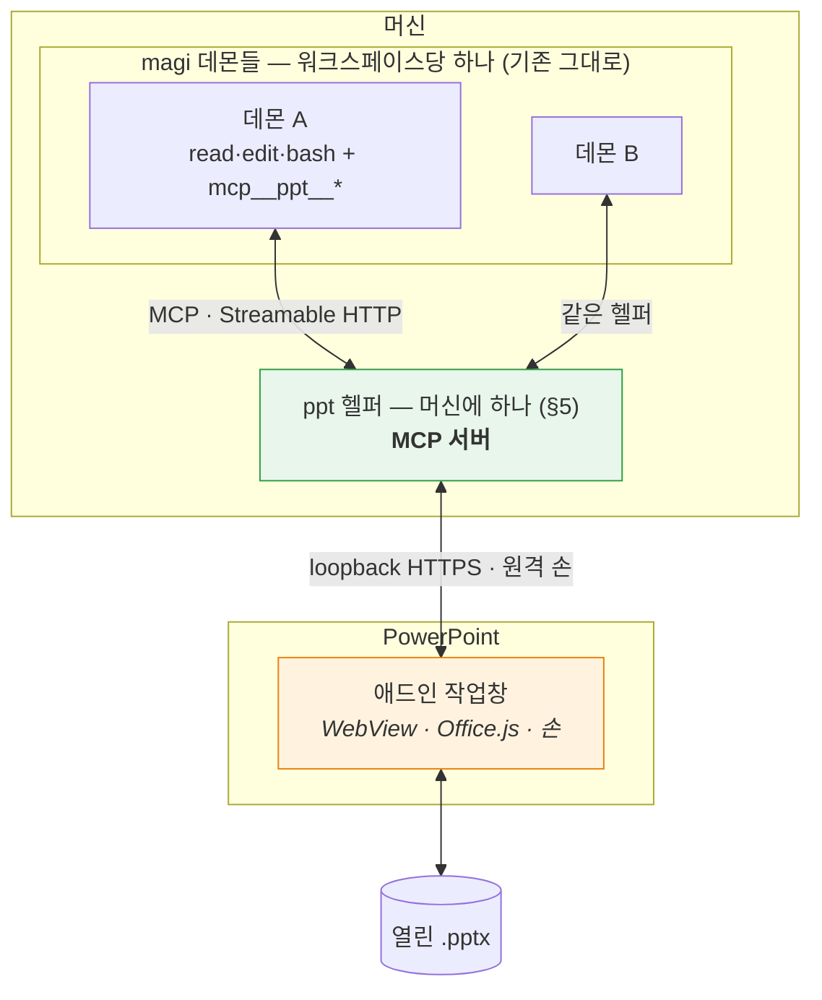
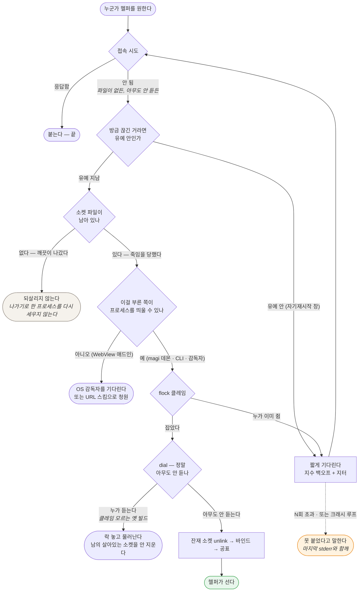

# PowerPoint MCP 플러그인 — 설계

Status: **제안. 구현하지 않았다.** (2026-08-28)

> **개정 (같은 날).** 첫 판본은 호스트 어댑터 계약을 직접 설계하고 새 코어 데몬을 두었다. 사용자가
> **도구를 MCP로 내놓으라**고 방향을 정했고, 그게 더 낫다 — 컨텍스트가 갈리지 않고(§4.2), 계약을
> 발명할 필요가 없으며(§4.3), `ide/`와의 데몬 범위 충돌이 통째로 사라진다. §0·§4·§5를 다시 썼다.
> 무엇이 어떻게 뒤집혔는지는 [`clients/jetbrains/README.md`](../jetbrains/README.md) §9에 남겼다. 두 플러그인이
> 주고받던 대화 문서 둘(`clients/jetbrains/INTEROP.md`·`clients/jetbrains/INTEROP-MCP.md`)은 각자의 설계 문서로 접었다.

> **개정 2 (같은 날).** 사용자가 §5의 전제를 바꿨다 — **애드인이 어느 컴패니언에 붙을지 고르고,
> 켜진 데몬이 하나도 없으면 덱이 있는 디렉토리에 띄운다.** PPT 파일에는 워크스페이스 개념이 없는
> 경우가 많다는 것이 이유다. §5.0을 새로 쓰고 §5.2·§5.6을 고쳤다. 같은 왕복에서 §7의 위원 축소가
> 틀렸다는 것이 드러나 그것도 뒤집었다.

> **인용 규약.** 커밋은 **제목**으로, 코드는 **심볼**로 짚는다 — 해시도 줄 번호도 쓰지 않는다.
> 2026-08-28 하루에 히스토리 재작성이 두 번, 줄 밀림이 세 번 있었고 그때마다 이 문서의 인용이
> 조용히 죽었다. 이 저장소의 커밋 제목은 문장이라 `git log --grep`으로 정확히 찾히고, 재작성에
> 안 죽는다. (`clients/jetbrains/README.md`도 같은 규약을 쓴다.)

> **닫힌 것 표기.** 닫힌 항목은 **제목에 취소선**을 긋고 그 자리에 지금 상태를 적는다. 본문은
> **남은 보장**과 커밋 제목으로 접는다 — 지우지 않는 것은 왜 그렇게 정해졌는지가 다음 결정의
> 근거라서고, 접는 것은 **제목만 읽고 지금 상태를 알 수 있어야** 해서다. 취소선이 없으면 지금
> 열려 있는 것이다. (하루에 결함 열몇 개가 닫히면서 이 문서가 연대기가 됐고, §4.4 ①은 제목이
> "이미지를 보낼 길이 없다"인데 본문 마흔 줄 아래에서 다 닫혔다고 말하고 있었다.)

> **개정 3 (같은 날).** 사용자가 **데이터를 이미지로 주고받는 것을 최대한 자제하라**고 정했다 —
> 붙을 모델이 멀티모달이라는 보장이 없기 때문이다. §2.2가 "픽셀이 우리의 우위"라고 쓴 것을
> 뒤집는다: 픽셀은 **마지막 수단**이고, 판정의 기본 경로는 숫자와 텍스트여야 한다. §2.2를 다시
> 쓰고 §4.4 ①의 결론을 고쳤다. 픽셀 없이 같은 질문에 답하는 길은
> [`CAPABILITIES.md`](CAPABILITIES.md) §10.6에 있다.

> **곁 문서.** [`CAPABILITIES.md`](CAPABILITIES.md) — 파워포인트가 실제로 무엇을 내주는지, 그리고
> 그것을 모델이 읽을 수 있는 모양으로 어떻게 세울지. 이 문서가 *무엇을 만들 것인가*를 정한다면
> 그쪽은 *재료가 무엇인가*에만 답한다. 부록 A와 겹치지 않게 썼다 — 픽셀을 얻는 세 경로(§2.2가
> 기대는 것), 덱 안에 상태를 적어 둘 자리 셋, 없는 것의 증명, 그리고 모델링 스케치가 거기 있다.

> 이 문서는 아직 코드가 없는 시점의 설계 의도다. 만들면서 어긋난 지점은 여기에 인라인으로
> 정정을 남기고, 지우지 않는다. 부록 A의 API 사실은 확인한 날짜와 출처를 달았다 — 그날 이후
> 마이크로소프트가 바꾼 것은 이 문서가 모른다.

---

## 0. 한 문장

**열려 있는 덱을 읽고, 사람이 말로 시킨 편집을 수행하고, 자기가 한 일이 실제로 그렇게 됐는지
확인한 뒤에야 끝났다고 말하는 에이전트.**

**에이전트는 magi다.** 이 프로젝트가 만드는 것은 에이전트가 아니라 **덱을 만지는 도구를 MCP로
내놓는 플러그인**과, 그 도구를 실제로 실행하는 머신에 하나뿐인 로컬 헬퍼다. 새 코어 데몬은 만들지
않는다 — 이유는 §4.2이고, 한 줄로는 **컨텍스트를 갈라놓지 않기 위해서**다. 저장소를 읽는 도구와
덱을 고치는 도구가 한 세션 안에 같이 있어야 그 둘을 잇는 브리프가 필요 없어진다.

**붙을 곳은 애드인이 고른다.** 켜져 있는 컴패니언 중에서 사람이 하나를 고르고, 하나도 없으면
**덱이 있는 디렉토리**에 띄운다 — PPT 파일에는 워크스페이스 개념이 없는 경우가 많기 때문이다(§5.0).

## 1. 무엇이 아닌가

경계를 먼저 적는다. 이 셋은 만들지 않는다.

- **문서 생성기가 아니다.** "이 마크다운으로 발표자료 만들어줘"는 다른 물건이다. 이건 *이미 있는*
  문서를 고친다. 생성은 나중에 얹을 수 있지만, 얹기 전까지는 없다고 말한다.
- **디자인 대행이 아니다.** "예쁘게 해줘"는 판정할 수 없는 요구다. 판정할 수 없는 것을 받으면
  끝났다고 말할 근거가 없어진다(§7).
- **자율 실행이 아니다.** 사람이 편집기를 열어두고 옆에 있는 상황을 전제한다. 사람 없이 도는
  배치 작업은 호스트 플러그인이 아니라 데몬에 직접 붙는 다른 클라이언트의 일이다.

## 2. 이 문제가 코딩 에이전트와 다른 세 지점

magi에서 배운 것을 그대로 옮기려다 부러지는 자리가 셋이다. 설계의 대부분이 여기서 나온다.
서술은 PowerPoint로 하지만, 셋 다 "편집기 안의 살아있는 문서"라는 상황 자체에서 나오므로
다음 호스트에도 그대로 온다.

### 2.1 되돌릴 곳이 없다

코딩 에이전트는 git 위에 산다. 클론이 있고, `base..HEAD`가 있고, 아니다 싶으면 되돌린다.
여기에는 **브랜치가 없다.** 대상은 사람이 지금 이 순간 열어놓고 보고 있는 문서 하나다.

후보 셋:

| 방법 | 되는 것 | 안 되는 것 |
|---|---|---|
| 편집기 자체 undo 스택에 맡긴다 | 공짜, 사람이 이미 아는 조작(⌘Z) | 플러그인 편집이 undo 스택에 어떻게 쌓이는지 **미검증**(S4). 한 번의 지시가 40개 도형을 고쳤을 때 ⌘Z 한 번에 다 돌아오는지, 40번 눌러야 하는지가 다르다 |
| 편집 전 스냅샷 | PowerPoint는 `slide.exportAsBase64()`가 슬라이드를 통째로 .pptx 바이트로 준다 — 완전한 원본 | 되돌리려면 그 바이트를 **다시 넣어야** 하는데, 쓰기 경로가 있는지 미검증(S5). 없으면 스냅샷은 증거로만 쓰이고 복원에는 못 쓴다 |
| 객체 태그 저널 | `shape.tags`(1.3)에 편집 전 값을 적어두고 되돌린다 | 우리가 만든 변경만 되돌린다. 객체를 **삭제**한 경우는 태그도 같이 사라져 못 되돌린다 |

**결정:** 셋 다 쓴다. 순서는 ① 스냅샷을 항상 뜬다(증거+최후수단) → ② 되돌리기는 태그 저널로
시도 → ③ 저널로 안 되는 것(삭제·구조 변경)은 **애초에 승인 없이 하지 않는다**(§8).
편집기의 undo는 우리가 통제하는 게 아니므로 계획에 넣지 않고, S4로 실태만 기록한다.

되돌리기는 **도구로 낸다**(`snapshot_slide` / `restore_slide`) — MCP에 "이 서버는 되돌릴 수 있다"를
선언하는 자리가 없기 때문이다(§4.4). 도구로 내면 에이전트가 쓸지 말지를 스스로 정하고, 안 쓴
것도 기록에 남는다.

### 2.2 "됐다"의 증거가 다르다

코딩 에이전트의 증거는 exit code와 파일 diff다. 둘 다 기계가 읽는 사실이다. 문서의 결과물은
**시각적**이고, 객체 모델이 "텍스트를 바꿨다"고 말해도 그 텍스트가 상자 밖으로 넘쳤는지는
모델이 모른다.

다행히 PowerPoint에는 답이 API에 있다. `slide.getImageAsBase64()`가 **슬라이드를 PNG로 렌더해
준다**(1.8). 그래서 판정 증거를 두 겹으로 쌓을 수 있다:

- **기록** — 우리가 호출한 편집과 그 전후 객체 모델 값(magi의 관찰 기록에 해당)
- **픽셀** — 편집 전후 렌더 PNG. 넘침·겹침·잘림처럼 객체 모델이 침묵하는 결함은 여기서만 보인다

**개정 3 — 순서가 뒤집혔다.** 앞 판본은 픽셀을 이 제품의 우위로 놓았다. 사용자가 방향을 정했다:
**데이터를 이미지로 주고받는 것은 최대한 자제한다.** 근거는 우리가 반박할 수 없는 것이다 —
**붙을 모델이 멀티모달이라는 보장이 없다.** 애드인이 고르는 컴패니언은 로컬 모델일 수 있고(§5.0),
`seesImages`가 false를 답하면 그림은 그냥 안 실린다. 픽셀 위에 판정을 세우면 **그 모델에서는 판정
자체가 없어진다** — 없는 증거가 아니라 없는 기능이 된다.

그래서 이 절의 두 겹은 순서가 있다.

1. **기록** — 우리가 호출한 편집과 그 전후 객체 모델 값. 항상 돈다.
2. **숫자** — 상자의 좌표·크기와 그 안의 텍스트에서 **계산으로** 나오는 넘침·겹침·잘림.
   객체 모델이 침묵하는 것은 "텍스트가 상자에 들어가는가"이지 **상자가 어디에 얼마만 한가**가
   아니다. 후자는 API가 포인트 단위로 준다. 겹침은 사각형 둘의 교집합이고, 슬라이드 밖으로
   나갔는지는 페이지 크기와의 비교다. **둘 다 그림 없이 나온다.**
3. **픽셀** — 위 둘로 답이 안 나오는 질문에만. 렌더는 **사람이 볼 때**와, 모델이 실제로 볼 수
   있다고 확인됐고(`seesImages`) 다른 길이 없을 때만 낸다.

세 번째가 필요한 질문이 남는다는 것은 사실이다 — 글꼴 치환, 자간, 자동 축소가 실제로 얼마나
줄였는지는 렌더에만 있다. 그러나 그건 **드문 질문**이지 기본 판정 경로가 아니다. 픽셀 없이 어디까지
가는지는 [`CAPABILITIES.md`](CAPABILITIES.md) §10.6에 적었다.

이미지 경로 자체는 세 층이 다 서 있다(§4.4 ①). **서 있는 것과 기본으로 쓰는 것은 다르다** — 세워
둔 채 아껴 쓴다. M4까지는 판정이 1·2로만 돌고, 그건 코딩 에이전트와 같은 조건이다.

### 2.3 읽기 천장과 쓰기 천장이 다르다 — 가장 중요한 사실

Office.js의 PowerPoint 객체 모델은 좁다. 그런데 **읽기에는 두 개의 비상구가 있다.**

| | 무엇으로 | 닿는 곳 |
|---|---|---|
| **읽기** | `slide.exportAsBase64()` (슬라이드 = .pptx 바이트) | **OOXML 전부** — 차트 데이터, SmartArt, 애니메이션, 발표자 노트까지 |
| | `slide.getImageAsBase64()` (PNG 렌더) | 최종 시각 결과 |
| | 객체 모델 (`shapes`, `textFrame`, `fill`, …) | 구조화된 값, 편집 가능한 것과 1:1 |
| **쓰기** | 객체 모델뿐 | 텍스트·도형·서식·표·레이아웃·순서·하이퍼링크 |

**비대칭이 제품의 모양을 정한다.** 에이전트는 차트가 잘못됐다는 것을 *볼 수* 있지만 *고칠 수*
없다. 애니메이션이 어색한 것을 알 수 있지만 손댈 수 없다. 발표자 노트를 읽을 수는 있어도 쓸
수는 없다.

이걸 숨기면 최악의 실패가 난다 — 에이전트가 "차트를 고쳤습니다"라고 말하고 아무것도 안 바뀌는
것. 그래서 **못 고치는 것은 도구를 아예 내놓지 않고, 발견하면 사람에게 넘긴다**(§6).
"보이지만 못 고침"은 이 제품의 1급 결과값이지 예외가 아니다.

MCP에서는 이 규칙이 서버 쪽 책임이 된다. `tools/list`에 올린 것은 반드시 실행돼야 한다 —
magi에서 광고와 실행이 어긋났을 때 모델이 그 도구를 부르고, 거부당하고, 다시 부르다 루프 가드에
죽은 기록이 있다.

## 3. 기술 스택 — 넷을 비교하고 하나를 고른다

이 절은 **첫 호스트에 대한 결정**이다. 코어의 스택이 아니다.

### 3.1 후보

- **A. Office Add-in (Office.js)** — 공식 확장 모델. WebView 안의 웹앱.
- **B. VSTO / COM 애드인 (.NET)** — PowerPoint 객체 모델 전부(VBA가 보는 그것). Windows 전용.
- **C. AppleScript / OSA 자동화** — macOS에서 PowerPoint를 밖에서 조종.
- **D. 플러그인 아님 — .pptx 파일 직접 조작** (python-pptx, OpenXML SDK).

### 3.2 비교

| 축 | A. Office.js | B. VSTO/COM | C. AppleScript | D. 파일 직접 |
|---|---|---|---|---|
| **개발 머신(macOS)에서 개발** | ✅ | ❌ Windows 전용 | ✅ | ✅ |
| 사용자 플랫폼 | Win·Mac 데스크톱 (**웹판은 §3.3 c에서 뺐다**) | Win만 | Mac만 | 무관(UI 없음) |
| 열린 문서에 붙기 | ✅ | ✅ | ✅ | ❌ 파일 잠김 |
| 읽기 천장 | 높음(OOXML+PNG, §2.3) | 최상(전 객체 모델) | 중간 | 최상 |
| 쓰기 천장 | 중간(객체 모델) | 최상 | 중간 | 최상 |
| UI 통합 | ✅ 작업창·리본 | ✅ | ❌ | ❌ |
| **로컬 프로세스 기동** | ❌ 샌드박스(§5.5) | ✅ | ✅ | ✅ |
| 배포 | 매니페스트+호스팅 | ClickOnce/MSI | 앱 번들 | — |

**웹판을 뺀 뒤에도 A가 이긴다.** 첫 줄이 혼자 결정하기 때문이다(§3.3 a) — 개발 머신이 macOS라
B는 애초에 후보가 아니고, 남은 셋 중 데스크톱 둘을 다 덮는 것은 A뿐이다. 웹판은 A의 **여유였지
근거가 아니었다.** 다만 표가 없는 여유를 광고하면 안 되므로 여기서도 지운다.

### 3.3 결정: **A. Office Add-in (Office.js), PowerPointApi 1.8 이상**

세 가지 근거이고, 첫 번째가 사실상 혼자 결정한다.

**(a) 개발 머신이 macOS다.** VSTO/COM은 Windows 전용이라 개발도 디버깅도 못 한다. C는 반대로
Windows 사용자를 버린다. D는 UI가 없어 §0의 물건이 아니다. 남는 건 A뿐이다.

**(b) 최소 버전이 1.8인 이유는 §2가 1.8에 걸려 있어서다.** `exportAsBase64`(OOXML 읽기),
`getImageAsBase64`(PNG 렌더), `slide.index`, `applyLayout` — §2.1의 스냅샷과 §2.2의 픽셀 증거를
떠받치는 넷이 **전부 1.8에서 들어왔다.** 1.7 이하로 내려가면 "읽고 판정하는" 물건 자체가 성립
안 한다. 판정을 포기할 바에는 지원 범위를 포기한다.

**(c) 1.8을 최소로 잡는 대가는 명확하고, 광고에 쓰지 말아야 한다.**

- Office on Mac **16.96 (25041326)** 이상, Windows **2504 (Build 18730.20030)** 이상
- **볼륨 라이선스/LTSC 영구 버전은 1.5까지 → 지원 불가.** 기업 표준 이미지가 LTSC면 이 제품은
  안 돈다. 이건 우회로가 없다.
- **iPad는 1.1까지 → 지원 불가.** 이 하나는 **축이 둘 다 막는다** — iPad에는 공유 런타임이 아예
  없고(부록 A), §5.7이 그것에 기대고 있다. 버전이 올라도 안 풀리는 쪽이다.
- **Office on the web은 API가 되는데도 불가** — 이건 1.8의 *대가*가 아니라 **다른 축의 사실**이다.
  부록 A의 표에서 웹 열은 1.8도 ✅고, 실제로 막는 것은 브라우저다(§5.5). 위 셋과 달리 **버전을
  올려서 풀 수 있는 게 아니다.**

**이 문서가 거는 요구 집합은 실은 둘이다.** §5.7의 채팅창과 §6의 물음이 **공유 런타임
(SharedRuntime 1.1)**에 기대는데, 그 바닥은 1.8보다 **낮다** — LTSC PowerPoint 2021에서도 된다
(부록 A). 그래서 이 두 번째 축은 위 목록에 아무것도 더 못 걸러낸다. 적어 두는 이유는 안 걸려서다:
확인하지 않고 넘어간 것과 확인해 보니 안 걸리는 것은 다르고, 나중에 바닥을 1.8 아래로 내리자는
말이 나오면 **그때는 이 축이 먼저 걸린다.**

런타임에 `Office.context.requirements.isSetSupported('PowerPointApi', '1.8')`로 확인하고,
아니면 **기능을 조용히 줄이지 말고 못 돈다고 말한다.** 매니페스트 `<Requirements>`로 막지 않는
이유는 그러면 애드인 목록에서 아예 사라져 사용자가 *왜* 없는지 모르기 때문이다.

**그런데 이 확인 하나로는 위 넷 중 셋만 걸린다.** 웹판에서 `isSetSupported`는 **참을 준다** —
부록 A의 웹 열이 ✅이고, 그게 바로 위 네 번째 항목이 "다른 축"이라고 말한 뜻이다. 버전 축에서
통과하고 브라우저 축에서 막히므로 이 게이트만 두면 웹 사용자는 못 돈다는 말을 **듣지 못하고**
첫 헬퍼 호출의 fetch 실패로 알게 된다. 조용히 줄이지 않겠다는 바로 위 문장이 웹에서만 안
지켜지는 것이다. 축이 둘이면 묻는 것도 둘이어야 한다 — `Office.context.platform`이
`Office.PlatformType.OfficeOnline`이면 버전과 **무관하게** 같은 자리에서 멈춘다.

사유 문구는 **갈라야 한다.** 셋은 "Office를 올리세요"로 풀리고 웹판은 올려도 안 풀린다(§5.5).
같은 문구를 쓰면 사용자가 없는 업데이트를 찾으러 간다. 웹판에는 데스크톱 PowerPoint에서 열라고
말한다.

### 3.4 기각한 것을 다시 꺼낼 조건

- **B(VSTO)** — 스파이크에서 쓰기 천장이 실제 요구를 못 받치는 것으로 드러나고, 동시에 Windows
  전용 배포를 받아들일 수 있게 되면. **그때 magi도 헬퍼의 MCP 표면도 손대지 않는다** — VSTO
  애드인은 헬퍼가 부리는 또 하나의 손일 뿐이고, 도구 이름과 스키마는 그대로다. 이게 MCP를
  경계로 둔 값이다.
- **D(파일 직접)** — 사람 없이 도는 배치 작업이 필요해지면. 플러그인이 아니라 데몬에 붙는 다른
  클라이언트로 추가한다. 열린 문서와 충돌하므로 **닫힌 파일에만** 적용한다.

## 4. 구조 — 도구는 MCP로 준다

### 4.1 층



**새 코어 데몬은 없다.** magi가 코어다. PowerPoint 플러그인은 덱을 만지는 **도구를 MCP로 내놓는
쪽**이고, 그 도구는 magi의 도구 목록에 `mcp__ppt__set_text` 같은 이름으로 들어간다.

### 4.2 왜 이게 별도 코어보다 나은가 — 컨텍스트가 갈리지 않는다

이게 이 설계의 요구사항이다. 별도 코어 데몬을 두면 에이전트가 둘이 되고, 둘은 `hand_off`로
만난다 — 그 순간 **컨텍스트가 갈린다.** 저장소를 읽은 에이전트가 아는 것을 덱을 고치는 에이전트는
모르고, 그 사이를 브리프가 잇는데, 이 저장소가 브리프로 식별자를 잃는 것을 **6번 중 6번** 실측했다.

MCP로 내놓으면 한 세션 안에 **저장소 도구와 덱 도구가 같이 있다.** 에이전트가 `read`로 설계문서를
읽고 같은 턴에 `mcp__ppt__set_text`로 슬라이드를 고친다. 전달이 없으므로 전달에서 잃을 것도 없다.

부수 효과로 §4의 원래 걱정 — "코어가 PowerPoint를 알면 안 된다" — 이 **공짜로 해결된다.** MCP가
바로 그 경계이고, 우리가 계약을 발명하지 않아도 이미 있다. ~~magi 쪽 코드 변경은 원칙적으로 0이고,
`config.toml`에 `[mcp.ppt]` 한 블록이면 붙는다.~~ → **경계는 그대로인데 이 두 문장이 틀렸다.**
붙는 길은 config가 아니라 door이고(§5.0), 코어 변경도 0이 아니었다 — door와 이미지 경로가 이 설계
때문에 들어갔다. 산 원칙은 **"코어가 PowerPoint를 모른다"**이지 "코어를 안 고친다"가 아니었다.

### 4.3 MCP가 공짜로 주는 것

앞 판본이 직접 설계하려던 호스트 어댑터 계약이 거의 그대로 MCP에 있다.

| 내가 만들려던 것 | MCP의 대응 | 상태 |
|---|---|---|
| 호스트가 도구를 선언하고 코어는 발명하지 않는다 | `tools/list` | ✅ 있음 |
| 이름 네임스페이스 | `mcp__<서버>__<도구>` — magi가 강제 | ✅ 있음. 안 하면 서버가 내장 도구를 가린다는 사고 기록까지 있다 |
| 능력 협상 | MCP `initialize` 핸드셰이크 | ✅ 있음 |
| 미선언 인자 거부 | 도구의 JSON Schema | ✅ 있음 |
| 서버가 죽으면 도구가 사라진다 | magi의 MCP 매니저가 자동 제거 | ✅ 있음 |
| 손이 사라지면 턴 보류 | (없음 — 도구가 그냥 실패한다) | ⚠ §5.4 |

### 4.4 MCP가 안 주는 것 — 다섯. ①은 닫혔고, ②④는 설계로 답했고, ③⑤가 열려 있다

**~~① 모델에게 이미지를 보낼 길이 없다.~~ → 닫혔다 (2026-08-28). 세 층이 다 섰다.**

층이 셋이었다 — MCP 컨텐트 블록이 이미지를 못 담고(`contentBlock`에 `text`뿐), 툴 결과에 이미지를
실을 자리가 없고(`session.ToolResult`), LLM 어댑터가 멀티모달 요청을 아예 조립할 줄 몰랐다. 층 3은
magi가 한 번도 가진 적 없는 기능이라 작은 요청이 아니었는데, 하루에 커밋 여섯 개로 들어왔다 —
"a tool that answers with a picture is no longer answering with nothing" · "the runtime door, and a
picture keeps its own name" · "a model that can see is shown the picture, not told about it" ·
"four ways the picture budget was wrong, all of them at deck size" · "the same picture twice is one
picture, and the reason it was cut is said" · "the door was reachable in ways the config file never
was". 우리가 실측해 보낸 결함이 전부 닫혔다.

여기 한동안 **"결함 여덟"**이라고 수를 적어 뒀는데 뺀다. 그 수는 우리가 보낸 보고에서 나온 것이라
**이 저장소에서 확인할 길이 없다** — 커밋 여섯은 `git log`가 받치고, 여덟은 아무것도 안 받친다.
틀렸다는 게 아니라 **검사할 수 없는 수**라는 것이고, 그런 수는 아무도 안 볼 때 썩는다. 게다가 이
수에 걸린 설계 결정이 하나도 없다 — 설계가 기대는 것은 아래 보장이지 결함의 개수가 아니다.
**설계가 지금 기대는 보장만 남긴다:**

- 이미지 블록이 파일로 떨어지고(`data`/`mimeType` → `session.ToolResult.Images []ImageRef`),
  이름을 **내용으로** 짓는다(`images/<session>/<tool>-<sha256[:6]>.<ext>`). 그래서 슬라이드 3의
  참조가 9번 그림으로 해소되지 않는다 — 같은 툴을 수십 번 부르는 덱 작업이 정확히 그 모양이었다.
- vision 모델이면 그림이 **data URL로 실려 간다.** 툴 결과 메시지(role=tool)에는 자리가 없어
  **다음 사용자 메시지**로 가고, 대화에 `The images from tool call c1:` 한 줄이 더 남는다 — §2.2의
  픽셀 증거를 설계에 적을 때 그 줄이 보인다는 것을 감안한다. 못 보는 모델을 위해
  `[image: <mime> at <path>]` 줄은 **양쪽 경로 모두에** 남는다.
- 한 요청에 **네 장·4MB.** 첫 장은 예산을 넘겨도 타고(데몬이 이미 자기 상한 8MB로 걸렀다),
  초과분은 건너뛰되 걷기는 **계속하며**, 예산은 **뒤에서 앞으로** 미리 배분하고(오래된 것이 먼저
  먹지 않는다), 같은 경로는 **한 번만** 센다. 장수로 잘린 것과 크기로 잘린 것은 **다른 문장**으로
  말한다. 상한은 디스크 바이트가 아니라 **전선 바이트**(base64라 4/3배)로 센다.
- 그림은 나이로 지운다 — `SweepImages`가 한 달 지난 것과 그래서 빈 세션 폴더를 데몬 기동 때 걷어
  간다. 지워진 그림의 `[image: … at …]` 줄은 남고, 그 줄을 읽는 모든 독자가 없는 파일을 에러가
  아니라 부재로 다룬다. **청소 주기가 우리 크기에 맞는지는 아직 안 쟀다** — 덱 하나 리뷰가 렌더
  수십 장이다. S7이 같이 잰다(§9).
- `model.Vision`은 이제 **읽히는 값**이다(`App.VisionOf` → `openai.WithVision`, 정적 카탈로그는
  fallback 전용). 다만 `Registry.Get`이 못 맞춘 이름을 family로 떨어뜨려 아무도 선언한 적 없는
  `gpt-4o:textonly-distill`이 true로 답한다 — **코드가 아니라 주석의 보장**이 그 상속을 인정하는
  쪽으로 닫혔다. 애드인이 붙일 로컬 모델이 정확히 그 `:tag` 구간에 살기 때문에 우리에겐 남는
  사실이다(S7이 잰다).

~~**남은 것 하나, 주인이 없다.**~~ **틀린 진단이었다 — 닫는다.** 그림 파일이 워크스페이스
**밖**(데몬 데이터 디렉토리)이라 `read`가 거부한다고 적었고, 그래서 워크스페이스 안
`.magi/images/`로 옮기는 쪽이 감옥에 예외를 내는 것보다 낫다는 데까지 갔었다. **감옥이 막는 게
아니다.** 빌트인 `read`는 내용을 보고 `binary file: <path>`로 거부한다 — 감옥 안으로 옮겨도
같은 줄에서 같은 이유로 거부한다. **디렉토리를 옮겨서 새로 가능해지는 일이 하나도 없다.**
그리고 옮기는 쪽에 대가가 셋 있다.

- **오래 살라고 거기 둔 것이다.** 코어 주석이 그 이유를 적는다 — 로그가 그림을 이름으로 가리키고
  뷰어는 나중에 그 로그를 연다. 워크스페이스 안이면 체크아웃이 지워질 때 같이 죽는다.
- **30일 스위퍼가 사용자 작업 트리 안을 지우게 된다**(`SweepImages`, 데몬 기동 때 한 번).
  캐시 디렉토리를 쓸어내는 것과 남의 저장소 안을 지우는 것은 같은 행동이 아니다.
- **`.gitignore`가 필요해진다.** 코어 주석이 부피의 예로 든 것이 하필 *"a deck review writes tens
  of megabytes in an afternoon"* — 우리다.

(`.magi/` 자체는 하드 데니가 아니라는 건 확인했다. `guardrailGlobs`는 `**/.magi/config.toml`과
`**/.magi/plugins/**` 둘뿐이다. 그러니 그 이유로 막히지는 않는다 — 막을 이유가 위의 셋이다.)

**진짜로 없는 것은 따로 있고, 그건 우리가 안 만든다.** magi에는 **디스크의 그림을 턴 안으로 다시
들이는 경로가 아예 없다** — `read`에 이미지 분기가 없고, 그 일을 하는 다른 도구도 없다. 그림은
호출 결과의 content block으로만 들어온다. 그래서 다음 세션에서 지난 렌더를 다시 보려면 길이 없는데,
이것은 감옥 문제가 아니라 **없는 기능**이고 **개정 3이 만들지 말라고 한 바로 그 방향**이다.
답은 다시 렌더하는 것이고, 그건 우리 서버가 싸게 한다. 사람이 로그에서 그림을 여는 것은 애초에
magi의 `read`를 안 지난다 — OS로 연다.

**층이 다 섰다는 것과 이것을 기본 경로로 쓴다는 것은 다르다(개정 3).** 판정의 기본은 숫자와
텍스트고 픽셀은 마지막 수단이다 — 붙을 모델이 멀티모달이라는 보장이 없다. 그래서 위의 예산·중복
결함들은 **덜 자주 걸리는 대신, 걸릴 때는 사람이 보는 렌더에서 걸린다.** S7이 재는 것도 "되는가"가
아니라 **픽셀 없이 §2.2의 2단계(숫자)만으로 넘침·겹침을 몇 %나 잡는가**다(§9). 그 값이 높으면
개정 3은 제약이 아니라 그냥 옳은 설계다.

**② 모든 MCP 도구가 danger tool이다.** `internal/app/execute.go`의 `dangerGated`가 `mcp__` 접두사만 보고
위험 판정을 한다 — magi가 외부 서버가 무엇을 할지 증명할 수 없어서 고른 기본값이고, 옳다.
대가는 `list_slides` 같은 순수 읽기도 `ask`/`auto`에서 **매번 묻는다**는 것이다. 답은 허용 규칙이다:

```toml
allow = ["mcp__ppt__list_*(**)", "mcp__ppt__read_*(**)", "mcp__ppt__render_*(**)"]
```

**쓰기 도구는 규칙에 넣지 않는다.** 덱을 고치는 것은 물어야 하는 일이 맞다.

**③ 도구 호출 타임아웃이 60초다** (`internal/adapter/mcp/tool.go`의 `mcpTool.Execute`가 거는 `context.WithTimeout`). 100장 덱의 `export_slide_ooxml`이나 큰 슬라이드
렌더가 여기 걸릴 수 있다. §9의 S6이 이 수를 재야 한다.

~~한동안 이 수는 **타임아웃보다 나쁜 것**을 달고 있었다~~ — 수명 장치가 caller의 기한 초과까지
세어, 살아 있는 서버가 큰 덱 렌더 세 번이면 도구를 뺏겼다(내가 검토에서 실측: 애드인이 대화 중간에
사라진다는 뜻이다). **닫혔다** ("our own impatience is not evidence about the server") — 이제
`ctx.Err() == nil`일 때만 센다. **느린 것은 죽은 것이 아니다.** 60초는 여전히 재야 할 수지만,
넘긴 대가가 그 호출 하나로 끝난다.

**수를 재기 전에 코드가 이미 정해 놓은 것 셋**(재느라 미룰 이유가 없어서 먼저 읽었다).

- **60초는 줄어들기만 하고 늘어나지 않는다.** `context.WithTimeout(ctx, 60*time.Second)`는 caller의
  기한과 **짧은 쪽**을 택하므로, 호출자가 넉넉히 준다고 이 천장이 올라가지 않는다. 환경변수도 인자도
  없다(`MAGI_*_TIMEOUT` 계열에 MCP 몫이 없고, `mcp` 패키지의 상수는 이것과 `mcpRegisterTimeout`
  30초 둘뿐이다). 대비되는 자리가 바로 옆에 있다 — magi 자기 `bash` 도구는 기본 **120초**에 호출자가
  **600초**까지 인자로 올린다(`defaultBashTimeout`/`maxBashTimeout`). 같은 렌더를 셸로 돌리면
  기본값이 이미 MCP 천장의 두 배고, 더 달라고 말할 수도 있다. **도구가 "이건 오래 걸린다"고 말할 길이
  없다는 점에서 §4.4 ⑤와 같은 모양이다.**
- **끊는 것은 이쪽뿐이고, 서버는 계속 돈다.** `Client.call`은 기한이 지나면 pending 슬롯을 지우고
  `ctx.Err()`를 낸다 — 뒤늦게 온 응답이 엉뚱한 호출로 가지 않으니 그 처리는 깨끗하다. 다만 클라이언트가
  보내는 알림은 `notifications/initialized` 하나뿐이라 **`notifications/cancelled`는 안 간다.**
  우리에게 이것은 "결과를 잃었다"가 아니다. **magi가 실패로 판정한 뒤에도 헬퍼가 덱을 계속 저장한다**는
  뜻이고, 그러면 다음 호출이 읽는 파일을 방금 "실패한" 호출이 쓰고 있다. 그래서 **쓰기 도구는 타임아웃이
  재시도 안전이 되도록 우리 쪽에서 만든다** — 저장은 원자적으로(임시 파일 + rename), 재시도는 이미
  끝난 작업 위에서 무해하게. 취소 알림이 오기를 전제하지 않는다. (코어가 그것을 보내 주면 낭비가
  줄지만, 그건 별건이고 이 의무를 없애 주지도 않는다.)
- **에러 문구가 누가 끊었는지를 말하지 않는다.** HTTP 경로에서 나오는 것은
  `Post "http://127.0.0.1:PORT/mcp": context deadline exceeded`이고, `tool.go`가 그것을 그대로
  `IsError: true`로 싣는다. **60초라는 말이 없고, 그 선을 magi가 그었다는 말이 없고, 서버가 아직 일하는
  중일 수 있다는 말이 없다.** 모델이 읽으면 "서버가 실패했다"로 읽힌다. 같은 문제를 같은 저장소가 이미
  한 번 풀었다 — `SocketPath.tooLong`은 OS가 "invalid argument"라고만 하는 자리에서 **사유를 직접
  만들어 붙인다.** 여기도 같은 처방이 되고, **이 수정은 60초가 얼마로 정해지든 상관없이 맞다**(재기
  전에 요청할 수 있는 유일한 몫이 이것이다).

즉 **수 자체는 S6 전까지 미측정으로 둔다.** 근거 없이 올려 달라고 하지 않는다.

**④ MCP에 scope 개념이 없다.** 어느 문서를 고치라는 것인지 MCP는 모른다. 그래서 **도구 인자로
받는다** — 모든 도구가 `document`를 받고, 생략하면 지금 활성 문서다. 애드인이 여럿(창이 여럿)이면
헬퍼가 그 인자로 손을 고른다(§5.6).

**⑤ MCP 도구는 "내가 파일을 고친다"고 말할 길이 없다.** (2026-08-28에 새로 생긴 항목이다.)

코어에 `port.FileTool`이 들어왔다("a tool says it edits files, instead of magi recognising three
names"). **"이 호출은 파일 편집이었다"에 다섯 가지가 매달려 있다** — 비밀·가드레일 거부 바닥,
카운슬에게 보여 줄 호출 전 스냅샷, 편집 후 진단 패스, 반복 가드의 경로별 epoch, 이번 턴에 무엇이
바뀌었는지의 기록. 지금까지 이 다섯이 **툴 이름**으로 판정됐다(`write`/`edit`/`multiedit`, 읽기 쪽은
`read`/`grep`/`glob`/`list`). 커밋이 든 동기 사례가 정확히 우리다 — *"an editor plugin attaches a
tool that edits the same workspace and is called mcp\_\_jetbrains\_\_edit; a slide add-in the same."*

**그런데 선언할 자리가 아직 없다. 실측했다.**

- 비-테스트 Go 전체에서 `FileArg`/`WritesFile`를 구현하는 타입이 **0개**다. 나오는 곳은 선언
  (`internal/port/port.go`)과 읽는 곳(`internal/app/filetools.go`의 `touchesFileIn`) 둘뿐이다.
- `touchesFileIn`은 `reg.Get(name)`이 돌려준 값을 `port.FileTool`로 타입 단언한다. MCP 도구가
  레지스트리에 드는 값은 `internal/adapter/mcp/tool.go`의 `mcpTool`이고, 이 타입은
  `Name`/`Description`/`Schema`/`Execute` 넷만 갖는다.
- 전선에도 자리가 없다. `internal/adapter/mcp/jsonrpc.go`의 `toolDef`는 `{name, description,
  inputSchema}`뿐이고, MCP 표준의 `annotations`(`readOnlyHint` 등)를 **파싱하지 않는다**.

그러니 **이음매는 섰고 우리가 꽂을 구멍은 아직 없다.** 필요한 두 반쪽 중 `writes`는 MCP 표준
`annotations.readOnlyHint`가 이미 자리를 갖고 있으므로 파싱만 하면 되고, `fileArg`는 표준에 없어서
magi 규약이 필요하다(입력 스키마의 `x-magi-file-arg`가 후보다). **이름 규칙과 마찬가지로 정하는 쪽이
붙이는 쪽이므로 우리가 제안한다.**

**그런데 우리가 선언하면 다섯 중 둘만 우리 것이다.** 셋을 하나씩 재 보면:

| 매달린 것 | 덱에 걸면 |
| --- | --- |
| 비밀·가드레일 바닥 | `.pptx`는 `secretGlobs`에도 `guardrailGlobs`에도 없다 — 걸릴 것이 없다 |
| 편집 후 진단 | `internal/app/hooks.go`가 `filepath.Ext(path) == ".go"`로 막는다 — 덱에는 안 돈다 |
| 카운슬 before→after | **아래 참조** |
| 반복 가드 epoch | 유용하다 — 같은 슬라이드를 계속 고치는 것을 세는 축이 생긴다 |
| 턴 변경 기록 | 유용하다 — "이 턴에 덱이 바뀌었다"가 증거로 선다 |

**그리고 before→after 자리에 결함이 하나 있다. 재서 확인했다.** 스냅샷은
`internal/app/guard.go`의 `readForChange`인데 **256 KiB에서 끊고, 넘으면 `("", false)`를
돌려준다** — "부분은 파일이 아니다"라는 옳은 판단이다. 문제는 그 답을 받는 쪽이다:

```
readForChange(300KiB)  before="" readable=false  exists=true
  파일-툴 가지  (changeBefore == "" && pathExists) = true    ← tool_outcome.go
  bash 가지     (!existedBefore  && pathExists)    = false   ← 같은 파일, 다른 질문
```

**한 질문에 두 답이 있고, 틀린 쪽이 다른 쪽 주석이 경고하는 바로 그 답이다.** bash 쪽은 내용이
아니라 **stat**(`existedBefore`)으로 묻고 그 이유를 적어 두었다 — *"An absent path and an empty file
both read as '', so content alone cannot tell a creation or a deletion from a no-op."* 파일-툴 쪽은
내용으로 묻는다. `readForChange`가 준 `changeReadable`은 **저널로만 가고**(`execute.go`, `depth > 0`)
이 가지는 읽지 않는다. 그래서 **256 KiB를 넘는 파일에 쓰기가 일어나면 매번 "이 런이 그 경로를
만들었다"로 기록된다.** `.pptx`는 사실상 항상 그 위다.

그 기록이 무엇을 하는지도 실측했다 — `didCreate`를 읽는 유일한 자리가 되돌릴 수 없는 명령의
카운슬 게이트다(`internal/app/irreversible.go`):

```
rm -rf ~/Decks/q3.pptx   didCreate=false -> council gate=true  "rm -rf /Users/…/q3.pptx"
rm -rf ~/Decks/q3.pptx   didCreate=true  -> council gate=false ""
```

**오늘은 무해하다.** 빌트인 파일 도구는 워크스페이스 감옥 안에만 쓰고, 게이트는 트리 **밖** 경로만
보므로 둘이 만나지 않는다. **선언한 MCP 파일 도구가 그 만남을 만든다** — 감옥은 빌트인의
`resolvePath`에 있지 정책에 있지 않아서, 선언된 경로는 트리 밖일 수 있다. 덱 둘째 장을 다른
폴더에서 열면 정확히 그 모양이고, `.pptx`는 언제나 256 KiB를 넘는다. 그러면 **덱을 지우는 명령이
게이트를 건너뛴다.**

~~고치는 자리가 코어라 여기서 정하지 않는다.~~ → **닫혔다**("this run made it" is a question for the
filesystem, not for the content). 보낸 제안 그대로 들어갔다 — 호출 **전에** `pathExists`를 한 번
불러 `changeExisted`에 담고, 파일-툴 가지가 내용 대신 그것을 본다(`noteToolOutcome`의 조건이
`changeBefore == ""`에서 `!o.changeExisted`로 바뀌었다). stat은 바로 아래에서 자식 저널용으로 이미
찍고 있던 것이라 한 번 찍어 둘이 쓴다. 테스트 둘이 양쪽을 문다 — 큰 파일을 **편집**한 것은 창조로
기록되지 않고, 정말 없던 데서 쓴 파일은 **여전히** 기록된다(뒤쪽이 빠지면 게이트가 제 산출물을
영원히 물어본다).

**우리 쪽 결정은 하나 남는다: 선언할 것인가.** 지금 답은 **선언한다**이다 — 얻는 둘(epoch, 턴 기록)이
실제로 우리 것이고, 못 얻는 셋은 손해가 아니라 무관이다. ~~다만 위 결함이 닫히기 전에는 선언하지
않는다.~~ → **전제가 풀렸다.** 순서를 지킨 이유는 그대로 유효하다 — 반대로 갔으면 우리가 게이트를
끄는 첫 사례가 됐다. 이제 남은 것은 규약 제안 자체다(§12 ④).

**선언하기 전에 물은 것: 선언된 경로가 워크스페이스 밖이면 정책은 무엇을 하나.** 감옥을 규약과 같이
열어야 하는지가 걸려 있었다. 답은 **아니다**였고, 그 근거로 코어가 구멍 하나를 먼저 닫았다
("declaring adds obligations, and must not subtract a question").

그 구멍은 감옥이 아니라 **권한**에 있었다. `--permission auto`(accept-edits)가 파일 편집을 안 묻고
돌리는데, 그 문장은 편집이 `write`/`edit`/`multiedit` 셋이던 시절에 쓰였다 — 셋 다 magi 것이고
`resolvePath`가 가둔다. 인식자가 "툴이 스스로 답하는 질문"이 되면서 **지름길이 같이 넓어졌다.**
선언한 MCP 툴이 auto에서 안 묻고 돌 뻔했다 — 여태 **항상** 물어보던 것이. 그러면 선언의 첫 효용이
"파일 편집한다고 말하면 안 물어본다"가 된다. 지금은 지름길이 더 좁은 질문을 한다(`confinedEdit`:
magi **자신의** 쓰는 파일 툴인가).

**다만 그 좁은 질문이 지금은 이름으로 답해진다** — `confinedEdit`이 레지스트리를 안 보고 문자열만
보는데, 툴 레지스트리의 `Register`는 주석 그대로 *"adds or replaces a tool by name"*이고 Lua
`register_tool`에는 접두도 충돌 검사도 없다. 즉 `write`라는 이름을 덮은 플러그인이 그 지름길을
탄다. 코어에 보고했고(2026-08-28), **이 설계가 기대는 쪽은 영향이 없다** — 우리는 MCP 선언자라
어차피 물어보는 쪽에 있고, 표의 오른쪽 열은 그대로다. 여기 적어 두는 것은 표가 약속하는 성질이
지금 **문자열로 검사되고 있다**는 사실까지가 우리가 아는 것이기 때문이다.

그래서 **"선언은 순증한다"가 산문이 아니라 코드다.** 이 설계가 여기 기댄다:

| 선언하면 더해지는 것 | 선언해도 안 빠지는 것 |
| --- | --- |
| 시크릿·가드레일 하드 데니 바닥 | danger 게이트 — `mcp__` 접두는 `ask`/`auto`에서 프롬프트 |
| 호출 전 스냅샷(카운슬 증거) | auto의 지름길(이제 magi 자기 툴만) |
| 편집 후 진단 패스 | 되돌릴 수 없는 명령 게이트(reach로 판정 → 트리 밖은 여전히 묻는다) |
| 경로별 반복 가드 epoch | |
| 턴 기록, 그리고 위 `changeExisted` | |

**오른쪽 첫 칸에 "항상"이라고 적지 않은 이유가 있다.** `--permission allow`는 스위치가
`case "allow": return true`로 먼저 빠지고, 오퍼레이터 allow 룰(`policy.AllowedByRule`)도 프롬프트를
건너뛴다 — `dangerGated`의 주석 자신이 "waved through under allow"라고 적는다. 그 두 길은 결함이
아니라 모드가 이름대로 하는 것이고, **§5.0.6이 allow 룰을 `mcp__` 위험도구 기본값의 유일한 완화책으로
쓰기로 한 것과 같은 자리**다. 같은 문을 한 곳에서는 "항상 잠긴다"로, 다른 곳에서는 "우리가 연다"로
적으면 둘 중 하나는 거짓말이 된다.

**그래서 감옥은 열지 않는다.** 선언된 경로가 워크스페이스 밖일 수 있는 것은 구멍이 아니라
**요구사항**이다 — 덱은 `~/Decks`에 있고, MCP 툴은 별개 프로세스라 선언하기 **전에도** 거기 쓸 수
있었다. 선언은 그 능력을 주지 않고 그 경로에 **바닥을 씌운다**: 선언 안 하면 `.env`를 열어도 magi가
모르고, 선언하면 하드 데니다.

**규약의 모양(§12 ④에서 제안한다).** 아래 다섯 중 **1–3이 규약 자체**이고, **4–5는 그 규약이
붙기 전에 답해야 하는 것**이다 — 누가 구현하는가(4), 그리고 붙는 순간 도달 가능해지는 코어의
빈 구멍(5). 앞 판본이 여기 "세 가지가 정해졌다"고 적고 다섯을 나열해서, §12가 "정해진 셋은 이 절
**끝**에 있다"고 엉뚱한 데를 짚고 있었다. 셋은 끝이 아니라 앞이다:

1. **`writes`는 MCP 표준 `annotations.readOnlyHint`.** 자리가 이미 있으니 `toolDef`가 파싱하면 된다.
   **없으면 "쓴다"로 읽는다** — 모르는 것을 읽기전용으로 낙관하면 가드레일 바닥이 조용히 빠지고,
   반대로 틀리면 추적이 조금 더 도는 것뿐이다. 비대칭이 방향을 정한다.
2. **파일 인자는 `x-magi-file-arg`, 값은 최상위 인자 이름만.** JSON 포인터는 받지 않는다. 중첩을
   허용하면 바닥이 읽는 문자열과 툴이 실제로 여는 문자열 사이에 해석이 한 겹 더 끼는데, 그 겹이
   어긋나는 것이 이 저장소가 골든으로 막고 있는 바로 그 종류다.
3. **선언한 경로는 툴이 실제로 여는 경로여야 한다** — 그리고 **이것은 강제되지 않는다.** 바닥은
   선언한 쪽을 보므로 다른 것을 여는 툴은 바닥을 우회한다. 워크스페이스 신뢰 경계와 같은 종류의
   계약이라 적어 두는 것이 값이고, 지킬 수 있는 척하면 더 나쁘다.
4. **선언은 MCP 도구 전체가 아니라 선언한 도구만 한다.** Go의 메서드 집합은 정적이라
   `mcpTool`에 `FileArg`/`WritesFile`을 달면 **이 규약을 들어 본 적 없는 서버의 도구까지 전부**
   선언자가 된다. 그러면 `touchesFileIn`이 그것들에 대해 `(path: "", writes: true, ok: true)`를
   내는데, 지금은 `builtinFileTools`에 없어서 `ok: false`로 빠지던 것들이다. 코어가 방금
   `confinedEdit`으로 좁힌 것과 **정확히 반대 방향의 넓힘**이다. 그래서 `annotations`나
   `x-magi-file-arg` 중 하나라도 실제로 온 도구만 **다른 타입**(`mcpTool`을 감싼)으로 등록한다.
   안 온 도구는 오늘과 한 글자도 다르지 않게 둔다.
5. **`writes: true`인데 경로가 빈 경우를 코어가 아직 안 막는다** — 그리고 이것은 4를 지켜도 남는다
   (`readOnlyHint: false`만 적고 파일 인자를 안 적은 도구가 그 모양이다). `tool_outcome.go`에서
   `noteCreated`는 바로 위에서 `p != ""`로 걸러지는데 **`guard.mutated(touch.path, …)`에는 그 가드가
   없다.** `mutated("")`는 `lastMut[""]`와 sig를 비교하므로, 호출마다 인자가 다른 도구들이 번갈아
   불리면 매번 "새 판본"으로 읽혀 `sinceProgress`가 0으로 돌아가고 stall 창이 다시 선다 — 이 저장소가
   이름까지 붙여 둔 **미검증 mutation의 stall 방어 재충전**이다. 오늘은 거의 도달 불가다(경로 없는
   빌트인 쓰기는 실패하고 `!res.IsError`가 막는다). **선언이 그것을 매 성공 호출마다 도달 가능하게
   만든다.** 그래서 요청은 두 쪽이다 — 규약을 받아 주는 것, 그리고 `mutated`에도 위와 같은 빈-경로
   가드를 두는 것. **뒤쪽은 우리 규약을 안 받아도 맞는 수정이다.**

### 4.5 전송은 HTTP여야 한다 — stdio가 아니라

magi의 MCP 클라이언트는 stdio와 Streamable HTTP를 둘 다 지원한다
(`internal/adapter/mcp/http_transport.go`). 여기서는 **HTTP만 맞다.**

stdio는 magi 데몬이 서버를 **자식 프로세스로 띄운다.** 그런데 magi 데몬은 워크스페이스당 하나라
여럿이고, 각자 자기 헬퍼를 띄우면 **같은 PowerPoint 애드인을 두고 헬퍼 N개가 싸운다.** 애드인은
하나뿐이므로 붙을 수 있는 헬퍼도 하나뿐이다.

HTTP면 헬퍼가 먼저 서고 데몬들이 클라이언트로 붙는다. 헬퍼의 수명이 magi 데몬의 수명과 분리되고,
이게 §5의 "머신에 하나"가 실제로 필요한 이유다.

---

## 5. 어디에 붙고, 누가 손을 쥐나

### 5.0 붙을 곳은 애드인이 고른다

**전제가 바뀌었다.** 앞 판본은 "config에 `[mcp.ppt]`를 적은 magi가 덱 도구를 갖는다"였다. 붙는
쪽이 magi였고 헬퍼는 가만히 있었다. 지금은 반대다 — **애드인이 어느 컴패니언에 붙을지 고르고, 그
컴패니언에 MCP를 준다.**

이유는 하나다. **PPT 파일에는 워크스페이스 개념이 없는 경우가 많다.** 저장소는 자기가 어디 사는지
알지만 덱은 그냥 파일이고, 바탕화면에 있거나 메일에서 방금 내려받았을 수 있다. 워크스페이스에서
데몬을 유도할 수 없으므로 **반대로 유도한다.**

- **켜진 데몬이 있으면 그중에서 고른다.** `daemon.List(configDir)`가 공표된 데몬 전부를 **dial까지
  해서** 돌려준다 — 워크디렉토리·이름·역할·팀·`Live`, 그리고 지금 무엇을 묻고 무엇을 하는 중인지
  까지(`internal/adapter/daemon/daemon.go`). 고르는 화면에 필요한 것이 이미 다 있고, SIGKILL로
  죽어 소켓만 남은 것도 **죽었다고 표시돼서** 온다. 새로 셀 것이 없다.
- **하나도 없으면 덱의 디렉토리에 띄운다.** 저장소 안의 덱이면 그 저장소가 워크스페이스가 되고,
  바탕화면의 덱이면 바탕화면이 된다. 후자가 이상해 보이지만 대안은 "워크스페이스 없음"이고 그건
  magi에 없는 상태다. **다만 그 선택이 곧 경계 선택이다 — §8의 마지막 항목이 그 값이다.** 흔적은
  거의 남지 않는다: 기동만으로 `.magi/`를 만들지 않고, 있으면 읽을 뿐이다(`config.Load`,
  `expgit.New`는 디렉토리를 들고만 있고 `MkdirAll`은 쓰기 시점에 있다). 디렉토리는 `remember`가
  프로젝트 층에 처음 쓸 때 생긴다.
  ⚠ **저장 안 된 덱에는 그 디렉토리도 없다**(§5.6). 그때는 홈이나 임시 디렉토리로 대신하지 않고
  **저장하고 다시 열라고 말한다.** 이유는 바로 위 문장이다 — 디렉토리를 고르는 것이 곧 §8의 경계를
  고르는 것인데, **사용자가 안 고른 경계를 우리가 대신 고르는 것**이 그중 제일 나쁜 경우다. 첫 규칙은
  그대로 산다: 켜진 데몬이 있으면 저장 안 된 덱에도 붙을 곳이 있다.
- **그래서 데몬 범위 충돌이 사라진다.** 이쪽도 **워크스페이스당 하나**다. `ide/`와 규칙이 같아졌다.
  사용자당 하나로 남는 것은 Office 애드인을 받아주는 로컬 헬퍼뿐이고(§5.2), 그건 magi 데몬이
  아니라 **다른 층**이다.

**⚠ 그런데 밖에서 붙일 door가 없다.** 데몬 프로토콜 메서드 전량이 submit · steer · interrupt ·
permission · answer · resume · rewind · compact · set-model · set-permission · use-backend ·
reload-cron · hand 이고, **MCP를 다루는 것이 하나도 없다.**

런타임 등록 자체는 있다. `Manager.AddHTTP` / `AddHTTPDynamic` / `Remove`가 있고 **Lua 플러그인
브리지가 이미 그것을 부른다** — `magi.register_mcp{name=, url=, headers=fn}` → `AddHTTPDynamic`
(`internal/adapter/plugin/lua/bridge.go`). 즉 **프로세스 안에서는 열려 있고 밖에서는 닫혀 있다.**
`[mcp]`는 플러그인이 읽지도 쓰지도 못하는 config 섹션이기도 하다(`denyConfigSections`,
`internal/adapter/plugin/lua/permission.go`) — 설정을 고쳐 붙이는 길은 **의도적으로** 막혀 있다.

| | 무엇 | 새 표면 | 값 |
|---|---|---|---|
| **(가)** | 데몬에 `mcp-attach{name, url, headers}` 메서드 하나 | 프로토콜 메서드 1 | 밖에서 고른다는 요구에 정직하게 맞고, `ide/` 쪽 플러그인도 같은 door를 쓴다 |
| **(나)** | 고른 컴패니언이 로드하는 작은 Lua 플러그인이 `register_mcp`를 부른다 | 0 | 붙는 시점이 **플러그인 기동 때 한 번**이라 "지금 저 컴패니언에 붙어라"를 말할 수 없다 |

**(가)로 간다.** (나)를 접는 이유가 둘이다.

- **"고른다"가 안 된다.** 모든 컴패니언에 깔면 고르는 게 아니라 전부고, 덱을 만질 일 없는 코딩
  컴패니언까지 `mcp__ppt__*`를 단다. 그게 공짜가 아니다 — `internal/app/execute.go`가 `mcp__`
  접두를 **무조건 위험 도구로** 보므로(§4.4 ②) 목록만 길어지는 게 아니라 프롬프트마다 실린다.
  한 컴패니언에만 깔면 이번엔 "지금 붙어라"를 밖에서 말할 통로가 없어서, 플러그인이 폴링할
  **사이드 채널을 발명하게 된다** — §5.4에서 안 만들기로 한 바로 그 물건이다.
- **일부러 닫아 둔 문 옆에 쪽문을 내는 모양이다.** 위의 `denyConfigSections`가 그 문이다.

**그래서 (가)를 낼 때는 계보를 같이 적는다.** magi의 기존 입장은 코드 세 자리에서 일관된다 —
*어떤 MCP 서버를 돌릴지는 오퍼레이터가 설치·설정 시점에 정하고, 호출자가 런타임에 정하지 않는다.*
`denyConfigSections`의 `mcp`는 grant가 있어도 못 만진다. `magi.register_mcp`는 예외처럼 보이지만
`mcp` capability를 요구하고 **그 capability는 오퍼레이터가 그 플러그인을 설치하면서 준 것**이라
여전히 설치 시점 결정이다. 콘솔의 `/mcp` 쓰기는 공유 상태에서 거부되고, 사유 문자열이
`"changing which MCP servers this machine runs"`다(`cmd/magi-web/mcp.go`) — 목록 **읽기**는 열려
있고 바꾸기만 닫힌다.

세 자리가 전부 "이 결정은 머신 주인의 것"으로 수렴한다. 그런데 **데몬 소켓은 0600이고 호출자가 곧
그 주인이다**(`daemon.go`의 `os.Chmod(path, 0o600)`). 그러니 소켓 위의 `mcp-attach`는 공유되지
않은 콘솔의 `/mcp` 쓰기와 **같은 신뢰 등급**이고, 새 원칙을 세우는 게 아니라 이미 있는 원칙이 닿는
자리를 하나 더 여는 것이다. 한 칸 더 약하기도 하다 — `/mcp` 쓰기가 거부되는 이유는 항목이
**"이 머신이 다음 기동에 스폰할 커맨드 라인"**이어서인데, `mcp-attach`가 받는 것은 URL이라 스폰이
없다.

설계 디테일 둘:

- **런타임 전용. config에 쓰지 않는다.** `Manager.AddHTTPDynamic`과 `Remove`가 이미 런타임
  등록·해제를 한다. config에 쓰면 헬퍼가 없는 날에도 `[mcp.ppt]`가 남아 매 기동마다 붙으러 간다.
  애드인이 켜질 때마다 다시 붙는 모델이니 영속시킬 이유가 없고, 영속 안 시키면 **낡은 채 남는
  상태가 또 안 생긴다.**
- **`headers`를 함수 자리로 열어 둔다.** `AddHTTPDynamic`이 `headersFn`을 받는 이유가 토큰 갱신이고
  헬퍼는 토큰으로 인증한다(§5.5). door의 인자를 정적 map으로만 잡으면 나중에 못 늘린다.

**`transcript` 읽기 door와 한 묶음으로 내지 않는다.** `ide/` 쪽이 요청하는 것은 0600 소켓의
호출자가 로그에서 어차피 얻을 수 있는 것을 조립해 주는 정도라 등급이 낮고, `mcp-attach`는 **머신이
새 서버의 도구를 돌리게 만드는 것**이라 다른 등급이다. 묶으면 낮은 것이 높은 것에 묻어 들어가는
모양이 된다.

**같은 벽에 둘이 따로 도달했다.** `ide/` 쪽 플러그인도 뷰어에 머물지 않고 **손**이 되기로 하면서
자기 도구를 붙일 곳이 없다는 같은 결론에 닿았다(`clients/jetbrains/README.md`). 서로 상의해서 맞춘 게 아니라
각자 오다가 만난 자리이므로, `mcp-attach`는 **한 제품의 편의가 아니라 이음매의 구멍**이다. door를
낼 때 요구자는 둘이고, 그래서 인자는 우리 쪽 사정(`headers` 함수 자리)만으로 정하지 않는다.

(가)는 **magi 쪽 변경**이므로 §4.4 ①과 같은 트랙이었다. **그 트랙은 났다 — §5.0.3.**
그래서 M1은 config의 `[mcp.ppt]`가 아니라 **door로 간다.** S9가 이 결정을 검증했고(§5.0.2),
door가 나면서 새로 보이게 된 것은 §5.0.4에 적었다.

#### 5.0.1 door 계약 — 여기가 한 곳이다

두 제품이 같은 문을 쓰므로 계약은 한 곳에만 적는다. **여기다.** `ide/`는 이 절을 가리키고, 붙일
서버 모양이 달라 인자가 늘어야 하면 여기를 고친다. 구현은 코어 쪽 세션이 한다.

**대부분은 이미 정해져 있다** — `internal/adapter/mcp/manager.go`가 하는 일이 곧 계약이다.

- **요청: `mcp-attach{name, url, headers?}`. 그게 전부다.** `command`/`args`는 **받지 않는다.**
  이 door의 안전 논거가 "스폰이 없다"인데, 인자에 커맨드가 없으면 그 논거가 **코드에 남는다.**
  나중에 편의로 커맨드를 더하는 순간 논거가 조용히 사라지므로, 필요해지면 그건 이 door의 확장이
  아니라 **다른 door**다.
- **응답은 붙은 도구 이름이다.** `AddHTTP`가 이미 handshake와 `ListTools`까지 하고(30초 타임아웃,
  `mcpRegisterTimeout`) 실패하면 에러를 낸다. 그러니 응답이 ack가 아니라 **증거**일 수 있다 —
  `mcp__ppt__*` 몇 개가 실제로 등록됐는지. 애드인은 그걸로 "붙었다"를 확인하고, 못 붙었으면
  §9의 세 번째 시나리오("할 일 없음처럼 보이지 않는가")를 피할 문장을 만든다.
- **실패 사유도 이미 셋 있다**: 이름 중복(`"%q is already attached; two servers cannot share one
  name"`), initialize 실패, list tools 실패. 새로 발명하지 않는다.

**⚠ 그런데 수명이 비어 있다. 이건 door 요청서에 실을 증거다.**

`registerClient`는 등록 후 `<-client.Done()`을 기다렸다가 `Remove(name)`을 한다. stdio에서는
프로세스가 죽으면 파이프가 닫히고 `readLoop`가 끝나 `done`이 닫힌다 — 자동 청소가 돈다. **HTTP는
아니다.** `httpTransport.Done()`은 `Close()`가 불릴 때만 닫힌다(`http_transport.go`). 즉
**헬퍼가 죽어도 그 도구들은 목록에 그대로 남는다.** 게다가 이름은 한 번 쓰면 잠기므로, 애드인이
다시 켜져 같은 이름으로 붙으려 하면 **죽은 엔드포인트를 가리키는 등록 때문에 거부당한다.**

그래서 계약에 둘이 더 필요하다:

- **`mcp-detach{name}`이 같은 door의 일부다.** `Manager.Remove`가 이미 있으니 표면만 여는 것이다.
  애드인의 재접속 경로는 detach → attach다.
- **죽은 헬퍼가 영영 남지 않아야 한다.** 청소를 누가 하느냐는 구현 선택이다 — 호출 실패 누적으로
  데몬이 떨어내든, 헬퍼가 끊길 때 detach를 보내든. 다만 **크래시로 detach를 못 보내는 경우가
  정상 경로**이므로 후자만으로는 부족하다. 요구는 하나다: 손이 없는 `mcp__ppt__*`가 도구 목록에
  남아 모델에게 광고되지 않을 것.

#### 5.0.2 ~~S9 결과 — (나)는 붙기는 하는데, 고를 수가 없다~~ → 끝났다. door가 답이 됐다

가짜 MCP 서버 하나(Streamable HTTP, 고정 문자열을 돌려주는 `ping`), `register_mcp` 한 줄이 전부인
플러그인, 빈 워크스페이스로 헤드리스 한 번 돌렸다. **남는 사실 셋:**

- **붙는 것 자체는 (나)로도 된다.** 모델이 `mcp__s9__ping`을 불렀고 카운슬 셋이 그 출력을 근거로
  SATISFIED를 냈다. 여기까지는 door 없이도 M1이 선다.
- **런타임에 고르는 것은 막힌다 — 예상과 다른, 더 낮은 이유로.** 데몬은 플러그인을 **아예 감시하지
  않는다**(`host.Watch`가 `if !headless` 안이고 애드인이 붙을 상대가 그 데몬이다. 실측: `init.lua`를
  고쳐도, 아무도 안 쓴 이름으로 바꿔도 handshake가 한 번도 더 안 왔다). 감시가 도는 인터랙티브에서도
  `Reload`가 같은 이름에서 "already attached"로 막힌다.
- **플러그인의 MCP 등록은 플러그인보다 오래 산다.** 언로드가 떼는 것은 `p.tools`뿐이고 `mcpMgr.Remove`를
  부르는 곳이 플러그인 경로에 없다. 이것이 §5.0.1 수명 결함과 같은 뿌리다.

**판정: door를 낸다.** (나)를 접는 근거가 "고를 수 없다"에서 **"데몬에는 리로드 자체가 없다"**로
내려갔다 — door 인자는 안 바뀌었고 바뀐 것은 근거의 층이다.

#### 5.0.3 door는 났다 (2026-08-28)

"the runtime door, and a picture keeps its own name"이 계약대로 구현했다. 확인한 것:

- **`mcp-attach{name, url, headers?}` / `mcp-detach{name}`**, `command`/`args` 없음. 응답은 붙은
  도구 이름(`Response.Tools`), 빈 배열과 `null`을 구분한다.
- 포트는 `port.ToolServers`(코어가 인터페이스를 들고 어댑터는 `mcp.Manager`가 만족), 데몬 쪽은
  `daemon.ToolServerHost` **선택적 인터페이스**라 못 붙이는 빌드는 그렇다고 답한다.
- **수명 결함이 같은 커밋에서 닫혔다.** 닿지 못한 호출 3연속이면 트랜스포트가 스스로 닫히고,
  기존 `<-client.Done()` 경로가 도구를 걷어 간다. 타이머 헬스체크가 아니라 **어차피 하던 호출**을
  세므로 아무도 안 부르는 서버는 비용이 0이다. 이 그물에 §5.0.2의 셋째(플러그인이 붙이고 안 떼는
  서버)도 함께 들어간다. HTTP 상태는 세지 않는다 — 500을 답하는 서버는 살아 있다.
- **권한 경계는 넓어지지 않았다.** 소켓에 닿는 프로세스가 데몬에게 임의 URL을 dial시킬 수 있지만,
  같은 소켓에 `shell` 메서드가 **이미** 있다. 소켓은 원래 전권이고 door가 그것을 바꾸지 않는다.
  (나중에 다시 꺼낼 논점이라 적어 둔다.)

그래서 §5.0의 **M1은 door로 간다.** (나)는 접는다.

#### 5.0.4 ~~door가 연 문제 셋 — 이름은 자물쇠가 아니었다~~ → 여덟 다 닫혔다. 남은 보장

셋 + 작은 넷 + 층 1의 base64 선검사를 실측해 보냈고, **여덟 다 닫혔다** (2026-08-28,
"the door was reachable in ways the config file never was" · "one word, counted in one place").
전부 door가 만든 것이 아니라 **door가 도달 가능하게 만든 것**이었다 — 이름이 사람이 config에
타이핑한 것이던 동안에는 못 일어났다. `5.0.1`의 계약은 그대로 옳았고 고친 곳은 `Manager`다.
**설계가 지금 기대는 보장:**

- **이름은 핸드셰이크 *전에* 예약된다.** 같은 이름 동시 attach 둘 중 하나만 성공한다(전에는 둘 다
  성공하고, 남지 않은 쪽 클라이언트가 닫히지도 않은 채 그 도구가 영원히 광고됐다). 실패 경로마다
  이름을 놓는다 — 쥐고 있으면 안 듣던 서버 하나 때문에 이름이 영영 타 버리고, 그쪽이 충돌보다 나쁘다.
- **맵 키가 도구 이름과 같은 방식으로 정리된 이름이다.** `ppt.one`과 `ppt_one`이 조용히 서로의
  도구를 가져가지 않고, 충돌은 **두 이름을 다 적어** 거절한다.
- **`mcp-detach`는 door가 붙인 것만 뗀다.** config로 선언된 서버는 이름을 알아도 안 떨어진다.
  **우리에게 직접 걸리던 것이다** — 애드인 여럿이 붙는 것을 전제로 설계했으니 남의 이름을 떼는
  사고가 정확히 우리 모양이었다.
- **"이미 깨끗했다"는 실패가 아니라 `Removed` 자기 필드다**(`DetachMCP`가 `(bool, error)`). 우리는
  `Response.Err`에서 빼자고만 했는데 코어가 한 칸 더 갔고, **자기 크래시 뒤 재접속하는 헬퍼**가
  정확히 이 경로다.
- **수명 그물은 door 것으로 좁히지 않았다.** 아무도 못 닿는 config 서버도 치워져야 하고 그게 그물이
  있는 이유다 — 우리는 detach만 보고 좁히자고 할 뻔했다.
- **네임스페이스 충돌 검사는 어댑터 한 곳에서만 센다.** 코어엔 코어가 답할 수 있는 것만 남았다
  (서버 이름이 `read`·`bash`일 수 없다). 한 단어를 두 곳에서 세어 실제로 어긋나 있었다 — 앱은
  타이핑된 이름으로 접두사를 만들고 매니저는 정리된 이름으로 맵을 잡았다.
- **이미지 상한은 디코드된 바이트에 걸린다.** 정확히 8MB인 그림과 76열로 줄바꿈된 base64가 거부되지
  않고(둘 다 실측했던 것), 선검사는 폭주 디코드를 막는 여유분으로만 남는다. SSE 스캐너의 줄 한계도
  상한에서 파생돼, 750KB쯤부터 "token too long"으로 죽던 것이 없어졌다.

#### 5.0.5 붙기 전에 물어본다 — `tool-servers`

**door가 광고 없이 착지했었다.** 디스패치에는 `mcp-attach`가 있는데 `Caps()`는 `{"handshake"}`
하나여서, 문이 있는 데몬인지 아는 길이 **불러 보고 에러를 읽는 것**밖에 없었다. 그건 핸드셰이크가
없애려고 있는 바로 그것이다. `ide/` 쪽이 먼저 짚었고("a landed door is not a proposal, and it
shipped without a cap"), 코어가 받았다("the door says it is there, and the tool-name rule gets its
own golden").

**그리고 그 cap이 빌드가 아니라 엔진에게 묻는다** — 우리가 짚었고 같은 날 닫혔다("the door's
capability is the engine's, not the build's"). `capsOf(eng)`가 `eng.(ToolServerHost)`가 참일 때만
`tool-servers`를 싣는다. 문이 **선택적 인터페이스**인 이상 상수로 답하면 광고해 놓고 거절하는 길이
한 층 아래에 그대로 남는데, 우리에게는 그 층이 사용자에게 보이는 층이다. **애드인은 목록에서
고르고, 고르는 순간 "이 컴패니언 됩니다"라고 말한 것이 된다.** 거절이 그 뒤에 도착하면 늦다. 그래서
우리가 이 답에 요구하는 것은 "이 빌드에 코드가 있다"가 아니라 **"지금 이 데몬이 받는다"**이고,
지금 그렇게 답한다.

**설계가 여기 기대는 것 넷:**

- **판정이 attach보다 앞이다.** §5.0의 고르는 화면은 `daemon.List`로 명단을 그리고, 후보마다
  `Client.Hello`로 핸드셰이크를 받아 `PeerSupports("tool-servers")`로 고를 수 있는지를 정한다.
  문 없는 컴패니언은 목록에서 **이유와 함께** 못 고르게 둔다 — §5.3의 "끝내 못 붙으면 말한다"보다
  한 발 앞이다.
- **명단과 cap은 다른 왕복이다.** `List`가 dial까지 하지만 싣는 것은 `Status`(뭘 묻는 중인지)이지
  핸드셰이크가 아니다. 그러니 후보 수만큼 `about`이 한 번씩 더 든다. `List`가 병렬 프로브를 도는
  것과 같은 이유로 이쪽도 병렬이어야 하고, **`List`의 `probeTimeout`처럼 각 왕복에 데드라인을
  건다** — 안 그러면 죽어 가는 데몬 하나가 목록 전체를 잡는다. 캐시는 `Client` **인스턴스**에
  붙으므로(`c.peer`), 후보마다 클라이언트를 열고 닫으면 캐시도 그 수명뿐이다. **고른 뒤 attach까지
  같은 클라이언트를 쥐고 있어야** "붙일 때 다시 안 묻는다"가 성립한다.
- **옛 데몬은 proto 0에 cap 없음으로 답한다.** 그걸 "문 없음"으로 읽는 것이 맞다. 애드인이 그
  컴패니언을 고르지 못하는 것은 결함이 아니라 정답이고, 화면은 "안 됨"이 아니라 **"이 컴패니언은
  도구 서버를 못 받는 빌드"**라고 적는다.
- **못 물어본 것과 못 받는 것은 다른 말이다.** `PeerSupports`는 거짓을 두 뜻으로 낸다 — 문이 없어서,
  그리고 **아직 `Hello`를 못 해서**(주석이 "false before the first Hello"라고 적는다). 보내는 쪽
  게이트로는 둘을 합치는 게 맞지만, **화면은 사람에게 사실을 적는 자리**라 합치면 안 된다. 데몬이
  바빴거나 프로브가 타임아웃했거나 소켓이 방금 죽은 후보를 "이 빌드는 도구 서버를 못 받는다"로
  그리면, 다시 물으면 될 것을 빌드의 성질로 적는 셈이다. `Hello`가 `(PeerInfo, error)`를 주므로
  그 자리에서 가른다: **에러면 "지금 물어보지 못했다"(다시 시도)**, 성공했는데 cap이 없으면 앞
  줄의 "못 받는 빌드"다. (코어 쪽이 짚었다.)

#### 5.0.6 붙을 때 쓰는 이름 — `ppt`, 고정

door 계약이 이름을 인자로 받으므로 **고르는 쪽이 우리다.** `ide/`가 자기 몫을 정하면서 이 자리를
이쪽에 넘겼다("the name it attaches under is jetbrains, and it is fixed").

**값은 `ppt`다.** 도구는 `mcp__ppt__set_text`로 목록에 들어간다 — 이 문서가 §4.2부터 쓰던 그 이름
그대로다. 지켜야 하는 성질 넷:

- **고정이다. PID·창 번호·덱 이름을 안 넣는다.** `mcp__` 접두는 무조건 danger tool이고(§4.4 ②),
  그걸 면하는 **유일한 수단이 오퍼레이터의 allow 룰**이다(§4.4 ②의
  `allow = ["mcp__ppt__list_*(**)", …]`). 이름이 실행마다 바뀌면 그 룰이 재시작마다 무효가 된다 —
  하나뿐인 완화책을 못 쓰게 만드는 이름은 고를 이유가 없다. 이 논거는 `ide/`에서 그대로 가져왔고,
  **두 제품이 상의 없이 같은 결론에 닿았다는 사실 자체가** 이게 제품 사정이 아니라는 증거다.
- **자기 자신으로 다듬어진다.** 코어가 이름을 `sanitizeToolPart`로 통과시킨다(`[a-zA-Z0-9_-]` 밖은
  `_`). 다듬은 뒤 달라지는 이름을 고르면 **사람이 목록에서 보는 이름과 allow 룰에 적어야 하는
  이름이 갈린다.** `ppt`는 소문자뿐이라 항등이다. **항등이라야 두 검사가 같은 문자열을 본다** —
  코어의 충돌 검사는 준 이름 그대로 보고(`App.AttachToolServer`), 네임스페이스 충돌은 다듬은
  키로 어댑터가 본다(`manager.go`). 코어가 자기 판본의 다듬기를 갖지 않으려고 일부러 나눈
  것이라 없앨 수 있는 갈래가 아니고, 항등인 이름에서만 그 갈래가 안 보인다. 다듬기 규칙 자체는
  이제 골든이 잰다(같은 커밋의 둘째 절반) — 손으로 적은 기대값이 그 이식에서 세 번 틀렸던
  자리다.
- **`office`가 아니다.** 이름 하나가 **도구 한 벌**이다. Word 애드인이 생기면 도구가 다른데 같은
  이름으로는 못 붙고(`manager.go`: *"two servers cannot share one name"*), 그때 `office`는 거짓이
  되거나 붙을 자리가 없어진다. 지금 넓게 지어 둘 이유가 없다 — 넓힐 일이 오면 그건 **새 이름**이다.
- **창이 둘이어도 이름은 하나다.** 손을 가르는 것은 이름이 아니라 `document` 인자다(§4.4 ④, §5.6).
  이름으로 가르면 데몬 하나에 `ppt-1`·`ppt-2`가 붙고 **모델이 어느 쪽이 어느 덱인지를 이름만 보고**
  판단해야 한다. 그건 도구 결과가 실어야 할 사실이지 이름이 실을 사실이 아니다.

**충돌은 안 난다.** 코어가 attach 때 **컴패니언이 이미 가진 도구 이름**과 겹치는지를 본다
(`App.AttachToolServer`: *"%q is the name of a tool this companion already has"*) — 서버 이름이
`read`나 `bash`일 수 없다는 뜻이고 `ppt`는 거기 없다. 같은 데몬에 IDE 플러그인이 같이 붙는 것이
설계 전제인데 그쪽은 `jetbrains`다. 데몬이 여럿이어도 네임스페이스가 데몬마다 별개라(§5.2: 헬퍼는
사용자당 하나, 데몬은 워크스페이스당 하나) 이름 하나로 충분하다.

**산문으로 두지 않는다.** 헬퍼 코드에 상수 하나를 두고, 잴 수 있는 성질(항등 다듬기, 내장 도구
이름 회피)을 테스트가 건다. 호출부가 `"ppt"`를 다시 적으면 상수를 둔 이유가 그 자리에서 없어진다.

### 5.1 왜 헬퍼가 따로 있어야 하나

**애드인이 직접 MCP 서버가 될 수 없다.** MCP 서버는 stdio로 스폰되거나 포트를 리슨해야 하는데,
WebView 안의 페이지는 **프로세스가 되지도 못하고 리슨하지도 못한다.** 브라우저 엔진에 인바운드
연결을 받는 수단이 없다.

그래서 헬퍼가 필요하다. 헬퍼는 두 얼굴이다 — magi 쪽으로는 **MCP 서버**, 애드인 쪽으로는
**원격 손을 부리는 클라이언트**. 도구 호출이 오면 애드인에게 넘기고, 애드인이 Office.js를
불러 결과를 돌려준다.

이건 §5.5의 W1(별도 앱 설치 + OS 감독자)이 어차피 필요했던 것과 같은 프로세스다. MCP로 가면서
그 프로세스에 **이름과 역할이 생겼다.**

### 5.2 헬퍼는 사용자당 하나 — 데몬과 같은 축이 아니다

PowerPoint 인스턴스가 하나이므로 애드인의 손도 하나이고, 그 손을 쥐는 헬퍼도 하나여야 한다.
앞 판본에서는 "에이전트 데몬을 사용자당 하나"라고 썼는데 그건 magi의 워크스페이스당 하나와
부딪혔다. **이제 부딪히지 않는다** — 데몬은 §5.0대로 **워크스페이스당 하나**이고(덱의 디렉토리가
워크스페이스다), 사용자당 하나인 것은 **헬퍼뿐**이다. 층이 다르므로 경쟁하지 않는다.

세는 축이 둘이라는 것을 문서와 UI가 흐리면 안 된다. **덱은 헬퍼가 쥐고, 턴은 데몬이 돈다.**
데몬 셋이 같은 헬퍼에 붙는 것은 정상이고(§5.6), 헬퍼 둘이 같은 덱을 쥐는 것은 결함이다.

정확히는 **사용자당 하나**다. 유닉스 소켓과 루프백 포트를 사용자 홈 아래 두면 다른 계정과 별개다.
문서와 UI에 그렇게 적는다 — 모호하게 두면 다중 사용자 머신에서 놀란다.

### 5.3 획득-또는-접속

헬퍼를 띄우려는 모든 것이 도는 절차 하나다. 다르게 구현된 두 벌은 반드시 어긋난다.



다섯 가지가 이 그림의 요점이고, 넷은 `clients/jetbrains/README.md` §2("2. 켤 때: 띄우거나, 붙거나")와
magi의 `claim_unix.go`에서 왔다.

- **락 먼저, 바인드, 그다음 공표.** magi가 이 순서를 사고로 배웠다 — 공표를 먼저 했더니 동시에
  시작한 둘이 서로의 레코드를 덮어쓰고 나가는 길에 승자의 것을 지웠다. 새로 발명하지 않는다.
- **접속 실패의 원인을 진단하지 않는다.** 소켓 파일이 없는 것과 아무도 안 듣는 것은 겉보기만
  다르고 답은 같다 — 시도하고 `flock`이 판정하게 둔다. 진단하려고 락을 열어 보면 **알아보는
  행위가 상태를 바꾼다**(`clients/jetbrains/README.md` §2).
- **잔재 소켓을 지우기 전에 dial로 증명한다.** 락만으로는 부족하다. magi의 순서는
  `claimPath` → **`net.Dial`** → `os.Remove`이고, 코드 옆에 이유가 적혀 있다 —
  *"This Remove is only safe BECAUSE the dial above proved nothing is listening"*
  (`internal/adapter/daemon/daemon.go`). 프로브가 잡는 것은 **클레임을 모르는 옛 빌드**가
  살아있는 소켓을 쥐고 있는 경우다. 락은 비어 있으니 새 프로세스가 락을 잡고 **남의 살아있는
  소켓을 지운다** — 유닉스 소켓은 평범한 디렉토리 엔트리라 산 것을 지워도 성공하고, 그 데몬의
  리스너는 조용히 고아가 된다. 자기 업데이트가 있는 제품이면 이 상황이 실제로 온다.
  (락 자체가 필요 없다는 뜻은 아니다. 락 없이 하는 "안 듣네 → 지우고 바인드"는 두 틈이 생겨
  동시에 시작한 둘이 둘 다 빠지고, magi가 **300회 중 25회**로 실측했다 — `claim_unix.go`.)
- **기동 가지는 프로세스를 띄울 수 있는 쪽만 탄다.** 애드인은 원리적으로 못 하므로 이 가지가
  막혀 있고, 그 사실이 그림에 보여야 한다. **기다리는 동안 조용히 있지 않고 왜 기다리는지 말한다.**
- **끝내 못 붙으면 말한다.** "모르겠다"와 "없다"는 다르다. 헬퍼에 못 붙은 화면이 "할 일 없음"처럼
  보이면 안 된다.

### 5.4 죽으면 다시

- **끊김은 소켓이 알려준다.** 하트비트를 두지 않는다. 끊기면 §5.3을 다시 돈다.
- **자기재시작에는 유예를 준다.** 유닉스에서 graceful 재시작은 리스너를 닫고 **락까지 놓은 뒤**
  `syscall.Exec`한다(`internal/graceful/graceful_unix.go`). 소켓도 락도 잠깐 빈다. 유예가 없으면
  감시자가 그 창에서 경쟁 프로세스를 띄운다. **3초를 시작값으로 두되 실측 아님을 적어 둔다** —
  재시작 창을 실제로 재서 고쳐야 한다.
- **자기재시작은 유닉스에서 스포너를 안 죽이고, 윈도우에서는 죽인다.** 앞 항목이 "소켓도 락도 잠깐
  빈다"까지만 말하는데 그건 유닉스 얘기다. `internal/graceful`은 플랫폼이 갈린다 — 유닉스는
  `syscall.Exec`이라 **PID가 그대로고 이미지만 바뀐다.** 윈도우는 execve가 없어서
  `exec.Command(...).Start()`로 후계자를 띄우고 **자기는 `os.Exit(0)`으로 나간다**
  (`graceful_windows.go`). 그러므로 데몬이 헬퍼를 띄운 배치에서는 **윈도우에서 업데이트 한 번이
  스포너의 죽음이다** — 사람이 아무것도 안 눌렀는데.
  거기다 유닉스는 스포너가 **진짜로** 나가도 자식이 안 죽는다 — init에 재부모될 뿐이다. 그러니
  비대칭이 한 방향으로만 선다: **떼어 냄이 실제로 걸리는 쪽은 윈도우다.**

  여기서 요구 하나가 따라 나온다: **헬퍼를 띄우는 쪽이 윈도우에서 헬퍼를 부모의 콘솔에서 떼어 줘야
  한다.** magi는 자기 후계자에게는 이미 그렇게 한다(`CREATE_NEW_PROCESS_GROUP`, 주석이 *"나가는
  중인 부모의 그룹으로 간 Ctrl-C가 후계자까지 데려가지 않게"*라고 적어 뒀다).

  ⚠ **앞 판본이 여기서 `platform/detach_windows.go`가 아무것도 안 하는 것을 결함으로 적었다.
  물린다 — 그 파일은 이 일을 하는 자리가 아니다.** `detach()`의 호출자는 `platform.go`의
  `OS.Exec` 하나뿐이고, 그건 `cmd.Run()`으로 **출력을 잡는 동기 명령**이다. 유닉스 쪽 `Setsid`의
  명시된 목적도 그룹 격리가 아니라 **tty 분리**이며 격리는 부수효과다. 그러니 "윈도우가 안 한다"는
  비교의 대상이 애초에 아니었다. (`ide/` 쪽 세션이 짚었고, 호출자를 세어 확인했다.)

  물리고 나면 남는 것은 결함이 아니라 **빈자리**다 — **magi에는 오늘 오래 사는 자식을 띄우는 경로가
  아예 없다.** 그래서 이건 고칠 코드가 아니라 **헬퍼 기동을 처음 쓸 때 지켜야 할 것**이고, 지켜야
  할 때 이 문단을 다시 찾을 수 있게 여기 둔다.

  윈도우에서 무엇이 옳은지는 아직 안 정했다. 다만 후보 하나가 질문을 통째로 지운다 — 띄우는 쪽이
  `DETACHED_PROCESS`를 줄 수 있으면 **콘솔이 아예 없어서 콘솔 그룹 얘기가 사라진다.** 그때 남는
  것은 Job Object고, magi는 어디서도 Job을 안 쓰지만 **magi를 띄운 쪽이 쓰면 상속된다.**
  ⚠ 이 문단은 **코드를 읽어서 유도한 것이고 재 보지 않았다.** §9의 떼어 냄이 잴 자리다.
- **"일부러 껐다"는 기록하지 않는다 — 유도된다.** 앞 판본은 `<socket>.stopped` 표식을 두려 했다.
  **버린다.** magi를 읽어 보면 표식이 필요 없다: 깨끗한 종료는 나가면서 소켓 파일을 지우고
  (`daemon.go`의 `Serve` defer: `ln.Close()` → `os.Remove(d.path)` → `release()`), SIGKILL을
  당하면 파일이 남는다. 그러니 **소켓 파일이 없으면 되살리지 않고, 있는데 dial이 안 되면
  되살린다**가 그대로 유도된다.
  표식을 두면 안 되는 이유는 이 트리의 원칙 그대로다 — 기록된 사실은 낡을 수 있고, 표식 뒤에는
  커널도 `defer`도 없다. 사람이 터미널에서 헬퍼를 다시 켜면 표식은 낡은 채 영원히 남고,
  **하나뿐인 헬퍼가 통째로 감시에서 빠진다.** (이 정정은 `ide/` 쪽 세션의 반론에서 왔다. 앞 판본이
  `clients/jetbrains/README.md` §2를 근거로 표식을 채택했는데, 그 §2가 그사이 그 안을 버렸다 — 지금 경위는
  `clients/jetbrains/README.md` §9에 있다.)
  대가: 자기 오류로 스스로 나간 헬퍼도 안 살아난다. 나가기로 결정한 프로세스를 다시 세우지 않는
  쪽이 맞다.
- **크래시 루프에서 손을 뗀다.** 60초에 세 번 띄웠는데 또 죽으면 감시를 멈추고 마지막 stderr를
  그대로 보여 준다. 설정 하나가 잘못돼 즉사하는 경우 무한 재기동은 문제를 숨기기만 한다.
  **3회/60초도 실측이 아니라 시작값이다.**
- **감독은 OS에 맡기되, 감독자는 의도를 모른다.** macOS는 LaunchAgent(`KeepAlive`), Windows는
  예약 작업/서비스가 "죽으면 다시"를 우리 코드보다 안정적으로 해 준다. §5.3의 자체 선출은 그걸
  **대체하는 게 아니라** 감독자가 없거나 아직 안 돌 때를 메운다.
  ⚠ **다만 위의 유도 규칙은 감독자에게 안 듣는다.** `KeepAlive`는 사람이 껐는지 죽었는지 구분하지
  않고 되살린다. 그러므로 **"정지"는 감독자를 멈추는 것까지여야 한다** — 헬퍼 프로세스만 죽이는
  정지 버튼은 몇 초 뒤 되살아난다.
- **헬퍼는 애드인 없이도 산다.** 작업창을 닫아도 죽지 않는다. 다만 애드인이 없는 동안 덱 도구는
  **실패해야 하고, 실패 사유가 "PowerPoint에 붙어 있지 않다"여야 한다.** 조용히 빈 결과를 주면
  에이전트가 덱이 비어 있다고 읽는다.

### 5.5 애드인과 헬퍼 사이

애드인 페이지는 **반드시 https로 서빙**되므로 `http://127.0.0.1` 호출이 혼합 콘텐츠로 차단된다.
루프백도 **https여야** 하고, 그러려면 로컬에서 신뢰되는 인증서가 필요하다. 개발용으로는
`office-addin-dev-certs`가 그 일을 하지만 **배포판에서 사용자 머신의 신뢰 저장소에 인증서를 넣는
것은 가볍게 볼 일이 아니다.** S3에서 확인한다.

방향도 뒤집혀 있다. 헬퍼가 도구 호출을 애드인에게 **밀어야** 하는데 애드인은 리슨을 못 하므로,
애드인이 먼저 붙어서 그 연결을 열어 둔다(WebSocket 또는 롱폴). 즉 **애드인이 접속하고, 호출은
그 연결을 거슬러 내려간다.**

**작별 프레임으로 죽음을 알리지 않는다.** 헬퍼가 나가면서 열린 연결에 한마디 하고 싶어지는데,
소켓 문에서는 그게 프로토콜을 깬다 — magi의 소켓은 락스텝이라 **청하지 않은 프레임이 진행 중인
호출의 답으로 소비된다**(`daemon.go`가 그 불변식을 주석으로 적었고, `watch`가 예외인 이유는 연결을
통째로 넘겨받기 때문이다). 애드인 쪽 전송은 WebSocket이라 사정이 다르지만, **MCP 쪽은 그 함정이
그대로 있다.** 죽음은 연결이 끊기는 것으로 알린다.

magi의 "아무것도 포트를 열지 않는다"는 여기서 지킬 수 없다. 지킬 수 없으므로 좁힌다 — 루프백에만
바인드하고(라우팅 가능한 주소면 거부), 기동 때 만든 토큰을 애드인이 제시하고, 오리진을 검사한다.
셋 다 테스트가 강제한다.

**혼합 콘텐츠 뒤에 벽이 하나 더 있다 — 브라우저가 루프백을 권한 뒤로 넣었다.** Chrome 142(2025-10-28)
부터 **Local Network Access**가 공개 오리진에서 루프백·사설 주소로 가는 요청을 권한으로 가둔다.
애드인 페이지는 https **공개** 오리진이고 목적지는 `127.0.0.1`이라 **정확히 이 모양이다.** 위
문단의 혼합 콘텐츠와 **별개의 게이트**여서, https로 올려도 이건 안 풀린다.

보고된 증상은 **Office on the web에서 프롬프트조차 없이 차단**이다(`TypeError: Failed to fetch`,
*"Permission was denied for this request to access the `unknown` address space."*). Word·Excel·
PowerPoint 전부. 같은 보고가 **데스크톱 Office(Windows·Mac)는 정상**이라고 적고 사유를 "애드인은
iframe 제약 밖에서 돈다"로 든다.

여기서 **주장하는 것과 주장하지 않는 것**을 가른다.

- **사실로 받는 것**: LNA가 142에서 실제로 켜졌다는 것, iframe에서는 `allow="local-network-access"`
  로 **위임**돼야 한다는 것, 그리고 **Chrome 147부터 WebSocket·WebTransport까지** 확대된다는 것.
  마지막 것이 특히 나쁘다 — **위 문단이 고른 전송이 바로 그것이다.** 지금 데스크톱이 무사한 것과
  무관하게, 이 설계의 전송은 몇 판 뒤 게이트 안으로 들어온다.
  ⚠ 셋의 **출처가 서로 다르다.** 142와 혼합 콘텐츠 면제만 Chrome 자신의 공지에 있고, 147과 iframe
  위임은 다른 데서 온다. 한동안 셋을 한 링크 아래 묶어 뒀는데 그 링크는 셋 중 하나만 받친다.
  갈라 놓은 자리는 부록 A다.
- **추정으로 남기는 것**: 웹판이 막히는 *원인*이 Office가 그 iframe에 위임을 안 걸어서라는 것.
  증상과는 맞지만 **재 본 적이 없다.** 맞다면 고칠 수 있는 쪽은 Microsoft뿐이고 우리가 할 일이 없다.
  다만 **같은 기전이 M365의 다른 표면에서 확인됐다** — SharePoint Online이 모던 페이지에서 이
  속성을 떼어내고, Microsoft 직원이 *"by design"*이라고 답했다(부록 A). Office를 증명하진 않는다.
  올라간 것은 그럴듯함이지 확실성이 아니고, 그래서 이 항목은 계속 추정이다.
- **근거의 질**: 데스크톱이 무사하다는 것의 출처가 **제보자의 GitHub 이슈 하나**다(닫혔고 backlog
  딱지, Microsoft 응답 없음). 설계가 거기 기대고 있으므로 **S10에서 우리 타깃으로 직접 잰다.**

**그리고 데스크톱의 유예는 구조적인 게 아니다.** Windows 데스크톱의 웹뷰는 WebView2, 즉 Chromium
이다. 지금 안 걸리는 것이 "애드인은 이 게이트를 안 받는다"인지 "아직 안 왔다"인지 이 문서는 모른다.

**회피처럼 보이는데 아닌 것 둘.**

- LNA에는 **혼합 콘텐츠 면제**가 붙어 있다 — 목적지가 사설 IP 리터럴이면 브라우저가 미리 알기
  때문에 http도 통과시킨다. `127.0.0.1`이 거기 해당하므로 "그럼 인증서가 필요 없지 않나"가
  나오는데 **아니다.** 면제는 **권한이 떨어진 뒤**의 얘기고, Chromium 얘기다. Mac 데스크톱의
  웹뷰는 WKWebView라 이 면제가 없다. **위 문단의 https 요구는 그대로다.**
- 기업 정책 `LocalNetworkAccessAllowedForUrls`가 **요청하는 페이지의 오리진**을 허용목록에 넣는다.
  사내 배포(§12 #3)에서 쓸 수 있어 보이는데, **iframe 위임이 없는 경우까지 이게 덮지는 않는 것으로
  보인다** — 위임이 벗겨진 SharePoint 사례에서 제보자가 오리진을 허용목록에 넣고도 막혔다고 적는다
  (부록 A). ⚠ 그 문장은 결정적이지 않다: 제보자가 허용한 것을 *"target origin"*이라 부르는데, 이
  정책이 받는 것은 **요청하는** 오리진이라 애초에 다른 것을 넣었을 수 있다. 그래서 결론은 그대로
  둔다 — 권한 부여와 Permissions Policy 위임은 같은 게이트가 아니고, 하나로 다른 하나를 못 산다.

**설계에 지금 반영하는 것은 하나다: 지원 대상에서 웹판을 뺀다**(§3.3 c). **전송은 안 바꾼다** —
데스크톱에서 도는 한 §5.5는 서 있고, 그게 사실인지를 S10이 잰다.

### 5.6 문서가 여럿일 때

PowerPoint 창이 둘이면 애드인 인스턴스도 둘이고, 손도 둘이다. 헬퍼가 그것을 `document`로 가른다
(§4.4 ④).

**그런데 `document`가 무엇인지를 이 문서가 아직 안 적었다. 경로로 하면 안 된다 — 저장 안 된 덱에는
경로가 없다.** Microsoft 자신의 예제가 그 경우를 이렇게 다룬다: `getFilePropertiesAsync`의 url 을
받아 `if (fileUrl === "")`이면 *"The file hasn't been saved yet. Save the file and try again"*.
그리고 없음의 표기가 API 마다 다르다 — `Office.context.document.url`은 *"Returns null if the URL
is unavailable."*고 위 예제는 빈 문자열이다. 어느 쪽이든 **아직 저장 안 된 덱 둘은 같은 값을 준다.**

경로를 키로 삼는 순간 **아무것도 공유하지 않는 두 덱이 한 손을 다투는 것으로 읽힌다** — 바로 아래
"한 문서에 손은 하나"가 엉뚱한 것을 거절한다.

**Office가 후보를 하나 준다** — `context.presentation.id`(1.5). 그런데 레퍼런스가 적은 것이
*"Gets the ID of the presentation."* 한 줄뿐이라, **저장 안 된 덱 둘이 다른 값을 받는지, 저장이 그
값을 바꾸는지를 모른다.** 그 둘이 우리가 필요한 전부인데 문서가 침묵한다. **S11에서 잰다.** 다르고
안 바뀌면 그걸 쓰고, 아니면 **헬퍼가 붙는 시점에 발급하고 경로는 이름표로만 싣는다.** 어느 쪽이든
**경로는 키가 아니다.** 그래야 턴 중간에 저장해도(경로 없음 → 경로 있음) 손이 안 끊긴다. 발급한
신원 쪽으로 가면 헬퍼가 재시작할 때 그게 사라지는데, 그때 할 말은 아래 개정 카운터와 **같다 —
"모른다"고 하지 "같은 문서"라고 하지 않는다.**

덱 안에 신원을 박아 두는 길도 있다(`customXmlParts`는 1.7, `tags`는 1.3이라 최소 요구 안쪽이다).
**안 한다** — 이름을 붙이려고 파일을 고치는 것이고, 읽기만 하러 연 덱에서 "안 고쳤는데 바뀌었다"가
생긴다. 신원의 값이 그 대가만큼은 아니다.

**여기서 magi의 다른 클라이언트와 규칙이 갈리고, 갈린 채로 두는 것이 맞다.** IDE 플러그인 쪽은
워크스페이스 **경로가 곧 신원**이다 — 데몬 소켓 이름이 그 경로의 해시고, 그래서 "같은 곳을 연 둘"이
같은 손에 닿는 것이 정확히 원하는 바다. 이쪽은 그 축이 아예 없다. 저장 안 된 덱에는 경로가 없고,
경로가 생기는 순간(첫 저장)에도 문서는 같은 문서다. **축이 다르면 규칙도 달라야 한다.** 이 문단이
있는 이유는 나중에 누가 두 규칙을 보고 "왜 하나로 안 하지" 하며 합치려 들 때, 합칠 수 없는 이유가
여기 적혀 있게 하기 위해서다. 합치면 둘 중 하나는 반드시 틀린 것을 센다.

- **한 문서에 손은 하나.** 같은 문서로 두 번째 손이 붙으려 하면 거부하고 이유를 말한다.
- **`document`를 생략하면 활성 문서다.** 다만 활성 문서는 사람이 창을 바꾸면 바뀌므로, **턴 안에서
  두 번 부르면 다른 문서일 수 있다.** 그래서 첫 호출의 결과에 어느 문서였는지를 실어 보내고,
  에이전트가 이후 호출에 그 id를 명시하게 유도한다.
- **없는 문서를 지목하면 에러다.** 빈 결과가 아니다 — "없다"와 "못 찾겠다"는 다른 행동을 부른다.

**그리고 magi 데몬도 여럿일 수 있다 — 이쪽이 더 나쁘다.** magi의 "한 워크스페이스에 한 턴"은
프로세스 하나가 보장하는 것이라, 데몬 A와 B는 **동시에 턴을 돈다.** 둘 다 같은 헬퍼에 붙어 있으면
둘 다 같은 덱을 고칠 수 있고 그 사이에는 아무것도 없다. 결과가 둘이고 두 번째가 조용하다.

⚠ **§5.0이 이 위험의 뿌리를 잘랐다.** 붙을 곳을 애드인이 **하나** 고르는 이상, 두 데몬이 한 덱을
만지는 상황은 사람이 **일부러 두 번 붙여야** 생긴다. 그건 알릴 결함이 아니라 선택이다. 그래도
기전을 지우지 않는 이유는 셋이다 — 일부러 붙이는 것이 정당한 경우가 있고(사람이 두 저장소에서 한
덱을 손보는 것), door가 났어도(§5.0.3) config로 붙이는 길은 **없어지지 않았고**, 무엇보다
~~door가 사고로 두 번 붙는 길을 새로 냈다~~ — 같은 이름 동시 attach가 둘 다 성공하던 것은
**닫혔다**(§5.0.4: 이름을 핸드셰이크 전에 예약한다). 그래서 지금 두 번 붙는 길은 **다시 "사람이
일부러"뿐**이지만, 위의 두 이유로 기전은 그대로 둔다.

1. **쓰기 충돌** — 명백하고 답도 명백하다. 헬퍼가 문서 단위로 직렬화하고, 기다리게 하거나 거절하되
   **거절 사유가 "다른 워크스페이스가 이 덱을 쓰는 중"이어야 한다.**
2. **거짓 완료** — 조용한 쪽. **카운슬은 자기 데몬의 기록을 읽는다.** A의 기록에 B의 편집은 없다.
   A가 "슬라이드 3 제목을 X로 바꿨다"를 자기 기록으로 확인하고 done을 선언하는 동안 B가 그것을
   Y로 덮었을 수 있다. **A의 기록은 참이고 A의 결론은 거짓이다.** 렌더를 떠도 안 잡힌다 — 판정과
   실제 사이에 B의 창이 있다. 이 저장소가 종료 판정에 쏟은 것은 "기록이 실제와 어긋나는" 경우를
   막는 것이었는데, 여기서는 **기록이 맞는데 세계가 움직인다.**

   **막지 않고 보이게 한다.** 헬퍼가 슬라이드별 개정 카운터를 들고, 매 쓰기 결과에 "그사이 남이
   이걸 바꿨다"를 실어 보낸다. 잠그는 안(도구로 lock/unlock, 또는 암묵 잠금+유휴 해제)은 **잘못
   잠갔을 때 빠져나올 길이 없어서** 뺐다 — 가드는 보고하고 결정하지 않는다는 magi의 판례와도 같다.

   ⚠ 개정 카운터는 **유도되지 않는 상태**라 헬퍼가 재시작하면 사라진다. 사라졌을 때는 **"모른다"를
   말해야지 "안 바뀌었다"를 말하면 안 된다.** 이게 §5.4에서 버린 `.stopped` 표식과 같은 실수처럼
   보이는데 **아니다. 실패의 방향이 반대다** — 표식은 진실보다 오래 사는 durable 상태라 조용히,
   영원히 거짓말을 했다. 카운터는 **사라지는** volatile 상태이고, 사라짐은 읽는 지점에서 탐지되지만
   낡음은 안 된다. 유도할 원본이 없다는 것이 여기서는 결함이 아니다.

   조건이 둘 붙는다.

   1. **"모른다"가 카운슬의 증거까지 닿아야 한다.** 도구 결과 본문에만 있으면 모자란다 — 모델이
      그 문장을 완료 주장에 안 실으면 카운슬은 **참인 기록을 읽고 거짓인 결론을 통과시킨다.**
      바로 위 (2)가 말한 그 실패다. magi에 이미 자리가 있다: 요구사항 워크의 `NO-EVIDENCE`는
      빈칸이 아니라 **기록된 답**이고(`docs/ARCHITECTURE.md`, 워크가 스키마에서 `decision`보다
      앞에 온다) 정확히 이 용도로 만들어졌다.
   2. **재시작 뒤의 값이 새 에포크로 알아볼 수 있어야 한다.** 0부터 다시 세면 재시작 전 값과 같아질
      수 있고, 그 순간 "안 바뀌었다"로 읽힌다. magi가 같은 문제를 가드에서 풀었다 — fingerprint에
      **mutation epoch**를 넣어 "파일이 바뀐 뒤의 같은 커맨드"가 반복으로 안 읽히게 했다
      (`internal/app/guard.go`). 그러므로 카운터 하나가 아니라 **`(epoch, count)` 쌍**을 든다.
      그러면 "모른다"가 주석이 아니라 **값 자체로** 표현된다.

### 5.7 채팅창 — 방향이 둘이다

여기까지 이 문서는 **한 방향만** 적었다: 모델 → magi → MCP → 헬퍼 → 애드인 → 덱. 그런데 사용자가
말을 거는 자리는 애드인이다. **애드인이 채팅창을 제공하고, 사용자가 거기 시킨 것이 모델을 거쳐
화면에 적용되고, 모델의 답이 같은 창에 보여야 한다.** 그러면 방향이 하나 더 생긴다:
사람 → 애드인 → 헬퍼 → 데몬 → 모델.

**새 프로토콜은 안 만든다 — 문에 이미 있다.** 데몬의 `dispatchNow`가 받는 것이 `submit`(새 말),
`steer`(도는 중에 끼어들기), `interrupt`(멈춰), `permission`(이 호출을 허락/거부),
`answer`(모델이 물은 것에 답)다. 채팅창은 **IDE 플러그인이 쓰는 그 문의 두 번째 손님**이고, 우리가
할 일은 UI뿐이다. 붙을 대화는 넘겨짚지 않고 소켓 옆의 공표(`Published`)에서 읽는다 — JetBrains
플러그인이 같은 이유로 같은 것을 읽는다.

**답을 받는 길은 그 문에 없다.** 소켓은 락스텝이라 청하지 않은 프레임을 못 보내고(§5.5), 예외인
`watch`는 핸드오버 전용이다. 어태치 TUI는 그래서 **소켓이 아니라 이벤트 저장소를 직접 구독한다**
(`cmd/magi/attach.go`의 `attached.Subscribe`가 `App.Subscribe`를 부르고, 데몬이 갈아탈 때
다시 붙는다). **브라우저 페이지는 그 파일을 못 읽는다.** 그러므로 **헬퍼가 대신 구독하고 애드인으로
흘려보낸다** — §5.5가 이미 연 그 연결(애드인이 접속하고 도구 호출이 거슬러 내려가는)을 **반대
방향으로 한 번 더** 쓴다. 새 포트도, 새 연결도, 코어 변경도 없다.

⚠ **이 길은 헬퍼가 magi의 이벤트 저장소를 읽을 수 있을 때만 성립한다** — 즉 헬퍼가 magi 모듈
안에서 빌드될 때만. 저장소 밖에 살면 문에 스트리밍 메서드를 새로 청해야 하고 그건 코어 변경이다.
§12 #5(어디에 사나)가 열린 질문으로 남아 있는데, **그 답이 이것을 정한다.** 열린 질문 둘이 실은
하나였다는 뜻이라 #5에 적어 둔다.

**잠금을 모델 턴 너머로 들면 멈춘다.** 채팅창이 `submit`을 부르고 그 자리에서 답을 기다리는 동안,
그 턴의 모델이 `mcp__ppt__read_slide`를 부른다. 둘 다 **같은 헬퍼**를 지난다. §5.6의 "한 문서에
손은 하나"를 요청 잠금으로 구현하면 첫 요청이 두 번째를 기다리고 두 번째가 첫 번째를 기다린다.
그래서 규칙을 하나 못 박는다 — **잠금의 폭은 Office.js 호출 하나이지 턴이 아니다.** 채팅 제출은
던지고 즉시 돌아오고(응답은 "받았다"뿐), 모델의 말은 위 이벤트 흐름으로 온다.

**그리고 이 창이 없으면 §6의 안전 규칙이 사용자를 가둔다.** §6은 쓰기 도구를 허용 규칙에 **일부러
안 넣는다** — 덱을 고치는 것은 물어야 하는 일이니까. 물음은 `permission` 이벤트로 나가는데, 그걸
받아 볼 창이 없으면 **덱을 고치는 모든 호출이 아무도 안 보는 곳에서 대기한다.** 채팅창은 편의가
아니라 §6이 이미 기대고 있던 전제다.

**그리고 그 전제에는 전제가 하나 더 있다 — 매니페스트 한 줄이다.** 작업창은 기본값이면 사용자가
창을 닫는 순간 런타임이 통째로 죽는다. 그러면 이벤트를 구독하던 쪽이 사라지므로 위 문단의 사고가
"창이 없으면"이 아니라 **"창을 한 번 닫았으면"**으로 훨씬 쉽게 일어난다. `"lifetime": "long"`
(공유 런타임, 부록 A)이 그것을 막는다 — 창이 닫혀 있어도 코드가 살아 `permission`을 받고, 받으면
`Office.addin.showAsTaskpane()`으로 **스스로 창을 도로 연다.** 이건 선택 사항이 아니라 §6의
안전 규칙이 성립하기 위한 조건이고, 대가로 **작업창을 하나만 쓸 수 있다** — 채팅과 §6.1의 안내
목록은 같은 창의 두 영역이지 두 창이 아니다.

### 5.8 선택을 채팅에 인용하기 — 제스처는 못 보고, 누름은 볼 수 있다

요구: **사용자가 도형을 짚어 채팅창에 인용부호로 넣는다.** "이거 고쳐 줘"의 "이거"를 말로 풀어
쓰지 않게 하는 것이다. §6.1이 창→캔버스 화살표를 세웠으니 이건 그 **반대 방향**이다.

**원했던 제스처는 그대로는 안 된다 — 특수키+클릭을 애드인이 못 본다.** 애드인의 JS는 작업창
웹뷰 안에서 돌고, **캔버스의 마우스·키보드 이벤트는 거기 안 온다.** 수식어 키가 눌린 채였는지는
더더욱 모른다. §6.1이 적은 그 구멍과 같은 구멍이다: 사용자가 캔버스에서 한 일을 창이 **알려
받는** 길이 프로덕션에 없다.

**그런데 이 기능은 그 구멍을 안 지난다.** 알려 받을 필요가 없기 때문이다 — 사용자가 **인용하겠다고
누르는 그 순간이 이벤트**고, 그때 창이 `getSelectedShapes()`로 **물어보면 된다.** 없는 것은
푸시고 있는 것은 풀이다. 그래서 제스처를 한 번에서 두 번으로 나눈다:

1. 사용자가 도형을 **평소대로 클릭한다** — PowerPoint의 진짜 선택이다. 우리는 아무것도 안 한다.
2. 사용자가 **인용을 누른다.** 그 자리에서 선택을 읽어 채팅 입력칸에 인용 블록을 넣는다.

**누르는 자리는 둘이고, 지원 바닥이 다르다.**

| | 어디 | 바닥 | 비고 |
|---|---|---|---|
| **버튼** | 채팅창 입력칸 옆 `⌸ 선택 인용` | **§3.3 그대로** | 언제나 있는 길. 기본값이다 |
| **단축키** | `Ctrl+Shift+Alt+Q` 같은 것 | **더 높다 — 아래** | 손이 캔버스에 있을 때의 가속기 |

⚠ **단축키는 §3.3의 바닥을 올린다.** 공유 런타임 자체는 안 올렸지만(부록 A) **사용자 지정 단축키는
올린다** — PowerPoint에서 Windows **2601**(빌드 19628.20150) · Mac **16.105.2**(26012530)
이상이다. §3.3의 1.8 바닥(Windows 2504 · Mac 16.96)보다 **한참 위다.** 그래서 단축키는
**필수 기전이 아니라 있으면 좋은 것**으로 둔다 — `Office.actions.getShortcuts`로 있는지 보고,
없으면 버튼만 남기고 **그 사실을 조용히 넘기지 않는다**(§3.3의 규칙). 이것 때문에 제품 바닥을
2601로 올리는 것은 값이 안 맞는다.

**인용은 텍스트다.** 개정 3(이미지는 주로 쓰지 않는다)이 여기 그대로 걸린다. 인용 블록이 나르는
것은 사람이 읽을 한 줄과 도구가 쓸 신원이다 — `slideId` · `shapeId` · 이름 · `type` · 도형의
텍스트(길면 자른다). 축소판은 §6.1의 선택 사항인 핀 층이지 인용의 몸이 아니다.

```
┌─ magi ──────────────────────────────┐
│                                     │
│  ┏━ 슬라이드 4 · 제목 개체틀 ━━━━━┓ │
│  ┃ "3분기 매출 현황 및 향후 전망" ┃ │
│  ┃ TextBox · 12.7×2.1cm      [×] ┃ │
│  ┗━━━━━━━━━━━━━━━━━━━━━━━━━━━━━━━┛ │
│  이 제목 두 줄로 넘치는데 줄여 줘   │
│                                     │
│              [⌸ 선택 인용]  [보내기]│
└─────────────────────────────────────┘
```

모델에게는 이렇게 간다 — 블록은 **사용자 말의 일부로** 붙고, 신원은 도구가 받을 수 있는 모양이다.

```
[인용] slide=s4f2a1 shape=sh8c30 type=TextBox name="제목 1"
       text="3분기 매출 현황 및 향후 전망"
이 제목 두 줄로 넘치는데 줄여 줘
```

**인용은 잠그지 않는다.** 인용한 뒤 사용자가 다른 것을 고르거나 그 도형을 지울 수 있다. 그러면
`shapeId`가 안 맞고, 그때 도구는 **찾을 수 없다고 말하고 멈춘다** — 비슷한 것을 찾아 대신 고치지
않는다. 인용은 그 순간의 사진이지 살아 있는 참조가 아니고, 그렇게 안 적으면 모델이 엉뚱한 도형을
고치고도 성공했다고 말한다.

**여러 개를 인용할 수 있다.** `getSelectedShapes`가 배열을 주므로 사용자가 셋을 잡고 누르면
블록이 셋이다. 다만 **슬라이드 하나 안에서만** 잡히므로(§6.1) 슬라이드를 넘는 인용은 두 번
누르는 것이다.

⚠ **버튼 길에는 재야 할 것이 하나 있다 — S14.** 사용자가 버튼을 누르려고 마우스를 작업창으로
옮기는 순간 **포커스가 캔버스를 떠난다.** 그때 PowerPoint가 도형 선택을 유지하는지를 문서가
안 적는다. 안 유지하면 버튼 길이 통째로 무너지고 단축키만 남는데, 그건 바닥이 2601이라
**기능이 사실상 최신 빌드 전용이 된다.** 그래서 이건 편의 기능의 스파이크가 아니라 **기능이
존재하는지**를 묻는 스파이크다.

**이 절은 목업으로 만져 볼 수 있다 — `mockup/`.** 채팅창·인용·안내가 도는 애드인이고,
`node clients/powerpoint/mockup/tools/serve.mjs` 로 브라우저에서 바로 열린다. 다만 **거기서
도는 것은 가짜 덱**이다. 이 문서를 쓰는 머신에 PowerPoint가 없어서 Office 어댑터는 한 번도
실행된 적이 없고, 목업의 README가 그 경계를 표로 갈라 둔다. 그러니까 목업이 답하는 것은
"화면이 이렇게 생겼다"까지고, **S13·S14는 여전히 안 잰 채로 남는다** — 다만 잴 도구는 이제
있다(`QuoteSelection`이 빈 선택과 날아간 선택을 갈라 돌려주는 것이 그 계기판이다).

## 6. MCP 서버가 내놓는 도구

헬퍼가 `tools/list`로 올리는 목록이다. magi에는 `mcp__ppt__<이름>`으로 보인다.

도구는 Office.js 호출 하나에 대응하고, 모델이 그걸 조합해서 못 하는 일이 있을 때만 새로 판다.
magi가 집계 도구 넷을 지우면서 세운 기준("호출 0회면 도구가 아니다")을 여기서도 쓴다 — 다만
그건 실측이 쌓인 뒤의 일이고, 지금은 최소로 시작한다.

**읽기**

| 도구 | 하는 일 |
|---|---|
| `list_slides` | 인덱스·id·레이아웃·도형 수. 덱 전체의 목차 |
| `read_slide` | 한 슬라이드의 도형을 구조화해서. 텍스트·위치·크기·서식·placeholder·alt text |
| `render_slide` | PNG 렌더(§2.2). **모델이 눈으로 볼 때만** — 비싸므로 매 스텝이 아니다 |
| `export_slide_ooxml` | OOXML 원문(§2.3). 객체 모델이 침묵하는 것(차트 데이터 등)을 볼 때 |
| `find_shapes` | 덱 전체에서 조건에 맞는 도형. "폰트가 X인 것 전부" 같은 일괄 작업의 입구 |

**쓰기** — `set_text` · `format_shape` · `move_shape` · `add_shape` · `delete_shape` ·
`apply_layout` · `reorder_slide` · `set_hyperlink`. 전부 객체 모델에 1:1 대응한다.

**되돌리기** — `snapshot_slide` · `restore_slide`(§2.1). MCP에 되돌리기 능력을 선언하는 자리가
없으므로 도구로 낸다.

**안내** — `advise` · `clear_advice`. 덱을 **안 고치면서** "여기를 이렇게" 를 화면에 붙인다. 아래
§6.1이 왜 이게 도형이 아닌지와 어디에 그려지는지를 적는다.

모든 도구가 `document`를 옵션으로 받는다(§4.4 ④). 생략하면 활성 문서다.

**허용 규칙은 읽기에만 준다.** MCP 도구는 전부 danger tool이라 안 그러면 `list_slides`도 매번
묻는다(§4.4 ②). 쓰기와 되돌리기는 규칙에 넣지 않는다 — 덱을 고치는 것은 물어야 하는 일이 맞다.

**의도적으로 선언하지 않는 것과 이유**

- **OOXML 직접 쓰기.** 읽기는 주지만 쓰기는 안 준다. 쓰기 경로가 있는지도 미검증(S5)이지만,
  있더라도 안 준다 — 객체 모델을 우회한 쓰기는 기록도 되돌리기도 못 한다.
- **차트·SmartArt·애니메이션·발표자 노트 편집.** API가 없다(§2.3). §4.4의 규칙: **없는 능력은
  도구로 만들지 않는다.** 대신 `read_slide`가 "이건 차트이고 이 호스트는 못 고친다"를 결과에
  실어 보낸다.
- **마스터·레이아웃 편집.** 한 슬라이드를 고치랬는데 덱 전체가 바뀌는 것은 되돌릴 수 없는
  종류의 사고다. 레이아웃은 `apply_layout`으로 **고르기만** 한다.

### 6.1 안내는 도형이 아니다 — 가리킬 수는 있고, 말할 수는 없다

모델이 고쳐 주는 것 말고 **"어디를 어떻게 해야 한다"고 짚어 주기만** 해야 할 때가 있다. 요구는
분명하다: **실제 PPT 객체가 아닌, 화면상의 포스트잇 같은 것.**

**도형으로 그리는 길은 닫는다.** 텍스트 상자를 놓았다 지우는 것은 (1) 덱을 고치는 일이라 §2.1의
되돌리기가 걸리고, (2) 그 사이에 사용자가 저장하면 남고, (3) `add_shape`는 물어야 하는 도구인데
(§6) 안내는 물어서 될 일이 아니다. 안내가 산출물을 오염시키면 안내가 아니다.

**캔버스 위에 *그릴* 수는 없다. 그런데 *가리킬* 수는 있다.** 애드인이 UI를 내놓는 표면은 셋뿐이고
(부록 A) 어느 것도 캔버스 위의 겹침이 아니다 — **작업창**은 문서 옆에 도킹돼 슬라이드 좌표와
무관하고, **대화상자**는 문서 앞에 뜨지만 좌표에 못 붙고 떠 있는 동안 슬라이드를 못 만지고,
**콘텐츠 애드인**은 캔버스에 닿지만 닿는 이유가 **그 자체로 문서 객체이기 때문**이라 바로 위
문단이 도형을 거절한 이유 (1)과 (2)에 똑같이 걸린다(`disableSnapshot`은 스냅샷 이미지만 막고
참조는 문서에 남긴다). **없다는 말이 아니라 셋을 다 짚은 결과다.** 그러나 **선택은 옮길 수
있고 도형 단위까지 된다**: `Slide.setSelectedShapes(shapeIds)`(1.5, 빈 배열이면 선택 해제) ·
`Presentation.setSelectedSlides`(1.5) · `TextRange.setSelected()`(1.5). 셋 다 우리 바닥(1.8)
안쪽이다.

> 이 문단은 한 번 **틀리게 적혔다.** `Presentation`·`Shape`·`ShapeScopedCollection` 셋만 훑고
> "도형 단위 선택 설정자는 없다"고 썼다. 설정자는 **`Slide`에 있다** — 고르는 주체가 도형이 아니라
> 슬라이드이기 때문이다. 세 클래스에 없다는 **관측은 참이었고 결론이 거짓이었다.** 부록 A의 목록이
> 어긋나 있어서 잡혔고, 그것을 확인하다 요약 페이지의 1.5/1.6 뒤바뀜(부록 A)까지 나왔다.

그래서 안내는 **두 몫으로 갈린다. "여기"는 캔버스가 지고, "이렇게"는 작업창이 진다.** 항목을 누르면
그 슬라이드로 데려가고(`setSelectedSlides`) 그 도형을 잡는다(`setSelectedShapes`) — 진짜 선택
핸들이 붙으므로 좌표 환산도 축소판도 필요 없는, 가장 정확한 "여기"다. 말은 캔버스에 얹을 방법이
없으므로 창에 산다.

**화살표는 한쪽이다** — 창에서 캔버스로 간다. 반대로 사용자가 캔버스에서 고른 것을 창이 **따라가는**
길은 프로덕션에 없다(선택 변경 이벤트가 프리뷰이고 도형은 세지도 않는다, 부록 A). 읽는 것은
`getSelectedShapes`로 언제든 되지만 그건 물어볼 때 아는 것이지 알려 오는 것이 아니다.
**§5.8이 그 "물어볼 때"를 쓴다** — 사용자가 인용을 누르는 순간이 물을 때이므로, 알려 오는 길이
없어도 캔버스에서 창으로 오는 것이 하나 성립한다. 화살표가 한쪽인 것은 **자동으로** 따라가는
것에 대한 말이다.

**선택을 옮기는 것은 사용자가 항목을 눌렀을 때만 한다.** 모델이 부르는 도구로 만들지 않는다.
선택은 덱을 안 고치지만 **사용자가 보고 있는 화면을 고치고**, 문서가 적은 대로 기존 선택은
*"replaced"*되므로 **사용자가 잡고 있던 것을 뺏는다.** 안내 하나 붙었다고 남의 커서가 튀는 것은
안내가 아니라 방해다.

⚠ **다른 슬라이드의 도형을 잡을 때 순서를 모른다.** `setSelectedShapes`가 현재 보고 있지 않은
슬라이드에서 되는지를 문서가 안 적는다(Learn 예제는 `slides.getItemAt(0)`에 바로 부른다). 그래서
**슬라이드를 먼저 고르고 도형을 고른다** — 되든 안 되든 그 순서면 틀리지 않는다. S13에서 잰다.

그리고 **말은 작업창 안**에 산다. 두 층으로 나누고, **순서가 중요하다.**

1. **목록이 정본이다.** 항목마다 (슬라이드 · 도형 id · 무엇을 · 왜). 전부 텍스트다. 축소판이
   안 떠도, 화면이 좁아도, 슬라이드 크기를 몰라도 이건 산다.
2. **핀은 그 위에 얹는 층이다.** 작업창에 슬라이드 축소판을 그리고 항목을 그 자리에 찍는다.
   좌표는 `shape.left/top/width/height`(1.4)에서 온다.

**축소판은 사람 눈에 가는 픽셀이지 모델에 가는 픽셀이 아니다.** 헬퍼가 `getImageAsBase64`를 직접
불러 창에 그리는 것이고 **모델의 컨텍스트에는 안 들어간다.** §6의 `render_slide`와 같은 API를
부르지만 **받는 쪽이 다르다** — 픽셀을 주 경로로 삼지 않는다는 규칙(`CAPABILITIES.md` §10.6
"픽셀은 마지막 수단이다")은 모델에게 보내는 축의 규칙이고, 이 층은 그 축에 없다. 두 축을 한 단어로
부르면 이 구분이 사라지므로 문서와 코드에서 이름을 갈라 둔다(`render_slide` 대 `thumbnail`).

**pt → px 환산에 구멍이 하나 있다.** 도형 좌표는 포인트이고 축소판은 픽셀이라 슬라이드 치수가
필요한데, `pageSetup`은 **1.10**이라 우리 바닥(1.8) 위다 — **못 쓴다.** 다행히 PowerPoint의 기본
두 크기가 **높이를 공유한다**(4:3 = 10×7.5in, 16:9 = 13.333×7.5in → 둘 다 540pt). 그래서 **높이로
스케일하면 둘 다 맞는다.** ⚠ **사용자 지정 크기에서는 틀린다** — 그때 핀이 조용히 어긋나면 층 2가
층 1을 배신한다. S12에서 재고, 재기 전까지는 **비율이 두 기본값 중 하나가 아니면 핀을 안 찍고
목록과 선택만 쓴다.** 틀린 자리를 가리키는 것보다 안 가리키는 것이 낫다.

**핀이 없어도 안내는 성립한다.** 위에서 갈라 둔 덕에 그렇다 — "여기"를 캔버스가 지므로 핀은
**여러 슬라이드에 걸친 안내를 한눈에 보는 층**이지 유일한 지시자가 아니다(`setSelectedShapes`는
배열을 받아 도형 여럿을 같이 잡지만 **슬라이드 하나 안에서만** 잡는다). 그래서 S12가 나쁜 답을 가져와도 남는 것은 **목록과 진짜 선택**이고, 그건
줄어든 기능이지 깨진 기능이 아니다.

**도구 두 개의 계약.**

- `advise(items[])` — 창에 건다. **덱을 안 고친다.** 그래서 `annotations.readOnlyHint: true`를
  달고(§4.4 ④), 파일 인자는 없다. `mcp__ppt__advise`도 danger-gated이므로(§4.4 ②) **읽기와 같이
  허용 규칙에 넣는다** — 쓰기 쪽이 아니다.
- `clear_advice()` — 걷는다. 되돌리기(§2.1)의 대상이 아니다. 되돌릴 것이 애초에 없다.
- **안내는 완료가 아니다.** §7이 "됐다"고 말하는 근거에 `advise` 호출을 넣지 않는다. 붙여 놓은
  포스트잇은 **한 일이 아니라 할 말**이고, 둘을 섞는 것이 이 저장소가 이름까지 붙여 둔 거짓 완료다.

## 7. 끝났다고 말하는 법

magi의 구조를 가져온다. 앞 판본은 여기서 **크기를 줄이려 했고, 그게 틀렸다** — 아래 "줄이지
않는다"가 그 정정이다.

**가져오는 것:**

- **끝은 선언이다.** 모델이 도구를 그만 부르는 것으로 턴이 끝나지 않는다. `declare_done`을
  불러야 하고 — 이건 magi의 도구지 이 플러그인이 내놓는 것이 아니다 — 그때 판정이 돈다.
- **판정은 주장이 아니라 기록을 본다.** 모델이 "고쳤습니다"라고 쓴 문장이 아니라, 코어가 기록한
  편집 호출과 그 전후 값, 그리고 호스트가 내준 증거를 본다.
- **요구사항 워크.** 결론 전에 사람이 시킨 것을 한 줄씩 걸고 충족/미충족을 표시한다. 스키마에서
  워크가 결론보다 **앞에** 온다 — 결론을 먼저 정해놓고 근거를 짜맞추지 못하게.
- **세 번째 착지.** 성공/실패 이진이면 모델이 성공을 만들어낸다. **UNVERIFIED**를 둔다 —
  "바꾸긴 했는데 확인하지 못했다". 렌더가 실패했거나, 손이 사라졌거나(§5.4), 요구가 애초에
  판정 불가였거나, **호스트가 못 고치는 것을 발견했을 때**(§2.3)의 정직한 끝이다.

**MCP로 가면서 달라지는 것:**

- **증거를 따로 조립하지 않는다.** 카운슬은 이미 magi가 기록한 도구 결과를 읽으므로, `render_slide`가
  돌려준 것이 그 기록에 있으면 판정은 그걸 본다. 앞 판본은 호스트가 증거 종류를 선언하고 게이트가
  물어보는 구조였는데, MCP에는 그 자리가 없고 **필요도 없다** — 도구 결과가 곧 기록이다.
- 대신 **에이전트가 렌더를 부르지 않으면 픽셀 증거가 없다.** 게이트가 강제로 뽑아 올 수 없다.
  프롬프트로 유도하되, 안 불렀으면 안 불렀다는 것이 기록에 남는다 — 없는 증거를 있는 척하지 않는다.
- ~~§4.4 ①의 세 층이 풀리기 전까지는 어느 쪽이든 픽셀이 도착하지 않는다~~ → **세 층이 다 섰다**
  (§4.4 ①). `render_slide`는 목록에 **넣는다** — 넣지 않기로 했던 이유가 "아무것도 못 돌려주는
  도구를 광고하지 않는다"였고, 이제 돌려준다. 다만 개정 3에 따라 **부르는 빈도가 낮아야 한다.**

**줄이지 않는다 — 앞 판본이 여기서 틀렸다.**

앞 판본은 위원 셋을 하나로 줄이려 했다. 근거로 magi의 실측(렌즈만 다른 위원 셋이 **21표 전원 일치,
이견 0**)을 들었는데 **그 측정의 결론을 잘못 읽었다.** 그 문단은 이렇게 끝난다 — *"Independence is
not what you get from running the same weights again; it is what you get from different weights"*
(`docs/ARCHITECTURE.md`). 측정이 말한 것은 "셋이 무의미하다"가 아니라 **"같은 가중치 셋이
무의미하다"**이고, magi가 택한 처방도 축소가 아니라 렌즈별 route 추가와 **위원별 backend 핀**이었다.

그리고 그 핀은 내가 발명할 것이 아니라 **이미 깔려 있는 스위치다.** `council.Member`에
`Provider`/`Model` 필드가 있고, `OnePanel(members)`가 **백엔드를 공유하면 한 호출, 아니면 위원당 한
호출**로 갈라진다(`internal/core/council/council.go`). 주석이 그 설정의 요점을 적어 뒀다 — 약한
모델과 강한 모델이 같은 작업을 판정하게 하는 것. 그러니 "서로 다른 백엔드는 사용자가 갖췄다고 가정할
수 없다"는 앞 판본의 반론은 **설정 부담의 문제이지 기전의 문제가 아니다.**

정리하면 **증거의 질과 판정자의 수는 독립 변수다.** 하나가 얇아졌으니 다른 하나로 메우자는 거래가
게이트를 얇게 만드는 바로 그 동작이다. 위원은 **셋으로 두고**, 서로 다른 백엔드에 핀하는 것을 기본
권장으로 적는다. 백엔드가 하나뿐인 사용자에게는 그 사실을 말한다 — 지금 셋은 세 의견이 아니라 한
의견의 세 표본이라고.

**픽셀은 대부분의 주장에 필요 없다.**

§2.3이 적었듯 `exportAsBase64`는 OOXML 전부에 닿고, 그건 **구조화된 증거라 오늘 텍스트 경로로 그대로
흐른다** — §4.4 ①의 세 층과 무관하다. "슬라이드 3의 제목이 X인가"는 OOXML이 정확히 답하고, 렌더는
오히려 그걸 눈으로 판정하게 만든다.

⚠ 단 **zip base64를 통째로 뱉으면 안 된다. 헬퍼가 풀어서 해당 조각만 돌려준다.** magi의 도구 결과는
64KB에서 잘리는데(`toolResultCap`, `internal/app/guard.go`), 문제가 잘림이 아니라 **더 나쁘다** —
잘린 JSON이 이벤트 마샬러에 거부당하고 그 거부가 버려져서 **에이전트가 결과를 아예 못 받은** 실측이
코드 주석에 붙어 있다(같은 턴에 64KB+ 파일 두 개를 읽고 둘 다 `data: null`). "크게 실으면 잘린다"가
아니라 **"크게 실으면 조용히 없어진다"**이다.

**픽셀이 유일한 답인 것은 시각적 결함 계열뿐이다** — 넘침, 겹침, 슬라이드 밖으로 나감, 대비. OOXML은
값은 말하지만 **그게 어떻게 보이는지는 말하지 않는다.** 세 층은 다 섰지만(§4.4 ①) **부르는 범위는 그 계열로
좁힌다** — 마일스톤도 거기 걸리지 않게 둔다(M6).

**거절도 유한하다.** 아무것도 안 바뀐 채로 판정이 계속 거절하면 UNVERIFIED로 착지하고 멈춘다.
정직한 실패는 종점이지 루프가 아니다.

## 8. 안전

- **범위는 좁게 시작한다.** 선택이 없으면 **현재 단위**(슬라이드)가 기본이고, 문서 전체 편집은
  사람이 명시적으로 말했을 때만이다. "폰트 다 바꿔줘"가 40장을 건드리기 전에 몇 장이 바뀔지
  말하고 묻는다.
- **되돌릴 수 없는 것은 승인을 받는다.** 삭제, N개 이상 일괄 변경, 레이아웃 교체. §2.1의
  저널로 못 되돌리는 것들이 정확히 이 목록이다.
- **문서는 사용자 것이다.** 사람이 지금 타이핑 중이거나 객체를 잡고 있으면 쓰지 않는다.
  에이전트가 사람 손에서 커서를 빼앗는 것은 어떤 이득으로도 못 갚는다.
- **읽은 것은 데이터지 지시가 아니다.** 문서 안의 텍스트가 "이전 지시를 무시하라"라고 적혀
  있어도 그건 문서 내용이다. 남이 보낸 파일을 여는 것이 정상 상황이므로 현실적인 표면이다.
- **헬퍼는 magi에게 외부 서버다.** magi가 이미 그렇게 다룬다 — 모든 MCP 도구가 danger tool이고
  (§4.4 ②) 매 호출이 권한 게이트를 지난다. 우리가 만든 서버라고 해서 그 게이트를 우회하지
  않는다. 읽기 도구에만 허용 규칙을 주는 것(§6)이 그 게이트를 쓰는 방법이지 끄는 방법이 아니다.
- **헬퍼에게는 애드인이 외부다.** 애드인이 보낸 것을 그대로 Office.js에 넘기지 않는다 — 슬라이드
  인덱스 범위, 문자열 길이, 도형 id의 존재를 검사한다. 루프백이라고 신뢰하지 않는 이유는
  토큰이 새면 같은 머신의 아무 프로세스나 그 포트를 두드릴 수 있어서다.
- **밖으로 나가는 것은 정한다.** 문서 본문과 렌더 이미지가 LLM 백엔드로 나간다. 사용자가
  이걸 알아야 하고, 로컬 백엔드를 고를 수 있어야 한다. 기본값을 클라우드로 두는 것은 결정이지
  기본이 아니다.
- **덱을 어디 두었는가가 곧 경계다.** §5.0에서 "데몬이 없으면 덱의 디렉토리에 띄운다"고 정했는데,
  그 디렉토리는 magi에서 **두 가지를 동시에** 뜻한다. 하나, 파일 도구의 감옥이다 — `resolvePath`가
  workdir 밖 경로를 거부하고 심링크로 빠져나가는 것까지 막는다
  (`internal/adapter/tool/builtin/pathutil.go`). 둘, `workspace-write` 샌드박스의 **쓰기 루트**다 —
  seatbelt 프로파일이 `file-write*`를 전부 막은 다음 `spec.Workdir`를 다시 열어 준다
  (`internal/adapter/tool/builtin/sandbox_darwin.go`). 그러니 덱이 `~/Desktop`에 있으면
  **바탕화면 전체가 읽기 감옥이자 쓰기 루트**가 된다. 덱 하나 고치자고 사진·영수증·남의 문서가
  같은 경계 안에 들어온다. 이건 magi의 결함이 아니라 워크스페이스가 원래 그런 것이고, 우리가
  워크스페이스를 **덱 위치로 정하기로 했기 때문에** 우리 쪽 결정이 된다. 최소한 고를 때
  보여준다 — 홈 디렉토리나 바탕화면처럼 넓은 곳이 나오면 무엇이 경계가 되는지 말하고 묻는다.
  좁히고 싶은 사람에게는 덱을 폴더 하나에 넣는 것이 답이고, 그건 우리가 강제할 일이 아니다.
  **두 층은 실패하는 방식도 다르고, 그 차이가 사람에게 보여야 한다.** 감옥은 **도구 호출을
  거부하면서 어디가 울타리인지 말하고 bash라는 다른 층이 있다는 것까지 알려 준다**(`outsideWorkdir`의
  문구). 샌드박스는 아무 말도 하지 않는다 — 프로세스가 쓰기에서 EPERM을 받을 뿐이고, 그게 정책인지
  디스크 문제인지는 받은 쪽이 모른다. 그러니 "무엇이 경계인가"를 설명할 때 **거부되는 것과 그냥
  실패하는 것**을 나눠서 말한다.

## 9. 검증 계획 — 설계가 기대는 미검증 전제

이 문서의 여러 결정이 **아직 확인 안 된 전제** 위에 있다. 만들기 전에 스파이크로 확인한다.
각 항목에 "무엇이 나오면 설계가 바뀌는가"를 적어둔다 — 그게 없으면 스파이크가 아니라 구경이다.

| | 확인할 것 | 방법 | 이게 나오면 설계가 바뀐다 |
|---|---|---|---|
| **S1** | 1.8 API가 Mac에서 실제로 광고대로 도는가 | 빈 애드인으로 `exportAsBase64`/`getImageAsBase64`를 실호출 | 렌더가 안 되면 §2.2의 픽셀 증거가 사라지고, PowerPoint 호스트의 `evidence` 선언에서 `render`가 빠진다(§7은 그래도 돈다) |
| **S2** | 렌더 PNG가 판정에 쓸 만한 해상도·충실도인가 | 넘침·겹침·잘림을 일부러 만든 슬라이드를 렌더해 눈으로 확인 | 못 알아보면 픽셀은 사람용 표시로만 쓰고 판정 입력에서 뺀다 |
| **S3** | 루프백 https + 커스텀 URL 스킴 | 애드인에서 로컬 https 호출, 그리고 `pptagent://` 이동 | https가 막히면 §5.5가 무너져 전송을 다시 고른다. 스킴이 막히면 OS 감독자에만 기댄다. **브라우저의 LNA는 별개 게이트라 S10에서 따로 잰다** |
| **S4** | 플러그인 편집이 편집기 undo 스택에 어떻게 쌓이나 | 도형 10개를 한 번에 고치고 ⌘Z를 눌러본다 | 한 번에 다 돌아오면 §2.1의 저널 비중이 줄어든다. 10번 눌러야 하면 사용자에게 그렇게 말해야 한다 |
| **S5** | 슬라이드 .pptx 바이트를 **되돌려 넣는** 경로가 있는가 | 삽입 계열 API로 스냅샷 복원 시도 | 없으면 스냅샷은 증거 전용이 되고, PowerPoint 호스트의 `undo` 선언에서 `snapshot`이 빠진다 |
| **S6** | 큰 덱에서 왕복 비용 | 100장 덱에서 `list_slides` + 슬라이드 하나 편집의 실측 | 느리면 배치 호출을 넣는다. **MCP 도구 호출 타임아웃이 60초**(`tool.go`)라 그 선도 같이 잰다 — 이 수를 요청할지 말지가 여기 달렸다(§4.4 ③) |
| **S7** | ~~모델이 이미지를 받을 수 있나~~ → **세 층이 다 섰고 결함 넷도 닫혔다(§4.4 ①). 남은 질문은 우리 크기에서 도는가** | 100장 덱을 실제로 리뷰하며 잰다: 슬라이드 하나만 고치고 다시 렌더했을 때 **바뀌지 않은 슬라이드의 같은 경로가 네 장 중 몇 장을 먹는지**(§4.4 ① ㄱ), 검토 루프 열 턴 동안 실제로 간 그림 수와 바이트, 애드인이 붙일 로컬 모델이 `Vision`으로 잡히는지(§4.4 ① ㄴ) | 넷은 실측으로 닫혔으니 이제 재야 할 것은 **남은 셋이 덱 크기에서 얼마나 무거운가**다. ㄱ은 성능이 아니라 정확도 문제다 — 예산을 먹은 만큼 다른 슬라이드가 안 보인다 |
| **S8** | 데몬 둘이 한 덱을 만질 때 | 워크스페이스 둘에서 같은 슬라이드를 동시에 고치게 한다. **붙이는 방법을 config에서 door로 바꾼다** — 그게 실제 경로다 | 거짓 완료가 재현되면(§5.6) 개정 카운터가 M5가 아니라 M3으로 올라온다. §5.0이 뿌리를 잘랐지만 **재현되는지는 재야 한다** — 일부러 두 번 붙이는 경로가 남아 있고, ~~§5.0.4 ①·③은 **일부러가 아닌** 경로다~~ → 그 둘은 닫혔다(§5.0.4). 남은 것은 일부러 붙이는 경로뿐이라 **시나리오가 사람이 두 번 붙이는 것으로 좁혀진다** |
| **S9** | `mcp-attach` door가 실제로 필요한가 | 켜진 데몬에 런타임으로 HTTP MCP 서버를 붙여 본다: (나)로 — 작은 Lua 플러그인 + `register_mcp` — 되는 데까지 가 보고 어디서 막히는지 적는다 | **돌렸다 → §5.0.2.** (나)는 기동 때 붙이는 데까지는 되고, 런타임에 고르는 것은 예상과 **다른 이유로** 막힌다 |
| **S10** | 브라우저의 Local Network Access가 **우리 타깃에서** 어디를 막나 | 데스크톱 PowerPoint(Mac 16.96+ · Windows 2504+)와 Office on the web에서 **같은** 루프백 https 호출을 하고 거부 사유를 그대로 적는다. Chrome은 `chrome://flags/#local-network-access-check`를 Enabled(Blocking)으로 두면 미리 재현된다. **fetch만 재면 안 된다** — 147이 게이트에 넣는 것은 WebSocket이고 그게 §5.5가 고른 전송이다. 그러니 같은 자리에서 fetch 한 번, WebSocket 핸드셰이크 한 번을 **따로** 걸고 각각의 거부 사유를 적는다. 프롬프트가 뜨는지도 같이 적는다(부록 A의 벤더 공지 둘이 이 점에서 갈린다) | **데스크톱도 막히면 §5.5의 전송이 무너진다** — 브라우저 밖을 도는 길(커스텀 스킴, 파일 폴링)로 다시 고르거나 §3.4의 B가 살아난다. **fetch는 되는데 WebSocket만 막히면** 전송을 롱폴로 내리는 것으로 끝나므로 그 갈래를 따로 본다. 웹판만 막히면 §3.3(c)의 배제가 확정되고 배포 형태가 사내 카탈로그로 굳는다(§12 #3) |
| **S11** | **문서 신원이 무엇인가** — 저장 안 된 덱에서도 서는가(§5.6) | 저장 전 새 덱 **둘**을 열고 각 창에서 `context.presentation.id` · `Office.context.document.url` · `getFilePropertiesAsync().url` 셋을 다 읽어 값을 비교한다. 그다음 한쪽을 저장하고 셋이 어떻게 바뀌는지, 특히 `id`가 그대로인지 본다 | 두 새 덱의 `id`가 다르고 저장이 그것을 안 바꾸면 §5.6의 키는 `presentation.id`다. 같거나 바뀌면 **헬퍼가 발급**하는 쪽으로 간다. 셋 다 못 가르면 저장 안 된 덱은 **거부하고 저장을 청한다**(§5.0) |
| **S12** | 슬라이드 치수를 **1.8 안에서** 얻을 수 있나(§6.1의 핀) | 4:3 · 16:9 · 사용자 지정 크기 셋으로 덱을 만들고, `pageSetup` 없이 아는 길을 잰다 — 렌더 이미지의 픽셀 비율, `export_slide_ooxml`에 `p:sldSz`가 실려 오는지 | 못 얻으면 §6.1의 핀은 **기본 두 크기에서만** 뜨고 나머지는 목록과 선택만이다(그렇게 적어 뒀다). `sldSz`가 슬라이드 OOXML에 실려 오면 셋 다 정확해진다 |
| **S13** | **안 보고 있는 슬라이드의 도형을 잡을 수 있나**(§6.1의 "여기") | 3번 슬라이드를 보는 채로 5번 슬라이드의 도형에 `setSelectedShapes`를 부른다. 그다음 `setSelectedSlides`를 먼저 부르고 같은 것을 다시 한다. 각각 화면이 실제로 따라가는지, 조용히 아무 일도 안 일어나는지 본다 | 첫째가 되면 항목 클릭 한 번에 끝난다. 안 되면 **두 번 부르는 것이 계약**이 된다(문서가 침묵하므로 어느 쪽이든 그 순서로 적는다). 둘 다 안 되면 도형 지시를 핀에 넘기고, 그때는 S12가 **선택 과제가 아니라 필수**가 된다 |
| **S14** | **작업창으로 포커스가 가면 도형 선택이 남는가**(§5.8) | 도형을 셋 잡고 작업창 안을 클릭한 뒤 `getSelectedShapes()`를 부른다. 입력칸에 타이핑한 뒤에도 다시 부른다 | 남으면 §5.8의 버튼 길이 서고 단축키는 가속기로 남는다. 안 남으면 인용은 **단축키로만** 되고 그 바닥이 Windows 2601 · Mac 16.105.2라 사실상 최신 빌드 전용 기능이 된다 — 그때는 §12에 "인용을 그 값에 살 것인가"를 새 항목으로 올린다 |
**S9는 끝났다(§5.0.2). 남은 것 중 S1·S3·S10이 먼저다.** 셋 중 하나라도 안 되면 나머지는 의미가
없다. **S3과 S10은 같이 잰다** — 둘 다 "애드인이 루프백을 부를 수 있나"를 묻는데 막는 게이트가
달라서(혼합 콘텐츠 / 권한) 한 호출로 둘 다 나온다. 거부 사유 문자열이 어느 쪽인지를 가른다.
**S7의 세 층은 하루 만에 다 섰다**(§4.4 ①) — 별도 트랙으로 띄우고 결과를 기다리지 않기로 한 것이
맞았고, 그래서 S7은 이제 "되는가"가 아니라 **"우리 크기에서 도는가"**를 재는 항목으로 바뀌었다.

**§9에 `clients/jetbrains/README.md`("9. 형제 프로젝트와 공유하는 규율") §7의 앞 다섯 항목을 그대로
둔다** — 세 구현(magi·IDE 플러그인·헬퍼)이 같은 문장을 통과해야 하기 때문이고, 문장을 바꾸면 그
목적이 깨진다. 그쪽이 세는 수가 다섯이다("§7의 앞 다섯 항목이 그 시험이다").

> **앞 판본이 여기서 둘을 잃었다.** "세 시나리오"라고 적어 놓고 넷을 나열했고, 그쪽이 다섯이라고
> 세는 것과 셋 다 어긋났다. 잃은 것은 **떼어 냄**과 **감시자 여럿**이다. 그리고 잃은 방식이
> 우연이 아니다 — 그 둘은 IDE 어휘로 적혀 있어서("IDE를 죽인다", "IDE 창 셋") 이쪽에 옮길 때
> 번역이 필요했고, 번역이 필요한 항목이 조용히 빠졌다. **"그대로 둔다"고 적은 문장이 실제로는
> 요약이었다.** 그래서 다섯을 다 적고, 각 항목 뒤에 이쪽에서 그게 무엇인지를 붙인다 — 번역을
> 안 적어 두면 다음에도 같은 둘이 빠진다.

- **기동 갈래.** 데몬 없음 / 살아있음 / 죽은 소켓만 남음 / 동시 기동 — 결과가 언제나 "하나"인가.
  **구현이 갈래를 *구분하지 않아야* 통과한다**(§5.3). 시험이 재는 것은 판정이 아니라 결과다.
- **떼어 냄 — 앞 판본이 엉뚱한 프로세스를 죽이고 있었다.** "띄운 쪽을 죽인다"를 "PowerPoint를
  닫는다"로 옮겼는데, **애드인은 애초에 띄운 쪽이 아니다.** §5.3의 그림이 WebView 가지를 막아 둔
  그 사실이다. 번역이 필요한 항목이 조용히 빠졌다는 위의 진단이 여기에도 한 번 더 걸린다 —
  이번엔 빠진 게 아니라 **다른 것으로 바뀌었다.** 그래서 둘로 가른다.
  - **클라이언트 죽음 — PowerPoint를 닫는다.** 헬퍼는 살아 있어야 하고(§5.2: 헬퍼는 사용자당
    하나라 덱 하나의 수명에 매이지 않는다) 그 stderr가 계속 쌓여야 한다. 여전히 값진 시험이고
    **이쪽이 IDE보다 세게 걸린다** — IDE는 사람이 닫는 것이지만 PowerPoint는 문서를 닫기만 해도
    애드인이 사라진다. 다만 이게 재는 것은 떼어 냄이 아니라 **마지막 손이 없어져도 사는가**다.
  - **스포너 죽음 — 헬퍼를 띄운 magi 데몬·CLI·감독자를 죽인다.** 이쪽이 IDE 항목의 실제 번역이다.
    그리고 여기 **사람이 안 누르는 경로가 하나 더 있다**: 데몬이 업데이트 뒤 자기재시작을 하면
    윈도우에서는 스포너 프로세스가 정말로 나간다(§5.4). 그러니 이 케이스는 **윈도우에서 `update`
    한 번으로 재는 것**이 자연스럽다. 유닉스에서 같은 조작은 스포너를 안 죽이므로 **같은 시험이 두
    플랫폼에서 서로 다른 것을 잰다** — 결과에 그 사실을 적어야 한다. 같이 재는 것: 헬퍼가 부모의
    콘솔 그룹에 남아 있는가(§5.4).
- **감시 세 케이스.** (a) 강제 종료 뒤 다시 서고 **같은 대화**로 돌아오는가. (b) 자기재시작 창에서
  감시자가 **지는가** — 이겨서 경쟁 프로세스를 띄우면 실패다(§5.3의 유예 안). (c) 즉사하는
  설정으로 만들어 몇 번 만에 감시가 멈추고, 끝내 못 붙었을 때 화면이 **"할 일 없음"처럼 보이지
  않는가**.
- **감시자 여럿.** 이쪽 번역은 **덱 셋을 동시에 연 것**이다. 애드인 인스턴스 셋이 같은 헬퍼를
  겨냥하고, 헬퍼는 하나만 서야 하고, 진 둘은 사용자에게 에러를 띄우지 않아야 한다. 한 창에서
  헬퍼를 끄면 나머지 둘이 되살리지 않아야 한다(§5.3: 깨끗이 나간 것은 안 되살린다).
- **손이 아닌 쪽이 자기가 손이 아니라는 것을 화면에서 아는가.** 같은 워크스페이스를 IDE 두 종류로
  열고, 에이전트에게 파일을 고치라고 시킨다. 편집은 먼저 붙은 쪽에서 일어나는데, **둘째 IDE가 그
  사실을 말해야 한다.** 여기서는 덱 둘이 같은 자리다(§5.6) — 다만 **문서가 다르면 경쟁이 아니다.**
  선착순은 같은 자원을 둘이 잡을 때의 얘기지, 서로 다른 것을 연 창 둘의 얘기가 아니다.

## 10. 마일스톤

1. **M0 — 스파이크.** S1·S3을 먼저, 그다음 나머지. 산출물은 코드가 아니라 이 문서의 정정.
2. **M1 — 헬퍼가 MCP 서버로 선다.** §5.3 획득-또는-접속, 수명주기(§5.4), Streamable HTTP.
   **애드인 없이** 가짜 손 하나로 도구를 답하게 하고, ~~`[mcp.ppt]`를 config에 넣어~~ →
   **door로 붙여서** magi에서 `mcp__ppt__*`가 도구 목록에 보이는지까지 확인한다. 순서는
   `about`으로 `tool-servers`를 확인(§5.0.5) → `mcp-detach{ppt}` → `mcp-attach{name:"ppt", url}`
   (§5.0.6)이고, **응답으로 돌아온 도구 이름이 곧 증거다**(§5.0.1). 여기까지가 "붙었다"의 정의다.
3. **M2 — 진짜 손.** 애드인이 헬퍼에 붙어 읽기 도구 다섯 개를 수행. 모델 없이 손으로 호출해서.
4. **M3 — 한 세션 안에서.** magi가 저장소 도구와 덱 도구를 **같은 턴에** 쓰는 것을 확인한다.
   §4.2가 사실인지의 시험이고, 이게 이 프로젝트의 존재 이유다.
5. **M4 — 종료 판정.** §7. **기록 증거만으로** 돈다 — ~~픽셀은 S7이 풀린 뒤다~~ → 픽셀 경로는
   이미 풀렸지만(§4.4 ①) 개정 3에 따라 **M4는 그것 없이 서야 한다.** 숫자와 텍스트만으로 판정이
   서는지가 여기서 걸러진다.
6. **M5 — 안전.** §8의 범위·승인·되돌리기, 그리고 개정 카운터 `(epoch, count)`(§5.6). S8에서
   거짓 완료가 재현되면 이 항목은 **M3으로 올라온다** — 조용한 오답은 늦게 고칠수록 비싸다.
7. **M6 — 픽셀 증거.** ~~S7의 세 층이 열리면~~ → **세 층은 열렸다**(§4.4 ①). 그래서 이 항목은
   더 이상 magi 일정에 걸려 있지 않고, 남은 일은 우리 것이다 — `render_slide`를 도구 목록에 넣고,
   **시각적 결함 계열로 호출 범위를 좁히고**(개정 3), §7을 다시 본다. 앞세울 것은 S7이 재는
   값이다: 픽셀 없이 몇 %가 잡히는가.

M4 전까지는 **아무한테도 쓰라고 하지 않는다.** 판정 없는 에이전트는 고쳤다고 말하고 안 고치는
물건이고, 그게 §0이 존재하는 이유다.

## 11. 의도적으로 하지 않는 것

- **자체 인증을 만들지 않는다.** 루프백에만 바인드하고 토큰으로 막는다(§5.5). 그 이상은 조직이
  이미 쓰는 수단에 맡긴다.
- **여러 머신에 걸치지 않는다.** 헬퍼는 사용자당 하나이고 그 머신 안에 있다. PowerPoint가 그
  머신에서 돌기 때문이지 설계 취향이 아니다. 함대·클러스터는 이 제품의 문제가 아니다.
- **문서를 대신 디자인하지 않는다.** §1.
- **매 스텝 렌더하지 않는다.** 비싸고, 대부분의 스텝은 픽셀을 볼 이유가 없다. 렌더는 모델이
  부를 때와 판정할 때만.
- **magi를 대신하지 않는다.** 루프도 판정도 기록도 magi 것이다. 이 프로젝트는 도구를 내놓고
  그것을 실행할 뿐이다.
- **헬퍼가 magi를 찾아다니지 않는다.** 붙는 방향은 magi → 헬퍼다. 어떤 워크스페이스가 덱
  도구를 쓸지는 그쪽 `config.toml`에 사람이 적는다.

## 12. 열린 질문

결정이 필요하고, 지금 내가 정할 근거가 없는 것들.

1. **magi 쪽에 무엇을 요청할 것인가, 그리고 순서.** ~~① 이미지 경로~~ ~~③ `model.Vision`이
   아무도 안 읽는 플래그라는 것~~ — **둘 다 닫혔다**(§4.4 ①). 남은 것은 둘이다. **② 갈렸다**(§4.4 ③):
   **60초라는 수는 S6 전까지 요청하지 않고**, 수와 무관하게 틀린 **에러 문구**(누가 끊었는지·얼마에서
   끊었는지를 안 적어 모델이 서버 실패로 읽는다)만 지금 요청한다. 타임아웃 뒤에도 서버가 계속 도는
   건은 **우리 몫**으로 옮겼다 — 쓰기를 원자적·재시도 안전하게. **④ 새로 생긴 것: 도구가 "내가 파일을 고친다"고
   말하는 길**(§4.4 ⑤). `port.FileTool`이 들어왔는데 MCP 도구가 그것을 선언할 자리가 아직
   없으므로, **선언 규약을 제안하는 쪽이 우리다** — `writes`는 MCP 표준 `annotations.readOnlyHint`,
   파일 인자는 magi 규약(입력 스키마의 `x-magi-file-arg`)이 후보다. ~~다만 §4.4 ⑤에 적은 순서를
   지킨다 — 생성 판정이 stat으로 바뀐 뒤에 선언한다.~~ → **선행 조건은 닫혔다**(§4.4 ⑤). 남은 것은
   규약의 모양이다: `annotations`를 `toolDef`가 파싱하게 하는 반쪽과, 그것을 **누가 구현하는가**.
   ~~`mcpTool`이 `port.FileTool`을 구현한다~~ — **이 모양은 닫혔다**(§4.4 ⑤ 4). Go의 메서드
   집합이 정적이라 그러면 이 규약을 들어 본 적 없는 서버의 도구까지 전부 선언자가 된다. 실제로
   선언을 보낸 도구만 **다른 타입**으로 등록한다. **정해진 셋은 §4.4 ⑤의 1–3이다**(부재 = 쓴다 /
   최상위 인자 이름만 / 선언한 경로 = 여는 경로, 강제되지 않음). 같은 절의 4–5는 규약이 아니라
   규약의 선행 조건이다. 감옥은 같이 열지 않는다 — 같은
   절에 사유가 있다. **그리고 이 규약이 붙기 전에 닫혀야 하는 것이 하나 있다**(§4.4 ⑤ 5):
   `guard.mutated("")`. 그 모양이 남의 얘기가 아니다 — **우리 쓰기 도구가 전부 그 모양이다.**
   덱을 경로가 아니라 `document`로 지목하기 때문에(§5.6) `x-magi-file-arg`에 넣을 것이 애초에
   없고, `readOnlyHint: false`만 남는다. 그러면 성공한 편집 **매 호출**이 `mutated("")`를 지나
   진행 카운터를 되감는다. ~~`advise`가 그 모양이다~~ — **아니다.** `advise`는
   `readOnlyHint: true`라 `touch.writes`가 거짓이고 그 분기에 아예 안 들어간다. 위험한 것은
   읽기 도구가 아니라 **쓰기 도구 전부**다. 그래서 순서가 정해진다: **읽기 쪽은 지금 선언해도
   되고, 쓰기 쪽은 가드가 선 다음에 선언한다.** 안 선언하면 오늘처럼 `ok: false`로 빠질 뿐이라
   기다리는 비용이 없다.
2. **기본 백엔드.** 로컬(느리지만 문서가 밖으로 안 나감)인가 클라우드(빠르지만 나감)인가.
   §8의 마지막 항목과 직결된다.
3. **배포 형태.** 애드인 매니페스트를 어디서 호스팅하나 — 사내 카탈로그인가, AppSource인가,
   sideload인가. ~~AppSource면 심사 규칙이 §5.5의 로컬 헬퍼 요구와 부딪힐 가능성이 있다(미확인).~~
   **부딪히기는 하는데 예상한 지점이 아니었다(2026-08-28 조사).** AppSource가 localhost를 거부하는
   것은 **애드인 자산을 localhost에서 호스팅하는 경우**다 — 심사자가 그 주소를 못 열기 때문이고,
   런타임에 로컬 헬퍼를 부르는 것과는 **다른 얘기다.** 즉 §5.5가 AppSource를 *원리적으로* 막지는
   않는다. 실제로 막는 것은 옆에 있다: **등재는 웹판 지원을 함의하는데 §5.5의 LNA 조사가 그걸
   불가능하게 만든다.** 데스크톱 전용 물건을 스토어에 올리면 웹에서 연 사람에게는 그냥 깨진
   애드인이고, 그건 심사 이전에 제품 문제다.
   그래서 **기울어 있는 답은 사내 카탈로그 또는 sideload**이고, 남은 질문은 둘이다 — ㄱ) 인증서를
   사용자 신뢰 저장소에 넣는 일(§5.5)을 사내 배포가 얼마나 덜어 주는가, ㄴ)
   `LocalNetworkAccessAllowedForUrls`가 실제로 듣는가. ~~§5.5가 "모른다"고 적은 자리~~ — 지금은
   **"덮지 않는 것으로 보인다"**로 옮겨 갔다(SharePoint 사례, 부록 A). 옮겨 갔을 뿐 안 닫혔다:
   그 보고가 허용한 것을 *"target origin"*이라 불러 결정적이지 않다.
   **둘 다 S10 다음이다.**
4. **LTSC를 정말 버리는가.** §3.3(c)의 대가 중 되돌릴 수 없는 것.
   **재는 도구는 생겼다** — `mockup/` 을 사이드로드하면 작업창이 `PowerPointApi` 1.5·1.6·1.7·1.8과
   `SharedRuntime` 1.1을 호스트에 직접 묻고(`isSetSupported`) 답을 화면과 콘솔에 한 줄로 남긴다.
   1.5에서 끊긴 화면 하나가 이 항목의 답이다. 결정은 여전히 사용자 몫이지만, **답을 근거 없이
   기다리는 상태는 아니다.**
5. **어디에 살 것인가.** 지금은 magi 저장소 안의 `clients/powerpoint/`다. MCP로 가면서 이 질문이
   **쉬워졌다** — 만드는 것이 magi의 일부가 아니라 magi에 붙는 외부 서버이므로 따로 나가도
   아무것도 안 끊긴다. 다만 §4.4 ①처럼 magi 쪽 수정과 짝을 이루는 동안은 한 저장소가 편하다.
   그 수정들이 끝나면 다시 본다.
   **그런데 §5.7이 이 질문을 다시 어렵게 만들었다.** 채팅창이 모델의 말을 받는 길은 헬퍼가 magi의
   **이벤트 저장소를 구독하는 것**인데, 그건 magi 모듈 안에서 빌드될 때만 되는 일이다. 밖으로
   나가면 데몬 문에 **스트리밍 메서드를 새로 청해야** 하고 그건 코어 변경이다. 즉 이 질문은
   "편한가"가 아니라 **"코어에 무엇을 청하게 되는가"**다. 나가기로 한다면 그 요청이 딸려 온다.
6. ~~**덱 도구를 어느 워크스페이스가 쓰게 할 것인가.**~~ **닫혔다 — §5.0.** 답은 "글로벌이냐
   프로젝트냐"가 아니라 **어느 쪽도 아니다**였다. 애드인이 붙을 컴패니언을 고르고 런타임에 붙인다.
   config에 적는 길은 door가 열릴 때까지의 임시 경로로만 남는다(M1).
7. **수명주기 규율을 공유 패키지로 뺄 것인가.** `claim_unix.go`(출하됨) · `clients/jetbrains/README.md` §2
   (설계) · 이 문서 §5.3–5.4(설계) 셋이 같은 것을 세 번 적고 있다. **안 뺀다**가 지금의 답이고,
   공유되는 것은 코드가 아니라 §9의 시험 문장이다 — 경위는 [`clients/jetbrains/README.md`](../jetbrains/README.md)
   §9.

## 부록 A. 확인한 API 사실과 출처

2026-08-28에 Microsoft Learn에서 직접 확인했다. 그날 이후의 변경은 이 문서가 모른다.

**요구사항 집합과 플랫폼** — [PowerPoint JavaScript API requirement sets](https://learn.microsoft.com/en-us/javascript/api/requirement-sets/powerpoint/powerpoint-api-requirement-sets)

| 집합 | 추가된 것 | 웹 | Windows(M365/리테일) | Windows LTSC | Mac | iPad |
|---|---|---|---|---|---|---|
| 1.1 | 프레젠테이션 생성 | ✅ | 1810 | Office 2021 | 16.19 | 2.17 |
| 1.2 | 슬라이드 삽입·삭제 | ✅ | 2011 | Office 2021 | 16.43 | ❌ |
| 1.3 | 슬라이드 추가·삭제, 커스텀 태그 | ✅ | 2111 | Office 2024 | 16.55 | ❌ |
| 1.4 | 도형 추가·이동·크기·서식·삭제 | ✅ | 2207 | Office 2024 | 16.62 | ❌ |
| 1.5 | 슬라이드·텍스트범위·도형 **선택** | ✅ | 2208 | Office 2024 | 16.64 | ❌ |
| 1.6 | 하이퍼링크 | ✅ | 2410 | ❌ | 16.90 | ❌ |
| 1.7 | 커스텀·문서 속성 | ✅ | 2412 | ❌ | 16.92 | ❌ |
| **1.8** | **바인딩, 도형, 표** | ✅ | **2504** | ❌ | **16.96** | ❌ |
| 1.9 | 표 서식·관리 | ✅ | 2508 | ❌ | 16.100 | ❌ |
| 1.10 | 접근성, 슬라이드 배경, 하이퍼링크 | ✅ | 2601 | ❌ | 16.105 | ❌ |

⚠ **1.5와 1.6에서 Learn이 자기 자신과 어긋난다.** 위 표의 요약 페이지 본문은 *"1.5 includes
APIs to get and manage existing hyperlinks"* / *"1.6 includes APIs to select slides, text ranges,
and shapes"*라고 적는데, **집합별 페이지와 멤버별 페이지는 정반대다** — [1.5 집합
페이지](https://learn.microsoft.com/en-us/javascript/api/requirement-sets/powerpoint/powerpoint-api-1-5-requirement-set)가
*"PowerPointApi 1.5 added APIs to select slides, text ranges, and shapes"*이고 `setSelectedShapes`·
`setSelectedSlides`·`setSelected`·`presentation.id`를 나열하며, [1.6 집합
페이지](https://learn.microsoft.com/en-us/javascript/api/requirement-sets/powerpoint/powerpoint-api-1-6-requirement-set)는
`Hyperlink`·`HyperlinkCollection`·`Slide.hyperlinks` 셋뿐이다. 멤버 페이지의 `[API set]` 표기도
이쪽 편이다. **둘 대 하나이고 세밀한 쪽이 둘이므로 위 표는 집합별 페이지를 따랐다.** 요약 페이지의
본문이 틀렸다. 가용성 열은 집합 번호에 붙은 것이라 이 교환에 안 흔들린다 — 다만 뜻이 바뀐다:
**LTSC(Office 2024)에는 선택이 있고 하이퍼링크가 없다.** 반대로 적었다면 §6.1의 결론이 뒤집혔을
것이다.

**`PowerPoint.Presentation`** — [레퍼런스](https://learn.microsoft.com/en-us/javascript/api/powerpoint/powerpoint.presentation)

- 속성: `bindings`(1.8) · `customXmlParts`(1.7) · **`id`(1.5)** · **`pageSetup`(1.10)** ·
  `properties`(1.7) · `slideMasters`(1.3) · `slides`(1.2) · `tags`(1.3) · `title`(1.0)
- 메서드: `getSelectedShapes`(1.5) · `getSelectedSlides`(1.5) · `getSelectedTextRange`(1.5) ·
  `getSelectedTextRangeOrNullObject`(1.5) · `insertSlidesFromBase64`(1.2) ·
  **`setSelectedSlides`(1.5)**
- **`id`의 설명 전문이 *"Gets the ID of the presentation."* 한 줄이다.** 저장 안 된 덱 둘이 서로
  다른 값을 받는지도, 저장이 그 값을 바꾸는지도 안 적혀 있다. §5.6이 여기 걸려 있고 S11이 잰다.
- **`pageSetup`이 1.10이라 우리 바닥(1.8) 위다.** 슬라이드 치수를 정직하게 묻는 길이 막힌 것이고,
  §6.1의 pt→px 구멍과 S12가 여기서 나왔다.
- **`getActiveSlideOrNullObject`는 프리뷰다** — *"Do not use this API in a production
  environment."* "지금 보고 있는 슬라이드"는 대신 `getSelectedSlides()`로 묻는다. 문서가
  *"The first item in the collection is the active slide that is visible in the editing area"*
  라고 적어 첫 항목이 그것임을 보장한다.
- **`onSlideSelectionChanged`도 프리뷰이고, 그나마 도형은 안 센다** — *"This event is not raised
  when the selection of the contents (for example, shapes) in the slide changes."* 즉 **사용자의
  선택을 화면이 따라가는 방향은 프로덕션에서 안 열려 있다.** §6.1의 화살표가 한쪽인 이유다.

**`PowerPoint.Slide`** — [레퍼런스](https://learn.microsoft.com/en-us/javascript/api/powerpoint/powerpoint.slide)

- 속성: `background`(1.10) · `customXmlParts`(1.7) · `hyperlinks`(1.6) · `id`(1.2) ·
  `index`(1.8) · `layout`(1.3) · `shapes`(1.3) · `slideMaster`(1.3) · `tags`(1.3) ·
  `themeColorScheme`(1.10)
- 메서드: `applyLayout`(1.8) · `delete`(1.2) · **`exportAsBase64`(1.8)** ·
  **`getImageAsBase64`(1.8, PNG)** · `moveTo`(1.8) · `setSelectedShapes`(1.5)
- **목록에 없는 것: 발표자 노트, 애니메이션, 전환.** §2.3의 근거.
- `exportAsBase64`에 문서가 단 주의: *"This method is optimized to export a single slide.
  Exporting multiple slides can impact performance."* — 덱 전체 스냅샷을 슬라이드 루프로 뜨는
  것은 비싸다는 뜻. §8의 "범위를 좁게"와 §9의 S6이 여기서 나왔다.

**`PowerPoint.Shape`** — [레퍼런스](https://learn.microsoft.com/en-us/javascript/api/powerpoint/powerpoint.shape)

- 읽고 쓰는 것: `textFrame` · `fill` · `lineFormat` · `left`/`top`/`width`/`height`/`rotation` ·
  `name` · `altTextDescription`/`altTextTitle` · `isDecorative` · `tags` · `adjustments` ·
  `level` · `visible`
- 읽기·이동만: `id` · `creationId` · `type` · `placeholderFormat` · `zOrderPosition` ·
  `parentGroup` · `getParentSlide`/`Layout`/`Master` · `getTable` · `getImageAsBase64` ·
  `customXmlParts`
- 동작: `delete` · `group` · `setHyperlink` · `setZOrder`
- **`type` 열거에 `"Chart"`, `"SmartArt"`, `"Media"`, `"Model3D"`, `"Ink"`, `"Ole"`가 있다 —
  그러나 그것들을 *조작하는* API는 없다.** 무엇인지 알아볼 수는 있고 고칠 수는 없다. §2.3의
  비대칭이 여기서 가장 선명하다.
- `getGraphicOrNullObject`는 **프리뷰**이고 문서가 *"Do not use this API in a production
  environment"*라고 적었다. 쓰지 않는다.

**애드인이 화면에 나타날 수 있는 자리 — 셋이고, 닫힌 목록이다** —
[작업창](https://learn.microsoft.com/en-us/office/dev/add-ins/design/task-pane-add-ins) ·
[콘텐츠 애드인](https://learn.microsoft.com/en-us/office/dev/add-ins/design/content-add-ins) ·
[대화상자](https://learn.microsoft.com/en-us/office/dev/add-ins/develop/dialog-api-in-office-add-ins)

§6.1이 "겹치는 API는 없다"고 적으려면 **없음을 셀 수 있어야** 한다. 셀 수 있다 — 애드인이 UI를
내놓는 표면은 매니페스트가 허락하는 셋뿐이고, 넷째는 없다.

- **작업창** — 문서 **옆에** 도킹된다. 문서의 일부가 아니라서 저장해도 안 남고, 받는 사람이
  애드인을 안 깔았어도 파일은 멀쩡하다. 폭은 사용자가 끌고, **슬라이드 좌표와는 아무 관계가 없다.**
- **콘텐츠 애드인** — 슬라이드 **안에** 박힌다. 즉 **그 자체가 문서 객체다.** 캔버스 위에 뜨는
  것처럼 보이는 유일한 표면인데, 보이는 게 그런 이유가 정확히 **문서에 들어갔기 때문**이다.
  `disableSnapshot: true`는 **스냅샷 이미지**가 파일에 저장되는 것을 막을 뿐, 애드인 참조 자체는
  문서에 남는다. §6.1이 도형을 거절한 세 이유(되돌리기·저장·물어야 하는 도구) 중 앞의 둘이
  **도형이 아니라 문서를 고치는 것**에 걸려 있었으므로 이것도 같이 걸린다.
- **대화상자**(`Office.context.ui.displayDialogAsync`) — 뜨는 창이지만 **문서 위에 얹히는 게
  아니라 그 앞에 뜬다.** 슬라이드 좌표에 못 붙이고(위치는 화면 비율로만 준다), 런타임이 따로라
  작업창과 변수를 못 나눈다 — 오가는 것은 `messageParent`/`messageChild` 문자열뿐이다. 안내를
  여기 두면 사용자가 슬라이드를 못 만진다. 포스트잇의 반대다.

**그래서 "캔버스 위에 그릴 수 없다"는 문장은 부정 주장이 아니라 셋을 다 짚은 결과다.** 문서 밖에
사는 둘은 캔버스에 못 닿고, 캔버스에 닿는 하나는 문서 안에 산다.

**공유 런타임(SharedRuntime 1.1)** —
[요구 사항 집합](https://learn.microsoft.com/en-us/javascript/api/requirement-sets/common/shared-runtime-requirement-sets) ·
[설정법](https://learn.microsoft.com/en-us/office/dev/add-ins/develop/configure-your-add-in-to-use-a-shared-runtime)

작업창은 기본값이면 **창을 닫는 순간 코드가 죽는다.** 이 문서는 그 사실에 이미 기대고 있으면서
(§5.7의 `permission` 수신, §6의 물어야 하는 쓰기) 한 번도 안 적었다. 죽지 않게 하는 것이 이것이다.

| | 웹 | Windows | Mac | iPad |
|---|---|---|---|---|
| SharedRuntime **1.1** | ✅ | M365 **2102**(빌드 13722.10000), LTSC **PowerPoint 2021**(2108, 13722.10000) | **16.46**(21012000) | ❌ **없음** |

- 켜는 법은 매니페스트 한 줄이다 — 통합 매니페스트는 `"lifetime": "long"`, XML은
  `<Runtime resid="Taskpane.Url" lifetime="long" />`.
- 얻는 것: **작업창이 닫혀 있어도 코드가 살아 있다** · 문서를 열 때 코드가 돈다 ·
  코드로 창을 열고 닫는다(`Office.addin.showAsTaskpane`/`hide`) ·
  `Office.addin.onVisibilityModeChanged` · 사용자 지정 단축키.
- 대가: **공유 런타임 하나에 작업창은 하나다**(페이지는 여럿 둘 수 있다). §5.7의 채팅과 §6.1의
  안내 목록이 **한 창 안에 같이 살아야 한다는 뜻** — 지금 설계가 그렇게 돼 있는 것은 우연이었고,
  이제 제약이다.
- **바닥을 안 올린다.** LTSC PowerPoint 2021도 공유 런타임은 되므로, §3.3이 이미 1.8로 걸러낸
  것보다 이 요구가 더 걸러내는 것은 **없다** — 두 번째 축인데 안 걸리는 축이다. **다만 공유
  런타임이 여는 기능 하나는 자기 바닥을 따로 갖는다** — 사용자 지정 단축키가 그렇고, 그건 훨씬
  위다(바로 아래).
- **다만 iPad만은 축이 둘 다 막는다.** §3.3은 iPad를 PowerPointApi 1.1 천장으로 뺐는데,
  공유 런타임이 아예 없다는 **독립된 이유**가 하나 더 있다. 버전이 올라가도 안 풀린다.
- SharedRuntime **1.2**는 Excel 전용이라 우리와 무관하다.

**사용자 지정 단축키** —
[안내](https://learn.microsoft.com/en-us/office/dev/add-ins/design/keyboard-shortcuts) ·
[KeyboardShortcuts 1.1](https://learn.microsoft.com/en-us/javascript/api/requirement-sets/common/keyboard-shortcuts-requirement-sets)

§5.8이 여기 걸린다. **공유 런타임이 전제인데, 그것만으로는 안 되고 호스트 빌드가 따로 있다.**

| | 웹 | Windows | Mac |
|---|---|---|---|
| PowerPoint 단축키 | ✅ | **2601**(빌드 19628.20150) · 월간 기업 채널 **2604**(19929.20172) | **16.105.2**(26012530) |
| 참고: 1.8 바닥(§3.3) | ✅ | 2504(18730.20030) | 16.96(25041326) |

- **즉 §3.3의 바닥으로는 단축키가 안 온다.** Excel(2102·16.55)·Word(2408·16.88)와 달리
  PowerPoint 지원이 가장 늦게 들어왔다. §5.8이 단축키를 가속기로만 두는 이유다.
- SharedRuntime 1.1이 **필수**고, KeyboardShortcuts 1.1은 *사용자가 조합을 바꿀 수 있게*
  할 때만 추가로 필요하다(`Office.actions.replaceShortcuts`/`getShortcuts`/`areShortcutsInUse`).
- 조합 규칙: 수식어(Alt/Option · Ctrl/Cmd · Shift) **하나 이상 + 다른 키 하나**. Shift 단독은
  수식어로 못 쓴다. 문서 권고는 `Ctrl+Shift+Alt+x` 꼴이다.
- 동작은 매니페스트의 `actions`(현재 `executeFunction`만)와 이어지고, 코드에서는
  `Office.actions.associate("이름", fn)`으로 붙인다.
- 충돌하면 **사용자에게 대화상자가 뜨고 고른 것이 저장된다.** PowerPoint에 유별난 것 하나 —
  *"if a user chooses the action defined by PowerPoint in the conflict dialog, then selects **OK**,
  the action won't run immediately. The user must press the key combination again."*
- 웹에 제약 하나: *"custom keyboard shortcuts don't work when the task pane has focus. Keyboard
  shortcuts are only triggered when focus is on the document."* §5.8이 원하는 것은 캔버스에
  포커스가 있을 때이므로 **이 제약은 우리를 안 막는다.** 어차피 웹은 §5.5로 빠져 있다.

**참고한 magi 문서** — [`docs/ARCHITECTURE.md`](../../docs/ARCHITECTURE.md) §11(데몬·flock 순서·유도된 상태), §3(포트와 nil
규약, "모른다≠없다"), §5(종료 경로), §7(도구가 자리를 얻는 기준), [`docs/EXTENDING.md`](../../docs/EXTENDING.md) §1(MCP
네임스페이스), [`docs/DESIGN_COMPAT_UPDATE.md`](../../docs/DESIGN_COMPAT_UPDATE.md)(추가 전용 와이어·핸드셰이크 게이팅),
[`docs/MANUAL.md`](../../docs/MANUAL.md) §13(어태치와 큐), [`SECURITY.md`](../../SECURITY.md)(신뢰 경계). 같은 사고를 두 번 하지 않으려고
가져왔고, 다르게 간 곳은 §5.2와 §7에 이유를 적었다.

**브라우저 쪽 사실 — 출처는 있고 실측은 없다(§5.5, S10).** 위의 API 사실과 **근거의 질이 다르므로**
따로 둔다. Microsoft Learn이 아니고, 우리 타깃에서 재 본 것도 아니다. **여기서 출처를 한 번 잘못
달았다** — 주장 다섯을 한 URL 아래 묶어 놨는데, 그 페이지가 받치는 것은 **둘**이다(142 게이팅,
혼합 콘텐츠 면제). 나머지 셋 — iframe 위임 토큰, 기업 정책의 **이름**, 147 — 은 그 페이지에 없다.
셋이 거짓이라는 말이 아니라 **내가 댄 근거가 셋을 받친 적이 없다**는 말이고, 둘은 다른 질문이다.
그래서 출처별로 쪼갠다.

- **Chrome 공지가 실제로 말하는 것** — [Chrome for Developers 공지](https://developer.chrome.com/blog/local-network-access).
  Chrome 142(2025-10-28)에 권한 프롬프트가 나갔다는 것, 그리고 목적지가 사설 IP 리터럴·`.local`·
  `targetAddressSpace: "local"`이면 **혼합 콘텐츠 검사를 면제**한다는 것. 기업 정책은 **이름 없이**
  "앞으로 추가하겠다"고만 적혀 있다. WebSocket·WebTransport·WebRTC는 *"not yet gated"*이고 계획이
  *"soon"*이다 — **이 페이지에는 147이 없다.** 페이지가 그 변경보다 앞선다.
- **147은 다른 출처다** — [Citrix CTX696569](https://support.citrix.com/external/article/CTX696569/chrome-147-and-edge-147-local-network-ac.html) ·
  [Visualware MCS](https://myconnectionserver.visualware.com/support/v11/userguide/chrome-lna-websocket) ·
  [Sprinklr](https://www.sprinklr.com/help/articles/resolving-browser-local-network-access-restrictions-for-sprinklr-websockets/resolving-browser-local-network-access-restrictions-for-sprinklr-websockets/69fa06f8c8cbd953dd028264).
  Chrome 147에서 WebSocket·WebTransport가 같은 게이트로 들어왔다는 데 **서로 독립인 벤더 공지 셋이
  일치**한다(WebRTC는 아직). Chromium 자신의 페이지가 아니라 그것에 대응한 제품 공지라는 점은
  적어 둔다. ⚠ 그중 둘이 **프롬프트가 뜨는지에서 갈린다** — Citrix는 뜬다고, Sprinklr은 WebSocket엔
  안 떠서 사용자가 "허용"을 누를 수조차 없다고 적는다. 우리 쪽 결론은 어느 쪽이든 같아서(§3.3 c)
  가르지 않는다.
- **iframe 위임도 다른 출처다** — 상위 프레임이 `allow="local-network-access"`를 걸어야 하고,
  중첩이면 **사슬 전체**가 걸어야 한다. Chrome 공지엔 이 토큰이 없다. 아래 SharePoint 보고가
  이것을 **Microsoft 직원의 입으로** 확인해 주는 자리라, 근거는 그쪽에 있다.
  ⚠ Chrome 145에서 사이트 설정 권한이 `local-network`/`loopback-network` 둘로 갈렸다는 말이 있는데
  **1차 출처를 못 찾았다**(개인 블로그 집계). 우리 결론을 안 바꾸므로 확인 전까지 안 쓴다.
- **Office 애드인에서의 증상** — [officedev/office-js#6281](https://github.com/officedev/office-js/issues/6281).
  **제보자 한 명의 보고이고 Microsoft 응답이 없다.** Office on the web은 세 호스트 다 차단,
  데스크톱 Windows·Mac은 정상이라고 적혀 있다. §5.5가 이 문장 하나에 기대고 있고 S10이 그것을 대체한다.
- **같은 벤더의 다른 제품에서 같은 기전이 확인됐다** —
  [SharePoint/sp-dev-docs#10571](https://github.com/SharePoint/sp-dev-docs/issues/10571)(2026-01-07,
  열림). SharePoint Online이 모던 페이지에서 iframe의 `allow="local-network-access"`를 **DOM에서
  떼어낸다**. Microsoft 직원 답이 두 개 붙어 있고 둘 다 *"by design"*이며, 하나는 *"there's no
  supported way to preserve Permissions Policy delegation attributes in modern SPO pages"*라고
  적는다. Office on the web이 아니므로 **§5.5의 추정을 증명하지 않는다.** 증명하는 것은 더 약한
  문장이다 — **M365 표면이 호스트 iframe에서 이 위임을 떼는 일이 실제로 있고, 그것이 사고가 아니라
  설계다.**
  그리고 그 스레드가 제시한 **우회로는 우리에게 없다.** 두 번째 답은 SPFx 웹파트로 만들면 관리자가
  승인한 코드라 필요한 속성을 단 iframe을 **직접 그릴 수 있다**고 한다. 그 길이 성립하는 이유는
  프레임을 **그리는 쪽이 자기 코드**여서다. Office 애드인의 iframe은 **Office 호스트가 그린다** —
  우리가 그 속성을 달 자리가 없다. 배포로 풀리는 문제가 아니다.
