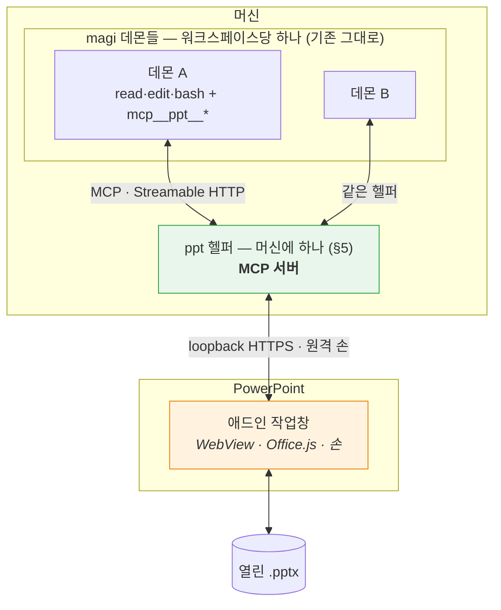

# PowerPoint MCP 플러그인 — 설계

Status: **제안. 구현하지 않았다.** (2026-08-28)

> **개정 (같은 날).** 첫 판본은 호스트 어댑터 계약을 직접 설계하고 새 코어 데몬을 두었다. 사용자가
> **도구를 MCP로 내놓으라**고 방향을 정했고, 그게 더 낫다 — 컨텍스트가 갈리지 않고(§4.2), 계약을
> 발명할 필요가 없으며(§4.3), `ide/`와의 데몬 범위 충돌이 통째로 사라진다. §0·§4·§5를 다시 썼다.
> 무엇이 어떻게 뒤집혔는지는 [`clients/jetbrains/README.md`](../jetbrains/README.md) §9에 남겼다. 두 플러그인이
> 주고받던 대화 문서 둘(`clients/jetbrains/INTEROP.md`·`clients/jetbrains/INTEROP-MCP.md`)은 각자의 설계 문서로 접었다.

> **개정 2 (같은 날).** 사용자가 §5의 전제를 바꿨다 — **애드인이 어느 컴패니언에 붙을지 고르고,
> 켜진 데몬이 하나도 없으면 덱이 있는 디렉토리에 띄운다.** PPT 파일에는 워크스페이스 개념이 없는
> 경우가 많다는 것이 이유다. §5.0을 새로 쓰고 §5.2·§5.6을 고쳤다. 같은 왕복에서 §7의 위원 축소가
> 틀렸다는 것이 드러나 그것도 뒤집었다.

> **인용 규약.** 커밋은 **제목**으로, 코드는 **심볼**로 짚는다 — 해시도 줄 번호도 쓰지 않는다.
> 2026-08-28 하루에 히스토리 재작성이 두 번, 줄 밀림이 세 번 있었고 그때마다 이 문서의 인용이
> 조용히 죽었다. 이 저장소의 커밋 제목은 문장이라 `git log --grep`으로 정확히 찾히고, 재작성에
> 안 죽는다. (`clients/jetbrains/README.md`도 같은 규약을 쓴다.)

> **개정 3 (같은 날).** 사용자가 **데이터를 이미지로 주고받는 것을 최대한 자제하라**고 정했다 —
> 붙을 모델이 멀티모달이라는 보장이 없기 때문이다. §2.2가 "픽셀이 우리의 우위"라고 쓴 것을
> 뒤집는다: 픽셀은 **마지막 수단**이고, 판정의 기본 경로는 숫자와 텍스트여야 한다. §2.2를 다시
> 쓰고 §4.4 ①의 결론을 고쳤다. 픽셀 없이 같은 질문에 답하는 길은
> [`CAPABILITIES.md`](CAPABILITIES.md) §10.6에 있다.

> **곁 문서.** [`CAPABILITIES.md`](CAPABILITIES.md) — 파워포인트가 실제로 무엇을 내주는지, 그리고
> 그것을 모델이 읽을 수 있는 모양으로 어떻게 세울지. 이 문서가 *무엇을 만들 것인가*를 정한다면
> 그쪽은 *재료가 무엇인가*에만 답한다. 부록 A와 겹치지 않게 썼다 — 픽셀을 얻는 세 경로(§2.2가
> 기대는 것), 덱 안에 상태를 적어 둘 자리 셋, 없는 것의 증명, 그리고 모델링 스케치가 거기 있다.

> 이 문서는 아직 코드가 없는 시점의 설계 의도다. 만들면서 어긋난 지점은 여기에 인라인으로
> 정정을 남기고, 지우지 않는다. 부록 A의 API 사실은 확인한 날짜와 출처를 달았다 — 그날 이후
> 마이크로소프트가 바꾼 것은 이 문서가 모른다.

---

## 0. 한 문장

**열려 있는 덱을 읽고, 사람이 말로 시킨 편집을 수행하고, 자기가 한 일이 실제로 그렇게 됐는지
확인한 뒤에야 끝났다고 말하는 에이전트.**

**에이전트는 magi다.** 이 프로젝트가 만드는 것은 에이전트가 아니라 **덱을 만지는 도구를 MCP로
내놓는 플러그인**과, 그 도구를 실제로 실행하는 머신에 하나뿐인 로컬 헬퍼다. 새 코어 데몬은 만들지
않는다 — 이유는 §4.2이고, 한 줄로는 **컨텍스트를 갈라놓지 않기 위해서**다. 저장소를 읽는 도구와
덱을 고치는 도구가 한 세션 안에 같이 있어야 그 둘을 잇는 브리프가 필요 없어진다.

**붙을 곳은 애드인이 고른다.** 켜져 있는 컴패니언 중에서 사람이 하나를 고르고, 하나도 없으면
**덱이 있는 디렉토리**에 띄운다 — PPT 파일에는 워크스페이스 개념이 없는 경우가 많기 때문이다(§5.0).

## 1. 무엇이 아닌가

경계를 먼저 적는다. 이 셋은 만들지 않는다.

- **문서 생성기가 아니다.** "이 마크다운으로 발표자료 만들어줘"는 다른 물건이다. 이건 *이미 있는*
  문서를 고친다. 생성은 나중에 얹을 수 있지만, 얹기 전까지는 없다고 말한다.
- **디자인 대행이 아니다.** "예쁘게 해줘"는 판정할 수 없는 요구다. 판정할 수 없는 것을 받으면
  끝났다고 말할 근거가 없어진다(§7).
- **자율 실행이 아니다.** 사람이 편집기를 열어두고 옆에 있는 상황을 전제한다. 사람 없이 도는
  배치 작업은 호스트 플러그인이 아니라 데몬에 직접 붙는 다른 클라이언트의 일이다.

## 2. 이 문제가 코딩 에이전트와 다른 세 지점

magi에서 배운 것을 그대로 옮기려다 부러지는 자리가 셋이다. 설계의 대부분이 여기서 나온다.
서술은 PowerPoint로 하지만, 셋 다 "편집기 안의 살아있는 문서"라는 상황 자체에서 나오므로
다음 호스트에도 그대로 온다.

### 2.1 되돌릴 곳이 없다

코딩 에이전트는 git 위에 산다. 클론이 있고, `base..HEAD`가 있고, 아니다 싶으면 되돌린다.
여기에는 **브랜치가 없다.** 대상은 사람이 지금 이 순간 열어놓고 보고 있는 문서 하나다.

후보 셋:

| 방법 | 되는 것 | 안 되는 것 |
|---|---|---|
| 편집기 자체 undo 스택에 맡긴다 | 공짜, 사람이 이미 아는 조작(⌘Z) | 플러그인 편집이 undo 스택에 어떻게 쌓이는지 **미검증**(S4). 한 번의 지시가 40개 도형을 고쳤을 때 ⌘Z 한 번에 다 돌아오는지, 40번 눌러야 하는지가 다르다 |
| 편집 전 스냅샷 | PowerPoint는 `slide.exportAsBase64()`가 슬라이드를 통째로 .pptx 바이트로 준다 — 완전한 원본 | 되돌리려면 그 바이트를 **다시 넣어야** 하는데, 쓰기 경로가 있는지 미검증(S5). 없으면 스냅샷은 증거로만 쓰이고 복원에는 못 쓴다 |
| 객체 태그 저널 | `shape.tags`(1.3)에 편집 전 값을 적어두고 되돌린다 | 우리가 만든 변경만 되돌린다. 객체를 **삭제**한 경우는 태그도 같이 사라져 못 되돌린다 |

**결정:** 셋 다 쓴다. 순서는 ① 스냅샷을 항상 뜬다(증거+최후수단) → ② 되돌리기는 태그 저널로
시도 → ③ 저널로 안 되는 것(삭제·구조 변경)은 **애초에 승인 없이 하지 않는다**(§8).
편집기의 undo는 우리가 통제하는 게 아니므로 계획에 넣지 않고, S4로 실태만 기록한다.

되돌리기는 **도구로 낸다**(`snapshot_slide` / `restore_slide`) — MCP에 "이 서버는 되돌릴 수 있다"를
선언하는 자리가 없기 때문이다(§4.4). 도구로 내면 에이전트가 쓸지 말지를 스스로 정하고, 안 쓴
것도 기록에 남는다.

### 2.2 "됐다"의 증거가 다르다

코딩 에이전트의 증거는 exit code와 파일 diff다. 둘 다 기계가 읽는 사실이다. 문서의 결과물은
**시각적**이고, 객체 모델이 "텍스트를 바꿨다"고 말해도 그 텍스트가 상자 밖으로 넘쳤는지는
모델이 모른다.

다행히 PowerPoint에는 답이 API에 있다. `slide.getImageAsBase64()`가 **슬라이드를 PNG로 렌더해
준다**(1.8). 그래서 판정 증거를 두 겹으로 쌓을 수 있다:

- **기록** — 우리가 호출한 편집과 그 전후 객체 모델 값(magi의 관찰 기록에 해당)
- **픽셀** — 편집 전후 렌더 PNG. 넘침·겹침·잘림처럼 객체 모델이 침묵하는 결함은 여기서만 보인다

**개정 3 — 순서가 뒤집혔다.** 앞 판본은 픽셀을 이 제품의 우위로 놓았다. 사용자가 방향을 정했다:
**데이터를 이미지로 주고받는 것은 최대한 자제한다.** 근거는 우리가 반박할 수 없는 것이다 —
**붙을 모델이 멀티모달이라는 보장이 없다.** 애드인이 고르는 컴패니언은 로컬 모델일 수 있고(§5.0),
`seesImages`가 false를 답하면 그림은 그냥 안 실린다. 픽셀 위에 판정을 세우면 **그 모델에서는 판정
자체가 없어진다** — 없는 증거가 아니라 없는 기능이 된다.

그래서 이 절의 두 겹은 순서가 있다.

1. **기록** — 우리가 호출한 편집과 그 전후 객체 모델 값. 항상 돈다.
2. **숫자** — 상자의 좌표·크기와 그 안의 텍스트에서 **계산으로** 나오는 넘침·겹침·잘림.
   객체 모델이 침묵하는 것은 "텍스트가 상자에 들어가는가"이지 **상자가 어디에 얼마만 한가**가
   아니다. 후자는 API가 포인트 단위로 준다. 겹침은 사각형 둘의 교집합이고, 슬라이드 밖으로
   나갔는지는 페이지 크기와의 비교다. **둘 다 그림 없이 나온다.**
3. **픽셀** — 위 둘로 답이 안 나오는 질문에만. 렌더는 **사람이 볼 때**와, 모델이 실제로 볼 수
   있다고 확인됐고(`seesImages`) 다른 길이 없을 때만 낸다.

세 번째가 필요한 질문이 남는다는 것은 사실이다 — 글꼴 치환, 자간, 자동 축소가 실제로 얼마나
줄였는지는 렌더에만 있다. 그러나 그건 **드문 질문**이지 기본 판정 경로가 아니다. 픽셀 없이 어디까지
가는지는 [`CAPABILITIES.md`](CAPABILITIES.md) §10.6에 적었다.

이미지 경로 자체는 세 층이 다 서 있다(§4.4 ①). **서 있는 것과 기본으로 쓰는 것은 다르다** — 세워
둔 채 아껴 쓴다. M4까지는 판정이 1·2로만 돌고, 그건 코딩 에이전트와 같은 조건이다.

### 2.3 읽기 천장과 쓰기 천장이 다르다 — 가장 중요한 사실

Office.js의 PowerPoint 객체 모델은 좁다. 그런데 **읽기에는 두 개의 비상구가 있다.**

| | 무엇으로 | 닿는 곳 |
|---|---|---|
| **읽기** | `slide.exportAsBase64()` (슬라이드 = .pptx 바이트) | **OOXML 전부** — 차트 데이터, SmartArt, 애니메이션, 발표자 노트까지 |
| | `slide.getImageAsBase64()` (PNG 렌더) | 최종 시각 결과 |
| | 객체 모델 (`shapes`, `textFrame`, `fill`, …) | 구조화된 값, 편집 가능한 것과 1:1 |
| **쓰기** | 객체 모델뿐 | 텍스트·도형·서식·표·레이아웃·순서·하이퍼링크 |

**비대칭이 제품의 모양을 정한다.** 에이전트는 차트가 잘못됐다는 것을 *볼 수* 있지만 *고칠 수*
없다. 애니메이션이 어색한 것을 알 수 있지만 손댈 수 없다. 발표자 노트를 읽을 수는 있어도 쓸
수는 없다.

이걸 숨기면 최악의 실패가 난다 — 에이전트가 "차트를 고쳤습니다"라고 말하고 아무것도 안 바뀌는
것. 그래서 **못 고치는 것은 도구를 아예 내놓지 않고, 발견하면 사람에게 넘긴다**(§6).
"보이지만 못 고침"은 이 제품의 1급 결과값이지 예외가 아니다.

MCP에서는 이 규칙이 서버 쪽 책임이 된다. `tools/list`에 올린 것은 반드시 실행돼야 한다 —
magi에서 광고와 실행이 어긋났을 때 모델이 그 도구를 부르고, 거부당하고, 다시 부르다 루프 가드에
죽은 기록이 있다.

## 3. 기술 스택 — 넷을 비교하고 하나를 고른다

이 절은 **첫 호스트에 대한 결정**이다. 코어의 스택이 아니다.

### 3.1 후보

- **A. Office Add-in (Office.js)** — 공식 확장 모델. WebView 안의 웹앱.
- **B. VSTO / COM 애드인 (.NET)** — PowerPoint 객체 모델 전부(VBA가 보는 그것). Windows 전용.
- **C. AppleScript / OSA 자동화** — macOS에서 PowerPoint를 밖에서 조종.
- **D. 플러그인 아님 — .pptx 파일 직접 조작** (python-pptx, OpenXML SDK).

### 3.2 비교

| 축 | A. Office.js | B. VSTO/COM | C. AppleScript | D. 파일 직접 |
|---|---|---|---|---|
| **개발 머신(macOS)에서 개발** | ✅ | ❌ Windows 전용 | ✅ | ✅ |
| 사용자 플랫폼 | Win·Mac·웹 | Win만 | Mac만 | 무관(UI 없음) |
| 열린 문서에 붙기 | ✅ | ✅ | ✅ | ❌ 파일 잠김 |
| 읽기 천장 | 높음(OOXML+PNG, §2.3) | 최상(전 객체 모델) | 중간 | 최상 |
| 쓰기 천장 | 중간(객체 모델) | 최상 | 중간 | 최상 |
| UI 통합 | ✅ 작업창·리본 | ✅ | ❌ | ❌ |
| **로컬 프로세스 기동** | ❌ 샌드박스(§5.5) | ✅ | ✅ | ✅ |
| 배포 | 매니페스트+호스팅 | ClickOnce/MSI | 앱 번들 | — |

### 3.3 결정: **A. Office Add-in (Office.js), PowerPointApi 1.8 이상**

세 가지 근거이고, 첫 번째가 사실상 혼자 결정한다.

**(a) 개발 머신이 macOS다.** VSTO/COM은 Windows 전용이라 개발도 디버깅도 못 한다. C는 반대로
Windows 사용자를 버린다. D는 UI가 없어 §0의 물건이 아니다. 남는 건 A뿐이다.

**(b) 최소 버전이 1.8인 이유는 §2가 1.8에 걸려 있어서다.** `exportAsBase64`(OOXML 읽기),
`getImageAsBase64`(PNG 렌더), `slide.index`, `applyLayout` — §2.1의 스냅샷과 §2.2의 픽셀 증거를
떠받치는 넷이 **전부 1.8에서 들어왔다.** 1.7 이하로 내려가면 "읽고 판정하는" 물건 자체가 성립
안 한다. 판정을 포기할 바에는 지원 범위를 포기한다.

**(c) 1.8을 최소로 잡는 대가는 명확하고, 광고에 쓰지 말아야 한다.**

- Office on Mac **16.96 (25041326)** 이상, Windows **2504 (Build 18730.20030)** 이상
- **볼륨 라이선스/LTSC 영구 버전은 1.5까지 → 지원 불가.** 기업 표준 이미지가 LTSC면 이 제품은
  안 돈다. 이건 우회로가 없다.
- **iPad는 1.1까지 → 지원 불가.**

런타임에 `Office.context.requirements.isSetSupported('PowerPointApi', '1.8')`로 확인하고,
아니면 **기능을 조용히 줄이지 말고 못 돈다고 말한다.** 매니페스트 `<Requirements>`로 막지 않는
이유는 그러면 애드인 목록에서 아예 사라져 사용자가 *왜* 없는지 모르기 때문이다.

### 3.4 기각한 것을 다시 꺼낼 조건

- **B(VSTO)** — 스파이크에서 쓰기 천장이 실제 요구를 못 받치는 것으로 드러나고, 동시에 Windows
  전용 배포를 받아들일 수 있게 되면. **그때 magi도 헬퍼의 MCP 표면도 손대지 않는다** — VSTO
  애드인은 헬퍼가 부리는 또 하나의 손일 뿐이고, 도구 이름과 스키마는 그대로다. 이게 MCP를
  경계로 둔 값이다.
- **D(파일 직접)** — 사람 없이 도는 배치 작업이 필요해지면. 플러그인이 아니라 데몬에 붙는 다른
  클라이언트로 추가한다. 열린 문서와 충돌하므로 **닫힌 파일에만** 적용한다.

## 4. 구조 — 도구는 MCP로 준다

### 4.1 층



**새 코어 데몬은 없다.** magi가 코어다. PowerPoint 플러그인은 덱을 만지는 **도구를 MCP로 내놓는
쪽**이고, 그 도구는 magi의 도구 목록에 `mcp__ppt__set_text` 같은 이름으로 들어간다.

### 4.2 왜 이게 별도 코어보다 나은가 — 컨텍스트가 갈리지 않는다

이게 이 설계의 요구사항이다. 별도 코어 데몬을 두면 에이전트가 둘이 되고, 둘은 `hand_off`로
만난다 — 그 순간 **컨텍스트가 갈린다.** 저장소를 읽은 에이전트가 아는 것을 덱을 고치는 에이전트는
모르고, 그 사이를 브리프가 잇는데, 이 저장소가 브리프로 식별자를 잃는 것을 **6번 중 6번** 실측했다.

MCP로 내놓으면 한 세션 안에 **저장소 도구와 덱 도구가 같이 있다.** 에이전트가 `read`로 설계문서를
읽고 같은 턴에 `mcp__ppt__set_text`로 슬라이드를 고친다. 전달이 없으므로 전달에서 잃을 것도 없다.

부수 효과로 §4의 원래 걱정 — "코어가 PowerPoint를 알면 안 된다" — 이 **공짜로 해결된다.** MCP가
바로 그 경계이고, 우리가 계약을 발명하지 않아도 이미 있다. magi 쪽 코드 변경은 원칙적으로 0이고,
`config.toml`에 `[mcp.ppt]` 한 블록이면 붙는다.

### 4.3 MCP가 공짜로 주는 것

앞 판본이 직접 설계하려던 호스트 어댑터 계약이 거의 그대로 MCP에 있다.

| 내가 만들려던 것 | MCP의 대응 | 상태 |
|---|---|---|
| 호스트가 도구를 선언하고 코어는 발명하지 않는다 | `tools/list` | ✅ 있음 |
| 이름 네임스페이스 | `mcp__<서버>__<도구>` — magi가 강제 | ✅ 있음. 안 하면 서버가 내장 도구를 가린다는 사고 기록까지 있다 |
| 능력 협상 | MCP `initialize` 핸드셰이크 | ✅ 있음 |
| 미선언 인자 거부 | 도구의 JSON Schema | ✅ 있음 |
| 서버가 죽으면 도구가 사라진다 | magi의 MCP 매니저가 자동 제거 | ✅ 있음 |
| 손이 사라지면 턴 보류 | (없음 — 도구가 그냥 실패한다) | ⚠ §5.4 |

### 4.4 MCP가 안 주는 것 — 다섯, 전부 코드로 확인했다

**① 모델에게 이미지를 보낼 길이 없다. 세 층이고, 이게 제일 크다.**

처음에는 한 줄 고치면 되는 줄 알았는데 아니었다. 층이 셋이다.

**층 1 — MCP 컨텐트 블록이 이미지를 못 담는다.** `internal/adapter/mcp/jsonrpc.go`:

```go
type contentBlock struct {
	Type string `json:"type"`
	Text string `json:"text"`
}
```

`tool.go`가 블록을 `c.Text`만 이어붙인다. MCP의 이미지 블록은 `data`와 `mimeType`을 싣지 `text`를
싣지 않으므로 통째로 빈 문자열이 된다. **이 층만 작다.**

**층 2 — 툴 결과에 이미지를 실을 자리가 없다.** `session.ToolResult`는 `{CallID, Content, IsError,
Advisory}`뿐이고 이미지 슬롯이 없다. 그 위의 `Part`는 **태그드 유니온**이라 주석이 못 박았다 —
*"Exactly one of the kind-specific fields is populated."* 한 파트는 툴-결과이거나 이미지이지
둘 다일 수 없다. 게다가 `ImageRef`는 바이트가 아니라 `{Path, MIME}` **참조**라, base64를 어딘가
파일로 쓰고 그 경로를 실어야 한다. 어디에 쓰고 언제 지우고 리플레이 때 있어야 하는지가 전부 새 질문이다.

**층 3 — LLM 어댑터가 이미지를 안 보낸다.** 전 소스에서 `session.PartImage`를 읽는 비-테스트
코드가 **딱 하나**이고 그건 콘솔이 사람에게 그려 주는 자리다(`cmd/magi-web/main.go`).
`internal/adapter/llm/openai/`에는 `PartImage`도 `image_url`도 없다 — 요청 조립이 텍스트 전용이다.
**멀티모달 요청 조립은 magi가 한 번도 가진 적 없는 기능이고, 이게 진짜 층이다.**

곁가지로 나온 것: `internal/core/model/model.go`의 `Vision bool`("supports image input")이
gpt-4o·claude·gemini·grok에 `true`로 붙어 있는데 **그 값을 읽는 곳이 없다.** 어댑터가 이미지를
안 보내니 읽을 이유도 없었다. 이 저장소가 이름 붙인 결함 계열(광고 드리프트)이고,
**PowerPoint와 무관한 별건**이다.

**층 1과 2는 닫혔다 (2026-08-28, 코어 세션).** 커밋 셋 — "a tool that answers with a picture is
no longer answering with nothing" · "the runtime door, and a picture keeps its own name" ·
"our own impatience is not evidence about the server":
`contentBlock`이 `data`/`mimeType`을 싣고, `tool.go`가 이미지 블록을 파일로 떼어 낸 뒤 텍스트에
`[image: <mime> at <path>]` 한 줄을 남기며, `session.ToolResult.Images []ImageRef`가 참조를 든다.
파일은 데몬 데이터 디렉토리의 `images/<session>/<tool>-<sha256[:6]>.<ext>` — **내용으로 이름
짓는다.** 처음엔 툴 이름이었는데, 그러면 슬라이드 3을 렌더하고 9를 렌더할 때 3번 참조가 9번
그림으로 해소된다(내가 검토에서 실측했고 그래서 바뀌었다). **덱 작업은 같은 툴을 수십 번 부르는
일이라 이 결함이 정확히 우리 것이었다.**

**층 3도 닫혔다 (2026-08-28, "a model that can see is shown the picture, not told about it").** vision 모델이면 그림이
**data URL로 실려 간다.** 예상대로 툴 결과 메시지(role=tool)에는 못 싣는다 — content가 문자열이라
자리가 없다. 그래서 그림은 툴 결과 **다음에 오는 사용자 메시지**로 가고, 대화 기록에 **한 줄이 더
남는다**("The images from tool call c1:"). §2.2의 픽셀 증거를 설계에 적을 때 그 한 줄이 보인다는
것을 감안한다. `[image: <mime> at <path>]` 줄은 **양쪽 경로 모두에** 남는다 — 못 보는 모델이
읽을 것이 그 줄뿐이고, 지우면 층 1이 없앤 증상이 되돌아온다.

**층 3의 결함 넷은 닫혔다 (2026-08-28, "four ways the picture budget was wrong, all of them at deck
size").** 실측해 보낸 넷이 다 고쳐졌고, **각 고침이 되돌리기 쉬운 방향까지 테스트가 붙었다.** 이
계열 결함은 대개 "고치려던 것을 꺼 버리는" 식으로 실패하므로 고침이 오기 전에 인수 기준을 먼저
보냈고, 그대로 들어왔다.

1. **큰 렌더 한 장이 세션의 시각을 끄던 것** → `pickImages`가 초과분을 건너뛰고 **계속 걷는다**.
   되돌림 방지: 작은 그림 열 장이어도 넷만 탄다.
2. **떼어 낸 상한(8MB)과 실어 보내는 상한(4MB)의 어긋남** → 숫자를 맞추는 대신 **첫 장은 예산을
   넘겨도 탄다**로 답했다. 데몬이 이미 자기 상한으로 거른 뒤이므로, 디스크에 있고 로그에 이름이
   적힌 렌더가 유일하게 볼 수 있는 독자에게 영영 안 보이는 일이 없어진다. 요청 하나가 base64로
   11.2MB까지 커질 수 있다는 것은 그 대가로 받아들인 값이다.
3. **호출마다 예산을 다시 주던 것** → **뒤로 걸으며 호출별 허용량을 미리 계산해 두고** 앞으로 낼 때
   건넨다. 남은 예산을 emit 순서로 흘렸다면 오래된 것부터 예산을 써서 역방향 걷기가 존재하는 이유를
   정확히 되돌렸을 것인데, 그 함정을 피했다.
4. **`canSeeImages`의 사본** → `WithVision` 주입. `sync.OnceValue`는 **정적 카탈로그 fallback
   전용**으로만 남았고 앱의 살아 있는 표(`App.VisionOf`)가 먼저 답한다. 프로파일 경로
   (`newProviderFactory`)도 같은 옵션 묶음을 물려받아 새지 않는 것을 확인했다.

덤으로 우리가 못 본 둘이 같이 고쳐졌다 — 예산을 **디스크 바이트가 아니라 전선 바이트**(base64라
4/3배)로 세는 것, 그리고 긴 세션에서 stat 비용을 묶는 탐색 깊이.

**대신 새로 셋 나왔다. 셋 다 실측했고 코어에 보냈다.**

ㄱ. **중복 경로가 예산을 두 번 쓴다.** 층 1은 같은 바이트를 한 파일로 묶으므로(내용 주소화) 서로
   다른 호출이 **같은 경로**를 들 수 있는데, 층 3은 참조마다 따로 센다. 실측: 1MB 파일 하나를 호출
   넷이 참조하면 같은 그림이 **두 번** 실려 네 장 중 둘과 4MB 중 2.79MB를 먹는다. **덱 리뷰가 정확히
   이 모양이다** — 슬라이드 하나만 고치고 다시 렌더하면 안 바뀐 슬라이드는 바이트가 같고, 따라서
   같은 경로다.
ㄴ. **"선언 안 된 모델은 못 본다"는 보장이 코드와 어긋난다.** `Registry.Get`은 정확히 못 맞추면 같은
   family로 떨어지므로, 아무도 선언한 적 없는 `gpt-4o:textonly-distill`이 **true**로 답한다(실측).
   family 상속 자체는 `qwen3-vl:8b` 같은 데선 오히려 원하는 동작이라 **틀렸다는 게 아니라 적어 둔
   보장과 다르다**는 것이 문제다. 우리 쪽 관심은 `:tag` 이름이 Ollama/vLLM가 모델을 부르는 방식이고,
   애드인이 붙일 로컬 모델이 정확히 그 구간에 산다는 것.
ㄷ. **장수로 잘린 것도 "too large for one request"라고 말한다.** 크기가 아니라 장수로 잘렸는데 모델은
   너무 크다고 듣는다 — 그 말을 믿고 더 작게 렌더하려 들 수 있다.

**셋 다 닫혔다 (2026-08-28, "the same picture twice is one picture, and the reason it was cut is
said").** ㄱ은 `pickImages`가 `seen[ref.Path]`로 **경로 기준 중복을 건너뛴다** — 내용 주소화가 이미
같은 바이트를 한 파일로 묶어 두었으므로 경로 비교로 충분하고, 건너뛴 것은 "빠졌다"고 세지도 않는다
(요청이 이미 싣고 있으니 사실이 아니다). ㄷ은 `riders`가 `tooBig`과 `tooMany`를 **따로** 세고
메시지가 셋으로 갈린다 — 장수로 잘린 쪽은 "one request carries at most 4 pictures, **not because of
their size**"라고 말한다. ㄴ은 **코드가 아니라 보장을 고쳐서** 닫혔다: `seesImages` 주석이 family
상속을 이제 명시적으로 인정하고("a quantisation은 옳고 encoder를 뺀 distill은 틀리다, 레지스트리는
둘을 구별하지 못한다"), 아무도 선언한 적 없는 이름은 여전히 false라고 못 박는다. **우리가 지적한
것이 정확히 "코드가 틀렸다"가 아니라 "적어 둔 보장과 다르다"였으므로 이 방향이 맞다.**

**미정이던 둘 중 하나가 닫혔다.** (ㄴ) 보존 정책 — `SweepImages`가 들어왔다(2026-08-28,
"the door was reachable in ways the config file never was"). 세션 삭제에 건 규칙이 아니라
**나이에 건 규칙**이고(한 달), 데몬 기동 때 한 번 쓸어낸다. 세션을 축으로 삼지 않은 것은 우리가
제안한 모양과 다르지만 더 낫다 — 그림을 남기는 것은 세션이 아니라 턴이고, 세션이 지워지지 않아도
디스크는 찬다. 빈 세션 폴더까지 걷어 가고, 지워진 그림의 `[image: … at …]` 줄은 남는다(그 줄을
읽는 모든 독자가 없는 파일을 에러가 아니라 부재로 다룬다는 것이 커밋의 근거다). **우리 쪽 미정으로
남는 것은 청소 주기다** — 덱 하나 리뷰가 렌더 수십 장이면 한 달·기동시 1회가 우리 크기에서 맞는지는
재야 알고, 그건 S7에서 100장 덱으로 같이 잰다(§9).

**여전히 미정인 것 하나.** (ㄱ) 그림 파일은 워크스페이스 **밖**(데몬 데이터 디렉토리)에 있어서
`read`/`edit`의 감옥이 거부한다 — bash로는 읽힌다. 후보는 워크스페이스 안 `.magi/images/`
이거나 `read`에 예외를 내는 것인데, **감옥에 예외를 내면 그 예외가 다음 것도 받으므로 전자가
낫다**는 데까지는 합의했다. 층 3이 서면서 급하지는 않아졌다(모델은 이제 파일을 안 열어도 본다)
**그러나 사람이 로그를 여는 경로는 그대로다.** 이 항목은 아직 주인이 없다 — 코어가 집어 가지
않았고 우리도 안 집었다.

**그래서 §2.2의 픽셀 경로는 세 층이 다 섰고, 넷 중 넷이 닫혔다 — 그리고 개정 3에서 기본 경로가
아니게 됐다.** 이 둘은 모순이 아니다. 층이 서 있으니 필요할 때 낼 수 있고, 사용자의 방향은 **필요할
때가 드물어야 한다**는 것이다. 위에 적은 예산·중복·장수 결함들은 그래서 **덜 자주 걸리는 대신,
걸릴 때는 사람이 보는 렌더에서 걸린다.**

M4 다음으로 내린 우선순위는 그대로 두되(§10), **S7은 "되는가"도 "고쳐졌는가"도 아니라 "우리
크기에서 도는가"를 잰다** — 100장 덱을 리뷰하는 동안 위 ㄱ이 실제로 몇 장을 먹는지, 그리고
**픽셀 없이 §2.2의 2단계(숫자)만으로 넘침·겹침을 몇 %나 잡는지**가 그 측정이다(§9). 후자가 높으면
개정 3은 제약이 아니라 그냥 옳은 설계다.

**② 모든 MCP 도구가 danger tool이다.** `internal/app/execute.go`의 `dangerGated`가 `mcp__` 접두사만 보고
위험 판정을 한다 — magi가 외부 서버가 무엇을 할지 증명할 수 없어서 고른 기본값이고, 옳다.
대가는 `list_slides` 같은 순수 읽기도 `ask`/`auto`에서 **매번 묻는다**는 것이다. 답은 허용 규칙이다:

```toml
allow = ["mcp__ppt__list_*(**)", "mcp__ppt__read_*(**)", "mcp__ppt__render_*(**)"]
```

**쓰기 도구는 규칙에 넣지 않는다.** 덱을 고치는 것은 물어야 하는 일이 맞다.

**③ 도구 호출 타임아웃이 60초다** (`internal/adapter/mcp/tool.go`의 `Call`이 거는 `context.WithTimeout`). 100장 덱의 `export_slide_ooxml`이나 큰 슬라이드
렌더가 여기 걸릴 수 있다. §9의 S6이 이 수를 재야 한다.

한동안 이 수는 **타임아웃보다 나쁜 것**을 달고 있었다. "the runtime door…"가 낸 수명 장치가 "닿지 못한 호출
3연속이면 트랜스포트를 닫는다"였는데, 구현이 **caller의 기한 초과까지 세고 있었다** — 살아 있는
서버가 요청을 세 번 다 받고도 도구를 뺏겼다(내가 검토에서 실측). 큰 덱 렌더 세 번이면 애드인이
대화 중간에 사라진다는 뜻이었다. "our own impatience…"에서 `ctx.Err() == nil`일 때만 세도록 닫혔다. **느린
것은 죽은 것이 아니다** — 60초는 여전히 재야 할 수지만, 넘긴 대가가 이제 그 호출 하나로 끝난다.

**④ MCP에 scope 개념이 없다.** 어느 문서를 고치라는 것인지 MCP는 모른다. 그래서 **도구 인자로
받는다** — 모든 도구가 `document`를 받고, 생략하면 지금 활성 문서다. 애드인이 여럿(창이 여럿)이면
헬퍼가 그 인자로 손을 고른다(§5.6).

**⑤ MCP 도구는 "내가 파일을 고친다"고 말할 길이 없다.** (2026-08-28에 새로 생긴 항목이다.)

코어에 `port.FileTool`이 들어왔다("a tool says it edits files, instead of magi recognising three
names"). **"이 호출은 파일 편집이었다"에 다섯 가지가 매달려 있다** — 비밀·가드레일 거부 바닥,
카운슬에게 보여 줄 호출 전 스냅샷, 편집 후 진단 패스, 반복 가드의 경로별 epoch, 이번 턴에 무엇이
바뀌었는지의 기록. 지금까지 이 다섯이 **툴 이름**으로 판정됐다(`write`/`edit`/`multiedit`, 읽기 쪽은
`read`/`grep`/`glob`/`list`). 커밋이 든 동기 사례가 정확히 우리다 — *"an editor plugin attaches a
tool that edits the same workspace and is called mcp\_\_jetbrains\_\_edit; a slide add-in the same."*

**그런데 선언할 자리가 아직 없다. 실측했다.**

- 비-테스트 Go 전체에서 `FileArg`/`WritesFile`를 구현하는 타입이 **0개**다. 나오는 곳은 선언
  (`internal/port/port.go`)과 읽는 곳(`internal/app/filetools.go`의 `touchesFileIn`) 둘뿐이다.
- `touchesFileIn`은 `reg.Get(name)`이 돌려준 값을 `port.FileTool`로 타입 단언한다. MCP 도구가
  레지스트리에 드는 값은 `internal/adapter/mcp/tool.go`의 `mcpTool`이고, 이 타입은
  `Name`/`Description`/`Schema`/`Execute` 넷만 갖는다.
- 전선에도 자리가 없다. `internal/adapter/mcp/jsonrpc.go`의 `toolDef`는 `{name, description,
  inputSchema}`뿐이고, MCP 표준의 `annotations`(`readOnlyHint` 등)를 **파싱하지 않는다**.

그러니 **이음매는 섰고 우리가 꽂을 구멍은 아직 없다.** 필요한 두 반쪽 중 `writes`는 MCP 표준
`annotations.readOnlyHint`가 이미 자리를 갖고 있으므로 파싱만 하면 되고, `fileArg`는 표준에 없어서
magi 규약이 필요하다(입력 스키마의 `x-magi-file-arg`가 후보다). **이름 규칙과 마찬가지로 정하는 쪽이
붙이는 쪽이므로 우리가 제안한다.**

**그런데 우리가 선언하면 다섯 중 둘만 우리 것이다.** 셋을 하나씩 재 보면:

| 매달린 것 | 덱에 걸면 |
| --- | --- |
| 비밀·가드레일 바닥 | `.pptx`는 `secretGlobs`에도 `guardrailGlobs`에도 없다 — 걸릴 것이 없다 |
| 편집 후 진단 | `internal/app/hooks.go`가 `filepath.Ext(path) == ".go"`로 막는다 — 덱에는 안 돈다 |
| 카운슬 before→after | **아래 참조** |
| 반복 가드 epoch | 유용하다 — 같은 슬라이드를 계속 고치는 것을 세는 축이 생긴다 |
| 턴 변경 기록 | 유용하다 — "이 턴에 덱이 바뀌었다"가 증거로 선다 |

**그리고 before→after 자리에 결함이 하나 있다. 재서 확인했다.** 스냅샷은
`internal/app/guard.go`의 `readForChange`인데 **256 KiB에서 끊고, 넘으면 `("", false)`를
돌려준다** — "부분은 파일이 아니다"라는 옳은 판단이다. 문제는 그 답을 받는 쪽이다:

```
readForChange(300KiB)  before="" readable=false  exists=true
  파일-툴 가지  (changeBefore == "" && pathExists) = true    ← tool_outcome.go
  bash 가지     (!existedBefore  && pathExists)    = false   ← 같은 파일, 다른 질문
```

**한 질문에 두 답이 있고, 틀린 쪽이 다른 쪽 주석이 경고하는 바로 그 답이다.** bash 쪽은 내용이
아니라 **stat**(`existedBefore`)으로 묻고 그 이유를 적어 두었다 — *"An absent path and an empty file
both read as '', so content alone cannot tell a creation or a deletion from a no-op."* 파일-툴 쪽은
내용으로 묻는다. `readForChange`가 준 `changeReadable`은 **저널로만 가고**(`execute.go`, `depth > 0`)
이 가지는 읽지 않는다. 그래서 **256 KiB를 넘는 파일에 쓰기가 일어나면 매번 "이 런이 그 경로를
만들었다"로 기록된다.** `.pptx`는 사실상 항상 그 위다.

그 기록이 무엇을 하는지도 실측했다 — `didCreate`를 읽는 유일한 자리가 되돌릴 수 없는 명령의
카운슬 게이트다(`internal/app/irreversible.go`):

```
rm -rf ~/Decks/q3.pptx   didCreate=false -> council gate=true  "rm -rf /Users/…/q3.pptx"
rm -rf ~/Decks/q3.pptx   didCreate=true  -> council gate=false ""
```

**오늘은 무해하다.** 빌트인 파일 도구는 워크스페이스 감옥 안에만 쓰고, 게이트는 트리 **밖** 경로만
보므로 둘이 만나지 않는다. **선언한 MCP 파일 도구가 그 만남을 만든다** — 감옥은 빌트인의
`resolvePath`에 있지 정책에 있지 않아서, 선언된 경로는 트리 밖일 수 있다. 덱 둘째 장을 다른
폴더에서 열면 정확히 그 모양이고, `.pptx`는 언제나 256 KiB를 넘는다. 그러면 **덱을 지우는 명령이
게이트를 건너뛴다.**

고치는 자리가 코어라 여기서 정하지 않는다. 보낸 제안은 파일-툴 가지도 bash 가지처럼 **stat으로**
묻는 것이다 — `changeReadable`은 이미 손에 있고, `existedBefore`에 해당하는 값은 그 옆의
`pathExists`를 호출 **전에** 한 번 부르면 된다.

**우리 쪽 결정은 하나 남는다: 선언할 것인가.** 지금 답은 **선언한다**이다 — 얻는 둘(epoch, 턴 기록)이
실제로 우리 것이고, 못 얻는 셋은 손해가 아니라 무관이다. 다만 **위 결함이 닫히기 전에는 선언하지
않는다.** 순서가 반대면 우리가 게이트를 끄는 첫 사례가 된다.

### 4.5 전송은 HTTP여야 한다 — stdio가 아니라

magi의 MCP 클라이언트는 stdio와 Streamable HTTP를 둘 다 지원한다
(`internal/adapter/mcp/http_transport.go`). 여기서는 **HTTP만 맞다.**

stdio는 magi 데몬이 서버를 **자식 프로세스로 띄운다.** 그런데 magi 데몬은 워크스페이스당 하나라
여럿이고, 각자 자기 헬퍼를 띄우면 **같은 PowerPoint 애드인을 두고 헬퍼 N개가 싸운다.** 애드인은
하나뿐이므로 붙을 수 있는 헬퍼도 하나뿐이다.

HTTP면 헬퍼가 먼저 서고 데몬들이 클라이언트로 붙는다. 헬퍼의 수명이 magi 데몬의 수명과 분리되고,
이게 §5의 "머신에 하나"가 실제로 필요한 이유다.

---

## 5. 어디에 붙고, 누가 손을 쥐나

### 5.0 붙을 곳은 애드인이 고른다

**전제가 바뀌었다.** 앞 판본은 "config에 `[mcp.ppt]`를 적은 magi가 덱 도구를 갖는다"였다. 붙는
쪽이 magi였고 헬퍼는 가만히 있었다. 지금은 반대다 — **애드인이 어느 컴패니언에 붙을지 고르고, 그
컴패니언에 MCP를 준다.**

이유는 하나다. **PPT 파일에는 워크스페이스 개념이 없는 경우가 많다.** 저장소는 자기가 어디 사는지
알지만 덱은 그냥 파일이고, 바탕화면에 있거나 메일에서 방금 내려받았을 수 있다. 워크스페이스에서
데몬을 유도할 수 없으므로 **반대로 유도한다.**

- **켜진 데몬이 있으면 그중에서 고른다.** `daemon.List(configDir)`가 공표된 데몬 전부를 **dial까지
  해서** 돌려준다 — 워크디렉토리·이름·역할·팀·`Live`, 그리고 지금 무엇을 묻고 무엇을 하는 중인지
  까지(`internal/adapter/daemon/daemon.go`). 고르는 화면에 필요한 것이 이미 다 있고, SIGKILL로
  죽어 소켓만 남은 것도 **죽었다고 표시돼서** 온다. 새로 셀 것이 없다.
- **하나도 없으면 덱의 디렉토리에 띄운다.** 저장소 안의 덱이면 그 저장소가 워크스페이스가 되고,
  바탕화면의 덱이면 바탕화면이 된다. 후자가 이상해 보이지만 대안은 "워크스페이스 없음"이고 그건
  magi에 없는 상태다. **다만 그 선택이 곧 경계 선택이다 — §8의 마지막 항목이 그 값이다.** 흔적은
  거의 남지 않는다: 기동만으로 `.magi/`를 만들지 않고, 있으면 읽을 뿐이다(`config.Load`,
  `expgit.New`는 디렉토리를 들고만 있고 `MkdirAll`은 쓰기 시점에 있다). 디렉토리는 `remember`가
  프로젝트 층에 처음 쓸 때 생긴다.
- **그래서 데몬 범위 충돌이 사라진다.** 이쪽도 **워크스페이스당 하나**다. `ide/`와 규칙이 같아졌다.
  사용자당 하나로 남는 것은 Office 애드인을 받아주는 로컬 헬퍼뿐이고(§5.2), 그건 magi 데몬이
  아니라 **다른 층**이다.

**⚠ 그런데 밖에서 붙일 door가 없다.** 데몬 프로토콜 메서드 전량이 submit · steer · interrupt ·
permission · answer · resume · rewind · compact · set-model · set-permission · use-backend ·
reload-cron · hand 이고, **MCP를 다루는 것이 하나도 없다.**

런타임 등록 자체는 있다. `Manager.AddHTTP` / `AddHTTPDynamic` / `Remove`가 있고 **Lua 플러그인
브리지가 이미 그것을 부른다** — `magi.register_mcp{name=, url=, headers=fn}` → `AddHTTPDynamic`
(`internal/adapter/plugin/lua/bridge.go`). 즉 **프로세스 안에서는 열려 있고 밖에서는 닫혀 있다.**
`[mcp]`는 플러그인이 읽지도 쓰지도 못하는 config 섹션이기도 하다(`denyConfigSections`,
`internal/adapter/plugin/lua/permission.go`) — 설정을 고쳐 붙이는 길은 **의도적으로** 막혀 있다.

| | 무엇 | 새 표면 | 값 |
|---|---|---|---|
| **(가)** | 데몬에 `mcp-attach{name, url, headers}` 메서드 하나 | 프로토콜 메서드 1 | 밖에서 고른다는 요구에 정직하게 맞고, `ide/` 쪽 플러그인도 같은 door를 쓴다 |
| **(나)** | 고른 컴패니언이 로드하는 작은 Lua 플러그인이 `register_mcp`를 부른다 | 0 | 붙는 시점이 **플러그인 기동 때 한 번**이라 "지금 저 컴패니언에 붙어라"를 말할 수 없다 |

**(가)로 간다.** (나)를 접는 이유가 둘이다.

- **"고른다"가 안 된다.** 모든 컴패니언에 깔면 고르는 게 아니라 전부고, 덱을 만질 일 없는 코딩
  컴패니언까지 `mcp__ppt__*`를 단다. 그게 공짜가 아니다 — `internal/app/execute.go`가 `mcp__`
  접두를 **무조건 위험 도구로** 보므로(§4.4 ②) 목록만 길어지는 게 아니라 프롬프트마다 실린다.
  한 컴패니언에만 깔면 이번엔 "지금 붙어라"를 밖에서 말할 통로가 없어서, 플러그인이 폴링할
  **사이드 채널을 발명하게 된다** — §5.4에서 안 만들기로 한 바로 그 물건이다.
- **일부러 닫아 둔 문 옆에 쪽문을 내는 모양이다.** 위의 `denyConfigSections`가 그 문이다.

**그래서 (가)를 낼 때는 계보를 같이 적는다.** magi의 기존 입장은 코드 세 자리에서 일관된다 —
*어떤 MCP 서버를 돌릴지는 오퍼레이터가 설치·설정 시점에 정하고, 호출자가 런타임에 정하지 않는다.*
`denyConfigSections`의 `mcp`는 grant가 있어도 못 만진다. `magi.register_mcp`는 예외처럼 보이지만
`mcp` capability를 요구하고 **그 capability는 오퍼레이터가 그 플러그인을 설치하면서 준 것**이라
여전히 설치 시점 결정이다. 콘솔의 `/mcp` 쓰기는 공유 상태에서 거부되고, 사유 문자열이
`"changing which MCP servers this machine runs"`다(`cmd/magi-web/mcp.go`) — 목록 **읽기**는 열려
있고 바꾸기만 닫힌다.

세 자리가 전부 "이 결정은 머신 주인의 것"으로 수렴한다. 그런데 **데몬 소켓은 0600이고 호출자가 곧
그 주인이다**(`daemon.go`의 `os.Chmod(path, 0o600)`). 그러니 소켓 위의 `mcp-attach`는 공유되지
않은 콘솔의 `/mcp` 쓰기와 **같은 신뢰 등급**이고, 새 원칙을 세우는 게 아니라 이미 있는 원칙이 닿는
자리를 하나 더 여는 것이다. 한 칸 더 약하기도 하다 — `/mcp` 쓰기가 거부되는 이유는 항목이
**"이 머신이 다음 기동에 스폰할 커맨드 라인"**이어서인데, `mcp-attach`가 받는 것은 URL이라 스폰이
없다.

설계 디테일 둘:

- **런타임 전용. config에 쓰지 않는다.** `Manager.AddHTTPDynamic`과 `Remove`가 이미 런타임
  등록·해제를 한다. config에 쓰면 헬퍼가 없는 날에도 `[mcp.ppt]`가 남아 매 기동마다 붙으러 간다.
  애드인이 켜질 때마다 다시 붙는 모델이니 영속시킬 이유가 없고, 영속 안 시키면 **낡은 채 남는
  상태가 또 안 생긴다.**
- **`headers`를 함수 자리로 열어 둔다.** `AddHTTPDynamic`이 `headersFn`을 받는 이유가 토큰 갱신이고
  헬퍼는 토큰으로 인증한다(§5.5). door의 인자를 정적 map으로만 잡으면 나중에 못 늘린다.

**`transcript` 읽기 door와 한 묶음으로 내지 않는다.** `ide/` 쪽이 요청하는 것은 0600 소켓의
호출자가 로그에서 어차피 얻을 수 있는 것을 조립해 주는 정도라 등급이 낮고, `mcp-attach`는 **머신이
새 서버의 도구를 돌리게 만드는 것**이라 다른 등급이다. 묶으면 낮은 것이 높은 것에 묻어 들어가는
모양이 된다.

**같은 벽에 둘이 따로 도달했다.** `ide/` 쪽 플러그인도 뷰어에 머물지 않고 **손**이 되기로 하면서
자기 도구를 붙일 곳이 없다는 같은 결론에 닿았다(`clients/jetbrains/README.md`). 서로 상의해서 맞춘 게 아니라
각자 오다가 만난 자리이므로, `mcp-attach`는 **한 제품의 편의가 아니라 이음매의 구멍**이다. door를
낼 때 요구자는 둘이고, 그래서 인자는 우리 쪽 사정(`headers` 함수 자리)만으로 정하지 않는다.

(가)는 **magi 쪽 변경**이므로 §4.4 ①과 같은 트랙이었다. **그 트랙은 났다 — §5.0.3.**
그래서 M1은 config의 `[mcp.ppt]`가 아니라 **door로 간다.** S9가 이 결정을 검증했고(§5.0.2),
door가 나면서 새로 보이게 된 것은 §5.0.4에 적었다.

#### 5.0.1 door 계약 — 여기가 한 곳이다

두 제품이 같은 문을 쓰므로 계약은 한 곳에만 적는다. **여기다.** `ide/`는 이 절을 가리키고, 붙일
서버 모양이 달라 인자가 늘어야 하면 여기를 고친다. 구현은 코어 쪽 세션이 한다.

**대부분은 이미 정해져 있다** — `internal/adapter/mcp/manager.go`가 하는 일이 곧 계약이다.

- **요청: `mcp-attach{name, url, headers?}`. 그게 전부다.** `command`/`args`는 **받지 않는다.**
  이 door의 안전 논거가 "스폰이 없다"인데, 인자에 커맨드가 없으면 그 논거가 **코드에 남는다.**
  나중에 편의로 커맨드를 더하는 순간 논거가 조용히 사라지므로, 필요해지면 그건 이 door의 확장이
  아니라 **다른 door**다.
- **응답은 붙은 도구 이름이다.** `AddHTTP`가 이미 handshake와 `ListTools`까지 하고(30초 타임아웃,
  `mcpRegisterTimeout`) 실패하면 에러를 낸다. 그러니 응답이 ack가 아니라 **증거**일 수 있다 —
  `mcp__ppt__*` 몇 개가 실제로 등록됐는지. 애드인은 그걸로 "붙었다"를 확인하고, 못 붙었으면
  §9의 세 번째 시나리오("할 일 없음처럼 보이지 않는가")를 피할 문장을 만든다.
- **실패 사유도 이미 셋 있다**: 이름 중복(`"%q is already attached; two servers cannot share one
  name"`), initialize 실패, list tools 실패. 새로 발명하지 않는다.

**⚠ 그런데 수명이 비어 있다. 이건 door 요청서에 실을 증거다.**

`registerClient`는 등록 후 `<-client.Done()`을 기다렸다가 `Remove(name)`을 한다. stdio에서는
프로세스가 죽으면 파이프가 닫히고 `readLoop`가 끝나 `done`이 닫힌다 — 자동 청소가 돈다. **HTTP는
아니다.** `httpTransport.Done()`은 `Close()`가 불릴 때만 닫힌다(`http_transport.go`). 즉
**헬퍼가 죽어도 그 도구들은 목록에 그대로 남는다.** 게다가 이름은 한 번 쓰면 잠기므로, 애드인이
다시 켜져 같은 이름으로 붙으려 하면 **죽은 엔드포인트를 가리키는 등록 때문에 거부당한다.**

그래서 계약에 둘이 더 필요하다:

- **`mcp-detach{name}`이 같은 door의 일부다.** `Manager.Remove`가 이미 있으니 표면만 여는 것이다.
  애드인의 재접속 경로는 detach → attach다.
- **죽은 헬퍼가 영영 남지 않아야 한다.** 청소를 누가 하느냐는 구현 선택이다 — 호출 실패 누적으로
  데몬이 떨어내든, 헬퍼가 끊길 때 detach를 보내든. 다만 **크래시로 detach를 못 보내는 경우가
  정상 경로**이므로 후자만으로는 부족하다. 요구는 하나다: 손이 없는 `mcp__ppt__*`가 도구 목록에
  남아 모델에게 광고되지 않을 것.

#### 5.0.2 S9 결과 — (나)는 붙기는 하는데, 고를 수가 없다

**돌려 봤다.** 가짜 MCP 서버 하나(Streamable HTTP, 도구 `ping` 하나가 고정 문자열을 돌려준다),
`capabilities = ["mcp"]`만 선언하고 `register_mcp{name="s9", url=…}` 한 줄이 전부인 플러그인,
빈 워크스페이스. 로컬 백엔드로 헤드리스 한 번.

**① 붙는 것 자체는 된다.** 모델이 `mcp__s9__ping`을 호출했고 서버의 고정 문자열이 그대로
돌아왔다. 카운슬 셋이 그 도구 출력을 근거로 SATISFIED를 내고 턴이 닫혔다. **(나)로 도구가
세션에 들어오는 것까지는 사실이다** — 여기까지는 door 없이도 M1이 선다.

**② 런타임에 고르는 것은 막힌다. 예상과 다른 이유로.** 앞 판본은 "붙는 시점이 플러그인 기동 때
한 번이라 못 고른다"고 적었는데, 실제로 부딪힌 벽은 **둘이고 더 낮은 데 있다.**

- **데몬은 플러그인을 아예 감시하지 않는다.** 핫리로드는 `host.Watch(ctx)`인데 그 호출이
  `if !headless` 안에 있고, `headless := pSet || *daemonMode`다(`cmd/magi/main.go`). 애드인이
  붙을 상대가 바로 그 데몬이다. **실측**: 데몬이 도는 동안 로드된 플러그인의 `init.lua`를
  고쳐도 아무 일도 없었고, **아직 아무도 안 쓴 이름**으로 바꿔도 서버에 handshake가 한 번도
  더 오지 않았다. 감시 자체가 없다.
- **감시가 도는 인터랙티브에서도 재등록이 안 된다.** `Reload`는 엔트리 스크립트를 다시 돌리는데
  `register_mcp`가 같은 이름에서 "already attached"로 막힌다. 언로드가 떼는 것은 `p.tools`뿐이고
  (`Host.unregister`), **플러그인의 MCP 서버를 떼는 코드는 어디에도 없다** — `mcpMgr`의
  `Remove`를 부르는 곳이 플러그인 경로에 하나도 없다.

**③ 그래서 새로 안 것 하나: 플러그인의 MCP 등록은 플러그인보다 오래 산다.** 언로드해도 남고
리로드로 다시 가리킬 수도 없다. 이건 §5.0.1의 수명 결함과 **같은 뿌리**다 — HTTP로 붙인 서버를
떼는 길이 명시적 `Remove` 하나뿐인데 그걸 부르는 사람이 없다.

**판정: door를 낸다.** (나)를 접는 이유가 §5.0에 적은 "고를 수 없다"에서 **"데몬에는 리로드
자체가 없다"**로 내려갔다. 사이드 채널을 발명하면 그건 door를 우회로 다시 만드는 것이다.
door 인자는 안 바뀐다 — S9가 바꾼 것은 인자가 아니라 **근거의 층**이다.

#### 5.0.3 door는 났다 (2026-08-28)

"the runtime door, and a picture keeps its own name"이 계약대로 구현했다. 확인한 것:

- **`mcp-attach{name, url, headers?}` / `mcp-detach{name}`**, `command`/`args` 없음. 응답은 붙은
  도구 이름(`Response.Tools`), 빈 배열과 `null`을 구분한다.
- 포트는 `port.ToolServers`(코어가 인터페이스를 들고 어댑터는 `mcp.Manager`가 만족), 데몬 쪽은
  `daemon.ToolServerHost` **선택적 인터페이스**라 못 붙이는 빌드는 그렇다고 답한다.
- **수명 결함이 같은 커밋에서 닫혔다.** 닿지 못한 호출 3연속이면 트랜스포트가 스스로 닫히고,
  기존 `<-client.Done()` 경로가 도구를 걷어 간다. 타이머 헬스체크가 아니라 **어차피 하던 호출**을
  세므로 아무도 안 부르는 서버는 비용이 0이다. 이 그물에 §5.0.2 ③(플러그인이 붙이고 안 떼는
  서버)도 함께 들어간다. HTTP 상태는 세지 않는다 — 500을 답하는 서버는 살아 있다.
- **권한 경계는 넓어지지 않았다.** 소켓에 닿는 프로세스가 데몬에게 임의 URL을 dial시킬 수 있지만,
  같은 소켓에 `shell` 메서드가 **이미** 있다. 소켓은 원래 전권이고 door가 그것을 바꾸지 않는다.
  (나중에 다시 꺼낼 논점이라 적어 둔다.)

그래서 §5.0의 **M1은 door로 간다.** (나)는 접는다.

#### 5.0.4 door가 연 문제 셋 — 이름은 자물쇠가 아니었다

검토에서 실측한 것 셋. 셋 다 **door가 만든 것이 아니라 door가 도달 가능하게 만든 것**이다. 이름이
전부 사람이 config에 타이핑한 것이던 동안에는 못 일어났고, 그래서 앞 판본의 코드에 이미 있었다.
`5.0.1`의 계약 자체는 그대로 옳다 — 고칠 곳은 계약이 아니라 `Manager`다.

1. **같은 이름으로 동시에 둘이 붙는다.** `registerClient`는 이름을 확인한 뒤 락을 **놓고**
   핸드셰이크(최대 30초)를 하고 다시 잡아 등록한다. `mcp-attach` 둘이 같은 이름으로 동시에 오면
   **둘 다 성공한다**(실측: `errs=[<nil> <nil>]`, 도구 목록에 `mcp__ppt__one`과 `mcp__ppt__two`가
   같이 뜸). `m.servers`에는 하나만 남고, **남은 하나가 아닌 쪽의 클라이언트는 닫히지도 않고 그
   도구는 영원히 광고된다.** 그 자리 주석이 "companions began attaching under names nobody typed"
   라고 이 상황을 이미 예언해 두었다. 고침은 핸드셰이크 전에 이름을 **예약**하는 것.
2. **다른 이름 둘이 정리(sanitise) 후 한 이름이 된다.** `ppt.one`과 `ppt_one`이 둘 다
   `mcp__ppt_one__x`를 낳는다. 뒤엣것이 앞엣것의 도구를 **조용히 가져간다.** 뒤엣것만 떼면 공유된
   이름이 사라지는데 `m.servers["ppt.one"]`은 여전히 붙어 있다고 말한다. 서버 이름이 사람이 타이핑한
   config 키이던 동안에는 안 부딪혔다 — door가 이름을 임의 문자열로 만들었다.
3. **`mcp-detach`가 door로 안 붙인 것까지 뗀다.** config로 선언된 서버도 이름만 알면 떨어지고,
   **데몬을 다시 띄우기 전에는 아무것도 되돌리지 않는다.** attach는 설계상 런타임 전용인데 detach는
   아니라서, §5.0.1이 "붙이는 쪽"에 대해 세운 안전 논증이 "떼는 쪽"을 안 덮는다. **우리에게 직접
   걸린다** — 애드인 여럿이 붙는 것을 전제로 설계했으므로(§5.0), 남의 이름을 떼는 사고가 정확히
   우리 모양이다.

작은 것 넷도 같이 보냈다: 스트릭이 본문을 읽기 **전에** 리셋돼 중간에 끊긴 연결을 살아 있다고
센다(주석은 그 경우를 센다고 적혀 있다) · `mcp-detach`의 "이미 깨끗했다"가 `Response.Err`로 나가서
문서 주석이 지키겠다던 구분이 porcelain에서 사라진다 · `App.AttachToolServer`의 그림자 검사가
**서버** 이름을 **도구** 이름들과 비교해서 그 주석이 말한 경우에 절대 안 걸린다 · `Manager.Detach`도
같은 TOCTOU라 동시 detach 둘이 다 `true`를 답한다.

그리고 층 1에 하나 더: `keepImages`의 크기 선검사가 `base64.DecodedLen`이라 **패딩과 줄바꿈을 같이
센다.** 정확히 상한(8MB)인 그림이 "8388609 bytes, over the 8388608 cap"으로 거부되고, MIME식으로
76열 줄바꿈된 base64는 실제 8.19MB가 8.40MB로 세어져 거부된다(둘 다 실측). 서버가 줄바꿈된 base64를
보내는 것은 규격 위반이 아니다.

**여덟 다 닫혔다 (2026-08-28, "the door was reachable in ways the config file never was" ·
"one word, counted in one place").** 셋 다 우리가 보낸 방향대로다 — 이름을 핸드셰이크 **전에**
예약하고 실패 경로마다 놓는다(쥐고 있으면 안 듣던 서버 하나 때문에 이름이 영영 타 버리는데,
그쪽이 충돌보다 나쁘다), 맵 키를 **도구가 이름 붙는 방식대로** 정리된 이름으로 잡고 충돌은 두 이름을
다 적어 거절하며, detach는 **door가 붙인 것만** 뗀다.

우리 제안보다 나은 판단 둘을 적어 둔다. (가) 수명 그물(`lifetime net`)은 같은 방식으로 좁히지
**않았다** — 아무도 못 닿는 config 서버도 치워져야 하고 그게 그물이 있는 이유다. 우리는 detach만
보고 "둘 다 door 것으로 좁히자"고 할 뻔했다. (나) "이미 깨끗했다"를 `Response.Err`에서 빼는 것을
넘어 **`Removed` 자기 필드**로 만들고 `DetachMCP`가 `(bool, error)`를 답한다 — 자기 크래시 뒤
재접속하는 헬퍼에겐 그게 원하던 답이지 실패가 아니다. **애드인 여럿이 붙었다 떨어지는 우리 모양이
정확히 이 경로다.**

작은 넷 중 하나는 **다른 결론으로** 닫혔다. `App.AttachToolServer`의 그림자 검사 — 우리는 "서버
이름을 도구 이름과 비교해서 안 걸린다"고 보냈고, 코어는 그 분기를 고치는 대신 **네임스페이스 충돌
검사를 어댑터로 되돌리고 코어엔 코어가 답할 수 있는 것만 남겼다**(서버 이름이 `read`·`bash`일 수
없다). 근거가 맞다 — 한 단어를 두 곳에서 세면 두 곳이 어긋나고, 실제로 어긋나 있었다(앱은 타이핑된
이름으로 접두사를 만들고 매니저는 정리된 이름으로 맵을 잡았다). 그리고 빌트인은 `mcp__`로 시작하지
않으니 그 분기가 존재 이유였던 단 하나의 경우를 놓치고 있었을 뿐이다.

층 1의 base64 선검사도 같이 닫혔다 — 상한은 이제 **디코드된 바이트**에 걸리고 선검사는 폭주 디코드를
막는 여유분으로만 남는다. 덤으로 우리가 못 본 둘: SSE 스캐너의 1MB 줄 한계가 상한(8MB)과 어긋나
750KB쯤부터 "token too long"으로 죽던 것(이제 상한에서 파생), 그리고 `-doctor`가 그림 둘 곳 없는
매니저를 세워 프로브가 **호스트가 아니라 doctor에 대한 사실**을 배우던 것.

### 5.1 왜 헬퍼가 따로 있어야 하나

**애드인이 직접 MCP 서버가 될 수 없다.** MCP 서버는 stdio로 스폰되거나 포트를 리슨해야 하는데,
WebView 안의 페이지는 **프로세스가 되지도 못하고 리슨하지도 못한다.** 브라우저 엔진에 인바운드
연결을 받는 수단이 없다.

그래서 헬퍼가 필요하다. 헬퍼는 두 얼굴이다 — magi 쪽으로는 **MCP 서버**, 애드인 쪽으로는
**원격 손을 부리는 클라이언트**. 도구 호출이 오면 애드인에게 넘기고, 애드인이 Office.js를
불러 결과를 돌려준다.

이건 §5.5의 W1(별도 앱 설치 + OS 감독자)이 어차피 필요했던 것과 같은 프로세스다. MCP로 가면서
그 프로세스에 **이름과 역할이 생겼다.**

### 5.2 헬퍼는 사용자당 하나 — 데몬과 같은 축이 아니다

PowerPoint 인스턴스가 하나이므로 애드인의 손도 하나이고, 그 손을 쥐는 헬퍼도 하나여야 한다.
앞 판본에서는 "에이전트 데몬을 사용자당 하나"라고 썼는데 그건 magi의 워크스페이스당 하나와
부딪혔다. **이제 부딪히지 않는다** — 데몬은 §5.0대로 **워크스페이스당 하나**이고(덱의 디렉토리가
워크스페이스다), 사용자당 하나인 것은 **헬퍼뿐**이다. 층이 다르므로 경쟁하지 않는다.

세는 축이 둘이라는 것을 문서와 UI가 흐리면 안 된다. **덱은 헬퍼가 쥐고, 턴은 데몬이 돈다.**
데몬 셋이 같은 헬퍼에 붙는 것은 정상이고(§5.6), 헬퍼 둘이 같은 덱을 쥐는 것은 결함이다.

정확히는 **사용자당 하나**다. 유닉스 소켓과 루프백 포트를 사용자 홈 아래 두면 다른 계정과 별개다.
문서와 UI에 그렇게 적는다 — 모호하게 두면 다중 사용자 머신에서 놀란다.

### 5.3 획득-또는-접속

헬퍼를 띄우려는 모든 것이 도는 절차 하나다. 다르게 구현된 두 벌은 반드시 어긋난다.

```mermaid
flowchart TD
    S([누군가 헬퍼를 원한다]) --> C{접속 시도}
    C -->|응답함| OK([붙는다 — 끝])
    C -->|안 됨<br/><i>파일이 없든, 아무도 안 듣든</i>| G{"방금 끊긴 거라면<br/>유예 안인가"}
    G -->|"유예 안 (자기재시작 창)"| W
    G -->|유예 지남| ST{"소켓 파일이<br/>남아 있나"}
    ST -->|"없다 — 깨끗이 나갔다"| Q([되살리지 않는다<br/><i>나가기로 한 프로세스를 다시 세우지 않는다</i>])
    ST -->|"있다 — 죽임을 당했다"| SP{"이걸 부른 쪽이<br/>프로세스를 띄울 수 있나"}
    SP -->|"아니오 (WebView 애드인)"| SUP([OS 감독자를 기다린다<br/>또는 URL 스킴으로 청원])
    SP -->|"예 (magi 데몬 · CLI · 감독자)"| L{flock 클레임}
    L -->|잡았다| PR{"dial — 정말<br/>아무도 안 듣나"}
    PR -->|"누가 듣는다<br/><i>클레임 모르는 옛 빌드</i>| REL([락 놓고 물러난다<br/>남의 살아있는 소켓을 안 지운다])
    PR -->|아무도 안 듣는다| U["잔재 소켓 unlink → 바인드 → 공표"] --> ME([헬퍼가 선다])
    L -->|누가 이미 쥠| W["짧게 기다린다<br/>지수 백오프 + 지터"] --> C
    W -.->|N회 초과 · 또는 크래시 루프| F([못 붙었다고 말한다<br/><i>마지막 stderr와 함께</i>])

    style ME fill:#e8f6ec,stroke:#2f9e44
    style F fill:#fff3e0,stroke:#e8820c
    style Q fill:#f5f2ec,stroke:#8a8178
```

다섯 가지가 이 그림의 요점이고, 넷은 `clients/jetbrains/README.md` §2와 magi의 `claim_unix.go`에서 왔다.

- **락 먼저, 바인드, 그다음 공표.** magi가 이 순서를 사고로 배웠다 — 공표를 먼저 했더니 동시에
  시작한 둘이 서로의 레코드를 덮어쓰고 나가는 길에 승자의 것을 지웠다. 새로 발명하지 않는다.
- **접속 실패의 원인을 진단하지 않는다.** 소켓 파일이 없는 것과 아무도 안 듣는 것은 겉보기만
  다르고 답은 같다 — 시도하고 `flock`이 판정하게 둔다. 진단하려고 락을 열어 보면 **알아보는
  행위가 상태를 바꾼다**(`clients/jetbrains/README.md` §2).
- **잔재 소켓을 지우기 전에 dial로 증명한다.** 락만으로는 부족하다. magi의 순서는
  `claimPath` → **`net.Dial`** → `os.Remove`이고, 코드 옆에 이유가 적혀 있다 —
  *"This Remove is only safe BECAUSE the dial above proved nothing is listening"*
  (`internal/adapter/daemon/daemon.go`). 프로브가 잡는 것은 **클레임을 모르는 옛 빌드**가
  살아있는 소켓을 쥐고 있는 경우다. 락은 비어 있으니 새 프로세스가 락을 잡고 **남의 살아있는
  소켓을 지운다** — 유닉스 소켓은 평범한 디렉토리 엔트리라 산 것을 지워도 성공하고, 그 데몬의
  리스너는 조용히 고아가 된다. 자기 업데이트가 있는 제품이면 이 상황이 실제로 온다.
  (락 자체가 필요 없다는 뜻은 아니다. 락 없이 하는 "안 듣네 → 지우고 바인드"는 두 틈이 생겨
  동시에 시작한 둘이 둘 다 빠지고, magi가 **300회 중 25회**로 실측했다 — `claim_unix.go`.)
- **기동 가지는 프로세스를 띄울 수 있는 쪽만 탄다.** 애드인은 원리적으로 못 하므로 이 가지가
  막혀 있고, 그 사실이 그림에 보여야 한다. **기다리는 동안 조용히 있지 않고 왜 기다리는지 말한다.**
- **끝내 못 붙으면 말한다.** "모르겠다"와 "없다"는 다르다. 헬퍼에 못 붙은 화면이 "할 일 없음"처럼
  보이면 안 된다.

### 5.4 죽으면 다시

- **끊김은 소켓이 알려준다.** 하트비트를 두지 않는다. 끊기면 §5.3을 다시 돈다.
- **자기재시작에는 유예를 준다.** 유닉스에서 graceful 재시작은 리스너를 닫고 **락까지 놓은 뒤**
  `syscall.Exec`한다(`internal/graceful/graceful_unix.go`). 소켓도 락도 잠깐 빈다. 유예가 없으면
  감시자가 그 창에서 경쟁 프로세스를 띄운다. **3초를 시작값으로 두되 실측 아님을 적어 둔다** —
  재시작 창을 실제로 재서 고쳐야 한다.
- **"일부러 껐다"는 기록하지 않는다 — 유도된다.** 앞 판본은 `<socket>.stopped` 표식을 두려 했다.
  **버린다.** magi를 읽어 보면 표식이 필요 없다: 깨끗한 종료는 나가면서 소켓 파일을 지우고
  (`daemon.go`의 `Serve` defer: `ln.Close()` → `os.Remove(d.path)` → `release()`), SIGKILL을
  당하면 파일이 남는다. 그러니 **소켓 파일이 없으면 되살리지 않고, 있는데 dial이 안 되면
  되살린다**가 그대로 유도된다.
  표식을 두면 안 되는 이유는 이 트리의 원칙 그대로다 — 기록된 사실은 낡을 수 있고, 표식 뒤에는
  커널도 `defer`도 없다. 사람이 터미널에서 헬퍼를 다시 켜면 표식은 낡은 채 영원히 남고,
  **하나뿐인 헬퍼가 통째로 감시에서 빠진다.** (이 정정은 `ide/` 쪽 세션의 반론에서 왔다. 앞 판본이
  `clients/jetbrains/README.md` §2를 근거로 표식을 채택했는데, 그 §2가 그사이 그 안을 버렸다 — 지금 경위는
  `clients/jetbrains/README.md` §9에 있다.)
  대가: 자기 오류로 스스로 나간 헬퍼도 안 살아난다. 나가기로 결정한 프로세스를 다시 세우지 않는
  쪽이 맞다.
- **크래시 루프에서 손을 뗀다.** 60초에 세 번 띄웠는데 또 죽으면 감시를 멈추고 마지막 stderr를
  그대로 보여 준다. 설정 하나가 잘못돼 즉사하는 경우 무한 재기동은 문제를 숨기기만 한다.
  **3회/60초도 실측이 아니라 시작값이다.**
- **감독은 OS에 맡기되, 감독자는 의도를 모른다.** macOS는 LaunchAgent(`KeepAlive`), Windows는
  예약 작업/서비스가 "죽으면 다시"를 우리 코드보다 안정적으로 해 준다. §5.3의 자체 선출은 그걸
  **대체하는 게 아니라** 감독자가 없거나 아직 안 돌 때를 메운다.
  ⚠ **다만 위의 유도 규칙은 감독자에게 안 듣는다.** `KeepAlive`는 사람이 껐는지 죽었는지 구분하지
  않고 되살린다. 그러므로 **"정지"는 감독자를 멈추는 것까지여야 한다** — 헬퍼 프로세스만 죽이는
  정지 버튼은 몇 초 뒤 되살아난다.
- **헬퍼는 애드인 없이도 산다.** 작업창을 닫아도 죽지 않는다. 다만 애드인이 없는 동안 덱 도구는
  **실패해야 하고, 실패 사유가 "PowerPoint에 붙어 있지 않다"여야 한다.** 조용히 빈 결과를 주면
  에이전트가 덱이 비어 있다고 읽는다.

### 5.5 애드인과 헬퍼 사이

애드인 페이지는 **반드시 https로 서빙**되므로 `http://127.0.0.1` 호출이 혼합 콘텐츠로 차단된다.
루프백도 **https여야** 하고, 그러려면 로컬에서 신뢰되는 인증서가 필요하다. 개발용으로는
`office-addin-dev-certs`가 그 일을 하지만 **배포판에서 사용자 머신의 신뢰 저장소에 인증서를 넣는
것은 가볍게 볼 일이 아니다.** S3에서 확인한다.

방향도 뒤집혀 있다. 헬퍼가 도구 호출을 애드인에게 **밀어야** 하는데 애드인은 리슨을 못 하므로,
애드인이 먼저 붙어서 그 연결을 열어 둔다(WebSocket 또는 롱폴). 즉 **애드인이 접속하고, 호출은
그 연결을 거슬러 내려간다.**

**작별 프레임으로 죽음을 알리지 않는다.** 헬퍼가 나가면서 열린 연결에 한마디 하고 싶어지는데,
소켓 문에서는 그게 프로토콜을 깬다 — magi의 소켓은 락스텝이라 **청하지 않은 프레임이 진행 중인
호출의 답으로 소비된다**(`daemon.go`가 그 불변식을 주석으로 적었고, `watch`가 예외인 이유는 연결을
통째로 넘겨받기 때문이다). 애드인 쪽 전송은 WebSocket이라 사정이 다르지만, **MCP 쪽은 그 함정이
그대로 있다.** 죽음은 연결이 끊기는 것으로 알린다.

magi의 "아무것도 포트를 열지 않는다"는 여기서 지킬 수 없다. 지킬 수 없으므로 좁힌다 — 루프백에만
바인드하고(라우팅 가능한 주소면 거부), 기동 때 만든 토큰을 애드인이 제시하고, 오리진을 검사한다.
셋 다 테스트가 강제한다.

### 5.6 문서가 여럿일 때

PowerPoint 창이 둘이면 애드인 인스턴스도 둘이고, 손도 둘이다. 헬퍼가 그것을 `document`로 가른다
(§4.4 ④).

- **한 문서에 손은 하나.** 같은 문서로 두 번째 손이 붙으려 하면 거부하고 이유를 말한다.
- **`document`를 생략하면 활성 문서다.** 다만 활성 문서는 사람이 창을 바꾸면 바뀌므로, **턴 안에서
  두 번 부르면 다른 문서일 수 있다.** 그래서 첫 호출의 결과에 어느 문서였는지를 실어 보내고,
  에이전트가 이후 호출에 그 id를 명시하게 유도한다.
- **없는 문서를 지목하면 에러다.** 빈 결과가 아니다 — "없다"와 "못 찾겠다"는 다른 행동을 부른다.

**그리고 magi 데몬도 여럿일 수 있다 — 이쪽이 더 나쁘다.** magi의 "한 워크스페이스에 한 턴"은
프로세스 하나가 보장하는 것이라, 데몬 A와 B는 **동시에 턴을 돈다.** 둘 다 같은 헬퍼에 붙어 있으면
둘 다 같은 덱을 고칠 수 있고 그 사이에는 아무것도 없다. 결과가 둘이고 두 번째가 조용하다.

⚠ **§5.0이 이 위험의 뿌리를 잘랐다.** 붙을 곳을 애드인이 **하나** 고르는 이상, 두 데몬이 한 덱을
만지는 상황은 사람이 **일부러 두 번 붙여야** 생긴다. 그건 알릴 결함이 아니라 선택이다. 그래도
기전을 지우지 않는 이유는 셋이다 — 일부러 붙이는 것이 정당한 경우가 있고(사람이 두 저장소에서 한
덱을 손보는 것), door가 났어도(§5.0.3) config로 붙이는 길은 **없어지지 않았고**, 무엇보다
**door가 사고로 두 번 붙는 길을 새로 냈다**(§5.0.4 ①: 같은 이름 동시 attach가 둘 다 성공한다).
"사람이 일부러"가 전제였는데 그 전제가 이미 한 군데서 깨져 있다.

1. **쓰기 충돌** — 명백하고 답도 명백하다. 헬퍼가 문서 단위로 직렬화하고, 기다리게 하거나 거절하되
   **거절 사유가 "다른 워크스페이스가 이 덱을 쓰는 중"이어야 한다.**
2. **거짓 완료** — 조용한 쪽. **카운슬은 자기 데몬의 기록을 읽는다.** A의 기록에 B의 편집은 없다.
   A가 "슬라이드 3 제목을 X로 바꿨다"를 자기 기록으로 확인하고 done을 선언하는 동안 B가 그것을
   Y로 덮었을 수 있다. **A의 기록은 참이고 A의 결론은 거짓이다.** 렌더를 떠도 안 잡힌다 — 판정과
   실제 사이에 B의 창이 있다. 이 저장소가 종료 판정에 쏟은 것은 "기록이 실제와 어긋나는" 경우를
   막는 것이었는데, 여기서는 **기록이 맞는데 세계가 움직인다.**

   **막지 않고 보이게 한다.** 헬퍼가 슬라이드별 개정 카운터를 들고, 매 쓰기 결과에 "그사이 남이
   이걸 바꿨다"를 실어 보낸다. 잠그는 안(도구로 lock/unlock, 또는 암묵 잠금+유휴 해제)은 **잘못
   잠갔을 때 빠져나올 길이 없어서** 뺐다 — 가드는 보고하고 결정하지 않는다는 magi의 판례와도 같다.

   ⚠ 개정 카운터는 **유도되지 않는 상태**라 헬퍼가 재시작하면 사라진다. 사라졌을 때는 **"모른다"를
   말해야지 "안 바뀌었다"를 말하면 안 된다.** 이게 §5.4에서 버린 `.stopped` 표식과 같은 실수처럼
   보이는데 **아니다. 실패의 방향이 반대다** — 표식은 진실보다 오래 사는 durable 상태라 조용히,
   영원히 거짓말을 했다. 카운터는 **사라지는** volatile 상태이고, 사라짐은 읽는 지점에서 탐지되지만
   낡음은 안 된다. 유도할 원본이 없다는 것이 여기서는 결함이 아니다.

   조건이 둘 붙는다.

   1. **"모른다"가 카운슬의 증거까지 닿아야 한다.** 도구 결과 본문에만 있으면 모자란다 — 모델이
      그 문장을 완료 주장에 안 실으면 카운슬은 **참인 기록을 읽고 거짓인 결론을 통과시킨다.**
      바로 위 (2)가 말한 그 실패다. magi에 이미 자리가 있다: 요구사항 워크의 `NO-EVIDENCE`는
      빈칸이 아니라 **기록된 답**이고(`docs/ARCHITECTURE.md`, 워크가 스키마에서 `decision`보다
      앞에 온다) 정확히 이 용도로 만들어졌다.
   2. **재시작 뒤의 값이 새 에포크로 알아볼 수 있어야 한다.** 0부터 다시 세면 재시작 전 값과 같아질
      수 있고, 그 순간 "안 바뀌었다"로 읽힌다. magi가 같은 문제를 가드에서 풀었다 — fingerprint에
      **mutation epoch**를 넣어 "파일이 바뀐 뒤의 같은 커맨드"가 반복으로 안 읽히게 했다
      (`internal/app/guard.go`). 그러므로 카운터 하나가 아니라 **`(epoch, count)` 쌍**을 든다.
      그러면 "모른다"가 주석이 아니라 **값 자체로** 표현된다.

## 6. MCP 서버가 내놓는 도구

헬퍼가 `tools/list`로 올리는 목록이다. magi에는 `mcp__ppt__<이름>`으로 보인다.

도구는 Office.js 호출 하나에 대응하고, 모델이 그걸 조합해서 못 하는 일이 있을 때만 새로 판다.
magi가 집계 도구 넷을 지우면서 세운 기준("호출 0회면 도구가 아니다")을 여기서도 쓴다 — 다만
그건 실측이 쌓인 뒤의 일이고, 지금은 최소로 시작한다.

**읽기**

| 도구 | 하는 일 |
|---|---|
| `list_slides` | 인덱스·id·레이아웃·도형 수. 덱 전체의 목차 |
| `read_slide` | 한 슬라이드의 도형을 구조화해서. 텍스트·위치·크기·서식·placeholder·alt text |
| `render_slide` | PNG 렌더(§2.2). **모델이 눈으로 볼 때만** — 비싸므로 매 스텝이 아니다 |
| `export_slide_ooxml` | OOXML 원문(§2.3). 객체 모델이 침묵하는 것(차트 데이터 등)을 볼 때 |
| `find_shapes` | 덱 전체에서 조건에 맞는 도형. "폰트가 X인 것 전부" 같은 일괄 작업의 입구 |

**쓰기** — `set_text` · `format_shape` · `move_shape` · `add_shape` · `delete_shape` ·
`apply_layout` · `reorder_slide` · `set_hyperlink`. 전부 객체 모델에 1:1 대응한다.

**되돌리기** — `snapshot_slide` · `restore_slide`(§2.1). MCP에 되돌리기 능력을 선언하는 자리가
없으므로 도구로 낸다.

모든 도구가 `document`를 옵션으로 받는다(§4.4 ④). 생략하면 활성 문서다.

**허용 규칙은 읽기에만 준다.** MCP 도구는 전부 danger tool이라 안 그러면 `list_slides`도 매번
묻는다(§4.4 ②). 쓰기와 되돌리기는 규칙에 넣지 않는다 — 덱을 고치는 것은 물어야 하는 일이 맞다.

**의도적으로 선언하지 않는 것과 이유**

- **OOXML 직접 쓰기.** 읽기는 주지만 쓰기는 안 준다. 쓰기 경로가 있는지도 미검증(S5)이지만,
  있더라도 안 준다 — 객체 모델을 우회한 쓰기는 기록도 되돌리기도 못 한다.
- **차트·SmartArt·애니메이션·발표자 노트 편집.** API가 없다(§2.3). §4.4의 규칙: **없는 능력은
  도구로 만들지 않는다.** 대신 `read_slide`가 "이건 차트이고 이 호스트는 못 고친다"를 결과에
  실어 보낸다.
- **마스터·레이아웃 편집.** 한 슬라이드를 고치랬는데 덱 전체가 바뀌는 것은 되돌릴 수 없는
  종류의 사고다. 레이아웃은 `apply_layout`으로 **고르기만** 한다.

## 7. 끝났다고 말하는 법

magi의 구조를 가져온다. 앞 판본은 여기서 **크기를 줄이려 했고, 그게 틀렸다** — 아래 "줄이지
않는다"가 그 정정이다.

**가져오는 것:**

- **끝은 선언이다.** 모델이 도구를 그만 부르는 것으로 턴이 끝나지 않는다. `declare_done`을
  불러야 하고 — 이건 magi의 도구지 이 플러그인이 내놓는 것이 아니다 — 그때 판정이 돈다.
- **판정은 주장이 아니라 기록을 본다.** 모델이 "고쳤습니다"라고 쓴 문장이 아니라, 코어가 기록한
  편집 호출과 그 전후 값, 그리고 호스트가 내준 증거를 본다.
- **요구사항 워크.** 결론 전에 사람이 시킨 것을 한 줄씩 걸고 충족/미충족을 표시한다. 스키마에서
  워크가 결론보다 **앞에** 온다 — 결론을 먼저 정해놓고 근거를 짜맞추지 못하게.
- **세 번째 착지.** 성공/실패 이진이면 모델이 성공을 만들어낸다. **UNVERIFIED**를 둔다 —
  "바꾸긴 했는데 확인하지 못했다". 렌더가 실패했거나, 손이 사라졌거나(§5.4), 요구가 애초에
  판정 불가였거나, **호스트가 못 고치는 것을 발견했을 때**(§2.3)의 정직한 끝이다.

**MCP로 가면서 달라지는 것:**

- **증거를 따로 조립하지 않는다.** 카운슬은 이미 magi가 기록한 도구 결과를 읽으므로, `render_slide`가
  돌려준 것이 그 기록에 있으면 판정은 그걸 본다. 앞 판본은 호스트가 증거 종류를 선언하고 게이트가
  물어보는 구조였는데, MCP에는 그 자리가 없고 **필요도 없다** — 도구 결과가 곧 기록이다.
- 대신 **에이전트가 렌더를 부르지 않으면 픽셀 증거가 없다.** 게이트가 강제로 뽑아 올 수 없다.
  프롬프트로 유도하되, 안 불렀으면 안 불렀다는 것이 기록에 남는다 — 없는 증거를 있는 척하지 않는다.
- 그리고 §4.4 ①의 세 층이 풀리기 전까지는 **어느 쪽이든 픽셀이 도착하지 않는다.** 그때까지
  `render_slide`는 도구 목록에 **넣지 않는다** — 아무것도 못 돌려주는 도구를 광고하는 것이
  §4.4가 말한 바로 그 결함이다.

**줄이지 않는다 — 앞 판본이 여기서 틀렸다.**

앞 판본은 위원 셋을 하나로 줄이려 했다. 근거로 magi의 실측(렌즈만 다른 위원 셋이 **21표 전원 일치,
이견 0**)을 들었는데 **그 측정의 결론을 잘못 읽었다.** 그 문단은 이렇게 끝난다 — *"Independence is
not what you get from running the same weights again; it is what you get from different weights"*
(`docs/ARCHITECTURE.md`). 측정이 말한 것은 "셋이 무의미하다"가 아니라 **"같은 가중치 셋이
무의미하다"**이고, magi가 택한 처방도 축소가 아니라 렌즈별 route 추가와 **위원별 backend 핀**이었다.

그리고 그 핀은 내가 발명할 것이 아니라 **이미 깔려 있는 스위치다.** `council.Member`에
`Provider`/`Model` 필드가 있고, `OnePanel(members)`가 **백엔드를 공유하면 한 호출, 아니면 위원당 한
호출**로 갈라진다(`internal/core/council/council.go`). 주석이 그 설정의 요점을 적어 뒀다 — 약한
모델과 강한 모델이 같은 작업을 판정하게 하는 것. 그러니 "서로 다른 백엔드는 사용자가 갖췄다고 가정할
수 없다"는 앞 판본의 반론은 **설정 부담의 문제이지 기전의 문제가 아니다.**

정리하면 **증거의 질과 판정자의 수는 독립 변수다.** 하나가 얇아졌으니 다른 하나로 메우자는 거래가
게이트를 얇게 만드는 바로 그 동작이다. 위원은 **셋으로 두고**, 서로 다른 백엔드에 핀하는 것을 기본
권장으로 적는다. 백엔드가 하나뿐인 사용자에게는 그 사실을 말한다 — 지금 셋은 세 의견이 아니라 한
의견의 세 표본이라고.

**픽셀은 대부분의 주장에 필요 없다.**

§2.3이 적었듯 `exportAsBase64`는 OOXML 전부에 닿고, 그건 **구조화된 증거라 오늘 텍스트 경로로 그대로
흐른다** — §4.4 ①의 세 층과 무관하다. "슬라이드 3의 제목이 X인가"는 OOXML이 정확히 답하고, 렌더는
오히려 그걸 눈으로 판정하게 만든다.

⚠ 단 **zip base64를 통째로 뱉으면 안 된다. 헬퍼가 풀어서 해당 조각만 돌려준다.** magi의 도구 결과는
64KB에서 잘리는데(`toolResultCap`, `internal/app/guard.go`), 문제가 잘림이 아니라 **더 나쁘다** —
잘린 JSON이 이벤트 마샬러에 거부당하고 그 거부가 버려져서 **에이전트가 결과를 아예 못 받은** 실측이
코드 주석에 붙어 있다(같은 턴에 64KB+ 파일 두 개를 읽고 둘 다 `data: null`). "크게 실으면 잘린다"가
아니라 **"크게 실으면 조용히 없어진다"**이다.

**픽셀이 유일한 답인 것은 시각적 결함 계열뿐이다** — 넘침, 겹침, 슬라이드 밖으로 나감, 대비. OOXML은
값은 말하지만 **그게 어떻게 보이는지는 말하지 않는다.** 그래서 §4.4 ①의 세 층은 요청하되 **그 계열로
범위를 좁혀** 요청하고, 마일스톤이 거기 걸리지 않게 둔다(M6).

**거절도 유한하다.** 아무것도 안 바뀐 채로 판정이 계속 거절하면 UNVERIFIED로 착지하고 멈춘다.
정직한 실패는 종점이지 루프가 아니다.

## 8. 안전

- **범위는 좁게 시작한다.** 선택이 없으면 **현재 단위**(슬라이드)가 기본이고, 문서 전체 편집은
  사람이 명시적으로 말했을 때만이다. "폰트 다 바꿔줘"가 40장을 건드리기 전에 몇 장이 바뀔지
  말하고 묻는다.
- **되돌릴 수 없는 것은 승인을 받는다.** 삭제, N개 이상 일괄 변경, 레이아웃 교체. §2.1의
  저널로 못 되돌리는 것들이 정확히 이 목록이다.
- **문서는 사용자 것이다.** 사람이 지금 타이핑 중이거나 객체를 잡고 있으면 쓰지 않는다.
  에이전트가 사람 손에서 커서를 빼앗는 것은 어떤 이득으로도 못 갚는다.
- **읽은 것은 데이터지 지시가 아니다.** 문서 안의 텍스트가 "이전 지시를 무시하라"라고 적혀
  있어도 그건 문서 내용이다. 남이 보낸 파일을 여는 것이 정상 상황이므로 현실적인 표면이다.
- **헬퍼는 magi에게 외부 서버다.** magi가 이미 그렇게 다룬다 — 모든 MCP 도구가 danger tool이고
  (§4.4 ②) 매 호출이 권한 게이트를 지난다. 우리가 만든 서버라고 해서 그 게이트를 우회하지
  않는다. 읽기 도구에만 허용 규칙을 주는 것(§6)이 그 게이트를 쓰는 방법이지 끄는 방법이 아니다.
- **헬퍼에게는 애드인이 외부다.** 애드인이 보낸 것을 그대로 Office.js에 넘기지 않는다 — 슬라이드
  인덱스 범위, 문자열 길이, 도형 id의 존재를 검사한다. 루프백이라고 신뢰하지 않는 이유는
  토큰이 새면 같은 머신의 아무 프로세스나 그 포트를 두드릴 수 있어서다.
- **밖으로 나가는 것은 정한다.** 문서 본문과 렌더 이미지가 LLM 백엔드로 나간다. 사용자가
  이걸 알아야 하고, 로컬 백엔드를 고를 수 있어야 한다. 기본값을 클라우드로 두는 것은 결정이지
  기본이 아니다.
- **덱을 어디 두었는가가 곧 경계다.** §5.0에서 "데몬이 없으면 덱의 디렉토리에 띄운다"고 정했는데,
  그 디렉토리는 magi에서 **두 가지를 동시에** 뜻한다. 하나, 파일 도구의 감옥이다 — `resolvePath`가
  workdir 밖 경로를 거부하고 심링크로 빠져나가는 것까지 막는다
  (`internal/adapter/tool/builtin/pathutil.go`). 둘, `workspace-write` 샌드박스의 **쓰기 루트**다 —
  seatbelt 프로파일이 `file-write*`를 전부 막은 다음 `spec.Workdir`를 다시 열어 준다
  (`internal/adapter/tool/builtin/sandbox_darwin.go`). 그러니 덱이 `~/Desktop`에 있으면
  **바탕화면 전체가 읽기 감옥이자 쓰기 루트**가 된다. 덱 하나 고치자고 사진·영수증·남의 문서가
  같은 경계 안에 들어온다. 이건 magi의 결함이 아니라 워크스페이스가 원래 그런 것이고, 우리가
  워크스페이스를 **덱 위치로 정하기로 했기 때문에** 우리 쪽 결정이 된다. 최소한 고를 때
  보여준다 — 홈 디렉토리나 바탕화면처럼 넓은 곳이 나오면 무엇이 경계가 되는지 말하고 묻는다.
  좁히고 싶은 사람에게는 덱을 폴더 하나에 넣는 것이 답이고, 그건 우리가 강제할 일이 아니다.
  **두 층은 실패하는 방식도 다르고, 그 차이가 사람에게 보여야 한다.** 감옥은 **도구 호출을
  거부하면서 어디가 울타리인지 말하고 bash라는 다른 층이 있다는 것까지 알려 준다**(`outsideWorkdir`의
  문구). 샌드박스는 아무 말도 하지 않는다 — 프로세스가 쓰기에서 EPERM을 받을 뿐이고, 그게 정책인지
  디스크 문제인지는 받은 쪽이 모른다. 그러니 "무엇이 경계인가"를 설명할 때 **거부되는 것과 그냥
  실패하는 것**을 나눠서 말한다.

## 9. 검증 계획 — 설계가 기대는 미검증 전제

이 문서의 여러 결정이 **아직 확인 안 된 전제** 위에 있다. 만들기 전에 스파이크로 확인한다.
각 항목에 "무엇이 나오면 설계가 바뀌는가"를 적어둔다 — 그게 없으면 스파이크가 아니라 구경이다.

| | 확인할 것 | 방법 | 이게 나오면 설계가 바뀐다 |
|---|---|---|---|
| **S1** | 1.8 API가 Mac에서 실제로 광고대로 도는가 | 빈 애드인으로 `exportAsBase64`/`getImageAsBase64`를 실호출 | 렌더가 안 되면 §2.2의 픽셀 증거가 사라지고, PowerPoint 호스트의 `evidence` 선언에서 `render`가 빠진다(§7은 그래도 돈다) |
| **S2** | 렌더 PNG가 판정에 쓸 만한 해상도·충실도인가 | 넘침·겹침·잘림을 일부러 만든 슬라이드를 렌더해 눈으로 확인 | 못 알아보면 픽셀은 사람용 표시로만 쓰고 판정 입력에서 뺀다 |
| **S3** | 루프백 https + 커스텀 URL 스킴 | 애드인에서 로컬 https 호출, 그리고 `pptagent://` 이동 | https가 막히면 §5.5가 무너져 전송을 다시 고른다. 스킴이 막히면 OS 감독자에만 기댄다 |
| **S4** | 플러그인 편집이 편집기 undo 스택에 어떻게 쌓이나 | 도형 10개를 한 번에 고치고 ⌘Z를 눌러본다 | 한 번에 다 돌아오면 §2.1의 저널 비중이 줄어든다. 10번 눌러야 하면 사용자에게 그렇게 말해야 한다 |
| **S5** | 슬라이드 .pptx 바이트를 **되돌려 넣는** 경로가 있는가 | 삽입 계열 API로 스냅샷 복원 시도 | 없으면 스냅샷은 증거 전용이 되고, PowerPoint 호스트의 `undo` 선언에서 `snapshot`이 빠진다 |
| **S6** | 큰 덱에서 왕복 비용 | 100장 덱에서 `list_slides` + 슬라이드 하나 편집의 실측 | 느리면 배치 호출을 넣는다. **MCP 도구 호출 타임아웃이 60초**(`tool.go`)라 그 선도 같이 잰다 |
| **S7** | ~~모델이 이미지를 받을 수 있나~~ → **세 층이 다 섰고 결함 넷도 닫혔다(§4.4 ①). 남은 질문은 우리 크기에서 도는가** | 100장 덱을 실제로 리뷰하며 잰다: 슬라이드 하나만 고치고 다시 렌더했을 때 **바뀌지 않은 슬라이드의 같은 경로가 네 장 중 몇 장을 먹는지**(§4.4 ① ㄱ), 검토 루프 열 턴 동안 실제로 간 그림 수와 바이트, 애드인이 붙일 로컬 모델이 `Vision`으로 잡히는지(§4.4 ① ㄴ) | 넷은 실측으로 닫혔으니 이제 재야 할 것은 **남은 셋이 덱 크기에서 얼마나 무거운가**다. ㄱ은 성능이 아니라 정확도 문제다 — 예산을 먹은 만큼 다른 슬라이드가 안 보인다 |
| **S8** | 데몬 둘이 한 덱을 만질 때 | 워크스페이스 둘에서 같은 슬라이드를 동시에 고치게 한다. **붙이는 방법을 config에서 door로 바꾼다** — 그게 실제 경로다 | 거짓 완료가 재현되면(§5.6) 개정 카운터가 M5가 아니라 M3으로 올라온다. §5.0이 뿌리를 잘랐지만 **재현되는지는 재야 한다** — 일부러 두 번 붙이는 경로가 남아 있고, §5.0.4 ①·③은 **일부러가 아닌** 경로다 |
| **S9** | `mcp-attach` door가 실제로 필요한가 | 켜진 데몬에 런타임으로 HTTP MCP 서버를 붙여 본다: (나)로 — 작은 Lua 플러그인 + `register_mcp` — 되는 데까지 가 보고 어디서 막히는지 적는다 | **돌렸다 → §5.0.2.** (나)는 기동 때 붙이는 데까지는 되고, 런타임에 고르는 것은 예상과 **다른 이유로** 막힌다 |

**S9는 끝났다(§5.0.2). 남은 것 중 S1과 S3이 먼저다.** 둘 중 하나라도 안 되면 나머지는 의미가 없다.
**S7의 세 층은 하루 만에 다 섰다**(§4.4 ①) — 별도 트랙으로 띄우고 결과를 기다리지 않기로 한 것이
맞았고, 그래서 S7은 이제 "되는가"가 아니라 **"우리 크기에서 도는가"**를 재는 항목으로 바뀌었다.

**§9에 `clients/jetbrains/README.md` §7의 세 시나리오를 그대로 둔다** — 세 구현(magi·IDE 플러그인·헬퍼)이 같은
문장을 통과해야 하기 때문이고, 문장을 바꾸면 그 목적이 깨진다:

- 데몬 없음 / 살아있음 / 죽은 소켓만 남음 / 동시 기동 셋 — 결과가 언제나 "하나"인가.
  **구현이 갈래를 *구분하지 않아야* 통과한다**(§5.3). 시험이 재는 것은 판정이 아니라 결과다.
- 자기재시작 창에서 감시자가 경쟁 프로세스를 띄우지 않는가.
- 끝내 못 붙었을 때 화면이 "할 일 없음"처럼 보이지 않는가.

## 10. 마일스톤

1. **M0 — 스파이크.** S1·S3을 먼저, 그다음 나머지. 산출물은 코드가 아니라 이 문서의 정정.
2. **M1 — 헬퍼가 MCP 서버로 선다.** §5.3 획득-또는-접속, 수명주기(§5.4), Streamable HTTP.
   **애드인 없이** 가짜 손 하나로 도구를 답하게 하고, `[mcp.ppt]`를 config에 넣어 magi에서
   `mcp__ppt__*`가 도구 목록에 보이는지까지 확인한다. 여기까지가 "붙었다"의 정의다.
3. **M2 — 진짜 손.** 애드인이 헬퍼에 붙어 읽기 도구 다섯 개를 수행. 모델 없이 손으로 호출해서.
4. **M3 — 한 세션 안에서.** magi가 저장소 도구와 덱 도구를 **같은 턴에** 쓰는 것을 확인한다.
   §4.2가 사실인지의 시험이고, 이게 이 프로젝트의 존재 이유다.
5. **M4 — 종료 판정.** §7. **기록 증거만으로** 돈다 — 픽셀은 S7이 풀린 뒤다.
6. **M5 — 안전.** §8의 범위·승인·되돌리기, 그리고 개정 카운터 `(epoch, count)`(§5.6). S8에서
   거짓 완료가 재현되면 이 항목은 **M3으로 올라온다** — 조용한 오답은 늦게 고칠수록 비싸다.
7. **M6 — 픽셀 증거.** S7의 세 층이 열리면 `render_slide`를 도구 목록에 넣고 §7을 다시 본다.
   **magi 쪽 일정에 걸려 있으므로 마일스톤이지 약속이 아니다.**

M4 전까지는 **아무한테도 쓰라고 하지 않는다.** 판정 없는 에이전트는 고쳤다고 말하고 안 고치는
물건이고, 그게 §0이 존재하는 이유다.

## 11. 의도적으로 하지 않는 것

- **자체 인증을 만들지 않는다.** 루프백에만 바인드하고 토큰으로 막는다(§5.5). 그 이상은 조직이
  이미 쓰는 수단에 맡긴다.
- **여러 머신에 걸치지 않는다.** 헬퍼는 사용자당 하나이고 그 머신 안에 있다. PowerPoint가 그
  머신에서 돌기 때문이지 설계 취향이 아니다. 함대·클러스터는 이 제품의 문제가 아니다.
- **문서를 대신 디자인하지 않는다.** §1.
- **매 스텝 렌더하지 않는다.** 비싸고, 대부분의 스텝은 픽셀을 볼 이유가 없다. 렌더는 모델이
  부를 때와 판정할 때만.
- **magi를 대신하지 않는다.** 루프도 판정도 기록도 magi 것이다. 이 프로젝트는 도구를 내놓고
  그것을 실행할 뿐이다.
- **헬퍼가 magi를 찾아다니지 않는다.** 붙는 방향은 magi → 헬퍼다. 어떤 워크스페이스가 덱
  도구를 쓸지는 그쪽 `config.toml`에 사람이 적는다.

## 12. 열린 질문

결정이 필요하고, 지금 내가 정할 근거가 없는 것들.

1. **magi 쪽에 무엇을 요청할 것인가, 그리고 순서.** ① 모델에게 이미지를 보내는 경로(§4.4 ①) —
   세 층이고 층 3은 새 기능이라 **작은 요청이 아니다.** ② MCP 도구 호출 60초 타임아웃(§4.4 ③) —
   재고 나서. ③ 곁가지로 `model.Vision`이 아무도 안 읽는 플래그라는 것 — 이건 이 제품과 무관한
   별건이고, 광고 드리프트 계열이라 **따로 알리는 게 맞다.**
2. **기본 백엔드.** 로컬(느리지만 문서가 밖으로 안 나감)인가 클라우드(빠르지만 나감)인가.
   §8의 마지막 항목과 직결된다.
3. **배포 형태.** 애드인 매니페스트를 어디서 호스팅하나 — 사내 카탈로그인가, AppSource인가,
   sideload인가. AppSource면 심사 규칙이 §5.5의 로컬 헬퍼 요구와 부딪힐 가능성이 있다(미확인).
4. **LTSC를 정말 버리는가.** §3.3(c)의 대가 중 되돌릴 수 없는 것.
5. **어디에 살 것인가.** 지금은 magi 저장소 안의 `clients/powerpoint/`다. MCP로 가면서 이 질문이
   **쉬워졌다** — 만드는 것이 magi의 일부가 아니라 magi에 붙는 외부 서버이므로 따로 나가도
   아무것도 안 끊긴다. 다만 §4.4 ①처럼 magi 쪽 수정과 짝을 이루는 동안은 한 저장소가 편하다.
   그 수정들이 끝나면 다시 본다.
6. ~~**덱 도구를 어느 워크스페이스가 쓰게 할 것인가.**~~ **닫혔다 — §5.0.** 답은 "글로벌이냐
   프로젝트냐"가 아니라 **어느 쪽도 아니다**였다. 애드인이 붙을 컴패니언을 고르고 런타임에 붙인다.
   config에 적는 길은 door가 열릴 때까지의 임시 경로로만 남는다(M1).
7. **수명주기 규율을 공유 패키지로 뺄 것인가.** `claim_unix.go`(출하됨) · `clients/jetbrains/README.md` §2
   (설계) · 이 문서 §5.3–5.4(설계) 셋이 같은 것을 세 번 적고 있다. **안 뺀다**가 지금의 답이고,
   공유되는 것은 코드가 아니라 §9의 시험 문장이다 — 경위는 [`clients/jetbrains/README.md`](../jetbrains/README.md)
   §9.

## 부록 A. 확인한 API 사실과 출처

2026-08-28에 Microsoft Learn에서 직접 확인했다. 그날 이후의 변경은 이 문서가 모른다.

**요구사항 집합과 플랫폼** — [PowerPoint JavaScript API requirement sets](https://learn.microsoft.com/en-us/javascript/api/requirement-sets/powerpoint/powerpoint-api-requirement-sets)

| 집합 | 추가된 것 | 웹 | Windows(M365/리테일) | Windows LTSC | Mac | iPad |
|---|---|---|---|---|---|---|
| 1.1 | 프레젠테이션 생성 | ✅ | 1810 | Office 2021 | 16.19 | 2.17 |
| 1.2 | 슬라이드 삽입·삭제 | ✅ | 2011 | Office 2021 | 16.43 | ❌ |
| 1.3 | 슬라이드 추가·삭제, 커스텀 태그 | ✅ | 2111 | Office 2024 | 16.55 | ❌ |
| 1.4 | 도형 추가·이동·크기·서식·삭제 | ✅ | 2207 | Office 2024 | 16.62 | ❌ |
| 1.5 | 하이퍼링크 | ✅ | 2208 | Office 2024 | 16.64 | ❌ |
| 1.6 | 슬라이드·텍스트범위·도형 **선택** | ✅ | 2410 | ❌ | 16.90 | ❌ |
| 1.7 | 커스텀·문서 속성 | ✅ | 2412 | ❌ | 16.92 | ❌ |
| **1.8** | **바인딩, 도형, 표** | ✅ | **2504** | ❌ | **16.96** | ❌ |
| 1.9 | 표 서식·관리 | ✅ | 2508 | ❌ | 16.100 | ❌ |
| 1.10 | 접근성, 슬라이드 배경, 하이퍼링크 | ✅ | 2601 | ❌ | 16.105 | ❌ |

**`PowerPoint.Slide`** — [레퍼런스](https://learn.microsoft.com/en-us/javascript/api/powerpoint/powerpoint.slide)

- 속성: `background`(1.10) · `customXmlParts`(1.7) · `hyperlinks`(1.6) · `id`(1.2) ·
  `index`(1.8) · `layout`(1.3) · `shapes`(1.3) · `slideMaster`(1.3) · `tags`(1.3) ·
  `themeColorScheme`(1.10)
- 메서드: `applyLayout`(1.8) · `delete`(1.2) · **`exportAsBase64`(1.8)** ·
  **`getImageAsBase64`(1.8, PNG)** · `moveTo`(1.8) · `setSelectedShapes`(1.5)
- **목록에 없는 것: 발표자 노트, 애니메이션, 전환.** §2.3의 근거.
- `exportAsBase64`에 문서가 단 주의: *"This method is optimized to export a single slide.
  Exporting multiple slides can impact performance."* — 덱 전체 스냅샷을 슬라이드 루프로 뜨는
  것은 비싸다는 뜻. §8의 "범위를 좁게"와 §9의 S6이 여기서 나왔다.

**`PowerPoint.Shape`** — [레퍼런스](https://learn.microsoft.com/en-us/javascript/api/powerpoint/powerpoint.shape)

- 읽고 쓰는 것: `textFrame` · `fill` · `lineFormat` · `left`/`top`/`width`/`height`/`rotation` ·
  `name` · `altTextDescription`/`altTextTitle` · `isDecorative` · `tags` · `adjustments` ·
  `level` · `visible`
- 읽기·이동만: `id` · `creationId` · `type` · `placeholderFormat` · `zOrderPosition` ·
  `parentGroup` · `getParentSlide`/`Layout`/`Master` · `getTable` · `getImageAsBase64` ·
  `customXmlParts`
- 동작: `delete` · `group` · `setHyperlink` · `setZOrder`
- **`type` 열거에 `"Chart"`, `"SmartArt"`, `"Media"`, `"Model3D"`, `"Ink"`, `"Ole"`가 있다 —
  그러나 그것들을 *조작하는* API는 없다.** 무엇인지 알아볼 수는 있고 고칠 수는 없다. §2.3의
  비대칭이 여기서 가장 선명하다.
- `getGraphicOrNullObject`는 **프리뷰**이고 문서가 *"Do not use this API in a production
  environment"*라고 적었다. 쓰지 않는다.

**참고한 magi 문서** — [`docs/ARCHITECTURE.md`](../../docs/ARCHITECTURE.md) §11(데몬·flock 순서·유도된 상태), §3(포트와 nil
규약, "모른다≠없다"), §5(종료 경로), §7(도구가 자리를 얻는 기준), [`docs/EXTENDING.md`](../../docs/EXTENDING.md) §1(MCP
네임스페이스), [`docs/DESIGN_COMPAT_UPDATE.md`](../../docs/DESIGN_COMPAT_UPDATE.md)(추가 전용 와이어·핸드셰이크 게이팅),
[`docs/MANUAL.md`](../../docs/MANUAL.md) §13(어태치와 큐), [`SECURITY.md`](../../SECURITY.md)(신뢰 경계). 같은 사고를 두 번 하지 않으려고
가져왔고, 다르게 간 곳은 §5.2와 §7에 이유를 적었다.
