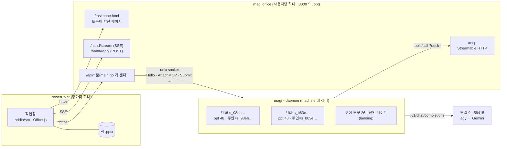
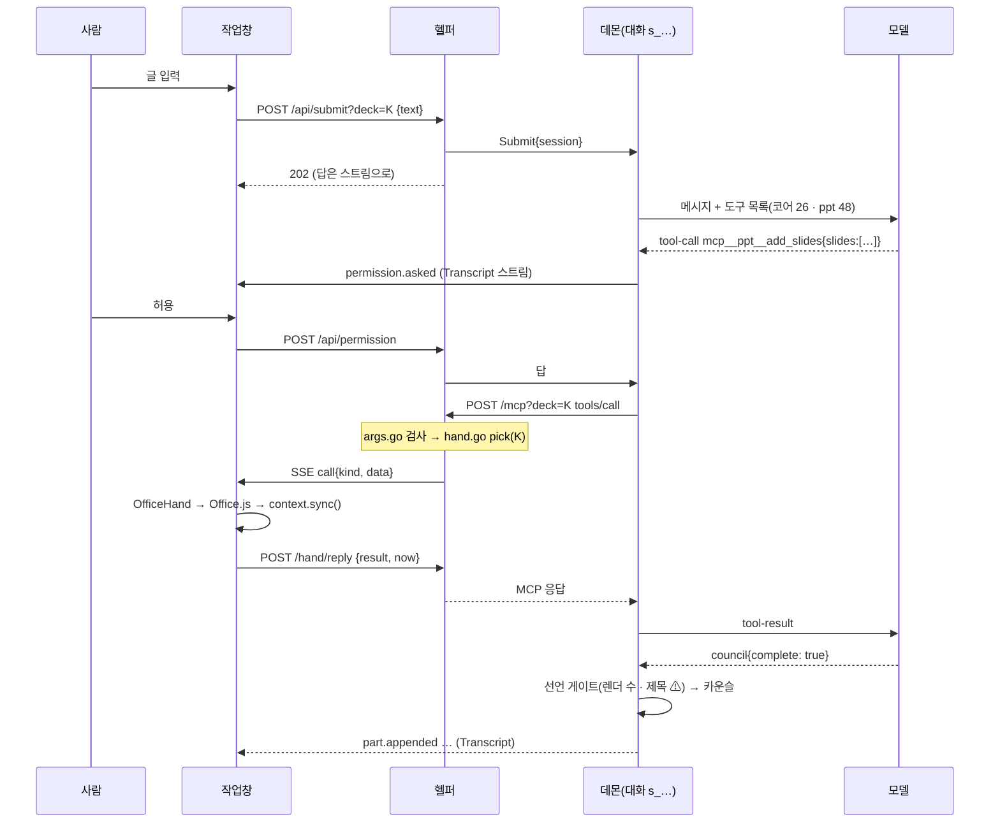
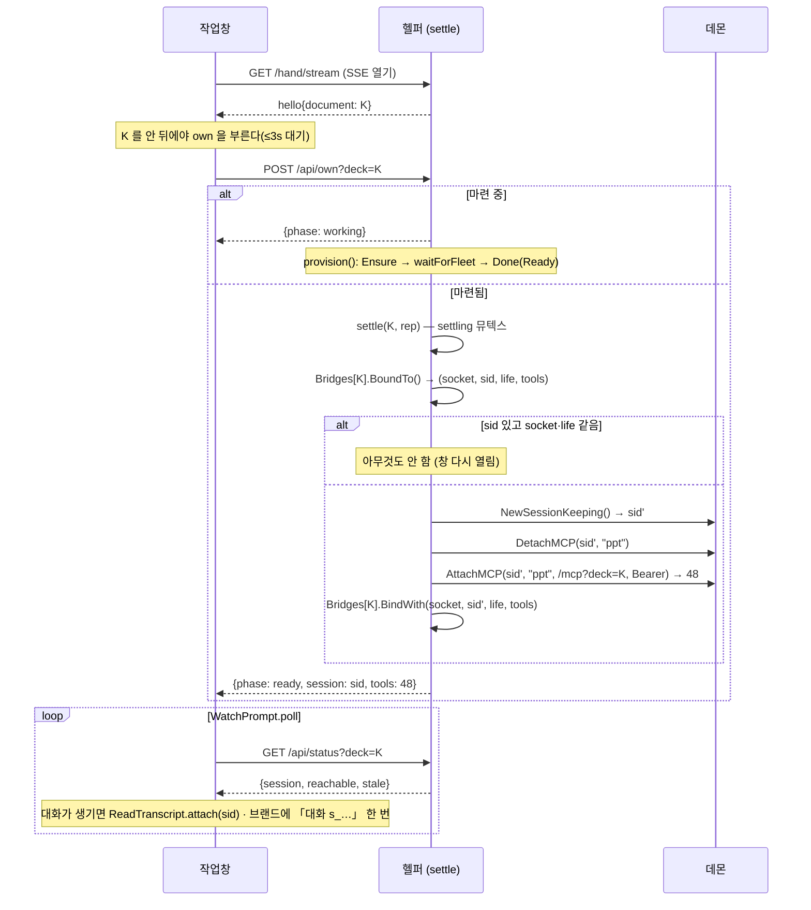
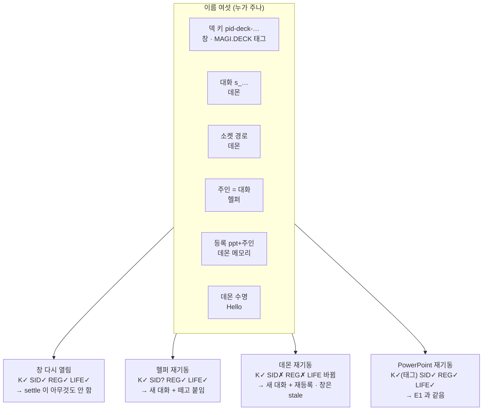
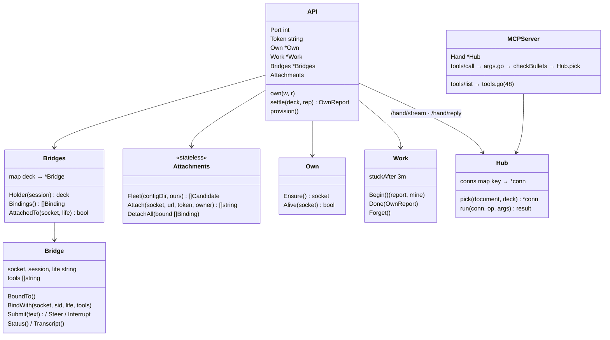
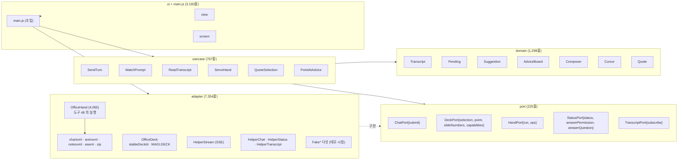
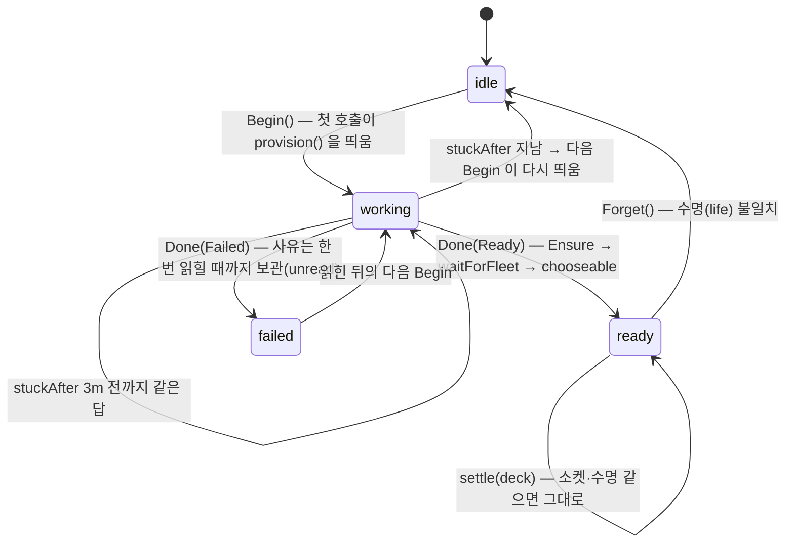

# magi PowerPoint 클라이언트 — 다이어그램

[매뉴얼](MANUAL.ko.md) · [아키텍처](ARCHITECTURE.ko.md) · [모델이 받는 것](TOOLS.ko.md) · [시험](TESTING.ko.md) · [↑ 설계](../DESIGN.md)

> **현행 참고 문서.** [ARCHITECTURE.ko.md](ARCHITECTURE.ko.md) 의 그림판입니다. 축은 하나 — 프로세스 경계(L0)에서 파일 안의 상태 기계(L5)까지. 전부 mermaid 이고, 각 그림의 출처 파일을 밑에 적었습니다.

| 층 | 무엇을 보이나 | 단위 |
|---|---|---|
| [L0](#l0--프로세스-넷과-그-경계) | 프로세스 넷과 그 경계 | 프로세스 |
| [L1](#l1--한-턴이-지나는-길) | 한 턴이 지나는 길 | 요청 |
| [L2](#l2--덱-하나에-대화-하나--붙는-순서) | 덱 하나에 대화 하나 — 붙는 순서 | 문(door) 호출 |
| [L3](#l3--재기동-네-사건) | 재기동 네 사건 | 이름 여섯 |
| [L4](#l4--헬퍼-안) | 헬퍼 안 | Go 타입 |
| [L5](#l5--작업창-안) | 작업창 안 | JS 층 |
| [L6](#l6--마련의-상태-기계) | 마련(`/api/own`)의 상태 기계 | phase |

## L0 — 프로세스 넷과 그 경계

출처: `helper/main.go`(라우트), `helper/attach.go`(문 호출), 실측 2026-09-05 09:30(데몬 pid 23062, 대화 둘).

## L1 — 한 턴이 지나는 길

사용자가 창에 "IR 자료 만들어" 를 넣은 뒤. 굵은 화살표가 덱을 실제로 바꾸는 자리입니다.

출처: `addin/src/usecase/SendTurn.js`, `helper/bridge.go`(Submit·permission), `helper/mcp.go`, `helper/hand.go pick`, `addin/src/usecase/ServeHand.js`. `now` 는 `OfficeHand.#dispatch` 가 변이 결과 안에 넣습니다.

## L2 — 덱 하나에 대화 하나 — 붙는 순서

창이 열린 직후. 헬퍼는 결정을 기억하지 않고 매번 셋에게 묻습니다.

출처: `addin/src/main.js:688–760`, `helper/main.go settle`, `helper/bridges.go`, `helper/attach.go Attach`. 멱등과 동시 호출은 `helper/tests/join_deck_test.go` 가 못박습니다.

## L3 — 재기동 네 사건

이름 여섯 중 무엇이 살아남고 무엇이 지워지는지. ✓ 같음 · ✗ 사라짐 · ? 헬퍼가 모름.

출처: `DESIGN.md §5.9`(표), `helper/tests/restart_events_test.go`(네 열을 각각 시험).

## L4 — 헬퍼 안

출처: `helper/main.go`(`API`), `helper/bridges.go`, `helper/bridge.go`, `helper/attach.go`, `helper/own.go`, `helper/ownstate.go`, `helper/hand.go`, `helper/mcp.go`, `helper/args.go`, `helper/bullets.go`.

## L5 — 작업창 안

안쪽 층은 바깥을 모릅니다. 화살표는 의존 방향입니다.

출처: `addin/src` 파일별 `wc -l`(2026-09-05). `OfficeHand` 가 큰 이유는 [ARCHITECTURE §3](ARCHITECTURE.ko.md#3-작업창--네-층).

## L6 — 마련의 상태 기계

`/api/own` 이 답하는 `phase`. 마련은 요청 안에서 기다리지 않습니다(첫 판본이 120초에 끊겼습니다, `ownstate.go`).

출처: `helper/ownstate.go`(`Work`, `stuckAfter`, `unread`), `helper/main.go own`. 실측: 2026-09-05 09:30 데몬 재기동 뒤 두 덱이 `working` → `ready` 로 가는 데 약 2분(마련 + 첫 settle).
