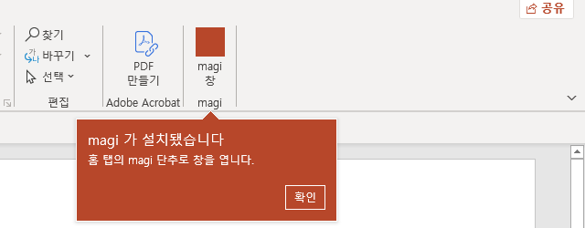
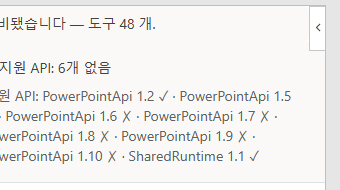

# 설치·배포 — 어느 Office 에 무엇을 어떻게 놓는가

`MANUAL.ko.md` §2 가 「한 사람이 한 머신에 처음 한 번」이라면, 이 문서는 **판별로 갈리는 자리**와
**여러 머신에 뿌리는 길**이다. 여기 적힌 것 중 실측한 것과 MS 문서에서 읽기만 한 것을 갈라 적는다 —
읽기만 한 것은 그렇게 표시한다.

## 0. 한 번에 깔기 — `install.ps1`

저장소를 받은 Windows 머신에서 이 한 줄이면 된다(Go 가 있어야 한다. 볼륨 판이면 .NET 9 SDK 도):

```powershell
& .\clients\powerpoint\install.ps1
```

하는 일 — Office 판을 읽고(M365 인가 볼륨 판인가), `magi.exe`·`magi-ppt.exe` 를 빌드해 `%LOCALAPPDATA%\magi\ppt` 에
놓고, 애드인 파일을 그 옆에 복사하고, 데몬 권한 모드를 **allow** 로 두고(`~/.magi/config.toml`, 사용자 결정),
헬퍼를 띄우고, 인증서를 이 계정의 신뢰 저장소에 넣고(Windows 가 한 번 묻는다), 애드인을 등록하고(M365 는 개발자
키, 볼륨 판은 신뢰 카탈로그 `~/.magi/ppt-catalog`), 로그인 때 헬퍼가 같이 뜨게 한다. 볼륨 판이면 COM 손을 빌드하고
**손 감시기**(`hand-watch.ps1`)도 건다 — PowerPoint 가 덱을 연 채로 떠 있으면 손을 붙이고, PowerPoint 가 내려가면
손을 정리한다. 손은 뜰 때 한 번만 PowerPoint 에 붙기 때문에 이 감시기가 필요하다.

다시 돌려도 된다 — 된 것은 건너뛴다. `-NoAutostart` 로 자동 시작을 안 걸고, `-SkipBuild` 로 빌드를 건너뛴다(배포본).
끝나면 PowerPoint 를 껐다 켜고, 볼륨 판은 **삽입 → 내 추가 기능 → 공유 폴더 → Magi(AI Assistant) → 추가** 를 한 번 한다.

이 머신(LTSC 2021)에서 잰 것(2026-09-06): 설치기가 끝까지 돌고, 공유 폴더에 Magi(AI Assistant) 가 서고, 추가하면 홈 탭에 단추가
서고, 창이 열리고, 감시기가 손을 붙여 헬퍼가 덱 하나(COM)를 본다. 설치기를 만들며 잡은 것 셋 — 헬퍼의 기본
설정 디렉토리가 `%APPDATA%\magi` 라 거기에 **새 인증서**를 만들어 버린다(그래서 `-config-dir ~/.magi` 를 못 박는다);
PowerShell 5.1 의 TLS 클라이언트는 이 Go 서버와 악수를 못 한다(살아 있는지는 `curl.exe`/TCP 로 묻는다);
`%LOCALAPPDATA%` 아래는 관리 공유로 닿지 않았다(카탈로그를 `~/.magi` 아래에 둔다).


| Office | 작업창(대화창) | 편집 | 손 | 실측 |
|---|---|---|---|---|
| **Microsoft 365** (Windows) | 뜬다 | 된다 — `PowerPointApi 1.8` | 작업창 자신(Office.js) | ✓ 2026-09-01~04, 16.0.20326 |
| **LTSC 2021** (볼륨) | **뜬다** | 작업창으로는 **안 된다**(1.2 까지) | **COM 손**(`magi-ppt-hand.exe`) | ✓ 2026-09-05, 16.0.14334.20848 |
| LTSC 2024 | 뜰 것이다 | 1.5 까지 — 읽기·증거가 줄어든다(`LTSC.md` §4) | 안 정했다 | ✗ 안 쟀다 |
| Mac | 뜬다 | 1.8 이면 된다 | 작업창 | 가짜 덱만(`addin/README.md`) |
| 웹 | 뜬다 | 된다 | 작업창 | ✗ 안 쟀다 |

근거는 MS 의 요구 집합 표다 — `PowerPointApi` 는 2021 이 1.2, 2024 가 1.5 까지이고, `SharedRuntime 1.1` 은
PowerPoint 2021(2108, 13722 이상)부터 있다. 2021 실측이 그 표와 맞았다(`LTSC.md` §7).

**한 줄로:** M365 는 작업창 하나로 끝난다. 2021 은 작업창 **더하기** COM 손이다. 그 둘을 같이 띄우는 것의
남은 결함이 §5 에 있다.

## 2. 공통 — 헬퍼·인증서·데몬

세 판 모두 같다. `MANUAL.ko.md` §2.2·§2.3·§2.5 그대로:

1. 헬퍼 빌드 `go build -o magi-ppt ./clients/powerpoint/helper`
2. 인증서를 이 계정의 신뢰 저장소에 넣는다 — `Import-Certificate … Cert:\CurrentUser\Root`. SAN 은 `127.0.0.1`
   하나다. 매니페스트·헬퍼·인증서가 전부 `https://127.0.0.1:3000` 한 문자열을 쓴다.
3. 데몬 `magi --daemon --permission ask`, 헬퍼 `./magi-ppt` (사용자당 하나).

인증서는 **머신마다 다르다** — 헬퍼가 첫 기동에 만든다. 뿌릴 때 매니페스트는 같은 파일이지만 인증서 단계는
머신마다 한 번씩 해야 한다.

## 3. 애드인을 PowerPoint 에 넣는 길 — 판마다 다르다

### 3.1 Microsoft 365 — 개발자 키

`MANUAL.ko.md` §2.4. `HKCU\Software\Microsoft\Office\16.0\WEF\Developer` 에 매니페스트 경로 한 줄. 껐다 켜면
홈 → 추가 기능 → 개발자 추가 기능에 선다.

### 3.2 LTSC 2021 — 신뢰 카탈로그(공유 폴더)

**개발자 키는 2021 이 무시한다.** 실측(2026-09-05): 리본에 아무것도 안 서고 「내 추가 기능」에 개발자
추가 기능 탭이 **없다.** 요구 집합을 뺀 최소 매니페스트로도, 리본 캐시(`RibbonCustomizationExpire`)를
지우고도 같다. MS 문서가 Windows 데스크톱에 적어 둔 길은 이것이 아니라 **신뢰 카탈로그** 다.

절차는 `MANUAL.ko.md` §2.4.1. 요지:

1. 매니페스트를 담은 폴더를 **UNC 경로**로 신뢰한다 —
   `HKCU\Software\Microsoft\Office\16.0\WEF\TrustedCatalogs\{guid}` 에 `Id`·`Url`·`Flags=1`.
2. PowerPoint 를 껐다 켜고 **삽입 → 내 추가 기능 → 공유 폴더 → Magi(AI Assistant) → 추가**.
3. 홈 탭에 「AI Assistant」 무리의 「Magi」 단추가 선다. 누르면 창이 열린다.






- 이 머신에서는 UNC 로 관리 공유 `\localhost\C$\…` 를 썼다(`New-SmbShare` 는 관리자 권한이 필요해서).
  MS 절차는 진짜 공유 폴더다. **진짜 공유로는 안 재 봤다** — 되지 않을 이유는 없지만 「잰 것」은 아니다.
- 카탈로그의 매니페스트는 복사본이다. 고치면 다시 복사한다. 리본이 바뀌면 다시 추가해야 한다(MS 문서).
- 이 길은 M365 에서도 된다(MS 문서). 개발자 키가 더 짧아서 M365 는 그쪽을 적었을 뿐이다.
- **키는 하나다.** 같은 머신의 Excel 2021 은 `TrustedCatalogs` 아래에 키가 둘 이상이면 뜰 때 전부 지운다 — 이 판의 키까지
  (2026-09-06 실측, 엑셀 판 INSTALL §3.3). 그래서 카탈로그는 `~/.magi/catalog` 하나이고 엑셀 판과 같은 키를 쓴다. 옛 자리
  `ppt-catalog` 를 가리키는 키는 설치기가 지운다. 진짜 공유(`New-SmbShare`)가 있으면 그 UNC 를 쓴다.

### 3.3 LTSC 2021 — COM 손

2021 의 작업창은 화면이고 편집은 못 한다. 편집은 `hand-com/`(.NET 9 + PowerPoint COM)이 한다.

**설치기가 다 한다** — `%LOCALAPPDATA%\magi\ppt\hand\magi-ppt-hand.exe` 로 빌드해 놓고, 손 감시기(`hand-watch.ps1`)를
로그인 때 띄운다. 감시기는 PowerPoint 가 덱을 연 채로 떠 있으면 손을 붙이고, PowerPoint 가 내려가면 손을 정리한다
(로그는 같은 폴더의 `hand-watch.log`). 손은 뜰 때 한 번만 PowerPoint 에 붙기 때문에 이 감시기가 필요하다 —
PowerPoint 를 껐다 켜면 옛 손은 죽은 COM 참조를 들고 있다.

손으로 띄우려면(개발할 때):

```
cd clients/powerpoint/hand-com/src
dotnet run -- --helper https://127.0.0.1:3000     # 떠 있는 PowerPoint 의 활성 덱에 붙는다
```

- .NET 9 런타임이 필요하다. 없는 머신에 뿌리려면 `dotnet publish -r win-x64 --self-contained` 로 묶는다.
- PowerPoint 가 **먼저 떠 있고 덱이 열려 있어야** 붙는다. 몰래 띄우지 않는다.
- 차트의 「데이터 편집」이 되려면 Excel 도 깔려 있어야 한다 — 2021 실측에서 PowerPoint+Excel 만 깔고 잰
  이유다.
- 2021 에서 48/48 돈다(`hand-com/README.md`).

## 4. 여러 머신에 뿌리기

이 저장소가 **잰 것은 한 머신씩 넣는 길뿐**이다(§3). 아래는 MS 문서에서 읽은 것이고, 여기서 안 해 봤다.

| 조직 | MS 가 적어 둔 길 | 비고 |
|---|---|---|
| Microsoft 365 테넌트 | 관리 센터의 **통합 앱**(중앙 배포)에 매니페스트를 올린다 | 사용자·그룹 단위로 밀어 넣는다. 안 해 봤다 |
| SharePoint 가 있는 조직 | SharePoint **앱 카탈로그** | 안 해 봤다 |
| 테넌트 없는 LTSC 조직 | **신뢰 카탈로그를 GPO/스크립트로** 뿌린다 — §3.2 의 레지스트리 키를 각 계정에 적고, 매니페스트는 파일 서버의 공유 폴더에 둔다 | MS 는 네트워크 공유를 **「제품 배포로는 지원 안 한다」** 고 못 박았다(시험용). 테넌트가 없으면 그것 말고 고를 것이 없다는 것까지가 사실이다 |

뿌릴 때 같이 가야 하는 것 — 헬퍼 실행 파일, 인증서 등록(머신마다), 데몬, 2021 이면 COM 손과 .NET 런타임.
**매니페스트 하나로 끝나는 것이 아니다.** 헬퍼가 그 머신의 `127.0.0.1:3000` 에 떠 있지 않으면 단추는 서도
창이 빈다.

## 5. 2021 에서 창은 화면이고 손은 COM 이다 — 사람은 그 구분을 볼 일이 없다

창은 뜨면서 `isSetSupported` 로 자기 호스트를 재고, `PowerPointApi 1.8` 이 없으면 **화면(viewer)** 으로
붙는다 — 헬퍼의 `/hand/stream?role=viewer`. 전사는 받고 호출은 안 받는다. 편집은 COM 손이 한다.

**그 구분을 사람에게 말하지 않는다.** 처음에는 창 위쪽에 「이 창은 화면만 맡습니다 — 편집은 COM 손이
합니다」를 띄웠는데, 사용자가 「사용자 입장에서는 둘을 구분할 필요가 없다」고 했다(2026-09-06). 맞다 —
시키면 되고, 되면 그만이다. 남긴 것은 **사람이 할 일이 있을 때의 한 줄**뿐이다. COM 손이 아직 안 떠 있으면:

> 이 PowerPoint 판에서는 magi-ppt-hand 를 띄워야 편집이 됩니다 — 아직 안 떠 있습니다. 띄우면 이 창이 따라 붙습니다

손을 띄우면 그 줄이 지워지고 창이 따라 붙는다 — 창을 다시 열 필요가 없다. 리뷰가 잡은 것 하나: 이 문장은
처음에 스트림 프레임에만 실려 있고 **화면에는 안 그려지고** 있었다. 이제 `nohand` 에 켜고 `hello` 에 끈다.

실측(2026-09-06, 같은 2021): 고치기 전에는 헬퍼가 덱 둘(창·COM)을 보고 호출을 창에 줬고, 창이 1.2 에서 못 하는
호출을 받아 `'index' 속성을 사용할 수 없습니다` 를 냈다 — 모델은 「PowerPoint API 가 없다」고 결론짓고 셸로
돌아섰다. 고친 뒤 헬퍼가 보는 덱은 COM 하나(`pid-com-…`)이고 `list_slides` 가 그리로 가서 장 8개를 읽었다.

두 자리가 갈라 두는 것 — 창은 `role=viewer` 로 붙고(`HelperStream`), 손도 안 세운다(`main.js` 의
`ServeHand`). 헬퍼는 창의 덱 이름과 COM 손의 이름이 달라도(2021 에는 태그 칸이 없어 창이 빈 이름을 들고 온다)
**있는 손**을 보여 준다(`helper/hand.go Peek`) — 자기 키의 손이 있으면 그것이 먼저다. COM 손이 둘이면 창이
어느 쪽을 보는지는 헬퍼가 정한다(답한 적 있고 최근인 손). 한 PowerPoint 에 손 하나가 이 문서가 잰 전부다.

## 6. 문제가 생기면

- **메시지를 보낼 때마다 검은 창이 깜빡인다** — 이 빌드(2026-09-06)에서 고쳤다. 헬퍼가 띄운 데몬은 콘솔 없이
  떠 있어서, 모델이 셸 도구를 쓸 때마다(그리고 매 턴의 `git status`) 콘솔 자식이 **새 창**을 열었다. 실측:
  `powershell -NoProfile -Command "echo hello"` 가 창 핸들 1574678 로 떴다. 이제 magi 자신에게 콘솔 창이 없으면
  자식을 보이지 않는 콘솔로 띄운다(`internal/quietconsole`). 고친 뒤 같은 자식의 창 핸들은 0 이다. 터미널에서
  띄운 magi(TUI)는 그대로다 — 자식이 그 터미널을 물려받는다. 옛 빌드면 설치기를 다시 돌리면 된다.
- **리본 이름이 옛것이거나 아이콘이 파란 육각형이다** — 이름·아이콘은 Office 가 캐시한다. 설치기는 매니페스트가
  바뀌면 리본 캐시 값을 지우고 「다시 추가하라」고 말한다: PowerPoint 를 껐다 켜고 삽입 → 내 추가 기능 → 공유
  폴더 → 추가. 파란 육각형은 아이콘을 캐시 못 했다는 뜻이고, 이 빌드부터 헬퍼가 아이콘을 캐시 가능하게 낸다.
- **카운슬 스위치를 누를 때 검은 창이 떴다** — 헬퍼가 컴패니언을 다시 띄우는 `magi --daemon --detach` 가 콘솔 창을
  열었다. 이 빌드(2026-09-06)에서 같은 방법으로 숨겼다.
- **PowerPoint 를 다 끄면 데몬도 꺼지나** — 아니다. 헬퍼(`magi-ppt`)와 데몬(`magi --daemon --detach`)은 PowerPoint 와
  무관하게 이 계정에 떠 있다. 꺼지는 것은 COM 손뿐이고(PowerPoint 가 없으면 COM 참조가 죽는다), 감시기가 그것을
  정리하고 다음에 덱이 열리면 다시 붙인다. 전부 내리려면: `Stop-Process -Name magi-ppt,magi,magi-ppt-hand`.
- **설치기를 다시 돌리면 하던 대화가 끊긴다** — 설치 폴더의 데몬을 멈추고 새 `magi.exe` 를 놓기 때문이다. 창을
  다시 열면 헬퍼가 새 데몬을 띄운다.

## 7. 지우기

**지우고 다시 깔기는 한 줄이다.** PowerPoint 를 끈 뒤:

```powershell
& .\clients\powerpoint\install.ps1 -Clean
```

등록 키(신뢰 카탈로그·개발자 키)와 리본 캐시 만료값을 지우고 `%LOCALAPPDATA%\Microsoft\Office\16.0\Wef\` 를 비운
다음 보통 설치를 이어 간다. 이름·아이콘이 바뀌었는데 리본이 옛것을 그릴 때 쓰는 길이다 — 캐시가 매니페스트 사본을
들고 있어서 그렇다. 끝나면 PowerPoint 를 켜고 삽입 → 내 추가 기능 → 공유 폴더에서 「Magi」를 다시 추가한다.

손으로 하려면:

- 개발자 키(M365): `WEF\Developer` 의 값 삭제 + `%LOCALAPPDATA%\Microsoft\Office\16.0\Wef\` 비우기(MS: 낱개
  매니페스트만 지우지 말 것 — 전부 안 뜨게 된다).
- 신뢰 카탈로그(2021): `WEF\TrustedCatalogs\{guid}` 키 삭제 + 같은 Wef 폴더 비우기.
- Office 2108 이상은 트러스트 센터 → 신뢰할 수 있는 추가 기능 카탈로그 → 「다음에 Office 를 시작할 때 캐시
  지우기」 체크로도 된다(MS 문서).

## 7. 왜 처음에 「2021 에서 안 뜬다」고 적었나

개발자 키 한 길로만 해 보고 그 결과를 물건의 결과로 읽었다. 사용자가 「그럴 리가 없다, 공식 문서를
봐라」고 했고, 문서의 표는 2021 에 `SharedRuntime 1.1` 이 있다고 적혀 있었다. 다른 길로 넣으니 바로 섰다.
**안 되는 것을 적을 때는 어느 길로 해 봤는지를 같이 적는다.** 그 문장이 `TESTING.ko.md` §5.5 에도 있다.
