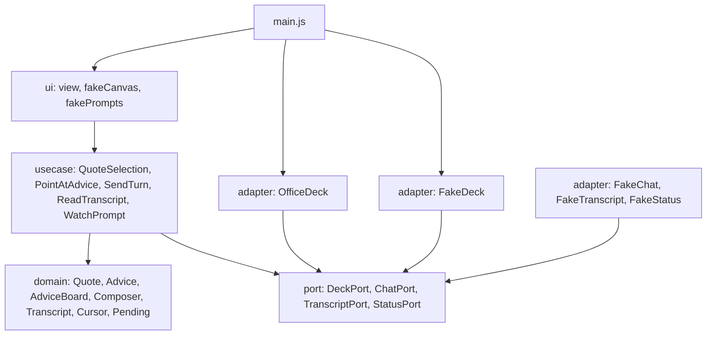

# PowerPoint 애드인 목업

`DESIGN.md` 의 화면 셋 — **채팅창**, **선택 인용**(§5.8), **안내**(§6.1) — 을 손으로 만져 보는 목업이다.
모델에는 안 붙는다. 답과 안내는 `FakeChat` 이 타이머로 낸다.

## 먼저, 무엇이 검증됐고 무엇이 안 됐는지

**이 머신에 PowerPoint 가 설치돼 있지 않다.** `/Applications` 에도 애드인 컨테이너에도 없다.
그래서 이 목업에서 오늘 **실제로 돌려 본 것은 브라우저 경로뿐**이고, `OfficeDeck` 은
**한 줄도 실행해 본 적이 없다.** 파일 머리에도 그렇게 적어 뒀다.

| 경로 | 덱 어댑터 | 오늘 상태 |
|---|---|---|
| 브라우저 (`http://localhost:3000/taskpane.html`) | `FakeDeck` | **돈다** — 인용·전송·안내 클릭까지 확인 |
| PowerPoint 사이드로드 | `OfficeDeck` | **미검증** — 붙여 볼 PowerPoint 가 없다 |

두 번째 줄을 "되겠지"로 적지 않는 이유는, 이 목업이 답하려는 질문 자체가 **재 봐야 아는 것**이기
때문이다. 붙여 보면 `DESIGN.md` §9 의 두 스파이크가 그 자리에서 답을 낸다.

- **S13** — `setSelectedSlides` → `setSelectedShapes` 두 번 호출의 순서·동기화가 실제로 먹는가.
- **S14** — 「선택 인용」을 누르려고 **포커스가 작업창으로 갈 때 캔버스 선택이 남는가.**
  안 남으면 인용은 단축키로만 되고, 그 바닥은 Windows 2601 · Mac 16.105.2 라 사실상 최신 빌드
  전용 기능이 된다(부록 A). 붙여 보면 목업이 그 자리에서 **「선택이 날아갔습니다 — 누르기
  직전엔 N 개를 잡고 있었습니다」** 라고 적는다. 누르기 전후로 두 번 읽어서 아는 것이다.
- **요구 집합 천장** — 붙는 순간 화면 위쪽에 한 줄이 뜬다. `PowerPointApi` 1.2·1.5·1.6·1.7·1.8
  과 `SharedRuntime` 1.1 을 호스트에게 직접 물어 그대로 적는다. **끊기는 자리가 둘이다** —
  1.2 ✓ · 1.5 ✗ 면 LTSC 2021 세대, 1.5 ✓ · 1.6 ✗ 면 2024 세대이고, 그게 §12 #4(LTSC 를
  버리는가)의 실물 답이다. 1.2 를 안 물으면 2021 에서 전부 ✗ 라 아무것도 못 가른다.
  브라우저에서는 **"가짜 덱 — 호스트가 없어 잰 것이 없다"** 라고 뜬다 — 안 잰 것을 잰 것처럼
  보이게 두지 않는다.

## 돌려 보기

```
node tools/serve.mjs          # http://localhost:3000/taskpane.html
node tools/smoke.mjs          # PowerPoint 없이 도는 확인
```

브라우저로 열면 왼쪽에 **가짜 캔버스**가 붙는다. PowerPoint 자리를 대신할 뿐이고 애드인에는
안 들어간다 — 도형 선택을 만들 곳이 필요해서 있다. 도형을 클릭해 잡고(Shift 로 여러 개)
오른쪽에서 「선택 인용」을 누르면 인용부호로 담긴다.

### 「데몬 흉내」 단추들

브라우저 화면 아래 줄이다. **눌러 볼 자리가 없으면 CSS 한 줄이 틀려도 아무도 모른 채 착지한다.**

| 단추 | 만드는 상황 |
|---|---|
| 권한 물음 · 질문 · 모르는 종류 | 데몬이 무엇에 막혀 있는지 — 모르는 `kind` 는 단추 없이 사실만(§5.7) |
| 남이 답함 | 다른 창이 답해서 물음만 내려가는 경우 — 이 창은 무엇으로 답했는지 모른다 |
| 문 끊기 / 잇기 | 요청 쪽이 죽은 경우 |
| 스트림 끊기 / 잇기 | **받는 쪽만** 죽은 경우 — 이때는 잠그지 않고 「확인 못 함」으로 적는다 |
| 검증 못 한 끝 | `TurnFinishedData.Unverified` — 「고쳤다」와 「고쳤다는데 아무도 못 봤다」 |
| 남의 서버 안내 | 서버 이름이 다른 `advise` — 한 장도 안 붙고, 몇 개를 왜 못 붙였는지 적힌다 |
| 안내 세 줄 | 따라갈 것 · 슬라이드가 사라져 낡은 것 · 어딘지가 안 실린 것 |
| 번호 못 주는 덱 | `slideNumbers()` 가 `null` — 「확인 중」과 「이 호스트는 못 준다」를 가른다 |
| 글 못 읽는 덱 | 두 번째 왕복만 죽은 선택 — 인용이 「글 없음」이라 적으면 안 된다 |

### 브라우저에서만 잡힌 것 셋

`tools/smoke.mjs` 는 전부 초록인데 화면은 틀려 있던 것들이다. 목업의 값이 여기 있다.

1. **부팅 화면이 「스트림이 끊겼습니다」라고 단언했다.** `detach()` 는 알리는데 `attach()` 는
   안 알려서, 빈 대화에 붙으면 **붙기 전에 그린 그림**이 영영 서 있었다. 비대칭 통지는
   거짓말 생성기다.
2. **사용자 말이 가운데 정렬됐다.** 줄 종류를 `class="turn ${kind}"` 로 적으니 끝난 턴이
   `class="turn turn"` 이 되고, CSS 에서 `.turn.turn` 은 그냥 `.turn` 이라 한 줄에 준 모양이
   모든 줄에 걸렸다. 지금은 `kind-` 를 붙인다.
3. **첫 도형 클릭에 위 단추들이 통째로 사라졌다.** 가짜 캔버스가 공유 `root` 에
   `replaceChildren()` 을 했다. 그 단추가 §5.7 물음 창에 닿는 유일한 길이라, 못 눌러 본 화면은
   안 만든 화면이 될 뻔했다.

## PowerPoint 에 붙이기 (미검증 경로)

Office 는 애드인 소스를 https 로만 받는다. 인증서는 **직접** 만들어야 한다 — 개발용 CA 를
키체인에 심는 일이라 `tools/serve.mjs` 가 대신 하지 않고 명령만 알려 준다.

```
npx office-addin-dev-certs install
node tools/serve.mjs                       # 인증서를 찾으면 https 로 뜬다
```

그다음 매니페스트를 사이드로드 폴더에 둔다.

- **macOS** — `~/Library/Containers/com.microsoft.Powerpoint/Data/Documents/wef/` 에 `manifest.xml`
  복사 후 PowerPoint 재시작. 홈 탭에 「magi 창」 단추가 생긴다.
- **Windows** — 공유 폴더를 하나 만들어 신뢰할 수 있는 카탈로그로 등록하고 거기에 매니페스트를 둔다.

매니페스트에서 세 가지를 일부러 그렇게 뒀다.

1. **최상위 `<Requirements>` 에 `PowerPointApi` 를 안 적는다.** 적으면 조건이 안 맞는 빌드에서
   애드인이 목록에서 아예 사라져 사용자가 *왜* 없는지 모른다(§3.3). 확인은 런타임에 하고 **말한다.**
2. **`<Runtime ... lifetime="long" />` 은 적는다.** 작업창이 닫혀도 코드가 살아 있어야 하고
   (§5.7), 이 요구(SharedRuntime 1.1)는 문서가 이미 거는 1.8 바닥보다 낮아 새로 걸러내는 것이
   없다(부록 A).

   ⚠ **적는 자리를 MS 절차와 다르게 뒀다.** 절차는 최상위 `<Requirements>` 에 넣으라고 하는데
   그러면 못 맞추는 빌드에서 애드인이 아예 안 뜬다(1 번이 금지한 그것). `<VersionOverrides>`
   안에 두면 사라지는 것이 애드인이 아니라 **리본 단추**뿐이다. 걸리는 빌드가 이미 1.8 미달이라
   사람이 새로 걸러지지는 않는다 — 부록 A.

3. **`<Action>` 에 `<TaskpaneId>` 를 안 적는다.** 긴 수명 런타임이 있는 `<Host>` 아래에서는
   작업창이 하나여야 하고, MS 가 그걸 마크업 규칙으로 적어 뒀다(부록 A).

## 구조

유스케이스가 Office.js 를 **모른다.** 그래서 덱 어댑터 하나만 갈아 끼우면 같은 흐름이 맨
브라우저에서도 돈다 — PowerPoint 가 없는 오늘 검증할 수 있는 유일한 길이고, 층을 나눈 값이
그것이다.



**보내는 문과 받는 문이 갈라져 있다**(`ChatPort` · `TranscriptPort`). 취향이 아니라 계약이다 —
`transcript` 는 연결을 통째로 가져가므로 요청 쪽과 받는 쪽이 **서로의 생존 증거가 아니다**
(§5.7). 갈라 뒀기 때문에 「스트림만 죽은」 경우를 아래 단추 하나로 만들어 볼 수 있다.

- `domain/` — 값만 있다. `Transcript` 는 로그를 접어 줄을 만들고, `Composer` 는 낸 글을 쥔 채
  잠기며(메아리로만 풀린다), `AdviceBoard` 는 `tool-call` 조각을 접어 안내를 만든다 — **셋 다
  쌓지 않는다.** 화면이 안 받은 것을 단언하지 않게 하는 자리가 여기다.
  `Quote` 는 **스냅숏**이다. 담을 때의 글과 크기를 그대로 들고 가고
  나중에 다시 안 읽는다. 보낼 때 도형이 달라졌으면 **조용히 바꿔치기하지 않고 멈춘다**(§5.8).
- `port/` — 덱으로 난 유일한 구멍. `selection()` 은 **풀 전용**이다. 도형 선택이 바뀌었다고
  알려 주는 이벤트가 PowerPoint 몫으로 적힌 곳이 없고(부록 A — MS 문서끼리 어긋나는 자리다),
  돈다 해도 *무엇이* 선택됐는지는 안 주므로 어차피 당겨야 한다. 그래도 되는 이유는 **누름 자체가
  이벤트**라서다.
- `usecase/` — `QuoteSelection` 은 선택을 **두 번** 읽는다. 포인터가 단추에 들어올 때 한 번
  (`sampleBeforeFocus`), 눌린 뒤 한 번(`run`). 눌린 뒤에만 읽으면 빈 선택이 "고른 게 없다"와
  "포커스가 가져갔다"로 똑같이 생겨서 S14 를 못 잰다. 그래서 `reason` 이 셋이다 — `none` ·
  `lostFocus` · **`unknown`**(단축키처럼 앞 읽기가 없는 길). 셋째가 있는 이유는 **모르는 것을
  "안 골랐다"로 적지 않겠다**는 것이고, ⚠ 호버가 포커스를 안 옮긴다는 전제는 PowerPoint 작업창
  에서 **안 재 봤다.**
- `adapter/` — `OfficeDeck` 만 Office.js 를 안다. `FakeDeck`·`FakeChat` 은 목업 전용이다.
- `main.js` — 조립하는 유일한 자리. `Office.onReady()` 와 1.5초 타임아웃을 경주시킨다.
  Office 밖에서는 `onReady` 가 **영영 안 풀리기** 때문이다. ⚠ 그 시계는 **진짜 PowerPoint
  안에서도 돈다** — 느린 날 지면 사용자가 PowerPoint 안에서 가짜 덱을 본다. 그래서 진 이유를
  "Office 가 없다"와 "시계가 이겼다"로 가르고, 진 뒤에도 `onReady` 를 계속 들어 늦게 풀리면
  화면에 남긴다. **덱을 몰래 바꿔 끼우지는 않는다** — 조용한 교체는 조용한 오작동과 같다.

## 아직 가짜인 것

- 모델. `FakeChat` 이 정해진 문장을 타이머로 낸다.
- 데몬·MCP. 목업은 소켓을 안 연다.
- 실제 편집. 인용은 담기지만 슬라이드를 고치지 않는다.
- **안내의 핀.** 축소판에 항목을 찍는 층(설계 §6.1 의 층 2)을 안 만들었다. 목업에 있는 것은
  **층 1(목록)과 진짜 선택**뿐이다. 설계가 그 둘을 갈라 둔 이유가 이것이다 — 핀은 없어도
  안내가 성립하고, 슬라이드 치수를 1.8 안에서 얻을 수 있는지(S12)를 아직 아무도 안 쟀다.
- **인용 단축키.** 설계는 `Ctrl+Shift+Alt+Q` 같은 것을 **있으면 좋은 것**으로 두는데(§5.8)
  목업에는 버튼만 있다. 단축키의 바닥이 Windows 2601 · Mac 16.105.2 라 §3.3 의 바닥보다
  한참 위고, `Office.actions.getShortcuts` 로 있는지 물어 없으면 말해 주는 자리까지가 설계다.
  목업은 그 물음을 안 한다 — 여기서 재도 브라우저는 늘 "없다"라고만 답한다.
- **문서 열 때 자동 기동.** `Office.addin.setStartupBehavior(load)` 를 **안 부른다.** 설계는
  부르기로 했지만(부록 A) 그건 데몬이 있어야 뜻이 있는 줄이고, 목업은 소켓을 안 연다. 지금
  부르면 사용자 덱에 설정만 남는다 — 하는 일 없는 부수효과라 뺐다. 빼먹은 게 아니라 뺀 것이다.
