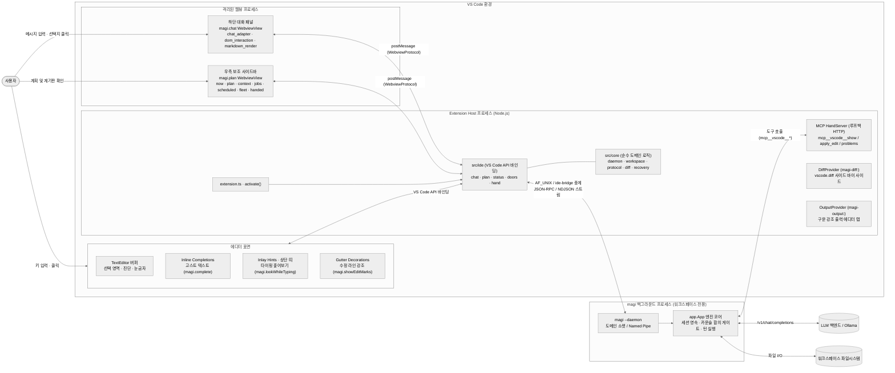
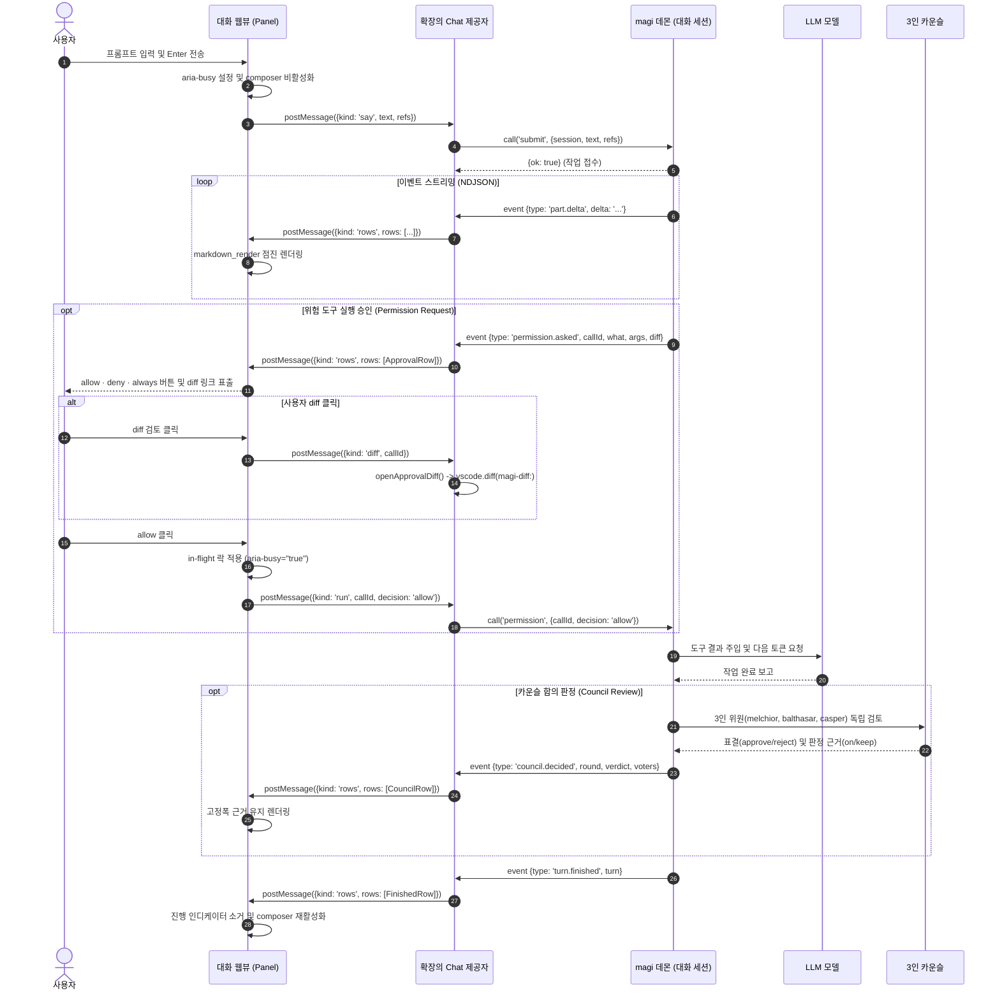
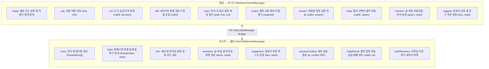
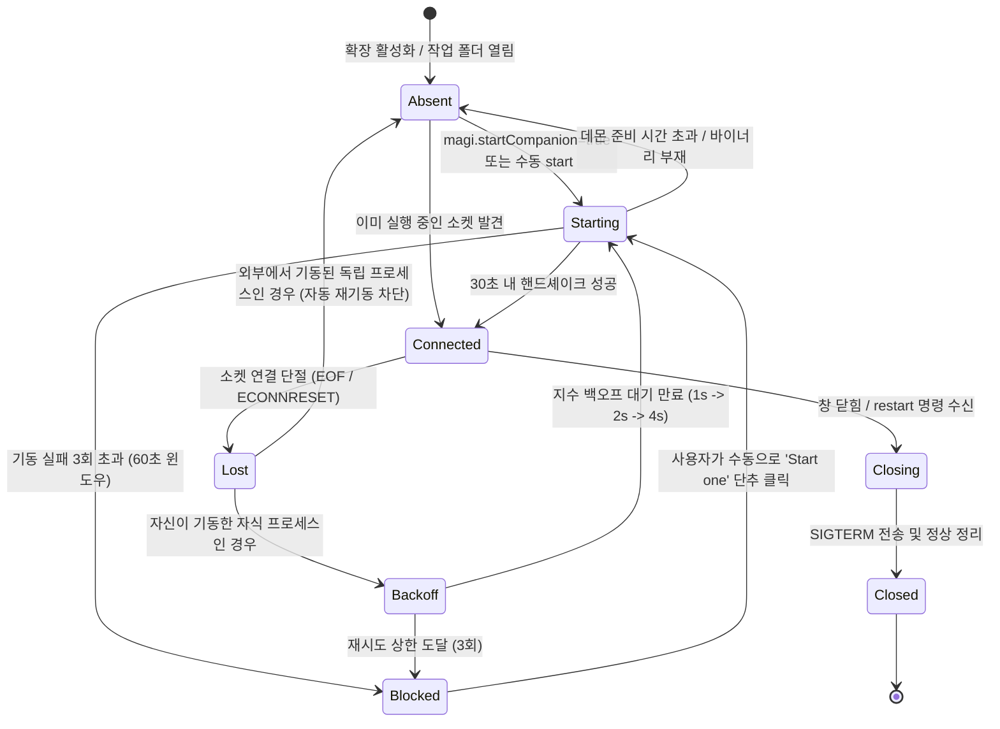
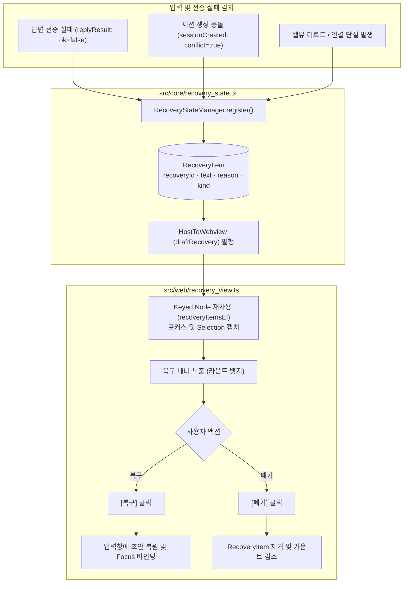
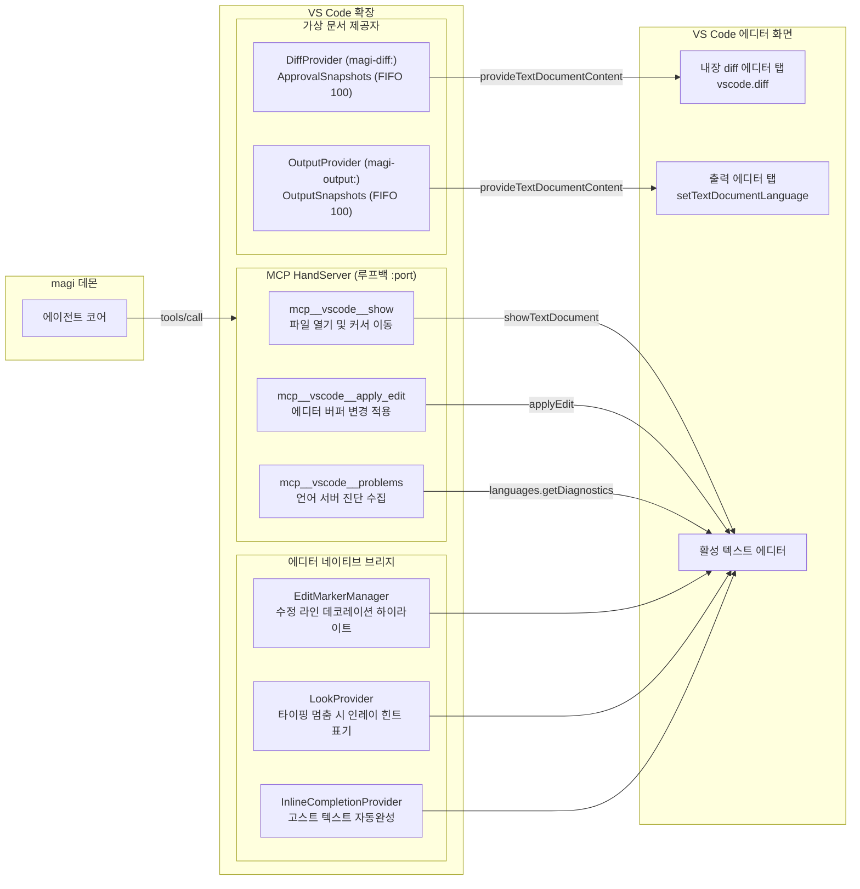

# VS Code 확장 — 시스템 구조도

[매뉴얼](MANUAL.ko.md) · [화면 설계](UI.ko.md) · [설계](DESIGN.ko.md) · [테스트 안내](TESTING.ko.md) · [플랫폼 규약](PLATFORM.ko.md) · [↑ 루트 다이어그램](../../../docs/DIAGRAMS.ko.md)

> **현행 참조 문서.** [DESIGN.ko.md](DESIGN.ko.md) 와 [UI.ko.md](UI.ko.md) 의 시각적 짝입니다. 프로세스 경계(L0)부터 에디터/웹뷰 상호작용 및 상태 기계(L6)까지 mermaid 다이어그램으로 기술하며, 각 그림의 하단에 근거 소스 파일과 주요 심볼을 명시합니다.

| 층 | 보는 것 | 단위 |
|---|---|---|
| [L0](#l0--프로세스와-신뢰-경계) | 프로세스와 신뢰 경계 | 프로세스 및 격리 영역 |
| [L1](#l1--한-턴의-수명주기-입력에서-착지까지) | 한 턴의 수명주기 (입력에서 착지까지) | 단계별 이벤트 및 통신 흐름 |
| [L2](#l2--2계층-모듈-구조와-컴포넌트-맵) | 2계층 모듈 구조와 컴포넌트 맵 | `src/core`, `src/ide`, `src/web` |
| [L3](#l3--호스트웹뷰-통신-프로토콜-매트릭스) | 호스트↔웹뷰 통신 프로토콜 매트릭스 | 메시지 스키마 및 이벤트 흐름 |
| [L4](#l4--데몬-연결-수명주기-및-재기동-상태-기계) | 데몬 연결 수명주기 및 재기동 상태 기계 | Phase 및 재시도 상태 |
| [L5](#l5--초안-복구-및-dom-포커스선택-보존-흐름) | 초안 복구 및 DOM 포커스/선택 보존 흐름 | DraftBackup 및 Keyed Node 갱신 |
| [L6](#l6--에디터-네이티브-통합-및-mcp-도구-제어-브리지) | 에디터 네이티브 통합 및 MCP 도구 제어 브리지 | 가상 문서(Diff/Output) 및 MCP Hand |

---

## L0 — 프로세스와 신뢰 경계

VS Code 확장은 Node.js 기반 Extension Host 프로세스에서 실행되며, 보안상 격리된 브라우저 컨텍스트의 Webview 프로세스, 그리고 워크스페이스 단위로 상주하는 백그라운드 `magi --daemon` 프로세스와 통신합니다.

출처: `src/ide/extension.ts` (`activate`), `src/ide/chat.ts` (`Chat`), `src/ide/plan.ts` (`Plan`), `src/ide/hand.ts` (`Hand`), `src/core/workspace.ts` (`canonicalWorkspaceKey`).

---

## L1 — 한 턴의 수명주기 (입력에서 착지까지)

사용자가 프롬프트를 제출한 시점부터 데몬 이벤트 스트리밍, 승인 절차, 카운슬 검토 및 턴 종료까지의 전체 흐름입니다.

출처: `src/ide/chat.ts` (`onDidReceiveMessage`, `watchSession`), `src/web/chat_adapter.ts` (`WebviewInputAdapter`), `src/core/transcript.ts` (`foldEventsToPaintedRows`).

---

## L2 — 2계층 모듈 구조와 컴포넌트 맵

JetBrains 클라이언트와 동일하게 순수 Node.js 도메인 코어(`src/core/`)와 IDE API 연동 계층(`src/ide/`), 그리고 웹뷰 번들(`src/web/`)로 명확히 분리됩니다. `src/core/`는 `vscode` 모듈을 절대 import하지 않아 `node:test`로 완전 격리 테스트가 가능합니다.

```mermaid
%%{init: {'theme':'neutral','flowchart':{'curve':'basis'}}}%%
classDiagram
  direction TB

  namespace CoreLayer {
    class DaemonClient {
      +call(door, args) Promise~Response~
      +requestStream(door, args) Observable
      +subscribeEvents(session) Observable~Event~
      +phase: Phase
    }
    class WorkspaceDiscovery {
      +canonicalWorkspaceKey(root) string
      +socketPathFor(root) string
      +discoverActiveDaemon(root) Promise
    }
    class TranscriptFold {
      +foldEventsToPaintedRows(events) PaintedRow[]
      +detectCouncilRound(events) RoundInfo
    }
    class RecoveryStateManager {
      +register(options) RecoveryItem
      +listItems(filter) RecoveryItem[]
      +deleteItem(recoveryId) boolean
      +getFailedDrafts(callId) string[]
    }
    class ApprovalSnapshots {
      +put(uri, content) boolean
      +get(uri) string
      +evictExcess() number
      +protectTemp(uris) Function
    }
    class OutputSnapshots {
      +put(uri, content) boolean
      +get(uri) string
      +evictExcess() number
    }
    class WebviewProtocol {
      +parseWebviewToHost(raw) WebviewToHostMessage
      +parseHostToWebview(raw) HostToWebviewMessage
    }
  }

  namespace IdeLayer {
    class ExtensionEntry {
      +activate(context)
      +deactivate()
    }
    class ChatViewProvider {
      +resolveWebviewView(webviewView)
      +postMessage(message)
      -handleWebviewMessage(msg)
    }
    class PlanViewProvider {
      +resolveWebviewView(webviewView)
      +pollPlanSections()
    }
    class StatusBarManager {
      +updateStatus(state, model)
      +showQuickPickMenu()
    }
    class InlineCompletionProvider {
      +provideInlineCompletionItems(doc, pos)
    }
    class LookProvider {
      +onBufferPause(doc)
      +applyInlaysAndBanner(critiques)
    }
    class EditMarkerManager {
      +highlightModifiedLines(editor, ranges)
      +clearMarkers()
    }
    class HandMcpServer {
      +startLoopbackServer()
      +dispatchTool(name, args)
    }
  }

  namespace WebviewLayer {
    class WebviewInputAdapter {
      +submit()
      +handleTab()
      +handleCompose()
      +invalidateSuggest()
    }
    class DomInteraction {
      +captureSelection(root)
      +restoreSelection(root, bookmark)
      +moveDomChild(parent, node, index)
    }
    class RecoveryController {
      +refreshRecoveryUI()
      +restoreDraft(recoveryId)
      +discardDraft(recoveryId)
    }
    class MarkdownRenderer {
      +render(markdownText) string
      +renderCouncil(onText, keepText)
    }
  }

  ExtensionEntry --> ChatViewProvider
  ExtensionEntry --> PlanViewProvider
  ExtensionEntry --> StatusBarManager
  ExtensionEntry --> InlineCompletionProvider
  ExtensionEntry --> LookProvider
  ExtensionEntry --> EditMarkerManager
  ExtensionEntry --> HandMcpServer

  ChatViewProvider --> DaemonClient
  ChatViewProvider --> TranscriptFold
  ChatViewProvider --> RecoveryStateManager
  ChatViewProvider --> ApprovalSnapshots
  ChatViewProvider --> OutputSnapshots
  ChatViewProvider --> WebviewProtocol

  ChatViewProvider ..> WebviewInputAdapter : postMessage 통신
  WebviewInputAdapter --> DomInteraction
  WebviewInputAdapter --> RecoveryController
  WebviewInputAdapter --> MarkdownRenderer
```

출처: `src/core/daemon.ts`, `src/core/workspace.ts`, `src/core/transcript.ts`, `src/core/recovery_state.ts`, `src/core/diff.ts`, `src/core/output.ts`, `src/ide/chat.ts`, `src/ide/plan.ts`.

---

## L3 — 호스트↔웹뷰 통신 프로토콜 매트릭스

웹뷰와 호스트는 Valibot으로 선언된 스키마에 따라 메시지를 주고받습니다. 타입 불일치 및 정의되지 않은 메시지는 조기에 거절됩니다.

출처: `src/core/webview_protocol.ts` (`WebviewToHostSchema`, `HostToWebviewSchema`), `src/web/chat_adapter.ts`.

---

## L4 — 데몬 연결 수명주기 및 재기동 상태 기계

소켓 탐색, 데몬 연결 수립, 비정상 종료 감지 및 자동 재시도 백오프 제어의 상태 전이 다이어그램입니다.

출처: `src/core/lifecycle.ts` (`LifecycleManager`), `src/core/launches.ts` (`LaunchBudget`), `src/core/daemon.ts`.

---

## L5 — 초안 복구 및 DOM 포커스/선택 보존 흐름

네트워크 장애, 질문 만료 또는 세션 전환 시 입력 중이던 초안이 유실되지 않도록 보존하며, 전사 재렌더링 중에도 사용자의 텍스트 선택(Selection)과 포커스를 안전하게 유지합니다.

출처: `src/core/recovery_state.ts` (`createRecoveryState`), `src/web/recovery_controller.ts`, `src/web/dom_interaction.ts` (`captureSelection`, `restoreSelection`).

---

## L6 — 에디터 네이티브 통합 및 MCP 도구 제어 브리지

VS Code 에디터 버퍼, 가상 문서 제공자, 그리고 데몬이 역으로 호출하는 루프백 MCP Hand 도구 서버 간의 상호작용입니다.

출처: `src/ide/diff.ts` (`DiffProvider`), `src/ide/output.ts` (`OutputProvider`), `src/ide/hand.ts` (`Hand`), `src/ide/edits.ts`, `src/ide/look.ts`, `src/ide/complete.ts`.
