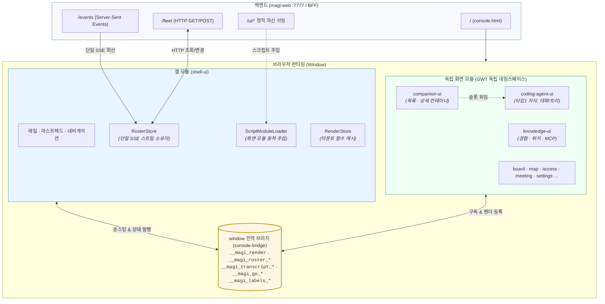

# clients/web/ui — 웹 콘솔 UI 개발 문서

상위 [`web/README.md`](../README.md)가 프로젝트의 배경 및 의도(스트랭글러 패턴 적용 좌표, 대조표, 컷오버 기록)를 설명한다면, 본 문서는 구체적인 아키텍처 및 구현 방식을 설명합니다: 모듈 분할 구조, 셸(Shell)과 각 화면 간의 연동 규약, 그리고 신규 화면을 이식할 때 준수해야 할 개발 절차를 다룹니다. 기존 단일 페이지 콘솔 및 개발용 프록시(`web/server`)는 완전히 제거되었으며, 현재 `clients/web/server`가 제공하는 정적 자산은 본 디렉토리의 빌드 산출물입니다.

## 지도



총 13개 모듈로 구성됩니다. 의존성 방향은 `화면 모듈 → console-bridge ← shell-ui` 단방향이며, 개별 화면 모듈 간에는 상호 직접 의존이 존재하지 않습니다. 마지막 모듈(`landing-ui`)은 콘솔 내부 화면이 아닌 **독립 사이트**입니다(셸 없이 자체 URL로 기동되며, 콘솔 배포 자산에는 포함되지 않습니다).

| 모듈 | 설명 | 빌드 산출물 |
|---|---|---|
| `console-bridge` | 셸↔화면 연동 규약: 브라우저 창 브리지(Render·Roster), 와이어 DTO(FleetAgent), 언어 팩(Labels), HTTP 유틸리티(Console) | 소스가 포함된 jar (GWT 라이브러리 규약) |
| `ui-components` | 공용 위젯 저장소 (모듈 선언 `UiComponents.gwt.xml`) | 소스가 포함된 jar |
| `shell-ui` | 셸: 드로어(1단+2단), 마스트헤드, 라우팅(Place), RenderStore, RosterStore, 타입 카탈로그(CompanionType), ScriptModuleLoader | `shell/shell.nocache.js` + `console.html` + `shell.css` |
| ~~`fleet-ui`~~ | 목록 화면이 컴패니언 목적지로 통합되어 `companion-ui`로 이관되었습니다(`513e26c6`). 디렉토리는 참고용으로 유지되며 `settings.gradle.kts` 빌드 대상에서는 제외되었습니다. 새 화면 구현의 레퍼런스는 `companion-ui` 및 `knowledge-ui`를 참조합니다. | — |
| `companion-ui` | 컴패니언 상세 및 목록 화면의 기본 컨테이너 — **목록** 및 **상세 레이아웃**(상단 정보판, 우측 패널)을 제공하고, 중앙 및 좌측 영역은 자식 타입 UI에 위임합니다. | `companion/companion.nocache.js` + `companion.css` |
| `coding-agent-ui` | 타입 1(코딩 에이전트) 전용 자식 UI — 중앙(대화·컴포저) 및 좌측(워크스페이스: 파일 트리·Git) 영역을 담당합니다. | `coding/coding.nocache.js` + `coding.css` |
| `knowledge-ui` | 지식 관리 화면(경험·위키·MCP 서버) — URL 파라미터 `v=skills`, 모듈 식별자 `skills` | `skills/skills.nocache.js` |
| `board-ui` | 작업 보드 — 전용 레일 버튼이 없는 URL(`v=board`): 컴패니언 레일 선택 상태 유지, 진입은 플릿의 `.toview`를 통해 처리 | `board/board.nocache.js` |
| `map-ui` | 에이전트 토폴로지 맵 — `v=map`: 머신 및 계정 컨테이너 간 상호작용 와이어 시각화 | `map/map.nocache.js` |
| `access-ui` | 접근 제어(`v=access`) — 레일의 3번째 메뉴, 관리자(admin) 권한 게이트 적용 | `access/access.nocache.js` |
| `meeting-ui` | 회의실(`v=meet`) — 회의실 목록 및 단일 회의 룸 | `meeting/meeting.nocache.js` |
| `settings-ui` | 환경설정(`v=settings`) — 브라우저 로컬 설정 및 데몬 구성 관리 | `prefs/prefs.nocache.js` |
| `demo-ui` | **화면이 아님** — 정적 데모 사이트 전용 mock 계층. 경로별 응답을 처리하고 통신 어댑터에 결합됩니다(운영 자산에는 미포함). | `demo/demo.nocache.js` |
| `landing-ui` | **화면이 아님** — GitHub Pages 프로젝트 랜딩 페이지. 셸 및 백엔드 의존성이 없으며, 브리지에서 브라우저 언어 설정(`Prefs.lang`)과 저수준 통신(`Console.raw`)만 사용합니다. 독립 언어 팩(`i18n/landing.{en,ko}.json`)을 **상대 경로**로 조회합니다. | `index.html` + `landing.css` + `i18n/landing.{en,ko}.json` + `landing/landing.nocache.js` (`assembleLanding`) |

## 셸과 화면의 계약 (console-bridge)

모든 인터페이스 계약은 `window` 전역 객체를 통해 체결됩니다. 개별 GWT 모듈은 서로 독립된 네임스페이스로 컴파일되므로, 런타임 통신은 브라우저 최상위 창(Window) 객체를 공유하는 구조입니다.

- **렌더 등록 (`__magi_render`)**: 셸이 수신 리스너를 등록하고(`RenderSharing.register`), 화면 모듈이 스크립트 로드 완료 시 프레임 엘리먼트를 수신하여 렌더링하는 함수를 전달합니다(`RenderSharing.next`). 렌더 함수에는 식별자가 직접 포함되지 않으므로, 셸의 `RenderStore`가 "현재 로드 중인 대상(`expect`)"을 소유자로 매핑하여 목적지별로 캐싱합니다. 재방문 시에는 추가 스크립트 주입 없이 캐시된 렌더러로 즉시 재출력합니다.
- **명단 동기화 (`__magi_roster_subscribe` / `__magi_roster_refresh`)**: 창당 단일 스트림 원칙을 준수합니다. 셸의 `RosterStore`가 `/fleet` 및 `/events`(SSE) 연결의 유일한 소유자로서 두 인터페이스를 호스팅하고(`RosterSharing.host`), 각 화면은 이를 구독하기만 합니다(개별 화면이 독자적인 `EventSource`를 생성하지 않습니다). 셸 없이 독립 실행되는 테스트 페이지 환경에서는 `hosted()`가 false를 반환하여 자체 통신 회선으로 폴백합니다.
- **전사 로그 (`__magi_transcript_subscribe` / `__magi_turn_subscribe`)**: 선택된 컴패니언에 대한 전사 레코드 전체 배열 및 턴(turn) 이벤트 스트림을 셸이 수신하여 브리지 채널로 중계합니다. 전사 데이터가 `null`인 경우는 "미수신 또는 읽기 실패"를 나타내며, 새 컴패니언으로 전환될 때도 `null`이 선행 송출되어 이전 대화 내용이 새 화면에 잔상으로 남지 않도록 보장합니다.
- **컨텍스트 (`__magi_companion_subscribe`)**: 현재 활성화된 컴패니언 정보(`CompanionContext`: socket, peer, type)를 전달합니다. `type` 속성은 셸이 타입 카탈로그를 통해 사전 해석한 결과 키이며, 화면 모듈은 이를 읽기 전용으로 소비합니다.
- **화면 이동 (`__magi_go` / `__magi_go_view` / `__magi_go_past` / `__magi_go_sub`)**: 화면 모듈이 셸에 URL 및 뷰 전환을 요청하는 인터페이스입니다. 컴패니언 전환(플릿 행 선택), 카탈로그 뷰 전환(플릿 `.toview`), 과거 세션 이력 층위(`?past=` — null은 현재 대화, 빈 문자열은 목록, 특정 ID는 해당 세션), 서브에이전트 단일 뷰(`?sub=<id>`) 요청을 지원합니다. 브라우저 히스토리(`pushState`) 조작 권한은 셸이 독점하며 하위 화면은 직접 변경하지 않습니다.
- **HTTP 통신**: `Console.fetchList`는 HTTP 오류, 연결 두절, 본문 손상 시 모두 `null`로 안전하게 폴백하면서 `console.warn`에 진단 로그를 기록합니다. `Console.post`는 대상을 `?d=<socket>&p=<peer>` 쿼리로 지정하여 호출합니다.
- **다국어 레이블 (`__magi_labels` / `__magi_labels_stream` / `__magi_labels_v`)**: `/i18n/language.{en,ko}.json` 리소스를 관리합니다. 브라우저 창 내에서 단일 팩으로 관리되어 최초 로드 모듈이 창 객체에 등록하고 후속 모듈은 이를 재사용함으로써 중복 다운로드를 방지합니다. 언어 변경 시 `__magi_labels_v` 버전 카운터를 증가시켜 모든 화면 모듈이 즉시 새 언어로 리렌더링되도록 처리합니다. 누락된 키는 키 자체를 폴백으로 노출(`tr()`)하여 즉시 결함을 확인할 수 있도록 설계되었습니다.
- **와이어 모델**: `FleetAgent`는 `/fleet` 응답의 JsType DTO입니다. 필드명은 백엔드 Go 구조체(`internal/adapter/fleet`)의 JSON 태그와 일대일로 일치하며, 누락 가능한 필드는 JavaScript 환경에서 `undefined`로 전달되므로 프론트엔드 수신부에서 가드 처리를 수행합니다.

## 셸의 흐름

모든 상태의 원본은 URL 주소입니다. 카탈로그 화면은 `?v=<id>`, 컴패니언 상세는 `?d=<socket>`(&p=) 형태로 표현되며, 기존 콘솔과의 하위 호환성을 유지합니다. `Navigation`이 이를 `Place`(목적지 메뉴 + 대상 컴패니언)로 파싱하며, 메뉴 클릭, 행 클릭, 브라우저 뒤로가기 이벤트가 동일한 `settle` 처리 파이프라인으로 수렴합니다. `ShellInitializer`의 동작 흐름은 다음과 같습니다:

1. **레일 선택**: 컴패니언 상세 화면이어도 해당 상위 메뉴 선택 상태를 유지합니다.
2. **스트림 조준 (`RosterStore.aim`)**: 전사 및 턴 이벤트가 동일 회선에 결합되어 컨텍스트 스트림을 송출합니다.
3. **모듈 결정**: 카탈로그 화면이면 목적지 id, 컴패니언 화면이면 **타입 카탈로그**(`CompanionType`: 명단 행의 type 선언, 미지정 시 1 = 코딩 에이전트 = `companion-ui`)를 조회합니다.
4. **RenderStore 캐시 조회**: 캐시 미적중 시 `expect` 설정 후 `ModuleLoader.ensure("/ui/<name>/<name>.nocache.js")`를 모듈당 1회 수행합니다.
5. **렌더 마운트**: 수신된 렌더 함수를 메인 프레임에 마운트합니다. 모듈 경로는 `/ui/` 절대 경로를 사용하여 프록시 환경의 경로 왜곡을 방지합니다.

드로어는 **메뉴 레일**과 **툴 레일**로 나뉩니다:
- **메뉴 레일**: 모든 목적지 메뉴의 기본 컨테이너이며, 드로어가 펼쳐지면 레이블과 텍스트를 함께 표시합니다. 개폐 상태는 2개 속성(`nav=open` 폭, `nav-wide` 시각 스타일 — 닫힐 때는 250ms 딜레이 적용)으로 제어되어 `console.css`와 정확히 연동됩니다.
- **툴 레일**: 활성 도구가 2개 이상인 메뉴에서만 동적으로 활성화되며, 비어 있는 상태에서는 펼쳐지지 않습니다. 접힌 상태에서는 기본 메뉴 기둥을 대체(아이콘, 마우스 오버 시 레이블 피크, 상단 복귀 버튼)하고, 열린 상태에서는 1단 레일 우측의 보조 기둥으로 배치됩니다.

## 클린 아키텍처 규칙 (모든 화면 모듈 공통)

의존성 규칙은 `interfaces → usecase → domain` 단방향을 엄격히 준수합니다. `knowledge-ui`는 단일 화면의 표준 레퍼런스(단일 포트, 단일 스토어, 3개 패널 구조)이며, `companion-ui`는 컨테이너 모듈이 자식 타입 모듈에 슬롯을 위임하는 레퍼런스 모델입니다.

- `client/domain` — 순수 비즈니스 규칙을 다루며 DOM에 의존하지 않습니다. JVM 단위 테스트가 결합되는 계층이며, 테스트 코드는 GWT 컴파일 경로(`client/`) 밖인 `dev/sayaya/magi/domain/`에 배치합니다.
- `client/usecase` — 포트 인터페이스 및 스토어 구현을 담당합니다. 스토어는 상태 스트림(`@Delegate BehaviorSubject`)으로 동작하며, 구독 즉시 최신 상태를 방출하고 동일한 상태의 중복 송출을 차단합니다.
- **슬라이스 단위 상태 송출**: 거대 스토어가 전체 상태를 매번 브로드캐스트하면 하위 뷰에서 불필요한 렌더링이 발생합니다. 따라서 스토어는 세분화된 슬라이스 단위로 데이터를 공급합니다(`RosterStore.of(socket, peer)`, `CompanionStore.aimed()`, `alive()`, `WorkspaceStore.treeFacts()`, `gitFacts()`). 상태 비교 시 매초 변하는 유휴 시간 카운터는 제외하여 불필요한 리렌더링 폭증을 방지합니다.
- `client/interfaces` — DOM 조작 및 HTTP 어댑터를 처리합니다. 마크업의 id 및 class 속성은 기존 스타일 규약(`console.css`)을 엄격히 따릅니다.
- Dagger 바인딩: 운영 환경에서는 `FleetModule`이 포트에 구현체를 바인딩하고, 테스트 환경에서는 `FleetTestModule`이 mock/fake 객체를 바인딩하여 HTTP 네트워크 모의 없이 순수 화면 로직을 검증합니다.

## 화면 하나 이식하기

1. 모듈 디렉토리와 `<Name>.gwt.xml`을 생성하고, `settings.gradle.kts`에 모듈을 추가합니다.
2. `domain → usecase → interfaces` 순서로 구현을 진행하며, 마크업 구조는 기존 CSS 계약과 동일하게 유지합니다.
3. `EntryPoint`에서 `RenderSharing.next`로 렌더링 함수를 등록합니다.
4. `Destination.doors()` 및 `all()`에 라우트 진입점을 추가합니다. 권한이 필요한 경우 `may` 제약을 지정하여 게이트웨이 정책에 따라 메뉴 표시를 제어합니다.
5. 테스트 구성: 도메인 계층 JVM 단위 테스트와 Playwright 기반 브라우저 스펙(`GwtTestSpec`, 독립 테스트 포트 할당: 18090~)을 작성하여 화면 동작을 검증합니다.
6. 타입 전용 UI인 경우 `CompanionType` 카탈로그에 신규 타입을 등록합니다.
7. 상위 `../README.md` 대조표의 해당 항목을 갱신합니다.

## 스타일 원칙: 기능은 늘려도 모양은 운영을 따른다

스타일 정합성은 시각적 육안 검사가 아닌 **수치 실측(`scratchpad/cssdiff*.mjs`)**으로 검증합니다. 두 콘솔을 동일한 뷰포트 크기로 띄워 계산된 CSS 스타일(`getComputedStyle`) 및 엘리먼트 경계 사각형(`getBoundingClientRect`)을 전수 비교합니다.

신규 컴포넌트를 구현할 때도 기존 운영 콘솔의 클래스 및 id 네이밍 계약을 최우선으로 재사용하며, 고유한 구조가 필요한 경우에만 디자인 시스템 CSS 토큰(`--magi-ref-*`, `--magi-sys-*`, `--md-sys-typescale-*`)을 조합하여 정의합니다.

## 아이콘 관리 원칙

폰트 어썸 프로(Font Awesome Pro) 자산은 라이선스 제약으로 인해 독립 파일로 배포하지 않으며, 빌드 타임에 인라인 SVG 스프라이트 형태로 임베드됩니다(`icons.go`의 `#isprite`). 새 콘솔은 런타임 초기화 시점에 호스트 페이지의 스프라이트를 참조(`Icons.borrow`)하여 렌더링합니다. 스프라이트가 미포함된 빌드 환경에서도 깨짐 없이 기본 내장 벡터 도형으로 안전하게 폴백(`Icons.shape`)하도록 보장합니다.

## 단일 원천 복사 (스냅샷 드리프트 없음)

두 구현체 간 팔레트 및 라이브러리 버전 불일치로 인한 드리프트를 방지하기 위해 다음 핵심 자산은 빌드 시마다 단일 원천에서 동기화 복사됩니다:

| 자산명 | 단일 원천 경로 | 배포 대상 경로 |
|---|---|---|
| `console.css` | `clients/web/server/page.css` | `assembleConsole` → `build/console/`, 각 테스트 webapp `css/` |
| `material.js` | `clients/web/server/vendor/material.js` | 테스트 webapp `js/` (운영 환경은 BFF `/vendor/` 서빙) |
| `rxjs.js` | `clients/web/server/vendor/rxjs.js` | 테스트 webapp `js/`, 데모 `vendor/` |
| `shell.css` | `shell-ui/src/main/webapp/shell.css` | `assembleConsole`, 테스트 webapp `css/` |
| `companion.css` | `companion-ui/src/main/webapp/companion.css` | `assembleConsole`, 테스트 webapp `css/` |

## 정적 데모 (Pages 사이트 배포)

```sh
go run ./clients/web/server -console clients/web/ui/build/console -emit-demo <output_dir>
```

정적 데모 모드에서는 화면 컴포넌트 내부에 모의 코드를 삽입하지 않고, 통신 회선 어댑터 계층(`demo-ui`)에서 가상 네트워크 응답을 주입합니다. 이를 통해 실제 운영 화면 코드와 100% 동일한 실행 경로를 거치도록 보장합니다.

## 계층별 책임 분리 (상위 컨테이너 책임 원칙)

셸 → 컴패니언 패널 → 타입 전용 UI로 이어지는 3단 계층 구조에서, 화면 렌더링에 필요한 환경 설정과 상태 관리는 상위 컨테이너가 책임을 지고 하위 컴포넌트의 부담을 경감합니다:

| 관리 항목 | 담당 계층 | 하위 컴포넌트에 위임했을 때의 결함 위험 |
|---|---|---|
| 언어 팩 로드 대기 | 마운트 주체 (`FrameElement.mount`) | 번역 팩 미수신 상태에서 원시 키(`field.facts`) 노출 |
| 모듈별 언어 팩 공유 | 전역 브리지 (`Labels.tr()`) | 모듈 간 독립 static 영역으로 인한 번역 미반영 |
| 스타일시트 주입 | 스크립트 로더 (`ModuleLoader.ensure`) | 스타일 미적용 기본 마크업 노출 |
| 패널 너비 및 독 여백 실측 | 컴패니언 패널 (`Arrangement`) | 하위 화면이 셸 레이아웃 구조를 직접 계산해야 함 |
| 컨테이너 프레임 계약 | 상위 컨테이너가 마크업 제공 | 운영 CSS 네이밍 계약 불일치 발생 |
| 컴패니언 변경 감지 | 스토어 슬라이스 (`aimed()`, `drawn()`) | 패널별 수동 서명 계산 누락 시 초당 수천 회 리렌더링 폭증 |
| 경과 시간 갱신 | 브라우저 단일 1초 타이머 (`component.Ages`) | 패널 정체 시 경과 시간 텍스트가 과거 시점에 고정 |
| 언어 변경 실시간 반영 | 언어 스트림 (`Labels.onPack`) | 화면 전환 전까지 이전 언어가 잔류 |
| 오프라인 응답 제공 | 네트워크 어댑터 (`demo-ui`) | 화면마다 데모 분기 코드가 침투 |

## 경과 시간(Age) 클라이언트 타이머 갱신 기전

명단 스트림은 유휴 시간을 초 단위 정수로 전달하며, 서버는 상태 변화가 없는 단순 시간 경과에 대해 불필요한 네트워크 프레임을 반복 송출하지 않습니다. 과거에는 이로 인해 컴패니언이 유휴 상태에 진입한 직후의 시간("방금")에 텍스트가 영구 고정되는 결함이 존재했습니다.

현재는 프레임 재송출 방식 대신 클라이언트 슬롯 바인딩(`component.Ages`) 방식을 사용합니다:
- 엘리먼트의 `data-since` 속성에 최종 수신 시점의 절대 타임스탬프를 기록합니다.
- 창 전체에서 단 하나만 동작하는 1초 주기 타이머가 `[data-since]` 속성을 순회하며, **표시 텍스트가 실제로 변경되는 순간에만** DOM 텍스트 노드를 갱신합니다.
- 화면 내에 대상 엘리먼트가 없으면 타이머는 자동으로 대기 상태로 전환됩니다.

## 컴패니언 레이아웃 뼈대 규약

`#agentview`, `#filecol`, `#stream`, `#sidecol`, `#dock .bay` 등 핵심 영역의 식별자는 `console.css`의 3열 그리드 배치 기계와 긴밀히 결합되어 있습니다:
- `body[at=agent] main { height: calc(100dvh - shelltop) }`: 뷰포트 높이에 맞추고 전사 영역만 스크롤하도록 제어합니다.
- `body[files|side]=shut`: 좌측 워크스페이스 또는 우측 정보 패널의 너비를 0으로 축소하여 닫힘 상태를 처리합니다.
- `#dock .bay`: 하단 고정 컴포저 입력 영역을 담당하며 `--dock` CSS 변수로 본문 스크롤 영역 하단 마진을 자동 조정합니다.
- 자식 UI 모듈은 `display: contents` 기반 래퍼(`.cfill`)를 통해 컨테이너 계층에 직접 요소를 투영하여 높이 계산 사슬이 단절되지 않도록 구성합니다.

## 브라우저 자동화 검증 스위트 (scratchpad/uitest)

단위 테스트를 통과하더라도 브라우저 레이아웃 환경에서만 드러나는 시각적/동작적 회귀를 차단하기 위해 5가지 검증 라운드를 운용합니다:

| 라운드 | 주요 검증 범위 |
|---|---|
| `round` | 전체 화면 순회 (가로 스크롤 오버플로 0, 모바일 탭 네비게이션) |
| `deep` | 심층 상호작용 (필터, 상세 이동, 히스토리 뒤로가기, 패널 토글, 워크스페이스 조작) |
| `soak` | 장시간 실행 안정성 (화면 재방문 시 중복 인스턴스 누적 방지, 메모리 누수 점검) |
| `a11y` | 웹 접근성 (무명 아이콘 버튼 0, 텍스트 대비율 3:1 충족, 라이트/다크 테마 점검) |
| `demo` | 정적 데모 상호작용 (다이얼로그, 필터, Git 작업 상태 반영) |

추가로 두 콘솔 간의 픽셀 단위 렌더링을 교차 검증하는 `widths`, `controls`, `iconsweep`, `demodiff2`, `churnsweep` 비교 도구를 함께 활용합니다.

## 빌드 구성 및 실행 방법

```sh
# 전체 모듈 컴파일 및 테스트 실행 (Gradle 9.3 / Java 25 환경)
cd clients/web/ui && ./gradlew build

# 콘솔 배포 번들 조립 (build/console/ 디렉토리로 집결)
./gradlew assembleConsole

# 로컬 개발 서버 기동 (조립된 정적 자산 서빙)
cd ../.. && go run ./clients/web/server -console clients/web/ui/build/console
# 접속 주소: http://127.0.0.1:7777/
```

- `-console` 옵션은 지정된 디렉토리의 자산을 **요청마다 디스크에서 직접 다시 읽어 서빙**하므로, UI 재컴파일 후 별도의 서버 재기동 없이 브라우저 새로고침만으로 즉시 변경 사항을 확인할 수 있습니다.
- 모든 서브프로젝트의 Gradle 설정은 루트 `build.gradle.kts`에서 일괄 관리되며, 신규 모듈 추가 시 루트 파일의 모듈 목록 테이블과 `settings.gradle.kts`만 수정하면 빌드 환경 구성이 완료됩니다.

## 컴패니언 화면의 이중 슬롯 위임 구조

```
companion (공통 프레임)              coding (타입 1 코딩 에이전트 전용)
├── #detail   상단: 공통 상태 패널  ├── centre 슬롯 → 전사 대화 및 컴포저
├── #cstage
│   ├── #cleft   좌측 슬롯들 ◀──────┤ left 슬롯 → 워크스페이스 (트리, Git)
│   ├── #cframe  중앙 슬롯   ◀──────┘
│   └── #side    우측: 계획 및 예약 작업
└── 컴패니언 목록 뷰 (URL에 ?d= 파라미터가 없을 때 활성화)
```

- **상단 및 우측 패널**: 컴패니언의 종류(Type)와 무관하게 동일한 정보(에이전트 신원, 실행 상태, 계획 진행률)를 제공합니다.
- **중앙 및 좌측 슬롯**: 각 컴패니언 타입의 고유한 도메인 UI에 위임됩니다(코딩 에이전트의 경우 대화 및 코드 워크스페이스를 표시).
- 슬롯 통신은 `PaneSharing`(`__magi_pane`) 브리지를 사용하며, 자식 컴포넌트가 `next("centre"|"left", renderFn)`을 호출하여 동적으로 마운트합니다.
- **신뢰 경계 불변식**: 셸 및 부모 컨테이너는 시스템 오퍼레이터가 사전에 빌드하고 설치한 모듈만 로드합니다. 대상 컴패니언 워크스페이스가 임의로 전송한 스크립트를 관리자 웹 콘솔 영역에 주입하는 것은 보안 정책상 엄격히 차단됩니다.
