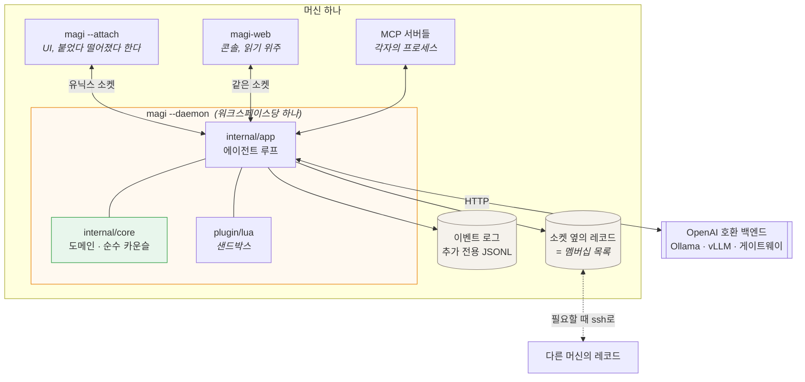
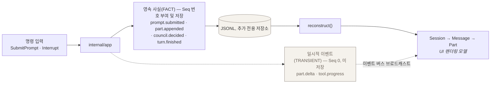
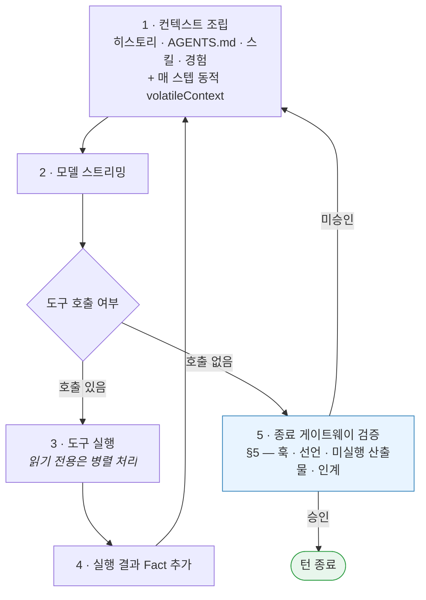
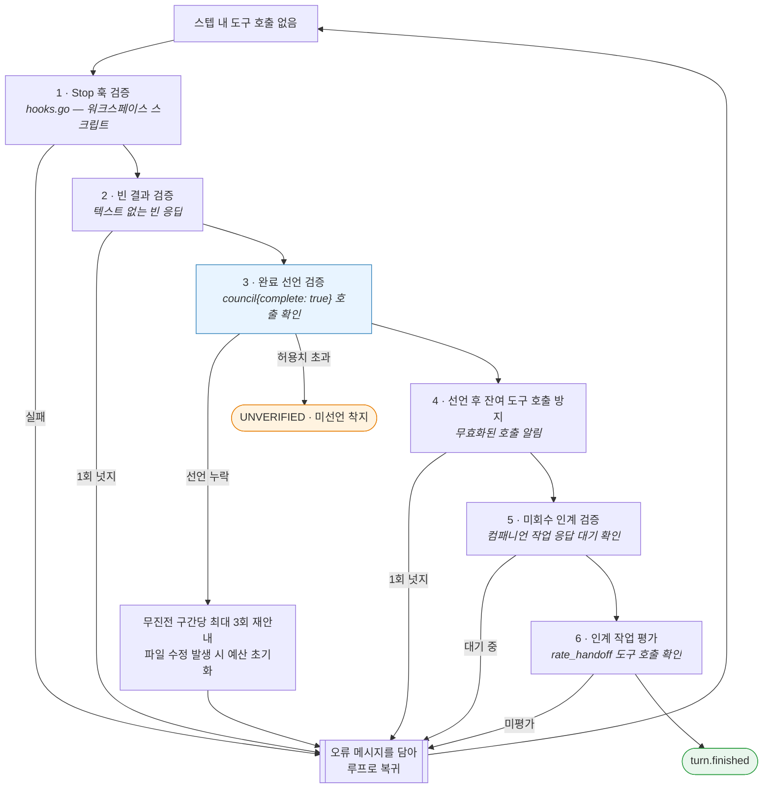
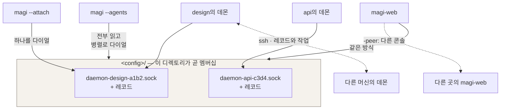

# magi — 아키텍처

[English](ARCHITECTURE.md) · [한국어](ARCHITECTURE.ko.md) · [↑ Docs](README.ko.md)

> **현행 구현 참조.** 시스템의 실제 구현 상태를 기술합니다. 초기 설계 문서와 내용이 상충할 경우 본 문서가 우선합니다.

이 문서는 magi의 **현행 구현(as-built)** 아키텍처 레퍼런스입니다. `DESIGN.md`와 `SPEC.md`는 초기 설계 의도 및 의사결정 배경(D1–D13)을 보존한 문서이며, **실제 구현과 상충할 경우 본 문서의 기술 내용이 우선합니다.**
영문 원본: [`ARCHITECTURE.md`](ARCHITECTURE.md).
시각화 다이어그램: [DIAGRAMS.ko.md](DIAGRAMS.ko.md) — 최상위 프로세스 경계(L0)부터 턴 생명주기(L1), 컴포넌트 맵(L2), 가드/게이트(L3–L4), 도메인 엔티티(L5), 포트/어댑터(L6), 실행 구조체(L7), 도구 계층(L8–L9)까지 Mermaid 다이어그램으로 시각화되어 있습니다.

magi는 단일 정적 바이너리(`CGO_ENABLED=0`)로 동작하는 크로스 플랫폼 AI 코딩 에이전트입니다. Go 코어 도메인, Bubble Tea TUI, Lua 플러그인 런타임, OpenAI 호환 LLM 프로토콜 어댑터, 이벤트 소싱 저장소, 가드레일, 그리고 합의 기반 카운슬 게이트로 구성됩니다.

계층 구조 설명에 앞서, 전체 시스템의 런타임 토폴로지(프로세스 경계, 파일 저장소, 통신 소켓)는 다음과 같습니다:



이 구조는 다음 두 가지 핵심 설계 원칙을 나타냅니다:
1. **로그 기반 상태 관리 (이벤트 소싱)**: 모든 상태는 추가 전용(append-only) JSONL 로그에 기록되며, UI는 로그의 투영(Projection)일 뿐입니다. 따라서 TUI나 웹 콘솔이 언제든 연결/해제될 수 있으며, `/rewind` 및 `/fork`와 같은 세션 조작이 가볍고 안정적으로 동작합니다.
2. **무인프라 보안 (Zero Open Ports)**: 로컬 통신은 유닉스 도메인 소켓을 이용하고, 원격 머신 간 통신은 기존 SSH 채널을 경유하므로 별도의 외부 리스닝 포트를 개방하거나 중앙 자격증명을 둘 필요가 없습니다.

**단일 에이전트 기본 원칙**: magi는 기본적으로 단일 에이전트 루프로 실행됩니다. 사전 계획 기반의 서브에이전트 계층은 프롬프트 요약 왜곡, 채점 식별자 유실, 조율 오버헤드 등 다양한 결함을 유발하는 것으로 실측되었기 때문입니다. 대신 플러그인을 통해 서브에이전트를 확장할 수 있는 최소한의 심(Seam) 인터페이스만을 제공하여, 사용자가 필요 시 명시적으로 활성화할 수 있도록 지원합니다(`/subagents`, EXTENDING §3.9). 이 경우에도 부모 컨텍스트를 자의적으로 요약하지 않고 원문 그대로 전달합니다.

<details>
<summary><b>독립 측정과 연구 배경 (서브에이전트가 도움이 되었는가에 대한 고찰)</b></summary>

그중 무엇도 magi를 측정하지 않았고, 위 문단의 근거는 여전히 이 트리의 결함 로그입니다. 여기 적는 이유는 "서브에이전트가 도움이 됐을까"라는
질문에 우리 것만이 아닌 답을 붙이기 위해서입니다.

위 선택에 **가장 강하게 반대하는** 결과부터. 검색 집약 과제(GAIA)에서 오케스트레이션은 같은 백본을 크게
이깁니다 — pass@1 66.06 → 80.00 ([AOrchestra][ao], Gemini-3-Flash). magi의 작업이 GAIA를 닮았다면 이
절은 틀린 것입니다. Anthropic도 프로덕션에서 같은 모양을 보고합니다 — 오케스트레이터-워커 구조의
리서치 시스템이 단독 Opus 4를 내부 리서치 eval에서 90.2% 상회했습니다([멀티에이전트 리서치
시스템][amrs]).

그래서 **그들이 그 결과에 그은 경계선**이 이 질문에 대해 공개된 가장 쓸모 있는 문장입니다. 그것을 만들어
출시한 팀의 말이기 때문입니다:

> 코딩은 리서치보다 진짜로 병렬화 가능한 작업이 적고, 모델은 아직 실시간으로 다른 에이전트를 조율하고
> 위임하는 데 능하지 않다.

그들이 대는 적합 기준은 독립적인 병렬 방향을 갖는 폭 우선 작업, 그리고 한 컨텍스트 윈도를 넘는 정보량
입니다. 부적합으로 명시한 것은 공유 컨텍스트가 필요하거나 에이전트 간 의존이 큰 영역이고, **코딩을 그
예시로 듭니다.** magi가 하는 일에 대한 서술이며, 반대로 주장할 이유가 충분한 사람들이 쓴 것입니다.

같은 보고서의 숫자 둘이 90.2%를 다시 읽게 만듭니다. BrowseComp에서 성능 분산의 95%를 세 변수가
설명하는데 **토큰 사용량 하나가 80%**를 설명합니다. 그리고 멀티에이전트 시스템은 챗의 약 15배 토큰을
쓰고 단일 에이전트는 4배를 씁니다. 즉 이긴 구성은 결과를 지배하는 그 변수를 구조상 훨씬 많이 쓰는
구성이기도 했고, 보고서는 그 둘을 분리하지 않았습니다.

그다음, 강제된 구조에 대한 것 하나와, 이득의 자리를 서브에이전트가 아닌 곳으로 짚는 것 둘:

- **페이즈 파이프라인 대 자유형 루프를 같은 모델로 통제한 비교** — 둘 다 Claude Sonnet 4.6, 발표된
  재료과학 결과를 재현하는 과제 — 는 클레임의 45.0%가 무승부이고 승패가 균형입니다. 구조화된 쪽이
  유의하게 높았던 축은 *과학적 엄밀성* 하나뿐이고, 여러 축에서는 오히려 낮았습니다. 저자들 자신의
  진단은 적응력입니다. 자유형 쪽이 "더 유연한 상호작용 루프를 지원"하는 반면 페이즈 설계는 긴 호라이즌
  동안 자기를 고쳐 잡지 못한다는 것입니다([재료과학 재현 연구][mat]). 이것이 무엇에 대한 증거이고
  무엇에 대한 증거가 아닌지 짚어 둡니다. 여기서 "오케스트레이션" 에이전트는 강제된 네 페이즈(읽기 전용
  계획 · 환경 준비 · 결정적 실행 · 결과 추출)이고, **서브에이전트를 띄우는 시스템이 아닙니다.** magi가
  걷어낸 파이프라인에 가장 가까운 공개 측정이라 여기 있는 것이며, 위임에 대해서는 직접 말하지
  않습니다.
- **오케스트레이터와 서브에이전트 크기에 대한 요인분해**([소형 에이전트][small]). 조심해서 읽어야
  합니다. 이 논문의 헤드라인은 오케스트레이션에 **찬성**하는 쪽이기 때문입니다 — 잘 조율된 8B
  멀티에이전트가 직접 툴을 쓰는 32B 싱글에이전트와 대등합니다(GAIA 23.0 대 23.0, AIME 55.0 대 45.0,
  GPQA·MuSiQue는 근소하게 뒤짐). 4배 작은 모델로 같은 결과입니다. 이 논문이 못 박는 것은 그것이
  **어디서 오는가**입니다. 오케스트레이터 thinking을 켜면 서브에이전트 크기는 평평합니다 — 1.7B /
  8B / 32B에 23.0 / 23.0 / 23.6. 끄면 멀티로 가는 것 자체가 "뒤섞인 결과"를 내고, 서브에이전트의
  thinking은 미미하거나 부정적입니다. 그러니 이 발견은 오케스트레이션이 실패한다는 것이 아니라,
  **오케스트레이터의 추론이 그 전부**라는 것입니다.
- AOrchestra **자신의 어블레이션**은 이득의 출처를 서브에이전트의 존재가 아니라 **오케스트레이터가
  무엇을 넘기기로 골랐는가**에 돌립니다. 서브에이전트 모델·툴·프롬프트를 고정하고 컨텍스트 필드만
  바꾸면 없음 86.00, 전부 84.00, 큐레이션 96.00. 양 극단이 둘 다 집니다.

마지막 것이 진지하게 받아들일 값이 있는 발견이고, 동시에 **여기서 한계가 가장 중요한** 발견입니다.
바로 따라오는 질문 — *무슨 기준으로 고르나?* — 에 논문이 답을 갖고 있지 않기 때문입니다. 그 컨텍스트는
오케스트레이터 LLM이 툴 호출 인자로 **쓰는 문자열**입니다. 알고리즘도, 점수 함수도, 명시된 선택 기준도
없습니다. 프롬프트 템플릿이 끌어내는 행동이 전부이고, 저자들은 절차 대신 지도학습으로 갑니다(더 강한
모델에서 복제한 궤적 2K). 그 학습이 무엇을 사줬는지에 대한 저자들 자신의 설명도 더 나은 선택이 아니라
**더 긴 호라이즌**입니다 — 시도 횟수 56% 증가. 품질은 오케스트레이터의 강함을 그대로 따라갑니다:
Qwen3-8B 56.97 대 Gemini-3-Flash 80.00.

그래서 "큐레이션이 레버다"까지는 받쳐지지만, **"그리고 이렇게 큐레이션하면 된다"는 아직 누구도
받쳐 주지 않습니다.** 요인분해와 함께 읽으면, 서브에이전트가 사주는 것은 구조라기보다 **무엇이 중요한지에
대한 강한 모델의 판단 한 번 더**에 가까워 보입니다 — 그것은 하나의 컨텍스트 안에서도 할 수 있는 일이고,
통제된 비교가 무승부로 오는 그럴듯한 이유입니다.

숫자 자체에 대한 단서 셋. 이 파일이 누군가 확인하러 오는 자리이므로 적어 둡니다. AOrchestra의 헤드라인
산수가 닫히지 않습니다(Terminal-Bench에서 주장하는 절대 64.29점 개선은 자기 수치로 18.57이고, 초록의
요약 수치도 절에 따라 16.28%와 22.13% 사이를 오갑니다). 그래서 여기서는 컨텍스트 어블레이션만
인용했습니다. 그 어블레이션도 단일 벤치 n=50이고, 가장 어려운 등급은 세 설정이 모두 같습니다 — 이득은
쉬운 쪽에 몰려 있습니다. 요인분해 쪽은 워크숍 논문(ICLR 2026 MALGAI)이고 전부 Qwen3 1.7B~32B로
돌렸으므로, "오케스트레이터가 전부"가 프런티어 규모에서도 성립하는지는 시험되지 않았습니다. 그 논문의
가장 어려운 벤치(HLE)에서는 모든 구성이 0점이었습니다. 그리고 이 주의는 양쪽을 다 벱니다. 코딩 에이전트 스캐폴드 분류 연구는
스캐폴드와 모델 효과가 충분히 교락돼 있어 **벤치 성능을 아키텍처 탓으로 돌리는 것 자체가 성립하지
않는다**고 주장합니다([스캐폴드 분류][scaf]). 그것은 오케스트레이션 논문들의 승리 주장만큼이나 이 절이
자기 정당화를 주장하는 것에도 반대하는 논거입니다.

[ao]: https://arxiv.org/html/2602.03786v2
[mat]: https://arxiv.org/pdf/2605.00803
[small]: https://arxiv.org/pdf/2601.11327
[scaf]: https://arxiv.org/pdf/2604.03515
[amrs]: https://www.anthropic.com/engineering/multi-agent-research-system

</details>

---

## 1. 계층 (헥사고날 / 포트 & 어댑터)

```mermaid
flowchart LR
    subgraph out [어댑터 — 전부 갈아끼울 수 있다]
        direction TB
        A1[tui/bubbletea]
        A2[llm/openai]
        A3[store/jsonl]
        A4[plugin/lua · mcp]
        A5[council/llm]
        A6[daemon · fleet]
    end
    subgraph mid [internal/port — 인터페이스]
        direction TB
        P1[LLMProvider]
        P2[Store]
        P3[Tool · ToolEnv]
        P4[ToolServers · FileTool]
        P5[Council]
        P6[Platform]
    end
    subgraph in [internal/core — 바깥으로 아무것도 임포트하지 않는다]
        direction TB
        C1[session · event · command]
        C2[council<br/><i>집계, 순수</i>]
        C3[bus · model · artifact]
    end
    out --> mid --> in

    style in fill:#e8f6ec,stroke:#2f9e44
    style mid fill:#f5f2ec,stroke:#8a8178
```



화살표는 한 방향뿐이고, 컴파일 타임 검사가 그것을 지킨다 — `core`에 어댑터 임포트를 넣으면 빌드가
깨집니다. 대가는 구체적입니다. 카운슬의 집계를 모델도 I/O도 없이 단위 테스트할 수 있고, TUI나 LLM
클라이언트를 갈아끼워도 안쪽은 건드리지 않습니다.

단방향 의존성 규칙은 컴파일 타임에 강제됩니다: **`adapter → app → core`**, 그리고 `app`/`adapter`는 `port`에 의존합니다. `core`는 표준 라이브러리와 core 패키지 외의 어떤 것도 import하지 않으므로, 카운슬 집계 로직을 LLM이나 외부 I/O 없이 순수 단위 테스트로 검증할 수 있고 TUI나 LLM 클라이언트를 교체해도 코어 도메인은 영향을 받지 않습니다.

```
cmd/magi/                 진입점: CLI 플래그 파싱, 의존성 주입(DI), 헤드리스 실행(-p), TUI 기동,
                          상주 데몬 모드(-daemon), 데몬 연결(-attach), 에이전트 목록 조회(-agents)
clients/web/server/       웹 콘솔: 로컬 머신 및 피어 노드의 데몬 상태를 웹 브라우저에서
                          모니터링·관리하는 대시보드(읽기 위주). 프런트엔드는 web/ui에서 컴파일되어
                          console/에 조립됨
internal/
  core/                     코어 도메인 계층 — 외부 패키지 의존성 없음
    session/                Session, Message, Part, ToolCall, ToolResult, Todo, SessionMeta
    event/                  Event 봉투, 이벤트 타입(Fact vs Transient), 페이로드 정의
    command/                도메인 커맨드 (CreateSession, SubmitPrompt, Interrupt 등)
    bus/                    세션별 인메모리 pub/sub 이벤트 브로커
    model/                  모델 레지스트리 (컨텍스트 윈도우 크기, 비용, 기능 카탈로그)
    council/                종료 판정 합의 도메인(D14): 위원, 라운드, 투표 집계 로직
    cluster/ meeting/       컴패니언 에이전트 인스턴스 및 협업 미팅 룸
    auth/ webpush/          웹 콘솔 접근 제어 및 모바일 웹 푸시 알림
    change/ rank/ embed/    파일 변경 추적, 관련도 랭킹, 시맨틱 임베딩 및 기억 회상
    cron/ lang/ text/ report/  작업 스케줄링, 언어 감지, 텍스트 포맷팅, 실행 리포트 생성
  port/                     코어가 정의하는 외부 인터페이스(port.go): LLMProvider, Store,
                            Tool/ToolEnv/FileTool, ToolServers, ExperienceStore, Platform 등
  app/                      애플리케이션 서비스, 에이전트 루프, 가드레일, 워크플로 엔진
    app.go                  App 코디네이터: 커맨드 수신 → 이벤트 발행; 세션/턴 라이프사이클 관리
    routing.go query.go     모델/프로파일 라우팅 및 권한 구성(routing.go); TUI 전용
                            읽기 인터페이스(트랜스크립트, 플랜, 관찰 기록, git diff, 셸 쿼리 등)
    config.go               Config/AgentSpec/프로파일 파싱 및 기본값 적용 로직
    todos.go                에이전트 주도 플랜 관리(todowrite) 및 턴 종료 시 상태 확정
    loop.go                 runLoop: 에이전트 실행 루프; 캐싱 친화적 시스템 프롬프트 조립;
                            스텝별 스트리밍, 영속화, 종료 판정 흐름 제어
    loop_gates.go           턴 종료 게이트웨이: Stop 훅 검증, 빈 응답 넛지, council 완료 선언 요구,
                            선언 후 유실된 호출 방지, 잔여 핸드오프 검증
    interject.go interject_queue.go
                            턴 중간 사용자 개입 처리: 개입 라우팅(applyInterjectRoute), 종료 경계
                            미니턴 분류, 세션 지속형 개입 큐
    guard.go shellcmd.go shellparse.go
                            실행 가드(runGuard): 반복 호출, 정체, 파일 자기되돌림, 무변경 쓰기,
                            실행 처닝 감지 및 무상태 셸 명령어 파서 (§4 참조)
    observed.go observed_view.go world_snapshot.go
                            실행 관찰 기록: 승인된 호출 내역 및 실제 실행 결과 추적(observed.go),
                            UI 패널 뷰(observed_view.go), 워크스페이스 스냅샷 및 활성
                            백그라운드 프로세스 모니터링(world_snapshot.go)
    council_advice.go council_events.go council_evidence.go
                            도구로서의 카운슬: 다각도 검토 심의, TUI 이벤트 스트림 전달,
                            심의용 실행 증거 취합
    execute.go permission.go prompt.go
                            도구 실행(미선언 인자 검사 포함), 권한 프롬프트, 프롬프트/컨텍스트 조립
    hooks.go                라이프사이클 훅(PreToolUse/PostToolUse/Stop) 및 내장 하네스
    workflow.go             결정적 페이즈 파이프라인 엔진 (-workflow 옵션, §6)
    policy.go               가드레일 정책 엔진 (규칙 검사, 시크릿 차단, bash 스캔, 네트워크 이그레스)
    background.go           백그라운드 비동기 프로세스 레지스트리 (§7)
    compact.go recall.go reconstruct.go scratch.go …
  adapter/
    llm/openai/             OpenAI 호환 API 클라이언트 (네이티브/프롬프트 폴백 도구 호출,
                            프롬프트 캐싱, 에러 매핑, 헤더 주입, 지수 백오프 재시도)
    store/jsonl/            추가 전용(append-only) JSONL 이벤트 저장소
    tool/builtin/           기본 내장 도구 세트 (§7) 및 OS 샌드박스 어댑터
    platform/               OS 플랫폼 추상화 (Exec, ConfigDir, DataDir, TerminalCaps 등)
    experience/git/         공유 경험/스킬 Git 저장소 연동 (D13)
    plugin/lua/             gopher-lua 기반 플러그인 런타임 (능력 확장 번들)
    mcp/                    Model Context Protocol(MCP) 클라이언트 (stdio 및 HTTP SSE 전송)
    daemon/                 유닉스 도메인 소켓 기반 데몬: Listen/Serve, flock 기반 워크스페이스별
                            인스턴스 단일성 보장, 상태 레코드 발행(Publish), 클라이언트 구현체,
                            확장 인터페이스(Controller, JobRunner, ContextTeller, ToolLister, ModelLister 등)
                            플랫폼별 소켓 파일 및 권한 처리 격리(listen_unix.go / listen_windows.go)
    fleet/                  로컬/원격 머신의 모든 magi 인스턴스 탐색 및 상태 집계
    tui/                    Bubble Tea 기반 대화형 터미널 UI: 모델 갱신(model.go),
                            입력 핸들러(model_input.go), 이벤트 처리(model_event.go),
                            라우트/프로파일 설정(model_route.go), 레이아웃(model_layout.go),
                            뷰 렌더링(model_view.go)
  atomicfile/               원자적 파일 쓰기(임시 파일 작성 후 rename) 보장 유틸리티
  httpx/                    공통 정적/동적 HTTP 헤더 관리자 (MCP 및 LLM 클라이언트 공용)
  jsonx/                    LLM 생성 비정형 JSON 복구 및 관용적 디코더
  config/                   TOML 설정 파일 로더 및 주석 보존 편집기 (SetKey)
  eval/                     벤치마크 평가 하네스 (성공률, 스텝 수, 토큰 소비량 측정)
  update/                   GitHub 릴리스 기반 자체 업데이트 유틸리티 (-update)
  version/                  빌드 버전 정보 관리
```

**모델 JSON 복구 (`internal/jsonx`).** 카운슬 판정문 및 도구 호출 인자는 LLM이 생성한 비정형 JSON 문자열이므로, 파싱 실패를 방어하기 위한 단일 전담 패키지로 처리합니다:

- **추출 (`BalancedObjects`/`BalancedArrays`)**: 산문 텍스트나 마크다운 코드 블록(```json) 내에서 유효한 JSON 후보 구간을 추출합니다.
- **복구 사다리 (`RepairCandidates` → `Unmarshal`)**: 원본 텍스트를 최우선 후보(후보 0번)로 검사한 후, 경미한 문법 결함(후행 쉼표, 문자열 내 제어 문자) 및 구조적 결함(미이스케이프 따옴표, 작은따옴표 문자열 등)을 순차적으로 복구합니다.
- **관용적 필드 타입 (`Text`, `Texts`, `Number`)**: 단일 필드의 타입 불일치로 전체 문서 파싱이 실패하는 현상을 방지하기 위해, 자유 텍스트 및 숫자 필드를 관용적 래퍼 타입으로 수신한 후 도메인 레이어에서 값 검증을 수행합니다.
- **진단 (`Diagnose`, `Report`)**: 파싱 실패 시 바이트 오프셋, 전후 문맥 창, 실패 원인(JSON 누락, 구문 오류, 스키마 불일치)을 구조화된 로그로 제공합니다.

### 아키텍처 규칙 정적 분석 (`internal/arch`)

계층 간 의존성 규칙은 CI 및 테스트 단계에서 `internal/arch` 정적 분석기를 통해 검증됩니다. 빌드 태그나 GOOS 분기 여부와 상관없이 모든 프로덕션 소스 코드를 직접 파싱하여 다음 5가지 불변식을 검사합니다:

| 규칙 | 검증 대상 및 조건 |
|---|---|
| 도메인 계층 격리 | `internal/core` 및 `internal/port`에서 외부 패키지(`internal/app`, `adapter` 등)로의 역방향 임포트 금지 |
| 애플리케이션 계층 결합 제어 | `internal/app` 내 파일 중 허용 목록에 지정되지 않은 파일의 `internal/adapter` 임포트 금지 |
| 웹 콘솔 의존 표면 고정 | `clients/web/server`가 전이적으로 의존하는 내부 패키지 집합이 사전에 정의된 표면(`consoleSurface`)과 일치하는지 양방향 검사 |
| 프로바이더 래퍼 인터페이스 준수 | 모든 LLM 프로바이더 래퍼 구현체에 `var _ port.ProviderExtras = …` 선언 강제 |
| 에러 무시 패턴 억제 | `_ = f()` 형태의 에러 무시 호출 수가 프로젝트 기준치 이하로 유지되는지 검사 |

`internal/arch`의 각 검사기는 고정된 샘플 코드를 이용해 스캐너 자체의 정상 동작 여부를 자체 검증(Self-testing)한 후 전체 소스 트리를 검사합니다.

---

## 2. 코어 데이터 모델 (`core/session`, `core/event`)

**이벤트 소싱 기반 상태 관리**: 세션과 메시지는 상태 파일로 직접 저장되지 않고, 추가 전용(append-only) 이벤트 로그로부터 재생(`reconstruct()`)되어 메모리에 투영(Projection)됩니다. 따라서 `/rewind`, `/fork`, `/replay` 등의 이력 탐색 작업이 결정론적으로 수행됩니다.



이벤트는 **영속 사실(Fact)**과 **일시적 이벤트(Transient)**로 엄격히 구분됩니다. 토큰 단위 스트리밍 델타(`part.delta`)나 진행률 노티는 이벤트 버스를 통해 UI로 실시간 전달되지만 디스크에는 기록되지 않습니다(`Seq == 0`). 반면 프롬프트 제출, 도구 실행 결과, 카운슬 판정 등 영구 보존이 필요한 상태는 번호(`Seq > 0`)를 부여받아 JSONL 파일에 추가됩니다.

세션(`Session`)은 `Message`의 순차 목록이며, 각 메시지는 `Part` 유니온 타입(`text`, `reasoning`, `tool-call`, `tool-result`, `image`, `error`)의 집합으로 구성됩니다:
- `ToolCall{CallID, Name, Args(json.RawMessage)}`
- `ToolResult{CallID, Content(json.RawMessage), IsError}`

모든 상태 변경은 **`Event`** 봉투 구조체를 통해 처리됩니다(CQRS 경량 패턴):

```go
type Event struct {
	Seq       int64             // 세션별 일련번호, Store가 append 시 부여; 0 = 일시적 이벤트
	SessionID session.SessionID
	Type      Type
	Actor     Actor
	TS        time.Time
	Data      json.RawMessage   // Type별 페이로드 구조체, event.go에 정의
}
type Actor struct { Kind ActorKind; ID string } // user | agent | system
```

`Actor.Kind`는 턴 경계 판별에 핵심적인 역할을 합니다. `ActorUser`는 새로운 턴의 시작 경계로 인식되며, 시스템 액터(`loop`, `orchestrator`, `hook`, `plugin` 등)의 개입은 턴 경계를 왜곡하지 않도록 격리됩니다.

- 이벤트 타입별 영속 여부는 `Type.IsTransient()` 메서드로 판별되며, 상세 정의는 `docs/SPEC.md`의 `F-EVENT-FACT-TRANSIENT`에 명시되어 있습니다.
- 영속화와 모델 프롬프트 주입은 분리됩니다: `reconstruct()`는 대화 복원에 필요한 이벤트 타입만 선택적으로 프롬프트 컨텍스트에 포함하며, 시스템 감사용 이벤트는 모델에 노출되지 않고 로그 파일에만 보존됩니다.

저장 경로: `<dataDir>/projects/<cwd>/<sessionId>.jsonl`.
- `Store.Read(fromSeq)`: `Seq > fromSeq`인 이벤트를 순차적으로 반환합니다.
- `Subscribe`: 실시간 이벤트 버스를 구독한 후 저장소의 과거 이벤트를 재생하며, `Seq`를 기준으로 중복을 필터링하여 레이스 컨디션을 방지합니다.

---

## 3. 포트 (`internal/port/port.go`)

### 핵심 포트 설계 원칙

시스템의 일관성과 결함 방지를 위해 포트 계층에는 다음 설계 원칙이 적용됩니다:

1. **단일 진실 공급원 (Single Source of Truth, SSOT)**: 상태 변경의 출처는 반드시 하나로 통일합니다. 예를 들어 세션의 활성 모델 정보는 메모리나 임시 버스가 아닌 이벤트 로그에 기록되는 영속 사실을 단일 출처로 취급하며, 메타 스캔이 최신 사실을 조회합니다.
2. **기능 부재와 빈 결과의 명시적 구분 (`port.ErrCapabilityAbsent`)**: 백엔드가 특정 기능을 지원하지 않는 경우와 요청 결과가 단순히 비어 있는 경우를 엄격히 구분합니다. 미지원 기능에 대해서는 `(nil, nil)` 대신 `port.ErrCapabilityAbsent`를 반환하여 호출자가 적절한 폴백이나 진단 로그를 남길 수 있도록 합니다.
3. **프로바이더 확장 인터페이스 (`port.ProviderExtras`)**: `LLMProvider`는 기본 채팅 스트리밍(`StreamChat`)만 선언하며, 모델 목록 카탈로그 조회(`ModelLister`), 컨텍스트 윈도우 크기 측정(`ContextProber`), 베이스 URL 재지정(`BaseRedirector`) 등은 `ProviderExtras` 인터페이스로 분리됩니다. 모든 프로바이더 래퍼 구현체는 컴파일 타임 검증(`var _ port.ProviderExtras = …`)을 적용하여 중간 레이어에서 부가 기능이 누락되지 않도록 강제합니다.


- **`LLMProvider`**: `StreamChat(ctx, ChatRequest) (<-chan ProviderEvent, error)`.
  `ProviderEventType` ∈ text-delta | reasoning-delta | tool-call | finish | usage | error.
- **`Store`**: `Append/Read/ListSessions/ChildSessions/Compact/Truncate`. `Compact`는 스냅샷 이벤트
  하나 뒤로 로그를 특정 seq까지 다시 쓰고, `Truncate`는 버립니다.
- **`Tool`**: `Name/Description/Schema/Execute(ctx, args, ToolEnv)`. `ToolEnv`는 툴에게 건네지는
  **능력 표면**이다 — 평범한 fs 환경보다 훨씬 넓다는 점에 유의. 툴은 **오직** 이 클로저들을 통해서만
  애플리케이션에 닿습니다. 그래서 nil 필드는 "이 런에서 이 능력은 없다"는 뜻이고, 모든 툴이 호출 전에
  nil을 확인합니다:

  ```go
  type ToolEnv struct {
    SessionID  session.SessionID
    Workdir    string          // 세션의 작업 디렉토리
    ScratchDir string          // 턴의 스크래치 디렉토리 (depth 0에서 생성)
    ScratchTmp string          // 자식 프로세스에 넘기는 TMPDIR
    Platform   Platform

    AskPermission func(callID, name string, args json.RawMessage) (bool, error)
    EmitArtifact  func(artifact.Artifact)              // 검토 대상 산출물 (D11)
    EmitProgress  func(text string)                    // 툴이 막혀 있는 동안의 라이브 노트 (wait_for)

    Council func(ctx, question string, complete bool) (string, error) // complete=종료 선언
    AskUser func(question string, options []string) (string, error)   // 대화형 전용; nil ⇒ 툴이 그렇게 말함
    RouteInterjection func(action, reason, requestID string) error     // 최상위 전용

    SetTodos     func([]session.Todo)                  // todowrite
    NoteForTurn  func(text string) error               // remember{scope:"turn"}; err = 보관 안 됨
    Propose      func(Contribution) error              // 공유 경험 (D13)
    LoadSkill    func(name string) (string, bool)      // skill
    Recall       func(query string) (string, error)    // recall_context — **이** 세션이 압축한 상세
    RecallMemory func(query string) (string, error)    // recall_memory — 세션 간 D13 저장소

    Sandbox SandboxSpec // bash용 OS 격리 (read-only|workspace-write|full)
  }
  ```

  - **`NoteForTurn`**: 턴 전용 메모(`remember{scope:"turn"}`)를 저장합니다. 큐 용량 초과 등으로 적재되지 못하면 에러를 반환하여 누락을 방지합니다.
  - **`Recall` vs `RecallMemory`**: `Recall`은 현재 세션의 컨텍스트 압축 과정에서 요약된 세부 정보를 조회하며, `RecallMemory`는 세션 간 유지되는 팀 공유 메모리(D13)를 조회합니다.
- **`ExperienceStore`** (Retrieve/Propose), **`WikiStore`** (인플레이스 위키), **`Platform`** (Exec/ConfigDir/DataDir/TerminalCaps/ProcessCPUTime), **`ContextProvider`**, **`Council`** (Deliberate), **`ToolRegistry`**, **`FileTool`**, **`MetaTool`**, **`DoctorProbe`**, **`PluginCommand`**.
- **`ToolServers`** (Attach/Detach): 실행 중인 데몬에 외부 도구 서버를 런타임에 동적으로 연결/해제하는 인터페이스입니다. 에디터 플러그인이나 오피스 애드인 등 외부 애플리케이션이 활성화되어 있는 동안 URL 기반으로 연결되며, 서버 프로세스를 직접 스폰하지 않아 안전성을 보장합니다. 세션 ID를 소유자로 지정하여 특정 세션 범위로 도구 노출을 한정할 수 있습니다.

**자식 세션 스폰 인터페이스**: 호스트 환경에 따라 `ToolEnv`에 다음 인터페이스가 주입됩니다:
- `Spawn`: 자식 에이전트를 실행합니다. 자식 내부에서는 `Spawn`이 `nil`로 설정되어 재귀 호출이 원천 차단됩니다.
- `ChildSteps`: 자식 에이전트의 실행 스텝 기록을 조회합니다.
- `RestoreChild` / `MergeChild`: 자식의 파일 변경을 롤백하거나 부모 작업 트리에 커밋 범위를 병합합니다.

자식 에이전트는 `workspace:"clone"` 옵션이 지정된 경우 로컬 Git 클론 기반의 독립 작업 공간을 할당받으며, 셸 실행은 `workspace-write` OS 샌드박스로 격리됩니다. 모든 이벤트 로그는 부모 세션의 프로젝트 네임스페이스 하위에 기록됩니다.

---

## 4. 에이전트 루프 (`app/loop.go`)

`Submit` 호출 시 `prompt.submitted` 이벤트를 append하고 비동기 실행 고루틴(`startRun`)을 시작합니다. `run` 함수는 자유형 루프(`runLoop`)를 기본으로 실행하며, `Config.Workflow` 설정 시 결정적 페이즈 엔진(§6)을 구동합니다.

**미니멀 루프 설계**: magi는 사전 고정된 복잡한 단계 파이프라인 대신, 현재 작업 상태와 모델의 자율적 판단에 기반하는 최소한의 반응형 루프 구조를 유지합니다.



스텝별 실행 흐름:

1. **컨텍스트 조립**: 마지막 압축 시점 이후의 히스토리, 프로젝트 규칙(`AGENTS.md`), 스킬, 공유 경험을 취합합니다. 캐시되는 시스템 프롬프트와 별도로, 매 스텝 동적으로 생성되는 **휘발성 컨텍스트(volatileContext)**(할 일 목록, 턴 경과 시간, `--time-budget` 잔여량, 런타임 가드 관찰 상태 `runState`)를 프롬프트에 주입합니다. 프롬프트 토큰 구성비(`event.PromptShape`: 시스템/도구/대화/호출/결과)는 턴 완료 이벤트에 영속 기록됩니다.
2. **스트리밍 수신**: 모델의 응답 스트림(텍스트 델타, 추론 토큰, 도구 호출)을 수신하고 어시스턴트 메시지를 영속화합니다. 컨텍스트 윈도우 초과 시 자동 압축 및 백엔드 타임아웃 복구 로직(`generate_step.go`)이 내장되어 있습니다.
3. **도구 실행 및 분기**: 도구 호출이 발생하면 읽기 전용 도구는 병렬로, 쓰기 및 사용자 권한 확인이 필요한 도구는 순차 실행한 후 결과를 이벤트로 기록하고 다음 스텝으로 순환합니다. 도구 호출이 없으면 종료 게이트웨이(§5)로 진입합니다.

**실행 상한 및 백스톱 (`MaxSteps`)**: 에이전트 루프는 인위적인 휴리스틱으로 조기 중단되지 않으며, 모델의 자발적 완료 선언 및 카운슬 승인, 컨텍스트 취소, 또는 외부 타임아웃에 의해 종료됩니다. 루프 폭주를 방지하기 위해 상한선 `MaxSteps`(기본값 240)를 백스톱으로 두며, 초과 시 `UNVERIFIED` 사유와 함께 턴이 정상 착지합니다.
형태의 일부로 선언하며, 소진은 정상입니다.

### 가드레일 감지 로직 (`guard.go`)

가드는 실행 상태를 관찰하고 에이전트에게 넛지(Nudge) 형태로 이상 징후를 보고하지만, 자의적으로 실행을 강제 중단하지 않습니다. 가드가 모니터링하는 핵심 신호는 다음과 같습니다:

- **반복 호출 감지**: 동일한 `(tool, args)` 호출 빈도를 추적합니다. `read` 도구는 `limit` 차이를 무시하되 `offset`을 통한 페이징은 중복으로 간주하지 않으며, 상태를 변경하지 않는 읽기/조사 전용 `bash` 호출을 모니터링합니다. 반면 상태 변화를 유발할 수 있는 실행형 bash는 제외됩니다.
- **자기되돌림 (`noteEdit`)**: 턴 내에서 수정된 파일 내용의 해시를 추적합니다. 동일 턴 내에서 이미 거쳤던 이전 상태로 파일을 되돌리는 쓰기 작업(처닝) 및 실질적인 내용 변경이 없는 쓰기를 감지하여 보고합니다.
- **실행 관찰 기록 (`observed.go`)**: 고유 실행 커맨드, 실제 프로세스 종료 코드(Exit Code), 변경된 파일 경로 목록, 중복 호출 빈도(`경로 × N`)를 있는 그대로 수집합니다. 커맨드의 의미를 자의적으로 해석하지 않고 사실 데이터만을 유지하여 카운슬 심의의 근거로 제공합니다.
- **실행 처닝 감지**: 파일 수정 후 빌드나 테스트가 수렴하지 않고 지속적으로 실패할 경우, 자원을 낭비하는 무한 루프를 방지하기 위해 `UNVERIFIED` 상태로 턴을 정상 착지시킵니다.

## 5. 턴을 끝내기 (`app/loop_gates.go`, `app/council_advice.go`)

턴은 모델이 명시적으로 완료를 선언하거나 정해진 종료 조건을 통과했을 때 종료됩니다. 모델의 침묵(도구 미호출)은 완료를 의미하지 않으며, 다음 6단계 게이트웨이를 순차적으로 검증합니다:



1. **Stop 훅 (`hooks.go`)**: 워크스페이스에 정의된 사용자 지정 스크립트를 실행합니다. 훅 실행이 실패하면 표준 출력/오류 내용을 컨텍스트에 추가하고 에이전트를 루프로 복귀시킵니다.
2. **빈 결과 검증**: 본문 텍스트가 전혀 없는 응답에 대해 1회 넛지를 제공하여 재응답을 유도합니다.
3. **완료 선언 검증**: 작업을 수행한 턴이 명시적 완료 선언 없이 멈추면 `council` 도구를 `complete: true`로 호출하도록 안내합니다. 무진전 구간당 최대 3회까지 안내되며, 이후에는 `UNVERIFIED`로 턴이 종료됩니다. 단, 실제 파일 수정이 발생하면 안내 예산 카운터가 초기화됩니다.
4. **선언 후 잔여 호출 방지**: 완료를 선언한 후 추가로 발생한 도구 호출은 실행되지 않으며, 의도치 않은 호출이 무효화되었음을 알리는 1회 넛지를 발송합니다.
5. **미회수 인계 검증**: 다른 컴패니언 에이전트에 위임한 비동기 작업 결과가 아직 수신되지 않은 경우, 결과를 대기하거나 진행 상황을 명시하도록 안내합니다.
6. **인계 작업 평가**: 수신된 인계 작업 결과에 대해 `rate_handoff` 도구를 통한 품질 평가가 수행되었는지 검증합니다.

턴 종료 시 증류 패스(선택적), 최종 사용자 개입 여부 재확인, 그리고 `turn.finished` 이벤트 발행이 수행됩니다. 진행 중이던 할 일 목록(`todos.go`)은 완료 또는 취소 상태로 정리됩니다.

### 카운슬은 툴입니다

카운슬은 턴 종료 시점에 시스템이 자동으로 소집하는 게이트가 아니라, 에이전트가 필요에 따라 명시적으로 호출하는 **도구(Tool)**입니다. 종료 경계에서 시스템이 자동으로 카운슬을 소집하던 초기 구조에서는 에이전트가 이미 판단을 내린 뒤에야 자문이 전달되었고, 헤드리스 런에서는 자문 생성과 `turn.finished` 기록이 동일한 틱에 이루어져 피드백이 실질적으로 참조되지 못하는 문제가 있었습니다.

- **`council{question}`**: 세 위원이 **동일한 실행 기록**을 서로 다른 렌즈(정확성, 검증, 완결성)로 검토하고 각자의 피드백을 전달합니다. 투표 집계 결과는 렌더링되지 않으며, 단순 다수결이 에이전트에게 강제 명령으로 작용하지 않도록 순수 자문 형태로 제공됩니다. 에이전트는 피드백에 동의하지 않고 작업을 계속할 수 있습니다.
- **`council{complete: true}`**: 에이전트가 작업 완료를 **선언합니다.** 위원들은 기록을 검토하여 종료를 승인(루프에 신호가 전달되고 일반적인 종료 경로로 진입)하거나, 미흡한 항목을 지적하여 에이전트가 작업을 지속하도록 유도합니다.

완료 선언 시 위원들에게 제공되는 정보는 단순 과거 이벤트의 재생이 아니라 **현재 워크스페이스의 신규 판독 스냅샷**입니다. 실행 로그는 "무슨 일이 발생했는가"는 기록하지만 빌드 산출물의 실제 상태, 파싱되지 않은 셸 리다이렉트, 후속 명령에 의해 삭제된 파일 등 "현재 디스크에 무엇이 남아 있는가"는 온전히 담지 못합니다. 따라서 완료 선언에는 태스크 시작 이후 변경된 파일 목록, 잦은 변경이 발생한 디렉토리 통계, 현재 실행 중인 백그라운드 프로세스, 그리고 "로그상 작성되었으나 디스크에 존재하지 않는 파일" 등 실행 기록과 실제 파일시스템 간의 불일치가 포함됩니다.

증거 목록 내에서도 **동일 도구의 반복 호출 결과는 최신 결과로 대체(supersede)**됩니다. 동일한 조회를 반복했다는 것은 이전 결과가 낡았음을 의미하므로, 최신 결과만 상세 출력을 보존하고 이전 호출은 실행 상태를 보존한 스텁으로 축약됩니다. 이는 실측에서 동일 파일의 3회 읽기 결과를 전달받은 위원들이 첫 번째의 오래된 스냅샷에 앵커링되어, 이미 정상 완료된 작업을 3라운드 연속 반려했던 결함을 방지하기 위함입니다. 증거 목록은 최상단에 시간순 정렬 및 동일 대상에 대한 최신 결과 우선 규칙을 명시합니다.

거부 판정 역시 수락과 마찬가지로 반복 한계가 존재합니다. **중간 작업 변경 없이** 반복 거부된 선언은 상한(무변경 거부 3회 연속, 턴 전체 8회)에 도달하면 `UNVERIFIED` 사유와 함께 턴이 종결됩니다. 선언 사이에 실제 파일 수정이나 실행 작업이 발생하면 카운터는 리셋됩니다.

**다각도 검토 및 독립성 한계 극복**: 동일한 실행 기록을 읽는 세 위원이 의미 있는 다면 평가를 수행하려면 서로 다른 시각에서 독립적인 판단을 내릴 수 있어야 합니다. 그러나 `[[council.member]]` 설정에서 개별 `provider`와 `model`을 지정하지 않으면 모든 위원이 동일한 세션 모델 위에서 동작합니다. 프롬프트 지시문 상의 렌즈 구분만으로는 실질적인 독립성을 확보하기 어렵습니다. 실제로 한 통제 실험에서 지시문 한 줄(렌즈)만 다르고 나머지 프롬프트가 동일한 세 위원은 **21회 시행 중 21회 모두** 이견 없이 완료(done)로 투표하여, 세 가지 독립된 의견이 아닌 단일 의견의 3개 표본에 불과함을 보여주었습니다.

이러한 현상은 대규모 언어 모델의 본질적인 특성인 **저분산 수렴(Low-variance convergence)**에 기인합니다. Anthropic의 에이전트 스웜 실험에서도 동일 가중치를 사용하는 여러 에이전트 인스턴스가 30개 중 18개에서 동일한 Git 브랜치명(`mvp-game-loop`)을 선택하고, 죄수의 딜레마에서 일제히 배신을 택하는 등 높은 상관관계를 보였습니다. 모델이 타당하다고 판단하는 잘못된 "완료" 선언은 동일 모델을 공유하는 위원들이 함께 동조하기 쉬운 오류이며, 카운슬 게이트는 바로 이 오류를 차단하기 위해 설계되었습니다.

이러한 구조적 한계를 보완하기 위해 다음 3가지 메커니즘이 추가되었습니다:

- **위원별 탐색 경로 차별화 (`core/council.Routes`)**: 세 위원이 동일한 증거를 탐색하는 순서를 다르게 설정합니다. 정확성(과제 원문 요구사항 및 최종 보고값 우선), 검증(요구된 동작 및 테스트가 실제로 실행된 시점 우선), 완결성(과제에서 언급된 모든 부가 조건 및 엣지 케이스 우선) 등 탐색 순서를 분리합니다. 이는 관할권 분할이 아닌 탐색 순서의 차별화이며, 작업을 위원별로 쪼개어 담당하는 구조에서 발생하는 사각지대(일부 위원의 무조건적 승인으로 결함이 통과되는 현상)를 방지합니다.
- **판정에 선행하는 요구사항 점검**: 위원은 최종 판정(`decision`)을 내리기 전에 요구사항 목록을 순회하며 항목별로 `SATISFIED` 또는 `UNSATISFIED`를 판정하고, **도구 실행 결과에서 추출한 실제 증거 조각**이나 `NO-EVIDENCE`를 필수 입력해야 합니다. 이 필드는 스키마 상에서 판정 필드보다 앞서 위치하여, 미리 결론을 내려놓고 사후에 논거를 끼워 맞추는 행위를 차단합니다.
- **종합 마감 검증 호출**: 세 위원의 점검 결과를 취합한 후, 상호 모순이나 누락된 요구사항을 점검하는 마감 호출을 수행합니다. 마감 호출의 판정은 **클램프(Clamp)**되어 있습니다. 즉, 완료(done) 판정을 지속(continue)으로 변경할 수는 있지만, 불승인 판정을 완료로 뒤집을 수는 없습니다. 카운슬의 주된 실패 양상이 과다 승인이므로, 불승인을 번복할 수 있는 권한을 부여하지 않음으로써 안전성을 보장합니다.

위원들이 백엔드와 모델을 공유할 경우 패널 호출 1회(세 위원의 요구사항 점검 및 판정)와 마감 호출 1회로 총 2회의 API 호출만으로 전체 심의가 완료됩니다. 여유가 있는 환경에서는 위원별로 서로 다른 백엔드 모델을 구성(`provider`/`model`)하여 독립성을 극대화할 수 있습니다.

## 6. 가드레일 & 워크플로

**가드레일 정책 (`app/policy.go`)** 은 대화형 권한 프롬프트 위에 앉습니다:

- `Tool(spec)` 허용/거부 패턴 규칙 (예: `Bash(git push:*)`, `Read(**/.env)`);
  시크릿 경로는 기본 거부다 (넘을 수 없는 바닥).
- **그 바닥이 어느 호출에 걸리는지는 이름 목록이 아니라 호출에게 묻는다.** 시크릿·가드레일 패턴은
  `read`·`write`·`edit`·`multiedit` 넷에 이름 × 글롭으로 펼쳐져 있었고, 파일 툴이 그 넷뿐인 동안에는
  정확했다. `port.FileTool`을 구현한 툴은 제 인자 중 어느 것이 파일 경로이고 그것을 쓰는지 스스로
  말하고, 같은 바닥을 지난다 — 변경 추적·편집 후 진단·경로별 반복 에포크·카운슬 증거까지, 그 이름
  셋에 매달려 있던 것 전부. 에디터 플러그인이나 슬라이드 애드인처럼 같은 워크스페이스를
  `mcp__jetbrains__edit` 같은 이름으로 고치는 툴에 걸리는 이야기다. 선언은 호출 **전에** 읽는다:
  쓴 다음에 답하는 바닥은 바닥이 아니다. 아무것도 선언하지 않은 툴은 그대로다 — 선언 없는 MCP 툴은
  여전히 danger 게이트(확인 프롬프트)를 지난다.
- bash 커맨드 스캔: 파괴적 / 셸로 파이프 / 네트워크 이그레스 / 시크릿 경로 → 프롬프트 강제(또는 거부).
  선택적 이그레스 호스트 허용 목록.
- **프로파일** = 2축: 권한(ask|auto|allow|deny) × 샌드박스(read-only|workspace-write|full),
  프리셋 `safe`/`standard`/`yolo`.
- bash용 **OS 샌드박스** (`adapter/tool/builtin/sandbox_{darwin,linux,windows,other}.go`):
  macOS seatbelt, Linux bwrap, Windows 제한 토큰(1단계). 백엔드가 없으면 우아하게 폴백합니다.
  프로파일로 옵트인.
- **프롬프트 주입 규칙**: 툴 출력은 신뢰할 수 없는 **데이터**로 다룹니다. webfetch 출력은 펜스로 감쌉니다.
- **영속 규칙 좁히기** (`persistRule`): "항상 허용(프로젝트)"을 고르면 툴이 허용하는 한 가장 좁게
  범위를 잡은 허용 규칙이 쓰입니다. bash가 아닌 툴은 `tool(**)`로 영속되고, `bash`는 승인된
  **프로그램 이름만** 영속합니다 — `curl https://x`는 `bash(**)`가 아니라 `bash(curl:*)`가 됩니다.
  `safeCommandPrefix`(첫 argv 단어; 커맨드가 셸 메타문자로 시작해 고정할 프로그램이 없으면 빈 값이라
  영속하지 않습니다)를 통해서입니다. 한 번의 승인이 이후 모든 커맨드를 조용히 선승인할 수 없습니다.

**비가역적 명령어 게이트웨이 (`app/irreversible.go`)**: 대상 경로의 범위를 기반으로 비가역적 파일 삭제를 제어합니다. 워크스페이스 내부의 삭제는 작업의 일환으로 허용되지만, 워크스페이스 외부 경로를 대상으로 하는 삭제는 사용자의 명시적 승인을 요구합니다. 단, 임시 디렉토리(`/tmp`, `/var/tmp`, `$TMPDIR`) 및 이번 세션 실행 중에 신규 생성된 파일은 예외로 처리됩니다.

**비버전 관리 워크스페이스의 백업 보호 (`app/trash.go`)**: Git 저장소가 존재하지 않는 환경에서는 삭제 명령 실행 전 카운슬을 통해 안전성을 재확인합니다. 또한 파일 편집 시 기존 내용을 하드링크로 보존하여 디스크 낭비 없이 턴 시작 시점의 원본 상태를 보존하며, 임시 보존 파일은 다음 턴 시작 시 순환 정리됩니다.

**결정적 워크플로 엔진 (`app/workflow.go`, `-workflow` 옵션)**: 태스크를 코드로 강제되는 결정적 파이프라인으로 실행합니다:
`localize`(탐색/읽기) → `implement`(코드 수정) → `verify`(빌드/테스트 검증) → `review`(코드 검토) → `summarize`(요약 보고). 각 페이즈는 제한된 도구 세트로 실행되며, `implement`와 `verify` 단계는 검증 커맨드가 통과할 때까지 최대 반복 횟수(`WorkflowMaxLoops`) 내에서 순환합니다.

---

## 7. 툴 (`adapter/tool/builtin`)

기본 내장 도구 세트(`builtin.Default()`, 24종):
`read`, `write`, `edit`, `multiedit`, `grep`, `glob`, `list`, `bash`, `bash_output`, `bash_kill`, `bash_input`, `wait_for`, `port_owner`, `todowrite`, `council`, `webfetch`, `websearch`, `remember`, `skill`, `recall_context`, `recall_memory`, `label`, `search_sessions`, `schedule`.
(단, `port_owner`는 OS 수준에서 TCP 소켓 정보를 조회할 수 있는 환경(`/proc` 또는 `lsof`)에서만 활성화됩니다.) 대화형 런에는 오케스트레이션 도구(`ask_user`, `route_interjection`)가 추가 등록됩니다.

**도구 선별 기준**: 표준 셸 파이프라인(`bash`)으로 충분히 수행 가능한 단순 가공 도구는 제거하고, 세션 상태 추적, 자기되돌림 감지, 카운슬 증거 수집에 필수적인 도구만을 코어에 유지합니다:

| 제거된 도구 | 제거 사유 및 대체 수단 |
|---|---|
| `tabulate`, `countmatches`, `countlines`, `groupby` | `wc -l`, `grep -c`, `sort \| uniq -c` 등 표준 셸 명령으로 대체 |
| `findcontext` | `grep`, `glob` 조합으로 대체 |
| `lsp`, `lsp_diagnostics` | 에이전트 도구에서 제외; 편집 후 자동 백그라운드 진단(`AutoDiagnose`)으로만 유지 |
| `astgrep` | `grep` 및 컴파일러 에러 피드백으로 대체 |
| `replan` | 정체 가드가 실제 코드 변경 및 커맨드 실행을 진전으로 자동 인식하므로 명시적 도구 불필요 |

**도구별 주요 메커니즘**:
- **백그라운드 프로세스**: `bash`를 `background=true`로 호출하면 분리된 서브프로세스를 시작하고 ID를 반환합니다(`bgproc.go`). `bash_output`으로 출력을 폴링하고 `bash_kill`로 종료합니다.
- **포트 충돌 해소 (`port_owner`)**: 특정 TCP 포트를 점유 중인 프로세스를 식별하고 종료합니다(Linux: `/proc/net/tcp` 및 `/proc/<pid>/fd`, macOS: `lsof`).
- **편집 후 자동 진단**: 파일 수정 후 백그라운드에서 언어별 진단(Go: `gofmt`/`go vet`, Python: `py_compile`, 기타: stdio LSP 클라이언트)을 실행하여 에러와 경고를 도구 결과에 첨부합니다.
- **파일 편집 및 매칭 (`edit`)**: 정확 일치, 줄바꿈 정규화, 후행 공백 관용을 적용한 텍스트 매칭(`old`/`new`) 및 줄 번호 기반 앵커(`at`/`to`)를 지원합니다. 변경 주석에 자리표시자나 생략 표현이 포함된 경우 비차단 권고를 반환합니다.
- **셸 실행 환경**: Debian/Ubuntu 등에서 `/bin/sh`가 `dash`로 동작하여 발생하는 비호환성을 방지하기 위해 `/bin/bash`를 우선 사용합니다. 또한 파이프라인 중간 단계의 실패를 감지하기 위해 `PIPESTATUS`를 별도로 캡처하여 FAILED 상태를 판별합니다.

도구 추가는 `port.Tool` 인터페이스를 구현하고 `builtin.Default()`에 등록하거나 Lua 플러그인/MCP 서버로 확장할 수 있습니다.

---

## 8. LLM 어댑터 (`adapter/llm/openai`)

단일 OpenAI 호환 클라이언트를 통해 Ollama, LiteLLM, vLLM, OpenAI 등 다양한 백엔드를 지원합니다:

- **도구 호출 처리**: 네이티브 `tool_calls` 스트림 누적 및 도구 호출을 지원하지 않는 모델을 위한 프롬프트 기반 폴백 메커니즘 제공.
- **프롬프트 캐싱**: 시스템 프롬프트 및 도구 정의 블록에 `cache_control: ephemeral` 적용 (기본 활성화, `-no-cache` 옵션 지원). 비지원 백엔드에서 400/422 수신 시 일반 텍스트로 자동 폴백.
- **오류 분류 및 재시도**: HTTP 상태 코드 기반 원인 매핑(`describeStatus`: 401 인증, 404 엔드포인트/모델, 429 레이트 리밋, 502/503 게이트웨이, 504 타임아웃) 및 `Retry-After` 헤더를 준수하는 지수 백오프 재시도.
- **모델 카탈로그 조회**: `ListModels`(`-list-models`)를 통해 백엔드 `/v1/models` 엔드포인트에서 지원 모델 목록을 조회.

---

## 9. CLI & 설정

CLI 플래그(`cmd/magi/main.go`, `MAGI_*` 환경변수 지원):
`-p`(헤드리스 실행), `-output text|json`, `-model`, `-base-url`, `-permission`(ask|auto|allow|deny), `-profile`(safe|standard|yolo), `-workflow`, `-verify-cmd`, `-no-cache`, `-http-timeout`, `-plugins`, `-list-models`, `-theme`, `-no-harness`, `-update`, `-version`, `-doctor`, `-time-budget`, 그리고 상주 프로세스용 `-daemon`, `-attach`, `-agents`, `-join`(§11).
API 키는 `MAGI_API_KEY` 또는 `OPENAI_API_KEY` 환경변수로 전달합니다.

웹 콘솔(`clients/web/server`): `-addr`, `-config-dir`, `-workdir`, `-peer name=url`, `-version`, `-emit-demo <dir>` 지원.

설정 계층 구조: 전역 `<configDir>/config.toml` + 프로젝트별 `.magi/config.toml` (Git 커밋 가능. 프로젝트 설정이 전역 설정을 오버라이드하며, 훅과 규칙은 병합됨).

---

## 10. 빌드, 테스트, 실행

```
make build           # go build ./...
make test            # go test ./...           (백엔드에 닿지 않으면 E2E + eval 자동 스킵)
make test-race       # go test ./... -race
make vet / make fmt
make cover           # 커버리지 (내부 eval 제외, //coverage:ignore 표식 제외, 패키지별 표)
make snapshot        # goreleaser --snapshot (로컬 크로스 컴파일)
```

- **단위/결정적 테스트**는 가짜 `LLMProvider`를 쓴다(모델 불필요) — `internal/app`과
  `internal/adapter/...` 테스트의 대부분.
- **실모델 E2E**(`Test*E2E*`)는 살아 있는 백엔드를 때리며, 환경변수로 게이팅되고 닿지 않으면
  자동 스킵됩니다: `MAGI_E2E_OLLAMA_BASE`, `MAGI_E2E_OLLAMA_MODEL`, `MAGI_E2E_API_KEY`.
- **Eval 하네스**(`internal/eval`): `MAGI_EVAL_BASE/_MODEL/_KEY` → `go test -run TestEvalSuite
  ./internal/eval -v`가 점수 표를 찍는다(모델 간 비교용).
- **커버리지 예외**: 아무 테스트도 닿을 수 없는 함수 — 프로세스 진입점, 인터페이스를 만족시키려
  존재하는 한 줄 어댑터, 하는 일이 아무것도 없는 것이 계약인 싱크 — 는 함수 자리에 사유와 함께
  `//coverage:ignore`를 붙이고 `tools/covignore`가 프로파일에서 걷어냅니다. 사유 없는 표식은 거부되고,
  표식이 붙은 함수의 문장이 **실행되면** 에러다(무언가 그것을 테스트하고 있다는 뜻이므로). 로직이
  있는데 테스트가 없는 함수에 이 표식을 붙이는 것은 이 도구의 유일한 오용입니다.
- CI(`.github/workflows/ci.yml`)가 ubuntu+macos+windows에서 build/vet/test를 돌린다(fail-fast 끔).
  릴리스(`release.yml`)는 `v*` 태그에 goreleaser를 돌립니다.

로컬의 약한 모델이 신뢰성의 중심 제약입니다. 회귀 커버리지에는 결정적 가짜 LLM 테스트를 우선하고,
실모델 E2E는 게이팅된 확인용으로 씁니다.

---

## 11. 터미널 하나를 넘어서 — 데몬, 플릿, 콘솔

세 조각 모두 이미 있던 것 위의 얇은 층입니다. 어느 것도 서비스가 아니다: 스케줄러도, 레지스트리도,
엔진의 두 번째 사본도, 자기만의 상태도 없습니다.

```
magi -daemon          UI 없는 App이 <config>/daemon-<dir>-<hash>.sock에서 대기
  ├── magi -attach    데몬의 세션에 합류하는 TUI. 실행을 건드리는 다섯 호출만 소켓으로 가고
  │                   나머지는 같은 스토어에서 자기가 답한다
  ├── magi --agents   데몬당 한 줄(fleet.List)
  └── magi-web        콘솔(fleet.ListCached + 같은 소켓 호출)
        └── -peer     또 다른 magi-web을 같은 목록에 합침
```

그것이 가능한 이유는 멤버십이 어디 사는가에 있습니다. 누구도 누가 존재하는지 통보받지 않습니다. 데몬마다
자기 소켓 옆에 작은 레코드를 쓰고, **그 디렉토리 목록이 곧 답**입니다:



이 설계가 사준 결과 셋만 적어둡니다. 먹통이 된 데몬은 `--agents`에서 한 줄을 차지할 뿐 전체를 멈추지
않고(모든 다이얼이 짧은 데드라인으로 병렬입니다), 콘솔이 죽어도 아무것도 함께 죽지 않으며, 한 시간 넘게
안 보인 머신은 그냥 잊힌다 — 등록 절차가 없으므로 등록 해제 절차도 없습니다.

- **소켓 이름은 워크스페이스에서** 심링크까지 해소해 만듭니다. "여기의 데몬"이 잘 정의되고
  `--attach`가 옆 디렉터리의 것을 잡을 수 없습니다. `Listen`은 Publish보다 **먼저** flock으로 소켓을
  claim합니다 — 이 분리가 있는 이유는, 먼저 publish 하던 시절에 동시 기동 둘이 서로의 레코드를
  덮어쓰고 나가면서 승자의 것을 지웠기 때문입니다.
- **플릿 상태는 기록이 아니라 유도입니다.** 무엇을 하는 중인지, 권한을 기다리는지, 마지막으로 움직인
  게 언제인지, 끝나지 않은 턴이 있는지, 사람이 턴 중간에 무슨 말을 했는지 — 전부 이벤트 로그와
  소켓당 700ms 병렬 프로브에서 나옵니다. 상태 파일을 쓰는 곳이 없으니 낡을 수도 없고, 지난주에 돈
  세션에 대해서도 같은 답이 나옵니다. `fleet.Cache`는 비싼 한 조각(놀고 있는 에이전트가 마지막으로
  한 말)만, 그것도 시퀀스 번호가 그대로인 동안만 들고 있습니다.
- **콘솔은 읽고, 데몬이 합니다.** `magi-web`은 같은 스토어 위에 **LLM도 툴도 없는** 자기 `app.App`을
  만듭니다 — 실수로도 턴을 돌릴 수 없습니다. 실행을 바꾸는 모든 것(submit·steer·interrupt·권한 응답·
  forget)은 그것을 소유한 데몬으로 갑니다.
- **페더레이션은 합성입니다.** 여러 머신을 보는 콘솔은 여러 콘솔을 읽는 콘솔입니다: `/fleet`,
  `/skills`가 곧 와이어 포맷이고, 액션은 메서드·경로·대상 소켓·폼 바디만 복사해
  전달됩니다. 피어 URL은 운영자에게서만 옵니다 — 페이지나 다른 피어의 응답에서 오지 않습니다. 한 층
  아래의 `?d=` 허용목록과 같은 규칙입니다.
- **컴패니언 에이전트 협업 및 플릿 주소 체계** (`internal/adapter/tool/companion`, MANUAL §13): 컴패니언은 이름, 역할, 팀 정보를 데몬 레코드 파일에 발행하여 멤버십을 형성합니다. 별도의 중앙 등록소 없이 설정 디렉토리의 레코드 파일 목록으로 멤버십을 관리합니다. 도구 계층은 등록된 컴패니언 목록을 조회하고, 역량을 확인하며, 작업을 위임하고 회수된 답변의 품질을 기록합니다. 후보 컴패니언의 선택은 모델이 직접 수행하며, 도구는 모호한 요청을 거부합니다.
- **작업 부하 기반 팀 라우팅**: 팀 주소로 수신된 작업은 현재 대기 큐와 실행 상태를 기반으로 가장 여유가 있는 멤버에게 우선 분배되며, 동점일 경우 선출된 허브 멤버로 라우팅됩니다. 허브는 설정 플래그가 아닌 활성 컴패니언 중에서 동적으로 선출됩니다.
- **호출 깊이의 구조적 제한**: 컴패니언에게 위임된 작업은 다시 다른 컴패니언에게 재위임될 수 없습니다. 이 규칙은 트랜스크립트 라벨에 기반하므로 재시작, 어태치, 세션 재개 상황에서도 불변식이 유지됩니다.
- **작업 공간 단일 라이터(Single Writer) 불변식**: 워크스페이스당 쓰기 권한을 갖는 실행 턴은 동시에 하나만 허용됩니다. 충돌을 방지하기 위해 파일 수정이 발생하는 턴은 순차 대기열을 거칩니다. 반면 파일 수정이 없는 단순 조회 요청(`hand_off{looking: true}`)은 `LookingAgent` 곁세션을 통해 읽기 전용 도구 세트(`read`, `glob`, `grep`, `list`)만으로 기존 턴과 경합 없이 즉시 처리됩니다. 컴패니언이 처리 중일 경우 최대 4개까지 작업을 대기 큐에 적재하며, 접수 시점에 영수증을 발급하고 작업 시작 시점의 로그 오프셋을 기준으로 결과를 바인딩하여 오답 혼선을 방지합니다.
- **부하 지표 영속화 (`<socket>.load`)**: 실시간 큐 대기 수 및 최근 처리 시간 통계를 기록하여 라우팅 결정 및 사후 병목 분석에 활용합니다. 지표는 데몬 종료 후에도 유지되며 1개월 동안 감쇠 보존됩니다.
- **SSH 터널 기반 원격 노드 연동** (`--fleet-door`): 분산 머신 간 통신은 별도의 공개 포트 개방이나 중앙 자격증명 관리 없이 SSH 파이프(`magi --fleet-door`)를 경유합니다. 프로토콜은 상태 조회, 작업 위임, 결과 조회, 이벤트 스트리밍(`watch`) 4가지 메서드로 최소화되어 있습니다. 원격 데몬이 상태 변화를 스트리밍 파이프로 푸시하므로 폴링 주기 지연 없이 실시간으로 응답을 수신합니다.
- **가십 기반 클러스터 멤버십** (`cluster.json`, `internal/core/cluster`): 머신 간 상태는 주기적인 가십 교환을 통해 유지됩니다. 한 번의 SSH 교환으로 클러스터에 참여하며, 각 데몬은 매 분 2개 호스트와 상태를 교환합니다. 5분 이상 응답이 없으면 작업 분배 대상에서 제외되고, 1시간 이상 미확인 시 클러스터 목록에서 자동 제거됩니다.
- **모델 호출 전용 연결 분리**: 콘솔은 데몬당 클라이언트 하나를 유지하고 왕복 전체에 뮤텍스를 획득하므로, 수 초가 소요되는 모델 호출 동안 해당 컴패니언에 대한 일반 조회가 차단될 수 있습니다. 실측 결과 커밋 메시지 초안 생성 중 파일 트리 조회가 평상시 유휴 0.6ms 대비 2.7s로 지연되는 병목이 관찰되었습니다. 이를 방지하기 위해 모델을 구동하는 5개 엔드포인트(`/look`, `/git-msg`, `/pr-msg`, `/git-pr`, `/compact`)는 독립된 전용 소켓 연결을 열어 처리 후 닫습니다.
- **단일 브라우저 연결 최적화**: 브라우저는 단일 호스트당 최대 6개의 동시 HTTP 연결을 허용하며 SSE 스트림은 연결을 지속 점유합니다. 창당 대화와 로스터 스트림 2개를 사용할 경우 3개 창만으로 브라우저 연결 예산(6개)을 모두 소진하여 이후 일반 요청이 무한 대기하는 현상이 실측되었습니다(3번째 창의 초기 fetch 미응답, 6번째 창의 문서 로드 실패). 따라서 로스터 업데이트는 대화 이벤트 스트림 내의 프레임으로 통합하고, 비활성화된 탭은 스트림을 해제하며 포커스 복귀 시 화면을 재동기화합니다.
- **웹 콘솔 엔드포인트 구성**: 콘솔이 제공하는 모든 경로는 데몬의 로그 및 레코드에서 파생되거나 위임됩니다: `/fleet`(목록), `/events`(트랜스크립트 스트림), `/context`, `/plan`, `/handoffs`(컴패니언 개별 로그), `/skills`, `/forget`, `/remember`(감독 루프 제어), `/history`, `/search`(과거 작업 이력 검색), `/cron`(스케줄링), `/mcp`(외부 도구 서버 관리), `/report-format`(보고서 서식), `/tools`, `/model`(데몬의 도구 및 모델 카탈로그), `/loop`(턴 다이어그램 및 포크 diff), `/console`(콘솔 식별 정보), `/push`, `/sw.js`(웹 푸시 알림). 실행을 변경하는 7개 명령(`/submit`, `/interrupt`, `/answer`, `/dispatch`, `/compact`, `/shell`, `/model`)은 해당 세션을 관할하는 데몬으로 프록시 전달됩니다.
- **정적 자산 자체 임베딩**: UI 폰트, RxJS 번들(`clients/web/server/vendor`), 다국어 리소스(`clients/web/server/i18n`)를 Go 바이너리에 직접 임베드하여 서빙합니다. 외부 CDN에 일체 의존하지 않으므로 외부 네트워크가 차단된 폐쇄망 환경에서도 독립적으로 실행되며, 사용자의 접근 정보가 외부로 유출되는 것을 원천 차단합니다. 정적 데모 사이트가 필요한 모든 자산을 포함하는지 테스트 하네스를 통해 자동 검증합니다.
- **접근 제어 게이트웨이** (`clients/web/server/gate.go`): 모든 HTTP 엔드포인트는 권한 매핑 정책(`internal/core/auth`)에 따라 인가됩니다. GET 요청은 `read`, 쓰기 요청은 해당 기능 권한을 요구하며, 매핑 테이블에 정의되지 않은 라우트는 거절됩니다. 기본적으로 로컬 루프백(`127.0.0.1`) 주소에만 바인딩되어 외부 노출을 차단합니다. 원격 접근용 `-exposed` 플래그 활성화 시 임의 커맨드 실행 경로(`/shell` 및 MCP 쓰기)가 비활성화되며, 모든 요청은 교차 출처 차단 계층 외부에서 감사 로그(`console-audit.jsonl`)에 영속 기록됩니다.

---

## 12. 확장 지점

> 단계별 실전 확장 가이드: [`EXTENDING.md`](EXTENDING.md) 및 [`EXTENDING.ko.md`](EXTENDING.ko.md).

- **Lua 플러그인** (`adapter/plugin/lua`, `-plugins <dir>`): 도구 및 생명주기 훅을 번들링하여 런타임에 동적으로 주입(핫 리로드 지원). 네트워크 및 전송 계층 인증에는 사용되지 않습니다.
- **MCP (Model Context Protocol)** (`adapter/mcp`, `config.toml [mcp]`): stdio 및 HTTP SSE 기반의 외부 도구 서버 연동. `port.ToolServers` 인터페이스를 통해 런타임에 동적으로 서버를 연결할 수 있으며, 이미지 산출물 저장 및 세션별 도구 스코핑을 지원합니다.
- **라이프사이클 훅** (`config.toml [[hooks]]`): `PreToolUse`, `PostToolUse`, `Stop` 이벤트 발생 시 지정된 POSIX 셸 명령을 트리거합니다.
- **카운슬 어댑터**: `port.Council` 인터페이스(`Deliberate`)를 구현하여 기본 LLM 기반 3인 합의 메커니즘 외의 독자적인 정적 분석이나 외부 검증 엔진으로 교체할 수 있습니다.
- **HTTP 클라이언트 확장**: 기업용 프록시, mTLS, OIDC 기반 커스텀 인증 헤더 주입은 Go 표준 `http.RoundTripper`(`openai.WithHTTPClient`)를 통해 확장합니다.
