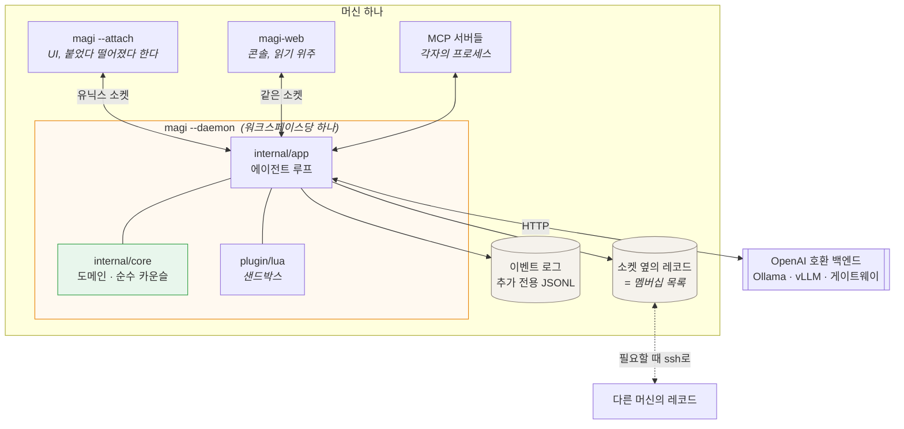
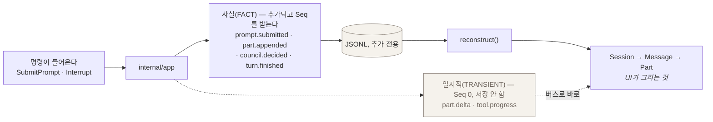
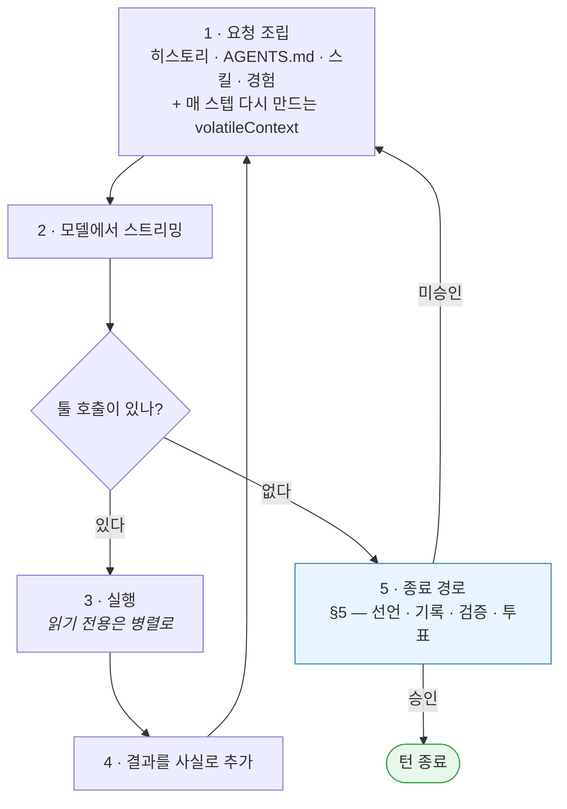
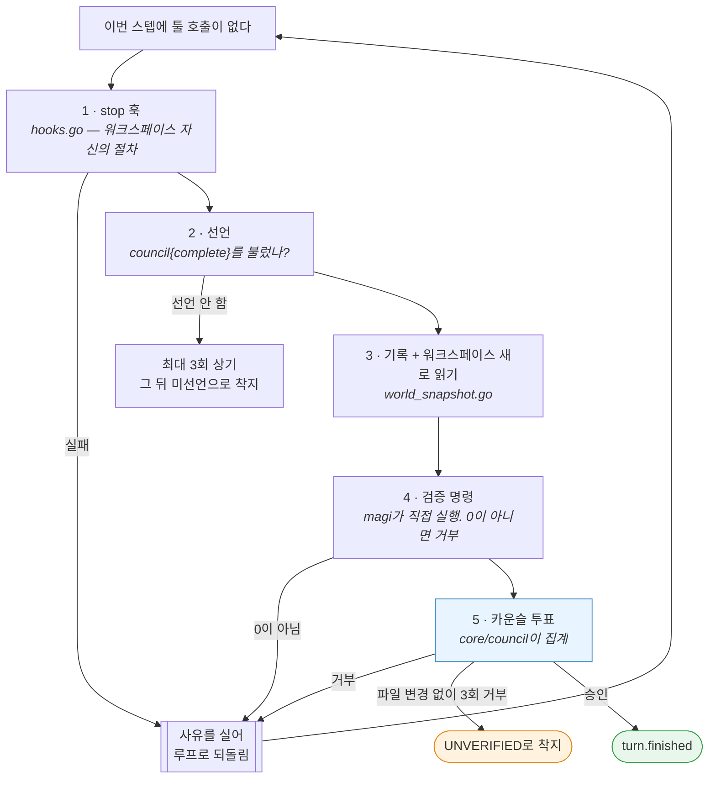
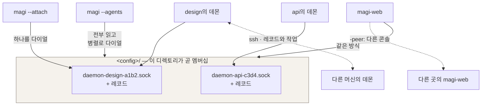

# magi — 아키텍처

[English](ARCHITECTURE.md) · [한국어](ARCHITECTURE.ko.md) · [↑ Docs](README.ko.md)

> **현행 참조.** 지어진 그대로의 시스템. 설계 문서와 어긋나면 이 문서가 이깁니다.

이 문서는 magi를 개발하기 위한 **as-built(실제로 지어진 대로)** 레퍼런스입니다. `DESIGN.md`와
`SPEC.md`는 최초 설계 의도이며(근거와 결정 D1–D13을 남겨두기 위해 보존),
**이 문서와 어긋나면 이 문서가 이깁니다.**
영문 원본: [`ARCHITECTURE.md`](ARCHITECTURE.md).
그림으로 보는 짝: [DIAGRAMS.ko.md](DIAGRAMS.ko.md) — 최상위 컨테이너에서 **클래스 다이어그램**까지
한 축으로 내려갑니다. L0 프로세스 경계, L1 턴 생명주기, L2 컴포넌트 맵, L3–L4 넛지/게이트와
모델 I/O 가드 흐름, L5 코어 도메인 타입, L6 포트 → 어댑터, L7 `internal/app` 구조체,
L8 툴 계층, L9 툴 호출 하나의 시퀀스. 전부 mermaid다.

magi는 확장 가능한 터미널 AI 코딩 에이전트입니다: Go 코어, Bubble Tea TUI, Lua 플러그인,
OpenAI 호환 LLM 접근(Ollama/LiteLLM 등), 이벤트 소싱 저장소, 가드레일, 에이전트가 **툴로 부르는**
자문 카운슬, 그리고 선택적으로 켜는 결정적 워크플로 엔진. 단일 정적 바이너리(`CGO_ENABLED=0`),
크로스 플랫폼.

계층 규칙보다 먼저, 돌아가는 물건의 모양 — 무엇이 프로세스이고, 무엇이 파일이며, 무엇이 소켓을
건너는가:



이 그림의 두 가지가 설계의 대부분을 설명합니다. **로그가 곧 상태다** — UI는 그것의 투영이고, 그래서
붙였다 떼는 데 비용이 없고 `/rewind`나 `/fork`가 평범한 조작입니다. 그리고 **아무것도 포트를 열지
않는다** — UI는 유닉스 소켓으로, 머신끼리는 ssh로 닿으므로 magi는 자격증명을 갖지 않고 여는 것이 없습니다.

**기본값은 에이전트 하나입니다.** magi는 예전에 서브에이전트를 띄우고 큐레이션된 브리프로 작업을 나눠줬습니다.
기록된 런 어디에서도 그것이 결과를 낫게 만들었다는 증거가 없고, 결함 기록의 상당수가 바로 거기서
나왔다 — 채점 식별자가 사라질 때까지 패러프레이즈된 브리프, 자기 몫으로 조립된 체크리스트를 끝내
받지 못한 워커, 세션 id가 버려져 작업을 건져낼 수 없었던 죽은 탐색자. 그것은 사라졌고, 언제 그것을
쓸지 정하던 플래너도 함께 사라졌습니다.

사라지지 **않았고 의도적으로 되돌린 것**은 심(seam)입니다: 플러그인이 서브에이전트를 선언할 수 있고
사용자가 켤 수 있다(`/subagents`, EXTENDING §3.9). 이 구분이 요점 전부입니다. 위 결함 목록은 전부
magi가 **모델을 대신해** 무엇을 떼어내고 무엇을 넘길지 정한 데서 나왔고, 심은 그 어느 것도 정하지
않습니다. 프롬프트는 플러그인 작성자가 쓰고, 브리프는 툴 자신의 인자이며, magi는 한 바이트도
고치지 않고 통과시킵니다. magi는 에이전트를 하나도 싣지 않습니다. `plugins/examples/crew`가
하나를 쓰면 어떤 모양인지 보여 주는 예시이고, 설치해야 씁니다.

**독립 측정은 무엇을 말하나 — 위 판단과 어긋나는 것까지.** 그중 무엇도 magi를 측정하지 않았고, 위
문단의 근거는 여전히 이 트리의 결함 로그입니다. 여기 적는 이유는 "서브에이전트가 도움이 됐을까"라는
질문에 우리 것만이 아닌 답을 붙이기 위해서입니다.

위 선택에 **가장 강하게 반대하는** 결과부터. 검색 집약 과제(GAIA)에서 오케스트레이션은 같은 백본을 크게
이깁니다 — pass@1 66.06 → 80.00 ([AOrchestra][ao], Gemini-3-Flash). magi의 작업이 GAIA를 닮았다면 이
절은 틀린 것입니다.

그다음, 이득이 없다고 보고한 것 하나와, 이득의 자리를 서브에이전트가 아닌 곳으로 짚는 것 둘:

- **같은 모델로 통제한 비교** — 오케스트레이션 에이전트 대 Claude Code, 둘 다 Claude Sonnet 4.6 — 는
  실제 엔지니어링 작업에서 클레임의 45.0%가 무승부이고 승패가 균형입니다. 끝단 이득이 없습니다.
  오케스트레이션이 유의하게 높았던 축은 과제 성공률이 아니라 *과학적 엄밀성* 하나였습니다
  ([재료과학 재현 연구][mat]).
- **오케스트레이터와 서브에이전트 크기에 대한 요인분해**([소형 에이전트][small]). 조심해서 읽어야
  합니다. 이 논문의 헤드라인은 오케스트레이션에 **찬성**하는 쪽이기 때문입니다 — 잘 조율된 8B
  멀티에이전트가 직접 툴을 쓰는 32B 싱글에이전트와 대등합니다(GAIA 23.0 대 23.0, AIME 55.0 대 45.0,
  GPQA·MuSiQue는 근소하게 뒤짐). 4배 작은 모델로 같은 결과입니다. 이 논문이 못 박는 것은 그것이
  **어디서 오는가**입니다. 오케스트레이터 thinking을 켜면 서브에이전트 크기는 평평합니다 — 1.7B /
  8B / 32B에 23.0 / 23.0 / 23.6. 끄면 멀티로 가는 것 자체가 "뒤섞인 결과"를 내고, 서브에이전트의
  thinking은 미미하거나 부정적입니다. 그러니 이 발견은 오케스트레이션이 실패한다는 것이 아니라,
  **오케스트레이터의 추론이 그 전부**라는 것입니다.
- AOrchestra **자신의 어블레이션**은 이득의 출처를 서브에이전트의 존재가 아니라 **오케스트레이터가
  무엇을 넘기기로 골랐는가**에 돌립니다. 서브에이전트 모델·툴·프롬프트를 고정하고 컨텍스트 필드만
  바꾸면 없음 86.00, 전부 84.00, 큐레이션 96.00. 양 극단이 둘 다 집니다.

마지막 것이 진지하게 받아들일 값이 있는 발견이고, 동시에 **여기서 한계가 가장 중요한** 발견입니다.
바로 따라오는 질문 — *무슨 기준으로 고르나?* — 에 논문이 답을 갖고 있지 않기 때문입니다. 그 컨텍스트는
오케스트레이터 LLM이 툴 호출 인자로 **쓰는 문자열**입니다. 알고리즘도, 점수 함수도, 명시된 선택 기준도
없습니다. 프롬프트 템플릿이 끌어내는 행동이 전부이고, 저자들은 절차 대신 지도학습으로 갑니다(더 강한
모델에서 복제한 궤적 2K). 그 학습이 무엇을 사줬는지에 대한 저자들 자신의 설명도 더 나은 선택이 아니라
**더 긴 호라이즌**입니다 — 시도 횟수 56% 증가. 품질은 오케스트레이터의 강함을 그대로 따라갑니다:
Qwen3-8B 56.97 대 Gemini-3-Flash 80.00.

그래서 "큐레이션이 레버다"까지는 받쳐지지만, **"그리고 이렇게 큐레이션하면 된다"는 아직 누구도
받쳐 주지 않습니다.** 요인분해와 함께 읽으면, 서브에이전트가 사주는 것은 구조라기보다 **무엇이 중요한지에
대한 강한 모델의 판단 한 번 더**에 가까워 보입니다 — 그것은 하나의 컨텍스트 안에서도 할 수 있는 일이고,
통제된 비교가 무승부로 오는 그럴듯한 이유입니다.

숫자 자체에 대한 단서 셋. 이 파일이 누군가 확인하러 오는 자리이므로 적어 둡니다. AOrchestra의 헤드라인
산수가 닫히지 않습니다(Terminal-Bench에서 주장하는 절대 64.29점 개선은 자기 수치로 18.57이고, 초록의
요약 수치도 절에 따라 16.28%와 22.13% 사이를 오갑니다). 그래서 여기서는 컨텍스트 어블레이션만
인용했습니다. 그 어블레이션도 단일 벤치 n=50이고, 가장 어려운 등급은 세 설정이 모두 같습니다 — 이득은
쉬운 쪽에 몰려 있습니다. 요인분해 쪽은 워크숍 논문(ICLR 2026 MALGAI)이고 전부 Qwen3 1.7B~32B로
돌렸으므로, "오케스트레이터가 전부"가 프런티어 규모에서도 성립하는지는 시험되지 않았습니다. 그 논문의
가장 어려운 벤치(HLE)에서는 모든 구성이 0점이었습니다. 그리고 이 주의는 양쪽을 다 벱니다. 코딩 에이전트 스캐폴드 분류 연구는
스캐폴드와 모델 효과가 충분히 교락돼 있어 **벤치 성능을 아키텍처 탓으로 돌리는 것 자체가 성립하지
않는다**고 주장합니다([스캐폴드 분류][scaf]). 그것은 오케스트레이션 논문들의 승리 주장만큼이나 이 절이
자기 정당화를 주장하는 것에도 반대하는 논거입니다.

[ao]: https://arxiv.org/html/2602.03786v2
[mat]: https://arxiv.org/pdf/2605.00803
[small]: https://arxiv.org/pdf/2601.11327
[scaf]: https://arxiv.org/pdf/2604.03515

---

## 1. 계층 (헥사고날 / 포트 & 어댑터)

```mermaid
flowchart LR
    subgraph out [어댑터 — 전부 갈아끼울 수 있다]
        direction TB
        A1[tui/bubbletea]
        A2[llm/openai]
        A3[store/jsonl]
        A4[plugin/lua · mcp]
        A5[council/llm]
        A6[daemon · fleet]
    end
    subgraph mid [internal/port — 인터페이스]
        direction TB
        P1[LLMProvider]
        P2[Store]
        P3[Tool · ToolEnv]
        P4[PluginHost]
        P5[Council]
        P6[Platform · Scheduler]
    end
    subgraph in [internal/core — 바깥으로 아무것도 임포트하지 않는다]
        direction TB
        C1[session · event · command]
        C2[council<br/><i>집계, 순수</i>]
        C3[bus · model · artifact]
    end
    out --> mid --> in

    style in fill:#e8f6ec,stroke:#2f9e44
    style mid fill:#f5f2ec,stroke:#8a8178
```



화살표는 한 방향뿐이고, 컴파일 타임 검사가 그것을 지킨다 — `core`에 어댑터 임포트를 넣으면 빌드가
깨집니다. 대가는 구체적입니다. 카운슬의 집계를 모델도 I/O도 없이 단위 테스트할 수 있고, TUI나 LLM
클라이언트를 갈아끼워도 안쪽은 건드리지 않습니다.

의존 규칙은 컴파일 타임에 강제됩니다: **`adapter → app → core`**, 그리고 `app`/`adapter`는
`port`에 의존합니다. `core`는 표준 라이브러리와 core 밖의 어떤 것도 import하지 않습니다.

```
cmd/magi/                 진입점: 플래그 파싱, DI 배선, -p 헤드리스, TUI 기동,
                          -daemon(UI 없는 엔진) / -attach(거기 붙는 UI) / -agents
cmd/magi-web/             콘솔: 이 머신의 모든 데몬을 — 그리고 다른 콘솔의 것까지(peer.go) —
                          읽기 위주로 보는 웹 화면. page.go가 프런트엔드 전체
internal/
  core/                     도메인 — 바깥으로 나가는 의존 없음
    session/                Session, Message, Part, ToolCall, ToolResult, Todo, SessionMeta
    event/                  Event 봉투 + 타입(사실 vs 휘발) + 페이로드
    command/                커맨드 (CreateSession, SubmitPrompt, Interrupt, …)
    artifact/               Artifact (검토 대상 산출물, D11)
    bus/                    인메모리 pub/sub 팬아웃 (세션별)
    model/                  모델 레지스트리 (컨텍스트 창 / 가격 / 능력)
    agent/ plugin/ tool/    (자리표시 디렉토리 — 타입은 app/과 adapter/에 있다)
  port/                     코어가 의존하는 인터페이스(port.go): LLMProvider, Store,
                            Tool/ToolEnv, ExperienceStore, PluginHost, Platform, Scheduler…
  app/                      애플리케이션 서비스 + 에이전트 루프 + 가드레일 + 워크플로
    app.go                  App(애플리케이션): 커맨드 in → 이벤트 out; 세션/턴 상태
    routing.go query.go     모델/프로파일 라우팅과 권한 설정(routing.go); TUI가 읽는
                            읽기 전용 질의 표면 — 트랜스크립트, 플랜, 관찰 기록,
                            git-diff/셸 (query.go)
    config.go               Config/AgentSpec/프로파일 타입, withDefaults, applyProfile
    todos.go                **에이전트가** 유지하는 플랜(todowrite)과 턴 종료 시 마감
    loop.go                 runLoop: 에이전트 루프; buildStepSystem(캐시 가능한 프롬프트);
                            스텝별 스트림/영속/종료 흐름
    loop_gates.go           종료 경로: Stop 훅, 빈 결과 넛지, 저술했지만 한 번도 실행되지
                            않은 파일 넛지, 그리고 종료 선언
    interject.go interject_queue.go
                            턴 중간 개입 기계: 라우팅(applyInterjectRoute), 종료 경계의
                            분류 미니턴, 리로드를 넘어 살아남는 큐
    guard.go shellcmd.go shellparse.go
                            runGuard — magi가 런에 대해 **알아채는** 것(반복, 정체,
                            자기되돌림, 무변경 쓰기, 실행 처닝)과 커맨드를 읽는 무상태
                            셸 분류기. 보고할 뿐 결정하지 않는다 (§4 참조)
    observed.go observed_view.go world_snapshot.go
                            magi 자신의 기록: 어떤 호출을 허가했고 실제로 어떻게 끝났으며
                            무엇을 썼는지(observed.go); 그것의 패널 뷰(observed_view.go);
                            그리고 종료가 선언될 때 뜨는 워크스페이스 신규 판독과 살아 있는
                            백그라운드 작업 목록(world_snapshot.go)
    council_advice.go council_events.go council_evidence.go
                            **툴로서의** 카운슬 — 같은 기록을 세 렌즈로 읽는 한 번의 심의를
                            에이전트에게 되돌려 렌더; TUI가 접어 넣는 이벤트; 그리고 이들이
                            읽는 증거 조립
    execute.go permission.go prompt.go
                            툴 실행(미선언 인자 검사 포함), 권한 프롬프트, 프롬프트/시스템 조립
    hooks.go                생명주기 훅(PreToolUse/PostToolUse/Stop) + 내장 하네스
    workflow.go             선택적 결정적 페이즈 파이프라인 (-workflow, §6)
    policy.go               가드레일 정책 엔진 (규칙, 시크릿 거부, bash 스캔, 이그레스)
    background.go           관찰자가 보는 백그라운드 커맨드 레지스트리 (§7)
    compact.go recall.go reconstruct.go scratch.go …
  adapter/
    llm/openai/             OpenAI 호환 클라이언트 (네이티브 + 프롬프트 폴백 툴콜,
                            프롬프트 캐싱, 에러 매핑, 커스텀 헤더, 재시도)
    store/jsonl/            append-only JSONL 이벤트 저장소
    tool/builtin/           내장 툴 (§7) + OS 샌드박스 래퍼
    platform/               Exec / ConfigDir / DataDir / TerminalCaps
    experience/git/         공유 기억/스킬 저장소 (git 리포, D13)
    plugin/lua/             gopher-lua 플러그인 호스트 (능력 번들)
    mcp/                    MCP 클라이언트: stdio + Streamable HTTP 전송
    daemon/                 유닉스 소켓 위의 엔진: Listen/Serve, 워크스페이스의 데몬을 유일하게
                            만드는 flock 클레임, Publish(콘솔이 읽는 레코드), Client, 그리고
                            엔진이 선택적으로 만족할 수 있는 인터페이스들 — Controller(rewind,
                            compact, set-model, set-permission), JobRunner(턴 옆에서 도는 것과
                            그 뒤에 밀린 것), ToolLister·ModelLister(명단과 목록 — 런을 쥔
                            프로세스만이 말할 수 있다), UserNamer. 구현하지 않은 데몬은 에러가
                            아니라 빈 값을 답하고, 호출자는 그것을 "없다"가 아니라 "여기서는
                            알 수 없다"로 읽어야 한다
    fleet/                  이 머신의 모든 magi가 무엇을 하는지 — 로그와 소켓별 짧은 병렬
                            프로브에서 유도. 콘솔과 `--agents`가 같은 것을 묻기 때문에 유도는
                            **한 곳**뿐이다
    tui/                    Bubble Tea UI, 관심사별 분할: model.go(Model + Update),
                            model_input.go(마우스/키/슬래시), model_event.go(이벤트 접기),
                            model_route.go(라우트/프로파일 폼), model_layout.go(리사이즈/페인),
                            model_view.go(렌더). 트랜스크립트, 백그라운드 작업 페인,
                            /route 편집기(세션 모델 제안 상자 = 프로파일 ∪ `App.ListModels`
                            게이트웨이 카탈로그).
  atomicfile/               임시파일 쓰고 rename 하는 단 하나의 구현 — 읽는 쪽이 동시에 읽고
                            있을 수 있는 파일을 쓰는 모든 곳이 공유(experience 스토어, config)
  httpx/                    공유 정적+동적 HTTP 헤더 세트 (MCP + LLM 클라이언트)
  jsonx/                    모델이 만든 JSON을 읽는 **단 하나의** 리더: 균형 잡힌 구간 추출,
                            복구 사다리, 관용적 필드 타입, 파싱 실패 진단
  config/                   TOML 설정 로더 + 주석 보존 편집기 (SetKey)
  eval/                     정량 태스크 스위트 하네스 (성공/스텝/토큰)
  update/                   GitHub 릴리스 자체 업데이트 (`-update`)
  version/                  빌드 버전 스탬핑
```

**모델 JSON 읽기 (`internal/jsonx`).** 카운슬 판정과 툴콜 인자는 **모델이 쓴** JSON이고, 실패하는
방식이 몇 가지로 정해져 있습니다. 한 패키지가 그것을 전담하므로, 한 번 고친 결함은 전부에 대해 고쳐집니다:

- **추출** — `BalancedObjects`/`BalancedArrays`가 산문이나 코드 펜스로 감싸인 답변에서 후보 구간을
  뽑아냅니다.
- **복구 사다리** (`RepairCandidates` → `Unmarshal`) — **원문이 언제나 후보 0번**이라, 깨끗한 답변은
  절대 다시 쓰이지 않습니다. 그 다음 가벼운 복구(후행 쉼표, 문자열 안의 날 제어문자 — 여러 줄 산문이나
  셸 커맨드를 담은 필드에서 흔한 결함), 그 다음 구조적 복구(이스케이프 안 된 내부 따옴표, 작은따옴표
  문자열, 맨 식별자 값). 각 구조적 복구는 **이미 잘못된** JSON 텍스트에만 작용하므로 온전한 문서를
  망가뜨릴 수 없습니다.
- **관용적 필드 타입** (`Text`, `Texts`, `Number`) — Go의 디코더는 첫 타입 불일치에서 **문서 전체**를
  포기합니다. 그래서 한 필드가 예상 밖 모양으로 답해오면(스키마가 문자열이라는데 리스트, 따옴표 씌운
  `"0.9"`, 산문을 요구한 자리에 숫자) 그 옆의 모든 형제 필드와 모든 원소가 버려졌습니다. 모델을 마주하는
  구조체는 자유 텍스트 필드를 이 타입들로 읽고, **값으로** 사후 검증합니다.
- **진단** (`Diagnose`, `Report`) — 모든 파싱 실패 로그가 렌더하는 것: 경계 잡힌 발췌 + 이름 붙은
  사유(JSON이 아예 없음 / 바이트 오프셋과 주변 창을 곁들인 구문 결함 / 파싱은 되고 어긋난 건 스키마).
  발췌만으로는 머리와 꼬리만 남는데, 결함은 대개 거기 없습니다.

---

## 2. 코어 데이터 모델 (`core/session`, `core/event`)

여기 전부를 지배하는 규칙이 하나 있습니다. **로그가 진실이고, 화면의 모든 것은 거기서 유도됩니다.** 메시지는
저장되는 것이 아니라 그것을 만든 이벤트들로부터 재구성됩니다. rewind·fork·replay가 별도 기능이 아니라
평범한 조작인 이유가 그것입니다.



사실과 일시적 이벤트를 가르는 것이 이 구조의 하중을 받는 부분입니다. 토큰 스트림은 기록되지 않은 채로
화면에 닿아야 하고, 결정은 아무도 안 보고 있어도 기록돼야 합니다. 코드 전역에서 그 둘을 구별하는 것이
`Seq == 0`입니다.

대화는 `Message`들의 `Session`이고, 각 메시지는 `Part`의 목록이다(`Kind`로 태깅된 유니온:
text | reasoning | tool-call | tool-result | image | error).
`ToolCall{CallID,Name,Args(json.RawMessage)}`,
`ToolResult{CallID,Content(json.RawMessage),IsError}`.

모든 것이 **`Event`**다 (CQRS-lite: 커맨드 in, 이벤트 out):

```go
type Event struct {
	Seq       int64             // 세션별, Store가 append 시 부여; 0 = 휘발성
	SessionID session.SessionID
	Type      Type
	Actor     Actor
	TS        time.Time
	Stage     string          // plan|execute|council|finalize (D15); 옛 로그에는 없음
	Data      json.RawMessage // Type별 페이로드 구조체, event.go에 정의
}
type Actor struct { Kind ActorKind; ID string } // user | agent | system
```

`Actor.Kind`는 장식이 아니라 하중을 받습니다: 여러 스캔이 `ActorUser`를 **턴 경계**로 쓰고, 시스템
액터(`loop`, `orchestrator`, `hook`, `plugin`, 권한)는 의도적으로 그 경계가 아닙니다 — magi가 주입한
넛지가 사용자가 새 턴을 시작한 것으로 읽히면 안 됩니다.

- **사실(Fact)** (영속, JSONL, 재생 가능) — `event.go`의 첫 const 블록:
  `session.created`, `prompt.submitted`, `part.appended`, `permission.decided`,
  `artifact.emitted`, `compaction`, `turn.finished`, `todos.changed`, `error`,
  `diagnostic`, `council.convened`, `council.verdict`, `council.decided`,
  `interjection.deferred`, `prompt.abandoned`.
  그중 둘은 영속되지만 **메시지로 재구성되지 않습니다.** 그래서 모델의 컨텍스트에 들어가지 않고도
  감사 가능합니다: `diagnostic`(부수 호출이 복구해낸 날 입력)과 `prompt.abandoned`(취소된 턴의 씨앗,
  `seedPromptIdx`가 읽습니다).
- **휘발(Transient)** (버스 전용, 영속 안 함): `part.delta`, `tool.started`, `tool.progress`,
  `permission.requested`, `question.requested`, `context.usage`, `workflow.phase`,
  `council.deliberating`, `model.changed`, `user.label.changed`.
  이 집합은 호출 지점마다 다시 나열하지 않고 한 곳(`transientTypes`)에서만 열거합니다.

저장 경로: `<dataDir>/projects/<cwd>/<sessionId>.jsonl`. `Store.Read(fromSeq)`는 `Seq > fromSeq`인
이벤트를 돌려줍니다. `Subscribe` = 라이브 버스 먼저, 그 다음 저장소 재생, seq로 중복 제거
(늦게 합류해도 레이스에 안전).

---

## 3. 포트 (`internal/port/port.go`)

- **`LLMProvider`**: `StreamChat(ctx, ChatRequest) (<-chan ProviderEvent, error)`.
  `ProviderEventType` ∈ text-delta | reasoning-delta | tool-call | finish | usage | error.
- **`Store`**: `Append/Read/ListSessions/ChildSessions/Compact/Truncate`. `Compact`는 스냅샷 이벤트
  하나 뒤로 로그를 특정 seq까지 다시 쓰고, `Truncate`는 버립니다.
- **`Tool`**: `Name/Description/Schema/Execute(ctx, args, ToolEnv)`. `ToolEnv`는 툴에게 건네지는
  **능력 표면**이다 — 평범한 fs 환경보다 훨씬 넓다는 점에 유의. 툴은 **오직** 이 클로저들을 통해서만
  애플리케이션에 닿습니다. 그래서 nil 필드는 "이 런에서 이 능력은 없다"는 뜻이고, 모든 툴이 호출 전에
  nil을 확인합니다:

  ```go
  type ToolEnv struct {
    SessionID  session.SessionID
    Workdir    string          // 세션의 작업 디렉토리
    ScratchDir string          // 턴의 스크래치 디렉토리 (depth 0에서 생성)
    ScratchTmp string          // 자식 프로세스에 넘기는 TMPDIR
    Platform   Platform

    AskPermission func(callID, name string, args json.RawMessage) (bool, error)
    EmitArtifact  func(artifact.Artifact)              // 검토 대상 산출물 (D11)
    EmitProgress  func(text string)                    // 툴이 막혀 있는 동안의 라이브 노트 (wait_for)

    Council func(ctx, question string, complete bool) (string, error) // complete=종료 선언
    AskUser func(question string, options []string) (string, error)   // 대화형 전용; nil ⇒ 툴이 그렇게 말함
    RouteInterjection func(action, reason, requestID string) error     // 최상위 전용

    SetTodos     func([]session.Todo)                  // todowrite
    NoteForTurn  func(text string) error               // remember{scope:"turn"}; err = 보관 안 됨
    Propose      func(Contribution) error              // 공유 경험 (D13)
    LoadSkill    func(name string) (string, bool)      // skill
    Recall       func(query string) (string, error)    // recall_context — **이** 세션이 압축한 상세
    RecallMemory func(query string) (string, error)    // recall_memory — 세션 간 D13 저장소

    Sandbox SandboxSpec // bash용 OS 격리 (read-only|workspace-write|full)
  }
  ```

  이 목록에서 짚어둘 규약이 둘 있습니다. 둘 다 한 번씩 깨졌던 것들입니다. `NoteForTurn`은 아무것도 아닌 대신
  **에러**를 돌려줍니다 — 경계 잡힌 큐가 버린 노트를 두고 툴이 "적어뒀다"고 답할 수 없게 하기 위해서입니다.
  그리고 `Recall`과 `RecallMemory`는 **서로 다른 저장소**다 — 하나는 *이* 세션의 압축이 떨궈낸 것을
  되찾고, 다른 하나는 지속되는 팀 기억에 닿습니다.
- **`ExperienceStore`**(Retrieve/Propose), **`PluginHost`**(Load/Unload/Reload/Capabilities),
  **`Platform`**(Exec/ConfigDir/DataDir/TerminalCaps/ProcessCPUTime), **`ContextProvider`**,
  **`Council`**(Deliberate), **`ToolRegistry`**, **`DoctorProbe`**, **`PluginCommand`**,
  **`Scheduler`**.

`ToolEnv`에는 예전에 두 필드가 더 있었습니다 — `Ask`(서브에이전트가 오케스트레이터에게 올리는 질의)와
`Report`(서브에이전트의 구조적 최종 결과, `port.ReportInput`). 에이전트 단일화가 들어온 뒤로는
아무도 세우지 않았고 어떤 툴도 읽지 않았습니다. 애플리케이션이 결코 이행하지 않는 계약을 광고하는 포트는,
읽는 사람이 — 혹은 툴 표면을 읽는 모델이 — 시스템에 대해 사실이 아닌 것을 배우는 경로입니다. 없앴습니다.

대신 스폰 이음매용 필드 넷을 실었고, 호스트가 제공하지 않으면 각각 `nil`입니다: `Spawn`은 자식을
끝까지 돌리고, `ChildSteps`는 그 자식이 실제로 무엇을 했는지 돌려주고, `RestoreChild`는 파일 변경을
되돌리고, `MergeChild`는 격리 자식의 커밋 레인지를 부모 트리에 얹습니다. 넷 모두 진행 중인 툴 호출에
스코프됩니다 — 자기가 띄운 자식만 읽고 되돌리고 병합할 수 있습니다 — 그리고 자식 **안에서** `Spawn`은
`nil`이라, 재귀는 누가 검사해야 하는 카운터가 아니라 구조적으로 불가능합니다.

자식은 스펙이 `workspace:"clone"`을 말하지 않으면 부모 디렉토리에서 일합니다. 말하면 **자기
체크아웃**을 받는다(`workspace.go`: 부모의 미커밋 작업까지 실은 `--local` git 클론, 베이스라인
커밋을 박아 `base..HEAD`가 정확히 자식이 한 일이 되게). 셸은 `workspace-write` OS 샌드박스에
고정되고 **temp 허용은 자기 스크래치로 좁혀진다**(공유 temp 트리엔 형제 자식들의 클론이 들어
있습니다 — 실측된 탈출 경로였고, 닫았습니다). 로그는 **부모의 프로젝트** 밑에 기록된다(`session.created`의
`Project` — 클론 경로로 키를 잡으면 어떤 자식 목록도 훑지 않는 곳에 떨어집니다). 되가져오기는
`MergeChild`뿐이고, 자동은 없습니다.

병렬성은 신뢰가 아니라 격리에서 나옵니다: 서브에이전트 툴은 `readonly_children`(스폰마다 선언을
검사)이나 `isolated_children`(쓰는 자식마다 작업 공간이 정해지는 그 지점에서 클론을 깔아줍니다)을
선언하지 않는 한 혼자 돕니다 — 어느 쪽이든 한 스텝의 두 호출은 부딪힐 것이 없어 동시에 돌고,
`magi.spawn_all`은 자식당 고루틴이 아니라 호출당 게이트(`spawnMaxParallel`) 아래에서 배치를
팬아웃합니다.

---

## 4. 에이전트 루프 (`app/loop.go`)

`Submit`이 `prompt.submitted`를 append하고 실행 고루틴 하나를 띄운다(`startRun`). `run`은
자유형 루프(`runLoop`)를 돌리거나, `Config.Workflow`가 켜져 있으면 페이즈 엔진(§6)을 돌립니다.

**루프는 일부러 작습니다.** 예전에는 magi가 부과하는 단계들의 파이프라인이었다 — orient, spec-mine,
계약 카운슬, 플래너, 플랜 감사, 체크 저술, 커버리지 채우기, 서브에이전트 위임, 종료 투표. 그 하나하나가
**작업이 존재하기도 전에** 무언가를 결정했고, 그 시기의 기록된 결함은 전부 한 종류였다 — magi가
실제로 일어난 일의 기록보다 **자기가 미리 내린 판단**을 믿는 것. 전부 사라졌습니다.

지금 스텝마다 도는 것 — 세부에 들어가기 전의 모양:



하나씩 보면:

1. **조립** — 마지막 압축 이후의 히스토리, 프로젝트 기억(AGENTS.md), 스킬, 공유 경험. 그리고
   캐시되는 시스템 프롬프트에 절대 들어가지 않는 휘발성 **volatileContext**: 에이전트 자신의 할 일
   목록, 턴이 1분을 넘기면 붙는 자체 측정 경과 시간 줄, 선택적 `--time-budget` 잔여, 압축이 떨궈낸
   주제에 대한 푸시 방식 회상 힌트, 그리고 **런 상태** — magi 자신의 기록을 매 스텝 다시 렌더한 것
   (`world_snapshot.go`의 `runState`). 어떤 커맨드를 허가했고, 실제로 어떻게 끝났고, 어떤 경로에
   썼고, 어떤 백그라운드 커맨드가 아직 살아 있는지. 화면을 보고 일하는 에이전트가 매 결정 전에
   터미널을 다시 읽듯, 이것은 magi가 실제로 쥐고 있는 저장소에 대한 같은 갱신입니다.
2. **스트림** — 모델 응답 하나: 텍스트(`part.delta`), 추론, 툴콜. 어시스턴트 메시지를 영속합니다.
   응답을 받아내는 데는 두 가지 복구가 딸린다 — 보내기엔 너무 큰 컨텍스트, 그리고 침묵하는
   백엔드(`generate_step.go`).
3. **툴콜이 있으면** → 실행(읽기 전용은 동시에, 쓰기와 권한이 필요한 호출은 순차)하고 루프.
   **툴콜이 없으면** → 종료 경로(§5).

**페이스를 정하는 상한은 없고, 폭주 백스톱만 있습니다.** 턴은 에이전트가 끝났다고 선언하고 카운슬이
받아들일 때, 모델이 멈추고 종료 경로가 놓아줄 때, 컨텍스트가 취소될 때, 또는 magi를 띄운 쪽이
기다리기를 그만둘 때 끝납니다. magi 자신의 산수로 런을 세우던 가드들은 측정 결과로 걷어냈습니다: 기록된
모든 시행에서 **외부 데드라인에 닿은 런도 여전히 채점되어 396건 중 76건이 통과**한 반면, **magi가
스스로 멈춘 28건은 통과가 하나도 없었다** — 그중 8건은 아예 채점되지도 않았는데, 비정상 종료 코드는
호출자에게 "에이전트가 멈추기로 결정했다"가 아니라 "에이전트가 실행에 실패했다"로 읽히기 때문입니다.
남은 것은 `MaxSteps`(기본 240) — 어떤 생산적인 턴보다 훨씬 위에 놓인 폭주 백스톱으로, 진짜로
폭주하는 루프가 데몬을 영원히 붙들지 못하게 합니다. 최상위 턴이 그것을 소진하면 백스톱을 사유로 적은
UNVERIFIED `turn.finished`가 영속으로 기록되어 착지합니다 — 작업물은 그대로 서 있고, 어떤 화면도 그
세션을 아직 일하는 중으로 읽지 않습니다. 워크플로 **페이즈**는 종류가 다릅니다: 자기 예산을 파이프라인
형태의 일부로 선언하며, 소진은 정상입니다.

### 지금 가드가 하는 일 (`guard.go`)

가드는 **보고합니다. 결정하지 않습니다.** 예전에는 반복/정체/유휴/스핀 카운터를 자기가 읽고 런을
강제 종료했는데, 그 정지는 아무것도 벌어주지 못했다(위 측정). 가드가 모으던 신호는 지금도 전부
모으고, 지금도 전부 **말한다** — 에이전트에게, 그가 따르거나 무시할 수 있는 넛지로:

- **반복**: 동일한 `(tool,args)` 호출을 센다 — read(지문에서 `limit`을 빼므로 앞부분 재독은 하나로
  접히지만 `offset`으로 하는 진짜 페이징은 접히지 않습니다), 조사 전용 bash, 동일한 쓰기 재생.
  실행 bash는 면제입니다: 가드가 볼 수 없는 상태를 통해 결과가 달라질 수 있기 때문입니다.
- **자기되돌림** (`noteEdit`): 손댄 파일의 내용을 턴 내내 해시합니다. 이번 턴에 이미 가졌던 상태로
  파일을 되돌리는 쓰기는 진전이 아니라 처닝입니다 — 진전이 회수되고, **모든 왕복이 보고됩니다.**
  뒤쪽 보고에는 지금까지 몇 번이었는지, 파일이 몇 개 버전 사이를 돌고 있는지가 실립니다. 아무것도
  바꾸지 않은 쓰기는 그렇다고 말합니다: 툴이 "N바이트 썼음"이라고 답하는 건 변경으로 읽히니까.
- **실행 원장**: 저술된 파일을 **이름으로 지목하는** 실행 커맨드는 그 파일을 실행됨으로 표시합니다 —
  파일명으로, 또는 소스 파일을 그렇게 적재하는 언어의 경우 모듈 어간으로(`from run import …`는
  `run.py`의 실제 호출입니다). 맞출 수 없는 것은 맞출 수 없다고 말합니다: 종료 경로의 넛지는 그 파일을
  *이름으로 지목하는* 커맨드가 돌지 않았다고 진술합니다. 그것이 기록이 쥔 사실이고, 작업에 대한
  판정이 아닙니다.
- **실행 처닝**: 에이전트 **자신의** 빌드나 테스트가 반복된 편집에도 수렴하지 않고 계속 실패하면,
  살아 있는 산출물을 뜯어내는 외부 강제 종료까지 처닝하는 대신 작업물을 세워둔 채 UNVERIFIED로
  착지합니다. magi 자신의 신호만 읽습니다 — 외부 시계는 쓰지 않습니다.

## 5. 턴을 끝내기 (`app/loop_gates.go`, `app/council_advice.go`)

턴은 **누군가 끝내기로 결정했기 때문에** 끝납니다. 조용해지는 것은 결정이 아니다: 생각하다 만 턴과
실제로 끝난 턴이 예전에는 똑같이 끝났고, 어느 쪽인지 아무도 묻지 않았습니다.

종료 경로, 순서대로 — 게이트 다섯 개이고, 하나라도 걸리면 턴은 작업으로 되돌아갑니다:



1. **Stop 훅** (`hooks.go`) — 워크스페이스 자신의 절차. 실패한 훅은 그 출력을 실어 에이전트를 작업으로
   되돌립니다.
2. **빈 결과** — 텍스트 없는 답변은 읽는 사람이 쓸 수 있는 것을 하나도 전달하지 않았습니다. 한 번 넛지합니다.
3. **저술했으나 실행되지 않음** — 턴이 실행 가능한 무언가를 썼는데 magi의 기록에 그것을 지목하는
   커맨드가 없습니다. 결정적이고, 모델 호출 없이, 턴당 한 번.
4. **선언** — 작업을 한 턴이 선언 없이 멈췄으면 방법을 알려줍니다: `council` 툴을 `complete: true`로
   부르라고. **무진전 구간당 세 번**으로 경계 지어집니다. 그 뒤로는 작업이 그대로 착지하고 턴은
   *선언 없이* 끝난 것으로 기록되는데, 이는 선언하고 끝난 것과는 다른 주장입니다. 마지막 요청 이후
   실제 파일 뮤테이션이 있었다면 예산은 처음부터 다시 센다 — 그 요청이 **일함으로써** 답해진
   증거이기 때문입니다. 툴콜은 그 증거가 못 됩니다: 선언을 만들어내지 못하는 에이전트는 모든 요청을
   툴콜로 받아치므로, 툴콜을 인정하면 이 경계가 존재하는 바로 그 경우에 예산이 무한이 됩니다.

### 카운슬은 툴입니다

예전에는 종료 경계에서 스스로 소집됐는데, 그 배치가 카운슬이 옳게 정할 수 없는 두 가지를 정해버렸다 —
**언제** 묻는가(에이전트가 이미 마음을 정한 바로 그 순간)와, 그 답이 읽히기는 하는가. 헤드리스 런에서는
읽히지 않았습니다: 자문이 주입되는 것과 `turn.finished`가 쓰이는 것이 같은 틱이었습니다.

- **`council{question}`** — 세 위원이 **같은 기록**을 서로 다른 렌즈(정확성, 검증, 완결성)로 읽고
  각자의 말로 답합니다. 집계는 렌더하지 않습니다: 표를 세는 것은 게이트가 하던 일이고, 숫자는 다수를
  명령으로 읽게 만듭니다. 자문이며, 에이전트는 반대해도 됩니다.
- **`council{complete: true}`** — 에이전트가 태스크가 끝났다고 **선언합니다.** 위원들은 그 기록을
  종료로 읽고 받아들이거나(루프에 신호가 가고, 다른 모든 경우와 같은 종료 경로로 턴이 끝납니다),
  아직 안 된 것을 돌려주고 에이전트는 계속 일합니다.

선언 시 위원들이 보는 것은 **재생이 아니라 신규 판독**입니다. magi의 기록은 "무슨 일이 있었나"에는
답하지만 "지금 거기 무엇이 있나"에는 답할 수 없습니다 — 빌드 자신의 출력, 파싱할 수 없었던 셸 리다이렉트,
나중 커맨드가 지워버린 파일. 그래서 선언에는 지금 있는 그대로의 워크스페이스(태스크 시작 이후 수정된
파일들, 요동친 디렉토리는 개수로 접어서), 아직 살아 있는 백그라운드 커맨드, 그리고 기록 혼자서는
결코 드러낼 수 없는 단 하나의 모순 — **기록은 썼다고 하는데 디스크에 없는 경로** — 가 실립니다.

증거 목록 안에서도 **반복된 호출의 낡은 결과는 대체(supersede)된다**: 같은 호출을 다시 물었다는 것은
낡은 답이 정의상 낡았다는 뜻이라, 최신 것만 출력을 온전히 지니고 이전 발생은 상태를 보존한 스텁으로
접힌다(실패→성공 이력은 읽히게 남습니다). 실측이 이유다 — 한 파일의 read 세 개를 받은 위원들은 첫 번째의
가장 큰 스냅샷에 앵커해, 이미 정확한 작업을 세 라운드 연속 거부했습니다. 목록은 자기 읽기 규칙을 첫 줄에
명시한다(시간순; 같은 파일·같은 명령에 대해서는 나중 결과가 우선).

거부에도 수락과 같은 경계가 있습니다: **사이에 아무것도 변하지 않은 채** 반복 거부된 선언은 캡을 밟고
(무변경 3연속, 턴 전체 8회) 턴은 사유와 함께 UNVERIFIED로 기록되어 착지합니다 — 정직한 실패는 루프가
아니라 종결 결과입니다. 선언 사이에 실제 작업이 있으면 카운트는 리셋됩니다.

## 6. 가드레일 & 워크플로

**가드레일 정책 (`app/policy.go`)** 은 대화형 권한 프롬프트 위에 앉습니다:

- `Tool(spec)` 허용/거부 패턴 규칙 (예: `Bash(git push:*)`, `Read(**/.env)`);
  시크릿 경로는 기본 거부다 (넘을 수 없는 바닥).
- bash 커맨드 스캔: 파괴적 / 셸로 파이프 / 네트워크 이그레스 / 시크릿 경로 → 프롬프트 강제(또는 거부).
  선택적 이그레스 호스트 허용 목록.
- **프로파일** = 2축: 권한(ask|auto|allow|deny) × 샌드박스(read-only|workspace-write|full),
  프리셋 `safe`/`standard`/`yolo`.
- bash용 **OS 샌드박스** (`adapter/tool/builtin/sandbox_{darwin,linux,windows,other}.go`):
  macOS seatbelt, Linux bwrap, Windows 제한 토큰(1단계). 백엔드가 없으면 우아하게 폴백합니다.
  프로파일로 옵트인.
- **프롬프트 주입 규칙**: 툴 출력은 신뢰할 수 없는 **데이터**로 다룹니다. webfetch 출력은 펜스로 감쌉니다.
- **영속 규칙 좁히기** (`persistRule`): "항상 허용(프로젝트)"을 고르면 툴이 허용하는 한 가장 좁게
  범위를 잡은 허용 규칙이 쓰입니다. bash가 아닌 툴은 `tool(**)`로 영속되고, `bash`는 승인된
  **프로그램 이름만** 영속합니다 — `curl https://x`는 `bash(**)`가 아니라 `bash(curl:*)`가 됩니다.
  `safeCommandPrefix`(첫 argv 단어; 커맨드가 셸 메타문자로 시작해 고정할 프로그램이 없으면 빈 값이라
  영속하지 않습니다)를 통해서입니다. 한 번의 승인이 이후 모든 커맨드를 조용히 선승인할 수 없습니다.

**워크플로 엔진 (`app/workflow.go`, `-workflow`로 옵트인)** 은 태스크를 결정적이고 코드로 강제되는
파이프라인에 태워 *흐름*이 모델에 의존하지 않게 합니다: `localize`(읽기 전용) → `implement`(편집) →
`verify`(bash/실제 커맨드) → `review`(읽기 전용) → `summarize`. 각 페이즈는 제한된 툴셋으로 돕니다.
게이트: implement는 실제로 파일을 편집해야 하고(아니면 재프롬프트), 검증 커맨드(설정된 `-verify-cmd`
또는 빌드 시스템별 자동 탐지)가 통과해야 합니다 — implement↔verify를 `WorkflowMaxLoops`까지 돕니다.
`workflow.phase` 이벤트를 냅니다.

---

## 7. 툴 (`adapter/tool/builtin`)

내장 툴(`builtin.Default()`): `read`, `write`, `edit`, `multiedit`, `grep`, `glob`, `list`,
`bash`, `bash_output`, `bash_kill`, `bash_input`, `wait_for`, `port_owner`, `todowrite`,
`council`, `webfetch`, `websearch`, `remember`, `skill`, `recall_context`, `recall_memory`.
대화형 런에만 `builtin.RegisterOrchestration(r, headless)`가 더합니다: `ask_user`,
`route_interjection`. 이 함수가 호출 지점마다가 아니라 `Default` 옆에 있는 이유는, 손으로 관리하는
두 번째 복사본은 뒤처져도 빌드를 실패시킬 수 없기 때문입니다 — 그리고 이 함수가 생기기 전에 실제로
두 개 뒤처져 있었습니다.

툴은 magi에게 bash가 줄 수 없는 것을 주거나, 모델에게 bash가 줄 수 없는 것을 줄 때만 자리를 얻습니다.
기록된 모든 벤치 런에서 세어본 결과, 둘 다 못 한 툴은 빠졌습니다:

| 제거됨 | 기록상 호출 수 | 모델이 대신 손을 뻗은 것 |
|---|---|---|
| `tabulate` `countmatches` `countlines` `groupby` | 0 | `wc -l`, `grep -c`, `sort \| uniq -c` |
| `findcontext` | 0 | `grep`, `glob` |
| `lsp`, `lsp_diagnostics` | 0 | `grep`, 그리고 컴파일러 |
| `astgrep` | 2 | `grep` |
| `replan` | 1 | 아무것도 아님 — 아래 참조 |

기록된 bash 호출의 **59%가 파이프를 포함**합니다. 그러니 파이프와 경쟁하기만 하는 툴은 집니다. 남은 것과
그 이유: `write`/`edit`/`multiedit`은 변경 추적·자기되돌림 검사·카운슬의 증거가 여기에 매달려 있어서.
`read`는 줄 거터, 페이징, 비텍스트 포맷 때문에. `bash_input`은 돌고 있는 프로세스의 stdin에 쓸 수
있는 것이 달리 없어서. `wait_for`와 `port_owner`는 `sleep` 폴링과 `ss`/`lsof`가 없거나 가드를
건드리는 자리에서 답을 주기 때문에.

`replan`이 어려운 경우였습니다. 그것은 실제로 bash가 못 하는 일을 했기 때문입니다: 정체 가드의 무진전
카운트를 지워서, 의도적으로 방향을 바꾼 에이전트가 버린 접근법의 헛돎 때문에 강제 종료되지 않게 했습니다.
그래도 걷어냈습니다. 가드는 이미 **새로운 실행 커맨드나 뮤테이션**을 전진으로 취급하므로, 진짜로 방향을
튼 에이전트는 **행동함으로써** 그것을 재무장시킨다 — 결정적으로, 그런 툴이 있다는 걸 알 필요도 없이.
툴이 그 위에 더한 것이라곤 아무도 하지 않는 일(재계획)을 약속하는 이름, 한 번 불린 툴을 단속하는
남용 방지 예산, 그리고 오직 그 예산만이 먹여 살리는 통째로 불임인 재계획 착지 경로였습니다.

**LSP 풀은 남는다** — LSP 툴 둘 다 나갔는데도. 그것은 모델이 요청하지 않아도 발화하는 편집 후 자동
진단(`app/diagnose.go` → `builtin.AutoDiagnose`)을 돌리는 주체이기 때문입니다.

백그라운드 커맨드: `bash`를 `background=true`로 부르면 분리된 프로세스를 시작하고(레지스트리는
`bgproc.go`) id를 돌려줍니다. `bash_output`이 새 출력을 폴링하고 `bash_kill`이 멈춥니다.
**`port_owner`**(`portowner.go`)는 어떤 프로세스가 TCP 포트에 묶여 있는지 찾아내고 죽일 수 있습니다 —
리눅스에서는 `/proc/net/tcp{,6}` + `/proc/<pid>/fd`를 훑어(벗겨낸 컨테이너에서
`pkill`/`lsof`/`ss`/`fuser`가 없을 때, exit 127, 낡은 서버가 점거한 포트를 푸는 이식 가능한 방법),
macOS에서는 `lsof`에 물어(LOCAL 포트를 매칭해 서버 쪽만 지목하고, 단지 접속한 클라이언트는 절대
잡지 않습니다). 그 밖에서는 스텁이 미지원이라고 보고합니다. 편집 후 진단은 Go에는 gopls CLI를, 다른 언어에는 최소 stdio
JSON-RPC 클라이언트(`lspclient.go`)를 쓴다(typescript-language-server, pyright, rust-analyzer,
clangd). 서버가 없으면 우아하게 성능을 낮춥니다. `websearch`는 기본으로 DuckDuckGo를 쓰고,
`BRAVE_API_KEY`/`TAVILY_API_KEY`가 설정돼 있으면 Brave/Tavily를 씁니다.

기타: 파일 툴은 워크디렉토리에 갇혀 있다(`pathutil.go:resolvePath`). `read`는 부정확한 경로를
basename으로 복구하고, 각 줄 앞에 `N⇥`를 붙인다 — 1부터 세는 번호와 탭, cat -n 방식입니다. 그래야
거터가 파일 내용이 아니라 메타데이터로 읽히고, 나중 편집이 줄을 번호로 지목할 수 있다(**한 줄짜리
파일은 거터가 없다**: 한 줄엔 앵커가 필요 없고, 약한 모델이 `1⇥`를 인용문에 흡수하는 것이 실측됐습니다). `edit`은
**텍스트 매칭**(`old`/`new`: 정확 일치 → 줄바꿈 정규화 → 후행 공백 관용, 앞쪽 들여쓰기는 절대
추측하지 않음, 그리고 붙여넣어진 read 거터를 벗겨내고 재시도하는 구제 단계)을 받거나, **앵커**
(`at:"N"`, 줄 범위면 선택적 `to:`)를 받습니다. `write`/`edit`/`multiedit`은 추가로, 새로 들어온 주석이
변경 서사("// I've updated the loop …")나 자리표시·생략("// rest of the code unchanged", "// …")처럼
읽히면 **비차단 권고**를 덧붙인다 — 주석은 diff를 서술하는 게 아니라 자명하지 않은 의도를 담아야
합니다. 편집은 그래도 적용됩니다. 파일 수정 후에는 magi가 **직접 진단을 돌려** 결과를 되먹입니다:
Go는 gofmt/`go vet`, 파이썬은 `py_compile`, 그 밖의 모든 언어는 파일을 해당 언어 서버에서 열고
푸시된 `textDocument/publishDiagnostics`를 읽습니다 — 에러와 경고만. 설치된 서버가 없으면
"프로젝트를 빌드/실행해 보라"는 제안으로 낮춥니다.

**bash는 bash다.** Debian/Ubuntu 이미지에서 `/bin/sh`는 dash이고, 모델이 다른 모든 곳에서 쓰는
bash — `[[ ]]`, `source`, 배열 — 는 거기서 구문 오류가 됩니다. 그것은 작업이 아니라 셸 선택에 속한
오류입니다. magi는 머신에 bash가 있으면 `/bin/bash`를 씁니다. 그 외에는 아무것도 바꾸지 않습니다:
`pipefail`도, `errexit`도 없습니다. 에이전트가 다음에 무엇을 할지 정하려고 exit 상태를 읽는데, 그것을
조용히 재정의하는 셸은 거짓말을 하는 셈이기 때문입니다. 대신 magi가 하는 일은 **PIPESTATUS를
대역 밖에서** 읽는 것입니다 — 커맨드가 건드리지 않는 별도 파일에 쓰게 해서. 그래서 `make … | tail`이
0을 보고해도 실제로 어느 스테이지가 실패했는지가 주석으로 함께 돌아오고, 관찰 기록은 그것을
"판정할 수 없는 상태"가 아니라 FAILED로 적습니다.

**툴 추가하기**: `port.Tool`을 구현하고 `builtin.Default()`에 등록한다(또는 플러그인/MCP로 배포).

---

## 8. LLM 어댑터 (`adapter/llm/openai`)

OpenAI 호환 클라이언트 하나가 base URL만으로 Ollama / LiteLLM / vLLM / OpenAI를 모두 덮습니다.

- **툴콜**: 네이티브 `tool_calls` 누적(중복 인자를 보내는 백엔드에서 살아남도록 인자는 첫 JSON 값으로
  줄입니다) + 네이티브 지원이 없는 모델을 위한 프롬프트 기반 폴백.
- **프롬프트 캐싱** (기본 켜짐, `-no-cache`로 끔): 시스템 프롬프트와 툴 목록에 `cache_control:
  ephemeral`. 400/422가 나면 자동으로 평문으로 내려가고 그 세션 동안 평문을 유지한다(Anthropic이
  아닌 백엔드에 안전).
- **에러**: 상태 코드를 원인으로 매핑한다(`describeStatus`: 401 인증, 404 모델/엔드포인트,
  429 레이트 리밋, 502/503 게이트웨이, 504 업스트림 타임아웃).
- **복원력**: 429/5xx에 Retry-After를 존중하는 경계 잡힌 재시도. `-http-timeout`은 토큰 스트림을
  끊지 않으면서 첫 헤더까지의 시간을 제한합니다.
- `ListModels`(`-list-models`)가 백엔드 `/v1/models` 카탈로그를 가져옵니다.

---

## 9. CLI & 설정

플래그(`cmd/magi/main.go`), 각각 `MAGI_*` 환경변수 등가물이 있습니다:
`-p`(헤드리스), `-output text|json`, `-model`, `-base-url`, `-permission`(ask|auto|allow|deny),
`-profile`(safe|standard|yolo), `-workflow`, `-verify-cmd`, `-no-cache`, `-http-timeout`,
`-plugins`, `-list-models`, `-theme`, `-no-harness`, `-update`, `-version`, `-doctor`,
`-time-budget`, 그리고 터미널 하나보다 오래 사는 셋: `-daemon`, `-attach`, `-agents`, `-join`(§11).
API 키는 `MAGI_API_KEY`(또는 `OPENAI_API_KEY`)로 줍니다.

`cmd/magi-web`은 자기 것으로 작은 집합만 갖습니다 — `-addr`, `-config-dir`, `-workdir`,
`-peer name=url`(반복 가능), `-version`, 그리고 `-emit-demo <dir>`(페이지를 목업이 답하는 정적
사이트로 써냄 — Pages 워크플로용) — 설정 파일은 없습니다. 콘솔의 피어는 운영자의 결정이고,
magi 자신이 쓰는 파일에서 읽어오면 그 파일을 쓸 수 있는 무엇이든 피어를 정할 수 있게 됩니다.

설정: 전역 `<configDir>/config.toml` + 프로젝트 `.magi/config.toml`(커밋 가능. 프로젝트 스칼라가
덮어쓰고, 훅/규칙은 덧붙습니다). 키: model, base_url, permission, profile, sandbox, allow/deny(규칙),
allow_domains, hooks, mcp, routing, experience_dir.

---

## 10. 빌드, 테스트, 실행

```
make build           # go build ./...
make test            # go test ./...           (백엔드에 닿지 않으면 E2E + eval 자동 스킵)
make test-race       # go test ./... -race
make vet / make fmt
make cover           # 커버리지 (내부 eval 제외, //coverage:ignore 표식 제외, 패키지별 표)
make snapshot        # goreleaser --snapshot (로컬 크로스 컴파일)
```

- **단위/결정적 테스트**는 가짜 `LLMProvider`를 쓴다(모델 불필요) — `internal/app`과
  `internal/adapter/...` 테스트의 대부분.
- **실모델 E2E**(`Test*E2E*`)는 살아 있는 백엔드를 때리며, 환경변수로 게이팅되고 닿지 않으면
  자동 스킵됩니다: `MAGI_E2E_OLLAMA_BASE`, `MAGI_E2E_OLLAMA_MODEL`, `MAGI_E2E_API_KEY`.
- **Eval 하네스**(`internal/eval`): `MAGI_EVAL_BASE/_MODEL/_KEY` → `go test -run TestEvalSuite
  ./internal/eval -v`가 점수 표를 찍는다(모델 간 비교용).
- **커버리지 예외**: 아무 테스트도 닿을 수 없는 함수 — 프로세스 진입점, 인터페이스를 만족시키려
  존재하는 한 줄 어댑터, 하는 일이 아무것도 없는 것이 계약인 싱크 — 는 함수 자리에 사유와 함께
  `//coverage:ignore`를 붙이고 `tools/covignore`가 프로파일에서 걷어냅니다. 사유 없는 표식은 거부되고,
  표식이 붙은 함수의 문장이 **실행되면** 에러다(무언가 그것을 테스트하고 있다는 뜻이므로). 로직이
  있는데 테스트가 없는 함수에 이 표식을 붙이는 것은 이 도구의 유일한 오용입니다.
- CI(`.github/workflows/ci.yml`)가 ubuntu+macos+windows에서 build/vet/test를 돌린다(fail-fast 끔).
  릴리스(`release.yml`)는 `v*` 태그에 goreleaser를 돌립니다.

로컬의 약한 모델이 신뢰성의 중심 제약입니다. 회귀 커버리지에는 결정적 가짜 LLM 테스트를 우선하고,
실모델 E2E는 게이팅된 확인용으로 씁니다.

---

## 11. 터미널 하나를 넘어서 — 데몬, 플릿, 콘솔

세 조각 모두 이미 있던 것 위의 얇은 층입니다. 어느 것도 서비스가 아니다: 스케줄러도, 레지스트리도,
엔진의 두 번째 사본도, 자기만의 상태도 없습니다.

```
magi -daemon          UI 없는 App이 <config>/daemon-<dir>-<hash>.sock에서 대기
  ├── magi -attach    데몬의 세션에 합류하는 TUI. 실행을 건드리는 다섯 호출만 소켓으로 가고
  │                   나머지는 같은 스토어에서 자기가 답한다
  ├── magi --agents   데몬당 한 줄(fleet.List)
  └── magi-web        콘솔(fleet.ListCached + 같은 소켓 호출)
        └── -peer     또 다른 magi-web을 같은 목록에 합침
```

그것이 가능한 이유는 멤버십이 어디 사는가에 있습니다. 누구도 누가 존재하는지 통보받지 않습니다. 데몬마다
자기 소켓 옆에 작은 레코드를 쓰고, **그 디렉토리 목록이 곧 답**입니다:



이 설계가 사준 결과 셋만 적어둡니다. 먹통이 된 데몬은 `--agents`에서 한 줄을 차지할 뿐 전체를 멈추지
않고(모든 다이얼이 짧은 데드라인으로 병렬입니다), 콘솔이 죽어도 아무것도 함께 죽지 않으며, 한 시간 넘게
안 보인 머신은 그냥 잊힌다 — 등록 절차가 없으므로 등록 해제 절차도 없습니다.

- **소켓 이름은 워크스페이스에서** 심링크까지 해소해 만듭니다. "여기의 데몬"이 잘 정의되고
  `--attach`가 옆 디렉터리의 것을 잡을 수 없습니다. `Listen`은 Publish보다 **먼저** flock으로 소켓을
  claim합니다 — 이 분리가 있는 이유는, 먼저 publish 하던 시절에 동시 기동 둘이 서로의 레코드를
  덮어쓰고 나가면서 승자의 것을 지웠기 때문입니다.
- **플릿 상태는 기록이 아니라 유도입니다.** 무엇을 하는 중인지, 권한을 기다리는지, 마지막으로 움직인
  게 언제인지, 끝나지 않은 턴이 있는지, 사람이 턴 중간에 무슨 말을 했는지 — 전부 이벤트 로그와
  소켓당 700ms 병렬 프로브에서 나옵니다. 상태 파일을 쓰는 곳이 없으니 낡을 수도 없고, 지난주에 돈
  세션에 대해서도 같은 답이 나옵니다. `fleet.Cache`는 비싼 한 조각(놀고 있는 에이전트가 마지막으로
  한 말)만, 그것도 시퀀스 번호가 그대로인 동안만 들고 있습니다.
- **콘솔은 읽고, 데몬이 합니다.** `magi-web`은 같은 스토어 위에 **LLM도 툴도 없는** 자기 `app.App`을
  만듭니다 — 실수로도 턴을 돌릴 수 없습니다. 실행을 바꾸는 모든 것(submit·steer·interrupt·권한 응답·
  forget)은 그것을 소유한 데몬으로 갑니다.
- **페더레이션은 합성입니다.** 여러 머신을 보는 콘솔은 여러 콘솔을 읽는 콘솔입니다: `/fleet`,
  `/skills`가 곧 와이어 포맷이고, 액션은 메서드·경로·대상 소켓·폼 바디만 복사해
  전달됩니다. 피어 URL은 운영자에게서만 옵니다 — 페이지나 다른 피어의 응답에서 오지 않습니다. 한 층
  아래의 `?d=` 허용목록과 같은 규칙입니다.
- **팀은 위상이 아니라 주소다**(`internal/adapter/tool/companion`, MANUAL §13). 컴패니언이 이름·역할·
  (선택적으로) 팀을 플릿이 이미 읽는 그 레코드에 발행하므로 멤버십에 레지스트리가 필요 없습니다 —
  디렉터리가 곧 멤버십입니다. 그 위의 툴들은 남들을 나열하고(각자 무엇을 배웠는지 포함 — 그게
  전문가를 만듭니다), 하나에게 무엇을 할 수 있는지 묻고, 조각을 넘기고, 그 답이 값어치가 있었는지를
  기록합니다. **어느 쪽도 순위를 매기지 않는다** — 모델이 고르고, 툴은 모호하면 거절하며, 기록은
  순서가 아니라 분모 표시로 보입니다. builtin이 아니라 `cmd/magi`가 등록합니다: `app`이 builtin을,
  `daemon`이 `app`을 임포트하므로, 데몬 레코드를 읽는 빌트인은 사이클을 닫아 버립니다.
- **팀 주소는 가장 가벼운 멤버로, 동점이면 허브로 풀립니다.** 허브는 설정 플래그가 아니라 실제로 거기
  있는 이들 중에서 선출되므로, 팀은 전원이 멈췄을 때 주소가 되지 않을 뿐 아무도 한 줄 안 썼다는
  이유로는 그렇게 되지 않습니다. 예전엔 항상 허브로 풀렸고, 그래서 셋짜리 팀이 큐 하나처럼 동작했다 —
  넘겨받은 일은 다시 넘길 수 없으므로 전부 선출된 하나 뒤에 쌓였습니다.
- **깊이는 카운터가 아니라 모양으로 묶입니다.** 넘겨받은 일은 다시 넘길 수 없습니다. 판단은 트랜스크립트의
  라벨에서 읽으므로 재시작·attach·세션 재개를 견딥니다.
- **대화는 격리되고 워크스페이스는 아닙니다 — 쓸 수 없는 일이 아니라면.** 요청자마다 곁세션이 생겨 남의
  요청이 사람의 대화에 끼지 않습니다 — 하지만 워크스페이스당 도는 턴은 사람 것 포함 하나입니다. 한 트리의 두
  턴은 조율 없는 두 writer이기 때문입니다. 이 규칙은 **쓰기**에 관한 것인데 전부에 적용한 대가는, 즉시
  줄 수 있었던 답이었습니다: "README에 뭐라고 적혀 있나"를 물어본 컴패니언이 남의 빌드 뒤에 줄을 섰습니다.
  그래서 `hand_off`는 `looking`을 받습니다 — 이건 질문이라는 요청자의 선언이고, 수신자는 곁세션을
  **looking 역할**로 연다(`app.LookingAgent`: 툴이 읽기 전용 넷으로 고정되고, 다른 모든 허용목록과 같은
  자리에서 강제됩니다). 드레인 게이트는 `Running`이 아니라 `WritingRun`을 묻습니다 — 워크스페이스를 건드릴
  수 있는 턴이 도는 중인가. 선언은 요청자가 강제는 수신자가 하며, 오직 건너오기만 하는 플래그는 기전이
  아니라 약속입니다. 같은 요청자의 질문과 일은 두 대화다 — 세션이 무엇을 할 수 있는지는 열 때 정해집니다. 그래서 바쁜 컴패니언은 거절이 아니라 큐에 쌓고(상한 4), 영수증은 **접수**
  시점에 발급하되 로그 위치는 **시작** 시점에 잡습니다: 접수 시점에 잡으면 큐에서 기다린 조각이 남의
  완료 턴을 자기 답으로 받습니다 — 에러가 아니라 그럴듯한 오답으로. 대기 수와 처리중 여부 두 숫자가
  발행 레코드에 실립니다. 사람이 어태치한 세션에서 읽는 상태로는 둘 다 유도할 수 없기 때문입니다.
- **부하는 광고될 뿐 아니라 기록된다**(`<socket>.load`). 실시간 숫자는 "지금 얼마나 바쁜가"에
  답하고, 하나로 충분한지는 패턴이며 패턴은 한 순간에 보이지 않습니다. 한 달 뒤 감쇠하고 데몬보다
  오래 삽니다 — 과부하였는지 묻는 건 컴패니언이 죽은 다음 주입니다. 위임 판정과 일부러 같이 두지 않습니다:
  판정은 컴패니언의 일에 대한 판단이라 저장소에 속합니다.
- **머신을 건너는 문은 하나이고 그것은 ssh다**(`--fleet-door`; `--relay`는 자기 머신용 넓은
  파이프). 원격 컴패니언은 `magi --fleet-door`로 들어가는 ssh 파이프로 닿고, 그 문은 데몬
  프로토콜의 네 메서드만 나른다 — 무엇인지 묻고, 일을 맡기고, 어떻게 됐는지 묻고, 어떻게 되어
  가는지 지켜봅니다. `watch`가 스트리밍하는 하나입니다: 먼 데몬이 변화를 요청자가 연 파이프로 밀어
  내려보내므로, 핸드오프의 답은 폴링 시계가 아니라 일어난 순간에 도착합니다. magi는 머신 간에 자기
  포트를 열지 않고 자기 자격증명을 갖지 않습니다 — 보안 경계는 ssh(또는 같은 네 메서드만 나르는
  지문 고정 TLS 문)다.
- **여기냐 저기냐는 호스트명이 아니라 레코드로 정합니다.** 설정 디렉터리는 공유될 수 있으므로 이 머신
  이름과 사이팅을 비교하면 응답하는 경로를 열게 되고 — 엉뚱한 워크스페이스가 열리며 일은 배달된
  것처럼 보입니다.
- **머신 간 멤버십은 감쇠하는 가십이다**(`cluster.json`, `internal/core/cluster`). ssh 교환 한 번이
  합류 전부이고, 그 뒤로는 데몬마다 매 분 호스트 둘과 교환합니다. 5분 미확인이면 보이되 일을 받지
  않고, 1시간 미확인이면 지워집니다. 설정이 아니라 런타임 파일인 이유는 설정이 저절로 낡지 않기
  때문이고, 이 머신 자신의 컴패니언은 절대 여기 쓰이지 않습니다 — 매번 발행 레코드에서 읽습니다.
- **모델을 도는 호출은 자기 연결을 씁니다.** 콘솔은 데몬당 클라이언트 하나를 두고 클라이언트는 왕복 전체에
  뮤텍스를 잡으므로, 몇 초 걸리는 호출은 그 컴패니언에 대해 아무것도 못 묻는 몇 초였습니다. 실측: 커밋 메시지
  초안이 도는 동안 파일 트리가 2.7초(유휴 0.6밀리초) — 느린 게 아니라 모델 뒤에 줄 선 것이었습니다. 모델을
  도는 다섯(`/look`·`/git-msg`·`/pr-msg`·`/git-pr`·`/compact`)은 자기 연결을 열고 닫습니다. 회의 턴이
  예전부터 그렇게 해 왔고, 데몬은 연결마다 고루틴을 띄우므로 두 번째 연결의 값은 소켓 하나입니다.
- **창 하나에 스트림 하나, 보고 있지 않은 창엔 없습니다.** 브라우저는 한 호스트에 6개까지만 연결하고 스트림은
  끝나지 않습니다. 창당 둘(대화·로스터)이면 창 3개가 예산을 다 먹고 모든 일반 요청이 끝나지 않을 스트림
  뒤에 선다 — 실측으로 세 번째 창의 첫 fetch가 돌아오지 않았고 6개에서는 여섯 번째 창이 문서조차 못
  받았습니다. 로스터는 대화 연결에 이름 붙은 프레임으로 타고, 회의 화면만 자기 것을 열며(방을 봅니다), 숨은
  탭은 스트림을 닫고 돌아올 때 화면을 다시 읽습니다.
- **콘솔이 서빙하는 것** 전부는 유도되거나 전달됩니다: `/fleet`(목록), `/events`(트랜스크립트 스트림),
  `/context` `/plan` `/handoffs`(컴패니언 하나를 그 로그에서 읽음), `/skills`
  `/forget` `/remember`(감독 루프), `/history`·`/search`(지금까지 한 일과 단어로 찾기),
  `/cron`(무인 일정), `/mcp`(외부 툴 서버 조회·편집),
  `/report-format`(그 컴패니언이 무엇이든 묻기 전에 채워야 할 보고서의 모양),
  `/tools`·`/model`(데몬에게 묻습니다 — 툴 레지스트리와 모델 목록은 런을 쥔 프로세스가 조립합니다),
  `/loop`(턴의 지도, 그리고 포크 원본과의 diff — 이건 로그를 여기서 읽습니다),
  `/console`(이 콘솔이 어느 기계인가), `/push`·`/sw.js`(컴패니언이 막히면 폰을 깨움), 그리고 실행을
  바꾸는 일곱 — `/submit` `/interrupt` `/answer` `/dispatch` `/compact` `/shell` `/model` — 각각 소유한 데몬으로
  전달됩니다. 페이지가 참조하는 모든 경로가 이 바이너리가 서빙하는 경로인지 테스트가 검사합니다 —
  **ES 임포트 포함.** `/vendor/material.js`의 404가 안 보였던 이유가 바로 그것이 빠져 있었기
  때문입니다.

  ⚠ `/promote`는 승격 파이프라인과 함께 사라졌고, `/dispatch`는 페이지에 호출자가 없습니다: 이미 한 번
  클릭이면 되는 목록에서 이름을 타이핑해 지목하는 것은 목록이 하는 일의 두 번째이자 더 어려운
  방법이었습니다.
- **바이너리가 페이지의 로드 대상을 들고 있습니다.** 서체, 벤더링한 RxJS 번들(`cmd/magi-web/vendor`,
  고정 버전에서 한 번 빌드하고 해시를 기록), 언어 팩(`cmd/magi-web/i18n`)을 임베드해 이 프로세스가
  서빙합니다. CDN에서 가져오는 것은 없습니다 — 그러면 이 페이지가 남의 머신에 의존하고, 그 머신이 당신이
  언제 자기 에이전트를 보는지 알게 됩니다. 페이지가 참조하는 모든 경로를 훑어 정적 데모가 그것을 다
  싣고 있는지 검사하는 테스트가 있다(페이지가 ES 모듈이 된 뒤 데모가 폰트만 복사해 **배포가 빈
  화면으로 나간 뒤** 추가).
- **컴패니언이 어느 대화에 있는지는 데몬의 답입니다.** 데몬은 기록에 세션 하나를 발행하고, 모든
  독자는 그것을 믿습니다. 플릿 행, 프롬프트를 어디로 보낼지 정하는 콘솔, 붙는 터미널. 그래서 이동은
  `daemon.SessionMover`다: 턴 중이면 거절, 이 워크스페이스 것이 아니면 거절, 떠나는 대화에
  `session.moved`를 남기고, 그다음 재발행. 그 표식이 다른 화면들이 **이미 읽고 있는 로그**로
  알게 되는 경로입니다. 기록은 임시파일+rename을 한 락 아래에서 씁니다 — 독자들이 폴링하고, 두 고루틴이
  쓰기 때문이다(큐 깊이, 그리고 이것).
- **사람이 무엇을 할 수 있는지는 표 하나와 래퍼 하나**(`cmd/magi-web/gate.go`). GET은 전부
  `read`, 쓰기는 표가 대는 능력, 그리고 **표에도 읽기/공개 집합에도 없는 라우트는 거부**됩니다.
  테스트가 핸들러 목록을 훑어서, 결정은 라우트를 쓸 때 내려지지 누가 놀랄 때 내려지지 않습니다.
  정책 자체는 `internal/core/auth` — 순수해서 "responder가 모델을 바꿀 수 있나"가 세 줄이고 서버가
  필요 없습니다. 읽기는 `config.LoadAuth`가 **전역** config 디렉토리에서만 합니다. 아무도 설정 안 되면
  운영자 한 명이고, 그것이 루프백 콘솔의 정의입니다.
- **magi 자신의 인증은 없다**(결정 사항): 루프백이고, 조직이 이미 돌리는 수단을 통해 접근합니다.
  이것이 무엇을 위해 존재하는지(감독 모델)는
  `proposals/companions-and-supervision-2026-08-07.md`, 외부에 여는 데 무엇이 필요한지는
  `proposals/external-access-2026-08-12.md`.
- **그 답이 무엇으로 정해지든 유효한 세 가지**, 그리고 셋 다 어느 쪽도 전제하지 않습니다:
  `listenLoopback`이 포트를 여는 **유일한** 자리이고 라우팅 가능한 주소를 거절한다(자물쇠 하나의
  값어치는 문의 개수만큼이므로 테스트가 여는 곳의 수를 셉니다). `-exposed`는 **호출자가 고른 것을
  기계가 실행하게 되는** 경로 — `/shell`과 MCP 쓰기 — 를 내리고, 에이전트를 거쳐 기계에 닿는
  것들은 그대로 둡니다. `audited`는 교차 사이트 가드 **바깥에서** 모든 라우트를 감싸 거절까지
  기록하고, 메서드·경로·컴패니언·출처·상태를 `console-audit.jsonl`에 덧붙입니다. **누구**는 앞의
  게이트웨이가 `-user-header`가 대는 헤더로 말해 주는 것이고, 검증하지 않으며 그렇다고 적어 둡니다.

---

## 12. 확장 지점

> 실전 단계별 가이드(MCP 서버 추가, 공유 경험 부트스트랩): [`EXTENDING.md`](EXTENDING.md).

- **Lua 플러그인** (`adapter/plugin/lua`, `-plugins <dir>`): 능력 번들(툴/훅), 핫 리로드 가능.
  전송 계층 관심사(인증/TLS)에는 **쓰지 않습니다.**
- **MCP** (`adapter/mcp`, `config.toml [mcp]`): stdio를 통한 외부 툴 서버.
- **훅** (`config.toml [[hooks]]`): PreToolUse/PostToolUse/Stop 셸 커맨드
  (POSIX 셸. 윈도우에서는 쓸 수 없습니다).
- **카운슬**: `port.Council`이 이음매입니다. 번들된 구현은 각자 OpenAI 호환 백엔드 하나로 세 위원에게
  묻습니다. 다른 구현은 `Deliberate(DeliberationRequest) (Deliberation, error)`에만 답하면 됩니다.
- **인증** (예정): 커스텀 인증(OIDC/mTLS/회전 토큰)은 Lua가 아니라 Go의 `http.RoundTripper`
  이음매(`openai.WithHTTPClient`)에 속합니다.
