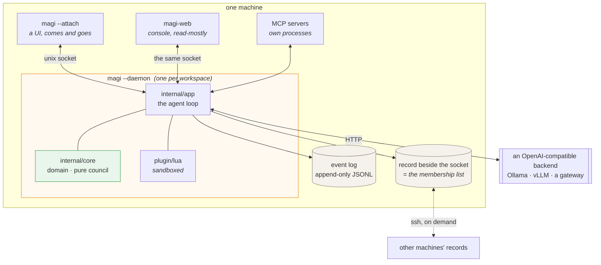
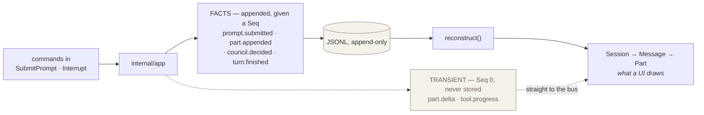
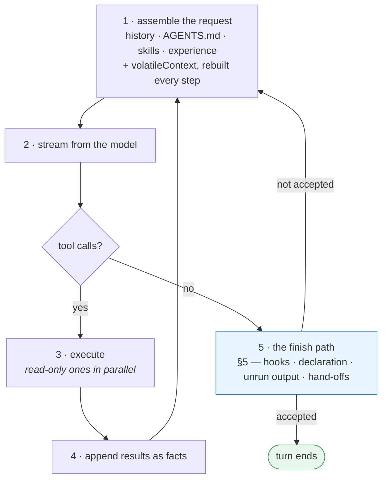
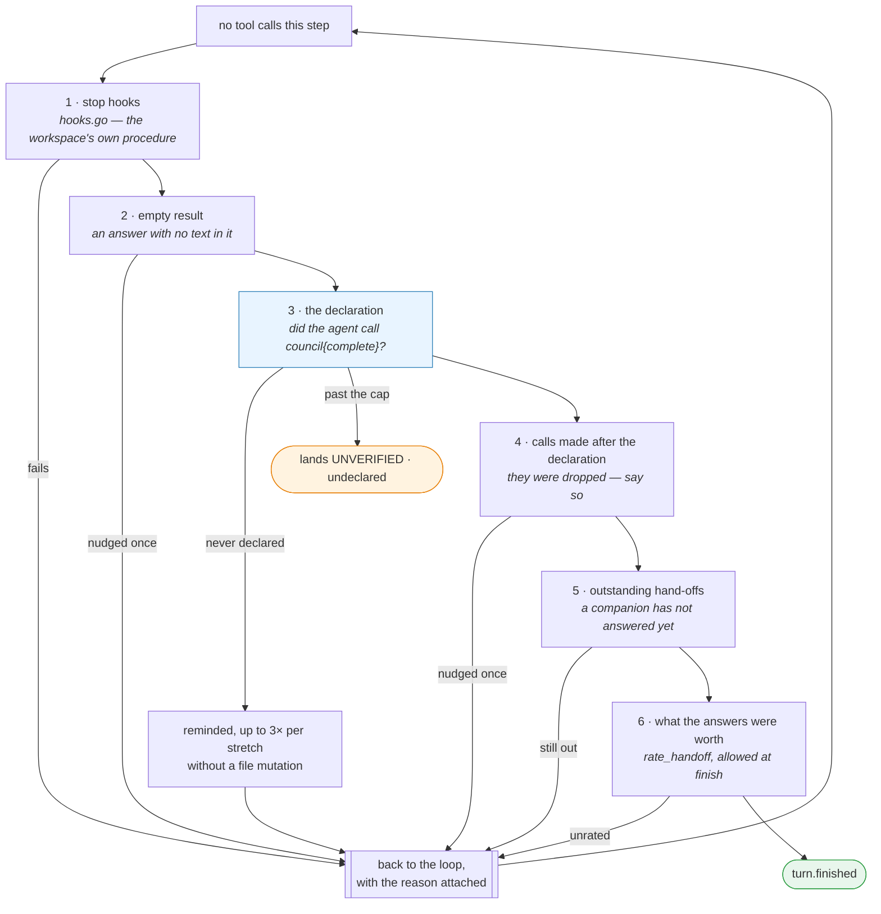
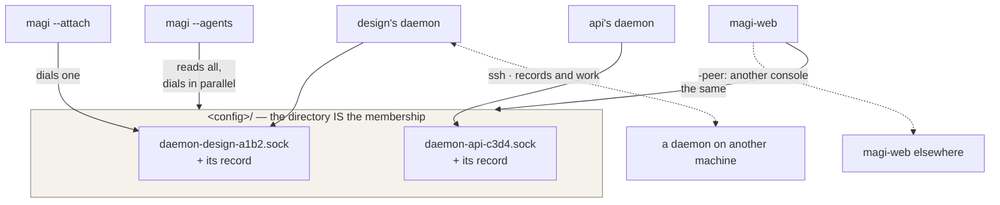

# magi — Architecture

[English](ARCHITECTURE.md) · [한국어](ARCHITECTURE.ko.md) · [↑ Docs](README.md)

> **Current reference.** The as-built system, and the one that wins when the design documents disagree with it.

This is the **as-built** reference for developing on magi. `DESIGN.md` and `SPEC.md` are the
original design intent (kept for rationale, decisions D1–D13); where they disagree with this file,
**this file wins**.
Visual companion: [DIAGRAMS.md](DIAGRAMS.md) — one axis from the top-level container down to
**class diagrams**: L0 process boundary, L1 turn lifecycle, L2 component map, L3–L4 the
nudge/gate and model-I/O guard flows, L5 core domain types, L6 ports → adapters, L7 the
`internal/app` structs, L8 the tool layer, L9 one tool call as a sequence. All mermaid.

magi is an extensible terminal AI coding agent: a Go core, a Bubble Tea TUI, Lua plugins,
OpenAI-compatible LLM access (Ollama/LiteLLM/etc.), an event-sourced store, guardrails, an
advisory council the agent calls as a tool, and an opt-in deterministic workflow engine. Single
static binary (`CGO_ENABLED=0`), cross-platform.

Before the layer rules, the shape of the running thing — what is a process, what is a file, and
what crosses a socket:



Two things in that picture explain most of the design. The **log is the state** — the UI is a
projection of it, which is why attaching and detaching costs nothing and why `/rewind` and `/fork`
are ordinary. And **nothing listens on a port**: UIs reach the daemon over a unix socket, machines
reach each other over ssh, so magi holds no credential and opens nothing.

**One agent by default.** magi used to spawn subagents and hand them slices of the work through a
curated brief. Nothing in the recorded runs shows that making a result better, and the defect log is
largely made of it — a brief paraphrased until the graded identifier was gone, a worker that never
received the checklist assembled for it, a killed explorer whose session id was dropped so its work
could not be salvaged. It is gone, along with the planner that decided when to use it.

What is NOT gone, and was added back deliberately, is the seam: a plugin can declare a subagent and
a user can switch it on (`/subagents`, EXTENDING §3.9). The distinction is the whole point. Every
defect in that list came from magi deciding **on the model's behalf** what to split off and what to
pass along; the seam decides neither. A plugin author writes the prompt, the tool's own arguments
are the brief, and magi passes them through without rewriting a byte. magi ships no agent at all;
`plugins/examples/crew` shows what writing one looks like, and is not installed.

**What independent measurements say, including where they disagree with this.** None of them
measured magi, and the basis for the paragraph above is still this tree's own defect log. They are
here because the question "would subagents have helped?" deserves an answer that is not only ours.

The strongest result *against* the choice above: on search-heavy tasks (GAIA), orchestration beats
the same backbone badly — 66.06 → 80.00 pass@1 ([AOrchestra][ao], Gemini-3-Flash). If magi's work
looked like GAIA, this section would be wrong. Anthropic report the same shape from production: an
orchestrator-worker Research system beat solo Opus 4 by 90.2% on their internal research eval
([multi-agent research system][amrs]).

Which makes the boundary they draw around that result the most useful sentence anyone has published
on this question, since they are the team that shipped the thing:

> coding has fewer truly parallelizable tasks than research, and models are not yet great at
> coordinating and delegating to other agents in real time.

Their fit criterion is breadth-first work with independent parallel directions and information
exceeding one context window; their stated poor fit is domains needing shared context or heavy
inter-agent dependencies, with coding named as the example. That is a description of the work magi
does, written by people with every reason to argue the other way.

Two more numbers from the same report change how the 90.2% reads.
On BrowseComp three variables explain 95% of performance variance and **token usage alone explains
80%** of it — and a multi-agent system spends about 15× the tokens of a chat against a single
agent's 4×. So the winning configuration was also, by construction, the one spending far more of
the variable that dominates the outcome, and the report does not separate the two.

Then one result about imposed structure, and two that locate the advantage somewhere other than the
sub-agents:

- A **controlled same-model comparison** of a phased pipeline against a free-form loop — both on
  Claude Sonnet 4.6, reproducing published materials-science results — comes back as ties on 45.0%
  of claims with wins and losses balanced. The structured agent scored significantly higher on one
  dimension only, *scientific rigour*, and lower on several others. The authors' own diagnosis is
  adaptivity: the free-form agent "supports a more fluid interaction loop", while the phased design
  cannot revise itself over a long horizon ([materials-science reproduction][mat]). Note what this
  is and is not evidence about: its "orchestrated" agent is four imposed phases — read-only
  planning, environment preparation, deterministic execution, result extraction — and not a system
  that spawns sub-agents at all. It is the closest published measurement of the pipeline magi
  removed, which is why it is here, and it says nothing directly about delegation.
- A **factorial ablation over orchestrator and sub-agent size** ([small agents][small]). Read it
  carefully, because its headline is FOR orchestration: a well-orchestrated 8B multi-agent system
  matches a 32B single agent that has direct tool use (GAIA 23.0 vs 23.0, AIME 55.0 vs 45.0, and
  slightly behind on GPQA and MuSiQue) — four times smaller for the same result. What it pins down
  is where that comes from. With orchestrator thinking on, sub-agent size is flat: 23.0 / 23.0 /
  23.6 across 1.7B / 8B / 32B. With it off, moving to multi-agent at all produces "mixed results",
  and thinking in the sub-agents is marginal or negative. So the finding is not that orchestration
  fails; it is that the orchestrator's reasoning is the whole of it.
- AOrchestra's **own ablation** attributes its gain not to having sub-agents but to what the
  orchestrator chooses to pass them. Holding sub-agent model, tools and prompt fixed and varying
  only the context field: none 86.00, all 84.00, curated 96.00. Both extremes lose.

That last one is the finding worth taking seriously, and also the one whose limits matter most
here, because the obvious next question — *curate by what rule?* — has no answer in the paper. The
context is a string the orchestrator LLM writes as a tool-call argument. There is no algorithm, no
scoring function, no stated selection criteria; the behaviour is whatever the prompt template
elicits, and the authors reach for supervised fine-tuning (2K trajectories cloned from a stronger
model) rather than a procedure. Their own account of what that training bought is longer horizons —
56% more attempts — not better selection. Its quality tracks the orchestrator's strength: 56.97
with Qwen3-8B against 80.00 with Gemini-3-Flash.

So "curation is the lever" is supportable; "and here is how to curate" is not yet supported by
anyone. Read together with the factorial ablation, what a subagent buys starts to look less like
structure and more like **one more pass of a strong model's judgement about what matters** — which
is available inside a single context too, and is a plausible reason the controlled comparison ties.

Three caveats on the numbers themselves, since this file is where someone will come to check them.
AOrchestra's headline arithmetic does not close (a claimed 64.29-point absolute improvement on
Terminal-Bench is 18.57 by its own figures, and the abstract's summary figure moves between 16.28%
and 22.13% across sections), so only its context ablation is cited here. That ablation is n=50 on
one benchmark, and its hardest tier is identical across all three settings — the gain sits in the
easier ones. The factorial study is a workshop paper (ICLR 2026 MALGAI) run entirely on Qwen3 1.7B
to 32B, so whether "the orchestrator is the whole of it" survives at frontier scale is untested; on
its own hardest benchmark (HLE) every configuration scored zero. And the caution cuts both ways: a scaffold taxonomy of coding agents argues that
scaffold and model effects are confounded badly enough that attributing benchmark performance to
architecture at all is unsound ([scaffold taxonomy][scaf]) — which is an argument against this
section claiming vindication as much as against the orchestration papers claiming theirs.

[ao]: https://arxiv.org/html/2602.03786v2
[mat]: https://arxiv.org/pdf/2605.00803
[small]: https://arxiv.org/pdf/2601.11327
[scaf]: https://arxiv.org/pdf/2604.03515
[amrs]: https://www.anthropic.com/engineering/multi-agent-research-system

---

## 1. Layering (hexagonal / ports & adapters)

Dependency rule, enforced at compile time: **`adapter → app → core`**, and
`app`/`adapter` depend on `port`. `core` imports nothing outside std + core.

```mermaid
flowchart LR
    subgraph out [adapters — every one replaceable]
        direction TB
        A1[tui/bubbletea]
        A2[llm/openai]
        A3[store/jsonl]
        A4[plugin/lua · mcp]
        A5[council/llm]
        A6[daemon · fleet]
    end
    subgraph mid [internal/port — the interfaces]
        direction TB
        P1[LLMProvider]
        P2[Store]
        P3[Tool · ToolEnv]
        P4[ToolServers · FileTool]
        P5[Council]
        P6[Platform]
    end
    subgraph in [internal/core — imports nothing outward]
        direction TB
        C1[session · event · command]
        C2[council<br/><i>the tally, pure</i>]
        C3[bus · model · artifact]
    end
    out --> mid --> in

    style in fill:#e8f6ec,stroke:#2f9e44
    style mid fill:#f5f2ec,stroke:#8a8178
```



The arrows only point one way, and the compile-time check is what keeps it that way: put an import
of an adapter into `core` and the build fails. The payoff is concrete — the council's tally can be
unit-tested with no model and no I/O, and swapping the TUI or the LLM client touches nothing
inside.

```
cmd/magi/                 entrypoint: flag parsing, DI wiring, -p headless, TUI launch,
                          -daemon (engine with no UI) / -attach (a UI onto one) / -agents
clients/web/server/             the console: a read-mostly web view of every daemon on the machine,
                          and of other consoles' (peer.go). The front end is compiled from
                          clients/web/ui and assembled into console/ by CI; a build without it is a
                          working BFF whose / says so
internal/
  core/                     domain — no outward deps
    session/                Session, Message, Part, ToolCall, ToolResult, Todo, SessionMeta
    event/                  Event envelope + types (facts vs transient) + payloads
    command/                Commands (CreateSession, SubmitPrompt, Interrupt, …)
    bus/                    in-memory pub/sub fan-out (per session)
    model/                  model registry (context window / pricing / caps)
    council/                the termination consensus (D14): members, rounds, tally
    cluster/ meeting/       companions on the machine, and the rooms they talk in
    auth/ webpush/          who may read a console, and how a phone is told
    change/ rank/ embed/    edit tracking, ranking, embeddings (recall)
    cron/ lang/ text/ report/  schedules, language detection, text shaping, run reports
  port/                     interfaces the core depends on (port.go): LLMProvider, Store,
                            Tool/ToolEnv/FileTool, ToolServers, ExperienceStore, Platform…
  app/                      application service + the agent loop + guardrails + workflow
    app.go                  App (the Application): commands in → events out; session/turn state
    routing.go query.go     model/profile routing and permission config (routing.go); the
                            read-only query surface the TUI reads — transcript, plan, observation,
                            git-diff/shell (query.go)
    config.go               Config/AgentSpec/profile types, withDefaults, applyProfile
    todos.go                the plan the AGENT keeps (todowrite) and its finalize-at-turn-end
    loop.go                 runLoop: the agent loop; buildStepSystem (the cacheable prompt); the
                            per-step stream/persist/finish flow
    loop_gates.go           the finish path: Stop hooks, the empty-result nudge, the
                            authored-but-never-run nudge, and the finish declaration
    interject.go interject_queue.go
                            mid-turn steer machinery: routing (applyInterjectRoute), the
                            finish-boundary triage mini-turn, and the queue that survives
                            a reload
    guard.go shellcmd.go shellparse.go
                            runGuard — what magi NOTICES about a run (repeats, stalls,
                            self-reverts, no-change writes, exercise churn) and the stateless
                            shell classifier it reads commands with. It reports; it does not
                            decide (see §4)
    observed.go observed_view.go world_snapshot.go
                            magi's own record: which calls it granted, how they really ended,
                            what they wrote (observed.go); the panel's view of it
                            (observed_view.go); and the fresh read of the workspace and the live
                            background jobs taken when a finish is declared (world_snapshot.go)
    council_advice.go council_events.go council_evidence.go
                            the council as a TOOL — one deliberation, three lenses over the same
                            record, rendered back to the agent; the events the TUI folds; and the
                            evidence assembly they read
    execute.go permission.go prompt.go
                            tool execution (including the unknown-argument check), permission
                            prompting, and prompt/system assembly
    hooks.go                lifecycle hooks (PreToolUse/PostToolUse/Stop) + the built-in harness
    workflow.go             the opt-in deterministic phase pipeline (-workflow, §6)
    policy.go               guardrail policy engine (rules, secret-deny, bash scan, egress)
    background.go           the background-command registry as an observer sees it (§7)
    compact.go recall.go reconstruct.go scratch.go …
  adapter/
    llm/openai/             OpenAI-compatible client (native + prompt-fallback tool calls,
                            prompt caching, error mapping, custom headers, retries)
    store/jsonl/            append-only JSONL event store
    tool/builtin/           the built-in tools (see §7) + OS sandbox wrappers
    platform/               Exec / ConfigDir / DataDir / TerminalCaps
    experience/git/         shared memory/skills store (git repo, D13)
    plugin/lua/             gopher-lua plugin host (capability bundles)
    mcp/                    MCP client: stdio + Streamable HTTP transports
    daemon/                 the engine over a unix socket: Listen/Serve, the flock claim that
                            makes a workspace's daemon unique, Publish (the record a console
                            reads), Client, and the optional interfaces an engine may satisfy —
                            Controller (rewind, compact, set-model, set-permission), JobRunner
                            (what is running beside the turn, and what is queued behind it),
                            ToolLister and ModelLister (the roster and the catalogue, which only
                            the process holding the run can say), UserNamer. A daemon that does
                            not implement one answers empty rather than erroring, and every
                            caller has to read that as "not known from here" and not as "none".
    fleet/                  what every magi on this machine is doing, derived from the logs and
                            a short parallel probe of each socket — ONE derivation, because the
                            console and `--agents` both ask it
    tui/                    Bubble Tea UI, split by concern: model.go (Model + Update),
                            model_input.go (mouse/key/slash), model_event.go (event folding),
                            model_route.go (route/profile forms), model_layout.go (resize/panes),
                            model_view.go (render). Transcript, background-job panes, /route editor
                            (session-model suggest box = profiles ∪ `App.ListModels` gateway catalog).
  atomicfile/               one write-temp-then-rename, shared by everything that writes a file
                            a concurrent reader may be reading (the experience store, config)
  httpx/                    shared static+dynamic HTTP header set (MCP + LLM client)
  jsonx/                    the one reader for model-produced JSON: balanced-span extraction,
                            the repair ladder, tolerant field types, and parse-failure diagnosis
  config/                   TOML config loader + comment-preserving editor (SetKey)
  eval/                     quantitative task-suite harness (success/steps/tokens)
  update/                   GitHub-release self-update (`-update`)
  version/                  build version stamping
```

**Reading model JSON (`internal/jsonx`).** Council verdicts and tool-call arguments are JSON a
MODEL wrote, and they fail in the same handful of ways. One package owns that, so a defect fixed once
is fixed for all of them:
- **Extraction** — `BalancedObjects`/`BalancedArrays` pull candidate spans out of a reply that
  wrapped its JSON in prose or a code fence.
- **Repair ladder** (`RepairCandidates` → `Unmarshal`) — the ORIGINAL is always candidate 0, so a
  clean reply is never rewritten. Then light repairs (a trailing comma, a raw control character in
  a string — the common defects in fields carrying multi-line prose or shell commands), then
  structural ones (an unescaped inner quote, single-quoted strings, bare identifier values). Each
  structural repair acts only on text that is ALREADY invalid JSON, so it cannot corrupt a
  well-formed document.
- **Tolerant field types** (`Text`, `Texts`, `Number`) — Go's decoder aborts the WHOLE document on
  the first type mismatch, so one field answered in an unexpected shape (a list where the schema
  says string, a quoted `"0.9"`, a number where prose was asked for) discarded every sibling field
  and every element beside it. Model-facing structs read their free-text fields through these
  instead, and validate by VALUE afterwards.
- **Diagnosis** (`Diagnose`, `Report`) — what every parse-failure log renders: the bounded excerpt
  plus the named reason (no JSON at all / a syntax defect with its byte offset and a window around
  it / it parses and the mismatch is the schema). An excerpt alone keeps only the head and tail,
  which is where the defect usually is not.

---

## 2. Core data model (`core/session`, `core/event`)

One rule shapes everything here: **the log is the truth, and everything on screen is derived from
it**. A message is not stored; it is reconstructed from the events that produced it. That is what
makes rewind, fork and replay ordinary operations instead of features.



The split between facts and transient events is the load-bearing part: a stream of tokens must
reach the screen without being written down, and a decision must be written down even if nobody is
watching. `Seq == 0` is how the two are told apart everywhere in the code.

A conversation is a `Session` of `Message`s; each message is a list of `Part`s
(tagged union by `Kind`: text | reasoning | tool-call | tool-result | image | error).
`ToolCall{CallID,Name,Args(json.RawMessage)}`, `ToolResult{CallID,Content(json.RawMessage),IsError}`.

Everything is an **`Event`** (CQRS-lite: commands in, events out):

```go
type Event struct {
	Seq       int64             // per-session, assigned by the Store on append; 0 = transient
	SessionID session.SessionID
	Type      Type
	Actor     Actor
	TS        time.Time
	Data      json.RawMessage // payload struct per Type, in event.go
}
type Actor struct { Kind ActorKind; ID string } // user | agent | system
```

The `Actor.Kind` is load-bearing, not decoration: several scans use `ActorUser` as the
**turn boundary**, and the system actors (`loop`, `orchestrator`, `hook`, `plugin`,
permission) are deliberately not it — a nudge magi injected must not read as the user
starting a new turn.

- **Facts** (persisted, JSONL, replayable) and **transient** (bus only, never persisted).
  `Type.IsTransient()` answers which, from the one map (`transientTypes`) the store itself asks
  before it will write a line. **The names live in `docs/SPEC.md` F-EVENT-FACT-TRANSIENT**, whose
  two rules are held to that map by a test (`vocab-1`) — this page does not re-list them.

  It used to, and that is why the pointer is here rather than another copy. The list below this
  sentence once named ten transients and then claimed, in the sentence after it, that the set was
  enumerated once instead of re-listed; three of the ten disagreed with the map. A list that says
  it is authoritative is worse than one that admits it is a copy, because it tells the reader not
  to check.

  Persisting is not the same as entering the model's context: `reconstruct()` reads the handful of
  types a conversation is made of and ignores the rest, so a decision can be auditable in the log
  without being said back to the model.

Store path: `<dataDir>/projects/<cwd>/<sessionId>.jsonl`. `Store.Read(fromSeq)`
returns events with `Seq > fromSeq`. `Subscribe` = live bus first, then store
replay, deduped by seq (race-safe late-joiner).

---

## 3. Ports (`internal/port/port.go`)

### Two rules this section is here to state

Three defects in one week had one shape, and neither was caught by a test because neither produced
an error. Both rules below exist to make that shape impossible to write.

**One source per fact.** A thing that can change has exactly one place that answers what it is now,
and every reader goes there. The session's model had three — the log, the daemon's memory, and a
bus announcement — and they disagreed the moment one of them was updated alone: `SetModel` wrote
memory and announced on the bus, so the console, which reads the log, repainted the opening model
after every successful change and the operator saw their choice snap back. The model is a log fact
now, and the meta scan reads the newest one. When a new mutable fact appears, name its one source
in the comment where it is written; a second place that "also knows" is a place that will be wrong.

**"I cannot say" is not "there is nothing."** An answer that folds the two together cannot be acted
on differently, and the empty one always looks like the harmless one. `App.ListModels` returned
`(nil, nil)` both when a backend listed no models and when nobody had asked it — so an empty model
menu was indistinguishable from a menu that was never populated, and stayed empty for as long as a
wrapper had been swallowing the question. Absence now answers `port.ErrCapabilityAbsent`, and the
console logs the reason its menu is short instead of drawing the same blank for both.

The second rule has a structural half. `LLMProvider` declares one method because `StreamChat` is
the only thing every backend must do; everything else — listing a catalogue, measuring a window,
being redirected — is reached by a type assertion, and a type assertion meets whatever WRAPPER is
in front. Both wrappers here (the stream guard, the usage meter) were written implementing the port
and nothing more, so those capabilities disappeared one layer up with nothing refusing. They are
named interfaces now (`ModelLister`, `ContextProber`, `BaseRedirector`, together `ProviderExtras`),
every wrapper carries `var _ port.ProviderExtras = …`, and `internal/arch` fails the build when a
new wrapper appears without it — so the compiler names the missing method at the moment it is
written, rather than a menu going quiet six months later.


- **`LLMProvider`**: `StreamChat(ctx, ChatRequest) (<-chan ProviderEvent, error)`.
  `ProviderEventType` ∈ text-delta | reasoning-delta | tool-call | finish | usage | error.
- **`Store`**: `Append/Read/ListSessions/ChildSessions/Compact/Truncate`. `Compact`
  rewrites the log up to a seq behind one snapshot event; `Truncate` drops it.
- **`Tool`**: `Name/Description/Schema/Execute(ctx, args, ToolEnv)`. `ToolEnv` is the
  capability surface handed to a tool — note it is much larger than a plain fs env.
  A tool reaches the application **only** through these closures, which is why a nil
  field means "this capability is not available in this run" and every tool nil-checks
  before calling:

  ```go
  type ToolEnv struct {
    SessionID  session.SessionID
    Workdir    string          // the session's working directory
    ScratchDir string          // the turn's scratch dir (created at depth 0)
    ScratchTmp string          // TMPDIR handed to child processes
    Platform   Platform

    AskPermission func(callID, name string, args json.RawMessage) (bool, error)
    EmitArtifact  func(artifact.Artifact)              // reviewable output (D11)
    EmitProgress  func(text string)                    // live note while a tool blocks (wait_for)

    Council func(ctx, question string, complete bool) (string, error) // complete=declare finished
    AskUser func(question string, options []string) (string, error)   // interactive only; nil ⇒ tool says so
    RouteInterjection func(action, reason, requestID string) error     // top level only

    SetTodos     func([]session.Todo)                  // todowrite
    NoteForTurn  func(text string) error               // remember{scope:"turn"}; err = NOT kept
    Propose      func(Contribution) error              // shared experience (D13)
    LoadSkill    func(name string) (string, bool)      // skill
    Recall       func(query string) (string, error)    // recall_context — THIS session's compacted detail
    RecallMemory func(query string) (string, error)    // recall_memory — the cross-session D13 store

    Sandbox SandboxSpec // OS confinement for bash (read-only|workspace-write|full)
  }
  ```

  Two conventions in that list are worth stating, because both were once broken:
  `NoteForTurn` returns an **error** rather than nothing, so the tool cannot answer
  "noted" on a note the bounded queue discarded; and `Recall` / `RecallMemory` are
  different stores — one recovers what a compaction shed from *this* session, the other
  reaches durable team memory.
- **`ExperienceStore`** (Retrieve/Propose), **`WikiStore`** (the in-place wiki, riding the same
  Propose seam), **`Platform`** (Exec/ConfigDir/DataDir/TerminalCaps/ProcessCPUTime),
  **`ContextProvider`**, **`Council`** (Deliberate), **`ToolRegistry`**, **`FileTool`**,
  **`MetaTool`**, **`DoctorProbe`**, **`PluginCommand`**. The Lua host is wired directly by
  `cmd/magi` — the old `PluginHost` and `Scheduler` ports are gone.
- **`ToolServers`** (Attach/Detach) is the one port a *running* daemon exposes to the outside: an
  application that IS a tool server — an editor plugin, a slide add-in — attaching itself for as
  long as it is open. It takes a URL and never a command line, because the safety argument for the
  door is that it spawns nothing, and it writes nothing to config, because a server that existed
  this afternoon must not leave a line the daemon dials every morning. `EXTENDING.md` §1.4 is the
  contract; the daemon speaks it as `mcp-attach` / `mcp-detach` and advertises it as the
  `tool-servers` capability — asked of the engine, since whether a daemon accepts the door is a
  fact about what it is running and not about this build.

`ToolEnv` used to carry two more fields — `Ask` (a subagent escalating to its
orchestrator) and `Report` (a subagent's structured final result, `port.ReportInput`).
Nothing set them and no tool read them once the one-agent change landed; a port that
advertises a contract the application never fulfils is how a reader — or a model reading
the tool surface — learns something untrue about the system. They are gone.

It carries four fields for the spawn seam instead, and each is `nil` unless the host offers it:
`Spawn` runs a child to completion, `ChildSteps` returns what that child actually did,
`RestoreChild` puts its file changes back, and `MergeChild` applies an isolated child's commit
range onto the parent's tree. All four are scoped to the tool call in flight — a call can only
read, restore or merge a child it started — and `Spawn` is `nil` **inside** a child, which is what
makes recursion impossible by construction rather than bounded by a counter someone has to check.
What each child said when it finished is recorded by magi onto the call's own tool result,
verbatim with the child's session id and any failure (`childAccount`, spawn.go) — a tool handed
the text may summarise or drop it, and the parent's log is the parent's context, so the record
does not depend on the tool's manners.

A child works in the parent's directory unless its spec says `workspace:"clone"` — then it gets
its **own checkout** (`workspace.go`: a `--local` git clone carrying the parent's uncommitted
work, pinned to a baseline commit so `base..HEAD` is exactly what the child did), its shell is
pinned to the `workspace-write` OS sandbox with the **temp allowance narrowed to its own scratch**
(the shared temp trees hold every sibling's clone — measured escape route, closed), and its log is
filed under the **parent's project** (`Project` on `session.created`; keyed by the clone path it
would land where no child listing scans). Merging back is `MergeChild`, never automatic.

Parallelism follows from isolation, not from trust: a subagent tool runs alone unless it declares
`readonly_children` (its spawns are checked against the claim) or `isolated_children` (each
writing child is given the clone at the one place a workspace is decided) — either way two of its
calls in one step have nothing to collide over, so they run at once, and `magi.spawn_all` fans a
batch out under a per-call gate (`spawnMaxParallel`) instead of a goroutine per child.

---

## 4. The agent loop (`app/loop.go`)

`Submit` appends `prompt.submitted` and starts one run goroutine (`startRun`); `run` drives
either the free-form loop (`runLoop`) or, under `Config.Workflow`, the phase engine (§6).

The loop is deliberately small. It used to be a pipeline of stages magi imposed — orient,
spec-mine, a contract council, a planner, a plan audit, check authoring, coverage fill,
delegation to subagents, a termination vote. Every one of those decided something *before* the
work existed, and every recorded defect of that period was of one kind: magi believing a
judgement it had made in advance over the record of what actually happened. They are gone.

`runLoop` still takes a `depth`, and every `depth > 0` branch in it — interjection detection,
`route_interjection`, `ask_user`, the top-level contract reset, the council finish gate — is written
for a child. Those branches are reached only when a plugin spawns one; nothing in the tree does.

What runs now, per step — the shape before the detail:



Step by step:

1. **Assemble** the request: history since the last compaction, project memory (AGENTS.md),
   skills, shared experience. Then an ephemeral **volatileContext** — never part of the cached
   system prompt — carrying the agent's own todo list, a self-measured elapsed line once a turn
   passes a minute, an optional `--time-budget` remainder, push-side recall hints for topics a
   compaction shed, and **the run state**: magi's own record, re-rendered every step (`runState`
   in `world_snapshot.go`) — which commands it granted, how they really ended, which paths they
   wrote, and which background commands are still alive. A screen-driven agent re-reads its
   terminal before every decision; this is the same refresh over the store magi actually keeps.
2. **Stream** one model response: text (`part.delta`), reasoning, tool calls; persist the
   assistant message. Two recoveries belong to getting it — a context too large to send, and a
   backend that goes silent (`generate_step.go`).
3. **Tool calls** → execute (read-only concurrently; writes and permissioned calls sequentially)
   and loop. **No tool calls** → the finish path (§5).

There is **no pacing ceiling — only a runaway backstop**. A turn ends when the agent declares it
finished and the council accepts, when the model stops and the finish path lets it, when the
context is cancelled, or when whoever launched magi stops waiting. The guards that used to stop a
run on magi's own arithmetic came out on measurement: across every recorded trial, runs that
reached the external deadline were still scored and 76 of 396 passed, while 28 runs magi stopped
itself produced no pass at all — and 8 were never scored, because a nonzero exit reads to the
caller as "the agent failed to run" rather than "the agent decided to stop". What remains is
`MaxSteps` (default 240), sized far above any productive turn, so a genuinely runaway loop cannot
hold a daemon forever; a top-level turn that spends it lands with a persisted `turn.finished`
marked UNVERIFIED, naming the backstop — the work stands as it was left, and nothing reads the
session as still working. A workflow PHASE is different in kind: it declares its own budget as
part of the pipeline's shape, and spending it is ordinary.

### What the guard does now (`guard.go`)

The guard **reports**; it does not decide. It used to force-stop a run on its own reading of a
repeat/stall/idle/spin counter, and that stop bought nothing (the measurement above). Every signal
it collected is still collected, and still SAID — to the agent, as a nudge it can act on or
ignore:

- **Repeat**: an identical `(tool,args)` call is counted — reads (fingerprint drops `limit`, so
  head re-reads collapse while genuine paging by `offset` does not), inspect-only bash, identical
  write replays. Exec bash is exempt: its outcome can change through state the guard cannot see.
- **Self-revert** (`noteEdit`): each touched file's content is hashed across the turn. A write that
  returns a file to a state it already held this turn is churn, not progress — progress is
  retracted, and **every swing is reported**, the later ones carrying how many there have been and
  how many versions the file is cycling among. A write that changes nothing at all says so: the
  tool answers "wrote N bytes", which reads as a change.
- **The run record** (`observed.go`): every distinct command with the exit magi actually learned,
  the paths that changed, and three repeat lines — read more than once, issued more than once
  exactly as written, and **authored more than once** as `path ×N`. It does no reading of its own.
  It used to: an exercise ledger matched an authored file against the commands that NAMED it and
  the record sorted commands into "exercised something" and "did not". Both were removed, because
  the match kept being wrong in both directions (`sed -n` and `grep` read as program runs, a quoted
  `|` split a command into a fragment no verb matched) and a wrong reading in the one place whose
  job is to hold facts is worse than no reading. So it states an exit and a command text and lets
  whoever reads it — the council — decide which of them exercised anything. **The council is that
  reader, and its only one**: `stopRecord` is consumed at two call sites, both in
  `council_advice.go`. A run where the agent never calls the council builds this record every step
  and shows it to nobody.
- **Exercise churn**: when the agent's OWN build or test keeps failing across repeated edits
  without converging, the turn lands UNVERIFIED with the work standing, instead of churning to an
  external kill that tears a live deliverable down. It reads only magi's own signals — no external
  clock.

## 5. Finishing a turn (`app/loop_gates.go`, `app/council_advice.go`)

A turn ends because someone decided to end it. Going quiet is not a decision: a turn that trailed
off mid-thought and one that was actually finished used to end identically, and neither was ever
asked which it was.

The finish path, in order — six gates, any one of which sends the turn back to work:



1. **Stop hooks** (`hooks.go`) — the workspace's own procedure. A failing hook pushes the agent
   back to work with the hook's output.
2. **Empty result** — an answer with no text delivered nothing a reader can use; nudged once.
3. **The declaration** — a working turn that stopped without declaring is told how to: call the
   `council` tool with `complete: true`. The budget is three asks per **stretch of no progress**,
   not per turn: a real file mutation since the last ask is the evidence that the reminder was
   answered by working, so the count starts over. Past the cap the work lands as it stands and the
   turn is recorded as ending *undeclared* — UNVERIFIED, which is a different claim from ending
   declared. Top level only; a child never declares for its parent.
4. **Calls made after the declaration were dropped** — a turn that has declared itself finished
   does no more work on the task, so any tool it still asks for is not run. The rule stays; what
   changed is that it is no longer silent, because a call left in the transcript with no result
   looks exactly like a call that happened. Once per turn, and it keeps the turn open: "not
   finished after all" is the way back.
5. **Outstanding hand-offs** — work went to another companion and has not come back. The answer
   lands in this conversation on its own, so the agent is told to keep working if it is part of
   what was asked, and otherwise to say plainly in its answer what is still out with whom.
6. **What the answers were worth** — a hand-off that DID come back is rated (`rate_handoff`)
   before the turn closes, because nothing but this turn knows whether it was the answer that was
   needed. The finish path is asking for a tool, so the finish path lets that one tool run.

Then, when the turn truly ends: an optional distil pass (off by default, `distil.go`), a last
re-read of the store for a steer that landed during the final step, and `turn.finished` carrying
the UNVERIFIED reason if there is one. The plan is resolved at the same moment — every step still
open becomes *cancelled* on an abandoned turn and *completed* on a genuine finish, so a landed run
never leaves a half-ticked list behind (`todos.go`, `finalizeTodos`).

Note what is **not** on this list: the council. It is not a gate the finish path convenes — it
runs when the agent calls the tool, and gate 3 only checks that it did.

### The council is a tool

It used to convene by itself at the finish boundary, which decided two things it could not get
right: WHEN it was asked — at the one moment the agent had already made up its mind — and whether
its answer would be read at all. In a headless run it was not: the advice was injected and
`turn.finished` was written in the same tick.

- **`council{question}`** — three members read the SAME record through different lenses
  (correctness, verification, completeness) and answer in their own words. The tally is not
  rendered: counting votes is what the gate did, and a count invites reading a majority as an
  order. Advice; the agent may disagree.
- **`council{complete: true}`** — the agent DECLARES the task finished. The members read the
  record as a finish and either accept (the loop is signalled, the turn ends through the same
  finish path as any other) or hand back what is undone, and the agent keeps working.

What the members see on a declaration is a **fresh read, not a replay**. magi's record answers
"what happened" and cannot answer "what is there now" — a build's own output, a shell redirect it
could not parse, a file a later command removed. So the declaration carries the workspace as it
stands (files modified since the task began, directories that churned collapsed to a count), the
background commands still alive, and the one contradiction a record can never surface on its own:
paths the record says were written that are not on disk.

Inside the evidence list itself, a **repeated call's older result is superseded**: the same call
asked again means the older answer is stale by definition, so only the newest keeps its output and
the earlier occurrence collapses to a stub that keeps its status (an error-then-ok history stays
legible) — measured live, members handed three reads of one file anchored on the first, biggest
snapshot and rejected already-correct work three rounds running. The list states its own reading
rule up front (time order; a later result outranks an earlier one about the same file or command).

Rejection is bounded the same way acceptance is earned: a declaration rejected repeatedly **with
nothing changing in between** trips a cap (three no-change rejections, eight per turn overall) and
the turn lands recorded as UNVERIFIED with the reason — an honest failure is a terminal outcome,
not a loop. Real iteration between declarations resets the count.

**Three readers of the same record count as three only if they can disagree**, and by default they
cannot much: every member runs on the session model unless a `[[council.member]]` gives it a
`provider` and a `model` of its own. What separates them out of the box is the lens they are told
to read through, which is a weaker separation than it looks — measured on one arm, three members
with one line of lens apiece and every other instruction identical voted done **21 times out of
21** with no dissent. Three samples of one opinion, not three opinions.

How much weaker is measurable, and somebody has measured it. Anthropic's swarm experiments report
**low-variance convergence** as a standing property of many instances of one model: 18 of 30 agents
picked the same git branch name (`mvp-game-loop`), several independently gave a piece of fiction the
same title, more than half of a free-choice cohort built either a ray tracer or a self-hosting
compiler, and agents in a prisoner's dilemma defected in unison. Independence is not what you get
from running the same weights again; it is what you get from different weights, and the members
here share them.

This is a live limit on the finish gate, not a hypothetical one. A false "done" the model finds
plausible is exactly the kind of error correlated readers agree on, and the gate exists for that
error specifically. Two things keep it from being fatal, and naming them matters because they —
not the number of members — are what does the work:

- The members judge **the record, not the claim** — evidence magi collected, which does not vary
  with who is reading it.
- **Ambiguity resolves to *continue***, so agreement is only load-bearing in one direction.

Three more were added against that 21-of-21 measurement specifically, and each attacks a different
part of it:

- **A route per lens** (`core/council.Routes`) — where a member walks FIRST through the same
  evidence: the task's literal words and then the reported values themselves (correctness), the
  moment each required behaviour actually ran (verification), every distinct part the task asked
  for including the one named once in passing (completeness). A route is an **order of search, not
  a jurisdiction**. Dividing the task between members would be worse than no route at all: a defect
  inside one member's share draws a single continue against two uninformed dones, and the majority
  waves it through.
- **The requirements walk before the verdict** — a member writes one line per requirement,
  SATISFIED or UNSATISFIED, each settled by a verbatim fragment of something a **tool returned** or
  by `NO-EVIDENCE`. The field sits before `decision` in the schema it fills in, so the reading
  cannot be assembled backwards from a conclusion already reached, and the agent's own account of
  its work settles nothing. What the member said it was reading is kept on `Verdict.Cite`,
  recorded and shown but never looked up — the version that did look it up produced two false
  abstentions in thirty verdicts and caught nothing.
- **A closing call over all three walks** — a tally is three readings added together, and until it
  is added nobody has read all three. The closing call is the only seat that does, and it is asked
  for what only that seat shows: a contradiction between two readings of one output, a requirement
  no walk covered, a value wrong on its face. Its conclusion is **clamped**: it may turn a done
  round into continue, never the reverse, because this council's measured failure is over-approval
  and a conclusion free to overrule a blocking tally would be a second road to done. It is recorded
  on `Deliberation.Close` and rendered above the feedback whether it agreed or not — a gate that
  finds a defect and does not say what it found only spends the clock.

The cost of the last two is one extra call, not four: when the members share provider and model,
one panel call carries all three walks and verdicts and the close is the second. Members pinned to
different backends keep the per-member shape, because folding a deliberately mixed council into one
request would answer with whichever backend the first member named.

The cheap correction, where a run can afford it, is to give one member a different backend — the
`provider`/`model` fields exist for this, and a panel of one strong reader and two cheap ones is
the shape they were added for. magi does not do this by default because a second backend is
configuration a person has to have, not something to assume.

## 6. Guardrails & workflow

**Guardrail policy (`app/policy.go`)** sits above interactive permission prompting:
- `Tool(spec)` allow/deny pattern rules (e.g. `Bash(git push:*)`, `Read(**/.env)`);
  secret paths are denied by default (hard floor).
- **Which calls the floor applies to is asked of the call, not of a list of names.** The secret
  and guardrail patterns used to be expanded into one rule per name × glob for `read`, `write`,
  `edit`, `multiedit`, which was exact while those were the only file tools. A tool implementing
  `port.FileTool` says which file its arguments name and whether it writes it, and gets the same
  floor — and the same change tracking, post-edit diagnostics, per-path repeat epoch and council
  evidence that used to hang off those three names. That matters for an editor plugin or a slide
  add-in, which edits the workspace under a name like `mcp__jetbrains__edit`. The declaration is
  read BEFORE the call: a floor that answers after the write is not a floor. A tool that declares
  nothing is unchanged — undeclared MCP tools still go through the danger gate, which prompts.
- bash command scan: destructive / pipe-to-shell / network-egress / secret-path →
  forces a prompt (or deny). Optional egress host allowlist.
- **Profiles** = 2 axes: Permission (ask|auto|allow|deny) × Sandbox
  (read-only|workspace-write|full), presets `safe`/`standard`/`yolo`.
- **OS sandbox** for bash (`adapter/tool/builtin/sandbox_{darwin,linux,windows,other}.go`):
  macOS seatbelt, Linux bwrap, Windows restricted-token (stage 1), with graceful
  fallback when the backend is unavailable. Opt-in via profile.
- **Prompt-injection rule**: tool output is treated as untrusted data; webfetch
  output is fenced.
- **Persist-rule narrowing** (`persistRule`): choosing "always (project)" writes an
  allow rule scoped as tightly as the tool permits. Non-bash tools persist as
  `tool(**)`; `bash` persists only the approved **program name** — `curl https://x`
  yields `bash(curl:*)`, not `bash(**)` — via `safeCommandPrefix` (first argv word;
  empty, so no persist, when the command opens with a shell metachar and has no fixed
  program to pin). One approval can't silently pre-authorize every later command.

**The irreversible-command gate (`app/irreversible.go`)** asks before a delete that nothing can
undo. It classifies by REACH, not by verb: `rm -rf` inside the workspace is the agent's own work and
runs, while the same command aimed outside it is somebody else's and stops — magi has nothing to
restore it from. Two kinds of path lie outside the tree and are still nobody else's, and both are
let through: scratch space (`/tmp`, `/var/tmp`, `$TMPDIR` — the roots themselves stay gated) and
anything the run created, which `runGuard` tracks as it goes and matches by containment, so deleting
a directory covers the files made inside it. A glob with no separator and no leading `..` is
expanded by the shell in the workspace's own directory and cannot land outside it either.

**A workspace with no history gets one (`app/trash.go`).** That whole classification rests on
git: inside a checkout a delete undoes from the object store, which is why gating every build
directory would be noise. Where there is no repository at or above the workspace the premise is
simply false, and the same command is what the gate exists to stop while looking like the harmless
case. So instead of asking about every build directory in such a tree, the tree is given what it
was missing. A delete is ASKED about — the in-tree exemption is
lifted, so the same council question that guards a delete reaching outside the tree guards this
one. Asked rather than acted on: a regex over command TEXT cannot know what a shell will delete
(`echo "rm -rf build" > clean.sh` matches it, a quoted path splits on its space, a symlink names
something else entirely), which a question survives and anything touching files does not. An
edit's previous contents ARE held, by a hard link, because there the target is the tool's own
declared argument and not a guess: the writing tools replace a file atomically, so the old contents keep living in
their own inode and a second name for it costs no disk. Once per file per turn — what a person
wants back is the state the turn began in — and never for what the run itself created, which has
no before-the-turn to keep. Both are said in the tool result, because a rescue the model cannot
see is one it cannot undo. The sweep runs at the START of the next turn, which is what "one turn behind" actually takes: the moment somebody wants a file back is just after the turn that removed it, so the two
newest batches stay and anything past a week goes.

What it asks is a plain yes/no about one command, so it does not convene a panel: `port.Council`'s
`Advise` is one question, one reader, prose back, carrying the task and the question and nothing
else. The turn's evidence block is deliberately withheld — the question is about SCOPE, and handing
over the evidence would pay for anchoring rather than grounding. `councilSaysNo` reads the prose.
Routing it through `Deliberate` instead cost about 35 KB of cache write per firing and made a
complete answer look like a parse failure, because that machinery tells its reader to answer as
verdicts.

**Workflow engine (`app/workflow.go`, opt-in via `-workflow`)** drives a task through
a deterministic, code-enforced pipeline so the *flow* doesn't depend on the model:
`localize` (read-only) → `implement` (edit) → `verify` (bash/real command) →
`review` (read-only) → `summarize`. Each phase runs with a restricted toolset; gates:
implement must actually edit files (else re-prompt), and a verification command
(configured `-verify-cmd` or auto-detected per build system) must pass — looping
implement↔verify up to `WorkflowMaxLoops`. Emits `workflow.phase` events.

---

## 7. Tools (`adapter/tool/builtin`)

Built-ins (`builtin.Default()`): `read`, `write`, `edit`, `multiedit`, `grep`, `glob`, `list`,
`bash`, `bash_output`, `bash_kill`, `bash_input`, `wait_for`, `port_owner`, `todowrite`, `label`,
`council`, `webfetch`, `websearch`, `remember`, `skill`, `recall_context`, `recall_memory`,
`search_sessions`, `schedule` — twenty-four, of which `port_owner` is offered only where ports can
be read (`/proc` on Linux, `lsof` on macOS): a tool that would refuse every call is not registered,
for the same reason the two below are withdrawn when nobody can answer.
Added by `builtin.RegisterOrchestration(r, headless)` for interactive runs only: `ask_user`,
`route_interjection`. It sits beside `Default` instead of at each call site because a hand-kept
second copy cannot fail a build when it falls behind — and one had, by two tools, before the
function existed.

A tool earns its place only when it gives magi something bash cannot, or gives the model something
bash cannot. Counted across every recorded bench run, the tools that failed both came out:

| removed | calls in the record | what the model reached for instead |
|---|---|---|
| `tabulate` `countmatches` `countlines` `groupby` | 0 | `wc -l`, `grep -c`, `sort \| uniq -c` |
| `findcontext` | 0 | `grep`, `glob` |
| `lsp`, `lsp_diagnostics` | 0 | `grep`, and the compiler |
| `astgrep` | 2 | `grep` |
| `replan` | 1 | nothing — see below |

59% of recorded bash calls contain a pipe, so a tool that merely competes with a pipe loses. What
stayed and why: `write`/`edit`/`multiedit` because the change tracking, the self-revert check and
the council's evidence hang off them; `read` for its line gutter, paging and non-text formats;
`bash_input` because nothing else can write to a running process's stdin; `wait_for` and
`port_owner` because they answer where `sleep`-polling and `ss`/`lsof` are absent or guard-tripping.

`replan` was the hard case, because it did do something bash cannot: it cleared the stall guard's
no-progress count so an agent that had deliberately changed course was not force-stopped for the
abandoned approach's spinning. It came out anyway. The guard already treats a **novel exercising
command or a mutation** as forward motion, so an agent that genuinely pivots re-arms it by acting —
deterministically, without having to know a tool exists. What the tool added on top was a name
promising something nobody does (a re-plan), an anti-abuse budget policing a tool called once, and
a whole sterile-replan landing path fed only by that budget.

The **LSP pool stays** even though both LSP tools went. It is what runs the automatic post-edit
diagnostics (`app/diagnose.go` → `builtin.AutoDiagnose`), which fire without the model asking.

Background commands: `bash` with `background=true` starts a detached process
(registry in `bgproc.go`) and returns an id; `bash_output` polls new output, `bash_kill`
stops it. **`port_owner`** (`portowner.go`) finds which process is bound to a TCP port and can
kill it — by scanning `/proc/net/tcp{,6}` + `/proc/<pid>/fd` on Linux (portable where
`pkill`/`lsof`/`ss`/`fuser` are absent, exit 127, in a stripped container) and by asking `lsof`
on macOS (matching the LOCAL port, so it names the server side and never a mere client); a stub
reports unsupported elsewhere.
Post-edit diagnostics use the gopls CLI for Go and a minimal stdio JSON-RPC client
(`lspclient.go`) for other languages (typescript-language-server, pyright,
rust-analyzer, clangd), degrading gracefully when a server is absent. `websearch`
uses DuckDuckGo by default, or Brave/Tavily when `BRAVE_API_KEY`/`TAVILY_API_KEY` is set.

Notes: file tools are jailed to the workdir (`pathutil.go:resolvePath`); `read`
recovers imprecise paths by basename and prefixes each line with `N⇥` — the 1-based
number and a tab, cat -n style — so the gutter reads as metadata and not as file
content and a later edit can address a line by number (a ONE-line file gets no gutter:
a single line needs no anchor, and weaker models were observed absorbing the `1⇥` into
the quoted content). `edit` takes **either** a text
match (`old`/`new`: exact → line-ending-normalized → trailing-whitespace-tolerant,
leading indentation never guessed, plus a salvage tier that strips a pasted read
gutter before retrying) **or** an **anchor** (`at:"N"`, optional `to:` for a line
range). `write`/`edit`/`multiedit` additionally
append a **non-blocking advisory** when freshly added comments read like
change-narration ("// I've updated the loop …") or placeholders/elisions
("// rest of the code unchanged", "// …") — comments should capture non-obvious
intent, not narrate the diff; the edit still applies. After a file modification magi runs
**diagnostics itself** and feeds the result back: gofmt/`go vet` for Go, `py_compile` for Python,
and for every other language the file is opened in its language server and the pushed
`textDocument/publishDiagnostics` is read — errors and warnings only, degrading to a "build/run the
project" suggestion when no server is installed.

**bash is bash.** `/bin/sh` is dash on Debian/Ubuntu images, where the bash a model writes
everywhere else — `[[ ]]`, `source`, arrays — is a syntax error that belongs to the shell choice
rather than to the work. magi runs `/bin/bash` when the machine has it. Nothing else changes: no
`pipefail`, no `errexit`, because the agent reads the exit status to decide what to do next and a
shell that quietly redefines it would be lying. What magi does instead is read **PIPESTATUS out of
band** — written to a side file the command never touches — so `make … | tail` reporting 0 comes
back annotated with which stage actually failed, and the observation record files it as FAILED
rather than as a status it could not determine.

**Add a tool**: implement `port.Tool` and register it in `builtin.Default()` (or ship it from a
plugin/MCP).

---

## 8. LLM adapter (`adapter/llm/openai`)

One OpenAI-compatible client covers Ollama / LiteLLM / vLLM / OpenAI by base URL.
- **Tool calls**: native `tool_calls` accumulation (args reduced to the first JSON
  value to survive duplicate-arg backends) + a prompt-based fallback for models
  without native support.
- **Prompt caching** (on by default, `-no-cache` to disable): `cache_control:
  ephemeral` on the system prompt + tool list; auto-falls back to plain on a 400/422
  and sticks to plain for the session (safe for non-Anthropic backends).
- **Errors**: status mapped to a cause (`describeStatus`: 401 auth, 404 model/endpoint,
  429 rate-limit, 502/503 gateway, 504 upstream timeout).
- **Resilience**: bounded retries on 429/5xx with Retry-After; `-http-timeout` bounds
  time-to-first-header without cutting the token stream.
- `ListModels` (`-list-models`) fetches the backend `/v1/models` catalog.

---

## 9. CLI & config

Flags (`cmd/magi/main.go`), each with a `MAGI_*` env equivalent:
`-p` (headless), `-output text|json`, `-model`, `-base-url`, `-permission`
(ask|auto|allow|deny), `-profile` (safe|standard|yolo), `-workflow`, `-verify-cmd`,
`-no-cache`, `-http-timeout`, `-plugins`, `-list-models`, `-theme`, `-no-harness`,
`-update`, `-version`, `-doctor`, `-time-budget`, and the three that outlive one terminal:
`-daemon`, `-attach`, `-agents`, `-join` (§11). API key via `MAGI_API_KEY` (or `OPENAI_API_KEY`).

`clients/web/server` has its own small set — `-addr`, `-config-dir`, `-workdir`, `-peer name=url`
(repeatable), `-version`, and `-emit-demo <dir>` (write the page as a static site answered by a
mock, for the Pages workflow) — and no config file: a console's peers are an operator's decision, and
reading them from a file magi itself writes would make them reachable by anything that can write
one.

Config: global `<configDir>/config.toml` + project `.magi/config.toml` (committable;
project scalars override, hooks/rules append). Keys: model, base_url, permission,
profile, sandbox, allow/deny (rules), allow_domains, hooks, mcp, routing,
experience_dir.

---

## 10. Build, test, run

```
make build           # go build ./...
make test            # go test ./...           (E2E + eval auto-skip if backends unreachable)
make test-race       # go test ./... -race
make vet / make fmt
make snapshot        # goreleaser --snapshot (local cross-compile)
```

- **Unit/deterministic tests** use a fake `LLMProvider` (no model needed) — the
  bulk of `internal/app` and `internal/adapter/...` tests.
- **Real-model E2E** (`Test*E2E*`) hit a live backend, gated by env and auto-skipped
  when unreachable:
  `MAGI_E2E_OLLAMA_BASE`, `MAGI_E2E_OLLAMA_MODEL`, `MAGI_E2E_API_KEY`.
- **Eval harness** (`internal/eval`): `MAGI_EVAL_BASE/_MODEL/_KEY` → `go test -run
  TestEvalSuite ./internal/eval -v` prints a scored table (cross-model comparison).
- CI (`.github/workflows/ci.yml`) runs build/vet/test on ubuntu+macos+windows
  (fail-fast off); release (`release.yml`) runs goreleaser on `v*` tags.

Weak local models are the central reliability constraint: prefer the deterministic
fake-LLM tests for regression coverage; use real-model E2E for gated confirmation.

---

## 11. Beyond one terminal — daemon, fleet, console

Three pieces, each a thin layer over what already existed. None of them is a service: there is no
scheduler, no registry, no second copy of the engine, and no state of their own.

```
magi -daemon          the App, no UI, listening on <config>/daemon-<dir>-<hash>.sock
  ├── magi -attach    a TUI that joins the daemon's session; five calls go over the socket,
  │                   everything else it answers itself from the same store
  ├── magi --agents   one line per daemon (fleet.List)
  └── magi-web        the console (fleet.ListCached + the same socket calls)
        └── -peer     another magi-web, merged into the same list
```

What makes that possible is where the membership lives. Nobody is told who exists; each daemon
writes a small record next to its socket, and the directory listing *is* the answer:



Three consequences worth stating, because they are what the design bought: a wedged daemon costs
one line in `--agents` rather than a hang (every dial is parallel with a short deadline), a console
that dies takes nothing with it, and a machine that has not been seen for an hour is simply
forgotten — no deregistration step exists because no registration step does.

- **The socket is named from the workspace**, symlinks resolved, so "the daemon here" is
  well-defined and `--attach` cannot reach a neighbour's. `Listen` claims it with a flock BEFORE
  publishing: the split exists because publishing first let two simultaneous starts overwrite each
  other's record and then delete the winner's on the way out.
- **Fleet state is derived, never recorded.** What an agent is doing, whether it is waiting on a
  permission, when it last moved, whether a turn is unfinished, what a person had to say mid-turn —
  all of it comes out of the event log plus one 700ms parallel probe per socket. Nothing writes a
  status file, so nothing can be stale, and the answer is the same for a session that ran last week.
  `fleet.Cache` keeps only the one expensive part (the last line an idle agent said) and only while
  its sequence number is unchanged.
- **The console reads; the daemons act.** `magi-web` builds its own `app.App` over the same store
  with **no LLM and no tools** — it cannot run a turn even by mistake. Everything that changes a run
  (submit, steer, interrupt, answer a permission, forget) goes to the daemon that owns it.
- **Federation is composition.** A console that watches several machines is a console that reads
  several consoles: `/fleet` and `/skills` are the wire format, and actions are
  forwarded with only the method, path, target socket and form body copied. Peer URLs come from the
  operator, never from a page or another peer's response — the same rule the `?d=` allowlist follows
  one layer down.
- **A team is addressing, not topology** (`internal/adapter/tool/companion`, MANUAL §13). Companions
  publish a name, a role and optionally a team into the same records the fleet already reads, so
  membership needs no registry: the directory is it. The tools on top of that list the others (with
  what each has learned, which is what makes a specialist), ask one of them what it can do, hand a
  piece of work over, and record what an answer was worth. **Nothing ranks candidates** — the model
  chooses, the tool refuses anything ambiguous, and the record is shown as a tally rather than an
  order. Registered by `cmd/magi`, not in builtin: `app` imports builtin and `daemon` imports `app`,
  so a built-in that read daemon records would close a cycle.
- **A team address resolves to the lightest member, hub on a tie.** The hub is elected from who is
  actually there rather than read off a config flag, so a team stops being addressable when everyone
  in it stops and never because nobody typed a word. It used to always resolve to the hub, which
  made a team of three behave as one queue — nothing can pass handed-over work on, so it all piled
  up behind whoever had been elected.
- **Depth is bounded by shape, not by a counter.** Work handed to a companion cannot be handed on.
  The rule is read off a label in the transcript, which survives restarts, attaches and resumes.
- **Conversations are isolated; the workspace is not — unless the work cannot write.** Each asker
  gets a side session, so nobody's request lands in the conversation a person is having — and one
  turn runs at a time per workspace, the person's included, because two turns in one tree are two
  writers with nothing between them. That rule is about WRITING, and applying it to everything cost
  an answer that could have been given at once: a companion asked "what does your README say" sat
  behind somebody's build. So `hand_off` takes `looking`, the asker's statement that this is a
  question; the receiver opens the side session in the **looking role**, whose tools are fixed at
  the four that only read (`app.LookingAgent`, enforced where every other allowlist is), and the
  drain gate asks `WritingRun` rather than `Running` — is anything in flight that could touch the
  workspace. The asker declares and the receiver enforces: an asker cannot bind anybody, and a flag
  that only travelled would be a promise rather than a mechanism. A question and a piece of work
  from one asker are two conversations, because what a session may do is fixed when it is opened.
  A busy companion therefore queues (bounded, four) rather than refusing, and a receipt is minted at
  ACCEPT while the log position is taken at START: taken at accept, a piece that waited would have
  had somebody else's finished turn returned as its answer, which is a plausible wrong answer rather
  than an error. Two numbers — queued, and one in hand — ride in the published record, because
  neither can be derived from a state that is read off the session a person attaches to.
- **Load is written down as well as advertised** (`<socket>.load`). The live number answers "how
  busy is it now"; whether one copy is enough is a pattern, and a pattern is invisible in an
  instant. It decays after a month and survives the daemon, since the week after a companion was
  killed is when somebody asks whether it was overloaded. Deliberately not with the delegation
  verdicts, which are a judgement about a companion's work and belong in the repository.
- **One door across a machine, and it is ssh** (`--fleet-door`, with `--relay` as the wide pipe for
  your own machines). A remote companion is reached by an ssh pipe into `magi --fleet-door`, which
  carries four methods of the daemon protocol — ask what a companion is, hand it work, ask what
  became of it, and watch for how it goes — instead of subcommands that each re-derive what the
  daemon already knows. `watch` is the one that streams: the far daemon pushes each change back
  down the pipe the asker opened, so a hand-off's answer arrives when it happens instead of on a
  poll's clock. magi opens no port of its own between machines and holds no credential of its own:
  the security boundary is ssh (or the fingerprint-pinned TLS door, which carries the same four
  methods and nothing else).
- **Here or elsewhere is decided by the record, not by the hostname.** A config directory can be
  shared, so comparing this machine's name against a sighting's would dial a path that answers —
  and open the wrong workspace, with the work arriving looking delivered.
- **Membership across machines is gossip that decays** (`cluster.json`, `internal/core/cluster`).
  One ssh exchange is the whole join; after that each daemon trades with two hosts a minute. A
  companion unseen for five minutes is shown and not offered work, one unseen for an hour is
  dropped. It is a runtime file rather than configuration because configuration does not go out of
  date on its own, and this machine's own companions are never written into it — they are read from
  the published records every time.
- **A call that runs the model gets its own connection.** The console keeps one client per daemon
  and the client holds a mutex across the whole round trip, so a call that takes seconds is seconds
  in which nothing else about that companion can be asked. Measured live: with a drafted commit
  message in flight, the file tree took 2.7s against 0.6ms idle — it was not slow, it was queued
  behind a model. The five that run one (`/look`, `/git-msg`, `/pr-msg`, `/git-pr`, `/compact`) dial
  a connection of their own and drop it, which is what a meeting turn has always done. The daemon
  serves each connection in its own goroutine, so the second one costs a socket.
- **One stream per window, and none from a window nobody is looking at.** A browser allows six
  connections to one host and a stream never ends. Two per window — the transcript and the roster —
  meant three windows consumed the whole budget and every ordinary request queued behind a stream
  that would never finish: measured, the third window's first fetch never returned, and at six the
  sixth window could not load the document. The roster rides the transcript's connection as a named
  frame, a meeting screen opens its own (it watches a room rather than a companion), and a hidden
  tab closes its stream and re-reads the screen when it comes back.
- **What the console serves**, all of it derived or forwarded: `/fleet` (the list), `/events` (a
  transcript, streamed), `/context` `/plan` `/handoffs` (one companion, read off its log),
  `/skills` `/forget` `/remember` (the supervision loop), `/history` and `/search`
  (what a companion has done before now, and finding it by word), `/cron` (its unattended
  schedule), `/mcp` (read and edit a companion's external tool servers), `/report-format` (the shape
  a report must take before that companion may ask anything), `/tools` and `/model` (asked of the
  daemon, because the tool registry and the model catalogue are assembled by the process holding the
  run), `/loop` (the map of the turns, and the diff against the session a fork came from — read off
  the log here), `/console` (which machine this is), `/push` and `/sw.js` (waking a phone when a
  companion blocks), and the seven that change a run — `/submit` `/interrupt` `/answer` `/dispatch`
  `/compact` `/shell` `/model` — each forwarded to the daemon that owns it. A test checks that every path the page references — including its ES imports,
  which is how a 404 on `/vendor/material.js` went unseen — is one this binary serves.

  ⚠ `/promote` is gone with the promotion pipeline, and `/dispatch` no longer has a caller on the
  page: addressing a companion by typing its name, from a list where it is already one click away,
  was a second and harder way to do what the list does.
- **The binary carries what the page loads.** The typeface, the vendored RxJS bundle
  (`clients/web/server/vendor`, built once from a pinned version with its hash written down) and the
  language packs (`clients/web/server/i18n`) are embedded and served from this process. Nothing is
  fetched from a CDN: a page that reached out would depend on somebody else's machine being up and
  would tell it when you look at your agents. A test walks every path the page references and
  requires the static demo to carry each one — added after a deploy went out blank because the
  page had become an ES module and the demo still copied only the fonts.
- **Which conversation a companion is in is the DAEMON's answer.** It publishes one session in its
  record and every reader believes it — the fleet row, the console resolving where a prompt goes, a
  terminal attaching. So moving is `daemon.SessionMover`: refuse mid-turn, refuse a session outside
  this workspace, mark the conversation being left with `session.moved`, then republish. The mark
  is how other screens find out, through the log they are already reading. The record is written
  temp-and-rename under one lock, because its readers poll it and two goroutines write it (the
  queue depth, and this).
- **What a person may do is one table and one wrapper** (`clients/web/server/gate.go`). Every GET needs
  `read`; a write needs the capability the table names; a route in neither that table nor the
  read/public sets is refused, and a test walks the handler list so the decision is made when a
  route is written rather than when somebody is surprised by it. The policy itself is
  `internal/core/auth` — pure, so "may a responder change the model" is three lines and no server —
  loaded by `config.LoadAuth` from the GLOBAL config directory only. Nobody configured means one
  operator, which is what a loopback console is.
- **No authentication of magi's own**, by decision: loopback, and reached through whatever the
  organisation already runs. See `proposals/companions-and-supervision-2026-08-07.md` for the
  supervision model this exists to serve, and
  `proposals/external-access-2026-08-12.md` for what opening it to other people would take.
- **Three things that hold whatever the answer to that turns out to be**, and none of them assumes
  one: `listenLoopback` is the single place a port is opened and it refuses anything routable (a
  test counts the openers, because one lock is worth what the door count is); `-exposed` drops the
  routes that make the machine run what the caller chose — `/shell` and MCP writes — while leaving
  everything that reaches the machine through the agent; and `audited` wraps every route OUTSIDE
  the cross-site guard so a refusal is recorded too, appending method, path, companion, origin and
  status to `console-audit.jsonl`. Who comes from the gateway in front through the header
  `-user-header` names, unverified and said to be.

---

## 12. Extension points

> Step-by-step guides (adding an MCP server, bootstrapping shared experience):
> [`EXTENDING.md`](EXTENDING.md). Korean: [`ARCHITECTURE.ko.md`](ARCHITECTURE.ko.md).

- **Lua plugins** (`adapter/plugin/lua`, `-plugins <dir>`): capability bundles
  (tools/hooks), hot-reloadable. NOT for transport-level concerns (auth/TLS).
- **MCP** (`adapter/mcp`, `config.toml [mcp]`): external tool servers over stdio or Streamable
  HTTP. Two facts live beside the transport: an HTTP server can also be **attached at runtime**
  through the daemon's `mcp-attach` door (`port.ToolServers` — §3) with nothing written to config;
  and a tool that answers with a **picture** has it written beside the sessions in the daemon's
  data directory (the log keeps the path, the file keeps the picture; 8MB per image, swept after
  30 days), sent to the model only when the registry says that model reads images.
- **Hooks** (`config.toml [[hooks]]`): PreToolUse/PostToolUse/Stop shell commands
  (POSIX shell; not available on Windows).
- **The council**: `port.Council` is the seam. The bundled implementation polls three members over
  an OpenAI-compatible backend — one call for the whole panel when they share it, one per member
  when they do not — and then one closing call over the three walks; a different implementation
  only has to answer `Deliberate(DeliberationRequest) (Deliberation, error)`.
- **Auth** (planned): custom auth (OIDC/mTLS/rotating tokens) belongs at the Go
  `http.RoundTripper` seam (`openai.WithHTTPClient`), not in Lua.
