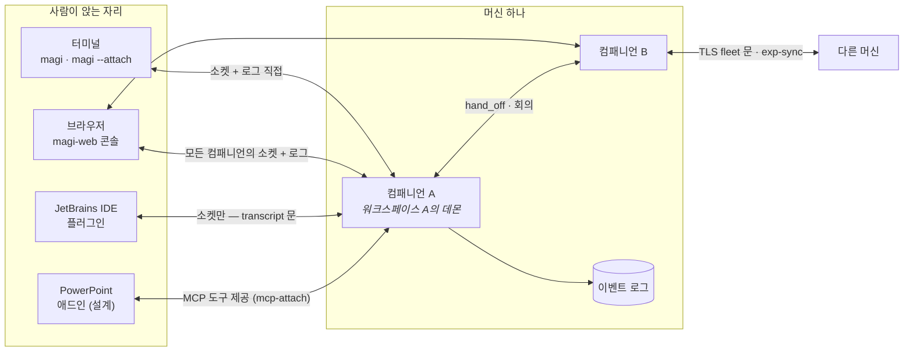

# 어디서 magi를 만나든 — 클라이언트, 컴패니언, 에이전트, 화면

[English](CLIENTS.md) · [↑ Docs](README.ko.md)

낱말 셋이면 전체 그림이 섭니다.

- **컴패니언** — 돌아가는 magi 하나. 프로세스 하나, 워크스페이스 하나의 주인이며, 이름을 갖고
  이벤트 로그(JSONL)를 씁니다. 한 머신에 여럿이 돌 수 있고, 서로 일을 넘기고(hand_off) 회의를
  열며, 머신끼리는 TLS 문으로 배운 것을 나눕니다(exp-sync).
- **에이전트** — 컴패니언 *안*의 실행 프로파일: 시스템 프롬프트 + 모델/백엔드 + 툴 목록
  (`AgentSpec`). 세션은 어떤 에이전트로 돌고, `[agents]` 명단은 `/route`가 편집하는 모델
  라우팅입니다. 서브에이전트(스폰된 자식)와 회의 참가자도 각자 에이전트 모양으로 돕니다.
- **클라이언트** — 컴패니언에 붙는 바깥 프로그램. 아래 네 자리가 오늘 식별된 전부입니다.

## 1. 당신이 앉은 자리에서 보면

| 자리 | 무엇으로 붙나 | 무엇을 보나 | 무엇을 시키나 | 언제 이걸 쓰나 |
|---|---|---|---|---|
| **터미널** (`magi`) | 엔진을 제 프로세스에 품음 | 전사·계획·카운슬 실황 | 모든 것 (본체이므로) | 그 워크스페이스에서 직접 일할 때 |
| **터미널** (`magi --attach`) | 컨트롤 소켓 + 로그 직접 읽기 | 위와 같음 | 조종(스티어·인터럽트·답) | 이미 도는 데몬을 터미널로 잡을 때 |
| **브라우저** (`magi-web`) | 이 머신 전체(+피어 머신)의 소켓·로그 | 플릿 전체, 컴패니언별 화면 (§3) | 답·인터럽트·파일·git·설정 | 여러 컴패니언을 한눈에 감독할 때 |
| **JetBrains IDE** | 컨트롤 소켓만 (JVM — 로그를 못 읽음) | 툴윈도 전사(transcript 문) | 조종 + **IDE가 도구가 됨** | 에디터 안에서 코딩 에이전트를 부릴 때 |
| **PowerPoint** (설계) | MCP 도구 + 로컬 헬퍼 | 애드인 패널 | 덱 편집을 시키고 검증받음 | 열린 덱을 에이전트가 만지게 할 때 |

셋째 열이 핵심 규칙 하나를 숨기고 있습니다: **로그를 열 수 있는 클라이언트는 로그를 직접 읽고**
(터미널·웹 — 같은 디렉토리 위에 자기 App을 세워 재구성), **못 여는 클라이언트(JVM·애드인)만
데몬의 transcript 문으로 대화를 받아** 갑니다. 문이 둘인 게 아니라, 읽는 길이 자리마다 다른
것뿐입니다.

## 2. 클라이언트별 동작

### 터미널 — 본체이자 첫 클라이언트

`magi`는 클라이언트가 아니라 엔진 그 자체로 뜨고, TUI는 같은 프로세스의 화면입니다.
`magi --attach`는 반대로 순수 클라이언트: 워크스페이스 경로에서 소켓 이름을 유도해
(WorkspaceKey) 붙고, 전사는 로그에서 재구성하며, 쓰기(스티어·인터럽트·권한 답)만 소켓으로
보냅니다. `magi -p`는 헤드리스 1회 실행입니다.

### 웹 콘솔 — 머신의 감독석

`cmd/magi-web`은 BFF입니다: 컴파일된 `web/ui` 화면(§3)을 서빙하고, 이 머신의 **모든** 컴패니언
소켓과 로그, 그리고 피어 머신의 좁혀진 fleet 문을 한 화면으로 모읍니다. 루프백에 바인드하고
자체 로그인이 없으며(조직의 방식으로 감싸는 것 — SECURITY §4), 사람별 권한은 접근 화면의
grant로 좁힙니다. 원격 머신에는 `update`·`shutdown`·`/shell` 같은 메서드가 **문 자체에 없어서**
못 시킵니다 — 거부가 아니라 부재가 경계입니다.

### JetBrains 플러그인 — 뷰어 + 손

IDE 창 하나(프로젝트 하나)를 컴패니언 하나로 만듭니다: 켜지면 그 워크스페이스의 데몬을 찾고,
없으면 띄우고, 있으면 붙습니다. JVM이라 Go 스토어를 못 여니 **셋째 뷰어**는 transcript 문으로
대화를 받고, **손**은 반대 방향입니다 — 플러그인이 자기 안에 MCP 서버를 세우고 `mcp-attach`로
컴패니언에 등록하면, 에이전트가 `mcp__ide__*` 도구로 열린 버퍼를 읽고 고칩니다. 붙는 순간
설정에는 아무것도 적히지 않고, IDE가 꺼지면 detach가 치웁니다. 소켓 이름 규칙과 도구 이름
규칙은 **양쪽(Go·Kotlin)이 같은 골든 파일로** 검사받아 한 글자의 드리프트도 "데몬이 없다"로
읽히지 않게 합니다.

### PowerPoint 애드인 — 설계 단계

아직 코드가 없는 제안입니다(`clients/powerpoint/DESIGN.md`). 방향은 셋: 에이전트는 magi 그대로
두고 **덱을 만지는 도구만 MCP로** 내놓는다(새 데몬 금지 — 컨텍스트를 가르지 않기 위해),
애드인이 **어느 컴패니언에 붙을지 고르고** 켜진 데몬이 없으면 덱이 있는 디렉토리에 띄운다,
그리고 판정의 기본 경로는 숫자와 텍스트이고 **픽셀은 마지막 수단**이다(붙는 모델이 멀티모달
이라는 보장이 없다).

### 소켓 하나로 보는 플릿 — `roster` 문 (설계 방향, 2026-08-29 확정)

웹 콘솔이 하는 컴패니언 관리를 **웹 없이**, 소켓 하나만 쥔 클라이언트(IDE 플러그인이 첫
소비자)가 할 수 있어야 한다는 방향이 정해졌습니다. 사실을 늘어놓으면 빠진 조각은 하나뿐입니다:

- **조종은 이미 됩니다.** 인터럽트·답·스티어·파일·git은 전부 각 컴패니언 *자기* 소켓의
  메서드라, 형제 소켓의 경로만 알면 어떤 클라이언트든 직접 부를 수 있습니다.
- **답도 이미 데몬 안에 있습니다.** 같은 머신은 publish 디렉토리(정확·실시간), 다른 머신은
  서명된 가십의 목격담(1시간 감쇠) — 데몬은 이 둘을 항상 **같이** 읽습니다(`Known`).
- **없는 것은 문 하나입니다.** 컨트롤 소켓에 "누가 있는가"를 묻는 메서드가 없습니다.

그래서 계약은 `roster` 메서드 하나입니다(★구현됨): 요청은 `{"method":"roster"}`, 응답은 행마다
host·socket·name·role·team/hub·workdir·state·version·능력·대기, 그리고 **어느 반쪽에서 왔는지** —
이 머신의 실측(`sighting=false`)인지, 남이 서명한 목격담(`sighting=true`)인지와 그 나이
(`ageSeconds`). 못박은 것 둘: **state 어휘는 `waiting`(사람을 기다림)·`working`·`idle` 셋**이고
"사람 기다림"은 별도 값입니다(배지가 여기 걸립니다). **이 머신의 행은 `session`(지금 대화의 id)을
실어** transcript 문에 왕복 하나로 붙게 하고, 목격담엔 없습니다 — 어차피 머신 밖으로는 구독할 수
없습니다. `about`의 caps에 `roster`로 광고해 클라이언트가 부르기 전에 알 수 있게 합니다.

경계는 transcript를 fleet 문에 올리지 않은 것과 같은 논리로 긋습니다: **가십은 발견까지,
대화와 조종은 그 컴패니언의 자기 문으로.** A가 B의 대화를 중계하면 컴패니언별 접근 경계와
신선도가 A의 것으로 뭉개집니다. 다른 머신의 행은 보이되-조종불가로 그립니다(그 머신의 키를
쥐기 전까지) — 웹 콘솔이 피어를 다루는 것과 같은 태도입니다.

**목록은 가십, 상세는 그때 붙기(2026-08-29 확정, ★구현됨).** 플릿 *목록*은 라이트입니다 —
roster 행 그대로, 로그 읽기 0. 살아 있는 행은 데몬이 публish한 상태 어휘를, 죽은 행은
`stopped`만 말하고(턴이 열려 있었는지는 로그의 사실이라 목록이 주장하지 않습니다), 작업 한
줄·계획 진행도·질문 원문·목록에서 바로 답하기는 전부 **상세 화면이 그 컴패니언에 붙는 순간**의
것입니다. 대기 배지와 인원수는 상태 어휘로 살아남습니다.

**웹도 이 문을 씁니다(★구현됨 — 목록은 아예 라이트로).** 웹 콘솔의 플릿 목록은 이제 **roster 문을 1차 소스로**
소비합니다 — 살아 있는 로컬 컴패니언 아무나 하나에게 묻고, 실측 행은 기록으로, 목격담 행은
멤버로 복원해 같은 화면을 짓습니다. 직접 경로가 남는 곳은 문이 실어 줄 수 없는 것들뿐입니다:
**폴백**(컴패니언이 전부 멈춘 머신, 문이 없는 옛 빌드 — 기록과 로그는 프로세스보다 오래 살고,
그 머신의 플릿도 그려져야 합니다), **행별 다이얼**("지금 묻고 있음" 같은 살아 있는 사실은
스냅샷이 말할 수 없어 매번 새로 물음), **로그 직접 읽기**(이력·검색·죽은 세션의 전사), 그리고
**조종**(위의 경계 그대로 각자의 문). 웹이 다른 **머신**을 다루는 태도(직접 안 붙고 목격담으로
그리되 조종불가)가 이 문이 복제한 원본입니다.

**세션 피커의 동사 둘 + 계기판의 하나(★구현됨).** 하단 독이 대화를 바꾸고 새로 열 수 있어야 해서, 컨트롤
소켓에 `sessions`(이 워크스페이스의 대화 목록 — id·첫 프롬프트 제목·모델·라벨·시각, 최근 활동
순)와 `session-new`(새 대화를 열고 **그리로 이동까지** — 하나의 동사)가 있습니다. 열린 턴
여부는 일부러 없습니다: 답하려면 로그 전부를 읽어야 하고, 그게 문제되는 대화는 지금 것뿐인데
그 id는 roster 행에 이미 있습니다. `resume`은 이 워크스페이스에 없는 id를 거부하므로 —
클라이언트는 id를 지어내지 말고 `session-new`가 돌려주는 것을 읽습니다. `job-kill`은 잡 행의 ✕ — Removed가 「있었는지」를 답해 두 번 누른 ✕는 실패가 아니라 「이미 없음」으로 읽힙니다. 그리고 `cron`은 상시
예약의 읽기 반쪽입니다(쓰기는 reload-cron): 고장난 잡 먼저 — 영영 못 도는 행은 다른 어떤
화면도 다시 언급하지 않을 행이라 — 그다음 돌 것들 임박순, **꺼진 잡은 맨 뒤**(문제도 다음도
없는 행이 일정 전체보다 앞서면 안 되므로). 행마다 다음 실행(RFC3339) 또는 빈 next와 그
사유(`problem`).

### 컴패니언끼리, 머신끼리

같은 머신 안에서 컴패니언은 서로에게 일을 넘기고(hand_off — 끝나면 첫 완결 턴의 마지막 말이
답으로 돌아옴) 회의를 엽니다(참가자는 읽기 전용 네 툴만). 머신 사이에는 ssh 키로 신뢰를 맺은
TLS 문 하나가 있고, 그 위로 좁혀진 조회와 팀 지식의 합집합 복제(exp-sync)가 흐릅니다.

**첨부는 필드입니다(★구현됨).** submit/steer는 `refs[]`(path, lines?)를 싣습니다 — IDE의
선택영역, 컴포저의 클립. 발췌는 **코어의 렌더**입니다: 워크스페이스 안에서 해석(모든 읽기와
같은 감옥 — 밖 경로는 그 자리에서 거절문으로 렌더), 에디터처럼 1-기준 포함 범위로 자르고,
ref당·전체 캡을 걸어 **프롬프트 이벤트에 영속** — 전사가 에이전트가 실제로 본 것을 보여주고
재생도 같습니다. 사라지는 첨부는 없습니다: 못 싣는 ref는 발췌가 있을 자리에서 이유를 말합니다.
잘못된 줄범위는 파일 전체로 낙하합니다 — 사람이 가리킨 건 파일이고, 범위 오타로 파일을 잃으면
중요한 절반이 사라집니다.

**보류·후보 대장.** 워크스페이스 밖 콘텐트 루트 read-only는 **보류**(2026-08-29 사용자 결정 —
워크스페이스=신뢰 경계 보존). 후보로 등재: 한 워크스페이스 동시 작업 충돌(워크트리 격리/파일
리스 — 싼 절반인 중복 workdir 경고 배지는 플러그인이 roster 재료로 처리).

**편집 승인엔 diff가 실립니다(★구현됨 — 정직하게 말할 수 있는 것만).** 권한 프롬프트는
**승인이 적용할 diff**를 싣고 다닙니다 — 앱이 한 번 계산하고, transient 이벤트·status 문·재생용
재조립 전부에 같은 값이 탑니다. 뷰어는 절대 재계산하지 않습니다. 그래서 범위도 계약입니다:
diff가 실리는 것은 **old/new 치환과 write**뿐이고, 앵커 편집({at,to} — 지워질 줄이 인자에 없음)·
replaceAll(한 번의 diff가 개수를 속임)·multiedit은 **부재**로 답해 인자 뷰로 낙하합니다 — 못
만드는 diff를 지어내는 화면이 최악이므로. 바이트 캡 64KB(잘리면 잘렸다고 말함).

**transcript 커서는 믿어도 됩니다.** seq는 컴팩션을 살아 넘습니다(스냅샷이 upToSeq를 물려받고
이후 이벤트는 번호를 유지) — 재접속 클라이언트는 마지막 seq를 `since`로 보내 증분만 받고,
데몬이 커서를 거부할 때는 restart 콜백이 「버리고 처음부터」를 먼저 말합니다.

### 새 클라이언트가 밟는 순서

이 문서의 문들을 처음 소비하는 클라이언트가 밟을 길은 넷이면 됩니다 — 전부 이미 있는 계약의
순서 정리입니다.

1. **발견**: 설정 디렉토리의 `daemon-*.sock` 글롭, 또는 아무 산 컴패니언의 `roster` 문.
   워크스페이스를 아는 클라이언트(IDE)는 소켓 이름을 유도하고(WorkspaceKey — 골든이 지킴),
   없으면 띄웁니다.
2. **악수**: `about` — 응답의 `caps`가 이 데몬이 받아 줄 문의 전부입니다(`roster`·
   `tool-servers`·`transcript`…). 부르고 거부를 읽는 게 아니라, 광고를 읽고 부릅니다.
3. **구독**: 대화는 `transcript`(리플레이+라이브, 커서 거부 시 restart 콜백), 목록 폴은
   `roster`, 피커는 `sessions`, 계기판은 `cron`·`jobs`.
4. **행동**: 조종(스티어·인터럽트·답)·파일·git은 그 컴패니언 자기 소켓의 메서드로, 도구를
   내놓는 애플리케이션이면 `mcp-attach`(URL만)로 자기를 등록하고 나갈 때 `mcp-detach`.

거부는 언제나 `err` 문자열에 사유가 실립니다 — 침묵으로 실패하는 문은 없습니다.

## 3. 웹 화면 지도 — 무엇이 무엇의 화면인가

셸이 목적지를 **컴패니언의 type으로 해석**합니다: 상세 진입 → 그 컴패니언의 타입 전용 모듈이
있으면 그것, 없으면 기본(companion-ui). 타입 1 = 코딩 에이전트 = 오늘의 magi 전부이고,
디자인·인프라 등 다른 타입은 카탈로그 한 줄 + 설치된 모듈로 들어옵니다(오퍼레이터가 설치한
모듈만 로드 — 워크스페이스가 실어 보낸 스크립트는 감독자 콘솔에 오르지 않습니다).

| 화면 (주소) | 무엇의 화면인가 | 모듈 |
|---|---|---|
| 플릿/컴패니언 목록·상세 | 컴패니언들 — 명단·사실판·오른쪽 판 | `companion-ui` |
| 대화·컴포저·워크스페이스 | 타입 1(코딩 에이전트)의 가운데·왼쪽 — 전사, 파일 트리, git | `coding-agent-ui` |
| 지식 (`v=skills`) | 경험 저장소·위키·서버 | `knowledge-ui` |
| 보드 (`v=board`) | 진행 중인 것의 판 — 문 없는 주소, 플릿에서 진입 | `board-ui` |
| 맵 (`v=map`) | 머신·계정 상자와 오간 것 | `map-ui` |
| 접근 (`v=access`) | 누가 어느 컴패니언을 보고 시키는가 — admin 게이트 | `access-ui` |
| 회의 (`v=meet`) | 방 목록과 방 하나 | `meeting-ui` |
| 설정 (`v=settings`) | 이 브라우저의 것 + 데몬이 읽는 것 | `settings-ui` |
| (셸) | 드로어·마스트헤드·스트림 소유(창당 1회선)·타입 카탈로그 | `shell-ui` |

화면 모듈은 전부 `console-bridge` 계약(렌더 등록 + 컨텍스트 수신) 하나만 지키면 되고, 스트림은
셸이 하나만 열어 창 브리지로 나눠 줍니다 — 화면이 늘어도 회선은 늘지 않습니다.

## 4. 다시 한 문장으로

**사람은 자리(클라이언트)에 앉고, 자리는 컴패니언에 붙고, 컴패니언은 에이전트로 턴을 돌며,
웹 화면은 그 각각(플릿·컴패니언 하나·그 작업물·팀 지식·접근)을 하나씩 맡아 그립니다.**
