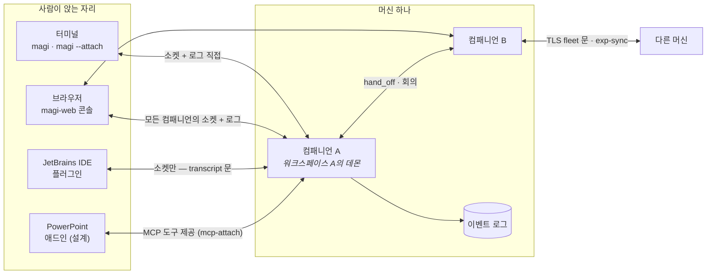

# 어디서 magi를 만나든 — 클라이언트, 컴패니언, 에이전트, 화면

[English](CLIENTS.md) · [↑ Docs](README.ko.md)

낱말 셋이면 전체 그림이 섭니다.

- **컴패니언** — 돌아가는 magi 하나. 프로세스 하나, 워크스페이스 하나의 주인이며, 이름을 갖고
  이벤트 로그(JSONL)를 씁니다. 한 머신에 여럿이 돌 수 있고, 서로 일을 넘기고(hand_off) 회의를
  열며, 머신끼리는 TLS 문으로 배운 것을 나눕니다(exp-sync).
- **에이전트** — 컴패니언 *안*의 실행 프로파일: 시스템 프롬프트 + 모델/백엔드 + 툴 목록
  (`AgentSpec`). 세션은 어떤 에이전트로 돌고, `[agents]` 명단은 `/route`가 편집하는 모델
  라우팅입니다. 서브에이전트(스폰된 자식)와 회의 참가자도 각자 에이전트 모양으로 돕니다.
- **클라이언트** — 컴패니언에 붙는 바깥 프로그램. 아래 네 자리가 오늘 식별된 전부입니다.

## 1. 당신이 앉은 자리에서 보면

| 자리 | 무엇으로 붙나 | 무엇을 보나 | 무엇을 시키나 | 언제 이걸 쓰나 |
|---|---|---|---|---|
| **터미널** (`magi`) | 엔진을 제 프로세스에 품음 | 전사·계획·카운슬 실황 | 모든 것 (본체이므로) | 그 워크스페이스에서 직접 일할 때 |
| **터미널** (`magi --attach`) | 컨트롤 소켓 + 로그 직접 읽기 | 위와 같음 | 조종(스티어·인터럽트·답) | 이미 도는 데몬을 터미널로 잡을 때 |
| **브라우저** (`magi-web`) | 이 머신 전체(+피어 머신)의 소켓·로그 | 플릿 전체, 컴패니언별 화면 (§3) | 답·인터럽트·파일·git·설정 | 여러 컴패니언을 한눈에 감독할 때 |
| **JetBrains IDE** | 컨트롤 소켓만 (JVM — 로그를 못 읽음) | 툴윈도 전사(transcript 문) | 조종 + **IDE가 도구가 됨** | 에디터 안에서 코딩 에이전트를 부릴 때 |
| **PowerPoint** (설계) | MCP 도구 + 로컬 헬퍼 | 애드인 패널 | 덱 편집을 시키고 검증받음 | 열린 덱을 에이전트가 만지게 할 때 |

셋째 열이 핵심 규칙 하나를 숨기고 있습니다: **로그를 열 수 있는 클라이언트는 로그를 직접 읽고**
(터미널·웹 — 같은 디렉토리 위에 자기 App을 세워 재구성), **못 여는 클라이언트(JVM·애드인)만
데몬의 transcript 문으로 대화를 받아** 갑니다. 문이 둘인 게 아니라, 읽는 길이 자리마다 다른
것뿐입니다.

## 2. 클라이언트별 동작

### 터미널 — 본체이자 첫 클라이언트

`magi`는 클라이언트가 아니라 엔진 그 자체로 뜨고, TUI는 같은 프로세스의 화면입니다.
`magi --attach`는 반대로 순수 클라이언트: 워크스페이스 경로에서 소켓 이름을 유도해
(WorkspaceKey) 붙고, 전사는 로그에서 재구성하며, 쓰기(스티어·인터럽트·권한 답)만 소켓으로
보냅니다. `magi -p`는 헤드리스 1회 실행입니다.

### 웹 콘솔 — 머신의 감독석

`cmd/magi-web`은 BFF입니다: 컴파일된 `web/ui` 화면(§3)을 서빙하고, 이 머신의 **모든** 컴패니언
소켓과 로그, 그리고 피어 머신의 좁혀진 fleet 문을 한 화면으로 모읍니다. 루프백에 바인드하고
자체 로그인이 없으며(조직의 방식으로 감싸는 것 — SECURITY §4), 사람별 권한은 접근 화면의
grant로 좁힙니다. 원격 머신에는 `update`·`shutdown`·`/shell` 같은 메서드가 **문 자체에 없어서**
못 시킵니다 — 거부가 아니라 부재가 경계입니다.

### JetBrains 플러그인 — 뷰어 + 손

IDE 창 하나(프로젝트 하나)를 컴패니언 하나로 만듭니다: 켜지면 그 워크스페이스의 데몬을 찾고,
없으면 띄우고, 있으면 붙습니다. JVM이라 Go 스토어를 못 여니 **셋째 뷰어**는 transcript 문으로
대화를 받고, **손**은 반대 방향입니다 — 플러그인이 자기 안에 MCP 서버를 세우고 `mcp-attach`로
컴패니언에 등록하면, 에이전트가 `mcp__ide__*` 도구로 열린 버퍼를 읽고 고칩니다. 붙는 순간
설정에는 아무것도 적히지 않고, IDE가 꺼지면 detach가 치웁니다. 소켓 이름 규칙과 도구 이름
규칙은 **양쪽(Go·Kotlin)이 같은 골든 파일로** 검사받아 한 글자의 드리프트도 "데몬이 없다"로
읽히지 않게 합니다.

### PowerPoint 애드인 — 설계 단계

아직 코드가 없는 제안입니다(`clients/powerpoint/DESIGN.md`). 방향은 셋: 에이전트는 magi 그대로
두고 **덱을 만지는 도구만 MCP로** 내놓는다(새 데몬 금지 — 컨텍스트를 가르지 않기 위해),
애드인이 **어느 컴패니언에 붙을지 고르고** 켜진 데몬이 없으면 덱이 있는 디렉토리에 띄운다,
그리고 판정의 기본 경로는 숫자와 텍스트이고 **픽셀은 마지막 수단**이다(붙는 모델이 멀티모달
이라는 보장이 없다).

### 컴패니언끼리, 머신끼리

같은 머신 안에서 컴패니언은 서로에게 일을 넘기고(hand_off — 끝나면 첫 완결 턴의 마지막 말이
답으로 돌아옴) 회의를 엽니다(참가자는 읽기 전용 네 툴만). 머신 사이에는 ssh 키로 신뢰를 맺은
TLS 문 하나가 있고, 그 위로 좁혀진 조회와 팀 지식의 합집합 복제(exp-sync)가 흐릅니다.

## 3. 웹 화면 지도 — 무엇이 무엇의 화면인가

셸이 목적지를 **컴패니언의 type으로 해석**합니다: 상세 진입 → 그 컴패니언의 타입 전용 모듈이
있으면 그것, 없으면 기본(companion-ui). 타입 1 = 코딩 에이전트 = 오늘의 magi 전부이고,
디자인·인프라 등 다른 타입은 카탈로그 한 줄 + 설치된 모듈로 들어옵니다(오퍼레이터가 설치한
모듈만 로드 — 워크스페이스가 실어 보낸 스크립트는 감독자 콘솔에 오르지 않습니다).

| 화면 (주소) | 무엇의 화면인가 | 모듈 |
|---|---|---|
| 플릿/컴패니언 목록·상세 | 컴패니언들 — 명단·사실판·오른쪽 판 | `companion-ui` |
| 대화·컴포저·워크스페이스 | 타입 1(코딩 에이전트)의 가운데·왼쪽 — 전사, 파일 트리, git | `coding-agent-ui` |
| 지식 (`v=skills`) | 경험 저장소·위키·서버 | `knowledge-ui` |
| 보드 (`v=board`) | 진행 중인 것의 판 — 문 없는 주소, 플릿에서 진입 | `board-ui` |
| 맵 (`v=map`) | 머신·계정 상자와 오간 것 | `map-ui` |
| 접근 (`v=access`) | 누가 어느 컴패니언을 보고 시키는가 — admin 게이트 | `access-ui` |
| 회의 (`v=meet`) | 방 목록과 방 하나 | `meeting-ui` |
| 설정 (`v=settings`) | 이 브라우저의 것 + 데몬이 읽는 것 | `settings-ui` |
| (셸) | 드로어·마스트헤드·스트림 소유(창당 1회선)·타입 카탈로그 | `shell-ui` |

화면 모듈은 전부 `console-bridge` 계약(렌더 등록 + 컨텍스트 수신) 하나만 지키면 되고, 스트림은
셸이 하나만 열어 창 브리지로 나눠 줍니다 — 화면이 늘어도 회선은 늘지 않습니다.

## 4. 다시 한 문장으로

**사람은 자리(클라이언트)에 앉고, 자리는 컴패니언에 붙고, 컴패니언은 에이전트로 턴을 돌며,
웹 화면은 그 각각(플릿·컴패니언 하나·그 작업물·팀 지식·접근)을 하나씩 맡아 그립니다.**
