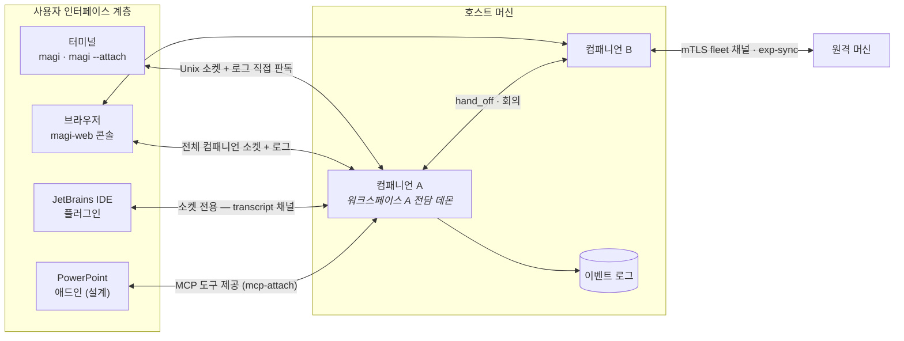

# 어디서 magi를 만나든 — 클라이언트, 컴패니언, 에이전트, 화면

[English](CLIENTS.md) · [↑ Docs](README.ko.md)

**수명주기 안정화 목표:** 대표 IDE·로컬 웹의 설치, 연결, 복구, 종료를 구현할 때는 [CLIENT_LIFECYCLE](CLIENT_LIFECYCLE.ko.md)을 함께 봅니다. 신규 소유권 인터페이스와 인수 기준은 목표 설계이며, 이 문서가 설명하는 현행 기능과 구분합니다.

전체 시스템 아키텍처는 세 가지 핵심 개념으로 구성됩니다.

- **컴패니언(Companion)** — 독립 실행 중인 단일 magi 인스턴스. 단일 프로세스로서 하나의 워크스페이스를 전담 소유하며, 고유한 이름을 보유하고 추가 전용(append-only) 이벤트 로그(JSONL)를 기록합니다. 단일 머신에서 복수의 컴패니언이 병렬 실행될 수 있으며, 상호 간에 작업을 위임(`hand_off`)하거나 다자간 회의를 소집하고, 머신 간에는 mTLS 채널을 통해 학습된 지식을 동기화(`exp-sync`)합니다.
- **에이전트(Agent)** — 컴패니언 *내부*의 실행 프로파일: 시스템 프롬프트 + 모델/백엔드 지정 + 도구 목록(`AgentSpec`). 세션은 특정 에이전트 프로파일을 기반으로 구동되며, `[agents]` 명단은 `/route` 엔드포인트를 통해 동적 수정되는 모델 라우팅 체계입니다. 하위 에이전트(동적 생성된 자식 세션)와 회의 참가자 역시 독립된 에이전트 형상으로 동작합니다.
- **클라이언트(Client)** — 컴패니언에 접속하는 외부 애플리케이션 인터페이스. 현재 다음 네 가지 형태의 클라이언트 환경이 식별되어 지원됩니다.

## 1. 클라이언트 환경별 특성 비교

| 클라이언트 | 연결 방식 | 관측 대상 | 수행 명령 | 적용 시나리오 |
|---|---|---|---|---|
| **터미널** (`magi`) | 동일 프로세스 내에 엔진 코어 내장 | 트랜스크립트, 작업 계획, 카운슬 실황 | 전 기능 (코어 본체) | 대상 워크스페이스에서 직접 단독 작업 시 |
| **터미널** (`magi --attach`) | 제어 소켓 + 파일 로그 직접 판독 | 상동 | 런타임 제어(스티어링, 인터럽트, 질의 응답) | 기동 중인 백그라운드 데몬에 터미널로 접속 시 |
| **브라우저** (`magi-web`) | 로컬 전체 및 피어 머신의 소켓/로그 통합 | 클러스터 플릿 전체, 컴패니언별 상세 화면 (§3) | 응답, 인터럽트, 파일 탐색, git 조작, 설정 관리 | 다수의 컴패니언을 단일 화면에서 중앙 감독 시 |
| **JetBrains IDE** | 제어 소켓 전용 (JVM — Go 로그 파일 직접 판독 불가) | 툴 윈도우 트랜스크립트(transcript 채널) | 제어 명령 주입 + **IDE 자체 기능의 도구화** | IDE 에디터 환경 내에서 코딩 에이전트를 조작 시 |
| **PowerPoint** (설계) | MCP 도구 프로토콜 + 로컬 헬퍼 | 애드인 작업창 패널 | 슬라이드 덱 편집 지시 및 검증 결과 수신 | 에이전트에게 프레젠테이션 문서 편집을 위임 시 |

상기 비교표는 중요한 아키텍처 규칙을 나타냅니다: **파일 로그에 직접 접근 가능한 클라이언트는 로그를 직접 판독하여 상태를 재구성**하고(터미널 및 웹 콘솔 — 동일 파일 디렉터리 기반으로 자체 App 인스턴스를 초기화하여 이벤트 재생), **파일 접근이 불가능한 클라이언트(JVM 기반 IDE, 오피스 애드인 등)는 데몬의 transcript 소켓 채널을 통해서만 대화 데이터를 수신**합니다. 이중화된 통신 채널이 아닌, 실행 환경의 I/O 제약에 따른 최적화된 경로 분기입니다.

## 2. 클라이언트별 동작

### 터미널 — 본체이자 첫 클라이언트

`magi`는 단순 클라이언트가 아니라 엔진 코어 그 자체로 기동되며, TUI는 동일 프로세스 내의 화면 계층입니다.
반면 `magi --attach`는 순수 클라이언트 역할을 수행합니다: 대상 워크스페이스 경로로부터 고유 소켓 이름을 유도(WorkspaceKey)하여 접속하고, 트랜스크립트는 로컬 이벤트 로그로부터 재구성하며, 쓰기 작업(스티어링, 인터럽트, 권한 승인 응답)만 소켓을 통해 송신합니다. `magi -p`는 비대화형(headless) 단발성 실행 모드입니다.

### 웹 콘솔 — 머신의 감독석

`clients/web/server`는 BFF(Backend For Frontend) 구조를 취합니다: 컴파일된 `clients/web/ui` 화면(§3)을 서빙하고, 로컬 머신의 **모든** 컴패니언 소켓 및 로그 파일과 피어 머신의 제한된 fleet 채널을 단일 화면으로 통합 집약합니다. 루프백 인터페이스(127.0.0.1)에 바인딩되며 자체 사용자 인증 체계를 내장하지 않고(조직의 기존 프록시/인증 체계로 래핑 — SECURITY §4), 사용자별 권한 범위는 접근 제어 화면의 grant 설정을 통해 세분화하여 제한합니다. 원격 머신에 대해서는 `update`, `shutdown`, `/shell` 같은 관리 메서드가 **엔드포인트 인터페이스 자체에 정의되어 있지 않아** 호출 자체가 불가능합니다 — 이는 인가 거부가 아닌 인터페이스 부재에 의한 엄격한 신뢰 경계 설정입니다.

### JetBrains 플러그인 — 뷰어 + 손

단일 IDE 창(프로젝트 하나)을 하나의 컴패니언 인스턴스와 일대일 매핑합니다: 플러그인이 로드되면 해당 워크스페이스의 백그라운드 데몬 존재 여부를 확인하고, 없으면 새로 기동하며, 있으면 즉시 연결됩니다. JVM 환경 특성상 Go 언어로 작성된 스토어 파일에 직접 접근할 수 없으므로, **세 번째 뷰어** 계층은 transcript 소켓 채널을 통해 대화 데이터를 실시간 수신합니다. 반면 제어 및 조작(**손**)은 역방향으로 동작합니다 — 플러그인이 자체 내부에 임베디드 MCP 서버를 호스팅하고 `mcp-attach` 프로토콜로 컴패니언에 등록하면, 에이전트가 `mcp__ide__*` 도구 군을 호출하여 현재 에디터에 열려 있는 버퍼 내용을 읽고 수정합니다. 이 연결 시점에 영구 설정 파일(`config.toml`)에는 어떠한 변경도 기록되지 않으며, IDE 프로세스가 종료되면 detach 프로세스를 거쳐 등록이 정리됩니다. 프로세스 강제 종료 등으로 detach를 수행하지 못하고 종료된 점유자(dead holder)가 도구 이름을 영구적으로 독점하지는 않습니다 — 후속 attach 요청 시 기존 점유자의 생존 여부를 단시간 프로빙하여 프로세스가 종료되었으면 점유권을 정상 인계받고, 여전히 살아 있다면 중복 등록 요청을 명시적으로 거절합니다. 소켓 명명 규칙과 도구 명명 규칙은 **양측(Go 코어 및 Kotlin 플러그인)이 동일한 골든 테스트 파일(golden file)을 공유하여 교차 검증**되므로, 단 한 글자의 명칭 불일치(drift)로 인해 "데몬 미존재" 오류가 발생하는 결함을 원천 방지합니다.

### PowerPoint 애드인 — 출시됐고, 자리 잡은 모양

`clients/powerpoint/` — 웹 작업창 패널을 호스팅하고 MCP 프로토콜로 통신하는 로컬 헬퍼(`magi office`, Go 언어 구현 — `clients/office/helper`로 PowerPoint, Excel, Word 3개 오피스 앱이 단일 프로세스, 단일 인증서, 단일 로컬 포트를 공유), 프레젠테이션 슬라이드 덱을 직접 조작하는 Office.js 애드인(`addin/`), 그리고 약 45개의 전용 도구 모음으로 구성됩니다. 당초 설계 제안에서 확정된 3대 아키텍처 원칙이 그대로 안착되었습니다: 에이전트는 기존 magi 엔진을 그대로 유지하고 덱 조작 도구는 데몬의 `mcp-attach` 채널을 통해 **MCP 규격으로** 등록되며, 작업창은 헬퍼가 해당 덱의 워크스페이스 경로에 프로비저닝한 컴패니언에 **자동 접속**하고(자동 접속 실패 시에만 컴패니언 선택 화면 노출), 모델의 판단은 수치와 텍스트 데이터를 우선적으로 참조하며 픽셀 렌더링은 최종 수단으로 지연 활용합니다(`render_shape`는 단일 도형 대상 가벼운 렌더링, `render_slide`는 전체 슬라이드 대상 고비용 렌더링).

초기 설계 제안 단계에서 예측하지 못했으나 2026-09-04 및 05일 실측 테스트를 거쳐 도출된 핵심 엔지니어링 결정 두 가지:

- **단일 데몬, 덱별 독립 대화 세션 분리.** 동시에 열린 복수의 덱 파일이 단일 컴패니언 인스턴스를 공유하되, 각 덱은 독립된 대화 세션과 개별 도구 등록 상태를 유지합니다(`mcp-attach`의 `owner` 필드, `session-new`의 `keep` 필드 활용). MCP 요청 라우팅 주소에 대상 덱 식별자가 포함되므로, 도구 호출 시 `document` 인자를 생략하더라도 해당 덱으로 안전하게 격리 전달됩니다. 각 덱은 프레젠테이션 메타데이터 태그에 자체 식별명을 보존하므로 연결이 재수립되어도 이름이 변하지 않습니다. 대화 세션 또한 덱의 식별명을 명시합니다: `keep` 속성을 동반한 `session-new`는 `name` 인자(해당 대화 세션의 **소유 주체**, 즉 문서 키)를 전달받아 데몬이 세션 메타데이터에 기록하며, `sessions` 목록 조회 시 `for` 필드로 이를 반환합니다. 헬퍼가 재시작되어 인메모리 바인딩이 초기화되더라도(데몬의 디스크 저장소는 보존됨) 기존 문서에 매핑된 활성 대화를 빈 세션으로 덮어쓰지 않는 메커니즘이 바로 이 구조입니다: `sessions` 엔드포인트를 조회하여 `for` 필드가 해당 문서와 일치하는 최신 레코드를 획득하고, 일치하는 레코드가 없을 때만 신규 세션을 생성합니다(2026-09-06/07 Excel 실측 확인 — 기존에는 헬퍼 프로세스 재시작 시마다 작업창의 이전 3개 턴 대화 내역이 유실되던 결함 수정). 도구 서버가 메타데이터로 선언하고 코어가 파싱하는 두 가지 추가 속성: `annotations.readOnlyHint`(언제든 재조회 가능한 조회성 결과 — 컨텍스트 축약/컴팩션 시 최우선 삭제 대상) 및 스키마 프로퍼티의 `"x-magi-topic": true`(해당 호출이 다루는 작업 단위를 식별하는 인자 — 시트명, 슬라이드 번호, 문단 등 — 컨텍스트 축약 시 이 토픽을 기준으로 샤딩 분할하여 향후 `recall_context`로 정밀 복원 가능).
- **헬퍼는 상태 결정을 영구 기억하지 않는 무상태(stateless) 구조를 유지해야 한다.** 초기 구현에서는 6개의 신원 식별자를 4개의 맵에 서로 다른 키로 분산 보관함에 따라, 4가지 재기동 시나리오마다 특정 맵의 캐시 데이터가 무효화되는 버그가 발생했습니다(하루 동안 수정한 14개 버그가 각각 이 매핑 테이블의 개별 항목 결함이었음). UI 창, 데몬, 덱 문서의 실제 상태를 직접 질의하고 그 불일치를 동기화하는 멱등적 `reconcile(deck)` 단일 파이프라인으로 일원화하는 재설계 규격이 `DESIGN.md` §5.9에 정의되어 있으며, 차기 구현 과제로 진행됩니다.

2026-09-06부터 작업창은 호스트 머신의 제어 핸들도 함께 제공합니다 — 이는 모두 데몬 소켓 인터페이스 위에 헬퍼가 래핑한 프록시 엔드포인트입니다: 프로바이더 및 모델 선택 드롭다운(`/api/models` → `models` 조회 및 프로바이더 목록 제공, `/api/model` → `use-backend` + `set-model` 연계, 다음 턴부터 즉시 반영), 신규 `context` 엔드포인트를 기반으로 시각화하는 컨텍스트 사용량 표시줄(컨텍스트 윈도우가 얼마나, 어떤 구성 요소로 채워져 있는지 — 시스템 프롬프트, 도구 명세, 대화 본문, 도구 호출 파라미터, 실행 결과별 분할 표시; 첫 번째 턴 시작 전이나 컨텍스트 축약 직후에도 데몬이 전송할 시스템 프롬프트 및 도구 명세 테이블의 토큰 크기를 즉시 실측 계산하여 표시하며 결측으로 취급하지 않음), 컨텍스트 축약 트리거 버튼(`/api/compact` → `compact`). 카운슬(합의 게이트) 토글 스위치는 데몬 프로세스의 재시작을 수반하므로 작업창에서 사용자 확인을 선행합니다 — 해당 데몬에 접속 중인 다른 모든 클라이언트의 세션 연결도 동시에 일시 단절되기 때문입니다.

### Excel 애드인 — 파워포인트 모양을 복사해 슬라이드 자리에 시트를

`clients/excel/`(2026-09-06 구현) — PowerPoint의 동일한 작업창 아키텍처를 기반으로 조작 레이어만 스프레드시트용으로 분기한 구성입니다(`magi office`의 `/xl` 엔드포인트, MCP 서버 식별자 `xl`, 전용 도구 61개 제공; Word 버전인 `/word`, 서버 식별자 `word`, 도구 44개도 동일 구조를 공유).
PowerPoint와의 본질적인 기술적 차이점 한 가지: **레거시 COM 기반 조작 레이어를 사용하지 않습니다.** Excel 2019, 2021, Microsoft 365 환경 모두 `ExcelApi 1.7` 이상을 기본 지원하므로(Excel 2021은 1.14 지원), 모든 플랫폼에서 Office.js 웹 작업창이 직접 조작 인터페이스로 기능하며 호스트 런타임은 이를 그대로 수용합니다. 제공되는 61개 도구 전량이 실제 통합 문서 환경(macOS 버전 16.112.3)에서 정상 검증되었으며, 동일 날짜에 Windows 2021 볼륨 라이선스 환경에도 배포되어 작업창 인터페이스를 통한 셀 데이터 수정이 정상 확인되었습니다. 현재 헬퍼 코드는 공통 패키지 추출 방식이 아닌 파일 복제 방식으로 구성되어 있으며 — 이에 대한 기술 부채는 해당 모듈의 ARCHITECTURE 문서에 명시되어 있고, 세 번째 Office 제품군 클라이언트 통합 이전에 리팩터링으로 해소될 예정입니다.

### 소켓 하나로 보는 플릿 — `roster` 문 (설계 방향, 2026-08-29 확정)

웹 콘솔이 수행하던 컴패니언 플릿 관리 기능을 **웹 인터페이스 없이**, 단일 제어 소켓만 보유한 경량 클라이언트(IDE 플러그인이 1차 대상)에서도 완결할 수 있어야 한다는 아키텍처 방향이 수립되었습니다. 기술적 사실 관계를 정리하면 필요한 조각은 단 하나뿐입니다:

- **제어 명령 인터페이스는 이미 완비되어 있습니다.** 인터럽트, 사용자 응답, 스티어링, 파일 읽기/쓰기, git 조작 등은 모두 각 컴패니언 *자체* 제어 소켓이 제공하는 메서드이므로, 형제 컴패니언의 소켓 경로만 확보하면 임의의 클라이언트에서 직접 호출할 수 있습니다.
- **상태 조회 데이터 역시 데몬 내부에 이미 존재합니다.** 동일 머신의 경우 publish 디렉터리(정밀한 실시간 파일 상태), 타 머신의 경우 암호화 서명된 가십 프로토콜 목격담(1시간 TTL 감쇠)을 보유하며 — 데몬은 항상 이 두 소스를 통합 조회합니다(`Known`).
- **부재했던 것은 단일 조회 인터페이스뿐이었습니다.** 기존 제어 소켓에는 "현재 어떤 컴패니언들이 존재하는가"를 일괄 질의하는 전용 메서드가 없었습니다.

이에 따라 확정된 규약이 `roster` 메서드입니다(★구현 완료): 클라이언트 요청 포맷은 `{"method":"roster"}`이며, 응답은 개별 컴패니언 레코드 배열 형태로 host, socket, name, role, team/hub, workdir, state, version, capabilities, waiting 여부를 포함하고, 특히 **해당 정보의 출처 분류** — 로컬 머신의 직접 실측치인지(`sighting=false`), 피어 노드가 서명한 가십 목격담인지(`sighting=true`) 및 경과 시간(`ageSeconds`)을 명시합니다. 확정된 핵심 규격 두 가지: **상태(state) 어휘는 `waiting`(사용자 입력 대기), `working`(작업 진행 중), `idle`(유휴) 세 가지로 엄격히 제한**되며, "사용자 입력 대기"는 별도 상태값으로 취급되어 UI 상태 배지의 기준이 됩니다. 또한 **로컬 머신의 레코드에는 `session`(현재 활성 대화 세션 ID)이 포함되어** 단 한 번의 왕복 요청으로 transcript 채널 구독이 가능하도록 지원하며, 목격담 레코드에는 세션 ID가 포함되지 않습니다 — 로컬 머신 외부로는 트랜스크립트 스트림을 원격 구독할 수 없기 때문입니다.

로컬 레코드에는 **실행 중인 프로세스 런타임에만 존재하는 실측 데이터**가 함께 적재됩니다 — `permission`(현재 적용 중인 권한 승인 모드), `backend`(요청이 라우팅되는 LLM 백엔드), `model`(현재 세션에 할당된 모델 식별자), `user`. 이 정보들은 파일 시스템에 공표된 정적 메타데이터에는 없고 어떠한 외부 클라이언트도 임의 유도할 수 없는 동적 값이며, 플릿 목록 조회를 위해 사전 프로빙을 수행했으므로 데몬이 이미 확보하고 있습니다. 이 필드들을 누락할 경우 웹 콘솔 UI가 해당 설정 입력 폼을 빈 칸으로 렌더링한 후, **기존에 표시된 적 없는 기본값을 강제 변경하라는 모달을 노출하는 결함**이 발생했습니다. 반면 가십 목격담 레코드에는 이러한 런타임 필드를 전혀 포함하지 않습니다 — 원격 머신의 권한 승인 모드는 로컬 머신이 직접 검증한 사실이 아니기 때문입니다. 해당 지원 여부는 `about` 응답의 `caps` 목록에 `roster`로 명시되어 클라이언트가 사전 확인 후 호출할 수 있습니다.

신뢰 및 통신 경계는 transcript 데이터를 fleet 채널에 직접 노출하지 않는 아키텍처 원칙과 동일한 논리로 설정됩니다: **가십 프로토콜은 탐색(discovery)까지만 담당하고, 실제 대화 스트림 및 제어 명령은 대상 컴패니언 자체의 고유 소켓을 통해서만 수행합니다.** A 컴패니언이 B 컴패니언의 대화 데이터를 중계할 경우, 컴패니언별 개별 접근 인가 경계와 데이터 최신성(freshness) 보장이 A의 권한으로 왜곡되기 때문입니다. 따라서 타 머신의 컴패니언 레코드는 UI상에 '관측 가능하나 직접 제어 불가' 상태로 렌더링됩니다(해당 원격 머신의 인증 키를 직접 확보하여 통신하기 전까지) — 이는 웹 콘솔이 피어 노드를 다루는 보안 정책과 동일합니다.

**목록 조회는 가십 기반 경량 처리, 세부 정보는 대상 연결 시점 로드(2026-08-29 확정, ★구현 완료).** 플릿 *목록(list)* 화면은 경량(lightweight)으로 동작합니다 — roster 반환 레코드를 그대로 표시하며 로그 파일 판독 I/O는 일절 발생하지 않습니다. 정상 기동 중인 레코드는 데몬이 공표한 상태 어휘를 노출하고, 정지된 레코드는 `stopped` 상태만 표기하며(기존 턴이 미완료 상태였는지는 로그 파일의 영역이므로 목록 단계에서는 판단하지 않습니다), 구체적인 한 줄 작업 요약, 플랜 진행률, 대기 중인 질의 원문, 목록 내 즉시 응답 등은 모두 **상세 화면이 해당 컴패니언에 직접 연결되는 시점**에 지연 조회됩니다. 대기 배지와 활성 인스턴스 수는 상태 어휘 자체로 온전히 판별 가능합니다.

**웹 콘솔 역시 roster 문을 기본 소스로 소비한다(★구현 완료 — 목록 화면의 전면 경량화).** 웹 콘솔의 플릿 목록 뷰는 이제 **roster 엔드포인트를 1차 원천 데이터(source of truth)로** 소비합니다 — 정상 동작 중인 로컬 컴패니언 중 임의의 하나에 질의하여, 로컬 실측 레코드는 과거 기록으로, 목격담 레코드는 플릿 멤버로 역직렬화하여 동일한 대시보드를 렌더링합니다. 직접 파일 경로 접근이 유지되는 영역은 제어 소켓이 직접 제공할 수 없는 특수 시나리오로 한정됩니다: **폴백 경로**(호스트 머신의 모든 컴패니언이 종료된 상태이거나 소켓 문이 없는 구형 빌드 환경 — 상태 기록과 이벤트 로그는 프로세스 수명보다 오래 보존되므로 해당 머신의 플릿 상태는 여전히 렌더링되어야 함), **레코드별 실시간 다이얼로그**(현재 사용자 입력을 대기 중인 대화 세부 상태 등 휘발성 정보는 스냅샷에 고정될 수 없어 개별 질의 수행), **로그 직접 판독**(전체 작업 이력, 텍스트 검색, 종료된 세션의 과거 트랜스크립트 재생), 그리고 **개별 제어**(상기 경계 원칙에 따라 각 컴패니언 고유 소켓으로 직접 전송). 웹 콘솔이 원격 **머신**을 취급하는 방식(직접 소켓 접속을 피하고 목격담으로 시각화하되 제어는 비활성화)이 이 통신 규약의 기준 모델입니다.

**세션 선택기(picker) 전용 2개 메서드 + 대시보드 전용 1개 메서드(★구현 완료).** 하단 인터페이스 독(dock)에서 활성 대화 세션을 전환하거나 신규 세션을 즉시 생성할 수 있어야 하므로, 제어 소켓에 `sessions`(해당 워크스페이스의 대화 목록 반환 — 세션 ID, 첫 프롬프트 기반 제목, 사용 모델, 식별 라벨, 세션을 생성한 클라이언트가 지정한 `for` 속성, 생성 시각을 최근 활동 역순으로 정렬) 및 `session-new`(새 대화 세션을 생성함과 동시에 **해당 세션으로 현재 활성 포인터를 즉시 이동**하는 단일 원자적 작업)가 추가되었습니다. 미완료 턴의 존재 여부는 의도적으로 응답에서 제외됩니다: 이를 판별하려면 전체 로그 파일을 순회 판독해야 하며, 미완료 턴 여부가 문제되는 대상은 현재 세션뿐이고 해당 세션 ID는 이미 roster 응답 레코드에 포함되어 있기 때문입니다. `resume` 메서드는 현재 워크스페이스에 존재하지 않는 세션 ID를 엄격히 거부하므로 — 클라이언트는 임의로 ID를 조합하지 말고 `session-new`가 반환한 정규 ID를 사용해야 합니다. `job-kill`은 작업 목록 테이블의 작업 취소(✕) 버튼을 담당합니다 — 반환값의 Removed 필드가 실제로 대상 작업이 존재했었는지를 명시하므로, 연속으로 두 번 취소 버튼을 클릭한 경우 실패 오류가 아니라 '이미 제거됨'으로 정상 처리됩니다. 또한 `cron`은 백그라운드 상시 예약 작업의 조회 측면을 전담합니다(수정 작업은 reload-cron 활용): 오류가 발생한 비정상 작업이 최우선 정렬되고(영구 실행 불가 상태의 작업은 다른 화면에서 재노출되지 않으므로 최우선 해결 대상), 그 뒤로 다음 실행 시점이 임박한 작업들이 오름차순 정렬되며, **비활성화된 작업은 최하단에 배치**됩니다(오류도 없고 실행 예정도 없는 작업이 전체 스케줄보다 상위에 노출되지 않도록 방지합니다). 각 작업 레코드에는 RFC3339 형식의 차기 실행 시각 또는 비어 있는 next 필드와 그 발생 사유(`problem`)가 수록됩니다.

**서브에이전트의 독립 대화 세션 추적(`children`, ★구현 완료).** 하위(자식) 에이전트는 부모와 분리된 독립 세션 컨텍스트에서 실행됩니다 — 부모 세션의 로그에는 하위 에이전트를 스폰한 도구 호출 기록만 남을 뿐, 자식 프로세스가 수행한 구체적인 실행 내역은 포함되지 않습니다. 따라서 서브에이전트의 작업 과정을 상세 뷰로 표시하려면 자식 세션 ID와 해당 세션의 트랜스크립트 데이터가 필수적입니다. 기존 두 개의 소켓 엔드포인트가 절반의 정보만 제공하고 있었습니다: `jobs`는 현재 실행 중이거나 직전에 완료된 자식 작업을 인메모리 레지스트리로 관리하지만(저장 용량 상한이 존재하며 데몬 재시작 시 초기화됨), `transcript`는 하위 세션 ID 역시 최상위 세션 ID와 동일하게 수신할 수 있었습니다. 누락되어 있던 영역은 과거 이력 추적에 있었습니다. 신규 `children` 엔드포인트는 특정 세션이 실행한 모든 서브에이전트 대화 목록을 **영구 로그에 기록된 상태 그대로** 조회하므로, 지난주에 종료된 자식 작업이나 그 사이에 데몬 프로세스가 재시작된 환경에서도 온전한 세션 목록을 반환합니다 — "해당 서브에이전트가 실제로 어떤 작업을 수행했는가"를 감사하는 시점은 대개 프로세스 종료 이후이기 때문입니다. 부모 세션 ID는 필수 인자이며 빈 값은 즉시 거절됩니다: "현재 활성 세션"의 정의는 호출 주체마다 상이하므로, 암묵적 기본값을 허용할 경우 호출자에 따라 전혀 다른 엉뚱한 대화 목록을 반환하는 결함이 발생합니다. 등록된 자식이 없는 경우 에러가 아니라 빈 배열(`[]`)과 OK 상태를 반환해야 합니다 — "실행된 자식 세션이 없음"과 "구형 빌드 데몬이 해당 API를 미지원함"은 클라이언트 UI에서 명확히 분기 처리되어야 하며, 이를 위해 기능 지원 핸드셰이크가 존재합니다. 다자간 회의(meeting) 역시 동일한 메커니즘으로 동작합니다: 각 회의 참가자는 독립된 자식 세션 내부에서 회의 턴을 처리하므로, 로컬 컴패니언이 회의실에서 발언한 내용은 해당 자식 세션의 트랜스크립트로 기록됩니다. 레코드는 세션의 생성 출처를 나타내는 `origin` 필드를 포함하며, 이를 통해 자식 세션의 유형을 구분합니다(회의실 세션의 경우 `"meeting"`). `agent` 필드는 식별 기준이 **아닙니다**: 모든 자식 세션이 동일한 문자열 식별자를 기록할 수 있으며, 라이브 회의 도중 회의실 세션이 `agent="spawn"`으로 역직렬화되어 반환되는 케이스가 실측 검증되었습니다.

**클라이언트 환경에서의 상시 작업 직접 편집(`cron`·`cron-set`·`cron-remove`, ★구현 완료).** 작업 조회 엔드포인트(`cron`)가 작업의 **실행 프롬프트 전문**(`prompt`)을 직접 반환합니다. 코어 엔진은 내부적으로 이 데이터를 이미 전달하고 있었으나 소켓 직렬화 단계에서 누락되고 있었으며, 이로 인해 클라이언트 UI에서 작업 편집 모달을 제공할 수 없었습니다 — 작업의 등록 여부와 다음 스케줄 시점은 표시할 수 있어도 **해당 작업이 구체적으로 무엇을 수행하는지**를 확인할 수 없었기 때문입니다. 쓰기 엔드포인트는 단일 변경 요청을 수신한 후 **갱신된 전체 작업 목록**을 즉각 반환합니다: 변경을 요청한 클라이언트는 즉시 화면을 갱신해야 하며, 별도의 2차 재조회 왕복을 수행할 경우 동시성 경합으로 인해 목록 불일치가 발생할 위험이 있기 때문입니다. 요청의 승인과 거절은 **텍스트 메시지가 아닌 엄격한 데이터 상태 변화로** 판정합니다 — 엔진 코어는 정상 처리와 거절 모두를 에러 없는 일반 메시지 문자열로 반환하므로(해당 텍스트는 모델에게 제공하기 위한 응답임), 소켓 레이어에서는 실제 작업 목록의 변경 여부를 대조하여 아무런 변경도 발생하지 않은 경우 해당 안내 메시지를 거절 사유로 변환하여 응답합니다. 작업 식별자(name)의 임의 수정은 허용하지 않고 즉시 거부합니다: 작업 식별자는 설정 파일(`config.toml`)의 TOML 테이블 헤더로 매핑되므로, 임의로 이름이 변경되면 사용자가 소스 설정 파일에서 해당 작업을 추적할 수 없게 됩니다. 읽기-수정-쓰기 제어는 타 설정 작업과 동일한 동기화 게이트를 통해 직렬화됩니다 — 복수의 편집기가 동시에 저장 요청을 보낼 경우 각자 자신이 읽었던 시점의 설정 파일을 기준으로 안전하게 병합 처리합니다. `enabled` 플래그는 네트워크 와이어 상에서 **불리언 포인터(nullable)** 타입으로 전송됩니다: null 값은 "기존 활성화 상태를 그대로 유지함"을 의미해야 하며, 기본값 false로 처리될 경우 단순 프롬프트 수정 작업이 비활성화된 작업을 의도치 않게 재가동하거나 역으로 활성 작업을 꺼버리는 결함이 발생합니다. 이 엔드포인트들의 목적은 클라이언트가 워크스페이스의 `config.toml` 파일을 직접 파싱하고 생성해야 하는 부담을 완전히 제거하는 것입니다 — 설정 파일의 물리적 저장 위치, 테이블 헤더 명명 규칙, 3단계 설정 레이어(global / project / companion)의 우선순위 병합 규칙을 개별 클라이언트가 중복 구현할 경우 클라이언트마다 각기 다른 파싱 버그가 필연적으로 발생하기 때문입니다. 다중 사용자 환경에서의 권한 관리는 상위 계층에서 유지됩니다: 역할 기반 접근 제어가 적용된 웹 콘솔은 API 호출 이전에 자체 권한 확인을 거칩니다(예약 작업은 스케줄 시계가 결합된 자율 프롬프트 실행이기 때문입니다).

### 컴패니언끼리, 머신끼리

동일 호스트 머신 내부에서 컴패니언 인스턴스들은 상호 간에 작업을 위임(`hand_off` — 위임 작업이 완료되면 최종 완결된 턴의 마지막 메시지가 결과로 반환됨)하거나 다자간 회의를 소집합니다(회의 참가자 에이전트는 읽기 전용 4개 도구로 권한이 엄격히 제한됩니다). 서로 다른 머신 간에는 SSH 키 교환 기반으로 신뢰를 수립한 단일 mTLS 채널이 개설되며, 이를 통해 제한된 스코프의 상태 조회 및 팀 지식 저장소의 합집합 동기화(`exp-sync`)가 수행됩니다.

**submit 및 steer 명령은 명시적으로 지정된 세션을 정확히 표적한다(★동작 고정).** 공표된 "현재 활성 세션"이 아닌 다른 특정 세션 ID로 전송할 경우 — **해당 세션에 새로운 턴이 개방되어 실행됩니다**. 동시성 직렬화는 세션 단위로만 보장됩니다(동일 세션에 두 번 연속 전송하면 현재 진행 중인 턴이 후속 입력을 재판독하여 흡수함). 시스템에 등록되지 않은 임의의 가짜 ID는 스토어 계층에서 즉시 거부됩니다(유효한 세션은 `session-new`에 의해서만 생성됨). 단, 주의해야 할 아키텍처 제약이 존재합니다: **동일 워크스페이스 내에서 서로 다른 세션이 동시에 복수의 턴을 실행하는 경우, 파일 시스템 레벨의 동시성 경합은 엔진 레벨에서 자동 조정되지 않습니다** — 동일한 소스 트리 위에서 두 에이전트가 동시에 파일 수정을 시도하는 상황이 발생할 수 있으므로, 크론 작업조차 Running 게이트 검사를 통해 기존 턴이 돌고 있으면 자체적으로 실행을 건너뜁니다("skipped, X is still going in this workspace"). 따라서 다중 탭 환경에서 동시 입력을 지원하려는 클라이언트는 호출부에서 동일한 사전 게이트를 구현해야 합니다(roster 및 status 조회를 통해 mid-turn 상태를 감지하고 사용자에게 경고 및 안내 제공). 동시성 경합의 근본적인 구조적 해결책(git worktree 기반 워크스페이스 격리 및 파일 리스 잠금)은 차기 백로그 과제로 등록되어 있습니다.

**첨부 참조는 구조화된 필드로 전송된다(★구현 완료).** submit 및 steer 요청은 `refs[]`(path, lines?) 배열 필드를 수반합니다 — 이는 IDE 환경의 에디터 선택 영역이나 웹 컴포저의 클립 첨부 기능에 해당합니다. 첨부 텍스트의 발췌(extraction)는 **코어 엔진의 렌더링 계층**에서 일괄 수행됩니다: 워크스페이스 루트를 기준으로 경로를 해석하고(모든 파일 읽기 도구와 동일한 디렉터리 탈출 방지 샌드박스 적용 — 워크스페이스 외부 경로는 해당 위치에 명시적 거부 텍스트로 치환 렌더링), 에디터 규칙과 일치하도록 1-based 인덱스의 inclusive 범위로 라인을 슬라이싱하며, 참조당 16KB 및 전체 첨부 합산 64KB의 크기 상한선(헤더 메타데이터를 포함하여 계산하며, 상한을 초과하는 참조는 해당 지점에서 절단되고 후속 내용은 "+N more attachment(s) not shown" 요약 라인으로 축약됨)을 적용하여 **프롬프트 이벤트에 영구 기록**됩니다 — 이를 통해 트랜스크립트 로그는 에이전트가 실제로 전달받은 원문 컨텍스트를 충실히 보존하며 과거 재생 시에도 완전히 동일한 입력이 재현됩니다. 어떠한 첨부 참조도 조용히 유실되지 않습니다: 적재가 불가능한 참조는 본문이 위치할 자리에 명확한 실패 사유를 기재합니다 — 이 거부 안내문 자체도 512바이트 크기 캡으로 계수 및 제한됩니다(오류 문자열이 네트워크 와이어 상에서 무한정 비대해지던 결함 차단). 옵저버 플러그인의 user-message 이벤트 관찰 스트림에는 **사용자가 직접 입력한 발화 본문만** 전달되며, 엔진이 렌더링한 첨부 블록은 전송에서 제외됩니다 — 워크스페이스 내부의 실제 파일 데이터는 파일 접근 권한(file grant) 절차를 거쳐 열람해야 하며, 이벤트 알림 채널을 통한 비인가 우회 데이터 수취를 방지하기 위함입니다. 잘못 지정된 라인 범위(out of bounds)는 파일 전체 읽기로 안전하게 폴백됩니다 — 사용자의 본래 의도는 해당 파일의 참조이며, 단순 라인 범위 오타로 인해 파일 컨텍스트 전체를 유실하는 부작용을 방지하기 위한 조치입니다.

**보류 및 후보 백로그 과제.** (Wave 2 안정화 점검에서 도출된 4건의 관찰 사항: 팀 공유 store의 WikiTouch/재관측 카운트 lost-update 동시성 이슈(권고 성격의 지표이므로 위험도 낮음), repolicy 정책 변경 후 기개방된 트랜스크립트 스트림에 대한 재검증 누락, 미초기화(unborn) 세션 메타데이터의 데몬 수명 주기 내 완만한 누적, notifyAnswers의 피어 노드 빈값 검증 미흡 — 원격 handoff 기능 도입 시점에 재검토 예정.) 워크스페이스 외부 콘텐츠 루트에 대한 읽기 전용 접근 허용은 **보류**(2026-08-29 아키텍처 결정 — '워크스페이스 루트 = 엄격한 신뢰 경계' 원칙 보존 목적).

**설정 조작을 위한 단일 제어 소켓 인터페이스(★구현 완료)** — `config-get` 엔드포인트는 허용 목록(whitelist)에 등록된 키에 대해 코어 엔진이 실제로 참조하는 최종 평가값, 해당 값을 결정한 우선순위 계층(env 환경 변수 / companion 인스턴스 설정 / project 워크스페이스 설정 / global 사용자 전역 설정), 실제 쓰기가 적용될 대상 파일 경로, 그리고 변경 사항의 반영 시점(reload timing)을 반환합니다(반영 시점은 **키 고유의 속성**입니다 — 특정 설정은 매 턴 실행 시 동적으로 재판독되고, 특정 설정은 데몬 프로세스 기동 시점에 1회만 로드됩니다). `config-set`은 기존 설정 파일의 주석을 보존하면서 단일 키-값 쌍을 갱신하고 **즉시 재판독된 결과값**을 반환하며, 계층(tier) 인자를 생략할 경우 해당 값이 본래 정의되어 있던 원천 파일 계층에 덮어씁니다 — 사용자 전역 설정을 변경하려다 불필요한 워크스페이스 로컬 오버라이드가 생성되는 문제를 방지하기 위함입니다. `profiles` 엔드포인트는 프로필 기반 설정 키들이 참조 가능한 대상 명단과 이를 정의한 설정 계층을 나열합니다. 임의 설정 키 조작을 차단하기 위한 두 가지 엄격한 거부 규칙: 허용 목록 외의 키에 대한 쓰기 거부(동일 설정 파일 내에 시스템 권한 설정 및 실행 훅 스크립트가 정의되어 있으므로 임의 수정 불가), 그리고 신뢰되지 않은(untrusted) 워크스페이스 설정 파일이 포함할 수 없는 보안 민감 키에 대한 쓰기 거부 — 엔진이 조용히 무시하는 대신 신뢰 승인 명령을 명시적으로 안내하며 요청을 반려합니다. 설정 백로그 현황: 모델을 지정하는 설정 항목은 `model`, `[llm.profiles.*]`, `[autocomplete] code_profile`/`composer_profile`, `embed_model`, `[subagents.*]` 프로필, `[templates]` 등 다수 존재하나, 전용 소켓 명령은 `set-model` 및 `use-backend` 두 가지만 구현되어 있었습니다. 이에 따라 웹 콘솔은 `config.toml` 파일을 직접 수정하여 처리하고(autocomplete.go), 파일 시스템 접근이 불가능한 IDE 플러그인은 해당 UI 위치에 "수정 불가 항목 및 해당 TOML 키 경로"를 정적으로 안내해 왔습니다. 제안된 아키텍처 규격(magi-9f, 2026-08-30): `config-get`은 편집 가능한 대상 키마다 현재 적용값, 출처 계층, 대상 파일 경로를 일괄 반환하고(웹 콘솔의 자동완성 응답이 `File` 정보를 동반하는 것과 동일한 원리), `config-set`은 `{key, value}` 쌍을 주석 보존 키 단위 쓰기(`config.SetKey`)로 반영하며 반영 시점 메타데이터를 함께 전달하고, `profiles`는 할당 가능한 프로필 목록과 소속 계층을 반환합니다(`profileChoices`). 허용 키는 화이트리스트로 철저히 제한됩니다 — 임의의 TOML 키 쓰기를 개방하는 것은 인터페이스가 아닌 보안 결함이기 때문입니다.

또한 **사용자가 직접 전송하는 이미지 입력 인터페이스는 현재 소켓 프로토콜에 존재하지 않는다** — submit 요청 페이로드는 `text` 필드만 지원하며(daemon.Request 구조체에 이미지 필드가 정의되어 있지 않고 디스패처가 단일 텍스트 파트만 조립함), 현재 시스템에서 이미지는 오직 **도구 실행 결과(tool result)** 형태로만 에이전트에게 유입됩니다. 이는 클라이언트 단독으로 해결할 수 없는 프로토콜 규격이므로, 단순히 "UI 개발 미비"로 오인하여 존재하지 않는 통신 와이어를 추적하는 혼선을 방지하기 위해 명확히 규정합니다. 향후 요구되는 규격은 refs 첨부 처리와 동일합니다: 코어 엔진이 워크스페이스 샌드박스 및 바이트 상한선 하에서 로컬 이미지 경로를 해석하고, 트랜스크립트 로그에는 바이너리 데이터 대신 참조 경로를 기록하여 과거 세션 재생을 보장하는 구조여야 합니다. 동일 워크스페이스 내 동시 작업 충돌 방지책(git worktree 격리 및 파일 리스 잠금 — 경량화 방안인 중복 workdir 경고 배지는 IDE 플러그인이 roster 메타데이터를 활용하여 자체 처리 중임) 역시 동일 선상에서 관리됩니다.

**파일 편집 승인 요청 시 실제 적용 diff가 동봉된다(★구현 완료 — 검증 가능한 정확한 diff만 제공).** 권한 승인 프롬프트는 **사용자 승인 시 실제로 파일 시스템에 적용될 diff 데이터**를 항상 포함하여 전달합니다 — 코어 애플리케이션이 1회 계산을 수행하고, 일시(transient) 이벤트, `status` 엔드포인트 조회, 과거 재생용 로그 재조립 전반에 완전히 동일한 diff 값이 전달됩니다. 뷰어 클라이언트는 diff를 절대 자체 재계산하지 않습니다. 따라서 diff 생성 지원 범위 역시 엄격한 규약입니다: diff가 제공되는 연산은 **old/new 텍스트 치환과 전체 파일 쓰기(write)** 작업뿐이며, 앵커 기반 편집({at, to} — 삭제될 라인이 호출 인자에 명시되지 않음), replaceAll(단일 diff로 다중 치환 개수를 왜곡할 위험), multi-file 일괄 편집의 경우 **diff 필드를 비운 채(부재)** 응답하여 클라이언트가 호출 인자 뷰로 안전하게 폴백하도록 유도합니다 — 정확하지 않은 추정 diff를 렌더링하는 UI 오류를 방지하기 위함입니다. diff 크기 상한은 64KB(초과 시 절단 사실을 명시). write 작업의 diff는 승인 요청 시점의 **대상 파일 실제 내용과 비교하여 계산**됩니다 — 단일 라인 추가는 단일 라인 추가 diff로 정확히 표시되며, 아직 생성되지 않은 신규 파일의 경우에만 전체 라인 추가로 표시됩니다(그것이 해당 시점의 실제 파일 상태이기 때문입니다).

**transcript 커서(seq)의 영속성과 신뢰성.** 이벤트 시퀀스 번호(seq)는 컨텍스트 컴팩션(compaction)을 거쳐도 연속성을 유지합니다(스냅샷이 upToSeq 값을 승계받고 이후 발생하는 이벤트는 해당 번호부터 단조 증가 유지) — 재연결된 클라이언트는 마지막 수신 seq 번호를 `since` 파라미터로 전송하여 증분 이벤트만 수신하며, 데몬이 커서 유효성을 거부하는 경우 restart 콜백을 통해 클라이언트가 캐시를 초기화하고 처음부터 스트림을 재수신하도록 설계되어 있습니다.

**확정 사실(Fact)과 일시적 이벤트(Transient)의 분리는 스토리지 계층의 엄격한 계약이다.** 확정 사실 이벤트 타입은 이벤트 로그에서 항상 seq > 0을 보장받으며(JSONL 파일 기록 시 1부터 순차 부여), 라이브 이벤트 버스는 이 보장 범위에 포함되지 않습니다: 데몬은 사실 이벤트 타입을 사용하여 라이브 전용 일시적 신호를 seq = 0으로 발행할 수 있습니다(반박 전 임시 투표 결과를 사전 표시하는 카운슬 프리뷰, 인터럽트 처리 후 미완료 인터젝션을 종료하는 turn-finished 등). 따라서 실시간 스트림을 로그와 동일하게 취급하는 소비자는 **사실 타입이더라도 seq == 0인 이벤트를 반드시 필터링하여 폐기해야 합니다**: 해당 이벤트가 알리는 최종 내용은 향후 정식 seq 번호를 부여받은 확정 사실 이벤트로 재도착하며, seq = 0 임시 사본은 최종 확정 사실과 내용이 상이할 수 있기 때문입니다(프리뷰는 수정 전 예비 투표 결과이며 최종 판정의 단순 에코가 아닙니다).

**카운슬 평결의 `silent` 플래그는 멤버가 전혀 응답하지 못했음을 나타낸다.** 의도적인 판단 유보가 아닌 시스템 장애성 기권에만 부여됩니다 — LLM 응답에 해당 멤버의 판정이 누락되었거나, 백엔드 모델 프로세스가 다운되었거나, 타임아웃 제한 시간을 초과한 경우입니다. 따라서 클라이언트는 이 `silent` 플래그가 활성화된 경우에만 "무응답(no response)" 상태를 렌더링해야 합니다. 정상적으로 판정과 근거를 도출한 평결은 멤버의 유효한 답변이므로 `silent` 플래그가 붙지 않습니다. (과거 특정 패널 구현에서 모든 평결 결과에 silent 플래그가 오염 전파되어 정상 판정이 무응답으로 잘못 렌더링되는 결함이 발생했던 바 있으며, 이 플래그는 단순 힌트가 아닌 엄격한 규약입니다.)

**코어 엔진의 릴리스 버전은 불변하는 단일 URL 주소를 갖는다.** 사용자를 위해 백그라운드에서 엔진을 자동 다운로드 및 설치하는 클라이언트(IDE 플러그인 등)는 GitHub의 generic '최신 릴리스(latest release)' API를 직접 신뢰할 수 없습니다 — 본 저장소는 3개의 독립된 릴리스 파이프라인을 운영하고 있으며(`v*` 코어 엔진, `web-v*` 웹 콘솔, `jetbrains-v*` IDE 플러그인), GitHub의 latest 엔드포인트는 파이프라인 구분 없이 **배포 일자 기준 최신 태그**를 반환하므로, 웹이나 플러그인이 최근 릴리스된 경우 코어 엔진 아카이브 tarball은 404를 반환하면서 `checksums.txt`는 **타 파이프라인 릴리스의 체크섬으로 HTTP 200**을 반환하는 심각한 다운로드 불일치가 발생합니다. 이를 방지하기 위해 코어 엔진 릴리스 파이프라인은 정규 태그명을 `badges` 브랜치의 `core-latest.txt` 파일에 단일 라인으로 기록합니다 — 예: `v0.29.0`, `https://raw.githubusercontent.com/<owner>/<repo>/badges/core-latest.txt` 경로를 통해 안정적으로 조회 가능하며, 사내 미러 구축 시에도 단일 정적 텍스트 파일만 동기화하면 됩니다. 버전 숫자만 필요한 소비자는 선두의 `v` 프리픽스만 제거하여 사용합니다.

**`part.delta` 이벤트는 완성된 텍스트 행이 아닌 실시간 스트리밍 초안이다.** 증분 델타 조각은 일시적 이벤트(seq = 0, 로그 재생 없음)이며, 최종 완성된 파트가 배치될 대상 messageId를 동반합니다. 따라서 클라이언트는 해당 messageId에 해당하는 **초안 텍스트 버퍼를 실시간 갱신(in-place update)**하며 렌더링해야 하고(조각마다 새로운 줄을 계속 추가하지 말 것), `part.appended` 확정 사실 이벤트가 수신되면 그 시점에 정식 데이터로 치환 확정해야 합니다. 델타 조각을 무시하는 클라이언트는 응답 전체가 완성된 후에야 텍스트가 일괄 노출되어 실시간성이 훼손되며, 조각마다 새로운 줄을 추가하는 클라이언트는 과거 재생 시에는 존재하지 않는 파편화된 줄바꿈 잔여물을 렌더링하게 됩니다 — 영구 로그에는 확정 사실 이벤트만 기록되기 때문입니다. 3개 클라이언트 구현 과정에서 공통으로 확립된 렌더링 규칙입니다.

따라서 기권 평결은 두 가지 범주로 명확히 분리되며 클라이언트는 이를 구분하여 렌더링해야 합니다: **의도적 기권**(`silent` 플래그가 없는 `abstain`)은 작업 내용을 검토한 후 명시적으로 판단을 유보한 위원 — 판정 아이콘과 함께 해당 위원의 검토 의견을 정상 렌더링합니다. **무응답**(`silent` 플래그가 있는 `abstain`)은 타임아웃이나 오류로 답변을 제출하지 못한 위원 — 옆에 "무응답" 라벨을 표시합니다. 두 경우 모두 rationale(사유) 텍스트가 제공되면 이를 그대로 렌더링합니다. 판정 결과를 명시하지 않은 평결은 `continue`가 아닌 의도적 기권으로 취급됩니다: 명시적으로 판정하지 않은 작업을 임의로 반려 처리했다고 잘못 기록되어서는 안 되기 때문입니다.

### 새 클라이언트가 밟는 순서

본 명세에 정의된 소켓 인터페이스를 신규 클라이언트에서 처음 연동할 때 권장되는 구현 단계는 다음 4단계 흐름을 따릅니다 — 이는 기존에 정의된 인터페이스 규약의 논리적 실행 순서입니다:

1. **발견(Discovery)**: 사용자 설정 디렉터리의 `daemon-*.sock` 파일 목록을 검색하거나, 이미 실행 중인 임의의 로컬 컴패니언의 `roster` 엔드포인트를 질의합니다. 프로젝트 워크스페이스 경로를 사전에 알고 있는 클라이언트(IDE 등)는 해당 경로로부터 직접 소켓 이름을 유도(WorkspaceKey — 양 언어 공통 골든 테스트로 일관성 보장)하고, 소켓 파일이 존재하지 않는 경우 신규 데몬을 백그라운드로 기동합니다.
2. **핸드셰이크(Handshake)**: `about` 메서드 호출 — 응답 페이로드의 `caps` 배열은 해당 데몬 인스턴스가 지원하는 소켓 엔드포인트 명단을 제공합니다: `handshake` 및 `roster`는 코어 빌드 수준에서 상시 지원되며, 기타 기능은 엔진 내부 활성화 여부에 따라 동적으로 누락될 수 있습니다(`transcript`, `sessions`, `session-new`, `children`, `cron`, `cron-set`, `cron-remove`, `job-kill`, `tool-servers`, `settings`, `context` — `context`는 현재 대화의 컨텍스트 윈도우 점유량 및 구성 요소별 토큰 비율을 시각화하기 위한 엔드포인트입니다). 지원되지 않는 엔드포인트를 무작정 호출하고 에러를 처리하는 방식이 아니라, 사전 광고된 기능 목록을 검사한 후 안전하게 호출합니다.

   `caps` 목록은 의도적으로 필수 기능 위주로 간결하게 유지되며, 게이트 처리된 전체 내부 메서드 수보다 적습니다. 기능 목록 광고의 목적은 사용자가 **UI 요소를 클릭하기 전에 사전 렌더링 여부를 결정**(해당 기능 패널이나 버튼을 화면에 노출할지 여부)하기 위함입니다 — 에러 응답으로는 해결할 수 없는 영역이 UI 노출 결정뿐이기 때문입니다: 해당 시점에는 에러 메시지를 표시할 UI 컨트롤 자체가 존재하지 않으며, 단순 문자열 에러만으로는 구형 데몬 빌드인지 의도된 기능 비활성화인지 판별할 수 없습니다. 사용자의 클릭 이벤트에 의해 호출되는 인터랙티브 메서드(`git-pr`, `shell`, `complete`, `look-over` 등) 역시 내부 게이트가 적용되어 있고 거절 사유를 명시하지만, 사전 caps 목록에는 광고하지 않습니다 — 해당 거부 사유는 사용자가 조작한 버튼의 피드백 툴팁이나 대화창에 직접 렌더링될 수 있기 때문입니다. 각 메서드가 어느 그룹에 속하는지는 데몬의 인터페이스 매핑 테이블에 명시되어 있으며, 신규 메서드가 양쪽 분류 어디에도 포함되지 않은 경우 빌드 시 가드 검증에서 에러를 발생시킵니다.
3. **구독(Subscription)**: 대화 트랜스크립트는 `transcript` 스트림을 구독(초기 재생 + 실시간 스트리밍, 커서 불일치 거절 시 restart 콜백 처리), 플릿 목록 갱신은 `roster` 폴링, 세션 선택기는 `sessions`, 작업 모니터링 계기판은 `cron` 및 `jobs`를 구독합니다.
   다자간 회의의 단일 턴은 회의실의 **회의록(minutes)** 데이터를 양방향으로 교환합니다: 요청 페이로드의 `minutes`는 현재까지 작성된 문서 상태이며, 응답의 `minutes`는 해당 발언자가 수정한 **회의록 전문**입니다. 회의록 기능을 비활성화한 데몬은 양쪽 필드를 무시하며 회의는 정상 진행됩니다(회의록 문서가 갱신되지 않을 뿐입니다). 참가자는 단일 회의에 대해 두 개의 세션을 보유하며 각각 상이한 origin(`meeting` 및 `minutes`)으로 기록되므로, 하위 세션을 렌더링하는 클라이언트는 이를 유형별로 분류하거나 필요 시 목록에서 일괄 제외할 수 있습니다.
4. **동작 수행(Action)**: 런타임 조종(스티어링, 인터럽트, 질의 응답), 파일 I/O, git 조작은 해당 컴패니언 고유 제어 소켓의 메서드로 호출하며, 클라이언트 애플리케이션 자체 도구를 엔진에 제공하는 경우 `mcp-attach`(로컬 URL 전달)로 도구를 등록하고 종료 시 `mcp-detach`를 수행합니다.

모든 거부 응답은 `err` 문자열 필드에 상세 원인을 명시하여 반환합니다 — 침묵으로 실패하는 소켓 인터페이스는 존재하지 않습니다. 스트리밍 엔드포인트(watch, transcript) 연동 시 주의사항: 소켓 연결의 **쓰기 채널을 조기에 닫지 않아야 합니다** — `nc -w` 유틸리티와 같이 쓰기 채널을 즉시 단절(half-close)할 경우 데몬은 이를 클라이언트의 연결 종료(hang-up)로 간주하여 0개 프레임으로 스트림을 즉시 종료합니다. 요청 페이로드를 전송한 후 응답 프레임을 수신하는 동안 쓰기 채널을 정상 열린 상태로 유지하는 것이 스트리밍 프로토콜 규약의 필수 요건입니다.

**HTTP API 계층에서는 웹 콘솔이 동일한 원칙을 HTTP 상태 코드로 표현한다.** 특정 컴패니언을 지정하는 모든 API 라우트는 단일 공통 미들웨어를 통해 컴패니언 이름을 해석하며, 이 해석 과정은 정확히 두 가지 원인으로 실패합니다. 두 상태 코드는 상이한 의미를 갖습니다:

| 상태 코드 | 실패 사유 |
|---|---|
| **403 Forbidden** | 컴패니언 인스턴스는 정상 존재하나, 현재 호출자의 접근 스코프에서 조작 권한이 없음(웹 콘솔의 권한 스코프, `auth.toml` 정책) |
| **404 Not Found** | 요청된 식별자로 컴패니언을 찾을 수 없음 — 해당 이름의 컴패니언이 미존재하거나, 현재 워크스페이스 디렉터리에 속해 있지 않음 |

어느 경우든 HTTP 응답 본문(JSON)에 미들웨어가 생성한 상세 오류 메시지가 함께 반환되므로, 클라이언트는 상태 코드를 자체적으로 텍스트 변환하지 않고도 사용자에게 구체적인 실패 원인을 직접 노출할 수 있습니다. 400 Bad Request는 반환되지 않습니다: 두 경우 모두 클라이언트가 전송한 요청 형식 자체는 정상이었으며, 400 코드를 수신한 클라이언트가 요청 페이로드를 임의 수정하여 재시도하는 무의미한 에러 핸들링을 차단하기 위함입니다. (2026-09-08 이전에는 이 두 가지 실패 원인에 대해 7개 라우트에서 404를, 4개 라우트에서 400을 반환하여 핸들러 구현 파일 위치에 따라 상태 코드가 분기되는 불일치가 존재했으나, 단일 미들웨어로 완전히 일원화되었습니다.)

## 3. 웹 화면 지도 — 무엇이 무엇의 화면인가

웹 콘솔 셸(shell)은 탐색 목적지를 **컴패니언의 type 속성을 기반으로 동적 해석**합니다: 컴패니언 상세 진입 시 → 해당 컴패니언의 타입 전용 UI 모듈이 등록되어 있으면 해당 모듈을 렌더링하고, 없으면 기본 모듈(`companion-ui`)로 폴백합니다. 현재 타입 1은 코딩 에이전트이며 이는 현행 magi 인스턴스 전반에 해당합니다. 향후 디자인, 인프라 등 타 도메인 타입이 추가될 경우 타입 카탈로그 1줄 등록과 해당 UI 모듈 설치만으로 시스템에 편입됩니다(시스템 관리자가 명시적으로 설치한 모듈만 런타임 로드되며 — 워크스페이스 레포지토리가 임의로 동봉한 스크립트는 보안상 감독자 콘솔에 절대 로드되지 않습니다).

| 화면 (경로 파라미터) | 담당 도메인 | UI 모듈 식별자 |
|---|---|---|
| 플릿/컴패니언 목록·상세 | 전체 컴패니언 관리 — 인스턴스 명단, 상태/사실판, 우측 세부 속성 패널 | `companion-ui` |
| 대화·컴포저·워크스페이스 | 타입 1(코딩 에이전트) 작업 인터페이스 — 중앙 트랜스크립트 대화, 좌측 파일 트리, git 변경 사항 뷰 | `coding-agent-ui` |
| 지식 (`v=skills`) | 팀 경험 저장소(experience store), 내장 위키, 외부 서버 연동 | `knowledge-ui` |
| 보드 (`v=board`) | 진행 중인 작업 현황 칸반 보드 — 독립 라우트 주소, 플릿 화면에서 진입 | `board-ui` |
| 맵 (`v=map`) | 클러스터 머신 및 사용자 계정 토폴로지, 인스턴스 간 통신 흐름 | `map-ui` |
| 접근 제어 (`v=access`) | 사용자/클라이언트별 컴패니언 열람 및 명령 권한 매트릭스 관리 — admin 전용 게이트 | `access-ui` |
| 회의실 (`v=meet`) | 다자간 에이전트 회의 목록 및 개별 회의실 실황 | `meeting-ui` |
| 설정 (`v=settings`) | 브라우저 로컬 UI 설정 + 호스트 데몬 런타임 설정 통합 관리 | `settings-ui` |
| (셸 프레임) | 전역 드로어 내비게이션, 마스트헤드, 백엔드 SSE 이벤트 스트림 단독 소유(브라우저 창당 단일 연결 유지), 모듈 타입 카탈로그 관리 | `shell-ui` |

개별 화면 모듈은 `console-bridge` 계약(모듈 렌더링 등록 및 콘텍스트 이벤트 수신) 단 하나만 준수하면 되며, 백엔드 데이터 스트림은 셸이 단일 연결로 독점 관리하여 내부 창 브리지를 통해 각 모듈로 분배합니다 — 화면 수가 증가하더라도 백엔드 연결 회선 수는 증가하지 않습니다.

## 4. 다시 한 문장으로

**사용자는 클라이언트 인터페이스 환경에 접속하고, 클라이언트는 워크스페이스 전담 컴패니언 데몬에 연결되며, 컴패니언은 지정된 에이전트 프로파일에 따라 턴을 자율 실행하고, 웹 콘솔 화면군은 이 전체 흐름(플릿 전체 현황, 개별 컴패니언 상태, 산출물 작업 트리, 팀 축적 지식, 접근 권한 통제)을 모듈별로 분담하여 시각화합니다.**
