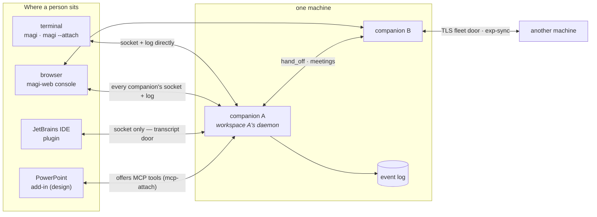

# Wherever you meet magi — clients, companions, agents, screens

[한국어](CLIENTS.ko.md) · [↑ Docs](README.md)

Three words carry the whole picture.

- **A companion** is one running magi: one process, the owner of one workspace, with a name and an
  append-only event log (JSONL). Several can run on one machine; they hand work to each other
  (hand_off) and hold meetings, and machines share what their teams learned over a TLS door
  (exp-sync).
- **An agent** is an execution profile *inside* a companion: system prompt + model/backend + tool
  list (`AgentSpec`). A session runs as some agent, and the `[agents]` roster is the per-agent
  model routing that `/route` edits. Subagents (spawned children) and meeting participants each
  run in an agent shape of their own.
- **A client** is an outside program attached to a companion. The four seats below are everything
  identified today.

## 1. Seen from the seat you are in

| Seat | Attaches how | Sees | Commands | When you use it |
|---|---|---|---|---|
| **Terminal** (`magi`) | holds the engine in its own process | transcript, plan, council live | everything (it IS the engine) | working in that workspace directly |
| **Terminal** (`magi --attach`) | control socket + reads the log itself | same as above | steer, interrupt, answer | grabbing an already-running daemon |
| **Browser** (`magi-web`) | every socket and log on this machine (+ peers) | the whole fleet, per-companion screens (§3) | answer, interrupt, files, git, settings | supervising several companions at once |
| **JetBrains IDE** | control socket only (JVM — cannot open the log) | tool-window transcript (transcript door) | steer + **the IDE becomes a tool** | driving the coding agent inside the editor |
| **PowerPoint** (design) | MCP tools + a local helper | add-in panel | ask for deck edits, get them verified | letting the agent touch an open deck |

The third column hides the one rule worth stating: **a client that can open the log reads the log**
(terminal, web — each builds its own App over the same directory and reconstructs), and **only the
clients that cannot (JVM, add-in) receive the conversation through the daemon's transcript door**.
There are not two doors; the reading path differs by seat.

## 2. How each client operates

### The terminal — the engine and the first client

`magi` starts as the engine itself; the TUI is the same process's screen. `magi --attach` is the
opposite, a pure client: it derives the socket name from the workspace path (WorkspaceKey),
reconstructs the transcript from the log, and sends only writes (steer, interrupt, permission
answers) over the socket. `magi -p` is a one-shot headless run.

### The web console — the machine's supervisor seat

`cmd/magi-web` is a BFF: it serves the compiled `web/ui` screens (§3) and gathers **every**
companion's socket and log on this machine, plus the narrowed fleet door of peer machines, into
one view. It binds loopback and has no login of its own (wrap it the way your organisation does —
SECURITY §4); per-person reach is narrowed by grants on the access screen. A remote machine cannot
be told `update`, `shutdown` or `/shell` because those methods are **absent from the door itself**
— the boundary is absence, not refusal.

### The JetBrains plugin — a viewer and a hand

It makes one IDE window (one project) into one companion: on start it finds that workspace's
daemon, spawns one if absent, attaches if present. Being a JVM it cannot open the Go store, so the
**third viewer** receives the conversation through the transcript door; the **hand** points the
other way — the plugin hosts an MCP server of its own and registers it with `mcp-attach`, and the
agent then reads and edits open buffers through `mcp__ide__*` tools. Nothing is written to config
by attaching, and a closing IDE detaches what it brought. The socket-name rule and the tool-name
rule are held on **both sides (Go and Kotlin) by the same golden files**, so a one-character drift
cannot read as "there is no daemon here".

### The PowerPoint add-in — design stage

A proposal with no code yet (`clients/powerpoint/DESIGN.md`). Three directions are set: the agent
stays magi and the deck-touching tools are offered **as MCP** (no new daemon — context must not be
split); the add-in **chooses which companion to attach to**, and with no daemon running it starts
one in the deck's own directory; and judgement rides numbers and text by default, **pixels as the
last resort** (there is no guarantee the attached model reads images).

### Companion to companion, machine to machine

On one machine, companions hand work to each other (hand_off — the first finished turn's last
words come back as the answer) and hold meetings (participants get the four looking tools only).
Between machines there is one TLS door, trusted by ssh key, carrying narrowed queries and the
set-union replication of team knowledge (exp-sync).

## 3. The web screen map — what is the screen of what

The shell resolves a destination **by the companion's type**: entering a detail view loads that
type's own module when one exists, else the default (companion-ui). Type 1 = coding agent = every
magi companion today; design, infrastructure and other types arrive as one catalogue line plus an
installed module (only operator-installed modules load — a script that came with a workspace never
reaches the supervisor's console).

| Screen (address) | Screen of what | Module |
|---|---|---|
| fleet / companion list & detail | the companions — roster, facts pane, right pane | `companion-ui` |
| conversation, composer, workspace | type 1's centre and left — transcript, file tree, git | `coding-agent-ui` |
| knowledge (`v=skills`) | the experience store, the wiki, the servers | `knowledge-ui` |
| board (`v=board`) | the board of what is in flight — no rail door, entered from fleet | `board-ui` |
| map (`v=map`) | machines, accounts, and what passed between them | `map-ui` |
| access (`v=access`) | who may see and command which companion — admin gate | `access-ui` |
| meetings (`v=meet`) | the room list and one room | `meeting-ui` |
| settings (`v=settings`) | this browser's own + what the daemon reads | `settings-ui` |
| (the shell) | drawer, masthead, stream ownership (one line per window), type catalogue | `shell-ui` |

Every screen module keeps exactly one contract (`console-bridge`: register a render, receive the
context), and the shell opens the one stream and shares it over window bridges — screens multiply,
lines do not.

## 4. In one sentence again

**A person sits in a seat (a client), the seat attaches to a companion, the companion runs turns
as agents — and the web screens each take one of those things (the fleet, one companion, its work,
the team's knowledge, who may reach what) and draw it.**
