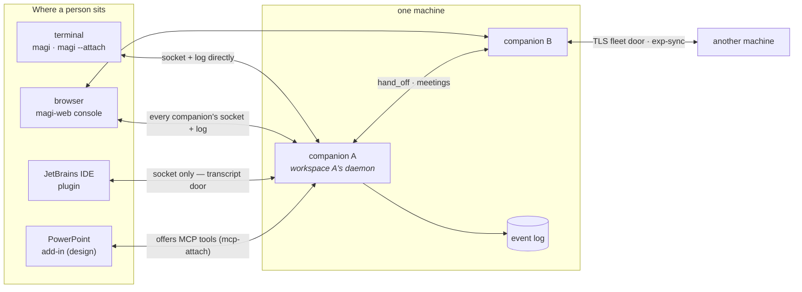

# Wherever you meet magi — clients, companions, agents, screens

[한국어](CLIENTS.ko.md) · [↑ Docs](README.md)

Three words carry the whole picture.

- **A companion** is one running magi: one process, the owner of one workspace, with a name and an
  append-only event log (JSONL). Several can run on one machine; they hand work to each other
  (hand_off) and hold meetings, and machines share what their teams learned over a TLS door
  (exp-sync).
- **An agent** is an execution profile *inside* a companion: system prompt + model/backend + tool
  list (`AgentSpec`). A session runs as some agent, and the `[agents]` roster is the per-agent
  model routing that `/route` edits. Subagents (spawned children) and meeting participants each
  run in an agent shape of their own.
- **A client** is an outside program attached to a companion. The four seats below are everything
  identified today.

## 1. Seen from the seat you are in

| Seat | Attaches how | Sees | Commands | When you use it |
|---|---|---|---|---|
| **Terminal** (`magi`) | holds the engine in its own process | transcript, plan, council live | everything (it IS the engine) | working in that workspace directly |
| **Terminal** (`magi --attach`) | control socket + reads the log itself | same as above | steer, interrupt, answer | grabbing an already-running daemon |
| **Browser** (`magi-web`) | every socket and log on this machine (+ peers) | the whole fleet, per-companion screens (§3) | answer, interrupt, files, git, settings | supervising several companions at once |
| **JetBrains IDE** | control socket only (JVM — cannot open the log) | tool-window transcript (transcript door) | steer + **the IDE becomes a tool** | driving the coding agent inside the editor |
| **PowerPoint** (design) | MCP tools + a local helper | add-in panel | ask for deck edits, get them verified | letting the agent touch an open deck |

The third column hides the one rule worth stating: **a client that can open the log reads the log**
(terminal, web — each builds its own App over the same directory and reconstructs), and **only the
clients that cannot (JVM, add-in) receive the conversation through the daemon's transcript door**.
There are not two doors; the reading path differs by seat.

## 2. How each client operates

### The terminal — the engine and the first client

`magi` starts as the engine itself; the TUI is the same process's screen. `magi --attach` is the
opposite, a pure client: it derives the socket name from the workspace path (WorkspaceKey),
reconstructs the transcript from the log, and sends only writes (steer, interrupt, permission
answers) over the socket. `magi -p` is a one-shot headless run.

### The web console — the machine's supervisor seat

`clients/web/server` is a BFF: it serves the compiled `clients/web/ui` screens (§3) and gathers **every**
companion's socket and log on this machine, plus the narrowed fleet door of peer machines, into
one view. It binds loopback and has no login of its own (wrap it the way your organisation does —
SECURITY §4); per-person reach is narrowed by grants on the access screen. A remote machine cannot
be told `update`, `shutdown` or `/shell` because those methods are **absent from the door itself**
— the boundary is absence, not refusal.

### The JetBrains plugin — a viewer and a hand

It makes one IDE window (one project) into one companion: on start it finds that workspace's
daemon, spawns one if absent, attaches if present. Being a JVM it cannot open the Go store, so the
**third viewer** receives the conversation through the transcript door; the **hand** points the
other way — the plugin hosts an MCP server of its own and registers it with `mcp-attach`, and the
agent then reads and edits open buffers through `mcp__ide__*` tools. Nothing is written to config
by attaching, and a closing IDE detaches what it brought. A name whose holder died without
detaching (the process was killed) does not stay occupied: the next attach probes the holder and
takes over a dead one, while a live holder still refuses the second claimant. The socket-name
rule and the tool-name
rule are held on **both sides (Go and Kotlin) by the same golden files**, so a one-character drift
cannot read as "there is no daemon here".

### The PowerPoint add-in — shipped, and the shape it settled into

`clients/powerpoint/` — a helper (`magi office`, Go, `clients/office/helper` — one process, one certificate and one port for PowerPoint, Excel and Word) that serves the task pane and speaks MCP, an
Office.js add-in (`addin/`) that is the hand on the deck, and ~45 tools. The three directions from
the proposal held: the agent stays magi and the deck tools are offered **as MCP** through the
daemon's `mcp-attach` door; the pane **attaches itself** to a companion the helper provisions in the
deck's own workspace (a picker is shown only when that fails); and judgement rides numbers and text,
pixels last (`render_shape` is one shape, `render_slide` the expensive whole).

Two things the proposal did not foresee, both measured 2026-09-04/05:

- **One daemon, one conversation per deck.** Two open decks share one companion but each gets its
  own conversation and its own tool registration (`owner` on `mcp-attach`, `keep` on `session-new`),
  and the MCP address carries the deck so a call that omits `document` still lands on its own deck.
  A deck carries its own name in a presentation tag, so reconnecting does not re-issue it. And the
  conversation carries the deck's name too: `session-new` with `keep` takes `name` — what the
  conversation is FOR, the document key — the daemon records it on the session, and `sessions`
  answers it back as `for`. That is how a helper that was restarted (its bindings gone, the
  daemon's disk intact) finds the conversation a document already has instead of opening an
  empty one: it asks `sessions`, takes the newest row whose `for` is the document, and opens a
  fresh one only when there is none (measured 2026-09-06/07, Excel — three turns vanished from a
  pane on every helper restart until this). Two more things a tool server can declare and the core
  reads: `annotations.readOnlyHint` (a result that can be had again — the first thing the context
  folder gives up) and `"x-magi-topic": true` on a schema property (the argument that names what a
  call is about — sheet, slide, paragraph — which the fold shards by so `recall_context` can find it).
- **The helper must not cache decisions.** Six identities across four maps, each keyed differently,
  went stale under four different restart events; fourteen fixes in one day were each one cell of
  that table. The redesign — one idempotent `reconcile(deck)` that asks the pane, the daemon and the
  deck for the truth and mends the difference — is `DESIGN.md` §5.9 and is the next thing to build.

Since 2026-09-06 the pane also carries the machine's own knobs, all over helper doors that sit on
daemon doors: a provider/model picker (`/api/models` → `models` and the provider roster,
`/api/model` → `use-backend` + `set-model`, next turn onward), a context meter drawn from the new
`context` door (how full the window is and of what — system, tools, talk, calls, results; before the first turn, and after a fold, the daemon measures the system prompt and the catalog it would send rather than reporting them as absent), and a
compact button (`/api/compact` → `compact`). Switching the council restarts the daemon and the pane
asks first, because every other client on that daemon is cut too.

### The Excel add-in — the PowerPoint shape, copied, with sheets for slides

`clients/excel/` (2026-09-06) — the same pane copied with a different hand (`/xl` on `magi office`,
MCP server `xl`, 61 tools), with one difference of substance: **there is no COM hand.** Excel
2019, 2021 and Microsoft 365 all carry `ExcelApi 1.7` or better (2021 is 1.14), so the task pane is
the hand everywhere; a host below the floor gets a pane that says so. All 61 tools ran on a real
workbook (Mac 16.112.3) and the Windows 2021 volume build installed and edited a cell through the
pane the same day. The helper is a copy, not a shared package — that debt is written down in its
ARCHITECTURE and is the thing to pay before a third Office client.

### The fleet through one socket — the `roster` door (design direction, set 2026-08-29)

The direction is set: the companion management the web console offers must be possible **without
the web**, from a client holding one socket (the IDE plugin is the first consumer). Lay the facts
out and only one piece is missing:

- **Command already works.** Interrupt, answer, steer, files, git are all methods on each
  companion's *own* socket — any client that knows a sibling's socket path can call it directly.
- **The answer already lives in the daemon.** This machine is the publish directory (exact, live);
  other machines are signed gossip sightings (one-hour decay) — and the daemon always reads the
  two halves **together** (`Known`).
- **What is missing is one door.** The control socket has no method that answers "who is out
  there".

So the contract is one `roster` method (★implemented): the request is `{"method":"roster"}`, the
reply is rows carrying host, socket, name, role, team/hub, workdir, state, version, capabilities,
waiting — and **which half each row came from**: this machine's own measurement
(`sighting=false`), or a sighting somebody signed (`sighting=true`), with its age (`ageSeconds`).
Two things are pinned: **the state vocabulary is exactly `waiting` (on a person), `working`,
`idle`** — waiting-on-a-person is its own value (a badge hangs on it); and **this machine's rows
carry `session`** (the conversation's id) so a client reaches the transcript door in one round
trip — sightings do not, since nothing can subscribe across machines anyway.

A local row also carries the facts that exist **only in the running process** — `permission`
(the approval mode it is on right now), `backend` (where its requests go), `model` (what this
conversation is on) and `user`. They are not in the published file and no client can derive them;
the listing already has them in hand because it probed. Dropping them cost a console exactly what
you would expect: it drew those fields empty and then offered a control to change a value it had
never shown. Sightings carry none of them — another machine's approval mode is not a fact this
one measured. Advertised in
`about`'s caps as `roster`, so a client can know before calling.

The boundary follows the same reasoning that kept the transcript off the fleet door: **gossip
carries discovery; conversation and command go through that companion's own door.** A relaying
B's conversation would flatten per-companion access and freshness into A's. Rows from other
machines draw as visible-but-not-commandable (until the client holds that machine's keys) — the
same stance the web console takes toward peers.

**The list is gossip; the detail attaches (set 2026-08-29, ★implemented).** The fleet *list* is
light — roster rows as answered, zero log reads. A live row says the state vocabulary its daemon
published; a dead row says only `stopped` (whether a turn was left open is the log's fact, which
a list must not claim); and the task line, plan progress, the ask's own words and answer-in-list
all belong to **the moment a detail screen attaches** to that one companion. The waiting badge
and its count survive through the state vocabulary.

**The web uses this door too (★implemented — the list is fully light).** The web console's fleet listing now consumes the
roster door **as its first source** — it asks whichever live local companion answers, rebuilds
measurement rows into records and sighting rows into members, and draws the same screen. What
stays direct is exactly what the door cannot carry: the **fallback** (a machine whose companions
are all stopped, or a build without the door — records and logs outlive the processes, and that
machine's fleet still deserves drawing), the **per-row dial** (live facts like "asking right now"
are what no snapshot can say, so they are re-asked every time), **direct log reading** (history,
search, dead-session transcripts), and **command** (the boundary above — each companion's own
door). What this door replicated is the stance the web already took toward other **machines**:
not attached, drawn from sightings, not commandable.

**The session picker's two verbs, and the dock's one (★implemented).** The bottom dock must switch conversations
and open fresh ones, so the control socket carries `sessions` (this workspace's conversations —
id, first-prompt title, model, labels, `for` when the opener named what it was for, timestamps,
newest activity first) and `session-new`
(open a fresh conversation AND move onto it — one verb). Open-turn is deliberately absent:
answering it reads every log whole, and the one conversation it could matter for is the current
one, whose id the roster row already carries. `resume` refuses an id that is not already this
workspace's — a client never invents one; it reads what `session-new` answers. `job-kill` is the row's ✕ — Removed answers "was there one", so a second press reads already-gone, never failure. And `cron` is
the read half of standing work (reload-cron is the write): broken jobs first — the never-runnable
row is the one no other screen will mention again — then the runnable soonest-first, and **the
switched-off last** (a row with no problem and no next must not lead the schedule). Each row
carries its next instant (RFC3339) or an empty next with the `problem` that explains it.

**A subagent's own conversation (`children`, ★implemented).** A child runs in a session of its
own — its parent's log holds the tool call that started it and nothing of what it did — so a
screen that wants to show a subagent's work needs the child's id, and then that child's
transcript. Two doors already carried half of this: `jobs` reports the children running now and
the ones that just ended (a live register, in memory, bounded, gone on restart), and `transcript`
accepts a child id as readily as a top-level one. What was missing is the past: `children` lists
the subagent conversations a session spawned as the LOG holds them, so it answers for a child
that finished last week and for a companion that has since restarted — which is when somebody
asks what a subagent actually did. The parent is required and an empty one is refused: "the
current conversation" is a per-caller fact, and a door that substituted it would answer a
different question depending on who asked. No children is an empty list with OK, never an
omitted field — "none were spawned" and "this build cannot say" are different screens, which is
what the capability handshake is for. Meetings ride the same door: a participant holds its
meeting in a child session, so what your companion said in a room is that child's transcript.
The row carries `origin` — who opened the conversation — and that is what tells one child from
another ("meeting" for a room). `agent` is NOT the discriminator: every child records the same
word, measured against a live meeting where a room came back as `agent="spawn"`.

**Standing work, editable from a client (`cron`, `cron-set`, `cron-remove`, ★implemented).** The
read door now carries the `prompt` a job asks. It was dropped while the engine was already handing
it over, and dropping it is what made an editing screen impossible: a client could say a job exists
and when it next runs, and not what it would do. The write doors take one change each and answer
with the WHOLE new listing — the caller that just edited is about to redraw, and a second round
trip is a second chance for two answers to disagree about one job. They also tell a refusal from a
success by the FACT rather than the prose: the engine reports both as a message with no error (its
words are written for an agent), so the door checks whether the job is there now, and hands the
message back as the reason when nothing changed. A name is refused rather than sanitised — it
becomes a TOML table header, and one quietly rewritten is a job its owner cannot find again. Both
are serialised with the other read-decide-write controls: two editors landing together would each
write the file they read. `enabled` is a POINTER on the wire, because absent must mean "leave the
switch alone" or an edit that only changed the words would switch a job back on. What this
replaces is a client composing `config.toml` itself, which means knowing where a workspace's file
lives, how a name becomes a header, and which of the three layers wins — every client that learns
that is one more place that can be wrong about it. Authorisation stays where the users are: a
console with roles asks its own question (a scheduled job is a prompt with a clock on it) before
it calls.

### Companion to companion, machine to machine

On one machine, companions hand work to each other (hand_off — the first finished turn's last
words come back as the answer) and hold meetings (participants get the four looking tools only).
Between machines there is one TLS door, trusted by ssh key, carrying narrowed queries and the
set-union replication of team knowledge (exp-sync).

**submit/steer target the session they name (★pinned).** Sent to a session that is not the
published "current" one — **a turn opens there**. Serialization is per-session only (a second
send to the same session is absorbed by the running turn's re-read). An invented id is refused
at the store's own gate (sessions are minted by `session-new`). The warning is half the
contract: **concurrent turns in one workspace are coordinated by nothing** — two file-editing
agents standing in one tree — which is why even cron skips its own firings behind a Running
gate ("skipped, X is still going in this workspace"). A client opening input on every tab
should hold the same gate, steering the person off a mid-turn workspace from roster/status
state. The structural cure (worktree isolation / file leases) sits on the candidate ledger.

**Attachments are a field (★implemented).** submit/steer carry `refs[]` (path, lines?) — the
IDE's selection, the composer's paperclip. The excerpt is the CORE's rendering: resolved inside
the workspace (the same jail every read keeps — an outside path renders its refusal in place),
sliced 1-indexed and inclusive the way every editor counts, capped per ref (16KB) and in total (64KB — headers counted, the crossing ref
clipped AT the line, and the overflow folded to one "+N more attachment(s) not shown" closing
line), and persisted with the prompt event — the transcript shows exactly what the agent was shown, and a
replay shows it again. No attachment vanishes: a ref that cannot be served says why where its
excerpt would have been — and the refusal itself is counted and bounded like the sentence it is
(512B; error strings used to echo the wire path whole). An observer plugin's user-message notification carries **the
person's words only** — the rendered attachment block is excluded: workspace bytes reach a
plugin through a file grant, never through a notification side channel. A malformed line range falls back to the whole file — the person pointed
at the file, and losing it over a typo drops the half that mattered.

**Deferred, and the candidate ledger.** (Four low-severity wave-2 observations join it: the
shared team store's WikiTouch/observation-count lost-updates (advisory data) · an already-open
transcript stream is not re-checked after a repolicy · unborn session state accumulates slowly
over a daemon's lifetime · notifyAnswers checks peer as "" — revisit the day handoffs go
remote.) Outside-workspace content-root read-only is **deferred**
(a 2026-08-29 user decision — the workspace stays the trust boundary). On the ledger:
**the settings have one door (★shipped)** — `config-get` answers each whitelisted key with the
value the engine will actually use, the layer that won it (env / companion / project / global),
the file a write lands in, and when a change takes effect (a property of the KEY: this daemon
reads some settings per turn and others once at boot). `config-set` writes one key with the
comments kept and answers with the key READ BACK, and an empty tier writes it where the value
came from, so changing an account-wide setting does not mint a workspace override of it.
`profiles` lists what a profile-shaped key may point at, with the layer that defines each. Two
refusals rather than two silences: a key outside the whitelist (the same file holds the
permission posture and the hooks that run), and a key an untrusted workspace file cannot set —
refused with the trust command named instead of written where the engine would ignore it. Still
on the ledger: the places that decide which model runs
are `model`, `[llm.profiles.*]`, `[autocomplete] code_profile`/`composer_profile`, `embed_model`,
the `[subagents.*]` profiles and `[templates]`, and exactly two of them have a socket method
(`set-model`, `use-backend`). The console reaches the rest by editing config.toml itself
(autocomplete.go), which a client holding only a socket cannot do, so the IDE writes "not
editable here, and this is the key" where a field belongs. The shape proposed (magi-9f,
2026-08-30): `config-get` answering each editable key with its value, the tier it came from and
the file it lives in — the console's autocomplete reply already returns `File` for that reason;
`config-set` taking one `{key, value}` written key-at-a-time with the comments kept (config.SetKey)
and saying when it takes effect; `profiles` listing what may be assigned and from which tier
(profileChoices). Whitelisted keys — arbitrary TOML writing would be a hole, not a door. Also:
**a person's image has no door at all** — the submit method carries `text` and nothing else
(daemon.Request has no image field, and the dispatch builds one text part), so an image arrives
only as a TOOL RESULT today; a client cannot close this gap alone, and calling it "the UI was
never built" sent one reader looking for a wire that is not there. The shape it wants is refs':
paths the core resolves under the workspace jail with a byte cap, so the log carries a reference
rather than the bytes and a replay still finds the picture. Also on the ledger:
same-workspace contention (worktree isolation / file leases — the cheap half, a duplicate-workdir
warning badge, is the plugin's, from roster material it already has).

**An edit approval carries its diff (★implemented — only what it can say truthfully).** The
permission prompt carries **the diff a yes would apply** — computed once in the app and riding
everywhere the prompt travels: the transient event, the status door, the rebuilt prompt a socket
viewer replays. A viewer never recomputes it — which makes the SCOPE part of the contract: a
diff rides only for **old/new substitutions and write**; an anchored edit ({at,to} — the removed
lines are not in the arguments), replaceAll (a diff of one lies about the count) and multiedit
answer with **absence** and fall back to the arguments view, because a faked preview on an
approval screen is the worst of the options. Byte-capped at 64KB, and a cut diff says it was
cut. A write's diff is taken against the file's CURRENT content at ask time — one
added line reads as one added line; only a file that does not exist yet shows all additions,
because that is its truth.

**The transcript cursor can be trusted.** seq survives compaction (the snapshot inherits upToSeq
and later events keep their numbers) — a reconnecting client sends its last seq as `since` and
receives only the increment, and when the daemon refuses a cursor the restart callback says
"throw yours away" before the first event.

**The fact/transient split is a storage contract.** A fact type is guaranteed a seq > 0 in the
log — jsonl assigns from 1 — and the live bus sits outside that guarantee: a daemon may ride a
live-only signal at seq 0 even under a fact's type name (a council verdict previewed before the
debate revises it; the turn-finished that closes a drained interjection). A consumer that treats
the stream as the log must therefore **drop seq == 0 events of fact types**: everything they
announce arrives again as the real fact, with its number — and the seq-0 copy may differ from the
fact that lands (a preview is a vote before revision, not an echo of the result).

**A council verdict's `silent` means nobody answered.** It rides only beside an abstain that was
a failure rather than a choice — a member the reply never spoke for, a backend that was down, a
round that ran out of time — so a client may draw "no answer" on it and nothing else. A verdict
carrying a decision and a rationale is somebody's answer, `silent` absent. (It was set on every
panel verdict for a while, and three screens drew spoken verdicts as silence; the flag is the
contract, not a hint.)

**The core's version has an address that does not move.** A client that installs the engine for
somebody — the IDE plugin does — cannot ask GitHub for "the latest release": this repository runs
three release trains (`v*` core, `web-v*` console, `jetbrains-v*` plugin) and GitHub's latest is
the newest by date across all of them, so the core tarball 404s there whenever another train
released more recently, while `checksums.txt` answers 200 with another train's sums. The core
train writes its tag to `core-latest.txt` on the `badges` branch instead — one line, `v0.29.0`,
raw at
`https://raw.githubusercontent.com/<owner>/<repo>/badges/core-latest.txt`, and a mirror can serve
it as a static file. Readers that want the bare number strip the leading `v`.

**`part.delta` is a draft of a line, not a line.** Deltas are transient (seq 0, never replayed)
and carry the message id the finished part will land under, so a client draws them by REWRITING
the draft row for that message id — never by appending a row per delta — and the `part.appended`
fact then replaces the draft in place. A client that drops deltas is correct but not live (the
answer appears all at once when it finishes); one that appends them leaves a stack of fragments a
reconnecting viewer will never see, because a replay contains only the facts. All three clients
had to work this out separately, so it is written here.

So an abstain comes in two kinds and a client can tell them apart: a **spoken abstain** (`abstain`
without `silent`) is a member who read the work and declined to judge it — draw the decision mark
and their words; an **unanswered** one (`abstain` with `silent`) is a member who never answered —
draw "no answer" beside it. Both carry whatever rationale exists. A verdict that states no
decision at all is a spoken abstain, never a `continue`: nobody may be recorded as rejecting work
they did not judge.

### The path a new client walks

A client consuming these doors for the first time needs four steps — all of them ordering of
contracts this page already states.

1. **Discovery**: glob `daemon-*.sock` in the config directory, or ask any live companion's
   `roster` door. A client that knows its workspace (the IDE) derives the socket name
   (WorkspaceKey — held by goldens) and spawns a daemon when none answers.
2. **Handshake**: `about` — the reply's `caps` names the doors this daemon answers: `handshake`
   and `roster` are always there (build-level), the rest are engine-gated and may be absent
   (`transcript`, `sessions`, `session-new`, `children`, `cron`, `cron-set`, `cron-remove`,
   `job-kill`, `tool-servers`, `settings`, `context` — the last answers how full a conversation's window is and
   what it is made of, for a screen drawing a meter). Read the advertisement and call; never call an absent
   door and read the refusal.

   The list is short on purpose, and shorter than the list of gated doors. A capability is for a
   decision made **before anybody presses anything** — whether to draw a panel at all — because
   that is the decision a refusal cannot help with: at that moment there is no control to show it
   on, and prose cannot tell an old build from an engine that will not do it. A door that answers
   a press (`git-pr`, `shell`, `complete`, `look-over`, …) is gated too, and refuses in its own
   words, and is deliberately not advertised: the refusal lands on the button that asked. Which
   doors are in which group is written in the daemon's door table, one line each, and a guard
   fails if a new door is in neither.
3. **Subscription**: the conversation via `transcript` (replay + live, with the restart callback
   on a refused cursor), the list via `roster` polls, the picker via `sessions`, the dock via
   `cron` and `jobs`.
   A meeting's turn carries the room's minutes both ways: `minutes` on the request is the
   document as it stands, and `minutes` on the reply is that speaker's revision of it, whole. A
   daemon that does not keep minutes drops both and the meeting still runs — the document simply
   does not grow. A participant keeps two sessions for a meeting, and they are stamped with
   different origins (`meeting`, `minutes`) so a client listing a companion's children can tell
   them apart, or leave both out.

4. **Action**: steering, interrupting, answering, files and git are methods on that companion's
   own socket; an application that offers tools registers itself with `mcp-attach` (URL only)
   and `mcp-detach`s on the way out.

A refusal always carries its reason in the `err` string — no door fails in silence. One caution
for the stream doors (watch, transcript): **do not half-close the write side** — a one-shot
client that shuts write after sending (the `nc -w` shape) reads as a hang-up and ends with zero
frames. Keeping the write half open while you read is half the stream contract.

## 3. The web screen map — what is the screen of what

The shell resolves a destination **by the companion's type**: entering a detail view loads that
type's own module when one exists, else the default (companion-ui). Type 1 = coding agent = every
magi companion today; design, infrastructure and other types arrive as one catalogue line plus an
installed module (only operator-installed modules load — a script that came with a workspace never
reaches the supervisor's console).

| Screen (address) | Screen of what | Module |
|---|---|---|
| fleet / companion list & detail | the companions — roster, facts pane, right pane | `companion-ui` |
| conversation, composer, workspace | type 1's centre and left — transcript, file tree, git | `coding-agent-ui` |
| knowledge (`v=skills`) | the experience store, the wiki, the servers | `knowledge-ui` |
| board (`v=board`) | the board of what is in flight — no rail door, entered from fleet | `board-ui` |
| map (`v=map`) | machines, accounts, and what passed between them | `map-ui` |
| access (`v=access`) | who may see and command which companion — admin gate | `access-ui` |
| meetings (`v=meet`) | the room list and one room | `meeting-ui` |
| settings (`v=settings`) | this browser's own + what the daemon reads | `settings-ui` |
| (the shell) | drawer, masthead, stream ownership (one line per window), type catalogue | `shell-ui` |

Every screen module keeps exactly one contract (`console-bridge`: register a render, receive the
context), and the shell opens the one stream and shares it over window bridges — screens multiply,
lines do not.

## 4. In one sentence again

**A person sits in a seat (a client), the seat attaches to a companion, the companion runs turns
as agents — and the web screens each take one of those things (the fleet, one companion, its work,
the team's knowledge, who may reach what) and draw it.**
