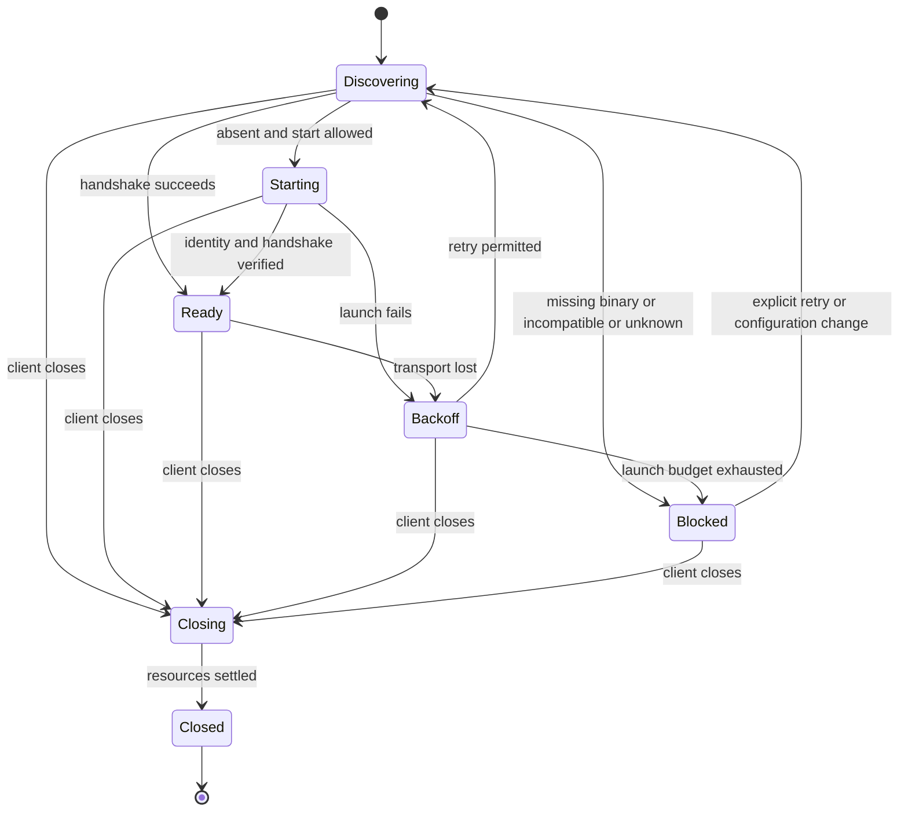

# 대표 클라이언트 수명주기 안정화 설계

[English](CLIENT_LIFECYCLE.md) · [한국어](CLIENT_LIFECYCLE.ko.md) · [↑ Docs](README.ko.md)

상태: **구현 계약·인수 기준, 2026-09-12.** [프로젝트 평가](PROJECT_REVIEW_2026-09-11.ko.md)의 첫 번째 제안을 구체화합니다. 아래 MUST에 해당하는 요구사항과 인수 조건은 개발 목표이며, 구현 완료를 선언하지 않습니다. 현재 구현 근거는 §2에 구분합니다. [`docs/DESIGN.ko.md`](DESIGN.ko.md)은 초기 설계 이력이므로 이번 작업의 구현 기준은 이 문서입니다.

## 1. 범위와 완료의 의미

첫 적용 대상은 **JetBrains, 데스크톱 VS Code, 로컬 웹 콘솔**입니다. 이미 구현된 작업 기능을 대상으로 설치→연결→작업→재연결→종료를 검증합니다. Windows x64를 필수 인수 환경으로 두고 macOS와 Linux도 회귀 검증합니다. IDE 제품·정확한 빌드, 확장·코어 버전, 아키텍처를 결과에 기록합니다. 빌드 성공으로 설치 성공을 대신하지 않습니다.

이번 범위에는 Visual Studio 전사 신규 구현, Office 기능 확장, VS Code 브라우저 확장, Remote SSH·WSL의 실행 위치 재설계, 전면적인 공통 브리지 이관은 포함하지 않습니다. 지원하지 않는 실행 위치는 조용히 로컬 워크스페이스로 바꾸지 말고 명시적으로 안내해야 합니다. 플랫폼별 마크다운 표시 방식은 유지하되 응답과 Think 본문에 별도의 세로 스크롤이나 임의 길이 제한을 추가하지 않습니다.

컴패니언은 워크스페이스의 작업을 실행하는 데몬입니다. 소유자는 그 데몬의 수명을 관리하도록 직접 기동한 클라이언트 인스턴스입니다. 기존 데몬을 발견한 창은 관찰자이며, 소켓 경로나 PID를 안다는 사실만으로 소유권을 얻지 않습니다. 브라우저 탭은 관찰자입니다.

## 2. 현재 구현과 남은 작업

2026-09-12, `01d3c060`까지 확인했습니다. 후속 검토 지적 사항은 모두 해결되었으며, 이 문서는 구현 계약과 인수 조건을 유지합니다.

| 영역 | 현재 구현 | 남은 확인 |
|---|---|---|
| IDE 기동·소유권 | 기능 조회, 소유 파이프·EOF 종료, 세대 일치, 재시도 정책이 연결됐습니다. JetBrains 재열기·수동 재시도·기동 예외 전이도 수정됐습니다. | 실제 설치, GUI 환경의 경로 해석, IDE 종료·비활성화·강제 종료 |
| 코어 업데이트 | 자동 루프와 회의의 두 진입점이 hold를 사용합니다. 설치 잠금·저널·준비 이후 안정 확인·Windows 롤백·후계 시작 실패 복구가 구현됐습니다. | U01–U08의 실제 제품·설치 조합별 인수 |
| 전사·웹 | 프리뷰 교체·입력 보존·재연결과 재생 완료 신호가 구현됐습니다. 브리지 `rows`는 연결 2초·핸드셰이크 5초·재생 침묵 15초 제한을 사용합니다. | L10–L12의 화면·서버 재시작 인수 |
| 브리지 진단 | `about`·`activity`는 별도 연결에 연결 2초·교환 5초 기한을 적용합니다. `forward`는 긴 요청을 위한 별도 캐시 연결을 유지합니다. | 무응답 뒤 후속 요청 처리와 긴 전달 요청의 정상 완료를 회귀 검증합니다. |
| 바이너리·배포 | VS Code는 PATH와 캐시를 탐색합니다. 최초 설치 자동 다운로드는 별도 범위입니다. | 설치 안내·실제 바이너리/버전 진단, ZIP/VSIX 설치와 되돌리기 |

`MAGI_SOCKET_DIR`을 설정하지 않은 Windows 환경도 시험합니다. 긴 경로나 접근 불가를 “데몬 없음”으로 바꾸면 안 됩니다. 짧은 경로가 필요하면 설정 위치와 실제 적용 경로를 안내하고, 클라이언트가 기존 데몬과 다른 주소를 임의로 선택하지 않습니다.

### 2.5 결정과 검증 상태

`<socket>.lifecycle`은 만들지 않습니다. 현재 상태는 handshake·`about`으로 확인하며 관찰하지 못한 종료 사유는 미상입니다. 업데이트 저널은 파일 교체 복구에만 사용합니다. 기능 이름은 구현과 함께 공개합니다.

이 검토에서 확인한 코드 지적은 해결됐고 플랫폼 인수가 남아 있습니다. 새로운 결함이 없다는 선언은 아닙니다. 검토자가 실행한 Go·VS Code·JetBrains 테스트의 리비전과 범위는 커밋 이력에 보존됩니다. Windows 실물 테스트의 구현자 실행 보고와 검토자의 macOS 실행을 구분합니다. 실제 IDE·브라우저 인수, 네이티브 `deactivate`, L12의 서버 재시작, E의 배포 결과가 없으면 완료로 선언하지 않습니다.

## 3. 상태와 책임

연결 상태, 프로세스 소유권, 작업 상태를 별도로 보관합니다. `Ready`는 통신 가능을 뜻하며 작업이 끝났다는 뜻은 아닙니다. 화면에는 연결 상태와 마지막으로 확인한 작업 상태의 시각을 각각 표시합니다.

`Closing`에 진입하면 자동 기동·연결·다운로드·구독 요청을 취소하고 세대 번호를 증가시킵니다. 이전 비동기 완료는 결과를 폐기하고 자원을 닫습니다. `Closed`에서 같은 인스턴스를 재사용하지 않습니다. 새 창은 새 소유자입니다.

| 담당 | 책임 |
|---|---|
| 코어 | 워크스페이스 단일 기동 중재, 실행 세대 식별, 소유자 연결 종료 감지, 후계 프로세스 인계, 이벤트 사실성 |
| IDE 수명주기 관리자 | 발견·기동·재시도·종료의 단일 진입점, 소유자 채널 보관, 설정·사용자 동작 반영 |
| 전송 계층 | 기한 있는 연결·요청, 연결 실패 원인 보존, 종료된 연결 정리 |
| 전사 소비자 | 세션별 커서·프리뷰·복구, 오래된 구독 결과 차단 |
| 웹 서버·브라우저 | 서버가 데몬에 접근하고 탭은 서버에 연결. 탭 종료로 데몬을 끄지 않음 |

웹에서 사용자가 명시적으로 시작한 독립 데몬은 별도 종료 명령으로 관리합니다. 브라우저 새로고침, SSE 재연결, 목록 폴링은 데몬 생성의 근거가 될 수 없습니다.

## 4. 기동·호환성·소유권 계약

### 발견과 기동

1. 실행 위치와 워크스페이스를 확정하고 동일한 환경에서 설정·소켓·실행 파일 경로를 해석합니다. 활성 환경의 선택된 실행 파일 절대 경로와 버전을 진단에 남깁니다. 모든 셸을 무조건 실행하는 방식의 PATH 보완은 요구하지 않습니다.
2. 소켓 파일 존재만으로 판단하지 않고 기한 있는 handshake로 확인합니다. 연결 거절, 권한 오류, 경로 오류, 구형 기능 미지원은 각각 다른 결과입니다. 불명확한 오류에서는 새 데몬을 띄우지 않습니다.
3. 시작 허용 설정이 켜져 있고 데몬 부재를 확인한 경우에만 기동합니다. 창 내부는 single-flight, 창 사이 경합은 코어의 기존 워크스페이스 잠금으로 중재합니다. 패자는 승자의 데몬에 관찰자로 연결합니다.
4. 준비 완료는 경로에 공개된 실행 세대와 handshake가 일치할 때 선언합니다. 프로세스 생성 성공이나 파일 생성만으로 성공 처리하지 않습니다.

### 구현된 인터페이스와 소유권

`magi ide-bridge --features`는 데몬 연결이나 디스크 쓰기 없이 한 줄 JSON을 반환합니다. `raw-socket-v1`·`owned-daemon-v1` 지원을 확인하고, 구형 바이너리의 옵션 거절(종료 코드 2, 빈 stdout)을 구분합니다. 출력 문구 검색으로 기능을 추측하지 않습니다. 상세 계약은 [IDE_BRIDGE](IDE_BRIDGE.ko.md)에 있습니다.

`owned-daemon-v1`이 있으면 IDE는 `magi --daemon --client-owned`로 기동하고 자식 stdin 전용 파이프의 쓰기 끝을 독점 보관합니다. 다른 자식에게 쓰기 끝을 넘기지 않습니다. 코어는 EOF를 소유자 종료로 처리합니다. 공개 레코드와 `about`의 `ownerId`는 소유 계보 동안 유지되고 `instanceId`는 프로세스마다 바뀝니다. ID는 추적용이며 종료 권한은 상속된 파이프에 있습니다. 기존 사용자 `shutdown` 명령의 권한은 유지합니다.

최초 준비 확인은 생성한 자식 PID·워크스페이스·공개 레코드와 `about`의 세대 일치를 요구합니다. 한쪽에만 세대 ID가 있으면 거절하고, 양쪽 모두 없는 구형 코어에서만 PID 기반으로 판단합니다. 확인한 owner를 보관해 이후 교체가 같은 계보인지 확인합니다. 관찰하지 못한 종료 사유는 미상입니다.

### 후속 프로세스와 실패 복구

Windows는 같은 파이프 읽기 끝과 owner를 후계에게 인계합니다. 이전 세대는 요청 접수·리스너·워크스페이스 잠금을 해제한 뒤 후계를 띄웁니다. 공개 레코드가 후계 PID·워크스페이스·계보를 가리키고 handshake의 세대와 일치하는지 최대 30초 확인합니다.

| 결과 | 처리 |
|---|---|
| 준비 완료 | 이전 세대가 종료합니다. |
| 준비 전 종료 | 정상 종료 코드 0과 다른 데몬의 워크스페이스 선점은 후보 실패로 세지 않습니다. 그 밖은 `SuccessorFailed`로 롤백·후보 거절을 시도합니다. |
| 시작 자체 실패 | Windows `Start()`·Unix `Exec()` 실패 모두 후계 PID 0으로 같은 복구 경로를 사용합니다. 이전 리스너가 이미 닫혔으므로 성공으로 종료하지 않습니다. |
| 30초 동안 살아 있지만 미준비 | `NotReady`로 보고하고 후계를 죽이지 않은 채 이전 세대가 종료합니다. 이후 안정 확인은 저널이 담당합니다. |

롤백 후 비소유 데몬 또는 소유자가 아직 살아 있는 데몬만 이전 빌드로 한 번 재기동합니다. 소유 IDE가 닫혔으면 파일만 복구합니다. 복구할 파일이 없거나 이전 빌드도 실패하면 오류 코드와 수동 복구 방법을 남깁니다. 재시도 루프는 없습니다. Windows 소유자 생존은 `PeekNamedPipe`로 확인하며 파이프를 읽어 후계의 입력을 소비하지 않습니다. Unix는 이미지 교체가 성공하면 지켜볼 이전 세대가 남지 않습니다.

### 종료와 구형 코어 호환

IDE의 쓰기 끝 종료와 확장 호스트 강제 종료는 같은 EOF로 후계까지 정리합니다. 코어는 EOF부터 5초 안에 작업 취소·리스너 종료·공개 정보 정리를 수행해야 합니다. IDE UI 스레드는 기다리지 않습니다. 강제 종료가 필요하면 IDE가 핸들을 보관한 원래 자식만 대상으로 하며 후계 종료는 코어가 보장합니다.

VS Code의 별도 소유 채널 생성이 실패하면 부분 생성 자원을 정리하고 Node 기본 `'pipe'`로 기동합니다. 실패 단계·원인과 업데이트/재시작 때 연결이 끊길 수 있음을 기동당 한 번 안내합니다. 이 저하 상태에서도 업데이트를 차단하지 않는 정책을 유지합니다. 업데이트로 인한 단절은 연속 실패로 세지 않고 새 컴패니언 기동으로 복구합니다. 실제 소유자 종료와 원래 자식 exit를 구분하는 인수 증거가 필요합니다.

| 기동 조건 | 처리 |
|---|---|
| Windows relay가 필수인데 코어가 미지원 | 업데이트 방법을 안내하고 차단합니다. 사용할 수 없는 전송으로 데몬을 띄우지 않습니다. |
| 일반 기동에서 소유 모드만 미지원 | 경고 후 기존 수명으로 기동합니다. 창 종료는 자식을 정리하지만 호스트 강제 종료에는 데몬이 남을 수 있음을 알립니다. |

구형 데몬 연결은 허용하고 미지원 기능만 끕니다. 조용히 분리 실행으로 전환하지 않습니다. 최초 설치 자동화와 설치된 코어의 자동 업데이트는 구분하며 후자는 §9를 따릅니다.

## 5. 복구와 종료 정책

다음 값은 클라이언트 공통 목표이며 주입 가능한 정책 값으로 구현해 가상 시계로 시험합니다.

| 항목 | 목표 |
|---|---|
| 연결 handshake | 시도당 5초 이내 |
| 새 프로세스 준비 | 생성부터 30초. 재시도로 시계를 초기화하지 않음 |
| 재연결 | 1·2·4·8·16·30초, 이후 30초. ±20% 지터 적용 후 최대 30초 |
| 자기 재시작 유예 | 단절 후 최소 5초 동안 새 프로세스를 기동하지 않음 |
| 자동 기동 예산 | 워크스페이스별 60초 이동 구간에서 최대 3회 실제 spawn. 세 번째 연속 실패 후 `Blocked` 유지 |
| 예산 초기화 | 수동 재시도 또는 연속 60초 정상 연결 후. 순간 handshake 성공으로 초기화하지 않음 |
| 종료 | 코어 소유 모드 EOF부터 5초. IDE UI 스레드를 대기시키지 않음 |

이동 구간의 spawn 횟수와 연속 실패 횟수는 별도로 셉니다. 30초 준비 실패와 준비 후 60초 안정 구간 이전의 예상치 못한 종료를 연속 실패로 계산합니다. 시간 경과만으로 연속 실패를 지우지 않습니다. 사용자가 요청한 업데이트 교체는 실패 횟수에 넣지 않되, 교체 실패는 포함합니다.

관찰자는 연결만 재시도합니다. 외부 데몬을 재생성하거나 종료하지 않습니다. 사용자가 명시적으로 종료한 소유 데몬은 `Blocked`에 두고 자동 기동을 중지합니다. 정상 소유자 종료, 요청된 업데이트 교체, 예상치 못한 자식 종료를 별도 사유로 전달해야 합니다. 파일 부재만으로 이 사유를 추정하지 않습니다.

한 요청의 타임아웃은 해당 연결을 폐기합니다. `submit`, 편집, 승인 응답 등 부작용이 있는 요청의 응답이 유실되면 **자동 재전송하지 않습니다**. 상태 재조회 후 결과를 모르면 “처리 여부 확인 불가”와 확인 방법을 표시합니다. 재전송 중복 방지는 향후 요청 ID 계약이 갖춰졌을 때 별도로 확장합니다.

종료 순서는 새 작업 차단→기동·재시도 취소→편집기 hand 해제 시도→구독과 연결 정리→소유 파이프 닫기→종료 확인입니다. 해제 실패로 나머지 정리를 건너뛰지 않습니다. 종료 처리는 중복 호출해도 같은 결과여야 합니다.

## 6. 전사와 사용자에게 보이는 결과

재생 완료는 이벤트 없는 `live:true` 프레임으로 알립니다. 빈 로그와 이미 최신인 커서는 즉시 완료하며, 나머지는 재생 마지막 이벤트 뒤에 알립니다. 로그 끝 조회 실패는 사유를 전달하고 일회성 `History`는 오류로 끝냅니다. 완료 신호를 모르는 구형 코어에서 완료를 추정하지 않습니다. 연결·핸드셰이크·재생 읽기 각각에 기한을 적용하고, 재생의 15초 제한은 프레임마다 갱신하는 침묵 제한입니다.

세션과 실행 세대가 같은 재연결에서는 마지막 확정 seq 이후를 요청합니다. 커서가 거절되면 캐시를 비우고 전체 재생합니다. 전체 재생을 쓰는 기존 구현은 화면 교체를 한 번에 수행하고 중복·유실이 없음을 먼저 입증한 뒤 증분 복구로 전환할 수 있습니다.

seq=0 프리뷰는 영속 커서를 전진시키지 않습니다. 최종 사실이 도착하면 같은 논리 행을 교체하고, 프리뷰와 다른 최종 판정도 반영합니다. 카운슬 행의 키에는 세션과 소집 식별자가 필요합니다. 회차 번호만으로 여러 턴의 소집을 합치지 않습니다. 세션 이동 시 다른 세션의 커서를 재사용하지 않습니다.

작성 중인 입력은 실행 위치·워크스페이스·세션·탭에 귀속시켜 IDE webview state 또는 웹 sessionStorage에 저장합니다. 다른 워크스페이스나 탭의 입력을 가져오지 않습니다. 연결 복구 중 마지막 대화와 작성 중인 입력은 유지하고, 오래된 내용임을 표시합니다. 연결되지 않았다는 이유만으로 빈 대화를 만들지 않습니다. 응답과 Think는 전체 본문을 보존하고 전사 하나의 세로 스크롤로 읽게 합니다. 코드 블록의 가로 스크롤은 허용합니다.

진단에는 단계, 실행 위치, 워크스페이스, 실제 바이너리·버전, 소켓, 공개 실행 세대, 소유/관찰 여부, 원인, 시도 수, 다음 행동을 담습니다. 환경변수 전체나 인증 비밀은 기록하지 않습니다. 같은 실패 알림을 반복하지 말고 상태 화면에서 갱신합니다.

## 7. 작업 분할과 의존성

| 작업 | 변경 책임 | 인계 산출물 | 의존 |
|---|---|---|---|
| A. 코어 수명 계약 | `cmd/magi`, `internal/graceful`, daemon 공개 정보, `idebridge` 기능 조회 | 버전 기능 fixture, 소유 파이프·교체·EOF 테스트, 구형 모드 호환 증거 | 없음 |
| B. JetBrains 관리자 | `clients/jetbrains/plugin`의 기동·전송·구독·dispose | 공통 상태 전이 적용(`Phase`·`Progress` — §3 의 전이표와 세대), native IDE 종료 증거 | A의 계약 fixture 후 개발, 실제 A로 인수 |
| C. VS Code 관리자 | `clients/vscode/src/core`와 `src/ide` | Windows relay 판별, 소유 모드, 재시도·웹뷰 검증. 닫기 계약(순서·실패해도 나머지 정리·중복 호출)은 시험이 있고, **네이티브 `deactivate` 실행은 실물 편집기 몫**입니다 | A의 계약 fixture 후 개발, 실제 A로 인수 |
| D. 웹 복구 | `clients/web/server`, 웹 셸의 스트림 소유자 | 새로고침·탭 종료는 `clients/web/e2e/tests/lifetime.spec.mjs` 가 **공개 기록의 pid·instance 로** 잽니다. SSE 복구·프리뷰 교체·입력 보존은 착지했고, **서버 재시작(L12 의 셋째)은 아직**입니다 | 기존 전사 계약으로 시작 가능 |
| E. 배포 인수 | 클라이언트 패키징 및 관련 CI | 아래 매트릭스 결과와 설치 가능한 아티팩트 | A–D |

공유 fixture는 동작 계약을 담고 특정 구현의 소스 문자열을 요구하지 않습니다. 담당자는 소유한 경로 밖의 변경을 먼저 조율하고 다른 담당자의 변경을 되돌리지 않습니다. 코어 기능을 먼저 배포한 뒤 클라이언트가 사용하도록 순서를 고정합니다. CI 추가와 실제 배포는 구분합니다.

## 8. 인수 매트릭스

각 사례에 OS·제품 빌드·코어/확장 버전·로그·최종 PID/소켓 상태·관찰 화면을 남깁니다. `미실행`은 통과가 아닙니다. Windows 실제 설치 시험이 없으면 이번 단계는 완료되지 않습니다.

| ID | 재현 조건 | 통과 조건 |
|---|---|---|
| L01 | 코어 없음·구형 코어·기능 응답 손상·연결 후 무응답 | 설치/업데이트 방법을 표시. 잘못된 spawn이나 무한 재시도 없음 |
| L02 | 공백·한글·긴 경로, GUI에서 IDE 실행, socket override 유무 | 동일 워크스페이스 식별. 실패는 경로·권한 원인과 해결 방법을 표시 |
| L03 | 같은 워크스페이스로 IDE 창 두 개 동시 시작 | 데몬 하나, 소유자 하나. 패자는 관찰자로 연결 |
| L04 | 외부 데몬에 두 IDE·웹 연결 후 각각 종료 | 외부 데몬 유지, 자기 연결·hand만 정리 |
| L05 | 소유 IDE 정상 종료·확장 비활성화·호스트 강제 종료 | 5초 내 소유 데몬과 소켓·세션 공개 정보 정리(종료 사유 레코드 제외). 다른 데몬 유지 |
| L06 | Windows 자기 업데이트 중 IDE 종료, 업데이트 실패 | 후계 잔존 없음, 잘못된 PID 종료 없음, 실패 결과 확인 가능 |
| L07 | 준비 직전 종료·연결 직후 종료·중복 dispose | 늦은 spawn/연결/구독 없음, 열린 핸들과 타이머 누적 없음 |
| L08 | 자식 반복 크래시·명시적 종료·권한 오류 | 정해진 예산과 유예 준수, `Blocked` 사유 표시, 자동 부활 금지 |
| L09 | submit 직후 응답 연결만 끊음 | 작업이 자동으로 두 번 제출되지 않음. 불명확한 결과를 성공으로 표시하지 않음 |
| L10 | 세션 이동·커서 거절·프리뷰 후 수정된 최종 사실·카운슬 여러 소집·빈 로그·최신 커서·로그 끝 조회 실패 | 재생 결과와 화면의 확정 내용 일치, 중복·유실 없음. 완료·오류를 구분하고 무응답은 기한 내 실패 |
| L11 | 긴 응답·긴 Think·좁은 창·본문 위 마우스 휠 | 전체 본문 보존, 내부 세로 스크롤 없이 읽기 가능 |
| L12 | 웹 새로고침·탭 두 개·서버 재시작 | 탭 수와 무관한 데몬 수명, 입력 보존 정책 확인, 연결 상태와 작업 완료 구분 |
| L13 | 배포 ZIP/VSIX 설치 및 이전 버전으로 되돌리기 | 기록·설정 유지, 신기능 미지원 안내, 설치한 정확한 조합 기록 |

코어·정책 단위 테스트, 실제 데몬 통합 테스트, 실제 렌더러, 설치된 IDE 검증을 각기 기록합니다. 소스 필드 검사나 mock만으로 L03–L13을 닫지 않습니다. Windows x64의 두 IDE와 로컬 웹에서 전 사례를 수행하고, macOS·Linux에서는 적용 가능한 전 사례를 회귀 검증합니다. 특정 환경을 지원 범위에서 제외하려면 인수 기록에 명시하고 완료 범위를 축소해야 합니다.

## 9. 자동 업데이트 — 이번 안정화에 포함

### 9.1 현행 구현과 목표의 차이

코어에는 이미 [자동 업데이트 루프](../cmd/magi/autoupdate.go), [릴리스·체크섬 조회](../internal/update/github.go), [교체 및 사전 실행 확인](../internal/update/rollback.go)이 있습니다. 현행 루프는 릴리스 빌드를 대상으로 기본 6시간 간격으로 확인하며, 파일 교체 후 작업이 없는 시점에 재시작합니다. `Commit`의 롤백 기준은 **더 이상 `--version` 하나가 아닙니다.** 프리플라이트를 통과한 교체는 `<바이너리>.update.json` 에 **확정되지 않은 트랜잭션**으로 적히고 이전 사본은 `.prev` 로 남습니다. 그 위로 뜬 데몬이 `StableWindow`(60초)를 버티면 확정하고, 후보의 감시 세대가 확정 없이 비정상 종료한 뒤 다시 시작하면 되돌리고 그 판을 거절합니다. 살아 있는 다른 워크스페이스의 정상 기동은 실패로 세지 않습니다. 거절은 사람의 명시적 재시도(`magi -update`·콘솔 단추)로만 풀립니다. 프로세스 내부 mutex 위에 **설치 단위 잠금**이 붙었습니다(§9.3 1번) — 같은 실행 파일을 쓰는 데몬들 중 하나만 교체하고, 못 쥔 쪽은 제 일을 계속합니다.

이번 목표는 **실제 데몬 준비와 안정 구간까지 확인한 뒤 업데이트를 확정하는 것**입니다. 최초 설치용 코어 다운로드와 기존 코어의 자동 업데이트를 구분합니다. 최초 설치 자동화는 별도 작업으로 둘 수 있지만, 이미 설치된 코어의 자동 업데이트와 복구는 이번 인수 범위에 포함합니다.

### 9.2 책임과 사용자 제어

| 대상 | 업데이트 실행 주체 | 클라이언트의 책임 |
|---|---|---|
| 코어 | 기존 코어 updater를 확장한 설치 대상별 단일 조정자 | 상태 표시, 명시적 확인·적용·재시도 요청. 바이너리를 직접 경쟁 교체하지 않음 |
| JetBrains 플러그인·VS Code 확장 | IDE의 업데이트 관리자 | 호환성 안내, 재시작 필요 표시, 비활성화/재로드 시 기존 수명 정리 |
| 웹 콘솔 서버 | 설치·배포 관리자 | 코어 상태를 표시. 탭 새로고침으로 서버 바이너리를 교체하지 않음 |

코어의 기존 `[update] auto` 설정과 업데이트 확인 opt-out을 존중합니다. 자동 업데이트를 끄면 확인·다운로드·적용을 자동으로 시작하지 않으며, 이미 다운로드한 후보도 자동 적용하지 않습니다. 명시적 수동 업데이트는 허용하되 작업 중 강제 재시작의 뜻으로 해석하지 않습니다. IDE 확장의 자동 업데이트 설정과 코어 설정은 서로 별개임을 화면에 표시합니다. 개발 빌드와 외부 패키지 관리자가 소유한 설치는 자동으로 덮어쓰지 않습니다. 설치 소유자가 불명확하면 수동 관리 경로로 안내합니다.

새 설정 키를 클라이언트별로 복제하지 않습니다. 현재 실행 버전, 디스크의 다음 실행 버전, 후보 버전, 자동 설정, 마지막 확인 시각, 적용 대기 사유, 실패·롤백 결과를 구분합니다. 상태 조회에 인증 비밀을 포함하지 않습니다. 부가 상태 조회 인터페이스는 코어의 capability로 광고하고, 미지원 클라이언트에는 기존 연결·작업을 허용합니다.

### 9.3 업데이트 트랜잭션

절차는 **확인 → 다운로드 → 검증 → 안전 시점 대기 → 교체 → 준비 확인 → 안정 확인 → 확정**입니다. 실패한 후보는 실패 단계와 함께 기록합니다.

1. **확인·다운로드:** 기본 6시간 확인 주기와 분산 지터를 유지합니다. 같은 실제 설치 경로를 쓰는 프로세스들은 OS 파일 잠금으로 하나의 조정자를 정합니다. 잠금 파일의 시간만 보고 살아 있는 잠금을 강제로 탈취하지 않습니다. 대기자는 현재 작업을 계속하고 상태만 조회합니다. 다운로드는 임시 위치에서 수행하며 각 시도에 최대 10분 기한을 둡니다. 소유자 종료나 설정 해제 시 취소합니다.
2. **검증:** `core-latest.txt`로 코어 릴리스 계열을 선택하고 정확한 태그·OS·아키텍처의 아카이브와 같은 릴리스의 `checksums.txt`를 고정합니다. 아카이브 전체의 SHA-256을 확인한 뒤 추출하고 실행 파일의 버전·기능을 사전 확인합니다. 체크섬 누락·불일치·잘못된 아키텍처에서는 기존 파일을 유지합니다. 체크섬 확인을 서명 검증이라고 표시하지 않습니다.
3. **안전 시점:** 턴 실행, 도구 호출, 카운슬, 승인·질문 대기, 실행 예약된 요청이 있으면 적용을 보류합니다. 실행 중인 백그라운드 작업도 중지·복구 계약이 없으면 보류 원인입니다. 안전 여부 판단과 새 작업 접수 차단은 코어에서 원자적으로 처리합니다. “지금은 바쁘지 않음” 조회 직후 새 요청이 들어오는 경합을 허용하지 않습니다. 유휴를 강제로 만들기 위해 작업을 취소하지 않습니다.
4. **교체:** 검증된 후보, 이전 실행 파일, 트랜잭션 단계와 대상 버전을 같은 설치 단위로 보관합니다. 이전 버전을 같은 파일시스템에 유지하고 원자적으로 교체합니다. Windows 실행 파일 잠금·백신의 일시 점유는 제한된 재시도 후 실패로 보고하며 실행 중인 이전 버전을 강제 종료하지 않습니다. 기존 로그·설정·세션을 초기화하지 않습니다.
5. **재시작·확정:** §4의 계보와 소유자 채널을 유지합니다. 후계의 workspace·ownerId·instance, handshake, 필요한 기능을 30초 안에 확인하고, 60초 안정 구간 뒤 확정합니다. `--version` 성공만으로 백업을 지우지 않습니다. 실행 세대가 바뀌면 각 클라이언트가 기능·전사 상태를 다시 조회하고 작성 중인 입력을 복원합니다. 이미 보낸 작업은 자동 재전송하지 않습니다.
6. **롤백:** 준비 실패나 안정 구간 내 비정상 종료 시 이전 실행 파일을 복구하고, 소유자가 여전히 살아 있을 때만 이전 세대로 재기동합니다. IDE가 이미 닫혔다면 파일 복구만 하고 프로세스를 부활시키지 않습니다. 같은 후보는 해당 설치에서 자동 재적용하지 않으며, 새 후보 또는 사용자의 명시적 재시도까지 차단합니다. 로그에 후보·복구 버전과 원인을 남깁니다. 이전 버전도 기동 실패하면 `Blocked`에서 수동 복구 방법을 제공합니다.

설치 단위 잠금은 교체 트랜잭션 종료까지 유지하되, 다른 데몬이 60초 안정 구간을 기다리는 동안 각자의 작업은 계속합니다. 동일 바이너리를 공유하는 다른 데몬의 실행 버전과 디스크 버전은 다를 수 있습니다. 각 데몬은 자신의 안전 시점에 재시작하며, 디스크 후보가 롤백된 뒤 그 후보로 새로 재시작하면 안 됩니다. 설치 조정자의 세대 확인으로 이를 막습니다.

트랜잭션 중 프로세스나 머신이 종료돼도 다음 시작에서 저널과 파일을 대조해 마지막 정상 버전으로 복구합니다. 자동 롤백 가능한 범위에서는 기록 형식과 설정을 이전 버전이 읽을 수 있게 유지합니다. 비가역 마이그레이션이 필요한 릴리스는 자동 적용 대상에서 제외하고 명시적 마이그레이션 절차로 안내합니다.

**Node 소유 파이프 주의:** `ChildProcess`의 기본 stdin 스트림은 원래 자식의 exit 때 Node가 닫습니다. 따라서 Windows 후계에 같은 stdin을 넘기는 것만으로는 소유 채널이 유지되지 않습니다. 개발자는 클라이언트 수명 동안 유지되는 별도 파이프 관리자/브로커 또는 동등한 OS 핸들 구조를 선택하고, 이전 자식 exit와 실제 소유자 exit를 구분하는 실행 증거를 제출해야 합니다. 이 구조가 없으면 `owned-daemon-v1`의 업데이트 경로를 완료 처리하지 않습니다.

### 9.4 담당과 완료 기준

작업 A는 코어 updater·설치 단위 잠금·저널·롤백을 함께 책임집니다. B/C는 IDE 설정·상태 표시, 수명 채널 유지와 재연결을 담당하고, D는 웹 상태 표시와 탭 독립성을 담당합니다. E는 L01–L13에 더해 아래 U01–U08을 확인합니다. 코어 API fixture를 먼저 확정하고, 신기능 코어를 배포한 뒤 클라이언트가 의존하도록 합니다.

| ID | 조건 | 통과 조건 |
|---|---|---|
| U01 | 자동 설정 꺼짐·개발 빌드·외부 관리 설치 | 자동 다운로드·교체 없음, 수동 경로 안내 |
| U02 | 턴·도구·카운슬·승인 대기 중 후보 도착 | 기존 작업 보존, 보류 이유 표시, 안전 시점 경합 차단 |
| U03 | 오프라인·느린 전송·중단·체크섬 불일치·잘못된 아키텍처 | 기존 실행/파일 유지, 제한된 시도, 단계별 원인 표시 |
| U04 | 여러 데몬과 수동 버튼이 같은 바이너리 갱신 | 단일 교체·정상 백업 보존, 프로세스 간 잠금 검증 |
| U05 | 후계 시작 자체의 실패·버전 조회 성공 후 준비 실패·60초 내 크래시 | 이전 버전 복구, 불량 후보 재시도 루프 없음 |
| U06 | Windows 업데이트 중 이전 자식 exit·IDE 종료·호스트 강제 종료 | 이전 자식 exit는 후계를 죽이지 않음, 실제 소유자 종료는 후계 정리 |
| U07 | 교체 각 단계에서 프로세스/머신 중단·비가역 마이그레이션 후보 | 다음 시작 시 일관된 복구, 데이터 유지, 지원하지 않는 자동 적용 거절 |
| U08 | IDE 확장 갱신·코어 갱신·웹 새로고침 겹침 | 세션·입력·소유권 유지, 중복 제출 없음, 실행/후보/복구 버전 구분 |

U04–U07은 실제 파일 교체와 프로세스를 사용합니다. Windows에서 실제 설치·업데이트·롤백을 실행하지 않은 결과는 미실행으로 남깁니다.

**2026-09-12 기준, 그중 일부는 윈도우에서 실제로 돕니다** — 저장소에서 도는 시험으로: 설치 잠금 경합(U04 — 못 쥔 쪽이 기다리지도 빼앗지도 않는다, `internal/update/lockscope_test.go`), 후계 준비 실패와 되돌리기(U05, `cmd/magi/successor_live_windows_test.go`·`update_rollback_live_windows_test.go`), 이전 세대 종료와 소유자 강제 종료(U06, `cmd/magi/owned_live_windows_test.go`), 기록되기 전에 끊긴 교체(U07 의 한 갈래). **남은 것은 사람 손입니다** — 수동 갱신 단추, 기계가 꺼지는 중단, 비가역 마이그레이션 후보, 그리고 실제 IDE 설치.
