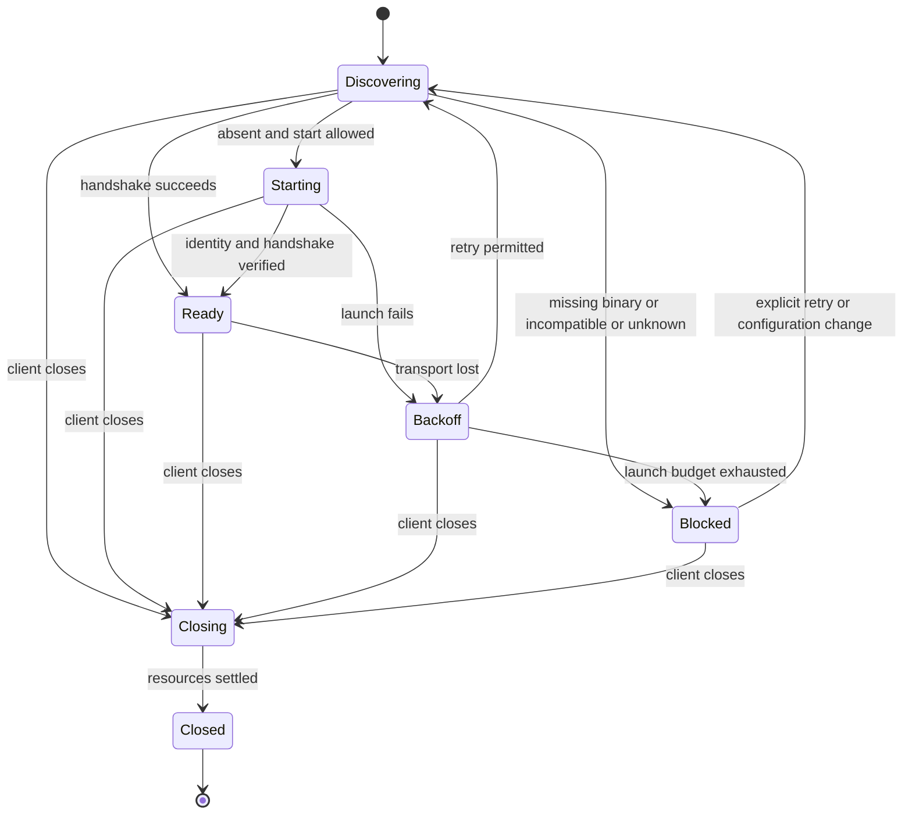

# Stabilizing the primary client lifecycle

[English](CLIENT_LIFECYCLE.md) · [한국어](CLIENT_LIFECYCLE.ko.md) · [↑ Docs](README.md)

Status: **implementation contracts and acceptance criteria, 2026-09-12.** This develops the first recommendation in the [project review](PROJECT_REVIEW_2026-09-11.md). Requirements and acceptance criteria describe work to implement, not completed behavior. Section 2 identifies current implementation evidence. [`docs/DESIGN.md`](DESIGN.md) records the initial design; this document governs the lifecycle stabilization work.

## 1. Scope and completion

The first targets are **JetBrains, desktop VS Code and the local web console**. Exercise existing work features through installation, connection, work, reconnection and shutdown. Windows x64 is a required acceptance environment; macOS and Linux require regression verification. Record the IDE product and exact build, extension/core versions and architecture. A successful build does not establish successful installation.

This scope excludes a new Visual Studio transcript, Office feature expansion, browser-hosted VS Code, redesigning execution placement for Remote SSH/WSL, and a complete migration to the common bridge. Unsupported execution locations must be reported explicitly, never silently replaced with a local workspace. Keep platform-specific Markdown rendering, but introduce no separate vertical scroll area or arbitrary length limit for responses and Think content.

A companion is the daemon executing work for a workspace. Its owner is the client instance that launched it to manage its lifetime. A window discovering an existing daemon is an observer. Knowing a socket path or PID does not confer ownership. Browser tabs are observers.

## 2. Current implementation and remaining work

Reviewed through `01d3c060`, 2026-09-12. Follow-up review findings are resolved. This document retains the implementation contracts and acceptance criteria.

| Area | Current implementation | Remaining verification |
|---|---|---|
| IDE launch and ownership | Feature discovery, ownership pipes, EOF shutdown, generation matching and retry policy are connected. JetBrains reopening, manual retry and launch-exception transitions are corrected. | Installed products, GUI path resolution, IDE shutdown, disable and forced termination |
| Core updates | The automatic loop and both meeting entry points use the hold. Installation locks, journals, readiness-based stability checks, Windows rollback and successor-start failure recovery are implemented. | U01–U08 for actual product and installation combinations |
| Transcript and web | Preview replacement, draft preservation, reconnection and replay-completion signals are implemented. Bridge `rows` limits connection to 2s, handshake to 5s and replay silence to 15s. | L10–L12, including rendering and server restart |
| Bridge diagnostics | `about` and `activity` use separate connections with 2s connect and 5s exchange limits. `forward` retains its cached connection for long requests. | Regress silent peers followed by another request, and successful long-running forwarding. |
| Binary and release | VS Code searches PATH and its cache. Automatic first-install download is separate work. | Installation guidance, executable/version diagnostics, ZIP/VSIX installation and downgrade |

Test Windows without `MAGI_SOCKET_DIR` too. A long or inaccessible path must not become “daemon absent.” Explain how to configure a shorter path and show the effective path; clients must not silently choose a different address from an existing daemon.

### 2.5 Decisions and verification status

Do not create `<socket>.lifecycle`. Use handshake and `about` for current state; unobserved exit reasons are unknown. Update journals serve file-replacement recovery only. Advertise features with their implementation.

The code findings identified in this review are resolved; platform acceptance remains. This is not a claim that no other defects exist. Revisions and scope for the reviewer's Go, VS Code and JetBrains test runs are preserved in git history. Distinguish implementer-reported Windows live runs from reviewer runs on macOS. Completion requires actual IDE/browser acceptance, native `deactivate`, L12 server restart and E's deployment evidence.

## 3. State and responsibility

Store connection state, process ownership and work state separately. `Ready` means communication is available, not that work has finished. Display connection state and the time of the last known work-state observation separately.

Entering `Closing` cancels automatic launch, connection, download and subscription attempts and advances the client generation. Discard late results from earlier generations and close their resources. Never reuse a `Closed` instance. A new window is a new owner.

| Component | Responsibility |
|---|---|
| Core | Arbitrate one daemon per workspace, identify process generations, detect owner-channel closure, transfer ownership to a successor, preserve event facts |
| IDE lifecycle manager | One entry point for discovery, launch, retry and shutdown; retain the owner channel; apply settings and user actions |
| Transport | Bounded connections and requests, preserve failure causes, dispose failed connections |
| Transcript consumer | Session cursors, previews and recovery; reject stale subscription results |
| Web server and browser | Server accesses daemons; tabs connect to the server. Closing a tab does not stop a daemon |

An independent daemon explicitly started through the web is managed with an explicit shutdown action. Refreshing a browser, reconnecting SSE or polling a list never authorizes daemon creation.

## 4. Launch, compatibility and ownership contract

### Discovery and launch

1. Establish execution location and workspace. Resolve configuration, socket and executable paths in the same environment. Diagnostics record the selected executable's absolute path and version. Unconditionally launching every shell to augment PATH is not required.
2. Use a bounded handshake, not socket-file existence alone. Connection refusal, permission errors, invalid paths and unsupported features are distinct outcomes. Do not launch a daemon on an ambiguous failure.
3. Launch only when startup is enabled and absence is established. Use single-flight within a window and the existing core workspace lock between windows. A losing launcher attaches to the winner as an observer.
4. Declare readiness only when the published process generation matches the handshake. Creating a process or a file is insufficient.

### Implemented interfaces and ownership

`magi ide-bridge --features` returns one JSON line without contacting a daemon or writing to disk. Check `raw-socket-v1` and `owned-daemon-v1`; distinguish an old binary rejecting the option (exit code 2, empty stdout). Do not infer support from prose output. [IDE_BRIDGE](IDE_BRIDGE.md) defines the detailed contract.

With `owned-daemon-v1`, an IDE launches `magi --daemon --client-owned` and exclusively retains the dedicated child-stdin pipe's write end. Do not pass that end to other children. The core treats EOF as owner termination. Publication and `about` expose an `ownerId` stable across the lineage and an `instanceId` that changes per process. IDs support correlation; the inherited pipe grants lifecycle authority. Preserve the existing user `shutdown` command's authorization.

Initial readiness requires the launched child PID, workspace and matching generation in publication and `about`. Reject a generation ID present on only one side; use the PID fallback only when both sides lack it. Retain the confirmed owner to identify later replacements. Unobserved exit reasons remain unknown.

### Successor and failure recovery

Windows transfers the same pipe read end and owner to its successor. The predecessor stops admission and releases its listener and workspace lock before launching. For up to 30s, verify that publication names the successor PID, workspace and lineage and that the handshake's generation matches.

| Outcome | Action |
|---|---|
| Ready | The predecessor exits. |
| Exits before readiness | Exit code 0 and another daemon taking the workspace are not candidate failures. Otherwise call `SuccessorFailed` to attempt rollback and refuse the candidate. |
| Cannot start | Windows `Start()` and Unix `Exec()` failures use the same recovery path with successor PID 0. The old listener is already closed; do not report success. |
| Alive but unready after 30s | Report `NotReady` and leave the successor running when the predecessor exits. The journal handles subsequent stability checks. |

After rollback, relaunch the previous build once for an unowned daemon or while its owner remains alive. If the owning IDE has closed, restore only the file. If no rollback is available or the previous build also fails, return an error code and manual recovery instructions. Do not loop. On Windows, inspect owner liveness with `PeekNamedPipe` without consuming the successor's input. A successful Unix image replacement leaves no predecessor to monitor it.

### Shutdown and old-core compatibility

Closing the IDE's write end and forcibly terminating the extension host must produce EOF and stop successors too. The core must cancel work, stop listeners and clean publication within 5s of EOF. Never wait on the IDE UI thread. If force is needed, the IDE may target only the original child for which it holds a handle; the core guarantees successor shutdown.

If VS Code cannot create its independent ownership channel, clean partial resources and launch with Node's default `'pipe'`. Once per launch, report the failed step, cause and potential disconnection during update/restart. Keep the policy allowing updates in this degraded state. An update-related disconnection is not a consecutive failure; recover by launching a fresh companion. Acceptance must distinguish actual owner termination from the original child's exit.

| Launch condition | Action |
|---|---|
| Required Windows relay unsupported by the core | Block with update instructions. Do not launch through an unusable transport. |
| Ordinary launch with only owned mode unsupported | Warn and preserve the previous lifetime. Explain that closing the window stops the child but forcibly killing the host may leave the daemon running. |

Allow connections to older daemons and disable unsupported features. Never silently switch to detached execution. Separate initial installation automation from installed-core updates, which follow §9.

## 5. Recovery and shutdown policy

These are shared target values, implemented as injectable policy for virtual-clock tests.

| Item | Target |
|---|---|
| Connection handshake | At most five seconds per attempt |
| New-process readiness | Thirty seconds from process creation; retries do not restart the clock |
| Reconnection | 1, 2, 4, 8, 16, 30 seconds, then 30 seconds; ±20% jitter, capped at 30 seconds |
| Self-restart grace | No new process during the first five seconds after disconnection |
| Automatic launch budget | At most three actual spawns per workspace in a rolling 60-second interval; remain `Blocked` after the third consecutive failure |
| Budget reset | Explicit retry or 60 seconds continuously connected; a brief successful handshake does not reset it |
| Shutdown | Five seconds from owned-mode EOF; never wait on the IDE UI thread |

Track rolling-window spawn count separately from consecutive failures. A 30-second readiness failure or unexpected exit before the 60-second stable period counts as a failure. Time passing alone does not clear that streak. Requested update replacement is not a failure, but failed replacement is.

Observers retry connections only. They neither recreate nor terminate external daemons. Explicit user shutdown of an owned daemon sets `Blocked` and disables automatic launch. Report normal owner shutdown, requested replacement and unexpected child exit separately. File absence alone cannot establish these reasons.

A request timeout invalidates its connection. If a response to `submit`, editing, approval or another effectful request is lost, **do not automatically resend it**. Query state; if the outcome remains unknown, show that uncertainty and how to check. Automatic deduplication can be extended later with an explicit request-ID contract.

Shutdown order is: reject new work, cancel launch/retry, attempt editor-hand detach, close subscriptions/connections, close the ownership pipe, confirm exit. A failed detach must not skip remaining cleanup. Shutdown is idempotent.

## 6. Transcript and visible outcomes

Replay completion is an event-free `live:true` frame. Empty logs and up-to-date cursors complete immediately; other replays signal after their last event. A failed log-head query reports a reason and ends a one-shot `History` read with an error. Do not infer completion from older cores that lack the marker. Bound connection, handshake and replay reads separately; the 15s replay limit measures silence and resets per frame.

For the same session and process generation, reconnect after the last confirmed seq. If the cursor is rejected, clear the cache and replay in full. An existing full-replay implementation may first prove atomic display replacement without duplication or loss, then move to incremental recovery.

A seq=0 preview does not advance the persistent cursor. A final fact replaces the same logical row, including a changed final verdict. Council row identity must include session and convening identity; a round number alone must not combine councils from different turns. Never reuse another session's cursor after a session change.

Persist drafts in IDE webview state or web sessionStorage, scoped to execution location, workspace, session and tab. Never restore another workspace or tab's draft. Keep the last conversation and unsent input during recovery, and mark stale content. Do not create an empty conversation just because a connection failed. Preserve full response and Think content within one vertical transcript scroll. Horizontal scrolling inside code blocks is allowed.

Diagnostics include phase, execution location, workspace, actual executable/version, socket, published generation, owner/observer role, cause, attempt count and next action. Do not dump entire environments or authentication secrets. Update persistent status instead of repeating the same notification.

## 7. Work packages and dependencies

| Package | Change ownership | Handoff deliverable | Dependency |
|---|---|---|---|
| A. Core lifecycle | `cmd/magi`, `internal/graceful`, daemon publication, `idebridge` feature discovery | Feature fixtures, ownership-pipe/replacement/EOF tests, legacy-mode compatibility evidence | None |
| B. JetBrains manager | Launch, transport, subscription and disposal in `clients/jetbrains/plugin` | Shared transitions applied (`Phase`/`Progress` — §3's table and generation) and actual IDE shutdown evidence | Develop against A's fixture, accept against A's implementation |
| C. VS Code manager | `clients/vscode/src/core` and `src/ide` | Windows relay detection, owned mode, retry/webview evidence. The closing contract (order, cleanup despite a failed step, repeated calls) has tests; **running the native `deactivate` itself is real-editor acceptance** | Develop against A's fixture, accept against A's implementation |
| D. Web recovery | `clients/web/server` and the web shell's stream owner | Refresh and tab close are measured by `clients/web/e2e/tests/lifetime.spec.mjs` **against the published records' pid/instance**. SSE recovery, preview replacement and draft persistence have landed; **the server restart (L12's third) is still open** | Can start with the existing transcript contract |
| E. Release acceptance | Client packaging and relevant CI | Matrix results below and installable artifacts | A–D |

Shared fixtures describe behavior, not required source strings. Implementers coordinate changes outside their owned paths and preserve others' edits. Release core support before clients depend on it. Adding CI does not itself deploy a release.

## 8. Acceptance matrix

Record OS/product builds, core/extension versions, logs, final PID/socket state and observed UI for every case. “Not run” is not a pass. This phase is incomplete without actual Windows installation tests.

| ID | Reproduction | Pass condition |
|---|---|---|
| L01 | Missing core, old core, malformed feature response, silent handshake | Actionable installation/update instruction; no incorrect spawn or infinite retry |
| L02 | Spaces, Korean and long paths; GUI-launched IDE; socket override present/absent | Same workspace identity; path/permission failures identify cause and remedy |
| L03 | Two IDE windows start the same workspace together | One daemon and one owner; loser attaches as observer |
| L04 | Two IDEs and web attach to an external daemon, then close independently | External daemon survives; only each client's connections and hand are removed |
| L05 | Normal owned IDE close, extension disable, forced host termination | Owned daemon and socket/session publication removed within five seconds (no exit-reason record); other daemons survive |
| L06 | Close IDE during Windows self-update; fail the update | No orphan successor or unrelated PID termination; failure outcome observable |
| L07 | Close just before readiness or after connection; duplicate dispose | No late spawn/connection/subscription; no accumulating handles or timers |
| L08 | Repeated child crashes, explicit shutdown, permission errors | Budget and grace respected; `Blocked` cause visible; no unwanted resurrection |
| L09 | Lose response connection immediately after submit | No duplicate automatic submission; unknown outcome is not shown as success |
| L10 | Session change, cursor rejection, changed final fact after preview, multiple councils | Confirmed content matches replay; no loss or duplication |
| L11 | Long response/Think, narrow window, wheel over content | Full content retained and readable without inner vertical scrolling |
| L12 | Web refresh, two tabs, server restart | Daemon lifetime independent of tab count; input-preservation policy verified; connection distinct from completion |
| L13 | Install ZIP/VSIX and roll back to an earlier version | History/settings preserved; unsupported feature explained; exact installed combination recorded |

Record core/policy unit tests, actual-daemon integration tests, actual renderer tests and installed-IDE verification separately. Source-field checks or mocks alone cannot close L03–L13. Run every case for both IDEs and local web on Windows x64, and all applicable cases on macOS/Linux. Any excluded environment must be explicit in acceptance evidence and reduce the declared completion scope.

L01 also covers a peer that accepts but never answers. L10 includes empty logs, up-to-date cursors and log-head errors: distinguish completion from failure, and bound silence.

## 9. Automatic updates — included in this phase

### 9.1 Current behavior and target

The core already has an [automatic update loop](../cmd/magi/autoupdate.go), [release/checksum discovery](../internal/update/github.go) and [replacement with executable preflight](../internal/update/rollback.go). The loop checks release builds every six hours by default, replaces the file, then waits for idle before restarting. `Commit` no longer decides on `--version` alone: a replacement that passes the pre-flight is written to `<binary>.update.json` as an **unconfirmed transaction** with the previous copy kept at `.prev`. A daemon that comes up on it and lasts `StableWindow` (60s) confirms it; a restart after the candidate’s watcher died abnormally without confirming restores the previous build and refuses that version. A healthy concurrent workspace start is not a failure. Only an explicit retry (`magi -update`, the console button) clears the refusal. An **install-unit lock** now sits above the in-process mutex (§9.3 step 1): only one of the daemons sharing an executable replaces it, and the others carry on with their own work.

The target is to **confirm actual daemon readiness and a stable period before committing an update**. Separate first-install downloads from updating an installed core. Initial installation automation may remain separate; automatic core updates and recovery are part of this acceptance scope.

### 9.2 Responsibility and user control

| Target | Update executor | Client responsibility |
|---|---|---|
| Core | One installation coordinator extending the existing core updater | Display status and request explicit check/apply/retry; never compete to replace the binary |
| JetBrains plugin / VS Code extension | IDE update manager | Compatibility guidance, restart-required indication, lifecycle cleanup on disable/reload |
| Web console server | Installation/deployment manager | Display core status; a tab refresh does not replace the server binary |

Respect existing `[update] auto` and update-check opt-outs. Disabling automatic updates prevents automatic checks, downloads and application, including a candidate already downloaded. Explicit manual updates remain available but do not imply force-restarting active work. Explain that IDE-extension and core update settings are independent. Do not automatically overwrite development builds or installations owned by external package managers. Unknown installation ownership requires a manual management path.

Do not duplicate core settings in each client. Distinguish running version, next-launch version on disk, candidate version, automatic setting, last check, deferral reason, failure and rollback outcome. Status must exclude authentication secrets. Advertise any additional status interface through core capabilities; older clients retain existing connections and work.

### 9.3 Update transaction

The sequence is **check → download → verify → await safe point → replace → verify readiness → verify stability → commit**. Record failures with their transaction stage.

1. **Check/download:** retain the six-hour default and distributed jitter. Processes sharing the same resolved installation path elect one coordinator with an OS file lock. Never steal a live lock based only on file age. Waiters continue their work and query status. Download to temporary storage with a ten-minute attempt deadline. Owner shutdown or disabling updates cancels the attempt.
2. **Verify:** select the core release lane through `core-latest.txt`, pin the exact tag/OS/architecture archive and that release's `checksums.txt`. Verify SHA-256 of the entire archive before extraction, then preflight executable version/features. Missing/mismatched checksums or wrong architecture preserve the installed file. Do not describe checksum verification as signature verification.
3. **Safe point:** defer while a turn, tool, council, approval/question wait or queued executable request is active. Background work without a stop/recovery contract also prevents application. Check safety and stop accepting new work atomically in the core; a new request must not race an earlier idle observation. Do not cancel work to manufacture an idle window.
4. **Replace:** retain the verified candidate, previous executable, transaction stage and target version per installation. Keep the previous version on the same filesystem and replace atomically. Windows executable locks or temporary antivirus contention receive bounded retries, then a failure report; do not force-stop the working previous version. Preserve logs, settings and sessions.
5. **Restart/commit:** preserve lineage and the ownership channel from §4. Verify successor workspace, ownerId, instance, handshake and required features within 30 seconds; commit after 60 stable seconds. A successful `--version` does not authorize backup deletion. Clients refresh capabilities/transcript state on generation changes and restore drafts. Never automatically resend previously submitted work.
6. **Rollback:** readiness failure or unexpected exit during the stable period restores the previous executable and relaunches it only while the owner remains alive. If the IDE has closed, restore files without resurrecting a process. Block automatic reapplication of the same failed candidate at that installation until a new candidate or explicit retry. Log candidate/restored versions and cause. If the previous version also fails, remain `Blocked` with manual recovery instructions.

Retain the installation lock through transaction completion; other daemons continue their own work during the 60-second stable period. Daemons sharing a binary may have different running and on-disk versions. Each restarts at its own safe point and must not launch a candidate that has since been rolled back. Check the installation coordinator's generation to prevent that race.

If a process or machine stops mid-transaction, the next startup reconciles the journal and files to restore the last known-good version. Automatically reversible releases must preserve record/settings readability by the previous version. Exclude releases requiring irreversible migrations from automatic application and provide explicit migration instructions.

**Node ownership-pipe constraint:** Node closes a `ChildProcess`'s default stdin stream when the original child exits. Simply inheriting that stdin in a Windows successor therefore does not preserve the owner channel. Implementers must select a separate pipe manager/broker or equivalent OS-handle arrangement that lives for the client lifetime and supply execution evidence distinguishing predecessor exit from actual owner exit. The owned-update path is incomplete without that arrangement.

### 9.4 Ownership and acceptance

Package A also owns the core updater, installation lock, journal and rollback. B/C own IDE settings/status, owner-channel continuity and reconnection; D owns web status and independence from tab lifetime. E verifies U01–U08 below as well as L01–L13. Agree on core API fixtures first and release core support before clients depend on it.

| ID | Condition | Pass condition |
|---|---|---|
| U01 | Automatic setting off, development build, externally managed installation | No automatic download/replacement; manual path explained |
| U02 | Candidate arrives during turn/tool/council/approval wait | Existing work preserved, deferral explained, safe-point race prevented |
| U03 | Offline, slow/interrupted download, checksum mismatch, wrong architecture | Existing process/files preserved; bounded attempts and stage-specific causes |
| U04 | Multiple daemons and a manual action update one binary | One replacement, intact known-good backup, inter-process lock verified |
| U05 | Successor cannot start, fails readiness after successful preflight, or crashes within 60 seconds | Previous version restored; no failed-candidate retry loop |
| U06 | Windows predecessor exit, IDE close or forced host exit during update | Predecessor exit preserves successor; actual owner exit cleans it up |
| U07 | Process/machine interruption at each stage, irreversible migration candidate | Consistent next-start recovery, data retained, unsupported automatic application refused |
| U08 | IDE-extension update, core update and web refresh overlap | Session/draft/ownership preserved, no duplicate submission, running/candidate/restored versions distinguished |

U04–U07 use real file replacement and processes. Without an actual Windows installation/update/rollback run, record those results as not run.

**As of 2026-09-12 some of them do run on Windows** — as tests in this repository: install-lock contention (U04 — the one that cannot take it neither queues nor steals, `internal/update/lockscope_test.go`), successor readiness failure and rollback (U05, `cmd/magi/successor_live_windows_test.go` and `update_rollback_live_windows_test.go`), predecessor exit and a force-killed owner (U06, `cmd/magi/owned_live_windows_test.go`), and a replacement cut off before it was recorded (one branch of U07). **What is left needs hands** — the manual update button, an interruption that takes the machine down, an irreversible-migration candidate, and a real IDE installation.
