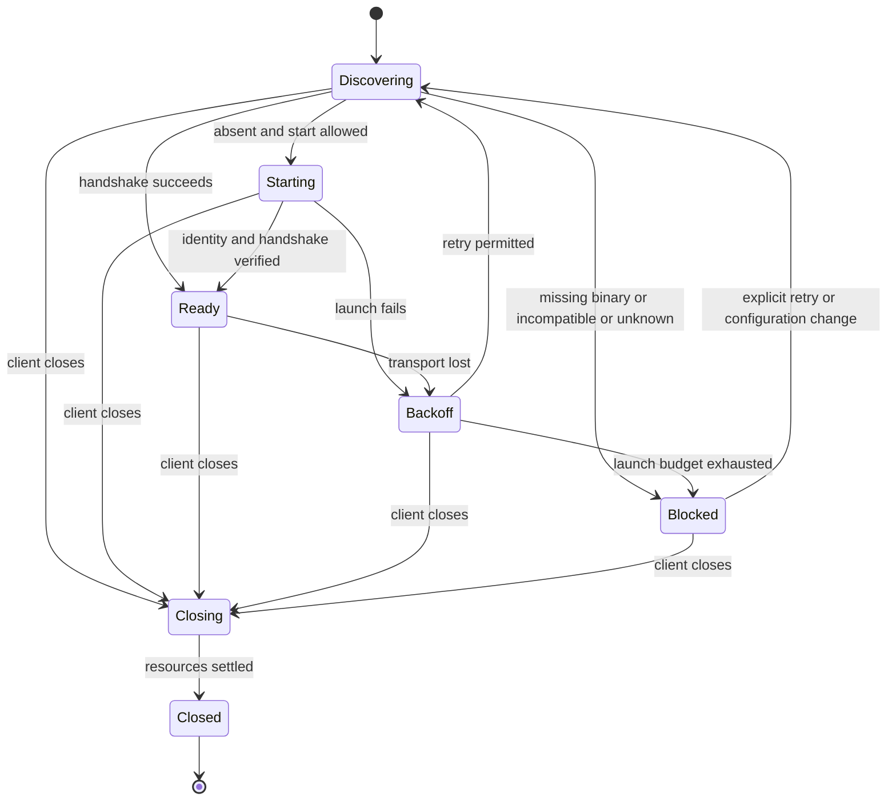

# Stabilizing the primary client lifecycle

[한국어](CLIENT_LIFECYCLE.ko.md) · [Documentation map](README.md)

Status: **target design for implementation handoff, 2026-09-11.** This develops the first recommendation in the [project review](PROJECT_REVIEW_2026-09-11.md). Requirements and acceptance criteria describe work to implement, not completed behavior. Section 2 identifies current implementation evidence. `docs/DESIGN` records the initial design; this document governs the lifecycle stabilization work.

## 1. Scope and completion

The first targets are **JetBrains, desktop VS Code and the local web console**. Exercise existing work features through installation, connection, work, reconnection and shutdown. Windows x64 is a required acceptance environment; macOS and Linux require regression verification. Record the IDE product and exact build, extension/core versions and architecture. A successful build does not establish successful installation.

This scope excludes a new Visual Studio transcript, Office feature expansion, browser-hosted VS Code, redesigning execution placement for Remote SSH/WSL, and a complete migration to the common bridge. Unsupported execution locations must be reported explicitly, never silently replaced with a local workspace. Keep platform-specific Markdown rendering, but introduce no separate vertical scroll area or arbitrary length limit for responses and Think content.

A companion is the daemon executing work for a workspace. Its owner is the client instance that launched it to manage its lifetime. A window discovering an existing daemon is an observer. Knowing a socket path or PID does not confer ownership. Browser tabs are observers.

## 2. Implementation evidence and gaps

| Area | Current evidence | Required change |
|---|---|---|
| VS Code launch | [OwnedCompanion](../clients/vscode/src/core/lifecycle.ts): foreground process, 30-second readiness wait, single-flight launch per window, shutdown through a process handle | Preserve ownership across replacement processes; define a stable period for retry-budget reset |
| VS Code binary | [binary.ts](../clients/vscode/src/core/binary.ts): process PATH and existing cache lookup | Automatic download is absent. Provide installation guidance and actual executable/version diagnostics; verify GUI launch environments |
| Windows transport | [daemon.ts](../clients/vscode/src/core/daemon.ts), [relay.go](../internal/adapter/idebridge/relay.go): `ide-bridge --raw-socket` | Check relay support before connecting; verify an installed Windows client |
| JetBrains launch | [StartDaemon](../clients/jetbrains/plugin/intellij/src/main/kotlin/dev/sayaya/magi/ide/ui/StartDaemon.kt), [Restarts](../clients/jetbrains/plugin/core/src/main/kotlin/dev/sayaya/magi/ide/usecase/Restarts.kt) | Converge on the policy below; reconcile the README's restart descriptions with the actual service during acceptance |
| Process replacement | [Windows reexec](../internal/graceful/graceful_windows.go): starts a successor and exits | Remove dependence on retaining only the original process handle |
| Web and transcript | [client contract](CLIENTS.md), [VS Code Chat](../clients/vscode/src/ide/chat.ts) | Separate connection recovery from resubmitting work; unify acceptance for facts, previews and session changes |
| Verification | [VS Code daemon test](../clients/vscode/src/test/lifecycle.test.ts), [webview test](../clients/vscode/tools/transcript-test.mjs) | Extend to package installation, actual IDE shutdown, forced termination and update replacement |

Test Windows without `MAGI_SOCKET_DIR` too. A long or inaccessible path must not become “daemon absent.” When a shorter path is necessary, explain where to configure it and show the effective path. A client must not silently choose a different path from an existing daemon.

## 2.5 Current status and remaining work (2026-09-11)

| Area | Current state and evidence |
|---|---|
| Core contract | Feature discovery, instance identity, owned mode and EOF shutdown implemented: `da67e068`, `55ead8ac`, `6f6ce97f` |
| IDE launch and recovery | Shared policy and backoff connected. R1 close race and R3/R4 JetBrains integration corrected: `179169f8`, `07c0f509` |
| Windows owner channel | VS Code supplies its own pipe as child stdin: `07358567`. Channel lifetime is independent of Node child-exit handling. The implementer reports real Windows core checks for successor survival, close and forced host termination. The channel-creation failure path has landed too (R8, `ca79c0f9`) — see §4. |
| Transcript and web | Preview replacement, draft persistence, SSE backoff and disconnection indication implemented: `bbeb8834`, `43f45f1c`, `14f8dd93`, `e0fa16ab`, `44857463` |
| Core update confirmation | A replacement now begins unconfirmed (`838d6c3c`, `ba68fe32`): `.prev` and `<binary>.update.json` are kept, a daemon that lasts 60s on the new build confirms it, and a SECOND start on the same candidate is read as the first generation not lasting — the previous build goes back and that version is refused. A deliberate stop is not counted as falling over, and a refusal is cleared by an explicit user retry. One replacement per install unit is enforced by an OS lock on `<binary>.update.lock` (a process that cannot take it neither queues nor steals — it carries on with its own work), and a replacement cut off before it was recorded is put back from `.prev` on the next start. |

**Current decisions:** Do not create `<socket>.lifecycle`. The implementer's duplicated-state concern was accepted. Use handshake and `about` for current state; unobserved exit reasons are unknown. Update journals serve only file-replacement recovery. Advertise feature names together with their implementation.

**Remaining work:** Generation/owner-lineage verification, successor readiness, actual IDE acceptance and update transaction coordination. Backup retention, journaling and replacement-phase locking exist, but concurrent daemon starts and confirmation before readiness remain unresolved. Address R8–R11 in the [follow-up review](CLIENT_LIFECYCLE_REVIEW_2026-09-11.md) before completing §9 acceptance.

## 3. State and responsibility

Store connection state, process ownership and work state separately. `Ready` means communication is available, not that work has finished. Display connection state and the time of the last known work-state observation separately.

Entering `Closing` cancels automatic launch, connection, download and subscription attempts and advances the client generation. Discard late results from earlier generations and close their resources. Never reuse a `Closed` instance. A new window is a new owner.

| Component | Responsibility |
|---|---|
| Core | Arbitrate one daemon per workspace, identify process generations, detect owner-channel closure, transfer ownership to a successor, preserve event facts |
| IDE lifecycle manager | One entry point for discovery, launch, retry and shutdown; retain the owner channel; apply settings and user actions |
| Transport | Bounded connections and requests, preserve failure causes, dispose failed connections |
| Transcript consumer | Session cursors, previews and recovery; reject stale subscription results |
| Web server and browser | Server accesses daemons; tabs connect to the server. Closing a tab does not stop a daemon |

An independent daemon explicitly started through the web is managed with an explicit shutdown action. Refreshing a browser, reconnecting SSE or polling a list never authorizes daemon creation.

## 4. Launch, compatibility and ownership contract

### Discovery and launch

1. Establish execution location and workspace. Resolve configuration, socket and executable paths in the same environment. Diagnostics record the selected executable's absolute path and version. Unconditionally launching every shell to augment PATH is not required.
2. Use a bounded handshake, not socket-file existence alone. Connection refusal, permission errors, invalid paths and unsupported features are distinct outcomes. Do not launch a daemon on an ambiguous failure.
3. Launch only when startup is enabled and absence is established. Use single-flight within a window and the existing core workspace lock between windows. A losing launcher attaches to the winner as an observer.
4. Declare readiness only when the published process generation matches the handshake. Creating a process or a file is insufficient.

### Interfaces to add — each paragraph carries its state

**`magi ide-bridge --features` is built (2026-09-11).** It answers one JSON line without contacting a daemon and writes nothing to disk. Measured output: `{"features":["raw-socket-v1","owned-daemon-v1"],"protocol":1,"version":"…"}` (re-measured 2026-09-11). The existing `ide-bridge` protocol and `--raw-socket` behavior are unchanged. An old binary answers by refusing the option — exit code 2, nothing on stdout — and that is the only ground for concluding "unsupported". Do not infer support by searching prose output. The contract and its reasons are in [IDE_BRIDGE §5](IDE_BRIDGE.md#asking-what-this-binary-can-do).

`owned-daemon-v1` is advertised too now, because **the mode arrived** (`6f6ce97f`). This spot once read "NOT advertised", and the reason was that a name shipped ahead of its thing sends a client to start a mode this binary does not understand, whose failure reads as a broken install. The feature list is **derived from the implementation** rather than written down, so the two cannot drift, and the tests hold both floors — everything advertised is real, and every mode this binary knows is advertised.

Each paragraph below carries its state. **Landed** means it runs in this repo; **not yet** means target design.

**Landed (`6f6ce97f`).** With `owned-daemon-v1`, an IDE starts the `magi --daemon --client-owned` mode. The IDE exclusively retains the write end of a dedicated child-stdin pipe and does not pass it to other children. The core interprets EOF on the read end as owner termination. IDs in process environments or public records are for correlation, not proof of shutdown authority.

**Landed (`55ead8ac`, `6f6ce97f`).** At startup the core generates `ownerId`, stable across its owned lineage, and `instanceId`, changed on every process replacement. Add these as optional fields in local publication and `about`. They distinguish PID reuse and update replacement. Lifecycle authority travels only through the inherited pipe. The existing user `shutdown` command's authorization contract remains unchanged.

**Not yet — this half is the client's.** The core puts both IDs in publication and in `about`, but today **no client reads either** (measured: zero references to `instanceId` or `ownerId` anywhere under `clients/`). Initial readiness requires the launched child PID, resolved workspace and matching instanceId in publication and `about`. Retain the confirmed ownerId in that owner's memory. Verify later generations through the same ownership-pipe lineage and ownerId, not PID alone.

**Decided — no file.** Do not create an exit-reason file. Following the review decision in §2.5, use handshake and `about` for current state. Report unobserved exit reasons as unknown and use §5 policy to decide whether to restart.

**Half landed (`6f6ce97f`, `07358567`).** On Windows, transfer the same pipe read end and ownerId to the successor — both cross, and the defect where a successor saw EOF while the window was still alive was closed and measured on real Windows in R2. The predecessor first stops accepting requests and releases its listener/workspace lock, then starts the successor, which `graceful_windows.go` also does. **What is left is the readiness check**: the predecessor leaves as soon as `Start()` returns, so a successor that dies on the way up is seen by nobody. Confirm successor readiness before the predecessor exits; closing the predecessor's copy must not be mistaken for owner EOF. If an update fails, either preserve the previous generation or report replacement failure. A client must not adopt a newly discovered PID as its own child.

**Landed (`6f6ce97f`, `07c0f509`, `07358567`).** Closing the IDE's write end must also stop a successor. Forced extension-host termination is handled through the same EOF. In owned mode, the core must cancel work, stop listeners and clean publication within five seconds of EOF. Do not block the IDE UI thread. If shutdown stalls, the IDE may force-stop only the still-live original child for which it holds a handle. The core guarantees successor shutdown. Existing lifetimes in other modes remain unchanged.

**Landed (`ca79c0f9`) — when that pipe cannot be made.** The window falls back to Node's `'pipe'`. Falling back is the right call: the name carries the window's pid and eight random hex digits, so the realistic failure is somebody taking it first, and refusing to start over that would hand them the outage. What was wrong was not SAYING so, and not cleaning up what had already been made (issue #189, review R8). Three fixes. ① `createServer`, `listen`, the dial and the accept all met one `catch { return nodes; }`, returned the same value and left no trace; the step that gave up and what it said now travel in `why`. ② Every step registers its own undo *before* the next one can throw — the success path stops listening the instant it has one connection (that is what makes the pipe undialable) and the failure path was quietly the exception; the accept had no deadline either, so a promise nobody settles could leave a window starting for ever, which has no symptom at all. ③ `OwnerChannel.held` was declared and had **no reader**; it now goes through the shape R5 built, once per start, carrying what is lost (an update or restart will END this companion) and what to do (reopen the window and it draws a fresh name).

⚠ **The update path is NOT blocked on the fallback — that is a judgement.** The review asked for it to be blocked when the successor's lifetime cannot be guaranteed. Blocking would hand an update outage to whoever took the pipe name, and a taken name is precisely the realistic failure. Since `c5373a08` that death is not counted as a consecutive failure and the window starts a fresh companion within fifteen seconds, so what is lost is those seconds — and those seconds are now disclosed in advance instead. If evidence arrives that blocking is better, that is the moment to change it.

**Acceptance — on real Windows, through the product class (`OwnedCompanion`).** Started with the name taken: the companion **comes up**, the reason carries `listen EADDRINUSE` and arrives **once** (the second ask is empty), and `close()` still ends the companion — by the child handle, since the pipe is not held. R2's three acceptance answers were re-run and are unchanged.

**Landed (`73a1a313`, `61ded932`).** Allow connections to old daemons while disabling unsupported features. Block new launches **requiring** Windows relay or owned mode with an update instruction when the core lacks support. Never silently fall back to detached execution. Separate initial installation automation from updating an installed core. Section 9 defines required automatic-update behavior and recovery.

**What "requiring" means, written down (follow-up R5).** That one word is where blocking and warning-then-proceeding part company, and from outside the two look like the same situation. The split is **the shutdown guarantee**.

| | With a core that lacks the owned mode | Outcome | Why |
|---|---|---|---|
| A launch that needs the Windows relay | The transport itself cannot stand up | **Blocked** | It cannot connect at all; starting one only leaves a daemon nobody can use (`whyNoRelay`) |
| An ordinary launch | Exactly the lifetime it had before the owned mode existed | **Warned, then proceeds** | Closing the window stops the child. If the extension host is **killed**, the companion survives — and that difference is said once per launch (`61ded932`) |

So the owned mode is **not a precondition for launching; it is a grade of shutdown guarantee.** The "existing lifetimes in other modes remain unchanged" a line above is that same lifetime, and blocking it would take the companion away from anyone on an older core. The relay is the opposite case: there is no lifetime to preserve in the first place.

## 5. Recovery and shutdown policy

These are shared target values, implemented as injectable policy for virtual-clock tests.

| Item | Target |
|---|---|
| Connection handshake | At most five seconds per attempt |
| New-process readiness | Thirty seconds from process creation; retries do not restart the clock |
| Reconnection | 1, 2, 4, 8, 16, 30 seconds, then 30 seconds; ±20% jitter, capped at 30 seconds |
| Self-restart grace | No new process during the first five seconds after disconnection |
| Automatic launch budget | At most three actual spawns per workspace in a rolling 60-second interval; remain `Blocked` after the third consecutive failure |
| Budget reset | Explicit retry or 60 seconds continuously connected; a brief successful handshake does not reset it |
| Shutdown | Five seconds from owned-mode EOF; never wait on the IDE UI thread |

Track rolling-window spawn count separately from consecutive failures. A 30-second readiness failure or unexpected exit before the 60-second stable period counts as a failure. Time passing alone does not clear that streak. Requested update replacement is not a failure, but failed replacement is.

Observers retry connections only. They neither recreate nor terminate external daemons. Explicit user shutdown of an owned daemon sets `Blocked` and disables automatic launch. Report normal owner shutdown, requested replacement and unexpected child exit separately. File absence alone cannot establish these reasons.

A request timeout invalidates its connection. If a response to `submit`, editing, approval or another effectful request is lost, **do not automatically resend it**. Query state; if the outcome remains unknown, show that uncertainty and how to check. Automatic deduplication can be extended later with an explicit request-ID contract.

Shutdown order is: reject new work, cancel launch/retry, attempt editor-hand detach, close subscriptions/connections, close the ownership pipe, confirm exit. A failed detach must not skip remaining cleanup. Shutdown is idempotent.

## 6. Transcript and visible outcomes

For the same session and process generation, reconnect after the last confirmed seq. If the cursor is rejected, clear the cache and replay in full. An existing full-replay implementation may first prove atomic display replacement without duplication or loss, then move to incremental recovery.

A seq=0 preview does not advance the persistent cursor. A final fact replaces the same logical row, including a changed final verdict. Council row identity must include session and convening identity; a round number alone must not combine councils from different turns. Never reuse another session's cursor after a session change.

Persist drafts in IDE webview state or web sessionStorage, scoped to execution location, workspace, session and tab. Never restore another workspace or tab's draft. Keep the last conversation and unsent input during recovery, and mark stale content. Do not create an empty conversation just because a connection failed. Preserve full response and Think content within one vertical transcript scroll. Horizontal scrolling inside code blocks is allowed.

Diagnostics include phase, execution location, workspace, actual executable/version, socket, published generation, owner/observer role, cause, attempt count and next action. Do not dump entire environments or authentication secrets. Update persistent status instead of repeating the same notification.

## 7. Work packages and dependencies

| Package | Change ownership | Handoff deliverable | Dependency |
|---|---|---|---|
| A. Core lifecycle | `cmd/magi`, `internal/graceful`, daemon publication, `idebridge` feature discovery | Feature fixtures, ownership-pipe/replacement/EOF tests, legacy-mode compatibility evidence | None |
| B. JetBrains manager | Launch, transport, subscription and disposal in `clients/jetbrains/plugin` | Shared transitions and actual IDE shutdown evidence | Develop against A's fixture, accept against A's implementation |
| C. VS Code manager | `clients/vscode/src/core` and `src/ide` | Windows relay detection, owned mode, retry/webview/deactivation evidence | Develop against A's fixture, accept against A's implementation |
| D. Web recovery | `clients/web/server` and the web shell's stream owner | Refresh, tab close, SSE recovery and preview replacement evidence | Can start with the existing transcript contract |
| E. Release acceptance | Client packaging and relevant CI | Matrix results below and installable artifacts | A–D |

Shared fixtures describe behavior, not required source strings. Implementers coordinate changes outside their owned paths and preserve others' edits. Release core support before clients depend on it. Adding CI does not itself deploy a release.

## 8. Acceptance matrix

Record OS/product builds, core/extension versions, logs, final PID/socket state and observed UI for every case. “Not run” is not a pass. This phase is incomplete without actual Windows installation tests.

| ID | Reproduction | Pass condition |
|---|---|---|
| L01 | Missing core, old core, malformed feature response | Actionable installation/update instruction; no incorrect spawn or infinite retry |
| L02 | Spaces, Korean and long paths; GUI-launched IDE; socket override present/absent | Same workspace identity; path/permission failures identify cause and remedy |
| L03 | Two IDE windows start the same workspace together | One daemon and one owner; loser attaches as observer |
| L04 | Two IDEs and web attach to an external daemon, then close independently | External daemon survives; only each client's connections and hand are removed |
| L05 | Normal owned IDE close, extension disable, forced host termination | Owned daemon and socket/session publication removed within five seconds (exit-reason record retained); other daemons survive |
| L06 | Close IDE during Windows self-update; fail the update | No orphan successor or unrelated PID termination; failure outcome observable |
| L07 | Close just before readiness or after connection; duplicate dispose | No late spawn/connection/subscription; no accumulating handles or timers |
| L08 | Repeated child crashes, explicit shutdown, permission errors | Budget and grace respected; `Blocked` cause visible; no unwanted resurrection |
| L09 | Lose response connection immediately after submit | No duplicate automatic submission; unknown outcome is not shown as success |
| L10 | Session change, cursor rejection, changed final fact after preview, multiple councils | Confirmed content matches replay; no loss or duplication |
| L11 | Long response/Think, narrow window, wheel over content | Full content retained and readable without inner vertical scrolling |
| L12 | Web refresh, two tabs, server restart | Daemon lifetime independent of tab count; input-preservation policy verified; connection distinct from completion |
| L13 | Install ZIP/VSIX and roll back to an earlier version | History/settings preserved; unsupported feature explained; exact installed combination recorded |

Record core/policy unit tests, actual-daemon integration tests, actual renderer tests and installed-IDE verification separately. Source-field checks or mocks alone cannot close L03–L13. Run every case for both IDEs and local web on Windows x64, and all applicable cases on macOS/Linux. Any excluded environment must be explicit in acceptance evidence and reduce the declared completion scope.

## 9. Automatic updates — included in this phase

### 9.1 Current behavior and target

The core already has an [automatic update loop](../cmd/magi/autoupdate.go), [release/checksum discovery](../internal/update/github.go) and [replacement with executable preflight](../internal/update/rollback.go). The loop checks release builds every six hours by default, replaces the file, then waits for idle before restarting. `Commit` no longer decides on `--version` alone: a replacement that passes the pre-flight is written to `<binary>.update.json` as an **unconfirmed transaction** with the previous copy kept at `.prev`. A daemon that comes up on it and lasts `StableWindow` (60s) confirms it; a SECOND start on the same candidate — the first generation did not last — puts the previous build back and refuses that version, which only an explicit retry (`magi -update`, the console button) clears. An **install-unit lock** now sits above the in-process mutex (§9.3 step 1): only one of the daemons sharing an executable replaces it, and the others carry on with their own work.

The target is to **confirm actual daemon readiness and a stable period before committing an update**. Separate first-install downloads from updating an installed core. Initial installation automation may remain separate; automatic core updates and recovery are part of this acceptance scope.

### 9.2 Responsibility and user control

| Target | Update executor | Client responsibility |
|---|---|---|
| Core | One installation coordinator extending the existing core updater | Display status and request explicit check/apply/retry; never compete to replace the binary |
| JetBrains plugin / VS Code extension | IDE update manager | Compatibility guidance, restart-required indication, lifecycle cleanup on disable/reload |
| Web console server | Installation/deployment manager | Display core status; a tab refresh does not replace the server binary |

Respect existing `[update] auto` and update-check opt-outs. Disabling automatic updates prevents automatic checks, downloads and application, including a candidate already downloaded. Explicit manual updates remain available but do not imply force-restarting active work. Explain that IDE-extension and core update settings are independent. Do not automatically overwrite development builds or installations owned by external package managers. Unknown installation ownership requires a manual management path.

Do not duplicate core settings in each client. Distinguish running version, next-launch version on disk, candidate version, automatic setting, last check, deferral reason, failure and rollback outcome. Status must exclude authentication secrets. Advertise any additional status interface through core capabilities; older clients retain existing connections and work.

### 9.3 Update transaction

The sequence is **check → download → verify → await safe point → replace → verify readiness → verify stability → commit**. Record failures with their transaction stage.

1. **Check/download:** retain the six-hour default and distributed jitter. Processes sharing the same resolved installation path elect one coordinator with an OS file lock. Never steal a live lock based only on file age. Waiters continue their work and query status. Download to temporary storage with a ten-minute attempt deadline. Owner shutdown or disabling updates cancels the attempt.
2. **Verify:** select the core release lane through `core-latest.txt`, pin the exact tag/OS/architecture archive and that release's `checksums.txt`. Verify SHA-256 of the entire archive before extraction, then preflight executable version/features. Missing/mismatched checksums or wrong architecture preserve the installed file. Do not describe checksum verification as signature verification.
3. **Safe point:** defer while a turn, tool, council, approval/question wait or queued executable request is active. Background work without a stop/recovery contract also prevents application. Check safety and stop accepting new work atomically in the core; a new request must not race an earlier idle observation. Do not cancel work to manufacture an idle window.
4. **Replace:** retain the verified candidate, previous executable, transaction stage and target version per installation. Keep the previous version on the same filesystem and replace atomically. Windows executable locks or temporary antivirus contention receive bounded retries, then a failure report; do not force-stop the working previous version. Preserve logs, settings and sessions.
5. **Restart/commit:** preserve lineage and the ownership channel from §4. Verify successor workspace, ownerId, instance, handshake and required features within 30 seconds; commit after 60 stable seconds. A successful `--version` does not authorize backup deletion. Clients refresh capabilities/transcript state on generation changes and restore drafts. Never automatically resend previously submitted work.
6. **Rollback:** readiness failure or unexpected exit during the stable period restores the previous executable and relaunches it only while the owner remains alive. If the IDE has closed, restore files without resurrecting a process. Block automatic reapplication of the same failed candidate at that installation until a new candidate or explicit retry. Log candidate/restored versions and cause. If the previous version also fails, remain `Blocked` with manual recovery instructions.

Retain the installation lock through transaction completion; other daemons continue their own work during the 60-second stable period. Daemons sharing a binary may have different running and on-disk versions. Each restarts at its own safe point and must not launch a candidate that has since been rolled back. Check the installation coordinator's generation to prevent that race.

If a process or machine stops mid-transaction, the next startup reconciles the journal and files to restore the last known-good version. Automatically reversible releases must preserve record/settings readability by the previous version. Exclude releases requiring irreversible migrations from automatic application and provide explicit migration instructions.

**Node ownership-pipe constraint:** Node closes a `ChildProcess`'s default stdin stream when the original child exits. Simply inheriting that stdin in a Windows successor therefore does not preserve the owner channel. Implementers must select a separate pipe manager/broker or equivalent OS-handle arrangement that lives for the client lifetime and supply execution evidence distinguishing predecessor exit from actual owner exit. The owned-update path is incomplete without that arrangement.

### 9.4 Ownership and acceptance

Package A also owns the core updater, installation lock, journal and rollback. B/C own IDE settings/status, owner-channel continuity and reconnection; D owns web status and independence from tab lifetime. E verifies U01–U08 below as well as L01–L13. Agree on core API fixtures first and release core support before clients depend on it.

| ID | Condition | Pass condition |
|---|---|---|
| U01 | Automatic setting off, development build, externally managed installation | No automatic download/replacement; manual path explained |
| U02 | Candidate arrives during turn/tool/council/approval wait | Existing work preserved, deferral explained, safe-point race prevented |
| U03 | Offline, slow/interrupted download, checksum mismatch, wrong architecture | Existing process/files preserved; bounded attempts and stage-specific causes |
| U04 | Multiple daemons and a manual action update one binary | One replacement, intact known-good backup, inter-process lock verified |
| U05 | Version preflight succeeds but successor is unready or crashes within 60 seconds | Previous version restored; no failed-candidate retry loop |
| U06 | Windows predecessor exit, IDE close or forced host exit during update | Predecessor exit preserves successor; actual owner exit cleans it up |
| U07 | Process/machine interruption at each stage, irreversible migration candidate | Consistent next-start recovery, data retained, unsupported automatic application refused |
| U08 | IDE-extension update, core update and web refresh overlap | Session/draft/ownership preserved, no duplicate submission, running/candidate/restored versions distinguished |

U04–U07 use real file replacement and processes. Without an actual Windows installation/update/rollback run, record those results as not run.
