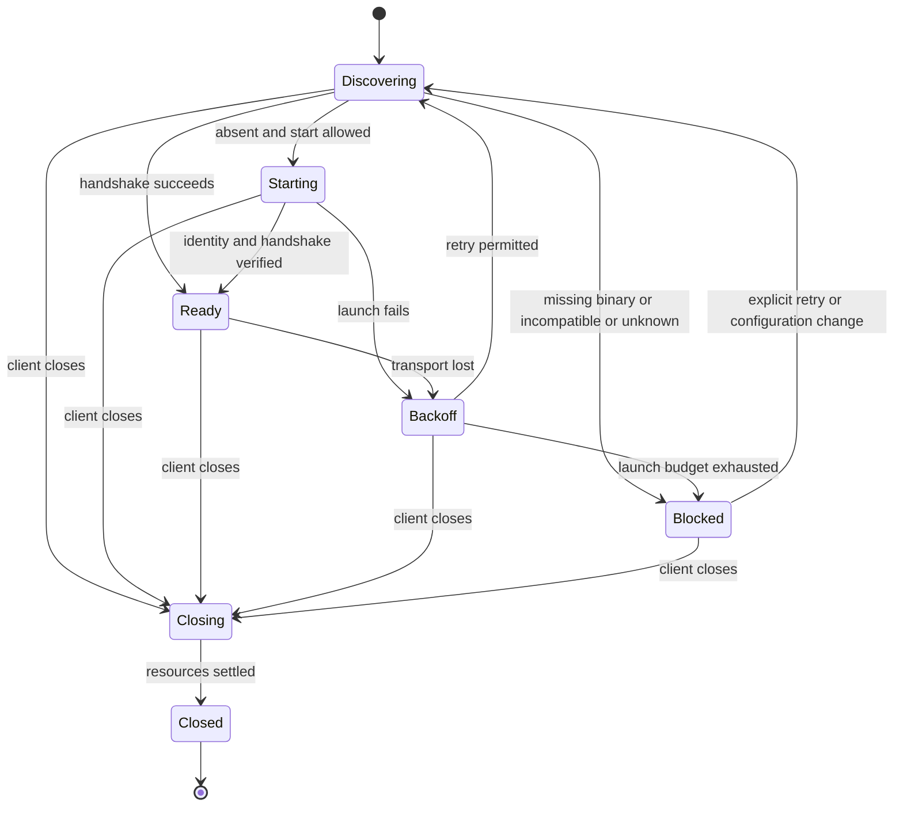

# Stabilizing the primary client lifecycle

[한국어](CLIENT_LIFECYCLE.ko.md) · [Documentation map](README.md)

Status: **target design for implementation handoff, 2026-09-11.** This develops the first recommendation in the [project review](PROJECT_REVIEW_2026-09-11.md). Requirements and acceptance criteria describe work to implement, not completed behavior. Section 2 identifies current implementation evidence. `docs/DESIGN` records the initial design; this document governs the lifecycle stabilization work.

## 1. Scope and completion

The first targets are **JetBrains, desktop VS Code and the local web console**. Exercise existing work features through installation, connection, work, reconnection and shutdown. Windows x64 is a required acceptance environment; macOS and Linux require regression verification. Record the IDE product and exact build, extension/core versions and architecture. A successful build does not establish successful installation.

This scope excludes a new Visual Studio transcript, Office feature expansion, browser-hosted VS Code, redesigning execution placement for Remote SSH/WSL, and a complete migration to the common bridge. Unsupported execution locations must be reported explicitly, never silently replaced with a local workspace. Keep platform-specific Markdown rendering, but introduce no separate vertical scroll area or arbitrary length limit for responses and Think content.

A companion is the daemon executing work for a workspace. Its owner is the client instance that launched it to manage its lifetime. A window discovering an existing daemon is an observer. Knowing a socket path or PID does not confer ownership. Browser tabs are observers.

## 2. Implementation evidence and gaps

| Area | Current evidence | Required change |
|---|---|---|
| VS Code launch | [OwnedCompanion](../clients/vscode/src/core/lifecycle.ts): foreground process, 30-second readiness wait, single-flight launch per window, shutdown through a process handle | Preserve ownership across replacement processes; define a stable period for retry-budget reset |
| VS Code binary | [binary.ts](../clients/vscode/src/core/binary.ts): process PATH and existing cache lookup | Automatic download is absent. Provide installation guidance and actual executable/version diagnostics; verify GUI launch environments |
| Windows transport | [daemon.ts](../clients/vscode/src/core/daemon.ts), [relay.go](../internal/adapter/idebridge/relay.go): `ide-bridge --raw-socket` | Check relay support before connecting; verify an installed Windows client |
| JetBrains launch | [StartDaemon](../clients/jetbrains/plugin/intellij/src/main/kotlin/dev/sayaya/magi/ide/ui/StartDaemon.kt), [Restarts](../clients/jetbrains/plugin/core/src/main/kotlin/dev/sayaya/magi/ide/usecase/Restarts.kt) | Converge on the policy below; reconcile the README's restart descriptions with the actual service during acceptance |
| Process replacement | [Windows reexec](../internal/graceful/graceful_windows.go): starts a successor and exits | Remove dependence on retaining only the original process handle |
| Web and transcript | [client contract](CLIENTS.md), [VS Code Chat](../clients/vscode/src/ide/chat.ts) | Separate connection recovery from resubmitting work; unify acceptance for facts, previews and session changes |
| Verification | [VS Code daemon test](../clients/vscode/src/test/lifecycle.test.ts), [webview test](../clients/vscode/tools/transcript-test.mjs) | Extend to package installation, actual IDE shutdown, forced termination and update replacement |

Test Windows without `MAGI_SOCKET_DIR` too. A long or inaccessible path must not become “daemon absent.” When a shorter path is necessary, explain where to configure it and show the effective path. A client must not silently choose a different path from an existing daemon.

## 2.5 Where this stands, and what is held (2026-09-11)

**A (the core lifetime contract)** from §7 is landing in layers. Below is what is in, and *why* the
rest is waiting. "Held" does not mean hard — it means something has to be decided first.

| Item | State | Commit |
|---|---|---|
| `magi ide-bridge --features` | **landed** | `da67e068` |
| `instance` in the published record and `about` | **landed** | `55ead8ac` |
| `ownerId` | **landed** | `6f6ce97f` |
| `magi --daemon --client-owned` (owner pipe, EOF) | **landed** | `6f6ce97f` |
| VS Code gates the owned mode and the relay on the feature probe | **landed** | `73a1a313` |
| Handing the pipe and ownerId to a Windows successor | half landed — reason ③ | `6f6ce97f` |
| `<socket>.lifecycle` shutdown-reason record | held — reason ② | |
| §5's policy values (budget, grace, jitter, backoff) | **landed** — shared contract + both implementations | `5fca85b7` |
| Clients actually calling that policy | **landed** — both JetBrains and VS Code | `e592da8a` |

### ① `ownerId` — settled (it went in with the owned mode)

Exactly as recorded: **in the same commit as the owned mode.** The reasoning is kept below because
the next name in the same position gets the same treatment.

the reasoning at the time

The design generates `ownerId` and `instanceId` together, but right now they mean different things.
`instanceId` says "this process" regardless of ownership, so it is true with no owned mode at all —
and it alone makes §4's readiness check possible. `ownerId` names "the same owning lineage", and
**with no owner there is no lineage to point at.**

The cost of shipping a name ahead of its thing was measured once already: if `--features`
advertised `owned-daemon-v1`, a client would start a mode this binary does not understand and read
the failure as a broken install. For the same reason `ownerId` lands **in the same commit as the
owned mode**.

### ③ The Windows successor — the lineage crosses, the pipe does not yet

`ownerId` crosses. `graceful.Reexec` hands the successor `os.Environ()` and `AdoptOwner`
**re-exports** what it inherited, so a chain of updates stays one lineage (measured in a child
process).

What is left is handing over the **pipe itself**. §4 asks that the successor get the same read end,
that two generations never serve requests at once, and that a predecessor closing the pipe is not
mistaken for the owner's EOF — and that has a different shape on unix (`exec`, same process, fds
kept) than on Windows (a new process). It cannot be made honest without a Windows machine to measure
on, so it is **left to the Windows session**.

As it stands, a unix successor inherits stdin and keeps the lineage; on Windows that guarantee is
not yet there.

### ② `<socket>.lifecycle` — it runs straight into this tree's own invariant

§4 writes the shutdown reason to `<socket>.lifecycle` and, in the same paragraph, says it is **"not
a permission proof and does not replace checking for the socket file"**. So it is a diagnostic file.

But invariant 3 in the [JetBrains README](../clients/jetbrains/README.md) §0.5 reads: **a value that
can be computed at runtime is not written to a file, and a state that cannot be read live is treated
as not existing — the history of introducing `<socket>.stopped` and then removing it is the
evidence.**

The two cases split:

- **For a live daemon**, ask `about`. The file becomes a second place the truth lives, and a day
  comes when the two disagree — a shape this tree has paid for repeatedly.
- **For a dead one**, there is nobody to ask. Whether it shut down cleanly, was replaced by an
  update, or crashed is unknowable unless something was left behind. That is the one branch that
  could justify an exception to invariant 3.

**So it is a person's call.** Three options:

1. Write the file **only for a dead daemon's reason**, and keep `about` the sole authority on a live
   one's state. Argue the exception to invariant 3 explicitly in the docs.
2. Do not write it, and give up the shutdown reason — clients say "reason unknown".
3. Write it all as designed, and rewrite invariant 3, recording why the reason `<socket>.stopped`
   was abandoned does not apply here.

Until that is settled, A goes **only as far as it does without this file**. The owner pipe and EOF
shutdown do not depend on the decision, so they can go first.

### The contract file is the authority on the policy

§5's table is the target; the **cases** are in `clients/contract/lifecycle-policy.json`, and both
editors' tests read that file (`LaunchesTest`, `launches.test.ts`). Writing the cases separately in
each client gives "both green, different rules" — which is where this policy actually was on
2026-09-11: VS Code counted spawns in a rolling 60s window, JetBrains allowed three ever with a 60s
gap. Both defensible, not the same rule.

The contract caught a defect immediately: **neither side counted a loss before the stable window as
a failure.** A daemon that comes up and dies two seconds later never misses the ready deadline, so
it was never counted, and it retried forever.

What is left is the **call sites**. `Launches` is pure, reads no clock, and nobody uses it yet —
`StartDaemon` (B) and `OwnedCompanion` (C) each have to swap their own retry loop for it, and that
is the first step of both.

### Keeping the doc and the code from drifting

§4's "interfaces to add" now separates what has landed from what has not, name by name. Every time
something lands, that section and this table change together — the moment target design reads as
implementation status, this document has aged.

## 3. State and responsibility

Store connection state, process ownership and work state separately. `Ready` means communication is available, not that work has finished. Display connection state and the time of the last known work-state observation separately.

Entering `Closing` cancels automatic launch, connection, download and subscription attempts and advances the client generation. Discard late results from earlier generations and close their resources. Never reuse a `Closed` instance. A new window is a new owner.

| Component | Responsibility |
|---|---|
| Core | Arbitrate one daemon per workspace, identify process generations, detect owner-channel closure, transfer ownership to a successor, preserve event facts |
| IDE lifecycle manager | One entry point for discovery, launch, retry and shutdown; retain the owner channel; apply settings and user actions |
| Transport | Bounded connections and requests, preserve failure causes, dispose failed connections |
| Transcript consumer | Session cursors, previews and recovery; reject stale subscription results |
| Web server and browser | Server accesses daemons; tabs connect to the server. Closing a tab does not stop a daemon |

An independent daemon explicitly started through the web is managed with an explicit shutdown action. Refreshing a browser, reconnecting SSE or polling a list never authorizes daemon creation.

## 4. Launch, compatibility and ownership contract

### Discovery and launch

1. Establish execution location and workspace. Resolve configuration, socket and executable paths in the same environment. Diagnostics record the selected executable's absolute path and version. Unconditionally launching every shell to augment PATH is not required.
2. Use a bounded handshake, not socket-file existence alone. Connection refusal, permission errors, invalid paths and unsupported features are distinct outcomes. Do not launch a daemon on an ambiguous failure.
3. Launch only when startup is enabled and absence is established. Use single-flight within a window and the existing core workspace lock between windows. A losing launcher attaches to the winner as an observer.
4. Declare readiness only when the published process generation matches the handshake. Creating a process or a file is insufficient.

### Interfaces to add — one has landed, the rest have not

**`magi ide-bridge --features` is built (2026-09-11).** It answers one JSON line without contacting a daemon and writes nothing to disk. Measured output: `{"features":["raw-socket-v1"],"protocol":1,"version":"…"}`. The existing `ide-bridge` protocol and `--raw-socket` behavior are unchanged. An old binary answers by refusing the option — exit code 2, nothing on stdout — and that is the only ground for concluding "unsupported". Do not infer support by searching prose output. The contract and its reasons are in [IDE_BRIDGE §5](IDE_BRIDGE.md#asking-what-this-binary-can-do).

⚠ **The `owned-daemon-v1` from this design's example is NOT advertised.** The owned mode below does not exist yet, and a test holds that floor — a name shipped ahead of its thing sends a client to start a mode this binary does not understand, and the failure reads as a broken install. The feature list is derived from the implementation rather than written down, so the name arrives when the mode does.

Everything below is still target design, not built.

With `owned-daemon-v1`, an IDE starts the **proposed** `magi --daemon --client-owned` mode. The IDE exclusively retains the write end of a dedicated child-stdin pipe and does not pass it to other children. The core interprets EOF on the read end as owner termination. IDs in process environments or public records are for correlation, not proof of shutdown authority.

At startup the core generates `ownerId`, stable across its owned lineage, and `instanceId`, changed on every process replacement. Add these as optional fields in local publication and `about`. They distinguish PID reuse and update replacement. Lifecycle authority travels only through the inherited pipe. The existing user `shutdown` command's authorization contract remains unchanged.

Initial readiness requires the launched child PID, resolved workspace and matching instanceId in publication and `about`. Retain the confirmed ownerId in that owner's memory. Verify later generations through the same ownership-pipe lineage and ownerId, not PID alone.

Atomically record normal shutdown and replacement in a local `<socket>.lifecycle` record. Proposed fields are `ownerId`, `instanceId`, `state` (`running`, `replacing`, `stopped`), `reason` (`requested-shutdown`, `owner-closed`, `update`) and `at`. Interpret only matching lineage/generation records; a new launch replaces the record. A crash that could not write its reason remains unknown. This record is not authorization and does not replace socket probing. Retain the exit-reason record until the next launch after removing socket/session publication.

On Windows, transfer the same pipe read end and ownerId to the successor. The predecessor first stops accepting requests and releases its listener/workspace lock, then starts the successor. The generations must not serve requests concurrently. Confirm successor readiness before the predecessor exits; closing the predecessor's copy must not be mistaken for owner EOF. If an update fails, either preserve the previous generation or report replacement failure. A client must not adopt a newly discovered PID as its own child.

Closing the IDE's write end must also stop a successor. Forced extension-host termination is handled through the same EOF. In owned mode, the core must cancel work, stop listeners and clean publication within five seconds of EOF. Do not block the IDE UI thread. If shutdown stalls, the IDE may force-stop only the still-live original child for which it holds a handle. The core guarantees successor shutdown. Existing lifetimes in other modes remain unchanged.

Allow connections to old daemons while disabling unsupported features. Block new launches requiring Windows relay or owned mode with an update instruction when the core lacks support. Never silently fall back to detached execution. Automatic download requires separate design and verification; it is not a prerequisite for this stabilization phase.

## 5. Recovery and shutdown policy

These are shared target values, implemented as injectable policy for virtual-clock tests.

| Item | Target |
|---|---|
| Connection handshake | At most five seconds per attempt |
| New-process readiness | Thirty seconds from process creation; retries do not restart the clock |
| Reconnection | 1, 2, 4, 8, 16, 30 seconds, then 30 seconds; ±20% jitter, capped at 30 seconds |
| Self-restart grace | No new process during the first five seconds after disconnection |
| Automatic launch budget | At most three actual spawns per workspace in a rolling 60-second interval; remain `Blocked` after the third consecutive failure |
| Budget reset | Explicit retry or 60 seconds continuously connected; a brief successful handshake does not reset it |
| Shutdown | Five seconds from owned-mode EOF; never wait on the IDE UI thread |

Track rolling-window spawn count separately from consecutive failures. A 30-second readiness failure or unexpected exit before the 60-second stable period counts as a failure. Time passing alone does not clear that streak. Requested update replacement is not a failure, but failed replacement is.

Observers retry connections only. They neither recreate nor terminate external daemons. Explicit user shutdown of an owned daemon sets `Blocked` and disables automatic launch. Report normal owner shutdown, requested replacement and unexpected child exit separately. File absence alone cannot establish these reasons.

A request timeout invalidates its connection. If a response to `submit`, editing, approval or another effectful request is lost, **do not automatically resend it**. Query state; if the outcome remains unknown, show that uncertainty and how to check. Automatic deduplication can be extended later with an explicit request-ID contract.

Shutdown order is: reject new work, cancel launch/retry, attempt editor-hand detach, close subscriptions/connections, close the ownership pipe, confirm exit. A failed detach must not skip remaining cleanup. Shutdown is idempotent.

## 6. Transcript and visible outcomes

For the same session and process generation, reconnect after the last confirmed seq. If the cursor is rejected, clear the cache and replay in full. An existing full-replay implementation may first prove atomic display replacement without duplication or loss, then move to incremental recovery.

A seq=0 preview does not advance the persistent cursor. A final fact replaces the same logical row, including a changed final verdict. Council row identity must include session and convening identity; a round number alone must not combine councils from different turns. Never reuse another session's cursor after a session change.

Persist drafts in IDE webview state or web sessionStorage, scoped to execution location, workspace, session and tab. Never restore another workspace or tab's draft. Keep the last conversation and unsent input during recovery, and mark stale content. Do not create an empty conversation just because a connection failed. Preserve full response and Think content within one vertical transcript scroll. Horizontal scrolling inside code blocks is allowed.

Diagnostics include phase, execution location, workspace, actual executable/version, socket, published generation, owner/observer role, cause, attempt count and next action. Do not dump entire environments or authentication secrets. Update persistent status instead of repeating the same notification.

## 7. Work packages and dependencies

| Package | Change ownership | Handoff deliverable | Dependency |
|---|---|---|---|
| A. Core lifecycle | `cmd/magi`, `internal/graceful`, daemon publication, `idebridge` feature discovery | Feature fixtures, ownership-pipe/replacement/EOF tests, legacy-mode compatibility evidence | None |
| B. JetBrains manager | Launch, transport, subscription and disposal in `clients/jetbrains/plugin` | Shared transitions and actual IDE shutdown evidence | Develop against A's fixture, accept against A's implementation |
| C. VS Code manager | `clients/vscode/src/core` and `src/ide` | Windows relay detection, owned mode, retry/webview/deactivation evidence | Develop against A's fixture, accept against A's implementation |
| D. Web recovery | `clients/web/server` and the web shell's stream owner | Refresh, tab close, SSE recovery and preview replacement evidence | Can start with the existing transcript contract |
| E. Release acceptance | Client packaging and relevant CI | Matrix results below and installable artifacts | A–D |

Shared fixtures describe behavior, not required source strings. Implementers coordinate changes outside their owned paths and preserve others' edits. Release core support before clients depend on it. Adding CI does not itself deploy a release.

## 8. Acceptance matrix

Record OS/product builds, core/extension versions, logs, final PID/socket state and observed UI for every case. “Not run” is not a pass. This phase is incomplete without actual Windows installation tests.

| ID | Reproduction | Pass condition |
|---|---|---|
| L01 | Missing core, old core, malformed feature response | Actionable installation/update instruction; no incorrect spawn or infinite retry |
| L02 | Spaces, Korean and long paths; GUI-launched IDE; socket override present/absent | Same workspace identity; path/permission failures identify cause and remedy |
| L03 | Two IDE windows start the same workspace together | One daemon and one owner; loser attaches as observer |
| L04 | Two IDEs and web attach to an external daemon, then close independently | External daemon survives; only each client's connections and hand are removed |
| L05 | Normal owned IDE close, extension disable, forced host termination | Owned daemon and socket/session publication removed within five seconds (exit-reason record retained); other daemons survive |
| L06 | Close IDE during Windows self-update; fail the update | No orphan successor or unrelated PID termination; failure outcome observable |
| L07 | Close just before readiness or after connection; duplicate dispose | No late spawn/connection/subscription; no accumulating handles or timers |
| L08 | Repeated child crashes, explicit shutdown, permission errors | Budget and grace respected; `Blocked` cause visible; no unwanted resurrection |
| L09 | Lose response connection immediately after submit | No duplicate automatic submission; unknown outcome is not shown as success |
| L10 | Session change, cursor rejection, changed final fact after preview, multiple councils | Confirmed content matches replay; no loss or duplication |
| L11 | Long response/Think, narrow window, wheel over content | Full content retained and readable without inner vertical scrolling |
| L12 | Web refresh, two tabs, server restart | Daemon lifetime independent of tab count; input-preservation policy verified; connection distinct from completion |
| L13 | Install ZIP/VSIX and roll back to an earlier version | History/settings preserved; unsupported feature explained; exact installed combination recorded |

Record core/policy unit tests, actual-daemon integration tests, actual renderer tests and installed-IDE verification separately. Source-field checks or mocks alone cannot close L03–L13. Run every case for both IDEs and local web on Windows x64, and all applicable cases on macOS/Linux. Any excluded environment must be explicit in acceptance evidence and reduce the declared completion scope.
