# magi — 시스템 구조도

[English](DIAGRAMS.md) · [한국어](DIAGRAMS.ko.md) · [↑ Docs](README.ko.md)

> **현행 참조.** ARCHITECTURE의 시각적 짝 — 프로세스 경계에서 클래스 다이어그램까지 한 축. 전부 mermaid.

[ARCHITECTURE.ko.md](ARCHITECTURE.ko.md)의 시각적 요약본입니다. **탑레벨(L0)에서 클래스 다이어그램(L5–L10)까지**
단일한 흐름으로 기술합니다:

| 층 | 보는 것 | 단위 |
|---|---|---|
| [L0](#l0--탑레벨-프로세스와-경계) | 프로세스와 경계 | 패키지 그룹 |
| [L1](#l1--턴-라이프사이클-요청에서-착지까지) | 턴 하나의 생애 | 단계 |
| [L2](#l2--app-코어-컴포넌트-맵-internalapp) | `internal/app` 컴포넌트 맵 | 파일 |
| [L3](#l3--가드는-보고한다-결정하지-않는다) · [L4](#l4--hangspin반복-차단-모델-io-가드-계층) | 개입 절차와 I/O 가드 | 신호 |
| [L5](#l5--코어-도메인-클래스-internalcore) | 코어 도메인 | **타입** |
| [L6](#l6--포트와-어댑터-인터페이스--구현) | 포트↔어댑터 | **인터페이스** |
| [L7](#l7--app-코어-클래스-internalapp) | `internal/app` 내부 | **구조체·메서드** |
| [L8](#l8--툴-계층-클래스) | 툴 계층 | **인터페이스·구현** |
| [L9](#l9--툴-콜-한-번의-시퀀스) | 툴 콜 한 번 | **호출 순서** |
| [L10](#l10--콘솔-시퀀스로) | 콘솔 자신의 경로 — 스트림·인계·회의·작업공간 | **호출 순서** |

GitHub이 mermaid를 직접 렌더링합니다. 임계값과 기본값은 전부 코드가 진실이며(`guard.go` 상수,
`plan_flags.go`), 본 문서는 이를 옮겨 적은 것입니다. 클래스 다이어그램은 필드를 **전부** 싣지 않으며,
해당 타입이 왜 존재하는지를 결정하는 핵심 요소만 싣고 나머지는 해당 소스 파일을 가리킵니다.

---

## L0 — 탑레벨: 프로세스와 경계

모든 외부 접촉은 `internal/port`의 인터페이스(12개)를 거칩니다. `internal/app`(오케스트레이터 코어)은
어댑터 구현을 모른 채 포트만 호출하며, `cmd/magi`가 기동 시 배선합니다(헥사고날 구조).

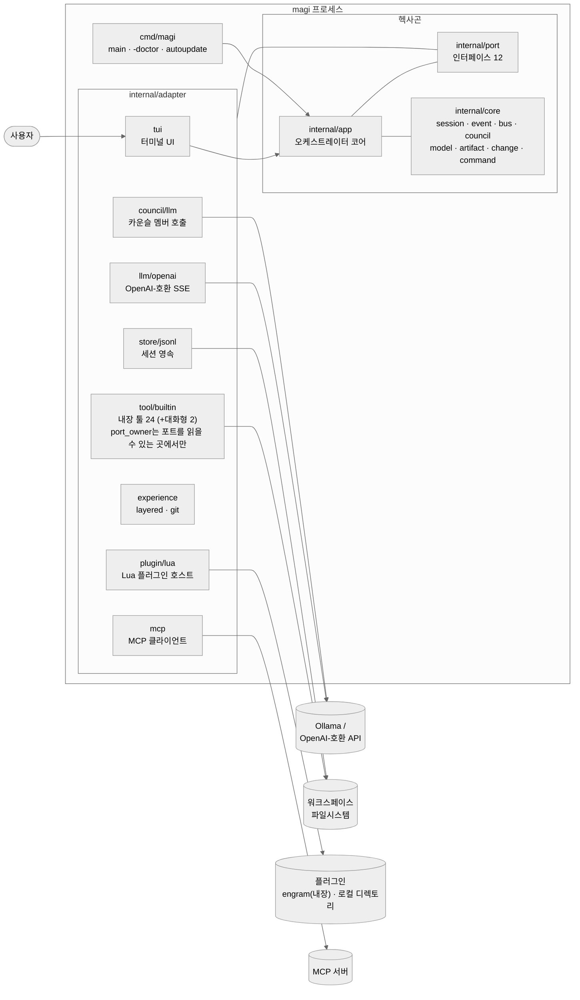
```mermaid
%%{init: {'theme':'neutral','flowchart':{'curve':'basis'}}}%%
flowchart LR
  user(["사용자"])
  subgraph proc["magi 프로세스"]
    direction LR
    cmd["cmd/magi<br/>main · -doctor · autoupdate"]
    subgraph hex["헥사곤"]
      app["internal/app<br/>오케스트레이터 코어"]
      port["internal/port<br/>인터페이스 12"]
      core["internal/core<br/>session · event · bus · council<br/>model · artifact · change · command"]
    end
    subgraph adp["internal/adapter"]
      tui["tui<br/>터미널 UI"]
      llm["llm/openai<br/>OpenAI-호환 SSE"]
      tools["tool/builtin<br/>내장 툴 24 (+대화형 2)<br/>port_owner는 포트를 읽을 수 있는 곳에서만"]
      lua["plugin/lua<br/>Lua 플러그인 호스트"]
      council["council/llm<br/>카운슬 멤버 호출"]
      exp["experience<br/>layered · git"]
      store["store/jsonl<br/>세션 영속"]
      mcp["mcp<br/>MCP 클라이언트"]
    end
  end
  ollama[("Ollama /<br/>OpenAI-호환 API")]
  ws[("워크스페이스<br/>파일시스템")]
  plug[("플러그인<br/>engram(내장) · 로컬 디렉토리")]
  mcpsrv[("MCP 서버")]

  user --> tui --> app
  cmd --> app
  app --- port
  app --- core
  port --- adp
  llm --> ollama
  council --> ollama
  tools --> ws
  lua --> plug
  mcp --> mcpsrv
  store --> ws
```

## L0.5 — 프로세스가 하나가 아닐 때: 데몬, 콘솔, 피어

L0은 단일 프로세스 실행 모델을 기술하며, 단독 터미널 환경에서 구동되는 `magi`의 동작을 정확히 반영합니다. 단, 시스템은 복수 프로세스 분산 토폴로지도 지원합니다. 엔진 코어는 UI 없이 백그라운드 데몬으로 상주 실행될 수 있으며, 외부 프로세스들은 동일한 이벤트 저장소를 공유하고 Unix 도메인 소켓을 통해 명령을 전달합니다. 추가적인 독립 엔진이 생성되는 것은 아닙니다. `magi-web`은 **LLM 프로바이더와 도구가 비활성화된** 경량 `app.App` 인스턴스를 생성하므로, 실제 에이전트 턴을 실행하는 주체는 데몬 프로세스에 한정됩니다.

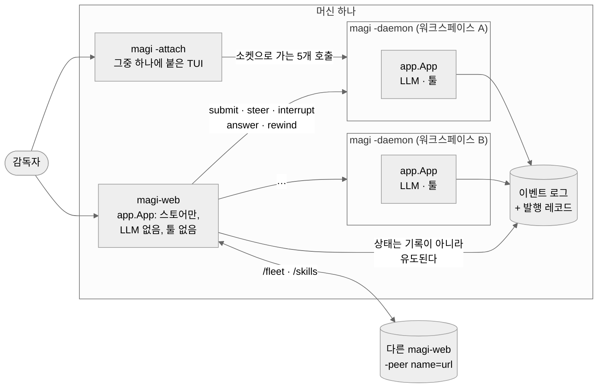
```mermaid
%%{init: {'theme':'neutral','flowchart':{'curve':'basis'}}}%%
flowchart LR
  supervisor(["감독자"])
  subgraph machine["머신 하나"]
    direction TB
    subgraph d1["magi -daemon (워크스페이스 A)"]
      a1["app.App<br/>LLM · 툴"]
    end
    subgraph d2["magi -daemon (워크스페이스 B)"]
      a2["app.App<br/>LLM · 툴"]
    end
    attach["magi -attach<br/>그중 하나에 붙은 TUI"]
    web["magi-web<br/>app.App: 스토어만,<br/>LLM 없음, 툴 없음"]
    logs[("이벤트 로그<br/>+ 발행 레코드")]
  end
  peer[("다른 magi-web<br/>-peer name=url")]

  supervisor --> web
  supervisor --> attach
  attach -->|"소켓으로 가는 5개 호출"| d1
  web -->|"submit · steer · interrupt<br/>answer · rewind"| d1
  web -->|"…"| d2
  a1 --> logs
  a2 --> logs
  web -->|"상태는 기록이 아니라<br/>유도된다"| logs
  web <-->|"/fleet · /skills"| peer
```

- 데몬이 대기하는 소켓 이름은 워크스페이스의 실제 경로에서 도출됩니다. "해당 워크스페이스의 데몬"이 모호하지 않으며,
  flock을 통해 유일성을 보장합니다.
- 콘솔이 컴패니언에 대해 표시하는 모든 정보(현재 진행 상황, 블로킹 여부, 사람이 턴 중간에 전달한 메시지,
  컨텍스트 사용량 등)는 해당 로그에서 직접 읽습니다. 낡을 수 있는 별도의 상태 파일 자체가 존재하지
  않습니다.
- 피어는 또 하나의 콘솔이며, 브라우저가 본 콘솔에 접속하는 것과 동일한 방식으로 접근합니다. 페더레이션은
  추가 프로토콜을 도입하지 않습니다.

## L1 — 턴 라이프사이클: 요청에서 착지까지

한 턴은 스텝 루프로 구동됩니다(`loop.go runLoop`). LLM 호출 → 도구 실행 → 가드 점검을 반복합니다. **인위적인 스텝 상한은 두지 않습니다.** 턴은 에이전트가 `council{complete: true}`로 종료를 선언하고 카운슬이 이를 승인할 때, 모델이 도구 호출을 종료할 때, 또는 컨텍스트가 취소될 때 정상 종료됩니다. 명시적 종료 선언 없이 완료된 경우 `UNVERIFIED` 상태로 기록됩니다.

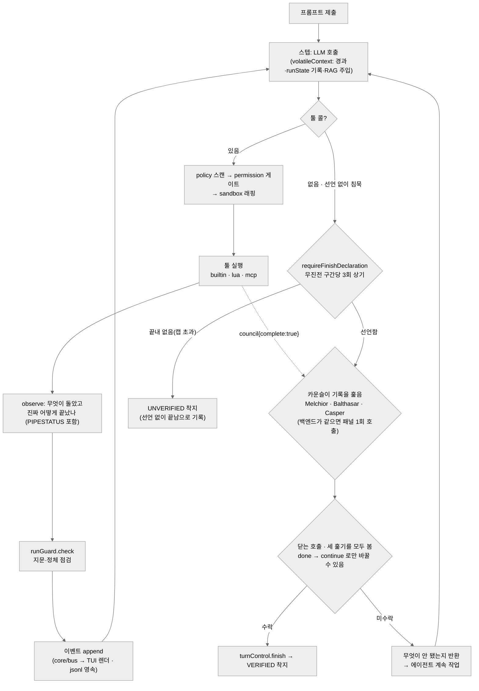
```mermaid
%%{init: {'theme':'neutral','flowchart':{'curve':'basis'}}}%%
flowchart TD
  P["프롬프트 제출"] --> S["스텝: LLM 호출<br/>(volatileContext: 경과·runState 기록·RAG 주입)"]
  S --> T{"툴 콜?"}
  T -- 있음 --> POL["policy 스캔 → permission 게이트<br/>→ sandbox 래핑"]
  POL --> EX["툴 실행<br/>builtin · lua · mcp"]
  EX --> OB["observe: 무엇이 돌았고<br/>진짜 어떻게 끝났나 (PIPESTATUS 포함)"]
  OB --> G["runGuard.check<br/>지문·정체 점검"]
  G --> EV["이벤트 append<br/>(core/bus → TUI 렌더 · jsonl 영속)"]
  EV --> S
  EX -. "council{complete:true}" .-> CG{"카운슬이 기록을 훑음<br/>Melchior · Balthasar · Casper<br/>(백엔드가 같으면 패널 1회 호출)"}
  CG --> CL{"닫는 호출 · 세 훑기를 모두 봄<br/>done → continue 로만 바꿀 수 있음"}
  CL -- "수락" --> FIN["turnControl.finish → VERIFIED 착지"]
  CL -- "미수락" --> FB["무엇이 안 됐는지 반환<br/>→ 에이전트 계속 작업"]
  FB --> S
  T -- "없음 · 선언 없이 침묵" --> RQ{"requireFinishDeclaration<br/>무진전 구간당 3회 상기"}
  RQ -- "선언함" --> CG
  RQ -- "끝내 없음(캡 초과)" --> U["UNVERIFIED 착지<br/>(선언 없이 끝남으로 기록)"]
```

## L2 — app 코어: 컴포넌트 맵 (`internal/app`)

| 그룹 | 역할 | 파일 |
|---|---|---|
| **LOOP** | 턴 구동, 스트리밍, 인터젝션 감지, 종료 게이트(선언 요구) | `loop` · `loop_gates` · `loop_stream`(stall·reasoningSpin) · `loop_helpers` · `generate_step` · `loopmap` · `interject` · `interject_queue` · `inject` · `reask` · `todos` · `config` · `plan_flags`(A/B 플래그 — 이름은 플래너 시절 잔재) · `usage_meter` |
| **RECORD** | magi가 관측한 것 — 무엇이 돌았고 진짜 어떻게 끝났나, 워크스페이스의 현재 | `observed`(관측 판정·PIPESTATUS 노트 반영) · `observed_view`(패널 표시형) · `world_snapshot`(선언 시 새로 읽기·live jobs·기록엔 있고 디스크엔 없는 경로) · `background`(백그라운드 잡 레지스트리·tail) · `tool_outcome` |
| **COUNCIL** | 에이전트가 `council` 툴로 부르는 3인. 질의 / 종료 선언 심의 | `council_advice`(증거 조립·심의·`complete` 시 finish 신호) · `council_events`(`councilParams`) · `council_evidence` · `council_gate`(상수·`fmtElapsed`) |
| **GUARD** | 모델 I/O의 hang·spin 차단(단일 chokepoint) + 툴콜 반복·정체·자기되돌림·실행 처닝 관측. **관측한 것은 넛지로 말하고, 런을 멈추지는 않는다**(L3) | `provider_guard`(idle·byte-spin·**반복** 안전망, 모든 모델 요청) · `guard`(repeat 지문 · sinceProgress · noteEdit 자기되돌림 · 실행 원장) · `liveness` |
| **CTX** | 컨텍스트 창 관리, 압축, 경험 저장/회수 | `context_window` · `context_view` · `compact` · `memory` · `recall` · `query` · `reconstruct` |
| **IO** | 권한·정책·훅·명령 라우팅·워크플로우 | `permission` · `policy` · `hooks` · `routing` · `shellcmd` · `shellparse` · `skills` · `prompt` · `diagnose` · `execute` · `workflow` · `fork` · `scratch` |
| **EXT** | Lua 플러그인에 노출되는 앱 API | `app_plugin_api` · `app_emit` · `app_state` |

## L3 — 가드는 보고한다, 결정하지 않는다

**이 계층은 실측 검증을 거쳐 아키텍처가 전면 개편되었습니다.** 과거 구조는 조언(넛지) → 차단 → 구조적 회복 → 강제 종료로 이어지는 단계적 에스컬레이션 모델을 적용했습니다. 그러나 벤치마크 실측 결과 해당 가정이 반증되었습니다. 기록된 전체 트라이얼 중 magi가 자체 판단으로 조기 강제 중단시킨 28건의 실행은 단 1건도 통과하지 못했고, 그중 8건은 비정상 프로세스 종료 코드로 인해 채점 대상에서 배제되었습니다(비정상 exit 코드는 호출자에게 정상적인 조기 종료가 아닌 실행 실패로 판정됨). 반면 외부 데드라인에 도달할 때까지 실행된 396건은 모두 정상 채점되었으며 76건이 테스트를 통과했습니다.

따라서 **이상 신호(반복, 정체, 자기되돌림 등)는 이전과 동일하게 정밀 감지하고 에이전트에게 넛지로 보고하되, magi 코어가 해당 판독 결과를 근거로 실행을 임의 중단하는 로직만을 제거**했습니다. 코드베이스에 구현된 구체적 형태는 다음과 같습니다.

- `runGuard.check()`는 `block` 반환값에 **항상 `false`**를 반환합니다(`execute.go`가 해당 반환값을 소비하지 않고 무시).
- 강제 종료를 수행하던 `handleStuckGuard()`는 **완전 삭제**되었습니다.
- 가드 계층의 유일한 유효 출력은 `shouldNudge()`가 반환하는 넛지 식별 문자열(`"blocked"`, `"stalled"`, `""`)뿐입니다.

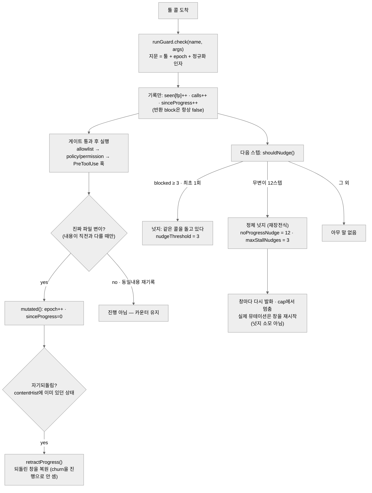
```mermaid
%%{init: {'theme':'neutral','flowchart':{'curve':'basis'}}}%%
flowchart TD
  C["툴 콜 도착"] --> CH["runGuard.check(name, args)<br/>지문 = 툴 + epoch + 정규화 인자"]
  CH --> REC["기록만: seen[fp]++ · calls++ · sinceProgress++<br/>(반환 block은 항상 false)"]
  REC --> RUN["게이트 통과 후 실행<br/>allowlist → policy/permission → PreToolUse 훅"]
  RUN --> MU{"진짜 파일 변이?<br/>(내용이 직전과 다를 때만)"}
  MU -- "yes" --> RST["mutated(): epoch++ · sinceProgress=0"]
  MU -- "no · 동일내용 재기록" --> NOP["진행 아님 — 카운터 유지"]
  RST --> SR{"자기되돌림?<br/>contentHist에 이미 있던 상태"}
  SR -- "yes" --> RETR["retractProgress()<br/>되돌린 창을 복원 (churn을 진행으로 안 셈)"]

  REC --> SN["다음 스텝: shouldNudge()"]
  SN -- "blocked ≥ 3 · 최초 1회" --> NB["넛지: 같은 콜을 돌고 있다<br/>nudgeThreshold = 3"]
  SN -- "무변이 12스텝" --> NS["정체 넛지 (재장전식)<br/>noProgressNudge = 12 · maxStallNudges = 3"]
  NS --> RE["창마다 다시 발화 · cap에서 멈춤<br/>실제 뮤테이션은 창을 재시작(넛지 소모 아님)"]
  SN -- "그 외" --> Q["아무 말 없음"]
```

넛지는 **에이전트가 읽고 무시할 수 있는 프롬프트**입니다. 이를 무시하더라도 magi는 임의 조치를 취하지 않으며, 턴은
에이전트가 종료하거나 외부에서 종료합니다.

종료 선언 시에는 L1의 카운슬 심의로 이어집니다. 기록 조립(디스크에 없는 경로 → 활성 백그라운드 잡 → 워크스페이스
스냅샷 → 관측 기록 → 도구 실행 증거, 항목당 클립) → 3인 위원 심의를 거칩니다. 미승인 시에는 미비 사항이 도구 결과로
반환되어 에이전트가 작업을 계속 수행하며, 끝내 선언이 없으면 파일 변경이 없는 구간에서 3회 상기한 뒤
UNVERIFIED로 착지합니다. bash 도구 자체도
exit 0에 크래시 시그니처나 종료 코드 무마 구문(`|| true` 등)이 감지되면 결과 머리에 경고 주석을 첨부합니다
(`MAGI_EXITCODE_BODYSCAN`, MANUAL §가드 참고).

## L4 — hang·spin·반복 차단: 모델 I/O 가드 계층

행/스핀은 **모델에 대한 모든 요청이 통과하는 단일 지점**에서 처리됩니다. `providerFor(agent)`가 반환하는
provider는 생성 시점에 전부 `GuardProvider`(`provider_guard.go`)로 감싸지므로, 메인 generate,
카운슬, 모든 tool-free side call 등 전체 경로가 **하나의 가드된
`StreamChat`을 통해 송수신**됩니다. 각 소비자가 개별 워치독을 관리하던 기존 방식을 대체합니다.

가드는 **2계층**으로 구성됩니다. (1) 메인 루프의 *행동* 가드(`consumeStream`)가 메인 generate에서 **먼저** 발화하여
재시도/넛지와 같은 고유 처리를 수행하고, (2) 그 **상위의 안전망**(`guardedProvider`)이 side call 등 개별 처리가
없는 경로를 보호합니다. 안전망 임계값은 행동 가드보다 **2배** 높게 설정하여 발화 순서를 보장합니다.

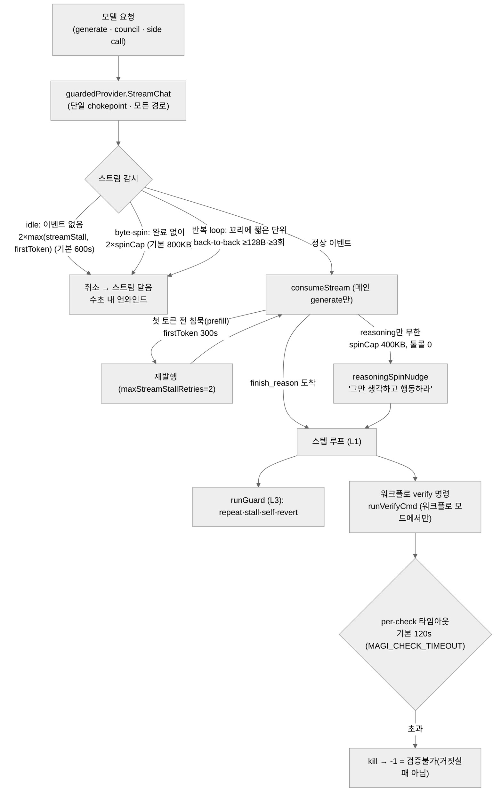
```mermaid
%%{init: {'theme':'neutral','flowchart':{'curve':'basis'}}}%%
flowchart TD
  REQ["모델 요청<br/>(generate · council · side call)"] --> GP["guardedProvider.StreamChat<br/>(단일 chokepoint · 모든 경로)"]
  GP --> W{"스트림 감시"}
  W -- "idle: 이벤트 없음<br/>2×max(streamStall, firstToken) (기본 600s)" --> AB["취소 → 스트림 닫음<br/>수초 내 언와인드"]
  W -- "byte-spin: 완료 없이<br/>2×spinCap (기본 800KB)" --> AB
  W -- "반복 loop: 꼬리에 짧은 단위<br/>back-to-back ≥128B·≥3회" --> AB
  W -- "정상 이벤트" --> CS["consumeStream (메인 generate만)"]
  CS -- "첫 토큰 전 침묵(prefill)<br/>firstToken 300s" --> RT["재발행 (maxStreamStallRetries=2)"]
  CS -- "reasoning만 무한<br/>spinCap 400KB, 툴콜 0" --> SN["reasoningSpinNudge<br/>'그만 생각하고 행동하라'"]
  CS -- "finish_reason 도착" --> STEP["스텝 루프 (L1)"]
  RT --> CS
  SN --> STEP
  STEP --> TG["runGuard (L3): repeat·stall·self-revert"]
  STEP --> CK["워크플로 verify 명령<br/>runVerifyCmd (워크플로 모드에서만)"]
  CK --> CTO{"per-check 타임아웃<br/>기본 120s (MAGI_CHECK_TIMEOUT)"}
  CTO -- "초과" --> KILL["kill → -1 = 검증불가(거짓실패 아님)"]
```

계층별 요약:

| 계층 | 잡는 것 | 트리거 | 바운드 / 플래그 | 처리 |
|---|---|---|---|---|
| `guardedProvider` (idle) | 침묵한 백엔드(무응답) | 마지막 이벤트 후 유휴 | 2×max(`streamStall`,`firstToken`)(기본 600s) | 취소·스트림 닫음 |
| `guardedProvider` (byte-spin) | 완료 없는 폭주 생성 | 누적 바이트 | 2×`spinCap`(기본 800KB), `MAGI_SPIN_CAP` | 취소 |
| `guardedProvider` (repeat) | **degenerate 반복**(같은 문장/단어 무한) | 꼬리 단위 back-to-back ≥128B·≥3회 | `MAGI_REPEAT_CAP`(기본 on), 꼬리 4KB·256B마다 검사 | 취소(≈수백 B 만에, 800KB 안 기다림) |
| `consumeStream` (첫토큰) | 메인 generate 첫토큰 전 침묵 — prefill 여유 | 유휴 | `firstToken` 300s, `MAGI_FIRST_TOKEN`(0=토큰간 한도로 폴백) | 같은 요청 재발행(×2), 소진 시 에러 |
| `consumeStream` (토큰간) | 출력 시작 후 생성 도중 freeze | 유휴 | `streamStall` 120s, `MAGI_STREAM_STALL`(0=비활성) | 스트림 종료, 부분 출력 보존(재시도 없음) |
| `consumeStream` (reasoningSpin) | 메인 generate reasoning만 무한 | 툴콜 0 + 바이트 | `spinCap` 400KB (`[limits] max_output_tokens` 설정 시 이 넛지는 토큰캡에 위임=off, guardedProvider 800KB 백스톱은 유지) | 넛지("행동하라") |
| `runGuard` (L3) | 툴콜 반복·정체·자기되돌림 | 지문·무변이 스텝 | `guard.go` 상수 | **넛지만** — 차단·회복·강제종료 없음 |
| 체크 타임아웃(`runVerifyCmd`) | 블로킹 워크플로 verify 명령 | per-check 경과 | 기본 120s, `MAGI_CHECK_TIMEOUT`(0=off) | kill → -1 = 검증불가(거짓실패 아님) |

핵심: **모델 hang/spin/반복은 guardedProvider 단일 지점**에서, **셸 명령 hang은 bash 툴(120/600s)과
runVerifyCmd 타임아웃**에서 각각 제한됩니다. 어떤 경우에도 턴 전체 벽시계 타임아웃까지 불필요하게 지연되지 않습니다.

## L5 — 코어 도메인 클래스 (`internal/core`)

`core`는 **표준 라이브러리(std) 외에는 아무것도 임포트하지 않습니다**. 여기에 정의된 타입에는 LLM도, 파일시스템도,
터미널도 없으며, 오직 대화가 무엇으로 구성되는지에 대한 순수 도메인 정의만 포함합니다.

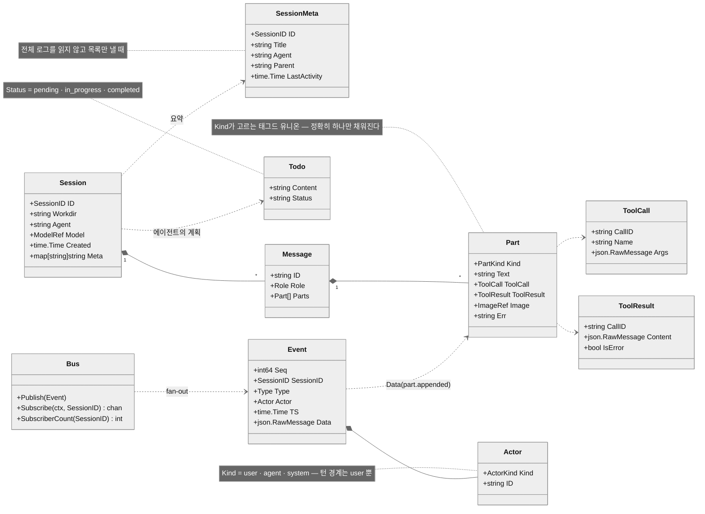
```mermaid
%%{init: {'theme':'neutral'}}%%
classDiagram
  direction LR

  class Session {
    +SessionID ID
    +string Workdir
    +string Agent
    +ModelRef Model
    +time.Time Created
    +map[string]string Meta
  }
  class SessionMeta {
    +SessionID ID
    +string Title
    +string Agent
    +string Parent
    +time.Time LastActivity
  }
  note for SessionMeta "전체 로그를 읽지 않고 목록만 낼 때"
  class Message {
    +string ID
    +Role Role
    +Part[] Parts
  }
  class Part {
    +PartKind Kind
    +string Text
    +ToolCall ToolCall
    +ToolResult ToolResult
    +ImageRef Image
    +string Err
  }
  note for Part "Kind가 고르는 태그드 유니온 — 정확히 하나만 채워진다"
  class ToolCall {
    +string CallID
    +string Name
    +json.RawMessage Args
  }
  class ToolResult {
    +string CallID
    +json.RawMessage Content
    +bool IsError
  }
  class Todo {
    +string Content
    +string Status
  }
  note for Todo "Status = pending · in_progress · completed"

  Session "1" *-- "*" Message
  Message "1" *-- "*" Part
  Part ..> ToolCall
  Part ..> ToolResult
  Session ..> SessionMeta : 요약
  Session ..> Todo : 에이전트의 계획

  class Event {
    +int64 Seq
    +SessionID SessionID
    +Type Type
    +Actor Actor
    +time.Time TS
    +json.RawMessage Data
  }
  class Actor {
    +ActorKind Kind
    +string ID
  }
  note for Actor "Kind = user · agent · system — 턴 경계는 user 뿐"
  class Bus {
    +Publish(Event)
    +Subscribe(ctx, SessionID) chan
    +SubscriberCount(SessionID) int
  }

  Event *-- Actor
  Bus ..> Event : fan-out
  Event ..> Part : Data(part.appended)
```

`PartKind` ∈ `text` · `reasoning` · `tool-call` · `tool-result` · `image` · `error`.
`Part`가 태그드 유니온 구조인 점이 저장 형식을 결정합니다. 스트리밍 단위와 영속 단위가 동일한 타입이므로
재생(replay)이 곧 렌더링이 됩니다.

카운슬 도메인은 별개의 경량 값 모델입니다. LLM 호출은 어댑터(`adapter/council/llm`)에 위치하며,
`core/council`은 **투표를 집계하는 규칙**만을 다룹니다:

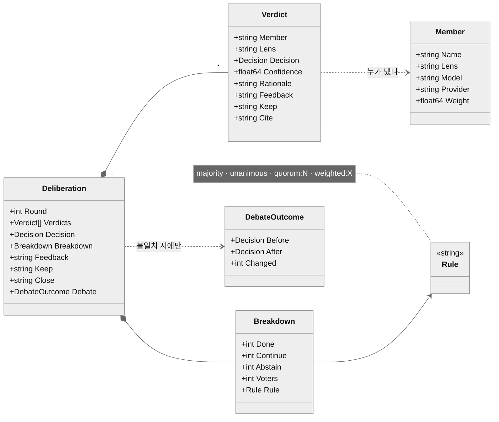
```mermaid
%%{init: {'theme':'neutral'}}%%
classDiagram
  direction LR
  class Member {
    +string Name
    +string Lens
    +string Model
    +string Provider
    +float64 Weight
  }
  class Verdict {
    +string Member
    +string Lens
    +Decision Decision
    +float64 Confidence
    +string Rationale
    +string Feedback
    +string Keep
    +string Cite
  }
  class Breakdown {
    +int Done
    +int Continue
    +int Abstain
    +int Voters
    +Rule Rule
  }
  class Deliberation {
    +int Round
    +Verdict[] Verdicts
    +Decision Decision
    +Breakdown Breakdown
    +string Feedback
    +string Keep
    +string Close
    +DebateOutcome Debate
  }
  class Rule {
    <<string>>
  }
  note for Rule "majority · unanimous · quorum:N · weighted:X"
  class DebateOutcome {
    +Decision Before
    +Decision After
    +int Changed
  }
  Deliberation "1" *-- "*" Verdict
  Deliberation *-- Breakdown
  Breakdown --> Rule
  Verdict ..> Member : 누가 냈나
  Deliberation ..> DebateOutcome : 불일치 시에만
```

`Decision` ∈ `done` · `continue` · `abstain`. `Tally(verdicts, rule)`는 순수 함수이므로
심의 기록만 있으면 결정을 완벽히 재현할 수 있습니다. `Keep`/`Debate`는 **결정에 영향을 주지 않습니다**.
기권 표가 분모에서 제외되는 처리와 더불어, 이러한 분리 설계를 통해 "카운슬이 왜 그렇게 판정했는가"를 사후에 명확히 설명할 수 있습니다.

본 기록에서 검토 내용과 총괄 검토는 두 개의 필드로 나뉩니다. `Cite`는 위원이 자신의 판단 근거로 기록에서 직접
발췌한 조각(또는 `NO-EVIDENCE` 토큰)입니다. 이를 기록하고 표시할 뿐 소급 검증하지는 않는데, 과거 검증을 수행하던
구현이 판정 30건 중 거짓 기권 2건을 유발하면서도 실제 오류를 적발하지는 못했기 때문입니다. `Close`는 해당 라운드의 종합 마감
호출에서 작성한 총평입니다. 세 위원의 검토를 한자리에서 취합한 유일한 독자이며, 세 위원의 판정 이후에 별도로 작성됩니다. 이것이
`Deliberation`에 수록되는 이유는 라운드 내에서 에이전트에게 전달될 수 있는 유일한 총괄 피드백 통로이기
때문입니다. continue를 제시한 위원은 해당 위원 이름 아래에 `Feedback`이 렌더링되지만, 종합 마감 호출에는 별도의 판정 란이
배정되지 않습니다. 해당 결론은 클램프 처리되어 있어 done 라운드를 continue로 변경할 수는 있지만 그 반대는 허용되지 않습니다.
`core/council` 도메인은 이러한 세부 정책을 직접 알지 않으며, 클램프와 패널 배치는 어댑터에서 담당하고 `Tally`는
기존과 동일하게 투표 결과만을 집계합니다.

---

## L6 — 포트와 어댑터 (인터페이스 → 구현)

의존 방향은 **`adapter → app → core`** 단방향이며, 컴파일 타임에 엄격히 강제됩니다. `app`은 아래의
인터페이스만 참조하며, `cmd/magi`가 기동 시 구체 구현체를 주입합니다.

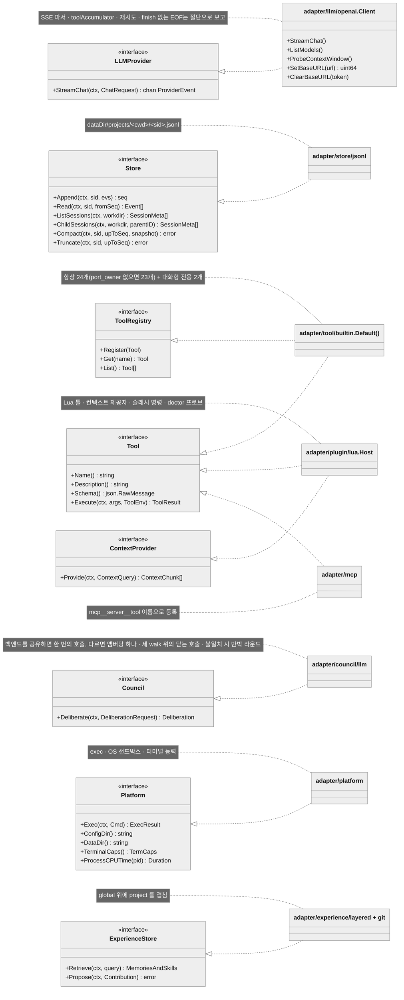
```mermaid
%%{init: {'theme':'neutral'}}%%
classDiagram
  direction LR

  class LLMProvider {
    <<interface>>
    +StreamChat(ctx, ChatRequest) chan ProviderEvent
  }
  class Store {
    <<interface>>
    +Append(ctx, sid, evs) seq
    +Read(ctx, sid, fromSeq) Event[]
    +ListSessions(ctx, workdir) SessionMeta[]
    +ChildSessions(ctx, workdir, parentID) SessionMeta[]
    +Compact(ctx, sid, upToSeq, snapshot) error
    +Truncate(ctx, sid, upToSeq) error
  }
  class Tool {
    <<interface>>
    +Name() string
    +Description() string
    +Schema() json.RawMessage
    +Execute(ctx, args, ToolEnv) ToolResult
  }
  class ToolRegistry {
    <<interface>>
    +Register(Tool)
    +Get(name) Tool
    +List() Tool[]
  }
  class Council {
    <<interface>>
    +Deliberate(ctx, DeliberationRequest) Deliberation
  }
  class Platform {
    <<interface>>
    +Exec(ctx, Cmd) ExecResult
    +ConfigDir() string
    +DataDir() string
    +TerminalCaps() TermCaps
    +ProcessCPUTime(pid) Duration
  }
  class ExperienceStore {
    <<interface>>
    +Retrieve(ctx, query) MemoriesAndSkills
    +Propose(ctx, Contribution) error
  }
  class ContextProvider {
    <<interface>>
    +Provide(ctx, ContextQuery) ContextChunk[]
  }

  class OpenAIClient["adapter/llm/openai.Client"] {
    +StreamChat()
    +ListModels()
    +ProbeContextWindow()
    +SetBaseURL(url) uint64
    +ClearBaseURL(token)
  }
  note for OpenAIClient "SSE 파서 · toolAccumulator · 재시도 · finish 없는 EOF는 절단으로 보고"
  class JSONLStore["adapter/store/jsonl"]
  note for JSONLStore "dataDir/projects/&lt;cwd&gt;/&lt;sid&gt;.jsonl"
  class BuiltinRegistry["adapter/tool/builtin.Default()"]
  note for BuiltinRegistry "항상 24개(port_owner 없으면 23개) + 대화형 전용 2개"
  class LuaHost["adapter/plugin/lua.Host"]
  note for LuaHost "Lua 툴 · 컨텍스트 제공자 · 슬래시 명령 · doctor 프로브"
  class MCPClient["adapter/mcp"]
  note for MCPClient "mcp__server__tool 이름으로 등록"
  class LLMCouncil["adapter/council/llm"]
  note for LLMCouncil "백엔드를 공유하면 한 번의 호출, 다르면 멤버당 하나 · 세 walk 위의 닫는 호출 · 불일치 시 반박 라운드"
  class LayeredExp["adapter/experience/layered + git"]
  note for LayeredExp "global 위에 project 를 겹침"
  class OSPlatform["adapter/platform"]
  note for OSPlatform "exec · OS 샌드박스 · 터미널 능력"

  LLMProvider <|.. OpenAIClient
  Store <|.. JSONLStore
  ToolRegistry <|.. BuiltinRegistry
  Tool <|.. BuiltinRegistry
  Tool <|.. LuaHost
  Tool <|.. MCPClient
  Council <|.. LLMCouncil
  ExperienceStore <|.. LayeredExp
  Platform <|.. OSPlatform
  ContextProvider <|.. LuaHost
```

포트는 18개로 구성됩니다: 위의 8개 인터페이스에 더하여 프로바이더 엑스트라(`ModelLister` · `ContextProber` · `BaseRedirector`,
통칭 `ProviderExtras` — 타입 단언으로 접근하며 모든 래퍼가 위임합니다) + `FileTool`(실행 **전에**
자신의 대상 파일을 제공하는 툴) + `MetaTool` + `ToolServers`(런타임 attach 구문) + `WikiStore` +
`DoctorProbe`(`-doctor` 진단 항목) + `PluginCommand`(슬래시 명령)가 포함됩니다. Lua 호스트는 포트 추상화 뒤가 아니라
`cmd/magi`가 직접 배선합니다(이전 `PluginHost`·`Scheduler` 포트는 제거되었습니다). **툴 인터페이스에
구현이 세 가지**(builtin · lua · mcp)라는 점이 확장 메커니즘의 핵심이며, 루프 엔진은 이 셋을 동일하게 취급합니다.

## L7 — app 코어 클래스 (`internal/app`)

`App`은 애플리케이션 서비스 계층입니다: 외부 커맨드를 수신하고 이벤트를 방출합니다. 상태는 **세션별로**
`sessionState`에 집중되어 관리되며 전체가 `App.mu` 뮤텍스로 보호됩니다.

```mermaid
%%{init: {'theme':'neutral'}}%%
classDiagram
  direction TB

  class App {
    -port.Store store
    -port.LLMProvider llm
    -map[string]LLMProvider providers
    -port.ToolRegistry tools
    -bus.Bus bus
    -port.Platform plat
    -Config cfg
    -ContextProvider[] contextProviders
    -sync.Mutex mu
    -map[SessionID]sessionState states
    -usageLedger usage
    -Policy policy
    -sync.Map liveness
    +CreateSession(ctx, cmd) SessionID
    +Submit(ctx, cmd) error
    +Interrupt(sid)
    +Subscribe(ctx, sid) chan Event
    -runLoop(ctx, tc) string
    -executeTool(ctx, ...)
    -providerFor(spec) LLMProvider
  }

  class sessionState {
    +context.CancelFunc cancel
    +session.Session meta
    +Todo[] todos
    +string[] turnNotes
    +int lastPromptTokens
    +time.Time turnStart
    +pendingInterjection[] pendingInterject
    +turnControl turnControl
    +map perms
    +map questions
    +map grants
    +string activeSeedMsgID
    +turnScratch scratch
    +string[] curatedTools
    +string expPtr
    +string ragText
  }
  note for sessionState "수명 3층: 세션 전체 · 턴 스코프(resetForNewTopLevel이 지움) · 인플라이트"

  class turnCtx {
    +session.Session s
    +AgentSpec agent
    +int depth
    +int maxSteps
    +event.Actor actor
    +time.Time runStart
    +runGuard guard
  }
  note for turnCtx "턴 내내 고정 — guard만 포인터라 변이가 전파된다"
  class turnState {
    +bool stopChecked
    +bool nudgedEmpty
    +int declareAsks
    +bool declared
    +string unverifiedReason
  }
  note for turnState "턴당 1회 게이트들의 래치"
  class AgentSpec {
    +string Name
    +string System
    +string[] Tools
    +ModelRef Model
    +string Provider
    +allows(tool) bool
  }

  class runGuard {
    -map[string]int seen
    -int epoch
    -int blocked
    -int calls
    -int sinceProgress
    -int stallNudges
    -map[string]fileChange changed
    -map[string][]lineSpan readSpans
    -map[string][]uint64 contentHist
    +check(name, args) fingerprint
    +mutated(path, sig) bool
    +retractProgress()
    +noteEdit(path, before, after) warning
    +noteReadCoverage(path, off, n) bool
    +noteBashExec(cmd, novel)
    +allowRecall(topic) bool
    +changeSet() fileChange[]
    +shouldNudge() string
  }
  note for runGuard "보고 전용 — check의 block은 항상 false"
  class Policy {
    -policyRule[] allow
    -policyRule[] deny
    -string[] allowDomains
    +Decide(tool, args) verdict
    +AllowedByRule(tool, args) bool
  }

  App "1" *-- "*" sessionState
  App --> Policy
  App ..> turnCtx : 턴마다 생성
  turnCtx *-- runGuard
  turnCtx --> AgentSpec
  App ..> turnState : finishTurn이 변이
  runGuard *-- fileChange
```

구조 파악 시 유의할 핵심 사항 두 가지입니다.

1. **`runGuard`는 턴이 아닌 런 스코프**로 동작합니다(`turnCtx`가 관리하며 포인터로 전달되어 상태 변이가 전파됩니다).
   `epoch`는 실제 파일 변이가 발생할 때마다 증가하며 반복 지문의 구성 요소가 됩니다. 따라서 파일 내용이 변경된 이후에
   동일한 명령을 재호출하더라도 "동일한 호출"로 판정되지 않습니다.
2. **`sessionState`의 필드는 세 가지 수명 주기를 가집니다**: 세션 전체 생애주기(`meta`·`grants`·
   `deferredAbandoned`), 턴 스코프(`resetForNewTopLevel`이 초기화하는 항목 — `turnNotes`·`scratch`·
   RAG 캐시), 그리고 인플라이트 실행 구간(`cancel`·`perms`)입니다. 신규 필드를 추가할 때 해당 생애주기를 명확히 구분하여
   배치하지 않으면 이전 턴의 잔여 상태가 다음 요청으로 유출되는 결함이 발생할 수 있습니다.

---

## L8 — 툴 계층 클래스

도구는 `port.Tool` 인터페이스 하나로 단일화되어 있습니다. 실행 시 전달받는 `ToolEnv`가 **애플리케이션 계층으로 접근하는 유일한
통로**이며, nil 필드는 "해당 실행 런에는 그 기능이 비활성화되어 있음"을 의미합니다.

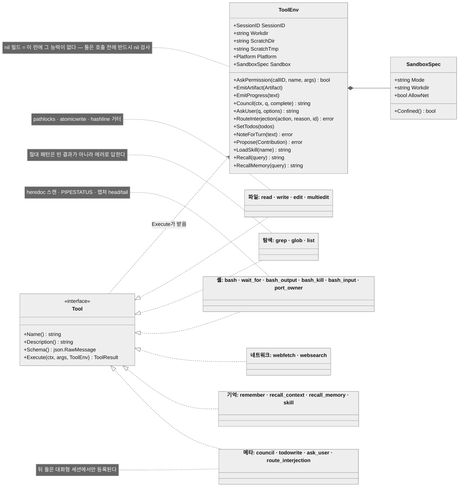
```mermaid
%%{init: {'theme':'neutral'}}%%
classDiagram
  direction LR

  class Tool {
    <<interface>>
    +Name() string
    +Description() string
    +Schema() json.RawMessage
    +Execute(ctx, args, ToolEnv) ToolResult
  }
  class ToolEnv {
    +SessionID SessionID
    +string Workdir
    +string ScratchDir
    +string ScratchTmp
    +Platform Platform
    +SandboxSpec Sandbox
    +AskPermission(callID, name, args) bool
    +EmitArtifact(Artifact)
    +EmitProgress(text)
    +Council(ctx, q, complete) string
    +AskUser(q, options) string
    +RouteInterjection(action, reason, id) error
    +SetTodos(todos)
    +NoteForTurn(text) error
    +Propose(Contribution) error
    +LoadSkill(name) string
    +Recall(query) string
    +RecallMemory(query) string
  }
  note for ToolEnv "nil 필드 = 이 런에 그 능력이 없다 — 툴은 호출 전에 반드시 nil 검사"
  class SandboxSpec {
    +string Mode
    +string Workdir
    +bool AllowNet
    +Confined() bool
  }
  ToolEnv *-- SandboxSpec
  Tool ..> ToolEnv : Execute가 받음

  class FileTools["파일: read · write · edit · multiedit"]
  note for FileTools "pathlocks · atomicwrite · hashline 거터"
  class SearchTools["탐색: grep · glob · list"]
  note for SearchTools "절대 패턴은 빈 결과가 아니라 에러로 답한다"
  class ShellTools["셸: bash · wait_for · bash_output · bash_kill · bash_input · port_owner"]
  note for ShellTools "heredoc 스캔 · PIPESTATUS · 캡처 head/tail"
  class NetTools["네트워크: webfetch · websearch"]
  class MemTools["기억: remember · recall_context · recall_memory · skill"]
  class MetaTools["메타: council · todowrite · ask_user · route_interjection"]
  note for MetaTools "뒤 둘은 대화형 세션에서만 등록된다"

  Tool <|.. FileTools
  Tool <|.. SearchTools
  Tool <|.. ShellTools
  Tool <|.. NetTools
  Tool <|.. MemTools
  Tool <|.. MetaTools
```

도구는 **24개가 상시** 등록됩니다. 기본 23개는 필수 등록되며, `port_owner`는 해당 기능이 응답 가능한 환경(`/proc` 또는
`lsof`로 포트 소유자를 판별할 수 있는 환경)에서 추가 등록됩니다. 그리고 `ask_user`와 `route_interjection`
**2개는 대화형 세션에서만** 등록됩니다
(`Default()` + `RegisterOrchestration(r, headless)`). 헤드리스 모드에서 이 두 도구를 제외하는 이유는 사용자 응답자가
없기 때문일 뿐만 아니라, 실행되지 않을 도구가 매 모델 요청의 스키마 목록에 불필요한 토큰 부하를 주기 때문입니다.
전체 도구 명단은 `KnownNames()`를 통해 일원화되어 열거됩니다. 이는 정책 코드에서 도구 이름을 하드코딩한 위치들이
유효하지 않은 도구 식별자를 참조하지 않도록 회귀 테스트에서 상호 검증하기 위함입니다.

**LSP는 독립 도구가 아닙니다.** `lsp_diagnose`라는 이름의 도구는 등록되어 있지 않으며, 파일 편집 완료 후 애플리케이션이
`AutoDiagnose`(`app/diagnose.go` → `builtin/lsppool.go`)를 백그라운드에서 실행하여 그 결과를 **도구 실행 결과에 부가 정보로 첨부합니다**.
모델이 자발적으로 호출하는 도구가 아니라 magi 런타임이 능동적으로 제공하는 진단 관측 정보이므로, 별도 호출 없이도 자동 전달됩니다.

`bash` 계열 도구는 파일 수와 로직 복잡도 측면에서 가장 규모가 큽니다. 구현 복잡도의 상당 부분은 단순 프로세스 실행이 아닌 **셸 스크립트 텍스트를
원문 그대로 정밀 파싱하는 작업**에 집중되어 있습니다. `heredoc.go`의 `scanShellLine`이 단일 패스로 백그라운드 분기(`&`)와 heredoc
본문을 동시에 판별하며, `maskNonShell`이 따옴표 내부, 주석, heredoc 본문을 **원문 길이를 보존한 채** 마스킹하여
정규식 검색 위치를 원문과 1:1로 정확히 대조할 수 있도록 지원합니다. 이러한 처리가 없으면
`python3 -c "print('done | tail -3')"` 같은 인라인 명령에 대해 잘못된 페이저 종료 코드 경고가 부착되는 오류가 발생합니다.

---

## L9 — 툴 콜 한 번의 시퀀스

L1이 턴 전체를 다룬다면, L9는 그 내부에서 수행되는 개별 도구 호출 **단위**를 확대하여 보여줍니다. 게이트 통과 순서와 각 컴포넌트의 기록 책임을 명시합니다.

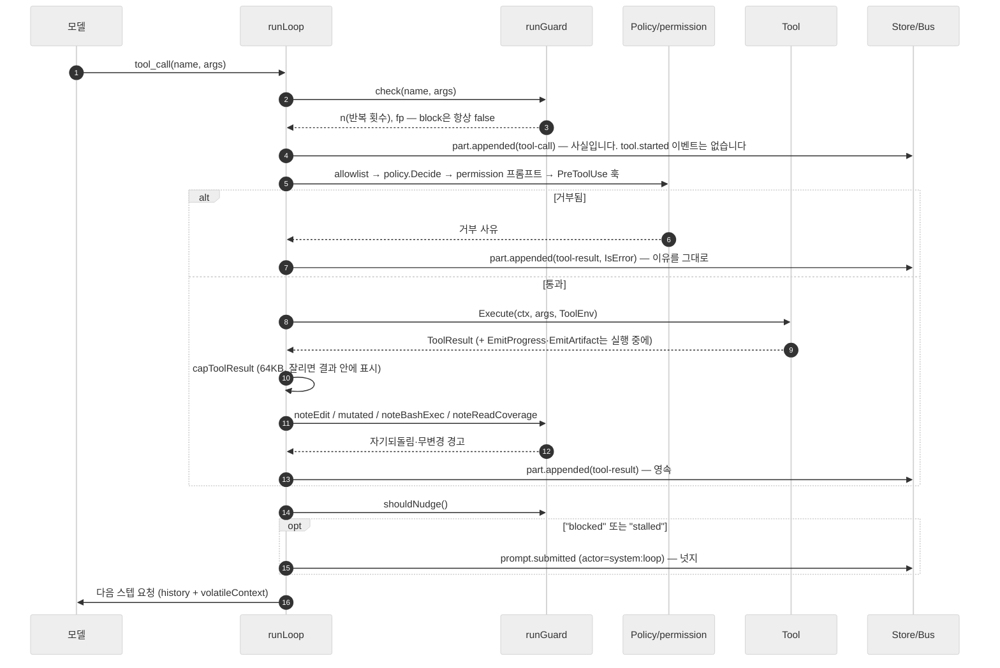
```mermaid
%%{init: {'theme':'neutral'}}%%
sequenceDiagram
  autonumber
  participant M as 모델
  participant L as runLoop
  participant G as runGuard
  participant P as Policy/permission
  participant T as Tool
  participant S as Store/Bus

  M->>L: tool_call(name, args)
  L->>G: check(name, args)
  G-->>L: n(반복 횟수), fp — block은 항상 false
  L->>S: part.appended(tool-call) — 사실입니다. tool.started 이벤트는 없습니다
  L->>P: allowlist → policy.Decide → permission 프롬프트 → PreToolUse 훅
  alt 거부됨
    P-->>L: 거부 사유
    L->>S: part.appended(tool-result, IsError) — 이유를 그대로
  else 통과
    L->>T: Execute(ctx, args, ToolEnv)
    T-->>L: ToolResult (+ EmitProgress·EmitArtifact는 실행 중에)
    L->>L: capToolResult (64KB, 잘리면 결과 안에 표시)
    L->>G: noteEdit / mutated / noteBashExec / noteReadCoverage
    G-->>L: 자기되돌림·무변경 경고
    L->>S: part.appended(tool-result) — 영속
  end
  L->>G: shouldNudge()
  opt "blocked" 또는 "stalled"
    L->>S: prompt.submitted (actor=system:loop) — 넛지
  end
  L->>M: 다음 스텝 요청 (history + volatileContext)
```

시퀀스에서 읽어야 할 계약 셋:

- **거부 판정도 하나의 결과로 취급합니다.** 게이트가 막으면 조용히 사라지지 않고 사유를 담은 tool-result가 기록됩니다 —
  모델이 무엇에 막혔는지 모르면 같은 것을 다시 시도하기 때문입니다.
- **출력이 잘린 경우 해당 절단 위치에 표시를 남깁니다.** `capToolResult`, 출력 캡처 head/tail, 증거 블록의 누락 꼬리,
  컨텍스트 압축 요약의 미완성 표식 모두 동일한 규칙을 따릅니다. 누락 여부를 인지하지 못하면 수신 측에서 후속 조치를 취할 수 없기 때문입니다.
- **넛지는 `prompt.submitted` 이벤트로 발행됩니다.** 이벤트의 actor는 `{system, loop}`로 지정되며 `part.appended`가 아닙니다.
  세션 로그를 분석하여 넛지 발생 빈도를 집계할 때는 해당 액터 필드로 필터링해야 합니다.

---

## L10 — 콘솔, 시퀀스로

L0.5가 프로세스 토폴로지를 나타낸다면, 본 절은 **프로세스 간 상호작용 및 이벤트 흐름**을 실행 순서대로 기술합니다. 운영자가 실제로 조작하는 핵심 경로이며, 과거 발생했던 동시성 결함 및 연결 고갈 사례를 바탕으로 회귀 방지 테스트를 구축하여 정합성을 보장합니다.

### L10.1 — 창 하나에 스트림 하나

브라우저는 단일 호스트에 대해 동시 연결을 최대 6개까지만 허용하며 SSE 스트림은 연결을 상시 유지합니다. 과거 콘솔 창 1개가 2개 스트림(대화 및 로스터)을 동시에 점유했을 때는 브라우저 탭 3개만으로 전체 연결 풀(6개)이 고갈되었고, 모든 창의 일반 HTTP 요청이 영구 대기 상태에 갇히는 결함이 발생했습니다(실측치: 3개 탭 구동 시 세 번째 탭의 첫 fetch 요청이 브라우저 큐에 블로킹되어 반환되지 않음). 현재는 비활성 백그라운드 탭의 경우 스트림 연결을 즉시 반납하도록 설계하여 불필요한 프레임 전송과 연결 풀 소진을 원천 방지합니다.

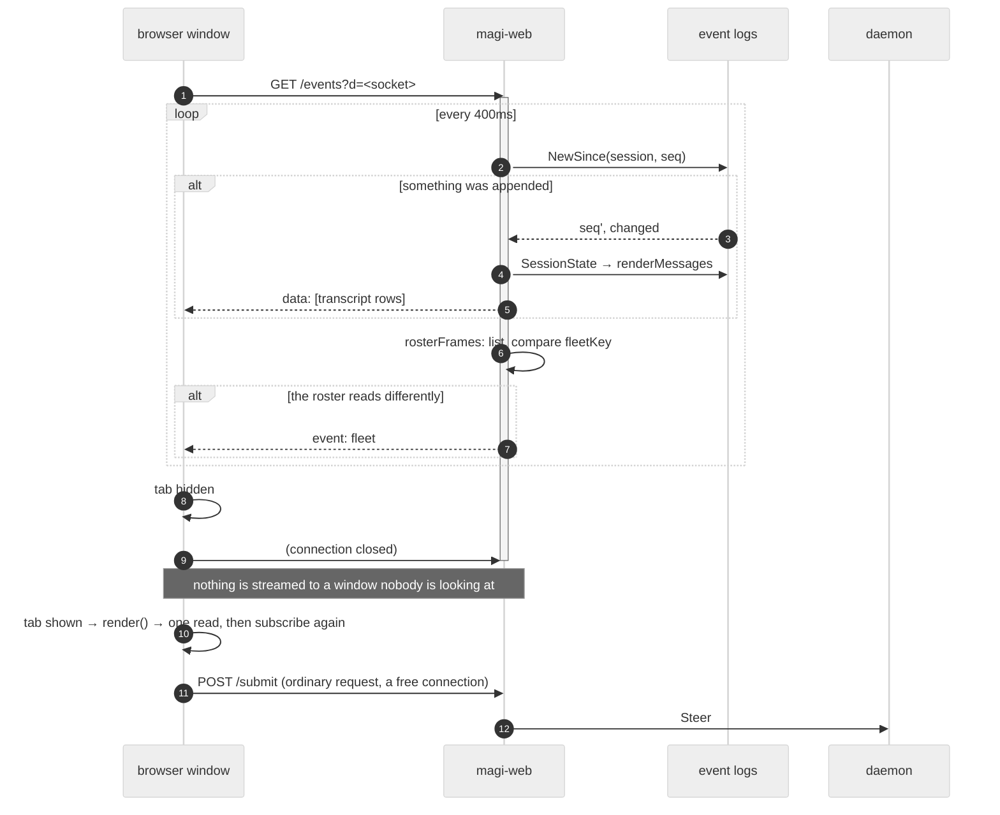
```mermaid
%%{init: {'theme':'neutral'}}%%
sequenceDiagram
  autonumber
  participant B as browser window
  participant W as magi-web
  participant L as event logs
  participant D as daemon

  B->>W: GET /events?d=<socket>
  activate W
  loop every 400ms
    W->>L: NewSince(session, seq)
    alt something was appended
      L-->>W: seq', changed
      W->>L: SessionState → renderMessages
      W-->>B: data: [transcript rows]
    end
    W->>W: rosterFrames: list, compare fleetKey
    alt the roster reads differently
      W-->>B: event: fleet
    end
  end
  B->>B: tab hidden
  B->>W: (connection closed)
  deactivate W
  Note over B,W: nothing is streamed to a window nobody is looking at
  B->>B: tab shown → render() → one read, then subscribe again
  B->>W: POST /submit (ordinary request, a free connection)
  W->>D: Steer
```

### L10.2 — 모델을 도는 호출이 컴패니언 전체를 잠그지 않는다

콘솔은 데몬 인스턴스당 단일 클라이언트를 유지하며, 클라이언트는 통신 왕복 전체 구간 동안 뮤텍스를 점유합니다. 모델을 경유하는
장시간 호출이 진행되는 동안에는 해당 컴패니언에 대해 다른 조회를 수행할 수 없었습니다(실측치: 파일 트리 조회 2.7초, 유휴 시
0.6밀리초 소요). 이에 따라 모델을 경유하는 5가지 호출은 독립적인 단기 연결을 수립하여 사용 후 닫도록 변경되었으며, 데몬은 연결마다 고루틴을 할당하여 동시 처리합니다.

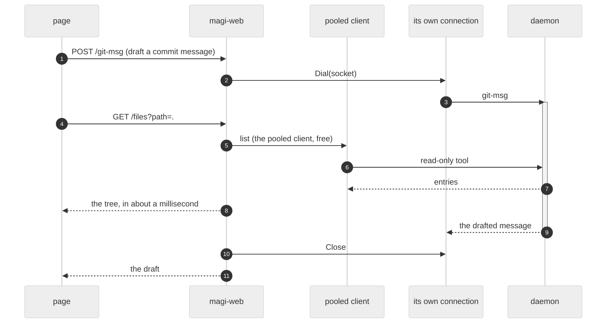
```mermaid
%%{init: {'theme':'neutral'}}%%
sequenceDiagram
  autonumber
  participant P as page
  participant W as magi-web
  participant C1 as pooled client
  participant C2 as its own connection
  participant D as daemon

  P->>W: POST /git-msg (draft a commit message)
  W->>C2: Dial(socket)
  C2->>D: git-msg
  activate D
  P->>W: GET /files?path=.
  W->>C1: list (the pooled client, free)
  C1->>D: read-only tool
  D-->>C1: entries
  W-->>P: the tree, in about a millisecond
  D-->>C2: the drafted message
  deactivate D
  W->>C2: Close
  W-->>P: the draft
```

### L10.3 — 일을 넘기기, 그리고 질문하기

쓰기 권한이 필요한 요청은 워크스페이스 락을 대기합니다. 동일한 작업 디렉토리 트리에서 복수의 쓰기 턴이 동시에 실행되면 파일 충돌이 발생하기 때문입니다.
반면 `looking`으로 지정된 질의 요청은 도구가 읽기 전용 도구 4개로 제한된 세션에서 격리 실행되므로 파일 충돌 우려가 없으며,
워크스페이스가 작업 중인 상태에서도 즉시 병렬 실행됩니다. **속성 선언은 요청자가 지정하고, 실제 실행 격리 강제는 수신자 데몬이** 담당합니다.

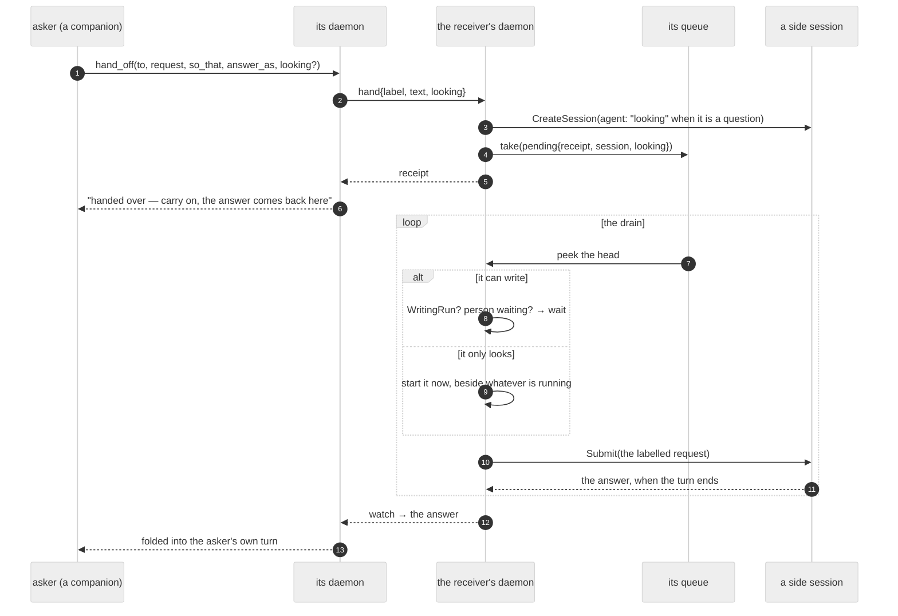
```mermaid
%%{init: {'theme':'neutral'}}%%
sequenceDiagram
  autonumber
  participant A as asker (a companion)
  participant DA as its daemon
  participant DB as the receiver's daemon
  participant Q as its queue
  participant S as a side session

  A->>DA: hand_off(to, request, so_that, answer_as, looking?)
  DA->>DB: hand{label, text, looking}
  DB->>S: CreateSession(agent: "looking" when it is a question)
  DB->>Q: take(pending{receipt, session, looking})
  DB-->>DA: receipt
  DA-->>A: "handed over — carry on, the answer comes back here"
  loop the drain
    Q->>DB: peek the head
    alt it can write
      DB->>DB: WritingRun? person waiting? → wait
    else it only looks
      DB->>DB: start it now, beside whatever is running
    end
    DB->>S: Submit(the labelled request)
    S-->>DB: the answer, when the turn ends
  end
  DB-->>DA: watch → the answer
  DA-->>A: folded into the asker's own turn
```

### L10.4 — 회의: 소집에서 업무 배분까지

회의의 의장을 콘솔이 맡는 이유는 명확합니다. 발언 순서를 결정하는 참가자가 직접 논쟁에 참여하면 회의의 공정성이 훼손되기 때문입니다. 참가자들의 사전 준비는
전원 병렬로 동시에 진행되며, 준비를 마치지 못한 참가자가 전체 회의실 진입을 블로킹하지 않습니다.

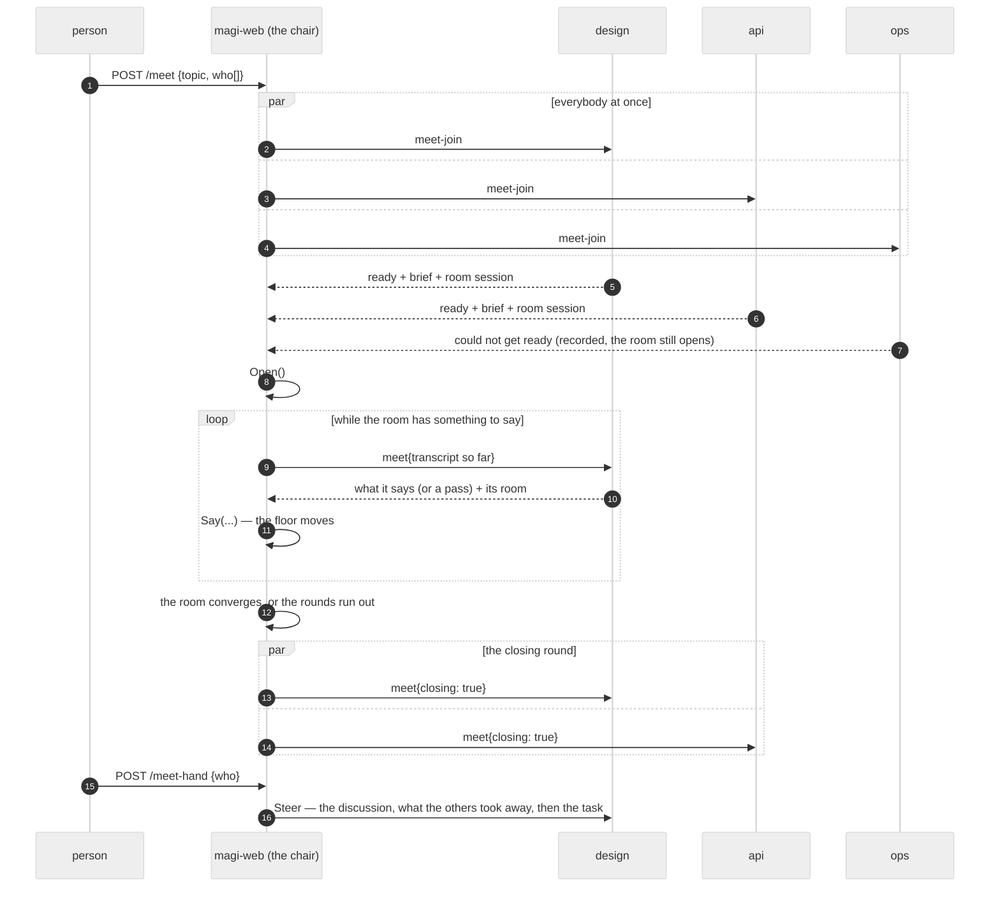
```mermaid
%%{init: {'theme':'neutral'}}%%
sequenceDiagram
  autonumber
  participant U as person
  participant W as magi-web (the chair)
  participant D1 as design
  participant D2 as api
  participant D3 as ops

  U->>W: POST /meet {topic, who[]}
  par everybody at once
    W->>D1: meet-join
    and
    W->>D2: meet-join
    and
    W->>D3: meet-join
  end
  D1-->>W: ready + brief + room session
  D2-->>W: ready + brief + room session
  D3-->>W: could not get ready (recorded, the room still opens)
  W->>W: Open()
  loop while the room has something to say
    W->>D1: meet{transcript so far}
    D1-->>W: what it says (or a pass) + its room
    W->>W: Say(...) — the floor moves
  end
  W->>W: the room converges, or the rounds run out
  par the closing round
    W->>D1: meet{closing: true}
    and
    W->>D2: meet{closing: true}
  end
  U->>W: POST /meet-hand {who}
  W->>D1: Steer — the discussion, what the others took away, then the task
```

### L10.5 — 각 참가자가 지금 무엇을 생각하는지

각 데몬은 회의실 대화 내용을 콘솔이 읽는 공유 저장소에 기록합니다. 회의 스트림은 이를 **단일 스트림으로 취합하여** 브라우저에 전달합니다. 따라서 4개의
대화 패널을 한 화면에서 관찰하더라도 네트워크 연결은 단 1개만 소비합니다.

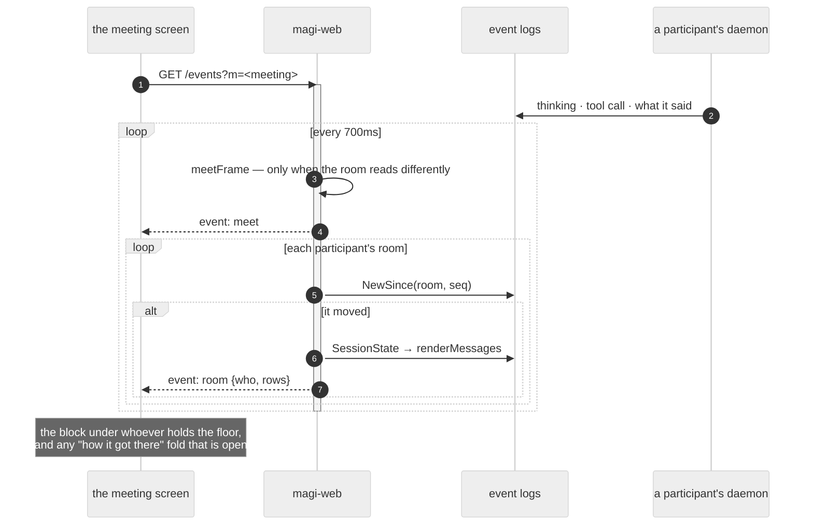
```mermaid
%%{init: {'theme':'neutral'}}%%
sequenceDiagram
  autonumber
  participant P as the meeting screen
  participant W as magi-web
  participant L as event logs
  participant D as a participant's daemon

  P->>W: GET /events?m=<meeting>
  activate W
  D->>L: thinking · tool call · what it said
  loop every 700ms
    W->>W: meetFrame — only when the room reads differently
    W-->>P: event: meet
    loop each participant's room
      W->>L: NewSince(room, seq)
      alt it moved
        W->>L: SessionState → renderMessages
        W-->>P: event: room {who, rows}
      end
    end
  end
  deactivate W
  Note over P: the block under whoever holds the floor,<br/>and any "how it got there" fold that is open
```

### L10.6 — 워크스페이스: 레이지, 보관, 그리고 강제 재조회

트리 탐색은 요청당 단일 디렉토리 단위로 수행되며 확장된 폴더만을 대상으로 합니다. **파일 변경 감지 이후에 수행되는** 순회에서는 디스크를 다시 읽고, 단순 UI 재렌더링은 10초 이내에 캐시된 항목을
재사용합니다. 본 콘솔을 통해 발생한 파일 변경 작업은 캐시 만료 시간을 기다리지 않고 즉시 캐시를 무효화하여 최신 상태를 유지합니다.

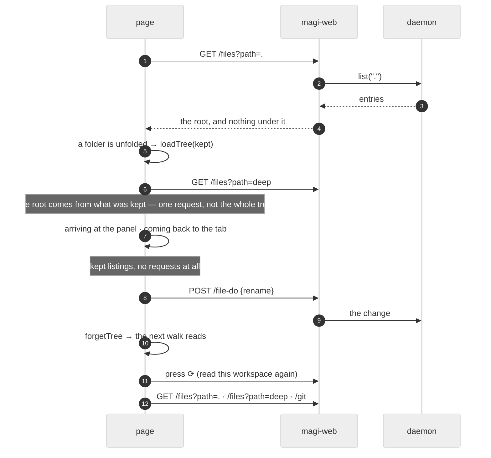
```mermaid
%%{init: {'theme':'neutral'}}%%
sequenceDiagram
  autonumber
  participant P as page
  participant W as magi-web
  participant D as daemon

  P->>W: GET /files?path=.
  W->>D: list(".")
  D-->>W: entries
  W-->>P: the root, and nothing under it
  P->>P: a folder is unfolded → loadTree(kept)
  P->>W: GET /files?path=deep
  Note over P: the root comes from what was kept — one request, not the whole tree
  P->>P: arriving at the panel · coming back to the tab
  Note over P: kept listings, no requests at all
  P->>W: POST /file-do {rename}
  W->>D: the change
  P->>P: forgetTree → the next walk reads
  P->>W: press ⟳ (read this workspace again)
  P->>W: GET /files?path=. · /files?path=deep · /git
```

### L10.7 — 막힌 컴패니언에게 답하기

대화형 프롬프트는 영속 이벤트 로그에 기록되지 않습니다. 이는 이미 발생한 과거의 이벤트가 아니라 현재 사용자 입력을 요구하는 질의 상태이기 때문이며,
따라서 로스터 프레임의 실시간 상태 필드에 실려 전달됩니다. 사용자의 응답은 질의를 요청한 데몬에게 해당 콜 ID를 지정하여 전송됩니다.

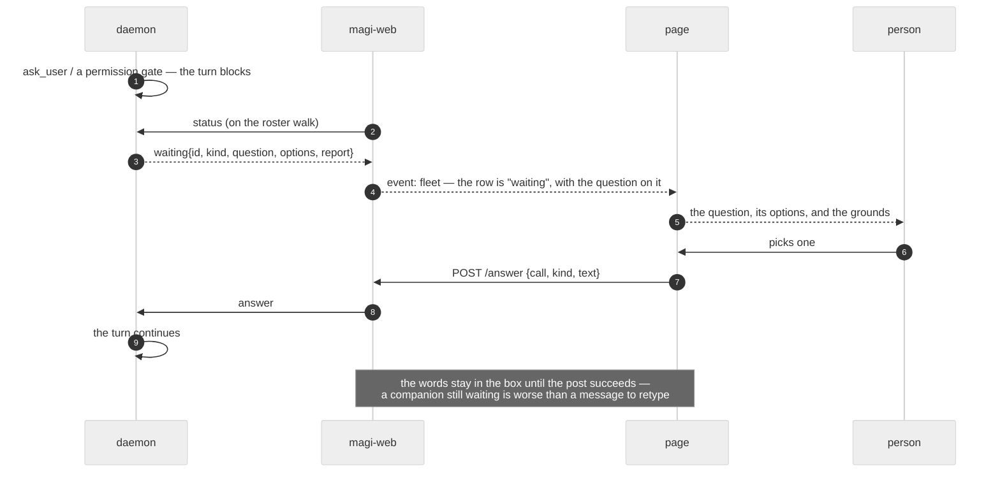
```mermaid
%%{init: {'theme':'neutral'}}%%
sequenceDiagram
  autonumber
  participant D as daemon
  participant W as magi-web
  participant P as page
  participant U as person

  D->>D: ask_user / a permission gate — the turn blocks
  W->>D: status (on the roster walk)
  D-->>W: waiting{id, kind, question, options, report}
  W-->>P: event: fleet — the row is "waiting", with the question on it
  P-->>U: the question, its options, and the grounds
  U->>P: picks one
  P->>W: POST /answer {call, kind, text}
  W->>D: answer
  D->>D: the turn continues
  Note over P,W: the words stay in the box until the post succeeds —<br/>a companion still waiting is worse than a message to retype
```

---

## 부록 — A/B 플래그 기본값 (`plan_flags.go`)

| 플래그 | 기본 | 제어 대상 |
|---|---|---|
| `MAGI_DECLARE_FINISH` | ON | 종료를 **선언 행위**로 요구(`council{complete:true}`); off면 모델이 툴 호출을 멈추는 수동적 종료로 복귀 |
| `MAGI_COUNCIL_DEBATE` | ON | 불일치 시 1회 반박 라운드; off면 독립 투표 집계만 |
| `MAGI_COUNCIL_SUITE_WALK` | ON | 요구사항 walk에서 답의 한 형태를 거부합니다 — 스위트 전체 개수("12개 다 통과")는 어느 요구사항에 대한 판단인지 명시하지 못합니다. 루트가 이미 요구한 것 이상을 묻지 않으므로, 이미 요구사항별로 검토하던 위원은 영향을 받지 않습니다 |
| `MAGI_STALL_NOVELTY` | ON | **새로운** 조사 명령(처음 보는 read/grep)을 전진으로 인정해 정체 창을 한 번 더 부여; off면 뮤테이션만 전진 인정 |
| `MAGI_CTX_COMPACT_RETRY` | ON | 컨텍스트 초과 시 압축 후 재시도 |
| `MAGI_EXITCODE_BODYSCAN` | ON | bash exit-0 크래시/마스킹 주석 (`tool/builtin`) |
| `MAGI_REPEAT_CAP` | ON | degenerate 반복(같은 문장/단어 무한) 안전망 (`provider_guard`) |
| `MAGI_STREAM_STALL` · `MAGI_FIRST_TOKEN` | 120s · 300s | generate의 토큰-간 freeze 한도(0=비활성) · 첫토큰 전(prefill) 한도(0=별도 한도 없음); 가드는 둘 중 큰 쪽의 2배, 카운슬 멤버 데드라인은 첫토큰 값을 합산 |
| `MAGI_CHECK_TIMEOUT` | 120s | 워크플로 verify 명령 하나를 묶는 경계(0=off). 킬은 -1 = *검증불가*로 보고되며, 거짓 실패로 처리되지 않습니다 |
| `MAGI_SPIN_CAP` | 400KB | reasoning-only spin 상한(guardedProvider는 2×) |
| `MAGI_SPIN_WALL` | 600s | 동일한 폭주 생성을 양이 아니라 **시간**으로 제한하는 경계. 첫 출력 시점부터 측정하므로 느린 prefill이 이중으로 계산되지 않습니다(0이면 비활성화). 80분 동안 reasoning 16.6KB를 방출한 호출은 바이트 경계와 유휴 경계를 모두 통과했습니다 |
| `MAGI_SELFKILL_GUARD` | ON | 프롬프트 키워드로 자기 프로세스를 종료시키는 `pkill -f` 차단 |
| `MAGI_COUNCIL_KEEP` | ON | 위원이 **유지할 부분**도 함께 지정(자문 용도, 결정 및 집계에는 영향 없음); off면 변경 권고만 제시 |
| `MAGI_COUNCIL_REJECT_CAP` | ON | 승인 판정이 경계 지어지는 만큼 거부 판정도 상한을 둡니다 — 변경 없는 거부 연속 3회, 또는 한 턴에 8회 도달 시 declare→reject를 스텝 한도까지 반복하는 대신 UNVERIFIED로 착지 |
| `MAGI_COUNCIL_LITERALS` | ON | 태스크 자신의 식별자(camelCase, snake_case, 파일명, `(int)` 타입 필드, 백틱 단어)를 위원 증거로 수집하여, 검토 결과를 태스크가 실제로 사용한 명칭과 정확히 대조할 수 있도록 지원합니다 |
| `MAGI_INTERJECT_SPLIT` | ON | 큐에 대기 중인 메시지를 단일 배치가 아닌 **메시지 단위로 개별** 처리합니다. 신규 턴에서 잔여 큐를 재판정하는 로직도 함께 제어됩니다; off면 배치 단일 처분으로 복귀 |
| `MAGI_RESEND_REASONING` | ON | 도구 연속 호출 시 직전 스텝의 reasoning을 네트워크 요청에 다시 포함하여 전달합니다(짝지은 파일럿 결과: 입력 토큰 40% 절감, 최대 50% 속도 향상, 회귀 없음). 해당 필드를 무시하는 백엔드는 바이트만 수신합니다 |
| `MAGI_DISTIL` | OFF | 턴 전체가 아직 컨텍스트에 유지되는 시점에 "보존할 핵심 지식이 있는가"를 질의합니다. 완료 태스크당 네트워크 왕복 1회를 추가 소모하므로 기본 비활성화 |
| `MAGI_EMBEDDED_PLUGINS` | ON | 바이너리에 내장된 플러그인을 로드합니다; off면 워크스페이스에서 지정한 플러그인만 유지 |
| `MAGI_TERSE_STEPS` | OFF | 스텝마다 한 줄 요약을 요구하던 프롬프트 지침을 제외 |

본 표는 **런타임 동작을 전환하는 A/B 스위치**만을 수록합니다(CLI 옵션과 1:1로 대응되는 환경변수인
`MAGI_MODEL`·`MAGI_BASE_URL`·`MAGI_PERMISSION` 등은 ARCHITECTURE §9를 참고하며, 터미널 폭 프로브 및 디버그 스위치는 제외).
또한 **코드에서 실제로 조회되는 활성 플래그만** 선별하여 기재합니다. 코드베이스에서 더 이상 참조하지 않음에도 표에 잔존했던 5개 항목(
`MAGI_STUCK_DECOMPOSE`, `MAGI_RECOVERY_RUNCAP`, `MAGI_GUARD_EXEC_EXEMPT`,
`MAGI_EXERCISE_CHURN_CAP`, `MAGI_STALL_CONVERGE`)은 L3의 조기 강제 종료 경로 제거와 함께 완전히 정리되었습니다.
(이 중 마지막 항목은 정리 이후에도 남아 있었으나, 붕괴 분기가 호출하려던 `stuck()` 로직이 삭제된 이후에는 잔여
정체 넛지를 비활성화하는 부작용만 초래했습니다 — 실측치: 126회 호출 및 60분 실행 동안 넛지 2회 발생에 그침). 플래그 목록을 갱신할 때는
소스 코드 내 `Getenv("MAGI_`, `envOff(`, `envOn(` 호출을 정규식으로 검색하여 실제 사용 여부를 상호 검증해야 합니다. 문서의 명세와 실제 구현의 불일치는
과거 빈번히 발생했던 대표적 결함 유형이며, 존재하지 않는 설정 옵션을 문서에 기재하는 것은 명세를 누락하는 것보다 시스템에 더 큰 혼선을 초래합니다.
**역방향 불일치 역시 동일한 결함에 해당합니다.** 예를 들어 `MAGI_COUNCIL_KEEP`의 경우 소스 코드 주석에는 명시되어 있었으나 **환경변수를 읽어오는 코드가
누락되어** 기능 전체가 비활성화 상태에 머물러 있었습니다(어댑터, 파서, TUI 렌더링 로직은 온전히 유지되어 있었음). 정기 대조 감사를 통해 해당 누락을 발견하고 배선을
정상 복구했습니다. 동일한 검증 과정에서 `MAGI_STEP_VERIFY`와 `MAGI_MAX_PLAN_DEPTH` 또한 실제 참조 코드 없이 주석에만
방치되어 있던 사실을 확인하고 관련 주석 및 미사용 필드를 완전히 제거했습니다.
