# magi — 시스템 구조도

[English](DIAGRAMS.md) · [한국어](DIAGRAMS.ko.md) · [↑ Docs](README.ko.md)

> **현행 참조.** ARCHITECTURE의 시각적 짝 — 프로세스 경계에서 클래스 다이어그램까지 한 축. 전부 mermaid.

[ARCHITECTURE.ko.md](ARCHITECTURE.ko.md)의 시각 요약. **탑레벨(L0)에서 클래스 다이어그램(L5–L9)까지**
한 축으로 내려간다:

| 층 | 보는 것 | 단위 |
|---|---|---|
| [L0](#l0--탑레벨-프로세스와-경계) | 프로세스와 경계 | 패키지 그룹 |
| [L1](#l1--턴-라이프사이클-요청에서-착지까지) | 턴 하나의 생애 | 단계 |
| [L2](#l2--app-코어-컴포넌트-맵-internalapp) | `internal/app` 컴포넌트 맵 | 파일 |
| [L3](#l3--가드는-보고한다-결정하지-않는다) · [L4](#l4--hangspin반복-차단-모델-io-가드-계층) | 개입 절차와 I/O 가드 | 신호 |
| [L5](#l5--코어-도메인-클래스-internalcore) | 코어 도메인 | **타입** |
| [L6](#l6--포트와-어댑터-인터페이스--구현) | 포트↔어댑터 | **인터페이스** |
| [L7](#l7--app-코어-클래스-internalapp) | `internal/app` 내부 | **구조체·메서드** |
| [L8](#l8--툴-계층-클래스) | 툴 계층 | **인터페이스·구현** |
| [L9](#l9--툴-콜-한-번의-시퀀스) | 툴 콜 한 번 | **호출 순서** |

GitHub이 mermaid를 직접 렌더한다. 임계값·기본값은 전부 코드가 진실이며(`guard.go` 상수,
`plan_flags.go`), 이 문서는 그걸 옮겨 적은 것이다. 클래스 다이어그램은 필드를 **전부** 싣지 않는다 —
그 타입이 왜 존재하는지를 정하는 것만 싣고, 나머지는 파일을 가리킨다.

---

## L0 — 탑레벨: 프로세스와 경계

모든 외부 접촉은 `internal/port`의 인터페이스(12개)를 거친다. `internal/app`(오케스트레이터 코어)은
어댑터 구현을 모른 채 포트만 호출하고, `cmd/magi`가 기동 시 배선한다(헥사고날).

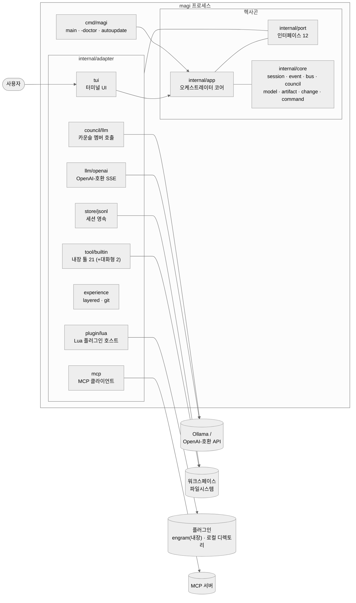
```mermaid
%%{init: {'theme':'neutral','flowchart':{'curve':'basis'}}}%%
flowchart LR
  user(["사용자"])
  subgraph proc["magi 프로세스"]
    direction LR
    cmd["cmd/magi<br/>main · -doctor · autoupdate"]
    subgraph hex["헥사곤"]
      app["internal/app<br/>오케스트레이터 코어"]
      port["internal/port<br/>인터페이스 12"]
      core["internal/core<br/>session · event · bus · council<br/>model · artifact · change · command"]
    end
    subgraph adp["internal/adapter"]
      tui["tui<br/>터미널 UI"]
      llm["llm/openai<br/>OpenAI-호환 SSE"]
      tools["tool/builtin<br/>내장 툴 21 (+대화형 2)"]
      lua["plugin/lua<br/>Lua 플러그인 호스트"]
      council["council/llm<br/>카운슬 멤버 호출"]
      exp["experience<br/>layered · git"]
      store["store/jsonl<br/>세션 영속"]
      mcp["mcp<br/>MCP 클라이언트"]
    end
  end
  ollama[("Ollama /<br/>OpenAI-호환 API")]
  ws[("워크스페이스<br/>파일시스템")]
  plug[("플러그인<br/>engram(내장) · 로컬 디렉토리")]
  mcpsrv[("MCP 서버")]

  user --> tui --> app
  cmd --> app
  app --- port
  app --- core
  port --- adp
  llm --> ollama
  council --> ollama
  tools --> ws
  lua --> plug
  mcp --> mcpsrv
  store --> ws
```

## L0.5 — 프로세스가 하나가 아닐 때: 데몬, 콘솔, 피어

L0은 프로세스 하나다. 터미널의 `magi`에 대해서는 여전히 정확하고 — 이제 전부는 아니다: 엔진은
UI 없이 돌 수 있고, 다른 프로세스들이 같은 스토어를 읽으며 소켓으로 그것을 움직인다. 여기에 새
엔진은 없다. `magi-web`은 **LLM도 툴도 없는** `app.App`을 만들므로, 턴을 돌릴 수 있는 것은
데몬뿐이다.

```mermaid
%%{init: {'theme':'neutral','flowchart':{'curve':'basis'}}}%%
flowchart LR
  supervisor(["감독자"])
  subgraph machine["머신 하나"]
    direction TB
    subgraph d1["magi -daemon (워크스페이스 A)"]
      a1["app.App<br/>LLM · 툴"]
    end
    subgraph d2["magi -daemon (워크스페이스 B)"]
      a2["app.App<br/>LLM · 툴"]
    end
    attach["magi -attach<br/>그중 하나에 붙은 TUI"]
    web["magi-web<br/>app.App: 스토어만,<br/>LLM 없음, 툴 없음"]
    logs[("이벤트 로그<br/>+ 발행 레코드")]
  end
  peer[("다른 magi-web<br/>-peer name=url")]

  supervisor --> web
  supervisor --> attach
  attach -->|"소켓으로 가는 5개 호출"| d1
  web -->|"submit · steer · interrupt<br/>answer · rewind"| d1
  web -->|"…"| d2
  a1 --> logs
  a2 --> logs
  web -->|"상태는 기록이 아니라<br/>유도된다"| logs
  web <-->|"/fleet · /skills"| peer
```

- 데몬이 대기하는 소켓 이름은 워크스페이스의 실제 경로에서 나온다. "여기의 데몬"이 모호하지 않고,
  flock이 그것을 유일하게 만든다.
- 콘솔이 컴패니언에 대해 보여주는 모든 것 — 무엇을 하는지, 막혀 있는지, 사람이 턴 중간에 무슨
  말을 했는지, 컨텍스트가 얼마나 찼는지 — 은 그 로그에서 읽는다. 낡을 수 있는 상태 파일 자체가
  없다.
- 피어는 또 하나의 콘솔이고, 브라우저가 이 콘솔에 닿는 것과 똑같은 방식으로 닿는다. 페더레이션은
  프로토콜을 추가하지 않는다.

## L1 — 턴 라이프사이클: 요청에서 착지까지

한 턴은 스텝 루프다(`loop.go runLoop`): LLM 호출 → 툴 실행 → 가드 점검을 반복한다. **스텝 천장은
없다.** 턴은 에이전트가 `council{complete: true}`로 종료를 선언하고 카운슬이 수락할 때, 모델이 툴
호출을 그냥 멈출 때, 컨텍스트가 취소될 때 끝난다. 선언 없이 끝나면 `UNVERIFIED`로 정직하게 착지한다.

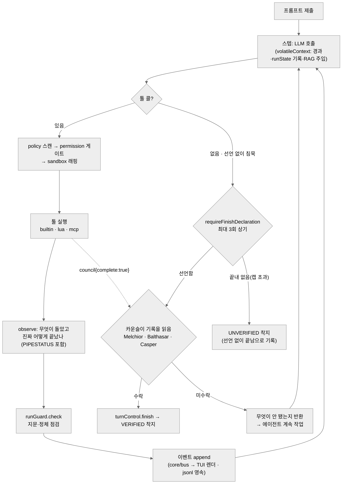
```mermaid
%%{init: {'theme':'neutral','flowchart':{'curve':'basis'}}}%%
flowchart TD
  P["프롬프트 제출"] --> S["스텝: LLM 호출<br/>(volatileContext: 경과·runState 기록·RAG 주입)"]
  S --> T{"툴 콜?"}
  T -- 있음 --> POL["policy 스캔 → permission 게이트<br/>→ sandbox 래핑"]
  POL --> EX["툴 실행<br/>builtin · lua · mcp"]
  EX --> OB["observe: 무엇이 돌았고<br/>진짜 어떻게 끝났나 (PIPESTATUS 포함)"]
  OB --> G["runGuard.check<br/>지문·정체 점검"]
  G --> EV["이벤트 append<br/>(core/bus → TUI 렌더 · jsonl 영속)"]
  EV --> S
  EX -. "council{complete:true}" .-> CG{"카운슬이 기록을 읽음<br/>Melchior · Balthasar · Casper"}
  CG -- "수락" --> FIN["turnControl.finish → VERIFIED 착지"]
  CG -- "미수락" --> FB["무엇이 안 됐는지 반환<br/>→ 에이전트 계속 작업"]
  FB --> S
  T -- "없음 · 선언 없이 침묵" --> RQ{"requireFinishDeclaration<br/>최대 3회 상기"}
  RQ -- "선언함" --> CG
  RQ -- "끝내 없음(캡 초과)" --> U["UNVERIFIED 착지<br/>(선언 없이 끝남으로 기록)"]
```

## L2 — app 코어: 컴포넌트 맵 (`internal/app`)

| 그룹 | 역할 | 파일 |
|---|---|---|
| **LOOP** | 턴 구동, 스트리밍, 인터젝션 감지, 종료 게이트(선언 요구) | `loop` · `loop_gates` · `loop_stream`(stall·reasoningSpin) · `loop_helpers` · `generate_step` · `loopmap` · `interject` · `interject_queue` · `inject` · `reask` · `todos` · `config` · `plan_flags`(A/B 플래그 — 이름은 플래너 시절 잔재) · `usage_meter` |
| **RECORD** | magi가 관측한 것 — 무엇이 돌았고 진짜 어떻게 끝났나, 워크스페이스의 현재 | `observed`(관측 판정·PIPESTATUS 노트 반영) · `observed_view`(패널 표시형) · `world_snapshot`(선언 시 새로 읽기·live jobs·기록엔 있고 디스크엔 없는 경로) · `background`(백그라운드 잡 레지스트리·tail) · `tool_outcome` |
| **COUNCIL** | 에이전트가 `council` 툴로 부르는 3인. 질의 / 종료 선언 심의 | `council_advice`(증거 조립·심의·`complete` 시 finish 신호) · `council_events`(`councilParams`) · `council_evidence` · `council_gate`(상수·`fmtElapsed`) |
| **GUARD** | 모델 I/O의 hang·spin 차단(단일 chokepoint) + 툴콜 반복·정체·자기되돌림·실행 처닝 관측. **관측한 것은 넛지로 말하고, 런을 멈추지는 않는다**(L3) | `provider_guard`(idle·byte-spin·**반복** 안전망, 모든 모델 요청) · `guard`(repeat 지문 · sinceProgress · noteEdit 자기되돌림 · 실행 원장) · `liveness` |
| **CTX** | 컨텍스트 창 관리, 압축, 경험 저장/회수 | `context_window` · `context_view` · `compact` · `memory` · `recall` · `query` · `reconstruct` |
| **IO** | 권한·정책·훅·명령 라우팅·워크플로우 | `permission` · `policy` · `hooks` · `routing` · `shellcmd` · `shellparse` · `skills` · `prompt` · `diagnose` · `execute` · `workflow` · `fork` · `scratch` |
| **EXT** | Lua 플러그인에 노출되는 앱 API | `app_plugin_api` · `app_emit` · `app_state` |

## L3 — 가드는 보고한다, 결정하지 않는다

**이 층은 한 번 뒤집혔다.** 예전 구조는 조언(넛지) → 차단 → 구조적 회복 → 강제종료로
에스컬레이션했다. 측정이 그걸 부정했다: 기록된 전체 트라이얼에서 magi가 스스로 멈춘 28런은 패스를
하나도 내지 못했고 그중 8런은 채점조차 되지 않았다(0 아닌 exit는 호출자에게 "에이전트가 멈추기로
했다"가 아니라 "에이전트가 돌지 못했다"로 읽힌다). 반대로 외부 데드라인까지 간 396런은 전부 채점됐고
76런이 패스했다.

그래서 **세던 신호는 전부 그대로 세고, 전부 그대로 말하되, magi가 그 판독으로 런을 끝내는 일만
없앴다.** 코드에서 확인할 수 있는 형태로:

- `runGuard.check()`는 `block` 자리에 **항상 `false`**를 돌려준다(`execute.go`가 그 값을 버린다).
- 강제종료를 하던 `handleStuckGuard()`는 **삭제됐다**. 한동안 `return false, false`만 남아
  매 스텝 불렸는데, 본문 주석은 사라진 exercise-churn 착지를 현재형으로 서술하고 있었다.
- 남은 유일한 출력은 `shouldNudge()`가 돌려주는 문자열 하나: `"blocked"` · `"stalled"` · `""`.

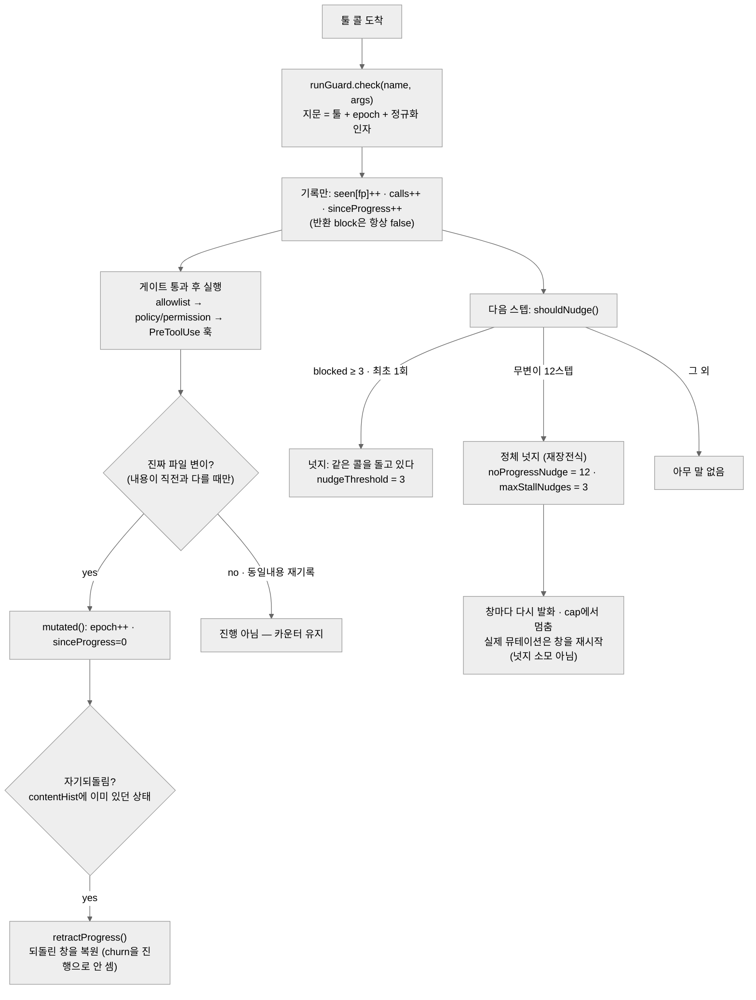
```mermaid
%%{init: {'theme':'neutral','flowchart':{'curve':'basis'}}}%%
flowchart TD
  C["툴 콜 도착"] --> CH["runGuard.check(name, args)<br/>지문 = 툴 + epoch + 정규화 인자"]
  CH --> REC["기록만: seen[fp]++ · calls++ · sinceProgress++<br/>(반환 block은 항상 false)"]
  REC --> RUN["게이트 통과 후 실행<br/>allowlist → policy/permission → PreToolUse 훅"]
  RUN --> MU{"진짜 파일 변이?<br/>(내용이 직전과 다를 때만)"}
  MU -- "yes" --> RST["mutated(): epoch++ · sinceProgress=0"]
  MU -- "no · 동일내용 재기록" --> NOP["진행 아님 — 카운터 유지"]
  RST --> SR{"자기되돌림?<br/>contentHist에 이미 있던 상태"}
  SR -- "yes" --> RETR["retractProgress()<br/>되돌린 창을 복원 (churn을 진행으로 안 셈)"]

  REC --> SN["다음 스텝: shouldNudge()"]
  SN -- "blocked ≥ 3 · 최초 1회" --> NB["넛지: 같은 콜을 돌고 있다<br/>nudgeThreshold = 3"]
  SN -- "무변이 12스텝" --> NS["정체 넛지 (재장전식)<br/>noProgressNudge = 12 · maxStallNudges = 3"]
  NS --> RE["창마다 다시 발화 · cap에서 멈춤<br/>실제 뮤테이션은 창을 재시작(넛지 소모 아님)"]
  SN -- "그 외" --> Q["아무 말 없음"]
```

넛지는 **에이전트가 읽고 무시할 수 있는 프롬프트**다. 무시해도 magi는 아무것도 하지 않는다 — 턴은
에이전트가 끝내거나, 외부가 끝낸다.

종료 선언 시엔 L1의 카운슬이 이어진다: 기록 조립(디스크에 없는 경로 → 살아있는 잡 → 워크스페이스
스냅샷 → 관측 기록 → 툴 증거, 항목당 클립) → 3멤버 심의. 미수락이면 무엇이 안 됐는지가 툴 결과로
돌아가 에이전트가 계속 일하고, 끝내 선언이 없으면 3회 상기 후 UNVERIFIED로 착지한다. bash 툴 자체도
exit 0에 크래시 시그니처나 종료코드-무마 꼬리(`|| true` 등)가 보이면 결과 머리에 경고 주석을 단다
(`MAGI_EXITCODE_BODYSCAN`, MANUAL §가드 참고).

## L4 — hang·spin·반복 차단: 모델 I/O 가드 계층

행/스핀은 **모델에 대한 모든 요청이 통과하는 단일 지점**에서 처리된다. `providerFor(agent)`가 반환하는
provider는 생성 시점에 전부 `GuardProvider`(`provider_guard.go`)로 감싸지므로 — 메인 generate,
카운슬, 모든 tool-free side call — **하나의 가드된
`StreamChat`을 통해 송수신**된다. 각 소비자가 자기 워치독을 들고 다니던 whack-a-mole를 대체한다.

가드는 **2계층**이다. (1) 메인 루프의 *행동* 가드(`consumeStream`)가 메인 generate에서 **먼저** 발화해
재시도/넛지 같은 고유 처리를 하고, (2) 그 **위의 안전망**(`guardedProvider`)이 side call 등 자기 처리가
없는 경로를 backstop한다 — 안전망 임계값은 행동 가드보다 **2×** 높게 잡아 순서를 보장한다.

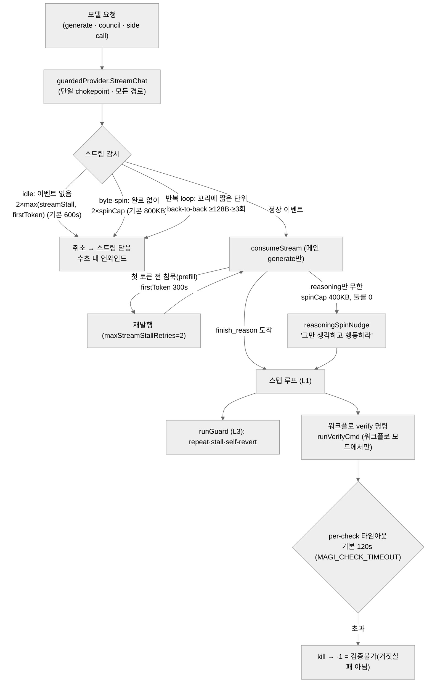
```mermaid
%%{init: {'theme':'neutral','flowchart':{'curve':'basis'}}}%%
flowchart TD
  REQ["모델 요청<br/>(generate · council · side call)"] --> GP["guardedProvider.StreamChat<br/>(단일 chokepoint · 모든 경로)"]
  GP --> W{"스트림 감시"}
  W -- "idle: 이벤트 없음<br/>2×max(streamStall, firstToken) (기본 600s)" --> AB["취소 → 스트림 닫음<br/>수초 내 언와인드"]
  W -- "byte-spin: 완료 없이<br/>2×spinCap (기본 800KB)" --> AB
  W -- "반복 loop: 꼬리에 짧은 단위<br/>back-to-back ≥128B·≥3회" --> AB
  W -- "정상 이벤트" --> CS["consumeStream (메인 generate만)"]
  CS -- "첫 토큰 전 침묵(prefill)<br/>firstToken 300s" --> RT["재발행 (maxStreamStallRetries=2)"]
  CS -- "reasoning만 무한<br/>spinCap 400KB, 툴콜 0" --> SN["reasoningSpinNudge<br/>'그만 생각하고 행동하라'"]
  CS -- "finish_reason 도착" --> STEP["스텝 루프 (L1)"]
  RT --> CS
  SN --> STEP
  STEP --> TG["runGuard (L3): repeat·stall·self-revert"]
  STEP --> CK["워크플로 verify 명령<br/>runVerifyCmd (워크플로 모드에서만)"]
  CK --> CTO{"per-check 타임아웃<br/>기본 120s (MAGI_CHECK_TIMEOUT)"}
  CTO -- "초과" --> KILL["kill → -1 = 검증불가(거짓실패 아님)"]
```

계층별 요약:

| 계층 | 잡는 것 | 트리거 | 바운드 / 플래그 | 처리 |
|---|---|---|---|---|
| `guardedProvider` (idle) | 침묵한 백엔드(무응답) | 마지막 이벤트 후 유휴 | 2×max(`streamStall`,`firstToken`)(기본 600s) | 취소·스트림 닫음 |
| `guardedProvider` (byte-spin) | 완료 없는 폭주 생성 | 누적 바이트 | 2×`spinCap`(기본 800KB), `MAGI_SPIN_CAP` | 취소 |
| `guardedProvider` (repeat) | **degenerate 반복**(같은 문장/단어 무한) | 꼬리 단위 back-to-back ≥128B·≥3회 | `MAGI_REPEAT_CAP`(기본 on), 꼬리 4KB·256B마다 검사 | 취소(≈수백 B 만에, 800KB 안 기다림) |
| `consumeStream` (첫토큰) | 메인 generate 첫토큰 전 침묵 — prefill 여유 | 유휴 | `firstToken` 300s, `MAGI_FIRST_TOKEN`(0=토큰간 한도로 폴백) | 같은 요청 재발행(×2), 소진 시 에러 |
| `consumeStream` (토큰간) | 출력 시작 후 생성 도중 freeze | 유휴 | `streamStall` 120s, `MAGI_STREAM_STALL`(0=비활성) | 스트림 종료, 부분 출력 보존(재시도 없음) |
| `consumeStream` (reasoningSpin) | 메인 generate reasoning만 무한 | 툴콜 0 + 바이트 | `spinCap` 400KB (`[limits] max_output_tokens` 설정 시 이 넛지는 토큰캡에 위임=off, guardedProvider 800KB 백스톱은 유지) | 넛지("행동하라") |
| `runGuard` (L3) | 툴콜 반복·정체·자기되돌림 | 지문·무변이 스텝 | `guard.go` 상수 | **넛지만** — 차단·회복·강제종료 없음 |
| 체크 타임아웃(`runVerifyCmd`) | 블로킹 워크플로 verify 명령 | per-check 경과 | 기본 120s, `MAGI_CHECK_TIMEOUT`(0=off) | kill → -1 = 검증불가(거짓실패 아님) |

핵심: **모델 hang/spin/반복은 guardedProvider 단일 지점**에서, **셸 명령 hang은 bash 툴(120/600s)과
runVerifyCmd 타임아웃**에서 각각 바운드된다 — 어느 것도 턴 벽시계까지 매달리지 않는다.

## L5 — 코어 도메인 클래스 (`internal/core`)

`core`는 **std 외에는 아무것도 import하지 않는다**. 여기 있는 타입에는 LLM도, 파일시스템도,
터미널도 없다 — 대화가 무엇으로 이루어져 있는지에 대한 서술뿐이다.

```mermaid
%%{init: {'theme':'neutral'}}%%
classDiagram
  direction LR

  class Session {
    +SessionID ID
    +string Workdir
    +string Agent
    +ModelRef Model
    +time.Time Created
    +map[string]string Meta
  }
  class SessionMeta {
    +SessionID ID
    +string Title
    +string Agent
    +string Parent
    +time.Time LastActivity
  }
  note for SessionMeta "전체 로그를 읽지 않고 목록만 낼 때"
  class Message {
    +string ID
    +Role Role
    +Part[] Parts
  }
  class Part {
    +PartKind Kind
    +string Text
    +ToolCall ToolCall
    +ToolResult ToolResult
    +ImageRef Image
    +string Err
  }
  note for Part "Kind가 고르는 태그드 유니온 — 정확히 하나만 채워진다"
  class ToolCall {
    +string CallID
    +string Name
    +json.RawMessage Args
  }
  class ToolResult {
    +string CallID
    +json.RawMessage Content
    +bool IsError
  }
  class Todo {
    +string Content
    +string Status
  }
  note for Todo "Status = pending · in_progress · completed"

  Session "1" *-- "*" Message
  Message "1" *-- "*" Part
  Part ..> ToolCall
  Part ..> ToolResult
  Session ..> SessionMeta : 요약
  Session ..> Todo : 에이전트의 계획

  class Event {
    +int64 Seq
    +SessionID SessionID
    +Type Type
    +Actor Actor
    +time.Time TS
    +json.RawMessage Data
  }
  class Actor {
    +ActorKind Kind
    +string ID
  }
  note for Actor "Kind = user · agent · system — 턴 경계는 user 뿐"
  class Bus {
    +Publish(Event)
    +Subscribe(ctx, SessionID) chan
    +SubscriberCount(SessionID) int
  }

  Event *-- Actor
  Bus ..> Event : fan-out
  Event ..> Part : Data(part.appended)
```

`PartKind` ∈ `text` · `reasoning` · `tool-call` · `tool-result` · `image` · `error`.
`Part`가 태그드 유니온인 것이 저장 형식을 정한다: 스트리밍 단위와 영속 단위가 같은 타입이라
재생(replay)이 곧 렌더다.

카운슬 도메인은 별개의 작은 값 모델이다 — LLM 호출은 어댑터(`adapter/council/llm`)에 있고,
`core/council`은 **투표를 세는 규칙**만 안다:

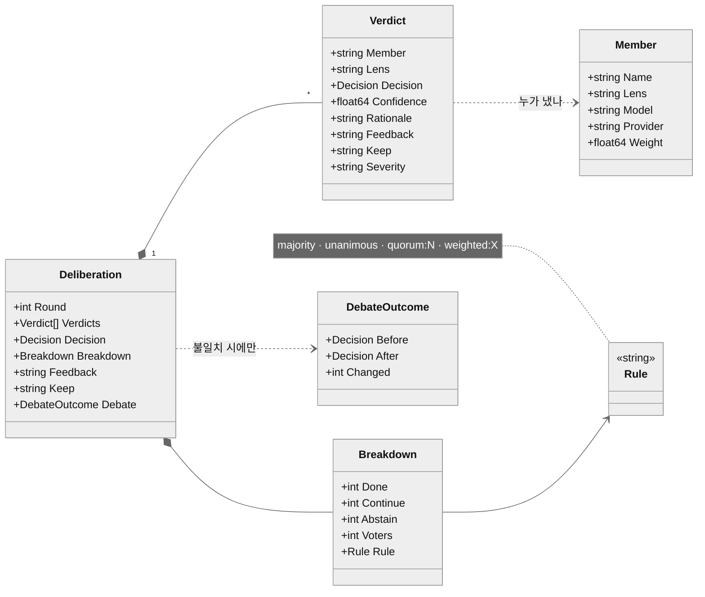
```mermaid
%%{init: {'theme':'neutral'}}%%
classDiagram
  direction LR
  class Member {
    +string Name
    +string Lens
    +string Model
    +string Provider
    +float64 Weight
  }
  class Verdict {
    +string Member
    +string Lens
    +Decision Decision
    +float64 Confidence
    +string Rationale
    +string Feedback
    +string Keep
    +string Severity
  }
  class Breakdown {
    +int Done
    +int Continue
    +int Abstain
    +int Voters
    +Rule Rule
  }
  class Deliberation {
    +int Round
    +Verdict[] Verdicts
    +Decision Decision
    +Breakdown Breakdown
    +string Feedback
    +string Keep
    +DebateOutcome Debate
  }
  class Rule {
    <<string>>
  }
  note for Rule "majority · unanimous · quorum:N · weighted:X"
  class DebateOutcome {
    +Decision Before
    +Decision After
    +int Changed
  }
  Deliberation "1" *-- "*" Verdict
  Deliberation *-- Breakdown
  Breakdown --> Rule
  Verdict ..> Member : 누가 냈나
  Deliberation ..> DebateOutcome : 불일치 시에만
```

`Decision` ∈ `done` · `continue` · `abstain`. `Tally(verdicts, rule)`가 순수 함수라
심의 기록만 있으면 결정을 재현할 수 있다. `Keep`/`Debate`는 **결정에 영향을 주지 않는다** —
기권이 분모에서 빠지는 것과 함께, 이 분리가 "카운슬이 왜 그렇게 정했나"를 사후에 답할 수 있게 한다.

---

## L6 — 포트와 어댑터 (인터페이스 → 구현)

의존 방향은 **`adapter → app → core`** 한 방향이고, 컴파일 타임에 강제된다. `app`은 아래
인터페이스만 알고, `cmd/magi`가 기동 시에 구현을 꽂는다.

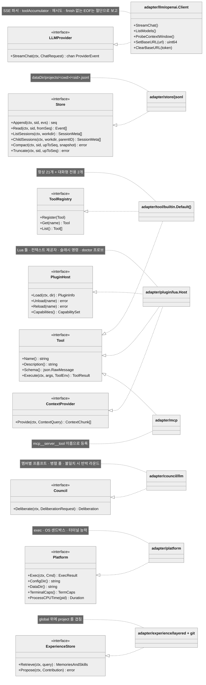
```mermaid
%%{init: {'theme':'neutral'}}%%
classDiagram
  direction LR

  class LLMProvider {
    <<interface>>
    +StreamChat(ctx, ChatRequest) chan ProviderEvent
  }
  class Store {
    <<interface>>
    +Append(ctx, sid, evs) seq
    +Read(ctx, sid, fromSeq) Event[]
    +ListSessions(ctx, workdir) SessionMeta[]
    +ChildSessions(ctx, workdir, parentID) SessionMeta[]
    +Compact(ctx, sid, upToSeq, snapshot) error
    +Truncate(ctx, sid, upToSeq) error
  }
  class Tool {
    <<interface>>
    +Name() string
    +Description() string
    +Schema() json.RawMessage
    +Execute(ctx, args, ToolEnv) ToolResult
  }
  class ToolRegistry {
    <<interface>>
    +Register(Tool)
    +Get(name) Tool
    +List() Tool[]
  }
  class Council {
    <<interface>>
    +Deliberate(ctx, DeliberationRequest) Deliberation
  }
  class Platform {
    <<interface>>
    +Exec(ctx, Cmd) ExecResult
    +ConfigDir() string
    +DataDir() string
    +TerminalCaps() TermCaps
    +ProcessCPUTime(pid) Duration
  }
  class ExperienceStore {
    <<interface>>
    +Retrieve(ctx, query) MemoriesAndSkills
    +Propose(ctx, Contribution) error
  }
  class PluginHost {
    <<interface>>
    +Load(ctx, dir) PluginInfo
    +Unload(name) error
    +Reload(name) error
    +Capabilities() CapabilitySet
  }
  class ContextProvider {
    <<interface>>
    +Provide(ctx, ContextQuery) ContextChunk[]
  }

  class OpenAIClient["adapter/llm/openai.Client"] {
    +StreamChat()
    +ListModels()
    +ProbeContextWindow()
    +SetBaseURL(url) uint64
    +ClearBaseURL(token)
  }
  note for OpenAIClient "SSE 파서 · toolAccumulator · 재시도 · finish 없는 EOF는 절단으로 보고"
  class JSONLStore["adapter/store/jsonl"]
  note for JSONLStore "dataDir/projects/&lt;cwd&gt;/&lt;sid&gt;.jsonl"
  class BuiltinRegistry["adapter/tool/builtin.Default()"]
  note for BuiltinRegistry "항상 21개 + 대화형 전용 2개"
  class LuaHost["adapter/plugin/lua.Host"]
  note for LuaHost "Lua 툴 · 컨텍스트 제공자 · 슬래시 명령 · doctor 프로브"
  class MCPClient["adapter/mcp"]
  note for MCPClient "mcp__server__tool 이름으로 등록"
  class LLMCouncil["adapter/council/llm"]
  note for LLMCouncil "멤버별 프롬프트 · 병렬 폴 · 불일치 시 반박 라운드"
  class LayeredExp["adapter/experience/layered + git"]
  note for LayeredExp "global 위에 project 를 겹침"
  class OSPlatform["adapter/platform"]
  note for OSPlatform "exec · OS 샌드박스 · 터미널 능력"

  LLMProvider <|.. OpenAIClient
  Store <|.. JSONLStore
  ToolRegistry <|.. BuiltinRegistry
  Tool <|.. BuiltinRegistry
  PluginHost <|.. LuaHost
  Tool <|.. LuaHost
  Tool <|.. MCPClient
  Council <|.. LLMCouncil
  ExperienceStore <|.. LayeredExp
  Platform <|.. OSPlatform
  ContextProvider <|.. LuaHost
```

포트는 12개다: 위 9개 + `DoctorProbe`(`-doctor` 진단 항목) + `PluginCommand`(슬래시 명령) +
`Scheduler`. **툴 인터페이스에 구현이 셋**(builtin · lua · mcp)인 것이 확장 지점의 핵심이다 —
루프는 셋을 구별하지 않는다.

---

### L6.1 — CLI를 백엔드로: 함께 배포되는 심 셋

`llm/openai`는 `base_url`이 가리키는 곳에 말합니다. 플러그인이 **그 주소가 될 수** 있습니다 — loopback
HTTP 심을 서빙하고, 채팅 요청 하나를 코딩 CLI 한 번 실행으로 채웁니다. 셋이 바이너리 안에 실려 오고
기본은 꺼짐입니다 — `claudecode`, `codex`, `antigravity`.

모델은 이걸 모릅니다. 모델이 보는 건 OpenAI 호환 엔드포인트이고, magi 자신의 툴·권한 게이트·카운슬은
그대로입니다. 바뀌는 것은 누가 토큰을 생성하는가, 그리고 한 턴이 얼마인가입니다.

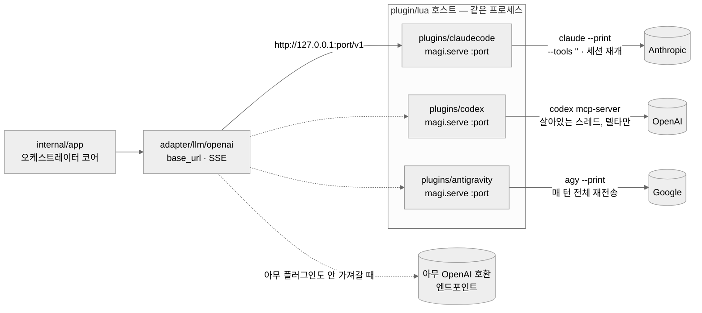
```mermaid
%%{init: {'theme':'neutral','flowchart':{'curve':'basis'}}}%%
flowchart LR
  app["internal/app<br/>오케스트레이터 코어"]
  llm["adapter/llm/openai<br/>base_url · SSE"]
  app --> llm

  subgraph host["plugin/lua 호스트 — 같은 프로세스"]
    direction TB
    cc["plugins/claudecode<br/>magi.serve :port"]
    cx["plugins/codex<br/>magi.serve :port"]
    ag["plugins/antigravity<br/>magi.serve :port"]
  end

  llm -->|"http://127.0.0.1:port/v1"| cc
  llm -.-> cx
  llm -.-> ag

  cc -->|"claude --print<br/>--tools '' · 세션 재개"| anth[("Anthropic")]
  cx -->|"codex mcp-server<br/>살아있는 스레드, 델타만"| oai[("OpenAI")]
  ag -->|"agy --print<br/>매 턴 전체 재전송"| goog[("Google")]

  direct[("아무 OpenAI 호환<br/>엔드포인트")]
  llm -.->|"아무 플러그인도 안 가져갈 때"| direct
```

그림이 명시하는 것 셋:

- **하나는 실선, 둘은 점선입니다.** 자기 CLI가 답하는 플러그인은 전부 심을 서빙하므로 셋 다 동시에
  **고를 수 있습니다**. 체인을 따르는 것은 **기본값**뿐입니다 — claude, codex, agy, 그다음 config가
  named한 것. 컴패니언마다 하나를 고르는 건 런타임 선택이고(§3.7.2) 재시작이 아닙니다.
- **화살표 라벨이 곧 비용입니다.** claude는 툴 스키마를 버리고 CLI 자신의 세션을 이어 붙입니다(최소 턴
  327 토큰, 이후로는 델타 값). codex는 `magi.pipe` 위에 살아 있는 스레드 하나를 붙들고 델타만 보냅니다
  (턴당 정가 527). `agy`는 스키마를 포함한 대화 전체를 매 턴 다시 보냅니다 — 걸 캐시가 없고, 재개
  플래그는 청구를 두 배로 만듭니다. 측정치는 EXTENDING §3.7.1에 있습니다.
- **평범한 엔드포인트로 가는 점선이 기본 경우입니다.** 플러그인을 켜지 않으면 이 중 무엇도 동작하지
  않고, `base_url`은 늘 가리키던 곳을 가리킵니다.

## L7 — app 코어 클래스 (`internal/app`)

`App`이 애플리케이션 서비스다: 커맨드가 들어오고 이벤트가 나간다. 상태는 **세션별로**
`sessionState`에 모여 있고 전부 `App.mu`가 지킨다.

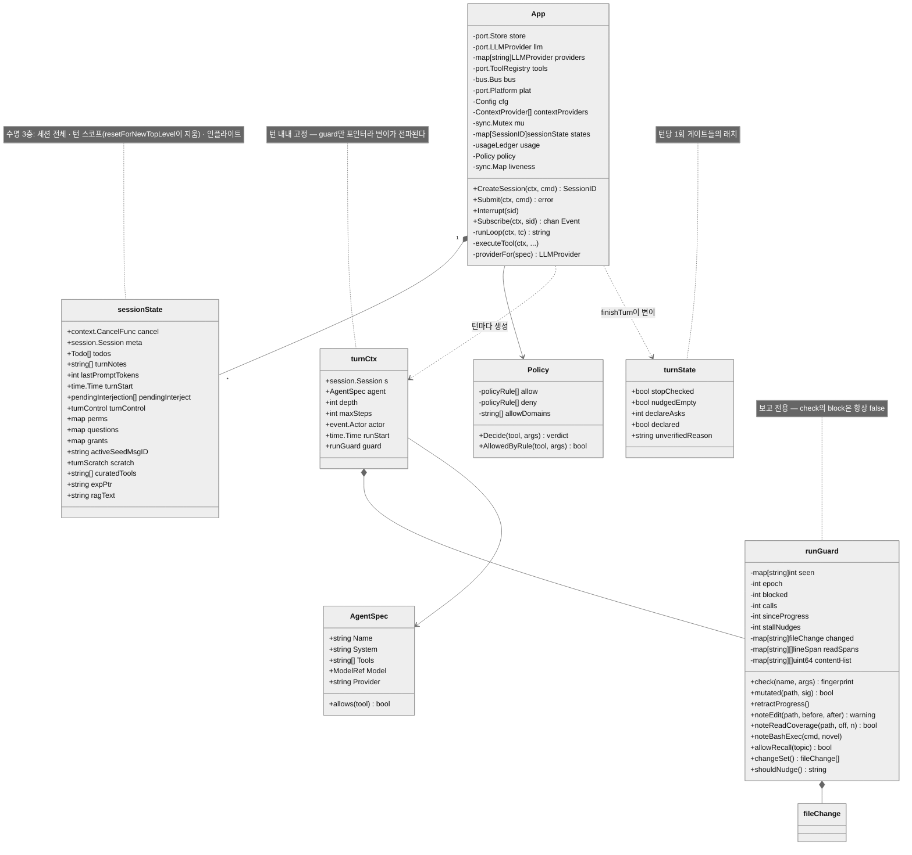
```mermaid
%%{init: {'theme':'neutral'}}%%
classDiagram
  direction TB

  class App {
    -port.Store store
    -port.LLMProvider llm
    -map[string]LLMProvider providers
    -port.ToolRegistry tools
    -bus.Bus bus
    -port.Platform plat
    -Config cfg
    -ContextProvider[] contextProviders
    -sync.Mutex mu
    -map[SessionID]sessionState states
    -usageLedger usage
    -Policy policy
    -sync.Map liveness
    +CreateSession(ctx, cmd) SessionID
    +Submit(ctx, cmd) error
    +Interrupt(sid)
    +Subscribe(ctx, sid) chan Event
    -runLoop(ctx, tc) string
    -executeTool(ctx, ...)
    -providerFor(spec) LLMProvider
  }

  class sessionState {
    +context.CancelFunc cancel
    +session.Session meta
    +Todo[] todos
    +string[] turnNotes
    +int lastPromptTokens
    +time.Time turnStart
    +pendingInterjection[] pendingInterject
    +turnControl turnControl
    +map perms
    +map questions
    +map grants
    +string activeSeedMsgID
    +turnScratch scratch
    +string[] curatedTools
    +string expPtr
    +string ragText
  }
  note for sessionState "수명 3층: 세션 전체 · 턴 스코프(resetForNewTopLevel이 지움) · 인플라이트"

  class turnCtx {
    +session.Session s
    +AgentSpec agent
    +int depth
    +int maxSteps
    +event.Actor actor
    +time.Time runStart
    +runGuard guard
  }
  note for turnCtx "턴 내내 고정 — guard만 포인터라 변이가 전파된다"
  class turnState {
    +bool stopChecked
    +bool nudgedEmpty
    +int declareAsks
    +bool declared
    +string unverifiedReason
  }
  note for turnState "턴당 1회 게이트들의 래치"
  class AgentSpec {
    +string Name
    +string System
    +string[] Tools
    +ModelRef Model
    +string Provider
    +allows(tool) bool
  }

  class runGuard {
    -map[string]int seen
    -int epoch
    -int blocked
    -int calls
    -int sinceProgress
    -int stallNudges
    -map[string]fileChange changed
    -map[string][]lineSpan readSpans
    -map[string][]uint64 contentHist
    +check(name, args) fingerprint
    +mutated(path, sig) bool
    +retractProgress()
    +noteEdit(path, before, after) warning
    +noteReadCoverage(path, off, n) bool
    +noteBashExec(cmd, novel)
    +allowRecall(topic) bool
    +changeSet() fileChange[]
    +shouldNudge() string
  }
  note for runGuard "보고 전용 — check의 block은 항상 false"
  class Policy {
    -policyRule[] allow
    -policyRule[] deny
    -string[] allowDomains
    +Decide(tool, args) verdict
    +AllowedByRule(tool, args) bool
  }

  App "1" *-- "*" sessionState
  App --> Policy
  App ..> turnCtx : 턴마다 생성
  turnCtx *-- runGuard
  turnCtx --> AgentSpec
  App ..> turnState : finishTurn이 변이
  runGuard *-- fileChange
```

읽을 때 알아둘 두 가지.

1. **`runGuard`는 턴이 아니라 런 스코프**다(`turnCtx`가 들고 있고 포인터라 변이가 전파된다).
   `epoch`는 진짜 파일 변이마다 오르고 반복 지문의 일부가 된다 — 그래서 파일이 바뀐 뒤의
   같은 명령은 "같은 콜"이 아니다.
2. **`sessionState`의 필드는 수명이 셋으로 갈린다**: 세션 전체(`meta`·`grants`·
   `deferredAbandoned`), 턴 스코프(`resetForNewTopLevel`이 지우는 것 — `turnNotes`·`scratch`·
   RAG 캐시), 그리고 인플라이트(`cancel`·`perms`). 새 필드를 넣을 때 어디에 속하는지 정하지
   않으면 지난 턴의 상태가 다음 요청으로 새는 형태로 드러난다.

---

## L8 — 툴 계층 클래스

툴은 `port.Tool` 하나로 통일된다. 실행 시 받는 `ToolEnv`가 **애플리케이션으로 향하는 유일한
통로**이며, nil 필드는 "이 런에는 그 능력이 없다"는 뜻이다.

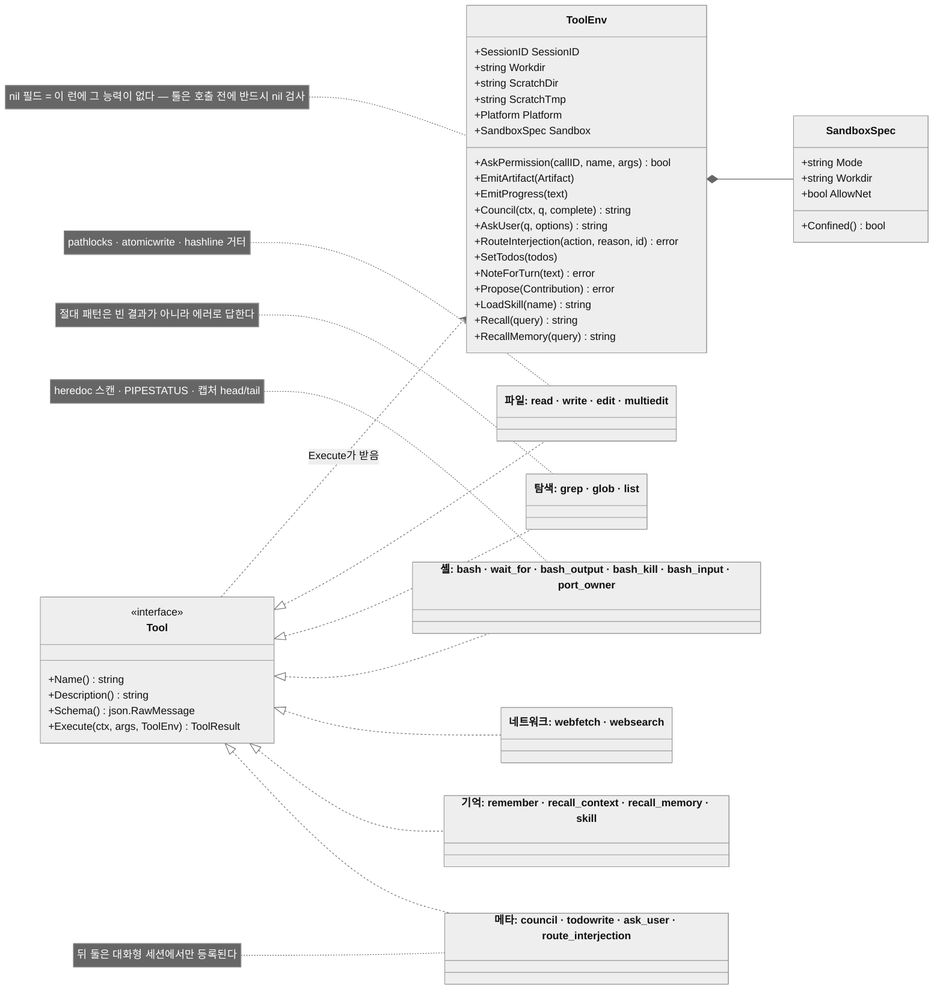
```mermaid
%%{init: {'theme':'neutral'}}%%
classDiagram
  direction LR

  class Tool {
    <<interface>>
    +Name() string
    +Description() string
    +Schema() json.RawMessage
    +Execute(ctx, args, ToolEnv) ToolResult
  }
  class ToolEnv {
    +SessionID SessionID
    +string Workdir
    +string ScratchDir
    +string ScratchTmp
    +Platform Platform
    +SandboxSpec Sandbox
    +AskPermission(callID, name, args) bool
    +EmitArtifact(Artifact)
    +EmitProgress(text)
    +Council(ctx, q, complete) string
    +AskUser(q, options) string
    +RouteInterjection(action, reason, id) error
    +SetTodos(todos)
    +NoteForTurn(text) error
    +Propose(Contribution) error
    +LoadSkill(name) string
    +Recall(query) string
    +RecallMemory(query) string
  }
  note for ToolEnv "nil 필드 = 이 런에 그 능력이 없다 — 툴은 호출 전에 반드시 nil 검사"
  class SandboxSpec {
    +string Mode
    +string Workdir
    +bool AllowNet
    +Confined() bool
  }
  ToolEnv *-- SandboxSpec
  Tool ..> ToolEnv : Execute가 받음

  class FileTools["파일: read · write · edit · multiedit"]
  note for FileTools "pathlocks · atomicwrite · hashline 거터"
  class SearchTools["탐색: grep · glob · list"]
  note for SearchTools "절대 패턴은 빈 결과가 아니라 에러로 답한다"
  class ShellTools["셸: bash · wait_for · bash_output · bash_kill · bash_input · port_owner"]
  note for ShellTools "heredoc 스캔 · PIPESTATUS · 캡처 head/tail"
  class NetTools["네트워크: webfetch · websearch"]
  class MemTools["기억: remember · recall_context · recall_memory · skill"]
  class MetaTools["메타: council · todowrite · ask_user · route_interjection"]
  note for MetaTools "뒤 둘은 대화형 세션에서만 등록된다"

  Tool <|.. FileTools
  Tool <|.. SearchTools
  Tool <|.. ShellTools
  Tool <|.. NetTools
  Tool <|.. MemTools
  Tool <|.. MetaTools
```

툴은 **21개가 항상**, `ask_user`와 `route_interjection` **2개가 대화형 세션에서만** 등록된다
(`Default()` + `RegisterOrchestration(r, headless)`). 헤드리스에서 뒤 둘을 빼는 이유는 답할 사람이
없어서만이 아니라, 절대 발화하지 않을 툴이 매 요청의 툴 목록에 무게로 실리기 때문이다.
이름 목록은 `KnownNames()` 하나로 열거된다 — 정책 코드가 툴 이름을 리터럴로 쓰는 곳들이
"아무 툴도 답하지 않는 이름"을 들고 있지 않은지 테스트가 대조할 수 있게 하기 위해서다.

**LSP는 툴이 아니다.** `lsp_diagnose`라는 이름으로 등록된 것은 없고, 편집이 끝난 뒤 앱이
`AutoDiagnose`(`app/diagnose.go` → `builtin/lsppool.go`)를 돌려 그 결과를 **툴 결과에 덧붙인다**.
모델이 부르는 능력이 아니라 magi가 얹어 주는 관측이라서, 부르지 않아도 도착한다.

`bash` 계열이 파일 수로도 로직으로도 가장 무겁다. 그 무게의 대부분은 실행이 아니라 **셸 텍스트를
사실대로 읽는 일**에 있다 — `heredoc.go`의 `scanShellLine`이 한 번 훑어서 detach `&`와 heredoc
본문을 동시에 판정하고, `maskNonShell`이 따옴표 안·주석·heredoc 본문을 **길이를 보존한 채** 가려서
정규식이 찾은 위치를 원문에서 그대로 인용할 수 있게 한다. 이게 없으면
`python3 -c "print('done | tail -3')"` 같은 명령에 "네 종료코드는 페이저 것"이라는 거짓 주석이 붙는다.

---

## L9 — 툴 콜 한 번의 시퀀스

L1이 턴을, L9는 그 안의 툴 콜 **하나**를 확대한다. 게이트 순서와 "누가 무엇을 기록하는가"가 요점이다.

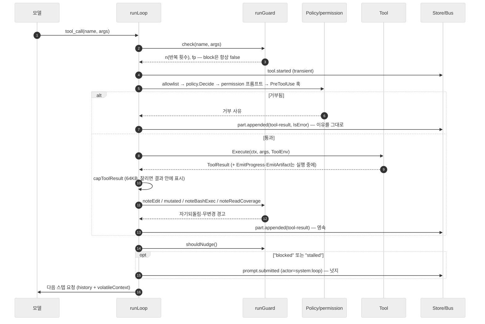
```mermaid
%%{init: {'theme':'neutral'}}%%
sequenceDiagram
  autonumber
  participant M as 모델
  participant L as runLoop
  participant G as runGuard
  participant P as Policy/permission
  participant T as Tool
  participant S as Store/Bus

  M->>L: tool_call(name, args)
  L->>G: check(name, args)
  G-->>L: n(반복 횟수), fp — block은 항상 false
  L->>S: tool.started (transient)
  L->>P: allowlist → policy.Decide → permission 프롬프트 → PreToolUse 훅
  alt 거부됨
    P-->>L: 거부 사유
    L->>S: part.appended(tool-result, IsError) — 이유를 그대로
  else 통과
    L->>T: Execute(ctx, args, ToolEnv)
    T-->>L: ToolResult (+ EmitProgress·EmitArtifact는 실행 중에)
    L->>L: capToolResult (64KB, 잘리면 결과 안에 표시)
    L->>G: noteEdit / mutated / noteBashExec / noteReadCoverage
    G-->>L: 자기되돌림·무변경 경고
    L->>S: part.appended(tool-result) — 영속
  end
  L->>G: shouldNudge()
  opt "blocked" 또는 "stalled"
    L->>S: prompt.submitted (actor=system:loop) — 넛지
  end
  L->>M: 다음 스텝 요청 (history + volatileContext)
```

시퀀스에서 읽어야 할 계약 셋:

- **거부도 결과다.** 게이트가 막으면 조용히 사라지지 않고 사유를 담은 tool-result가 기록된다 —
  모델이 무엇에 막혔는지 모르면 같은 것을 다시 시도한다.
- **자르면 자른 자리에 표시한다.** `capToolResult`, 캡처 head/tail, 증거 블록의 누락 꼬리,
  압축 요약의 미완 표시가 전부 같은 규칙이다. 읽는 쪽은 **없는 줄 모르는 것을 되물을 수 없다.**
- **넛지는 `prompt.submitted`다** — actor가 `{system, loop}`이지 `part.appended`가 아니다.
  로그를 파싱해 넛지를 세려면 이 액터로 걸러야 한다.

---

## L10 — 콘솔, 시퀀스로

L0.5가 프로세스를 그린다면 여기는 **프로세스 사이에서 일어나는 일**을 일어나는 순서대로 그린다. 전부
사람이 실제로 조작하는 경로이고, 전부 한 번씩은 틀렸던 모양이며, 지금은 테스트가 붙잡고 있다. 각각을
찾아낸 실측은 그 수정 커밋에 적혀 있다.

### L10.1 — 창 하나에 스트림 하나

브라우저는 한 호스트에 연결 6개까지만 열고 스트림은 끝나지 않는다. 콘솔 창 하나가 둘(대화·로스터)을
잡고 있었으므로 창 3개가 예산 전부를 먹었고, 모든 창의 일반 요청이 끝나지 않을 스트림 뒤에 줄을 섰다
(실측: 창 3개에서 세 번째 창의 첫 fetch가 영영 돌아오지 않음). 숨은 탭은 스트림을 반납한다 — 아무도
그리지 않는 문서에 보내는 프레임은 버려지는 일이다.

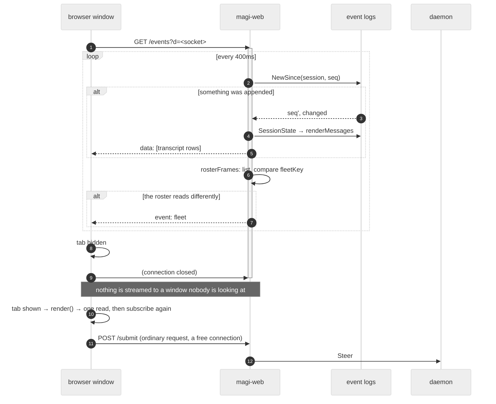
```mermaid
%%{init: {'theme':'neutral'}}%%
sequenceDiagram
  autonumber
  participant B as browser window
  participant W as magi-web
  participant L as event logs
  participant D as daemon

  B->>W: GET /events?d=<socket>
  activate W
  loop every 400ms
    W->>L: NewSince(session, seq)
    alt something was appended
      L-->>W: seq', changed
      W->>L: SessionState → renderMessages
      W-->>B: data: [transcript rows]
    end
    W->>W: rosterFrames: list, compare fleetKey
    alt the roster reads differently
      W-->>B: event: fleet
    end
  end
  B->>B: tab hidden
  B->>W: (connection closed)
  deactivate W
  Note over B,W: nothing is streamed to a window nobody is looking at
  B->>B: tab shown → render() → one read, then subscribe again
  B->>W: POST /submit (ordinary request, a free connection)
  W->>D: Steer
```

### L10.2 — 모델을 도는 호출이 컴패니언 전체를 잠그지 않는다

콘솔은 데몬당 클라이언트 하나를 유지하고, 클라이언트는 왕복 전체에 뮤텍스를 잡는다. 모델을 도는
호출은 그동안 그 컴패니언에 대해 아무것도 물을 수 없는 시간이었다 — 실측으로 파일 트리 2.7초, 유휴일
때 0.6밀리초. 모델을 도는 다섯은 자기 연결을 열고 닫으며, 데몬은 연결마다 고루틴을 띄운다.

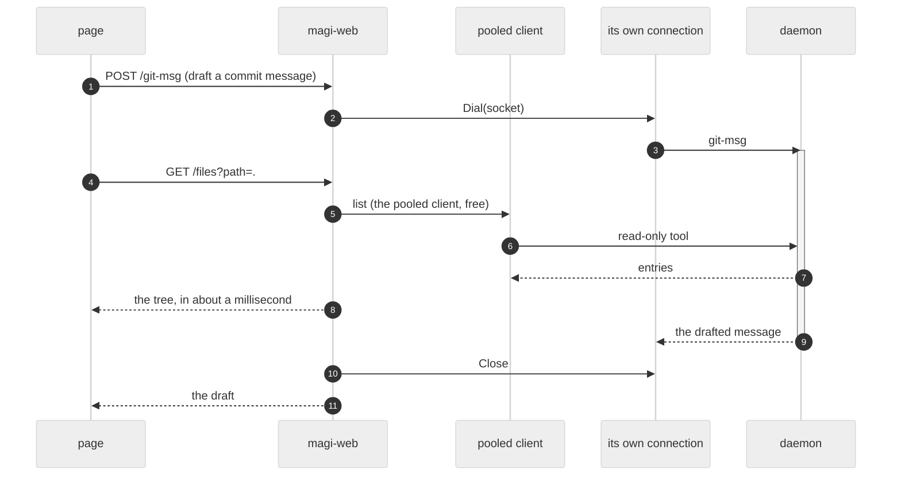
```mermaid
%%{init: {'theme':'neutral'}}%%
sequenceDiagram
  autonumber
  participant P as page
  participant W as magi-web
  participant C1 as pooled client
  participant C2 as its own connection
  participant D as daemon

  P->>W: POST /git-msg (draft a commit message)
  W->>C2: Dial(socket)
  C2->>D: git-msg
  activate D
  P->>W: GET /files?path=.
  W->>C1: list (the pooled client, free)
  C1->>D: read-only tool
  D-->>C1: entries
  W-->>P: the tree, in about a millisecond
  D-->>C2: the drafted message
  deactivate D
  W->>C2: Close
  W-->>P: the draft
```

### L10.3 — 일을 넘기기, 그리고 질문하기

쓸 수 있는 요청은 워크스페이스를 기다린다: 한 트리에서 두 턴은 같은 파일을 고치는 두 에이전트다.
`looking`으로 표시된 요청은 역할이 툴을 읽기 전용 넷으로 고정하는 세션에서 돌므로 충돌할 것이 없고,
워크스페이스가 바쁜 동안에도 시작된다. **선언은 요청자가, 강제는 수신자가** 한다.

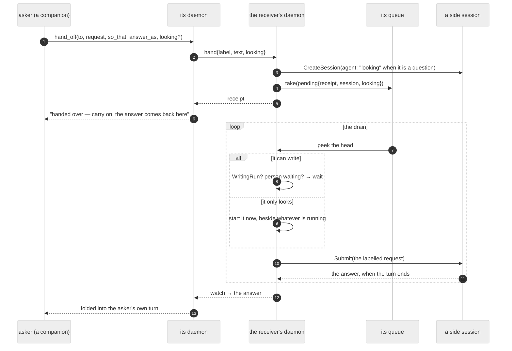
```mermaid
%%{init: {'theme':'neutral'}}%%
sequenceDiagram
  autonumber
  participant A as asker (a companion)
  participant DA as its daemon
  participant DB as the receiver's daemon
  participant Q as its queue
  participant S as a side session

  A->>DA: hand_off(to, request, so_that, answer_as, looking?)
  DA->>DB: hand{label, text, looking}
  DB->>S: CreateSession(agent: "looking" when it is a question)
  DB->>Q: take(pending{receipt, session, looking})
  DB-->>DA: receipt
  DA-->>A: "handed over — carry on, the answer comes back here"
  loop the drain
    Q->>DB: peek the head
    alt it can write
      DB->>DB: WritingRun? person waiting? → wait
    else it only looks
      DB->>DB: start it now, beside whatever is running
    end
    DB->>S: Submit(the labelled request)
    S-->>DB: the answer, when the turn ends
  end
  DB-->>DA: watch → the answer
  DA-->>A: folded into the asker's own turn
```

### L10.4 — 회의: 소집에서 업무 배분까지

의장이 콘솔인 이유는 하나다 — 순서를 정하는 참가자는 자기가 논쟁하는 회의를 진행하는 셈이다. 준비는
전원 동시에 하고, 준비하지 못한 참가자가 방을 붙잡지 않는다.

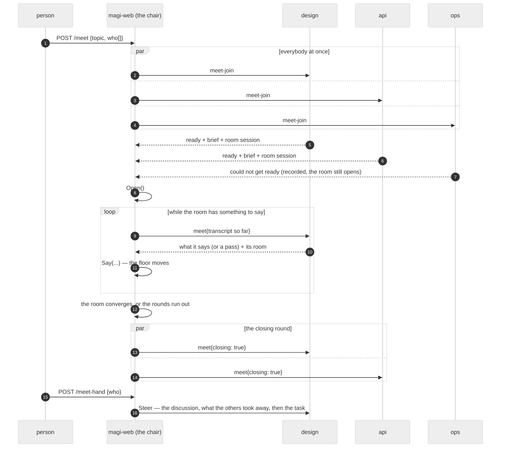
```mermaid
%%{init: {'theme':'neutral'}}%%
sequenceDiagram
  autonumber
  participant U as person
  participant W as magi-web (the chair)
  participant D1 as design
  participant D2 as api
  participant D3 as ops

  U->>W: POST /meet {topic, who[]}
  par everybody at once
    W->>D1: meet-join
    and
    W->>D2: meet-join
    and
    W->>D3: meet-join
  end
  D1-->>W: ready + brief + room session
  D2-->>W: ready + brief + room session
  D3-->>W: could not get ready (recorded, the room still opens)
  W->>W: Open()
  loop while the room has something to say
    W->>D1: meet{transcript so far}
    D1-->>W: what it says (or a pass) + its room
    W->>W: Say(...) — the floor moves
  end
  W->>W: the room converges, or the rounds run out
  par the closing round
    W->>D1: meet{closing: true}
    and
    W->>D2: meet{closing: true}
  end
  U->>W: POST /meet-hand {who}
  W->>D1: Steer — the discussion, what the others took away, then the task
```

### L10.5 — 각 참가자가 지금 무엇을 생각하는지

데몬들은 방 대화를 콘솔이 읽는 같은 저장소에 쓴다. 회의 스트림이 그것을 **합쳐서** 나른다: 네 개의
대화를 보는 화면에 연결은 하나.

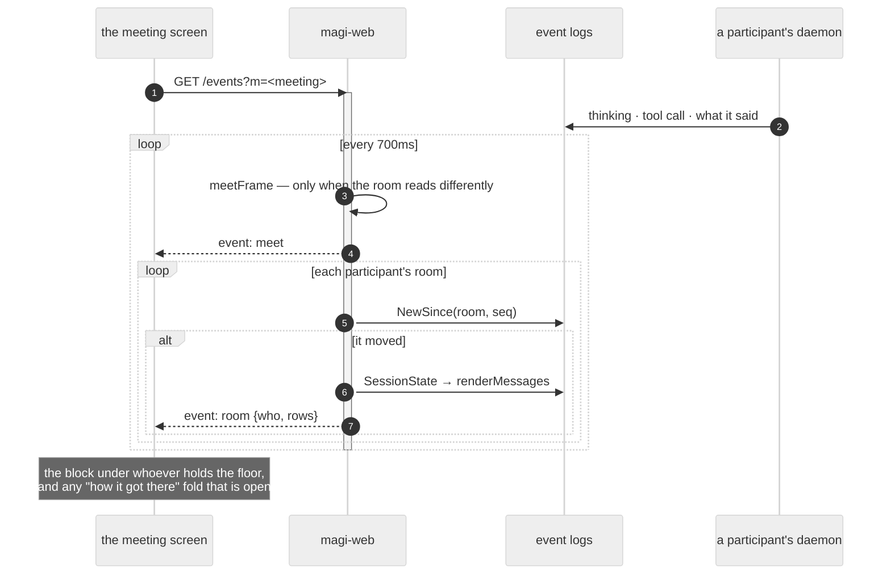
```mermaid
%%{init: {'theme':'neutral'}}%%
sequenceDiagram
  autonumber
  participant P as the meeting screen
  participant W as magi-web
  participant L as event logs
  participant D as a participant's daemon

  P->>W: GET /events?m=<meeting>
  activate W
  D->>L: thinking · tool call · what it said
  loop every 700ms
    W->>W: meetFrame — only when the room reads differently
    W-->>P: event: meet
    loop each participant's room
      W->>L: NewSince(room, seq)
      alt it moved
        W->>L: SessionState → renderMessages
        W-->>P: event: room {who, rows}
      end
    end
  end
  deactivate W
  Note over P: the block under whoever holds the floor,<br/>and any "how it got there" fold that is open
```

### L10.6 — 워크스페이스: 레이지, 보관, 그리고 강제 재조회

요청당 디렉토리 하나, 펼친 폴더만. **변화를 따라온** 순회는 읽고, 단순 재그리기는 10초 안에 읽은 것을
쓴다. 이 콘솔이 한 변경은 보관분을 나이가 아니라 오답으로 보고 즉시 버린다.

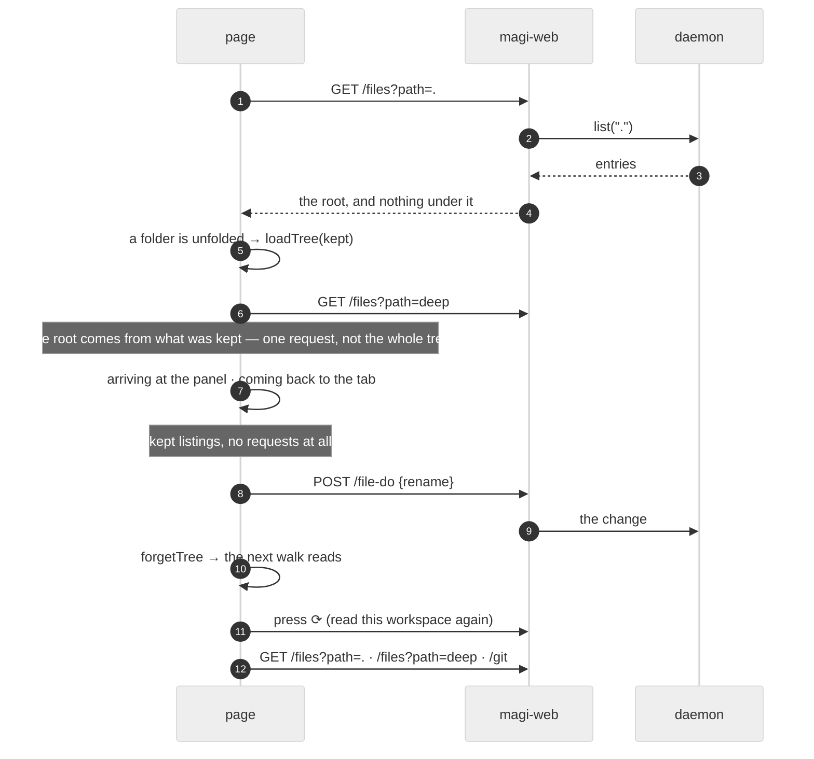
```mermaid
%%{init: {'theme':'neutral'}}%%
sequenceDiagram
  autonumber
  participant P as page
  participant W as magi-web
  participant D as daemon

  P->>W: GET /files?path=.
  W->>D: list(".")
  D-->>W: entries
  W-->>P: the root, and nothing under it
  P->>P: a folder is unfolded → loadTree(kept)
  P->>W: GET /files?path=deep
  Note over P: the root comes from what was kept — one request, not the whole tree
  P->>P: arriving at the panel · coming back to the tab
  Note over P: kept listings, no requests at all
  P->>W: POST /file-do {rename}
  W->>D: the change
  P->>P: forgetTree → the next walk reads
  P->>W: press ⟳ (read this workspace again)
  P->>W: GET /files?path=. · /files?path=deep · /git
```

### L10.7 — 막힌 컴패니언에게 답하기

프롬프트는 로그에 없다 — 무엇이 일어났는지의 기록이 아니라 무엇을 해야 하는지의 질문이라서 — 그래서
로스터 프레임에 실려 온다. 답은 물어본 데몬에게 콜 id로 간다.

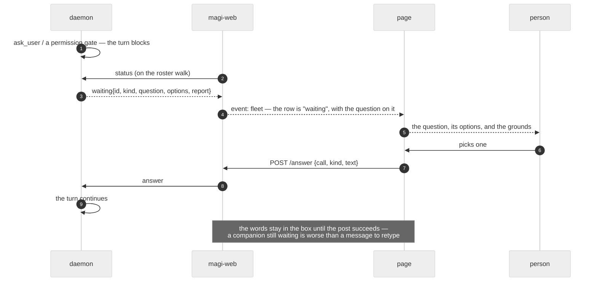
```mermaid
%%{init: {'theme':'neutral'}}%%
sequenceDiagram
  autonumber
  participant D as daemon
  participant W as magi-web
  participant P as page
  participant U as person

  D->>D: ask_user / a permission gate — the turn blocks
  W->>D: status (on the roster walk)
  D-->>W: waiting{id, kind, question, options, report}
  W-->>P: event: fleet — the row is "waiting", with the question on it
  P-->>U: the question, its options, and the grounds
  U->>P: picks one
  P->>W: POST /answer {call, kind, text}
  W->>D: answer
  D->>D: the turn continues
  Note over P,W: the words stay in the box until the post succeeds —<br/>a companion still waiting is worse than a message to retype
```

---

## 부록 — A/B 플래그 기본값 (`plan_flags.go`)

| 플래그 | 기본 | 제어 대상 |
|---|---|---|
| `MAGI_DECLARE_FINISH` | ON | 종료를 **선언 행위**로 요구(`council{complete:true}`); off면 모델이 툴 호출을 멈추는 수동적 종료로 복귀 |
| `MAGI_COUNCIL_DEBATE` | ON | 불일치 시 1회 반박 라운드; off면 독립 투표 집계만 |
| `MAGI_STALL_NOVELTY` | ON | **새로운** 조사 명령(처음 보는 read/grep)을 전진으로 인정해 정체 창을 한 번 더 줌; off면 뮤테이션만 전진 |
| `MAGI_CTX_COMPACT_RETRY` | ON | 컨텍스트 초과 시 압축 후 재시도 |
| `MAGI_EXITCODE_BODYSCAN` | ON | bash exit-0 크래시/마스킹 주석 (`tool/builtin`) |
| `MAGI_REPEAT_CAP` | ON | degenerate 반복(같은 문장/단어 무한) 안전망 (`provider_guard`) |
| `MAGI_STREAM_STALL` · `MAGI_FIRST_TOKEN` | 120s · 300s | generate의 토큰-간 freeze 한도(0=비활성) · 첫토큰 전(prefill) 한도(0=별도 한도 없음); 가드는 둘 중 큰 쪽의 2배, 카운슬 멤버 데드라인은 첫토큰 값을 더함 |
| `MAGI_CHECK_TIMEOUT` | — | 워크플로 verify 타임아웃(0=off) |
| `MAGI_SPIN_CAP` | 400KB | reasoning-only spin 상한(guardedProvider는 2×) |
| `MAGI_SELFKILL_GUARD` | ON | 프롬프트 단어로 자기 프로세스를 죽이는 `pkill -f` 차단 |
| `MAGI_COUNCIL_KEEP` | ON | 위원이 **유지할 부분**도 함께 지목(자문, 결정·집계엔 무영향); off면 고칠 것만 |
| `MAGI_TERSE_STEPS` | OFF | 스텝마다 한 줄 서사를 요구하던 문구를 뺀 프롬프트 |

이 표는 **행동을 바꾸는 A/B 스위치**만 싣는다(플래그 이름이 CLI 옵션과 1:1인 환경변수 —
`MAGI_MODEL`·`MAGI_BASE_URL`·`MAGI_PERMISSION` 등 — 은 ARCHITECTURE §9, 터미널 폭 프로브와
디버그 스위치는 제외). 그리고 **실제로 읽히는 것만** 싣는다. 코드가 더 이상 읽지 않는데 표에 남아 있던 넷 —
`MAGI_STUCK_DECOMPOSE` · `MAGI_RECOVERY_RUNCAP` · `MAGI_GUARD_EXEC_EXEMPT` ·
`MAGI_EXERCISE_CHURN_CAP`·`MAGI_STALL_CONVERGE` — 은 L3의 강제종료 경로와 함께 사라졌다.
(마지막 것은 그 경로보다 오래 살아남아 있었다: 붕괴가 넘겨주려던 `stuck()`이 없어진 뒤로는 남은
정체 넛지를 침묵시키는 일만 했다 — 실측 126콜·60분에 넛지 2회.) 목록을 갱신하려면
`Getenv("MAGI_`/`envOff(`/`envOn(` 를 grep해서 대조하면 된다; 광고와 구현이 갈라지는 것은 이
저장소가 반복해서 겪은 결함 유형이라, 없는 손잡이를 문서가 광고하는 쪽이 없는 것보다 나쁘다.
**그 반대 방향도 같은 결함이다**: `MAGI_COUNCIL_KEEP`은 소스 주석이 광고하는데 **읽는 코드가
없어** 기능 전체가 도달 불가였고(어댑터·파서·TUI 렌더는 다 살아 있었다), 이 대조로 찾아 배선을
되살렸다. 같은 대조에서 `MAGI_STEP_VERIFY`·`MAGI_MAX_PLAN_DEPTH`도 읽는 곳 없이 주석에만
남아 있어 그 주석과 딸린 죽은 필드를 걷어냈다.
