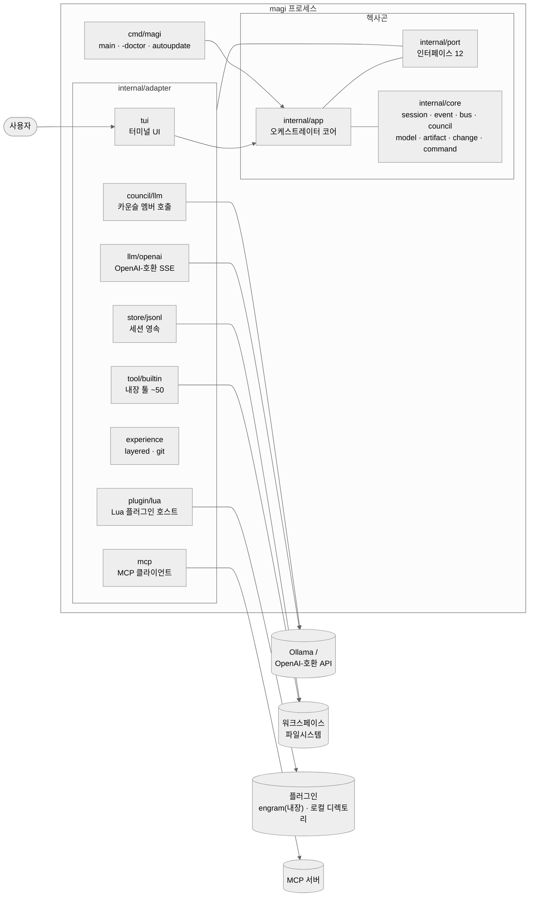
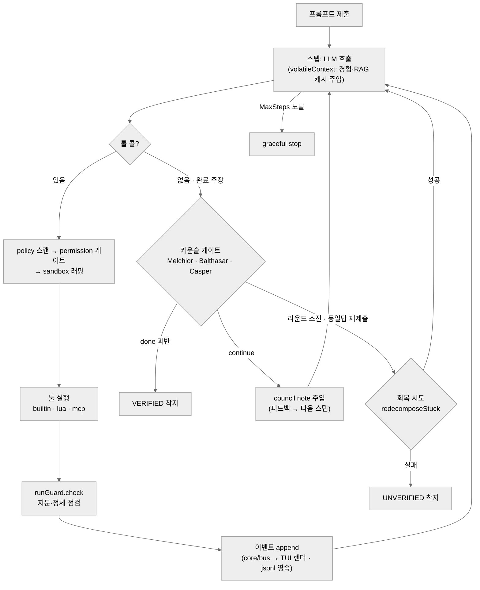
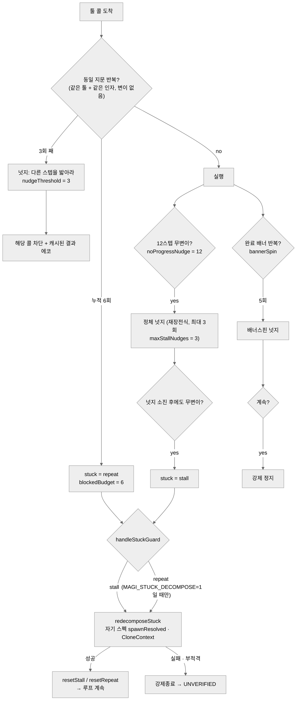

# magi 시스템 구조도

[ARCHITECTURE.md](ARCHITECTURE.md)의 시각 요약 — 탑레벨(L0)에서 컴포넌트(L2), 하네스 개입 절차(L3)까지.
GitHub이 mermaid를 직접 렌더한다. 임계값·기본값은 전부 코드가 진실이며(`guard.go` 상수,
`plan_flags.go`), 이 문서는 그걸 옮겨 적은 것이다.

---

## L0 — 탑레벨: 프로세스와 경계

모든 외부 접촉은 `internal/port`의 인터페이스(12개)를 거친다. `internal/app`(오케스트레이터 코어)은
어댑터 구현을 모른 채 포트만 호출하고, `cmd/magi`가 기동 시 배선한다(헥사고날).

## L1 — 턴 라이프사이클: 요청에서 착지까지

한 턴은 스텝 루프다(`loop.go runLoop`): LLM 호출 → 툴 실행 → 가드 점검을 반복하다가, 모델이 완료를
주장하면 카운슬 게이트가 증거로 판정한다. 승인 없는 종료는 `UNVERIFIED`로 정직하게 착지한다.

## L2 — app 코어: 컴포넌트 맵 (`internal/app`, 50 files)

| 그룹 | 역할 | 파일 |
|---|---|---|
| **LOOP** | 턴 구동, 스트리밍, 인터젝션 감지, 종료 게이트 | `loop` · `loop_gates` · `loop_stream` · `loop_helpers` · `loopmap` · `interject` · `interject_queue` |
| **PLAN** | ADaPT 재귀 분해, solo 우선(delegate off 기본), 플랜 감사 | `planner` · `plan_execute` · `plan_audit` · `plan_scout` · `plan_prompts` · `plan_flags` · `orient` · `step_verify`(기본 OFF) · `todos` |
| **COUNCIL** | 3인 카운슬이 툴 증거만으로 완료 판정(서사 불인정) | `council_gate` · `council_evidence` · `council_means` · `criteria` · `concern` |
| **GUARD** | 반복·정체·배너스핀 탐지, 넛지→차단→강제종료 에스컬레이션 | `guard`(repeat 지문 · noProgress · bannerSpin) · unverifiedDeliverable 구조 신호 |
| **ORCH** | 서브에이전트 스폰·결과 주입·심판; 회복은 자기 스펙 직접 스폰 | `orchestrate` · `fork` · `subagent_cap` · `subagent_judge` · `workflow` · `execute` |
| **CTX** | 컨텍스트 창 관리, 압축, 경험 저장/회수 | `context_window` · `context_view` · `compact` · `memory` · `recall` · `repo_context` · `query` · `reconstruct` |
| **IO** | 권한·정책·훅·명령 라우팅 | `permission` · `policy` · `hooks` · `routing` · `shellcmd` · `skills` · `prompt` · `diagnose` |
| **EXT** | Lua 플러그인에 노출되는 앱 API | `app_plugin_api` · `app_emit` · `app_report` · `app_state` |

## L3 — 하네스 개입 절차: 넛지와 게이트의 순서

개입은 **조언(넛지) → 차단 → 구조적 회복 → 강제종료** 순으로 에스컬레이션한다.
임계값은 전부 `guard.go` 상수다.

완료 주장 시엔 L1의 카운슬 게이트가 이어진다: 증거 스캔(최근 툴 결과 8건 · 항목당 4000B 클립,
지식조회 실패 미회복 시 재부상 신호) → 3멤버 VERDICT → 과반. continue면 피드백이 `council note`로
다음 스텝에 주입되고, 동일 답 재제출이 감지되면 회복 1회 후 UNVERIFIED로 착지한다. bash 툴 자체도
exit 0에 크래시 시그니처나 종료코드-무마 꼬리(`|| true` 등)가 보이면 결과 머리에 경고 주석을 단다
(`MAGI_EXITCODE_BODYSCAN`, MANUAL §가드 참고).

## 부록 — A/B 플래그 기본값 (`plan_flags.go`)

| 플래그 | 기본 | 제어 대상 |
|---|---|---|
| `MAGI_STEP_VERIFY` | OFF | 플랜타임 검증계획 → 전량통과 시 카운슬 스킵 (회귀 bisect로 OFF) |
| `MAGI_STUCK_DECOMPOSE` | OFF | repeat-차단 시 TODO 분해 회복 (회귀 bisect로 OFF) |
| `MAGI_RECOVERY_RUNCAP` | OFF | 런 트리당 회복실행 1회 제한 |
| `MAGI_ORIENT` | ON | explore-first 그라운딩 |
| `MAGI_SPEC_FIDELITY` | ON | 스펙 축어성 보존 노트 (카운슬 렌즈와 별개 기능) |
| `MAGI_IMPLICIT_ACCEPT` | ON | 숨은 수용조건 계획 |
| `MAGI_GUARD_EXEC_EXEMPT` | ON | exec 계열 반복의 하드차단 면제 |
| `MAGI_WAIT_GUARD` | ON | 대기(`wait_for`) 중 가드 관용 |
| `MAGI_REFINE` · `MAGI_REFINE_SHARED` | ON | 리파인 패턴 · 세션 공유 |
| `MAGI_ADAPT` | ON | ADaPT 반응형 재분해 |
| `MAGI_PLAN_CONVERGE` · `MAGI_STALL_CONVERGE` | ON | 플랜/정체 수렴 가속 |
| `MAGI_SOLO_AUDIT` · `MAGI_CHECKPOINT_FIRST` · `MAGI_STEP_CONTEXT` · `MAGI_ASYNC_EXPLORERS` | ON | 솔로 감사 · 체크포인트 우선 · 스텝 컨텍스트 · 비동기 탐색 |
| `MAGI_EXITCODE_BODYSCAN` | ON | bash exit-0 크래시/마스킹 주석 (`tool/builtin`) |
