# magi — System diagrams

[English](DIAGRAMS.md) · [한국어](DIAGRAMS.ko.md) · [↑ Docs](README.md)

> **Current reference.** The visual companion to ARCHITECTURE — one axis, from the process boundary down to the class diagrams. All mermaid.

The visual summary of [ARCHITECTURE.md](ARCHITECTURE.md). **One axis, from the top level (L0) down
to the class diagrams (L5–L9):**

| Layer | What it shows | Unit |
|---|---|---|
| [L0](#l0--top-level-the-process-and-its-boundaries) | the process and its boundaries | package groups |
| [L1](#l1--the-life-of-a-turn-request-to-landing) | one turn's life | phases |
| [L2](#l2--the-app-core-component-map-internalapp) | the `internal/app` component map | files |
| [L3](#l3--the-guard-reports-it-does-not-decide) · [L4](#l4--stopping-hangs-spins-and-repetition-the-model-io-guard) | the intervention procedure and the I/O guard | signals |
| [L5](#l5--core-domain-classes-internalcore) | the core domain | **types** |
| [L6](#l6--ports-and-adapters-interface--implementation) | ports ↔ adapters | **interfaces** |
| [L7](#l7--app-core-classes-internalapp) | inside `internal/app` | **structs and methods** |
| [L8](#l8--the-tool-layer) | the tool layer | **interfaces and implementations** |
| [L9](#l9--one-tool-call-as-a-sequence) | one tool call | **call order** |
| [L10](#l10--the-console-as-sequences) | the console's own paths — streams, hand-offs, meetings, the workspace | **call order** |

GitHub renders mermaid directly. Every threshold and default is the code's to state (the constants
in `guard.go`, `plan_flags.go`); this document copies them. The class diagrams do **not** carry every
field — only the ones that decide why the type exists, with the file named for the rest.

---

## L0 — Top level: the process and its boundaries

Every outward contact goes through one of the twelve interfaces in `internal/port`.
`internal/app` (the orchestrator core) calls only ports, knowing nothing of the adapter
implementations, and `cmd/magi` wires them at startup (hexagonal).

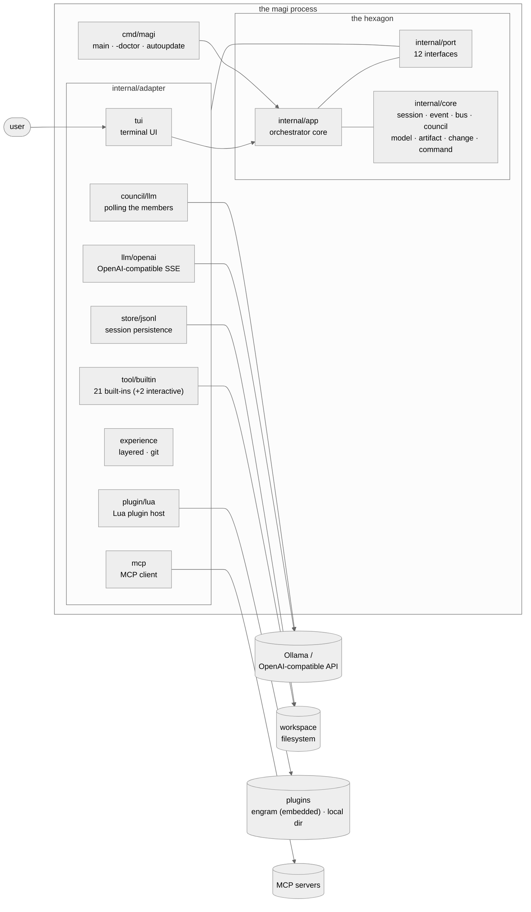
```mermaid
%%{init: {'theme':'neutral','flowchart':{'curve':'basis'}}}%%
flowchart LR
  user(["user"])
  subgraph proc["the magi process"]
    direction LR
    cmd["cmd/magi<br/>main · -doctor · autoupdate"]
    subgraph hex["the hexagon"]
      app["internal/app<br/>orchestrator core"]
      port["internal/port<br/>12 interfaces"]
      core["internal/core<br/>session · event · bus · council<br/>model · artifact · change · command"]
    end
    subgraph adp["internal/adapter"]
      tui["tui<br/>terminal UI"]
      llm["llm/openai<br/>OpenAI-compatible SSE"]
      tools["tool/builtin<br/>21 built-ins (+2 interactive)"]
      lua["plugin/lua<br/>Lua plugin host"]
      council["council/llm<br/>polling the members"]
      exp["experience<br/>layered · git"]
      store["store/jsonl<br/>session persistence"]
      mcp["mcp<br/>MCP client"]
    end
  end
  ollama[("Ollama /<br/>OpenAI-compatible API")]
  ws[("workspace<br/>filesystem")]
  plug[("plugins<br/>engram (embedded) · local dir")]
  mcpsrv[("MCP servers")]

  user --> tui --> app
  cmd --> app
  app --- port
  app --- core
  port --- adp
  llm --> ollama
  council --> ollama
  tools --> ws
  lua --> plug
  mcp --> mcpsrv
  store --> ws
```

## L0.5 — More than one process: daemon, console, peers

L0 is one process. It is still exactly right for `magi` in a terminal — and it is no longer the
whole picture: the engine can run with no UI, and other processes read the same store and drive it
over a socket. Nothing here is a new engine. `magi-web` builds an `app.App` with **no LLM and no
tools**, so the only thing that can run a turn is the daemon.

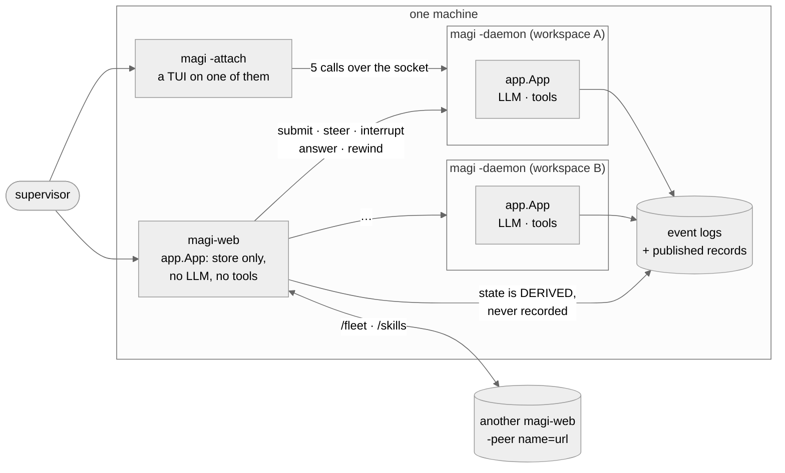
```mermaid
%%{init: {'theme':'neutral','flowchart':{'curve':'basis'}}}%%
flowchart LR
  supervisor(["supervisor"])
  subgraph machine["one machine"]
    direction TB
    subgraph d1["magi -daemon (workspace A)"]
      a1["app.App<br/>LLM · tools"]
    end
    subgraph d2["magi -daemon (workspace B)"]
      a2["app.App<br/>LLM · tools"]
    end
    attach["magi -attach<br/>a TUI on one of them"]
    web["magi-web<br/>app.App: store only,<br/>no LLM, no tools"]
    logs[("event logs<br/>+ published records")]
  end
  peer[("another magi-web<br/>-peer name=url")]

  supervisor --> web
  supervisor --> attach
  attach -->|"5 calls over the socket"| d1
  web -->|"submit · steer · interrupt<br/>answer · rewind"| d1
  web -->|"…"| d2
  a1 --> logs
  a2 --> logs
  web -->|"state is DERIVED,<br/>never recorded"| logs
  web <-->|"/fleet · /skills"| peer
```

- The socket a daemon listens on is named from its workspace's real path, so "the daemon here" is
  unambiguous and a flock makes it unique.
- Everything the console shows about a companion — what it is doing, whether it is blocked, what a
  person had to say mid-turn, how full its context is — is read out of those logs. No status file
  exists to go stale.
- A peer is another console, reached exactly as a browser reaches this one. Federation adds no
  protocol.

## L1 — The life of a turn: request to landing

A turn is a step loop (`loop.go runLoop`): call the LLM, run the tools, check the guard, repeat.
**There is no step ceiling.** A turn ends when the agent declares completion with
`council{complete: true}` and the council accepts, when the model simply stops calling tools, or
when the context is cancelled. Ending without a declaration lands honestly as `UNVERIFIED`.

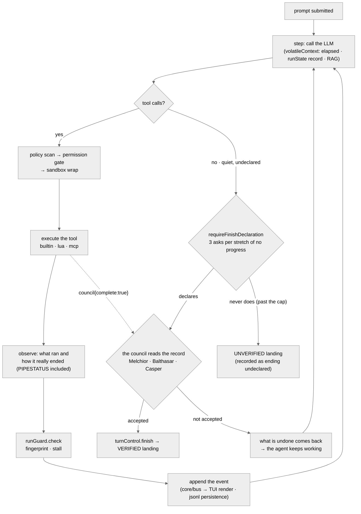
```mermaid
%%{init: {'theme':'neutral','flowchart':{'curve':'basis'}}}%%
flowchart TD
  P["prompt submitted"] --> S["step: call the LLM<br/>(volatileContext: elapsed · runState record · RAG)"]
  S --> T{"tool calls?"}
  T -- "yes" --> POL["policy scan → permission gate<br/>→ sandbox wrap"]
  POL --> EX["execute the tool<br/>builtin · lua · mcp"]
  EX --> OB["observe: what ran and<br/>how it really ended (PIPESTATUS included)"]
  OB --> G["runGuard.check<br/>fingerprint · stall"]
  G --> EV["append the event<br/>(core/bus → TUI render · jsonl persistence)"]
  EV --> S
  EX -. "council{complete:true}" .-> CG{"the council reads the record<br/>Melchior · Balthasar · Casper"}
  CG -- "accepted" --> FIN["turnControl.finish → VERIFIED landing"]
  CG -- "not accepted" --> FB["what is undone comes back<br/>→ the agent keeps working"]
  FB --> S
  T -- "no · quiet, undeclared" --> RQ{"requireFinishDeclaration<br/>3 asks per stretch of no progress"}
  RQ -- "declares" --> CG
  RQ -- "never does (past the cap)" --> U["UNVERIFIED landing<br/>(recorded as ending undeclared)"]
```

## L2 — The app core: component map (`internal/app`)

| Group | Role | Files |
|---|---|---|
| **LOOP** | driving the turn, streaming, spotting interjections, the finish path (demanding the declaration) | `loop` · `loop_gates` · `loop_stream` (stall, reasoningSpin) · `loop_helpers` · `generate_step` · `loopmap` · `interject` · `interject_queue` · `inject` · `reask` · `todos` · `config` · `plan_flags` (the A/B flags — the name is a leftover of the planner era) · `usage_meter` |
| **RECORD** | what magi observed — what ran, how it really ended, and what the workspace holds now | `observed` (the observed verdict, with the PIPESTATUS note folded in) · `observed_view` (the panel's form) · `world_snapshot` (the fresh read at a declaration, live jobs, paths recorded as written but absent from disk) · `background` (the background-job registry and its tail) · `tool_outcome` |
| **COUNCIL** | the three the agent calls with the `council` tool: a question, or a finish declaration | `council_advice` (assembling the evidence, deliberating, signalling finish on `complete`) · `council_events` (`councilParams`) · `council_evidence` · `council_gate` (constants, `fmtElapsed`) |
| **GUARD** | stopping hangs and spins in the model I/O (one chokepoint) plus observing tool-call repeats, stalls, self-reverts and exercise churn. **What it observes it says as a nudge; it does not stop the run** (L3) | `provider_guard` (idle, byte-spin and **repetition** safety net over every model request) · `guard` (the repeat fingerprint, sinceProgress, noteEdit self-reverts, the exercise ledger) · `liveness` |
| **CTX** | context window management, compaction, storing and retrieving experience | `context_window` · `context_view` · `compact` · `memory` · `recall` · `query` · `reconstruct` |
| **IO** | permission, policy, hooks, command routing, workflow | `permission` · `policy` · `hooks` · `routing` · `shellcmd` · `shellparse` · `skills` · `prompt` · `diagnose` · `execute` · `workflow` · `fork` · `scratch` |
| **EXT** | the app API exposed to Lua plugins | `app_plugin_api` · `app_emit` · `app_state` |

## L3 — The guard reports, it does not decide

**This layer was inverted once.** The old structure escalated: advise (nudge) → block → structural
recovery → force-stop. Measurement denied it. Across every recorded trial, the 28 runs magi stopped
itself produced no pass at all, and 8 of those were never even scored (a nonzero exit reads to the
caller as "the agent failed to run", not "the agent decided to stop"). The 396 runs that instead
reached the external deadline were all scored, and 76 of them passed.

So **every signal it counted is still counted and still said; only magi ending the run on its own
reading of them is gone.** In a form you can check against the code:

- `runGuard.check()` returns **always `false`** in the `block` position (`execute.go` discards it).
- `handleStuckGuard()`, which used to force-stop, has been **deleted**. For a while it survived as
  `return false, false`, called on every step, while its body comment described a vanished
  exercise-churn landing in the present tense.
- The one remaining output is the single string from `shouldNudge()`: `"blocked"` · `"stalled"` · `""`.

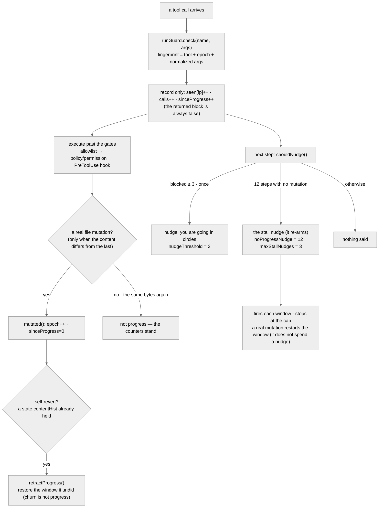
```mermaid
%%{init: {'theme':'neutral','flowchart':{'curve':'basis'}}}%%
flowchart TD
  C["a tool call arrives"] --> CH["runGuard.check(name, args)<br/>fingerprint = tool + epoch + normalized args"]
  CH --> REC["record only: seen[fp]++ · calls++ · sinceProgress++<br/>(the returned block is always false)"]
  REC --> RUN["execute past the gates<br/>allowlist → policy/permission → PreToolUse hook"]
  RUN --> MU{"a real file mutation?<br/>(only when the content differs from the last)"}
  MU -- "yes" --> RST["mutated(): epoch++ · sinceProgress=0"]
  MU -- "no · the same bytes again" --> NOP["not progress — the counters stand"]
  RST --> SR{"self-revert?<br/>a state contentHist already held"}
  SR -- "yes" --> RETR["retractProgress()<br/>restore the window it undid (churn is not progress)"]

  REC --> SN["next step: shouldNudge()"]
  SN -- "blocked ≥ 3 · once" --> NB["nudge: you are going in circles<br/>nudgeThreshold = 3"]
  SN -- "12 steps with no mutation" --> NS["the stall nudge (it re-arms)<br/>noProgressNudge = 12 · maxStallNudges = 3"]
  NS --> RE["fires each window · stops at the cap<br/>a real mutation restarts the window (it does not spend a nudge)"]
  SN -- "otherwise" --> Q["nothing said"]
```

A nudge is **a prompt the agent can read and ignore**. If it does, magi does nothing — the turn ends
because the agent ends it, or because something outside does.

On a declaration, L1's council takes over: assemble the record (paths not on disk → live jobs →
workspace snapshot → the observation record → the tool evidence, each clipped per item) and
deliberate with three members. Not accepted, and what is undone comes back as the tool result so the
agent keeps working; never declared at all, and after three asks it lands UNVERIFIED. The bash tool
itself annotates the head of a result when an exit 0 carries a crash signature or a status-masking
tail (`|| true` and friends) — `MAGI_EXITCODE_BODYSCAN`, MANUAL §guards.

## L4 — Stopping hangs, spins and repetition: the model I/O guard

Hangs and spins are handled at **the single point every request to a model passes through**. The
provider `providerFor(agent)` returns is wrapped at construction in `GuardProvider`
(`provider_guard.go`), so the main generate, the council and every tool-free side call all send and
receive through **one guarded `StreamChat`**. This replaced the whack-a-mole of each consumer
carrying its own watchdog.

The guard is **two layers**. (1) The main loop's *behavioural* guard (`consumeStream`) fires **first**
on the main generate and does what only it can — retries, nudges. (2) The **safety net above it**
(`guardedProvider`) backstops the paths with no handling of their own; its thresholds are **2×** the
behavioural guard's, which is what guarantees the order.

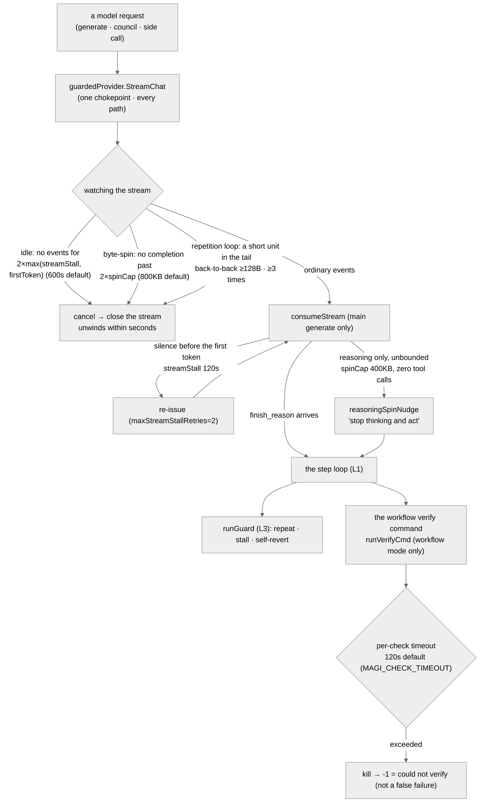
```mermaid
%%{init: {'theme':'neutral','flowchart':{'curve':'basis'}}}%%
flowchart TD
  REQ["a model request<br/>(generate · council · side call)"] --> GP["guardedProvider.StreamChat<br/>(one chokepoint · every path)"]
  GP --> W{"watching the stream"}
  W -- "idle: no events for<br/>2×max(streamStall, firstToken) (600s default)" --> AB["cancel → close the stream<br/>unwinds within seconds"]
  W -- "byte-spin: no completion past<br/>2×spinCap (800KB default)" --> AB
  W -- "repetition loop: a short unit in the tail<br/>back-to-back ≥128B · ≥3 times" --> AB
  W -- "ordinary events" --> CS["consumeStream (main generate only)"]
  CS -- "silence before the first token<br/>streamStall 120s" --> RT["re-issue (maxStreamStallRetries=2)"]
  CS -- "reasoning only, unbounded<br/>spinCap 400KB, zero tool calls" --> SN["reasoningSpinNudge<br/>'stop thinking and act'"]
  CS -- "finish_reason arrives" --> STEP["the step loop (L1)"]
  RT --> CS
  SN --> STEP
  STEP --> TG["runGuard (L3): repeat · stall · self-revert"]
  STEP --> CK["the workflow verify command<br/>runVerifyCmd (workflow mode only)"]
  CK --> CTO{"per-check timeout<br/>120s default (MAGI_CHECK_TIMEOUT)"}
  CTO -- "exceeded" --> KILL["kill → -1 = could not verify (not a false failure)"]
```

Layer by layer:

| Layer | What it catches | Trigger | Bound / flag | What it does |
|---|---|---|---|---|
| `guardedProvider` (idle) | a silent backend | idle since the last event | 2×max(`streamStall`, `firstToken`) (600s default) | cancel, close the stream |
| `guardedProvider` (byte-spin) | runaway generation with no completion | accumulated bytes | 2×`spinCap` (800KB default), `MAGI_SPIN_CAP` | cancel |
| `guardedProvider` (repeat) | **degenerate repetition** (the same sentence or word looping) | a tail unit back-to-back ≥128B and ≥3 times | `MAGI_REPEAT_CAP` (on by default), a 4KB tail checked every 256B | cancel (in hundreds of bytes, not after 800KB) |
| `consumeStream` (first token) | silence before the main generate's first token — prefill headroom | idle | `firstToken` 300s, `MAGI_FIRST_TOKEN` (0 = fall back to the inter-token bound) | re-issue the same request (×2), error when exhausted |
| `consumeStream` (inter-token) | a mid-generation freeze after output began | idle | `streamStall` 120s, `MAGI_STREAM_STALL` (0 disables) | end the stream, keep the partial output (not retryable) |
| `consumeStream` (reasoningSpin) | the main generate reasoning without end | zero tool calls + bytes | `spinCap` 400KB (with `[limits] max_output_tokens` set, this nudge defers to the token cap and is off; the 800KB guardedProvider backstop stays) | a nudge ("act") |
| `runGuard` (L3) | tool-call repeats, stalls, self-reverts | fingerprints, steps with no mutation | the constants in `guard.go` | **nudges only** — no blocking, no recovery, no force-stop |
| the check timeout (`runVerifyCmd`) | a blocking workflow verify command | per-check elapsed | 120s default, `MAGI_CHECK_TIMEOUT` (0=off) | kill → -1 = could not verify (not a false failure) |

The point: **a model hang, spin or repetition is bounded at the single guardedProvider point**, and
**a shell command hang at the bash tool (120/600s) and the runVerifyCmd timeout**. Neither can hang
on to the turn's wall clock.

## L5 — Core domain classes (`internal/core`)

`core` **imports nothing but the standard library**. There is no LLM here, no filesystem, no
terminal — only a description of what a conversation is made of.

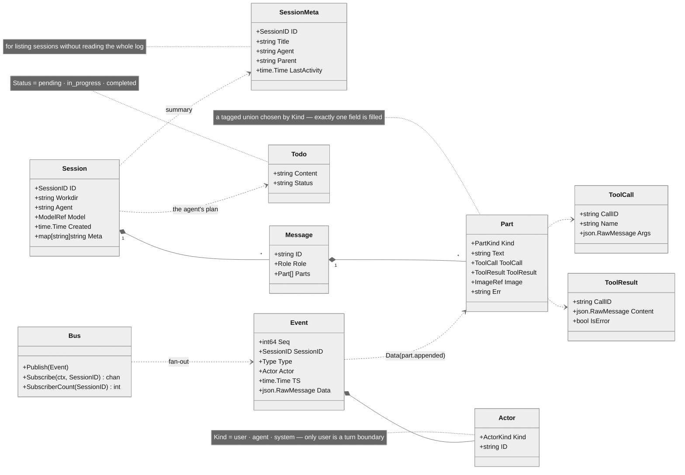
```mermaid
%%{init: {'theme':'neutral'}}%%
classDiagram
  direction LR

  class Session {
    +SessionID ID
    +string Workdir
    +string Agent
    +ModelRef Model
    +time.Time Created
    +map[string]string Meta
  }
  class SessionMeta {
    +SessionID ID
    +string Title
    +string Agent
    +string Parent
    +time.Time LastActivity
  }
  note for SessionMeta "for listing sessions without reading the whole log"
  class Message {
    +string ID
    +Role Role
    +Part[] Parts
  }
  class Part {
    +PartKind Kind
    +string Text
    +ToolCall ToolCall
    +ToolResult ToolResult
    +ImageRef Image
    +string Err
  }
  note for Part "a tagged union chosen by Kind — exactly one field is filled"
  class ToolCall {
    +string CallID
    +string Name
    +json.RawMessage Args
  }
  class ToolResult {
    +string CallID
    +json.RawMessage Content
    +bool IsError
  }
  class Todo {
    +string Content
    +string Status
  }
  note for Todo "Status = pending · in_progress · completed"

  Session "1" *-- "*" Message
  Message "1" *-- "*" Part
  Part ..> ToolCall
  Part ..> ToolResult
  Session ..> SessionMeta : summary
  Session ..> Todo : the agent's plan

  class Event {
    +int64 Seq
    +SessionID SessionID
    +Type Type
    +Actor Actor
    +time.Time TS
    +json.RawMessage Data
  }
  class Actor {
    +ActorKind Kind
    +string ID
  }
  note for Actor "Kind = user · agent · system — only user is a turn boundary"
  class Bus {
    +Publish(Event)
    +Subscribe(ctx, SessionID) chan
    +SubscriberCount(SessionID) int
  }

  Event *-- Actor
  Bus ..> Event : fan-out
  Event ..> Part : Data(part.appended)
```

`PartKind` ∈ `text` · `reasoning` · `tool-call` · `tool-result` · `image` · `error`.
That `Part` is a tagged union is what decides the storage format: the streaming unit and the
persisted unit are the same type, so a replay is a render.

The council domain is a separate small value model — the LLM calls live in the adapter
(`adapter/council/llm`), and `core/council` knows only **the rule for counting votes**:

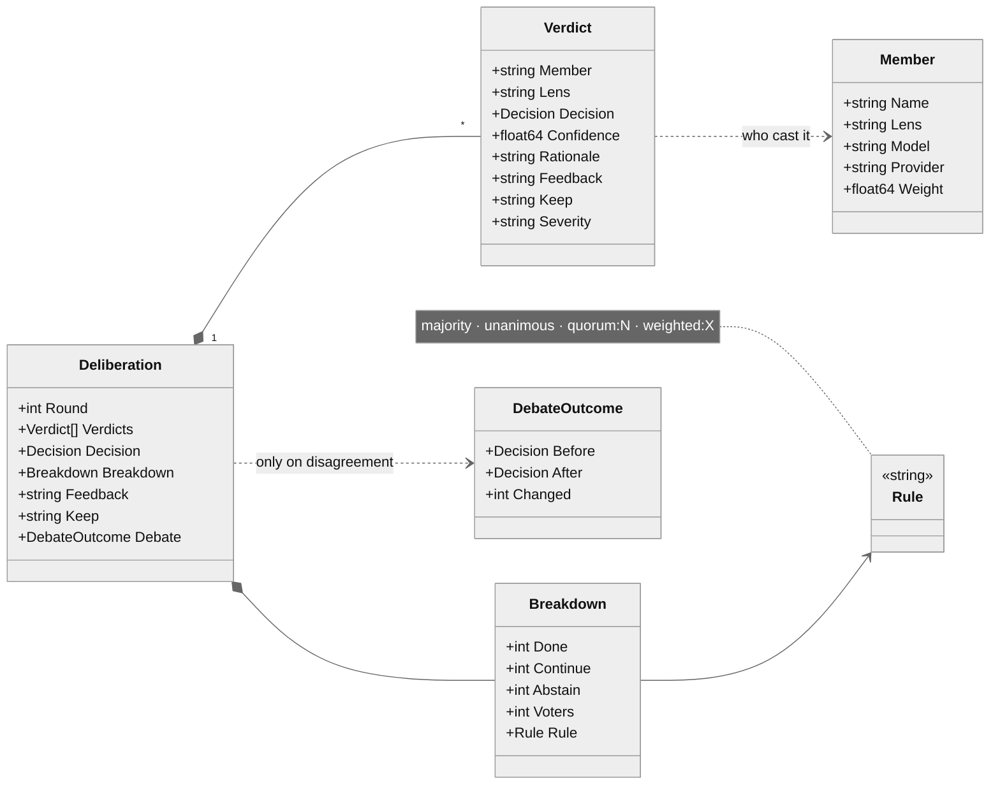
```mermaid
%%{init: {'theme':'neutral'}}%%
classDiagram
  direction LR
  class Member {
    +string Name
    +string Lens
    +string Model
    +string Provider
    +float64 Weight
  }
  class Verdict {
    +string Member
    +string Lens
    +Decision Decision
    +float64 Confidence
    +string Rationale
    +string Feedback
    +string Keep
    +string Severity
  }
  class Breakdown {
    +int Done
    +int Continue
    +int Abstain
    +int Voters
    +Rule Rule
  }
  class Deliberation {
    +int Round
    +Verdict[] Verdicts
    +Decision Decision
    +Breakdown Breakdown
    +string Feedback
    +string Keep
    +DebateOutcome Debate
  }
  class Rule {
    <<string>>
  }
  note for Rule "majority · unanimous · quorum:N · weighted:X"
  class DebateOutcome {
    +Decision Before
    +Decision After
    +int Changed
  }
  Deliberation "1" *-- "*" Verdict
  Deliberation *-- Breakdown
  Breakdown --> Rule
  Verdict ..> Member : who cast it
  Deliberation ..> DebateOutcome : only on disagreement
```

`Decision` ∈ `done` · `continue` · `abstain`. `Tally(verdicts, rule)` is a pure function, so the
deliberation record alone is enough to reproduce the decision. `Keep` and `Debate` **do not affect
it** — that separation, together with abstentions leaving the denominator, is what makes "why did the
council decide that" answerable after the fact.

---

## L6 — Ports and adapters (interface → implementation)

The dependency direction is one-way, **`adapter → app → core`**, enforced at compile time. `app`
knows only the interfaces below; `cmd/magi` plugs the implementations in at startup.

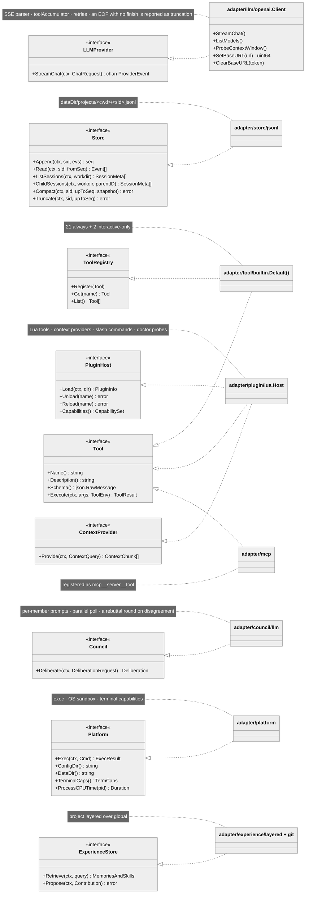
```mermaid
%%{init: {'theme':'neutral'}}%%
classDiagram
  direction LR

  class LLMProvider {
    <<interface>>
    +StreamChat(ctx, ChatRequest) chan ProviderEvent
  }
  class Store {
    <<interface>>
    +Append(ctx, sid, evs) seq
    +Read(ctx, sid, fromSeq) Event[]
    +ListSessions(ctx, workdir) SessionMeta[]
    +ChildSessions(ctx, workdir, parentID) SessionMeta[]
    +Compact(ctx, sid, upToSeq, snapshot) error
    +Truncate(ctx, sid, upToSeq) error
  }
  class Tool {
    <<interface>>
    +Name() string
    +Description() string
    +Schema() json.RawMessage
    +Execute(ctx, args, ToolEnv) ToolResult
  }
  class ToolRegistry {
    <<interface>>
    +Register(Tool)
    +Get(name) Tool
    +List() Tool[]
  }
  class Council {
    <<interface>>
    +Deliberate(ctx, DeliberationRequest) Deliberation
  }
  class Platform {
    <<interface>>
    +Exec(ctx, Cmd) ExecResult
    +ConfigDir() string
    +DataDir() string
    +TerminalCaps() TermCaps
    +ProcessCPUTime(pid) Duration
  }
  class ExperienceStore {
    <<interface>>
    +Retrieve(ctx, query) MemoriesAndSkills
    +Propose(ctx, Contribution) error
  }
  class PluginHost {
    <<interface>>
    +Load(ctx, dir) PluginInfo
    +Unload(name) error
    +Reload(name) error
    +Capabilities() CapabilitySet
  }
  class ContextProvider {
    <<interface>>
    +Provide(ctx, ContextQuery) ContextChunk[]
  }

  class OpenAIClient["adapter/llm/openai.Client"] {
    +StreamChat()
    +ListModels()
    +ProbeContextWindow()
    +SetBaseURL(url) uint64
    +ClearBaseURL(token)
  }
  note for OpenAIClient "SSE parser · toolAccumulator · retries · an EOF with no finish is reported as truncation"
  class JSONLStore["adapter/store/jsonl"]
  note for JSONLStore "dataDir/projects/&lt;cwd&gt;/&lt;sid&gt;.jsonl"
  class BuiltinRegistry["adapter/tool/builtin.Default()"]
  note for BuiltinRegistry "21 always + 2 interactive-only"
  class LuaHost["adapter/plugin/lua.Host"]
  note for LuaHost "Lua tools · context providers · slash commands · doctor probes"
  class MCPClient["adapter/mcp"]
  note for MCPClient "registered as mcp__server__tool"
  class LLMCouncil["adapter/council/llm"]
  note for LLMCouncil "per-member prompts · parallel poll · a rebuttal round on disagreement"
  class LayeredExp["adapter/experience/layered + git"]
  note for LayeredExp "project layered over global"
  class OSPlatform["adapter/platform"]
  note for OSPlatform "exec · OS sandbox · terminal capabilities"

  LLMProvider <|.. OpenAIClient
  Store <|.. JSONLStore
  ToolRegistry <|.. BuiltinRegistry
  Tool <|.. BuiltinRegistry
  PluginHost <|.. LuaHost
  Tool <|.. LuaHost
  Tool <|.. MCPClient
  Council <|.. LLMCouncil
  ExperienceStore <|.. LayeredExp
  Platform <|.. OSPlatform
  ContextProvider <|.. LuaHost
```

There are twelve ports: the nine above plus `DoctorProbe` (a `-doctor` diagnostic item),
`PluginCommand` (a slash command) and `Scheduler`. That **the Tool interface has three
implementations** (builtin, lua, mcp) is the heart of the extension story — the loop cannot tell them
apart.

---

### L6.1 — A CLI as the backend: the three shipped shims

`llm/openai` speaks to whatever `base_url` names. A plugin can BE that address: it serves a
loopback HTTP shim and fulfils each chat request by running a coding CLI once. Three ship inside
the binary, off by default — `claudecode`, `codex`, `antigravity`.

The model never learns of this. It sees an OpenAI-compatible endpoint; magi's own tools, permission
gate and council are unchanged. What changes is who generates the tokens, and what a turn costs.

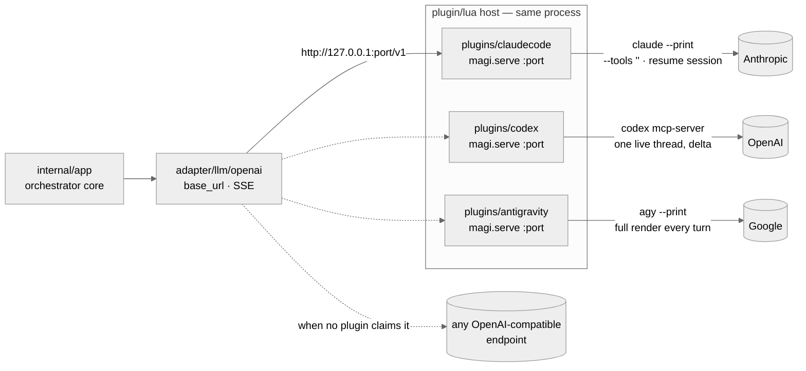
```mermaid
%%{init: {'theme':'neutral','flowchart':{'curve':'basis'}}}%%
flowchart LR
  app["internal/app<br/>orchestrator core"]
  llm["adapter/llm/openai<br/>base_url · SSE"]
  app --> llm

  subgraph host["plugin/lua host — same process"]
    direction TB
    cc["plugins/claudecode<br/>magi.serve :port"]
    cx["plugins/codex<br/>magi.serve :port"]
    ag["plugins/antigravity<br/>magi.serve :port"]
  end

  llm -->|"http://127.0.0.1:port/v1"| cc
  llm -.-> cx
  llm -.-> ag

  cc -->|"claude --print<br/>--tools '' · resume session"| anth[("Anthropic")]
  cx -->|"codex mcp-server<br/>one live thread, delta"| oai[("OpenAI")]
  ag -->|"agy --print<br/>full render every turn"| goog[("Google")]

  direct[("any OpenAI-compatible<br/>endpoint")]
  llm -.->|"when no plugin claims it"| direct
```

Three things the picture is making explicit:

- **One is solid, two are dotted.** Every plugin whose CLI answers serves its shim, so all three are
  *pickable* at once; only the **default** follows a chain — claude, then codex, then agy, then
  whatever the config names. Picking one per companion is a runtime choice (§3.7.2), not a restart.
- **The arrow labels are the cost.** claude drops its tool schemas and resumes the CLI's own session
  (327 tokens for a minimal turn, delta-priced afterwards); codex holds one live thread over
  `magi.pipe` and sends only the delta (527 a turn at full rate); `agy` re-sends the whole
  conversation, schemas included, every turn — it has no cache to hit and its resume flag doubles
  the bill. See EXTENDING §3.7.1 for the measurements.
- **The dotted line to a plain endpoint is the normal case.** None of this is on unless a plugin is
  enabled; `base_url` otherwise points where it always did.

## L7 — App core classes (`internal/app`)

`App` is the application service: commands go in, events come out. State is gathered **per session**
in `sessionState`, all of it guarded by `App.mu`.

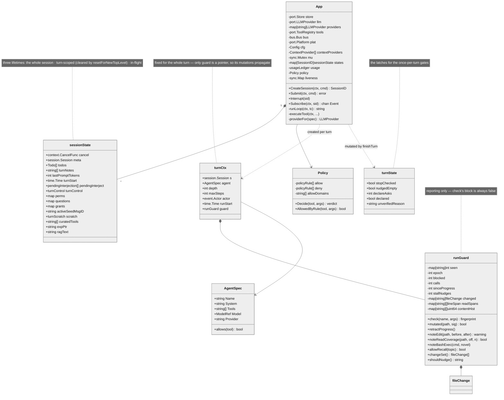
```mermaid
%%{init: {'theme':'neutral'}}%%
classDiagram
  direction TB

  class App {
    -port.Store store
    -port.LLMProvider llm
    -map[string]LLMProvider providers
    -port.ToolRegistry tools
    -bus.Bus bus
    -port.Platform plat
    -Config cfg
    -ContextProvider[] contextProviders
    -sync.Mutex mu
    -map[SessionID]sessionState states
    -usageLedger usage
    -Policy policy
    -sync.Map liveness
    +CreateSession(ctx, cmd) SessionID
    +Submit(ctx, cmd) error
    +Interrupt(sid)
    +Subscribe(ctx, sid) chan Event
    -runLoop(ctx, tc) string
    -executeTool(ctx, ...)
    -providerFor(spec) LLMProvider
  }

  class sessionState {
    +context.CancelFunc cancel
    +session.Session meta
    +Todo[] todos
    +string[] turnNotes
    +int lastPromptTokens
    +time.Time turnStart
    +pendingInterjection[] pendingInterject
    +turnControl turnControl
    +map perms
    +map questions
    +map grants
    +string activeSeedMsgID
    +turnScratch scratch
    +string[] curatedTools
    +string expPtr
    +string ragText
  }
  note for sessionState "three lifetimes: the whole session · turn-scoped (cleared by resetForNewTopLevel) · in-flight"

  class turnCtx {
    +session.Session s
    +AgentSpec agent
    +int depth
    +int maxSteps
    +event.Actor actor
    +time.Time runStart
    +runGuard guard
  }
  note for turnCtx "fixed for the whole turn — only guard is a pointer, so its mutations propagate"
  class turnState {
    +bool stopChecked
    +bool nudgedEmpty
    +int declareAsks
    +bool declared
    +string unverifiedReason
  }
  note for turnState "the latches for the once-per-turn gates"
  class AgentSpec {
    +string Name
    +string System
    +string[] Tools
    +ModelRef Model
    +string Provider
    +allows(tool) bool
  }

  class runGuard {
    -map[string]int seen
    -int epoch
    -int blocked
    -int calls
    -int sinceProgress
    -int stallNudges
    -map[string]fileChange changed
    -map[string][]lineSpan readSpans
    -map[string][]uint64 contentHist
    +check(name, args) fingerprint
    +mutated(path, sig) bool
    +retractProgress()
    +noteEdit(path, before, after) warning
    +noteReadCoverage(path, off, n) bool
    +noteBashExec(cmd, novel)
    +allowRecall(topic) bool
    +changeSet() fileChange[]
    +shouldNudge() string
  }
  note for runGuard "reporting only — check's block is always false"
  class Policy {
    -policyRule[] allow
    -policyRule[] deny
    -string[] allowDomains
    +Decide(tool, args) verdict
    +AllowedByRule(tool, args) bool
  }

  App "1" *-- "*" sessionState
  App --> Policy
  App ..> turnCtx : created per turn
  turnCtx *-- runGuard
  turnCtx --> AgentSpec
  App ..> turnState : mutated by finishTurn
  runGuard *-- fileChange
```

Two things to know when reading it.

1. **`runGuard` is run-scoped, not turn-scoped** (`turnCtx` holds it, and it is a pointer, so
   mutations propagate). `epoch` rises on every real file mutation and is part of the repeat
   fingerprint — which is why the same command after a file changed is not "the same call".
2. **`sessionState`'s fields split into three lifetimes**: the whole session (`meta`, `grants`,
   `deferredAbandoned`), turn-scoped (what `resetForNewTopLevel` clears — `turnNotes`, `scratch`, the
   RAG cache), and in-flight (`cancel`, `perms`). Adding a field without deciding which it is shows
   up later as last turn's state leaking into the next request.

---

## L8 — The tool layer

Every tool is one `port.Tool`. The `ToolEnv` it receives at execution is **the only route to the
application**, and a nil field means "this run does not have that capability".

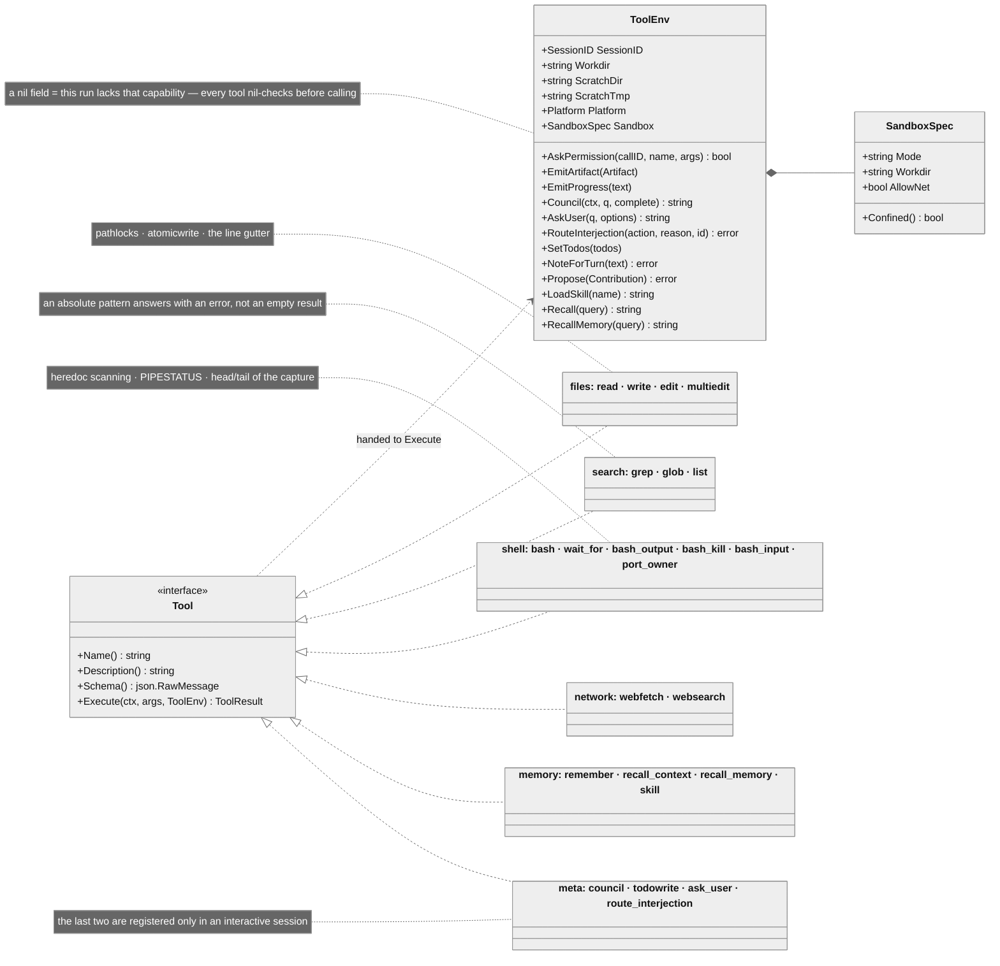
```mermaid
%%{init: {'theme':'neutral'}}%%
classDiagram
  direction LR

  class Tool {
    <<interface>>
    +Name() string
    +Description() string
    +Schema() json.RawMessage
    +Execute(ctx, args, ToolEnv) ToolResult
  }
  class ToolEnv {
    +SessionID SessionID
    +string Workdir
    +string ScratchDir
    +string ScratchTmp
    +Platform Platform
    +SandboxSpec Sandbox
    +AskPermission(callID, name, args) bool
    +EmitArtifact(Artifact)
    +EmitProgress(text)
    +Council(ctx, q, complete) string
    +AskUser(q, options) string
    +RouteInterjection(action, reason, id) error
    +SetTodos(todos)
    +NoteForTurn(text) error
    +Propose(Contribution) error
    +LoadSkill(name) string
    +Recall(query) string
    +RecallMemory(query) string
  }
  note for ToolEnv "a nil field = this run lacks that capability — every tool nil-checks before calling"
  class SandboxSpec {
    +string Mode
    +string Workdir
    +bool AllowNet
    +Confined() bool
  }
  ToolEnv *-- SandboxSpec
  Tool ..> ToolEnv : handed to Execute

  class FileTools["files: read · write · edit · multiedit"]
  note for FileTools "pathlocks · atomicwrite · the line gutter"
  class SearchTools["search: grep · glob · list"]
  note for SearchTools "an absolute pattern answers with an error, not an empty result"
  class ShellTools["shell: bash · wait_for · bash_output · bash_kill · bash_input · port_owner"]
  note for ShellTools "heredoc scanning · PIPESTATUS · head/tail of the capture"
  class NetTools["network: webfetch · websearch"]
  class MemTools["memory: remember · recall_context · recall_memory · skill"]
  class MetaTools["meta: council · todowrite · ask_user · route_interjection"]
  note for MetaTools "the last two are registered only in an interactive session"

  Tool <|.. FileTools
  Tool <|.. SearchTools
  Tool <|.. ShellTools
  Tool <|.. NetTools
  Tool <|.. MemTools
  Tool <|.. MetaTools
```

**21 tools are always** registered, and `ask_user` and `route_interjection` **only in an interactive
session** (`Default()` + `RegisterOrchestration(r, headless)`). The reason for leaving the last two
out of a headless run is not only that nobody is there to answer, but that a tool which can never
fire still weighs on the tool list of every request. The names are enumerated in one place,
`KnownNames()`, so a test can check that the policy code writing tool names as literals is not
holding a name no tool answers to.

**LSP is not a tool.** Nothing is registered under a name like `lsp_diagnose`; after an edit the app
runs `AutoDiagnose` (`app/diagnose.go` → `builtin/lsppool.go`) and **appends the result to the tool
result**. It is not a capability the model calls but an observation magi adds, so it arrives without
being asked for.

The `bash` family is the heaviest, by file count and by logic. Most of that weight is not execution
but **reading shell text truthfully** — `heredoc.go`'s `scanShellLine` makes one pass that decides a
detaching `&` and a heredoc body together, and `maskNonShell` hides quoted text, comments and heredoc
bodies **while preserving length**, so a position a regex found can be quoted from the original.
Without it, a command like `python3 -c "print('done | tail -3')"` gets the false annotation "your exit
code is the pager's".

---

## L9 — One tool call as a sequence

L1 is the turn; L9 zooms in on **one** tool call inside it. The point is the order of the gates and
who records what.

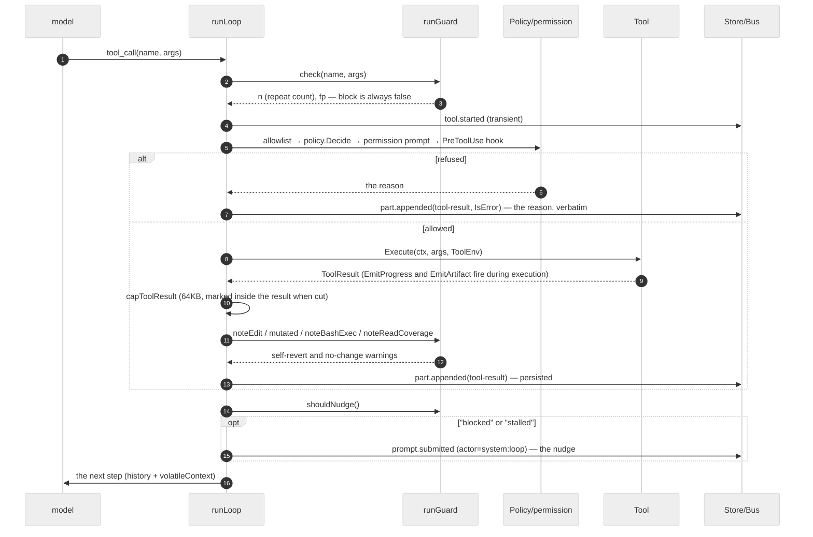
```mermaid
%%{init: {'theme':'neutral'}}%%
sequenceDiagram
  autonumber
  participant M as model
  participant L as runLoop
  participant G as runGuard
  participant P as Policy/permission
  participant T as Tool
  participant S as Store/Bus

  M->>L: tool_call(name, args)
  L->>G: check(name, args)
  G-->>L: n (repeat count), fp — block is always false
  L->>S: tool.started (transient)
  L->>P: allowlist → policy.Decide → permission prompt → PreToolUse hook
  alt refused
    P-->>L: the reason
    L->>S: part.appended(tool-result, IsError) — the reason, verbatim
  else allowed
    L->>T: Execute(ctx, args, ToolEnv)
    T-->>L: ToolResult (EmitProgress and EmitArtifact fire during execution)
    L->>L: capToolResult (64KB, marked inside the result when cut)
    L->>G: noteEdit / mutated / noteBashExec / noteReadCoverage
    G-->>L: self-revert and no-change warnings
    L->>S: part.appended(tool-result) — persisted
  end
  L->>G: shouldNudge()
  opt "blocked" or "stalled"
    L->>S: prompt.submitted (actor=system:loop) — the nudge
  end
  L->>M: the next step (history + volatileContext)
```

Three contracts to read out of that sequence:

- **A refusal is a result too.** A gate that blocks does not make the call disappear; a tool-result
  carrying the reason is recorded — a model that does not know what stopped it tries the same thing
  again.
- **A cut is marked where it was cut.** `capToolResult`, the head/tail of a capture, the omitted
  middle of an evidence block, the incompleteness marker on a compaction summary — all the same rule.
  The reader **cannot ask about what it does not know is missing.**
- **A nudge is a `prompt.submitted`** with actor `{system, loop}`, not a `part.appended`. To count
  nudges by parsing the log, filter on that actor.

---

## L10 — The console, as sequences

L0.5 draws the processes. This draws what happens BETWEEN them, in the order it happens, for the
paths a person actually drives. Every one of these is a shape that was got wrong at least once and
is now held by a test; the measurement that found each is in the commit that fixed it.

### L10.1 — One window, one stream

A browser allows six connections to one host and a stream never ends. A console window used to hold
two — the transcript and the roster — so three windows consumed the whole budget and every ordinary
request from every window queued behind a stream that would never finish (measured: with three
windows open, the third one's first fetch never came back). A hidden tab hands its stream back,
because a document nobody is rendering is a document the frames are wasted on.

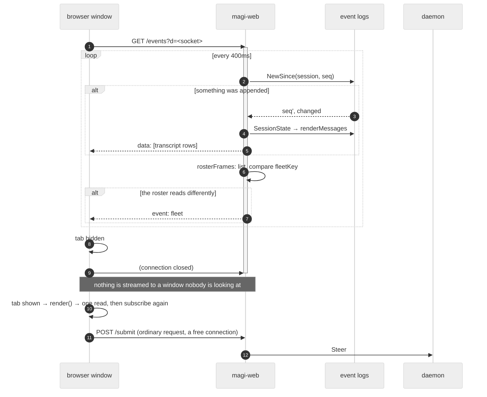
```mermaid
%%{init: {'theme':'neutral'}}%%
sequenceDiagram
  autonumber
  participant B as browser window
  participant W as magi-web
  participant L as event logs
  participant D as daemon

  B->>W: GET /events?d=<socket>
  activate W
  loop every 400ms
    W->>L: NewSince(session, seq)
    alt something was appended
      L-->>W: seq', changed
      W->>L: SessionState → renderMessages
      W-->>B: data: [transcript rows]
    end
    W->>W: rosterFrames: list, compare fleetKey
    alt the roster reads differently
      W-->>B: event: fleet
    end
  end
  B->>B: tab hidden
  B->>W: (connection closed)
  deactivate W
  Note over B,W: nothing is streamed to a window nobody is looking at
  B->>B: tab shown → render() → one read, then subscribe again
  B->>W: POST /submit (ordinary request, a free connection)
  W->>D: Steer
```

### L10.2 — A model-backed call does not lock the companion

The console keeps one connection per daemon and the client holds a mutex across the whole round
trip. A call that runs the model is seconds during which nothing else about that companion could be
asked: measured, a file tree took 2.7s against 0.6ms idle. The five that run a model dial their own
connection; the daemon serves each connection in its own goroutine.

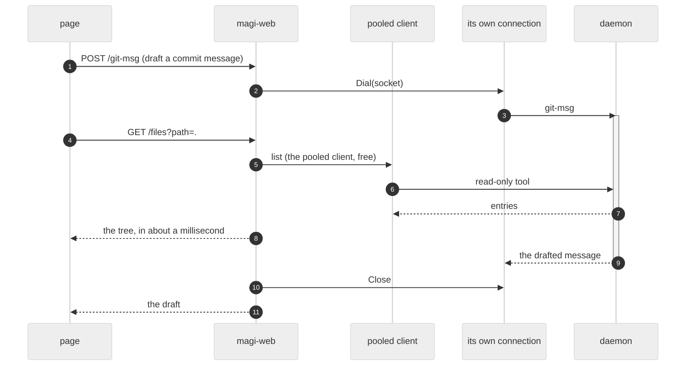
```mermaid
%%{init: {'theme':'neutral'}}%%
sequenceDiagram
  autonumber
  participant P as page
  participant W as magi-web
  participant C1 as pooled client
  participant C2 as its own connection
  participant D as daemon

  P->>W: POST /git-msg (draft a commit message)
  W->>C2: Dial(socket)
  C2->>D: git-msg
  activate D
  P->>W: GET /files?path=.
  W->>C1: list (the pooled client, free)
  C1->>D: read-only tool
  D-->>C1: entries
  W-->>P: the tree, in about a millisecond
  D-->>C2: the drafted message
  deactivate D
  W->>C2: Close
  W-->>P: the draft
```

### L10.3 — Handing work over, and asking a question

A request that can write waits for the workspace: two turns in one tree are two agents editing the
same files. A request the asker marks `looking` runs in a session whose role fixes its tools to the
four that only read, so it has nothing to collide with and starts while the workspace is busy. The
receiver enforces it; the asker cannot bind anybody.

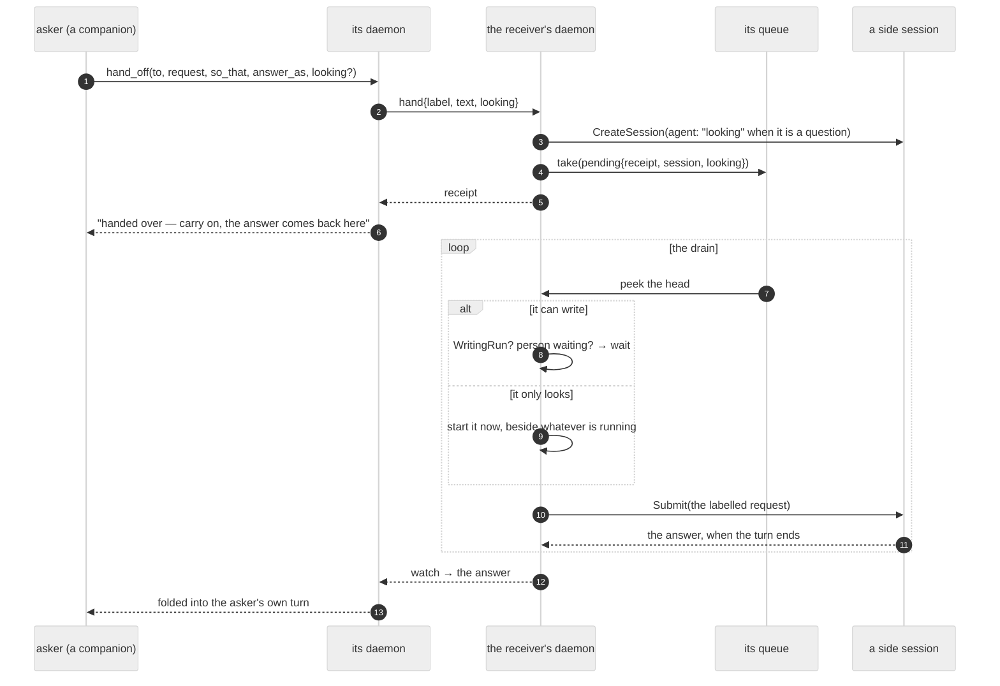
```mermaid
%%{init: {'theme':'neutral'}}%%
sequenceDiagram
  autonumber
  participant A as asker (a companion)
  participant DA as its daemon
  participant DB as the receiver's daemon
  participant Q as its queue
  participant S as a side session

  A->>DA: hand_off(to, request, so_that, answer_as, looking?)
  DA->>DB: hand{label, text, looking}
  DB->>S: CreateSession(agent: "looking" when it is a question)
  DB->>Q: take(pending{receipt, session, looking})
  DB-->>DA: receipt
  DA-->>A: "handed over — carry on, the answer comes back here"
  loop the drain
    Q->>DB: peek the head
    alt it can write
      DB->>DB: WritingRun? person waiting? → wait
    else it only looks
      DB->>DB: start it now, beside whatever is running
    end
    DB->>S: Submit(the labelled request)
    S-->>DB: the answer, when the turn ends
  end
  DB-->>DA: watch → the answer
  DA-->>A: folded into the asker's own turn
```

### L10.4 — A meeting, from convening to work handed out

The console holds the floor because a participant that also decided the order would be chairing a
discussion it is arguing in. Everybody prepares in parallel; a participant that cannot get ready
does not hold the room.

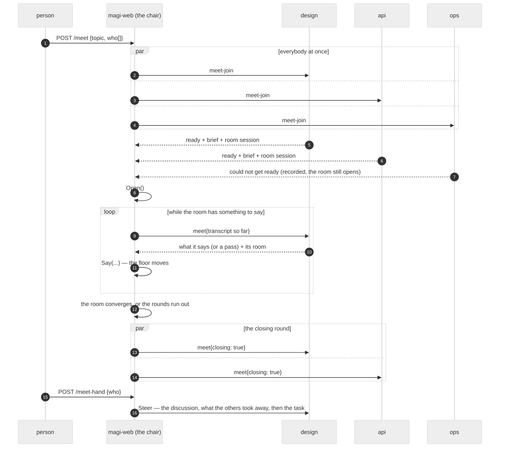
```mermaid
%%{init: {'theme':'neutral'}}%%
sequenceDiagram
  autonumber
  participant U as person
  participant W as magi-web (the chair)
  participant D1 as design
  participant D2 as api
  participant D3 as ops

  U->>W: POST /meet {topic, who[]}
  par everybody at once
    W->>D1: meet-join
    and
    W->>D2: meet-join
    and
    W->>D3: meet-join
  end
  D1-->>W: ready + brief + room session
  D2-->>W: ready + brief + room session
  D3-->>W: could not get ready (recorded, the room still opens)
  W->>W: Open()
  loop while the room has something to say
    W->>D1: meet{transcript so far}
    D1-->>W: what it says (or a pass) + its room
    W->>W: Say(...) — the floor moves
  end
  W->>W: the room converges, or the rounds run out
  par the closing round
    W->>D1: meet{closing: true}
    and
    W->>D2: meet{closing: true}
  end
  U->>W: POST /meet-hand {who}
  W->>D1: Steer — the discussion, what the others took away, then the task
```

### L10.5 — What each participant is thinking, live

The daemons write their room conversations to the same store the console reads. The meeting's own
stream carries them, merged: one connection for a screen watching four conversations.

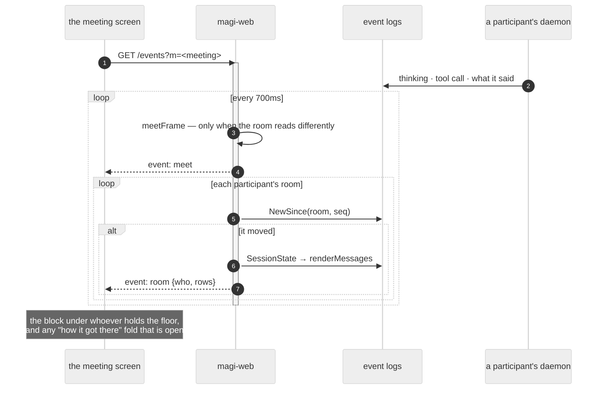
```mermaid
%%{init: {'theme':'neutral'}}%%
sequenceDiagram
  autonumber
  participant P as the meeting screen
  participant W as magi-web
  participant L as event logs
  participant D as a participant's daemon

  P->>W: GET /events?m=<meeting>
  activate W
  D->>L: thinking · tool call · what it said
  loop every 700ms
    W->>W: meetFrame — only when the room reads differently
    W-->>P: event: meet
    loop each participant's room
      W->>L: NewSince(room, seq)
      alt it moved
        W->>L: SessionState → renderMessages
        W-->>P: event: room {who, rows}
      end
    end
  end
  deactivate W
  Note over P: the block under whoever holds the floor,<br/>and any "how it got there" fold that is open
```

### L10.6 — The workspace: lazy, kept, and read again on demand

One directory per request, and only the folders somebody opened. A walk that FOLLOWS a change reads;
a walk that is only a redraw may use what was read in the last ten seconds. A mutation this console
made throws the kept listings away rather than ageing them out.

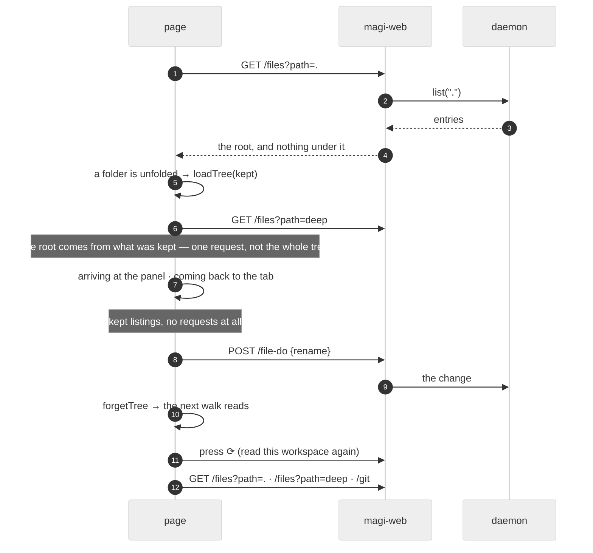
```mermaid
%%{init: {'theme':'neutral'}}%%
sequenceDiagram
  autonumber
  participant P as page
  participant W as magi-web
  participant D as daemon

  P->>W: GET /files?path=.
  W->>D: list(".")
  D-->>W: entries
  W-->>P: the root, and nothing under it
  P->>P: a folder is unfolded → loadTree(kept)
  P->>W: GET /files?path=deep
  Note over P: the root comes from what was kept — one request, not the whole tree
  P->>P: arriving at the panel · coming back to the tab
  Note over P: kept listings, no requests at all
  P->>W: POST /file-do {rename}
  W->>D: the change
  P->>P: forgetTree → the next walk reads
  P->>W: press ⟳ (read this workspace again)
  P->>W: GET /files?path=. · /files?path=deep · /git
```

### L10.7 — Answering what a companion is blocked on

The prompt is not in the log — it is a question about what should happen, not a record of what did —
so it rides the roster frame. Answering goes to the daemon that asked, by call id.

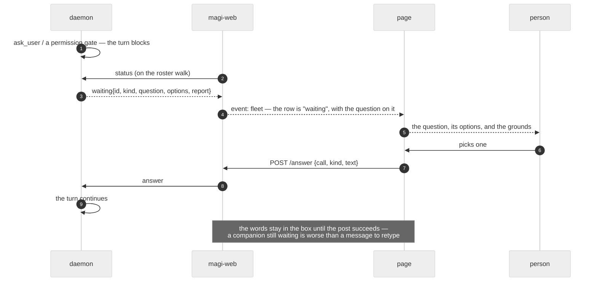
```mermaid
%%{init: {'theme':'neutral'}}%%
sequenceDiagram
  autonumber
  participant D as daemon
  participant W as magi-web
  participant P as page
  participant U as person

  D->>D: ask_user / a permission gate — the turn blocks
  W->>D: status (on the roster walk)
  D-->>W: waiting{id, kind, question, options, report}
  W-->>P: event: fleet — the row is "waiting", with the question on it
  P-->>U: the question, its options, and the grounds
  U->>P: picks one
  P->>W: POST /answer {call, kind, text}
  W->>D: answer
  D->>D: the turn continues
  Note over P,W: the words stay in the box until the post succeeds —<br/>a companion still waiting is worse than a message to retype
```

---

## Appendix — A/B flag defaults (`plan_flags.go`)

| Flag | Default | What it controls |
|---|---|---|
| `MAGI_DECLARE_FINISH` | ON | requires ending to be a **declared act** (`council{complete:true}`); off restores the passive finish where the model just stops calling tools |
| `MAGI_COUNCIL_DEBATE` | ON | one rebuttal round on disagreement; off tallies the independent vote only |
| `MAGI_STALL_NOVELTY` | ON | credits a **novel** inspection (a first-seen read/grep) as forward motion, buying one more stall window; off counts only mutations |
| `MAGI_CTX_COMPACT_RETRY` | ON | compact and retry when the context overflows |
| `MAGI_EXITCODE_BODYSCAN` | ON | the bash exit-0 crash and masking annotations (`tool/builtin`) |
| `MAGI_REPEAT_CAP` | ON | the degenerate-repetition safety net (the same sentence or word looping) in `provider_guard` |
| `MAGI_STREAM_STALL` · `MAGI_FIRST_TOKEN` | 120s · 300s | the INTER-token freeze bound on generate (0 disables) · the pre-FIRST-token (prefill) bound (0 = no separate bound); the guard sits at 2×max of the two, and the council member deadline adds the first-token value |
| `MAGI_CHECK_TIMEOUT` | — | the workflow verify timeout (0=off) |
| `MAGI_SPIN_CAP` | 400KB | the reasoning-only spin ceiling (guardedProvider uses 2×) |
| `MAGI_SELFKILL_GUARD` | ON | blocks a `pkill -f` that would kill magi's own process by a word from the prompt |
| `MAGI_COUNCIL_KEEP` | ON | members also name **what to keep** (advisory; no effect on the decision or the tally); off is fix-only feedback |
| `MAGI_TERSE_STEPS` | OFF | the prompt with the clause demanding a line of narration per step removed |

This table carries **only the A/B switches that change behaviour** (the env vars that are 1:1 with a
CLI option — `MAGI_MODEL`, `MAGI_BASE_URL`, `MAGI_PERMISSION` and the rest — are in ARCHITECTURE §9;
the terminal-width probes and debug switches are excluded). And it carries **only what is really
read**. Five that the code no longer reads but the table still listed —
`MAGI_STUCK_DECOMPOSE` · `MAGI_RECOVERY_RUNCAP` · `MAGI_GUARD_EXEC_EXEMPT` ·
`MAGI_EXERCISE_CHURN_CAP` · `MAGI_STALL_CONVERGE` — went out with L3's force-stop path.
(The last one outlived that path: once `stuck()`, which the collapse existed to hand off to, was
gone, all it did was silence the remaining stall nudges — measured at two nudges across 126 calls
and an hour.) To refresh the list, grep for `Getenv("MAGI_` / `envOff(` / `envOn(` and compare;
advertising drifting from implementation is a defect class this repository has hit repeatedly, and a
document advertising a handle that is not there is worse than no document.
**The reverse direction is the same defect**: `MAGI_COUNCIL_KEEP` was advertised in source comments
with **nothing reading it**, so the whole feature was unreachable (the adapter, the parser and the
TUI rendering were all alive), and this comparison is what found it and restored the wiring. The same
comparison found `MAGI_STEP_VERIFY` and `MAGI_MAX_PLAN_DEPTH` living only in comments with no reader,
so those comments and the dead fields hanging off them were removed.
