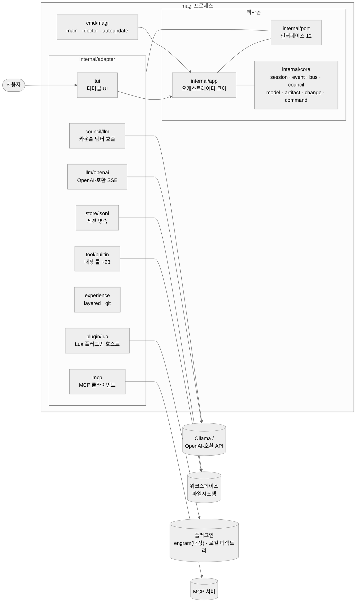
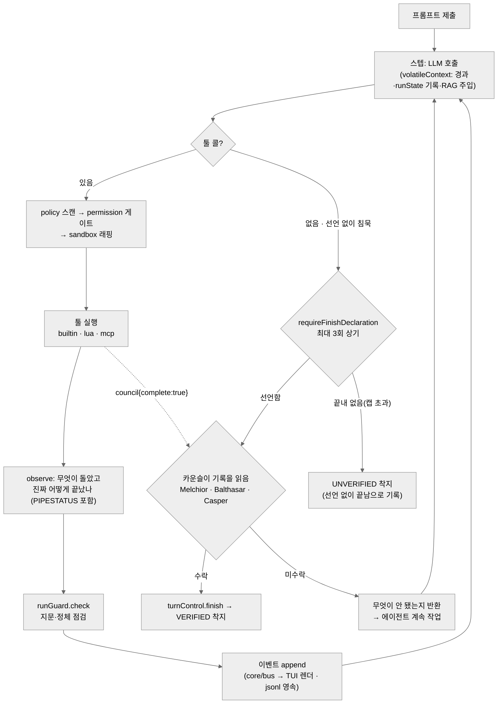
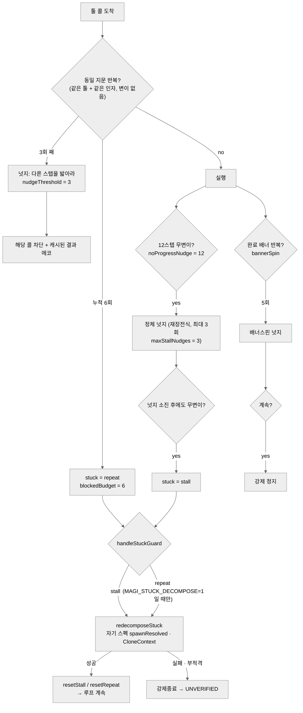
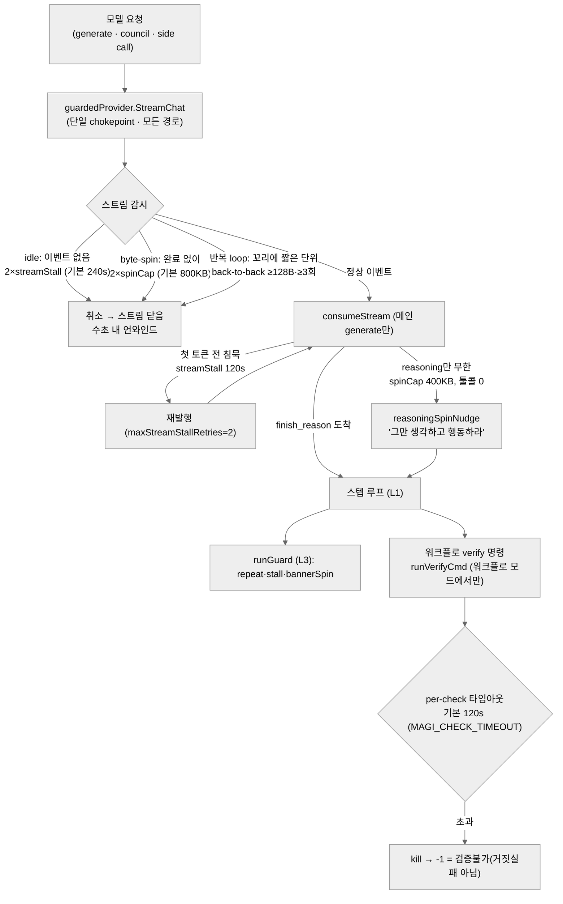

# magi 시스템 구조도

[ARCHITECTURE.md](ARCHITECTURE.md)의 시각 요약 — 탑레벨(L0)에서 컴포넌트(L2), 하네스 개입 절차(L3)까지.
GitHub이 mermaid를 직접 렌더한다. 임계값·기본값은 전부 코드가 진실이며(`guard.go` 상수,
`plan_flags.go`), 이 문서는 그걸 옮겨 적은 것이다.

---

## L0 — 탑레벨: 프로세스와 경계

모든 외부 접촉은 `internal/port`의 인터페이스(12개)를 거친다. `internal/app`(오케스트레이터 코어)은
어댑터 구현을 모른 채 포트만 호출하고, `cmd/magi`가 기동 시 배선한다(헥사고날).

```mermaid
%%{init: {'theme':'neutral','flowchart':{'curve':'basis'}}}%%
flowchart LR
  user(["사용자"])
  subgraph proc["magi 프로세스"]
    direction LR
    cmd["cmd/magi<br/>main · -doctor · autoupdate"]
    subgraph hex["헥사곤"]
      app["internal/app<br/>오케스트레이터 코어"]
      port["internal/port<br/>인터페이스 12"]
      core["internal/core<br/>session · event · bus · council<br/>model · artifact · change · command"]
    end
    subgraph adp["internal/adapter"]
      tui["tui<br/>터미널 UI"]
      llm["llm/openai<br/>OpenAI-호환 SSE"]
      tools["tool/builtin<br/>내장 툴 ~28"]
      lua["plugin/lua<br/>Lua 플러그인 호스트"]
      council["council/llm<br/>카운슬 멤버 호출"]
      exp["experience<br/>layered · git"]
      store["store/jsonl<br/>세션 영속"]
      mcp["mcp<br/>MCP 클라이언트"]
    end
  end
  ollama[("Ollama /<br/>OpenAI-호환 API")]
  ws[("워크스페이스<br/>파일시스템")]
  plug[("플러그인<br/>engram(내장) · 로컬 디렉토리")]
  mcpsrv[("MCP 서버")]

  user --> tui --> app
  cmd --> app
  app --- port
  app --- core
  port --- adp
  llm --> ollama
  council --> ollama
  tools --> ws
  lua --> plug
  mcp --> mcpsrv
  store --> ws
```

## L1 — 턴 라이프사이클: 요청에서 착지까지

한 턴은 스텝 루프다(`loop.go runLoop`): LLM 호출 → 툴 실행 → 가드 점검을 반복한다. **스텝 천장은
없다.** 턴은 에이전트가 `council{complete: true}`로 종료를 선언하고 카운슬이 수락할 때, 모델이 툴
호출을 그냥 멈출 때, 컨텍스트가 취소될 때 끝난다. 선언 없이 끝나면 `UNVERIFIED`로 정직하게 착지한다.

```mermaid
%%{init: {'theme':'neutral','flowchart':{'curve':'basis'}}}%%
flowchart TD
  P["프롬프트 제출"] --> S["스텝: LLM 호출<br/>(volatileContext: 경과·runState 기록·RAG 주입)"]
  S --> T{"툴 콜?"}
  T -- 있음 --> POL["policy 스캔 → permission 게이트<br/>→ sandbox 래핑"]
  POL --> EX["툴 실행<br/>builtin · lua · mcp"]
  EX --> OB["observe: 무엇이 돌았고<br/>진짜 어떻게 끝났나 (PIPESTATUS 포함)"]
  OB --> G["runGuard.check<br/>지문·정체 점검"]
  G --> EV["이벤트 append<br/>(core/bus → TUI 렌더 · jsonl 영속)"]
  EV --> S
  EX -. "council{complete:true}" .-> CG{"카운슬이 기록을 읽음<br/>Melchior · Balthasar · Casper"}
  CG -- "수락" --> FIN["turnControl.finish → VERIFIED 착지"]
  CG -- "미수락" --> FB["무엇이 안 됐는지 반환<br/>→ 에이전트 계속 작업"]
  FB --> S
  T -- "없음 · 선언 없이 침묵" --> RQ{"requireFinishDeclaration<br/>최대 3회 상기"}
  RQ -- "선언함" --> CG
  RQ -- "끝내 없음(캡 초과)" --> U["UNVERIFIED 착지<br/>(선언 없이 끝남으로 기록)"]
```

## L2 — app 코어: 컴포넌트 맵 (`internal/app`)

| 그룹 | 역할 | 파일 |
|---|---|---|
| **LOOP** | 턴 구동, 스트리밍, 인터젝션 감지, 종료 게이트(선언 요구) | `loop` · `loop_gates` · `loop_stream`(stall·reasoningSpin) · `loop_helpers` · `generate_step` · `loopmap` · `interject` · `interject_queue` · `inject` · `reask` · `todos` · `config` · `plan_flags`(A/B 플래그 — 이름은 플래너 시절 잔재) · `usage_meter` |
| **RECORD** | magi가 관측한 것 — 무엇이 돌았고 진짜 어떻게 끝났나, 워크스페이스의 현재 | `observed`(관측 판정·PIPESTATUS 노트 반영) · `observed_view`(패널 표시형) · `world_snapshot`(선언 시 새로 읽기·live jobs·기록엔 있고 디스크엔 없는 경로) · `background`(백그라운드 잡 레지스트리·tail) · `tool_outcome` |
| **COUNCIL** | 에이전트가 `council` 툴로 부르는 3인. 질의 / 종료 선언 심의 | `council_advice`(증거 조립·심의·`complete` 시 finish 신호) · `council_events`(`councilParams`) · `council_evidence` · `council_gate`(상수·`fmtElapsed`) |
| **GUARD** | 모델 hang·spin·반복 차단(단일 chokepoint) + 툴콜 반복·정체·배너스핀 탐지, 넛지→차단→강제종료 | `provider_guard`(idle·byte-spin·**반복** 안전망, 모든 모델 요청) · `guard`(repeat 지문 · noProgress · bannerSpin · exerciseFail) · `liveness` |
| **CTX** | 컨텍스트 창 관리, 압축, 경험 저장/회수 | `context_window` · `context_view` · `compact` · `memory` · `recall` · `query` · `reconstruct` |
| **IO** | 권한·정책·훅·명령 라우팅·워크플로우 | `permission` · `policy` · `hooks` · `routing` · `shellcmd` · `shellparse` · `skills` · `prompt` · `diagnose` · `execute` · `workflow` · `fork` · `scratch` |
| **EXT** | Lua 플러그인에 노출되는 앱 API | `app_plugin_api` · `app_emit` · `app_state` |

## L3 — 하네스 개입 절차: 넛지와 게이트의 순서

개입은 **조언(넛지) → 차단 → 구조적 회복 → 강제종료** 순으로 에스컬레이션한다.
임계값은 전부 `guard.go` 상수다.

```mermaid
%%{init: {'theme':'neutral','flowchart':{'curve':'basis'}}}%%
flowchart TD
  C["툴 콜 도착"] --> FP{"동일 지문 반복?<br/>(같은 툴 + 같은 인자, 변이 없음)"}
  FP -- "no" --> RUN["실행"]
  FP -- "3회 째" --> N1["넛지: 다른 스텝을 밟아라<br/>nudgeThreshold = 3"]
  N1 --> BLK["해당 콜 차단 + 캐시된 결과 에코"]
  FP -- "누적 6회" --> ST1["stuck = repeat<br/>blockedBudget = 6"]

  RUN --> NP{"12스텝 무변이?<br/>noProgressNudge = 12"}
  NP -- "yes" --> N2["정체 넛지 (재장전식, 최대 3회<br/>maxStallNudges = 3)"]
  N2 --> NP2{"넛지 소진 후에도 무변이?"}
  NP2 -- "yes" --> ST2["stuck = stall"]

  RUN --> BS{"완료 배너 반복?<br/>bannerSpin"}
  BS -- "5회" --> N3["배너스핀 넛지"] --> BS2{"계속?"} -- "yes" --> ST3["강제 정지"]

  ST1 --> HG{"handleStuckGuard"}
  ST2 --> HG
  HG -- "stall" --> RD["redecomposeStuck<br/>자기 스펙 spawnResolved · CloneContext"]
  HG -- "repeat (MAGI_STUCK_DECOMPOSE=1일 때만)" --> RD
  RD -- "성공" --> RS["resetStall / resetRepeat<br/>→ 루프 계속"]
  RD -- "실패 · 부적격" --> FS["강제종료 → UNVERIFIED"]
```

종료 선언 시엔 L1의 카운슬이 이어진다: 기록 조립(디스크에 없는 경로 → 살아있는 잡 → 워크스페이스
스냅샷 → 관측 기록 → 툴 증거, 항목당 클립) → 3멤버 심의. 미수락이면 무엇이 안 됐는지가 툴 결과로
돌아가 에이전트가 계속 일하고, 끝내 선언이 없으면 3회 상기 후 UNVERIFIED로 착지한다. bash 툴 자체도
exit 0에 크래시 시그니처나 종료코드-무마 꼬리(`|| true` 등)가 보이면 결과 머리에 경고 주석을 단다
(`MAGI_EXITCODE_BODYSCAN`, MANUAL §가드 참고).

## L4 — hang·spin·반복 차단: 모델 I/O 가드 계층

행/스핀은 **모델에 대한 모든 요청이 통과하는 단일 지점**에서 처리된다. `providerFor(agent)`가 반환하는
provider는 생성 시점에 전부 `GuardProvider`(`provider_guard.go`)로 감싸지므로 — 메인 generate,
카운슬, 모든 tool-free side call — **하나의 가드된
`StreamChat`을 통해 송수신**된다. 각 소비자가 자기 워치독을 들고 다니던 whack-a-mole를 대체한다.

가드는 **2계층**이다. (1) 메인 루프의 *행동* 가드(`consumeStream`)가 메인 generate에서 **먼저** 발화해
재시도/넛지 같은 고유 처리를 하고, (2) 그 **위의 안전망**(`guardedProvider`)이 side call 등 자기 처리가
없는 경로를 backstop한다 — 안전망 임계값은 행동 가드보다 **2×** 높게 잡아 순서를 보장한다.

```mermaid
%%{init: {'theme':'neutral','flowchart':{'curve':'basis'}}}%%
flowchart TD
  REQ["모델 요청<br/>(generate · council · side call)"] --> GP["guardedProvider.StreamChat<br/>(단일 chokepoint · 모든 경로)"]
  GP --> W{"스트림 감시"}
  W -- "idle: 이벤트 없음<br/>2×streamStall (기본 240s)" --> AB["취소 → 스트림 닫음<br/>수초 내 언와인드"]
  W -- "byte-spin: 완료 없이<br/>2×spinCap (기본 800KB)" --> AB
  W -- "반복 loop: 꼬리에 짧은 단위<br/>back-to-back ≥128B·≥3회" --> AB
  W -- "정상 이벤트" --> CS["consumeStream (메인 generate만)"]
  CS -- "첫 토큰 전 침묵<br/>streamStall 120s" --> RT["재발행 (maxStreamStallRetries=2)"]
  CS -- "reasoning만 무한<br/>spinCap 400KB, 툴콜 0" --> SN["reasoningSpinNudge<br/>'그만 생각하고 행동하라'"]
  CS -- "finish_reason 도착" --> STEP["스텝 루프 (L1)"]
  RT --> CS
  SN --> STEP
  STEP --> TG["runGuard (L3): repeat·stall·bannerSpin"]
  STEP --> CK["워크플로 verify 명령<br/>runVerifyCmd (워크플로 모드에서만)"]
  CK --> CTO{"per-check 타임아웃<br/>기본 120s (MAGI_CHECK_TIMEOUT)"}
  CTO -- "초과" --> KILL["kill → -1 = 검증불가(거짓실패 아님)"]
```

계층별 요약:

| 계층 | 잡는 것 | 트리거 | 바운드 / 플래그 | 처리 |
|---|---|---|---|---|
| `guardedProvider` (idle) | 침묵한 백엔드(무응답) | 마지막 이벤트 후 유휴 | 2×`streamStall`(기본 240s) | 취소·스트림 닫음 |
| `guardedProvider` (byte-spin) | 완료 없는 폭주 생성 | 누적 바이트 | 2×`spinCap`(기본 800KB), `MAGI_SPIN_CAP` | 취소 |
| `guardedProvider` (repeat) | **degenerate 반복**(같은 문장/단어 무한) | 꼬리 단위 back-to-back ≥128B·≥3회 | `MAGI_REPEAT_CAP`(기본 on), 꼬리 4KB·256B마다 검사 | 취소(≈수백 B 만에, 800KB 안 기다림) |
| `consumeStream` (stall) | 메인 generate 첫토큰 전 침묵 | 유휴 | `streamStall` 120s, `MAGI_STREAM_STALL` | 같은 요청 재발행(×2), 소진 시 에러 |
| `consumeStream` (reasoningSpin) | 메인 generate reasoning만 무한 | 툴콜 0 + 바이트 | `spinCap` 400KB (`[limits] max_output_tokens` 설정 시 이 넛지는 토큰캡에 위임=off, guardedProvider 800KB 백스톱은 유지) | 넛지("행동하라") |
| `runGuard` (L3) | 툴콜 반복·정체·배너스핀 | 지문·무변이 스텝 | `guard.go` 상수 | 넛지→차단→회복→강제종료 |
| 체크 타임아웃(`runVerifyCmd`) | 블로킹 워크플로 verify 명령 | per-check 경과 | 기본 120s, `MAGI_CHECK_TIMEOUT`(0=off) | kill → -1 = 검증불가(거짓실패 아님) |

핵심: **모델 hang/spin/반복은 guardedProvider 단일 지점**에서, **셸 명령 hang은 bash 툴(120/600s)과
runVerifyCmd 타임아웃**에서 각각 바운드된다 — 어느 것도 턴 벽시계까지 매달리지 않는다.

## 부록 — A/B 플래그 기본값 (`plan_flags.go`)

| 플래그 | 기본 | 제어 대상 |
|---|---|---|
| `MAGI_DECLARE_FINISH` | ON | 종료를 **선언 행위**로 요구(`council{complete:true}`); off면 모델이 툴 호출을 멈추는 수동적 종료로 복귀 |
| `MAGI_COUNCIL_DEBATE` | ON | 불일치 시 1회 반박 라운드; off면 독립 투표 집계만 |
| `MAGI_EXERCISE_CHURN_CAP` | 4 | 같은 build/test가 N번의 서로 다른 편집을 거쳐도 계속 같은 실패 → 작업물 세워둔 채 UNVERIFIED 착지(`0`=off) |
| `MAGI_STALL_NOVELTY` | ON | 정체 넛지 재장전을 "이미 본 지문 반복"일 때만 붕괴(새 시도로 피벗 중이면 살려둠) |
| `MAGI_STALL_CONVERGE` | ON | 재장전식 정체 넛지의 수렴 판정 |
| `MAGI_RECOVERY_RUNCAP` | OFF | 런 트리당 회복실행 1회 제한 |
| `MAGI_STUCK_DECOMPOSE` | ON | repeat-차단 시 TODO 분해 회복 |
| `MAGI_GUARD_EXEC_EXEMPT` | ON | exec 계열(파일을 변이시키는 bash) 반복의 하드차단 면제 |
| `MAGI_CTX_COMPACT_RETRY` | ON | 컨텍스트 초과 시 압축 후 재시도 |
| `MAGI_EXITCODE_BODYSCAN` | ON | bash exit-0 크래시/마스킹 주석 (`tool/builtin`) |
| `MAGI_REPEAT_CAP` | ON | degenerate 반복(같은 문장/단어 무한) 안전망 (`provider_guard`) |
| `MAGI_STREAM_STALL` · `MAGI_CHECK_TIMEOUT` | 120s | generate 첫토큰 stall 워치독 · 워크플로 verify 타임아웃(0=off) |
| `MAGI_SPIN_CAP` | 400KB | reasoning-only spin 상한(guardedProvider는 2×) |
| `MAGI_SELFKILL_GUARD` | ON | 프롬프트 단어로 자기 프로세스를 죽이는 `pkill -f` 차단 |
