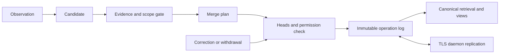

# Engram 기억 병합·망각·데몬 간 공유 설계

[English](ENGRAM_MEMORY.md) · [문서 지도](README.ko.md)

상태: **구현 인계용 목표 설계, 2026-09-11.** 사용자 요구는 유사 기억의 누적을 줄이고, 스킬·메모리를 데몬 사이에서 공유하는 것입니다. 아래 계약은 목표이며 구현 완료를 뜻하지 않습니다. Git은 선택적인 내보내기·감사 수단입니다.

## 1. 현재 구현 검토

| 근거 | 현재 동작 | 필요한 보완 |
|---|---|---|
| [engram](../plugins/engram/init.lua) | 원장 교훈, 로컬 스킬, D13 사본을 각각 저장합니다. 교훈 토큰 중복 검사·행 번호 정정, 자동 스킬의 기본 7일 미사용 보관이 있습니다. | 같은 지식의 정정·취소·망각이 사본 전체에 적용되지 않습니다. |
| [경험 저장소](../internal/adapter/experience/git/store.go) | 내용 기반 메모리 이름, 선택적 cosine 중복 검사(기본 0.93), 같은 이름 스킬 덮어쓰기입니다. | 유사도는 동일성 증거가 아닙니다. 덮어쓰기는 기존 본문을 잃고 동시 수정의 관측 횟수도 잃을 수 있습니다. |
| [계층](../internal/adapter/experience/layered/store.go) | project/team/global 검색을 합쳐 메모리 5개·스킬 3개로 제한합니다. 선택적 임베딩 검색이 있습니다. | 개수 제한 외에 토큰 예산, 정본 ID 중복 제거, Unicode 검색이 필요합니다. git 저장소의 기본 토큰화는 ASCII만 남겨 한국어 질의가 누락될 수 있습니다. |
| [exp-sync](../cmd/magi/expsync.go) | TLS로 승인된 기기 사이의 팀 메모리·위키 revision을 집합 합으로 복제합니다. 5분 주기이며 경로·내용 해시를 검사합니다. | 스킬과 메모리 철회는 복제하지 않습니다. 팀은 현재 테넌트 권한 경계가 아닙니다. |
| [위키](../internal/adapter/experience/git/wiki.go) | 불변 revision에서 현재 페이지를 계산하고 로컬 사용 이력으로 검색 제외를 판단합니다. | 재사용할 저장·복제 기반입니다. 시간순 승자 선택만으로 의미 충돌을 해결해서는 안 됩니다. |

**우선 결함:** engram은 guard/error/unverified에서도 분석을 호출하며, 결과에 skill이 있으면 호스트 outcome을 재검사하지 않고 저장합니다. 취소와 7일 보관은 로컬 파일만 바꿔 D13 스킬을 계속 회상할 수 있습니다. 원장 정정도 D13의 옛 메모리를 철회하지 않습니다. 공유 메모리를 물리 삭제하면 다른 기기의 exp-sync로 다시 들어올 수 있습니다. 이 네 경로는 새 설계 도입 전에 회귀 사례로 고정합니다.

관련 Go 테스트(경험 저장소·Lua의 Engram/Experience/Skill/Memory/Retrieve/Propose)는 이번 검토에서 통과했습니다. 위 문제는 코드 경로 검토 결과이며, 다중 사용자 실물 인수를 했다는 뜻은 아닙니다. 기존 README의 “리뷰 큐” 설명도 현재의 즉시 저장 동작과 다릅니다.

## 2. 책임과 정본

engram은 **관찰·후보 추출자**, 코어 경험 서비스는 **식별·병합·상태·검색의 단일 쓰기 주체**, fleet door는 **인증·권한 확인·복제 담당**입니다. 클라이언트는 같은 서비스의 목록·정정·철회 API를 사용합니다. 워크스페이스 데몬마다 별도의 학습 정리기를 두지 않습니다.

설치의 경험 서비스가 각 저장소의 짧은 쓰기 잠금을 중재합니다. 기존 Go 프로세스 안의 모듈로 구현하며 별도 상시 서비스 설치는 요구하지 않습니다. fleet door가 없는 로컬 실행도 기록·검색할 수 있고 공유만 지연됩니다. 분석·임베딩·네트워크 대기 동안 저장 잠금을 잡지 않습니다.

정본은 버전이 있는 지식 객체와 불변 변경 연산입니다. SESSION_SUMMARY.md, SKILL.md, 위키 페이지는 정본에서 생성하는 **보기 파일**로 전환합니다. 사람의 직접 편집은 파일 해시를 확인해 새로운 수정 후보로 가져오며, 생성기가 덮어쓰지 않습니다. 기존 파일의 비관리 영역은 유지합니다. 한 번의 관찰을 로컬과 공유 저장소에 독립적으로 다시 생성하지 않습니다.

## 3. 데이터 계약

| 필드 | 의미 |
|---|---|
| namespace_id, object_id | 각각 공유 공간 UUID와 지식 UUID. 이름·문장·폴더 위치가 바뀌어도 유지합니다. |
| kind | lesson(경험), fact(사실), procedure(절차). 위키는 관련 객체를 모아 보여줄 수 있습니다. |
| revision_id, parents[] | 정규 직렬화한 전체 payload의 SHA-256과 부모 revision들. 본문뿐 아니라 상태·범위·근거도 해시에 포함합니다. |
| claim, applies_when, excludes, procedure, verification | 주장·적용 조건·제외 조건·절차·검증 방법. OS·제품·버전·프로젝트 조건은 병합 판단에 사용합니다. |
| evidence[] | observation_id, 원본 턴/세션 참조, 호스트 outcome, 관측 시각, 기록자. 원문 대화나 비밀은 기본 공유하지 않습니다. |
| state, pinned, authored_by, visibility | active/conflicted/superseded/withdrawn 상태, 보존 지정, 사람/자동 작성, 명시적 읽기·쓰기 권한입니다. 로컬 보관 상태는 별도입니다. |
| aliases[], supersedes[], derived_from[] | 중복 정본 연결, 정정 관계, 다른 공유 범위에서 가져온 출처입니다. 범위 간 병합 대신 출처 있는 복사를 사용합니다. |
| operation_id, actor_id, expected_heads[], reason | 재시도 중복 제거, 인증된 작성자, 동시 수정 검사, 변경 사유입니다. |

본문 해시가 같아도 독립된 증거는 추가할 수 있습니다. 반대로 같은 observation_id를 재전송해도 사용·성공 횟수를 늘리지 않습니다. 조회·로딩·사용·검증 성공을 다른 지표로 저장합니다. 같은 스킬을 로드한 턴이 성공했다는 사실만으로 스킬의 인과적 기여를 확정하지 않습니다.

연산은 propose, reinforce, merge, correct, withdraw, restore입니다. 모든 변경은 actor·사유·부모를 남깁니다. 로컬 숨김·보관·pin은 자동 공유하지 않습니다. 자동 공유 범위 확대는 금지합니다.

호스트 API는 `Propose(observation)`, `PlanMerge(ids, heads)`, `Apply(plan, expectedHeadsById)`, `Withdraw(id, heads, reason)`, `Recall(query, principal, budget)`로 구분합니다. 반환에는 operation_id·현재 heads·로컬 반영 상태·공유 전파 상태를 포함합니다. stale-head·permission-denied·evidence-rejected·pending-dependencies는 구별된 결과이며 성공으로 삼키지 않습니다. 이 이름은 제안된 포트 계약입니다.

## 4. 병합 규칙

1. scope·ACL·kind·적용 조건으로 후보를 좁힙니다. 같은 팀 이름만으로 같은 namespace라고 보지 않습니다.
2. Unicode 정규화와 토큰 검색, 선택적 임베딩으로 후보 최대 20개를 찾습니다. 임베딩 미설정·장애에서도 한국어/영어 검색과 정확 중복 처리는 동작해야 합니다.
3. 같은 observation_id는 no-op, 의미 필드가 정확히 같은 기록은 정본에 근거만 추가합니다. 출처·시각은 정확 내용 비교에서 제외하되 증거로 보존합니다.
4. 유사도만 높은 기록은 분석기가 duplicate/refinement/contradiction/related/independent와 근거 구간을 제안합니다. 0.93 같은 점수 하나로 삭제하거나 덮어쓰지 않습니다.
5. 자동 병합은 같은 namespace·ACL의 자동 작성 객체에 한정합니다. 핵심 주장·조건·명령·검증 절차가 동일하고 증거만 추가되는 경우에 적용합니다. 요약으로 고유 조건이 사라질 수 있는 병합, 사람이 편집·pin한 객체, ACL이 다른 객체는 승인 후보로 남깁니다.
6. 정정은 기존 ID와 expected_heads를 지정합니다. “Windows에서 A가 실패한다”와 “Linux에서 A가 성공한다”는 별도 조건의 지식입니다. 같은 조건의 모순은 conflicted로 표시하고 두 근거를 유지합니다. 높은 점수나 최신 시각만으로 어느 쪽도 확정하지 않습니다.
7. 적용 직전 heads를 재검사합니다. 바뀌면 새 내용으로 다시 판단하고, 최대 3회 후 보류합니다. 후보 계획의 수명은 10분이며 수동 승인도 최신 diff를 대상으로 합니다.

병합은 결과 revision과 원본들의 superseded 연결을 **하나의 연산**으로 기록합니다. 조회는 같은 정본을 한 번만 반환합니다. 자동 의미 요약 병합은 첫 릴리스에서 제안만 하고, 사람이 고른 판정 사례로 오류율을 검증한 뒤 확대합니다.

### 예시

“테스트 전에 의존성을 설치한다”가 12번 표현을 바꿔 들어오면 검색 후보는 하나로 묶되, 버전별 명령과 실패 조건을 비교합니다. 같으면 정본 하나와 독립 관찰 12개가 남습니다. “오프라인에서는 설치를 건너뛴다”는 조건 추가이므로 단순 중복 삭제하지 않습니다. “의존성 설치가 프로젝트 파일을 망가뜨렸다”는 반례이며 성공 횟수에 흡수하지 않습니다.

## 5. 망각과 회상

**망각은 우선 자동 회상에서 제외하는 것**입니다. 틀린 내용을 철회하는 것, 용량 때문에 영구 삭제하는 것과 구분합니다.

| 대상 | 기본 정책(도입 시 검증할 초기값) |
|---|---|
| 중복·정정된 옛 판 | 정본으로 연결하고 자동 회상에서 즉시 제외합니다. 이력 조회·복원은 가능합니다. |
| 자동 작성·미사용 객체 | 30일간 실제 사용이 없으면 cold, 90일이면 로컬 archive 후보입니다. 기존 7일 스킬 자동 이동을 대체합니다. |
| 사람 편집·pin·활성 작업 참조 | 자동 보관 대상에서 제외합니다. 검토 필요 표시는 가능합니다. |
| 버전 기한이 지난 사실 | 만료로 표시하고 기본 회상에서 제외합니다. 필요하면 재검증합니다. 날짜가 없다고 영구 진실로 간주하지 않습니다. |
| 모순·철회 | conflicted는 양쪽 근거와 경고를 함께 조회합니다. withdrawn은 기본 회상 금지이며 명시적 감사 조회만 허용합니다. |
| 영구 삭제 | 기본 비활성입니다. namespace 관리자의 명시적 작업과 복제 확인·보존 정책을 요구합니다. |

cold/archive는 기기별 사용 이력으로 계산하며 다른 사용자의 활성 기억을 철회하지 않습니다. 새로 가입한 기기는 공유 객체의 과거 나이만으로 즉시 보관하지 않고 30일 관찰 기간을 둡니다. 사용자 복원·검증된 실제 사용은 로컬 active로 되돌립니다. 단순 검색 노출은 망각 시계를 갱신하지 않습니다.

기본 자동 회상은 정본 기준 메모리 최대 5개·스킬 최대 3개, 합계 3000토큰 이내입니다. 같은 정본의 로컬·팀 사본과 보기 파일은 provenance로 중복 제거합니다. 1개가 예산을 넘으면 조건과 출처가 있는 요약 포인터를 반환하고 명시적 상세 조회로 원문을 읽습니다. archive는 명시적 조회만, cold는 active에서 관련 결과가 부족할 때만 사용합니다. 서로 다른 ACL의 내용을 합친 요약은 만들지 않습니다.

## 6. 취소·보관·삭제의 일관성

저장 알림은 object_id·revision_id·operation_id를 가리킵니다. 취소는 그 연산을 되돌리는 새 연산입니다. 중간에 다른 사용자가 수정했으면 옛 파일을 덮어쓰지 않고 되돌림 diff를 제안합니다. engram의 짧은 N 취소 창도 같은 API를 사용합니다.

공유 후 취소는 원본과 관리되는 보기 파일·검색 인덱스·승인된 복제본에 철회를 전파합니다. scope가 다른 독립 복사본에는 출처 철회 경고를 전파하며, 권한 없이 그 복사본을 삭제하지 않습니다. 같은 revision을 재수신해도 tombstone(철회 기록)이 우선해 부활하지 않습니다. 복원은 현재 tombstone을 부모로 지정한 권한 있는 명시적 연산만 가능합니다.

복제본의 물리 삭제나 상대의 외부 백업 삭제까지 보장하지 않습니다. 화면은 “로컬 반영 / 공유 전파 대기 / 확인한 기기 수”를 구분합니다. 영구 삭제의 tombstone은 모든 승인 복제본의 확인 또는 미응답 기기 철회 전까지 제거하지 않습니다. 철회된 기기의 재가입은 최신 snapshot을 받아야 합니다. Git export는 내용 삭제 전파의 보장 범위 밖입니다.

## 7. 데몬 간 공유

기존 TLS fleet door와 기기 인증을 재사용해 experience-v2 capability를 추가합니다. 실시간 변경 알림 후 batch 전송하고, 기존 5분 anti-entropy로 누락을 복구합니다. 네트워크가 없어도 로컬 저장은 완료하고 공유 상태만 pending으로 둡니다.

**여러 사용자 지원:** 현재 “승인된 내 기기면 모든 팀에 접근” 정책을 다른 사용자 초대에 재사용하지 않습니다. namespace 관리자가 사용자/기기 키에 read·contribute·curate·admin을 부여합니다. 초대 수락 시 대상·범위를 보여주고, 등록 키와 연산 서명을 확인합니다. 사용자가 입력한 actor 문자열을 신원으로 믿지 않습니다. contribution은 허용 범위 안에서만, 기존 지식의 의미 변경·공유 철회는 curate 이상만 가능합니다. 키 철회 뒤 신규 동기화와 쓰기는 거절하며 기존 사본의 원격 소거는 보장하지 않습니다.

변경 연산 전체에 서명하고 SHA-256·schema·크기·부모 참조·ACL을 검증합니다. 수신 원문은 검색 전 검역 영역에 두며, 미검증 객체는 모델에 주입하지 않습니다. 외부 기억의 지시문은 사용자·시스템 지시보다 낮은 신뢰의 데이터로 전달합니다. 공유하기 전 비밀 탐지·출처 축약을 수행하고 의심 항목은 로컬 비공개로 보류합니다. 탐지가 완벽하다고 주장하지 않습니다.

복제 단위는 불변 연산 집합입니다. heads와 필요한 operation_id를 교환하고 재전송은 멱등 처리합니다. 정본은 DAG에서 계산합니다. 순서가 바뀌어 도착해도 같은 집합이면 같은 결과가 나와야 합니다. 독립된 증거 추가는 합집합, 서로 다른 의미 수정은 conflicted, merge는 부모가 준비된 뒤 적용합니다. 시계가 빠른 기기가 승자가 되지 않습니다. 순환 alias·없는 부모는 검역하며 부모를 요청합니다.

동시 withdraw와 edit에서는 철회를 기본 회상에 우선 적용하고 수정 내용은 충돌 이력으로 보존합니다. 동시 restore는 자신이 관찰한 tombstone만 해소하며, 모르는 철회가 남으면 활성화하지 않습니다. 자동 정리기는 namespace 관리자가 위임한 제한된 권한으로만 병합하며, 사용자의 취소도 권한 검사와 최신 heads 검사를 거칩니다.

초기 한도는 요청 4MiB·응답 2MiB·연산 64KiB·batch 400개입니다. 큰 본문은 해시가 있는 청크로 나누고 모든 청크 검증 뒤 공개합니다. namespace별 cursor·backpressure·재시도 지터를 둡니다. 읽기 권한이 없는 내용은 임베딩 서비스에도 보내지 않습니다.

v1 peer에는 v2가 관리하는 객체를 내보내지 않습니다. tombstone을 모르는 peer와 양방향 공유하면 삭제가 부활하기 때문입니다. 연결 상태에 업그레이드 필요를 표시하고 수동 export는 별도 선택으로 제공합니다. Git 없이 두 기기에서 생성→조회→정정→철회가 끝나는 것이 기본 인수 경로입니다.

## 8. 저장·경합·장애 복구

로컬 변경은 namespace 잠금 아래 expected_heads 검사→연산 파일 임시 쓰기→fsync→atomic rename→디렉터리 내구성 확보 순서로 commit합니다. 여러 객체를 바꾸는 merge도 연산 파일 하나가 가시성 경계입니다. Windows의 교체·잠금 제약에 맞는 원자 파일 구현을 재사용하고 실제 OS에서 검증합니다.

검색 인덱스와 보기 파일은 commit 이후 생성합니다. 이 작업이 실패해도 정본에서 재구축할 수 있습니다. 임베딩 모델·차원·내용 해시를 캐시 키에 포함합니다. 상태·ACL 변경 시 기존 검색 캐시를 무효화하고, 최종 반환 직전에도 권한과 state를 확인합니다.

분석기는 턴 결과의 검증을 대신하지 않습니다. procedure 자동 승격은 호스트의 verified outcome과 추적 가능한 증거를 요구합니다. guard/error/unverified/ungated가 모델 응답에서 success로 바뀌어도 승격하지 않습니다. 수동 작성·승인은 별도 출처로 기록합니다. 분석 실패는 원본 관찰을 보존하고 재시도하며, 실패를 “중복 없음”이나 “병합 완료”로 기록하지 않습니다.

정리 작업은 설치당 namespace별 하나씩, batch 100개·분석 최대 20쌍·실행당 60초를 초기 한도로 둡니다. 기본 예약 주기는 1일이며 후보 큐가 쌓여도 대화 경로를 기다리게 하지 않습니다. 중단 후 operation_id로 재개하고 같은 관찰을 다시 학습하지 않습니다. 세션 원문 보관 기간과 학습 객체 보관 기간은 별도 설정입니다.

## 9. 이행·분담·인수

첫 배포는 dry-run입니다. 기존 원장·스킬·D13·위키의 내용 해시와 출처를 스냅샷으로 남기고 import manifest에 경로→object_id→revision을 기록합니다. ID는 최초 import 때 발급해 manifest를 공유하며 기기마다 같은 파일에 새 ID를 만들지 않습니다. 이미 따로 import된 객체는 정확 중복 후보로 조정합니다. 사람 편집 내용은 보존하고 불명확한 출처·검증 상태는 unknown입니다.

읽기 경로를 통합한 뒤 engram의 다중 쓰기를 중단합니다. 관리되는 legacy 파일을 다시 읽어 새 지식으로 가져오는 루프를 manifest로 막습니다. v2 활성 namespace는 구형 쓰기 경로를 막고, 롤백 시에는 v2를 읽기 전용으로 보존한 채 명시적 export를 사용합니다. tombstone을 잃는 자동 다운그레이드는 허용하지 않습니다.

| 작업 | 소유 모듈·산출물 | 의존 |
|---|---|---|
| A | port·경험 서비스: 객체/연산 schema, 원자 저장, heads·ACL·검증 게이트 | 없음 |
| B | engram/Lua bridge: 관찰 ID, 단일 propose, 정정·취소·망각 API 연결 | A |
| C | 검색·병합: Unicode, 후보 판단, provenance 중복 제거, budget, dry-run 보고 | A |
| D | fleet door/identity: namespace 권한, v2 연산·tombstone 복제, 오프라인 복구 | A |
| E | 콘솔: 병합 diff·근거·범위·충돌·복원·전파 상태, 사람 편집 import | A–D |
| F | migration·실물 QA: 기존 자료·다중 프로세스·Windows/macOS/Linux 인수 | A–E |

| 사례 | 통과 조건 |
|---|---|
| M01 반복 학습 | 같은 관찰 100회 재전송은 증거 1개. 같은 기법의 독립 관찰 20개는 정본 1개·증거 20개입니다. |
| M02 조건·모순 | 한국어/영어 동의어, 부정문, OS·버전 차이에서 서로 다른 주장을 자동으로 잃지 않습니다. |
| M03 잘못된 성공 | guard/error 응답에 skill JSON을 강제해도 procedure가 활성화되지 않습니다. |
| M04 취소·정정 | 저장→D13 회상→취소/정정 후 모든 관리 보기와 다음 회상에 옛 판이 나오지 않습니다. |
| M05 오프라인 | A 철회, B 오프라인 수정, 재접속·역순·중복 전송 후 부활하지 않고 충돌 근거는 보존합니다. |
| M06 망각 | 로딩만으로 수명이 연장되지 않습니다. pin·사람 수정·다른 사용자의 활동은 자동 철회되지 않습니다. |
| M07 경합·중단 | 두 프로세스 병합/취소와 각 commit 단계 강제 종료 후 단일 정본 또는 명시적 충돌로 복구합니다. |
| M08 권한 | 다른 namespace·위조 actor·철회 키·ACL 확대·악성 경로·해시 변조를 거절합니다. 구형 peer가 tombstone을 우회하지 못합니다. |
| M09 규모 | 1만 객체에서 warm 로컬 후보 검색 p95 200ms를 초기 목표로 측정합니다. 임베딩 원격 시간은 따로 보고하며 회상 3000토큰을 지킵니다. |
| M10 이행 | import 2회·보기 재생성·사용자 편집·롤백에서 원문과 출처를 잃거나 재학습 중복을 만들지 않습니다. |

출시 보고는 정본/중복 후보/충돌 수, 자동 병합 오류, 철회 후 재등장, 범위 밖 노출, 검색 누락, 전파 지연을 기록합니다. 문장 수 감소만으로 성공을 판단하지 않습니다. M01–M08·M10은 필수이며, M09 성능은 하드웨어·모델·코퍼스를 함께 명시합니다.
