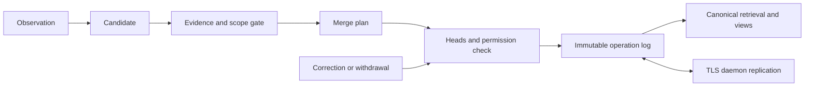

# Engram consolidation, forgetting and daemon sharing

[한국어](ENGRAM_MEMORY.ko.md) · [Documentation map](README.md)

Status: **target design for implementation handoff, 2026-09-11.** The requirements are to reduce repeated knowledge and share skills/memories between daemons. These contracts are targets, not completed behavior. Git is an optional export/audit mechanism.

## 1. Implementation review

| Evidence | Current behavior | Gap |
|---|---|---|
| [engram](../plugins/engram/init.lua) | Writes ledger lessons, local skills and D13 copies separately. Includes token deduplication, row-number correction and default seven-day unused-skill archiving. | Correction, cancellation and forgetting do not cover every copy. |
| [Experience store](../internal/adapter/experience/git/store.go) | Content-based memory names, optional cosine deduplication (default 0.93), same-name skill replacement. | Similarity does not prove identity. Replacement loses the previous body; concurrent writes can lose observation counts. |
| [Layers](../internal/adapter/experience/layered/store.go) | Combined project/team/global retrieval capped at five memories and three skills; optional embedding search. | Needs a token budget, canonical-ID deduplication and Unicode search. Default git-store tokenization retains ASCII only and can miss Korean queries. |
| [exp-sync](../cmd/magi/expsync.go) | TLS replication between admitted machines, using set union for team memories/wiki revisions every five minutes; path/content checks. | Does not replicate skills or memory withdrawal. Teams are not currently tenant authorization boundaries. |
| [Wiki](../internal/adapter/experience/git/wiki.go) | Immutable revisions determine current pages; local usage affects retrieval retirement. | Reuse its storage/replication foundation, but chronological winner selection does not resolve semantic conflicts. |

**Priority defects:** engram analyzes guard/error/unverified turns and saves a returned skill without rechecking host outcome. Cancellation and seven-day archiving change only local files, leaving D13 skills retrievable. Ledger correction does not withdraw old D13 memories. Physically deleted shared memories can return through another machine's exp-sync. Establish these four paths as regression cases before migration.

Targeted experience-store/Lua tests matching Engram/Experience/Skill/Memory/Retrieve/Propose passed during this review. These findings come from code paths, not a multi-user deployment test. The existing README's “review queue” description also disagrees with immediate storage.

## 2. Responsibilities and authority

Engram **observes and extracts candidates**. The core experience service is the **single writer for identity, consolidation, state and retrieval**. The fleet door handles **authentication, authorization and replication**. Clients use the same inventory/correction/withdrawal API. Do not create a separate knowledge-maintenance system for each workspace daemon.

The installation's experience service coordinates short per-store write locks. Implement it as a module in existing Go processes, without requiring another installed service. Local recording/retrieval works without the fleet door; sharing waits. Do not hold storage locks during analysis, embedding or network calls.

Versioned knowledge objects and immutable operations are authoritative. SESSION_SUMMARY.md, SKILL.md and wiki pages become generated **views**. Detect human edits by file hash and import them as revision candidates; generators must not overwrite them. Preserve unmanaged file regions. Do not independently recreate one observation in both local and shared stores.

## 3. Data contract

| Field | Meaning |
|---|---|
| namespace_id, object_id | Sharing-space UUID and knowledge UUID, stable across renames, paraphrases and file moves. |
| kind | lesson, fact or procedure. Wiki pages may assemble related objects. |
| revision_id, parents[] | SHA-256 of the canonical full payload and parent revisions. Hash state, scope and evidence as well as body. |
| claim, applies_when, excludes, procedure, verification | Assertion, applicability, exclusions, steps and checks. OS/product/version/project constraints participate in consolidation. |
| evidence[] | observation_id, source turn/session reference, host outcome, observation time and contributor. Do not share raw conversations or secrets by default. |
| state, pinned, authored_by, visibility | active/conflicted/superseded/withdrawn, retention pin, human/automatic authorship and explicit read/write policy. Local archiving is separate. |
| aliases[], supersedes[], derived_from[] | Canonical duplicate links, corrections and provenance across scopes. Copy with provenance rather than merging across scopes. |
| operation_id, actor_id, expected_heads[], reason | Retry deduplication, authenticated contributor, concurrency check and change reason. |

Identical content may have additional independent evidence. Replaying an observation_id must not increase usage/success counts. Track retrieval, loading, application and verified success separately. A successful turn that loaded a skill does not by itself prove the skill caused success.

Operations are propose, reinforce, merge, correct, withdraw and restore. Every change records actor, reason and parents. Local hiding, archiving and pins are not automatically shared. Automatic widening of visibility is prohibited.

Proposed host ports are `Propose(observation)`, `PlanMerge(ids, heads)`, `Apply(plan, expectedHeadsById)`, `Withdraw(id, heads, reason)` and `Recall(query, principal, budget)`. Return operation_id, current heads, local completion and propagation state. Distinguish stale-head, permission-denied, evidence-rejected and pending-dependencies instead of reporting success. These are proposed interfaces.

## 4. Consolidation rules

1. Narrow by scope, ACL, kind and applicability. Matching team names do not establish namespace identity.
2. Find at most 20 candidates using Unicode normalization/token search and optional embeddings. Korean/English lexical retrieval and exact deduplication must work without an embedding service.
3. Repeated observation_id is a no-op. Exact semantic-field matches reinforce the canonical object. Exclude source/time from content equality while preserving them as evidence.
4. Similar records receive an analyzer proposal: duplicate/refinement/contradiction/related/independent, with supporting spans. Never delete or overwrite based solely on a score such as 0.93.
5. Automatic consolidation is limited to automatically authored objects in the same namespace/ACL whose claims, conditions, commands and verification steps are identical; only evidence is added. Summarizing away unique conditions, human-edited/pinned objects and differing ACLs require review.
6. Corrections name an existing ID and expected_heads. “A fails on Windows” and “A succeeds on Linux” are conditional knowledge, not duplicates. Contradictions under the same conditions become conflicted, preserving both sources. Neither similarity nor a recent timestamp decides truth.
7. Recheck heads immediately before applying. Recompute against changes, at most three attempts, then defer. Plans expire after ten minutes; manual approval must also show a current diff.

One merge operation contains the resulting revision and the originals' superseded links. Retrieval returns each canonical object once. The first release proposes semantic-summary merges without automatically applying them. Expand automation only after evaluating human-labeled cases.

### Example

Twelve paraphrases of “install dependencies before testing” become one candidate group. Compare version-specific commands and failure conditions. Equivalent entries yield one canonical object and twelve independent observations. “Skip installation offline” adds a condition and must not be dropped. “Installation damaged project files” is counterevidence, not another success count.

## 5. Forgetting and recall

**Forgetting first means removal from automatic recall.** Distinguish it from withdrawing incorrect content and permanently deleting stored data.

| Object | Default policy: initial values to validate |
|---|---|
| Duplicates/superseded revisions | Link to the canonical revision and immediately exclude from automatic recall. History and restoration remain available. |
| Automatically authored, unused objects | Cold after 30 days without actual application; local archive candidates after 90 days. Replaces seven-day automatic skill moves. |
| Human edits, pins, active-task references | Exempt from automatic archiving; may receive a review reminder. |
| Version-expired facts | Mark expired and exclude by default; revalidate when needed. Missing dates do not imply permanent truth. |
| Conflicted/withdrawn | Conflicts return both sources with a warning. Withdrawn objects are excluded except from explicit audit queries. |
| Permanent deletion | Disabled by default. Requires an explicit namespace-admin action, replication acknowledgments and retention policy. |

Cold/archive are local usage decisions and must not withdraw knowledge another user needs. A newly joined device gets a 30-day observation window instead of immediately archiving old shared objects. Explicit restoration or verified actual use returns local state to active. Search exposure alone does not refresh age.

Default automatic recall returns at most five canonical memories and three skills within 3,000 tokens total. Deduplicate local/team copies and generated views through provenance. Oversized objects return a summary pointer retaining conditions/source, with explicit full retrieval. Archives require explicit queries; cold objects are a fallback when active results are insufficient. Do not summarize across incompatible ACLs.

## 6. Consistent cancellation, archiving and deletion

Save notifications identify object_id, revision_id and operation_id. Cancellation is a compensating operation. If another contributor has edited meanwhile, propose a revert diff instead of restoring an old file. Engram's short N cancellation window uses this same API.

After sharing, cancellation propagates withdrawal to the original, managed views, retrieval indexes and authorized replicas. Independently copied objects in another scope receive a source-withdrawal warning; do not delete them without authority. Tombstones suppress retransmitted old revisions. Restoration requires an authorized explicit operation naming the current tombstone as parent.

Do not promise physical erasure of peer copies or external backups. Show local completion, pending propagation and acknowledged-device count separately. Retain deletion tombstones until all admitted replicas acknowledge or unresponsive devices are revoked. Rejoining revoked devices must bootstrap from a current snapshot. Git exports are outside deletion-propagation guarantees.

## 7. Daemon sharing

Reuse the TLS fleet door and device identity with an experience-v2 capability. Notify on changes, transfer batches and retain five-minute anti-entropy for repair. Local writes finish offline; sharing remains pending.

**Multiple users:** Do not reuse “my admitted machine may access every team” for another user's invitation. A namespace administrator grants read/contribute/curate/admin to user/device keys. Show invitation scope on acceptance and verify registered keys and operation signatures. An actor string supplied by the caller is not identity. Contributions stay within grants; semantic edits to existing knowledge and shared withdrawal require curate or above. Revoke new sync/write access when keys are revoked; do not promise erasure of existing copies.

Sign the complete operation and validate SHA-256, schema, size, parents and ACL. Quarantine incoming content before retrieval; unverified objects never enter model context. External-memory instructions remain lower-trust data than user/system instructions. Before sharing, scan for secrets and minimize provenance; suspicious items remain private locally. Detection is not guaranteed complete.

Replicate immutable operation sets. Exchange heads and missing operation_ids; retries are idempotent. Derive current state from the DAG so equal sets produce equal results regardless of delivery order. Independent evidence combines, concurrent semantic edits conflict, and merges wait for parents. A fast clock does not win. Quarantine cyclic aliases/missing parents and request dependencies.

For concurrent withdrawal and editing, suppress automatic recall while retaining the edit in conflict history. Restoration resolves only tombstones it names; an unseen withdrawal keeps the object inactive. Automatic maintenance uses narrowly delegated namespace permissions, and user cancellation also checks authorization and current heads.

Initial limits: 4 MiB requests, 2 MiB responses, 64 KiB operations and 400 operations per batch. Chunk large bodies by hash and expose them only after every chunk verifies. Use per-namespace cursors, backpressure and retry jitter. Never send unreadable content to an embedding service.

Do not export v2-managed objects to v1 peers. Bidirectional sharing with tombstone-unaware peers resurrects deleted content. Show upgrade-required state; manual export is separate. The default acceptance path is create→retrieve→correct→withdraw on two machines with no Git.

## 8. Storage, concurrency and recovery

Under a namespace lock, check expected_heads, write a temporary operation file, fsync, atomically rename and ensure directory durability. A multi-object merge still has one operation file as its visibility boundary. Reuse platform-correct atomic-file support and test Windows locking/replacement behavior on the actual OS.

Build indexes and view files after commit; both are rebuildable from authoritative operations. Embedding caches include model, dimensions and content hash. State/ACL changes invalidate retrieval caches, and final return rechecks permission and state.

The analyzer cannot verify a turn. Automatic procedure promotion requires the host's verified outcome and traceable evidence. guard/error/unverified/ungated must not become active procedures merely because the model says success. Record manual authorship/approval separately. Preserve observations on analysis failure and retry; do not label failure as “no duplicates” or “merge completed.”

Initial maintenance limits are one worker per namespace per installation, batches of 100 objects, at most 20 analyzed pairs and 60 seconds per run. Schedule daily by default; queues must not block conversation work. Resume by operation_id without learning the same observation twice. Raw-session retention and learned-object retention are separate settings.

## 9. Migration, ownership and acceptance

Start with dry-run. Snapshot source hashes/provenance from ledger, skills, D13 and wiki, recording path→object_id→revision in an import manifest. Allocate IDs on first import and share that manifest rather than issuing fresh IDs on each device. Reconcile independently imported objects as exact-duplicate candidates. Preserve human edits; uncertain provenance/verification is unknown.

Unify readers before ending engram's multiple writes. Use the manifest to prevent generated legacy files from being imported as new knowledge. Block legacy writers for v2-enabled namespaces. Rollback preserves v2 read-only and uses explicit export; automatic downgrade that discards tombstones is prohibited.

| Work | Owned modules and deliverables | Depends on |
|---|---|---|
| A | Ports/experience service: object/operation schema, atomic storage, heads/ACL/outcome gate | None |
| B | Engram/Lua bridge: observation IDs, single propose, correction/cancellation/forgetting API | A |
| C | Retrieval/consolidation: Unicode, candidate decisions, provenance deduplication, budgets, dry-run report | A |
| D | Fleet door/identity: namespace grants, v2 operations/tombstones, offline repair | A |
| E | Console: merge diff, evidence, scope, conflicts, restore, propagation status, human-edit import | A–D |
| F | Migration/live QA: legacy data, multiple processes, Windows/macOS/Linux acceptance | A–E |

| Case | Required result |
|---|---|
| M01 Repeated learning | Replaying one observation 100 times creates one evidence entry. Twenty independent equivalent observations yield one canonical object and twenty evidence entries. |
| M02 Conditions/conflicts | Korean/English synonyms, negation and OS/version differences do not silently lose distinct claims. |
| M03 False success | Injecting skill JSON into guard/error analysis cannot activate a procedure. |
| M04 Cancellation/correction | After save→D13 recall→cancel/correct, managed views and subsequent recall exclude the old revision. |
| M05 Offline | A withdraws while B edits offline; reconnect, reordered and duplicated delivery cannot resurrect the object, while conflict evidence survives. |
| M06 Forgetting | Loading alone does not extend lifetime. Pins, human edits and another user's activity are not automatically withdrawn. |
| M07 Races/crashes | Concurrent merge/cancel and termination at every commit boundary recover to one canonical state or an explicit conflict. |
| M08 Authorization | Reject wrong namespace, forged actor, revoked key, ACL escalation, malicious paths and modified hashes. Old peers cannot bypass tombstones. |
| M09 Scale | Initial target: warm local candidate search p95 200 ms for 10,000 objects. Report remote embedding time separately and enforce the 3,000-token recall budget. |
| M10 Migration | Repeated imports, regenerated views, human edits and rollback preserve content/provenance without relearning duplicates. |

Release reports include canonical/duplicate/conflict counts, incorrect automatic merges, post-withdrawal reappearance, scope leaks, retrieval misses and propagation latency. Fewer sentences alone do not establish success. M01–M08 and M10 are mandatory; report hardware, model and corpus for M09 performance.
