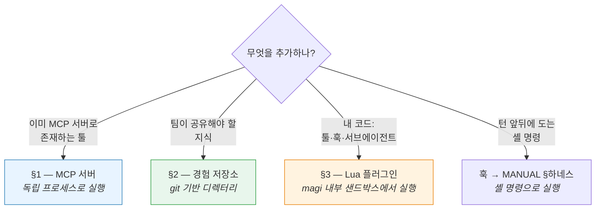
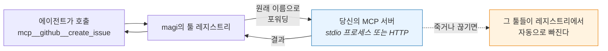
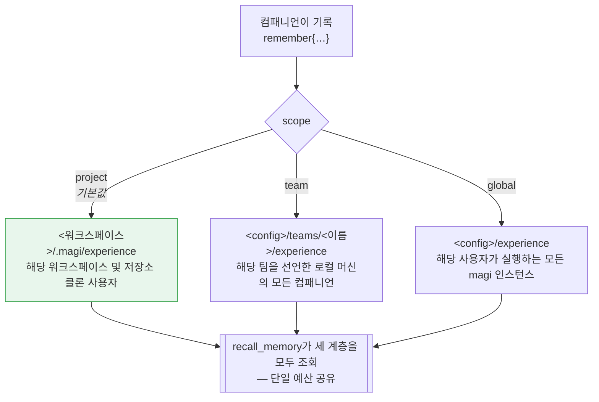
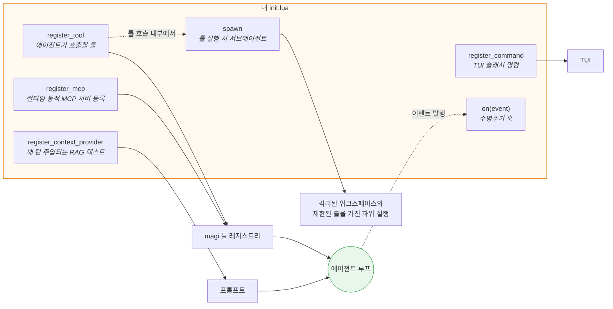
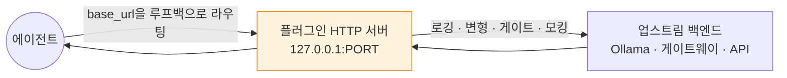
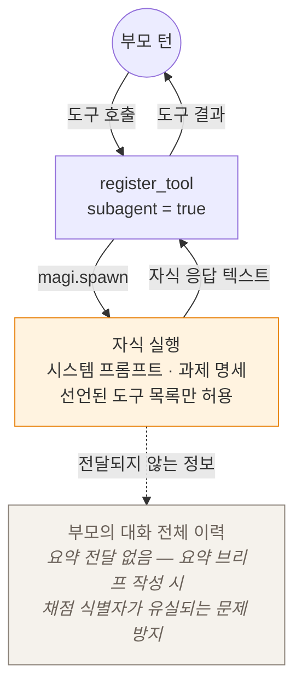

# magi — 확장 가이드

[English](EXTENDING.md) · [한국어](EXTENDING.ko.md) · [↑ Docs](README.ko.md)

magi의 기본 제공 범위를 넘어 기능을 확장하기 위한 실전 가이드입니다. 에이전트에 새로운 도구를 연동하거나, 팀 공유 경험 저장소를 구축하거나, 루프 내부에 고유한 로직을 추가하는 방법을 다룹니다. 각 단계별 구성 절차와 오류 발생 시 진단 방법을 상세히 기술합니다.

### 어느 수단을 쓸 것인가

확장 방식은 네 가지이며, 추가하려는 구성 요소가 **실제로 실행되는 위치**에 따라 적절한 수단을 선택합니다:



| 수단 | 사용 시점 | 저장/설정 위치 |
|---|---|---|
| **MCP 서버** (§1) | 해당 기능이 이미 MCP 서버로 존재하거나, 별도 독립 프로세스로 격리 실행하고자 할 때 | `config.toml`의 `[mcp.*]` |
| **경험 저장소** (§2) | 단일 세션을 넘어 팀 전체에 공유되는 교훈·스킬·위키 지식을 관리하고자 할 때 | 로컬 디렉터리 (선택적으로 git 저장소 연동) |
| **Lua 플러그인** (§3) | 고유 툴·라이프사이클 훅·컨텍스트 주입·슬래시 명령·서브에이전트를 구현하고자 할 때 | `<config>/plugins/<이름>/` |
| **훅** | 턴 시작/종료 또는 편집 전후에 셸 명령을 실행하고자 할 때 | `config.toml`의 `hooks` |

트랜스포트 관련 관심사(인증 헤더·TLS·프록시·재시도 등)는 플러그인이나 MCP 서버가 아니라 Go `http.RoundTripper` 심(`openai.WithHTTPClient`) 계층에서 처리합니다. [`ARCHITECTURE.ko.md`](ARCHITECTURE.ko.md) §11을 참고하십시오.

아키텍처 개념은 [`ARCHITECTURE.ko.md`](ARCHITECTURE.ko.md) §11·§7에, 구현된 확장의 사용법은 [`MANUAL.ko.md`](MANUAL.ko.md) §7·§9·§10에 있습니다.

---

## 0. 설정 파일과 우선순위 (공통)

두 기능 모두 `config.toml`로 켭니다. 로딩 순서(`cmd/magi/main.go`):

1. **전역**: `<config>/config.toml`
   - macOS: `~/Library/Application Support/magi/config.toml`
   - Linux: `~/.config/magi/config.toml`
2. **프로젝트**: `<workdir>/.magi/config.toml` (팀이 repo에 커밋 → 워크플로가 repo를 따라다님)

병합 규칙:

| 키 | 병합 방식 |
|---|---|
| `hooks`, `allow`, `deny`, `allow_domains` | **append**(전역 + 프로젝트) |
| `experience_dir`, `profile`, `sandbox` 등 스칼라 | 프로젝트가 **override** |
| `[mcp.*]` 맵 | **키 단위 병합** — 같은 키는 프로젝트가 override |

> 파일이 없어도 에러가 아닙니다. 둘 다 없으면 기본값으로 동작.

---

## 1. MCP 서버 추가

MCP(Model Context Protocol)는 파일시스템 서버, GitHub 클라이언트, 사내 서비스 등 magi 외부의 기능을 에이전트에 연동하는 표준 프로토콜입니다. 설정에 서버를 선언하면 magi가 프로세스를 구동하거나 원격 엔드포인트에 접속하여, 모델에 내장 기본 툴(`read`, `bash` 등)과 동일한 단일 목록으로 도구를 노출합니다.



MCP 서버는 **stdio 또는 HTTP 전송(Streamable HTTP)**으로 연결되며, 핸드셰이크 완료 후 서버가 보고한 툴이 빌트인 툴과 **동일한 레지스트리에 자동 등록**됩니다. 등록 이름은 충돌 방지를 위해 **네임스페이스화**됩니다 — `mcp__<서버라벨>__<원격툴명>`(예: `[mcp.filesystem]`의 `read` → `mcp__filesystem__read`). 레지스트리는 이름 기반 인덱스를 사용하므로, 네임스페이싱이 없으면 외부 서버의 `read`/`write`/`list` 툴이 **빌트인을 섀도잉(shadowing)**하거나 복수의 서버가 서로를 덮어쓰게 됩니다. 네임스페이스 접두사가 이를 방지합니다. 실제 도구 호출 시에는 원격 원본 이름으로 변환되어 전달됩니다. stdio 서버 프로세스가 종료되거나 HTTP 서버 연결이 끊기면 해당 툴은 레지스트리에서 자동으로 제거됩니다(`internal/adapter/mcp/`).

### 1.1 선언

`config.toml`에 `[mcp.<name>]` 블록을 추가합니다. `<name>`은 관리용 식별 라벨이자 **툴 이름의 네임스페이스**(`mcp__<name>__<원격툴명>`)로 사용되므로, 간결하고 툴 식별자 규격([A-Za-z0-9_-])에 부합하는 이름을 지정해야 합니다(그 외 문자는 `_`로 치환됩니다).

**stdio 전송** (로컬 하위 프로세스 spawn):
```toml
# 예: 파일시스템 MCP 서버
[mcp.filesystem]
command = "npx"
args = ["-y", "@modelcontextprotocol/server-filesystem", "."]

# 예: 환경변수가 필요한 서버 (예: GitHub)
[mcp.github]
command = "npx"
args = ["-y", "@modelcontextprotocol/server-github"]
env = ["GITHUB_PERSONAL_ACCESS_TOKEN=ghp_xxx"]   # "KEY=VALUE" 문자열 배열
```

**HTTP 전송** (원격 또는 로컬 HTTP 서버 엔드포인트):
```toml
# 예: HTTP로 실행 중인 MCP 서버
[mcp.remote]
url = "http://localhost:3000/mcp"

# 예: 커스텀 헤더와 환경변수 참조
[mcp.authenticated]
url = "${MCP_SERVER_URL}"  # 환경변수 치환 지원
[mcp.authenticated.headers]
Authorization = "Bearer ${MCP_API_TOKEN}"
X-Client-ID = "magi-client"
X-Environment = "${DEPLOY_ENV}"
```

필드 명세 (`config.MCPServer`):

| 필드 | 타입 | 설명 |
|---|---|---|
| `url` | string | HTTP 엔드포인트 (Streamable HTTP 전송). `url`이 설정되면 `command`는 무시됩니다. `${VAR}` 환경변수 확장을 지원합니다. |
| `headers` | map[string]string | HTTP 커스텀 헤더 (HTTP 전송용). `${VAR}` 환경변수 확장을 지원합니다. |
| `command` | string | 실행할 바이너리 경로 또는 이름 (PATH에서 검색, stdio 전송용). |
| `args` | []string | 커맨드라인 인자 목록 (stdio 전송용). |
| `env` | []string | `"KEY=VALUE"` 형식의 환경변수 목록. 기존 프로세스 환경에 추가(append)됩니다(stdio 전송용). |

> **전송 방식 결정**: `url` 필드가 지정되면 HTTP 전송을 사용하며, 생략된 경우 stdio 전송을 사용합니다.

> **환경변수 확장**: HTTP `url`과 `headers` 값 내의 `${ENV_VAR}` 패턴은 런타임에 실제 환경변수로 대체됩니다. 해당 환경변수가 존재하지 않거나 빈 문자열인 경우 원본 리터럴이 유지됩니다. 이를 통해 설정 파일에 시크릿을 하드코딩하지 않고 환경변수를 통해 안전하게 주입할 수 있습니다.

> **HTTP 및 HTTPS 지원**: 두 프로토콜 모두 지원됩니다. 로컬 개발 및 테스트 환경에서는 `http://`를 사용할 수 있고, 프로덕션 환경에서는 `https://`를 권장합니다.

> ⚠️ **시크릿 관리 주의**: `env`에 토큰을 직접 기재하면 `config.toml`에 평문으로 노출됩니다. 프로젝트 `.magi/config.toml`을 버전 관리 저장소에 커밋하는 경우 인증 토큰을 포함하지 마십시오. 전역 `config.toml`에 두거나, 래퍼 스크립트가 OS 키체인 또는 `MAGI_*` 환경변수에서 값을 읽어 하위 프로세스에 전달하도록 구성해야 합니다.

### 1.2 검증

1. 서버 바이너리를 **터미널에서 수동으로 실행**하여 설치 상태 및 PATH를 사전에 확인합니다(예: `npx -y <pkg>` 실행 후 표준 입력 대기 상태로 유지되면 정상 — Ctrl+C로 종료).
2. magi 실행. 등록 실패 시 표준 오류(stderr)로 로그가 출력됩니다:
   ```
   magi: mcp "github": <사유>
   ```
   (spawn 실패, 핸드셰이크 실패, tools/list 실패 등) — 해당 출력이 없으면 정상 등록된 것입니다.
3. TUI 환경에서 **`/tools`** 명령을 입력하여 등록된 툴 목록을 확인합니다. MCP 툴은 §1.1의 규칙에 따라 **`mcp__<서버라벨>__<원격툴명>`** 형식으로 표시됩니다. 헤드리스 환경에서는 `magi -p "사용 가능한 툴을 나열해줘"` 명령으로 확인할 수 있습니다.

### 1.3 동작 & 주의

- **권한 정책**: MCP 툴 호출도 일반 툴과 동일하게 권한 모드(`ask`/`auto`/`allow`/`deny`) 및 정책 엔진을 거쳐 검증됩니다. 또한 `mcp__` 네임스페이스를 가진 모든 MCP 툴은 **위험 툴(danger tool)**로 분류됩니다. 즉, `ask` 및 `auto` 모드에서는 호출마다 사용자 확인을 요구하고, `deny` 모드에서는 즉시 거부되며, `allow` 모드에서만 사전 승인 없이 실행됩니다. 외부 서버가 인자를 수신하여 수행하는 작업을 magi 내부에서 사전에 증명할 수 없으므로 기본 정책은 항상 사용자 확인을 요구합니다. 신뢰하는 툴은 allow 규칙(`allow = ["mcp__github__search(**)"]`)을 정의하거나 승인 모달의 "always" 옵션을 통해 세션 동안 프롬프트를 건너뛸 수 있으며, 위험한 툴은 `deny` 규칙으로 차단할 수 있습니다.
- **이름 충돌 방지**: 서버 식별 라벨이 툴 이름의 접두사로 포함되므로 서로 다른 서버 간의 동일한 툴 이름이 충돌하지 않으며, 서버의 `read`/`write`/`list` 툴이 내장 빌트인 툴을 가리는 현상도 방지됩니다. 유일하게 발생 가능한 충돌은 **동일한 라벨을 중복 선언한 경우**뿐이며, `[mcp.<name>]`이 맵 구조로 파싱되므로 설정 병합 단계에서 하나로 통합됩니다.
- **프로세스 단절 처리**: 세션 도중 서버 프로세스가 종료되면 해당 툴들만 레지스트리에서 제거되며 세션 자체는 중단 없이 계속됩니다.
- **이미지 응답 처리**: 도구 실행 결과로 이미지가 반환될 수 있습니다. `image` 콘텐츠 블록은 디코딩 후 최대 8MB로 크기가 제한됩니다(텍스트 결과는 64KB에서 절단되지만, 이미지는 독립적인 상한을 갖습니다). 수신된 이미지는 턴 종료 시 삭제되는 임시 작업 스크래치가 아니라, **데몬 데이터 디렉터리의 세션 저장소**에 영속화되어 사후 로그 뷰어에서도 확인할 수 있습니다. 세션 로그에는 파일 경로가 기록되고 실제 바이너리는 파일로 저장됩니다. 모델 레지스트리에 비전 입력 지원이 명시된 모델에만 이미지가 직접 프롬프트로 전달되며, 텍스트 전용 모델에는 이미지가 도착했다는 사실과 저장 경로 안내만 결과 텍스트로 전달됩니다. 디스크 공간 부족 등으로 이미지를 저장할 수 없는 경우 빈 문자열 대신 오류 사유가 결과에 기록됩니다. 생성된 지 30일이 경과한 이미지는 기동 시 자동으로 정리되며, 파일이 삭제된 후에도 로그 레코드에는 원본 파일명과 MIME 형식 정보가 보존됩니다.

### 1.4 런타임으로 붙이기 — 서버가 곧 애플리케이션인 경우

정적 설정(`config.toml`)에 선언하는 방식은 **운영자가 사전에 설치한** 서버에 적합하며, 데몬 프로세스의 수명 주기 동안 유지됩니다. 그러나 에디터 플러그인, 프레젠테이션 슬라이드 애드인 등 사용자가 활성화한 애플리케이션 자체가 도구 서버 역할을 하는 환경에서는 이러한 정적 방식이 적합하지 않습니다. 해당 서버는 애플리케이션 자체의 생명주기에 따라 기동 및 종료되므로, 기동 시점에 정적 설정 파일을 읽는 방식으로는 유연하게 대응할 수 없습니다.

이러한 애플리케이션은 데몬 도메인 소켓을 통해 런타임에 동적으로 자신을 연결합니다:

| 메서드 | 인자 | 수행 작업 |
|---|---|---|
| `mcp-attach` | `name`, `url`, `headers`(선택) | HTTP MCP 서버에 접속하여 툴을 `mcp__<name>__<tool>`로 등록하고, **실제 등록된 툴 식별자 목록**을 반환합니다. |
| `mcp-detach` | `name` | 해당 서버와 연동된 툴을 제거하고, 실제 제거 대상이 존재했는지 여부를 반환합니다. |

Go SDK 인터페이스: `daemon.Client.AttachMCP` / `DetachMCP`. 이 엔드포인트는 다음과 같은 설계 원칙과 보안 제약을 가집니다:

- **URL만 허용하며 커맨드라인 실행은 지원하지 않습니다**: 이 엔드포인트는 하위 프로세스를 실행(spawn)하지 않으므로 보안 경계를 유지합니다. (임의 커맨드라인 실행을 수반하는 `[mcp.*]` 섹션이 샌드박스 플러그인에 금지되는 이유와 동일합니다.) 호출자에게 프로세스 실행 권한을 부여하지 않고 이미 기동된 엔드포인트 연동만을 허용합니다.
- **런타임 전용이며 설정 파일에 기록하지 않습니다**: 임시 실행된 애플리케이션의 엔드포인트가 영속 설정 파일에 기록되어 데몬 재기동 시 연결 실패를 유발하지 않도록 합니다. 데몬이 재시작되면 런타임 연결 정보는 초기화되며, 애플리케이션이 재연결을 수행합니다.
- **단순 수신 확인(ack)이 아닌 실제 등록 증거를 반환합니다**: `ok` 문자열만 반환할 경우 핸드셰이크 성공 여부만 알 수 있지만, `mcp__ppt__render, mcp__ppt__open`과 같이 등록된 도구 목록을 반환하면 클라이언트가 즉시 호출 가능한 도구를 검증할 수 있습니다. 반환 목록이 비어 있는 경우 서버는 연결되었으나 제공 도구가 없음을 명확히 판단할 수 있습니다.
- **Detach 시 기존 등록 해제 여부를 반환합니다**: 애플리케이션 충돌 후 재연결 시 정리 작업이 필요한 상태인지 이미 해제된 상태인지 명확히 전달합니다. 설정 파일에 운영자가 선언한 고정 서버에 대한 detach 요청은 **거부**됩니다. 이 엔드포인트는 자신이 동적으로 연동한 서버만 관리할 수 있습니다.
- **사전 기능 조회를 권장합니다**: 엔진의 기능 지원 여부는 빌드 속성이 아닌 선택적 기능이므로, `about` 응답에서 `tool-servers` 지원 여부를 광고합니다. 클라이언트는 실제 메서드 호출 전에 지원 여부를 확인하여 불필요한 거부 응답 처리를 방지할 수 있습니다.

동적 등록이 완료된 툴은 일반 MCP 툴과 동일하게 취급되며, `mcp__` 명명 규칙, 위험 툴 분류 및 권한 확인 정책(§1.3)이 동일하게 적용됩니다.

### 1.5 트러블슈팅

| 증상 | 원인/조치 |
|---|---|
| `mcp "x": exec: "cmd": not found` | `command`가 PATH에 없음 → 절대경로 지정 또는 패키지 설치 |
| 등록은 됐는데 `/tools`에 없음 | 서버가 `tools/list`에서 빈 목록 반환 → 서버 설정/인자 확인 |
| 호출 시 인증 에러 | `env` 토큰 누락/오타 → §1.1의 환경변수 포맷(`"KEY=VALUE"`) 확인 |
| 조용히 아무 일도 없음 | `[mcp.*]`가 잘못된 파일에 있음 → §0 경로/우선순위 재확인 |

---

## 2. 공유 경험 저장소

팀 전체의 지식을 보존하고 공유하는 저장소입니다. 에이전트가 기록한 교훈, 도출된 스킬, 컴패니언이 최신 상태로 유지하는 위키 문서를 저장합니다. 실체는 로컬 디렉터리(선택적으로 git 저장소 연동)이며, 지식의 공유 범위는 세 가지 계층(Tier)으로 구분됩니다.



기본 공유 범위를 프로젝트(가장 좁은 범위)로 제한하는 이유는, 특정 프로젝트의 지식이 전역으로 무분별하게 승격되어 무관한 타 프로젝트의 프롬프트 컨텍스트를 오염시키는 문제를 원천 차단하기 위함입니다.

### 지식이 모델에 닿는 경로

세션 시작 시 디렉터리에 보존된 **메모리와 스킬을 키워드 기반으로 회수하여 시스템 프롬프트에 주입**합니다(D13). `remember` 툴은 새로 학습된 지식을 해당 디렉터리에 **즉시** 저장하며, 디렉터리가 git 저장소로 초기화되어 있는 경우 팀 간 공유가 가능합니다(`internal/adapter/experience/git/store.go`).

> ⚠️ **검색 엔진 제약 사항**: 내장 RAG 메커니즘은 **임베딩 벡터 기반 시맨틱 검색이 아니라 단어 중복도(term-overlap) 점수화 방식**입니다. 의미론적 벡터 검색이 필요한 경우 별도의 ContextProvider 또는 MCP 서버를 연동해야 합니다.

> ⚠️ **2026-08-07 정정 안내**: 과거 문서에는 `remember` 도구가 `pending/` 검토 큐에 항목을 추가하고 사용자가 이를 승인하는 구조로 기술되었으나, **해당 사전 승인 큐는 존재하지 않습니다**. `Propose` 함수는 `memories/` 및 `skills/` 디렉터리에 직접 파일을 기록하며, 이는 쓰기 작업이 후속 실행에 즉시 반영되지 못하는 문제를 방지하기 위함입니다. 지식 검토는 **사후**에 수행됩니다. 웹 콘솔의 경험 관리 화면에서 세 계층의 모든 항목과 도달 범위를 확인하고 필요 시 삭제할 수 있으며([`MANUAL.ko.md`](MANUAL.ko.md) §12), 저장소의 `git log`가 감사 추적 기록 역할을 수행합니다.

### 2.0 세 개의 층, 그리고 교훈이 어디로 가는가

경험 저장소는 세 가지 계층으로 분리되어 관리됩니다(`internal/adapter/experience/layered`). 교훈의 전파 범위는 이 계층 선택에 의해 결정됩니다:

| 층 | 경로 | 도달 범위 |
|---|---|---|
| project | `<workspace>/.magi/experience` | 해당 워크스페이스 한정 — git 저장소에 포함되므로 클론한 팀원과 공유 |
| team | `<config>/teams/<name>/experience` | 로컬 머신에서 해당 팀 식별자를 선언한 모든 컴패니언 |
| global | `<config>/experience`(또는 `experience_dir`) | 로컬 사용자가 실행하는 모든 magi 인스턴스 및 전체 프로젝트 |

팀 계층이 존재하는 이유는, 팀의 공통 규약과 지식이 단일 프로젝트에만 국한되지 않으면서도 전체 전역 시스템으로 누출되지 않아야 하기 때문입니다. 팀을 선언하지 않은 컴패니언이 `team` 스코프로 지식을 기록할 경우 **project** 계층으로 격하됩니다. 요청된 스코프보다 더 넓은 global 계층으로 자동 승격되는 일은 없으며, 이는 무관한 프로젝트의 컨텍스트 오염을 방지하기 위한 불변식입니다.

⚠ **로컬 머신 범위**: 해당 경로는 **단일 머신 내의** 디렉터리입니다. 동일한 팀이라도 복수의 개발 머신 간에는 저장소가 자동으로 동기화되지 않으므로 git 저장소를 통해 명시적으로 동기화해야 합니다. [`UI.ko.md`](UI.ko.md) §7을 참조하십시오.

회수(Retrieval) 시에는 세 계층의 항목을 **단일 토큰 예산** 내에서 취합하여 주입하므로, 계층이 늘어나더라도 프롬프트 컨텍스트가 과도하게 확장되지 않습니다. 지식 기여 시 `Scope` 파라미터가 라우팅 기준이 되며 기본값은 **project**(가장 좁은 범위)입니다.

### 2.1 디렉터리 만들기

기본 저장 경로는 `<config>/experience`입니다. 팀 단위로 지식을 공유하려면 별도의 git 저장소를 생성한 뒤 `experience_dir` 설정으로 지정합니다.

```bash
mkdir -p /path/to/team-experience/{memories,skills}
cd /path/to/team-experience && git init   # (선택) git 저장소인 경우 기여 내역이 자동 커밋됨
```

```toml
# config.toml
experience_dir = "/path/to/team-experience"   # 생략 시 <config>/experience 사용
```

레이아웃:

```
<dir>/
  memories/*.md   # 메모리 — 파일 전체 텍스트가 회수 대상
  skills/*.md     # 스킬 — 첫 줄은 요약 설명, 이후 내용은 본문 지침
```

### 2.2 메모리·스킬 파일 형식

- **메모리** (`memories/<무엇이든>.md`): **파일의 전체 텍스트**가 회수 단위로 처리됩니다. 별도의 프론트매터는 필요하지 않습니다. 태그를 포함하고자 할 경우 본문 내에 `tags: a, b` 형식으로 한 줄을 추가하면 해당 단어들도 키워드 매칭에 포함됩니다.
  ```markdown
  이 repo의 통합 테스트는 MAGI_E2E_* env가 있어야 동작한다.
  없으면 t.Skip 되므로 CI 녹색이 곧 통과를 뜻하지 않는다.

  tags: testing, e2e, ci
  ```
- **스킬** (`skills/<이름>.md`): **첫 줄은 설명(Description)**, 나머지 줄은 실행 본문 지침으로 처리됩니다. 확장자를 제외한 파일명이 스킬 식별자가 됩니다.
  ```markdown
  릴리스 컷 절차
  1. CHANGELOG 갱신 2. vX.Y.Z 태그 3. goreleaser가 CI에서 빌드…
  ```

### 2.3 회수 동작

- 매 세션 시작 시 사용자의 입력 프롬프트를 질의로 활용하여, 단어 중복도(term-overlap) 점수를 기반으로 **메모리 상위 5개 + 스킬 상위 3개**를 선별하여 주입합니다(`Retrieve`). 겹치는 단어가 없어 점수가 0점인 항목은 주입 대상에서 제외됩니다.
- 저장소 내 파일 수가 많아지더라도 주입되는 항목은 상위 N개로 제한되므로, 메모리는 **단일 사실 단위로 간결하게 분할**하여 작성하는 것이 회수 정확도 유지에 유리합니다.

### 2.4 기여 & 리뷰 (`remember`)

- 에이전트 또는 사용자의 지시에 따라 `remember` 도구가 호출되면 `memories/` 디렉터리에 `mem-<내용해시>.md` 파일로 저장되며, **다음 턴부터 즉시 회수 대상에 포함**됩니다. 저장 디렉터리가 git 저장소인 경우 best-effort 방식으로 자동 커밋됩니다. 파일명이 내용의 해시값을 기반으로 생성되므로 동일한 사실을 중복 기록하더라도 별도 사본이 생기지 않고 동일 파일로 수렴합니다.
- 스킬을 중복 학습한 경우 기존 파일을 덮어쓰지 않고 발생 횟수를 누적합니다: 메타데이터에 `observed`, `first_seen`, `last_seen`이 갱신되어, 일회성 경험과 지속적으로 관찰된 규칙을 구분할 수 있습니다.
- **사전 승인이 아닌 사후 검토 방식**: 모든 기여는 즉시 회수 대상에 반영되므로, 사후 검토를 통해 불필요한 항목을 관리합니다.
  ```bash
  cd "$EXPDIR" && git log --stat        # 학습 내역 및 변경 일시 확인
  ```
  웹 콘솔(MANUAL §12)을 통해 모든 컴패니언의 세 계층 지식 항목과 도달 범위를 조회하고 필요 시 삭제할 수 있습니다.
- 🔒 **보안 주의사항**: `remember` 도구에 인증 토큰, 비밀번호, API 키 등 민감 정보를 기록해서는 안 됩니다. 저장된 내용은 평문 마크다운 파일로 영속화되며 git 커밋 기록에 영구 보존됩니다.

### 2.5 팀 공유

`experience_dir`를 원격 git 저장소로 설정하고 팀원 간에 **pull 및 push 워크플로**를 통해 동기화합니다. magi는 지식 기록 시 로컬 `git commit`만 수행하며 자동 push/pull은 수행하지 않으므로, 원격 동기화는 팀의 표준 버전 관리 절차에 따라 수동 또는 배치 스크립트로 처리합니다.

### 2.6 트러블슈팅

| 증상 | 원인/조치 |
|---|---|
| 메모리가 주입 안 됨 | 질의와 겹치는 단어 없음 / 빈 파일 / 다른 층의 디렉터리에 있음(§2.0 확인) |
| `remember`가 "unavailable" | `experience_dir` 미설정이고 기본 경로도 없음 → §2.1로 디렉터리 생성 |
| commit이 안 됨 | 디렉터리가 git repo가 아님 → `git init`(없어도 파일 저장 자체는 됨) |

---

## 3. Lua 플러그인 — 루프 안의 내 코드

플러그인은 `<config>/plugins/<이름>/` 디렉터리에 `plugin.toml` 매니페스트와 `init.lua` 진입점 파일로 구성됩니다. 시작할 때 로드되고 파일 수정 시 핫 리로드(Hot-reload)되며, 엄격한 샌드박스 내부에서 실행됩니다 — `plugin.toml`에 선언된 권한만 사용할 수 있습니다.

플러그인이 연동될 수 있는 런타임 확장 지점은 다음과 같습니다:



각 항목은 아래의 개별 소절에서 다룹니다. 필요한 확장 지점만 선택하여 구현할 수 있으며, 가장 단순한 형태는 `register_tool` 하나만 선언된 플러그인입니다.

`config.toml` 정적 선언 외에도 **Lua 플러그인**이 런타임에 직접 MCP 서버나 Context Provider(RAG)를 등록할 수 있습니다. 플러그인 호스트에 MCP 매니저, 컨텍스트 레지스트리 및 런타임 정보가 주입되었을 때 활성화됩니다(`cmd/magi/main.go`).

### 3.1 `magi.register_mcp` — HTTP MCP 서버 등록

```lua
-- 정적 헤더 설정
magi.register_mcp{
  name = "svc",
  url = "http://localhost:3000/mcp",
  headers = { Authorization = "Bearer abc" },
}

-- 동적 헤더: 함수는 매 요청마다 재평가된다(요청 시점 값 반영, 등록 시점 freeze 아님)
magi.register_mcp{
  name = "svc",
  url = "http://localhost:3000/mcp",
  headers = function()
    return {
      ["X-Model"]     = magi.model(),     -- 현재 모델
      ["X-Platform"]  = magi.platform(),  -- darwin/linux/windows
      ["X-Timestamp"] = magi.time(),      -- 요청 시각 (RFC3339)
    }
  end,
}
```

> **정적 vs 동적**: 테이블이면 헤더가 고정(`AddHTTP`), 함수면 **요청마다 호출**(`AddHTTPDynamic`)됩니다. 함수는 플러그인 Lua 락 아래에서 직렬 실행되어 동시성에 안전합니다. 시각, 모델명, 갱신 토큰처럼 매 요청 바뀌는 값에 함수 형태를 사용합니다.

런타임 정보 조회 API: `magi.model()`, `magi.platform()`, `magi.time()`, `magi.workdir()`.

> **`magi.register_declaration_gate{ check = fn }`** — 모델이 턴 완료를 선언할 때 카운슬 심사가 소집되기 **직전에** `fn()` 검증 로직이 실행됩니다(`magi.turn_steps()` 결과 검토 가능). 반환값이 `nil`이면 통과하고, 문자열을 반환하면 선언이 거부되며 해당 문자열이 모델에게 피드백으로 전달됩니다(카운슬 거절 횟수에는 산입되지 않습니다). **`magi.council_enabled()`** 함수로 현재 환경에서 카운슬 심사 활성화 여부를 확인할 수 있습니다.
>
> **`magi.turn_steps()`** — 툴 호출 내부에서만 유효하며, 현재 턴에서 실행된 도구 호출 목록을 오래된 순서대로 반환합니다(`{name=, args=(디코드됨), failed=, output=, output_bytes=}`). `output` 필드는 실패한 호출의 경우 전체 출력이 보존되며, 성공한 호출은 6KB에서 절단됩니다. 현재 실행 중인 도구 자체는 목록에서 제외됩니다.
>
> 🔐 **`magi.nonce(nbytes?)`** — `nbytes`(기본 16) 바이트의 암호학적 난수를 16진수 문자열로 반환합니다(`crypto/rand`). Lua 샌드박스의 `math.random`은 환경 격리로 인해 결정론적으로 시드되므로, OAuth/PKCE `state`, CSRF 토큰, 요청 식별자 등 보안 목적의 난수 생성에는 반드시 `magi.nonce`를 사용해야 합니다.

### 3.2 `magi.register_context_provider` — RAG 컨텍스트 주입

등록한 provider는 **최상위 에이전트의 매 스텝에서 호출**되어, 반환한 chunk가 시스템 프롬프트의 `# Retrieved context` 섹션으로 주입됩니다(provider당 5초 타임아웃, 합산 8KB 예산 상한, 실패한 provider는 턴을 중단하지 않고 무시). 서브에이전트 실행 시에는 프롬프트 집중도 유지를 위해 호출되지 않습니다.

```lua
magi.register_context_provider{
  name = "project-rag",
  provide = function(q)
    -- q.session_id, q.workdir, q.prompt 제공
    local hits = my_search(q.prompt)            -- 고유 검색 로직
    local chunks = {}
    for _, h in ipairs(hits) do
      table.insert(chunks, { source = h.path, text = h.snippet })
    end
    return chunks                                -- {source=, text=} 배열
  end,
}
```

### 3.3 `magi.register_command` — TUI 슬래시 커맨드 등록

플러그인이 `/login`, `/logout` 같은 슬래시 커맨드를 직접 등록합니다(capability `"command"` 필요). TUI가 내장 커맨드에 없는 슬래시를 수신하면 플러그인 커맨드로 라우팅하며, 명령 팔레트 및 자동완성에도 동적으로 노출됩니다. `name`은 슬래시 접두사 없이 지정하고(`"login"` → `/login`), `execute`는 커맨드 이후 공백 분리 토큰 배열을 받습니다. **비어 있지 않은 문자열을 반환하면 에러 메시지**로 처리되어 UI에 노출되고, `nil`이면 성공으로 처리됩니다(스낵바에 `✓` 표시).

```lua
magi.register_command{
  name        = "login",
  description = "사내 SSO 재인증 수행",  -- /help 및 팔레트에 표시
  execute     = function(args)
    -- args = "/login" 이후 공백 분리 토큰
    local ok = do_sso_login(args[1])
    if not ok then return "SSO 로그인 실패" end     -- 에러: 스낵바에 표시
    return nil                                      -- 성공
  end,
}
```

### 3.4 `magi.set_llm_headers` — LLM 백엔드 커스텀 헤더

사내 게이트웨이(LiteLLM 등)가 `X-CLIENT-API-KEY` 같은 헤더를 요구하거나, 브라우저 SSO로 발급된 토큰을 인증키로 주입해야 할 때 사용합니다. 테이블이면 정적, 함수면 **요청마다 재평가**됩니다.

```lua
-- 정적 헤더 설정
magi.set_llm_headers({ ["X-CLIENT-API-KEY"] = "abc" })

-- 동적 헤더 설정: 파일에 갱신되는 SSO 토큰을 읽어 매 요청마다 주입
magi.set_llm_headers(function()
  local tok = magi.read_file(".magi/adsso.token") or ""
  return { Authorization = "Bearer " .. tok }
end)
```

> 정적 키만 필요한 경우 **플러그인 없이** `config.toml`로도 설정할 수 있습니다:
> ```toml
> [llm.headers]
> X-CLIENT-API-KEY = "${LITELLM_CLIENT_KEY}"   # ${ENV} 확장 지원
> ```
> 두 경로(config 정적 + 플러그인 동적)가 공존할 경우 동적 헤더가 나중에 덮어씁니다.

### 3.5 게이트된 기능: `exec` · `open_url` · `http`

플러그인이 **외부 프로세스 실행, 웹 브라우저 열기, HTTP 호출**을 수행하려면 `plugin.toml`의 `permissions`에 명시해야 합니다. 선언하지 않은 호출은 브리지 계층에서 거부됩니다(`permission denied: …`). RAG를 HTTP로 가져오거나, SSO 로그인 흐름을 플러그인이 직접 구동할 때 사용합니다.

| API | 권한 | 비고 |
|---|---|---|
| `magi.exec(cmd, {args}, {timeout="15s"}?)` | `exec:<cmd>` | 셸 없이 직접 실행(인젝션 방지), 작업 디렉터리 기준. 기본 타임아웃 60초(매니페스트 `exec_timeout`으로 조정 가능). `{stdout,stderr,code}` 반환 |
| `magi.pipe(cmd, {args}, {neutral_dir=,idle=}?)` | `exec:<cmd>` | 호출 간 프로세스가 종료되지 않고 stdin/stdout 파이프를 유지하는 지속형 서브프로세스. 핸들 반환 — `write(line)`(개행 없으면 자동 추가), `read{timeout=}`(다음 한 줄 읽기, 타임아웃 시 `nil`), `alive()`, `close()`, `pid`. 일회성 exec와 동일한 `exec:<cmd>` 권한으로 게이팅. `close()` 호출, 플러그인 언로드 또는 `idle`(기본 10분) 만료 시 자동 종료. 플러그인당 최대 4개 제한. CLI 모델을 연동할 때 턴마다 전체 대화 이력을 재전송하는 오버헤드를 방지하여 입력 토큰 소모를 대폭 절감합니다(실측치 9,800 토큰 → 527 토큰). |
| `magi.open_url(url)` | `exec:open-url` | OS 기본 브라우저로 열기. **http/https만** 허용 |
| `magi.http{url,method,headers,body}` | `net:<host>` | HTTP 통신 수행. http/https만 허용, 30초 타임아웃, 5MB 응답 크기 상한. `{status,body}` 반환 |
| `magi.serve{port,handler}` | `net:listen` | `127.0.0.1`에 **상주 HTTP 서버**를 인프로세스로 실행(외부 런타임 불필요 → 단일 바이너리 및 전 OS 동일 동작). `port=0`은 가용 포트 자동 배정. `{port, stop()}` 반환 |
| `magi.set_base_url(url)` | `net:<host>` | 에이전트의 **LLM 백엔드 base URL을 런타임 변경**(루프백 프록시 또는 로그인 게이트웨이로 라우팅). 빈 문자열이면 원복. 언로드 시 자동 원복. http/https만 허용. ⚠️ 에이전트의 실제 API 키와 모든 프롬프트 전문이 전송되므로, `net:<host>` 권한은 필요한 호스트로 최소화하여 명시해야 합니다. |
| `magi.set_model(model)` | `config:write:model` | **현재 세션의 활성 모델을 런타임 변경**하고 config에 영속화. 다음 루프 턴부터 적용. 성공 시 `true`, 실패 시 `(nil, err)`. `magi.model()` 조회 값도 즉시 새 값으로 갱신됨 |
| `magi.set_context_window(tokens[, model])` | `config:write:model` | **모델의 컨텍스트 윈도우(토큰)를 런타임 오버라이드** — 내장 백엔드 프로버가 지원하지 않는 사내 모델 API에서 실제 윈도우 크기를 주입할 때 사용. 푸터 게이지와 자동 압축이 해당 기준값을 사용하게 됩니다. 성공 시 `true`, 실패 시 `(nil, err)` |
| `magi.reload_config()` | `config:write:model` | **디스크의 config.toml을 다시 읽어 런타임 적용** — 현재 세션 모델 등에 반영. 파싱 실패 시 기존 설정을 유지하며 `(nil, err)` 반환 |
| `magi.clear_transcript()` | (없음 — UI 전용) | **화면의 대화 기록을 스플래시 화면으로 초기화**(디스크의 세션 로그는 보존). 로그아웃 명령 등에서 사용 |
| `magi.get_config_key(key, default?)` | `config:read:<key>` | 사용자의 **config.toml**에서 dotted 키 읽기. 플러그인 자체 섹션(`plugins.<name>.*`)은 권한 없이 허용됨. 키 부재 시 `default` 반환, 파싱 실패 시 `(nil, err)` 반환 |
| `magi.set_config_key(key, value)` | `config:write:<key>` | config.toml에 dotted 키 작성(기존 주석 보존). 빈 문자열 전달 시 키 삭제. 자체 섹션은 권한 없이 허용됨. 보안 관련 핵심 키(`mcp`, `hooks`, `allow`, `deny` 등)는 고정 거부 목록에 포함되어 수정 차단 |

> 🔑 **store_get/store_set vs get/set_config_key**: 앞쪽(`store_get`/`store_set`)은 플러그인 **자체 격리 JSON 저장소**를 사용하므로 권한이 필요하지 않습니다. 뒤쪽(`get/set_config_key`)은 **사용자의 메인 config.toml**에 직접 접근하므로 `config:read:<key>` / `config:write:<key>` 권한 검증을 거칩니다. 키 끝에 `*`를 지정하여 와일드카드 매칭이 가능합니다.

**예: ADSSO 로그인 → 토큰을 LLM 인증헤더로 (플러그인이 흐름까지 구동)**
```toml
# plugin.toml
name = "adsso"
permissions = ["exec:open-url", "net:sso.corp.example", "fs:write:.magi/"]
```
```lua
-- init.lua: 시작 시 브라우저로 로그인 → 콜백 토큰을 교환해 캐시, 매 요청 주입
local token = ""
local function login()
  magi.open_url("https://sso.corp.example/authorize?...")   -- 브라우저 오픈
  -- (콜백/폴링으로 code 수령 후) 토큰 교환:
  local r = magi.http{ url = "https://sso.corp.example/token",
                         method = "POST", body = "grant_type=..." }
  if r and r.status == 200 then token = r.body end
end
login()
magi.set_llm_headers(function() return { Authorization = "Bearer " .. token } end)
```

> ⚠️ **보안 주의사항**: `exec`와 `http`는 플러그인 샌드박스를 외부 환경으로 확장하는 강력한 권한입니다. 신뢰할 수 있는 플러그인에 한하여 필요한 최소 호스트와 명령어로 제한하여 부여해야 합니다. (정적 키 설정만 필요한 경우 §3.4의 `config.toml [llm].headers` 설정을 사용하는 것이 안전합니다.)

### 3.6 라이프사이클 훅 · 사용자 프롬프트 · 콜백 (SSO 등)

플러그인이 기동 시점이나 특정 수명주기 이벤트에서 사용자와 상호작용(인증 등)할 수 있는 표준 인터페이스를 제공합니다.

- **`magi.on(event, fn)`** — 특정 수명주기 시점에 호출되는 핸들러를 등록합니다.
  지원 이벤트: `startup`(플러그인 로드 완료 후 첫 턴 시작 전, UI 준비 완료 시점), `session_start`(세션 생성 완료 시), `shutdown`(프로세스 종료 시).
  핸들러는 **동기 방식으로 실행**되므로 인증 완료 시까지 진행을 블로킹할 수 있습니다.
- **`magi.ask{title, fields}`** — 대화형 인터랙티브 폼을 렌더링합니다. 필드 `type`: `text`, `password`, `number`, `multiline`, `select`, `multiselect`, `confirm`, `note`. 사용자가 입력한 결과를 테이블로 반환합니다. **TTY가 없는 헤드리스 환경에서는 오류가 반환**되므로 폴백 로직이 필요합니다.
  필드 명세: `{ name=, type=, label=, options={}, default= }`. (Tab: 제출, Esc: 취소)
- **`magi.serve`** — `127.0.0.1` 루프백 인터페이스에 인프로세스 HTTP 서버를 실행합니다(`net:listen` 권한 필요):
  - **상주 핸들러 모드**: `magi.serve{port, handler = function(req) … end}` → 들어오는 모든 요청을 `handler(req)`로 라우팅하고 반환된 응답 테이블을 전송합니다. `port=0` 지정 시 가용 포트가 자동 할당됩니다. `{port, stop()}`을 반환하며 플러그인 언로드/리로드 시 자동 종료됩니다.
  - **일회성 블로킹 모드 (OAuth/PKCE 리다이렉트 수신)**: `magi.serve{port, path, timeout}` → 일치하는 첫 번째 요청이 수신될 때까지 블로킹된 후 `{query={...}, path=}`를 반환하고 즉시 종료합니다.
  요청 테이블: `{ method, path, query={k=v}, headers={k=v}, body }`.
  응답 테이블: `{ status=200, headers={k=v}, body }`(문자열만 반환 시 200 본문으로 간주).
  **인프로세스** 방식이므로 외부 런타임 종속성 없이 단일 정적 바이너리 내부에서 전 OS 동일하게 동작합니다.
  - **스트리밍 본문 전송**: `body`에 문자열 대신 함수 `function() … end`를 전달하면 호스트가 청크 단위로 풀링하여 스트리밍 전송합니다. 문자열 반환 시 전송(`""`는 대기), `nil` 반환 시 스트림이 종료됩니다. 플러그인 락은 청크를 읽는 순간에만 점유되므로 장시간 유지되는 스트림이 다른 동시 요청을 차단하지 않습니다. 클라이언트 연결이 조기 종료되면 `abort = function() … end` 콜백이 호출됩니다.
- **`magi.set_user_label(name)`** — 트랜스크립트에서 사용자를 가리키는 표시 이름을 설정합니다(미설정 시 기본값 `you`). SSO 인증 후 로그인된 사용자명을 표시할 때 사용합니다(`ui` 권한 필요).

  **인코딩 계약**: 인자는 반드시 **원시(raw) UTF-8 문자열**이어야 합니다. 코어는 사용자 라벨을 저장, 브로드캐스트, 렌더링하는 전 과정에서 무손실 UTF-8을 보존합니다. 화면에 깨진 유니코드 시퀀스가 출력된다면 플러그인에서 JSON 응답을 디코딩하지 않고 이스케이프된 문자열을 그대로 전달했기 때문입니다.

**예: 사내 SSO 로그인 플러그인 (코어 수정 없이 동작)**
```toml
# plugin.toml
name = "adsso"
permissions = ["exec:open-url", "net:listen", "net:sso.corp.example", "fs:write:.magi/"]
```
```lua
-- init.lua
magi.on("startup", function()
  if magi.store_get("adsso.token") then return end            -- 이미 토큰이 존재하면 생략
  local a = magi.ask{ title = "ADSSO 인증", fields = {
    { name = "how", type = "select", options = { "브라우저 로그인", "토큰 붙여넣기" } },
  }}
  if not a then return end                                    -- 헤드리스 환경 등 폴백
  local token
  if a.how == "브라우저 로그인" then
    magi.open_url("https://sso.corp.example/authorize?redirect_uri=http://127.0.0.1:8765/cb&...")
    local cb = magi.serve{ port = 8765, path = "/cb", timeout = 120 } -- 1회성 대기
    local r = magi.http{ url = "https://sso.corp.example/token", method = "POST",
                         body = "grant_type=authorization_code&code=" .. cb.query.code }
    token = parse_token(r.body)
  else
    token = magi.ask{ fields = {{ name = "t", type = "password", label = "토큰" }} }.t
  end
  magi.store_set("adsso.token", token)
end)

-- 매 LLM 요청에 인증 토큰 주입 (영속화된 캐시에서 조회)
magi.set_llm_headers(function()
  return { Authorization = "Bearer " .. (magi.store_get("adsso.token") or "") }
end)
```

### 3.7 `serve` + `set_base_url` — loopback LLM 프록시 (코어 무수정)

`magi.serve`로 플러그인 내부에 **인프로세스 HTTP 서버**를 구동하고, `magi.set_base_url`로 에이전트의 LLM 트래픽을 해당 서버로 라우팅할 수 있습니다. 프롬프트 및 응답 로깅, 요청 변형, 모킹, 속도 제한 등을 외부 프록시 프로세스 없이 단일 바이너리 내부에서 완전히 구현할 수 있습니다. 플러그인 언로드 시 기본 URL은 자동 원복됩니다.



```toml
# plugin.toml
name = "llm-proxy"
# net:listen=서버 호스팅, net:127.0.0.1=루프백 라우팅 허용, net:localhost=업스트림 포워딩 허용
permissions = ["net:listen", "net:127.0.0.1", "net:localhost"]
```
```lua
-- init.lua: 모든 LLM 요청을 가로채 로깅한 뒤 업스트림 백엔드로 포워딩
local upstream = "http://localhost:11434/v1"   -- 원래 백엔드 엔드포인트
local s = magi.serve{ port = 0, handler = function(req)
  magi.log("LLM " .. req.method .. " " .. req.path .. " (" .. #req.body .. " bytes)")
  local r = magi.http{ url = upstream .. req.path, method = req.method,
                       headers = req.headers, body = req.body }
  return { status = r.status, body = r.body }
end }
magi.set_base_url("http://127.0.0.1:" .. s.port .. "/v1")   -- 에이전트 base URL 재설정
```

> 🔐 **`set_base_url` 보안**: 에이전트는 대상 엔드포인트로 실제 API 키와 전체 프롬프트 전문을 전송합니다. 따라서 `net:<host>` 권한 부여는 해당 호스트로 에이전트의 모든 자격증명 트래픽 전송을 허용함을 의미하므로, 대상 호스트를 최소한의 범위로 명시해야 합니다.
>
> ⚠️ **제약 사항**: ① `serve` 핸들러 응답은 전체 본문 단위로 처리되므로 스트리밍 프록시 용도에는 적합하지 않습니다. ② 고정 포트(`port>0`)를 사용할 경우 핫 리로드 시 포트 바인딩 충돌이 발생할 수 있으므로 `port=0`(자동 배정) 사용을 권장합니다.

---

### 3.7.1 프로바이더 로스터에 오르기 — 픽커가 백엔드를 찾는 법

콘솔의 프로바이더 드롭다운 및 TUI의 `/providers` 명령은 공통 프로바이더 로스터(`internal/adapter/provider`)를 조회합니다. 로스터는 각 플러그인 스토어(`<config>/plugin-data/<name>.json`)에 기록된 두 가지 식별 정보를 확인하여 실제 응답 가능한 백엔드만 선별하여 표시합니다.

```lua
-- 방식 A: 백엔드를 직접 서빙하는 경우 (루프백 shim)
magi.store_set('shim_port', srv.port)          -- 로스터가 http://127.0.0.1:<port>/v1/models 프로브

-- 방식 B: 외부 게이트웨이로 라우팅하는 경우
magi.store_set('provider_base', url .. '/v1')  -- 전체 base URL, 동일 방식으로 프로브
magi.store_set('provider_models', ids)         -- 선택 사항: 마지막으로 확인된 카탈로그 목록
```

로스터 동작 규칙:

- **가용성 프로브 검증**: 후보 주소에 대해 `GET <base>/models` 프로브(3초 타임아웃)를 수행하여 실제 응답하는 백엔드만 목록에 유지합니다. 응답하지 않는 주소는 비활성화 처리됩니다.
- **인증 분리 지원**: 백엔드가 인증을 요구하여 401을 반환하더라도 네트워크 도달이 확인되면 `provider_models`에 기록된 캐시 목록을 활용하여 UI에 표시합니다.
- **기본 백엔드 통합**: 설정 파일의 기본 백엔드는 `default` 항목으로 로스터에 자동 등록되며, 플러그인이 동일한 주소를 등록한 경우 중복을 방지하기 위해 하나로 정리됩니다.
- **임시 프로세스 덮어쓰기 방지**: 단기 실행(`magi -p`) 명령이 실행될 때 할당된 임시 포트가 데몬의 유효한 로스터 정보를 덮어쓰지 않도록, 기존 주소에 대한 사전 프로브를 먼저 수행합니다.

### 3.8 `magi.register_tool` — 내 툴 하나 만들기

플러그인이 새로운 도구를 등록하면 에이전트는 내장 빌트인 도구와 동일하게 이를 인식하고 호출합니다. 스키마 검증, 디스패치 및 권한 게이트도 동일하게 적용됩니다(capability `"tool"` 필요).

```lua
magi.register_tool{
  name        = "changelog_entry",
  description = "CHANGELOG.md의 Unreleased 아래에 한 줄 덧붙인다.",
  schema      = { type = "object",
                  properties = { text = { type = "string", description = "추가할 줄" } },
                  required = { "text" } },
  execute     = function(args)
    if not args.text or args.text == "" then return "text is required", true end
    return append_to_changelog(args.text)
  end,
}
```

`description`과 `schema`는 모델이 매 턴마다 프롬프트에서 읽으므로, 도구의 목적과 호출 시점을 명확하고 간결하게 작성해야 불필요한 토큰 소모를 줄일 수 있습니다.

도구의 노출 범위와 실행 특성을 제어하는 선택 필드는 다음과 같습니다:

| 필드 | 효과 |
|---|---|
| `internal = true` | 명시적 허용 목록에 이 도구를 지정한 에이전트에게만 제공 (서브에이전트 전용 헬퍼를 메인 에이전트 목록에서 제외할 때 사용) |
| `subagent = true` | `/subagents` 목록에 표시되어 사용자가 직접 활성화 및 모델 선택 가능 |
| `readonly_children = true` | 이 도구가 생성하는 하위 에이전트는 읽기 전용으로 제한되며, 한 스텝에서 복수 호출 시 병렬 동시 실행 허용 |
| `isolated_children = true` | 쓰기 도구를 사용하는 하위 에이전트마다 독립된 git 워크트리 클론(`workspace="clone"`)을 배정하고 `workspace-write` 샌드박스로 격리 |
| `group = "…"` | 도구들을 그룹명으로 묶어 UI에서 일괄 관리 |
| `enabled = false` | 기본적으로 비활성화된 상태로 배포되며 사용자가 명시적으로 활성화해야 동작 |

#### `readonly_children` — 호스트가 그것으로 하는 일

읽기 전용 툴만을 호출하는 스텝은 파일 변경 충돌이 없으므로 병렬로 동시 실행할 수 있습니다. 일반 서브에이전트는 쓰기 작업으로 인한 상태 경합을 방지하기 위해 직렬화되지만, 파일 수정 도구가 없는 서브에이전트는 이러한 직렬화 제약이 필요하지 않습니다.

`readonly_children = true`를 선언하면 해당 도구의 모든 `magi.spawn` 호출은 하위 에이전트의 도구 목록을 검사받습니다. `read`, `grep`, `glob`, `list` 이외의 도구를 요청하거나 `tools` 목록이 비어 있으면 해당 호출은 즉시 명시적으로 거부됩니다. 불필요한 도구를 조용히 누락시키는 대신 거부함으로써 런타임 오류의 원인을 명확히 진단할 수 있도록 합니다.

```lua
magi.register_tool{
  name = "scout", subagent = true, readonly_children = true,
  description = "트리를 읽고 거기 무엇이 있는지 보고한다. 아무것도 바꾸지 않는다.",
  schema = { type = "object", properties = { about = { type = "string" } }, required = {"about"} },
  execute = function(args)
    local r = magi.spawn{
      system = SCOUT, prompt = args.about,
      tools  = {"read", "grep", "glob", "list"},   -- 이 밖의 것은 거부된다
      max_steps = 25, timeout = 300,
    }
    return r.text
  end,
}
```

`plugins/examples/crew`가 자기가 띄우는 리뷰어에 대해 이것을 선언합니다 — 원래 보기만 하던 자식입니다.

#### `isolated_children` — 쓰는 자식을 위한 같은 거래

`readonly_children`은 쓰기를 빼앗아 동시성을 삽니다. `isolated_children`은 대신 격리로 삽니다. 선언하면,
쓸 수 있는 툴 목록을 가진 스폰마다 자기 클론을 받습니다 — 스펙에 다시 적었든 아니든, 자식의 워크스페이스가
정해지는 자리에서 호스트가 `workspace="clone"`을 잡습니다. 보기만 하는 자식은 공유 트리를 그대로 씁니다
(클론은 이미 가진 것의 더 낡은 판을 보려고 복사 비용을 치르는 일이니까요).

격리는 디렉터리에만 국한되지 않습니다. 하위 에이전트의 파일 도구는 해당 체크아웃 디렉터리로 제한되며, **셸**은 `workspace-write` OS 샌드박스로 격리됩니다(macOS는 seatbelt, Linux는 bwrap을 사용하며 지원되지 않는 환경에서는 best-effort로 동작하고 전역에 더 엄격한 샌드박스 설정이 있는 경우 그것이 우선 적용됩니다). 하위 에이전트는 이 제약 사항을 시스템 프롬프트로 통보받습니다. 변경 사항은 커밋 범위로 보존되어 `magi.merge_child` 또는 `magi.restore_child`의 판정을 기다리며 자동으로 병합되지 않습니다.

이러한 격리된 자식 에이전트들은 부모 트리를 직접 수정하지 않으므로, 한 스텝에서 두 번 호출되더라도 병렬 동시 실행이 가능하며 `magi.spawn_all`을 통한 동시 팬아웃도 지원됩니다(호스트가 정해진 동시성 한도 내에서 실행하고 나머지는 큐잉).

---

### 3.9 `magi.spawn` / `child_steps` / `restore_child` — 서브에이전트와 루프

magi 코어는 **실행 접점(인프라)**만을 제공합니다. 플러그인이 서브에이전트를 선언하고 사용자가 활성화합니다(`plugin.toml`의 `"spawn"` capability 필요, 도구 호출 내부에서만 도달 가능). magi는 내장 서브에이전트를 기본 제공하지 않으며, `plugins/examples/crew` 등의 예시 플러그인을 설치하여 활용합니다.



```lua
magi.register_tool{
  name = "scout", subagent = true, readonly_children = true,
  description = "트리를 읽고 무엇이 있는지 보고한다. 아무것도 바꾸지 않는다.",
  schema = { type = "object", properties = { about = { type = "string" } }, required = {"about"} },
  execute = function(args)
    local r = magi.spawn{
      system = SCOUT, prompt = args.about,
      tools  = {"read", "grep", "glob", "list"},   -- 이 밖의 것은 거부된다
      max_steps = 25, timeout = 300,
    }
    return r.text
  end,
}
```

**자식 에이전트가 수신하는 컨텍스트**: 지정된 `system`, `prompt` 전문, AGENTS.md, 런타임 환경, 부모의 작업 디렉터리 및 스크래치 경로, 그리고 `tools`에 명시된 도구 목록만 전달됩니다. 부모의 **전체 대화 이력은 전달되지 않습니다** — 대화 내용을 요약 전달하는 과정에서 핵심 식별자나 제약 조건이 누락되는 왜곡을 방지하기 위함입니다(벤치마크 테스트에서 반복 재현된 현상). 도구 인자 자체가 맥락 전달의 필터 역할을 수행하며, 더 많은 정보가 필요한 경우 자식 에이전트가 작업 트리의 파일을 직접 읽도록 설계해야 합니다.

**파일 내용은 인라인 복사 대신 경로를 전달하십시오**: 자식 에이전트는 부모와 동일한 작업 트리(또는 복제본)를 열람할 수 있으므로 프롬프트에 파일 내용을 직접 복사해 넣으면 불필요한 토큰 낭비와 프롬프트 노후화가 발생합니다. 파일 전체를 인라인으로 넘기는 대신 실패한 테스트 파일 경로(`internal/app/loop_test.go`의 `TestRewind` 등)를 지정하는 방식을 권장합니다. 인라인 텍스트는 경로가 없는 지시 사항이나 제약 조건, 일회성 에러 문자열에만 한정해야 합니다.

`hand_off`(§3.11)의 경우는 이와 반대입니다. 컴패니언은 **독립된 워크스페이스 또는 다른 머신**에서 실행될 수 있으므로 로컬 트리의 경로 참조만으로는 의미를 알 수 없습니다. 이 경우에만 프롬프트 텍스트에 충분한 컨텍스트를 담아야 합니다.

**반환값**: `text`, `err`, `steps`, `session_id`.

**실행 경계**: 자식 에이전트는 최대 60스텝 및 15분으로 상한이 제한됩니다. 도구 호출 전체에도 누적 스텝과 벽시계 타임아웃이 적용됩니다. 한도 초과 시 어느 경계에 도달했는지 명시적인 거부 사유가 보고됩니다.

**예산 초과 시 요약 처리**: 스텝 예산을 모두 소진한 자식 에이전트는 작업 상태를 정리하여 보고할 수 있도록 1회의 마무리 프롬프트와 2스텝의 추가 기회를 부여받습니다(새로운 작업이나 도구 호출은 금지됨). 자식 에이전트가 정상적으로 요약을 작성하면 그 내용이 `text`로 반환됩니다. 타임아웃 만료나 부모 턴 취소로 중단된 경우에는 절단된 텍스트와 경계 초과 사유가 `err`에 담깁니다.

**재귀 스폰 방지**: 자식 에이전트에는 `Spawn` 훅이 제공되지 않으므로 자식이 다시 하위 에이전트를 생성하는 재귀 호출은 구조적으로 불가능합니다.

**격리 (`workspace = "clone"`)**: 저장소의 독립된 체크아웃에서 작업하며(부모의 미커밋 변경사항 포함), 모든 수정 내역은 `base_commit..head_commit` 커밋 범위로 기록됩니다. `magi.merge_child(session_id)`를 호출하면 해당 변경 범위가 부모 트리에 워킹트리 수정사항으로 반영됩니다. 자동으로 병합되지는 않으며 취소 시 `magi.restore_child`를 사용합니다. `isolated_children`을 선언하면 매 스폰마다 필드를 지정하지 않아도 자동으로 클론 격리가 적용됩니다.

**병렬 실행 (`magi.spawn_all{ {…}, {…}, … }`)**: 여러 자식을 동시에 병렬 실행하며(호스트가 정해진 동시성 내에서 큐잉), 결과는 `magi.spawn` 반환 행의 순서 있는 목록으로 취합됩니다. 한 자식의 실패는 해당 행에만 국한됩니다. 단, `review` 콜백은 동시 재진입 문제로 병렬 실행에서 허용되지 않으며, 부모의 공유 트리를 수정할 수 있는 자식이 둘 이상 포함된 경우 각각 `workspace="clone"`이 아니면 실행이 거부됩니다.

#### Looping

`child_steps`를 통해 하위 에이전트가 실제로 실행한 도구 호출 기록을 검증할 수 있습니다. 각 도구 호출마다 `name`, `args`(디코드됨), `failed`, `output`, `output_bytes`가 포함되며, **실패한 호출의 경우 원본 출력이 그대로 보존**됩니다. 이를 통해 모델의 주관적인 설명 대신 실제 실행 로그에 기반하여 결과를 판정할 수 있습니다.

`restore_child`는 하위 실행의 파일 변경 사항을 복원하여 다음 시도를 깨끗한 상태에서 시작할 수 있도록 합니다(`path`, `restored`, `how`, `reason` 반환). 자동 복원은 수행되지 않으므로 플러그인 로직에서 명시적으로 호출해야 합니다.

```lua
local task = args.requirement
for round = 1, 5 do
  local r = magi.spawn{ system = SYS, prompt = task, tools = {"read","edit","bash"} }

  local failures = {}
  for _, s in ipairs(magi.child_steps(r.session_id)) do
    if s.failed then failures[#failures+1] = s.name .. ": " .. s.output end   -- 원본 실패 출력 검증
  end
  if #failures == 0 and r.err == "" then return r.text end

  for _, p in ipairs(magi.restore_child(r.session_id)) do
    if not p.restored then
      failures[#failures+1] = "복원 실패 " .. p.path .. ": " .. p.reason
    end
  end
  task = task .. "\n\n앞선 시도가 실패했습니다:\n" .. table.concat(failures, "\n")
end
```

`restore_child`가 되돌릴 수 없는 대상은 파일시스템 외의 환경 변경 사항입니다(설치된 패키지, 실행 중인 백그라운드 서버, 마이그레이션된 데이터베이스 등). magi는 이러한 외부 상태까지 롤백하지 않으므로 주의가 필요합니다.

### 3.10 나머지 브리지

| 함수 | 능력 | 하는 일 |
|---|---|---|
| `magi.analyze{prompt=, system=}` | — | 도구 호출 없는 단일 턴 모델 추론. 에이전트 루프가 아닌 단순 판단 로직이 필요한 플러그인용 |
| `magi.write_file` / `magi.read_file` / `magi.remove_file` | `fs:write` / `fs:read` | 작업 디렉터리 내부 파일 접근 |
| `magi.list_files(dir)` | `fs:read` | 단일 디렉터리 내 파일 이름 목록(비재귀, 디렉터리는 `/` 접미사 포함). 허용 범위 밖 디렉터리는 빈 목록 대신 명시적 거부 반환 |
| `magi.notify(text)` | — | 데스크톱 알림 전송 |
| `magi.finish([session])` | `notify` | 현재 도구가 실행 중인 턴을 종료 처리 (도구 호출 내부 및 자체 세션 한정. 랜딩 플러그인에서 조건 충족 시 불필요한 다음 스텝 대기 없이 턴을 종료할 때 사용) |
| `magi.json_decode(text)` | — | JSON 문자열 → Lua 테이블 변환 |
| `magi.json_encode(v)` | — | Lua 값 → JSON 문자열 변환 (**키 정렬 보장**을 통해 일관된 바이트 출력 및 프롬프트 캐시 적중 유지) |
| `magi.register_doctor_probes{…}` | — | `magi -doctor` 진단 명령에 사용자 정의 환경 점검 항목 추가 |
| `magi.propose_experience{…}` | — | 공유 경험 저장소에 메모리나 스킬 등록 제안 (§2.4) |

---

## 더 보기

- 자체 **툴/훅**을 코드 없이 추가 → Lua 플러그인 (MANUAL §9, `plugins/examples/wordcount`)
- 셸 **라이프사이클 훅**(테스트/포맷 게이트) → MANUAL §하네스, `[[hooks]]`
- **포트/어댑터** 구조로 새 백엔드 구현 → ARCHITECTURE §3·§11

### 3.11 컴패니언 툴 (`companions`)

플러그인 도구가 아니라 `cmd/magi`에 내장된 도구이지만, 플러그인 작성자가 함께 활용할 가능성이 높은 구성 요소입니다. `companions` 도구는 현재 머신에서 실행 중인 다른 magi 인스턴스의 목록(이름, 역할, 팀, 현재 작업 상태, 학습된 지식)을 조회하며 플릿 뷰와 동일한 데몬 레코드를 기반으로 동작합니다.

작업을 다른 컴패니언에게 위임하던 이전 도구 `ask_companion`은 제거되었습니다 — 수신 대상을 자유 문자열로 입력받았으나 가용 인스턴스 목록이 모델에 전달되지 않아 잘못된 추측으로 이어지는 문제가 있었기 때문입니다(MANUAL §13.3 참고).

이 도구들은 `builtin` 패키지에 직접 포함될 수 없습니다: `internal/app`이 builtin을 임포트하고 `internal/adapter/daemon`이 app을 임포트하므로, 데몬 레코드를 읽는 빌트인은 임포트 사이클을 발생시킵니다. 데몬 연동이 필요한 사용자 확장 코드 역시 동일한 제약이 적용되므로 `cmd` 레벨에서 등록하거나 소켓을 통해 접근해야 합니다.

동작 규칙은 [`MANUAL.ko.md`](MANUAL.ko.md) §13에 기술되어 있으며, 전달받은 작업은 팀 내부 허브 역할을 제외하고는 중복 전달(재위임)되지 않습니다.
