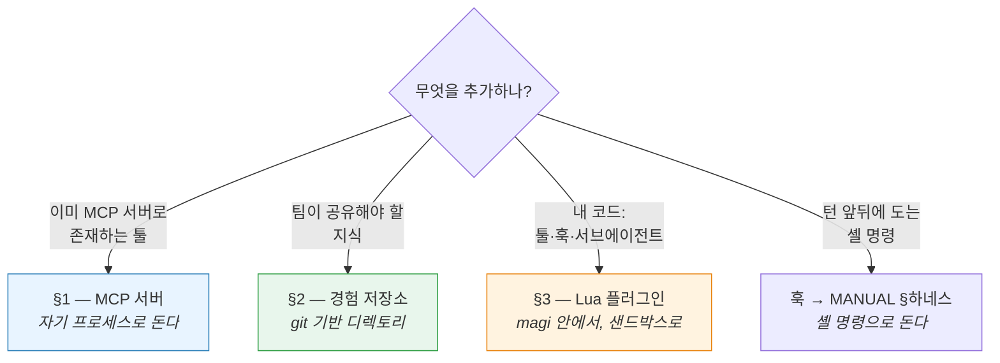
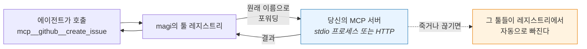
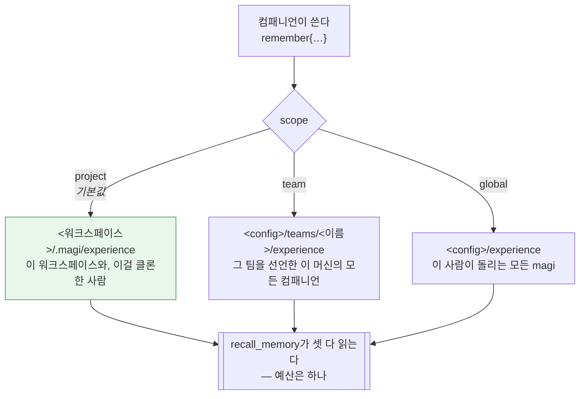
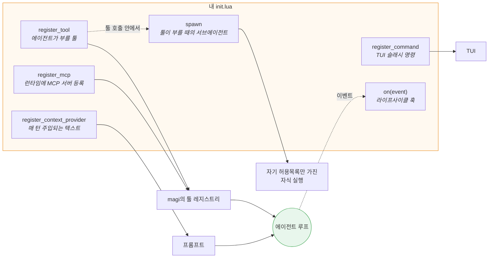
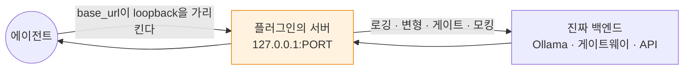
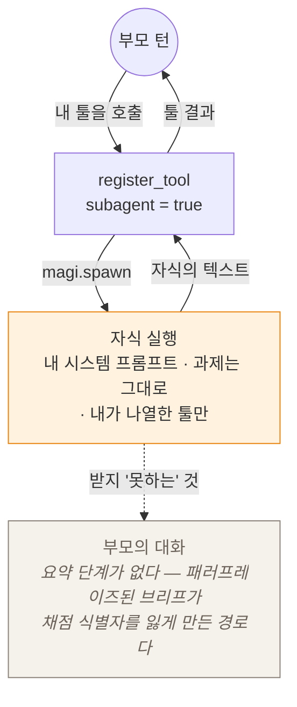

# magi — 확장 가이드

[English](EXTENDING.md) · [한국어](EXTENDING.ko.md) · [↑ Docs](README.ko.md)

magi가 기본으로 하지 않는 일을 하게 만드는 실전 안내서입니다. 에이전트에게 없는 툴을 쥐여주거나, 팀이
함께 쓰는 기억을 만들거나, 내 코드를 루프 안에 넣는 것. 처음 붙여보는 사람을 전제로 단계별로 적었고,
각 단계가 어긋났을 때 무엇이 보이는지도 함께 적었습니다.

### 어느 수단을 쓸 것인가

넷이 있고, 잘못 고르면 하루를 버립니다. 갈라지는 기준은 **내가 추가하는 것이 실제로 어디서 도느냐**다:



| 수단 | 언제 쓰나 | 어디 사나 |
|---|---|---|
| **MCP 서버** (§1) | 그 능력이 이미 MCP 서버로 있거나, 별도 프로세스로 격리하고 싶을 때 | `config.toml`의 `[mcp.*]` |
| **경험 저장소** (§2) | 세션 하나보다 오래 살고 팀에 닿는 교훈·스킬·위키를 원할 때 | 디렉토리(원하면 git 저장소) |
| **Lua 플러그인** (§3) | 내 툴·라이프사이클 훅·컨텍스트 주입·슬래시 명령·서브에이전트를 원할 때 | `<config>/plugins/<이름>/` |
| **훅** | 턴이나 편집 앞뒤로 셸 명령이 돌아야 할 때 | `config.toml`의 `hooks` |

여기 어디에도 속하지 않는 것이 하나 있습니다. **트랜스포트 관심사** — 인증 헤더·TLS·프록시·재시도는
플러그인이나 MCP 서버가 아니라 Go `http.RoundTripper` 심(`openai.WithHTTPClient`)에 둡니다.
[`ARCHITECTURE.ko.md`](ARCHITECTURE.ko.md) §11 참고.

개념은 [`ARCHITECTURE.ko.md`](ARCHITECTURE.ko.md) §11·§7에, 만든 것을 쓰는 법은
[`MANUAL.ko.md`](MANUAL.ko.md) §7·§9·§10에 있습니다.

---

## 0. 설정 파일과 우선순위 (공통)

두 기능 모두 `config.toml`로 켭니다. 로딩 순서(`cmd/magi/main.go`):

1. **전역**: `<config>/config.toml`
   - macOS: `~/Library/Application Support/magi/config.toml`
   - Linux: `~/.config/magi/config.toml`
2. **프로젝트**: `<workdir>/.magi/config.toml` (팀이 repo에 커밋 → 워크플로가 repo를 따라다님)

병합 규칙:

| 키 | 병합 방식 |
|---|---|
| `hooks`, `allow`, `deny`, `allow_domains` | **append**(전역 + 프로젝트) |
| `experience_dir`, `profile`, `sandbox` 등 스칼라 | 프로젝트가 **override** |
| `[mcp.*]` 맵 | **키 단위 병합** — 같은 키는 프로젝트가 override |

> 파일이 없어도 에러가 아닙니다. 둘 다 없으면 기본값으로 동작.

---

## 1. MCP 서버 추가

MCP는 magi 바깥에 사는 능력을 에이전트에게 쥐여주는 방법입니다 — 파일시스템 서버, GitHub 클라이언트,
사내 서비스 같은 것. 서버를 선언하면 magi가 그것을 띄우거나 접속하고, 그 툴들이 모델 입장에서는
`read`나 `bash`와 같은 목록에 나타납니다.



MCP 서버는 **stdio 또는 HTTP 전송(Streamable HTTP)**으로 연결되고, 핸드셰이크 후 서버가
보고한 툴이 빌트인 툴과 **같은 레지스트리에 자동 등록**됩니다. 등록 이름은 **네임스페이스**됩니다 —
`mcp__<서버라벨>__<원격툴명>`(예: `[mcp.filesystem]`의 `read` → `mcp__filesystem__read`). 레지스트리는
이름으로 덮어쓰므로, 네임스페이싱이 없으면 서버의 `read`/`write`/`list` 툴이 **빌트인을 shadow**하거나
두 서버가 서로를 덮어씁니다. 네임스페이스가 그걸 막아 줍니다. 실제 호출은 원격 원본 이름으로 전달됩니다. stdio
서버 프로세스가 죽거나 HTTP 서버 연결이 끊기면 해당 툴은 자동 제거됩니다 (`internal/adapter/mcp/`).

### 1.1 선언

`config.toml`에 `[mcp.<name>]` 블록을 추가합니다. `<name>`은 관리용 라벨이자 **툴 이름의 네임스페이스**
(`mcp__<name>__<원격툴명>`)로 쓰이므로, 짧고 툴 이름 문자셋([A-Za-z0-9_-])에 맞는 이름이 좋다(그 외 문자는 `_`로 치환).

**stdio 전송** (로컬 프로세스 spawn):
```toml
# 예: 파일시스템 MCP 서버
[mcp.filesystem]
command = "npx"
args = ["-y", "@modelcontextprotocol/server-filesystem", "."]

# 예: 환경변수가 필요한 서버 (예: GitHub)
[mcp.github]
command = "npx"
args = ["-y", "@modelcontextprotocol/server-github"]
env = ["GITHUB_PERSONAL_ACCESS_TOKEN=ghp_xxx"]   # "KEY=VALUE" 문자열 배열
```

**HTTP 전송** (원격 또는 로컬 HTTP 서버):
```toml
# 예: HTTP로 실행 중인 MCP 서버
[mcp.remote]
url = "http://localhost:3000/mcp"

# 예: 커스텀 헤더와 환경변수 사용
[mcp.authenticated]
url = "${MCP_SERVER_URL}"  # 환경변수에서 읽기
[mcp.authenticated.headers]
Authorization = "Bearer ${MCP_API_TOKEN}"
X-Client-ID = "magi-client"
X-Environment = "${DEPLOY_ENV}"
```

필드 (`config.MCPServer`):

| 필드 | 타입 | 설명 |
|---|---|---|
| `url` | string | HTTP 엔드포인트 (Streamable HTTP 전송). `url`이 있으면 `command` 무시. `${VAR}` 환경변수 확장 지원 |
| `headers` | map[string]string | HTTP 커스텀 헤더 (HTTP 전송용). `${VAR}` 환경변수 확장 지원 |
| `command` | string | 실행할 바이너리 (PATH에서 찾음, stdio 전송용) |
| `args` | []string | 인자 (stdio 전송용) |
| `env` | []string | `"KEY=VALUE"` 형식. **프로세스 환경에 append**됨(기존 env 유지, stdio 전송용) |

> **전송 선택**: `url` 필드가 있으면 HTTP 전송, 없으면 stdio 전송을 사용합니다.

> **환경변수 확장**: HTTP `url`과 `headers` 값에서 `${ENV_VAR}` 패턴은 런타임에 환경변수로
> 대체됩니다. 변수가 없거나 빈 값이면 원본 그대로 유지됩니다. 시크릿을 config에 하드코딩하지
> 않고 환경변수로 주입할 수 있습니다.

> **HTTP vs HTTPS**: 둘 다 지원됩니다. 테스트·개발 환경에서 `http://`를 사용할 수 있고,
> 프로덕션에서는 `https://`를 권장합니다.

> ⚠️ **시크릿 주의**: `env`에 토큰을 직접 적으면 `config.toml`에 평문 저장됩니다. 프로젝트
> `.magi/config.toml`을 repo에 커밋한다면 토큰을 넣지 말 것 — 전역 `config.toml`에 두거나,
> 래퍼 스크립트가 OS 키체인/`MAGI_*` env에서 읽어 자식에 넘기게 하라.

### 1.2 검증

1. 서버 바이너리를 **수동으로 먼저 실행**해 설치/PATH를 확인한다(예: `npx -y <pkg>` 가
   stdin 대기 상태로 멈추면 정상 — Ctrl+C로 종료).
2. magi 기동. 등록 실패는 stderr로 나옵니다:
   ```
   magi: mcp "github": <사유>
   ```
   (spawn 실패·핸드셰이크 실패·tools/list 실패 등) — 이 줄이 없으면 등록 성공.
3. TUI에서 **`/tools`** 로 등록된 툴 목록 확인. MCP 툴은 §1.1이 말한 대로
   **`mcp__<서버라벨>__<원격툴명>`** 으로 뜬다 — 예전엔 접두사 없이 등록돼 서버끼리, 또는
   서버가 빌트인을 조용히 덮어썼습니다. 헤드리스라면 `magi -p "사용 가능한 툴을 나열해줘"`.

### 1.3 동작 & 주의

- 권한: MCP 툴 호출도 일반 툴과 동일한 권한 모드(`ask`/`auto`/`allow`/`deny`)·정책 엔진을
  거친다 — 그리고 모든 MCP 툴은 `mcp__` 네임스페이스로 식별되는 **위험 툴**로 취급됩니다:
  `ask`·`auto`에선 호출마다 확인을 받고, `deny`에선 거부되며, `allow`에선 실행됩니다. 외부
  서버가 호출로 무엇을 하는지 magi가 증명할 수 없으므로 "먼저 묻는다"가 모드 이름에 맞는
  기본값입니다. 신뢰하는 툴은 allow 규칙(`allow = ["mcp__github__search(**)"]`)으로 프롬프트를
  건너뛸 수 있고, 모달의 "always"도 평소처럼 세션에 적용됩니다. 위험한 툴은 `deny` 규칙으로
  아예 막을 수도 있습니다.
- **이름 충돌**: 서버 라벨이 이름에 들어가므로 서로 다른 서버의 같은 툴 이름은 충돌하지 않고,
  서버의 `read`/`write`/`list`가 빌트인을 가리지도 않습니다. 남는 충돌은 **같은 라벨을 두 번 쓴
  경우**뿐이며, 그건 `[mcp.<name>]`이 맵이라 설정 병합 단계에서 이미 하나로 합쳐집니다.
- 서버가 도중에 죽으면 그 툴들만 레지스트리에서 빠지고 세션은 계속됩니다.

### 1.4 트러블슈팅

| 증상 | 원인/조치 |
|---|---|
| `mcp "x": exec: "cmd": not found` | `command`가 PATH에 없음 → 절대경로 지정 또는 설치 |
| 등록은 됐는데 `/tools`에 없음 | 서버가 `tools/list`에서 빈 목록 반환 → 서버 설정/인자 확인 |
| 호출 시 인증 에러 | `env` 토큰 누락/오타 → 1.1의 env 형식(`"KEY=VALUE"`) 확인 |
| 조용히 아무 일도 없음 | `[mcp.*]`가 잘못된 파일에 있음 → §0 경로/우선순위 재확인 |

---

## 2. 공유 경험 저장소

팀의 지식이 사는 곳입니다. 에이전트가 기록한 교훈, 거기서 뽑아낸 스킬, 컴패니언들이 현재 상태로 유지하는
위키 페이지. 실체는 디렉토리(원하면 git 저장소)이고, 어떤 지식이 얼마나 멀리 가느냐를 정하는 것은 셋 중
어느 티어에 떨어지느냐 뿐입니다.



기본값이 가장 좁은 것인 데는 이유가 있습니다. 전역으로 승격된 사실은 한 프로젝트의 진실을 다른 프로젝트의
프롬프트로 새게 만들고, 몇 주 뒤에는 아무도 원인을 못 찾습니다.

### 지식이 모델에 닿는 경로

세션 시작 시 디렉터리의 **메모리·스킬을 키워드로 회수해 시스템 프롬프트에 주입**한다(D13).
`remember` 툴은 새 학습을 그 디렉터리에 **바로** 쓰고, 디렉터리를 git repo로 두면 팀이 공유합니다
(`internal/adapter/experience/git/store.go`).

> ⚠️ **정직한 한계**: 여기서의 "RAG"는 **임베딩 벡터/시맨틱 검색이 아니라 단어 겹침
> (term-overlap) 스코어링**입니다. 시맨틱 검색이 필요하면 별도 ContextProvider/MCP 서버로 붙여야 합니다.

> ⚠️ **2026-08-07 정정.** 이 절은 `remember`가 `pending/` 리뷰 큐에 넣고 사람이 승급시킨다고
> 적고 있었습니다. **그런 큐는 없다** — `Propose`는 `memories/`·`skills/`에 직접 쓰며, 리뷰 게이트를
> 걷어낸 이후로 계속 그랬습니다. 의도된 것입니다: 학습을 쓰기만 하고 되읽지 못하는 실행은 write-only다.
> 리뷰는 **사후**에 합니다 — 콘솔의 *경험* 화면이 세 층의 모든 항목을 도달 범위와
> 함께 보여주고 잘못된 것을 잊게 할 수 있으며(MANUAL §12), 스토어의 `git log`가 감사 기록입니다.

### 2.0 세 개의 층, 그리고 교훈이 어디로 가는가

스토어는 **세 층**이다(`internal/adapter/experience/layered`). 교훈이 어디까지 넘어가느냐를
결정하는 건 오직 이 층 선택입니다:

| 층 | 경로 | 도달 범위 |
|---|---|---|
| project | `<workspace>/.magi/experience` | 그 워크스페이스만 — repo에 들어가므로 클론한 사람도 함께 |
| team | `<config>/teams/<name>/experience` | 이 기계에서 그 팀을 선언한 모든 컴패니언 |
| global | `<config>/experience`(또는 `experience_dir`) | 이 사람이 돌리는 모든 magi, 모든 프로젝트 |

팀 층이 있는 이유는, 팀이 아는 것 대부분이 한 프로젝트의 것도 모든 프로젝트의 것도 아니기
때문입니다: 네 컴패니언이 공유하는 관례는 워크스페이스를 넘고 팀에서 멈춥니다. 팀을 선언하지 않은
컴패니언이 `team` 스코프로 기여하면 **project**로 떨어집니다. global로는 절대 가지 않습니다 — 저자가
요청한 것보다 교훈을 넓히는 것은 읽어서 되돌릴 수 없는 유일한 방향입니다.

⚠ **한 기계의** 디렉토리입니다. 한 팀에 기계가 둘이면 서로 만나지 않는 스토어가 둘 생깁니다.
[`UI.ko.md`](UI.ko.md) §7 참조.

회수는 세 층을 **하나의** 예산 안에서 합친다 — 층을 늘려도 주입 컨텍스트가 넓어지지 않습니다.
기여는 `Scope`로 라우팅되고 기본은 **project**다(좁은 쪽). global로 올린 사실은 한 프로젝트의
진실을 다른 프로젝트의 프롬프트에 흘리고, 몇 주 뒤엔 아무도 원인을 못 찾기 때문입니다.

### 2.1 디렉터리 만들기

기본 위치는 `<config>/experience`. 팀 공유하려면 별도 git repo를 만들고 `experience_dir`로
가리킵니다.

```bash
mkdir -p /path/to/team-experience/{memories,skills}
cd /path/to/team-experience && git init   # (선택) git이면 기여가 자동 commit됨
```

```toml
# config.toml
experience_dir = "/path/to/team-experience"   # 생략 시 <config>/experience
```

레이아웃:

```
<dir>/
  memories/*.md   # 메모리 — 파일 전체가 회수 대상 텍스트
  skills/*.md     # 스킬 — 첫 줄 = 설명, 이후 = 본문
```

### 2.2 메모리·스킬 파일 형식

- **메모리** (`memories/<무엇이든>.md`): **파일 전체 텍스트**가 회수 단위. 프론트매터 불필요.
  태그를 넣고 싶으면 본문에 `tags: a, b` 한 줄을 두면 그 단어들도 매칭에 들어갑니다.
  ```markdown
  이 repo의 통합 테스트는 MAGI_E2E_* env가 있어야 동작한다.
  없으면 t.Skip 되므로 CI 녹색이 곧 통과를 뜻하지 않는다.

  tags: testing, e2e, ci
  ```
- **스킬** (`skills/<이름>.md`): **첫 줄 = 설명**, 나머지 = 본문. 파일명(확장자 제외)이 스킬
  이름이 됩니다.
  ```markdown
  릴리스 컷 절차
  1. CHANGELOG 갱신 2. vX.Y.Z 태그 3. goreleaser가 CI에서 빌드…
  ```

### 2.3 회수 동작

- 매 세션 시작 시 사용자 프롬프트를 질의로 써서 **메모리 top 5 + 스킬 top 3**을 term-overlap
  점수로 골라 주입한다(`Retrieve`). 점수 0(겹치는 단어 없음)은 제외.
- 파일을 늘려도 주입되는 건 상위 몇 개뿐 — 메모리는 **짧고 단일 사실** 단위로 쪼개는 게
  회수 정확도에 유리합니다.

### 2.4 기여 & 리뷰 (`remember`)

- 에이전트(또는 사용자가 시켜서)가 `remember` 툴을 부르면 `memories/`에
  `mem-<내용해시>.md`로 저장되고 — **다음 턴부터 바로 회수된다** — git repo면 best-effort로
  commit됩니다. 이름이 내용에서 나오므로 같은 사실을 두 번 배워도 사본이 아니라 같은 파일이 됩니다.
- 스킬을 두 번 배우면 덮어쓰지 않고 **센다**: 파일에 `observed`·`first_seen`·`last_seen`이 남고,
  그것이 자리 잡은 교훈과 일회성을 가르는 근거입니다.
- **리뷰는 사전이 아니라 사후입니다.** 회수에서 빼놓는 게 없으므로, 이미 쓰이고 있는 것을 대상으로 봅니다.
  ```bash
  cd "$EXPDIR" && git log --stat        # 무엇을 언제 배웠나
  ```
  또는 콘솔(MANUAL §12)에서 — 모든 컴패니언의 세 층을 도달 범위와 함께 나열하고, 잊게 할 수 있습니다.
- 🔒 **`remember`는 시크릿을 저장하면 안 된다** — 툴 설명에 명시돼 있고, 기여는 평문 .md로
  남아 git에 박힙니다. 토큰/키/비밀번호는 절대 넣지 말 것.

### 2.5 팀 공유

`experience_dir`를 git repo로 두고 팀이 **pull로 받고, 리뷰 후 push**합니다. magi는 기여 시
best-effort `git commit`만 한다(자동 push/pull은 안 함) — pull/push는 팀 워크플로에 맡깁니다.

### 2.6 트러블슈팅

| 증상 | 원인/조치 |
|---|---|
| 메모리가 주입 안 됨 | 질의와 겹치는 단어 없음 / 빈 파일 / 다른 층의 디렉터리에 있음(§2.0) |
| `remember`가 "unavailable" | `experience_dir` 미설정이고 기본 경로도 없음 → §2.1로 디렉터리 생성 |
| commit이 안 됨 | 디렉터리가 git repo가 아님 → `git init`(없어도 파일 저장 자체는 됨) |

---

## 3. Lua 플러그인 — 루프 안의 내 코드

플러그인은 `<config>/plugins/` 아래에 `plugin.toml`과 `init.lua`가 든 디렉토리입니다. 시작할 때 로드되고,
편집하면 핫 리로드되며, 샌드박스로 돕니다 — `plugin.toml`이 선언한 능력만 갖고 그 밖은 없습니다.

가장 넓은 수단이라 전체를 한 장에 놓았습니다. 플러그인이 돌고 있는 magi에 붙을 수 있는 자리 전부:



각각이 아래의 소절입니다. 여섯 중 하나만 써도 되고 전부 써도 됩니다 — 쓸모 있는 가장 작은 플러그인은
`register_tool` 하나뿐인 플러그인입니다.

`config.toml` 선언 외에, **Lua 플러그인**이 런타임에 직접 MCP 서버나 Context Provider(RAG)를
등록할 수 있습니다. 플러그인 호스트가 MCP 매니저·컨텍스트 레지스트리·런타임 정보를 주입받았을 때만
활성화된다(`cmd/magi/main.go`).

### 3.1 `magi.register_mcp` — HTTP MCP 서버 등록

```lua
-- 정적 헤더
magi.register_mcp{
  name = "svc",
  url = "http://localhost:3000/mcp",
  headers = { Authorization = "Bearer abc" },
}

-- 동적 헤더: 함수는 매 요청마다 재평가된다(요청 시점 값 반영, 등록 시점 freeze 아님)
magi.register_mcp{
  name = "svc",
  url = "http://localhost:3000/mcp",
  headers = function()
    return {
      ["X-Model"]     = magi.model(),     -- 현재 모델
      ["X-Platform"]  = magi.platform(),  -- darwin/linux/windows
      ["X-Timestamp"] = magi.time(),      -- 요청 시각 (RFC3339)
    }
  end,
}
```

> **정적 vs 동적**: 테이블이면 헤더가 고정(`AddHTTP`), 함수면 **요청마다 호출**(`AddHTTPDynamic`)됩니다.
> 함수는 플러그인 Lua 락 아래에서 직렬 실행되어 동시성에 안전합니다. 시각/모델/토큰처럼 매 요청
> 바뀌는 값에 함수를 쓰라.

런타임 정보 API: `magi.model()`, `magi.platform()`, `magi.time()`, `magi.workdir()`.

> 🔐 **`magi.nonce(nbytes?)`** — `nbytes`(기본 16) 바이트의 암호학적 난수를 hex 문자열로 반환
> (`crypto/rand`). 샌드박스의 `math.random`은 **결정론적으로 시드**되므로(os 제거로 시계 시드 불가)
> OAuth/PKCE `state`·CSRF 토큰·요청 ID 같은 **보안 값엔 절대 `math.random`을 쓰지 말고 `magi.nonce`를 써라.**

### 3.2 `magi.register_context_provider` — RAG 컨텍스트 주입

등록한 provider는 **최상위 에이전트의 매 스텝에서 호출**되어, 반환한 chunk가 시스템 프롬프트의
`# Retrieved context` 섹션으로 주입된다(provider당 5초 타임아웃, 합산 8KB 예산으로 cap, 실패한
provider는 턴을 막지 않고 무시). 서브에이전트는 집중 프롬프트라 호출하지 않습니다.

```lua
magi.register_context_provider{
  name = "project-rag",
  provide = function(q)
    -- q.session_id, q.workdir, q.prompt 제공
    local hits = my_search(q.prompt)            -- 임의의 검색 로직
    local chunks = {}
    for _, h in ipairs(hits) do
      table.insert(chunks, { source = h.path, text = h.snippet })
    end
    return chunks                                -- {source=, text=} 배열
  end,
}
```

### 3.3 `magi.register_command` — TUI 슬래시 커맨드 등록

플러그인이 `/login`, `/logout` 같은 슬래시 커맨드를 직접 등록한다(capability `"command"`).
TUI가 내장 커맨드에 없는 슬래시를 받으면 플러그인 커맨드로 위임하고, 팔레트·자동완성에도
동적으로 노출됩니다. `name`은 슬래시 없이 지정하고(`"login"` → `/login`), `execute`는 커맨드
이후 토큰 배열을 받습니다. **비어 있지 않은 문자열을 반환하면 에러 메시지**로 처리되고, `nil`이면
성공이다(스낵바에 `✓`).

```lua
magi.register_command{
  name        = "login",
  description = "Re-authenticate with DS AD SSO",  -- /help·팔레트에 표시
  execute     = function(args)
    -- args = "/login" 이후 공백 분리 토큰
    local ok = do_sso_login(args[1])
    if not ok then return "SSO 로그인 실패" end     -- 에러: 스낵바에 표시
    -- 성공: nil 반환
  end,
}
```

### 3.4 `magi.set_llm_headers` — LLM 백엔드 커스텀 헤더

사내 게이트웨이(LiteLLM 등)가 `X-CLIENT-API-KEY` 같은 헤더를 요구하거나, 브라우저 SSO로 발급한
토큰을 인증키로 써야 할 때 사용합니다. 테이블이면 정적, 함수면 **요청마다 재평가**됩니다.

```lua
-- 정적
magi.set_llm_headers({ ["X-CLIENT-API-KEY"] = "abc" })

-- 동적: 회전 토큰을 매 요청마다 반영 (예: 파일에 갱신되는 SSO 토큰을 읽어 주입)
magi.set_llm_headers(function()
  local tok = magi.read_file(".magi/adsso.token") or ""
  return { Authorization = "Bearer " .. tok }
end)
```

> 정적 키만 필요하면 **플러그인 없이** `config.toml`로도 됩니다:
> ```toml
> [llm.headers]
> X-CLIENT-API-KEY = "${LITELLM_CLIENT_KEY}"   # ${ENV} 확장 지원
> ```
> 두 경로(config 정적 + 플러그인 동적)는 함께 적용되며, 동적 헤더가 나중에 덮어씁니다.

### 3.5 게이트된 기능: `exec` · `open_url` · `http`

플러그인이 **외부 프로세스 실행 / 브라우저 열기 / HTTP 호출**을 하려면 `plugin.toml`의
`permissions`에 명시해야 합니다. 선언하지 않으면 브리지에서 거부된다(`permission denied: …`).
RAG를 HTTP로 가져오거나, SSO 로그인 흐름을 플러그인이 직접 구동할 때 씁니다.

| API | 권한 | 비고 |
|---|---|---|
| `magi.exec(cmd, {args})` | `exec:<cmd>` | 셸 없이 직접 실행(인젝션 없음), workdir 기준, 60s 타임아웃. `{stdout,stderr,code}` 반환 |
| `magi.open_url(url)` | `exec:open-url` | OS 기본 브라우저로 엶. **http/https만** 허용 |
| `magi.http{url,method,headers,body}` | `net:<host>` | http/https만, 30s 타임아웃, 5MB 응답 cap. `{status,body}` 반환 |
| `magi.serve{port,handler}` | `net:listen` | `127.0.0.1`에 **상주 HTTP 서버**를 인프로세스로 띄움(외부 런타임 불필요 → 단일 바이너리·전 OS 동일). `port=0`은 자유 포트 자동 배정. `{port, stop()}` 반환 |
| `magi.set_base_url(url)` | `net:<host>` | 에이전트의 **LLM 백엔드 base URL을 런타임 변경**(loopback 프록시 또는 로그인 시 알아낸 게이트웨이로). 빈 문자열이면 원복. 언로드 시 자동 원복. http/https만. ⚠️ 에이전트가 **진짜 API 키와 모든 프롬프트를 대상에 보내므로**, `net:<host>` 부여 = 그 호스트로 LLM 트래픽 리다이렉트 허용 — **호스트를 명시적·최소로** 부여하라 |
| `magi.set_model(model)` | `config:write:model` | **현재 세션의 활성 모델을 런타임 변경**(그리고 config에 영속 — `/route` 편집기와 동일). 다음 루프 반복부터 적용. 빈 문자열 거부, 성공 시 `true` / 실패 시 `(nil, err)`. 로그인 후 사용 가능한 백엔드를 알아내 모델을 정하는 SSO 플러그인 등에 유용. `magi.model()`(읽기)도 함께 갱신되어 즉시 새 값을 반환 |
| `magi.set_context_window(tokens[, model])` | `config:write:model` | **모델의 컨텍스트 윈도우(토큰)를 런타임 오버라이드** — 내장 백엔드 프로버(vLLM `/v1/models`·LiteLLM·Ollama)가 못 때리는 사내 모델 API에서 실제 윈도우를 알아내 밀어넣을 때. 푸터 게이지와 비율 기반 자동압축이 참값을 쓰게 됩니다. `tokens<=0`이면 unlimited/unknown. `model` 생략/빈 문자열이면 **현재 세션 모델** 대상(일반적 경우). 이후 지연 프로브가 값을 덮어쓰지 못하게 잠급니다. 런타임 값이라 영속되지 않으니 `on("session_start")`에서 재적용하라. 성공 시 `true` / 실패 시 `(nil, err)` |
| `magi.reload_config()` | `config:write:model` | **디스크의 config.toml을 다시 읽어 런타임 적용** — 현재는 세션 모델. 파싱 실패면 `(nil, err)`를 반환하고 실행 중 세션은 기존 설정을 유지(잘못된 편집이 모델을 조용히 비우지 못하게). 라우팅·base URL·플러그인 리로드 등 나머지 설정은 재시작 필요. `set_config_key`로 모델을 바꾼 뒤 반영할 때 유용 |
| `magi.clear_transcript()` | (없음 — UI 전용) | **화면의 대사록을 splash로 초기화**(디스크의 세션은 보존). 플러그인 `/logout` 커맨드가 로그아웃 후 깨끗한 시작 화면으로 되돌릴 때 사용. `true` 반환 |
| `magi.get_config_key(key, default?)` | `config:read:<key>` | 사용자 **config.toml**에서 dotted 키(`templates.commit`, `plugins.<name>.token`) 읽기. 자기 섹션(`plugins.<name>.*`)은 권한 없이 허용. **키 부재 → `default`; 파일 파싱 실패 → `(nil, err)`**(둘을 구분하니, 깨진 config를 덮어쓰는 악순환을 피하려면 err를 확인하라) |
| `magi.set_config_key(key, value)` | `config:write:<key>` | config.toml에 dotted 키 쓰기(**주석 보존**, `config.SetKey`). 값은 문자열, 빈 문자열이면 키 삭제. 자기 섹션은 권한 없이 허용. top-level 키는 기존 활성 줄을 갱신하고 주석 처리된 템플릿 기본값은 건드리지 않음(중복 키 생성 방지) |

> 🔑 **store_get/store_set vs get/set_config_key**: 앞쪽(`store_get`/`store_set`)은 플러그인 **자체 격리 JSON 저장소**(`config:` 권한 불필요). 뒤쪽(`get/set_config_key`)은 **사용자 config.toml** 직접 접근으로, **권한 게이트**됩니다. 권한은 `config:read:<key>` / `config:write:<key>`이며 **끝에 `*`로 prefix 와일드카드**(예: `config:write:templates.*`, `config:write:*`). 자기 섹션 `plugins.<name>.*`는 암묵 허용. 키는 `[A-Za-z0-9_-]` dotted segment만 허용(주입 방지). **고정 deny-list**(권한이 있어도 차단): `mcp`·`hooks`·`allow`·`deny`·`permission`·`sandbox`·`profile`·`allow_domains` (명령 실행/보안 포스처 변경 영역).

**예: ADSSO 로그인 → 토큰을 LLM 인증헤더로 (플러그인이 흐름까지 구동)**
```toml
# plugin.toml
name = "adsso"
permissions = ["exec:open-url", "net:sso.corp.example", "fs:write:.magi/"]
```
```lua
-- init.lua: 시작 시 브라우저로 로그인 → 콜백 토큰을 교환해 캐시, 매 요청 주입
local token = ""
local function login()
  magi.open_url("https://sso.corp.example/authorize?...")   -- 브라우저 오픈
  -- (콜백/폴링으로 code 수령 후) 토큰 교환:
  local r = magi.http{ url = "https://sso.corp.example/token",
                         method = "POST", body = "grant_type=..." }
  if r and r.status == 200 then token = r.body end
end
login()
magi.set_llm_headers(function() return { Authorization = "Bearer " .. token } end)
```

> ⚠️ `exec`/`http`는 샌드박스를 넓히는 강력한 권한입니다. 신뢰하는 플러그인에만, 최소 host/cmd로
> 좁혀 부여하라. (정적 키만 필요하면 §3.4의 `config.toml [llm].headers`로 충분합니다.)

### 3.6 라이프사이클 훅 · 사용자 프롬프트 · 콜백 (SSO 등)

플러그인이 **시작 시점에 사용자와 상호작용**(인증 등)할 수 있는 범용 통로.

- **`magi.on(event, fn)`** — 호스트가 정해진 시점에 호출하는 핸들러 등록.
  이벤트: `startup`(플러그인 로드 후·첫 턴 전, UI 준비됨), `session_start`(세션 생성 후), `shutdown`(종료).
  핸들러는 **동기 실행**되어 블로킹 가능(예: 시작 시 인증 완료까지 대기).
- **`magi.ask{title, fields}`** — 인터랙티브 폼. 필드 `type`: `text`·`password`·`number`·`multiline`·
  `select`·`multiselect`·`confirm`·`note`. 답을 테이블로 반환. **TTY 없으면(헤드리스) 에러** → 폴백 처리.
  필드: `{ name=, type=, label=, options={}, default= }`. (Tab=제출, Esc=취소)
- **`magi.serve`** — `127.0.0.1`에 루프백 HTTP 서버. 두 모드, 둘 다 `net:listen` 필요:
  - **handler 있음 (상주)**: `magi.serve{port, handler=function(req) … end}` → 모든 요청을 `handler(req)`로 라우팅, 반환 테이블이 응답. `port=0`이면 자유 포트 자동 배정. `{port, stop()}` 반환. 언로드/리로드 시 자동 종료.
  - **handler 없음 (일회성 블로킹, OAuth/PKCE 리다이렉트 수신)**: `magi.serve{port, path, timeout}` → 첫 매칭 요청까지 블록 후 `{query={...}, path=}` 반환하고 종료.
  요청: `{ method, path, query={k=v}, headers={k=v}, body }`,
  응답: `{ status=200, headers={k=v}, body }`(또는 문자열만 반환 → 200 본문).
  **인프로세스**라 외부 런타임 없이 단일 정적 바이너리 안에서 동작 — 모든 OS에서 동일.

**예: ADSSO — 시작 시 "브라우저 로그인 / 토큰 붙여넣기" 메뉴 (순수 플러그인, 코어 무수정)**
```toml
# plugin.toml
name = "adsso"
permissions = ["exec:open-url", "net:listen", "net:sso.corp.example", "fs:write:.magi/"]
```
```lua
-- init.lua
magi.on("startup", function()
  if magi.store_get("adsso.token") then return end            -- 이미 있으면 패스
  local a = magi.ask{ title = "ADSSO 인증", fields = {
    { name = "how", type = "select", options = { "브라우저 로그인", "토큰 붙여넣기" } },
  }}
  if not a then return end                                        -- 헤드리스 등 → 폴백
  local token
  if a.how == "브라우저 로그인" then
    magi.open_url("https://sso.corp.example/authorize?redirect_uri=http://127.0.0.1:8765/cb&...")
    local cb = magi.serve{ port = 8765, path = "/cb", timeout = 120 } -- one-shot (no handler)
    local r = magi.http{ url = "https://sso.corp.example/token", method = "POST",
                           body = "grant_type=authorization_code&code=" .. cb.query.code }
    token = parse_token(r.body)
  else
    token = magi.ask{ fields = {{ name = "t", type = "password", label = "토큰" }} }.t
  end
  magi.store_set("adsso.token", token)
end)

-- 매 LLM 요청에 토큰 주입 (저장된 값을 읽어 — 재시작에도 유지)
magi.set_llm_headers(function()
  return { Authorization = "Bearer " .. (magi.store_get("adsso.token") or "") }
end)
```
→ 코어엔 ADSSO 흔적이 전혀 없습니다. "플러그인이 라이프사이클 시점에 사용자에게 묻고 환경과
상호작용한다"는 범용 기능만 제공합니다.

- **`magi.set_user_label(name)`** — 트랜스크립트에서 사용자를 가리키는 표시 이름을 설정
  (미설정 시 폴백은 `you`). SSO 인증 뒤 로그인 사용자명을 노출할 때 씁니다. 빈/공백 문자열은
  무시되어 폴백이 유지됩니다. 권한 `ui` 필요.

  **인코딩 계약 — 반드시 raw UTF-8 Lua 문자열을 넘길 것.** 코어는 라벨을 저장·브로드캐스트·
  렌더 전 구간에서 무손실 UTF-8로 보존한다(내부 `json.Marshal`은 한글을 `\uXXXX`로 이스케이프
  하지 않으며, 이 계약은 `internal/app`·`internal/adapter/tui`의 라운드트립 단위테스트로 고정돼
  있습니다). 따라서 화면에 `변냁...` 같은 **리터럴 이스케이프 시퀀스**가 그대로 보인다면
  그것은 코어가 아니라 **플러그인이 이미 이스케이프된 문자열을 넘긴 것**이다 — 예: SSO 응답
  JSON을 직접 파싱하며 `\uXXXX`를 디코딩하지 않은 손수 짠 파서. `magi.http`/`magi.serve`가
  주는 `body`·`query`는 이미 UTF-8이므로, JSON 본문에서 이름을 꺼낼 때는 **JSON을 제대로
  디코딩한 뒤** 그 값을 넘겨야 한다(이스케이프된 원문을 그대로 넘기지 말 것).

### 3.7 `serve` + `set_base_url` — loopback LLM 프록시 (코어 무수정)

`magi.serve`로 플러그인이 **인프로세스 HTTP 서버**를 띄우고, `magi.set_base_url`로 에이전트의
LLM 트래픽을 그 서버로 돌릴 수 있습니다. 프롬프트/응답 로깅·요청 변형·모킹·요율 게이트 같은 것을
**외부 프로세스 없이**(= 단일 바이너리·전 OS 동일) 플러그인만으로 구현합니다. 서버는 언로드 시 자동 종료.



에이전트가 보내는 모든 것이 내가 쓴 코드를 거쳐 갑니다. 같은 프로세스 안에서, 코어 수정 없이, 따로 설치할
것 없이.

```toml
# plugin.toml
name = "llm-proxy"
# net:listen=서버 호스팅, net:127.0.0.1=에이전트를 loopback으로 향하게, net:localhost=upstream 포워딩
permissions = ["net:listen", "net:127.0.0.1", "net:localhost"]
```
```lua
-- init.lua: 모든 LLM 요청을 가로채 로깅한 뒤 진짜 백엔드로 포워딩
local upstream = "http://localhost:11434/v1"   -- 원래 백엔드 (이 host엔 net: 권한 필요)
local s = magi.serve{ port = 0, handler = function(req)
  magi.log("LLM " .. req.method .. " " .. req.path .. " (" .. #req.body .. " bytes)")
  local r = magi.http{ url = upstream .. req.path, method = req.method,
                       headers = req.headers, body = req.body }
  return { status = r.status, body = r.body }
end }
magi.set_base_url("http://127.0.0.1:" .. s.port .. "/v1")   -- 에이전트를 프록시로 (loopback)
```
> 🔐 **`set_base_url` 보안**: 에이전트는 `base()`에 **진짜 API 키를 붙여 모든 프롬프트/응답을 보냅니다.**
> 따라서 `net:<host>` 권한을 주는 것은 "그 호스트로 에이전트의 자격증명 트래픽을 돌려도 된다"는 명시적
> 승인입니다 — 대상 host를 **명시적·최소로** 부여하라(RAG용으로 넓게 준 `net:` 권한이 리다이렉트까지
> 열어줄 수 있으니 주의). loopback 프록시면 `net:127.0.0.1`, 게이트웨이면 그 host를 선언합니다. 플러그인
> 언로드/리로드 시 오버라이드는 **자동으로 원복**된다(죽은 대상을 가리킨 채 LLM이 멎지 않게).

> ⚠️ **한계**: ① `serve` 핸들러 응답은 `magi.http`로 받은 **완성된 본문**이라 토큰 단위 SSE
> **스트리밍이 아니다**(상류 완료 후 한 번에). 30s·5MB 캡도 그대로 적용되니, 이 프록시는 **로깅/모킹/짧은
> 완성**에 적합하고 장문 스트리밍 패스스루엔 부적합. ② 고정 포트(`port>0`)로 띄운 `serve` 플러그인은
> 핫리로드 시 이전 인스턴스가 포트를 쥔 채 새 인스턴스가 바인드해 실패할 수 있으니 **`port=0`(자동 배정)을
> 권장**합니다.

---

### 3.8 `magi.register_tool` — 내 툴 하나 만들기

이 중에서 가장 근본적이고, 이 절의 나머지가 그 위에 서는 것입니다. 플러그인이 툴을 등록하면 에이전트는
그것을 빌트인 옆에서 봅니다. 스키마 모양도, 디스패치도, 권한 게이트도 같습니다(capability `"tool"`).

```lua
magi.register_tool{
  name        = "changelog_entry",
  description = "CHANGELOG.md의 Unreleased 아래에 한 줄 덧붙인다.",
  schema      = { type = "object",
                  properties = { text = { type = "string", description = "추가할 줄" } },
                  required = { "text" } },
  execute     = function(args)
    -- return  text            → 성공
    -- return  text, true      → 에이전트가 읽고 대응해야 할 에러
    if not args.text or args.text == "" then return "text is required", true end
    return append_to_changelog(args.text)
  end,
}
```

`description`과 `schema`는 모델이 **매 요청마다** 읽는 것이라, 긴 설명은 앞으로 매 스텝 영원히 값을
치릅니다. 이 툴이 무엇을 위한 것이고 언제 손을 뻗어야 하는지만 쓰고 멈추십시오.

이 툴이 어디에 제공될지는 선택 필드 넷이 정합니다:

| 필드 | 효과 |
|---|---|
| `internal = true` | 허용목록에 이 툴을 적은 에이전트에게만 제공 — 내 서브에이전트용 헬퍼를 메인 에이전트의 요청에서 빼 둘 때 |
| `subagent = true` | `/subagents`에 표시되어 사용자가 켜고 끄고 모델을 고름 |
| `readonly_children = true` | 이 툴이 띄우는 자식은 보기만 함. 그러면 한 스텝의 두 호출이 **동시에** 돎 — 아래 참고 |
| `isolated_children = true` | 쓸 수 있는 자식마다 **자기 체크아웃**을 받음(호스트가 스폰의 `workspace="clone"`을 기본으로 잡고 셸을 `workspace-write`로 고정). 한 스텝의 두 호출이 역시 동시에 돎 |
| `group = "…"` | 거기서 제목 아래로 묶어, 여럿을 함께 관리 |
| `enabled = false` | **꺼진 채로** 출하. 사용자만 켤 수 있음 |

#### `readonly_children` — 호스트가 그것으로 하는 일

읽기 전용 툴 여럿을 요청한 스텝은 그것들을 동시에 돌립니다. 서브에이전트는 늘 거기서 빠져 있었고, 이유는
하나였습니다. 자식은 파일을 쓰고, 부모의 가드는 편집 전후로 파일을 읽는데, 그것이 경합 없이 성립하려면
쓰기가 직렬화돼 있어야 하기 때문입니다. 그 이유는 **쓰는 툴이 없는 자식**에게는 해당되지 않습니다. 그런데도
해당되는 척하면, 스텝이 둘을 요청할 때마다 자식 턴 하나만큼의 벽시계를 값으로 치릅니다.

`readonly_children` 선언은 "내 자식들은 보기만 한다"는 말입니다. **magi는 그 말을 믿지 않습니다.**
그 툴이 하는 모든 `magi.spawn`은 자식의 툴이 정해지는 순간 검사받고, `read`·`grep`·`glob`·`list` 밖의
무언가를 요청한 스펙은 어긋난 툴의 이름을 대며 거부됩니다. `tools` 목록이 없거나 비어 있어도 거부입니다.
그건 "아무것도 없음"이 아니라 "이 컴패니언이 가진 전부"라는 뜻이기 때문입니다.

조용히 좁히는 대신 거부합니다. 요청한 툴을 조용히 잃은 자식은 나중에, 다른 데서, 호출을 봐서는 아무도 알 수
없는 이유로 실패합니다.

```lua
magi.register_tool{
  name = "scout", subagent = true, readonly_children = true,
  description = "트리를 읽고 거기 무엇이 있는지 보고한다. 아무것도 바꾸지 않는다.",
  schema = { type = "object", properties = { about = { type = "string" } }, required = {"about"} },
  execute = function(args)
    local r = magi.spawn{
      system = SCOUT, prompt = args.about,
      tools  = {"read", "grep", "glob", "list"},   -- 이 밖의 것은 거부된다
      max_steps = 25, timeout = 300,
    }
    return r.text
  end,
}
```

번들된 `seele` 플래너가 이것을 선언하는데, 원래 띄우던 자식이 이미 그러했습니다.

#### `isolated_children` — 쓰는 자식을 위한 같은 거래

`readonly_children`은 쓰기를 빼앗아 동시성을 삽니다. `isolated_children`은 대신 격리로 삽니다. 선언하면,
쓸 수 있는 툴 목록을 가진 스폰마다 자기 클론을 받습니다 — 스펙에 다시 적었든 아니든, 자식의 워크스페이스가
정해지는 자리에서 호스트가 `workspace="clone"`을 잡습니다. 보기만 하는 자식은 공유 트리를 그대로 씁니다
(클론은 이미 가진 것의 더 낡은 판을 보려고 복사 비용을 치르는 일이니까요).

격리는 디렉터리만이 아닙니다. 자식의 파일 툴은 여느 워크디렉터리처럼 자기 체크아웃에 갇히고, **셸**은
`workspace-write` OS 샌드박스로 고정되며(macOS는 seatbelt, Linux는 bwrap — 둘 다 없는 플랫폼에서는
best-effort이고, 전역으로 더 엄한 샌드박스 설정이 있으면 그쪽이 이깁니다), 자식은 이 사실을 자기 시스템
프롬프트로 통보받습니다. 그리고 그 작업은 커밋 범위로 돌아와 `magi.merge_child`나 `magi.restore_child`를
기다립니다 — 자동으로 병합되는 일은 없습니다.

그런 자식 둘은 한 트리를 만질 수 없으므로, 툴을 두 번 부르는 스텝은 둘을 동시에 돌리고, 거기서 나온
`magi.spawn_all` 배치도 같은 식으로 팬아웃됩니다(무제한이 아니라, 호스트가 몇 개씩 돌리고 나머지는 줄을
세웁니다).

---

### 3.9 `magi.spawn` / `child_steps` / `restore_child` — 서브에이전트와 루프

magi가 싣는 것은 **이음매뿐입니다.** 플러그인이 서브에이전트를 선언하고 사용자가 켭니다
(`plugin.toml`의 `"spawn"` 능력, 툴 호출 안에서만 도달 가능). 번들된 `seele`가 그렇게 하나를
등록하는데, **꺼진 채로** 등록하므로 체크하기 전에는 아무것도 스폰되지 않습니다.



```lua
magi.register_tool{
  name = "scout", subagent = true, readonly_children = true,
  description = "트리를 읽고 무엇이 있는지 보고한다. 아무것도 바꾸지 않는다.",
  schema = { type = "object", properties = { about = { type = "string" } }, required = {"about"} },
  execute = function(args)
    local r = magi.spawn{
      system = SCOUT, prompt = args.about,
      tools  = {"read", "grep", "glob", "list"},   -- 이 밖의 것은 거부된다
      max_steps = 25, timeout = 300,
    }
    return r.text
  end,
}
```

**자식이 받는 것.** 내가 준 `system`, 내가 준 `prompt`를 **그대로**, AGENTS.md, 런타임 환경, 부모의
작업 디렉터리와 스크래치, 그리고 `tools`에 적은 툴 정확히 그것만. 부모의 **대화는 받지 않습니다** — 요약
단계가 없는데, 패러프레이즈된 브리프가 이 트리에서 채점 식별자를 잃게 만든 경로이기 때문입니다(6회 중
6회 재현). 툴 자신의 인자가 필터입니다. 호출자는 전체 맥락을 갖고 있고 무엇을 인자에 담을지 고르며, 그
뒤로는 아무것도 그것을 고쳐 쓰지 않습니다. 그것으로 부족하면 자식이 같은 트리를 직접 읽습니다.

**돌아오는 것.** `text`, `err`, `steps`, `session_id`.

**경계.** 자식은 60스텝·15분으로 클램프됩니다. 툴 호출 전체도 클램프됩니다 — 누적 자식 스텝과 벽시계 —
플러그인이 루프로 스폰할 수 있고, 그렇게 아무리 오래 돌아도 부모 루프에는 한 스텝이기 때문입니다. 거부는
어느 경계에 걸렸고 지금 어디쯤인지를 이름 대어 말합니다.

**스텝이 떨어진 자식에게는 가진 것을 묻습니다.** 마지막 텍스트는 늘 돌아왔습니다. 다만 잘린 실행에서 그
텍스트는 답이 아니라 한 스텝의 혼잣말이고, 호출자는 그것을 결과로 읽습니다. 그래서 예산을 다 쓴 자식은
마무리 프롬프트를 한 번 받습니다 — 무엇을 찾았고 무엇이 안 끝났는지 보고하라, 새 작업 금지, 툴 호출 금지 —
그리고 답할 스텝 둘을 받습니다. 무언가 말하면 그것이 `text`가 됩니다. 마무리는 살아 있는 컨텍스트가
필요하므로, 시계에 걸렸거나 부모 턴이 취소되어 멈춘 자식은 예전처럼 잘린 텍스트와 경계 사유를 `err`에
담습니다.

**자식은 스폰할 수 없습니다.** `Spawn` 훅을 아예 건네받지 않으므로, 재귀는 누군가 검사해야 하는 카운터가
아니라 **구조적으로** 불가능합니다.

**격리 — `workspace = "clone"`.** 자식은 저장소의 자기 체크아웃에서 일합니다(부모의 미커밋 작업까지
실어서, 자기 브랜치 위에서). 한 일 전부가 결과의 `base_commit..head_commit` 커밋 레인지가 되고,
`magi.merge_child(session_id)`가 그 레인지를 부모 트리에 워킹트리 변경으로 얹어 줍니다. 커밋은 아니고,
자동도 아닙니다. 반대 판정은 `magi.restore_child`. 항상 이걸 원하는 툴은 스폰마다 필드를 반복하는 대신
`isolated_children`을 선언한다(위 표).

**병렬 자식 — `magi.spawn_all{ {…}, {…}, … }`.** 각 항목은 `magi.spawn`이 받는 그 테이블입니다.
자식들은 동시에 돌고(몇 개씩 — 나머지는 호스트가 줄 세웁니다), 결과는 `magi.spawn` 반환 행의 순서 있는
목록이며 한 자식의 실패는 그 행만 실패시킵니다. 규칙 둘, 조용히 고치는 대신 소리 내어 거부합니다:
`review`는 여기서 안 받는다(여러 자식이 동시에 끝나면 Lua 인터프리터에 재진입합니다 — 끝난 뒤
`child_steps`를 읽고 판정하라), 그리고 부모의 공유 트리를 **쓸 수 있는** 자식이 둘 이상인 배치는 각각
`workspace="clone"`이 아니면 거부됩니다.

## 더 보기

- 자체 **툴/훅**을 코드 없이 추가 → Lua 플러그인 (MANUAL §9, `plugins/examples/wordcount`)
- 셸 **라이프사이클 훅**(테스트/포맷 게이트) → MANUAL §하네스, `[[hooks]]`
- **포트/어댑터** 구조로 새 백엔드 구현 → ARCHITECTURE §3·§11

### 3.10 나머지 브리지

| 함수 | 능력 | 하는 일 |
|---|---|---|
| `magi.analyze{prompt=, system=}` | — | 툴 없는 모델 왕복 한 번. 에이전트가 아니라 판단 하나가 필요한 플러그인용 |
| `magi.write_file` / `magi.read_file` / `magi.remove_file` | `fs:write` / `fs:read` | 워크디렉터리에 갇힌 파일 접근 |
| `magi.notify(text)` | — | 데스크톱 알림 |
| `magi.json_decode(text)` | — | JSON → Lua 테이블 |
| `magi.register_doctor_probes{…}` | — | `magi -doctor`에 접히는 환경 점검 |
| `magi.propose_experience{…}` | — | 공유 경험 스토어에 메모리나 스킬을 제안 (§2.4) |

### 3.11 컴패니언 툴 (`companions`)

플러그인 툴은 아니고 `cmd/magi`가 등록합니다. 다만 플러그인 작성자가 그 옆에 무언가를 만들 가능성이
가장 큰 자리라 적어 둡니다: `companions`는 이 머신의 다른 magi를 나열하고(이름·역할·팀·지금 하는 일·
무엇을 배웠는지). 플릿 뷰가 읽는 데몬 기록을 그대로 읽습니다.

그중 하나에게 일을 넘기던 두 번째 툴 `ask_companion`은 제거됐다 — 받는 쪽을 자유 문자열로 지정하는데
누가 있는지의 목록이 모델에게 주어지지 않아, 모델이 그냥 추측했습니다. MANUAL §13.3 참고.

(이하 명부 툴 설명: 누가 보냈는지
라벨과 함께). 둘 다 플릿 뷰가 읽는 그 데몬 레코드를 읽습니다.

`builtin`에는 못 들어갑니다: `internal/app`이 builtin을, `internal/adapter/daemon`이 app을
임포트하므로, 데몬 레코드를 읽는 빌트인은 임포트 사이클을 닫아 버립니다. 데몬이 필요한 당신의 코드도 같은
제약을 받습니다 — `cmd`에서 등록하거나, 소켓으로 접근하라.

규칙은 [`MANUAL.ko.md`](MANUAL.ko.md) §13에 있습니다. 그 위에 무언가를 얹기 전에 알아야 할 하나는,
**넘겨받은 일은 두 번 넘어가지 않는다**는 것(허브가 자기 팀 안으로 넘기는 경우만 예외).
