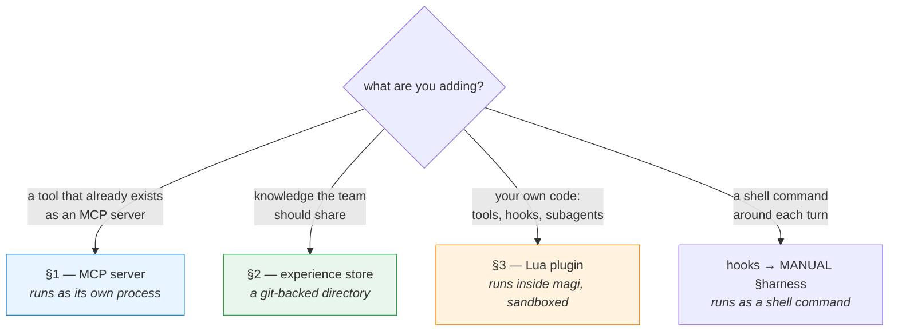
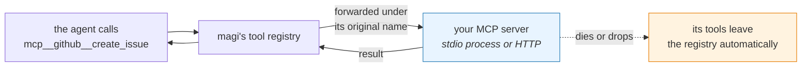
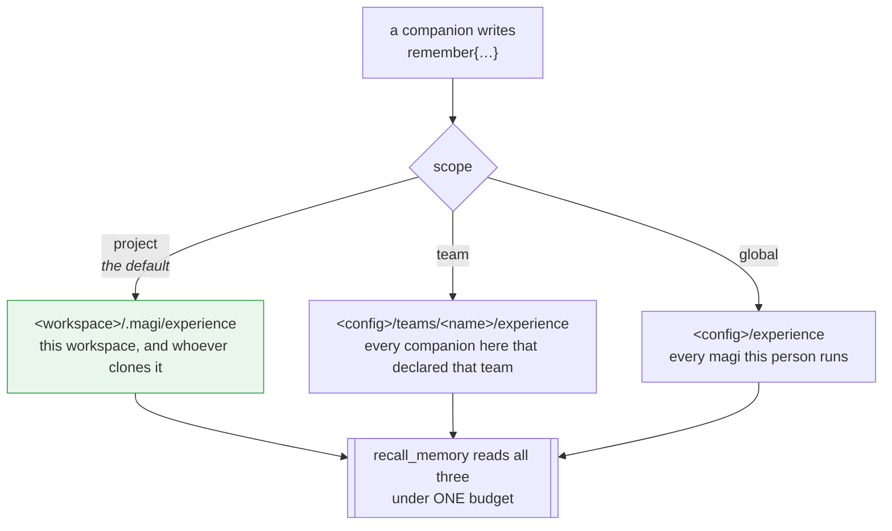
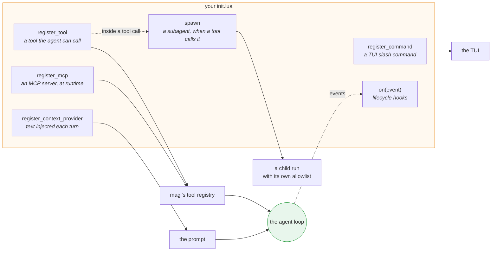
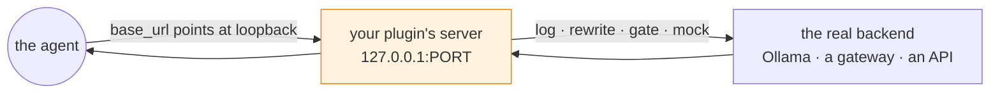
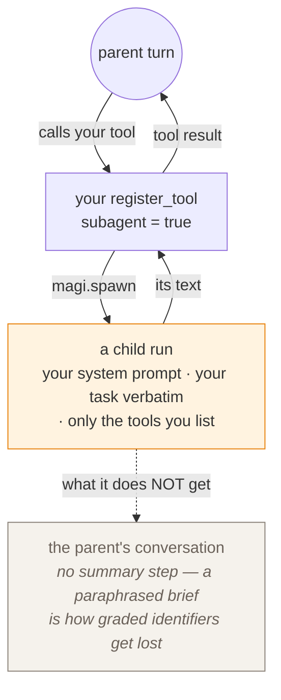

# magi — Extension guide

[English](EXTENDING.md) · [한국어](EXTENDING.ko.md) · [↑ Docs](README.md)

This is the practical guide for making magi do something it does not do out of the box: give the
agent a tool it doesn't have, give a team a memory it can share, or put your own code inside the
loop. It assumes you are attaching one of these for the first time, so it goes step by step and says
what happens when each step goes wrong.

### Which surface do you want?

There are four, and picking the wrong one costs a day. The question that separates them is *where
the thing you are adding actually runs*:



| Surface | Use it when | Lives in |
|---|---|---|
| **MCP server** (§1) | the capability already exists as an MCP server, or you want it isolated in its own process | `config.toml`, `[mcp.*]` |
| **Experience store** (§2) | you want lessons, skills and wiki pages that outlive one session and reach a team | a directory (optionally a git repo) |
| **Lua plugin** (§3) | you want your own tools, lifecycle hooks, context injection, slash commands, or a subagent | `<config>/plugins/<name>/` |
| **Hooks** | a shell command should run before or after a turn, or an edit | `config.toml`, `hooks` |

One thing belongs at none of them: **transport concerns**. Auth headers, TLS, proxies and retries go
at the Go `http.RoundTripper` seam (`openai.WithHTTPClient`), not into a plugin or an MCP server —
see [`ARCHITECTURE.md`](ARCHITECTURE.md) §11.

For the ideas behind all this, read [`ARCHITECTURE.md`](ARCHITECTURE.md) §11 and §7; for using what
you build, [`MANUAL.md`](MANUAL.md) §7, §9 and §10.

---

## 0. Config files and precedence (both features)

Both are turned on in `config.toml`. Load order (`cmd/magi/main.go`):

1. **Global**: `<config>/config.toml`
   - macOS: `~/Library/Application Support/magi/config.toml`
   - Linux: `~/.config/magi/config.toml`
2. **Project**: `<workdir>/.magi/config.toml` (commit it and the workflow follows the repo)

Merge rules:

| Key | How it merges |
|---|---|
| `hooks`, `allow`, `deny`, `allow_domains` | **append** (global + project) |
| scalars such as `experience_dir`, `profile`, `sandbox` | project **overrides** |
| the `[mcp.*]` map | **merged per key** — the project wins on a shared key |

> A missing file is not an error. With neither present, magi runs on defaults.

---

## 1. Adding an MCP server

MCP is how you hand the agent a capability that lives outside magi — a filesystem server, a GitHub
client, a company's internal service. You declare the server, magi starts or dials it, and its tools
appear in the same list as `read` and `bash` from the model's point of view.



An MCP server connects over **stdio or HTTP (Streamable HTTP)**, and after the handshake the tools it
reports are **registered automatically into the same registry as the built-ins**. The registered name
is **namespaced** — `mcp__<server label>__<remote tool name>` (so `read` from `[mcp.filesystem]`
becomes `mcp__filesystem__read`). The registry is keyed by name, so without namespacing a server's
`read`/`write`/`list` would **shadow the built-ins**, or two servers would overwrite each other; the
namespace is what prevents that. The call itself is forwarded under the remote's original name. If a
stdio server process dies or an HTTP connection drops, its tools are removed automatically
(`internal/adapter/mcp/`).

### 1.1 Declaring one

Add an `[mcp.<name>]` block to `config.toml`. `<name>` is both the management label and the
**namespace in the tool name** (`mcp__<name>__<remote tool>`), so keep it short and inside the tool
name character set (`[A-Za-z0-9_-]`; anything else is replaced with `_`).

**stdio transport** (spawns a local process):

```toml
# e.g. the filesystem MCP server
[mcp.filesystem]
command = "npx"
args = ["-y", "@modelcontextprotocol/server-filesystem", "."]

# e.g. a server that needs environment variables (GitHub)
[mcp.github]
command = "npx"
args = ["-y", "@modelcontextprotocol/server-github"]
env = ["GITHUB_PERSONAL_ACCESS_TOKEN=ghp_xxx"]   # an array of "KEY=VALUE" strings
```

**HTTP transport** (a remote or local HTTP server):

```toml
# e.g. an MCP server already running over HTTP
[mcp.remote]
url = "http://localhost:3000/mcp"

# e.g. with custom headers and environment variables
[mcp.authenticated]
url = "${MCP_SERVER_URL}"  # read from the environment
[mcp.authenticated.headers]
Authorization = "Bearer ${MCP_API_TOKEN}"
X-Client-ID = "magi-client"
X-Environment = "${DEPLOY_ENV}"
```

Fields (`config.MCPServer`):

| Field | Type | Meaning |
|---|---|---|
| `url` | string | the HTTP endpoint (Streamable HTTP transport). When present, `command` is ignored. Supports `${VAR}` expansion |
| `headers` | map[string]string | custom HTTP headers (HTTP transport). Supports `${VAR}` expansion |
| `command` | string | the binary to run (found on PATH; stdio transport) |
| `args` | []string | its arguments (stdio transport) |
| `env` | []string | `"KEY=VALUE"` form. **Appended to** the process environment, so the existing one is kept (stdio transport) |

> **Choosing the transport**: a `url` field selects HTTP; without one, stdio is used.

> **Environment expansion**: in the HTTP `url` and in `headers` values, a `${ENV_VAR}` pattern is
> substituted at runtime. A missing or empty variable leaves the text as it was. This is how a secret
> is injected from the environment rather than hard-coded into the config.

> **HTTP vs HTTPS**: both work. `http://` is fine for test and development; prefer `https://` in
> production.

> ⚠️ **Secrets**: a token written directly into `env` is stored in plain text in `config.toml`. If the
> project's `.magi/config.toml` is committed, do not put a token in it — keep it in the global
> `config.toml`, or have a wrapper script read it from the OS keychain or a `MAGI_*` env var and pass
> it to the child.

### 1.2 Verifying it

1. **Run the server binary by hand first** to confirm it is installed and on PATH (e.g. `npx -y <pkg>`
   sitting and waiting on stdin means it works — Ctrl+C to stop).
2. Start magi. A registration failure goes to stderr:
   ```
   magi: mcp "github": <reason>
   ```
   (spawn failure, handshake failure, tools/list failure, …) — no such line means it registered.
3. In the TUI, **`/tools`** lists what registered. MCP tools appear as §1.1 says, under
   **`mcp__<server label>__<remote tool>`** — they used to register unprefixed, which let servers
   overwrite each other and quietly shadow the built-ins. Headless: `magi -p "list the available tools"`.

### 1.3 Behaviour and caveats

- Permissions: an MCP tool call goes through the same permission mode (`ask`/`auto`/`allow`/`deny`)
  and policy engine as any other tool — and every MCP tool is treated as a **danger tool**, read off
  its `mcp__` namespace: under `ask` and `auto` each call is confirmed, under `deny` it is refused,
  and under `allow` it runs. magi cannot prove what an external server does with a call, so "ask
  first" is the default that matches the mode names; a tool you trust can skip the prompt with an
  allow rule (`allow = ["mcp__github__search(**)"]`), and the modal's "always" grant covers the
  session as usual. A dangerous tool can also be blocked outright with a `deny` rule.
- **Name collisions**: because the server label is part of the name, the same tool name on two
  servers does not collide, and a server's `read`/`write`/`list` cannot hide the built-ins. The only
  collision left is **using the same label twice**, and `[mcp.<name>]` is a map, so config merging has
  already folded those into one.
- If a server dies mid-session, only its tools leave the registry; the session continues.

### 1.4 Troubleshooting

| Symptom | Cause / what to do |
|---|---|
| `mcp "x": exec: "cmd": not found` | `command` is not on PATH → give an absolute path, or install it |
| It registered but nothing is in `/tools` | the server returned an empty `tools/list` → check its config and arguments |
| An auth error on call | a missing or mistyped token in `env` → check the `"KEY=VALUE"` form from §1.1 |
| Nothing happens at all | the `[mcp.*]` block is in the wrong file → re-read the paths and precedence in §0 |

---

## 2. The shared experience store

This is where a team's knowledge lives: the lessons an agent recorded, the skills it distilled, and
the wiki pages the companions keep current. It is a directory — optionally a git repository — and
the only thing that decides how far a given piece of knowledge travels is which of three tiers it
lands in.



The default is the narrowest one on purpose: a fact promoted to global leaks one project's truth
into another project's prompts, and nobody finds the cause weeks later.

### How the knowledge reaches the model

At session start, **memories and skills from a directory are retrieved by keyword and injected into
the system prompt** (D13). The `remember` tool writes new lessons straight into that directory, and
making it a git repo is how a team shares it (`internal/adapter/experience/git/store.go`).

> ⚠️ **An honest limit**: the "RAG" here is **term-overlap scoring, not embedding vectors or semantic
> search**. If you need semantic search, attach it as a separate ContextProvider or MCP server.

> ⚠️ **Corrected 2026-08-07.** This section used to describe a `pending/` review queue that
> `remember` wrote into and a person promoted from. **There is no such queue** — `Propose` writes to
> `memories/` and `skills/` directly, and has since the review gate was removed, deliberately: a run
> that can write lessons but never read them back is write-only. Review happens **after** the fact
> instead: the console's *what they have learned* screen lists every entry in both tiers and can
> forget a wrong one (MANUAL §12), and `git log` in the store is the audit trail.

### 2.0 Three tiers, and which one a lesson lands in

The store is **three tiers** (`internal/adapter/experience/layered`), and the tier a lesson goes to
is the only thing that decides how far it crosses:

| Tier | Path | Reach |
|---|---|---|
| project | `<workspace>/.magi/experience` | that workspace only — and its repo, so whoever clones it gets it |
| team | `<config>/teams/<name>/experience` | every companion on this machine that declared that team |
| global | `<config>/experience` (or `experience_dir`) | every magi this person runs, on every project |

The team tier exists because most of what a team knows is neither one project's nor every project's:
a convention four companions share crosses workspaces and stops at the team. A contribution scoped
`team` by a companion with no team declared falls back to **project**, never to global — widening a
lesson past what its author asked for is the one direction that cannot be undone by reading it.

⚠ It is **one machine's** directory. Two machines in a team keep two stores that never meet; see
[`UI.md`](UI.md) §7.

Retrieval merges both under **one** budget, so adding a tier never widens the injected context.
A contribution routes by `Scope`, defaulting to **project** — the narrower one, because a fact
promoted to global leaks one project's truth into another's prompts and nobody finds the cause weeks
later.

### 2.1 Creating the directory

The default location is `<config>/experience`. To share it with a team, make a separate git repo and
point `experience_dir` at it.

```bash
mkdir -p /path/to/team-experience/{memories,skills}
cd /path/to/team-experience && git init   # optional: in a git repo, contributions are committed
```

```toml
# config.toml
experience_dir = "/path/to/team-experience"   # omitted → <config>/experience
```

Layout:

```
<dir>/
  memories/*.md   # memories — the whole file is the retrievable text
  skills/*.md     # skills — first line = description, the rest = body
```

### 2.2 Memory and skill file formats

- **A memory** (`memories/<anything>.md`): **the whole file text** is the unit of retrieval. No
  frontmatter needed. For tags, put a `tags: a, b` line in the body and those words join the match.

  ```markdown
  The integration tests in this repo need the MAGI_E2E_* env vars.
  Without them they t.Skip, so a green CI does not mean they passed.

  tags: testing, e2e, ci
  ```

- **A skill** (`skills/<name>.md`): **the first line is the description**, the rest is the body. The
  filename (without the extension) is the skill's name.

  ```markdown
  Cutting a release
  1. update the CHANGELOG 2. tag vX.Y.Z 3. goreleaser builds it in CI…
  ```

### 2.3 How retrieval behaves

- At each session start the user's prompt is the query, and the **top 5 memories and top 3 skills** by
  term-overlap score are injected (`Retrieve`). A score of zero (no shared words) is excluded.
- Adding more files does not inject more — only the top few. So memories are best kept **short and to
  a single fact**, which is what makes retrieval accurate.

### 2.4 Contributing and reviewing (`remember`)

- When the agent calls `remember` (on its own or because you asked it to), the note is written to
  `memories/` as `mem-<content-hash>.md` — **retrievable from the next turn** — and, in a git repo,
  committed best-effort. The name comes from the content, so learning the same fact twice writes the
  same file rather than a second copy.
- A skill learned twice is **counted**, not overwritten: the file keeps `observed`, `first_seen` and
  `last_seen`, which is how a settled lesson is told from a one-off.
- **Review is after the fact, not before it.** Nothing is held back from retrieval, so the reviewing
  is done on what is already in use:

  ```bash
  cd "$EXPDIR" && git log --stat        # what has been learned, and when
  ```

  or from the console (MANUAL §12), which lists both tiers of every companion with the reach of each
  entry spelled out, and can forget one.

- 🔒 **`remember` must not store secrets** — the tool's description says so, and a contribution lands
  as plain-text .md that gets committed. Never put a token, key, or password in one.

### 2.5 Sharing with a team

Make `experience_dir` a git repo and have the team **pull it, review, and push**. magi only does a
best-effort `git commit` when contributing — it never pushes or pulls on its own, which is left to the
team's workflow.

### 2.6 Troubleshooting

| Symptom | Cause / what to do |
|---|---|
| A memory is never injected | no words shared with the query / the file is empty / it is in the other tier's directory (§2.0) |
| `remember` says "unavailable" | `experience_dir` is unset and the default path does not exist → create it per §2.1 |
| Nothing is committed | the directory is not a git repo → `git init` (the file is still written without one) |

---

## 3. Lua plugins — your own code inside the loop

A plugin is a directory with a `plugin.toml` and an `init.lua` in `<config>/plugins/`. It is loaded
at startup, hot-reloaded when you edit it, and sandboxed: it gets exactly the capabilities its
`plugin.toml` declares and nothing else.

This is the widest surface, so here is the whole of it on one picture — every place a plugin can
attach to a running magi:



Each of those is a subsection below. A plugin can use one of them or all six; the smallest useful
plugin is a `register_tool` and nothing else.

Two of them — registering an MCP server and a context provider — are only active when the plugin
host was given the MCP manager, the context registry and the runtime info (`cmd/magi/main.go`).

### 3.1 `magi.register_mcp` — register an HTTP MCP server

```lua
-- static headers
magi.register_mcp{
  name = "svc",
  url = "http://localhost:3000/mcp",
  headers = { Authorization = "Bearer abc" },
}

-- dynamic headers: the function is re-evaluated on every request (the value at request time,
-- not frozen at registration)
magi.register_mcp{
  name = "svc",
  url = "http://localhost:3000/mcp",
  headers = function()
    return {
      ["X-Model"]     = magi.model(),     -- the current model
      ["X-Platform"]  = magi.platform(),  -- darwin/linux/windows
      ["X-Timestamp"] = magi.time(),      -- the time of the request (RFC3339)
    }
  end,
}
```

> **Static vs dynamic**: a table fixes the headers (`AddHTTP`); a function is **called per request**
> (`AddHTTPDynamic`). The function runs serially under the plugin's Lua lock, so it is concurrency-safe.
> Use a function for anything that changes per request — a clock, a model, a token.

Runtime info API: `magi.model()`, `magi.platform()`, `magi.time()`, `magi.workdir()`.

> 🔐 **`magi.nonce(nbytes?)`** returns `nbytes` (default 16) of cryptographic randomness as a hex
> string (`crypto/rand`). The sandbox's `math.random` is **deterministically seeded** (with `os`
> removed there is no clock to seed from), so for **security values** — an OAuth/PKCE `state`, a CSRF
> token, a request id — **never use `math.random`; use `magi.nonce`.**

### 3.2 `magi.register_context_provider` — inject RAG context

A registered provider is **called on every step of the top-level agent**, and the chunks it returns
are injected into the system prompt's `# Retrieved context` section (5s timeout per provider, capped
at a combined 8KB budget; a provider that fails is ignored rather than blocking the turn).

```lua
magi.register_context_provider{
  name = "project-rag",
  provide = function(q)
    -- q.session_id, q.workdir, q.prompt are provided
    local hits = my_search(q.prompt)            -- any search logic
    local chunks = {}
    for _, h in ipairs(hits) do
      table.insert(chunks, { source = h.path, text = h.snippet })
    end
    return chunks                                -- an array of {source=, text=}
  end,
}
```

### 3.3 `magi.register_command` — register a TUI slash command

A plugin can register its own slash commands such as `/login` and `/logout` (capability `"command"`).
When the TUI receives a slash it does not know, it delegates to the plugin commands, and they appear
in the palette and in completion. `name` is given without the slash (`"login"` → `/login`), and
`execute` receives the tokens after the command. **Returning a non-empty string is treated as an error
message**; `nil` means success (a `✓` in the snackbar).

```lua
magi.register_command{
  name        = "login",
  description = "Re-authenticate with the corporate SSO",  -- shown in /help and the palette
  execute     = function(args)
    -- args = the whitespace-separated tokens after "/login"
    local ok = do_sso_login(args[1])
    if not ok then return "SSO login failed" end     -- an error: shown in the snackbar
    -- success: return nil
  end,
}
```

### 3.4 `magi.set_llm_headers` — custom headers for the LLM backend

For an internal gateway (LiteLLM and the like) that requires a header such as `X-CLIENT-API-KEY`, or
when a token issued by a browser SSO has to serve as the credential. A table is static; a function is
**re-evaluated per request**.

```lua
-- static
magi.set_llm_headers({ ["X-CLIENT-API-KEY"] = "abc" })

-- dynamic: pick up a rotating token on every request (e.g. an SSO token refreshed into a file)
magi.set_llm_headers(function()
  local tok = magi.read_file(".magi/adsso.token") or ""
  return { Authorization = "Bearer " .. tok }
end)
```

> If all you need is a static key, `config.toml` does it **without a plugin**:
> ```toml
> [llm.headers]
> X-CLIENT-API-KEY = "${LITELLM_CLIENT_KEY}"   # ${ENV} expansion supported
> ```
> Both paths (static in config, dynamic from a plugin) apply together, with the dynamic headers
> written last.

### 3.5 Gated capabilities: `exec` · `open_url` · `http`

For a plugin to **run an external process, open a browser, or make an HTTP call**, it must say so in
`permissions` in `plugin.toml`. Undeclared, the bridge refuses (`permission denied: …`). This is what
fetching RAG over HTTP, or driving an SSO login flow from a plugin, needs.

| API | Permission | Notes |
|---|---|---|
| `magi.exec(cmd, {args}, {timeout="15s"}?)` | `exec:<cmd>` | direct exec, no shell (so no injection), relative to the workdir. 60s timeout by default; the manifest widens it (`exec_timeout`, clamped to [1s, 10m]) and the per-call third argument can only shorten it. Returns `{stdout,stderr,code}` |
| `magi.open_url(url)` | `exec:open-url` | opens the OS default browser. **http/https only** |
| `magi.http{url,method,headers,body}` | `net:<host>` | http/https only, 30s timeout, 5MB response cap. Returns `{status,body}` |
| `magi.serve{port,handler}` | `net:listen` | a **long-lived in-process HTTP server** on `127.0.0.1` (no external runtime → one binary, same on every OS). `port=0` takes a free port. Returns `{port, stop()}` |
| `magi.set_base_url(url)` | `net:<host>` | **changes the agent's LLM backend base URL at runtime** (to a loopback proxy, or to a gateway discovered at login). An empty string restores it; unloading restores it automatically. http/https only. ⚠️ The agent sends **the real API key and every prompt** to the target, so granting `net:<host>` is granting permission to redirect LLM traffic there — **grant the host explicitly and narrowly** |
| `magi.set_model(model)` | `config:write:model` | **changes the active model of the current session at runtime** (and persists it to config, like the `/route` editor). Applies from the next loop iteration. Empty string refused; `true` on success, `(nil, err)` on failure. Useful for an SSO plugin that learns which backends are available after login. `magi.model()` reads back the new value immediately |
| `magi.set_context_window(tokens[, model])` | `config:write:model` | **overrides a model's context window (in tokens) at runtime** — for an internal model API that the built-in probes (vLLM `/v1/models`, LiteLLM, Ollama) cannot reach, so the footer gauge and the ratio-based auto-compaction use the true value. `tokens<=0` means unlimited/unknown. Omitting `model` (or passing an empty string) targets **the current session model**, which is the usual case. It also locks the value so a later lazy probe cannot overwrite it. It is a runtime value and is not persisted, so re-apply it from `on("session_start")`. `true` on success, `(nil, err)` on failure |
| `magi.reload_config()` | `config:write:model` | **re-reads config.toml from disk and applies it at runtime** — currently the session model. On a parse failure it returns `(nil, err)` and the running session keeps its existing settings, so a bad edit cannot silently blank the model. Routing, the base URL and plugin reloads still need a restart. Useful after changing the model with `set_config_key` |
| `magi.clear_transcript()` | (none — UI only) | **resets the on-screen transcript to the splash** (the session on disk is untouched). For a plugin's `/logout` to return to a clean start screen. Returns `true` |
| `magi.get_config_key(key, default?)` | `config:read:<key>` | reads a dotted key (`templates.commit`, `plugins.<name>.token`) from the user's **config.toml**. A plugin's own section (`plugins.<name>.*`) needs no permission. **A missing key → `default`; a parse failure → `(nil, err)`** — the two are distinguished, so check the error to avoid the loop of overwriting a broken config |
| `magi.set_config_key(key, value)` | `config:write:<key>` | writes a dotted key into config.toml (**comments preserved**, `config.SetKey`). The value is a string; an empty string deletes the key. A plugin's own section needs no permission. A top-level key updates the existing active line and leaves commented-out template defaults alone (so no duplicate key is created) |

> 🔑 **store_get/store_set vs get/set_config_key**: the first pair is the plugin's **own isolated JSON
> store** (no `config:` permission needed). The second pair reaches into the **user's config.toml** and
> is **permission-gated**: `config:read:<key>` / `config:write:<key>`, with a trailing `*` for a prefix
> wildcard (`config:write:templates.*`, `config:write:*`). A plugin's own `plugins.<name>.*` section is
> implicitly allowed. Keys accept only `[A-Za-z0-9_-]` dotted segments (to prevent injection). A
> **fixed deny-list** is blocked even with permission: `mcp`, `hooks`, `allow`, `deny`, `permission`,
> `sandbox`, `profile`, `allow_domains` — the keys that change command execution and the security
> posture.

**Example: SSO login → the token as the LLM auth header (the plugin drives the whole flow)**

```toml
# plugin.toml
name = "adsso"
permissions = ["exec:open-url", "net:sso.corp.example", "fs:write:.magi/"]
```

```lua
-- init.lua: log in through the browser at startup, cache the exchanged token, inject it per request
local token = ""
local function login()
  magi.open_url("https://sso.corp.example/authorize?...")   -- open the browser
  -- (after receiving the code via callback or polling) exchange it:
  local r = magi.http{ url = "https://sso.corp.example/token",
                         method = "POST", body = "grant_type=..." }
  if r and r.status == 200 then token = r.body end
end
login()
magi.set_llm_headers(function() return { Authorization = "Bearer " .. token } end)
```

> ⚠️ `exec` and `http` widen the sandbox considerably. Grant them only to plugins you trust, narrowed
> to the smallest host or command. (For a static key alone, §3.4's `config.toml [llm].headers` is
> enough.)

### 3.6 Lifecycle hooks, user prompts and callbacks (SSO and the like)

The general-purpose way for a plugin to **interact with the user at startup** (to authenticate, say).

- **`magi.on(event, fn)`** — register a handler the host calls at a defined moment.
  Events: `startup` (after plugins load, before the first turn, with the UI ready), `session_start`
  (after a session is created), `shutdown` (on exit).
  Handlers run **synchronously** and may block (e.g. waiting for authentication to finish at startup).
- **`magi.ask{title, fields}`** — an interactive form. Field `type`: `text`, `password`, `number`,
  `multiline`, `select`, `multiselect`, `confirm`, `note`. Returns the answers as a table.
  **Without a TTY (headless) it errors** — handle the fallback.
  Fields: `{ name=, type=, label=, options={}, default= }`. (Tab submits, Esc cancels.)
- **`magi.serve`** — a loopback HTTP server on `127.0.0.1`. Two modes, both needing `net:listen`:
  - **with a handler (long-lived)**: `magi.serve{port, handler=function(req) … end}` routes every
    request to `handler(req)`, and the returned table is the response. `port=0` takes a free port.
    Returns `{port, stop()}`. Shut down automatically on unload or reload.
  - **without a handler (one-shot, blocking — for an OAuth/PKCE redirect)**:
    `magi.serve{port, path, timeout}` blocks until the first matching request, returns
    `{query={...}, path=}`, and stops.

  The request is `{ method, path, query={k=v}, headers={k=v}, body }`, and the response is
  `{ status=200, headers={k=v}, body }` (or just a string, which becomes a 200 body).
  Being **in-process**, it needs no external runtime and works inside the single static binary —
  identically on every OS.

**Example: SSO — a "log in with the browser / paste a token" menu at startup (pure plugin, no core change)**

```toml
# plugin.toml
name = "adsso"
permissions = ["exec:open-url", "net:listen", "net:sso.corp.example", "fs:write:.magi/"]
```

```lua
-- init.lua
magi.on("startup", function()
  if magi.store_get("adsso.token") then return end            -- already have one
  local a = magi.ask{ title = "SSO sign-in", fields = {
    { name = "how", type = "select", options = { "Log in with the browser", "Paste a token" } },
  }}
  if not a then return end                                        -- headless etc. → fall back
  local token
  if a.how == "Log in with the browser" then
    magi.open_url("https://sso.corp.example/authorize?redirect_uri=http://127.0.0.1:8765/cb&...")
    local cb = magi.serve{ port = 8765, path = "/cb", timeout = 120 } -- one-shot (no handler)
    local r = magi.http{ url = "https://sso.corp.example/token", method = "POST",
                           body = "grant_type=authorization_code&code=" .. cb.query.code }
    token = parse_token(r.body)
  else
    token = magi.ask{ fields = {{ name = "t", type = "password", label = "Token" }} }.t
  end
  magi.store_set("adsso.token", token)
end)

-- inject the token into every LLM request (read from the store, so it survives a restart)
magi.set_llm_headers(function()
  return { Authorization = "Bearer " .. (magi.store_get("adsso.token") or "") }
end)
```

→ There is no trace of this SSO in the core. All the core provides is the general capability: a plugin
asks the user something at a lifecycle moment and interacts with its environment.

- **`magi.set_user_label(name)`** — set the display name for the user in the transcript (the fallback
  when unset is `you`). Use it to show the logged-in username after SSO. An empty or whitespace-only
  string is ignored, keeping the fallback. Requires the `ui` permission.

  **Encoding contract — pass a raw UTF-8 Lua string.** The core preserves the label as lossless UTF-8
  through storage, broadcast and rendering (its internal `json.Marshal` does not escape non-ASCII to
  `\uXXXX`, and the contract is pinned by round-trip unit tests in `internal/app` and
  `internal/adapter/tui`). So if a **literal escape sequence** appears on screen, it is not the core —
  it is **the plugin passing an already-escaped string**, typically a hand-rolled parser reading an SSO
  response's JSON without decoding `\uXXXX`. The `body` and `query` from `magi.http` and `magi.serve`
  are already UTF-8, so when taking a name out of a JSON body, **decode the JSON properly** and pass
  that value rather than the escaped text.

### 3.7 `serve` + `set_base_url` — a loopback LLM proxy (no core change)

A plugin can raise an **in-process HTTP server** with `magi.serve` and point the agent's LLM traffic at
it with `magi.set_base_url`. Prompt/response logging, request rewriting, mocking, a rate gate — all
from a plugin, **without an external process** (so: one binary, identical on every OS). The server is
shut down automatically on unload.



Everything the agent sends passes through code you wrote, in the same process, with no core change
and nothing extra to install.

```toml
# plugin.toml
name = "llm-proxy"
# net:listen to host the server, net:127.0.0.1 to point the agent at loopback,
# net:localhost to forward upstream
permissions = ["net:listen", "net:127.0.0.1", "net:localhost"]
```

```lua
-- init.lua: intercept every LLM request, log it, and forward to the real backend
local upstream = "http://localhost:11434/v1"   -- the original backend (needs net: for this host)
local s = magi.serve{ port = 0, handler = function(req)
  magi.log("LLM " .. req.method .. " " .. req.path .. " (" .. #req.body .. " bytes)")
  local r = magi.http{ url = upstream .. req.path, method = req.method,
                       headers = req.headers, body = req.body }
  return { status = r.status, body = r.body }
end }
magi.set_base_url("http://127.0.0.1:" .. s.port .. "/v1")   -- point the agent at the proxy (loopback)
```

> 🔐 **`set_base_url` security**: the agent sends **every prompt and response to `base()` with the real
> API key attached.** Granting `net:<host>` is therefore an explicit approval to redirect the agent's
> credentialed traffic to that host — **grant the target host explicitly and narrowly** (a broad `net:`
> granted for RAG can end up opening redirection too). For a loopback proxy that is `net:127.0.0.1`;
> for a gateway, declare that host. On plugin unload or reload the override is **restored
> automatically**, so the LLM is never left pointing at a dead target.

> ⚠️ **Limits**: (1) the `serve` handler's response is the **complete body** returned by `magi.http`,
> so it is **not token-by-token SSE streaming** (it arrives at once, after upstream finishes). The 30s
> and 5MB caps apply too, which makes this proxy suitable for **logging, mocking and short
> completions** and unsuitable for long streaming pass-through. (2) A `serve` plugin bound to a fixed
> port (`port>0`) can fail to bind on hot reload while the previous instance still holds it, so
> **`port=0` (automatic) is recommended**.

### 3.7.1 A CLI as the whole backend — the shipped backend plugins

§3.7's proxy forwards to a real HTTP backend. One step further and there is no HTTP backend at
all: the shim **is** the backend, and each chat request is fulfilled by running a CLI once. Two
plugins in the repository do exactly this, and they are the worked examples for this section —
[`plugins/antigravity`](../plugins/antigravity) drives the Antigravity CLI (`agy --print`) and
[`plugins/claudecode`](../plugins/claudecode) drives Claude Code (`claude --print`). All three ship
INSIDE the binary, off by default — taking over the LLM base URL is not something an upgrade may do
to somebody who merely has claude installed — so enabling one is a config switch, no cloning:

```toml
[plugins.claudecode]   # or antigravity, or codex
enabled = true
```

(Working from a checkout, a symlink into a plugins directory does the same and the on-disk copy
wins over the embedded one.)

Three problems appear the moment the backend is a CLI, and the plugins show one answer to each:

- **Tool calls.** A CLI prints text; magi expects `tool_calls`. The prompt carries every tool
  schema and one strict format — a call is a line reading `TOOL_CALL {"name":…,"arguments":{…}}` —
  and the shim parses those lines back out and emits them as native `tool_calls` frames. A reply
  that ignores the format still lands as text, where magi's own fallback parser gets a second try.
- **Time.** `magi.exec` kills a command at 60 seconds, which was sized for probes — an Opus turn
  is not a sixty-second command. The manifest widens it (`exec_timeout = "5m"`, clamped to
  [1s, 10m]), next to the `exec:` grant an auditor already reads. The third argument of
  `magi.exec(cmd, args, {timeout="15s"})` goes the other way: it can only **shorten** the bound,
  for the metadata fetches a plugin makes during load — `agy models` was observed hanging there,
  which would have held magi's own startup for the full five minutes.
- **A second agent.** Both CLIs are agents themselves and could run their own tools inside the
  workspace — invisible to magi's log, permission gate and council. So `claude` runs with its
  mutating tools disallowed by name, `agy` runs with `--sandbox` and without its skip-permissions
  flag, and the prompt states the terms: you are being used as a language model.

The **backend order** is a property of the plugins, never of core — no backend name exists there.
claudecode activates when `claude --version` answers; [`plugins/codex`](../plugins/codex) stands
down when it finds claude; antigravity stands down when it finds either (`defer_to_claude = false`
overrides, on each); when none of them takes the base URL, magi keeps whatever its config names.
The chain reads: claude, then codex, then agy, then the config file. Each CLI's own features ride along as program-named
slash commands (`/claudecode-login`, `/antigravity-models` — a bare `/login` would be whichever
plugin registered last), and a doctor probe answers "is the CLI there and signed in" before the
first request can 502 on it.

### 3.8 `magi.register_tool` — a tool of your own

The most fundamental of these, and the one the rest of this section builds on. A plugin registers a
tool and the agent sees it beside every built-in: same schema shape, same dispatch, same permission
gate (capability `"tool"`).

```lua
magi.register_tool{
  name        = "changelog_entry",
  description = "Append a line to CHANGELOG.md under the Unreleased heading.",
  schema      = { type = "object",
                  properties = { text = { type = "string", description = "the line to add" } },
                  required = { "text" } },
  execute     = function(args)
    -- return  text            → success
    -- return  text, true      → an error the agent should read and react to
    if not args.text or args.text == "" then return "text is required", true end
    return append_to_changelog(args.text)
  end,
}
```

`description` and `schema` are what the model reads on **every request**, so a long description is
paid for on every step forever — say what the tool is for and when to reach for it, and stop.

Four optional fields decide where the tool is offered:

| field | effect |
|---|---|
| `internal = true` | offered only to an agent whose allowlist names it — a helper for your own subagent, kept off the main agent's request |
| `subagent = true` | listed in `/subagents`, where a user switches it on and off and picks its model |
| `readonly_children = true` | every child this tool spawns can only look. Two calls to it in one step then run **at once** — see below |
| `isolated_children = true` | every child that could write gets its **own checkout** (the host defaults its spawns to `workspace="clone"` and pins its shell to `workspace-write`). Two calls to it in one step also run at once |
| `group = "…"` | groups it under a heading there, so several can be managed together |
| `enabled = false` | ships switched **off**; only a user turns it on |

#### `readonly_children` — and what the host does with it

A step that asks for several read-only tools runs them concurrently. A subagent was always excluded
from that, for one reason: a child writes files, and the parent's guard reads each file before and
after an edit, which is only race-free when the writes are serialised. That reason does not apply to
a child with no writing tool — and pretending it does costs a whole child turn of wall clock every
time a step asks for two.

Declaring `readonly_children` says your children only look. **magi does not take it on trust.**
Every `magi.spawn` that tool makes is checked at the moment a child's tools are decided, and a spec
asking for anything outside `read`, `grep`, `glob` and `list` is refused, naming the tool that broke
it. An absent or empty `tools` list is refused too: it does not mean "nothing", it means everything
this companion has.

Refused rather than quietly narrowed. A child that silently loses the tool it asked for fails later,
somewhere else, for a reason nobody can see from the call.

```lua
magi.register_tool{
  name = "scout", subagent = true, readonly_children = true,
  description = "Read the tree and report what is there. Changes nothing.",
  schema = { type = "object", properties = { about = { type = "string" } }, required = {"about"} },
  execute = function(args)
    local r = magi.spawn{
      system = SCOUT, prompt = args.about,
      tools  = {"read", "grep", "glob", "list"},   -- anything else here is refused
      max_steps = 25, timeout = 300,
    }
    return r.text
  end,
}
```

`plugins/examples/crew` declares it for the reviewer it spawns, which only ever looked.

#### `isolated_children` — the same bargain for children that write

`readonly_children` buys concurrency by taking writing away. `isolated_children` buys it with
isolation instead: declare it, and every spawn whose tool list could write is given its own clone —
the host sets `workspace="clone"` where the child's workspace is decided, whether or not your spec
repeated it — while a child that can only look keeps the shared tree (a clone would cost it a copy
to see a staler version of what it already had).

The isolation is more than the directory. The child's file tools are jailed to its checkout as they
are to any workdir; its **shell** is pinned to the `workspace-write` OS sandbox (seatbelt on macOS,
bwrap on Linux — best effort on platforms with neither, and a globally stricter sandbox setting
stays in charge); the child is told all of this in its system prompt; and its work comes back as a
commit range for you to `magi.merge_child` or `magi.restore_child` — never merged automatically.

Two such children cannot touch one tree, so a step that calls the tool twice runs both at once, and
a `magi.spawn_all` batch from it fans out the same way (bounded — the host runs a handful of
children at a time and queues the rest).

### 3.9 `magi.spawn` / `child_steps` / `restore_child` — subagents and loops

magi ships **no agent of its own**. What it ships is the seam: a plugin declares a subagent, and a
user switches it on. With no such plugin installed there is no way to reach any of this (capability
`"spawn"`, declared in `plugin.toml`, and reachable only from inside a tool call).



```lua
magi.register_tool{
  name = "reviewer", subagent = true, enabled = false, group = "review",
  description = "Review the working tree through a security lens and report only what is exploitable.",
  schema = { type = "object", properties = { focus = { type = "string" } }, required = {"focus"} },
  execute = function(args)
    local r = magi.spawn{
      system    = SECURITY_LENS,          -- your prompt, passed through untouched
      prompt    = args.focus,             -- the task, seeded VERBATIM
      tools     = {"read", "grep", "glob"},   -- the child's whole allowlist
      max_steps = 25,
      timeout   = 300,
    }
    return r.text
  end,
}
```

**What the child gets.** Your `system`, your `prompt` **verbatim**, AGENTS.md, the runtime
environment, the parent's working directory and scratch, and exactly the tools in `tools`. It does
**not** get the parent's conversation — there is no summary step, because a paraphrased brief is how
this tree lost graded identifiers six times out of six. The tool's own arguments are the filter: the
caller has the full context and chooses what to put in them, and nothing rewrites it afterwards. If
that is not enough, the child reads the same tree for itself.

**Point at large content; do not paste it.** The child opens the same tree — the parent's working
directory, or a clone of it — so a path in the prompt is something it can read for itself. Pasting a
file into `prompt` costs the tokens twice, ages the moment the tool call was assembled, and puts the
caller in the position of deciding which lines matter before knowing what the child will need. Say
"the failing test is in internal/app/loop_test.go, TestRewind" rather than the file. Reserve inline
text for what has no path: the instruction itself, a constraint, an error string from a command the
child cannot re-run.

This is the one piece of advice two unrelated systems arrived at independently — Anthropic's
research harness has sub-agents write to the filesystem and pass references back "to avoid the game
of telephone", and another agent CLI forbids inline payloads outright in favour of URIs. Neither
needed a host change to do it, and neither does this: `prompt` is already passed verbatim, so what
travels is entirely the caller's choice.

The reverse holds for `hand_off` (§3.11), and the difference is worth keeping straight: a companion
runs in **its own workspace, possibly on another machine**, so a path from your tree means nothing
there. That is the case where the words you write are all there is.

**What comes back.** `text`, `err`, `steps`, and `session_id`.

**Bounds.** A child is clamped to 60 steps and 15 minutes. The whole tool call is clamped too —
cumulative child steps and a wall clock — because a plugin can spawn in a loop and one tool call is
one step to the parent however long it runs. A refusal names the bound and where it stands.

**A child that runs out of steps is asked for what it has.** Its last text always came back, but on
a cut-off run that text is a step's narration rather than an answer, and the caller reads it as the
result. So a child that spent its whole budget gets one wrap-up prompt — report what you found and
what is unfinished, no new work, no tool calls — and two steps to answer it. If it says something,
that is what `text` carries. The wrap-up needs a live context, so a child stopped by its clock or by
a cancelled parent turn keeps the truncated text and the bound in `err` instead.

**A child cannot spawn.** It is handed no `Spawn` hook at all, so recursion is impossible by
construction rather than bounded by a counter.

**Isolation — `workspace = "clone"`.** The child works in its own checkout of the repository
(carrying the parent's uncommitted work), on a branch of its own, and everything it does becomes
the commit range `base_commit..head_commit` in the result. `magi.merge_child(session_id)` applies
that range onto the parent's tree — as working-tree changes, never a commit — and
`magi.restore_child` is the other verdict. Nothing merges automatically. An isolated child's shell
is pinned to the `workspace-write` OS sandbox, and the child is told its boundary in its system
prompt. A tool that always wants this declares `isolated_children` (§3.8) instead of repeating the
field on every spawn.

**Parallel children — `magi.spawn_all{ {…}, {…}, … }`.** Each entry is the same table `magi.spawn`
takes; the children run concurrently (a handful at a time — the host queues the rest) and the
result is an ordered list of the same rows `magi.spawn` returns, one child's failure failing only
its row. Two rules, both refused loudly rather than repaired quietly: `review` is not accepted here
(several children finishing at once would re-enter the Lua interpreter — read `child_steps`
afterwards and judge then), and a batch where more than one child could write the parent's shared
tree is refused unless each such child has `workspace="clone"`.

#### Looping

`child_steps` is what a round is judged on: what the child actually did, rather than what it says it
did. One entry per tool call — `name`, `args` (decoded), `failed`, `output`, `output_bytes` — with
the output carried **verbatim for a failed call** and omitted for a successful one. A child that ran
the build and watched it fail and one that never ran it close with the same sentence; only the
footprint tells them apart.

`restore_child` puts the child's file changes back so the next round starts from where it found
things. Best-effort, and every path is reported either way — `path`, `restored`, `how`
(`journal`/`git`/`saga`), `reason`. **Read the reasons.** A half restore taken for a clean one is
worse than none. It is never automatic: a failed attempt's leavings are sometimes the evidence the
next round needs, and that call is yours.

```lua
local task = args.requirement
for round = 1, 5 do
  local r = magi.spawn{ system = SYS, prompt = task, tools = {"read","edit","bash"} }

  local failures = {}
  for _, s in ipairs(magi.child_steps(r.session_id)) do
    if s.failed then failures[#failures+1] = s.name .. ": " .. s.output end   -- raw, not summarised
  end
  if #failures == 0 and r.err == "" then return r.text end

  for _, p in ipairs(magi.restore_child(r.session_id)) do
    if not p.restored then                      -- say so; do not pretend the tree is clean
      failures[#failures+1] = "could not restore " .. p.path .. ": " .. p.reason
    end
  end
  task = task .. "\n\n앞선 시도가 실패했다:\n" .. table.concat(failures, "\n")
end
```

What `restore_child` does not undo is anything that is not a file: an installed package, a running
server, a migrated database. No isolation scheme in magi undoes those, and it does not pretend to.

### 3.10 The rest of the bridge

| function | capability | what it does |
|---|---|---|
| `magi.analyze{prompt=, system=}` | — | one model round trip with no tools, for a plugin that wants a judgement rather than an agent |
| `magi.write_file` / `magi.read_file` / `magi.remove_file` | `fs:write` / `fs:read` | workdir-confined file access |
| `magi.notify(text)` | — | a desktop notification |
| `magi.json_decode(text)` | — | JSON → a Lua table |
| `magi.register_doctor_probes{…}` | — | environment checks folded into `magi -doctor` |
| `magi.propose_experience{…}` | — | offer a memory or skill to the shared experience store (§2.4) |

---

## See also

- Add your own **tools and hooks** without writing Go → Lua plugins (MANUAL §9, `plugins/examples/wordcount`)
- Shell **lifecycle hooks** (test/format gates) → MANUAL §harness, `[[hooks]]`
- Implement a new backend through the **ports and adapters** structure → ARCHITECTURE §3, §11

### 3.11 The companion tool (`companions`)

Not plugin tools — `cmd/magi` registers them — but they are the seam a plugin author is most likely
to build beside, so: `companions` lists the other magi on this machine (name, role, team, what each
is doing, what each has learned). It reads the daemon records the fleet view reads.

Handing work to one of them was a second tool, `ask_companion`, and it is gone: it named its
recipient as free text with no list of them given anywhere, so a model asked to reach a companion
guessed at one. See MANUAL §13.3.

They cannot live in `builtin`: `internal/app` imports builtin and `internal/adapter/daemon` imports
app, so a built-in reading daemon records closes an import cycle. Anything of yours that needs the
daemon has the same constraint — register it from `cmd`, or reach it over the socket.

The rules they enforce are in [`MANUAL.md`](MANUAL.md) §13; the one worth knowing before you build
on them is that work is never passed along twice except by a hub inside its own team.
