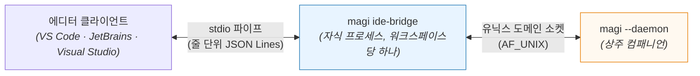
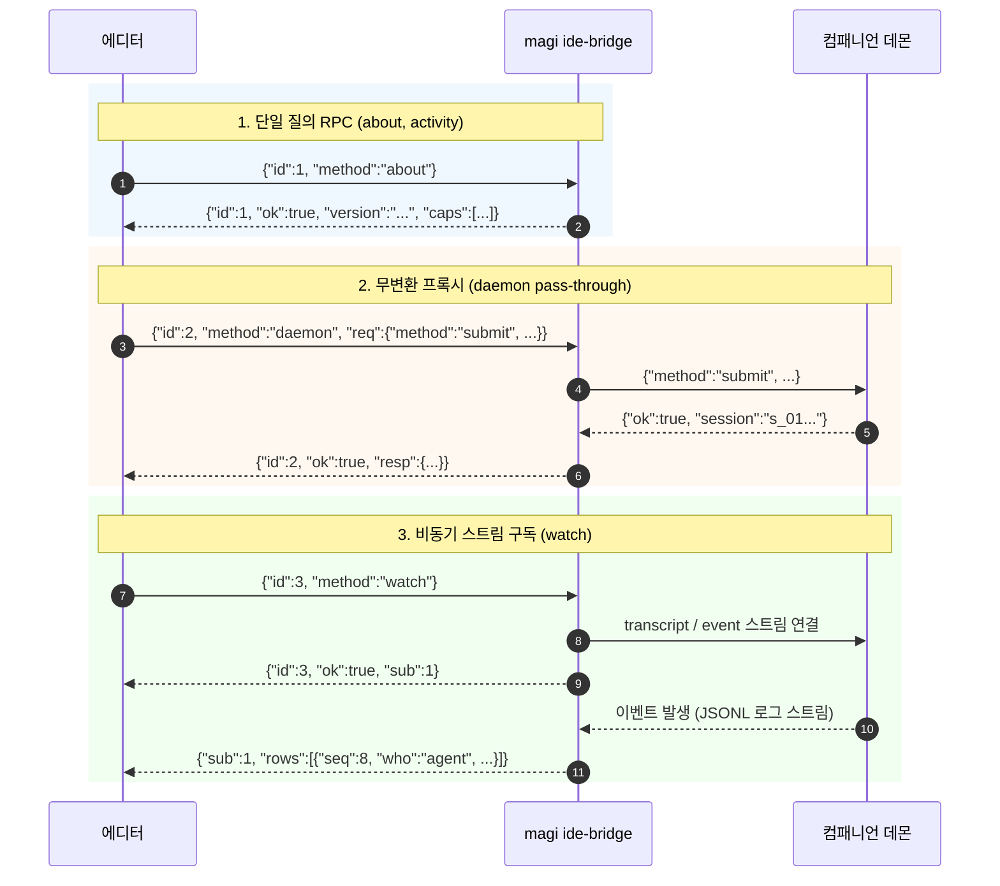

# `magi ide-bridge` — 편집기 클라이언트 공통 핵심 로직의 단일화

[English](IDE_BRIDGE.md) · [한국어](IDE_BRIDGE.ko.md) · [↑ Docs](README.ko.md) · [클라이언트 계약](CLIENTS.ko.md) · [VS Code](../clients/vscode/README.md) · [JetBrains](../clients/jetbrains/README.md) · [Visual Studio 설계](../clients/visualstudio/docs/DESIGN.ko.md)

## 1. 왜 있나 — 주장이 아니라 실측입니다

현재 두 에디터 클라이언트(JetBrains, VS Code)가 동일한 8가지 핵심 기능을 서로 다른 두 언어로 각각 구현하고 있으며, **이미 구현 상세가 분기(drift)된 상태**입니다.
이는 단순한 예측이 아니라, 2026-09-09 두 구현체 간의 로직을 실측 대조한 결과입니다:

| 코드 완성 처리 | JetBrains (Kotlin) | VS Code (TypeScript) |
|---|---|---|
| 커서 전후 컨텍스트 전송량 | **파일 전체** (`TextRange(0, offset)`) | **4,000자로 제한 절단** (`around()`) |
| 이미 입력된 텍스트와의 중복 처리 | **그대로 유지** — 고스트 텍스트(인라인 힌트)로 렌더링 | **중복 텍스트 제거** (`usable()`) |

동일한 사용자가 두 에디터에서 동일한 컴패니언 인스턴스와 동일한 모델을 사용하더라도 **전혀 다른 코드 완성 동작**을 경험하게 됩니다. 양측 모두 상호 비교 검증 체계가 존재하지 않아 이러한 불일치를 감지하지 못하기 때문입니다. 단 하나의 정답 규칙만 존재하는 로직을 [Visual Studio](../clients/visualstudio/docs/DESIGN.ko.md)용 C#으로 다시 작성할 경우 동일 규칙이 **세 벌로 분기**됩니다.

따라서 이러한 공통 규칙을 에디터들이 이미 바이너리로 내려받고 있는 코어 내부로 이전하고, 에디터 계층에는 순수하게 해당 에디터 고유의 UI 및 플랫폼 코드만 남깁니다.

## 2. 무엇인가

코어 바이너리의 서브커맨드(`magi ide-bridge`)로 제공됩니다. 에디터 클라이언트가 이를 자식 프로세스로 실행하고, stdin/stdout 파이프를 통해 줄바꿈 구분 JSON(line-delimited JSON)으로 통신합니다. 데몬과의 소켓 통신은 **브리지가 전담**하며, 에디터는 유닉스 소켓을 직접 제어하지 않습니다.



**소켓 대신 stdio를 사용하는 이유.** 별도의 IPC 소켓을 추가할 경우 해당 소켓의 파일 경로 유도 로직이 추가로 필요해지며, 경로 유도 로직이야말로 본 브리지를 통해 제거하려는 8가지 중복 과제 중 첫 번째 항목입니다. stdio 파이프는 별도의 감시(supervisor) 프로세스 없이도 브리지 프로세스의 수명 주기를 부모 에디터 프로세스에 자연스럽게 결속시킵니다.

**자식 프로세스 실행이 새로운 부담이 아닌 이유.** 에디터 클라이언트는 데몬 기동을 위해 이미 코어 바이너리를 시스템에 다운로드하여 보유하고 있습니다. 이를 한 번 더 자식 프로세스로 실행하는 것은 단일 OS 프로세스의 추가 비용일 뿐 새로운 외부 런타임 의존성이 발생하지 않습니다.

## 3. 무엇을 담나

두 구현체를 확보한 후 Visual Studio 연동 설계를 진행하는 과정에서 식별된 8가지 공통화 대상 기능입니다:

| 번호 | 에디터 계층에서 제거되는 공통화 대상 기능 |
|---|---|
| 1. 소켓 경로 | `workspaceKey` 및 소켓 파일 경로 유도 로직. 기존 두 구현체가 비표준 FNV 상수와 `Base("/")` 규칙을 제각각 재구현했으며 **초기에 양측 모두 계산 오류를 범함** |
| 2. 통신 와이어 | 줄 단위 JSON 파싱, 스트리밍 시 소켓 쓰기 채널 유지(half-close 방지), 요청-응답 매칭 |
| 3. 트랜스크립트 → 렌더링 행 | 동일한 이벤트 로그를 UI 표시 행으로 역직렬화하는 데 Kotlin 601라인, TypeScript 114라인 소요. **규칙과 문 모두 들어왔습니다(`rows`, 2026-09-12).** 어휘는 여덟로 세 사본이 맞고(`ee9176ff`), 클라이언트 전환은 남아 있습니다 — 각 클라이언트가 실제로 서 있는 자리는 §7 이 잽니다 |
| 4. 작업 상태 단일 어휘 | `unknown`은 `attached`가 아니며, `attached`는 `idle`과 상이하다는 상태 세분화 규약 |
| 5. 승인 어휘 | `allow`, `deny`, `always`. 오타 발생 시 조용히 무시되는 결함을 방지하고 **브리지 계층에서 즉시 거절** |
| 6. 코드 검토(look-over) 코멘트 분리 | 특정 라인에 걸리는 인라인 코멘트와 전역 코멘트의 판별 로직(구분자가 단순 탭 문자만이 아니라는 실측치 반영) |
| 7. 코드 완성 컨텍스트 윈도우 및 중복 제거 | §1에서 실측된 구현 분기 해소 |
| 8. **버전 식별 및 신규 릴리스 확인** | ⚠ 부분 지원. 하단 설명 참조 |

⚠ **8번째 항목(버전 및 릴리스)은 전체가 이전되지 않습니다.** 코어 바이너리를 먼저 다운로드해야 브리지가 동작할 수 있으므로, 초기 부트스트랩 단계는 브리지 내부에 위치할 수 없습니다. 브리지가 담당하는 범위는 "현재 실행 중인 바이너리의 빌드 버전"과 "원격의 신규 릴리스 존재 여부" 조회이며, **최초 바이너리 다운로드는 여전히 에디터 계층의 몫으로 남습니다.**

## 4. 무엇을 안 담나

에디터별 명령 등록 위치, 대화창 렌더링 프레임워크(WebView, XAML, Swing), 인레이 힌트 및 완성 API 연동 규격, 설정 UI 렌더링 방식, 알림 표출 규칙 등. 이 영역은 **해당 에디터 자체의 플랫폼 규약**이므로 에디터마다 상이하며, 그 규약을 충실히 준수하는 것이 에디터 클라이언트 고유의 책임입니다. 이 영역에는 공통화할 로직이 존재하지 않습니다.

## 5. 계약

줄바꿈으로 구분되는 한 줄에 하나의 JSON 객체가 전송되며, 양방향 통신입니다. 일반 요청 페이로드는 `id` 필드를 포함하며 응답 또한 동일한 `id`를 반환합니다. 스트림 구독을 통해 수신되는 프레임은 `id` 대신 `sub` 식별자를 가지며 비동기적으로 전달됩니다.

```
$ magi ide-bridge -workspace /경로/프로젝트
```

각 워크스페이스마다 하나의 브리지 프로세스가 할당됩니다 — 워크스페이스마다 단일 컴패니언 데몬이 대응되기 때문입니다.

### 이 바이너리가 무엇을 할 수 있는지 묻기

클라이언트는 찾아낸 `magi`를 신뢰하기 전에, **아무것도 기동하지 않고** 해당 빌드가 무엇을 지원하는지 물어볼 수 있습니다:

```
$ magi ide-bridge --features
{"features":["raw-socket-v1"],"protocol":1,"version":"magi 0.30.0 (…)"}
```

한 줄이고, 데몬에 연결하지 않으며, 디스크에 아무것도 쓰지 않습니다. 질의하는 쪽은 대개 **아무것도 실행되지 않은 상태**이므로 — 무엇을 기동할지 결정하는 단계입니다 — 소켓을 대기하는 탐침은 목적에 맞지 않게 느리게 응답하게 됩니다.

**구형 바이너리는 이 옵션을 거절하는 것으로 응답합니다: 종료 코드 2, stdout은 빕니다.** 그것이 계약이며, 클라이언트가 「이 빌드에는 기능 조회가 없다」고 결론 내릴 수 있는 유일한 근거입니다. 도움말 텍스트에서 단어를 검색하는 방식은 부정확한 추측에 불과합니다.

목록은 구현에서 **동적으로 유도되며 수동으로 하드코딩되지 않습니다**. 각 이름마다 해당 빌드에 질의하는 술어가 연결되어 있고(`raw-socket-v1`은 `--raw-socket` 플래그가 등록되어 있는 동안에만 포함됩니다), 술어가 거짓으로 응답한 이름은 출력에서 제외됩니다. `features`는 **언제나 배열입니다** — `null`은 「이 빌드에서 이 필드가 미구현됨」과 구별되지 않기 때문입니다.

`protocol`은 **이 한 줄 응답의 스키마 버전**이며 데몬의 와이어 프로토콜 버전이 아닙니다. 이 응답은 데몬 없이 독립적으로 반환되므로 둘은 별개로 관리됩니다. 각 기능 명칭이 자체 버전 접미사를 가지는 이유도 동일합니다 — 기능은 개별적으로 도입되고 교체됩니다.

[docs/CLIENT_LIFECYCLE.ko.md](./CLIENT_LIFECYCLE.ko.md) §4에서 이 명령을 명시합니다. 함께 언급된 `owned-daemon-v1` 역시 구현되어 브리지에서 지원 여부를 안내합니다 — 다만 이 패키지가 아닌 `cmd/magi`에서 직접 보고합니다. 해당 기능의 본체(`--daemon`의 `--client-owned` 플래그)가 그곳에 구현되어 있고 브리지 내부에는 이를 직접 질의할 술어가 없기 때문입니다. 기능 명칭과 실제 동작은 **실물 통합 테스트**로 동기화됩니다 — 바이너리를 직접 기동하여 해당 모드가 정상 수락되는지 검증하며, 동일 테스트가 양방향 불변식을 보증합니다: 존재하지 않는 기능은 안내하지 않고, 존재하는 기능은 누락 없이 안내합니다.

### 메서드

**현재 구현 완료된 메서드** (2026-09-09 기준, `internal/adapter/idebridge`):

| 메서드 | 동작 명세 |
|---|---|
| `about` | 브리지의 버전 정보, **지원 메서드 목록**, 데몬이 광고하는 프로토콜 및 기능(`proto`, `caps`) 반환 |
| `activity` | **현재 작업 상태를 단일 표준 어휘로 반환** — `not-running`, `attached`, `working`, `waiting`, `unknown` — 및 실행 호스트 환경 |
| `rows` | **한 대화를 화면이 그리는 행으로 반환** — 공통 접기(`idebridge.Rows`) 하나를 거칩니다. `session` 필수, `rows`(행 목록)와 `events`(읽은 사건 수)를 함께 답합니다. `"live":true` 면 계속 답합니다 — 같은 답에 `sub` 를 붙이고, 그 뒤로 차이 프레임을 보냅니다(아래) |
| `stop` | **실시간 구독을 끝냅니다**(`{"method":"stop","sub":1}`). 이것이 없으면 판이 들여다본 대화마다 연결을 하나씩 흘립니다 |
| `daemon` | **클라이언트의 `req` 페이로드를 대상 컴패니언 데몬으로 직접 전달하고 응답을 무변환 프록시로 반환** |

`about` 엔드포인트가 현재 빌드에서 지원하는 메서드 목록을 자체 응답하므로 클라이언트가 정적 문서 표에 의존할 필요가 없습니다 — 정적 문서는 낡을 수 있으나 런타임 광고는 항상 최신 상태를 반영합니다.

**`activity`는 8개 공통화 과제 중 최초로 브리지에 통합된 로직입니다.** 4번째 항목에 해당하며, 마침 **세 번째 에디터 클라이언트에서 중복 작성될 예정**이었기 때문입니다 — 해당 규칙은 TypeScript `core/activity.ts`에 기구현되어 있었고 Visual Studio 클라이언트 개발 시 C#으로 재구현되어야 하는 상태였습니다. 다음 두 가지 판별 규칙이 함께 이전되었습니다: **소켓 경로가 운영체제 주소 길이 상한(108바이트 등)을 초과하는가**와 **소켓 엔드포인트에 리스너가 부재한가**. 두 상황 모두 예외를 던지는 대신 표준 상태 어휘로 정규화되어 응답됩니다.

> **이전 작업 진행 중에는 두 개의 사본이 공존합니다.** Go 패키지와 `clients/vscode/src/core/activity.ts`. 2026-09-09 실제로 두 구현체 간 어휘 불일치가 발생하였으며, 개발자의 수동 대조에 의존하지 않도록 자동화 테스트를 구축하였습니다 — `TestBothCopiesSpeakOneVocabulary`가 TypeScript의 열거형(enum) 정의를 직접 파싱하여 Go의 어휘 집합과 교차 검증합니다. 한쪽에만 존재하는 어휘가 발견될 경우 해당 어휘를 명시하며 테스트가 실패합니다.

`unknown`은 에러를 무시하는 모호한 상태가 아니라 엄격한 진단 상태값입니다 — "데몬에 질의할 수 없는 상태"와 "정상적으로 응답을 수신한 상태"는 명백히 구별되는 사실입니다. 또한 `attached`는 세 번째 독립 상태이며 `idle`과 동일한 의미가 아닙니다 — 데몬이 응답을 반환하였으나 추가적인 상태 정보를 보고하지 않았음을 뜻하며, 현행 통신 와이어 상에서는 **일반적인 턴 실행 중의 상태가 정확히 이 형태**를 띱니다. `doing` 필드는 분 단위로 장기 실행되는 특정 도구의 진행 상태 메모에 불과하여 내장 도구 50개 중 1개 도구에서만 설정되며, 기존 `status` 소켓 엔드포인트에는 "턴이 실행 중임"을 명시하는 별도 필드가 부재합니다. 이 침묵을 단순 `idle`로 처리할 경우 **작업을 활발히 수행 중인 컴패니언을 유휴 상태로 오인 보고**하는 결함이 발생합니다(2026-09-09 실측 — Go 패키지 및 TypeScript 구현체 양측에서 동일하게 관찰됨). `waiting` 상태는 `working`보다 우선순위가 높습니다: 사용자 입력에 의해 블로킹된 턴 역시 내부적으로는 실행 중이지만, 사용자에게 가장 중요한 정보는 시스템이 자신의 입력을 대기하고 있다는 사실이기 때문입니다. 아울러 단일 상태 어휘 외에도 상세 맥락이 존재하는 경우 `why` 필드에 함께 적재되므로, 클라이언트는 **어떠한 원인으로 인한 부재 상태인지** 세부 사유까지 식별할 수 있습니다.

**`rows`는 8개 과제 중 3번(트랜스크립트 → 렌더링 행)의 문입니다.** 규칙 자체(`Rows`, 700줄, 골든으로 TypeScript 원본과 행 단위 대조)는 2026-09-10에 들어와 있었고, **그것을 부를 방법이 없었습니다** — `Methods()` 가 `about`·`activity`·`daemon` 셋뿐이라, 정본 사본이 닿을 수 없는 동안 두 클라이언트가 856줄(TypeScript)·868줄(Kotlin)로 계속 따로 유도했습니다. 부를 수 없는 규칙은 규칙이 없는 것과 화면이 같습니다.

문을 내며 **소켓 계약에 하나가 늘었습니다**(§6 의 「신규 데몬 엔드포인트를 추가하지 않습니다」는 유지 — 문이 아니라 기존 스트림의 프레임 한 종류입니다). `transcript` 는 **생중계 꼬리**이고 재생과 생중계 사이에 표가 없었습니다 — 그 문 스스로 「조용한 스트림을 끝내는 것은 상대가 끊는 것뿐」이라 적어 두었습니다. 그래서 대화를 **한 번** 받아 가려는 쪽은 언제 멈출지 알 수 없었습니다(2026-09-12 실측: 끝난 세션에서 202초를 읽다 강제 종료). 이제 재생이 끝나면 `{"ok":true,"live":true}` 한 프레임이 갑니다. **재생할 것이 없을 때도 갑니다** — 빈 로그와, 커서가 이미 끝에 있는 **평범한 재접속**이 그 자리입니다(뒤엣것을 처음에 빠뜨려, 가장 흔한 경로에서 화면이 누가 입력할 때까지 「불러오는 중」에 머물렀습니다). 로그의 끝을 못 읽으면 표 대신 **사유**(`why`)를 보냅니다 — 조용히 빠뜨리면 「끝을 못 댔다」가 **안 돌아오는 읽기**로 바뀌고, 브리지는 요청을 차례로 처리하므로 뒤의 요청까지 함께 멈춥니다. 한 번짜리 읽기에는 **침묵 한도**(15초, 프레임마다 갱신 — 대화의 길이가 아니라 침묵에 걸립니다)가 따로 있습니다: 아무 말 없이 조용해진 상대(구형 빌드·멈춘 엔진·먼 쪽을 잃은 릴레이)는 표도 사유도 안 보냅니다. 사건이 없는 프레임은 이 스트림이 **자기 이야기를 할 때 쓰던 모양**(거절된 커서의 `why`)이라, 이 필드를 모르는 클라이언트는 그것과 똑같이 무시합니다. 데몬은 이 능력을 `history` 라는 이름으로 광고하고, 브리지는 **`transcript` 가 아니라 `history` 를 보고** 묻습니다 — 구형 데몬은 표를 영영 안 보내므로, 잘못된 이름에 기대면 답 대신 매달립니다.

⚠ **이 문은 커서를 안 받습니다.** 접기가 **뒤로 손을 뻗기** 때문입니다(답이 위 프롬프트의 대기 표시를 지우고, 도구 결과가 제 호출 행에 앉고, 되살아난 인터젝션이 원본을 옮깁니다). 그래서 꼬리만 접은 것은 전체를 접은 것의 꼬리가 아니고, `since` 를 받으면 **클라이언트가 알아챌 수 없는 방식으로** 틀린 행이 갑니다 — 행 하나하나는 멀쩡하고 표시만 빠집니다. `TestTheFoldIsWholeLogAndTheDoorSaysSo` 가 이 문단을 믿는 대신 그 차이를 실제로 잽니다. 생중계 중 이어 붙이는 화면은 제 프레임을 계속 직접 접고, 이 문이 주는 것은 **두 클라이언트가 손으로 다시 짓는 그것** — 창을 열 때의 재생입니다.

### 실시간 행 — 뒤의 프레임이 이미 그려진 줄을 고치는 방법

`rows` 는 대화를 **한 번** 답합니다. 창을 열어 두는 것은 다른 문제입니다. 접기는 뒤로 손을 뻗기 때문에 화면이 꼬리만 접어 붙일 수 없고, 조각마다 대화 전체를 다시 보내면 답 길이 × 조각 수가 듭니다. 그래서 모양이 이렇습니다:

    로그 전체를 접는다  →  그 클라이언트가 마지막으로 본 것과 비교한다  →  차이를 보낸다

접기는 여전히 규칙 한 벌이고, 차이는 **그 결과에서 파생**되므로 맞춰 둘 두 번째 접기가 없습니다. `internal/adapter/idebridge/live.go` 가 낱말과 양쪽을 함께 들고 있습니다(`Diff` 는 데몬 쪽, `Apply` 는 각 클라이언트 사본이 대조할 것이 있도록 여기 둡니다).

**낱말 여섯, 발명이 아니라 실측입니다**(2026-09-13 — 정본 픽스처와 뒤로 손을 뻗는 세 갈래의 모든 앞부분을 접어 바로 앞과 비교했습니다):

| 낱말 | 뜻 | 무엇이 만드나 |
|---|---|---|
| `reset` | 목록 전체 | 첫 프레임, 그리고 아래의 안전 밸브 |
| `add` | 없던 행을 `after` 가 가리키는 행 뒤에 | 실측 변화 중 34 |
| `grow` | 이미 그려진 행에 글자를 덧붙인다 | 초안의 첫 줄이 끝난 뒤부터 |
| `patch` | 그 밖의 방식으로 바뀐 행, 행 전체를 싣는다 | 15 — **첫 줄이 아직 자라는 중인 초안**도 여기입니다. 요약이 같이 바뀌기 때문입니다 |
| `drop` | 행이 없어졌다 | 사실로 대체된 초안, 새 이름으로 옮겨진 질문 |
| `move` | 행은 그대로인데 자리가 바뀌었다 | 큐잉된 질문이 인라인으로 답해질 때, 그 뒤에 다른 행이 있으면 |

⚠ **첫 측정은 낱말이 셋이라고 답했습니다.** `move` 가 빠진 이유는 픽스처도 첫 합성 사례도 옮겨지는 질문과 목록 끝 **사이에 다른 행이 없었기** 때문입니다 — 그러면 「끝으로 옮겨졌다」와 「이미 끝이었다」가 같은 목록을 냅니다. 두 결과를 가릴 수 없는 사례는 가릴 수 있는 쪽을 보고합니다.

**한 프레임의 비용, 2026-09-13 실측.** 합성 대화를 접는 데 사건 200개 1.5ms, 1000개 8ms, 5000개 41ms, 20000개 157ms — 대화 길이에 비례합니다. 그날까지는 제곱이었습니다(20000개 786ms, 그중 53%가 답이 올 때마다 지금까지의 모든 행을 훑던 한 클로저). `rows` 문이 호출마다 그 값을 치르고 있었고, 실시간 화면은 아예 못 치릅니다. 두 접기의 차이가 나머지 절반입니다 — 행 150개에 약 1ms, 15000개에 88ms. 그래서 실시간 송신은 **도착한 사건 묶음마다** 접고 비교하며, 사건마다 하지 않습니다. 그 묶음 간격이 비용의 상한이고, 그것은 문이 정할 일이지만 숫자를 여기 적어 둡니다 — 숫자가 있어야 취향이 아니라 결정이 됩니다. 모양은 `TestClearingTheMarksCostsTheMarksNotTheConversation` 이 시계가 아니라 **일의 양을 세서** 붙듭니다.

**`grow` 는 명료함이 아니라 비용 때문에 있습니다.** 8.8KB 답이 조각 200 개로 올 때 실측: `grow` 로 보낸 글자 8756 바이트 대 행 전체로 보낼 때 884356 바이트 — **101배**입니다.

**자리는 번호가 아니라 이름으로 말합니다.** 번호는 「내가 이걸 보낼 때 당신이 갖고 있던 목록」을 뜻하고, 프레임을 놓친 클라이언트는 알아차릴 방법 없이 다른 줄을 고칩니다. 모르는 이름은 이 계약의 유일한 관대한 규칙입니다 — 그 행을 **끝에** 두고 계속합니다. 자리가 틀린 행은 다음 `reset` 이 고치지만, 다른 행을 조용히 덮어쓴 행은 되돌릴 수 없습니다.

**한 이름을 두 행이 쓰면 목록 전체를 보냅니다.** 고침은 이름으로 조준하므로, 이름이 겹치면 한쪽에 갈 고침이 다른 행에 내려앉고 그 아래 누구도 알아차릴 수 없습니다. `Diff` 는 `reset` 으로 답합니다. 지금 접기는 그런 목록을 내지 않습니다(`TestWhetherARowCanBeNamed`) — 이것은 언젠가 내게 될 때의 이야기입니다.

**사실은 제 초안의 이름을 물려받지 않습니다.** 스트리밍이 끝나면 프레임은 「그 행이 이것이 됐다」가 아니라 `drop d:m1:text` · `add 7` 로 말합니다. 이유는 이름이 **행의 함수**여야 하고 클라이언트가 그 행에 닿은 경로의 함수여서는 안 되기 때문입니다 — 그러지 않으면 같은 행이 흐르는 것을 본 화면에는 `d:m1:text`, 나중에 창을 연 화면에는 `7`, 그리고 재접속한 첫 화면에도 (접기에서 리셋되므로) 다시 `7` 입니다. 재접속에서 바뀌는 이름은 상속이 막으려던 그 중복 행을 정확히 만들어 냅니다. 화면이 잃는 것은 행이 아니라 그 행의 UI 상태입니다(펼쳐 두었던 생각 초안이 사실이 오면 접힙니다). 그것을 닫으려면 접기가 「이 사실이 어느 초안을 대체하는가」를 말해야 하고, 일부러 안 지었습니다 — §7 참조.

이 모두를 받치는 보증은 시험 하나입니다. 사건 흐름 다섯의 모든 앞부분에 대해 `Apply(held, Diff(before, after))` 가 `Rows(after)` 와 **칸 단위로** 같습니다 — `TestApplyingTheWordsRebuildsTheFold`. 실시간 화면과 지금 창을 연 화면이 같은 대화를 그린다는 것이고, 한 층 아래에서 `TestALiveStreamEndsWhereAReplayDoes` 가 하는 것과 같은 약속입니다.

**문**(2026-09-13). `{"method":"rows","session":"s_…","live":true}` 는 접기를 답합니다 — 한 번짜리 형태와 글자까지 같습니다 — 여기에 `sub` 번호가 붙고, 그 뒤로 대화가 바뀔 때마다 `{"sub":1,"ops":[…]}` 를 보내며, 끝날 때 `{"sub":1,"done":true}` 와 (있으면) `why` 를 보냅니다. `{"method":"stop","sub":1}` 이 끝냅니다.

이 중 셋은 기계적인 선택이 아니라 결정입니다:

- **첫 답은 재생이 끝날 때까지 기다립니다.** 첫 프레임이 차이라면 그것은 아무것도 아닌 것에 대한 차이입니다. 그래서 데몬의 재생-끝 표시를 첫 프레임의 바탕으로 씁니다 — 한 번짜리 문이 멈추는 그 표시를, 계속 읽는 쪽에게 건네는 것입니다(`daemon.Tail.CaughtUp`). 그 기다림은 묶여 있는데, 재생이 아니라 **침묵**을 묶습니다(프레임당 20초): 연결을 받고 조용해진 컴패니언은 영영 말 없는 구독이 아니라 문장을 내야 하고, 꾸준히 도착하는 긴 대화는 길다는 이유로 실패해서는 안 됩니다. 그 차이가 처음에는 결함이었고(리뷰, 2026-09-14), 한 번짜리 읽기가 이미 쓰는 것과 같은 한계입니다(`historyIdle`).
- **죽은 스트림은 죽었다고 말합니다.** `done` 이 사유를 싣습니다. 그냥 멈추는 구독은 「아무 일도 안 일어나는 대화」와 구별되지 않고, 화면은 계속 살아 있다고 말하게 됩니다 — 이 나무가 이미 값을 치른 비대칭 거짓입니다.
- **구독마다 제 연결을 가집니다.** 스트림은 계속 읽는 쪽에게 주어지는 것이고, `stop` 이 그 연결을 닫습니다. 깃발만으로는 안 됩니다 — 읽는 쪽은 어떤 깃발도 깨우지 못하는 소켓 읽기에 박혀 있으므로, 판이 대화를 갈아탈 때마다 연결이 하나씩 남습니다.

⚠ **아직 이 프레임을 그리는 클라이언트는 없습니다.** 클라이언트는 여전히 제 셰이퍼로 행을 짓고 있고, 옮기는 것이 다음 단계입니다 — 순서가 일부러 그렇습니다. 실시간 전달이 없는 채로 공용 접기에 옮긴 클라이언트는 나중에 한 번 더 옮겨야 했을 것입니다.

**향후 구현 예정 메서드.** 나머지 공통화 대상 기능들이며, §1의 구현 분기를 근본적으로 해결하는 핵심 영역입니다:

| 메서드 | 담당 예정 기능 |
|---|---|
| `watch` / `unwatch` | 트랜스크립트 행, 활동 상태, 변경된 파일 목록의 실시간 변경 스트림 구독 |
| `look` | 버퍼 내용에 라인 번호를 부여하여 검토를 요청하고, 인라인 코멘트와 전역 코멘트를 분리 반환 |
| `complete` | 커서 전후 텍스트를 최적 컨텍스트 윈도우로 슬라이싱하여 질의하고, 중복 텍스트를 제거하여 반환 |
| `touched` | 컴패니언이 수정한 파일 목록 조회 — 파일 시스템이 아닌 트랜스크립트 이벤트 로그로부터 역산 |
| `serve` | 해당 워크스페이스에 전담 컴패니언 데몬의 상시 가동 상태를 보장 |

⚠ 상기 메서드들이 완성되기 전까지는 **§1에서 실측된 에디터 간 코드 완성 동작 분기가 유지됩니다** — §1이 실측한 대상은 코드 완성 영역이며, `complete` 메서드는 여전히 백로그에 위치하기 때문입니다. 현재의 브리지는 통신 와이어, 소켓 경로 유도, 표준 작업 상태 어휘라는 3가지 공통 과제를 선행 해결한 상태입니다.

**`daemon` 엔드포인트는 의도적으로 무변환(pass-through) 프록시로 동작합니다.** 페이로드를 임의 번역하거나 가공하지 않습니다 — 요청은 전달된 형태 그대로 데몬에 전달되고, 응답 역시 데몬이 반환한 원형 그대로 클라이언트에 반환됩니다. 이에 따라 에디터 클라이언트는 아직 브리지 전용 메서드로 추상화되지 않은 다양한 소켓 엔드포인트(`compact`, `rewind`, `cron-set`, `children`, `job-kill`, `mcp-attach`, `config-set`, `profiles`, `resume`, `session-new` 등)를 **이중 프로토콜 변환 계층 없이** 즉시 호출할 수 있습니다. 번역 계층을 도입할 경우 기존 소켓 규약과 브리지 규약 간의 버전 정합성을 지속적으로 유지해야 하는 추가적인 유지보수 비용이 발생하기 때문입니다.

```json
→ {"id":1,"method":"about"}
← {"id":1,"ok":true,"version":"0.27.0","proto":1,"caps":["transcript","cron","settings"]}

→ {"id":2,"method":"daemon","req":{"method":"submit","text":"실패하는 시험 고쳐줘"}}
← {"id":2,"ok":true,"resp":{"ok":true,"session":"s_01J..."}}

→ {"id":3,"method":"watch"}
← {"id":3,"ok":true,"sub":1}
← {"sub":1,"rows":[{"seq":8,"who":"agent","text":"시험을 봅니다…"}]}
```

위 3가지 대표 호출의 상호작용 흐름은 다음과 같습니다:



## 6. 이것이 바꾸지 않는 것

- **데몬 소켓 프로토콜.** 신규 데몬 엔드포인트를 추가하지 않습니다. 브리지는 에디터 클라이언트들이 기존에 호출하던 유닉스 소켓의 클라이언트로 동작하므로, 기존 방식대로 소켓을 직접 제어하려는 클라이언트는 기존 코드를 그대로 유지할 수 있습니다.
- **[`CLIENTS.ko.md`](CLIENTS.ko.md)** 문서가 소켓 인터페이스 규약의 원천 규격으로 불변 유지됩니다. 본 문서는 해당 소켓 인터페이스들로부터 **누가 어떤 로직을 어떻게 공통 유도하는가**를 다룹니다.

## 7. 클라이언트와 맞춰 본 것, 2026-09-19

셰이퍼 두 벌은 그대로 있고, 문은 아직 어느 클라이언트도 그리는 근거가 아닙니다. 이 파일이 멈춰 있던 사이에 달라진 것은 **공용 행이 클라이언트 쪽에서 칸 셋을 늘렸다**는 것, 그리고 같은 전선의 한 이름이 양쪽에서 **반대를 뜻하게** 됐다는 것입니다. 이관이 그 각각을 정해야 하므로 적어 둡니다 — 그리고 이름만 비교하는 가드는 세 번째를 볼 수 없습니다.

**두 클라이언트가 실제로 서 있는 자리.** VS Code 는 `magi ide-bridge` 를 정확히 둘에만 씁니다 — `--features`(이 바이너리가 무엇을 할 수 있나)와 `--raw-socket`(윈도우 릴레이. Node 는 유닉스 소켓 경로를 이름 있는 파이프로 읽습니다). 데몬은 직접 다이얼하고 행은 `clients/vscode/src/core/transcript.ts` 에서 접습니다. 젯브레인도 `--features` 만 쓰고 데몬을 직접 다이얼합니다. 그쪽에는 이제 문의 전선 모델과 전송로가 있지만(`BridgeRow`·`BridgeRows`, 2026-09-14) **아직 그것으로 그리는 코드는 없습니다.** 그래서 §3 의 3번은 적힌 그대로입니다 — 규칙과 문은 들어왔고, 클라이언트는 아직 그 위에 없습니다.

**문이 선언만 하고 영영 안 보내는 칸 셋.** `rawArgs`·`fileNav`·`outputId` 가 공용 `Row` 에 들어왔습니다(2026-09-15~17, VS Code 판을 짓는 레인). TypeScript 셰이퍼는 셋을 다 채우고, Go 접기는 하나도 안 채우며 이 꾸러미의 어떤 시험도 그것을 건드리지 않습니다. 구조체에 있는 이유는 교차 필드 가드가 이 Row 와 TypeScript 쪽을 **양방향으로** 비교하기 때문입니다 — 클라이언트가 나르는데 문에 없는 칸은 그 가드가 잡으려고 만든 바로 그 모양입니다. 결과는 **영영 안 보낼 사실 셋을 광고하는 문**이고, 이관은 칸마다 골라야 합니다: 접기가 유도하게 하거나(`rawArgs` 는 이미 `Args` 이고, `fileNav` 는 도구 계약에서 뽑는 **규칙**이므로 여기 있을 것이며, `outputId` 는 문서를 소유한 쪽이 발급할 신원입니다), 아니면 공용 행에서 떼어 그 클라이언트의 것으로 두는 것.

⚠ **`args` 가 양쪽에서 반대를 뜻합니다.** 이 문에서 `args` 는 **인자 전문**입니다 — 2026-09-13 리뷰가 「대표 칸 하나만 남기고 나머지를 버린다」를 짚은 뒤 그렇게 정했습니다 — 그리고 한 줄 형태는 `summary` 에 있습니다. TypeScript Row 에서는 `args` 가 **한 줄 형태**(`askedFor(...)`)이고 전문이 `rawArgs` 입니다. 같은 전선 이름, 뒤집힌 뜻. 필드 가드는 **이름**을 비교하므로 통과하고, 모양 가드도 둘 다 문자열이라 통과합니다. 이 단락을 안 읽고 문으로 옮긴 클라이언트는 **한 줄을 그리던 자리에 JSON 덩어리를 그립니다.**

**그리고 문은 그 클라이언트가 그리는 것을 아직 답할 수 없습니다.** `summary` 는 행 전체의 한 줄입니다 — 도구 행이면 이름과 인자 줄이 **함께** 들어갑니다(`bash go test ./...`). 인자 줄 자체는 접기 안의 `askedLine` 이고 전선에는 없습니다. 이름을 한 요소로, 인자를 다른 요소로 그리는 판은 그것을 따로 받아야 하고, 아니면 전문을 다시 자르는데 그것은 **자르는 규칙을 두 번 쓰는 일**입니다.

**그래서 이관의 첫 결정은 전송로가 아니라 어휘입니다.** 순서대로: 한 줄 인자 형태를 전선에 이름 붙이기(또는 클라이언트가 다시 유도하는 것을 받아들이기) · 클라이언트가 채우는 칸 셋을 각각 정하기 · 그다음 클라이언트를 그 결과 위로 옮기기. 옮기는 일을 **측정**으로 만드는 대조는 이미 서 있습니다 — `CanonicalFoldTest` 가 종류·구조 칸·대기 표시·사건 시각을 이 접기의 골든과 맞추고, 픽스처에는 진짜 데몬이 낸 모양(큐잉된 질문이 새 이름으로 되살아나는 것)이 들어 있습니다.

### 7.1 도구 인자 및 전사 어휘 비교표 (Go · TypeScript · Kotlin)

세 구현체가 들고 있는 `Row`의 도구 및 보조 필드를 대조한 결과입니다. 브리지 전환 시 클라이언트가 제멋대로 다시 자르거나 빈 칸을 읽지 않도록 생성 책임과 의미를 명확히 규정합니다.

| 필드명 | Go (`idebridge.Row`) | TypeScript (`transcript.Row`) | Kotlin (`usecase.Row`) | 생성 책임 및 일원화 방향 |
|---|---|---|---|---|
| `args` | **인자 전문** (JSON/원문 전체) | **한 줄 요약** (`askedFor`) | **한 줄 요약** (`asked`) | ⚠ **의미 불일치 핵심.** 전선에서는 `args`를 한 줄 요약으로 정의하거나, 브리지 전선에 `summaryArgs`를 신설하고 `args`는 원문으로 유지하는 결정을 확정해야 함. |
| `rawArgs` | 선언됨 (미채움, `omitempty`) | **인자 전문** (원문 전체) | 미선언 (`BridgeRow`에만 존재) | 브리지 셰이퍼가 도구 호출 원문을 그대로 보존하여 공급함. UI의 펼침 토글(`…`) 대상. |
| `summary` | **행 전체 한 줄 요약** (`도구+인자`) | 미선언 | 미선언 | 경량 클라이언트·목록 전사용. 도구 이름과 인자가 결합된 형태이므로 분리 렌더링 UI용 단독 인자 요약(`askedLine`)과 구분. |
| `fileNav` | 선언됨 (`FileNav` 포인터, 미채움) | **구조화 파일/줄 정보** (`FileNav`) | 미선언 (`BridgeRow`에만 존재) | 도구 계약(read/edit/write 등) 파싱 규칙을 브리지 코어로 이관하여 단일 생성. `파일:줄` 링크로 에디터 네이티브 이동 연결. |
| `outputId` | 선언됨 (미채움, `omitempty`) | **가상 문서 식별자** (`outputId`) | 미선언 (`BridgeRow`에만 존재) | 긴 출력물·답변 전문을 읽기 전용 가상 문서(`magi-output:`)로 열기 위한 세션 귀속 ID. 세션 수명 동안 불변. |

#### 대표 도구 이벤트 변환 예시

1. **명령어 실행 (`bash`):**
   - 도구 인자: `{"command": "go test ./..."}`
   - 브리지 생성 기대값:
     - `tool`: `"bash"`
     - `args`: `"go test ./..."` (한 줄 요약)
     - `rawArgs`: `"{\"command\": \"go test ./...\"}"` (인자 전문)
     - `summary`: `"bash go test ./..."` (행 전체 요약)
     - `fileNav`: `null`
   - UI 변환: 헤더에 `bash` 뱃지와 `go test ./...`를 인라인 표시하고, `…` 토글 시 `rawArgs` 블록을 펼침.

2. **파일 조회 (`read_file`):**
   - 도구 인자: `{"AbsolutePath": "/repo/internal/adapter/idebridge/rows.go", "StartLine": 72}`
   - 브리지 생성 기대값:
     - `tool`: `"read_file"`
     - `args`: `"/repo/internal/adapter/idebridge/rows.go:72"`
     - `rawArgs`: `"{\"AbsolutePath\": \"...\", \"StartLine\": 72}"`
     - `fileNav`: `{"path": "/repo/internal/adapter/idebridge/rows.go", "line": 72}`
   - UI 변환: `fileNav` 객체를 통해 `rows.go:72` 링크 버튼(`file-nav-btn`)을 생성하고 클릭 시 에디터 해당 줄로 즉시 이동.


## 8. 남은 것과, 어디서 해야 하는가

| 작업 항목 | 수행 환경 및 고려 사항 |
|---|---|
| 상기 5개 미구현 유도 메서드 구현 | 임의 환경. 순수 Go 언어 구현체이며, 기존 두 구현체(Kotlin, TypeScript)로부터 골든 테스트 케이스를 직접 이관 가능 |
| **§1의 동작 분기 2종에 대한 설계 결정** — 컨텍스트 윈도우 크기 규격, 중복 텍스트 제거 정책 | 단순 코드 이식이 아닌 **설계적 정책 확정** 필요. 특정 구현체를 맹목적으로 복제할 경우 비검증된 구현이 표준으로 고착될 위험 |
| VS Code 클라이언트를 브리지 기반으로 전환 | 임의 환경. 브리지 코어 개발과 병렬 진행 가능한 독립 연동 작업 |
| **Visual Studio 클라이언트 구현** | **Windows 환경 필수.** 본 문서를 작성한 macOS 환경에는 Visual Studio 및 `msbuild`가 부재하며 VS for Mac은 단종됨 — [설계](../clients/visualstudio/docs/DESIGN.ko.md) §9 |

## 9. 재지 않은 것

- **에디터 클라이언트들의 실제 마이그레이션 전환율.** VS Code에는 이미 안정적으로 동작하는 전용 구현체가 존재하며, 이를 브리지 기반으로 전면 마이그레이션하는 것은 브리지 개발 자체와는 독립적인 통합 과제입니다.
- **프로세스 추가에 따른 리소스 오버헤드** — 에디터 창마다 브리지 코어 프로세스가 추가 기동됨에 따른 초기 기동 시간 및 메모리 점유량 실측.
- ~~**Windows 환경의 AF_UNIX 소켓 동작 검증.**~~ ✅ **검증 완료(2026-09-10).** 브리지 역시 일반 클라이언트와 동일하게 AF_UNIX 소켓을 사용하므로 Office 클라이언트가 `%AppData%` 경로 하위에서 겪었던 소켓 주소 제약이 동일하게 발생함을 확인하였으며, `MAGI_SOCKET_DIR` 환경 변수를 해당 트리 외부로 설정하여 해결됨을 실측 확인했습니다. Visual Studio 확장이 자식 프로세스로 기동한 브리지 프로세스에서도 동일하게 동작했습니다: 환경 변수가 부모 IDE 프로세스로부터 정상 상속되므로, 에디터 계층에서 별도의 우회 로직을 구현할 필요가 없습니다([설계](../clients/visualstudio/docs/DESIGN.ko.md) §5).
