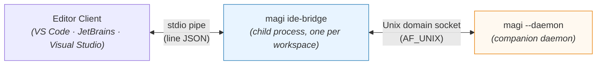
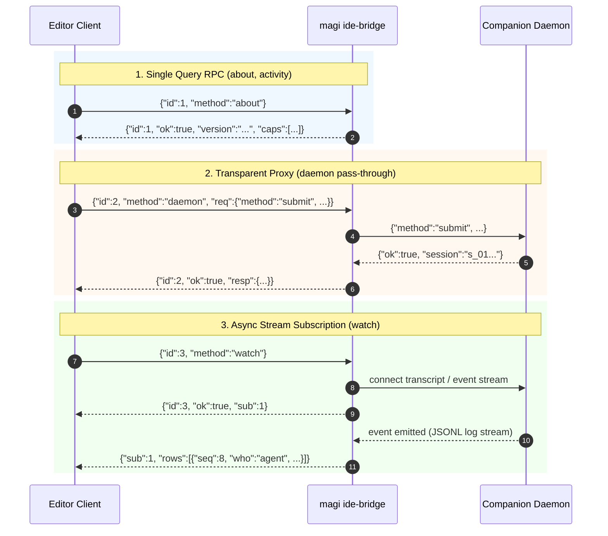

# `magi ide-bridge` — one copy of what every editor client needs

[English](IDE_BRIDGE.md) · [한국어](IDE_BRIDGE.ko.md) · [↑ Docs](README.md) · [client contract](CLIENTS.md) · [VS Code](../clients/vscode/README.md) · [JetBrains](../clients/jetbrains/README.md) · [Visual Studio design](../clients/visualstudio/docs/DESIGN.ko.md)

## 1. Why this exists — measured, not argued

Two editor clients now do the same eight things, in two languages. They have already drifted.
This is not a prediction; here is one derivation compared across the two ports on 2026-09-09:

| completion | JetBrains (Kotlin) | VS Code (TypeScript) |
|---|---|---|
| how much of the file goes either side of the cursor | **the whole file** (`TextRange(0, offset)`) | **4,000 characters** (`around()`) |
| the answer's overlap with what is already typed | **left in** — drawn as ghost text | **stripped** (`usable()`) |

One person, two editors, two different completions from the same companion and the same model.
Neither side knows it disagrees, because nothing compares them. Writing this a third time in C#
for [Visual Studio](../clients/visualstudio/docs/DESIGN.ko.md) would make three copies of a rule
that has one right answer.

So: the rule moves into the binary the editors already download, and the editor layer keeps only
what is genuinely its own.

## 2. What it is

A subcommand of the core binary. The editor spawns it as a child process and talks to it over
stdin/stdout in line-delimited JSON. The bridge dials the companion's socket; the editor never does.



**Why stdio rather than a socket.** A second socket would need a second path derivation, and
deriving that path is the first of the eight things we are removing. stdio also ties the bridge's
life to the editor's without a supervisor.

**Why a child process is not a new burden.** Every editor client already downloads this binary —
that is how it starts a daemon at all. Spawning it again costs a process, not a dependency.

## 3. What it carries

The eight, as counted in the Visual Studio design after two ports were in hand.

| | what the editor stops doing |
|---|---|
| 1. socket path | deriving `workspaceKey` and the socket path. Two ports each re-implemented a non-standard FNV constant and `Base("/")`, and both got it wrong first |
| 2. the wire | line-delimited JSON, keeping the write half open, matching replies to requests |
| 3. transcript → rows | 601 lines of Kotlin, 114 of TypeScript, for the same log. **Rule and door are both in (`rows`, 2026-09-12).** All three copies now agree on eight row kinds (`ee9176ff`); moving the clients onto it is still to do |
| 4. one word for "what is it doing" | including that `unknown` is not `attached`, and that `attached` is not `idle` |
| 5. approval vocabulary | `allow` · `deny` · `always`, refused here if misspelled instead of silently ignored |
| 6. splitting a look-over | which remarks hang on a line and which do not — including that the separator is not only a tab |
| 7. completion window and overlap | the drift measured in §1 |
| 8. **which version am I, is there a newer one** | ⚠ partly. See below |

⚠ **The eighth does not move whole.** Downloading the core is what gets you the bridge, so the
bootstrap cannot live inside it. What the bridge can answer is "which build am I" and "is there a
newer release"; fetching the first copy stays in the editor layer. Counting this as fully carried
would be counting a thing that cannot be.

## 4. What it does not carry

Where commands go · what draws the conversation (webview, XAML, Swing) · inlay and completion APIs ·
who renders settings · notification conventions. These differ per editor **by that editor's own
rules**, and following those rules is the job of the client. There is nothing to share here.

## 5. The contract

One JSON object per line, both directions. A request carries `id`; its reply carries the same `id`.
Frames from a subscription carry `sub` instead and arrive whenever they arrive.

```
$ magi ide-bridge -workspace /path/to/project
```

One bridge per workspace, because there is one companion per workspace.

### Asking what this binary can do

Before a client trusts a `magi` it found, it can ask what that build supports — without starting
anything:

```
$ magi ide-bridge --features
{"features":["raw-socket-v1"],"protocol":1,"version":"magi 0.30.0 (…)"}
```

One line, no daemon, nothing written to disk. The caller is often asking *because* nothing is
running — it is deciding whether to start something — so a probe that waits on a socket would answer
the wrong question slowly.

**An older binary answers by refusing the flag: exit code 2 and nothing on stdout.** That is the
contract, and it is the only thing a client may read to conclude "no features here". Searching the
help text for a word is guessing.

The list is derived from the implementation, never written down: each name is paired with a
predicate that asks this build (`raw-socket-v1` is present exactly while the `--raw-socket` flag is
registered), and a name whose predicate says no is dropped rather than printed. `features` is always
an array — `null` could not be told apart from "this field is not implemented in this build".

`protocol` is the shape of THIS line, not the daemon's wire version; the two move independently
because this line is answered without a daemon at all. Feature names carry their own version suffix
because features arrive and are replaced one at a time.

Named in [CLIENT_LIFECYCLE.md](CLIENT_LIFECYCLE.md) §4. `owned-daemon-v1` is there too and is now built, so it is
advertised — but by `cmd/magi` rather than by this package, because the thing behind it (the
`--client-owned` flag on `--daemon`) lives there and there is no predicate here that could ask about
it. The name is tied to the behaviour by a live test that starts the binary and checks the mode is
really accepted, and the same test holds the floor in both directions: nothing advertised that is
absent, nothing present that goes unadvertised.

### Methods

**Built** as of 2026-09-09 (`internal/adapter/idebridge`):

| method | what it does |
|---|---|
| `about` | the bridge's version, the methods it answers, and what the daemon advertises (`proto`, `caps`) |
| `activity` | **one word for what the companion is doing** — `not-running` · `attached` · `working` · `waiting` · `unknown` — plus what it is running on |
| `rows` | **answers one conversation as the lines a screen shows**, through the one fold (`idebridge.Rows`). Needs a `session`; replies with `rows` and with `events`, the number of events read |
| `daemon` | **forwards `req` to the companion verbatim and returns its reply verbatim** |

`about` names the methods this build answers, so a client never has to guess from this table — the
table ages, the advertisement does not.

**`rows` is the door for the third of the eight (transcript → rows).** The rule itself has been in
this package since 2026-09-10 — 700 lines, checked row-for-row against the TypeScript original — and
**nothing could ask for it**: `Methods()` answered `about`, `activity` and `daemon`, so the one copy
sat unreachable while two clients went on deriving it separately in 856 lines of TypeScript and 868
of Kotlin. A rule nobody can call looks exactly like no rule at all.

Opening it added one thing to the socket contract (§6's "no new daemon endpoint" holds — this is a
frame on an existing stream, not a door). `transcript` is a **live tail** with nothing between replay
and live; the door's own note says the peer hanging up is the only thing that ends a quiet one. So
anything wanting the conversation ONCE could not know when to stop: measured 2026-09-12, a reader on
a finished session waited 202s and was killed. Now one frame, `{"ok":true,"live":true}`, follows the
last replayed event. An event-less frame is what this stream already uses to talk about itself (the
refused-cursor `why`), so a client built before the field ignores it exactly as it ignores that one.
The daemon advertises the ability as `history`, and the bridge asks for **`history`, not
`transcript`** — an older daemon speaks the latter and will never send the marker, so gating on the
wrong name waits for ever instead of answering.

⚠ **The door takes no cursor.** The fold reaches BACKWARDS — a reply clears the waiting mark on the
prompt above it, a tool result lands on its call's row, a resurfaced interjection moves its original —
so folding a tail is not the tail of folding everything, and a `since` would return rows that are
wrong in a way no client could detect: every row looks right, the marks are missing.
`TestTheFoldIsWholeLogAndTheDoorSaysSo` measures that difference instead of trusting this paragraph.
A screen appending while a turn runs keeps folding its own live frames; what it gets here is the one
thing both clients rebuild by hand — replay when a window opens.

**`activity` is the first derivation to move in.** It is the fourth of the eight, and it was about
to be written a third time: the rule lives in TypeScript in `core/activity.ts`, and the Visual
Studio client needed it in C#. Two rules travel with it because they are the same question wearing
different clothes — is the socket path longer than the address allows, and is anything listening —
and both answer in the same vocabulary rather than in an exception.


> **While the move is under way there are two copies:** this package and
> `clients/vscode/src/core/activity.ts`. They did drift (2026-09-09), and this is not the kind
> of thing to leave to somebody opening both files, so a test holds it —
> `TestBothCopiesSpeakOneVocabulary` reads the TypeScript enum and compares the word sets. A
> word on one side and not the other fails by name.

`unknown` is an answer, not a shrug: "we could not ask" is a different fact from "it answered".
And `attached` is the third of those, not a fourth spelling of idle — it means the daemon replied
and said nothing further, which is what an ordinary running turn looks like on this wire. `doing`
is a long-running tool's progress note (one builtin tool file in fifty writes it), and the `status`
door has no field meaning "a turn is running", so a bridge that called that silence `idle` would be
reporting rest at a companion working flat out. Measured 2026-09-09, in this package and in the
TypeScript copy it exists to replace. `waiting` beats `working`, because a turn blocked on a person
is running but what the person needs to know is that it wants them. And the word is never the whole story — `why` carries the
reason when there is one, so a client can say *which* kind of nothing it found.

**Not built yet.** These are the rest of the derivations, and they are the half that ends the drift
in §1:

| method | what it will do |
|---|---|
| `watch` / `unwatch` | rows, activity and touched files as they change |
| `look` | number a buffer, ask, split the answer into anchored and loose |
| `complete` | window either side of a cursor, ask, strip the overlap |
| `touched` | which files the companion changed, read off the transcript |
| `serve` | make sure a companion is running for this workspace |

⚠ Until they exist, **the drift measured in §1 is still there** — the completion drift is the one
§1 actually measured, and `complete` is still on the list. The forwarding door is useful on its own
(it reaches every door, including the fifteen no client has ported), but the eight are only three
in so far: the wire, the socket path, and now the one word.

**`daemon` is deliberately dumb.** It does not translate: the request goes as written and the reply
comes back as written. That is what makes the doors the clients have not ported — `compact`,
`rewind`, `cron-set`, `children`, `job-kill`, `mcp-attach`, `config-set`, `profiles`, `resume`,
`session-new` and the rest — reachable without inventing a second vocabulary for each one. A
translated pass-through would be a new contract to keep in step with the old one.

```json
→ {"id":1,"method":"about"}
← {"id":1,"ok":true,"version":"0.27.0","proto":1,"caps":["transcript","cron","settings"]}

→ {"id":2,"method":"daemon","req":{"method":"submit","text":"fix the failing test"}}
← {"id":2,"ok":true,"resp":{"ok":true,"session":"s_01J..."}}

→ {"id":3,"method":"watch"}
← {"id":3,"ok":true,"sub":1}
← {"sub":1,"rows":[{"seq":8,"who":"agent","text":"Looking at the test…"}]}
```

The interaction flow across these three representative patterns:



## 6. What this does not change

- **The daemon protocol.** No new door. The bridge is a client of the same socket the editors dial
  today, so a client that would rather dial it directly still can.
- **[`CLIENTS.md`](CLIENTS.md)** stays the canon for what the doors are. This file is about who derives what
  from them.

## 7. What is left, and where it has to happen

| | where |
|---|---|
| the five derivations above | anywhere — this is ordinary Go, and the goldens can come from the two existing ports |
| **deciding the two drifts** in §1 — completion window size, and whether to strip the overlap | needs a decision, not a port. Copying either side would bless one by accident |
| moving VS Code onto the bridge | anywhere. A second job, not a side effect of this one |
| **the Visual Studio client** | **Windows.** No Visual Studio and no `msbuild` on the machine this was written on, and VS for Mac is discontinued — see the [design](../clients/visualstudio/docs/DESIGN.ko.md) §9 |

## 8. Not measured

- **Whether the editors will actually adopt it.** VS Code has a working port; moving it onto the
  bridge is a second job, not a side effect of this one.
- **Process cost** — spawn time and memory of a second core process per open window.
- ~~**Windows.**~~ ✅ **Measured 2026-09-10.** The bridge dials AF_UNIX like every other client, and
  the trap the Office client hit under `%AppData%` applies here too — it does. Pointing
  `MAGI_SOCKET_DIR` outside that tree clears it, and the same held for a bridge spawned as a child
  of the Visual Studio extension: the environment is inherited from the IDE, so the editor layer
  has nothing of its own to do ([design §5](../clients/visualstudio/docs/DESIGN.ko.md)).
