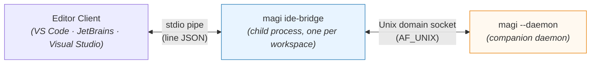
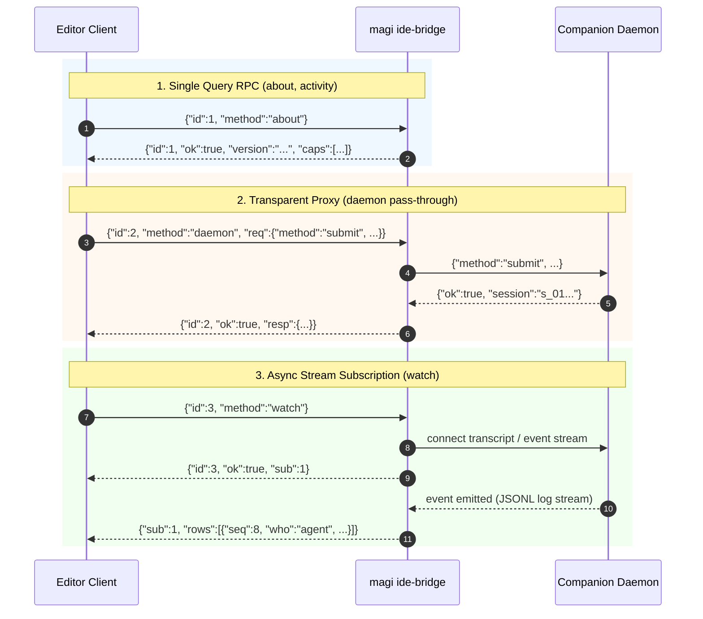

# `magi ide-bridge` — one copy of what every editor client needs

[English](IDE_BRIDGE.md) · [한국어](IDE_BRIDGE.ko.md) · [↑ Docs](README.md) · [client contract](CLIENTS.md) · [VS Code](../clients/vscode/README.md) · [JetBrains](../clients/jetbrains/README.md) · [Visual Studio design](../clients/visualstudio/docs/DESIGN.ko.md)

## 1. Why this exists — measured, not argued

Two editor clients now do the same eight things, in two languages. They have already drifted.
This is not a prediction; here is one derivation compared across the two ports on 2026-09-09:

| completion | JetBrains (Kotlin) | VS Code (TypeScript) |
|---|---|---|
| how much of the file goes either side of the cursor | **the whole file** (`TextRange(0, offset)`) | **4,000 characters** (`around()`) |
| the answer's overlap with what is already typed | **left in** — drawn as ghost text | **stripped** (`usable()`) |

One person, two editors, two different completions from the same companion and the same model.
Neither side knows it disagrees, because nothing compares them. Writing this a third time in C#
for [Visual Studio](../clients/visualstudio/docs/DESIGN.ko.md) would make three copies of a rule
that has one right answer.

So: the rule moves into the binary the editors already download, and the editor layer keeps only
what is genuinely its own.

## 2. What it is

A subcommand of the core binary. The editor spawns it as a child process and talks to it over
stdin/stdout in line-delimited JSON. The bridge dials the companion's socket; the editor never does.



**Why stdio rather than a socket.** A second socket would need a second path derivation, and
deriving that path is the first of the eight things we are removing. stdio also ties the bridge's
life to the editor's without a supervisor.

**Why a child process is not a new burden.** Every editor client already downloads this binary —
that is how it starts a daemon at all. Spawning it again costs a process, not a dependency.

## 3. What it carries

The eight, as counted in the Visual Studio design after two ports were in hand.

| | what the editor stops doing |
|---|---|
| 1. socket path | deriving `workspaceKey` and the socket path. Two ports each re-implemented a non-standard FNV constant and `Base("/")`, and both got it wrong first |
| 2. the wire | line-delimited JSON, keeping the write half open, matching replies to requests |
| 3. transcript → rows | 601 lines of Kotlin, 114 of TypeScript, for the same log. **Rule and door are both in (`rows`, 2026-09-12).** All three copies now agree on eight row kinds (`ee9176ff`); moving the clients onto it is still to do, and §7 measures where each one actually stands |
| 4. one word for "what is it doing" | including that `unknown` is not `attached`, and that `attached` is not `idle` |
| 5. approval vocabulary | `allow` · `deny` · `always`, refused here if misspelled instead of silently ignored |
| 6. splitting a look-over | which remarks hang on a line and which do not — including that the separator is not only a tab |
| 7. completion window and overlap | the drift measured in §1 |
| 8. **which version am I, is there a newer one** | ⚠ partly. See below |

⚠ **The eighth does not move whole.** Downloading the core is what gets you the bridge, so the
bootstrap cannot live inside it. What the bridge can answer is "which build am I" and "is there a
newer release"; fetching the first copy stays in the editor layer. Counting this as fully carried
would be counting a thing that cannot be.

## 4. What it does not carry

Where commands go · what draws the conversation (webview, XAML, Swing) · inlay and completion APIs ·
who renders settings · notification conventions. These differ per editor **by that editor's own
rules**, and following those rules is the job of the client. There is nothing to share here.

## 5. The contract

One JSON object per line, both directions. A request carries `id`; its reply carries the same `id`.
Frames from a subscription carry `sub` instead and arrive whenever they arrive.

```
$ magi ide-bridge -workspace /path/to/project
```

One bridge per workspace, because there is one companion per workspace.

### Asking what this binary can do

Before a client trusts a `magi` it found, it can ask what that build supports — without starting
anything:

```
$ magi ide-bridge --features
{"features":["raw-socket-v1"],"protocol":1,"version":"magi 0.30.0 (…)"}
```

One line, no daemon, nothing written to disk. The caller is often asking *because* nothing is
running — it is deciding whether to start something — so a probe that waits on a socket would answer
the wrong question slowly.

**An older binary answers by refusing the flag: exit code 2 and nothing on stdout.** That is the
contract, and it is the only thing a client may read to conclude "no features here". Searching the
help text for a word is guessing.

The list is derived from the implementation, never written down: each name is paired with a
predicate that asks this build (`raw-socket-v1` is present exactly while the `--raw-socket` flag is
registered), and a name whose predicate says no is dropped rather than printed. `features` is always
an array — `null` could not be told apart from "this field is not implemented in this build".

`protocol` is the shape of THIS line, not the daemon's wire version; the two move independently
because this line is answered without a daemon at all. Feature names carry their own version suffix
because features arrive and are replaced one at a time.

Named in [CLIENT_LIFECYCLE.md](CLIENT_LIFECYCLE.md) §4. `owned-daemon-v1` is there too and is now built, so it is
advertised — but by `cmd/magi` rather than by this package, because the thing behind it (the
`--client-owned` flag on `--daemon`) lives there and there is no predicate here that could ask about
it. The name is tied to the behaviour by a live test that starts the binary and checks the mode is
really accepted, and the same test holds the floor in both directions: nothing advertised that is
absent, nothing present that goes unadvertised.

### Methods

**Built** as of 2026-09-09 (`internal/adapter/idebridge`):

| method | what it does |
|---|---|
| `about` | the bridge's version, the methods it answers, and what the daemon advertises (`proto`, `caps`) |
| `activity` | **one word for what the companion is doing** — `not-running` · `attached` · `working` · `waiting` · `unknown` — plus what it is running on |
| `rows` | **answers one conversation as the lines a screen shows**, through the one fold (`idebridge.Rows`). Needs a `session`; replies with `rows` and with `events`, the number of events read. With `"live":true` it keeps answering: the same reply plus a `sub`, then frames of differences (below) |
| `stop` | **ends a live subscription** (`{"method":"stop","sub":1}`). Without it a panel leaks a connection per conversation it looks at |
| `daemon` | **forwards `req` to the companion verbatim and returns its reply verbatim** |

`about` names the methods this build answers, so a client never has to guess from this table — the
table ages, the advertisement does not.

**`rows` is the door for the third of the eight (transcript → rows).** The rule itself has been in
this package since 2026-09-10 — 700 lines, checked row-for-row against the TypeScript original — and
**nothing could ask for it**: `Methods()` answered `about`, `activity` and `daemon`, so the one copy
sat unreachable while two clients went on deriving it separately in 856 lines of TypeScript and 868
of Kotlin. A rule nobody can call looks exactly like no rule at all.

Opening it added one thing to the socket contract (§6's "no new daemon endpoint" holds — this is a
frame on an existing stream, not a door). `transcript` is a **live tail** with nothing between replay
and live; the door's own note says the peer hanging up is the only thing that ends a quiet one. So
anything wanting the conversation ONCE could not know when to stop: measured 2026-09-12, a reader on
a finished session waited 202s and was killed. Now one frame, `{"ok":true,"live":true}`, follows the
last replayed event — **and comes when there is nothing to replay at all**: an empty log, and a cursor
already at the end, which is the ordinary reconnect (missed at first, so the most common path left a
screen on "catching up" until somebody typed). When the log's end cannot be read the stream sends a
**reason** (`why`) instead of the marker: omitting it silently turns "we could not name the end" into a
read that never returns, and the bridge serves requests in order, so every later request waits behind
it. A one-shot read also carries a **silence bound** (15s, reset per frame — it bounds silence, not the
size of the conversation), because a peer that simply stops talking sends neither marker nor reason. An event-less frame is what this stream already uses to talk about itself (the
refused-cursor `why`), so a client built before the field ignores it exactly as it ignores that one.
The daemon advertises the ability as `history`, and the bridge asks for **`history`, not
`transcript`** — an older daemon speaks the latter and will never send the marker, so gating on the
wrong name waits for ever instead of answering.

⚠ **The door takes no cursor.** The fold reaches BACKWARDS — a reply clears the waiting mark on the
prompt above it, a tool result lands on its call's row, a resurfaced interjection moves its original —
so folding a tail is not the tail of folding everything, and a `since` would return rows that are
wrong in a way no client could detect: every row looks right, the marks are missing.
`TestTheFoldIsWholeLogAndTheDoorSaysSo` measures that difference instead of trusting this paragraph.
A screen appending while a turn runs keeps folding its own live frames; what it gets here is the one
thing both clients rebuild by hand — replay when a window opens.

### Live rows — how a later frame changes a line already drawn

`rows` answers a conversation ONCE. Staying open is a different problem: the fold reaches backwards,
so a screen cannot fold the tail and append it, and resending the whole conversation per streamed
chunk would cost the answer's length times the number of chunks. So the shape is:

    fold the whole log  →  diff against what that client last saw  →  send the difference

The fold stays the single rule; the difference is **derived from its output**, so there is no second
fold to keep in step. `internal/adapter/idebridge/live.go` holds the words and both sides of it
(`Diff` on the daemon, `Apply` written here so each client copy has something to be checked against).

**Six words, measured rather than invented** (2026-09-13 — every prefix of the canonical fixture and
of the three backwards-reaching paths was folded and compared with the prefix before it):

| word | means | what produces it |
|---|---|---|
| `reset` | the whole list | the first frame, and the safety valve below |
| `add` | a row that was not there, `after` the row it follows | 34 of the measured changes |
| `grow` | append text to a row already drawn | a draft, once its first line is complete |
| `patch` | a row changed some other way; carries the whole row | 15 — including a draft whose FIRST line is still growing, because the summary changes with it |
| `drop` | a row is gone | a draft superseded by its fact; a question that moved under a new name |
| `move` | a row is still there, in a different place, `after` a named row | a queued question answered inline, with a row after it |

⚠ **The first measurement said there were three words.** `move` was missing because neither the
fixture nor the first synthetic case had a row BETWEEN the moved question and the end of the list, so
"moved to the bottom" and "was already at the bottom" produced the same list. A case that cannot tell
two outcomes apart reports the one it can see.

**What one frame costs, measured 2026-09-13.** Folding a synthetic conversation: 200 events 1.5ms,
1000 events 8ms, 5000 events 41ms, 20000 events 157ms — proportional to the conversation. It was
quadratic until that day (20000 events took 786ms, 53% of it in one closure that walked every row
built so far each time an answer arrived), which the `rows` door was paying on every call and a live
surface could not have paid at all. The diff of two folds is the other half: ~1ms at 150 rows, 88ms at
15000. So a live sender folds and diffs per BATCH of arriving events, not per event, and that batch
interval is what bounds the cost — a decision for the door, recorded here because the number is what
makes it a decision rather than a preference. `TestClearingTheMarksCostsTheMarksNotTheConversation`
holds the shape by counting the work rather than timing it.

**`grow` exists for its cost, not for its clarity.** Measured on an 8.8KB answer arriving in 200
chunks: 8756 bytes of text as `grow` frames, against 884356 as whole-row patches — **101×**.

**Positions are named, never numbered.** An index means "the list you had when I sent this", and a
client that missed a frame would edit the wrong line with no way to notice. A name a client does not
know is the one forgiving rule here: put the row at the END and carry on. A row in the wrong place is
recoverable by the next `reset`; a row silently replacing another is not.

**Two rows with one name send the whole list instead.** A patch is aimed by name, so a duplicate would
land an edit on some other row with nothing downstream able to notice. `Diff` answers `reset`. The fold
does not produce such a list today (`TestWhetherARowCanBeNamed`); this is about what happens if it ever
does.

**A fact does not inherit its draft's name.** When a streamed answer ends, the frame says `drop
d:m1:text` and `add 7` rather than "that row became this". The reason is that a name has to be a
function of the row, never of the path a client took to it — otherwise the same row is `d:m1:text` to a
client that watched it stream, `7` to one that opened the window afterwards, and `7` to the first client
again after any reconnect, which resets from the fold. A name that changes on reconnect produces exactly
the duplicated row that inheriting it was meant to prevent. What a screen loses is the row's own UI
state (an expanded reasoning draft folds shut when the fact lands); closing that needs the fold to say
which draft a fact supersedes, and is deliberately unbuilt — see §7.

The guarantee that holds all of this up is one test, on every prefix of five event streams:
`Apply(held, Diff(before, after))` equals `Rows(after)` field for field —
`TestApplyingTheWordsRebuildsTheFold`. A live screen and a screen that just opened show the same
conversation, which is the same promise `TestALiveStreamEndsWhereAReplayDoes` makes one layer down.

**The door** (2026-09-13). `{"method":"rows","session":"s_…","live":true}` answers with the fold —
byte for byte what the one-shot form answers — plus a `sub` number, and then sends
`{"sub":1,"ops":[…]}` as the conversation changes, ending with `{"sub":1,"done":true}` and a `why`
when there was one. `{"method":"stop","sub":1}` ends it.

Three things about it are decisions rather than mechanics:

- **The reply waits for the replay to end.** A subscription whose first frame was a difference would
  be a difference against nothing, so the daemon's end-of-replay marker is what the first frame is
  built on — the same marker the one-shot door stops at, now handed to a reader that keeps going
  (`daemon.Tail.CaughtUp`). The wait is bounded — but it bounds SILENCE (20s per frame), not the
  replay: a companion that accepts and goes quiet must produce a sentence rather than a subscription
  that never speaks, while a long conversation that is arriving steadily must not be failed for being
  long. That difference was a defect first (review, 2026-09-14) and is the same bound the one-shot read
  already uses (`historyIdle`).
- **A stream that dies says so.** `done` carries the reason. A subscription that simply stops is
  indistinguishable from a conversation where nothing is happening, and the screen would go on
  claiming to be live — the asymmetric lie this tree has paid for before.
- **Each subscription owns its connection**, because the stream belongs to whoever keeps reading it,
  and `stop` closes it. A flag alone would not: the reader is parked in a socket read no flag
  interrupts, so a panel that switches conversations would leak one connection per switch.

⚠ **No client draws these frames yet.** The clients still shape their own rows; moving them over is
the next step, and it is deliberately after this one — a client moved onto the shared fold before
live delivery existed would have had to be moved twice.

**`activity` is the first derivation to move in.** It is the fourth of the eight, and it was about
to be written a third time: the rule lives in TypeScript in `core/activity.ts`, and the Visual
Studio client needed it in C#. Two rules travel with it because they are the same question wearing
different clothes — is the socket path longer than the address allows, and is anything listening —
and both answer in the same vocabulary rather than in an exception.


> **While the move is under way there are two copies:** this package and
> `clients/vscode/src/core/activity.ts`. They did drift (2026-09-09), and this is not the kind
> of thing to leave to somebody opening both files, so a test holds it —
> `TestBothCopiesSpeakOneVocabulary` reads the TypeScript enum and compares the word sets. A
> word on one side and not the other fails by name.

`unknown` is an answer, not a shrug: "we could not ask" is a different fact from "it answered".
And `attached` is the third of those, not a fourth spelling of idle — it means the daemon replied
and said nothing further, which is what an ordinary running turn looks like on this wire. `doing`
is a long-running tool's progress note (one builtin tool file in fifty writes it), and the `status`
door has no field meaning "a turn is running", so a bridge that called that silence `idle` would be
reporting rest at a companion working flat out. Measured 2026-09-09, in this package and in the
TypeScript copy it exists to replace. `waiting` beats `working`, because a turn blocked on a person
is running but what the person needs to know is that it wants them. And the word is never the whole story — `why` carries the
reason when there is one, so a client can say *which* kind of nothing it found.

**Not built yet.** These are the rest of the derivations, and they are the half that ends the drift
in §1:

| method | what it will do |
|---|---|
| `watch` / `unwatch` | rows, activity and touched files as they change |
| `look` | number a buffer, ask, split the answer into anchored and loose |
| `complete` | window either side of a cursor, ask, strip the overlap |
| `touched` | which files the companion changed, read off the transcript |
| `serve` | make sure a companion is running for this workspace |

⚠ Until they exist, **the drift measured in §1 is still there** — the completion drift is the one
§1 actually measured, and `complete` is still on the list. The forwarding door is useful on its own
(it reaches every door, including the fifteen no client has ported), but the eight are only three
in so far: the wire, the socket path, and now the one word.

**`daemon` is deliberately dumb.** It does not translate: the request goes as written and the reply
comes back as written. That is what makes the doors the clients have not ported — `compact`,
`rewind`, `cron-set`, `children`, `job-kill`, `mcp-attach`, `config-set`, `profiles`, `resume`,
`session-new` and the rest — reachable without inventing a second vocabulary for each one. A
translated pass-through would be a new contract to keep in step with the old one.

```json
→ {"id":1,"method":"about"}
← {"id":1,"ok":true,"version":"0.27.0","proto":1,"caps":["transcript","cron","settings"]}

→ {"id":2,"method":"daemon","req":{"method":"submit","text":"fix the failing test"}}
← {"id":2,"ok":true,"resp":{"ok":true,"session":"s_01J..."}}

→ {"id":3,"method":"watch"}
← {"id":3,"ok":true,"sub":1}
← {"sub":1,"rows":[{"seq":8,"who":"agent","text":"Looking at the test…"}]}
```

The interaction flow across these three representative patterns:



## 6. What this does not change

- **The daemon protocol.** No new door. The bridge is a client of the same socket the editors dial
  today, so a client that would rather dial it directly still can.
- **[`CLIENTS.md`](CLIENTS.md)** stays the canon for what the doors are. This file is about who derives what
  from them.

## 7. Measured against the clients, 2026-09-19

The two shapers are still in place and the door is still not what either client draws from. What
changed while this file sat still is that the SHARED row grew three fields from the client side, and
one name now means opposite things on the two sides of the same wire. Written down because the
migration has to decide each of them, and because a guard that compares names cannot see the third.

**Where each client actually stands.** VS Code runs `magi ide-bridge` for exactly two things:
`--features` (what can this binary do) and `--raw-socket` (the Windows relay, because Node reads a
unix socket path as a named pipe). It dials the daemon itself and folds rows in
`clients/vscode/src/core/transcript.ts`. JetBrains uses `ide-bridge --features` and dials the daemon
too; it now has the door's wire model and a transport (`BridgeRow`, `BridgeRows`, 2026-09-14) but
nothing draws from them yet. So item 3 of §3 stands as written: rule and door are in, the clients are
not on them.

**Three fields the door declares and never sends.** `rawArgs`, `fileNav` and `outputId` were added to
the shared `Row` (2026-09-15…17) by the lane building the VS Code panel. The TypeScript shaper fills
all three; the Go fold fills none of them, and no test in this package touches them. They are on the
struct because the cross-copy field guard compares this Row against the TypeScript one **both ways**,
and a field the client carries and the door does not is exactly what that guard was built to fail on.
The effect is a door that advertises three facts it will never send, and the migration has to choose
per field: teach the fold to derive it (`rawArgs` is already `Args`; `fileNav` is an extraction from a
tool's contract, which is a rule and therefore belongs here; `outputId` is a document identity that
whoever owns the documents should mint), or take it off the shared row and leave it a client's own.

⚠ **`args` means opposite things on the two sides.** On this door `args` is the WHOLE arguments — that
was a decision, taken 2026-09-13 after a review found the row was keeping one representative field and
dropping the rest — and the one-line form lives in `summary`. In the TypeScript Row `args` is the
one-line form (`askedFor(...)`) and the whole is `rawArgs`. Same wire name, inverted meaning. The field
guard passes because it compares NAMES; the shape guard passes because both are strings. A client moved
onto the door without reading this paragraph draws whole JSON objects where it used to draw one line.

**And the door cannot yet answer what that client draws.** Its `summary` is the row's whole one-line
form — for a tool row, the name AND the argument line together ("bash go test ./..."). The argument
line by itself is `askedLine` inside the fold and is not on the wire. A panel that draws the name as
one element and the arguments as another needs it separately, or it re-clips the whole arguments and
that is the clip rule written twice.

**So the migration's first decision is vocabulary, not transport.** In order: name the one-line
argument form on the wire (or accept that a client re-derives it); decide each of the three
client-filled fields; then move a client onto the result. The comparison that makes the move a
measurement is in place — `CanonicalFoldTest` now holds the kinds, the structural fields, the waiting
marks and the event time against this fold's own golden, on a fixture that includes the shape a real
daemon produced (a queued question resurfaced under a new name).

### 7.1 Comparison of tool argument and transcript vocabulary (Go · TypeScript · Kotlin)

The three implementations currently disagree on the meaning and contents of the shared `Row` fields. The table below records the differences so the bridge transition does not leave clients re-parsing strings or reading empty fields.

| Field | Go (`idebridge.Row`) | TypeScript (`transcript.Row`) | Kotlin (`usecase.Row`) | Derivation responsibility and resolution |
|---|---|---|---|---|
| `args` | **Full arguments** (complete JSON/raw text) | **One-line summary** (`askedFor`) | **One-line summary** (`asked`) | ⚠ **Core semantic inversion.** The wire must either standardize `args` as the one-line summary, or introduce `summaryArgs` on the wire while retaining `args` for unabridged arguments. |
| `rawArgs` | Declared (unfilled, `omitempty`) | **Full arguments** (unabridged raw) | Not declared (in `BridgeRow` only) | The bridge shaper preserves and supplies the exact tool call arguments. Used by the UI's `…` expand toggle. |
| `summary` | **Whole row one-line form** (`tool+args`) | Not declared | Not declared | For lightweight clients and list views. Because it combines the tool name and argument line, it must not be confused with the standalone argument summary (`askedLine`). |
| `fileNav` | Declared (`FileNav` pointer, unfilled) | **Structured file/line target** (`FileNav`) | Not declared (in `BridgeRow` only) | Tool contract parsing (read/edit/write) moves into the bridge core to establish a single rule. Powers native editor jump links (`file:line`). |
| `outputId` | Declared (unfilled, `omitempty`) | **Virtual document ID** (`outputId`) | Not declared (in `BridgeRow` only) | Scoped ID minted to open long tool outputs or answers in read-only virtual documents (`magi-output:` scheme). Immutable for the lifetime of the session. |

#### Concrete tool event conversion examples

1. **Command execution (`bash`):**
   - Tool arguments: `{"command": "go test ./..."}`
   - Expected bridge derivation:
     - `tool`: `"bash"`
     - `args`: `"go test ./..."` (one-line summary)
     - `rawArgs`: `"{\"command\": \"go test ./...\"}"` (full arguments)
     - `summary`: `"bash go test ./..."` (whole row summary)
     - `fileNav`: `null`
   - UI rendering: Displays `bash` badge and `go test ./...` inline, with `…` toggle expanding the `rawArgs` block.

2. **File inspection (`read_file`):**
   - Tool arguments: `{"AbsolutePath": "/repo/internal/adapter/idebridge/rows.go", "StartLine": 72}`
   - Expected bridge derivation:
     - `tool`: `"read_file"`
     - `args`: `"/repo/internal/adapter/idebridge/rows.go:72"`
     - `rawArgs`: `"{\"AbsolutePath\": \"...\", \"StartLine\": 72}"`
     - `fileNav`: `{"path": "/repo/internal/adapter/idebridge/rows.go", "line": 72}`
   - UI rendering: Uses `fileNav` to render an actionable `rows.go:72` button (`file-nav-btn`) that opens the target file and line directly in the editor.


## 8. What is left, and where it has to happen

| | where |
|---|---|
| the five derivations above | anywhere — this is ordinary Go, and the goldens can come from the two existing ports |
| **deciding the two drifts** in §1 — completion window size, and whether to strip the overlap | needs a decision, not a port. Copying either side would bless one by accident |
| moving VS Code onto the bridge | anywhere. A second job, not a side effect of this one |
| **the Visual Studio client** | **Windows.** No Visual Studio and no `msbuild` on the machine this was written on, and VS for Mac is discontinued — see the [design](../clients/visualstudio/docs/DESIGN.ko.md) §9 |

## 9. Not measured

- **Whether the editors will actually adopt it.** VS Code has a working port; moving it onto the
  bridge is a second job, not a side effect of this one.
- **Process cost** — spawn time and memory of a second core process per open window.
- ~~**Windows.**~~ ✅ **Measured 2026-09-10.** The bridge dials AF_UNIX like every other client, and
  the trap the Office client hit under `%AppData%` applies here too — it does. Pointing
  `MAGI_SOCKET_DIR` outside that tree clears it, and the same held for a bridge spawned as a child
  of the Visual Studio extension: the environment is inherited from the IDE, so the editor layer
  has nothing of its own to do ([design §5](../clients/visualstudio/docs/DESIGN.ko.md)).
