# magi — 사용자 매뉴얼

[English](MANUAL.md) · [한국어](MANUAL.ko.md) · [↑ Docs](README.ko.md)

magi는 터미널 코딩 에이전트입니다. 과제를 주면 워크스페이스에서 파일을 읽고 고치고 명령을 실행하며,
카운슬 세 명이 그 턴이 정말로 끝났는지 판정합니다. OpenAI 호환 모델 백엔드라면 무엇과도 이야기하고,
붙였다 뗐다 할 수 있는 상주 데몬으로 돌며, 여러 대를 브라우저 콘솔에서 한꺼번에 감독할 수 있습니다.

이 매뉴얼은 문서의 실무 절반입니다. 어떻게 설치하고, 어떻게 실행하고, 설정이 무엇이 있고, 각 화면이
무엇을 하는지. 처음부터 끝까지 읽는 것이 아니라 필요한 절만 훑어보라고 쓴 문서입니다.

### 어디서 시작할까

<div align="center">

</div>

한 번도 안 돌려봤다면 §1과 §2를 순서대로 — 설치하고, `./magi`를 치고 — 턴 하나가 눈앞에서 끝날
때까지 거기서 멈추면 됩니다. 그 뒤는 필요할 때 꺼내 쓰는 깊입니다.

| 절 | 답하는 것 |
|---|---|
| [1. 설치](#1-설치--요구사항) | magi에 무엇이 필요하고 바이너리를 어떻게 얻나 |
| [2. 실행](#2-실행) | TUI, 스크립트용 헤드리스, 그리고 데몬에게 일을 맡겨두기 |
| [3. 설정](#3-설정) | 모든 설정이 어디에 있고 무엇이 무엇을 이기는가 |
| [4. TUI 사용법](#4-tui-사용법) | 슬래시 명령·키·판, 그리고 화면이 말하고 있는 것 |
| [5. 도구](#5-도구-빌트인) | 에이전트가 할 수 있는 것과, 일부러 못 하게 둔 것 |
| [6. 턴을 끝내는 법](#6-턴을-끝내는-법) | 카운슬, 그리고 턴이 끝나기를 거부하는 이유 |
| [7. 메모리 & 컨텍스트](#7-메모리--컨텍스트) | `AGENTS.md`, 압축, 그리고 압축을 견디는 것 |
| [8. 스킬](#8-스킬) · [9. 플러그인](#9-플러그인-lua) · [10. MCP](#10-mcp) | 확장하기 |
| [11. 모델 권장](#11-모델-권장) | 실제로 따라오는 백엔드 고르기 |
| [12. 콘솔](#12-콘솔-magi-web) | 돌아가는 에이전트들을 보는 브라우저 화면 |
| [13. 컴패니언과 클러스터](#13-컴패니언팀클러스터) | 이름 주기, 일 넘기기, 머신 건너가기 |
| [14. 무인 작업](#14-무인-작업-schedule-cron) | 스케줄과 크론 |
| [15. 상태 & 범위](#15-상태--범위) | 무엇이 완성됐고 무엇이 일부러 없는가 |

### 여기서 만든 말들

아래 몇 개는 평범한 낱말인데 여기서는 특정한 뜻으로 씁니다. 이 절을 읽는 값보다 모르고 매뉴얼을 읽는
값이 더 비쌉니다. 하나하나가 무언가 잘 안 돼서 생긴 것이라, 셋으로 나눠 적습니다. **무엇이 이것을
만들게 했는가**, 그것이 무엇인가, 그래서 무엇을 얻는가.

<details open>
<summary><b>컴패니언(companion)</b> — 워크스페이스 하나에 묶인 magi 하나</summary>

**무엇이 만들게 했나.** 한 워크스페이스에서 도는 턴은 사람 것까지 포함해 언제나 하나입니다. 한 트리의 두
턴은 조율 없이 같은 파일을 고치는 두 에이전트니까요. 그래서 주소를 갖는 단위가 프로세스일 수도(여럿일 수
있으니), 세션일 수도(생겼다 사라지니) 없었습니다. **이 디렉터리의 이 magi**여야 했습니다.

**그것이 무엇인가.** 워크스페이스 하나에 묶인 상주 magi 하나. 그 저장소의 `.magi/config.toml`에 이름과
역할, 선택적으로 팀을 선언한 것.

**그래서 얻는 것.** 변하지 않는 주소입니다. `design`으로 보낸 일은 내일도 같은 워크스페이스에 닿고,
부하·큐 길이·권한 프롬프트·버전이 전부 컴패니언 단위로 집계되며, 콘솔의 명단이 프로세스 목록이 아니라
컴패니언 목록이 됩니다. §13.1.
</details>

<details open>
<summary><b>카운슬(council)</b> — Melchior·Balthasar·Casper, 그리고 턴을 끝내는 투표</summary>

**무엇이 만들게 했나.** 4분의 3쯤에서 멈춘 턴과 정말로 끝낸 턴이 똑같아 보입니다. 둘 다 그냥 툴 호출을
멈출 뿐입니다. 루프의 어느 것도 둘을 가르지 못했고, 그래서 둘 다 같은 방식으로 보고됐습니다.

**그것이 무엇인가.** 같은 턴을 서로 다른 렌즈로 읽는 세 명이, 에이전트의 완료 주장을 기록이 받쳐 주는지
투표합니다. 에이전트는 완료를 **선언**해야 하고(`council{complete: true}`), 위원들은 에이전트가 자기
작업에 대해 하는 말이 아니라 magi가 기록한 것을 읽습니다.

**그래서 얻는 것.** 종료가 정당화를 요구하는 행위가 됩니다. 그리고 집계가 모델도 I/O도 없는 순수 도메인
코드라서, "한 모델이 아니라 카운슬이 결정한다"가 프롬프트에 적힌 문장이 아니라 단위 테스트가 됩니다. §6.
</details>

<details open>
<summary><b>UNVERIFIED 착지</b> — 게이트를 만족시킬 수 없을 때의 정직한 끝</summary>

**무엇이 만들게 했나.** 게이트는 거짓 "완료"를 막으려고 있는데, 상한이 없으면 진짜 "할 수 없었다"까지
막습니다. 실측입니다. 런 자신의 권한 모드가 불가능하게 만든 태스크에 대한 정직한 선언이, 밖에서 죽일
때까지 18라운드 연속으로 거부됐습니다.

**그것이 무엇인가.** 사이에 파일 변경이 없는 연속 거부 3회(또는 한 턴에 8회)면, 사유를 기록에 적고 턴을
착지시킵니다.

**그래서 얻는 것.** 작업물은 그대로 서고, 에이전트는 정직한 최종 보고를 요청받으며, 어디에서도 카운슬이
수락한 척하지 않습니다. §6.
</details>

<details open>
<summary><b>플릿(fleet)</b> — 레지스트리 없이 서로를 찾는 컴패니언들</summary>

**무엇이 만들게 했나.** 레지스트리는 돌고 있어야 하고, 포트를 갖고, 자격증명을 쥡니다. 그 셋 전부가
컴패니언들은 멀쩡한데 플릿만 죽어 있는 경로입니다.

**그것이 무엇인가.** 데몬마다 자기 소켓 옆에 기록을 씁니다. 그 디렉터리가 **곧** 명단입니다. 기계를
건너서는 같은 기록을 ssh로 주고받고, 한 시간 동안 못 본 것은 잊습니다.

**그래서 얻는 것.** magi는 자기 포트를 열지 않고 자기 자격증명을 쥐지 않습니다. 죽은 컴패니언은 사람이
치워야 할 레지스트리 항목이 아니라 저절로 늙어 사라지는 낡은 기록을 남깁니다. §13.2, §13.8.
</details>

<details open>
<summary><b>팀</b>, 그리고 <b>선언이 아니라 선출되는 허브</b></summary>

**무엇이 만들게 했나.** 팀 주소는 예전에 언제나 허브에 닿았습니다. 넘겨받은 일은 다시 넘길 수 없으므로,
팀으로 보낸 것이 전부 그 하나 뒤에 쌓였습니다 — 큐 하나. 두 번째 카피를 띄운 사람이 사려던 것의
정반대입니다.

**그것이 무엇인가.** `team`은 관련된 일을 하는 컴패니언들을 묶습니다. 팀 주소는 **가장 가벼운 멤버**에게
닿고, 허브는 동점만 가릅니다. 그 허브도 실제로 거기 있는 것들 중에서 선출됩니다 — `hub = true`는 주장이
아니라 선호입니다.

**그래서 얻는 것.** 노는 팀은 변하지 않는 주소 하나를 유지하고, 바쁜 팀은 흩뿌립니다. 팀은 멤버가 전부
멈출 때 주소가 되기를 그치지, 설정 파일이 낡아서 그러지 않습니다. §13.7.
</details>

<details open>
<summary><b><code>hand_off</code></b> — 과제의 한 조각을 다른 컴패니언에게 넘기기</summary>

**무엇이 만들게 했나.** 상대는 내 대화도, 내 파일도, 내 추론도 볼 수 없습니다. **그리고 나에게 되물을 수도
없습니다.** 그 일에 대해 알게 될 전부가 메시지 하나로 도착하고, 그다음부터는 혼자입니다.

**그것이 무엇인가.** 필수 필드 넷을 가진 호출입니다. `request`는 그것만으로 서는 지시 전부,
`so_that`은 그 답이 무엇을 위한 것인가 — 내가 예상 못 한 것에 부딪혔을 때 상대가 적응할 수 있게 하는 것이
이 필드입니다. `answer_as`는 답이 돌아올 **양식**, 즉 내가 읽게 될 제목들을 순서대로 적은 것입니다.

**그래서 얻는 것.** 영수증과 함께 즉시 반환되므로 부탁한 쪽은 계속 일합니다. 그리고 양식은 꼼꼼히 읽어서가
아니라 **눈으로 보고** 확인됩니다. 못 한 부분이 "전체가 왜 어려웠는지"에 대한 문단이 아니라 **그 부분으로**,
표시된 채 돌아옵니다. §13.3.
</details>

<details open>
<summary><b>회의(meeting)</b> — 하나의 질문에 여러 컴패니언</summary>

**무엇이 만들게 했나.** 누가 다음에 말할지는 누군가 정해야 하는데, 그게 참가자일 수는 없습니다. 순서까지
정하는 컴패니언은 자기가 다투고 있는 논의의 사회를 보는 셈이니까요.

**그것이 무엇인가.** 콘솔이 여러 컴패니언에게 같은 질문을 놓고 발언권을 쥡니다. 방에서 유일하게 할 말이
없는 쪽입니다.

**그래서 얻는 것.** 논의가 탭을 닫아도 살아남습니다. 페이지가 아니라 콘솔이 굴리기 때문입니다. 기록은 각
참가자의 세션 로그에 남습니다 — 여기 사본을 하나 더 두면 "무슨 말이 오갔나"에 대한 답이 둘이 되고, 콘솔이
회의 도중에 재시작하는 첫날 그 둘은 어긋납니다. §12.
</details>

<details open>
<summary><b>청취 채널(the ear, <code>mcp_peers</code>)</b> — 보내는 것 말고 묻는 것</summary>

**무엇이 만들게 했나.** 로스터가 이미 모든 컴패니언을 광고하므로 모델은 일을 넘길 수는 있었는데, 그 뒤에
무언가를 물어볼 방법이 없었습니다. 뻔한 해법 — 피어 툴을 계속 맞춰 주는 매니저 — 은 좋은 이유로 거부됐던
것입니다. 도는 턴 밑에서 툴 목록이 바뀌면 모델이 방금 사라진 것을 부르고, 그 실패는 나중에 아무도 읽을 수
없습니다.

**그것이 무엇인가.** 피어는 **턴 경계에서만** 붙고 떨어집니다. 아무것도 스텝 도중이 아닌 유일한 순간입니다.

**그래서 얻는 것.** 늦게 뜬 컴패니언이 다음 재시작이 아니라 다음 턴에 들리고, 멈춘 컴패니언은 목록에서
빠집니다. 실패만 할 수 있는 툴이 목록에 있는 것은 없는 것보다 나쁘니까요. §13.5.
</details>

<details open>
<summary><b>재수화 가능 컴팩션</b> — 되돌릴 수 있는 요약</summary>

**무엇이 만들게 했나.** 어느 에이전트나 윈도가 차면 오래된 턴을 요약하고, 그러면 세부는 그냥 사라집니다.
그런데 버린 그것이, 버린 이유가 정작 중요해졌을 때 필요한 바로 그것입니다.

**그것이 무엇인가.** 압축된 구간이 — 모델 호출 하나 더 없이 결정론적으로 — 각 턴이 건드린 **파일별
topic shard**로 인덱싱되고, 각각이 자기 툴-행위 자취(`read · edit×2 · bash`)를 답니다.
`recall_context("<주제>")`가 그 구간의 원본 메시지를 **원문 그대로** 되가져옵니다.

**그래서 얻는 것.** 버린 세부가 사라지는 대신 주소를 유지합니다. 회수는 바운드돼 있어 재수화가 윈도를 다시
열 수 없고, 관련 주제는 힌트로 에이전트에게 밀어 넣어져서 회상할 생각을 못 하는 모델도 자기가 잃은 것을
가리켜 받습니다. §4.
</details>

<details open>
<summary><b>경험 계층</b>과 <b>공유 위키</b> — 정정할 수 있는 기억</summary>

**무엇이 만들게 했나.** 추가만 되는 메모리는 그때 참이었던 것과 지금 참인 것을 구분하지 못합니다. 둘 다
거기 앉아 있고, 옛것도 똑같이 잘 회수됩니다.

**그것이 무엇인가.** 좁은 것부터 읽는 세 계층(워크스페이스·팀·전역). 추가만 되는 메모리 옆에서 팀 계층은
**정설 페이지**를 갖습니다. 주제마다 지금의 진실 하나이고, **제자리에서** 쓰이고 고쳐집니다. 참이기를 그친
페이지는 삭제가 아니라 사유와 함께 stale로 표시됩니다.

**그래서 얻는 것.** 정정이 쌓이는 대신 실제로 이전 것을 대체하고, 비석이 독자에게 왜인지 말해 줍니다.
§7, EXTENDING §2.
</details>

<details open>
<summary><b>조종(steering)</b> — 이미 도는 턴에게 말 걸기</summary>

**무엇이 만들게 했나.** 말하려면 턴이 끝나기를 기다려야 한다는 건, 20분을 잘못된 방향으로 쓰고 나서야
그 얘기를 꺼낼 수 있다는 뜻입니다.

**그것이 무엇인가.** 실행 중의 엔터는 메시지를 도는 턴 안으로 밀어 넣습니다. 에이전트는 그것을 다음
스텝에서 봅니다 — 턴이 끝난 뒤에야 떠오르도록 줄 세우는 게 아닙니다.

**그래서 얻는 것.** 작업 도중에 착지하는 방향 전환. 그리고 트랜스크립트에 "Steer applied …" 감사 줄이
남아, 말로만 수긍하고 넘어간 게 아니라 실제로 발화했음을 볼 수 있습니다. §4.
</details>

<details open>
<summary><b>구조적 outcome</b> — 턴이 어떻게 끝났는가를 데이터로</summary>

**무엇이 만들게 했나.** 턴을 관찰하는 플러그인이 성패를 문구에서 추측해야 했습니다. 그런데 궁지에 몰린
모델이 정확히 틀리는 것이 바로 그 문구입니다.

**그것이 무엇인가.** 끝난 턴마다 `verified` · `unverified` · `guard` · `error` · `ungated` · `done`
중 하나를 답니다. 에이전트의 자기 서술이 아니라, 어떻게 끝났는지에 대한 호스트 자신의 판정입니다.

**그래서 얻는 것.** 플러그인이 영어를 읽지 않고도 성공에 대해 옳을 수 있습니다. engram이 실패를 실패로
기록하고, 정체 가드가 멈춰 세운 턴을 두고 "고쳤다"고 적기를 거부하게 만드는 것이 이것입니다. §9.
</details>

---

## 1. 설치 & 요구사항

두 가지면 됩니다. Go 툴체인(또는 미리 빌드된 바이너리), 그리고 이야기할 모델 백엔드. 데이터베이스도,
등록할 서비스도, 첫 실행 전에 설정할 것도 없습니다 — 설정 파일은 magi가 처음 뜰 때 만들어줍니다.

**모델 백엔드.** OpenAI 채팅 완성 프로토콜을 말하는 것이면 무엇이든 됩니다. [Ollama]가 가장 손이 덜
갑니다. 기본 모델 `gpt-oss:120b-cloud`는 Ollama 무료 클라우드 티어에서 돌기 때문에 GPU가 필요 없고,
Ollama 말고는 받을 것도 없습니다. 같은 프로토콜을 말하는 다른 엔드포인트 — 호스팅 API, 게이트웨이,
루프백에 하나를 서빙하는 플러그인(EXTENDING §3.7) — 도 똑같이 됩니다.

```sh
ollama signin                 # 무료 티어. 기본 gpt-oss:120b-cloud는 Ollama 클라우드에서 실행
```

전부 내 머신에서 돌리려면 로컬 모델을 받아 그쪽을 가리키면 됩니다:

```sh
ollama pull qwen3-coder:30b
./magi --model qwen3-coder:30b
```

> 로컬 모델 선택은 대체로 속도 문제이고, 속도는 파일 크기가 아니라 **활성** 파라미터 수를 따릅니다 —
> 활성 3B쯤인 MoE 모델이 같은 크기의 덴스 27B보다 몇 배 빠릅니다. 자세한 것과 실측치는 §11에 있습니다.

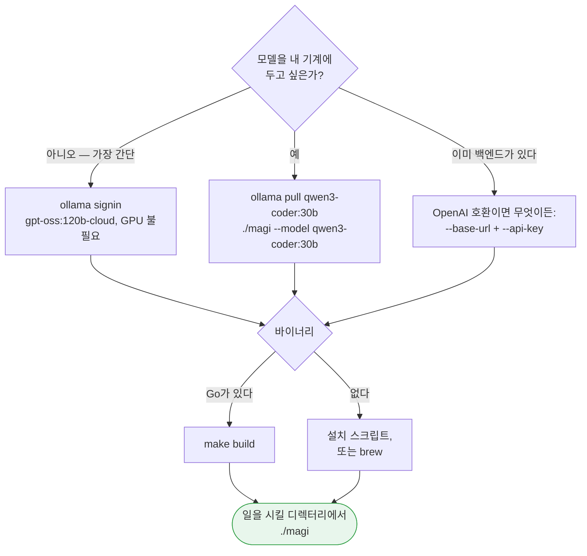
```mermaid
flowchart TD
    Q{"모델을 내 기계에<br/>두고 싶은가?"}
    Q -->|"아니오 — 가장 간단"| C["ollama signin<br/>gpt-oss:120b-cloud, GPU 불필요"]
    Q -->|예| L["ollama pull qwen3-coder:30b<br/>./magi --model qwen3-coder:30b"]
    Q -->|"이미 백엔드가 있다"| O["OpenAI 호환이면 무엇이든:<br/>--base-url + --api-key"]
    C & L & O --> B{"바이너리"}
    B -->|"Go가 있다"| MK["make build"]
    B -->|"없다"| DL["설치 스크립트,<br/>또는 brew"]
    MK & DL --> R([일을 시킬 디렉터리에서<br/>./magi])

    style R fill:#e8f6ec,stroke:#2f9e44
```

**바이너리.** 빌드하거나, 미리 빌드된 것을 가져오면 됩니다:

```sh
make build                                       # → ./magi   (CGO_ENABLED=0, 버전 주입)
CGO_ENABLED=0 go build -o magi ./cmd/magi        # 같은 것을 손으로

curl -fsSL https://raw.githubusercontent.com/sayaya1090/magi/main/scripts/install.sh | bash
brew install sayaya1090/tap/magi
```

순수 Go에 CGo가 없어서 결과물은 정적 파일 하나입니다. 아무 데나 복사해 실행하면 되고, `PATH`에 두고
싶다면 두는 것 외에 설치 절차는 없습니다.

## 2. 실행

magi를 돌리는 방법은 셋이고, 서로 대안이 아니라 **같은 엔진을 다른 자리에서 보는 것**입니다. 무엇을
고를지는 누가 보고 있느냐로 갈립니다:

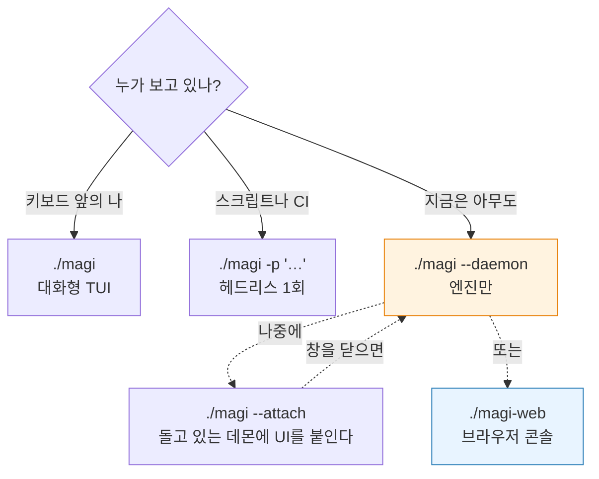
```mermaid
flowchart TD
    Q{누가 보고 있나?}
    Q -->|키보드 앞의 나| TUI["./magi<br/>대화형 TUI"]
    Q -->|스크립트나 CI| HL["./magi -p '…'<br/>헤드리스 1회"]
    Q -->|지금은 아무도| DMN["./magi --daemon<br/>엔진만"]
    DMN -.->|나중에| ATT["./magi --attach<br/>돌고 있는 데몬에 UI를 붙인다"]
    DMN -.->|또는| WEB["./magi-web<br/>브라우저 콘솔"]
    ATT -.->|창을 닫으면| DMN

    style DMN fill:#fff3e0,stroke:#e8820c
    style WEB fill:#e8f4ff,stroke:#2c7fb8
```

일찍 이해해 둘 값어치가 있는 것은 데몬입니다. 턴 하나가 20분 걸릴 수 있는데, 터미널을 닫아도 그 일이
살아남게 해주는 것이 데몬입니다.

### 대화형 TUI

기본값. 에이전트가 일하기를 바라는 디렉토리에서 실행합니다 — 그 디렉토리가 워크스페이스이고, 밖으로
나가지 않습니다.

```sh
./magi                 # 다크/라이트 자동 감지
./magi --theme light   # 테마 강제(auto|dark|light)
```

### 헤드리스 (스크립트/CI)

프롬프트 하나가 들어가고 전사가 나온 뒤 종료합니다. 스크립트와 CI가 쓰는 모드라 그 출력은 편의가 아니라
**계약**이다 — 아래의 종료 코드와 스트림 모양은 안정적으로 유지됩니다.

```sh
./magi -p "list the go files and summarize"
./magi -p "create hello.txt with: hi" --output json   # JSONL 이벤트
echo "explain main.go" | ./magi -p -                   # stdin
```

헤드리스 출력 계약 (안정 — 스크립트·CI·벤치 어댑터가 의존):

- **종료코드**: `0` = 턴 정상 종료 · `1` = 에이전트 수준 에러로 종료(`loop_guard`,
  `stall_guard`, `max_steps`, 프로바이더 실패) · `2` = magi 자체가 프롬프트를 실행하지
  못함(셋업/제출 실패).
- **stdout** = 트랜스크립트: 모델 텍스트(최종 답), 툴 호출/결과, council·컴팩션 노트.
  `--output json`이면 fact 이벤트를 줄 단위 JSONL로 출력. **UNVERIFIED로 착지한 턴**(카운슬이
  완료 선언을 끝내 수락하지 않음)은 트랜스크립트의 **마지막 줄**에 `⚠ landed UNVERIFIED — <사유>`
  로 다시 명시됩니다 — 기록이 뒷받침하지 않는 완료 주장이 마지막 말이 될 수 없게.
- **stderr** = 에러 전용. 에이전트 수준 에러는 grep 가능한 `error[<code>]: <message>` 형식.

스크립트가 실제로 읽는 것, 그리고 각 부분이 가는 곳:

```
  $ ./magi -p "멱등성 키 추가" --permission allow ; echo $?
  ┌─ stdout ─────────────────────────────────────────────┐   ┌─ stderr ────────────┐
  │ ✓ read internal/billing/post.go                       │   │ error[loop_guard]:  │
  │ ✓ edit internal/billing/post.go                       │   │   240 steps, no     │
  │ ⚖ council r1 — done · done · reject → continue        │   │   progress          │
  │ ⚖ council r2 — done · done · done   → accepted        │   └─────────────────────┘
  │ 핸들러와 테스트에 키를 엮었습니다.                      │      에러만. 그렙 가능한
  │ ⚠ landed UNVERIFIED — …   ← 그랬을 때만                │      형식으로
  └───────────────────────────────────────────────────────┘
     트랜스크립트. --output json이면 한 줄에 fact
     이벤트 하나씩, event.Event로 디코딩 가능
                            │
         exit  0  턴이 끝났다
               1  에이전트 수준 에러로 끝났다
               2  magi 자신이 프롬프트를 돌리지 못했다
```

UNVERIFIED 줄을 일부러 맨 뒤에 둡니다. 기록이 받쳐 주지 않는 완료 주장이 스크립트가 읽는 마지막 말이
되는 일은 없어야 하니까요.

**헤드리스 권한 거부는 가짜 사용자 결정이 아니라 정직합니다.** 헤드리스에서 `--permission auto`/`ask`는 프롬프트에 답할 사람이 없으므로 `bash`/`webfetch`가 사용 불가입니다. 에이전트가 받는 툴 결과는 이를 **범주적으로** 말합니다 — "이번 런에선 사용 불가(이 모드는 프롬프트 없이 승인 못 함), 재시도 말 것; 그 없이 진행하거나 왜 못 했는지 보고하라" — 인터랙티브 거부가 보낼 오해 소지 있는 `denied by user` 대신. 이 구분이 중요합니다: `denied by user`는 "사람이 *이 호출*에 아니라고 했다"로 읽혀 에이전트가 변형을 재시도하며 헛돈다; 범주적 메시지는 그 능력이 런 전체에서 그냥 꺼졌다고 알려 한 번에 적응하게 합니다. 그 툴이 필요하면 `--permission allow`(또는 인터랙티브 실행)를 쓰라. 기동 시 stderr에 이 불일치를 알리는 한 줄도 남습니다.

### 켜둔 채로 두고, 다시 돌아오기

턴 하나가 20분 걸릴 수 있습니다. 예전엔 터미널을 닫으면 그걸로 끝이었습니다.

```sh
./magi --daemon        # UI 없이 엔진만 실행 — 아무도 안 보고 있어도 계속 일한다
./magi --attach        # 이 디렉터리에서 돌고 있는 데몬에 터미널 UI를 붙인다
./magi --agents        # 이 머신의 모든 magi 데몬과 각자 무엇을 하고 있는지
./magi --stop          # 이 워크스페이스를 잡은 데몬을 멈춘다 (예약 작업도 함께 멈춘다)
```

데몬이 있어야 컴패니언이 **주소를 갖는다**. 상주하는 것만이 일을 받고, 일정을 지키고, 다른 머신에
보입니다. 나머지 표면 — `--join-cluster`·`--members`·`--relay`·`--mcp` — 는 §13.

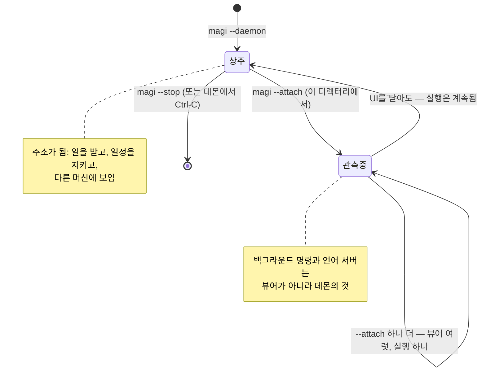
```mermaid
stateDiagram-v2
    [*] --> 상주: magi --daemon
    상주 --> 관측중: magi --attach (이 디렉터리에서)
    관측중 --> 상주: UI를 닫아도 — 실행은 계속됨
    관측중 --> 관측중: --attach 하나 더 — 뷰어 여럿, 실행 하나
    상주 --> [*]: magi --stop (또는 데몬에서 Ctrl-C)
    note right of 상주
        주소가 됨: 일을 받고, 일정을 지키고,
        다른 머신에 보임
    end note
    note right of 관측중
        백그라운드 명령과 언어 서버는
        뷰어가 아니라 데몬의 것
    end note
```

- **워크스페이스당 데몬 하나.** 소켓 이름은 워크스페이스의 실제 경로에서 나옵니다
  (`<config>/daemon-<dir>-<hash>.sock`, 심링크 해소). 그래서 `--attach`는 그 디렉터리의 데몬만
  찾습니다. 한 워크스페이스를 데몬 둘이 잡을 수는 없습니다 — 두 번째가 락에서 지고, 누가 갖고 있는지
  말해줍니다.
- **떼는 것은 멈추는 것이 아닙니다.** 붙어 있던 UI를 닫아도 실행은 계속되고, 그 백그라운드 명령과
  language server도 살아 있습니다 — 그건 시작한 프로세스의 몫입니다. 멈추는 건 데몬 자신의 Ctrl-C다:
  취소하고, 실행이 풀리길 기다린 뒤, 소켓을 내려놓습니다.
- **뷰어 여럿, 실행 하나.** `--attach`를 여러 개 붙여 같은 데몬을 볼 수 있습니다.
- `--agents`는 데몬당 한 줄을 찍습니다: 상태, 무엇을 하는 중인지, 얼마나 놀았는지, 무언가 답을
  기다리는 중인지. 소켓들을 짧은 데드라인으로 병렬로 두드리므로, 먹통 데몬 하나가 목록 전체를
  잡아먹지 않습니다.
- **`--stop`은 프로세스 id를 찾지 않고 상주 데몬을 끝내는 방법입니다.** 그 데몬의 워크스페이스
  디렉터리에서 실행합니다: 그 데몬 하나에게 종료를 요청해 실행을 취소하고, 풀리길 기다린 뒤 소켓을
  내려놓으며, **그 예약 작업(스케줄)도 함께 멈춘다** — 멈춘 컴패니언이 밤마다 도는 잡을 계속 쏘면
  안 되니까(§14). 한 워크스페이스 감독을 마쳤을 때, 또는 거기서 데몬을 새로 띄우기 전에 씁니다. 언제나
  실행한 디렉터리의 데몬만 건드립니다.

### 환경 점검
```sh
./magi --doctor
```
`--doctor`는 magi가 필요로 하는 모든 것을 한 번에 진단하고 종료합니다 — 새 머신이 이상하면 먼저 돌려라. 각 항목에 `ok`/`warn`/`fail` 한 줄을 출력합니다:

- **LLM 엔드포인트** — `--base-url` 도달성과 설정된 `--model`이 거기 존재하는지(Ollama의 경우 클라우드 모델 로그인 여부).
- **선택 외부 도구** — `gopls`, `rg`(ripgrep): 있으면 편집 후 진단·검색이 날카로워지고, 없어도 우아하게 degrade(warn일 뿐 fail 아님).
- **샌드박스 백엔드** — 사용 가능한 명령 격리(macOS `sandbox-exec`, Linux `bwrap` 등)와 bash가 격리 실행되는지.
- **Config** — **council 멤버 `provider`**가 정의된 `[llm.profiles.*]`를 가리키는지; 미정의면 warn(기본 백엔드로 폴백).
- **플러그인** — 각 플러그인(내장 + 플러그인 디렉터리별)이 실제 로드되는지와 로드된 이름 목록; 로드 실패한 디렉터리는 사유와 함께 warn. 로드된 플러그인이 플러그인 API로 등록한 자체 doctor 프로브도 여기서 실행·보고됩니다.

종료코드는 **하드 실패**(예: LLM 엔드포인트 도달 불가) 때만 0이 아니며, 경고는 advisory로 종료코드에 영향 없음.

### 버전 / 자동 업데이트
```sh
./magi --version
./magi --update            # 바이너리 + 관리형 플러그인 모두 업데이트 후 종료
./magi --update-core       # 바이너리만 업데이트(체크섬 검증)
./magi --update-plugins    # 관리형(git) 플러그인만 업데이트
./magi --plugin-install <git-url> [--plugin-pin <ref>]   # 플러그인을 사용자 플러그인 디렉터리로 clone
```

**관리형 플러그인** = git 체크아웃인 플러그인(`--plugin-install`로 설치했거나 직접 clone한 것).
`--update-plugins`는 각 플러그인에 fast-forward pull을 실행하며, 로컬 커밋/변경이 있어 ff 불가하거나
git remote가 없는 플러그인은 보고 후 **건너뜀 — 강제로 덮지 않음**. 직접 배치한 비-git 플러그인은
손대지 않음. 플러그인은 핫리로드되므로 `--update-plugins` 후 재시작 불필요.

**인터랙티브 기동 시 체크.** 터미널에서 TUI로 띄우면 최대 24시간에 한 번 새 릴리스를 확인함.
**패치** 릴리스는 한 줄 배너만 띄우고(`… magi --update 실행`), **마이너/메이저** 릴리스는 필수로 간주해
짧은 취소 가능 대기 후 자동 설치하고 재시작을 안내함. 이 *기동 시* 체크는 **인터랙티브 TTY에서만** 발화 —
`-p`·파이프·CI·벤치마크에선 절대 안 됨. `--no-update-check`(또는 `MAGI_NO_UPDATE_CHECK=1`)로 끔.

**데몬 자동 업데이트.** 돌아가는 `magi --daemon`은 스스로 최신을 유지함: 6시간마다(데몬별로
시차를 둬 한 머신의 컴패니언들이 동시에 확인하지 않게) 새 릴리스를 확인하고, 있으면 내려받아
체크섬 검증 후 새 바이너리로 `--version` 프리플라이트를 돌려 — **실패하면 이전 빌드로 롤백** —
아무것도 돌지 않을 때(진행 중인 턴이 없고, 회의 발언을 쓰는 중도 아닐 때) 그 위로 재기동함.
재기동해도 하던 대화가 그대로 이어짐. 중요한 것들:

- config의 `[update] auto = false`는 그 컴패니언의 자동 업데이트만 끔 — 콘솔의 **최신으로
  업데이트** 버튼(수동)은 그대로 동작함. 토글이 관장하는 것은 자동 경로뿐. 그 버튼은 컴패니언 페이지의 **팩트 카드**에서 **빌드**와 한 칸에 있음(컴패니언을 열고 카드를
  펼치면 보임). 버전이 표시되고, 그 빌드가 함대의 **최신에 뒤질 때만** 그 아래 업데이트 버튼이
  뜹니다. 누르면 데몬의 응답이 버튼 자리에 표시됨. **같은 머신** 컴패니언에만 제공되고
  `configure` 권한이 필요함. 컴패니언 목록은 각 행에 그 컴패니언의
  빌드를 보여주고 최신에 뒤진 것을 표시하므로, 어느 컴패니언에 눌러야 하는지는 카드를 일일이
  열지 않아도 목록에서 보임.
- `--no-update-check` / `MAGI_NO_UPDATE_CHECK=1`로도 꺼짐(기동 시 체크와 함께).
- **소스 빌드는 절대 자동 업데이트되지 않음**: 맨 `go build`("dev")도, Makefile의 git-describe
  스탬프(`v0.22.2-13-g…`)도 거부함 — 직접 빌드한 바이너리가 사용자 모르게 교체되는 일은 없음.
  소스 설치를 릴리스로 옮기려면 여전히 `magi --update`를 명시적으로 실행하면 됨.
- 벤치마크에서는 절대 돌지 않음: 이 루프는 `--daemon` 경로에만 있고, 벤치는 헤드리스 원샷으로 실행되기 때문.

**웹 콘솔에서 컴패니언 업데이트하기.** 같은 머신 컴패니언의 정보 카드에 **빌드** 필드와
**최신으로 업데이트** 버튼이 표시됨(Configure 권한 필요; 공유 콘솔과 피어를 향한 요청은 거부 —
업데이트는 절대 머신 경계를 넘지 않음). 버튼은 데몬 자신의 `update`를 중계함: 다운로드 → 검증 →
롤백을 갖춘 커밋 → 재기동. 데몬이 답한 한 줄이 그대로 표시됨.

## 3. 설정

평생 바꾸는 것은 대개 셋뿐입니다. 모델, 권한 모드, 그리고 여러 대를 돌리기 시작하면 컴패니언의 이름과
역할. 이 절의 나머지는 정말로 필요해졌을 때 찾아볼 수 있도록 적어둔 것입니다.

첫 실행 전에 설정할 것은 없습니다. magi가 처음 뜰 때 주석이 달린 `config.toml`을 쓰고 그 뒤로는 덮어쓰지
않으므로, 디스크의 그 파일은 계속 당신 것입니다.

**설정이 어디서 오고, 누가 이기는가.** 이 순서로 읽는 네 겹입니다:


```mermaid
flowchart LR
    D[내장 기본값] --> C["config.toml<br/>전역 → 저장소의 .magi/"] --> E[환경변수] --> F[커맨드라인 플래그]
    F --> R([이번 실행이 쓰는 값])
    style R fill:#e8f6ec,stroke:#2f9e44
```

플래그가 환경변수를 이기고, 환경변수가 설정 파일을, 설정 파일이 기본값을 이깁니다. 저장소 자신의
`.magi/config.toml`은 전역 파일을 이기는데, 프로젝트별 컴패니언이 가능한 이유가 이것입니다 — 그 파일은
저장소와 함께 이동합니다.

그 파일들이 실제로 어디에 있고, 그 옆에 무엇이 같이 사는지:

```
  <config>/                                    ~/Library/Application Support/magi   (macOS)
  │                                            ~/.config/magi                       (Linux)
  ├── config.toml            전역 설정 — 모델, 카운슬, 프로파일, 크론
  ├── AGENTS.md              모든 워크스페이스에 적용되는 집 규칙
  ├── experience/            전역 메모리 계층 (§7)
  ├── teams/<이름>/          팀 계층 — 기계를 건너는 유일한 계층
  ├── plugins/               내가 설치한 플러그인        (항상 로드)
  ├── plugins-embedded/      바이너리에서 실체화         (빌드를 따라감)
  ├── daemon-<dir>-<hash>.sock           상주 워크스페이스마다 하나   ─┐  이 디렉터리가
  ├── daemon-<dir>-<hash>.sock.session   그 옆의 기록                 ─┤  곧 플릿
  ├── daemon-<dir>-<hash>.sock.lock      이 워크스페이스의 주인       ─┘  명단
  ├── fleet-key.pem · fleet-cert.pem     이 기계의 플릿 신원
  └── fleet-host                         다른 기계가 아는 이 기계의 이름

  <workspace>/.magi/                           저장소와 함께 이동
  ├── config.toml            프로젝트 설정. 전역 파일을 이김
  ├── AGENTS.md              이 저장소의 규칙
  ├── experience/            워크스페이스 메모리 계층
  └── plugins/               여기서 `magi --trust`를 한 뒤에만 로드 (§9)

  <data>/                                      ~/Library/Caches/magi, ~/.cache/magi
  └── 세션·트랜스크립트·콘솔 감사 로그 — MAGI_DATA_DIR로 지정
```

저 중 두 줄은 다른 절 하나만큼의 무게를 집니다. `.sock`/`.session` 짝이 플릿의 멤버십 기전 전부이고
(§13.2), `<workspace>/.magi/plugins/`는 사용자가 말하기 전까지 내용이 로드되지 않는 유일한
디렉터리입니다 (§9).

**파일 위치.** 전역 설정은 OS 설정 디렉토리에 있고(리눅스는 `~/.config/magi/config.toml`, macOS는
`~/Library/Application Support/magi/`), 워크스페이스별 파일은 코드 옆의 `.magi/config.toml`입니다.
세션·플러그인·공유 경험 저장소는 전역 설정 옆에 놓입니다.

플래그/환경변수 (우선순위: 플래그 > 환경변수 > 기본값):

| 플래그 | 환경변수 | 기본값 | 설명 |
|---|---|---|---|
| `--model` | `MAGI_MODEL` | `gpt-oss:120b-cloud` | 모델 id (Ollama 무료 클라우드; `ollama signin`) |
| `--base-url` | `MAGI_BASE_URL` | `http://localhost:11434/v1` | OpenAI 호환 base URL |
| `--permission` | `MAGI_PERMISSION` | TUI=`ask`/헤드리스=`allow` | `ask`\|`auto`\|`allow`\|`deny` |
| `--profile` | `MAGI_PROFILE` | (없음) | 가드레일 프리셋 `safe`\|`standard`\|`yolo` — 권한+샌드박스를 한 번에 설정(아래) |
| `--theme` | `MAGI_THEME` | `auto` | `auto`\|`dark`\|`light` |
| `--plugins` | `MAGI_PLUGINS` | (없음) | 추가 플러그인 디렉터리 |
| `--no-harness` | — | (꺼짐=하네스 켜짐) | 내장 하네스(포맷/진단/Stop 훅) 비활성화 |
| `--output` | — | `text` | `text`\|`json` (헤드리스) |
| `--time-budget` | `MAGI_TIME_BUDGET` | `0` (꺼짐) | 에이전트에게 가이드로 보여주는 소프트 벽시계 예산(예: `20m`). **권고일 뿐 하드 중단 아님**. §시간 예산 참고. 리더보드/비교 런에선 **끔** |
| `--workflow` | `MAGI_WORKFLOW` | (꺼짐) | 결정론적 localize→implement→verify→review 파이프라인으로 구동 |
| `--verify-cmd` | `MAGI_VERIFY_CMD` | (자동) | 워크플로 검증 명령; 비우면 자동 감지(go/cargo/npm/pytest 마커) |
| `--http-timeout` | `MAGI_HTTP_TIMEOUT` | `0` (무제한) | LLM 응답 헤더 최대 대기(예: `120s`) |
| `--no-cache` | `MAGI_NO_CACHE` | (꺼짐) | 프롬프트 `cache_control` 비활성화(기본 켜짐; 백엔드가 거부하면 자동 폴백) |
| `--list-models` | — | — | 백엔드의 사용 가능 모델 나열 후 종료 |
| `--doctor` | — | — | 환경 진단 후 종료(§환경 점검) |
| `--version` | — | — | 버전 출력 후 종료 |
| `--update` / `--update-core` / `--update-plugins` | — | — | 바이너리+플러그인 / 바이너리만 / 관리형 플러그인만 업데이트 후 종료 |
| `--plugin-install` / `--plugin-pin` | — | — | clone할 플러그인 git URL / 그에 대한 태그·브랜치·커밋(선택) |
| `--no-update-check` | `MAGI_NO_UPDATE_CHECK` | (꺼짐) | 기동 시 업데이트 체크와 데몬 자동 업데이트 루프를 함께 비활성화 |
| — | `MAGI_FIRST_TOKEN` | `300`(초) | 응답 **첫 토큰 전** 침묵 한도 — 큰 프롬프트의 prefill 여유(느린 로컬 백엔드); `0` = 별도 한도 없음(토큰-간 한도가 처음부터 적용). 카운슬 멤버 데드라인에도 이 값이 더해짐(3분+이 값) |
| — | `MAGI_STREAM_STALL` | `120`(초) | **토큰 사이** 침묵 한도(생성 중 정지는 부분 출력 유지하고 중단); `0`=비활성. 스트림 가드 안전망은 두 한도 중 큰 쪽의 2배 |
| — | `MAGI_SPIN_WALL` | `600`(초) | 툴콜 없이 계속 스트리밍하는 응답 하나의 **벽시계 한도**(첫 출력부터 잼); 넘으면 추론-전용 스핀으로 취소하고 행동하라는 넛지를 넣습니다. 바이트-캡 쌍둥이(400KB, `MAGI_SPIN_CAP`)는 빠른 사색가를, 이것은 느린 사색가를 잡습니다 — thinking 모드 모델이 16.6KB를 찔끔거리며 한 호출로 80분을 쥔 것이 실측됐고, 다른 어떤 한도에도 안 걸렸습니다. `0`=비활성 |
| `--api-key` | `MAGI_API_KEY` | (없음) | 백엔드 키 (config `api_key`도 가능, `${ENV}` 확장; `OPENAI_API_KEY`로 폴백). CLI 값은 프로세스 목록에 노출되니 env/config가 더 안전. Ollama 불필요 |
| `embed_model` | `MAGI_EMBED_MODEL` | (없음) | 텍스트를 벡터로 바꾸는 모델. 없으면 회상이 문자열 수준에 머뭅니다 — `recall_memory`와 공유 두뇌의 의미 검색 절반이 나빠지는 게 아니라 아예 없습니다 |
| — | `MAGI_EMBED_BASE_URL` | (챗 base URL) | **임베딩** 모델(`embed_model`)이 챗 모델과 다른 백엔드에 있을 때의 엔드포인트 — `recall_memory`/공유 두뇌의 의미 검색 절반 |
| — | `MAGI_EMBED_API_KEY` | (없음) | 그 임베딩 엔드포인트의 키 |
| — | `MAGI_DEDUP_COSINE` | `0.93` | 새 메모리(또는 스킬)가 **이미 가진 것**으로 판정돼 기록되지 않으려면 얼마나 닮아야 하는가. 의도적으로 높다: 오병합은 사실을 영구히·조용히 잃고, 오분리는 사람 눈에 보이는 근접중복만 남긴다. `0`이면 의미 중복검사를 끄고 정체성을 문자열로 남긴다 — `embed_model`이 없을 때와 같다 |
| `[sampling] reasoning_effort` | `MAGI_REASONING_EFFORT` | (백엔드 기본) | reasoning 모델용 `reasoning_effort`로 백엔드에 전달 — 예: `none`으로 thinking 비활성, 또는 `low`\|`medium`\|`high`; 비우면 필드 생략 |
| — | `MAGI_TEMPERATURE` | (설정 `[sampling]`, 없으면 모델 기본) | 모든 요청에 실리는 샘플링 temperature; `[sampling] temperature`보다 우선 |
| — | `MAGI_TOP_P` | (설정 `[sampling]`, 없으면 모델 기본) | nucleus 샘플링 컷오프; `[sampling] top_p`보다 우선 |
| — | `MAGI_TOP_K` | (설정 `[sampling]`, 없으면 모델 기본) | top-k 컷오프 — OpenAI 비표준 확장이라 설정했을 때만 전송되고, 구현한 백엔드에서만 반영된다(Ollama `/v1`은 무시) |
| — | `MAGI_RESEND_REASONING` | (켜짐) | 어시스턴트 메시지 자신의 reasoning을 와이어(`reasoning` 필드)로 되돌려 보냅니다 — **열린 턴 안에서만**. 하모니 계열 모델(gpt-oss)은 툴 연속 중 자기 analysis 채널을 다시 볼 것을 기대한다(Ollama가 렌더링; 모르는 백엔드는 필드 무시). `0`이면 끔 |
| — | `MAGI_EMOJI_WIDTH` | (자동 프로브) | 이모지 셀 폭을 강제: `narrow`\|`1`(1칸) 또는 `wide`\|`2`(2칸). 미지정 시 기동 프로브가 실측 |
| — | `MAGI_WIDTH_PROBE` | (켜짐) | `0`이면 기동 시 터미널 폭 프로브(ambiguous·데코·이모지)를 건너뜀 = 무보정(라이브러리 기본폭 사용) |
| — | `MAGI_AMBIGUOUS_WIDTH` | `auto` | `wide`\|`narrow`\|`auto` — 동아시아 ambiguous 문자 셀 폭 강제(아래 참고) |
| — | `MAGI_MOUSE_COMPAT` | (자동) | 마우스 좌표를 글자 단위로 보고하는 터미널 보정 — JetBrains/Apple Terminal 자동 감지; `chars`=강제, `off`=해제 (§마우스 참고) |
| — | `MAGI_MOUSE_DEBUG` | (꺼짐) | `1`이면 클릭마다 좌표→글자 매핑을 토스트로 표시(드래그 위치 진단용) |

권한 모드: `ask`=매번 확인 · `auto`=**편집은 자동 승인, 명령(bash)/네트워크만 확인** · `allow`=전부 자동 · `deny`=차단. TUI에서 `Shift+Tab`(또는 `/permission`)으로 순환.

**데몬에서는 모드가 프롬프트의 대기 시간까지 정합니다.** `--permission ask`나 `auto`로 띄운 상주
컴패니언은 붙는 UI에 프롬프트를 보내고(§13), 아무도 안 붙었을 때가 갈립니다:

- **`ask`는 기다립니다.** 무기한. 묻겠다고 골라놓고 타이머가 대신 답하는 것이야말로 이 모드가 막으려는
  것이라, 컴패니언은 누가 답할 때까지 플릿의 `waiting` 상태로 앉아 있습니다. 콘솔에 배지가 붙고 폰으로
  푸시됩니다.
- **`auto`는 3분 뒤 포기**하고 정책으로 해소하며, 그 결정이 누군가의 것이 아니라 기본값이었다는 사실을
  트랜스크립트에 남깁니다. 여기서 남는 프롬프트는 잔여물입니다 — 편집은 이미 승인됐고 남은 건 명령과
  네트워크라, "나 없이 계속해"가 방어 가능하고 몇 시간 멈춰 있는 건 아닙니다.
- **`allow`**는 스스로는 묻지 않습니다. 데몬의 기본값인 이유가 그것입니다: 아무도 안 보는 동안 도는 일 —
  일정(§14) 포함 — 이 거기 없는 사람 때문에 멈추면 안 됩니다. 다만 가드레일이 그 위로 프롬프트를 강제할
  수는 있고(위험한 명령, 외부 통신), 그건 `auto`와 같이 3분으로 묶입니다 — 그 프롬프트는 모드가 아니라
  정책 때문에 존재하기 때문입니다.

터미널은 어느 모드에서든 기다립니다: 사람이 앞에 있고, 그가 읽는 동안 만료되는 프롬프트는 그의 손에서
빼앗은 결정입니다.

두 축은 서로 독립이고, 그렇게 보는 편이 이해가 빠릅니다. 승인은 **누가 예라고 하는가**를, 샌드박스는
**그 예가 어디까지 닿는가**를 정합니다. 프리셋은 이 격자의 이름 붙은 모서리입니다.

|  | `read-only` 샌드박스 | `workspace-write` | `full` |
|---|---|---|---|
| **`ask`** — 매번 사람이 승인 | **safe** — 읽고 생각하되 아무것도 바꾸지 않음 | | |
| **`auto`** — 편집은 통과, 명령은 확인 | | **standard** (권장) | |
| **`allow`** — 스스로 묻지 않음 | | 제한된 트리 안의 데몬 | **yolo** |
| **`deny`** — 보호 대상 툴 전부 차단 | 읽고 답하기만 하는 실행 | | |

빈 칸도 불법은 아니고 그저 드물 뿐입니다. `ask`+`full`은 제한 없는 실행의 매 걸음을 사람이 승인하는
조합인데, 저장소 밖을 처음 만지게 할 때 원하는 것이 정확히 이것입니다.

가드레일 posture(`--profile`/`MAGI_PROFILE`)는 두 축(**권한 승인** × **OS 샌드박스**)을 한 번에 잡는 프리셋입니다: `safe`=`ask`+`read-only`, `standard`(권장)=`auto`+`workspace-write`(편집 자동승인·명령/네트워크 확인·쓰기는 워크스페이스로 제한), `yolo`=`allow`+`full`. `--permission`/`sandbox`를 따로 주면 프리셋보다 우선합니다. profile 미지정 시 샌드박스는 opt-in(무제한)으로 남고 권한만 기본 적용됩니다 — 기존 사용자의 네트워크/트리 밖 쓰기를 조용히 끊지 않기 위함. 샌드박스 축(`sandbox = "read-only"|"workspace-write"|"full"`)은 `config.toml`에서 직접 지정할 수도 있습니다.

**세밀 규칙(`config.toml`).** 모드 외에 세 리스트 키로 정책을 좁힙니다: `allow`/`deny`는 툴 호출에 대한 글롭 규칙(예: `Bash(git push:*)`는 그 명령 자동승인, `Read(**/.env)`는 시크릿 읽기 차단)으로 — `p` 권한 선택(§4)이 영속하는 것이 바로 이것 — `deny`가 `allow`보다 우선합니다. `allow_domains`는 **네트워크 egress를 호스트 허용목록으로 제한**한다(예: `["api.github.com"]`); 비우면 호스트 제한 없음. 강도는 둘로 정직하게 갈립니다: 허용목록 밖 호스트로의 `webfetch`와, 그 호스트를 **리터럴 URL**로 적은 bash 명령은 하드 거부되고, 그 밖의 bash egress 명령(맨 호스트명, 변수, 파일에서 읽은 호스트 — 문자열 스캔이 풀 수 없는 것들)은 **확인 프롬프트를 강제**합니다 — 헤드리스 `--permission allow`에선 그 프롬프트가 allow로 해소되는데, 그 자세가 전면 신뢰를 뜻하기 때문입니다. 셋 다 전역·프로젝트 config에서 덮어쓰지 않고 **누적(append)**되며, 플러그인의 `set_config_key`가 절대 건드릴 수 없는 고정 deny-list에 있다(EXTENDING §플러그인).

설정 파일 `<config>/config.toml` (macOS `~/Library/Application Support/magi`, Linux `~/.config/magi`):
```toml
model = "gpt-oss:120b-cloud"   # 기본: Ollama 무료 클라우드(ollama signin). 로컬은 "qwen3-coder:30b"
base_url = "http://localhost:11434/v1"
permission = "ask"
experience_dir = "/path/to/team/experience"   # 공유 두뇌(git repo면 팀 공유)
embed_model = "nomic-embed-text"   # 텍스트를 벡터로 바꾸는 모델. 두 가지를 삽니다: 검색의
                                   # 의미(semantic) 절반(recall_memory·공유 두뇌·매 턴 주입되는
                                   # 메모리), 그리고 지금 쓰려는 메모리/스킬이 이미 가진 것인지의
                                   # 판정 — 없으면 정체성이 문자열 일치라서 표현만 바꾼 재기록이
                                   # 사본을 하나 더 남긴다. 선택: 미설정이면 검색은 lexical,
                                   # 중복검사는 문자열 — 고장이 아니라 정상 구성이다.
                                   # 설치할 두 번째 모델이며 엔드포인트가 챗과 다를 때가 많다:
                                   # MAGI_EMBED_BASE_URL / MAGI_EMBED_API_KEY로 따로 가리킨다.

[limits]                   # 토큰 상한 — 폭주 생성에 대한 안전밸브. 모두 선택.
# max_output_tokens = 8192 # LLM에 보내는 요청당 출력 상한(0/미설정 = 제공자 기본). 요구가 아니라
                           # **천장**입니다: 모델이 아직 받을 수 있는 크기 아래로 낮춰 보내므로,
                           # 대화가 길어지면 상한이 줄지 요청이 커지지 않습니다. 그 전 실측: 윈도우
                           # 393,216에 입력 93,217, 상한 300,000 — 딱 1토큰 초과로 턴이 죽었습니다.
                           # 약한 모델이
                           # 장황할 때, 또는 턴당 비용을 묶고 싶을 때 설정한다.
# context_tokens   = 128000 # 컴팩션 크기 계산에 쓰는 모델 컨텍스트 창 예산을 덮어쓴다
                           # (`/context <model> <tokens>`와 같되 영속). magi의 창 추정이 틀릴 때 설정.
# compact_ratio    = 0.8   # 자동 컴팩션이 돌기 전 창을 채울 수 있는 비율(§7).
                           # 낮추면 더 일찍 컴팩션(여유 확보), 높이면 원본 히스토리를 더 오래 살려둔다.

[llm.profiles.fast]        # 이름붙인 백엔드 (엔드포인트/키/모델/헤더, ${ENV} 확장)
base_url = "https://fast.gateway/v1"
api_key  = "${FAST_KEY}"
model    = "gpt-oss:20b"
[llm.profiles.fast.headers]
X-CLIENT-API-KEY = "${FAST_CLIENT_KEY}"

[sampling]                 # 모든 요청에 함께 실리는 샘플링 값; 키를 빼면 프로바이더 기본값 유지
temperature = 0.2          # 여기서 "프로바이더 기본"은 사실 모델 기본이다: qwen3-coder-next는 Modelfile에
top_p       = 0.8          # temperature 1 / top_p 0.95 / top_k 40을 박아두며, 이 항목이 없으면 그 값으로 돈다
# top_k     = 20           # OpenAI 스키마에 없는 확장 필드 — 설정했을 때만 전송. 실측: Ollama /v1은 받아들이고
                           # 무시한다(네이티브 /api/chat은 반영), 즉 백엔드마다 다르다.
                           # 의도적 per-call 핀이 이보다 우선한다: 카운슬은 심의 재현성을 위해 멤버를
                           # temperature 0으로 폴하며, 여기에 값을 넣어도 그 핀은 풀리지 않는다.
                           # 환경변수 MAGI_TEMPERATURE / MAGI_TOP_P / MAGI_TOP_K가 우선(A/B 실행용).

[mcp.filesystem]           # MCP 서버 (stdio 또는 url=로 HTTP)
command = "npx"
args = ["-y", "@modelcontextprotocol/server-filesystem", "."]

[[hooks]]                  # 라이프사이클 훅 (아래 §하네스 참고)
event = "Stop"             # 턴 종료 직전
command = "go test ./... >/dev/null || echo 'tests failing' >&2"

[council]                  # 에이전트가 council 툴로 부르는 카운슬(기본 on).
enabled    = true          # false면 툴이 사라지고, 종료 선언도 함께 사라진다(§6)
rule       = "majority"    # unanimous | majority | quorum:2 | weighted:0.6 | veto:Balthasar
preset     = "full"        # "light" = 검증 위원 1인 (인터랙티브 지연 절감; member 명시가 우선)
# [[council.member]]       # 생략 시 MAGI 기본 3인 사용
# name = "Melchior"; lens = "correctness"  # lens: correctness|verification|completeness

[theme.dark]               # 컬러 테마 오버라이드 (모드별). 미지정 role은 NERV/MAGI 기본값 유지
primary = "#FF7A1A"        # role: primary·accent·muted·outline·error·success·
accent  = "#5CD8E6"        #       surface·primaryContainer·outlineVariant·warn
[theme.light]
primary = "#B45309"

[autocomplete]             # IDE류 보조: 타이핑을 멈추면 도는, 카운슬 없는 얇은 단발 모델 호출을 FAST 프로파일로.
                           # 각 필드는 선택. 프로파일 없는 표면은 메인 모델을 쓰지 않고 아무것도 표시하지 않는다.
# enabled          = true       # (기본 켜짐) 아래 세 보조 전체의 마스터 스위치
# code             = true       # (기본 켜짐) 인라인 코드 완성(웹 에디터의 on/off 스위치는 브라우저별; 이건 데몬측 게이트)
# composer         = true       # (기본 켜짐) 컴포저 제안(마찬가지)
# ambient          = true       # (기본 켜짐) 웹 에디터에 연 파일을 미저장 변경 그대로 에이전트 컨텍스트에 실어,
                           #                그 파일에 대한 질문을 디스크가 아닌 버퍼 기준으로 답한다.
# code_profile     = "fast"     # 웹 에디터 인라인 코드 완성용 [llm.profiles.*] (미설정 = 끔)
# composer_profile = "balanced" # 컴포저 다음-지시문 제안용 [llm.profiles.*], 웹+TUI (미설정 = 끔)
# cross_session    = true       # (기본 켜짐) 컴포저 제안이 이 워크스페이스 과거 세션에서 말버릇을 배움; 끄면 현재 대화만.

[templates]                # 초안 생성기(커밋 메시지·PR 본문)에 접어 넣는 집 규칙. 기존 프롬프트에 더해지고
                           # 충돌 시 우선한다. 비면 생성기는 원래대로.
# commit = "커밋을 계층으로: 문서 → 코어 → 바깥 변경. 이슈 번호 없음."
# pr     = "리뷰 체크리스트를 채우고, 리뷰어가 먼저 볼 것을 짚어라."

[update]                   # 데몬 자동 업데이트 (§버전/자동 업데이트 참고)
# auto = true              # (기본 on) 데몬이 스스로 새 릴리스를 받아 롤백 동반 검증 후 유휴 시
                           #                재기동. 끄면 수동 버튼만 동작. 프로젝트 config에서는
                           #                병합되지 않으며, 소스 빌드는 값과 무관하게 거부.
```

프로파일은 "magi 하나, 백엔드 여럿"을 특수한 경우가 아니라 평범한 일로 만듭니다. 프로파일은 이름 붙은
엔드포인트이고, 모델을 돌리는 것이면 무엇이든 거기를 가리킬 수 있습니다:

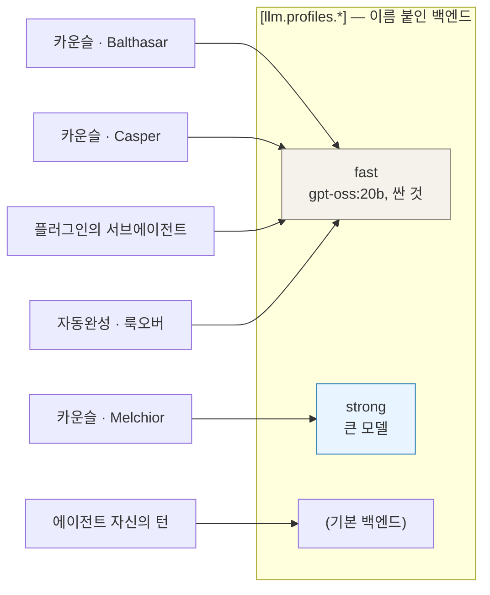
```mermaid
flowchart LR
    subgraph profiles ["[llm.profiles.*] — 이름 붙인 백엔드"]
        F["fast<br/>gpt-oss:20b, 싼 것"]
        S["strong<br/>큰 모델"]
        D["(기본 백엔드)"]
    end
    A["에이전트 자신의 턴"] --> D
    M1["카운슬 · Melchior"] --> S
    M2["카운슬 · Balthasar"] --> F
    M3["카운슬 · Casper"] --> F
    SUB["플러그인의 서브에이전트"] --> F
    AC["자동완성 · 룩오버"] --> F

    style S fill:#e8f4ff,stroke:#2c7fb8
    style F fill:#f5f2ec,stroke:#8a8178
```

`[[council.member]]`마다 `provider`와 `model`을 줄 수 있어서, 강한 독자 하나에 싼 것 둘로 패널을 짤 수
있습니다. 서브에이전트도 자기 것을 갖고, `/route`가 이 전부를 실시간으로 편집해 주석을 보존한 채
`config.toml`에 다시 씁니다.
> **자동완성 & 제안**(`[autocomplete]`): 저지연 보조 셋, 각각 라우팅된 프로파일 위 카운슬 없는 단발 모델 호출입니다 — 서브에이전트 턴이 아니라서 키 입력이 종료 투표를 기다리지 않습니다. **인라인 코드 완성**은 웹 파일 에디터 커서에 고스트 텍스트로 뜨고 Tab으로 받습니다. **컴포저 제안**은 지시문을 어떻게 끝낼지 웹 컴포저(흐린 힌트)·TUI 컴포저(박스 아래 한 줄, Tab)에 제시하며, 당신의 과거 프롬프트를 어휘 랭킹으로 배웁니다. **앰비언트 열린 파일**은 편집 중인 미저장 파일을 에이전트의 다음 턴 컨텍스트에 넣어 줍니다. 코드와 컴포저는 **프로파일을 분리**합니다(코드는 작고 빠른 모델, 컴포저는 조금 더 똑똑한 것); 프로파일 없는 표면은 메인 모델을 쓰지 않고 자기-비활성. 빈 완성은 **이유를 말합니다**(보조 꺼짐 · 라우팅된 프로파일 없음 · 커서 주변에 완성할 것 없음 · 모델이 내놓지 않음) — 그래서 에디터가 꺼진 표면과 고려하고 거절한 모델을 구별할 수 있고, 넷 중 호출을 쓴 것은 마지막 하나뿐입니다. 전부 웹 콘솔 **환경설정**에서 켜고 배정합니다(on/off 스위치는 브라우저별; 프로파일 배정·앰비언트·세션초월·`[templates]` 두 규칙 편집기는 config에 기록) — 이 파일에 영속됩니다.
> 위 `[llm.profiles.*]`/`model`은 **`/route` 에디터로도 편집**되며 — 웹 콘솔의 **환경설정 → 모델 프로파일**에서도: 이름 붙은 백엔드 목록·수정·제거, 추가(이름·Base URL·모델·선택적 키). 키는 **쓰기 전용**(콘솔은 설정 여부만 알려주고 값은 절대 돌려주지 않음), `${ENV_VAR}` 형식 권장. 이 파일에 저장되고 그 데몬의 다음 기동에 적용됩니다.
> **룩오버**(웹 에디터, 기본 off — 환경설정의 룩오버 스위치): 콘솔에서 파일을 편집하는 동안 컴패니언의 모델이 어깨너머로 읽고 잘못된 것만 짚어 줍니다. 최대 3건, 각각 **해당 줄에 앵커**되어 줄 끝의 앰버 노트로 그려지고 타이핑하면 사라집니다. 커서 주변 영역만 보내며(±60줄, 실제 줄번호 부착), 지적은 **당신의 언어**로 옵니다. 침묵 = 말할 게 없다는 뜻("좋아 보여요" 소음 없음). 타이핑이 멈출 때마다 작은 모델 호출 하나를 쓰므로 브라우저별 옵트인. **켜지 않고 한 번만 시킬 수도 있습니다**: 에디터 액션 바의 아이콘 버튼 둘 — 영역 훑어보기(⌘/Ctrl+Shift+Enter)와 커서 자리 코드 제안(⌘/Ctrl+Enter) — 이 스위치와 무관하게, 멈춤이 보냈을 바로 그 요청 하나를 보냅니다. 각 버튼은 답을 기다리는 동안 돌고, 답이 "없음"이면 그렇다고 말합니다.
> **카운슬(MAGI: Melchior·Balthasar·Casper · 기본 on)**: 에이전트가 `council` 툴로 부르는 3인입니다. `question`은 확신이 안 서는 것에 대한 읽기를 받아오고 아무것도 끝내지 않으며, `complete: true`는 **작업 종료를 선언**하고 답을 받습니다 — 수락(턴 종료)이거나, 무엇이 아직 안 됐는지와 함께 반려(§6). 그들이 읽는 것은 magi 자신의 기록입니다: 허가한 모든 명령과 그것이 진짜로 어떻게 끝났는지(실패가 exit 0 뒤에 숨은 파이프라인은 failed로 기록), 툴이 쓴 경로, **이번 턴 에이전트 자신의 편집**을 파일별 before→after diff로(write/edit 호출에서 재구성 — git 독립이라 사람이나 외부가 만든 변경이 에이전트 공으로 잡히지 않습니다), 그리고 선언 시엔 **워크스페이스 새로 읽기**: 작업 시작 이후 수정된 파일, 아직 살아있는 백그라운드 명령, 기록은 썼다는데 디스크에 없는 경로. 멤버는 자기 렌즈가 **구체적 결함**을 짚을 때만 반대하고, 만족하면 수락하며, 판단할 증거가 없으면 **기권**합니다. `rule`이 합의 방식. 각 `[[council.member]]`에 `provider`(= `[llm.profiles.*]` 백엔드)와 `model`을 주면 **멤버마다 다른 모델로 심의**(싼 것+강한 것 혼합)할 수 있고, 미지정이면 세션 모델을 씁니다. TUI에선 심의가 **헤더 칩**(`⚖ council rN: <member>`)과 트랜스크립트 라인(소집 · 멤버별 한 줄: 멤버 색 `●` + 이름 + 판정 아이콘 · 집계)으로 라이브 표시됩니다. **멤버 라인을 클릭하면 상세 모달**(렌즈·근거·피드백·확신도)이 열립니다. 멤버별 색은 테마로 변경 가능(`[theme.dark] melchior/balthasar/casper`). 워크플로우 모드에선 비활성(파이프라인이 자체 verify 게이트를 씀).
> 컬러 테마는 `[theme.dark]`/`[theme.light]`에서 role별로 외부 정의 가능(기본=NERV/MAGI). `--theme`로 모드(auto/dark/light) 선택.
> 첫 실행 시 주석 달린 기본 `config.toml`이 자동 생성된다(있으면 안 건드림).
> **잘못된 config는 절대 조용히 무시되지 않는다**: 전역 `config.toml` 파싱이 실패하면(예: 최상위 키 중복) magi는 파스 에러를 출력하고 시작을 거부합니다 — 모델·플러그인·기타 모든 설정을 떨굴 빈 config로 폴백하지 않습니다. 잘못된 **프로젝트** `.magi/config.toml`은 warn 후 건너뜀(유효한 전역 config는 여전히 적용). 알 수 없는 *키*(오타)는 warn일 뿐 시작을 막지 않습니다.

아래 가드들은 결정론적이고, 항상 켜져 있고, 값쌉니다 — 어느 것에도 모델 호출이 없습니다. 거의 전부가
*말만* 하고, 실행을 멈출 수 있는 것은 둘뿐입니다. 표가 지도이고, 뒤의 문단이 상세입니다:

| 가드 | 무엇을 잡나 | 무엇을 하나 |
|---|---|---|
| 자기회귀 검사 | 이번 턴에 이미 있던 상태로 파일을 되돌리는 편집 — 고쳤다가 슬쩍 되돌리기 | 그 툴 결과에 노트. 권고, 파일당 1회 |
| 터부 리스트 | 저술한 **모든** 파일을, 테스트가 이미 실패했던 그 상태로 되돌리는 편집 | 직전 실패를 다시 보여줌. 권고, 상태당 1회 |
| 비대화형 실행 | 프롬프트를 띄우려는 명령 — git 자격증명, ssh 호스트키, pager | 제어 터미널 없음 + stdin 닫음: 타임아웃까지 매달리는 대신 즉시 실패 |
| 마스킹된 실패 주석 | traceback·panic·`Ran 0 tests`·`\|\| true` 꼬리를 단 exit 0 | 그 0은 증거가 아니라고 한 줄. 주석만 |
| 빈-종료 넛지 | 작업은 했는데 답을 안 쓴 턴 | **1회** 넛지해 결과를 쓰게 함. 그래도 비면 정상 종료 |
| 루프 가드 | 진전 없는 같은 호출의 반복 | 거부하고 직전 결과 반환 → 교정 재-그라운딩 1회 → 지속되면 **실행 중단** |
| 스톨 강제중단 | 넛지 후에도 여러 스텝 진전 없음 | 우아하게 **실행 중단**(`stall_guard`). `bash` 쓰기는 진전이라 느린 빌드는 스톨이 아님 |

> **루프 & 실행 안전 가드(결정론적, 항상 켜짐)**: council 외에도 약한 모델이 혼자 빠지는 실패 모드를 잡는 값싼 결정론 가드가 있습니다. **자기회귀 검사** — 턴 내 각 파일 상태를 추적, 편집이 이번 턴에 이미 있던 상태로 되돌아가면("고쳤다가 슬쩍 되돌리는" 함정) 중립 노트를 붙여 재확인(권고, 차단 안 함, 파일당 1회). **터부(tabu) 리스트** — 더 정밀한 보완: 산출물을 *실행하는* 명령(테스트/프로그램 실행, 인스펙트 전용 빌트인 제외)이 실패하면 그때 편집된 파일 전체의 내용 서명을 "이미 해봤고 안 됨"으로 기록한다; 이후 편집이 모든 파일을 그 실패 상태로 되돌리면 직전 실패 사유와 함께 표시해 같은 실패 루프를 다시 돌리는 대신 다른 수정을 시도하게 한다(권고, 상태당 1회). **비대화형 명령 실행** — 모든 `bash`는 제어 터미널 없이 stdin 닫고 실행 → 프롬프트를 띄우려는 명령(git 자격증명·ssh 호스트키·apt·pager)이 타임아웃까지 멈추지 않고 **즉시 실패**. **루프 가드** — 진전 없는 동일 툴 호출이 소량 상한을 넘으면 거부(직전 결과 되돌려줌); 계속 헛돌면 먼저 **교정 재-그라운딩 1회**(원 과제 재독·접근 변경) — 이 넛지에는 **완료 탈출구**가 있습니다: 작업이 정말 끝났으면 **툴 호출 없이** 답만 하고 턴을 끝내라(그것이 검증을 트리거한다; 확인 명령 하나 더는 진전이 아닙니다), 그리고 **활동을 보여주려고 완성된 작업물을 삭제·재빌드하지 마라**. 그래도 지속되면 예산을 다 태우지 않고 우아하게 중단. **스톨 강제중단** — 교정 넛지 후에도 여러 스텝 진전이 없으면 계속 갈지 않고 우아하게 중단(`stall_guard`); `bash` 쓰기는 진전으로 인정해 느린 빌드를 스톨로 오인하지 않습니다. **빈-종료 넛지** — 답변 텍스트 **없이** 끝나는 턴은 사용자가 읽을 게 아무것도 없습니다. harmony 약한 모델이 analysis 채널만 뱉고 멈추거나("reasoning-only stop"), 툴을 쓴 뒤 마지막 스텝에서 침묵할 때 생기는데 — 후자는 council 게이트가 그 툴 작업을 보고 "done"으로 표결해 딜리버러블도 UNVERIFIED 플래그도 없이 끝날 수 있습니다. 이 턴은 툴 사용 여부와 무관하게 **1회** 넛지해 실제 결과를 쓰게 한다; 그래도 빈 재시도면 정상 종료하므로 루프가 되지 않습니다. **마스킹된 실패 주석** — **exit 0**인데 출력에 진짜 크래시 시그니처(Python traceback, JVM 스레드 예외, goroutine 덤프 동반 Go panic)가 있거나 명령이 순수 종료코드-무마 꼬리(`|| true`, `|| echo …`)로 끝나는 `bash` 결과에는 상태줄 바로 뒤에 한 줄 경고를 답니다: 그 exit 0은 성공의 증거가 아닙니다. 같은 주석기 계열이 **아무것도 발견하지 못한 테스트 러너**도 표시합니다 — `Ran 0 tests`/`no tests ran` 위의 exit 0은 스위트에 대해 아무것도 증명하지 못하고, 잘려나갈 수 없는 자리에서 그렇게 말해줍니다. 주석만 달 뿐 — ok/error 분류와 제어 흐름은 불변(`MAGI_EXITCODE_BODYSCAN=0`으로 비활성).

> **압박하 반-fabrication.** 이 가드들이 겨냥하는 실패 모드는, 줄어드는 스텝/시간 예산이나 막다른 길에 몰린 약한 모델이 막혔다고 인정하는 대신 그럴듯한 결과(파일 내용·테스트 결과·집계값)를 **지어내는** 것입니다. 시스템 프롬프트는 스톡/예산 압박하에서 결과나 증거를 지어내는 것을 명시적으로 금지하고 정직한 부분 상태를 보고하게 한다; 카운슬은 모델이 끝냈다는 주장이 아니라 **magi가 관측한 것과 워크스페이스가 실제로 담고 있는 것**(§6)으로 판정합니다 — 그래서 자신만만하지만 뒷받침 없는 "done"은 잡히고, 정직한 "Y 때문에 X를 못 했다"는 받아들여집니다. 정직한 실패는 올바른 결과이고, 지어낸 성공이 버그입니다.

### 시간 예산

**페이스를 정하는 천장은 없고, 폭주 백스톱만 있습니다.** 턴은 모델이 툴 호출을 멈출 때, 에이전트가 종료를 선언하고 카운슬이 수락할 때, 컨텍스트가 취소될 때, 또는 magi를 띄운 쪽이 그만 기다릴 때 끝납니다. magi 자신의 산수로 런을 세우던 가드들은 측정으로 걷어냈습니다 — 벤치 실측으로 벽시계에 도달한 런은 396건 중 76건 통과, 그 가드들이 멈춘 런은 28건 중 0건이었습니다. 남은 것은 어떤 생산적인 턴보다 훨씬 위에 놓인 240스텝 백스톱뿐입니다: 진짜로 폭주하는 루프가 데몬을 영원히 붙들지 못하게 하고, 그것을 소진한 턴은 백스톱을 사유로 적은 UNVERIFIED로 정직하게 착지하며 작업물은 그대로 섭니다. (**워크플로우 페이즈**는 종류가 다릅니다: 자기 예산을 파이프라인 모양의 일부로 선언합니다.)

매 스텝 에이전트에게 붙는 것은 **휘발성 라인**이다(캐시되는 시스템 프롬프트가 아니라 — 접두사 캐시 안정):

- **자기측정 경과** — 턴이 1분을 넘기면 *"You have been working for 11m of wall-clock time so far"*. 턴 시작부터 잰 magi 자신의 **스톱워치**이고 외부 정보는 하나도 안 들어 있으며, 느린 반복(컴파일 10회 재시도)을 알아채고 접근을 바꾸게 합니다.
- **`--time-budget`(기본 꺼짐)** — 사용자가 지정한 소프트 마감(예: `--time-budget 20m`). 예산과 남은 시간을 표시하고, 경과가 넘어가면 *"budget EXCEEDED — 가장 작은 정직한 결과를 즉시 내라"*로 바뀝니다. **권고이지 하드 정지 아님**이며, 결과를 apples-to-apples로 유지하려 리더보드/비교 런에선 끕니다.
- **런의 상태** — magi의 기록을 매 스텝 다시 렌더합니다: 허가한 명령과 그것이 어떻게 끝났는지, 쓴 경로, 아직 살아있는 백그라운드 명령. 화면 기반 에이전트가 결정마다 터미널을 다시 읽듯, magi가 실제로 갖고 있는 저장소에 대해 같은 갱신을 합니다 — 에이전트가 기억에만 기대 일하지 않도록.

### 하네스 (기본 켜짐)

설정 없이도 "이해→계획→구현→검증→요약" 절차가 자연히 적용됩니다. 두 층으로 구성:

1. **운영 가이드 프롬프트(항상)** — 다단계 작업이면 `todowrite`로 계획 후 하나씩, 편집 후 빌드/테스트로 검증, 깨진 상태로 끝내지 않고, 마지막에 변경 요약. 사용법을 몰라도 그냥 대화만 하면 적용됨.
2. **내장 훅(항상, `--no-harness`로 끔)** — 파일 편집 직후 자동 포맷(gofmt) + 언어 진단(gofmt -e / go vet / py_compile)을 돌려 에러를 모델에 되먹임 → 자가 수정.

**팀 공유**: 프로젝트 루트의 `.magi/config.toml`을 커밋하면 워크플로가 레포와 함께 이동합니다. 전역(`<config>/config.toml`)과 병합되며 `[[hooks]]`는 누적됩니다.

⚠ **워크스페이스를 신뢰하기 전에는 그 파일의 조심스러운 절반만 가져옵니다.** 클론과 함께 도착하는
파일이라, magi가 둘로 가릅니다:

| 어느 워크스페이스에서든 | **신뢰한** 곳에서만 |
|---|---|
| `deny`, 그리고 `permission`/`sandbox`/`profile`이 이 기계가 주는 것보다 **더** 조심하자고 할 때(`sandbox = "read-only"`는 채택, `permission = "allow"`는 거부하고 그렇다고 말함) | `[[hooks]]` — 툴 이벤트에 붙는 셸 명령 · `[mcp.*]` — 데몬이 띄우는 프로세스와 그것이 보내는 헤더 · `[cron.*]` — 무인 프롬프트 · `allow`, `allow_domains` · `[plugins.*]` · `base_url`, `experience_dir` · 그리고 `.magi/plugins/` |

훅 이벤트:
| event | 시점 | 종료코드 ≠ 0 효과 |
|---|---|---|
| `PreToolUse` | 툴 실행 전 | 툴 **차단**(stderr가 모델에 전달; 경로 보호 등) |
| `PostToolUse` | 파일 편집 후 | 출력을 피드백으로 전달 |
| `Stop` | 턴 종료 직전 | 종료 막고 계속 작업 강제(예: 테스트 통과 요구) |

훅 명령은 셸로 실행되며 `MAGI_TOOL`/`MAGI_PATH` 환경변수 + JSON stdin을 받습니다. `match`로 툴 이름 필터(`"*"`=전체).

⚠ **샌드박스가 하는 일과 하지 않는 일.** macOS(`sandbox-exec`)와 Linux(`bwrap`)에서 **쓰기**를
가둡니다. 윈도우에서는 아무것도 가두지 않고 제한 토큰만 적용됩니다. 그리고 **어느 플랫폼에서도 읽기는
가두지 않습니다** — 에이전트는 임의의 툴체인을 돌리므로 읽는 범위가 사실상 전부입니다. 세션 저장소는
샌드박스 안에서 읽기 전용으로 유지되어, 갇힌 명령이 자기가 한 일의 기록을 고쳐 쓸 수 없습니다. 가두는
태세를 요청했는데 그 도구가 없으면 magi는 기동 시에 그렇게 말하고, 일을 거부하는 대신 가두지 않은 채로
돕니다. **사람 사이의 격리는 OS 계정이 경계입니다.** 샌드박스는 폭발 반경에 대한 것이지 테넌시에 대한
것이 아닙니다.

설정은 세 계층으로, 좁은 것이 나중에 읽힙니다: 사람의 `<config>/config.toml`, 팀의
`<workspace>/.magi/config.toml`, 그리고 **이 컴패니언 자신의**
`<config>/companions/<workspace-key>/config.toml` — 여기서 준 모델·태세·서버·잡이 거기 앉습니다.
컴패니언 계층은 magi가 사용자의 선택을 **영속하는** 자리입니다(`/model`, 그리고 권한 모달의 "이
컴패니언은 계속 허용"). 그것은 한 머신의 한 워크스페이스에 대한 결정이라 클론을 타고 이동하지도, 다른
컴패니언에게 내려앉지도 않습니다. 그리고 워크스페이스 **바깥**에 있어서 에이전트 자신의 파일 툴이 닿지
못합니다.

## 4. TUI 사용법

아래쪽에 입력하고, 그 위로 대화가 흐르고, 헤더가 이 실행이 얼마를 쓰고 있는지 말해줍니다. 나머지가
읽히려면 먼저 알아야 할 것이 셋 있습니다:

- **엔터는 전송이고, 실행 중의 엔터는 조종입니다.** 턴이 끝나기를 기다렸다가 말할 필요가 없습니다. 도중에
  보낸 메시지는 뒤에 줄 서는 대신 **돌고 있는 턴 안으로** 들어갑니다.
- **Esc는 중단입니다.** 턴이 풀려나가고, 그때까지의 작업은 그대로 남으며, 잃는 것은 없습니다.
  중단은 **누른 순간 이미 줄 서 있던 것**도 지웁니다 — 멈춤은 "이 맥락을 리셋하라"이지 "잊고
  쌓아 둔 요청들을 돌려라"가 아니니까요 — 반면 중단 뒤에 입력한 것은 새 의도라서 실행됩니다.
  스스로 죽은 턴(타임아웃·셧다운)은 아무것도 지우지 않습니다: 큐는 누군가의 기다리는 요청이고,
  아무도 멈춤을 누르지 않았습니다.
- **위험한 툴은 먼저 묻습니다.** `write`·`edit`·`bash`는 `y`/`a`/`n`을 기다립니다 — 달리 말해두지 않았다면
  (`Shift+Tab`이 모드를 돌리고, `/permission`이 지정합니다).

<div align="center">

</div>

화면 읽는 법: 툴 호출 하나가 한 줄이고, 결과가 도착하면 앞머리 기호가 ⚙에서 ✓ 또는 ✗로 바뀝니다. 그래서
긴 턴도 스크롤로 사라지지 않고 한 화면에 머뭅니다. 카운슬의 표는 끝에 각자 한 줄로 도착하고, 그 뒤에
집계가 옵니다.

무엇이 어디에 있는지:

```
┌──────────────────────────────────────────────────────┬───────────────────┐
│ magi · qwen3-coder-next · 34% ⇅ 42% (120/300)        │ ╭───────────────╮ │  헤더: 모델,
│                                                       │ │ plan  2/5     │ │  컨텍스트 %,
│  나  fix the flaky test in internal/app               │ │ ✓ read failing│ │  스크롤 위치
│                                                       │ │ ▸ narrow it   │ │
│  ✓ read internal/app/loop_test.go                     │ │               │ │  포스트잇: 계획,
│  ✓ bash go test ./internal/app -run TestRewind        │ │ jobs 1        │ │  작업, 컨텍스트.
│  ⚙ edit internal/app/query.go                         │ │ ▸ go test …   │ │  왼쪽 모서리를
│                                                       │ ╰───────────────╯ │  끌어 폭 조절
│  ⚖ Melchior  done · Balthasar  done · Casper  reject  │                   │
│  ▣ turn: 14 steps · 3 file(s) · council r2 · 3m49s    │                   │  영수증: 끝난
├───────────────────────────────────────────────────────┴───────────────────┤  턴마다 한 줄
│ ▸ go test ./internal/app                          [백그라운드 작업 판]     │
│   ok  internal/app  21.7s                                                 │  살아 있는 작업·
├───────────────────────────────────────────────────────────────────────────┤  자식마다 한 판
│ > _                                                          ask · ⇧⇥     │
└───────────────────────────────────────────────────────────────────────────┘
     입력창 — 턴이 도는 중에도 살아 있음            권한 모드 ─┘
```

### 슬래시 커맨드 (`/` 입력 시 자동완성 팔레트 — 접두사 필터, ↑/↓ 선택, Tab 완성)
| 커맨드 | 설명 |
|---|---|
| `/help` | 도움말 |
| `/route` (=`/model`=`/agents`) | **모델 & 라우팅 에디터** (한 화면): **(session)** 기본 모델, 에이전트별 모델/백엔드, **backends(프로파일) 추가·편집**. ↑/↓ 선택 · Enter 편집/열기 · 빈 값=기본값 리셋 · Esc 닫기. **세션 모델** 편집 시 **서제스트 박스**가 열립니다 — 설정된 프로파일 모델 + 게이트웨이 라이브 카탈로그(열 때 프리페치)를 중복 제거·타이핑 필터: **↑/↓ 순환 · Tab 채우기 · Enter로 선택 항목(또는 타이핑 값) 적용**. 게이트웨이 미도달 시 자유 텍스트로 폴백. 에이전트 편집 중 **←/→로 프로파일 선택**(또는 모델명 타이핑). `+ add profile`로 프로파일(엔드포인트/키/모델/헤더) 정의, 폼에서 Enter 필드편집·**Tab 저장**. **모든 편집값은 `config.toml`에 영구 저장**(주석 보존) |
| `/providers` | **지금 서빙 중인 LLM 백엔드 목록**, 각자의 카탈로그와 함께 — 게이트웨이 주소를 기록한 플러그인(프로바이더 로스터, EXTENDING §3.7.1), 그리고 **이 config 파일이 가리키는 백엔드인 `default`**(당신의 Ollama). `/providers <name> <model…>`은 그 백엔드를 가리키는 `[llm.profiles.<name>]`을 저장합니다 — 모델은 라인의 나머지 전부(공백 포함)인데, 모델명이 공백을 품을 수 있기 때문입니다. 웹 콘솔의 프로바이더 드롭다운도 같은 로스터를 읽으므로 두 픽커는 어긋날 수 없습니다 |
| `/tools` | 사용 가능 툴 |
| `/subagents` | **플러그인이 등록한 서브에이전트** — 하나씩 체크박스, 플러그인이 선언한 대로 그룹핑. 스페이스로 켜고 끄고(그룹 머리행은 멤버 전체), Enter로 그 서브에이전트가 쓸 모델 지정(비우면 오버라이드 해제), Esc로 닫기. magi는 자기 서브에이전트를 하나도 싣지 않으므로, 설치한 플러그인이 하나를 등록하기 전까지 목록은 비어 있습니다. 선택은 `config.toml`의 `[subagents.<이름>]`에 기록되어 재시작해도 유지됩니다 |
| `/cost` | 세션의 토큰 사용량과 비용 |
| `/sessions` | 이 디렉터리의 세션 목록 |
| `/resume [n]` | 세션 재개 (인자 없으면 목록, `/resume 2`로 전환) |
| `/rewind [n]` | 최근 n개 user 턴 롤백(기본 1) |
| `/image <path>` | 이미지 인라인 표시 |
| `/diff` | 워킹트리 git diff |
| `/loop` | **Loop map** — 턴·스텝·툴 활동·council 라운드를 구조로 투영(루프의 *모양* 가시화) |
| `/context` | **컨텍스트 창** 가시화 — 사용량/창크기·메시지 수·compaction 이력(토큰 before→after)·**사용 중인 모델별 윈도우**. 편집: `/context <tokens>`(세션 모델) 또는 `/context <model> <tokens>`(예: `/context qwen3-coder:30b 128k`; `unlimited`/`0`은 해제) |
| `/fork` | 현재 세션을 **분기**해 다른 시도 탐색(원본 보존). 분기로 전환됨 |
| `/replay` | 직전 턴을 **분기에서 다시 실행**(같은 입력 재현). `/loopdiff`로 비교 |
| `/loopdiff` | 현재 분기를 **fork 원본과 구조 비교**(턴·스텝·툴·council·토큰) |
| `/init` | 프로젝트 분석 후 AGENTS.md 작성 |
| `/ultra <task>` | **울트라 작업 모드** — 과제를 끝까지 파고 실제로 돌려서 검증 |
| `/permission` | 권한 모드 순환(ask→auto→allow→deny) |
| `/cron` | **이 워크스페이스의 예약 작업** — `[cron]` 잡(§14)을 나열하고, 각자가 다음에 언제 도는지 보고, `config.toml`을 손으로 고치지 않고 추가·편집·삭제합니다. 무인 작업(밤마다 테스트, 매시 동기화)을 걸거나, 이미 걸린 게 뭔지 확인할 때 씁니다 |
| `/compact` | 컨텍스트 요약·축소 |
| `/clear` | 화면 초기화 |
| `/quit` (=`/exit`) | 종료 |

### 단축키
| 키 | 동작 |
|---|---|
| Enter | 전송 (**작업 중이면 메시지를 진행 중 턴에 주입 = steering**) |
| ↑ / ↓ | 입력 히스토리 (이전 프롬프트 불러오기 — 세션 재개 시 이전 턴도 포함) |
| Tab | 입력 접두사를 히스토리에서 자동완성 (슬래시·잡 페인 포커스와 공유) |
| PgUp/PgDn · Ctrl+U/Ctrl+D · Shift+↑/↓ | 스크롤(페이지/반페이지/한 줄) |
| Tab | 잡 페인 포커스 순환(페인 있을 때) |
| Ctrl+O | 포커스된 잡 페인 줌인/줌아웃 |
| Esc | 줌 해제 → 포커스 해제 → 진행 중 작업 중단 |
| 마우스 휠 | 트랜스크립트 스크롤(드래그 중에도) |
| 마우스 드래그 | 텍스트 선택 → 떼면 클립보드 복사 |
| 마우스 클릭 | 잡 페인 포커스 |
| Ctrl+F | 트랜스크립트 검색 (입력하며 좁히기 · enter/↓ 다음 · ↑ 이전 · esc 닫기) |
| Ctrl+L | 화면 초기화 |
| Shift+Tab | 권한 모드 전환 |
| Ctrl+Q | 종료 (또는 `/quit`) |
| Ctrl+C | *아무 동작 안 함* — 터미널 드래그 선택 + 복사를 위해 일부러 비워둠 |
| 마우스 휠 | 스크롤 · 패널 클릭 → 포커스(다시 클릭 → 줌) |
| 권한 모달: y/a/p/n | 허용 / 항상(세션) / 프로젝트(`.magi/config.toml`에 allow 규칙 영속) / 거부 |

모달 자체, 그리고 각 키가 나중에 치르는 값:

```
  ┌─ magi가 실행하려는 것 ──────────────────────────────────────┐
  │  bash   curl -X POST https://api.example.com/v1/orders      │
  │         ↳ 바깥으로: api.example.com                          │
  ├─────────────────────────────────────────────────────────────┤
  │  y  이번만 허용          ← 아무것도 기억하지 않음             │
  │  a  이 세션 내내 허용    ← magi가 끝나면 잊음                 │
  │  p  프로젝트에 영속      ← .magi/config.toml에               │
  │                            bash(curl:*)를 적음 —             │
  │                            프로그램만, 절대 bash(**)가 아님   │
  │  n  거부                 ← 툴이 "거부됨"으로 답하고,          │
  │                            에이전트는 적응해야 함             │
  └─────────────────────────────────────────────────────────────┘
```

생각할 값이 있는 건 `p`입니다. 세션보다 오래 살고 저장소와 함께 이동하니까요. 그래서 일부러 좁혀
둡니다. 파이프나 리다이렉트로 시작하는 명령은 규칙을 걸 안정적인 프로그램이 없으므로, 과하게 부여하는
대신 세션 한정으로 남습니다.

타이핑 키는 입력창으로만 가고 스크롤은 위 전용 키로만 — 그래서 본문 타이핑(띄어쓰기 포함)이 화면을 스크롤하지 않습니다. 위로 스크롤해 읽는 중이면 스트리밍이 화면을 끌어내리지 않는다(바닥에 있을 때만 자동 추적). 트랜스크립트가 넘치면 **헤더 칩**이 스크롤 위치를 보여준다(`⇅ 42% (120/300)`, 위에 있는 동안 새 출력이 오면 `↓ new` — End로 복귀). 그리는 스크롤바는 제거됐다(칩이 대체 — 윈도우 ambiguous-width 정렬 버그 클래스가 함께 소멸).

작업한 턴이 끝나면 **영수증 한 줄**(`▣ turn: 14 steps · 3 file(s) · council r2 · 3m49s`)이 남아 스크롤 없이 턴 비용을 볼 수 있습니다. 에이전트가 진짜 선택지를 물어야 할 땐 **선택 모달**(`ask_user` 툴)이 뜹니다: ↑/↓ 또는 1-9로 고르고 enter, esc는 건너뛰기(모델에겐 "무응답 — 알아서 판단"으로 전달). 질문이 여러 개면 모달이 순서대로 하나씩 뜹니다.

**권한 영속(`p` = 프로젝트):** `p`를 고르면 `.magi/config.toml`에 allow 규칙을 써 재시작해도 유지됩니다. 규칙은 **툴이 허용하는 만큼 좁게** 스코프됩니다: 대부분 툴은 `tool(**)`로 영속되지만, `bash`는 승인한 **프로그램 이름**만 영속합니다 — `curl https://x`를 허용하면 `bash(**)`가 아니라 `bash(curl:*)`로 기록 — 그래서 한 번 허용이 이후 모든 명령을 몰래 사전승인하지 않습니다. 셸 메타문자(파이프·리다이렉트)로 시작하는 명령은 고정할 프로그램이 없어 과도승인 대신 세션 한정으로 남습니다. 허용된 프로그램이라도 파괴/egress 스캐너는 위험한 호출에 여전히 재확인합니다.

**Ambiguous-width 문자(주로 윈도우 관련):** 기동 시 magi가 터미널을 한 번 프로브해 셀-폭 측정을 자동으로 맞춘다(윈도우는 Console-API 커서 델타, 그 외는 커서 위치 질의). 프로브를 못 돌리거나(예: 리다이렉트된 stdio) 잘못 추정하면 `MAGI_AMBIGUOUS_WIDTH=wide`(또는 `narrow`)로 강제하고, `MAGI_WIDTH_PROBE=0`은 프로브를 끕니다. 표준 `RUNEWIDTH_EASTASIAN=1`도 존중됩니다.

### 마우스 / 텍스트 복사 (모드 없음)
휠 스크롤·드래그 선택·클릭 포커스가 **모드 전환 없이** 모두 됩니다 — 선택/복사를 앱이 직접 처리하기 때문입니다. **드래그하면 그 범위가 하이라이트되고(문자/셀 단위, 줄 부분 선택 가능), 떼는 순간 클립보드로 복사**된다(OS 클립보드 `pbcopy`/`wl-copy`/`xclip` + OSC52 둘 다 시도). 드래그 중 휠 스크롤도 된다(선택은 콘텐츠 위치에 고정되어 스크롤해도 유지). 선택 경계는 **글자(grapheme) 경계로 스냅**되므로 한글·이모지 같은 2칸 문자를 반쪽만 잡는 일이 없습니다.

**블록 통째 복사(⧉)**: 각 대화 블록(사용자/어시스턴트)의 라벨 줄 오른쪽에 ⧉ 칩이 있습니다 — 클릭하면 그 블록의 **원문 텍스트**(렌더 전 마크다운 그대로)가 클립보드로 복사됩니다.

**IDE 내장 터미널 호환**: JetBrains(IntelliJ 등) 내장 터미널과 Apple Terminal은 와이드 문자(한글 등)를 화면엔 2칸으로 그리면서 **마우스 좌표는 글자당 1칸으로 보고**하는 특성이 있어, 보정 없이는 드래그가 포인터보다 왼쪽에 잡힙니다. magi가 이 두 터미널을 자동 감지해 보정한다(`TERMINAL_EMULATOR`/`TERM_PROGRAM`). 다른 터미널에서 같은 증상이 보이면 `MAGI_MOUSE_COMPAT=chars`로 강제, 오탐이면 `off`로 해제할 수 있고, `MAGI_MOUSE_DEBUG=1`로 실행하면 클릭마다 좌표→글자 매핑이 토스트로 떠서 진단할 수 있습니다. 참고: JetBrains 내장 터미널은 **한글 IME 조합이 낱자모로 깨지는 자체 한계**가 있다(앱에서 보정 불가) — 한글 입력이 잦으면 외부 터미널(iTerm2 등) 사용을 권합니다.

### 트랜스크립트 렌더링
- **edit/write는 색칠된 diff**로 보입니다 — 구문 강조(파일 확장자로 언어 감지) + 줄번호 거터, 추가/삭제는 `+`/`-`로.
- **bash·read·grep·glob·list·webfetch·websearch 결과는 접힌 블록**으로 본문에 표시(read는 줄번호+구문 강조). 길면 `… +N more` 푸터가 붙고 **블록을 클릭하면 펼침**.
- **카운슬 거부 사유**는 한 줄 판정 아래에 줄바꿈되어 표시(전체 사유는 위원 클릭으로 상세 모달).
- **카운슬 판정 대기 표시**: 라운드가 열려 심의가 진행되는 동안 하단 상태줄이 스피너와 함께 무엇을 기다리는지 한 줄로 고정 표시합니다 — 플랜 감사면 `⚖ 플랜 감사 판정 대기 중…`, 심의/합의면 `⚖ 카운슬 심의 판정 대기 중…`. 침묵처럼 보이던 대기 구간이 진행 중임을 알려줍니다.
- **검수 전 보고서 접기**: "검수해줘"류 요청은 보고서 → council 리뷰 → 개정 보고서 순으로 흐르는데, 리뷰 라운드가 continue로 판정하면 **개정본이 실제로 도착하는 순간** 원래(검수 전) 보고서를 한 줄 스텁(`≡ (검수 전 보고서 — 접힘, 아래 최종본 참고)`)으로 접어 최종본만 남깁니다. 접기는 개정본 도착 시점으로 미뤄지므로 리뷰가 중단·오류로 끝나면 원본이 그대로 보존되고, 개정본이 원본과 사실상 동일하면 원본을 건드리지 않는다(깜빡였다 다시 뜨는 현상 방지).

### 상태 패널 (포스트잇)
계획(todos)·백그라운드 잡·컨텍스트가 있을 때 **우상단에 둥근 윤곽선 박스(포스트잇)**로 떠서 보인다(없으면 숨김). 트랜스크립트는 전체 폭을 쓰고 박스는 그 위에 겹쳐 그려지며(하단 정렬이라 보통 빈 공간에 뜸), **박스 왼쪽 모서리를 드래그하면 폭이 조절**됩니다. 잡 줄을 클릭하면 그 잡으로 줌인. 박스 테두리는 터미널이 실제로 그리는 셀 폭 기준으로 조립되므로, todo·잡 줄에 🚀 같은 이모지가 있어도(터미널이 1칸으로 그리든 2칸으로 그리든) 우변 `│`가 어긋나지 않습니다 — 기동 시 이모지 폭을 한 번 프로브해 보정하며, `MAGI_EMOJI_WIDTH`로 강제하거나 `MAGI_WIDTH_PROBE=0`으로 끌 수 있습니다.

### 테마
시작 시 터미널 배경색으로 다크/라이트를 감지하고, **실행 중 OS 테마를 바꾸면 몇 초 안에 따라 전환**된다(배경색을 주기적으로 재질의). `--theme`(또는 `MAGI_THEME`)로 `auto`/`dark`/`light` 강제.

### 작업 중 끼어들기 (steering)
작업(턴)이 도는 동안에도 입력은 살아 있습니다 — 계속 타이핑할 수 있고(한글 IME 포함 인라인 조합), Enter를 누르면 메시지가 **진행 중인 턴에 즉시 주입**됩니다. 메인 에이전트는 **다음 스텝**에서 그 메시지를 보고 반영합니다 — 큐에 쌓였다가 턴이 다 끝나야 나오는 게 아니라, 실행 중인 에이전트를 그 자리에서 조종(steer)하는 것. 메시지는 트랜스크립트에 바로 표시됩니다.
에이전트가 **긴 백그라운드 명령을 기다리는 것 말고 할 일이 없는 동안**에도, 보낸 메시지는 그 자리에서 처리됩니다 — 명령이 끝날 때까지 묵히지 않습니다. 잡담엔 짧게 답하고, steer는 진행 중 작업을 실제로 바꿉니다: "`docs/` 아래만 봐"는 방향을 전환하고, "그거 다음에 README도 써줘"는 추가 스텝을 접어 넣고, 모호한 steer는 먼저 짧게 되물어 구체화한 뒤 반영합니다. steer가 실제로 반영되면 트랜스크립트에 "Steer applied …" 감사 줄이 남아 방향 전환이 실행됐음을 확인할 수 있습니다 — 말로만 수긍하고 넘어가지 않습니다.
현재 작업이 끝나야 답할 수 있는 질의를 넣으면, 그 질의는 큐에 들어가 **입력한 자리에 그대로 보이다가**, 답변이 준비되면 **답변 바로 위로 재배열**되어 질의–답변이 한 쌍으로 붙는다(세션을 다시 열어도 중복 없이 짝이 유지됩니다).
작업 중 슬래시 커맨드: 읽기/UI 전용(`/help`·`/route`(=`/model`)·`/tools`·`/subagents`·`/sessions`·`/diff`·`/permission`·`/loop`·`/loopdiff`·`/context`)은 실행되고, 세션을 바꾸는 것(`/resume`·`/rewind`·`/fork`·`/replay`·`/clear`·`/init`·`/ultra`·`/compact`)은 작업 중 거부됩니다.

### 백그라운드 잡 라이브 뷰 (split-pane)

스트립에는 생산자가 둘입니다. **백그라운드 명령**(`bash background=true`)은 그냥 두면 "프로세스가 시작됐다"는 한 줄이 전부고 그 뒤로는 아무것도 없습니다 — 정작 에이전트는 `bash_output`으로 폴링하며 읽은 것에 따라 행동하는데. **스폰된 자식**(플러그인이 등록한 서브에이전트, `/subagents`)은 툴 호출 하나 안에서 몇 분씩 도는데 메인 화면이 따라가지 않는 세션에서 돕니다. 어느 쪽이든 살아있는 동안 메인 트랜스크립트 아래에 **라이브 패널**이 타일로 뜨고, 각각 **고유 색상**(M3 톤 팔레트)이 보더·헤더 배지에 적용됩니다.

자식의 패널은 **자기 트랜스크립트**를 보여줍니다 — 받은 프롬프트, 추론, 툴 호출마다의 인자와 결과, 마지막에 한 말 — 메인 트랜스크립트가 그리는 것과 같은 방식으로. 백그라운드 잡의 패널은 로그 꼬리를 보여줍니다.

- `Tab`(또는 패널 클릭)으로 포커스 이동 → 포커스된 패널에 그 색의 **포커스 링**.
- `Ctrl+O`(또는 포커스 패널 재클릭)로 **줌인** → 그 잡의 전체 출력. 줌 진입 시 맨 아래(최신)로 이동. 상단 breadcrumb 클릭(또는 `Esc`)으로 복귀.
- 페인은 **tail**을 보여주며 초당 몇 번 파일 끝에서 다시 읽습니다. **보는 것은 아무것도 소비하지 않는다**: 이 읽기는 `bash_output`이 쓰는 오프셋을 전혀 전진시키지 않으므로, 에이전트가 읽는 내용은 안 보고 있었을 때와 정확히 같습니다.
- **생명주기**: 도는 동안은 큰 타일, 잡이 종료되면 done으로 표시되고 페이드되어 스트립에서 패널 기록으로 넘어갑니다. 다음 메시지를 보내면 사라집니다.

`Esc`는 "지금 있는 자리에서 한 겹 물러나기"이고, 그 자리는 직전에 무엇을 했느냐로 정해집니다. 한 번에 한
겹씩 벗기므로, 턴을 끊는 그 키를 실수로 두 번 눌러도 아무것도 끊기지 않습니다:

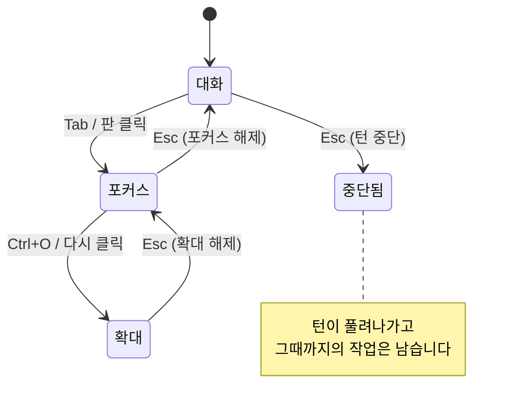
```mermaid
stateDiagram-v2
    [*] --> 대화
    대화 --> 포커스: Tab / 판 클릭
    포커스 --> 확대: Ctrl+O / 다시 클릭
    확대 --> 포커스: Esc (확대 해제)
    포커스 --> 대화: Esc (포커스 해제)
    대화 --> 중단됨: Esc (턴 중단)
    note right of 중단됨
        턴이 풀려나가고
        그때까지의 작업은 남습니다
    end note
```

### 우측 상태 패널
계획·진행 상황이 있을 때 화면 우측에 **상태 패널**이 뜬다(없으면 숨김). **좌측 경계를 마우스로 드래그**해 폭을 조절할 수 있다(기본 44칸). 섹션:
- **Plan** — 현재 todo 체크리스트 + 진행도(`done/total`): 완료 ✓, 진행 중 ◐, 대기 ☐, **취소 ✗**(턴이 중단/정지돼 못 끝낸 단계). 목록 자체는 모델의 것(`todowrite`)이고, magi는 그 주위에 결정론적인 손길 둘만 얹습니다 — 턴이 일을 시작할 때 첫 대기 단계를 ◐로 표시하고, 턴이 끝날 때 아직 열려 있는 단계를 정리합니다(진짜 완료면 ✓, 버려진 턴이면 ✗). 실시간 갱신.
- **Jobs** — 지금 도는 백그라운드 명령(색상·상태·경과). **항목 클릭 → 그 잡 출력 상세(zoom) 진입**(페인 클릭과 동일).
- **Context** — 컨텍스트 토큰 사용 막대.

### 붙여넣기 접기
여러 줄(또는 200자 초과) 붙여넣기는 **입력창에서만** `[#N pasted L lines]` 칩으로 접힌다(입력창이 좁으므로). 전송하면 **트랜스크립트(메인)에는 전체 내용이 그대로** 표시되고, 에이전트에도 전체가 전달됩니다. (↑ 히스토리 recall은 칩 형태로 불러와 입력창을 어지럽히지 않습니다.)

### `@` 파일 멘션
메시지에 `@경로/파일`을 넣으면 해당 파일 내용이 에이전트 컨텍스트에 첨부됩니다.

### 헤더 표시
`model <id> · ctx <%>` + **퍼미션 칩(색상 구분)**, 그리고 아직 도는 백그라운드 잡을 알리는 배지.
- 퍼미션 칩 색: `ask`=amber(안전) · `auto`=cyan(편집 자동) · `allow`=yellow(주의) · `deny`=red(차단).
- todo 체크리스트를 진행 중이면 헤더가 **활성 스텝**도 표시해, 지금 에이전트가 무엇을 하는지 상태 패널을 열지 않고도 보입니다.

### 세션 재개 (`/resume`)
`/resume`(인자 없이) → **인터랙티브 피커**: 각 세션의 시간 + 첫 메시지 요약을 보여주고 `↑/↓`로 선택, `Enter`로 재개, `Esc`로 취소. `/resume N`으로 바로 전환도 가능.
- 목록에는 **사용자 세션만** 나옵니다.

### TUI 동작 체크리스트 (스크린샷)
검증 중인 인터랙션 동작 모음 — 각 항목 아래에 스크린샷을 붙이기 좋게 정리.

1. **작업 중 입력 + 한글 IME** — 턴이 도는 동안에도 입력창에 인라인으로 타이핑/조합됨(커서가 입력 위치에).
2. **Steering(작업 중 끼어들기)** — 작업 중 Enter로 보낸 메시지가 진행 중 턴에 즉시 주입, 다음 스텝에서 반영.
3. **백그라운드 잡 split-pane** — 도는 백그라운드 명령마다 라이브 패널이 타일로, **잡마다 고유 색상**.
4. **포커스 / 줌** — `Tab`(또는 패널 클릭, 마우스 ON일 때)으로 포커스 이동(색상 포커스 링), `Ctrl+O`로 전체화면 상세(브레드크럼·구분선·좌측 바가 그 색), `Esc` 복귀.
5. **붙여넣기 접기** — 멀티라인 붙여넣기 → 입력창엔 `[#N pasted L lines]` 칩, 전송 시 메인엔 전체 내용.
6. **스크롤 위치 유지** — 바닥에 있으면 스트리밍/패널 추가·제거·**터미널 리사이즈** 후에도 바닥 유지, 위로 스크롤해 읽는 중이면 안 끌려감.
7. **입력 히스토리** — `↑/↓`로 이전 프롬프트 불러오기(세션 재개 시 이전 턴도 포함), `Tab`으로 접두사 자동완성.
8. **마우스/복사 (모드 없음)** — 휠 스크롤·드래그 선택+복사·클릭 포커스가 모드 전환 없이 모두 됨(앱이 선택을 직접 처리). 드래그 중 휠 스크롤도 됨.
9. **시작 시 화면 정리** — 실행 시 터미널을 한 번 clear하고 깨끗한 화면에서 시작.

## 5. 도구 (빌트인)

한 에이전트가 전부 봅니다. (예외는 **워크플로우 모드**(§2)뿐 — 페이즈가 자기 목표에 맞게 집합을 좁힐 수 있습니다.) `권한` 열은 그 툴이 걸리는 승인 축(`ask` = `ask`/`auto`에서 확인됨; `—` = 읽기전용, 절대 프롬프트 안 함).

호출은 무엇이든 그 전에 같은 길을 지나고, 각 관문은 거절만 할 수 있습니다:

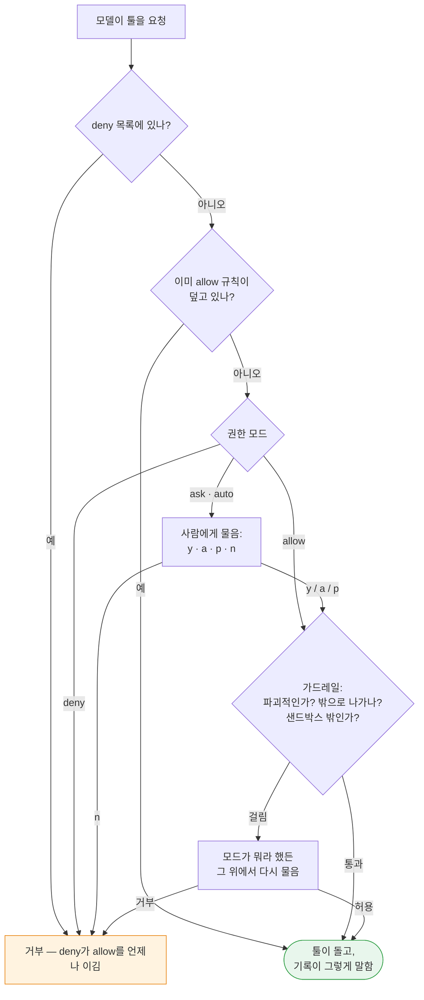
```mermaid
flowchart TD
    C["모델이 툴을 요청"] --> D{"deny 목록에 있나?"}
    D -->|예| NO["거부 — deny가 allow를 언제나 이김"]
    D -->|아니오| A{"이미 allow 규칙이<br/>덮고 있나?"}
    A -->|예| RUN
    A -->|아니오| M{"권한 모드"}
    M -->|"allow"| G
    M -->|"deny"| NO
    M -->|"ask · auto"| P["사람에게 물음:<br/>y · a · p · n"]
    P -->|"n"| NO
    P -->|"y / a / p"| G{"가드레일:<br/>파괴적인가? 밖으로 나가나?<br/>샌드박스 밖인가?"}
    G -->|"걸림"| P2["모드가 뭐라 했든<br/>그 위에서 다시 물음"]
    G -->|통과| RUN([툴이 돌고,<br/>기록이 그렇게 말함])
    P2 -->|허용| RUN
    P2 -->|거부| NO

    style RUN fill:#e8f6ec,stroke:#2f9e44
    style NO fill:#fff3e0,stroke:#e8820c
```

이 모양에서 둘이 따라 나옵니다. 가드레일은 `allow`에서도 프롬프트를 강제할 수 있습니다 — 누가 물어봐
달라고 해서가 아니라 정책 때문에 존재하기 때문입니다. 그리고 `p`(영속)는 그 툴이 허용하는 **가장 좁은**
규칙을 씁니다. `curl https://x`를 승인하면 `bash(curl:*)`가 적히지, `bash(**)`가 적히지 않습니다.

### 파일 & 검색
| 툴 | 설명 | 권한 |
|---|---|---|
| `read` | 파일 읽기(줄번호, offset/limit) | — |
| `write` | 파일 생성/덮어쓰기 | ask |
| `edit` | 정확 문자열 치환(고유 매칭) — 다중 매치면 각 위치의 줄 앵커를 제시하고, read의 줄 앵커로 특정 줄을 치환하는 `at`/`to` 모드 지원. 그 줄이 read가 건네준 내용을 더는 담고 있지 않으면 거부됩니다 — 파일이 밑에서 밀렸다는 뜻이니 다시 읽으라고 말합니다 | ask |
| `multiedit` | 한 파일에 여러 hunk를 원자적으로 적용(all-or-nothing) | ask |
| `grep` | 정규식 내용 검색 | — |
| `glob` | 파일명 글롭(`**` 지원) | — |
| `list` | 디렉터리 목록 | — |

### 실행
| 툴 | 설명 | 권한 |
|---|---|---|
| `bash` | 셸 실행(타임아웃·exit코드; 장시간 명령은 `background=true`). **제어 터미널 없이 stdin 닫고** 실행 → 프롬프트 시도 명령이 멈추지 않고 즉시 실패. `/bin/bash`가 있으면 그 아래서 돌아 magi가 `PIPESTATUS`를 대역 밖으로 읽습니다: 마지막 단계가 성공해서 exit 0으로 보고된 파이프라인도, 앞 단계가 죽었으면 FAILED로 기록됩니다 | ask |
| `bash_output` | 백그라운드 명령의 마지막 조회 이후 새 출력 가져오기 | — |
| `bash_input` | **백그라운드 명령의 stdin으로** 한 줄 전송 — REPL/라인디버거(`python3`·`psql`·`gdb`) 구동; `eof=true`로 stdin 닫음. TTY가 아니라 파이프(curses/비번 프롬프트 안 됨) | — |
| `bash_kill` | 백그라운드 명령 종료 | — |
| `wait_for` | 조건이 성립할 때까지 블록(파일 생성·포트 응답·백그라운드 잡 종료) — `sleep` + 재확인으로 공전하지 않도록 | ask |
| `port_owner` | 포트를 누가 듣고 있고 어느 프로세스가 소유하는지 — `ss`/`lsof`/`netstat`가 없을 수 있는 환경에서도 이식 가능 | ask |

파이프라인은 종료 코드가 거짓말하는 자리라, magi는 마지막 단계의 말을 믿지 않습니다:

```
    go build ./...    |    tee build.log    |    tail -1
         │                     │                    │
      exit 2                 exit 0              exit 0
         └───────────── PIPESTATUS ──────────────────┘
                              │
             셸이 보고하는 것:  0    ← 마지막 단계가 성공했으므로
             magi가 기록하는 것: 실패 (1단계가 2로 죽음)
```

`/bin/bash` 아래에서 out-of-band로 읽습니다. magi가 그 셸을 선호하는 이유입니다. 이것이 없으면
에이전트는 빌드되지 않은 빌드에 대해 초록색 0을 읽습니다 — 턴이 하지도 않은 일을 보고하게 되는 경로
중 하나로 실측된 것입니다.

### 웹
| 툴 | 설명 | 권한 |
|---|---|---|
| `webfetch` | URL → 텍스트 | ask |
| `websearch` | 웹 검색(DuckDuckGo, 또는 Brave/Tavily 키) | ask |

### 카운슬
| 툴 | 설명 | 권한 |
|---|---|---|
| `council` | `question`은 확신이 안 서는 것에 대한 세 멤버의 읽기를 받아오고 아무것도 끝내지 않습니다. `complete: true`는 **작업 종료를 선언**합니다 — 멤버들이 실제로 무엇이 돌았는지, 워크스페이스가 지금 무엇을 담고 있는지, 에이전트가 뭐라고 했는지를 읽고 수락하거나(턴 종료) 무엇이 아직 안 됐는지 돌려줍니다. §6 참고 | — |

### 자기제어
| 툴 | 설명 | 권한 |
|---|---|---|
| `todowrite` | 계획(체크리스트) 기록/갱신. 첫 대기 단계를 진행 중으로 표시하는 것과 턴이 끝날 때 남은 단계를 정리하는 것은 magi가 하고, 그 사이는 전부 이 호출 | — |
| `recall_context` | 앞선 컴팩션이 떨군 디테일을 토픽별(파일 경로가 잘 맞음)로 **원문 그대로** 재수화 | — |

### 메모리
| 툴 | 설명 | 권한 |
|---|---|---|
| `recall_memory` | 공유 experience 저장소에서 팀 메모리/스킬 — 그리고 **위키 페이지**(제목 일치는 페이지 페치; 편집자·티어·낡음 표기 동반) — 를 키워드로 당김 | — |
| `remember` | 공유 메모리에 교훈 기여, 또는 `page` 인자로 정설 **위키 페이지를 제자리 갱신**(기본 팀 전체; `summary`가 무엇이 왜 바뀌었는지) | — |
| `skill` | 명명 스킬 본문을 로드해 따름 | — |
| `search_sessions` | **이 워크스페이스의 지난 세션**을 키워드로 검색 — 다른 날의 대화, 매칭된 턴은 원문 그대로 복원 가능 | — |

회상 툴 셋은 일부러 서로 다른 질문입니다: `recall_context`는 **이 대화**에서 컴팩션이 떨군 디테일,
`recall_memory`는 **큐레이션된** 경험 저장소, `search_sessions`는 **다른 날의 원본 세션**.

### 다른 컴패니언
| 툴 | 설명 | 권한 |
|---|---|---|
| `companions` | 누가 돌고 있는지 — 이름·역할·팀·상태, 각자가 배운 교훈 최대 3개. `matching`으로 좁히면 **몇 개를 뺐는지 항상 말한다** | — |
| `companion_can` | 그중 하나에게 실제로 무엇을 할 수 있는지 묻습니다 — 추론이 아니라 **그 컴패니언이** 답합니다 | — |
| `hand_off` | 이 작업의 한 조각을 다른 컴패니언에게 넘기고 계속 일합니다 (§13.3) | — |
| `rate_handoff` | 받은 답을 써 본 뒤 그 값어치를 남깁니다 (§13.4) | — |

### 이 워크스페이스의 시계와 라벨
| 툴 | 설명 | 권한 |
|---|---|---|
| `schedule` | 이 워크스페이스가 타이머로 무인 수행하는 일을 보거나 바꾼다 (§14) | — |
| `label` | 지금 하는 일이 무엇에 관한 것인지 한두 단어로 — 보드가 그걸로 묶습니다 | — |

### 사용자 상호작용 (대화형 실행 전용)
| 툴 | 설명 | 권한 |
|---|---|---|
| `ask_user` | **사용자에게** 객관식 질문(선택 모달) | — |
| `route_interjection` | **작업 중 도착한 새 사용자 요청**을 어떻게 다룰지 결정 — `redirect`(지금 전환)·`append`(둘 다 충족)·`queue`(연기). 안전한 기본은 호출하지 않고 그 요청을 자체 턴으로 돌리는 것 | — |

둘 다 헤드리스/벤치 실행에선 **미등록**입니다: 답할 사람이 없어 발화 자체가 불가능한데, 못 쓰는 툴도 매 요청마다 모델에게 무게로 청구됩니다.

- 모든 파일 툴은 **워킹디렉터리 밖 접근 거부**(jail) — `../../etc/hosts` 읽기는 서빙이 아니라 거부.
- 읽기전용 툴은 한 스텝에 **병렬 실행**; 쓰기는 직렬화.
- 파일 수정 후 **진단 피드백**(Go: gofmt/`go vet`, Python: `py_compile`, 그 외는 각 언어서버) → 에이전트 자가수정(하네스, §3).

### 의도적으로 없는 것

`task` 툴도, 플래너도, 리뷰어도, 워커도 없고, **위임하는 것이 아무것도 없습니다** — 하나를 등록하는 플러그인을 직접 설치하고 `/subagents`에서 켜지 않는 한.

있는 것은 심(seam)입니다. 플러그인이 서브에이전트를 선언할 수 있고 사용자가 `/subagents`에서 켭니다. 그런 플러그인이 없으면 닿을 방법 자체가 없습니다. 이건 이 절이 예전에 하던 주장("서브에이전트는 전혀 없다")과 다른 말이고, 그 차이는 의도적입니다: 걷어낸 기계는 작업을 어떻게 쪼개고 무엇을 넘길지 **대신 판단**했고, 기록이 단죄한 것은 그 판단이지 능력이 아닙니다. §서브에이전트 참조.

집계 툴(`countlines`·`countmatches`·`groupby`·`tabulate`)도, `findcontext`도, `astgrep`도, LSP 내비게이션 툴도, `replan`도 없습니다. 기록된 모든 벤치 런을 세어보니 앞의 여섯은 **0회**, `astgrep`은 2회 호출됐고, 그동안 bash 호출의 59%는 파이프를 담고 있었습니다. 모델은 `wc -l`과 `grep`으로 손이 가지, 그걸 재구현한 툴로 가지 않습니다. 안 불리는 툴은 공짜가 아니라 **매 요청·매 스텝의 무게**다.

언어서버 자체는 그대로 돕니다. **편집 후 진단**(gofmt / `go vet` / `py_compile` / LSP)은 모델이 부르지 않아도 발화하며, 기록상 실제로 착지하는 쪽은 그 절반입니다.

## 6. 턴을 끝내는 법

턴은 조용해져서 끝나지 않습니다. 조용해지는 건 결정이 아닙니다 — 생각하다 만 턴과 정말로 끝난 턴이 예전엔 똑같이 끝났고, 둘 중 어느 쪽이냐고 물어본 적이 없었습니다.

그래서 종료는 행위입니다. 에이전트가 `council{complete: true}`를 호출하면, 멤버들이 **기록을 읽은 뒤에야** 턴이 닫힙니다:

- **magi가 관측한 것** — 허가한 모든 명령, 그것이 뭔가를 구동했는지 들여다보기만 했는지, 그리고 어떻게 끝났는지. 진짜 실패가 exit 0 뒤에 숨은 파이프라인은 clean이 아니라 failed로 기록됩니다.
- **지금 이 순간의 워크스페이스** — 기억이 아니라 선언 시점에 새로 읽습니다: 작업 시작 이후 수정된 파일(파일 많은 디렉터리는 개수로 접힘), 아직 살아있는 백그라운드 명령, 그리고 **기록은 썼다는데 디스크에 없는 경로**.
- **에이전트가 말한 것** — 자기 작업에 대한 진술을, 위 둘에 비추어.

수락하면 턴이 끝나고, 아니면 무엇이 아직 안 됐는지를 짚어 돌려보냅니다. 묻는 건 별개다 — `council{question}`은 읽기만 받아오고 아무것도 끝내지 않습니다.

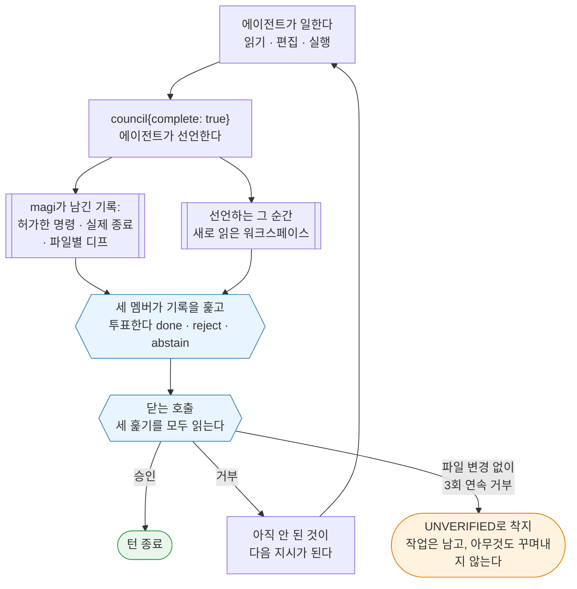
```mermaid
flowchart TD
    S[에이전트가 일한다<br/>읽기 · 편집 · 실행] --> D["council{complete: true}<br/>에이전트가 선언한다"]
    D --> REC[[magi가 남긴 기록:<br/>허가한 명령 · 실제 종료<br/>· 파일별 디프]]
    D --> NOW[[선언하는 그 순간<br/>새로 읽은 워크스페이스]]
    REC --> M{{세 멤버가 기록을 훑고<br/>투표한다 done · reject · abstain}}
    NOW --> M
    M --> CL{{닫는 호출<br/>세 훑기를 모두 읽는다}}
    CL -->|승인| E([턴 종료])
    CL -->|거부| FB[아직 안 된 것이<br/>다음 지시가 된다] --> S
    CL -->|파일 변경 없이<br/>3회 연속 거부| U([UNVERIFIED로 착지<br/>작업은 남고, 아무것도 꾸며내지 않는다])

    style E fill:#e8f6ec,stroke:#2f9e44
    style U fill:#fff3e0,stroke:#e8820c
    style M fill:#e8f4ff,stroke:#2c7fb8
    style CL fill:#e8f4ff,stroke:#2c7fb8
```

#### 판정보다 먼저, 훑기

멤버는 결론부터 말할 수 없습니다. 먼저 요구사항을 훑어 적습니다 — 과제가 요구한 것 하나에 한 줄씩,
**SATISFIED** 또는 **UNSATISFIED**를 붙이고, 툴이 돌려준 것에서 그대로 떼어 온 조각으로
결론짓습니다. 아무것도 그 줄을 결론짓지 못하면 `NO-EVIDENCE`라고 적습니다. 이 훑기는 멤버가 채우는
양식에서 판정보다 **앞**에 놓입니다. 그래야 이미 내려놓은 결론에서 읽기를 거꾸로 지어낼 수 없고,
`NO-EVIDENCE`가 멤버 마음대로 덮을 수 있는 빈칸이 아니라 하나의 답이 됩니다. 한 줄을 결론지을 수
있는 것은 magi가 기록한 결과이고, 에이전트가 스스로 한 말은 아무것도 결론짓지 못합니다.

#### 멤버마다 다른 경로

셋은 판정하는 렌즈가 다르고, **어디부터 보는지**가 다릅니다:

| 멤버 | 렌즈 | 먼저 훑는 것 |
|---|---|---|
| `correctness` | 글자 그대로의 요구 | 정확한 값·형식·이름, 그다음 작업이 딛고 선 전제, 그다음 보고된 수가 대상 자신이 인정하는 수인지 — 에이전트가 자기가 만든 다른 산출물에만 대어 본 값은 증거가 아니라 자기일관성입니다 |
| `verification` | 동작들 | 돌아야 하는 것 하나하나에 대해 그것이 실제로 돌아간 순간과 돌아온 출력 |
| `completeness` | 부분들 | 과제가 요구한 서로 다른 것 전부. 지나가듯 한 번 불린 것까지 |

경로는 **관할이 아니라 탐색 순서**입니다. 셋 다 여전히 과제 전체를 판정합니다. 이건 들리는 것보다
중요합니다. 과제를 멤버끼리 나눠 갖는다면, 한 멤버의 몫 안에 들어앉은 결함은 아무것도 모르는 done
둘에 continue 하나로 맞서게 되고 과반이 그대로 통과시킵니다. 경로를 넣은 이유는 그 반대편을
재봤기 때문입니다 — 렌즈 한 줄만 다르고 나머지 지시가 전부 같은 세 멤버는 21번 중 21번을 이견 없이
done으로 투표했습니다. 세 개의 의견이 아니라 한 의견의 표본 셋이었습니다.

#### 닫는 호출

집계는 세 개의 읽기를 더한 것이고, 더하기 전까지 셋을 다 읽은 사람은 없습니다. 그래서 표가 모이면
닫는 호출이 그 일을 합니다. 모든 멤버의 훑기와 판정을 한자리에서 받아, 그 자리에서만 보이는 것을
찾습니다 — 두 멤버가 서로 모순되는지, 어느 훑기도 덮지 않은 요구사항이 있는지, 그 자체로 틀린 값이
있는지. 이 호출의 결론은 **한 방향으로만** 묶여 있습니다. done을 continue로 바꿀 수는 있지만,
continue를 done으로 바꿀 수는 없습니다. 의견 하나를 더 붙여서 끝내게 만들 수 있는 게이트는 게이트가
아닙니다.

비용은 네 번이 아니라 한 번 더입니다. 멤버들이 같은 백엔드를 쓰면 패널 전체 — 훑기 셋과 판정 셋 —
가 한 번의 요청으로 도착하고, 닫는 호출이 두 번째입니다.

세 명, 세 개의 렌즈, 그리고 그것을 세는 다섯 가지 방법. 무엇을 고르든 모호한 결과는 같은 쪽으로
풀립니다:

| `rule` | 턴이 끝나는 조건 | 기권이 놓이는 자리 |
|---|---|---|
| `unanimous` | 투표한 모두가 done | 아예 세지 않으므로 남은 투표자들이 결정 |
| `majority` *(기본)* | done이 투표자의 **과반**(동수는 과반이 아님) | 표에서 빠짐. 1–1에 기권 하나면 *계속* |
| `quorum:2` | done이 k명 이상 | 돕지도 막지도 않음. 진짜 done k개가 여전히 필요 |
| `weighted:0.6` | **투표된** 가중치 중 done의 몫이 θ 이상 | 어느 쪽으로도 무게를 싣지 않음 |
| `veto:Balthasar` | 지목된 멤버가 반대하지 않았고, **그리고** 나머지가 과반 | 지목된 멤버의 기권은 반대가 아님 |

오류가 났거나, 시간이 초과했거나, 읽을 수 없는 답을 준 멤버는 게이트를 막는 대신 **기권**합니다. 그래서
불안정한 백엔드는 투표를 약하게 만들 뿐 루프를 얼리지 못합니다. 그리고 모호한 결과는 전부 *계속*으로
풀립니다. 동수도, 알 수 없는 규칙 이름도, `k`가 쓰레기값인 `quorum`도 전부 턴이 계속되는 쪽으로
실패합니다. 멈춘 턴이 내는 실패가 거짓 완료가 내는 실패보다 싸기 때문입니다.

**리젝트에는 상한이 있습니다.** 게이트는 거짓 "완료"를 막으려고 있는 것인데, 무제한이면 진짜 "할 수 없었다"까지 막아 버립니다. 실측으로, 런의 권한 모드가 불가능하게 만든 태스크의 정직한 선언이 외부 킬 때까지 18라운드 연속 거부됐습니다. **사이에 파일 변경이 없는 연속 거부 3회**(또는 턴당 총 8회)면 magi가 사유를 기록에 적고 턴을 **UNVERIFIED**로 착지시킵니다: 작업물은 그대로 서고, 에이전트는 정직한 최종 보고를 요청받으며, 카운슬이 수락한 척은 어디에도 없습니다. 실제 반복 작업은 영향받지 않습니다 — 직전 선언 이후 진짜 작업이 있었던 선언은 긴 줄을 받습니다. `MAGI_COUNCIL_REJECT_CAP=0`으로 무제한 루프 A/B 복원.

에이전트가 끝내 선언하지 않으면 magi가 상기시킨다 — **무진전 구간당** 최대 3회, 마지막 상기 이후 실제 파일 뮤테이션이 있었다면 그 상기가 **일함으로써** 답해진 증거이므로 다시 처음부터 셉니다 — 그다음엔 작업물을 있는 그대로 착지시키되 "완료"가 아니라 **선언 없이 끝남**으로 기록합니다. `MAGI_DECLARE_FINISH=0`이면 예전의 수동적 종료(모델이 툴 호출을 멈추면 끝)로 A/B 복귀.

`[council] enabled = false`면 툴 자체가 사라집니다. 선언할 상대가 없으니 요구도 성립하지 않고, 루프는 수동적으로 끝납니다.

### 에이전트는 하나다

magi는 한때 서브에이전트를 띄우고, 작업을 스텝으로 계획하고, 스텝마다 실행 가능한 체크를 저술하고, 카운슬이 그 체크가 충족됐다고 투표할 때까지 턴을 붙들었습니다. 전부 걷어냈고, 기본 상태에서는 여전히 에이전트가 정확히 하나입니다 — **체크하기 전에는 아무것도 스폰되지 않습니다.**

이유는 로그에 있습니다. 그 단계들은 **작업이 존재하기 전에** 무언가를 결정했고, 가장 비쌌던 결함은 정확히 한 종류였습니다 — magi가 실제로 벌어진 일의 기록보다 미리 내린 자기 판단을 믿은 것. 서버가 죽었을 때만 통과하는 포트 프로브, 생성기는 언더스코어를 쓰는데 하이픈을 요구하는 grep, 채점 식별자가 사라질 때까지 패러프레이즈된 브리프. 미리 작성된 체크는 작업에 대해 틀릴 수 있지만, magi가 허가한 것의 기록은 허가한 것에 대해 틀릴 수 없고, 불완전한 부분은 불완전하다고 말합니다.

남은 것은 루프, 툴, 기록, 그리고 에이전트가 원할 때 부르는 카운슬입니다. 오래 걸리는 일은 `bash background=true`로 보내 `bash_output`/`wait_for`로 지켜봅니다 — 자기 페인(§4)에 보이고, 착지하면 진짜 exit이 읽힙니다.

### 서브에이전트가 필요하면

플러그인이 등록한다(EXTENDING §3.9). magi는 심만 제공하고 정책은 두지 않습니다:

- **부르지 않으면 없습니다.** 서브에이전트는 `/subagents`에 뜨고 거기서 켭니다. 플러그인이 꺼진 채로 실을 수도 있습니다. 꺼진 서브에이전트는 모델에게 **광고되지 않으므로** 요청당 비용이 0입니다.
- **요약하지 않습니다.** 자식은 플러그인의 프롬프트와 툴 자신의 인자를 **원문 그대로** 받고, 거기에 AGENTS.md·실행 환경·작업 트리를 받습니다. 부모 대화의 큐레이션된 일부는 절대 받지 않습니다. 필터는 툴 인자이고, 그 선택은 전체 컨텍스트를 가진 쪽이 합니다 — 패러프레이즈된 브리프가 이 저장소에서 채점 식별자를 6/6으로 잃게 만든 그것이기 때문입니다.
- **묶여 있고, 재귀할 수 없습니다.** 자식에겐 스텝 수와 시계가 주어지고, 툴 호출 전체에도 누적 예산이 걸리며, 자식에겐 스폰할 수단 자체가 주어지지 않습니다.
- **보입니다.** 자기 페인에서 자기 트랜스크립트로 돈다(§4).
- **무엇을 했는지 읽고, 되돌릴 수 있습니다.** `magi.child_steps`는 자식이 부른 호출들을 실패한 것의 출력 원문과 함께 돌려주고, `magi.restore_child`는 파일 변경을 되돌리고 **못 되돌린 것을 이름으로 말합니다.** 둘 다 자동이 아닙니다.

#### 자식을 되돌리는 값이 비싼 이유, 그리고 컴패니언이 그에 대해 하는 일

앞의 두 항목은 하나의 비대칭에서 나옵니다. 플릿이 지금 모양인 이유가 그것이라 이름을 붙여 둘 값이
있습니다.

루프에는 되돌리기가 두 종류 있는데, 서로 같은 종류의 물건이 아닙니다:

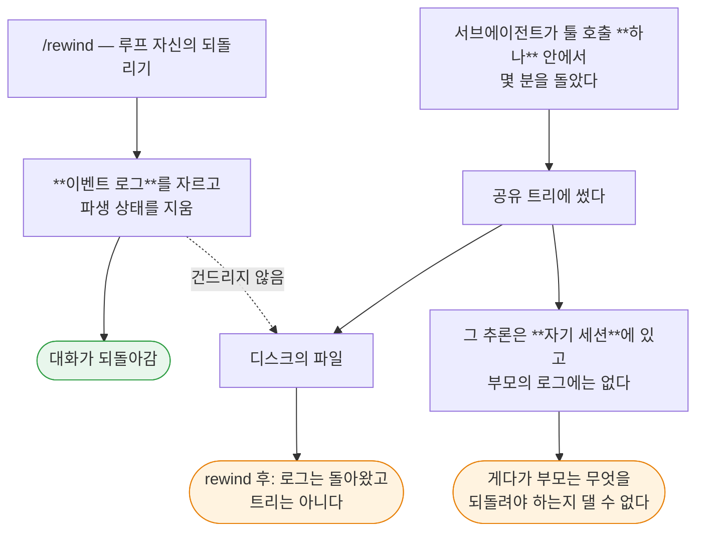
```mermaid
flowchart TD
    R["/rewind — 루프 자신의 되돌리기"] --> L["**이벤트 로그**를 자르고<br/>파생 상태를 지움"]
    L --> T1(["대화가 되돌아감"])
    L -.->|"건드리지 않음"| F["디스크의 파일"]
    C["서브에이전트가 툴 호출 **하나** 안에서<br/>몇 분을 돌았다"] --> W["공유 트리에 썼다"]
    W --> F
    W --> S["그 추론은 **자기 세션**에 있고<br/>부모의 로그에는 없다"]
    F --> Q(["rewind 후: 로그는 돌아왔고<br/>트리는 아니다"])
    S --> Q2(["게다가 부모는 무엇을<br/>되돌려야 하는지 댈 수 없다"])

    style T1 fill:#e8f6ec,stroke:#2f9e44
    style Q fill:#fff3e0,stroke:#e8820c
    style Q2 fill:#fff3e0,stroke:#e8820c
```

`magi.restore_child`가 오른쪽 가지에 대한 답이고, 그 모양이 어려움을 그대로 인정합니다. best-effort이고,
경로마다 성공 여부를 양쪽 다 보고하며("done"만 들은 루프는 깨끗하다고 믿는 트리 위에 다음 라운드를
세웁니다), **일부러 자동이 아닙니다**. 실패한 시도의 잔해가 다음 라운드에 필요한 증거일 때가 있기
때문입니다.

**병렬 실행은 이것을 낫게 하는 게 아니라 악화시킵니다.** 부모의 편집 가드는 쓰기 전후로 파일을 읽는데,
그것이 경합 없이 성립하려면 쓰기가 직렬화돼 있어야 합니다. 한 트리에 쓰는 자식 둘은 나중에 아무도 복원할
수 없는 뒤섞임을 만듭니다 — 로그는 둘 다 썼다고 말할 수 있을 뿐, 어느 쓰기가 살아남았는지는 말하지
못합니다. 그래서 동시성은 기본으로 주어지지 않고 **사는 것**이며, 방법은 둘, 그리고 둘 다 호스트가
**믿는 게 아니라 검사하는** 선언입니다:

| 선언 | 포기하는 것 | 사는 것 | 돌아오는 것 |
|---|---|---|---|
| `readonly_children` | 쓰기 전부 — `read`/`grep`/`glob`/`list` 밖을 요청한 스펙은 이름을 대며 거부 | 한 스텝의 두 호출이 동시에 돌고, 되돌릴 것이 없음 | 텍스트 |
| `isolated_children` | 공유 트리 — 쓰는 자식마다 자기 체크아웃, 셸은 `workspace-write`로 고정 | 쓰는 자식에게도 같은 동시성 | **커밋 범위**. `magi.merge_child`를 부를 때만 병합되고(git 3-way라 충돌은 조용한 덮어쓰기 대신 마커로 도착), 부모에는 아무것도 커밋되지 않음 |

**컴패니언은 이 경계를 한 단계 더 밖으로 옮깁니다.** 자기 워크스페이스, 자기 이벤트 로그, 그리고 그 안에서
한 번에 한 턴. 그래서 `hand_off`는 다른 에이전트의 변경을 내 트리에 넣지 않습니다 — 돌아오는 것은 내
대화로 들어오는 텍스트입니다. 넘겨받은 일은 다시 넘길 수도 없으므로, 모든 변경에 주인 하나와 그것을 책임질
로그 하나가 정확히 대응합니다.

그 값은 실제로 치러야 하고, 분명히 적어 두는 편이 맞습니다. **저쪽 컴패니언이 한 일을 여기서 되돌릴 수는
없습니다.** 되돌려 달라고 부탁하거나, 그 워크스페이스로 가서 하는 것입니다. 이 설계는 플릿 전체에 걸친
되돌리기를 포기하고, 답이 언제나 하나인 질문을 삽니다 — 누가 이것을 썼고, 어느 로그가 그렇게 말하는가.

`plugins/examples/crew`가 완성된 예시입니다 — 자기 체크아웃에서 도는 리뷰어를 띄우고, 판정하고, 호출자가 병합하거나 되돌립니다. 번들 플러그인이 아니라 예시이므로 쓰려면 설치해야 합니다.

## 7. 메모리 & 컨텍스트

턴의 컨텍스트는 쌓이는 게 아니라 매번 조립됩니다. 어떤 것은 사용자가 써 둔 것이라 절대 빠지지 않고,
어떤 것은 에이전트가 배운 것이라 관련 있어 보일 때 끌려 들어오며, 대부분은 대화인데 천장이 있는 건
그 대화 부분입니다.

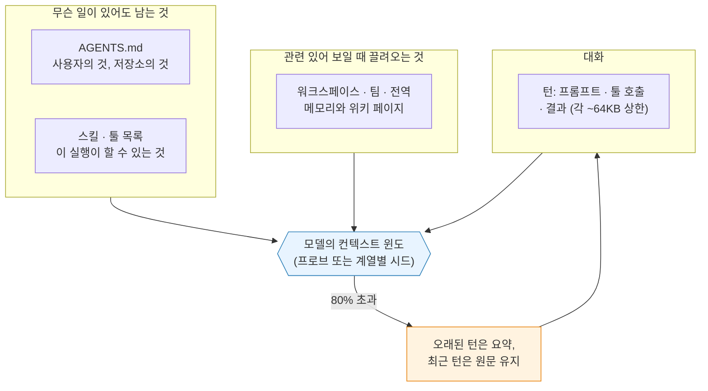
```mermaid
flowchart TD
    subgraph fixed [무슨 일이 있어도 남는 것]
        AG["AGENTS.md<br/>사용자의 것, 저장소의 것"]
        SK["스킬 · 툴 목록<br/>이 실행이 할 수 있는 것"]
    end
    subgraph learned [관련 있어 보일 때 끌려오는 것]
        M3["워크스페이스 · 팀 · 전역<br/>메모리와 위키 페이지"]
    end
    subgraph live [대화]
        T["턴: 프롬프트 · 툴 호출<br/>· 결과 (각 ~64KB 상한)"]
    end
    fixed --> W{{"모델의 컨텍스트 윈도<br/>(프로브 또는 계열별 시드)"}}
    learned --> W
    live --> W
    W -->|"80% 초과"| C["오래된 턴은 요약,<br/>최근 턴은 원문 유지"]
    C --> live

    style W fill:#e8f4ff,stroke:#2c7fb8
    style C fill:#fff3e0,stroke:#e8820c
```

압축이 건드리는 것은 언제나 대화뿐입니다. AGENTS.md는 구조상 압축을 견딥니다 — 집 규칙이 "윈도에 남아
있기를 바라는 메시지"가 아니라 거기 들어가야 하는 이유가 그것입니다.

배운 쪽은 디렉터리 셋이고, **좁은 것부터** 읽습니다. 그래서 *이* 저장소에 대한 사실이 팀의 습관을 이기고,
팀의 습관이 일반적인 것을 이깁니다:

| 계층 | 위치 | 누가 볼 수 있나 |
|---|---|---|
| 워크스페이스 | `<워크스페이스>/.magi/experience` | 이 워크스페이스, 그리고 저장소를 클론한 사람 |
| 팀 | `<config>/teams/<이름>/experience` | 이 기계에서 그 팀을 선언한 모든 컴패니언 — 그리고 기계끼리 플릿 키를 주고받았다면 다른 기계까지 (`exp-sync`, §13) |
| 전역 | `<config>/experience` | 이 사람의 모든 magi, 이 기계 한정 |

**메모리를 어떻게 찾고, 이미 가진 것을 어떻게 알아보나.** 순위는 기본이 어휘(lexical)이고,
`embed_model`이 지정되면 **하이브리드**입니다: 모든 계층의 모든 후보를 키워드 중첩으로도, 질의와의
코사인으로도 매기고, 두 순위를 **순서 기준으로 융합**(RRF)합니다 — 점수로 섞지 않습니다. 두 값은
비교 가능한 숫자가 아니기 때문입니다. 양쪽이 서로 다른 방향으로 필요합니다. 의미 절반이 없으면
*billing*을 물었을 때 *invoices*로 적힌 메모에 닿지 못합니다 — 한 단어도 겹치지 않아 0점이고,
벡터가 생기기도 전에 사라집니다. 어휘 절반이 없으면 희귀한 정확 토큰(파일명·에러코드)이 "왠지
관련 있어 보이는 것"에 질 수 있습니다. 순위는 **어휘 생존자가 아니라 풀 전체**에 매깁니다 —
재순위는 이미 버려진 것을 끌어올릴 수 없기 때문입니다. 문서는 텍스트별로 캐시되므로 정상 상태
비용은 질의 임베딩 하나이고, 모델이 없거나 엔드포인트가 실패하면 어휘 답이 그대로 서고 검색은
어느 쪽을 줬는지 말합니다.

같은 판정이 **들어올 때의 중복**도 정합니다. 정체성은 문자열 일치였고(메모리는 정규화한 본문,
스킬은 파일명), 표현만 바꾸면 그대로 통과합니다 — 그래서 같은 교훈이 여덟 가지 표현으로 여덟 번
쌓이고, 그 여덟이 예산이 허용하는 다섯 자리를 두고 경쟁했습니다. 임베더가 있으면 의미가 이미
있는 메모리는 쓰지 않고, 다른 이름으로 이미 존재하는 스킬은 새 파일이 아니라 **두 번째 관측**으로
병합됩니다. 임계값은 의도적으로 높습니다(`MAGI_DEDUP_COSINE`, 0.93): 오병합은 사실을 영구히·조용히
잃고, 오분리는 사람이 볼 수 있는 근접중복만 남깁니다. 모든 실패는 "중복 아님"으로 답하므로
엔드포인트가 죽어서 기록을 잃는 일은 없습니다.

- **AGENTS.md**: 작업 디렉터리(+`.magi/AGENTS.md`, 전역 `<config>/AGENTS.md`)의 내용이
  시스템 프롬프트에 주입되어 **압축돼도 보존**됩니다. `/init`로 자동 생성.
- **자동 압축(재수화 가능)**: 실제 토큰 수가 모델 윈도우 80% 초과 시 오래된 턴 요약(최근 보존). 압축된 구간은 **topic shard로 결정론적 인덱싱**되어 원문이 사라지지 않습니다 — `recall_context("<topic>")`(파일 경로가 잘 맞음)로 **원문 그대로** 재수화(토픽당 1회·턴 예산·크기 캡). 여기에 매 스텝, 현재 작업(최근 사용자 프롬프트 + 마지막 어시스턴트 메시지)과 어휘적으로 맞는 압축-이탈 토픽 최대 3개가 **힌트로 자동 주입**되어(“관련 과거 컨텍스트 — recall_context로”) 모델이 recall을 떠올리지 못해도 잃은 걸 가리켜 줍니다. 매칭은 **BM25-lite IDF**로 순위를 매깁니다: 여러 shard에 흔한 토큰(`the`, `handler`)보다 한 구역을 콕 집는 희귀 토큰(`dehydration`, `heap.go`)이 앞선다 — 그래서 현재 스텝이 실제로 필요한 구역을 가리킵니다. 순수 어휘/결정론(임베딩 의존 없음)이며 힌트는 *가리키기*만 하고 원문은 여전히 `recall_context`로 당겨옵니다. 윈도우는 **모델별**(에이전트마다 다른 모델→다른 윈도우)로, 시드에 없으면 백엔드에 **질의**(vLLM `max_model_len`·LiteLLM `/model/info`·Ollama `/api/show`) — 초기 모델은 시작 시, 그 외 모델은 **처음 쓰일 때 지연 조회**(`/route` 런타임 전환 등). Claude/Gemini는 해당 엔드포인트가 없어 시드 테이블에 의존. 윈도우를 못 구하면 **무제한**(게이지·비율압축 비활성)으로 간주하고, `/context <model> <tokens>`로 수동 지정 가능. 윈도우는 모델 이름이 아니라 **(백엔드, 모델) 쌍**에 대한 사실입니다: 백엔드가 리다이렉트되면(플러그인 루프백 프록시, 다른 base URL로의 `/route`) *백엔드가* 답했던 윈도우는 잊고 새 백엔드에 다시 질의하되, *사람이* `/context`로 지정한 윈도우는 리다이렉트를 살아 넘습니다 — 같은 이름이 건너편에서는 창이 다른 다른 빌드일 수 있지만, 당신의 지정은 이름에 대한 것이었기 때문입니다.
- **공유 두뇌(D13)**: `<config>/experience`(또는 `experience_dir`)의 `memories/`·`skills/`를
  세션 시작 시 회수·주입합니다. 스토어는 **세 층**입니다: `<workspace>/.magi/experience`(그 워크스페이스와
  그 repo만), `<config>/teams/<name>/experience`(이 기계에서 그 팀을 선언한 컴패니언들),
  `<config>/experience`(이 사람의 모든 magi). `remember` 툴은 **바로** 그 안에 씁니다 —
  리뷰 큐는 없다(EXTENDING §2.4의 정정). 디렉터리를 git repo로 두고 commit/pull하면 수동 팀 공유이고,
  서로의 플릿 키를 쥔 머신들은 팀 티어를 **자동으로** 나눈다(`exp-sync`, §13).
  단계별 부트스트랩/파일형식: [`EXTENDING.md`](EXTENDING.md) §2.
- **공유 위키**: append-only 메모리 옆에, 팀 티어는 **정설 페이지**를 갖습니다. 주제마다 현재의
  진실 하나, `remember{page:…}`로 쓰고 **제자리에서 정정**하며, `recall_memory`로 읽고, 에이전트
  컨텍스트에는 제목 인덱스로 광고됩니다. 더는 사실이 아닌 페이지는 사유와 함께 stale로 표시될 뿐
  삭제되지 않습니다. 웹 콘솔의 **지식** 화면이 모든 페이지를 편집자·티어·편집 요약과 함께 — stale
  툼스톤까지 — 보여줍니다.

## 8. 스킬

`<config>/skills/*.md` 또는 `<workdir>/.magi/skills/*.md` (첫 줄=설명, 이하=본문), 그리고 **skill-creator 규격** `<workdir>/.claude/skills/<slug>/SKILL.md`(frontmatter `description`=트리거) — 표준 skill-creator 규격으로, 흔한 에이전트 도구와 번들 engram 플러그인이 만드는 형식을 변환 없이 읽습니다. 스킬 목록은 소스 디렉토리 변경(mtime) 시 갱신되므로, engram이 세션 중 저장한 스킬도 재시작 없이 다음 턴부터 쓸 수 있습니다.
시스템 프롬프트에 목록이 노출되고, 모델이 `skill` 툴로 본문을 로드해 따릅니다.

## 9. 플러그인 (Lua)

`<config>/plugins/<name>/`에 `plugin.toml` + `init.lua`.

플러그인이 오는 곳은 셋이고, 그중 하나만 신뢰의 문제입니다:

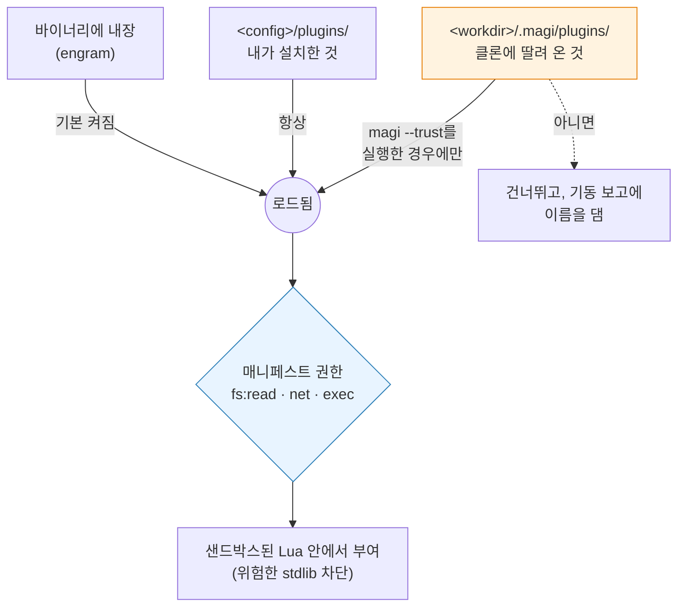
```mermaid
flowchart TD
    E["바이너리에 내장<br/>(engram)"] -->|"기본 켜짐"| L((로드됨))
    G["&lt;config&gt;/plugins/<br/>내가 설치한 것"] -->|"항상"| L
    W["&lt;workdir&gt;/.magi/plugins/<br/>클론에 딸려 온 것"] -->|"magi --trust를<br/>실행한 경우에만"| L
    W -.->|"아니면"| S["건너뛰고, 기동 보고에<br/>이름을 댐"]
    L --> P{"매니페스트 권한<br/>fs:read · net · exec"}
    P --> R["샌드박스된 Lua 안에서 부여<br/>(위험한 stdlib 차단)"]

    style W fill:#fff3e0,stroke:#e8820c
    style P fill:#e8f4ff,stroke:#2c7fb8
```

⚠ 플러그인은 자기 매니페스트에 자기 권한을 선언하고, 그것이 그대로 부여됩니다. 내가 직접 설치한
디렉터리라면 공정한 거래지만, 클론에 딸려 온 디렉터리라면 전혀 그렇지 않습니다. 그래서
`<workdir>/.magi/plugins/`는 **신뢰한 워크스페이스에서만** 로드됩니다(`magi --trust`, §설정 참고).
신뢰하지 않은 워크스페이스에서는 magi가 무엇을 찾았고 무엇을 건너뛰었는지 이름을 대 줍니다. 한 번만
쓰려면 `magi -plugins .magi/plugins`. capability(호스트가 실제로 강제하는 집합): `tool`·`command`(`/login` 같은 슬래시 커맨드)·`context-provider`·`mcp`·`ui`·`doctor`·`spawn`·`analyze`·`experience`(magi.propose_experience — 플러그인이 학습한 교훈/스킬을 D13 공유 스토어 리뷰 큐로 제안)·`notify`(magi.notify — 세션 트랜스크립트에 시스템 ⟳ 노트 추가, 능동 알림 채널; 모델도 다음 턴에 봄). `magi.remove_file`은 fs:write 권한으로 워크디렉토리 파일/디렉토리 삭제 — 산출물 쓰는 플러그인의 undo 반쪽. 파일 변경 시 **핫리로드**.
샌드박스(위험 stdlib 차단) + 매니페스트 권한(`fs:read`, `net`, `exec`) 집행.
예제: `plugins/examples/wordcount`.

**관찰자(observer) 플러그인.** 라이프사이클 이벤트(`startup`/`shutdown`/`session_start`) 외에 `magi.on`은 페이로드 테이블을 받는 **관찰 이벤트** 2종을 지원합니다: `user_message`(`{session, text}` — 진짜 사용자 프롬프트 제출)와 `turn_finished`(`{session, text, outcome, reason, skills}` — 톱레벨 턴 종료, text는 최종 어시스턴트 답변; `skills`는 이번 턴에 로드된 스킬명 콤마 목록 — 사용 실적 계측용). `outcome`은 턴의 **구조적 판정**이라 관찰자가 성패를 문구에서 추측할 필요가 없습니다: `verified`(카운슬이 직접 done 합의) · `unverified`(승인 없이 착지 — 딜록/비용캡/라운드캡) · `guard`(루프/스톨 가드 강제정지) · `error` · `ungated`(툴을 쓴 턴인데 카운슬이 아예 안 돎 — 카운슬 비활성·워크플로·하위깊이 종료 — 완료가 미검증이므로 사용자 확인 없이 성공으로 기록하면 안 됨) · `done`(툴을 안 쓴 평이한 대화 종료); `reason`은 사유. 둘 다 **턴 경로 밖에서 비동기로**(바운드 큐 + 워커 1개) 발화되므로 느린 핸들러가 대화를 지연시키지 않고, 큐가 넘치면 이벤트를 버린다(관찰은 best-effort). 여기에 **`magi.analyze{system=, text=, model=?}`** — 도구 없는 **원샷 사이드카 LLM 호출**(토큰을 쓰므로 capability `analyze` 필요; 시간 제한; model 생략 시 세션 모델) — 과 **`magi.json_decode(s)`**를 조합하면, 플러그인이 대화를 관찰해 구조화 지식(교훈·요약)을 추출하고 `magi.write_file`로 축적한 뒤 `magi.register_context_provider`로 되먹일 수 있습니다. 번들된 **`plugins/engram`** 자기개선 플러그인(구조적 outcome을 게이트로 교훈/스킬 자동 추출)이 이 3종 조합의 레퍼런스입니다 — 해당 README 참고. 그것이 이 셋으로 하는 일은 하나의 고리입니다:

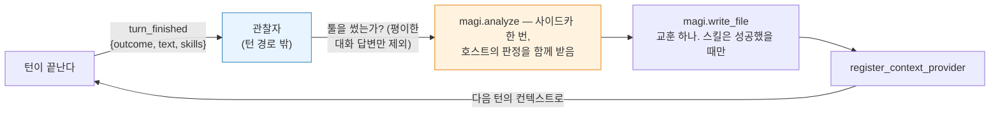
```mermaid
flowchart LR
    T["턴이 끝난다"] -->|"turn_finished<br/>{outcome, text, skills}"| O["관찰자<br/>(턴 경로 밖)"]
    O -->|"툴을 썼는가? (평이한<br/>대화 답변만 제외)"| A["magi.analyze — 사이드카 한 번,<br/>호스트의 판정을 함께 받음"]
    A --> W["magi.write_file<br/>교훈 하나. 스킬은 성공했을 때만"]
    W --> C["register_context_provider"]
    C -->|"다음 턴의 컨텍스트로"| T

    style O fill:#e8f4ff,stroke:#2c7fb8
    style A fill:#fff3e0,stroke:#e8820c
```

`outcome`이 무엇을 거르는지 보십시오. **배울지 말지**가 아닙니다 — 실패한 턴이 매끄럽게 지나간 턴보다
값어치가 큽니다. 거르는 것은 **그 교훈이 무엇을 주장해도 되는지**입니다. 분석기는 호스트의 판정을 함께
받고(`verified`는 카운슬이 완료를 승인했다는 뜻, `guard`는 정체 가드가 멈춰 세웠다는 뜻) 그와 모순되는
교훈을 쓰지 말라는 지시를 받습니다. 그래서 정체 도중 죽은 턴을 두고 "고쳤다"고 기록할 수 없습니다.
실패는 실패로 적히고, 확정된 성공만 재사용 가능한 스킬이 될 수 있습니다.

```toml
# plugin.toml
name = "wordcount"
capabilities = ["tool"]
permissions = ["fs:read:."]
```

**내장(embedded) 플러그인.** 바이너리에는 하나가 실려 있습니다. **engram** 자기개선 플러그인(교훈/스킬 자동 캡처 — `plugins/engram/README.md`)은 **기본 켜짐**이며, 사이드카 LLM 토큰 소비·워크스페이스 지식 파일 생성이 부담이면 끕니다:

```toml
[plugins.engram]
enabled = false
```

`MAGI_EMBEDDED_PLUGINS=off`는 설정과 무관하게 내장 플러그인 전부를 끈다 — 측정 행동이 흔들리면 안 되는 자동화/벤치 런용.

종료 시 magi는 큐에 남은 관찰 이벤트를 잠깐 드레인해 관찰자의 사이드카 분석(예: engram의 교훈 추출)이 프로세스 종료 전에 착지하도록 합니다 — 안 그러면 분석 도중에 죽는 헤드리스 원샷 런에 특히 중요합니다. 이 대기는 상한이 있어(기본 `30s`) *느린* 사이드카 모델이 종료를 막지 못합니다. `MAGI_DRAIN_TIMEOUT`(Go duration, 예: `5s`, `2m`)로 조정합니다. 내장 플러그인을 끄면 드레인할 것이 없습니다.

켜진 내장 플러그인은 매 시작 시 `<config>/plugins-embedded/`에 풀리므로 항상 바이너리 버전을 따릅니다 — 업데이트는 `magi --update`에 실려 오고 별도 플러그인 업데이트가 필요 없습니다. 일반 플러그인 디렉토리에 같은 이름이 있으면 그쪽이 우선한다(커스터마이즈는 그리로 포크). **포크가 자체 플러그인을 번들**하려면 `plugins/embedded.go` 한 파일만 수정하면 된다(플러그인 디렉토리 추가 + `//go:embed all:<name>` 변수 + `Embedded` 맵 등록 — 하위 디렉토리도 함께 실립니다).

**설치 / 업데이트.** git repo로 배포된 플러그인(repo 루트에 `plugin.toml`)은
`magi --plugin-install <git-url> [--plugin-pin <태그/브랜치>]`로 설치하며, `<config>/plugins/`로
clone됩니다. `magi --update-plugins`(또는 바이너리까지 갱신하는 `--update`)는 git 체크아웃 플러그인마다
fast-forward하며, 로컬 변경이나 remote 없음은 보고 후 건너뜀(덮지 않음). §버전/자동 업데이트 참고.

## 10. MCP

`config.toml`의 `[mcp.<name>]`에 선언하면 stdio JSON-RPC로 spawn되어 툴이
자동 등록됩니다. 서버 종료 시 해당 툴 제거.

> 단계별 추가/검증/트러블슈팅: [`EXTENDING.md`](EXTENDING.md) §1.

## 11. 모델 권장

| 모델 | 어디서 도나 | 필요한 것 | 언제 쓰나 |
|---|---|---|---|
| **`gpt-oss:120b-cloud`** | Ollama 무료 클라우드 티어 (`ollama signin`) | GPU 불필요 | **기본** — 범용과 코딩 둘 다 강하고, 받을 것도 없음 |
| `qwen3-coder:480b-cloud` | 같은 티어 | GPU 불필요 | 쿼터를 쓸 각오가 된 어려운 과제 |
| **`qwen3-coder:30b`** | 내 기계 | GPU 약 24GB | 가장 강한 완전 로컬 코더 — 네트워크도 쿼터도 없음 |
| `gpt-oss:20b` | 내 기계 | 더 적게 | 가벼운 로컬 대안. 추론 과정을 보여줌 |
| llama3.1:8b 등 | 내 기계 | 적게 | **비권장** — 작은 모델은 툴이 켜지면 함수 호출을 산문에 흘림 |

무료 티어는 "light usage"(한 번에 요청 하나, GPU 시간 쿼터)라 더 무거운 `480b`는 쿼터를 빨리 먹습니다.
로컬 모델을 크기로 고르신다면 파일 용량이 아니라 **활성** 파라미터로 판단하십시오. 활성 3B쯤의 MoE
모델이 같은 용량의 덴스 모델보다 몇 배 빠르고, 그 차이는 매 스텝마다 치르는 벽시계 시간입니다.

**프로바이더 복원력(불안정한 백엔드가 턴을 거의 잃지 않는 이유).** magi는 OpenAI 호환 계층을 best-effort로 다루며, 안전하게 가능한 곳에선 어보트 대신 복구합니다:
- **tool-call 파싱** — 로컬/클라우드 모델의 tool-call 변종(JSON/XML/네이티브)을 모두 파싱하고, 백엔드가 `cache_control`을 거부(400/422)하면 투명하게 캐싱 없이 1회 재시도하고 세션 동안 기억합니다.
- **일시 장애** — 연결 오류와 429/5xx는 상한 있는 백오프로 재시도(`Retry-After` 준수); 재시도 소진 시 **상태 + 본문**을 표면화해 실패가 진단 가능하며, 맨숭한 "request failed"로 끝나지 않습니다.
- **harmony tool-call 오파싱** — Ollama의 gpt-oss harmony 파서는 **모델이 최종 답을 prose로 뱉을 때** 그걸 tool call로 읽으려다 종종 **500**을 낸다(`error parsing tool call: raw=…`). 재시도 사이 요청이 동일해 이 500은 결정론적이므로, magi는 **tools 배열을 벗기고 1회 재시도**합니다: tools를 광고하지 않으면 서버가 tool-call 파싱을 건너뛰고 같은 prose를 일반 content로 돌려줘 — 모델이 실제로 낸 답이 턴 하드-어보트 대신 복구됩니다. 이 정확한 시그니처에만 스코프되어 진짜 장애(genuine outage)는 그대로 에러로 표면화됩니다.

## 12. 콘솔 (`magi-web`)

> 화면 구성·디자인 규칙·근거: [`UI.ko.md`](UI.ko.md).
> 눌러볼 수 있는 데모(목업 데이터, 서버 없음): <https://sayaya1090.github.io/magi/>.

이 머신의 모든 magi를 — 그리고 가리키면 다른 머신의 것까지 — 보는 웹 화면. 별도의 서비스가 아니라
**같은 데몬 위의 두 번째 표면**입니다: 보여주는 것은 디스크에 이미 있는 이벤트 로그에서 유도하고,
*하는* 것은 전부 `--attach`가 쓰는 그 소켓으로 나갑니다. 콘솔을 꺼도 아무 일도 멈추지 않습니다.

값어치는 에이전트를 하나 이상 돌릴 때 나옵니다. 터미널은 하나를 보여주지만, 콘솔은 다섯 중 어느 것이
질문에 막혀 있는지, 내가 자리를 비운 사이 어느 것이 끝냈는지, 각자 무엇을 배웠는지를 보여줍니다.

<div align="center">
<a href="https://sayaya1090.github.io/magi/"></a>

<sub>다른 모든 화면이 매달려 있는 목록. 나를 필요로 하는 행은 그렇다고 말하고, 둘 중 어느 종류인지도 말합니다.</sub>
</div>

<table>
<tr>
<td width="50%" valign="top"><a href="https://sayaya1090.github.io/magi/?d=%2Fdemo%2Fdesign.sock"></a><br><b>§12.3 — 컴패니언 하나.</b> 진짜 종료 코드가 보이는 전사와, 지금 막혀 있는 것.</td>
<td width="50%" valign="top"><a href="https://sayaya1090.github.io/magi/?d=%2Fdemo%2Fdesign.sock"></a><br><b>작업공간 판.</b> 그 컴패니언이 보는 그대로의 트리와 git 상태가 대화 옆에.</td>
</tr>
<tr>
<td width="50%" valign="top"><a href="https://sayaya1090.github.io/magi/?v=meet"></a><br><b>§12.5 — 회의.</b> 여러 컴패니언을 한 질문에, 그다음 결론이 업무로 나갑니다.</td>
<td width="50%" valign="top"><a href="https://sayaya1090.github.io/magi/?v=skills"></a><br><b>지식.</b> 스킬·메모리·위키. 각각 어디까지 닿는지가 붙어 있다(§7, §8).</td>
</tr>
</table>

### 12.1 띄우기

```sh
./magi-web                                   # http://127.0.0.1:7777
./magi-web -addr 127.0.0.1:7788
./magi-web -config-dir /path/to/config       # 어떤 데몬들이 보이는지
./magi-web -workdir /path/to/repo            # 기본 워크스페이스
./magi-web -peer laptop=http://10.0.0.4:7777 -peer ci=http://10.0.0.9:7777
./magi-web -exposed -tls-cert cert.pem -tls-key key.pem   # 나 말고 더 많은 사람이 닿는다
./magi-web -exposed -tls-cert cert.pem -tls-key key.pem -user-header X-Forwarded-User
./magi-web -emit-demo ./out                  # 페이지를 정적 파일로 쓰고 종료
```

콘솔은 뷰어이지 두 번째 엔진이 아닙니다. 보여주는 것은 전부 데몬에게 물어본 것이고, 터미널이 쓰는 바로
그 소켓으로 물어봅니다:

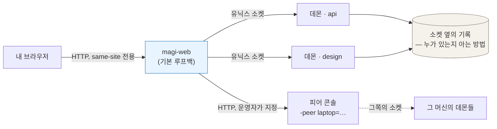
```mermaid
flowchart LR
    B["내 브라우저"] -->|"HTTP, same-site 전용"| W["magi-web<br/>(기본 루프백)"]
    W -->|"유닉스 소켓"| D1["데몬 · api"]
    W -->|"유닉스 소켓"| D2["데몬 · design"]
    W -->|"HTTP, 운영자가 지정"| P["피어 콘솔<br/>-peer laptop=…"]
    P -.->|"그쪽의 소켓"| D3["그 머신의 데몬들"]
    D1 & D2 --> R[("소켓 옆의 기록<br/>— 누가 있는지 아는 방법")]

    style W fill:#e8f4ff,stroke:#2c7fb8
    style R fill:#f5f2ec,stroke:#8a8178
```

여기서 둘을 쥐고 가면 좋습니다. 콘솔에는 **자기 저장소가 없습니다** — 컴패니언의 트랜스크립트·계획·이력은
그것을 소유한 데몬에서 읽습니다. 콘솔을 아무 때나 재시작해도 되는 이유입니다. 그리고 **피어**의 컴패니언에
대한 행위는 그것을 소유한 콘솔로 전달됩니다. 그 머신의 소켓은 이쪽이 걸 수 있는 것이 아니니까요.

- **기본은 루프백이고, 자체 로그인은 없습니다.** 조직이 허용하는 방식으로 접근합니다 — `ssh -L` 터널,
  또는 회사의 SSO를 앞에 세운 프록시. 계정을 우리가 만들면 회사 문 옆에 문을 하나 더 다는 것이고,
  두 번째 문은 언제나 더 약합니다.
- **모든 라우트가 same-site 전용입니다.** 핸들러마다 감싸져 있어 다른 오리진의 페이지가 POST할 수
  없습니다 — 콘솔엔 훔칠 토큰이 없지만, 그 버튼들은 데몬을 멈춥니다.
- **`-peer name=url`은 다른 콘솔을 합칩니다.** 피어의 컴패니언이 그 이름을 달고 목록에 섞이고, 그들에
  대한 액션은 소유한 콘솔로 전달됩니다 — 그 머신의 소켓은 이쪽이 열 것이 아니기 때문입니다. 응답 없는
  피어는 **그렇게 적힌 행**이 됩니다. 피어 URL은 오직 운영자에게서만 옵니다 — 페이지나 다른 피어의
  응답에서 오지 않습니다.
- **`-exposed`는 나 말고 더 많은 사람이 닿는 콘솔을 위한 것이다** — 인증하는 프록시, SSO 게이트웨이,
  팀이 공유하는 터널 뒤. 이 프로세스는 그 사실을 스스로 알아낼 수 없으므로(프록시가 전달한 요청도
  다른 것과 똑같은 루프백 연결입니다) 운영자가 말해 줍니다. 켜면 **호출자가 고른 것을 이 기계가
  실행하게 되는** 두 경로를 내린다 — `/shell`, 그리고 데몬이 기동할 때 띄우는 MCP 서버의
  커맨드라인 쓰기. 둘 다 에이전트의 툴 호출이 지나는 권한 정책을 우회합니다. MCP 목록 **읽기**는
  남습니다. 프롬프트·응답·크론·디스패치도 남습니다 — 그것들은 에이전트를 거쳐 기계에 닿고, 그것마저
  막으면 콘솔이 존재 이유를 잃습니다. **이 플래그는 인증을 하지 않습니다.** 인증된 호출자가 무엇을
  요구할 수 있는지를 좁힐 뿐입니다.
- **`-exposed`는 `-tls-cert`·`-tls-key`를 요구하고, 없으면 기동하지 않습니다.** 인증이 앞이 아니라
  magi 안에 있으므로 사람을 식별하는 것이 이 연결을 건넌다 — 평문이면 그것은 선로 위에 있는 것이고,
  루프백은 그것을 구해주지 않는다(그 포트는 무언가가 전달해 주어서 닿는 것입니다). `-exposed`가 없으면
  선택이고 대개 필요 없습니다 — 자기 터널로 접속하는 운영자 한 명에게 직접 만든 인증서는 얻는 게 없습니다.
  **반쪽만 준 경우는 어느 쪽이든 거절한다** — 누군가 아니라고 믿는 동안 평문으로 서빙하게 되므로.
- **`-exposed`와 `-peer`를 함께 쓰면: 보는 것은 건너가고 행하는 것은 건너가지 않습니다.** 피어는
  *당신의* 터널로 당신의 키를 써서 닿고, 전달되는 요청엔 신원이 실리지 않습니다 — 공유된 콘솔이라면
  게이트웨이가 들여보낸 누구든 다른 기계에서 운영자 행세를 하게 될 것입니다. 예전엔 조합 자체를
  거절했는데, 그러면 사람들이 실제로 원하는 배치(콘솔 하나, 머신 여럿, 보는 사람 여럿)까지
  없어집니다. 지금은 공유 콘솔에서도 연합 뷰는 동작하고, 피어의 컴패니언을 향한 **변경**은 그 변경을
  할 수 있는 콘솔의 주소를 대며 거절됩니다 — 그 컴패니언이 사는 곳에서 하라는 뜻입니다.
- **바꾼 것은 기록된다** — 세션 스토어 옆 `console-audit.jsonl`(macOS `~/Library/Caches/magi`,
  Linux `~/.cache/magi`, Windows `%LocalAppData%/magi`; `MAGI_DATA_DIR`로 옮깁니다). 무언가를 바꾸는
  요청마다 JSON 한 줄: 시각·메서드·경로·지목한 컴패니언·출처·상태. 거절도 포함합니다. 읽기는 남기지
  않습니다 — 페이지는 폴링하고, 아홉 할이 잡음인 파일은 정작 필요할 때 아무도 열지 않습니다. 본문은
  절대 남기지 않습니다 — 세션 로그가 이미 한 글자도 빠짐없이 갖고 있고, 이 파일은 **문**의 기록입니다.
  자라기만 하므로, 지우고 싶으면 지우면 됩니다.
- **`-user-header NAME`이 "누구"의 출처입니다.** magi에는 계정이 없으므로 말하는 사람이 누구인지 아는
  것은 앞의 게이트웨이뿐입니다. 그것이 세우는 헤더 이름을 대면(`X-Forwarded-User`,
  `X-Auth-Request-Email`, `Cf-Access-Authenticated-User-Email`, `Tailscale-User-Login` …) 줄마다
  적힙니다. 지정하지 않으면 기록은 **어디서**만 말하고 **누가**는 말하지 않습니다. 검증하지 않으며 할
  수도 없습니다 — "게이트웨이가 유일한 입구"라는 전제만큼만 값이 나가고, 그 전제를 지키는 것이 루프백
  바인딩입니다.
- **`auth.toml`이 사람마다 무엇을 할 수 있는지 정합니다.** 그 파일이 없으면 아무것도 달라지지 않습니다 —
  파일 없음 = 운영자 한 명이고, 앞에 인증하는 무언가를 세우기 전까지 모든 콘솔이 그 상태입니다. 콘솔
  자신의 config 디렉토리에서만 읽고 **워크스페이스에서는 절대 읽지 않는다** — `config.toml`은
  프로젝트의 `.magi/config.toml`과 병합되므로, 자기에게 역할을 줄 수 있는 저장소는 그 기계를
  가진 것이나 마찬가지입니다.

  ```toml
  # ~/.config/magi/auth.toml     (0600)
  [people."kim@corp.com"]
  role = "operator"

  [people."lee@corp.com"]
  role = "responder"
  companions = ["docs", "palette"]   # 없으면 = 모든 컴패니언
  ```

  기본 역할 셋이 있고, 그냥 평범한 역할이다(수정·교체 가능):

  | 역할 | 할 수 있는 것 |
  |---|---|
  | `operator` | 전부(`admin`·`shell` 포함) |
  | `responder` | `read`, `answer` |
  | `viewer` | `read` |

  능력은 지어낸 것이 아니라 **라우트에서 읽어낸 것**입니다: `read`(보기만 하는 전부),
  `answer`(권한·질문 응답, 중단), `prompt`(제출·스티어·디스패치·압축·다른 대화로 이동),
  `curate`(스킬, 기억/잊기, 보고서 서식), `configure`(모델·승인 모드·크론·MCP 서버),
  `admin`(사람과 역할), `shell`(`/shell` — `-exposed` 콘솔에는 그 라우트 자체가 없습니다).

  ```toml
  [roles.reviewer]                    # 같은 일곱 개로 직접 만드는 역할
  can = ["read", "answer", "curate"]
  ```

  **누가 묻는지는 `-user-header`에서 온다**(위 항목). 그래서 정책은 앞에서 사람 이름을 대주는
  무언가가 있는 콘솔에서만 강제됩니다. 설정된 콘솔에서 **이름 없는 호출자는 운영자가 아니라 아무도
  아니다** — 이 물건이 존재하는 이유가 그 구멍입니다.

  파일이 있는데 잘못됐으면 콘솔이 기동하지 않습니다: 파싱이 안 되면 아무도 아무것도 못 하게 되고,
  이 빌드에 없는 능력을 적었으면 준 적 없는 것을 줬다고 믿게 되고, 사람만 있고 `admin`이 아무도
  없으면 그 뒤로 누구도 고칠 수 없습니다.
- **`-peer`와 클러스터(§13.8)는 다른 것입니다.** 피어는 운영자가 적어 준 콘솔이고 **사람이 보기 위한**
  것입니다. 클러스터는 컴패니언들이 서로에게 누가 있는지 알리는 것이고 **일이 건너가기 위한** 것입니다.
  둘은 서로의 목록을 읽지 않습니다.

### 12.2 화면

왼쪽 레일에 목적지가 둘 있고, 컴패니언 상세는 첫 번째 안에 있습니다.

| 목적지 | 무엇이 있나 |
|---|---|
| **컴패니언** | 이 콘솔이 볼 수 있는 모든 데몬: 상태, 지금 하는 일, 호스트와 IP, 유휴 시간, 자기 계획의 진척(`3/7`), 그리고 **다른 컴패니언을 위해 지고 있는 일**. 위쪽 타일이 상태로 거르고 사람을 기다리는 수를 배지로 답니다. 행을 누르면 그 컴패니언이 열립니다 |
| **공유** | 경험 저장소와 MCP 서버가 일이 일어나는 순서대로 함께 있습니다: 자주 말해져 규칙이 된 것, 그 규칙들, 그리고 컴패니언들이 닿을 수 있는 곳. 경험 행마다 도달 범위("모든 컴패니언"/"frontend 팀"/"api만"), 무엇을 하다 배웠는지, 본문이 적히고 잘못된 건 잊게 할 수 있습니다. MCP 서버는 추가·변경·삭제할 수 있고 그 컴패니언의 설정에 쓰여 다음 기동 때 붙습니다 |
| **보드** | 작업을 카드로, 컴패니언마다 한 칼럼, 옮길 수 있는 날짜. 칼럼이 상태가 아니라 누가 했나인 이유는 지난 화요일에 그 컴패니언이 어떤 상태였는지 같은 것은 존재하지 않기 때문입니다. 카드는 에이전트가 붙인 `label`로 묶입니다 |

### 12.3 컴패니언 상세

행에서 열리고 주소는 `/?d=<소켓 경로>`. 여기서 하는 일은 둘 — 지켜보는 것과 말하는 것 — 이라
페이지는 대화가 본체이고 나머지가 그 옆에 섭니다.

판 둘이 나란히 들어가는 화면에서 각 부분이 앉는 자리:

```
┌──────┬──────────────────────────────────────────────┬────────────────────────┐
│ 레일 │  design / api / ops · 브레드크럼   ⌘K  ☰      │                        │
│      ├──────────────────┬───────────────────────────┤   팩트 판              │
│ 컴패 │ 워크스페이스     │  대화                     │   ─────────────────    │
│ 니언 │ ───────────      │  ────────────────         │   이건 무엇인가        │
│      │ 한 번에 한 디렉  │  /events로 실시간. 접힌   │   지금 도는 것         │
│ 지식 │ 터리씩 읽는 트리 │  툴 호출, 사고, 카운슬    │   계획            3/7  │
│      │                  │  라운드, diff             │   넘긴 일              │
│ 회의 │ ── Git ──        │                           │   이력                 │
│      │ 스테이지/변경됨  │  ┌─────────────────────┐  │   크론                 │
│      │ 커밋 · PR        │  │ 입력창 — 새 턴이     │  │                        │
│      │                  │  │ 아니라 **조종**      │  │   (손잡이는 판 오른쪽  │
│      │                  │  └─────────────────────┘  │    위 아이콘. 상태를   │
│      │                  │                           │    기억함)             │
└──────┴──────────────────┴───────────────────────────┴────────────────────────┘
   840px 아래에서는 판 둘이 탭 둘이 되고, 착지하는 쪽은 대화입니다 — 폰에서 파일을
   열면 대화가 0px이 되던 것이 그 이유입니다
```

**대화.** 이벤트 스트림(`/events`)으로 트랜스크립트가 실시간으로 흐르고, TUI와 같은 방식으로
그려집니다: 펼쳐지는 툴 호출 접기, 사고 블록, 멤버별 판정이 붙은 카운슬 라운드, diff, 그리고 아직
도는 호출 아래의 진행 막대. 툴 호출은 어떻게 끝났는지를 글리프로 말하고, 접기 하나를 펴면 같은
종류가 함께 펴집니다.

**입력창.** 보내는 것은 새 턴이 아니라 **steer**로 들어갑니다 — 데몬이 이미 일하는 중일 수 있고,
어느 쪽인지 정하는 건 엔진입니다. `중단`은 턴을 끊습니다. 컴패니언이 권한이나 질문에 막혀 있으면 그
프롬프트가 여기 버튼과 함께 뜨고, 페이지에서 답하면 붙은 터미널이 답했을 그 호출이 풀립니다.

**오른쪽 사실 패널.** 손잡이는 패널 오른쪽 위 아이콘이고, 열어 뒀는지 여부를 기억합니다. 위에서부터:

| 카드 | 무엇인가 |
|---|---|
| 이건 뭔가 | 상태·워크스페이스·역할·팀(팀을 대표하는지까지)·호스트·IP·pid·스텝·마지막 활동·세션 id — 볼 때까지 한 줄로 접혀 있습니다. 상태 줄은 **다른 컴패니언에게서 받은 일**도 말한다("받은 일 1건, 2건 대기"): 상태는 사람이 붙는 세션에서 읽고 넘겨받은 일은 다른 대화에서 돌기 때문에, 이 줄이 없으면 이웃의 요청을 처리 중인 컴패니언이 유휴로 읽힙니다 |
| 프로바이더 / 모델 | 한 줄의 셀렉트 둘, 질문이 읽히는 순서 그대로: 어느 백엔드, 그 다음 그중 어느 모델. 프로바이더는 **지금 서빙 중인 것들** — `/providers`가 나열하는 그 로스터로, config 파일이 가리키는 백엔드 `default`도 포함되므로 CLI 백엔드로 옮긴 컴패니언을 되돌릴 수 있습니다. 프로바이더를 바꾸면 **모델 셀렉트가 비워지고 포커스가 그리로 옮겨갑니다**: 백엔드끼리는 모델명 어휘를 공유하지 않아 이전 이름은 새 백엔드가 거의 서빙하지 않고, 콘솔이 대신 골라 주지도 않습니다. 표시되는 모델은 컴패니언이 *지금* 올라탄 것 — 터미널에서 한 `/route` 전환도 다음 폴에 여기 반영됩니다 |
| 실행 중 | 턴 옆에서 도는 것 — 백그라운드 명령과 그 마지막 줄, 열어 볼 수 있는 자식. 예전엔 입력창 위 스트립이라 폭과 화면을 가리지 않고 항상 떠 있었다; 이건 필요할 때 보는 것이므로 카드입니다 |
| 계획 | 에이전트가 마지막으로 기록한 투두와 진행 막대. **로그에서 읽으므로** 멈춘 컴패니언, 다른 데서 재개한 세션, 안 보고 있는 동안 진행된 것도 맞습니다 |
| 넘긴 일 | 다른 컴패니언에게 준 것과 돌아온 답. 그 일이 **실제로 돈 대화**(요청자별로 하나, 누가 요청했는지가 액터에 적힌 세션)에서 읽습니다 — 사람이 붙는 세션에는 애초에 없었습니다 |
| 예정 | 무인 작업(§14): 스케줄 줄, 다음 발화 시각, 켜짐 여부 |
| 당신이 해야 했던 말 | 사람이 끼어든 기록, 기본 최근 일주일 — 어디서 손이 필요했는지의 기록 |
| 지금까지 한 일 | 지난 세션들, 단어로 검색(`/search?q=`), 열면 그 트랜스크립트 |

**왼쪽 워크스페이스.** 트리는 요청당 디렉토리 하나, 펼친 폴더만 읽습니다. 읽은 것은 몇 초 동안
보관하므로 패널에 도착하거나 탭으로 돌아오거나 폴더를 펼치는 것으로 트리를 다시 걷지 않습니다. 보관분을
나이가 아니라 **오답**으로 보고 즉시 버리는 경우는 둘: 이 콘솔이 한 변경(저장·새 파일·이름변경), 그리고
카드 머리의 ⟳ — 콘솔이 볼 수 없는 이유로 생긴 파일을 위한 것. 파일 찾기는 다이얼로그(필드 하나와
이름/내용 선택)이고, **검색이 켜져 있는 동안 그 패널은 검색 결과다** — 히트를 열어도 다음 클릭 밑에
평범한 트리가 깔리지 않습니다.

터치 화면에서는 행별 컨트롤(파일 메뉴, 변경 파일의 스테이지·언스테이지·되돌리기·diff)이 그냥 보입니다.
포인터에서는 hover로 뜨는데 폰에는 hover가 없어서, 기능이 있는데 닿을 수가 없었습니다.

**git·커밋·풀 리퀘스트 — 페이지에서.** 워크스페이스 카드는 읽기 전용이 아닙니다. 변경 파일의
스테이지/언스테이지/되돌리기/diff를 넘어, 변경을 끝까지 내보낼 수 있습니다:

- **파일 미리보기**는 페이지를 떠나지 않고 파일의 현재 내용을 연다(툴이 하는 것과 같은 읽기) — 손대기
  전에 뭐가 바뀌었는지 훑어볼 때.
- **커밋 메시지 생성**은 스테이지된 diff에서 컴패니언에게 메시지를 쓰게 합니다 — 손으로 짓지 않아도
  되고, 고쳐서 페이지에서 커밋할 수 있습니다.
- **풀 리퀘스트 열기**는 그 브랜치의 GitHub PR을 만들고, **PR 본문 생성**은 커밋들에서 설명을 초안합니다
  — 사실(브랜치·베이스·커밋)을 먼저 모아줍니다.

컴패니언의 작업을 지켜보다 그걸 착지시키고 싶을 때 씁니다 — diff를 보고, 커밋/PR 문구를 쓰게 하고,
푸시하는 것을 터미널로 내려가지 않고. `configure`/쓰기 역할을 가진 사람과 같은 권한이며, 뷰어 전용
콘솔은 diff는 보여도 이 버튼들은 없습니다.

**리포트 형식(`curate` 권한).** `ask_user` — 컴패니언이 턴 도중 *당신*에게 질문할 때 쓰는 툴 — 은
**리포트 계약**에 묶입니다: 답, 또는 막힌 부분이 돌아와야 할 모양이라, "내가 못 한 부분"이 그 부분으로
돌아오지 왜 어려웠는지에 대한 문단으로 돌아오지 않습니다. 콘솔에는 그 계약을 위한 작은 에디터가 있습니다
(컴패니언의 curate 컨트롤에서). 컴패니언의 질문이나 hand-off 답이 자꾸 손대기 어색한 모양으로 돌아올
때 고친다; 놔두면 합당한 기본값이 적용됩니다.

840px 아래로는 두 판이 들어갈 자리가 없어 탭 둘이 되고, 착지하는 쪽은 대화입니다. 창 하나가 여는 이벤트
스트림은 **하나**이고, 보고 있지 않은 탭은 그것을 반납합니다: 브라우저는 한 호스트에 연결 6개까지만
열고 스트림은 끝나지 않아서, 창당 두 개일 때 세 번째 창은 일반 요청조차 못 했습니다.

### 12.4 한 번의 키로 어디든 — `Ctrl`/`⌘` + `K`

입력 필드 하나와, 그 아래 이 콘솔이 이름 댈 수 있는 것들: 페이지 자신의 동작, 컴패니언들, 그리고 두
글자 이상 입력하면 지금 화면의 워크스페이스 파일까지. 위아래로 이동, `Enter`로 실행, `Escape`로 닫기.
머리말에 여는 버튼도 있습니다 — 폰에는 모디파이어 키가 없고, 아무도 안 알려준 단축키는 아무도 안 씁니다.

여기 있는 것 중 **새로운 기능은 없다**. 모든 항목은 화면의 컨트롤이 부르는 바로 그 호출로 끝나므로,
같은 일에 두 경로가 생기지 않고 권한 규칙도 두 벌이 되지 않습니다. 동작은 **의미가 있는 곳에서만** 뜹니다:
컴패니언이 열려 있지 않으면 "중단"은 목록에 없고, 회의를 소집할 수 없는 사람에게는 회의 항목이 없습니다.

파일은 **질의가 있을 때만** 조회합니다. 열자마자 파일 목록을 받아오는 팔레트는 키 하나에 남의 저장소를
한 번 걷는 값을 매기는 것입니다. 컴패니언과 동작은 이미 페이지 메모리에 있어 아무에게도 묻지 않습니다.

### 12.5 회의 — 여러 컴패니언에게 한 질문

레일에서, 또는 컴패니언이 둘 이상일 때 목록에서 엽니다. 회의는 콘솔이 여러 컴패니언에게 같은 질문을
차례로 던지고 각자가 앞사람의 말을 읽게 하는 것입니다. 단체 채팅도 투표도 아니다: 나오는 것은 트랜스크립트
하나와, 참가자별 과업 하나씩 — 그것을 내보낼지는 사람이 정합니다.

**의장은 콘솔입니다.** 누군가는 다음 발언자를 정해야 하는데 참가자는 안 됩니다 — 순서를 정하는 참가자는
자기가 논쟁하는 회의를 진행하는 셈입니다. 콘솔은 할 말이 없고, 그래서 의장에 맞습니다. 회의는 콘솔의 고루틴이
끌고 가므로 탭을 닫아도 끝나지 않습니다. 방은 콘솔이 사는 동안만 삽니다 — 회의보다 오래 남는 기록은 각
참가자 자신의 로그이기 때문입니다.

**전원이 자기 워크스페이스를 읽기 전에는 아무도 말하지 않습니다.** 소집은 참가자를 각자 준비시킨다 —
자기 대화에서, 읽기 전용 툴로, 자기 git 상태를 산문으로 받아서 — 그리고 전원이 돌아오면 방이 열립니다.
준비하지 못한 참가자(데몬 없음, 사라진 워크스페이스)는 방을 붙잡지 않습니다: 사유가 기록되고 회의는 한
사람 빠진 채로, 그 사실을 말하며 열립니다. 준비는 병렬이라 대기는 합이 아니라 가장 느린 하나입니다.

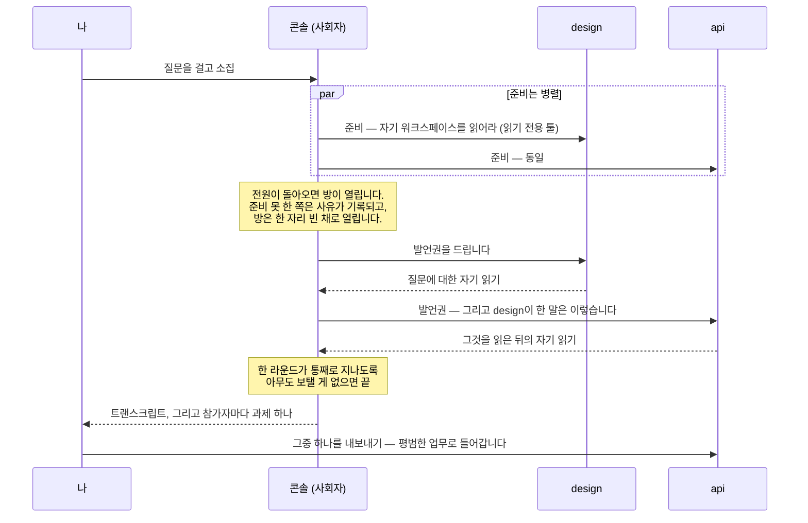
```mermaid
sequenceDiagram
    participant U as 나
    participant C as 콘솔 (사회자)
    participant A as design
    participant B as api
    U->>C: 질문을 걸고 소집
    par 준비는 병렬
        C->>A: 준비 — 자기 워크스페이스를 읽어라 (읽기 전용 툴)
        C->>B: 준비 — 동일
    end
    Note over C: 전원이 돌아오면 방이 열립니다.<br/>준비 못 한 쪽은 사유가 기록되고,<br/>방은 한 자리 빈 채로 열립니다.
    C->>A: 발언권을 드립니다
    A-->>C: 질문에 대한 자기 읽기
    C->>B: 발언권 — 그리고 design이 한 말은 이렇습니다
    B-->>C: 그것을 읽은 뒤의 자기 읽기
    Note over C: 한 라운드가 통째로 지나도록<br/>아무도 보탤 게 없으면 끝
    C-->>U: 트랜스크립트, 그리고 참가자마다 과제 하나
    U->>B: 그중 하나를 내보내기 — 평범한 업무로 들어갑니다
```

**도는 동안 화면이 보여 주는 것:**

| 화면 | 무엇인가 |
|---|---|
| 주제와 로스터 | 위에 고정. 4명 5라운드는 몇 화면이고, 무엇에 대한 회의인지와 지금 누가 말하는지는 어느 지점에서나 필요합니다 |
| 참가자별 색 | 칩과 발언 왼쪽 룰에. 이름은 모든 줄에 남습니다 — 색이 유일한 단서인 경우는 없습니다 |
| "X 작업 중" | 발언권을 쥔 참가자가 **지금** 하고 있는 것의 마지막 몇 단계: 무엇을 읽었고 무엇을 grep했고 무슨 생각을 하는지. 데몬들이 쓰는 방 대화를 콘솔이 같은 저장소에서 읽어 회의 스트림 하나에 합쳐 보냅니다 |
| 어떻게 나온 말인지 | 모든 줄 아래 접기: 그 문장을 만든 사고와 툴 호출. 다시 그려도 열린 채로 남습니다 |
| 사유가 붙은 패스 | 논의를 **읽고** 할 말이 없는 것은 정보입니다. 두 번 연속 패스하면 누가 지목할 때까지 규칙이 그를 묻지 않습니다 |
| 발언권 | 참가자 칩을 누르면 그를 다음에 지목하고, 입력창에 타이핑하면 발언권을 쥐어 보낼 때까지 방이 조용해집니다 |

**끝나는 방식.** 아무도 더할 말이 없거나(한 라운드 전원 패스) 라운드가 소진되면 끝나고, 화면은 둘 중
어느 쪽인지 말합니다. 그다음 마무리 라운드에서 각자에게 "이 논의에 대해 무엇을 할 것인가"를 묻습니다.
그게 결론입니다.

**하나를 내보내면** 그 과업이 평범한 업무로 그 컴패니언에게 가고, **회의가 함께 간다**: 방에서 오간
말, 다른 참가자들이 가져가는 것, 그리고 마지막에 제목 아래 과업 자체. 예전엔 과업만 갔고, 한 시간
동안 방에 있던 컴패니언이 그중 아무것도 없는 한 줄 지시를 받았다 — 그 세션은 방에 없었으니까.

**다시 열기.** 닫힌 방은 사유와 함께 다시 열 수 있고 사유는 필수입니다: 참가자들은 방금 전부 더할 말이
없다고 했고, 그 마음을 바꾸는 것이 거기 적는 내용입니다. 결론은 함께 지워진다 — 방금 취소된 그 끝에
속한 것이므로 — 그리고 라운드 상한이 두 배가 됩니다.

### 12.6 라우트 (자동화용)

표시 없으면 `GET`. 컴패니언은 `?socket=`(또는 `?d=`)로, 연합된 콘솔은 `?peer=`로 지정합니다.

| 라우트 | 하는 일 |
|---|---|
| `/fleet` | 목록 전체를 JSON으로 — 표가 그리는 그 행들 |
| `/events` | 한 컴패니언의 이벤트 스트림(SSE) |
| `/plan` · `/handoffs` · `/context` · `/history` · `/cron` | 위 카드들의 JSON |
| `/search?q=` | 그 워크스페이스의 지난 세션 검색 |
| `/skills` · `/remember`(POST) · `/forget`(POST) | 경험 저장소 |
| `/mcp`(GET/POST) | 한 컴패니언의 MCP 서버 |
| `/submit`(POST) | 도는 세션에 텍스트를 steer |
| `/resume`(POST) | 그 컴패니언의 다른 대화를 이어간다(`session=`) |
| `/me` | 이 콘솔이 보는 당신과, 할 수 있는 일(그리는 근거일 뿐 판정 근거는 아님) |
| `/interrupt`(POST) · `/compact`(POST) | 턴 중단 · 지금 요약 |
| `/answer`(POST) | 막혀 있는 권한/질문을 호출 id로 해소 |
| `/shell`(POST) | 그 워크스페이스에서 명령 실행 |
| `/dispatch`(POST) | 이름·역할·팀으로 일을 보냄, §13의 규칙으로 해소 |
| `/meet` (GET/POST) | 이 콘솔이 들고 있는 회의들. POST가 소집(`topic`, `who` 반복, `rounds`) |
| `/meet-say` (POST) · `/meet-hand` (POST) | 방에서 말하기, 참가자에게 과업 보내기 |
| `/meet-close` (POST) · `/meet-open` (POST) | 끝내기, 사유와 함께 다시 열기 |
| `/console` | 이 콘솔이 무엇인지: 설정 디렉터리, 호스트, 임베딩 모델 |
| `/push`(POST) | 이 브라우저를 알림에 구독(키를 주고 띄운 경우) |

**용어.** 워크스페이스 하나에 묶인 magi 하나가 **컴패니언(companion)**입니다. 여러 컴패니언을 보는
사람은 각각의 운영자가 아니라 **감독자(supervisor)**다 — 근거와 함의는
[`proposals/companions-and-supervision-2026-08-07.md`](proposals/companions-and-supervision-2026-08-07.md).

## 13. 컴패니언 · 팀 · 클러스터

magi 여럿이 서로에게 일을 넘기는 구조. **레지스트리도, 게이트웨이도, 브로커도 없다** — 데몬마다
소켓 옆에 작은 레코드를 발행하고 그 디렉터리가 곧 멤버십입니다. 머신을 건너서는 같은 레코드가
컴패니언들이 서로 본 것을 알려 주며 옮겨 다닙니다.

두세 대가 돌기 시작하면 만들어지는 모양은 이렇습니다:

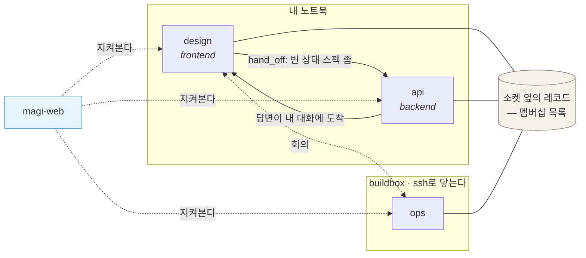
```mermaid
flowchart LR
    subgraph mac [내 노트북]
        DS["design<br/><i>frontend</i>"]
        AP["api<br/><i>backend</i>"]
    end
    subgraph box [buildbox · ssh로 닿는다]
        OP["ops"]
    end
    DS -- "hand_off: 빈 상태 스펙 좀" --> AP
    AP -- "답변이 내 대화에 도착" --> DS
    DS <-. 회의 .-> OP
    DS & AP & OP --- REC[("소켓 옆의 레코드<br/>— 멤버십 목록")]
    CON[magi-web] -.지켜본다.-> DS & AP & OP

    style REC fill:#f5f2ec,stroke:#8a8178
    style CON fill:#e8f4ff,stroke:#2c7fb8
```

읽는 순서는 이렇습니다: **13.1**이 워크스페이스에 이름을 주고, **13.2**가 서로를 보는 방법, **13.3**이
일이 건너가는 방법, **13.8**이 상대가 다른 머신에 있을 때 무엇이 달라지는지. 나머지는 필요할 때
돌아와 보면 되는 세부입니다.

### 13.1 자기가 누구인지 선언합니다

워크스페이스의 `.magi/config.toml`에:

```toml
[companion]
name = "design"                              # 남들이 부르는 이름
role = "디자인 시스템: 컴포넌트 스펙과 리뷰"   # 한 줄: 무엇을 위한 것인가
team = "frontend"                            # 선택: 관련된 일을 하는 컴패니언들
hub  = false                                 # 선택: 주장이 아니라 선호 (13.7)
mcp_peers = false                            # 선택: 청취 채널 (13.5)
```

데몬 레코드에 실려서 `magi --agents`·콘솔·툴이 전부 한 출처를 읽습니다. 아무것도 선언하지 않은
컴패니언은 예전의 컴패니언 그대로 — 그냥 워크스페이스입니다.

### 13.2 서로를 봅니다

`companions`는 읽기 전용이고 각자의 이름·역할·팀·상태·사람에게 막혔는지, 그리고 **그 워크스페이스가
무엇을 배웠는지**(자기 경험 층에서 최대 3개, 많이 관측된 순)를 줍니다. `matching`으로 좁힐 수 있고,
좁힌 답은 **몇 개를 뺐는지 항상 말한다** — 안 그러면 그게 팀 전부로 읽힙니다.

> 마지막 항목이 전문가를 만듭니다. 디자인 일을 계속 받는 쪽에 디자인 교훈이 쌓이고, 고르는 쪽이 그
> 기록을 보고 또 고릅니다. **magi는 순위를 매기지 않는다** — 증거를 보여주고 고르는 건 호출자입니다.

`companion_can`은 그중 하나에게 실제로 뭘 할 수 있는지 묻고, 답은 **그 컴패니언**이 합니다: 역할,
스킬, 닿을 수 있는 MCP 서버. 그래서 안 돌고 있는 컴패니언은 설명할 수 없습니다 — 어차피 일을 맡길 수도
없으니 그게 맞는 방향입니다.

### 13.3 조각을 넘긴다 — `hand_off`

```
hand_off(to, request, so_that, answer_as, looking?)
```

**즉시 영수증을 들고 돌아옵니다.** 요청자는 계속 일하고, 상대가 끝내면 그 답이 요청자의 대화에 도착해
거기서 합쳐집니다. 기다리지 않고, 두 번 묻지 않습니다.

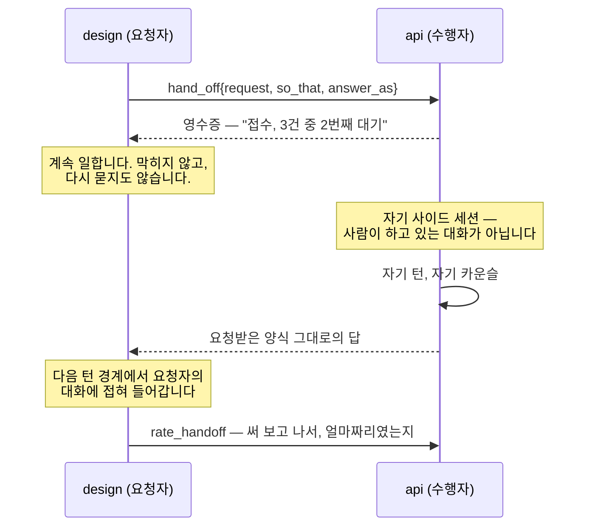
```mermaid
sequenceDiagram
    participant A as design (요청자)
    participant B as api (수행자)
    A->>B: hand_off{request, so_that, answer_as}
    B-->>A: 영수증 — "접수, 3건 중 2번째 대기"
    Note over A: 계속 일합니다. 막히지 않고,<br/>다시 묻지도 않습니다.
    Note over B: 자기 사이드 세션 —<br/>사람이 하고 있는 대화가 아닙니다
    B->>B: 자기 턴, 자기 카운슬
    B-->>A: 요청받은 양식 그대로의 답
    Note over A: 다음 턴 경계에서 요청자의<br/>대화에 접혀 들어갑니다
    A->>B: rate_handoff — 써 보고 나서, 얼마짜리였는지
```

다이어그램에 **없는** 것을 보십시오. `api`가 이것을 제3의 컴패니언에게 넘기는 길, 그리고 `design`이 같은
교환 안에서 추가 질문을 하는 길. 둘 다 없습니다. 첫째가 모든 작업 조각의 주인을 정확히 하나로 유지하는
것이고, 둘째가 `so_that`이 필수 필드인 이유입니다 — 일하는 중인 둘이 실제로 대화할 수 있는 통로는
§13.5입니다.

넷 다 필수이고, 뒤의 둘이 차이를 만듭니다:

| 필드 | 무엇을 위한 것인가 |
|---|---|
| `to` | 툴 설명에 실린 명단에서 고른 이름 — 그 명단은 매 스텝 다시 만들어져 **지금** 돌고 있는 이들을 부릅니다 |
| `request` | 혼자 서는 지시 전체. 상대는 당신의 대화도, 파일도, 추론도 못 봅니다 |
| `so_that` | 그 답이 무엇에 쓰이는지, 한 절. 예상 못 한 것을 만났을 때 스스로 조정하게 해 주는 게 이것이고 — **되물을 수가 없다**. 이 비대칭이 이 필드의 값어치입니다 |
| `answer_as` | 답이 돌아올 **양식**: 당신이 읽을 순서대로 쓴 칸 이름들. 상대가 채웁니다 |
| `looking` | 선택. **무엇이 아니라 언제**를 바꿉니다. `true`는 "이건 그쪽 워크스페이스에 대한 질문이고 아무것도 바뀌지 않아야 한다"는 뜻 |

**돌아온 것은 옮겨 적는 게 아니라 그대로 인용합니다.** 답은 요청자의 대화에 도착할 때 원래 요청, 요구한
양식, 그리고 지시 하나를 달고 옵니다 — **있는 그대로 인용하라.** 요청자는 그 답이 나온 워크스페이스를 볼
수 없으므로 어느 세부가 하중을 지는지 알 수 없고 — 버전 하나, 경로 하나, 플래그 하나, 못 알아본 에러
문자열 하나 — 요약은 정확히 그것들을 떨굽니다. 줄이려면 **통째로 빼고 뺐다고 말하는 것**은 되고, 남긴
것을 고쳐 쓰는 것은 안 됩니다. 노트에는 답의 **다이제스트**가 실려서, 원본을 갖고 있지 않은 사람도
나중의 인용을 대조할 수 있습니다 — 트랜스크립트를 읽는 사람, 기록을 읽는 카운슬, 그 핸드오프를 평가하는
쪽. 봉인이 아니라 영수증입니다(답을 고쳐 쓸 수 있는 것은 그 옆 줄도 고쳐 쓸 수 있으니까요). 하는 일은
고쳐 쓴 것을 **보이게** 만드는 것입니다.

`answer_as`는 완료 조건 문장이 아니라 양식입니다. "토큰 이름이 다 적히면 완료"는 나중에 꼼꼼히 읽어야
확인되지만, 양식은 **보면** 확인됩니다. 못 한 부분의 모양도 바뀝니다 — 못 한 부분이 **그 칸으로**, 그렇게
적혀서 옵니다. 전체가 왜 어려웠는지에 대한 문단이 아니라. magi는 한 단어짜리 양식을 거절하고(실측:
모델이 `"text"` 한 단어로 채웠습니다) 거기서 멈춥니다. 양식이 *좋은지*는 그 작업에 대한 판단이기 때문입니다.

**묻는 것과 일을 맡기는 것은 다릅니다.** 컴패니언은 넘겨받은 일을 한 번에 하나씩 하고, 쓸 수 있는
일이라면 워크스페이스가 빌 때까지 기다립니다 — 한 트리에서 두 턴은 같은 파일을 고치는 두 에이전트입니다.
`looking`으로 표시된 요청은 그 규칙의 대상이 아니다: 수신자가 읽기 전용 네 툴로 고정된 대화에서 돌리므로
충돌할 것이 없고, **그 컴패니언이 다른 일로 바쁜 동안에** 답합니다. 일을 맡기는 게 아니라 묻는 것이면
켜라 — 지금 오는 답과 그쪽 턴이 끝난 뒤 오는 답의 차입니다.

선언은 요청자가 하고 **강제는 수신자가** 합니다. 세션이 read·glob·grep·list 허용목록을 가진 역할로 열리고,
그 검사는 다른 모든 허용목록과 같은 자리에서 이루어진다 — 그래서 이 플래그는 문구로 거짓이 될 수 없고,
변경이 필요한 질문은 변경을 하는 대신 그렇게 말하며 돌아옵니다.

**연쇄 금지.** 넘겨받은 일은 다시 넘길 수 없습니다. 규칙은 트랜스크립트에 남은 라벨에서 읽으므로 재시작·
다른 데서의 어태치·재개된 세션을 견딥니다.

### 13.4 돌아온 것, 그리고 그 값어치

답은 요청했던 양식과 그것을 지목하는 영수증과 함께 인용되어 도착합니다 — 한 컴패니언에게 두 조각을
줄 수 있고, 두 답을 구별하는 유일한 수단이 어느 요청에 대한 답인가이기 때문입니다.

그 뒤 요청자에게 `rate_handoff(who, verdict, why, asked)`를 묻고, `<워크스페이스>/.magi/handoffs.jsonl`에
덧붙습니다. **점수가 아니라 기록이다**: 무엇도 이걸로 정렬·필터·순위를 매기지 않습니다. 다음 `hand_off`
설명에 그냥 분모 표시("3건 중 2건 유용")로, 이름순으로, **후보가 둘 이상일 때만** 실립니다 — 하나뿐이면
고를 게 없고 매 프롬프트의 순수 무게입니다.

### 13.5 청취 채널 — 둘 다 일하는 중에 말 걸기

`hand_off`는 조각을 줍니다. 청취 채널은 이미 둘 다 일하는 중에 오가는 대화를 위한 것입니다: 계속하려면
답이 필요한 질문, 혹은 상대가 물은 것에 대한 답.

`mcp_peers = true`로 두면 여기서 돌고 있는 컴패니언이 전부 MCP 서버로 붙고, 각자 이름이 붙은 툴이
하나씩 생깁니다: `ask`. **수신자가 툴 이름이다** — 일부러 그렇습니다. 필드에 담긴 이름은 모델이 지어낼 수
있는 이름이고, 이 트리에는 정확히 그 실패 기록이 있다("ssh"라는 존재하지 않는 컴패니언에게 보낸 요청).

기본은 꺼짐이고 그건 실수가 아니다: 피어당 툴 둘이 매 프롬프트의 툴 목록에 들어가고, 피어당 서브
프로세스가 데몬 수명 내내 떠 있습니다. 붙고 떨어지는 건 **턴 경계**에서만 일어납니다 — 툴 집합이 바뀔 수
있는 유일한 순간 — 그래서 늦게 뜬 컴패니언은 다음 재시작이 아니라 다음 턴에 들립니다.

### 13.6 한 번에 하나, 큐, 그리고 얼마나 바쁜지

컴패니언의 **대화는 격리되지만 일은 아니다**. 요청자마다 곁세션이 따로 생겨서 남의 요청이 사람이
하고 있는 대화에 끼지 않고 두 요청자가 이력을 공유하지도 않습니다 — 하지만 한 워크스페이스에서 도는
턴은 사람 것까지 포함해 언제나 하나입니다. 한 트리에서 두 턴은 조율 없이 같은 파일을 고치는 두 에이전트입니다.

그래서 바쁜 컴패니언은 거절이 아니라 **큐에 쌓습니다**. 일은 즉시 접수되고(영수증이 그래서 있습니다),
시작 전에 물어보면 그렇게 답합니다 — "아직 시작 안 함, 3개 중 2번째 대기". 큐는 넷까지. 그 뒤로는
다른 데 물어보라는 문장과 함께 거절합니다. 그보다 긴 큐는 나중에 오는 답이 아니기 때문입니다.

```
   한 워크스페이스 ──────────────────────────────────────────────────────────
                   ┌────────────┐
   사람        ───▶│            │   이 중 **하나만** 돕니다
   design      ───▶│    큐      │   ── 사람의 턴까지 포함해서
   ops         ───▶│  (넷까지)  │
   크론        ───▶│            │──▶ [ 도는 턴 ]──▶ 물어본 쪽에게 답
                   └────────────┘
                         │
                 다섯째  ▼
                 거절 — 다른 데 물어보라는 문장과 함께.
                 넷보다 긴 큐는 "나중에 오는 답"이 아니니까
```

발행 레코드에 숫자 둘이 실려 함께 이동하므로, 고르는 쪽이 각자가 얼마나 바쁜지 볼 수 있습니다:

```
worker (짧은 파일을 씀) · can: 3 · 1 in hand, 2 waiting
```

둘 다 옆의 상태에서 유도할 수 없습니다: **상태는 사람이 어태치한 세션에서 읽고**, 넘겨받은 일은 자기
대화에서 돕니다 — 그래서 세 사람의 요청으로 바쁜 컴패니언이 `idle`로 읽히는 것이 맞고, 그렇지 않다고
말해 주는 게 이 숫자들입니다. 사이팅에서 읽으면 그 사이팅만큼 오래됐습니다. 권위는 여전히 거절이고, 그건
낡지 않습니다.

**그리고 남습니다.** 도착은 전부 `<소켓>.load`에 적힌다 — 접수(앞에 몇 개 있었는지 포함)인지, 자리가
없어 돌려보냈는지. `magi --agents`가 최근 일주일을 표 아래에 합산합니다:

```
Handed-over work over the last 7 days:
  worker  31 taken, up to 4 already waiting, 12 turned away
  Turned away means the queue was full when somebody asked. Repeatedly, and one copy of
  that companion is not enough for what is being asked of it.
```

적어 두는 이유가 그것입니다: 지금 얼마나 바쁜지는 **한 순간**이고, 하나로 충분한지는 **패턴**입니다.
파일은 한 달 뒤 감쇠하고, 데몬이 멈춰도 **지우지 않는다** — 과부하였는지 묻는 건 컴패니언이 죽고
난 다음 주입니다. 위의 위임 기록과 일부러 같이 두지 않았습니다: 판정은 컴패니언의 일에 대한 판단이라
저장소에 속하고, 이건 운영값이라 소켓 옆에 속합니다.

### 13.7 팀과 허브

`team`은 관련된 일을 하는 컴패니언을 묶습니다. 팀을 부르면 **가장 짐이 가벼운 멤버**에게 가고, 동점은
선출된 허브가 가른다 — 그래서 놀고 있는 팀은 안정된 주소 하나를 갖고, 바쁜 팀은 분산됩니다. 예전엔
항상 허브로 갔고, 그래서 **셋짜리 팀이 큐 하나처럼 동작했다**: 넘겨받은 일은 아무도 다시 넘길 수
없으므로(13.3) 전부 선출된 하나 뒤에 쌓였습니다. 두 번째 카피를 띄운 사람이 사려던 것의 정반대입니다.

허브는 **선언이 아니라 선출**됩니다. `hub = true`는 선호입니다. 실제로 거기 있는 컴패니언 중 가장 많이 할
수 있는 쪽이 팀을 대표하고, 동점은 결정적으로 갈라서 모든 머신이 같은 하나를 뽑습니다. 멤버가 전부
조용해진 팀은 아무도 뽑지 않고 그룹으로 주소가 되지 않습니다 — 멤버 전원으로 풀리고, 호출자에게
고르라고 합니다.

`to` 필드에 담긴 말이, 사람이 쳤든 모델이 썼든 거치는 길:

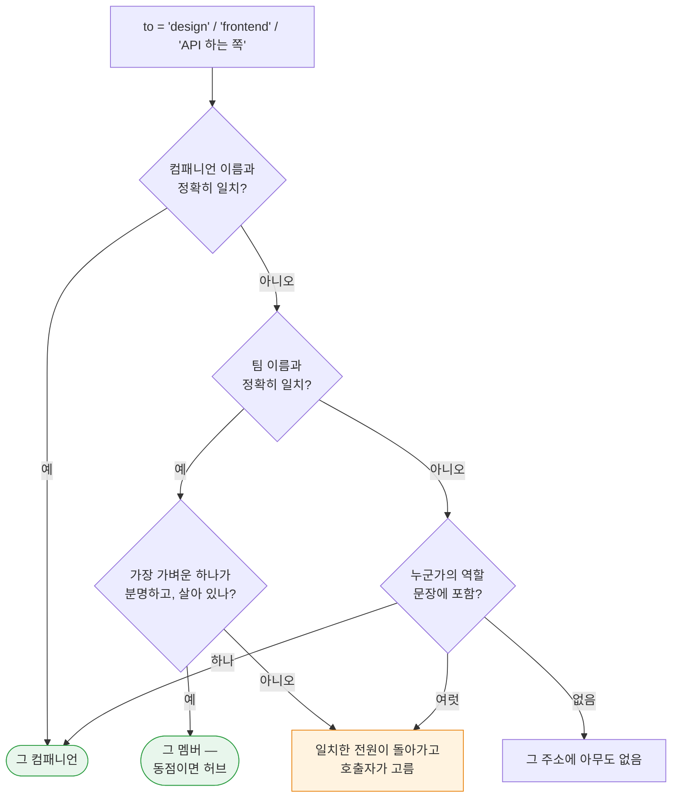
```mermaid
flowchart TD
    A["to = 'design' / 'frontend' / 'API 하는 쪽'"] --> N{"컴패니언 이름과<br/>정확히 일치?"}
    N -->|예| ONE([그 컴패니언])
    N -->|아니오| T{"팀 이름과<br/>정확히 일치?"}
    T -->|예| Q{"가장 가벼운 하나가<br/>분명하고, 살아 있나?"}
    Q -->|예| L(["그 멤버 —<br/>동점이면 허브"])
    Q -->|아니오| ASK["일치한 전원이 돌아가고<br/>호출자가 고름"]
    T -->|아니오| R{"누군가의 역할<br/>문장에 포함?"}
    R -->|하나| ONE
    R -->|여럿| ASK
    R -->|없음| NONE["그 주소에 아무도 없음"]

    style ONE fill:#e8f6ec,stroke:#2f9e44
    style L fill:#e8f6ec,stroke:#2f9e44
    style ASK fill:#fff3e0,stroke:#e8820c
```

이 모양에서 둘은 일부러 그렇습니다. 고른 이름이 역할을 이깁니다 — 이름은 이 컴패니언 하나를 부르려고
지은 것이고, 역할은 여럿을 설명할 수 있는 문장이기 때문입니다. 그리고 모호한 주소를 순위 매겨 승자를
만들지 않습니다. 일치한 전부가 호출자에게 돌아가 고르게 하는데, 잘못 찍은 값이 남의 워크스페이스에서
도는 턴이기 때문입니다. 콘솔의 `POST /dispatch`도 같은 해석기를 부르므로, 페이지에 친 일과 다른
컴패니언이 넘긴 일이 정확히 한 경로로 도착합니다.

### 13.8 머신을 건너

다른 머신의 컴패니언은 **ssh**로 닿고, 건너가는 것은 데몬 자신의 프로토콜뿐입니다:

```sh
ssh buildbox magi --relay /path/to/their/daemon-....sock
```

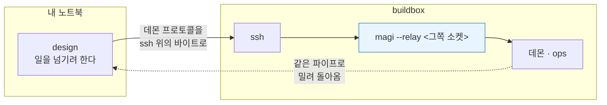
```mermaid
flowchart LR
    subgraph here [내 노트북]
        A["design<br/>일을 넘기려 한다"]
    end
    subgraph there [buildbox]
        S["ssh"] --> RL["magi --relay &lt;그쪽 소켓&gt;"] --> D["데몬 · ops"]
    end
    A -->|"데몬 프로토콜을<br/>ssh 위의 바이트로"| S
    D -.->|"같은 파이프로<br/>밀려 돌아옴"| A

    style RL fill:#e8f4ff,stroke:#2c7fb8
```

`--relay`가 일부러 멍청한 바이트 파이프라는 점이 눈여겨볼 설계 판단입니다. 일을 맡기는 것, 어떻게 됐는지
묻는 것, 무엇을 할 수 있는지 묻는 것이 **하나의 프로토콜의 세 메서드**이지, 돌고 있는 데몬이 이미 아는
것을 저마다 다시 유도하는 세 개의 서브커맨드가 아닙니다.

이걸 사람이 치지는 않습니다. 부르려는 컴패니언이 여기 없을 때 magi가 칩니다(실제 크로싱은 좁힌
`--fleet-door`를 지납니다 — §3). 파이프는 stdin/stdout을 그 소켓에 잇고, 그래서 무엇인지 묻는 것,
일을 맡기는 것, 어떻게 됐는지 묻는 것, 어떻게 되어 가는지 지켜보는 것이 네 개의 서브커맨드가
아니라 한 프로토콜의 네 **메서드**다 — 서브커맨드였다면 새 프로세스가 데몬이 이미 아는 것을
파일에서 다시 유도했을 것입니다. 답은 폴링이 아니라 같은 파이프로 **푸시**됩니다: `watch`가 그
스트리밍 메서드이고, 먼 데몬이 변화를 일어난 순간에 밀어 내려보냅니다.

**ssh 없이 TLS로도** 같은 도어가 열립니다. magi마다 키 쌍과 자체 서명 인증서를 한 번 만들어
보관하고, `magi --whoami`가 그 지문을 찍습니다. 그 지문을 ssh 호스트 키를 나르듯 — 신뢰하는 통로로 —
상대 머신에 가져가 admit합니다:

```
magi --whoami                                   # 닿을 대상 머신에서
magi --admit SHA256:… --as buildbox --at build.local:7777   # 손을 뻗는 머신에서
magi --fleet-listen :7777                       # 닿을 대상 머신에서
```

양쪽이 검사하는 것은 같습니다. 도착한 공개키를 admit된 지문 목록과 대조하는 것. **인증 기관은
없습니다** — 인증서는 봉투이고 키가 신원이라, 인증서를 갱신해도 아무것도 달라지지 않습니다. 아무도
admit하지 않은 쪽은 **TLS 핸드셰이크에서 실패**하므로 아무것도 알아내지 못합니다. 경로도, 버전도,
컴패니언 목록도. 취소는 `magi --refuse SHA256:…`이고 다음 연결부터 적용됩니다.

admit된 줄에 주소가 있는 머신은 TLS로, 없는 머신은 ssh로 닿습니다. 도어는 어느 쪽이든 같습니다.

**또는 한 줄씩으로 프로비저닝합니다.** 지문을 손으로 나르는 것은 머신 둘에 걸친 네 단계이고, 사람들이
건너뛰는 것은 마지막 단계입니다:

```
magi --invite laptop --at build.local:7777     # 닿을 대상 머신에서
  laptop에서 실행하라고 나오는 것:
    magi --fleet-join build.local:7777 --token <secret> --pin SHA256:…
```

`--join`이 아니라 `--fleet-join`입니다. 짧은 이름은 컴패니언이 팀과 공유하는 프로젝트 설정을 읽는
쪽(아래)의 것이고, 거기에 host:port를 주면 그 이름의 컴패니언을 찾으러 갑니다.

저쪽 기계에 아무것도 만들지 않습니다. 초대장을 하나 찍고 거기 있는 사람이 칠 한 줄을 출력할 뿐이며,
그 사람의 magi는 그 사람의 권한으로 뜹니다 — 이 명령의 세부가 아니라 플릿 전체의 모양입니다.

초대는 **15분** 동안 유효하고 먼저 쓰는 머신 하나가 소진합니다. 그 한 번의 교환으로 양쪽이 서로의 키를
기록합니다. 합류하는 머신의 키는 그쪽이 타이핑한 무엇이 아니라 **제시한 인증서에서** 가져오므로 남의
것을 주장할 수 없고, `--pin` 덕분에 시크릿은 그것을 발행한 머신에게만 전송됩니다. 초대가 열려 있는
동안 도어는 모르는 인증서를 `/fleet/join`까지만 받아들이고 그 외에는 아무것도 열지 않습니다. 열린 초대가
없으면 낯선 쪽의 핸드셰이크는 그냥 실패합니다.

그리고 **서로의 키를 쥔 머신들은 팀이 배운 것을 나눈다**: TLS 도어의 머신 수준 메서드
`exp-sync`가, 양쪽 모두에 발자국이 있는 팀마다 팀 저장소의 불변 파일들 — 위키 리비전과 메모리 —
을 **집합 합집합**으로 교환한다(기동 시 + 느린 주기). 파일이 내용주소라 덮어쓰기는 없고, 삭제는
와이어에 존재하지 않습니다 — 은퇴한 위키 페이지는 stale 리비전이고, 그것 자체가 복제되는 파일입니다.
한 머신에서 쓴 페이지는 몇 분 안에 다른 머신의 `recall_memory`에 나타나며, 운영할 공유 git
remote가 필요 없습니다. 그 팀의 컴패니언이 없는 머신은 팀 이름을 대며 거부합니다.

여기인지 저기인지는 호스트명 비교가 아니라 **소켓 옆에 발행된 레코드**로 정합니다: 설정 디렉터리는
공유될 수 있고(마운트를 공유하는 컨테이너 둘, 네트워크 홈을 쓰는 워크스테이션 둘), 다른 머신을
가리키는 레코드는 남의 경로다 — 그걸 열면 실패가 아니라 **엉뚱한 워크스페이스**가 열리고 일은 배달된
것처럼 보입니다.

**클러스터 합류:**

```sh
magi --join-cluster buildbox      # 그 머신과 멤버 목록을 ssh로 교환
```

한 번의 교환이 전송이자 합류 전부입니다: 이쪽이 아는 것을 보내고, 저쪽이 병합해서 자기가 아는 것으로
답하고, 둘 다 결과를 씁니다. 그 뒤로는 데몬들이 알아서 갱신합니다 — 매 분(지터를 줘서) 각자 호스트 둘을
골라 다시 교환하므로, 세 번째 머신 얘기가 아무도 두 번 말하지 않아도 첫 번째에게 닿습니다.

쓰이는 파일은 `<config>/cluster.json`이고, **감쇠한다**: **5분** 동안 아무도 못 본 컴패니언은 보이되
일을 받지 않고, **1시간** 동안 못 본 컴패니언은 지워집니다. 그래서 설정이 아니라 런타임 파일입니다 —
설정은 저절로 낡지 않습니다. 이 머신 자신의 컴패니언은 절대 여기 쓰이지 않습니다: 매번 발행 레코드에서
읽고, 사본은 데몬이 멈추는 순간 낡는 두 번째 답일 뿐입니다.

필요한 것: 키 인증이 되는 `ssh`(magi는 `BatchMode=yes`로 부른다 — 물어보지 않습니다), 그리고 원격
`PATH`에 있는 `magi`. 원격 바이너리는 이 머신의 경로가 아니라 그냥 이름으로 부릅니다.

### 13.9 클러스터, 처음부터 끝까지

머신 둘, 컴패니언 셋. `mac`이 디자인, `buildbox`가 빌더와 리뷰어.

**워크스페이스마다 자기가 누구인지:**

```toml
# mac:~/work/design/.magi/config.toml
[companion]
name = "design"
role = "디자인 시스템: 컴포넌트 스펙·토큰·리뷰"
team = "frontend"
```

```toml
# buildbox:~/work/api/.magi/config.toml
[companion]
name = "api"
role = "Go 서비스: 핸들러·저장소·테스트"
team = "backend"
hub  = true
```

**각각 데몬을 띄운다**(워크스페이스당 하나 — 소켓 이름이 워크스페이스 실제 경로에서 나오므로 관례가
아니라 락으로 강제됩니다):

```sh
cd ~/work/design && magi --daemon &
```

**한 번, 어느 쪽에서든 합류:**

```sh
mac$ magi --join-cluster buildbox
```

**각 머신이 무엇을 믿는지 확인:**

```sh
$ magi --agents
STATE  AGENT                                       IDLE  STEPS  WORKSPACE
idle   design  — 디자인 시스템: …                   12s   -      /Users/me/work/design
idle   api *  — Go 서비스: …               [backend*]  4s   -    /home/me/work/api
```

여기서부터는 모델이 합니다: `hand_off` 설명에 누가 있는지, 각자 어느 호스트에 있고 무엇을 할 수 있고
지금 무엇을 지고 있는지가 이미 실려 있습니다. 더 설정할 것은 없습니다.

**보기:** `magi-web`은 그 머신의 컴패니언을 보여주고, `-peer`로 다른 콘솔의 행을 같은 표에 넣는다(§12.1).

**하나가 계속 거절하면** 카피를 하나 더 띄운다 — 같은 `team`을 가진 두 번째 워크스페이스 — 그러면 팀
주소가 둘 사이로 일을 퍼뜨리기 시작한다(13.7). 그렇게 할 근거는 `magi --agents`에 있다(13.6).

### 13.10 "합류"라는 말을 쓰는 다른 것 둘

`magi --join <name>`은 `--join-cluster`가 **아니다**. 한 컴패니언의 프로젝트 설정을 읽어
`.magi/joined-<name>.toml`을 내 것 옆에 씁니다 — **적용되지 않는 제안서**다. 담기는 것: 그들의 팀,
`experience_dir`(신참이 뭔가를 알고 시작하게 만드는 그 한 줄), 쓰는 MCP 서버, `AGENTS.md` 포인터.
담기지 않는 것: 모델·권한 자세·샌드박스 — 그건 팀이 아니라 그 워크스페이스의 선택입니다.

내용은 전부 주석 처리돼 있고, 일부러 그렇습니다. `[mcp]` 항목은 **이 프로세스가 실행할 명령과 인자**이고
훅은 셸 한 줄입니다. "합류한 컴패니언이 그러라고 했다"는 문장이 사고 보고서에 있어선 안 됩니다. 환경변수는
이름만 적히고 값은 절대 안 적힌다 — 두 번째 워크스페이스에 복사된 토큰은 두 곳에 있는 토큰입니다.

`POST /dispatch`는 `to=`(이름·역할의 단어들·팀)를 받아 같은 규칙으로, 그 컴패니언 페이지에 사람이
타이핑한 것과 같은 경로로 해소합니다 — 둘이 정확히 한 경로로 데몬에 닿습니다. 둘이 매칭되면 선택이 아니라
에러입니다.

### 13.11 일부러 하지 않는 것

- **스케줄러.** 무엇도 함대를 밸런싱하거나 누가 무엇을 해야 하는지 정하지 않습니다. 모델이 누가 있고
  각자 뭘 할 수 있고 얼마나 실렸는지 적힌 목록에서 고르고, 모든 거절은 행동으로 옮길 수 있는 문장입니다.
- **메시지 버스.** 띄워 둘 브로커도, 살려 둘 것도, 데몬보다 오래 사는 상태도 없습니다. 전부 끄면 클러스터는
  한 시간 안에 만료되는 파일 몇 개입니다.
- **인증.** 유닉스 소켓은 소유자 전용이고, 머신을 건널 때의 경계는 ssh다 — 그 호스트에 그 사용자로
  `ssh`할 수 있는 사람은 이미 magi가 할 수 있는 모든 것을 할 수 있습니다.
- **합의(consensus).** 멤버십은 가십이고 감쇠합니다. 두 머신이 세 번째에 대해 잠시 다를 수 있습니다. 아래의
  모든 것은 사이팅을 참고로, 거절을 권위로 취급하도록 쓰여 있습니다.

### 13.12 무엇이 암호화되고 무엇이 아닌가

"에이전트끼리 통신"이라고 하면 네트워크 프로토콜처럼 들리는데 그렇지 않으므로, 분명히 적어 둡니다.

| 경로 | 전송 | 암호화 |
|---|---|---|
| 컴패니언 → 컴패니언, 같은 머신 | 유닉스 도메인 소켓, `0600` | **아니오. 그리고 커널 밖으로 나가지 않습니다.** 파일이 소유자 전용이라 누가 데몬에게 말할 수 있는지는 연결 시점에 OS가 답합니다 |
| 컴패니언 → 컴패니언, 머신 간 | `ssh <host> magi --relay <socket>` | **예 — ssh.** magi는 머신 간에 자기 포트를 열지 않고 선 위에서 자기 프로토콜을 말하지 않습니다 |
| 가십(`--join-cluster`, 1분 루프) | `ssh <host> magi --members` | **예 — ssh**, 같은 방식 |
| 청취 채널(`mcp_peers`) | 로컬 서브프로세스 stdio | **아니오. 그리고 머신 밖으로 나가지 않는다** |
| 사람 → 콘솔 | 루프백 평문 HTTP | **아니오.** 자기 터널이나 프록시 뒤에 두라 — 그게 문서화된 접근 방법이다(§12.1) |
| 콘솔 → 콘솔(`-peer`) | 준 URL로 평문 HTTP | **`https://`나 터널을 준 경우에만.** 이것이 유일하게 평문으로 네트워크를 건널 수 있는 홉이고, 트랜스크립트를 실어 나릅니다 |

즉 magi는 **자기 키도 자기 인증서도 없다**. 일부러 그렇습니다: 머신을 건널 때의 보안 경계는 ssh이고, 그
호스트에 그 사용자로 `ssh`할 수 있는 사람은 이미 거기서 magi가 할 수 있는 모든 것을 할 수 있습니다. 그
옆에 두 번째 자격증명 체계를 두면 교체하고, 유출되고, 틀릴 것이 하나 더 늘 뿐 — 첫 번째를 가진
공격자가 할 수 있는 일을 좁히지는 못합니다.

조심할 곳은 `-peer` 하나입니다: ssh가 아닌 유일한 magi-대-magi 링크이고, 에이전트끼리가 아니라
콘솔끼리이며, 사람이 읽는 것을 실어 나릅니다. 루프백이 아닌 곳에는 터널이나 `https://` URL을 주라.

## 14. 무인 작업 (`schedule`, `[cron]`)

이미 상주 중인 데몬은 타이머로 일할 수 있습니다. 작업은 설정에 살고, 이름으로 편집할 수 있도록 명명
테이블입니다:

```toml
[cron.nightly-audit]
schedule = "0 3 * * *"        # 5필드, 로컬 시각; 또는 @hourly @daily @weekly @monthly
prompt   = "어제 커밋을 훑고 회귀 위험으로 보이는 것을 보고해."
enabled  = true               # 선택; 없으면 켜짐
```

- **데몬 전용.** 대화형 `magi`는 아무것도 스케줄하지 않습니다 — 안 그러면 한 저장소에 열린 터미널마다
  같은 작업이 발화합니다.
- **발화 1회 = 새 세션 1개.** 살아있는 대화에 끼워 넣는 게 아니라 새 대화로 제출되고, `/resume`과
  콘솔 히스토리에 다른 것과 똑같이 뜹니다.
- **밀린 것을 몰아 돌리지 않습니다.** 정오에 뜬 데몬은 새벽 3시 작업을 발화하지 않습니다. 일주일 자리를
  비웠다고 폭풍이 불면 안 됩니다.
- **자기 자신과 겹치지 않습니다.** 이전 실행이 안 끝난 발화는 사유를 기록하고 건너뜁니다.
- **로컬 시각**이고, 서머타임의 결과를 그대로 집니다: 반복되는 시각은 두 번 발화할 수 있고 건너뛴 시각은
  발화하지 않습니다. 안 그런 척하지 않고 적어 둡니다.
- 설정은 매 틱 다시 읽으므로 파일 수정이 재시작 없이 반영됩니다.

위의 다섯 규칙은 그림으로 쥐고 있는 편이 쉽습니다. 틱은 발화하거나 안 하거나 둘 중 하나이고, 안 하는
경우는 전부 일부러 그런 것입니다:

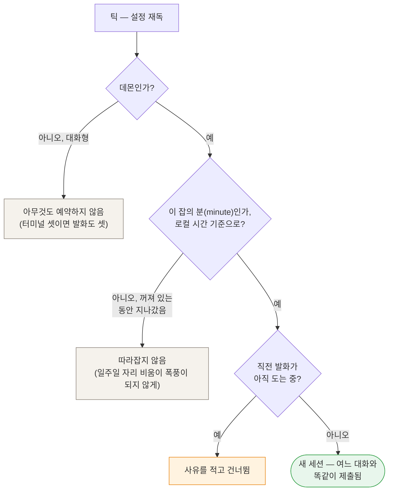
```mermaid
flowchart TD
    TK["틱 — 설정 재독"] --> D{"데몬인가?"}
    D -->|"아니오, 대화형"| SKIP1["아무것도 예약하지 않음<br/>(터미널 셋이면 발화도 셋)"]
    D -->|예| M{"이 잡의 분(minute)인가,<br/>로컬 시간 기준으로?"}
    M -->|"아니오, 꺼져 있는<br/>동안 지나갔음"| SKIP2["따라잡지 않음<br/>(일주일 자리 비움이 폭풍이 되지 않게)"]
    M -->|예| P{"직전 발화가<br/>아직 도는 중?"}
    P -->|예| SKIP3["사유를 적고 건너뜀"]
    P -->|아니오| RUN(["새 세션 — 여느 대화와<br/>똑같이 제출됨"])

    style RUN fill:#e8f6ec,stroke:#2f9e44
    style SKIP1 fill:#f5f2ec,stroke:#8a8178
    style SKIP2 fill:#f5f2ec,stroke:#8a8178
    style SKIP3 fill:#fff3e0,stroke:#e8820c
```

에이전트는 `schedule` 툴로 자기 일정을 보고 바꿀 수 있고, TUI에는 `/cron`이 있고, 콘솔은 컴패니언
상세에 같은 작업을 보여준다(§12.3).

## 15. 상태 & 범위

**루프 엔지니어링 트랙은 계획이 아니라 출하됐다** — 이 툴의 시그니처이며 이 매뉴얼 전반에 기술돼 있습니다: 에이전트가 종료를 선언하는 상대인 **카운슬**(Melchior·Balthasar·Casper, §3·§6), **Loop map**(`/loop`), 라이브 심의 패널, **rewind/fork/세션-diff**(`/rewind`·`/fork`·`/loopdiff`, §4), **재수화 가능 컴팩션**(§4). 마찬가지로 이미 구현됨: **OS 샌드박스**(`--profile`/`sandbox`, §3), **편집 후 LSP 진단**(§5), **웹 검색**(`websearch`), **프롬프트 캐싱**(`cache_control`, 기본 켜짐 + 자동 폴백). 테스트 예시가 있는 기능/마일스톤 스펙은 [`SPEC.md`](SPEC.md), 내부 구조는 [`ARCHITECTURE.md`](ARCHITECTURE.md)에 있습니다.

**진짜로 범위 밖(현재).** magi 자체의 **인증**은 없습니다 — 계정도, 세션도, 로그인도. 콘솔은 루프백에 바인딩하고 조직이 이미 쓰는 수단을 통해 접근합니다. 회사마다 그 답이 다르고, 그들 문 옆의 두 번째 문은 언제나 더 약하기 때문입니다(§12). 인가(authorization)는 다른 질문이고 그것은 있습니다: `auth.toml`이 롤과 각자가 할 수 있는 일을 적고, 신원은 게이트웨이가 세우는 헤더에서 옵니다(§12.1, 그리고 [SECURITY](../SECURITY.ko.md)). 자동 컨텍스트 *랭킹*은 임베딩이 아니라 의도적으로 어휘적/결정론적(BM25-lite, §4)이라 벡터-DB 의존이 없습니다. 이는 채워야 할 갭이 아니라 범위 선택입니다.

> ⚠️ **2026-08-07 정정.** 이 문단은 "웹 UI나 호스티드 원격 공유 없음 — magi는 터미널
> 클라이언트다"라고 적고 있었습니다. `magi-web`(§12)은 데몬이 생긴 이래로 존재했고 머신을 넘어
> 페더레이션합니다. 그 문장에서 실제로 일하던 부분만 여전히 참입니다: magi는 인증도, 멀티테넌트
> 서버도 제공하지 않습니다.

[Ollama]: https://ollama.com
