# magi — User Manual

[English](MANUAL.md) · [한국어](MANUAL.ko.md) · [↑ Docs](README.md)

magi is a terminal coding agent. You give it a task; it reads and edits files and runs commands in
your workspace; a council of three members then decides whether the turn is actually finished. It
speaks to any OpenAI-compatible model backend. It runs as a resident daemon that you attach to and
detach from at will, and you can supervise several at once from a browser console.

This manual is the practical half of the documentation: how to install it, how to run it, every
setting, and what each surface does. Skim it by section. Nobody reads a manual start to finish.

### Where to start

<div align="center">
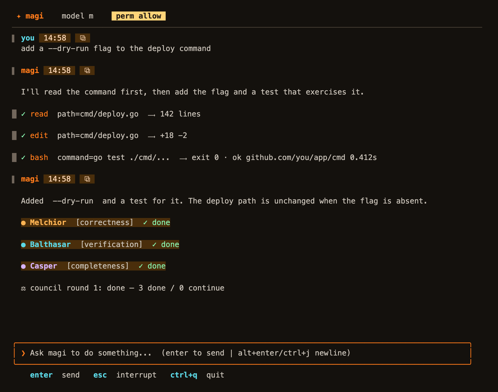
</div>

If you have never run it: do §1 and §2 in order, install and then `./magi`, and stop there until a
turn has finished in front of you. Everything after that is depth you can come back for.

| Section | Answers |
|---|---|
| [1. Installation](#1-installation--requirements) | what magi needs, and how to get a binary |
| [2. Running](#2-running) | the TUI, headless runs for scripts, and leaving a daemon working |
| [3. Configuration](#3-configuration) | every setting, where it lives, and what overrides what |
| [4. Using the TUI](#4-using-the-tui) | slash commands, keys, panes, and what the screen is telling you |
| [5. Tools](#5-tools-built-in) | what the agent can do, and what it deliberately cannot |
| [6. Finishing a turn](#6-finishing-a-turn) | the council, the verify command, and why a turn refuses to end |
| [7. Memory & context](#7-memory--context) | `AGENTS.md`, compaction, and what survives it |
| [8. Skills](#8-skills) · [9. Plugins](#9-plugins-lua) · [10. MCP](#10-mcp) | extending it |
| [11. Model recommendations](#11-model-recommendations) | picking a backend that actually keeps up |
| [12. The console](#12-the-console-magi-web) | the browser view over your running agents |
| [13. Companions & clusters](#13-companions-teams-and-clusters) | naming an agent, handing work over, and crossing machines |
| [14. Unattended work](#14-unattended-work-schedule-cron) | schedules and cron |
| [15. Status & scope](#15-status--scope) | what is finished, and what is deliberately absent |

### The words that are ours

A few of the words below are ordinary ones used in a particular way here, and reading the manual
without them costs you more than reading this section does. Each one exists because something did
not work, so each is given in three parts: **what forced it**, what it is, and what it buys.

<details open>
<summary><b>Companion</b> — one magi, bound to one workspace</summary>

**What forced it.** A workspace can only have one turn running in it, the person's included: two
turns in one tree are two agents editing the same file with no coordination. So the thing you
address cannot be a process (there may be several) or a session (they come and go) — it has to be
*this magi, in this directory*.

**What it is.** One resident magi, bound to one workspace, that has declared a name, a role and
optionally a team in that repo's own `.magi/config.toml`.

**What it buys.** A stable address. Work sent to `design` reaches the same workspace tomorrow;
load, queue depth, permission prompts and version are all counted per companion; and the console's
roster is a list of them rather than a list of processes. §13.1.
</details>

<details open>
<summary><b>The council</b> — Melchior, Balthasar, Casper, and the vote that ends a turn</summary>

**What forced it.** A turn that stopped three-quarters of the way through looks exactly like one
that finished. Both simply stop calling tools. Nothing in the loop could tell them apart, so both
were reported the same way.

**What it is.** Three members, each reading the same turn through a different lens, voting on
whether the record supports the agent's claim to be done. The agent must *declare* completion
(`council{complete: true}`); the members read what magi recorded, not what the agent says about it.

**What it buys.** Ending becomes an act that needs justifying. And because the tally is pure domain
code with no model and no I/O in it, "the council decides, not one model" is a unit test rather
than a sentence in a prompt. §6.
</details>

<details open>
<summary><b>Landing UNVERIFIED</b> — the honest end when the gate cannot be satisfied</summary>

**What forced it.** The gate exists to stop a false "done" — but unbounded, it also stopped a true
"I could not". Measured live: an honest declaration, on a task the run's own permission mode had
made impossible, was rejected for eighteen straight rounds until something outside killed it.

**What it is.** After three consecutive rejections with no file changed between them (or eight in
one turn), the turn lands with the reason on the record.

**What it buys.** The work stands, the agent is asked for its honest final account, and nothing
anywhere pretends the council accepted it. §6.
</details>

<details open>
<summary><b>The fleet</b> — companions that find each other without a registry</summary>

**What forced it.** A registry is a thing that has to be running, that has a port, and that holds a
credential. Every one of those is a way for the fleet to be down while the companions are fine.

**What it is.** Each daemon writes a record beside its own socket. That directory *is* the
membership list; across machines the same records are traded over ssh, and one not seen for an hour
is forgotten.

**What it buys.** magi opens no port of its own and holds no credential of its own. A companion
that dies leaves a stale record that ages out, instead of a registry entry somebody must clean up.
§13.2, §13.8.
</details>

<details open>
<summary><b>Team</b>, and a <b>hub</b> that is elected rather than declared</summary>

**What forced it.** A team address used to always reach the hub. Since handed-over work cannot be
handed on again, everything addressed to a team piled up behind that one companion — a queue of
one, which is the opposite of what starting a second copy is meant to buy.

**What it is.** `team` groups companions doing related work. Addressing the team reaches whichever
member has the least on it; the hub only breaks a tie, and it is elected from who is actually
there — `hub = true` is a preference, not a claim.

**What it buys.** An idle team keeps one stable address; a loaded one spreads. A team stops being
addressable when everybody in it stops, never because a config file went stale. §13.7.
</details>

<details open>
<summary><b><code>hand_off</code></b> — giving a piece of the task to another companion</summary>

**What forced it.** The other companion cannot see your conversation, your files or your reasoning
— **and it cannot ask you**. It is not a colleague at the next desk; it is someone who gets one
message and must act on it.

**What it is.** A call with four required fields. `request` is the whole instruction standing on
its own; `so_that` is what the answer is for, which is what lets them adapt when they hit something
you did not foresee; `answer_as` is the form the answer comes back in — the headings you will read,
in order.

**What it buys.** It returns at once with a receipt, so the asker keeps working. And a form is
checked by looking rather than by reading carefully: a part that could not be done comes back **as
that part**, marked, instead of as a paragraph about why the whole thing was hard. §13.3.
</details>

<details open>
<summary><b>Meeting</b> — several companions on one question</summary>

**What forced it.** Somebody has to say who speaks next, and it cannot be one of the participants:
a companion that also decided the order would be chairing a discussion it is arguing in.

**What it is.** The console puts the same question to several companions and holds the floor. It is
the one party in the room with nothing to say.

**What it buys.** The discussion survives you closing the tab, because it is driven by the console
and not by the page. The record lives in each participant's own session log — a second copy here
would be a second answer to "what was said", and the two would disagree the first time a console
restarted mid-meeting. §12.
</details>

<details open>
<summary><b>The ear</b> (<code>mcp_peers</code>) — being able to ask, not just to send</summary>

**What forced it.** The roster already advertised every companion, so a model could hand work to
one and then have no way to ask it anything. The obvious fix — a manager that keeps peer tools in
step — was refused for a good reason: changing the tool list underneath a running turn means a
model calls something that has just disappeared, and that failure is unreadable afterwards.

**What it is.** Peers are attached and detached **only at turn boundaries**, the one instant
nothing is mid-step.

**What it buys.** A companion that came up late is heard at the next turn rather than the next
restart, and one that stopped is removed — a tool in the list that can only fail is worse than one
that is not there. §13.5.
</details>

<details open>
<summary><b>Re-hydratable compaction</b> — summaries you can undo</summary>

**What forced it.** Every agent summarises old turns when the window fills, and then the detail is
simply gone. What was shed is exactly what you need when the thing you shed it for turns out to
matter.

**What it is.** The compacted region is indexed — deterministically, with no extra model call —
into **topic shards** keyed by the file each turn touched, each carrying its tool-action trail
(`read · edit×2 · bash`). `recall_context("<topic>")` pulls that region's original messages back
verbatim.

**What it buys.** The shed detail stays addressable instead of lost. Recalls are bounded so
re-hydration cannot reopen the window, and matching topics are pushed at the agent as hints so a
model that never thinks to recall still gets pointed at what it lost. §4.
</details>

<details open>
<summary><b>Experience tiers</b> and the <b>shared wiki</b> — memories that can be corrected</summary>

**What forced it.** An append-only memory cannot distinguish what was true then from what is true
now. Both entries sit there, and the older one is just as retrievable.

**What it is.** Three tiers read most-specific-first (workspace, team, global). Beside the
append-only memories the team tier holds **canonical pages**: one current truth per topic, written
and corrected **in place**. A page that stopped being true is marked stale with the reason, never
deleted.

**What it buys.** A correction actually supersedes rather than accumulating, and the tombstone
tells a reader why. §7, EXTENDING §2.
</details>

<details open>
<summary><b>Steering</b> — talking to a turn that is already running</summary>

**What forced it.** Waiting for a turn to end before you can say anything means you spend twenty
minutes going the wrong way and only then get to mention it.

**What it is.** Enter during a run injects the message into the running turn. The agent sees it at
its next step — not queued to surface after the turn ends.

**What it buys.** A redirect that lands mid-work, with a durable "Steer applied …" line in the
transcript so you can see it fired instead of being verbally agreed to and ignored. §4.
</details>

<details open>
<summary><b>Structural outcome</b> — how a turn ended, as data</summary>

**What forced it.** An observer plugin watching turns had to guess success from phrasing, and
phrasing is exactly what a cornered model gets wrong.

**What it is.** Every finished turn carries one of `verified` · `unverified` · `guard` · `error` ·
`ungated` · `done` — the host's own verdict on how it ended, not the agent's account of it.

**What it buys.** A plugin can be right about success without reading English. It is what lets
engram file a failure as a failure, and refuse to record "I fixed it" about a turn a stall guard
stopped. §9.
</details>

---

## 1. Installation & Requirements

Two things: a Go toolchain (or a pre-built binary) and a model backend to talk to. There is no
database and no service to register with. Nothing needs configuring before the first run, either;
the config file gets written for you the first time magi starts.

**A model backend.** Anything that speaks the OpenAI chat-completions protocol works. [Ollama] is
the least trouble. Its free cloud tier runs the default model, `gpt-oss:120b-cloud`, so you need no
GPU and nothing to download beyond Ollama itself.

```sh
ollama signin                 # free tier; the default gpt-oss:120b-cloud runs in Ollama's cloud
```

To keep everything on your own machine, pull a local model and point magi at it:

```sh
ollama pull qwen3-coder:30b
./magi --model qwen3-coder:30b
```

> Choosing a local model is mostly a question of speed, and speed follows the **active** parameter
> count rather than the file size — a mixture-of-experts model with ~3B active outruns a dense 27B
> of the same size several times over. §11 has the details and the numbers.

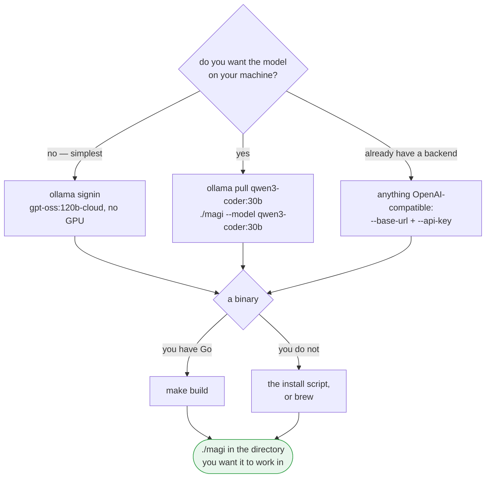
```mermaid
flowchart TD
    Q{"do you want the model<br/>on your machine?"}
    Q -->|"no — simplest"| C["ollama signin<br/>gpt-oss:120b-cloud, no GPU"]
    Q -->|yes| L["ollama pull qwen3-coder:30b<br/>./magi --model qwen3-coder:30b"]
    Q -->|"already have a backend"| O["anything OpenAI-compatible:<br/>--base-url + --api-key"]
    C & L & O --> B{"a binary"}
    B -->|"you have Go"| MK["make build"]
    B -->|"you do not"| DL["the install script,<br/>or brew"]
    MK & DL --> R([./magi in the directory<br/>you want it to work in])

    style R fill:#e8f6ec,stroke:#2f9e44
```

**A binary.** Build it, or take a pre-built one:

```sh
make build                                       # → ./magi   (CGO_ENABLED=0, version injected)
CGO_ENABLED=0 go build -o magi ./cmd/magi        # the same thing by hand

curl -fsSL https://raw.githubusercontent.com/sayaya1090/magi/main/scripts/install.sh | bash
brew install sayaya1090/tap/magi
```

Pure Go with no CGo, so what you get is one static file. Copy it anywhere and run it; there is no
install step beyond having it on your `PATH` if you want it there.

## 2. Running

There are three ways to run magi. They are not alternatives; they are the same engine seen from
different places. Which one you want depends on who is watching:

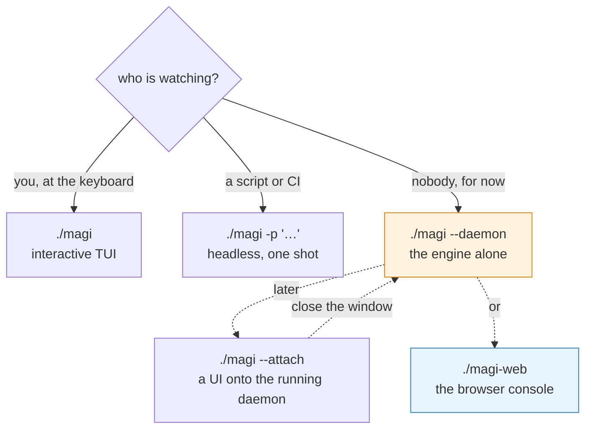
```mermaid
flowchart TD
    Q{who is watching?}
    Q -->|you, at the keyboard| TUI["./magi<br/>interactive TUI"]
    Q -->|a script or CI| HL["./magi -p '…'<br/>headless, one shot"]
    Q -->|nobody, for now| DMN["./magi --daemon<br/>the engine alone"]
    DMN -.->|later| ATT["./magi --attach<br/>a UI onto the running daemon"]
    DMN -.->|or| WEB["./magi-web<br/>the browser console"]
    ATT -.->|close the window| DMN

    style DMN fill:#fff3e0,stroke:#e8820c
    style WEB fill:#e8f4ff,stroke:#2c7fb8
```

Learn the daemon first. A turn can take twenty minutes, and the daemon is what lets that survive
you closing the terminal.

### Interactive TUI

The default. Run it in the directory you want the agent to work in. That directory becomes its
workspace and it will not wander outside.

```sh
./magi                 # auto-detects dark/light
./magi --theme light   # force theme (auto|dark|light)
```

### Headless (scripts/CI)

One prompt in, a transcript out, then it exits. Scripts and CI use this mode, so treat the output
as a contract: the exit codes and stream shapes below are stable.
```sh
./magi -p "list the go files and summarize"
./magi -p "create hello.txt with: hi" --output json   # JSONL events
echo "explain main.go" | ./magi -p -                   # stdin
```

Headless output contract (stable — scripts, CI, and the bench adapters key off it):

- **Exit codes**: `0` = the turn finished · `1` = the turn ended on an agent-level
  error (`loop_guard`, `stall_guard`, provider failure) · `2` = magi
  itself could not run the prompt (setup/submit failure).
- **stdout** = the transcript: the model's text (the final answer), tool call/result
  lines, council/compaction notes. With `--output json`, one fact event per line
  (JSONL), decodable as `event.Event`. A turn that lands **UNVERIFIED** (the council
  never accepted a completion declaration) restates it as the transcript's LAST lines —
  `⚠ landed UNVERIFIED — <reason>` — so a trailing completion claim the record does not
  back can never be the final word.
- **stderr** = errors only. Agent-level errors use the greppable form
  `error[<code>]: <message>`.

What a script actually reads, and where each part goes:

```
  $ ./magi -p "add the idempotency key" --permission allow ; echo $?
  ┌─ stdout ─────────────────────────────────────────────┐   ┌─ stderr ────────────┐
  │ ✓ read internal/billing/post.go                       │   │ error[loop_guard]:  │
  │ ✓ edit internal/billing/post.go                       │   │   240 steps, no     │
  │ ⚖ council r1 — done · done · reject → continue        │   │   progress          │
  │ ⚖ council r2 — done · done · done   → accepted        │   └─────────────────────┘
  │ The key is threaded through the handler and the test.  │      errors only, in the
  │ ⚠ landed UNVERIFIED — …   ← only if it did            │      greppable form
  └───────────────────────────────────────────────────────┘
     the transcript. --output json makes it one fact
     event per line, decodable as event.Event
                            │
         exit  0  the turn finished
               1  the turn ended on an agent-level error
               2  magi itself could not run the prompt
```

The UNVERIFIED line is placed last on purpose: a completion claim the record does not back can
never be the final word a script reads.

**Headless permission denials are honest, not a fake user decision.** Under `--permission auto`/`ask` in headless mode there is no one to answer a prompt, so `bash`/`webfetch` are unavailable. The tool result the agent receives says so **categorically** — "not available this run (this mode can't approve without a prompt), don't retry; proceed without it or report why you couldn't" — rather than the misleading `denied by user` an interactive deny would send. The distinction matters: `denied by user` reads as "the human said no to *this* call", so the agent retries variations and thrashes; the categorical message tells it the capability is simply off for the whole run, so it adapts once. Use `--permission allow` (or run interactively) if the task needs those tools. A one-line stderr note also flags the mismatch at startup.

### Leaving it running, and coming back to it

A turn can take twenty minutes, and closing the terminal used to end it. Splitting the engine from
the UI fixed that. The daemon holds the work; a UI is something you attach when you want to look
and close when you don't.

```sh
./magi --daemon        # run the engine with no UI; it keeps working while nothing is watching
./magi --attach        # attach a terminal UI to the daemon running in THIS directory
./magi --agents        # every magi daemon on this machine, and what each is doing
./magi --stop          # stop the daemon holding THIS workspace (and its scheduled work with it)
```

A daemon is also what makes a companion addressable: only a resident one can be handed work, keep a
schedule, or be seen by another machine. The rest of that surface (`--join-cluster`, `--members`, `--relay`, `--mcp`) is §13.

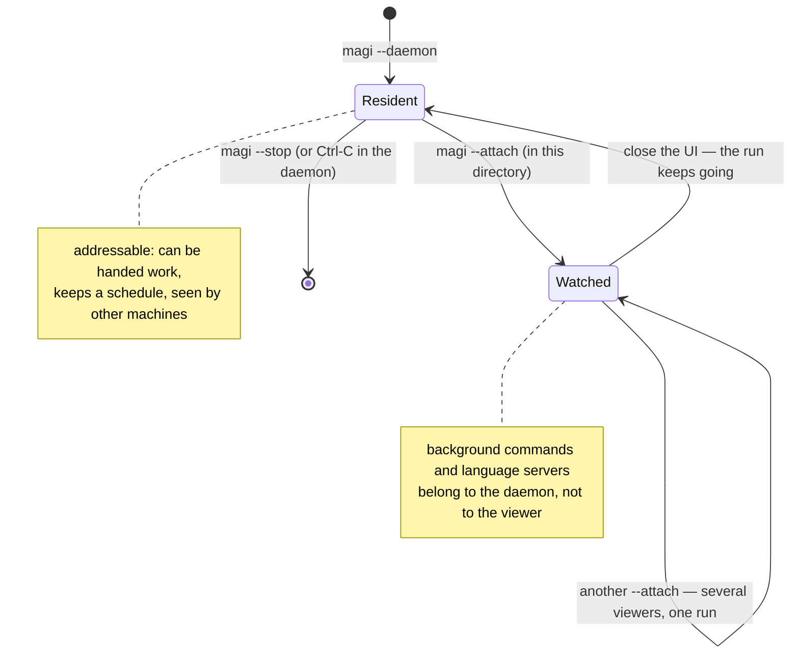
```mermaid
stateDiagram-v2
    [*] --> Resident: magi --daemon
    Resident --> Watched: magi --attach (in this directory)
    Watched --> Resident: close the UI — the run keeps going
    Watched --> Watched: another --attach — several viewers, one run
    Resident --> [*]: magi --stop (or Ctrl-C in the daemon)
    note right of Resident
        addressable: can be handed work,
        keeps a schedule, seen by other machines
    end note
    note right of Watched
        background commands and language servers
        belong to the daemon, not to the viewer
    end note
```

- **One daemon per workspace.** The socket is named from the workspace's real path
  (`<config>/daemon-<dir>-<hash>.sock`, symlinks resolved), so `--attach` in a directory finds the
  daemon of that directory and nothing else. Two daemons cannot claim one workspace: the second one
  loses a lock and says who has it.
- **Detaching is not stopping.** Closing an attached UI leaves the run going, its background
  commands alive and its language servers up — those belong to the process that started them. Ctrl-C
  in the daemon itself is what stops it: it cancels, lets the run unwind, and drops the socket.
- **Several viewers, one run.** More than one `--attach` can watch the same daemon.
- `--agents` prints one line per daemon: state, what it is doing, how long it has been idle, and
  whether it is waiting for an answer. It dials each socket in parallel with a short deadline, so a
  wedged daemon costs a line, not the listing.
- **`--stop` is how you end a resident daemon** without hunting for its process id. Run it in the
  daemon's workspace directory: it asks that one daemon to shut down, which cancels the run, lets it
  unwind, drops the socket, and **stops its schedule with it** (a companion you have stopped should
  not go on firing its nightly job — §14). Use it when you are done supervising a workspace, or before
  starting a fresh daemon there. It only ever touches the daemon of the directory you run it in.

### Environment check

When something is wrong on a fresh machine, run this before reading anything else. It works
through the questions you would otherwise check by hand. Is the endpoint reachable? Is the model
actually on it? Will bash be sandboxed? Did the plugins load? Then it exits.

```sh
./magi --doctor
```

It prints an `ok` / `warn` / `fail` line for each of:

- **LLM endpoint** — reachability of `--base-url` and whether the configured
  `--model` is present on it (for Ollama, whether you are signed in for cloud models).
- **Optional external tools** — `gopls`, `rg` (ripgrep): present ones
  sharpen search/refactor; missing ones only degrade gracefully (warn, never fail).
- **Sandbox backend** — which command isolation is available (e.g. `sandbox-exec`
  on macOS, `bwrap` on Linux) and whether bash will run confined.
- **Config** — that any **council member `provider`** names a defined
  `[llm.profiles.*]`; an undefined one is a warn (it falls back to the default backend).
- **Plugins** — that each plugin (embedded and per plugin directory) actually loads,
  listing the loaded names; a directory that fails to load shows its error (warn). A
  loaded plugin's own doctor probes (registered via the plugin API) run and report here too.

Exit code is `0` unless a **hard failure** (e.g. the LLM endpoint is unreachable),
which exits non-zero; warnings are advisory and do not change the exit code.

### Version / self-update
```sh
./magi --version
./magi --update            # update the binary AND managed plugins, then exit
./magi --update-core       # update only the binary (checksum-verified)
./magi --update-plugins    # update only managed (git) plugins
./magi --plugin-install <git-url> [--plugin-pin <ref>]   # clone a plugin into the user plugins dir
```

**Managed plugins** = plugins that are git checkouts (installed via `--plugin-install`
or cloned by hand). `--update-plugins` runs a fast-forward pull on each; a plugin with
local commits/changes (not fast-forwardable) or with no git remote is reported and
**skipped, never force-overwritten**. Hand-dropped, non-git plugins are left untouched.
Plugins hot-reload, so no restart is needed after `--update-plugins`.

**Interactive startup check.** When you launch the TUI on a terminal, magi checks for a
newer release at most once every 24h. A **patch** release just prints a one-line banner
(`… run magi --update`); a **minor or major** release is treated as required and installs
automatically after a short cancellable pause, then asks you to restart. This *startup*
check fires **only** on an interactive TTY — never under `-p`, a pipe, CI, or a benchmark.
Disable it with `--no-update-check` (or `MAGI_NO_UPDATE_CHECK=1`).

**Daemon auto-update.** A running `magi --daemon` keeps itself current on its own: every
6 hours (staggered per daemon so a machine's companions don't all check at once) it looks
for a newer release and, when one exists, downloads it, verifies the checksum, runs the
new binary's `--version` as a pre-flight — **rolling back to the previous build if that
fails** — and then restarts onto it once nothing is running (no turn in flight, no
meeting round being composed). The restart reopens the conversation the daemon was on.
Details that matter:

- `[update] auto = false` in config turns the auto path off for that companion; the
  console's manual **Update to latest** button still works — the toggle gates only the
  automatic part. That button lives with the **build** on the companion's **facts card** (open the
  companion, unfold the card) — the version is shown, and the update button appears
  under it only when that build **trails the newest** one in the fleet; pressing it puts
  the daemon's account in the button's place. Offered only for a **same-machine**
  companion, and needs the `configure` capability. The fleet list shows
  each companion's build on its row and marks the ones behind the newest, so the
  companion to aim it at is visible without opening every card.
- `--no-update-check` / `MAGI_NO_UPDATE_CHECK=1` disables it too (alongside the startup
  check).
- A **source build never auto-updates**: both a bare `go build` ("dev") and the
  Makefile's git-describe stamp (`v0.22.2-13-g…`) refuse, so your own binary is never
  replaced under you. `magi --update` remains the explicit way to move a source install
  onto a release.
- A benchmark can't reach it: the loop exists only on the `--daemon` path, and a bench
  run is a headless one-shot.

**Updating a companion from the web console.** A same-machine companion's facts panel
shows its **Build** and an **Update to latest** button (Configure-gated; refused on a
shared console and for peer-scoped requests — updates never cross machines). The button
relays the daemon's own `update`: download, verify, commit with rollback, restart; the
daemon's one-line account is shown back.

## 3. Configuration

Most people change three things, ever: the model, the permission mode, and (once they are running
several agents) the companion's name and role. The rest of this section is here for the day you
need one of the others.

Nothing has to be configured before the first run. magi writes a commented `config.toml` the first
time it starts and never overwrites it afterwards, so the file on disk stays yours.

**Where settings come from, and who wins.** Four layers, read in this order:

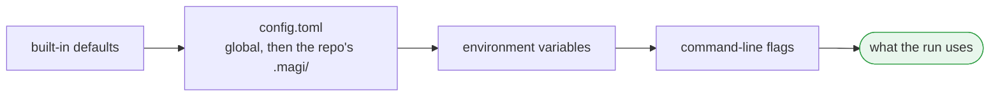
```mermaid
flowchart LR
    D[built-in defaults] --> C["config.toml<br/>global, then the repo's .magi/"] --> E[environment variables] --> F[command-line flags]
    F --> R([what the run uses])
    style R fill:#e8f6ec,stroke:#2f9e44
```

A flag beats an environment variable, which beats the config file, which beats the defaults. The
repo's own `.magi/config.toml` beats the global one, which is what makes a per-project companion
possible — the file travels with the repository.

Where those files actually are, and what else lives beside them:

```
  <config>/                                    ~/Library/Application Support/magi   (macOS)
  │                                            ~/.config/magi                       (Linux)
  ├── config.toml            the global settings — model, council, profiles, cron
  ├── AGENTS.md              house rules for every workspace
  ├── experience/            the global memory tier (§7)
  ├── teams/<name>/          the team tier — the only one that crosses machines
  ├── plugins/               plugins you installed          (always loaded)
  ├── plugins-embedded/      materialised from the binary   (tracks the build)
  ├── daemon-<dir>-<hash>.sock           one per resident workspace   ─┐  this directory
  ├── daemon-<dir>-<hash>.sock.session   the record beside it          ─┤  IS the fleet
  ├── daemon-<dir>-<hash>.sock.lock      who holds this workspace      ─┘  roster
  ├── fleet-key.pem · fleet-cert.pem     this machine's fleet identity
  └── fleet-host                         the name other machines know it by

  <workspace>/.magi/                           travels with the repository
  ├── config.toml            per-project settings; beats the global file
  ├── AGENTS.md              rules for this repo
  ├── experience/            the workspace memory tier
  └── plugins/               loaded ONLY after `magi --trust` here (§9)

  <data>/                                      ~/Library/Caches/magi, ~/.cache/magi
  └── sessions, transcripts, console audit log — set with MAGI_DATA_DIR
```

Two of those lines carry the weight of a whole section elsewhere: the `.sock`/`.json` pair is the
fleet's entire membership mechanism (§13.2), and `<workspace>/.magi/plugins/` is the one directory
whose contents are not loaded until you say so (§9).

**Where the files are.** The global config lives in the OS config directory
(`~/.config/magi/config.toml` on Linux, `~/Library/Application Support/magi/` on macOS); the
per-workspace one is `.magi/config.toml` beside the code. Sessions, plugins and the shared
experience store sit next to the global config.

Flags and environment variables (precedence: flag > env > default):

| Flag | Env | Default | Description |
|---|---|---|---|
| `--model` | `MAGI_MODEL` | `gpt-oss:120b-cloud` | model id (Ollama free cloud; `ollama signin`) |
| `--base-url` | `MAGI_BASE_URL` | `http://localhost:11434/v1` | OpenAI-compatible base URL |
| `--permission` | `MAGI_PERMISSION` | TUI=`ask` / headless=`allow` | `ask`\|`auto`\|`allow`\|`deny` |
| `--profile` | `MAGI_PROFILE` | (none) | guardrail preset `safe`\|`standard`\|`yolo` — sets permission + sandbox together (below) |
| `--theme` | `MAGI_THEME` | `auto` | `auto`\|`dark`\|`light` |
| `--plugins` | `MAGI_PLUGINS` | (none) | additional plugin directory |
| `--no-harness` | — | (off = harness on) | disable the built-in harness (format/diagnostics/Stop hooks) |
| `--output` | — | `text` | `text`\|`json` (headless) |
| `--time-budget` | `MAGI_TIME_BUDGET` | `0` (off) | soft wall-clock budget shown to the agent as guidance (e.g. `20m`); **advisory, never a hard stop**. See §Time & step budget. Kept **off** for leaderboard/comparison runs |
| `--workflow` | `MAGI_WORKFLOW` | (off) | drive the task through the deterministic localize→implement→verify→review pipeline |
| `--verify-cmd` | `MAGI_VERIFY_CMD` | (auto) | workflow verification command; auto-detected (go/cargo/npm/pytest markers) when empty |
| `--http-timeout` | `MAGI_HTTP_TIMEOUT` | `0` (unbounded) | max wait for LLM response headers (e.g. `120s`) |
| `--no-cache` | `MAGI_NO_CACHE` | (off) | disable prompt `cache_control` (on by default; auto-falls back if the backend rejects it) |
| `--list-models` | — | — | list the backend's available models and exit |
| `--doctor` | — | — | environment diagnostics and exit (see §Environment check) |
| `--version` | — | — | print version and exit |
| `--update` / `--update-core` / `--update-plugins` | — | — | update binary+plugins / binary only / managed plugins only, then exit |
| `--plugin-install` / `--plugin-pin` | — | — | git URL of a plugin to clone into the user plugins dir / optional tag/branch/commit for it |
| `--no-update-check` | `MAGI_NO_UPDATE_CHECK` | (off) | disable the interactive startup update check AND the daemon's auto-update loop |
| — | `MAGI_FIRST_TOKEN` | `300` (s) | silence bound BEFORE a response's first token — prefill headroom for big prompts on slow local backends; `0` = no separate bound (the inter-token bound applies from the start). The council's per-member deadline rides on it (3m + this) |
| — | `MAGI_STREAM_STALL` | `120` (s) | silence bound BETWEEN tokens (a mid-generation freeze aborts, keeping the partial output); `0` disables. The stream-guard safety net sits at 2× the larger of the two bounds |
| `--api-key` | `MAGI_API_KEY` | (none) | key for the backend (also config `api_key`, `${ENV}`-expanded; falls back to `OPENAI_API_KEY`). A CLI value is visible in the process list, so env/config are the safer default. Not needed for Ollama |
| — | `MAGI_EMBED_BASE_URL` | (chat base URL) | endpoint for the **embedding** model (`embed_model`), when it lives on a different backend than the chat model — the semantic half of `recall_memory` / the shared brain |
| — | `MAGI_EMBED_API_KEY` | (none) | key for that embedding endpoint |
| `[sampling] reasoning_effort` | `MAGI_REASONING_EFFORT` | (backend default) | passed to the backend as `reasoning_effort` for reasoning models — e.g. `none` to disable thinking, or `low`\|`medium`\|`high`; empty = omit the field |
| — | `MAGI_TEMPERATURE` | (config `[sampling]`, else model default) | sampling temperature sent with every request; overrides `[sampling] temperature` |
| — | `MAGI_TOP_P` | (config `[sampling]`, else model default) | nucleus sampling cutoff; overrides `[sampling] top_p` |
| — | `MAGI_TOP_K` | (config `[sampling]`, else model default) | top-k cutoff — a non-OpenAI extension, sent only when set and honored only by backends that implement it (Ollama's `/v1` ignores it) |
| — | `MAGI_RESEND_REASONING` | (on) | hands each assistant message's own reasoning back on the wire (`reasoning` field), **inside the open turn only** — a harmony-family model (gpt-oss) plans in an analysis channel it expects to see again during tool continuations (Ollama renders it; backends that don't know the field ignore it). `0` disables |
| — | `MAGI_COLLAPSE_REPEATS` | (on) | collapses older duplicates of an identical (tool, args, result) triple in the model's context to a stub, keeping the newest in full — starves the repeated-failure loop attractor; a repeat that returned something new is never touched, and a transcript with no repeats is left untouched entirely. `0` disables |
| — | `MAGI_EMOJI_WIDTH` | (auto-probe) | force emoji cell width: `narrow`\|`1` (one cell) or `wide`\|`2` (two cells). If unset, a startup probe measures it |
| — | `MAGI_WIDTH_PROBE` | (on) | `0` skips the startup terminal-width probes (ambiguous · decor · emoji) = no correction (library default widths) |
| — | `MAGI_AMBIGUOUS_WIDTH` | `auto` | `wide`\|`narrow`\|`auto` — force East-Asian ambiguous-char cell width (see below) |
| — | `MAGI_MOUSE_COMPAT` | (auto) | compensation for terminals reporting mouse columns per character — auto-detected for JetBrains/Apple Terminal; `chars`=force, `off`=disable (see §Mouse) |
| — | `MAGI_MOUSE_DEBUG` | (off) | `1` toasts each click's coordinate→character mapping (drag-position diagnosis) |

Permission modes: `ask` = confirm every time · `auto` = **edits auto-approved, only commands (bash)/network confirmed** · `allow` = everything auto · `deny` = blocked. Cycle in the TUI with `Shift+Tab` (or `/permission`).

**On a daemon, the mode also decides how long a prompt waits.** A resident companion started with
`--permission ask` or `auto` puts its prompts to whatever UI attaches (§13), and what happens when
none does differs:

- **`ask` waits.** Indefinitely. Choosing to be asked and then being answered by a timer is the one
  thing the mode exists to prevent, so the companion sits in the fleet's `waiting` state — badged on
  the console, pushed to a phone — until somebody answers.
- **`auto` gives up after three minutes** and resolves by policy, recording in the transcript that
  the decision was a default rather than somebody's. Here the prompts are the residue — edits are
  already approved and what is left is commands and the network — where "carry on without me" is
  defensible and being stopped for hours is not.
- **`allow`** does not prompt on its own, which is why it is the daemon's default: work that runs
  while nobody is watching, including the schedule (§14), must not stop for a person who is not
  there. A guardrail can still force one over the top of it (a risky command, egress), and that one
  is bounded like `auto`'s — it exists because of the policy rather than because somebody asked to
  be asked.

A terminal waits in every mode: the person is in front of it, and a prompt that expires while they
are reading it is a decision taken out of their hands.

The two axes are independent, and it helps to see them that way: approval decides *who says yes*,
the sandbox decides *what the yes can reach*. A profile is a named corner of this grid.

|  | `read-only` sandbox | `workspace-write` | `full` |
|---|---|---|---|
| **`ask`** — you approve each one | **safe** — reads and thinks, changes nothing | | |
| **`auto`** — edits pass, commands ask | | **standard** (recommended) | |
| **`allow`** — nothing prompts on its own | | the daemon, in a confined tree | **yolo** |
| **`deny`** — every guarded tool blocked | a run that can only read and answer | | |

Empty cells are legal, just unusual: `ask` + `full` is a person approving every step of an
unconfined run, which is what you want the first time you let it near something outside the repo.

Guardrail posture (`--profile`/`MAGI_PROFILE`) is a preset that sets both axes (**approval** × **OS sandbox**) at once: `safe` = `ask` + `read-only`, `standard` (recommended) = `auto` + `workspace-write` (auto-approve edits, confirm commands/network, confine writes to the workspace), `yolo` = `allow` + `full`. An explicit `--permission`/`sandbox` overrides the preset. With no profile set, the sandbox stays opt-in (unconfined) and only the permission default applies — so an existing user's network / out-of-tree writes aren't silently cut. The sandbox axis (`sandbox = "read-only"|"workspace-write"|"full"`) can also be set directly in `config.toml`.

**Fine-grained rules (`config.toml`).** Beyond the mode, three list keys narrow the policy: `allow` / `deny` are glob rules over tool invocations (e.g. `Bash(git push:*)` auto-approves that command, `Read(**/.env)` blocks reading secrets) — this is what the `p` permission choice (§4) persists — and `deny` wins over `allow`. `allow_domains` restricts **network egress to a host allowlist** (e.g. `["api.github.com"]`); empty = no host restriction. Honest about its two strengths: a `webfetch` to an off-list host, and a bash command carrying a **literal URL** naming one, are hard-denied; any other bash egress command (a bare hostname, a variable, a host read from a file — things a string scan cannot resolve) **forces a confirmation prompt instead**, which under headless `--permission allow` resolves to allow, because that posture means full trust. All three keys **append** across the global and project configs rather than overriding, and are on the fixed deny-list a plugin's `set_config_key` can never touch (EXTENDING §Plugins).

Config file `<config>/config.toml` (macOS `~/Library/Application Support/magi`, Linux `~/.config/magi`):
```toml
model = "gpt-oss:120b-cloud"   # default: Ollama free cloud (ollama signin). For local: "qwen3-coder:30b"
base_url = "http://localhost:11434/v1"
permission = "ask"
experience_dir = "/path/to/team/experience"   # shared brain (a git repo → shared with the team)
embed_model = "nomic-embed-text"   # model that turns text into vectors for the SEMANTIC half of
                                   # search (recall_memory, the shared brain). Optional — unset, magi
                                   # falls back to lexical (BM25) search. It is a SECOND model to
                                   # install, and its endpoint is often not the chat one:
                                   # MAGI_EMBED_BASE_URL / MAGI_EMBED_API_KEY point it elsewhere.

[limits]                   # token caps — a safety valve against runaway generation. All optional.
# max_output_tokens = 8192 # per-request output cap sent to the LLM (0/unset = provider default).
                           # Set it when a weak model rambles, or to bound cost per turn.
# context_tokens   = 128000 # override the model's context-window budget used for compaction sizing
                           # (same as `/context <model> <tokens>`, but persisted). Set it when magi's
                           # guess for a model's window is wrong.
# compact_ratio    = 0.8   # share of the window that may fill before auto-compaction runs (§7).
                           # Lower it to compact earlier (safer headroom); raise it to keep more raw
                           # history live before summarizing.

[llm.profiles.fast]        # named backend (endpoint/key/model/headers, ${ENV} expansion)
base_url = "https://fast.gateway/v1"
api_key  = "${FAST_KEY}"
model    = "gpt-oss:20b"
[llm.profiles.fast.headers]
X-CLIENT-API-KEY = "${FAST_CLIENT_KEY}"

[sampling]                 # sampling sent with EVERY request; omit a key to keep the provider's own default
temperature = 0.2          # the "provider default" is the MODEL's: qwen3-coder-next ships temperature 1 /
top_p       = 0.8          # top_p 0.95 / top_k 40 in its Modelfile, and that is what runs when this is absent
# top_k     = 20           # NOT an OpenAI field — an extension; sent only when set. Measured: Ollama's /v1
                           # accepts and IGNORES it (its native /api/chat honors it), so it is backend-dependent.
                           # Deliberate per-call pins outrank this: the council polls its members at temperature 0
                           # so a deliberation is reproducible, and setting a temperature here does not un-pin them.
                           # Env MAGI_TEMPERATURE / MAGI_TOP_P / MAGI_TOP_K override (handy for A/B runs).

[mcp.filesystem]           # MCP server (stdio, or HTTP via url=)
command = "npx"
args = ["-y", "@modelcontextprotocol/server-filesystem", "."]

[[hooks]]                  # lifecycle hook (see §harness below)
event = "Stop"             # just before turn ends
command = "go test ./... >/dev/null || echo 'tests failing' >&2"

[council]                  # the council the agent reaches through the `council` tool (on by default).
enabled    = true          # false removes the tool — and with it the finish declaration (§6)
rule       = "majority"    # unanimous | majority | quorum:2 | weighted:0.6 | veto:Balthasar
preset     = "full"        # "light" = 1 verification member (interactive latency; explicit members override)
# [[council.member]]       # if omitted, the default 3 MAGI members are used
# name = "Melchior"; lens = "correctness"  # lens: correctness|verification|completeness

[theme.dark]               # color theme overrides (per mode). Unspecified roles keep NERV/MAGI defaults
primary = "#FF7A1A"        # role: primary·accent·muted·outline·error·success·
accent  = "#5CD8E6"        #       surface·primaryContainer·outlineVariant·warn
[theme.light]
primary = "#B45309"

[autocomplete]             # IDE-style helpers: thin, no-council model calls on a FAST routed profile,
                           # fired on a pause in typing. Each field is optional; a surface with no
                           # profile shows nothing rather than spending the main model on a keystroke.
# enabled          = true       # (default on) master switch for all three helpers below
# code             = true       # (default on) inline code completion (the web editor's on/off switch is
                           #                per-browser; this is the daemon-side gate)
# composer         = true       # (default on) composer suggestion, likewise
# ambient          = true       # (default on) the file open in the web editor — with unsaved changes —
                           #                rides into the agent's context, so a question about it is
                           #                answered against the buffer, not stale disk.
# code_profile     = "fast"     # [llm.profiles.*] for inline code completion in the web editor (unset = off)
# composer_profile = "balanced" # [llm.profiles.*] for composer next-instruction suggestion, web + TUI (unset = off)
# cross_session    = true       # (default on) composer suggestion learns this user's phrasing from the
                           #                workspace's past sessions; off = current conversation only.

[templates]                # house rules folded into the draft generators (commit message, PR body).
                           # Additive to the base prompt and take precedence where they differ. Empty
                           # leaves the generators exactly as they were.
# commit = "Layer the commits: docs, then core, then the outward change. No issue numbers."
# pr     = "Fill the review checklist; name what a reviewer should look at first."

[update]                   # daemon self-update (see §Version / self-update)
# auto = true              # (default on) a daemon picks up new releases on its own, verifies with
                           #                rollback, and restarts once idle. Off = manual button only.
                           #                Never merged from a project config, and a source build
                           #                (git-describe / "dev") refuses to auto-update regardless.
```

Profiles are what make "one magi, several backends" ordinary rather than a special case. A profile
is a named endpoint; anything that runs a model can be pointed at one:

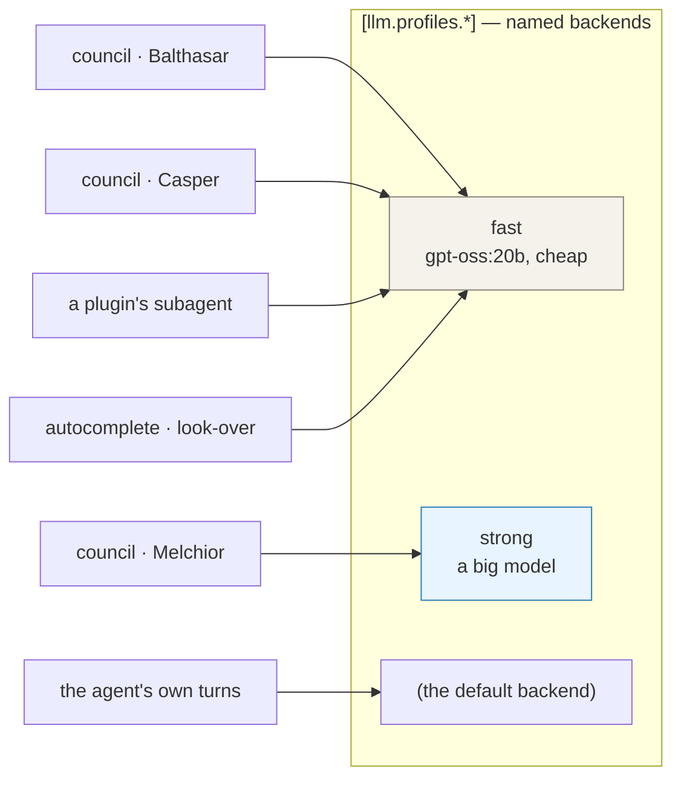
```mermaid
flowchart LR
    subgraph profiles ["[llm.profiles.*] — named backends"]
        F["fast<br/>gpt-oss:20b, cheap"]
        S["strong<br/>a big model"]
        D["(the default backend)"]
    end
    A["the agent's own turns"] --> D
    M1["council · Melchior"] --> S
    M2["council · Balthasar"] --> F
    M3["council · Casper"] --> F
    SUB["a plugin's subagent"] --> F
    AC["autocomplete · look-over"] --> F

    style S fill:#e8f4ff,stroke:#2c7fb8
    style F fill:#f5f2ec,stroke:#8a8178
```

Each council member takes a `provider` and a `model`, so a panel can be one strong reader and two
cheap ones; a subagent takes its own; and `/route` edits all of it live, writing the result back to
`config.toml` with the comments preserved.
> **Autocomplete & suggestions** (`[autocomplete]`): three low-latency helpers, each a single no-council model call on a routed profile — never a subagent turn, so a keystroke never waits on a finish vote. **Inline code completion** shows ghost text at the cursor in the web file editor (Tab takes it). **Composer suggestion** offers how you'll finish an instruction, in both the web composer (a dim hint) and the TUI composer (a line under the box, Tab), learned from your own past prompts via lexical ranking. **Ambient open-file** puts the file you're editing — unsaved — into the agent's next-turn context. Code and composer get **separate profiles** on purpose (a small fast model for code, a slightly stronger one for the composer); a surface with no profile self-disables rather than billing the main model. All of it is toggled and assigned from the web console's **Preferences** (the on/off switches are per-browser; the profile assignments, ambient, cross-session and the two `[templates]` rule editors are written to config), and persists to this file.
> The `[llm.profiles.*]` / `model` above can **also be edited via the `/route` editor** — or from the web console's **Preferences → Model profiles**: list, edit and remove the named backends, or add one (name, base URL, model, optional key). The key is **write-only** — the console reports only whether one is set, never the value — and `${ENV_VAR}` is the recommended form. Changes are saved to this file and apply on that daemon's next start.
> **Look-over** (web editor, off by default — Preferences → the look-over switch): while you edit a file in the console, the companion's model reads over your shoulder and points out only what is wrong — at most three findings, each **anchored to its line** and drawn as an amber end-of-line note that clears when you type. Only the region around your caret is sent (±60 lines, numbered with real line numbers), and the remarks come in **your language**. Silence means nothing worth saying; there is no "looks good" noise. Each pause in typing spends one small model call, which is why it is opt-in per browser.
> **The council (the MAGI: Melchior · Balthasar · Casper · on by default)**: three members the agent reaches through the `council` tool. `question` gets their reading on something it is unsure of and ends nothing; `complete: true` **declares the task finished** and is answered — accepted (the turn ends) or handed back with what is still undone (§6). What they read is magi's own record: every command it granted and how that command really ended (a pipeline whose failure hid behind a zero exit is filed as failed), the paths its tools wrote, **the agent's own edits this turn** as a per-file before→after diff (reconstructed from the write/edit calls, git-independent, so a human or external change is never credited to the agent), and — on a declaration — a **fresh read of the workspace**: files modified since the task began, background commands still alive, and any path the record claims was written that is not on disk. A member objects only when its lens identifies a **concrete defect**, accepts when satisfied, and **abstains** when there is no evidence to judge by. `rule` sets the consensus method. Give each `[[council.member]]` a `provider` (an `[llm.profiles.*]` backend) and `model` so **each member can deliberate on a different model** (a mix of cheap + strong); unset, they use the session model. In the TUI, deliberation is shown live as a **header chip** (`⚖ council rN: <member>`) and transcript lines (convene · per-member one-liner: member-colored `●` + name + verdict icon · tally). **Clicking a member line opens a detail modal** (lens · rationale · feedback · confidence). Per-member colors are themable (`[theme.dark] melchior/balthasar/casper`). The council is inactive in workflow mode (the pipeline uses its own verify gate).
> Color themes can be defined externally per role in `[theme.dark]` / `[theme.light]` (default = NERV/MAGI). Pick the mode (auto/dark/light) with `--theme`.
> On first run a commented default `config.toml` is generated automatically (left untouched if it already exists).
> **Malformed config is never silently ignored**: if the global `config.toml` fails to parse (e.g. a duplicate top-level key), magi prints the parse error and refuses to start rather than falling back to an empty config that would drop your model, plugins, and every other setting. A malformed **project** `.magi/config.toml` warns and is skipped (the valid global config still applies). An unknown *key* (a typo) is only a warning — it never blocks startup.

The guards below are deterministic, always on, and cheap — no model call in any of them. Almost all
only *say* something; two can stop a run. The table is the map, the paragraph after it is the
detail:

| Guard | What it catches | What it does |
|---|---|---|
| Self-regression check | an edit that returns a file to a state it already had this turn — fix it, then quietly undo the fix | a note on that tool result. Advisory, once per file |
| Tabu list | an edit that returns **every** authored file to a state whose test run already failed | the prior failure, shown again. Advisory, once per state |
| Non-interactive execution | a command that tries to prompt — git credentials, an ssh host key, a pager | no controlling terminal, stdin closed: it fails fast instead of hanging to the timeout |
| Masked-failure annotation | exit 0 with a traceback, a panic, `Ran 0 tests`, or a `\|\| true` tail | a line saying that zero is not evidence. Annotate-only |
| Empty-finish nudge | a turn that did the work and wrote no answer | nudged **once** to write the result; a still-empty retry finishes |
| Loop guard | the same no-progress call, over and over | refuses and echoes the earlier result → one corrective re-grounding → **stops the run** if it persists |
| Stall force-stop | no progress across several steps, even after the nudge | **stops the run** gracefully (`stall_guard`). A `bash` write counts as progress, so a slow build is not a stall |

> **Loop & execution safety guards (deterministic, always on)**: beyond the council, a few cheap deterministic guards catch failure modes a weak model walks into on its own. **Self-regression check** — magi tracks each file's content states within a turn; if an edit returns a file to a state it already had this turn (the silent "fix it, then quietly undo the fix" trap), a neutral note is appended to that tool result so the agent re-checks (advisory, never blocks; once per file). **Tabu list** — a higher-precision complement: when a command that *exercises* the deliverable (a test/program run, not an inspect-only builtin) fails, the whole authored file set's content signature is recorded as "already tried, does not work"; a later edit that returns every file to that same failing state is flagged with the prior failure so the agent tries a different fix instead of re-running the proven-bad loop (advisory, once per state). **Non-interactive command execution** — every `bash` command runs with no controlling terminal and stdin closed, so a command that tries to prompt (git credentials, `ssh` host-key confirmation, `apt`, a pager) **fails fast instead of hanging** until the timeout. **Loop guard** — an identical no-progress tool call repeated past a small limit is refused (the earlier result is echoed back); when the agent keeps thrashing it first gets **one corrective re-grounding** (re-read the original task, change approach) — and the nudge carries a **completion escape hatch**: if the work is genuinely complete, say so with `council{complete: true}` (§6) — another confirmation command is not progress, and **never delete or rebuild finished work just to produce visible activity**. Only if it persists is the run stopped gracefully. **Stall force-stop** — when the agent makes no progress across several steps even after the corrective nudge, the run is stopped gracefully (`stall_guard`) instead of grinding on; a `bash` write counts as progress so a legitimately slow build isn't misread as a stall. **Empty-finish nudge** — a turn that ends with **no answer text** delivered nothing the user can read. This happens when a harmony-format weak model emits only its analysis channel and stops (a "reasoning-only stop"), or when it runs tools and then goes silent on the final step — leaving a turn that did the work and reported none of it. The turn is nudged **once** to actually write the result, regardless of whether tools were used; a still-empty retry then finishes normally, so it can't loop. **Masked-failure annotation** — a `bash` result with **exit 0** whose output carries a real crash signature (a Python traceback, a JVM thread exception, a Go panic with a goroutine dump), or whose command ends in a pure exit-code-masking tail (`|| true`, `|| echo …`), gets a one-line advisory note right after the status line: that exit 0 is not evidence the command succeeded. The same annotator family flags a **test runner that discovered nothing** — an exit 0 above `Ran 0 tests` / `no tests ran` proves nothing about the suite, and is said so where it can't be clipped away. Annotate-only — the result's ok/error classification and control flow are unchanged (`MAGI_EXITCODE_BODYSCAN=0` disables).

> **Anti-fabrication under pressure.** The failure mode these guards target is a weak model, cornered by a shrinking step/time budget or a dead end, **inventing** a plausible result (a file's contents, a test outcome, a computed total) rather than admitting it's stuck. The system prompt explicitly forbids fabricating results or evidence under stuck/budget pressure and tells the model to report the honest partial state instead; and the council judges on **what magi observed and what the workspace actually holds** (§6), not on the model's assertion that it finished — so a confident but unbacked "done" is caught, while an honest "I could not do X because Y" is accepted. An honest failure is a correct outcome; a fabricated success is the bug.

### Time budget

There is **no pacing ceiling — only a runaway backstop**. A turn ends when the model stops calling tools, when the agent declares completion and the council accepts, when the context is cancelled, or when whoever launched magi stops waiting. The guards that used to stop a run on magi's own arithmetic came out on measurement — over the bench, runs that reached the wall clock produced 76 passes out of 396, and runs those guards stopped produced 0 out of 28. What remains is a 240-step backstop sized far above any productive turn, so a genuinely runaway loop cannot hold a daemon forever; a turn that spends it lands honestly, recorded as UNVERIFIED with the backstop named as the reason, and the work stands as it was left. (A workflow **phase** is different in kind: it declares its own budget as part of the pipeline's shape.)

What magi still tells the agent each step is appended as an **ephemeral line** (never to the cached system prompt, so the prefix stays cache-stable):

- **Self-measured elapsed** — once a turn crosses a minute, *"You have been working for 11m of wall-clock time so far"*. This is magi's **own stopwatch**, started when the turn started — no external information is in it — and it lets a model notice a slow grind (ten compile retries) and change approach.
- **`--time-budget` (off by default)** — a user-stated soft deadline (e.g. `--time-budget 20m`). The line states the budget and the time remaining, flipping to *"budget EXCEEDED — land the smallest honest result immediately"* once elapsed passes it. **Guidance, never a hard stop**, and kept off for leaderboard/comparison runs so results stay apples-to-apples.
- **The state of the run** — magi's record, re-rendered every step: the commands it granted and how they ended, the paths written, the background commands still alive. A screen-driven agent re-reads its terminal before every decision; this is the same refresh over the store magi actually keeps, so the agent is never working from memory alone.

### Harness (on by default)

Even with no configuration, an "understand → plan → implement → verify → summarize" procedure naturally applies. It has two layers:

1. **Operating guidance prompt (always)** — for multi-step work, plan with `todowrite` then do items one at a time, verify with build/test after edits, don't end in a broken state, and summarize the changes at the end. Applies just by chatting, even if you don't know how to use it.
2. **Built-in hooks (always, off via `--no-harness`)** — right after a file edit, run auto-format (gofmt) + language diagnostics (gofmt -e / go vet / py_compile) and feed errors back to the model → self-correction.

**Team sharing**: commit `.magi/config.toml` at the project root and the workflow travels with the repo. It is merged with the global (`<config>/config.toml`), and `[[hooks]]` accumulate.

⚠ **Until you trust the workspace, only the careful half of that file is taken.** It arrives with a clone, so magi splits it in two:

| From any workspace | Only from a **trusted** one |
|---|---|
| `deny`, and `permission`/`sandbox`/`profile` when they ask for MORE care than the machine gives (`sandbox = "read-only"` is kept; `permission = "allow"` is refused and said so) | `[[hooks]]` — shell commands on tool events · `[mcp.*]` — processes the daemon spawns, and the headers they send · `[cron.*]` — unattended prompts · `allow`, `allow_domains` · `[plugins.*]` · `base_url`, `experience_dir` · and `.magi/plugins/` |

**Reaching a companion on another machine.** The crossing is an ssh pipe into `magi --fleet-door`, which carries four methods — ask what a companion is, hand it work, ask how that work went, and watch for how it goes (the one that streams: the far side pushes each change down the pipe, so an answer arrives when it happens rather than on a poll's clock) — and opens only companions that account has published. Give somebody a key that can do that and nothing else:

```
command="magi --fleet-door",restrict ssh-ed25519 AAAA… lee@laptop
```

`restrict` removes pty, port forwarding, agent forwarding and X11; the forced command means ssh ignores whatever the client asked to run, so the caller chooses neither the program nor the flags nor the socket. The older `magi --relay <socket>` still exists and carries the WHOLE daemon protocol at whatever socket path it is given — that is the shape for your own machines, and not a shape to put behind somebody else's key.

The pipe is deliberately the only ssh-specific part: a container is `kubectl exec -i … magi --fleet-door` and the same four methods.

**Or over TLS, with no ssh at all.** Each magi has a key pair and a self-signed certificate, made once and kept; `magi --whoami` prints its fingerprint. Carry that fingerprint to the other machine the way you would an ssh host key — over a channel you trust — and admit it:

```
magi --whoami                                   # on the machine to be reached
magi --admit SHA256:… --as buildbox --at build.local:7777   # on the machine reaching out
magi --fleet-listen :7777                       # on the machine to be reached
```

Both ends check the same thing: the public key that arrived against the list of admitted fingerprints. There is no certificate authority — the certificate is an envelope and the key is the identity, so renewing one changes nothing. A party nobody admitted **fails the TLS handshake**, so it learns nothing: no route, no version, no list of companions. Revoking is `magi --refuse SHA256:…`, and it takes effect on the next connection.

A machine with an address on its admitted line is reached over TLS; one without is reached over ssh. Same door either way.

**Machines that hold each other's key also share what their teams learned.** The TLS door carries one machine-level method, `exp-sync`: for every team with a footprint on both machines, the two doors exchange the team store's immutable files — wiki revisions and memories — as a **set union**, on start and on a slow tick. Nothing is ever overwritten (the files are content-addressed) and deletions do not cross, because they do not exist: a retired wiki page is a stale revision, which is itself a file that replicates. A page written on one machine is on the other's next `recall_memory` within minutes, with no shared git remote to operate. A machine no companion of that team runs on refuses the team by name.

**Or provision it in one line each.** Carrying a fingerprint by hand is four steps across two machines, and the last one is the one people skip:

```
magi --provision laptop --at build.local:7777     # on the machine to be reached
  on laptop, run:
    magi --join build.local:7777 --token <secret> --pin SHA256:…
```

The invitation stands for fifteen minutes and is spent by the first machine that uses it; both ends record each other's key in that one exchange. The joining machine's key is taken from the certificate it presents, not from anything it types, so it cannot claim somebody else's — and the `--pin` means the secret is only ever sent to the machine that minted it. While an invitation is open the door accepts an unknown certificate far enough to reach `/fleet/join` and nothing else; with none open, a stranger's handshake simply fails.

⚠ **What the sandbox does and does not do.** It confines WRITES on macOS (`sandbox-exec`) and Linux (`bwrap`) and nothing on Windows, where only a restricted token is applied. It never confines reads, on any platform — the agent runs arbitrary toolchains, so its read set is effectively everything. The session store is kept read-only inside it, so a confined command cannot rewrite the record of what it did. If a confined posture is asked for and the tool behind it is missing, magi says so at startup and runs unconfined rather than refusing to work. For isolation between people, separate OS accounts are the boundary; the sandbox is about blast radius, not about tenancy.

Settings are read in three layers, most specific last: the person's `<config>/config.toml`, the team's `<workspace>/.magi/config.toml`, then **this companion's own** `<config>/companions/<workspace-key>/config.toml` — its model, its posture, the servers and jobs you gave it here. The companion layer is where magi PERSISTS your choices (`/model`, and the permission modal's "keep for this companion"): they are decisions about one workspace on one machine, so they neither travel in a clone nor land on your other companions — and they sit outside the workspace, where the agent's own file tools cannot reach them.

**Who may use the console.** `<config>/auth.toml` maps names and groups onto roles:

```toml
[groups."eng-platform"]        # what the gateway reports in -groups-header
role = "operator"

[groups."eng-docs"]
role = "responder"
companions = ["docs"]          # narrowed to some of the fleet

[people."lee@corp.com"]        # individual exceptions, not the roster
role = "viewer"
```

Groups are how joiners and leavers stop being your problem: the directory is where somebody is added on their first day and removed on their last, and a console that reads membership needs no list of its own to keep in step. Capabilities and scopes ADD UP across matches — two teams means both, never less. Manage it from the console (an admin sees an access screen, at the foot of the rail) or from a terminal on that machine (`magi --access`, `--grant`, `--revoke`), which is also the way in when a policy has locked its author out. Nothing can leave the file with no admin: that console would refuse to start, with the fix behind the door.

⚠ The groups header is trusted exactly as far as the name beside it. A gateway that forwards a header it did not set lets a client claim its own membership — strip both at the proxy.

Trust is per directory and stated once: **`magi --trust`** in the workspace (`magi --untrust` undoes it; the list is `<config>/trusted-workspaces`). Until then, opening the repository prints what was held back. Answering a permission prompt with "always, in this project" also needs it — that answer writes into `.magi/config.toml`, which an untrusted workspace would not be read back from.

Hook events:
| event | when | effect of exit code ≠ 0 |
|---|---|---|
| `PreToolUse` | before a tool runs | **block** the tool (stderr passed to the model; e.g. path protection) |
| `PostToolUse` | after a file edit | output passed as feedback |
| `Stop` | just before turn ends | block termination and force continued work (e.g. require tests to pass) |

Hook commands run in a shell and receive the `MAGI_TOOL`/`MAGI_PATH` environment variables + JSON stdin. Filter by tool name with `match` (`"*"` = all).

## 4. Using the TUI

You type at the bottom, the conversation scrolls above it, and the header tells you what the run
is costing. Three things make the rest of this section legible:

- **Enter sends, and Enter during a run steers.** You do not have to wait for a turn to end to say
  something; a mid-turn message goes into the running turn rather than queueing behind it.
- **Esc interrupts.** The turn unwinds, the work so far stands, and nothing is lost.
- **Dangerous tools ask first.** `write`, `edit` and `bash` stop for a `y` / `a` / `n` unless you
  have said otherwise (`Shift+Tab` cycles the mode, `/permission` sets it).

<div align="center">

</div>

Reading that screen: each tool call is one line, and its leading glyph flips from ⚙ to ✓ or ✗ when
the result arrives. A long turn therefore stays on one screen instead of scrolling away. The
council's votes arrive as their own lines at the end, followed by the tally.

Where everything sits:

```
┌──────────────────────────────────────────────────────┬───────────────────┐
│ magi · qwen3-coder-next · 34% ⇅ 42% (120/300)        │ ╭───────────────╮ │  header: model,
│                                                       │ │ plan  2/5     │ │  context %, scroll
│  나  fix the flaky test in internal/app               │ │ ✓ read failing│ │  position
│                                                       │ │ ▸ narrow it   │ │
│  ✓ read internal/app/loop_test.go                     │ │               │ │  post-it: todos,
│  ✓ bash go test ./internal/app -run TestRewind        │ │ jobs 1        │ │  jobs, context.
│  ⚙ edit internal/app/query.go                         │ │ ▸ go test …   │ │  Drag its left
│                                                       │ ╰───────────────╯ │  edge to resize
│  ⚖ Melchior  done · Balthasar  done · Casper  reject  │                   │
│  ▣ turn: 14 steps · 3 file(s) · council r2 · 3m49s    │                   │  receipt: one line
├───────────────────────────────────────────────────────┴───────────────────┤  per finished turn
│ ▸ go test ./internal/app                          [background job pane]   │
│   ok  internal/app  21.7s                                                 │  a pane per live
├───────────────────────────────────────────────────────────────────────────┤  job or child
│ > _                                                          ask · ⇧⇥     │
└───────────────────────────────────────────────────────────────────────────┘
     the composer — always live, even mid-turn      permission mode ─┘
```

### Slash commands (typing `/` opens an autocomplete palette — prefix filter, ↑/↓ to select, Tab to complete)
| Command | Description |
|---|---|
| `/help` | help |
| `/route` (=`/model`=`/agents`) | **model & routing editor** (one screen): **(session)** default model, per-agent model/backend, **add/edit backends (profiles)**. ↑/↓ select · Enter edit/open · empty value = reset to default · Esc close. Editing the **session model** opens a **suggest box** — configured profile models plus the gateway's live catalog (prefetched on open), de-duplicated and filtered as you type: **↑/↓ cycle · Tab fills · Enter applies** the highlight or the typed value. An unreachable gateway falls back to free text. While editing an agent, **pick a profile with ←/→** (or type a model name). Use `+ add profile` to define a profile (endpoint/key/model/headers); in the form, Enter edits a field · **Tab saves**. **All edits are persisted to `config.toml`** (comments preserved) |
| `/tools` | available tools |
| `/subagents` | **subagents a plugin registered** — a checkbox each, grouped as the plugin declared. Space toggles one (a group header toggles all its members), Enter sets the model that subagent runs on (empty clears the override), Esc closes. magi ships none of its own, so the list is empty until a plugin registers one. The choice is written to `config.toml` under `[subagents.<name>]` and survives a restart |
| `/cost` | token usage and cost for the session |
| `/sessions` | session list for this directory |
| `/resume [n]` | resume a session (no arg = list, `/resume 2` to switch) |
| `/rewind [n]` | roll back the last n user turns (default 1) |
| `/image <path>` | show an image inline |
| `/diff` | working-tree git diff |
| `/loop` | **Loop map** — projects turns · steps · tool activity · council rounds as structure (visualizes the *shape* of the loop) |
| `/context` | **context window** visualization — usage / window size · message count · compaction history (tokens before→after) · **every model in use and its window**. Edit a window: `/context <tokens>` (session model) or `/context <model> <tokens>` (e.g. `/context qwen3-coder:30b 128k`; `unlimited`/`0` clears it) |
| `/fork` | **branch** the current session to explore an alternative attempt (original preserved). Switches to the branch |
| `/replay` | **re-run the previous turn on the branch** (reproduce the same input). Compare with `/loopdiff` |
| `/loopdiff` | **structurally compare the current branch against the fork origin** (turns · steps · tools · council · tokens) |
| `/init` | analyze the project then write AGENTS.md |
| `/ultra <task>` | **ultra work mode** — work the task through thoroughly and verify by running it |
| `/permission` | cycle permission mode (ask→auto→allow→deny) |
| `/cron` | **scheduled jobs for this workspace** — list the `[cron]` jobs (§14), see when each next runs, and add/edit/remove one without hand-editing `config.toml`. Use it to set up unattended work (a nightly test run, an hourly sync) or to check what is already scheduled |
| `/compact` | summarize/shrink the context (re-hydratable — see below) |
| `/clear` | clear the screen |
| `/quit` (=`/exit`) | exit |

> **Re-hydratable compaction**: when context is auto-compacted (or via `/compact`), the older turns are summarized for the live window as usual — but the originals are never lost. The compacted region is indexed **fully deterministically (no extra model call)** into topic shards **by the file each turn touched**, each carrying a one-line brief = its **tool-action trail** (e.g. `read · edit×2 · bash`); the summary then carries a notice listing the recoverable topics with those briefs. The agent calls **`recall_context("<topic>")`** (a file path works well) to pull a topic's original messages back **verbatim** on demand, instead of being stuck with the lossy summary. Recalls are bounded (each topic once, a per-turn budget, size-capped output) so re-hydration can't reopen the window; topics are aggregated across multiple compactions so nothing becomes undiscoverable. Unlike mainstream agents (Codex/Claude Code, which summarize-and-forget), the shed detail stays addressable. The pull is also **pushed**: each step, up to 3 compacted-away topics that lexically match the current task — the recent user prompt joined with the latest assistant message — are surfaced as one-line hints ("possibly relevant earlier context — call recall_context"), so a model that never thinks to recall still gets pointed at what it lost. Matching is ranked by **BM25-lite inverse-document-frequency**: a rare token that pins one region (`dehydration`, `heap.go`) outranks a generic one shared by many shards (`handler`, `the`), so the hints point at the region the current step actually needs rather than the most common word. It stays purely lexical/deterministic — no embedding dependency, and the hint only *points*; the model still pulls the verbatim originals via `recall_context`.

### Keyboard shortcuts
| Key | Action |
|---|---|
| Enter | send (**if a turn is running, inject the message into the in-progress turn = steering**) |
| ↑ / ↓ | input history (recall previous prompts — includes prior turns when resuming a session) |
| Tab | autocomplete the input prefix from history (shared with slash / job-pane focus) |
| PgUp/PgDn · Ctrl+U/Ctrl+D · Shift+↑/↓ | scroll (page / half-page / one line) |
| Tab | cycle job-pane focus (when panes are present) |
| Ctrl+O | zoom in/out on the focused job pane |
| Esc | release zoom → release focus → interrupt the running work |
| mouse wheel | scroll the transcript (even while dragging) |
| mouse drag | select text → copy to clipboard on release |
| mouse click | focus a job pane |
| Ctrl+F | search the transcript (type to narrow · enter/↓ next · ↑ prev · esc close) |
| Ctrl+L | clear the screen |
| Shift+Tab | switch permission mode |
| Ctrl+Q | exit (or `/quit`) |
| Ctrl+C | *nothing* — deliberately left free for the terminal's own drag-select + copy |
| mouse wheel | scroll · click a panel → focus (click again → zoom) |
| permission modal: y/a/p/n | allow (once) / always (this session) / project (persist to `.magi/config.toml`) / deny |

The modal itself, and what each key costs you later:

```
  ┌─ magi wants to run ─────────────────────────────────────────┐
  │  bash   curl -X POST https://api.example.com/v1/orders      │
  │         ↳ egress: api.example.com                           │
  ├─────────────────────────────────────────────────────────────┤
  │  y  allow, once            ← nothing is remembered          │
  │  a  always, this session   ← forgotten when magi exits      │
  │  p  persist to the project ← writes bash(curl:*) into       │
  │                              .magi/config.toml — the        │
  │                              PROGRAM, never bash(**)        │
  │  n  deny                   ← the tool answers "refused",    │
  │                              and the agent must adapt       │
  └─────────────────────────────────────────────────────────────┘
```

`p` is the one worth thinking about, because it outlives the session and travels with the
repository. It is also the one deliberately narrowed: a command that opens with a pipe or a
redirect has no stable program to pin a rule to, so it stays session-only rather than over-granting.

Typing keys go only to the input box and scrolling happens only via the dedicated keys above — so typing body text (including spaces) doesn't scroll the screen. While you're scrolled up reading, streaming doesn't yank the view down (auto-follow only when at the bottom). When the transcript overflows, a **header chip** shows the scroll position (`⇅ 42% (120/300)`), plus `↓ new` when fresh output is streaming in below while you're scrolled up (End jumps back). There is no drawn scrollbar — the chip replaced it, which also removed the Windows ambiguous-width misalignment class entirely.

Each working turn ends with a one-line receipt — `▣ turn: 14 steps · 3 file(s) · council r2 · 3m49s` — so a turn's cost is visible without scrolling back. When the agent needs YOU to decide between real alternatives, it can open a **selection modal** (the `ask_user` tool): ↑/↓ or 1-9 pick, enter answers, esc dismisses (the model is told you declined and proceeds on its own judgment). Multiple questions appear one modal at a time.

**Persisting a permission (`p` = project):** choosing `p` writes an allow rule to `.magi/config.toml` so the choice survives restarts. The rule is **scoped as narrowly as the tool allows**: most tools persist as `tool(**)`, but `bash` persists only the **program name** you approved — approving `curl https://x` records `bash(curl:*)`, not a blanket `bash(**)` — so one approval never silently pre-authorizes every future command. A command that opens with a shell metacharacter (a pipe/redirect) has no stable program to pin to, so it stays session-only rather than over-granting. The destructive/egress scanners still re-prompt on dangerous invocations even of an allowed program.

**Ambiguous-width characters (mostly a Windows note):** at startup magi probes the terminal once and matches its cell-width measure automatically (Console-API cursor delta on Windows, a cursor-position query elsewhere). If the probe can't run (e.g. redirected stdio) or guesses wrong, force it with `MAGI_AMBIGUOUS_WIDTH=wide` (or `narrow`); `MAGI_WIDTH_PROBE=0` disables the probe, and the standard `RUNEWIDTH_EASTASIAN=1` is also honored.

### Mouse / text copy (no modes)
Wheel scroll · drag select · click focus all work **without any mode switch** — because the app handles selection/copy itself. **Dragging highlights that range (character/cell granularity, partial-line selection allowed), and releasing copies it to the clipboard** (tries both the OS clipboard `pbcopy`/`wl-copy`/`xclip` and OSC52). Wheel scrolling during a drag works too (the selection is pinned to content position, so it persists across scrolling). Selection edges **snap to grapheme boundaries**, so a wide character (Hangul, emoji) is never half-selected.

**Whole-block copy (⧉)**: every user/assistant block's label line carries a ⧉ chip — clicking it copies that block's **source text** (the raw markdown, not the styled render).

**IDE-embedded terminal compatibility**: JetBrains' terminal (IntelliJ etc.) and Apple Terminal draw wide characters across two cells but report mouse columns counting each character as one, so drags land left of the pointer without compensation. magi detects both (`TERMINAL_EMULATOR`/`TERM_PROGRAM`) and compensates automatically; force it on another terminal with `MAGI_MOUSE_COMPAT=chars`, opt out with `off`, and run with `MAGI_MOUSE_DEBUG=1` to toast each click's coordinate→character mapping. Note: JetBrains' embedded terminal also breaks Korean IME composition (commits bare jamo) — an app can't fix that layer; use an external terminal (e.g. iTerm2) for heavy CJK input.

### Transcript rendering
- **edit/write appear as colored diffs** — syntax highlighting (language detected by file extension) + a line-number gutter, additions/deletions as `+`/`-`.
- **bash · read · grep · glob · list · webfetch · websearch results appear as collapsed blocks** inline (read shows line numbers + syntax highlighting). Long ones get a `… +N more` footer and **clicking the block expands it**.
- **Council rejection reasons** are shown wrapped below the one-line verdict (the full reason is in the detail modal via member click).
- **Council waiting line**: while a round is open and deliberation is under way, the footer names what it's waiting on in one fixed line alongside the spinner — `⚖ 플랜 감사 판정 대기 중…` for a plan audit, `⚖ 카운슬 심의 판정 대기 중…` for review/consensus — so the pause doesn't read as a stall.
- **Pre-review report folding**: a "review this" request flows report → council review → revised report; when a review round votes continue, the original (pre-review) report is folded to a one-line stub (`≡ (검수 전 보고서 — 접힘, 아래 최종본 참고)`) **the moment the revision actually lands**, leaving only the final result. The fold is deferred to the revision's arrival, so an interrupted or errored review leaves the original intact; an identical revision leaves the original untouched (no blink-out-and-reappear).

### Status panel (post-it)
When there are plans (todos) · background jobs · context, a **rounded-outline box (post-it) appears at the top-right** (hidden if none). The transcript uses the full width and the box is drawn overlaid on top of it (bottom-aligned, so it usually floats over empty space); **dragging the box's left edge adjusts its width**. Click a job line to zoom into that job. The box border is assembled from the terminal's real cell widths, so a todo/job line carrying an emoji like 🚀 keeps the right `│` aligned whether the terminal draws it one cell or two — the emoji width is probed once at startup, and can be forced with `MAGI_EMOJI_WIDTH` or disabled with `MAGI_WIDTH_PROBE=0`.

### Theme
At startup it detects dark/light from the terminal background color, and **if you change the OS theme while running it follows within a few seconds** (it re-queries the background color periodically). Force `auto`/`dark`/`light` with `--theme` (or `MAGI_THEME`).

### Steering (interrupting mid-work)
Input stays alive even while work (a turn) is running — you can keep typing (including inline Korean IME composition), and pressing Enter **injects the message immediately into the in-progress turn**. The main agent sees and reflects that message **at the next step** — it isn't queued to surface only after the turn fully ends; you're steering the running agent in place. The message appears in the transcript right away.
Even when the agent has *nothing to do but wait* on a long background command, a message you send is handled right there — it doesn't sit until the command finishes. Small talk gets a brief reply; a steer actually changes the running work: "only look under `docs/`" switches course, "after that, also write a README" folds the extra step in, and an ambiguous steer prompts a quick clarifying question before it acts. When a steer lands, the transcript records a durable "Steer applied …" audit line so you can see the redirect fired — the agent doesn't just verbally agree and move on.
A message that can only be answered after the current work finishes is queued and **stays visible where you typed it**; when its answer is ready the query is **pulled down to just above the answer** so the two render as a pair (and on reopening the session there's no duplicate — the pairing is preserved).
Slash commands during work: read-only/UI-only ones (`/help` · `/route` (=`/model`) · `/tools` · `/sessions` · `/diff` · `/permission` · `/loop` · `/loopdiff` · `/context`) execute, while ones that change the session (`/resume` · `/rewind` · `/fork` · `/replay` · `/clear` · `/init` · `/ultra` · `/compact`) are rejected during work.

### Background job panes (split-pane)

The strip has two producers. A **background command** (`bash background=true`) would otherwise be a single line saying a process started and then nothing, while the agent polls it with `bash_output` and acts on what it reads. A **spawned child** (a subagent from a plugin, §`/subagents`) runs for minutes inside one tool call, on a session the main view does not follow. Either way, while it is alive **a live panel is tiled below the main transcript**, each with a **unique color** (M3 tonal palette) on its border and header badge.

A child's panel shows **its own transcript**: the prompt it was handed, its reasoning, each tool call with its arguments and result, and what it finally said, all rendered exactly as the main transcript renders them. A background job's panel shows its log tail.

- Move focus with `Tab` (or by clicking a panel) → the focused panel gets a **focus ring** in its color.
- `Ctrl+O` (or clicking the focused panel again) **zooms in** → the job's full output. On entering zoom it jumps to the bottom (latest). **Clicking** the top breadcrumb (or `Esc`) returns.
- The pane shows a **tail**, refreshed a few times a second and read from the file's end. **Watching consumes nothing**: the read never advances the offset `bash_output` uses, so what the agent reads is exactly what it would have read unwatched.
- **Lifecycle**: large tiles while running; when the job exits, the pane is marked done and fades out of the strip into the panel's record. They disappear when you send the next message.

`Esc` means "back out of where I am", and where you are depends on what you last did. It undoes one
layer at a time, so the key that interrupts a turn is the same key you can press twice by mistake
without interrupting anything:

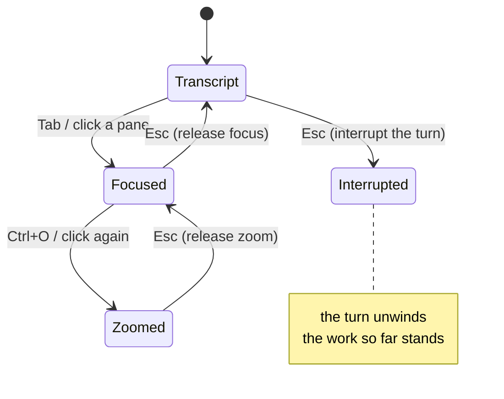
```mermaid
stateDiagram-v2
    [*] --> Transcript
    Transcript --> Focused: Tab / click a pane
    Focused --> Zoomed: Ctrl+O / click again
    Zoomed --> Focused: Esc (release zoom)
    Focused --> Transcript: Esc (release focus)
    Transcript --> Interrupted: Esc (interrupt the turn)
    note right of Interrupted
        the turn unwinds
        the work so far stands
    end note
```

### Right-side status panel
When there are plans / progress, a **status panel** appears on the right (hidden if none). **Drag its left edge with the mouse** to adjust the width (default 44 columns). Sections:
- **Plan** — the current todo checklist + progress (`done/total`): completed ✓, in-progress ◐, pending ☐, and **cancelled ✗** (a step left unfinished when the turn is aborted/stopped). Progress is driven by deterministic signals too, so it updates even when the model doesn't call `todowrite`. Updates in real time.
- **Jobs** — the background commands running now (color · status · elapsed). **Click an item → zoom into that job's output** (same as clicking the pane).
- **Context** — context token usage bar.

### Paste folding
Multi-line (or over-200-char) pastes are folded into a `[#N pasted L lines]` chip **only in the input box** (since the input box is narrow). On send, the **full content is shown as-is in the transcript (main)** and the full content is passed to the agent too. (↑ history recall brings it back as a chip so it doesn't clutter the input box.)

### `@` file mentions
Put `@path/file` in a message and that file's contents are attached to the agent context.

### Header display
`model <id> · ctx <%>` + **permission chip (color-coded)**, plus a badge naming the background jobs still running.
- Permission chip colors: `ask` = amber (safe) · `auto` = cyan (edits auto) · `allow` = yellow (caution) · `deny` = red (blocked).
- While a todo checklist is being worked through, the header also surfaces the **active step**, so what the agent is working on right now is visible without opening the status panel.

### Session resume (`/resume`)
`/resume` (no arg) → **interactive picker**: shows each session's time + first-message summary, select with `↑/↓`, resume with `Enter`, cancel with `Esc`. You can also switch directly with `/resume N`.
- The list shows **only user sessions**.

### TUI behavior checklist (screenshots)
A collection of interaction behaviors under verification — organized so screenshots can be attached under each item.

1. **Input during work + Korean IME** — you can type/compose inline in the input box even while a turn is running (cursor at the input position).
2. **Steering (interrupting mid-work)** — a message sent with Enter during work is injected immediately into the in-progress turn, and the agent reflects it at the next step.
3. **Background-job split-pane** — a live panel per running background command, tiled, with **a unique color per job**.
4. **Focus / zoom** — move focus with `Tab` (or by clicking a panel when the mouse is ON) (color focus ring), full-screen detail with `Ctrl+O` (breadcrumb · divider · left bar in that color), return with `Esc`.
5. **Paste folding** — multi-line paste → a `[#N pasted L lines]` chip in the input box, full content in the main on send.
6. **Scroll position retained** — if at the bottom, stays at the bottom after streaming / panel add-remove / **terminal resize**; if scrolled up reading, it isn't dragged along.
9. **Input history** — recall previous prompts with `↑/↓` (includes prior turns when resuming a session), autocomplete the prefix with `Tab`.
10. **Mouse/copy (no modes)** — wheel scroll · drag select+copy · click focus all work without a mode switch (the app handles selection itself). Wheel scrolling during a drag works too.
11. **Screen cleanup on startup** — clears the terminal once on launch and starts from a clean screen.

## 5. Tools (built-in)

One agent sees all of them. (The only exception is **workflow mode**, §2, where a phase may narrow the set to fit its goal.) The `Permission` column is the approval axis a tool trips (`ask` = confirmed under `ask`/`auto`; `—` = read-only, never prompts).

Every call takes the same path before anything happens, and each gate can only refuse:

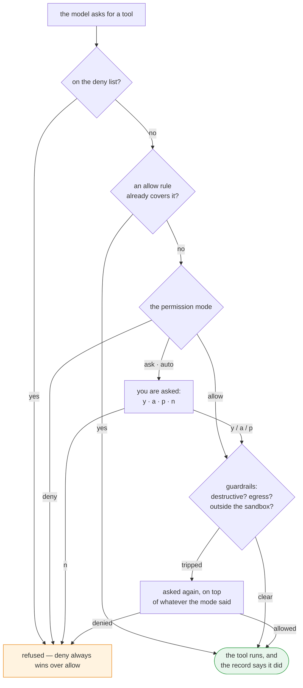
```mermaid
flowchart TD
    C["the model asks for a tool"] --> D{"on the deny list?"}
    D -->|yes| NO["refused — deny always wins over allow"]
    D -->|no| A{"an allow rule<br/>already covers it?"}
    A -->|yes| RUN
    A -->|no| M{"the permission mode"}
    M -->|"allow"| G
    M -->|"deny"| NO
    M -->|"ask · auto"| P["you are asked:<br/>y · a · p · n"]
    P -->|"n"| NO
    P -->|"y / a / p"| G{"guardrails:<br/>destructive? egress?<br/>outside the sandbox?"}
    G -->|"tripped"| P2["asked again, on top<br/>of whatever the mode said"]
    G -->|clear| RUN([the tool runs, and<br/>the record says it did])
    P2 -->|allowed| RUN
    P2 -->|denied| NO

    style RUN fill:#e8f6ec,stroke:#2f9e44
    style NO fill:#fff3e0,stroke:#e8820c
```

Two things follow from the shape. A guardrail can force a prompt even under `allow`, because it
exists on account of the policy rather than because somebody asked to be asked. And `p` — persist —
writes the narrowest rule the tool allows: approving `curl https://x` records `bash(curl:*)`, never
`bash(**)`.

### File & search
| Tool | Description | Permission |
|---|---|---|
| `read` | read a file (line numbers, offset/limit) | — |
| `write` | create/overwrite a file | ask |
| `edit` | exact string replacement (unique match) — ambiguous matches list each occurrence's line anchor; `at`/`to` mode replaces an anchored line safely using read's line refs | ask |
| `multiedit` | apply multiple hunks to one file atomically (all-or-nothing) | ask |
| `grep` | regex content search | — |
| `glob` | filename glob (`**` supported) | — |
| `list` | directory listing | — |

### Execution
| Tool | Description | Permission |
|---|---|---|
| `bash` | shell execution (timeout · exit code; `background=true` for long-running commands). Runs with **no controlling terminal and stdin closed** so a command that tries to prompt fails fast instead of hanging. Under `/bin/bash` when present, which lets magi read `PIPESTATUS` out of band: a pipeline whose reported exit is 0 because the last stage succeeded is still recorded as FAILED if an earlier stage died | ask |
| `bash_output` | fetch new output from a background command since the last read | — |
| `bash_input` | send a line to the **stdin of a background command** — drives a REPL/line-debugger (`python3`, `psql`, `gdb`); `eof=true` closes stdin. A pipe, not a TTY (curses/password prompts won't work) | — |
| `bash_kill` | terminate a background command | — |
| `wait_for` | block until a condition holds (a file appears, a port answers, a background job exits) instead of spinning on `sleep` + re-check | ask |
| `port_owner` | what is listening on a port, and which process owns it — portable, where `ss`/`lsof`/`netstat` may not be installed | ask |

A pipeline is where an exit code lies, so magi does not take the last stage's word for it:

```
    go build ./...    |    tee build.log    |    tail -1
         │                     │                    │
      exit 2                 exit 0              exit 0
         └───────────── PIPESTATUS ──────────────────┘
                              │
        what the shell reports:  0    ← the last stage succeeded
        what magi records:      FAILED (stage 1 exited 2)
```

Read out of band under `/bin/bash`, which is why it is the shell magi prefers. Without it the agent
reads a green 0 for a build that did not build — measured as one of the ways a turn ends up
reporting work it never did.

### Web
| Tool | Description | Permission |
|---|---|---|
| `webfetch` | URL → text | ask |
| `websearch` | web search (DuckDuckGo, or Brave/Tavily key) | ask |

### The council
| Tool | Description | Permission |
|---|---|---|
| `council` | `question` gets the three members' reading on something the agent is unsure of, and ends nothing. `complete: true` **declares the task finished** — the members read what actually ran, what the workspace holds right now, and what the agent said, then either accept (the turn ends) or hand back what is still undone. See §6 | — |

### Self-control
| Tool | Description | Permission |
|---|---|---|
| `todowrite` | record/update a plan (checklist). The status panel is driven by deterministic signals too, so progress updates even without this call | — |
| `recall_context` | re-hydrate detail an earlier compaction shed, **verbatim**, by topic (a file path works well) | — |

### Memory
| Tool | Description | Permission |
|---|---|---|
| `recall_memory` | pull saved team memories/skills — and **wiki pages** (a title match fetches the page, with its editor, tier and staleness) — from the shared experience store by keyword | — |
| `remember` | contribute a lesson to shared memory, or — with `page` — write/update a canonical **wiki page in place** (team-wide by default; `summary` says what changed) | — |
| `skill` | load a named skill's body to follow it | — |
| `search_sessions` | search **this workspace's earlier sessions** by keyword — conversations from other days, with the matching turns restorable verbatim | — |

The three recall tools are deliberately different questions: `recall_context` is detail compaction
shed from **this** conversation, `recall_memory` is the **curated** experience store, and
`search_sessions` is **another day's raw session**.

### Other companions
| Tool | Description | Permission |
|---|---|---|
| `companions` | who else is running — name, role, team, state, and up to three lessons each has learned. `matching` narrows it and always says how many it left out | — |
| `companion_can` | ask one of them what it can actually do, answered by that companion rather than worked out about it | — |
| `hand_off` | give a piece of this task to another companion and keep working (§13.3) | — |
| `rate_handoff` | say what an answer was worth once it has been used (§13.4) | — |

### The workspace's own clock and label
| Tool | Description | Permission |
|---|---|---|
| `schedule` | see or change what this workspace does on a timer, unattended (§14) | — |
| `label` | say in a word or two what the current piece of work is about, so the board can group it | — |

### User interaction (interactive runs only)
| Tool | Description | Permission |
|---|---|---|
| `ask_user` | multiple-choice question **to the user** (selection modal) | — |
| `route_interjection` | decide how to handle a **new user request that arrived mid-task** — `redirect` (switch now) · `append` (satisfy both) · `queue` (defer). The safe default is to not call it and let the request run as its own turn | — |

Neither is registered in a headless/bench run: with nobody to answer, they can never fire, and an unusable tool still costs the model weight on every request.

- All file tools **deny access outside the working directory** (a jail) — a `../../etc/hosts` read is refused, not served.
- Read-only tools run **in parallel** within a step; writes are serialized.
- After a file modification, **diagnostic feedback** (Go: gofmt/`go vet`, Python: `py_compile`, everything else via its language server) is fed back so the agent self-corrects (the harness, §3).

### What is deliberately absent

There is no `task` tool, and **magi ships no agent of its own** — no built-in planner, reviewer or worker, and nothing that delegates unless you install a plugin that does.

What exists is the seam. A plugin can declare a subagent, and a user switches it on in `/subagents`; with no such plugin there is no way to reach it. That is a different claim from the one this section used to make ("there are no subagents at all"), and the difference is deliberate: the machinery that was torn out decided how to split work and what to pass on **for you**, and it is that judgement, not the capability, which the record condemned. See §Subagents.

There are also no aggregation tools (`countlines`, `countmatches`, `groupby`, `tabulate`), no `findcontext`, no `astgrep`, no LSP navigation tools, and no `replan`. Counted across every recorded bench run, the first six were called **zero** times and `astgrep` twice, while 59% of bash calls contained a pipe: the model reaches for `wc -l` and `grep`, not for a tool that reimplements them. A tool that is never called is not free — it is weight on every request, for every step, forever.

magi still runs the language servers. **Diagnostics after an edit** (gofmt / `go vet` / `py_compile` / LSP) fire without the model asking, which is the half of that machinery the record shows actually landing.

## 6. Finishing a turn

A turn does not end by going quiet. Going quiet is not a decision — a turn that trailed off mid-thought and a turn that was actually finished used to end identically, and neither was ever asked which one it was.

So ending is an act. The agent calls `council{complete: true}`, and the members read the record before the turn is allowed to close:

- **What magi observed** — every command it granted, whether it exercised anything or only inspected, and how it ended. A pipeline whose real failure was hidden behind a zero exit is filed as failed, not clean.
- **The workspace right now** — read fresh at the declaration, not from memory: files modified since the task began (directories with many files collapsed to a count), background commands still alive, and **any path the record claims was written that is not on disk**.
- **What the agent said** — its own account of the work, judged against the two above.

They accept, and the turn is over; or they name what is still undone, and the agent keeps working. Asking is separate: `council{question}` gets a reading and ends nothing.

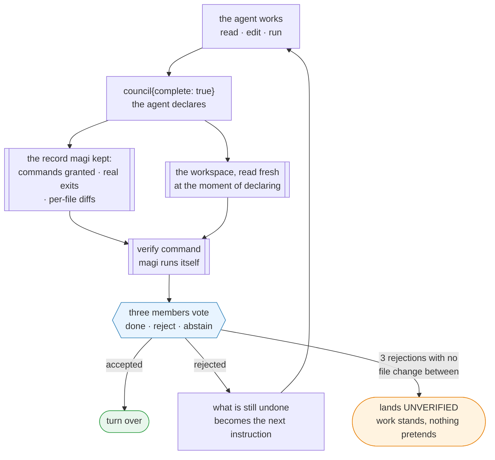
```mermaid
flowchart TD
    S[the agent works<br/>read · edit · run] --> D["council{complete: true}<br/>the agent declares"]
    D --> REC[[the record magi kept:<br/>commands granted · real exits<br/>· per-file diffs]]
    D --> NOW[[the workspace, read fresh<br/>at the moment of declaring]]
    REC --> V[[verify command<br/>magi runs itself]]
    NOW --> V
    V --> M{{three members vote<br/>done · reject · abstain}}
    M -->|accepted| E([turn over])
    M -->|rejected| FB[what is still undone<br/>becomes the next instruction] --> S
    M -->|3 rejections with no<br/>file change between| U([lands UNVERIFIED<br/>work stands, nothing pretends])

    style E fill:#e8f6ec,stroke:#2f9e44
    style U fill:#fff3e0,stroke:#e8820c
    style M fill:#e8f4ff,stroke:#2c7fb8
```

Three members, three lenses, and one of five ways to count them. Whatever you pick, the ambiguous
result resolves the same way:

| `rule` | The turn ends when | Where an abstention lands |
|---|---|---|
| `unanimous` | every member who voted said done | it is not counted at all, so the remaining voters decide |
| `majority` *(default)* | done is a **strict** majority of those who voted — a tie is not | it leaves the vote; 1–1 with one abstaining is *continue* |
| `quorum:2` | at least k members said done | it neither helps nor blocks; k real accepts are still needed |
| `weighted:0.6` | done's share of the **voted** weight meets θ | it carries no weight either way |
| `veto:Balthasar` | the named member did not object, **and** the rest are a majority | an abstention from the named member is not an objection |

A member that errored, timed out, or answered unreadably **abstains** rather than blocking the
gate. So a flaky backend degrades the vote; it cannot freeze the loop. And every ambiguous outcome
resolves to *continue*: a tie, an unknown rule name, and a `quorum` with a garbage `k` all fail
towards the turn carrying on, because the failure a stalled turn produces is cheaper than the one a
false completion produces.

**Rejection is bounded.** The gate exists to stop a false "done"; unbounded, it also stopped a true "I could not" — measured live, an honest declaration on a task the run's own permission mode made impossible was rejected for eighteen straight rounds until an external kill. After three consecutive rejections with **no file mutation between them** (or eight in one turn regardless), magi lands the turn **UNVERIFIED** with the reason on the record: the work stands, the agent is asked for its honest final account, and nothing pretends the council accepted. Real iteration is unaffected — a declaration separated from the last by actual work gets the longer rope. `MAGI_COUNCIL_REJECT_CAP=0` restores the uncapped loop for A/B.

If the agent never declares, magi reminds it up to three times and then lands the work as it stands, recorded as ending undeclared instead of finished. `MAGI_DECLARE_FINISH=0` restores the old passive finish (the turn ends when the model stops calling tools) for an A/B.

Set `[council] enabled = false` to remove the tool entirely; with nobody to declare to, the requirement cannot apply and the loop finishes passively.

### There is one agent

magi used to spawn subagents, plan the work into steps, author executable checks for each step, and hold the turn open until a council voted the checks satisfied. All of it is gone, and by default there is still exactly one agent: **magi ships none.**

The reason is in the logs. Every one of those stages decided something *before* the work existed, and the costliest defects were of exactly one kind: magi believing a judgement it had made in advance over the record of what actually happened — a port probe that passed only while the server was down, a grep demanding a hyphen where the generator writes an underscore, a brief paraphrased until the graded identifier was gone. A check written in advance can be wrong about the work; a record of what magi granted cannot be wrong about what it granted, and where the record is incomplete it says so.

What is left is the loop, the tools, the record, and a council the agent calls when it wants one. Long-running work goes to `bash background=true` and is watched with `bash_output`/`wait_for` — visible in its own pane (§4), with its real exit read when it lands.

### Subagents, when you want one

A plugin can register one (EXTENDING §3.9). magi provides the seam and no policy:

- **Off unless asked.** A subagent is listed in `/subagents` and switched on there; a plugin can also ship one switched off. A subagent that is off is not advertised to the model at all, so it costs nothing per request.
- **Nothing is summarised.** The child gets the plugin's prompt and the tool's own arguments **verbatim**, plus AGENTS.md, the environment and the working tree — never a curated slice of the parent's conversation. The tool arguments are the filter, chosen by the side that has the full context, because a paraphrased brief is how this tree lost graded identifiers six times out of six.
- **Bounded, and it cannot recurse.** A child gets a step count and a clock, the whole tool call gets a cumulative budget, and a child is handed no way to spawn.
- **You can see it.** It runs in its own pane with its own transcript (§4).
- **You can read what it did, and put it back.** `magi.child_steps` returns the calls it made with the raw output of the failed ones; `magi.restore_child` puts its file changes back and names what it could not. Neither is automatic.

#### Why a child is expensive to undo, and what a companion does about it

Both of the last two bullets exist because of one asymmetry, and it is worth naming because it is
the reason the fleet is shaped the way it is.

A loop has two kinds of undo, and they are not the same kind of thing:

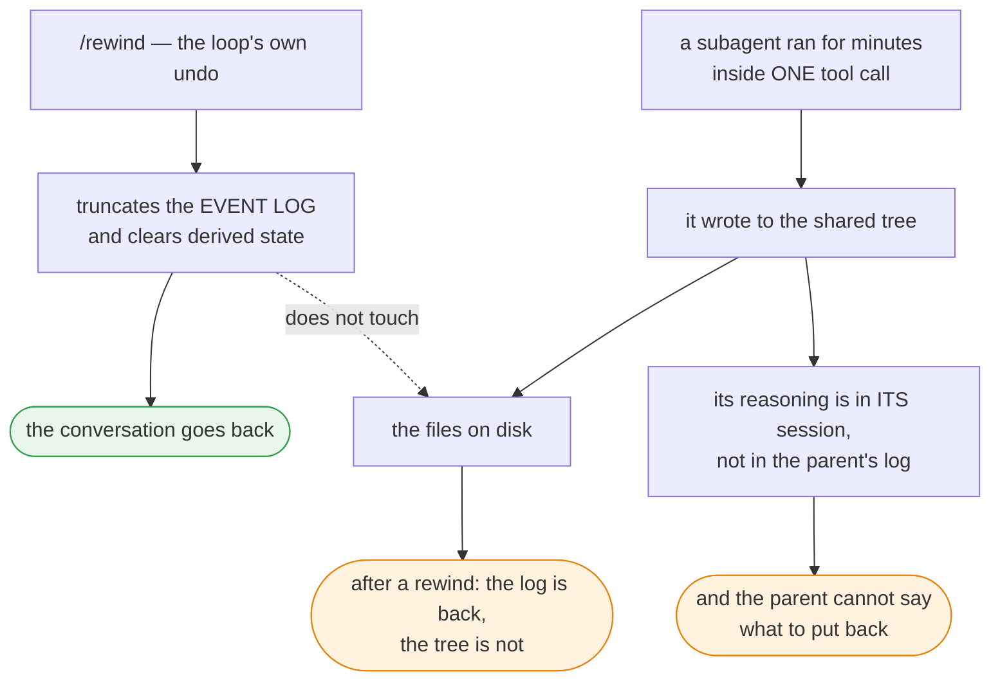
```mermaid
flowchart TD
    R["/rewind — the loop's own undo"] --> L["truncates the EVENT LOG<br/>and clears derived state"]
    L --> T1(["the conversation goes back"])
    L -.->|"does not touch"| F["the files on disk"]
    C["a subagent ran for minutes<br/>inside ONE tool call"] --> W["it wrote to the shared tree"]
    W --> F
    W --> S["its reasoning is in ITS session,<br/>not in the parent's log"]
    F --> Q(["after a rewind: the log is back,<br/>the tree is not"])
    S --> Q2(["and the parent cannot say<br/>what to put back"])

    style T1 fill:#e8f6ec,stroke:#2f9e44
    style Q fill:#fff3e0,stroke:#e8820c
    style Q2 fill:#fff3e0,stroke:#e8820c
```

`magi.restore_child` is the answer to the right-hand branch, and its shape admits the difficulty:
it is best-effort, it reports every path either way — a loop told only "done" would build its next
round on a tree it believes is clean — and it is **deliberately not automatic**, because a failed
attempt's leavings are sometimes the evidence the next round needs.

**Parallelism makes it worse, not better.** The parent's edit guard reads each file before and
after a write; that is only race-free while writes are serialised. Two children writing to one tree
produce an interleaving nobody can reconstruct afterwards — the log can say both wrote, and cannot
say which write survived. So concurrency is not granted by default; it is bought, in one of two
ways, and both are declarations the host **checks rather than trusts**:

| declaration | what it gives up | what it buys | what comes back |
|---|---|---|---|
| `readonly_children` | writing, entirely — a spec asking for anything outside `read`/`grep`/`glob`/`list` is refused by name | two calls in one step run at once, with nothing to undo | text |
| `isolated_children` | the shared tree — each writing child gets its own checkout, its shell pinned to `workspace-write` | the same concurrency, for children that do write | a **commit range**, merged only when you call `magi.merge_child` (git's three-way merge, so a conflict arrives as markers rather than a silent overwrite) and never committed in the parent |

**A companion moves the boundary one level further out.** It has its own workspace, its own event
log, and the one-turn-at-a-time rule inside it. `hand_off` therefore never puts another agent's
mutations in your tree: what comes back is text, into your conversation. Handed-over work also
cannot be handed on again, so every mutation has exactly one owner and exactly one log to answer
for it.

The cost of that is real and worth stating plainly: **you cannot roll back from here what a
companion did over there.** You ask it to, or you go to its workspace and do it. The design trades
undo-across-the-fleet for a question that always has one answer — who wrote this, and which log
says so.

magi bundles one example, **Seele** — a planner that reads and analyses and returns a step list, with no write tools in its allowlist at all. It ships **switched off**.

## 7. Memory & Context

A turn's context is assembled, not accumulated. Some of it is written by you and never leaves;
some is what the agent has learned and is pulled in when it looks relevant; most of it is the
conversation, and that is the part with a ceiling.

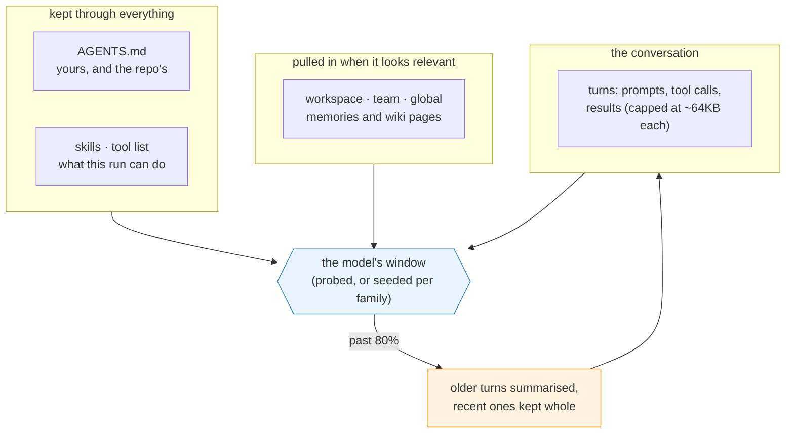
```mermaid
flowchart TD
    subgraph fixed [kept through everything]
        AG["AGENTS.md<br/>yours, and the repo's"]
        SK["skills · tool list<br/>what this run can do"]
    end
    subgraph learned [pulled in when it looks relevant]
        M3["workspace · team · global<br/>memories and wiki pages"]
    end
    subgraph live [the conversation]
        T["turns: prompts, tool calls,<br/>results (capped at ~64KB each)"]
    end
    fixed --> W{{"the model's window<br/>(probed, or seeded per family)"}}
    learned --> W
    live --> W
    W -->|"past 80%"| C["older turns summarised,<br/>recent ones kept whole"]
    C --> live

    style W fill:#e8f4ff,stroke:#2c7fb8
    style C fill:#fff3e0,stroke:#e8820c
```

Compaction only ever touches the conversation. AGENTS.md survives it by construction, which is why
a house rule belongs there and not in a message you hope stays in the window.

The learned half is three directories, read most-specific first — so a fact about *this* repo wins
over the team's habit, and the team's habit wins over the general one:

| tier | where | who can see it |
|---|---|---|
| workspace | `<workspace>/.magi/experience` | this workspace, and anyone who clones the repo |
| team | `<config>/teams/<name>/experience` | every companion on this machine that declared that team — and, if the machines hold each other's fleet key, the other machines too (`exp-sync`, §13) |
| global | `<config>/experience` | all of this person's magi, this machine only |

- **AGENTS.md**: the contents of the working directory's (+ `.magi/AGENTS.md`, global `<config>/AGENTS.md`)
  are injected into the system prompt and **preserved even through compaction**. Auto-generate with `/init`.
- **Auto-compaction**: when token count (the larger of the backend's real count and the live estimate) exceeds 80% of the model window, older turns are summarized (recent ones preserved). The window is **per model** (different agents can run different models, each with its own window), resolved from the model registry; for an unseeded model magi **probes the backend** for its real context length (vLLM `max_model_len`, LiteLLM `/model/info`, Ollama `/api/show`) — at startup for the initial model, and **lazily the first time any other model is used** (e.g. after a runtime `/route` switch). Claude/Gemini expose no such endpoint, so they rely on the seeded table. A `:tag` variant with no exact seed **inherits its base model's window** (e.g. `qwen3-coder:480b-cloud` → the `qwen3-coder` family's largest seeded window), used immediately — including while an exact-window probe runs in the background — so a known family isn't mis-treated as unlimited. A model with no usable window (no exact seed, no family match, no probe result) is treated as **unlimited** (no % gauge, no ratio compaction) rather than mis-sized to a tiny fallback; override any model's window with `/context <model> <tokens>`.
- **Tool-result cap**: a single tool result is capped (~64KB) before it enters the context, so one huge output (e.g. reading a 500KB file) can't blow the window past what compaction can recover — the agent is told to narrow its read/command.
- **Shared brain (D13)**: three tiers, most specific first — `<workspace>/.magi/experience` (that
  workspace and its repo), `<config>/teams/<name>/experience` (every companion on this machine that
  declared that team), `<config>/experience` (all of this person's magi). The `remember` tool writes
  straight into them — there is no review queue. Make a directory a git repo and commit/pull to
  share it by hand; machines that hold each other's fleet key share the team tier automatically
  (`exp-sync`, §13). Bootstrap / file format: [`EXTENDING.md`](EXTENDING.md) §2.
- **Shared wiki**: beside the append-only memories, the team tier holds **canonical pages** — the
  current truth about one topic each, written and CORRECTED in place with `remember{page:…}`, read
  through `recall_memory`, advertised as a title index in the agent's context. A page that stopped
  being true is marked stale with the reason, never deleted. The web console's **Knowledge** screen
  shows every page with its editor, tier and edit summary, including the stale tombstones.

## 8. Skills

`<config>/skills/*.md` or `<workdir>/.magi/skills/*.md` (first line = description, rest = body), plus the **skill-creator layout** `<workdir>/.claude/skills/<slug>/SKILL.md` (frontmatter `description` = trigger) — the standard skill-creator format that Claude Code tooling and the bundled engram plugin produce, readable without conversion.
The list is exposed in the system prompt, and the model loads a body with the `skill` tool to follow it. The skill list refreshes when the source dirs change (mtime), so a skill engram saves mid-session is available on the next turn without a restart.

## 9. Plugins (Lua)

`plugin.toml` + `init.lua` in `<config>/plugins/<name>/`.

Plugins come from three places, and only one of them is a question of trust:

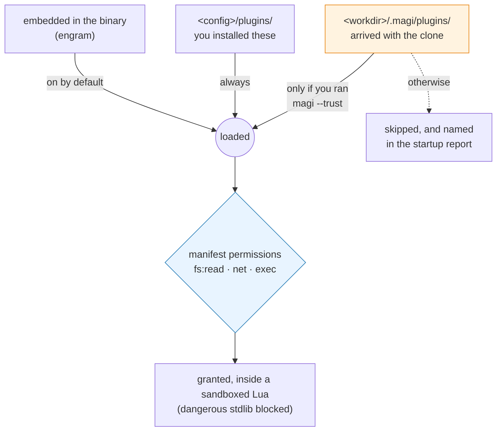
```mermaid
flowchart TD
    E["embedded in the binary<br/>(engram)"] -->|"on by default"| L((loaded))
    G["&lt;config&gt;/plugins/<br/>you installed these"] -->|"always"| L
    W["&lt;workdir&gt;/.magi/plugins/<br/>arrived with the clone"] -->|"only if you ran<br/>magi --trust"| L
    W -.->|"otherwise"| S["skipped, and named<br/>in the startup report"]
    L --> P{"manifest permissions<br/>fs:read · net · exec"}
    P --> R["granted, inside a sandboxed Lua<br/>(dangerous stdlib blocked)"]

    style W fill:#fff3e0,stroke:#e8820c
    style P fill:#e8f4ff,stroke:#2c7fb8
```

⚠ A plugin declares its own permissions in its own manifest, and they are granted — which is a fair arrangement for a directory you installed into and none at all for one that arrived with a clone. So `<workdir>/.magi/plugins/` is loaded only from a workspace you have trusted (`magi --trust`, see §config); magi names what it found and skipped. A one-off is still `magi -plugins .magi/plugins`.
Capabilities: `tool`, `command` (slash commands like `/login`), `context-provider`, `mcp`, `llm-headers`, `analyze`, `experience` (magi.propose_experience — route plugin-learned lessons/skills into the D13 shared store's review queue), `notify` (magi.notify — append a system ⟳ note to a session's transcript, the active-notification channel; the model sees it next turn). `magi.remove_file` deletes a workdir file/dir under the same fs:write grant — the undo half of artifact-writing plugins. **Hot-reload** on file change.
Sandboxed (dangerous stdlib blocked) + manifest permissions (`fs:read`, `net`, `exec`) enforced.
Example: `plugins/examples/wordcount`.

**Observer plugins.** Beyond the lifecycle events (`startup`/`shutdown`/`session_start`), `magi.on` accepts two **observation events** carrying a payload table: `user_message` (`{session, text}` — a genuine user prompt was submitted) and `turn_finished` (`{session, text, outcome, reason, skills}` — a top-level turn ended with that final assistant answer; `skills` = comma-joined skill names the agent loaded this turn, for usage metering). `outcome` is the turn's **structural verdict**, so an observer never has to guess success from phrasing: `verified` (the council accepted the finish declaration), `unverified` (landed without that acceptance — never declared, or declared and not accepted within the round cap), `guard` (loop/stall guard force-stop), `error`, `ungated` (the turn used tools but no council ran — council disabled, or workflow mode — so the completion is unconfirmed and must not be booked as a success without user confirmation), or `done` (a plain conversational finish that used no tools); `reason` carries the cause when there is one. They fire **asynchronously off the turn path** (a bounded queue + one worker), so a slow handler never delays the conversation; overflow drops events (observation is best-effort). Paired with **`magi.analyze{system=, text=, model=?}`** — a one-shot, **tool-free sidecar LLM call** (capability `analyze`, since it spends tokens; time-capped; model defaults to the session model) — and **`magi.json_decode(s)`**, a plugin can watch the conversation, extract structured knowledge (lessons, summaries), and persist it with `magi.write_file`, then feed it back via `magi.register_context_provider`. The bundled **`plugins/engram`** self-improvement plugin (auto lesson/skill extraction gated on the structural outcome) is the reference user of this trio — see its README. What it does with them is a loop:

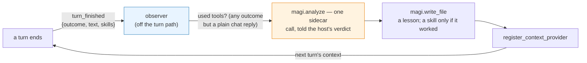
```mermaid
flowchart LR
    T["a turn ends"] -->|"turn_finished<br/>{outcome, text, skills}"| O["observer<br/>(off the turn path)"]
    O -->|"used tools? (any outcome<br/>but a plain chat reply)"| A["magi.analyze — one sidecar<br/>call, told the host's verdict"]
    A --> W["magi.write_file<br/>a lesson; a skill only if it worked"]
    W --> C["register_context_provider"]
    C -->|"next turn's context"| T

    style O fill:#e8f4ff,stroke:#2c7fb8
    style A fill:#fff3e0,stroke:#e8820c
```

Note what `outcome` gates. It is not whether to learn — a turn that failed is worth more than one
that went smoothly — but what the lesson is allowed to claim. The analyzer is handed the host's
verdict (`verified` means the council accepted the finish; `guard` means a stall guard stopped it)
and told not to write a lesson that contradicts it, so "I fixed it" cannot be recorded about a turn
that was killed mid-stall. A failure is filed as a failure, and only a confirmed success is allowed
to become a reusable skill.

```toml
# plugin.toml
name = "wordcount"
capabilities = ["tool"]
permissions = ["fs:read:."]
```

**Embedded plugins.** The binary ships the **engram** self-improvement plugin (auto lesson/skill capture — see `plugins/engram/README.md`). It is **on by default**; disable it (it spends sidecar LLM tokens and writes knowledge files into the workspace) with:

```toml
[plugins.engram]
enabled = false
```

`MAGI_EMBEDDED_PLUGINS=off` disables ALL embedded plugins regardless of config — use it for automation/bench runs whose measured behavior must not shift.

On exit, magi briefly drains queued observation events so an observer's sidecar analysis (e.g. engram's lesson extraction) can land before the process dies — important for a headless one-shot that would otherwise exit mid-analysis. The wait is bounded (default `30s`) so a *slow* sidecar model can't hang exit; override with `MAGI_DRAIN_TIMEOUT` (a Go duration, e.g. `5s`, `2m`). With embedded plugins off there is nothing to drain.

An enabled embedded plugin is materialized under `<config>/plugins-embedded/` at every start, so it always tracks the binary's version — updates ride `magi --update`, no separate plugin update. A same-named plugin in the regular plugin dirs takes precedence (fork it there to customize). **Forks bundling their own plugins** edit one file: `plugins/embedded.go` (add the plugin dir, a `//go:embed all:<name>` var, and an `Embedded` map entry — subdirectories ship too).

**Install / update.** A plugin published as a git repo (its repo root holds `plugin.toml`)
installs with `magi --plugin-install <git-url> [--plugin-pin <tag/branch>]`, which clones it
into `<config>/plugins/`. `magi --update-plugins` (or `--update`, which also updates the
binary) fast-forwards every git-checkout plugin; local changes or a missing remote are
reported and skipped rather than overwritten. See §Version / self-update.

## 10. MCP

Declare `[mcp.<name>]` in `config.toml` and it is spawned over stdio JSON-RPC, with its tools
auto-registered. When the server shuts down, those tools are removed.

> Step-by-step add/verify/troubleshoot: [`EXTENDING.md`](EXTENDING.md) §1.

## 11. Model Recommendations

| Model | Runs where | Needs | Use it when |
|---|---|---|---|
| **`gpt-oss:120b-cloud`** | Ollama's free cloud tier (`ollama signin`) | no GPU | **the default** — strong at both general work and code, and nothing to download |
| `qwen3-coder:480b-cloud` | same tier | no GPU | a hard task you are willing to spend the quota on |
| **`qwen3-coder:30b`** | your machine | ~24 GB GPU | the strongest fully local coder — no network, no quota |
| `gpt-oss:20b` | your machine | less | a lighter local option; it shows its reasoning |
| llama3.1:8b and similar | your machine | little | **not recommended** — small models leak function calls into prose once tools are active |

The free tier means "light usage" (one request at a time, and a GPU-time quota), so the heavier
`480b` eats it fast. If you are choosing a local model by size, judge it by **active** parameters
rather than by the file: a mixture-of-experts model with ~3B active runs several times faster than
a dense model of the same weight, and the difference is wall-clock you spend on every single step.

**Provider resilience (why a flaky backend rarely loses your turn).** magi treats the OpenAI-compatible layer as best-effort and recovers rather than aborting where it safely can:
- **Tool-call parsing** — it parses all tool-call variants of local/cloud models (JSON/XML/native), and if a backend rejects `cache_control` (400/422) it transparently retries once without caching and remembers that for the session.
- **Transient failures** — connection errors and 429/5xx are retried with bounded backoff (honoring `Retry-After`); an exhausted retry surfaces the **status + body** so the failure is diagnosable, never a bare "request failed".
- **Harmony tool-call misparse** — Ollama's gpt-oss harmony parser sometimes **500s when the model emits its final answer as prose** but the server tries to read it as a tool call (`error parsing tool call: raw=…`). Because the request is unchanged across retries the 500 is deterministic, so magi retries **once with the tools array stripped**: with no tools advertised the server skips tool-call parsing and returns the same prose as normal content — the answer the model actually produced is recovered instead of the turn hard-aborting. Scoped to that exact signature, so a genuine outage still surfaces as an error.

## 12. The console (`magi-web`)

> The screens, the design rules and why each is the way it is: [`UI.md`](UI.md).
> A clickable demo of the page (mocked data, no server): <https://sayaya1090.github.io/magi/>.

A web view of every magi on the machine — and, if you point it at others, on other machines. It is
a **second surface on the same daemons**, not a service of its own: it derives what it shows from
the event logs already on disk, and everything it *does* goes over the same sockets `--attach` uses.
Stop the console and nothing stops working.

It earns its place once you are running more than one agent. A terminal shows you one. The console
shows you which of the five is blocked on a question, which finished while you were away, and what
each of them has learned.

<div align="center">
<a href="https://sayaya1090.github.io/magi/">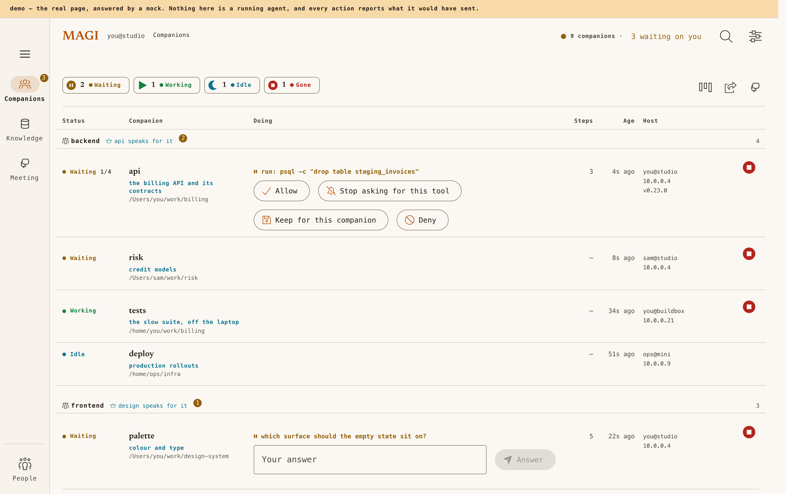</a>

<sub>The list every other screen hangs off. A row that needs you says so, and says which of the two kinds it needs.</sub>
</div>

<table>
<tr>
<td width="50%" valign="top"><a href="https://sayaya1090.github.io/magi/?d=%2Fdemo%2Fdesign.sock">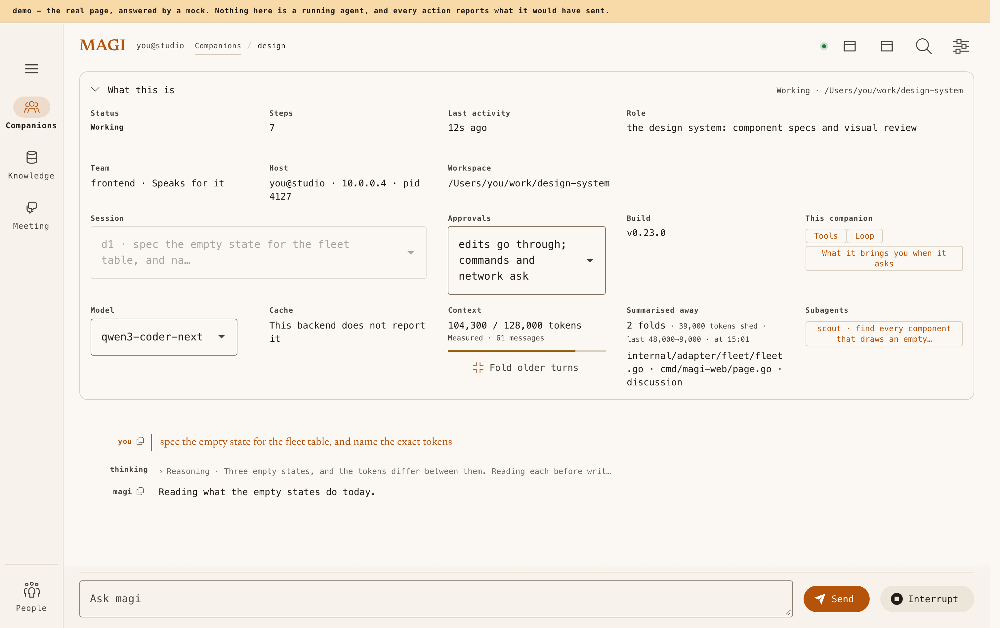</a><br><b>§12.3 — one companion.</b> The transcript with real exit codes, and anything it is blocked on.</td>
<td width="50%" valign="top"><a href="https://sayaya1090.github.io/magi/?d=%2Fdemo%2Fdesign.sock">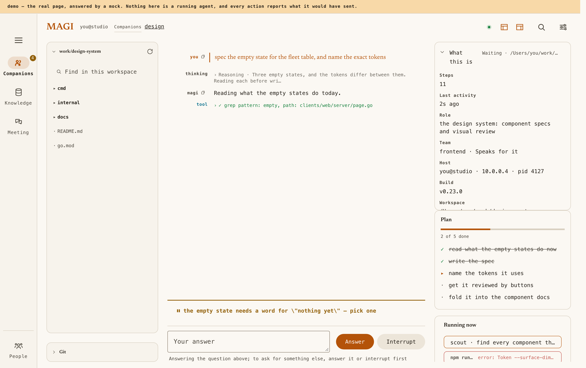</a><br><b>The workspace pane.</b> The tree and the git state as that companion sees them, beside the conversation.</td>
</tr>
<tr>
<td width="50%" valign="top"><a href="https://sayaya1090.github.io/magi/?v=meet">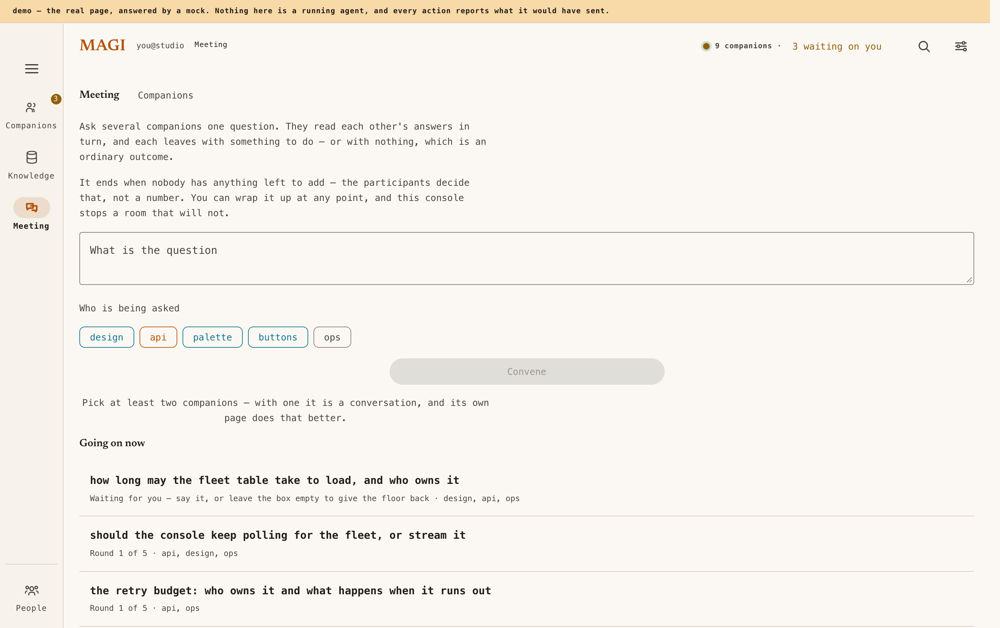</a><br><b>§12.5 — meetings.</b> Several companions on one question, then the conclusions go out as work.</td>
<td width="50%" valign="top"><a href="https://sayaya1090.github.io/magi/?v=skills">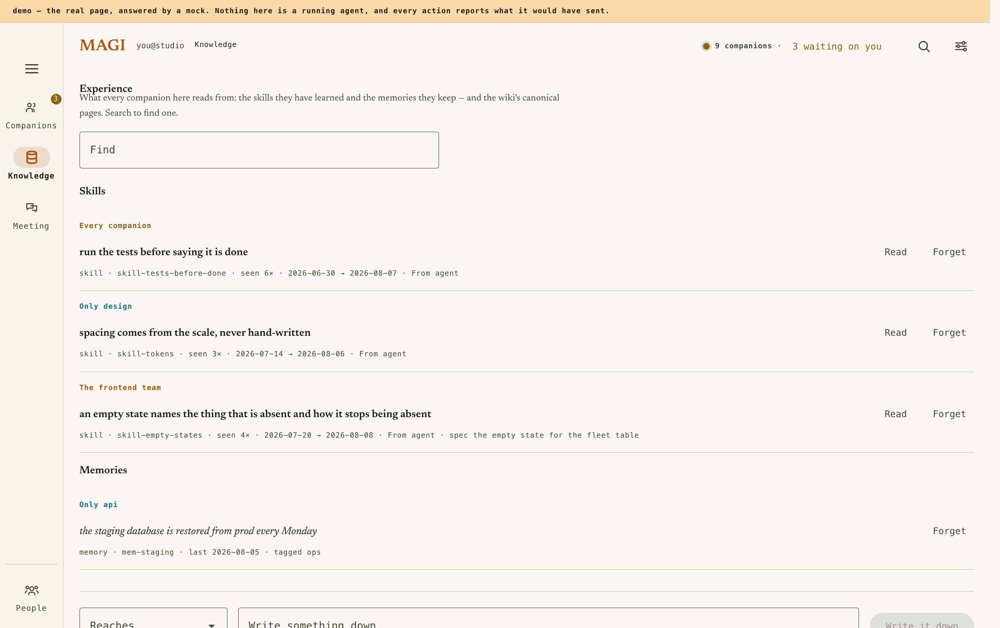</a><br><b>Knowledge.</b> Skills, memories and the wiki — each labelled with how far it reaches (§7, §8).</td>
</tr>
</table>

### 12.1 Running it

```sh
./magi-web                                   # http://127.0.0.1:7777
./magi-web -addr 127.0.0.1:7788
./magi-web -config-dir /path/to/config       # which daemons it can see
./magi-web -workdir /path/to/repo            # the workspace it defaults to
./magi-web -peer laptop=http://10.0.0.4:7777 -peer ci=http://10.0.0.9:7777
./magi-web -exposed -tls-cert cert.pem -tls-key key.pem   # more people than you can reach it
./magi-web -exposed -tls-cert cert.pem -tls-key key.pem -user-header X-Forwarded-User
./magi-web -emit-demo ./out                  # write the page as static files and exit
```

The console is a viewer, not a second engine. Everything it shows it asked a daemon for, over the
same socket a terminal would use:

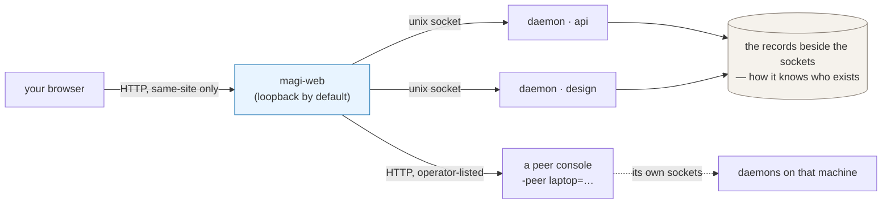
```mermaid
flowchart LR
    B["your browser"] -->|"HTTP, same-site only"| W["magi-web<br/>(loopback by default)"]
    W -->|"unix socket"| D1["daemon · api"]
    W -->|"unix socket"| D2["daemon · design"]
    W -->|"HTTP, operator-listed"| P["a peer console<br/>-peer laptop=…"]
    P -.->|"its own sockets"| D3["daemons on that machine"]
    D1 & D2 --> R[("the records beside the sockets<br/>— how it knows who exists")]

    style W fill:#e8f4ff,stroke:#2c7fb8
    style R fill:#f5f2ec,stroke:#8a8178
```

Two consequences worth holding on to. The console has **no store of its own** — a companion's
transcript, plan and history are read from the daemon that owns them, which is why a console can be
restarted mid-anything. And actions on a **peer's** companions are forwarded to the console that
owns them, because that machine's sockets are not this one's to dial.

- **Loopback by default, and no login of its own.** It is reached however your organisation allows —
  an `ssh -L` tunnel, or your own proxy with your own SSO in front of it. Building accounts into it
  would be a second door beside the company's, and the second door is always the weaker one.
- **Every route is same-site only.** Each handler is wrapped, so a page on another origin cannot
  POST to it — the console has no tokens to steal, and its buttons stop daemons.
- **`-peer name=url` federates another console.** A peer's companions merge into the list stamped
  with its name; actions on them are forwarded to the console that owns them, because that machine's
  sockets are not this one's to dial. A peer that does not answer becomes a **row saying so**, since
  a machine that went quiet is the thing most worth seeing. Peer URLs come from the operator only —
  never from a page or from another peer's answer.
- **`-exposed` is for a console more people than you can reach** — behind an authenticating proxy,
  an SSO gateway, a tunnel a team shares. Nothing here can find that out on its own (a request
  forwarded by a proxy is a loopback connection like any other), so you say it. It turns off the
  two routes that make the **machine** run something the caller chose, outside the permission
  policy an agent's tool calls go through: `/shell`, and writing an MCP server's command line,
  which a daemon spawns at startup. Reading the MCP list stays. Prompts, answers, cron and dispatch
  stay too — they reach the machine through the agent, and refusing them leaves a console that
  cannot be used for the thing it is for. **It does not authenticate anything**; it narrows what an
  authenticated caller may ask for.
- **`-exposed` requires `-tls-cert` and `-tls-key`, and refuses to start without them.** The
  authentication is in magi rather than in front of it, so whatever identifies a person crosses
  this connection — in plaintext it is on the wire, and loopback does not save it: the port is
  reached through something forwarding to it. Without `-exposed` they are optional and rarely
  wanted; one operator over their own tunnel gains nothing from a certificate they had to invent.
  Half a pair is refused either way, since it would serve plaintext while somebody believed
  otherwise.
- **`-exposed` with `-peer`: looking crosses, acting does not.** A peer is reached on *your* tunnel
  with your keys, and a request this console forwards carries no identity — so on a shared console,
  anybody the gateway admits would be acting as the operator on another machine, unattributably.
  The old answer was to refuse the combination outright, which also removed the arrangement people
  actually want (one console, several machines, several people looking). Now the federated view
  works on a shared console, and a CHANGE aimed at a peer's companion is refused with the address
  of the console that can make it — do it where that companion lives.
- **Changes are recorded** in `console-audit.jsonl`, beside the session store
  (`~/Library/Caches/magi` on macOS, `~/.cache/magi` on Linux, `%LocalAppData%/magi` on Windows;
  `MAGI_DATA_DIR` moves it). One JSON line per request that changes something: time, method, path,
  the companion it named, where it came from, and the status — refusals included. Reads are not
  recorded; the page polls, and a file that is nine parts noise is one nobody opens. The body is
  never recorded — the session log already holds every word, and this is the record of the door.
  It only grows; delete it when you want it gone.
- **`-user-header NAME` is where "who" comes from.** magi has no accounts, so the only thing that
  knows who is talking is the gateway in front: name the header it sets (`X-Forwarded-User`,
  `X-Auth-Request-Email`, `Cf-Access-Authenticated-User-Email`, `Tailscale-User-Login`, …) and it
  is written into each line. Unset, the record says where a request came from and not who sent it.
  It is not verified and cannot be: it is worth exactly what "the gateway is the only way in" is
  worth, which is what the loopback bind protects.
- **`auth.toml` decides what each person may do**, and until it exists nothing changes: no file
  means one operator, which is what every console is until something authenticating is put in
  front of it. It lives in the console's own config directory and is never read from a workspace —
  `config.toml` merges with a project's `.magi/config.toml`, and a repository that can grant
  itself a role owns the machine.

  ```toml
  # ~/.config/magi/auth.toml     (0600)
  [people."kim@corp.com"]
  role = "operator"

  [people."lee@corp.com"]
  role = "responder"
  companions = ["docs", "palette"]   # absent = every companion
  ```

  Three roles come built in and are ordinary roles — editable, replaceable:

  | Role | May |
  |---|---|
  | `operator` | everything, including `admin` and `shell` |
  | `responder` | `read`, `answer` |
  | `viewer` | `read` |

  The capabilities are read off the routes rather than invented: `read` (anything that only
  looks), `answer` (resolve a permission or question, interrupt), `prompt` (submit, steer,
  dispatch, compact, move to another conversation), `curate` (skills, remember/forget, the report
  format), `configure` (model, approval mode, cron, MCP servers), `admin` (people and roles),
  `shell` (`/shell`; never on an `-exposed` console, where the route does not exist).

  ```toml
  [roles.reviewer]                    # your own, over the same seven
  can = ["read", "answer", "curate"]
  ```

  **Who is asking comes from `-user-header`** (above), so a policy is only enforceable on a console
  that has something in front of it naming people. On a configured console an unnamed caller is
  nobody — not the operator — which is the hole the whole thing exists to close.

  A file that is present and wrong stops the console: one that will not parse would leave nobody
  able to do anything, one naming a capability this build does not have would leave somebody
  believing they granted something, and one that lists people with no `admin` among them cannot be
  fixed by anybody afterwards.
- **`-peer` and the cluster (§13.7) are different things.** A peer is a console the operator listed,
  for a person to look at. A cluster is companions telling each other who exists, for work to be
  handed across. Neither reads the other's list.

### 12.2 What is on the screen

The rail on the left has two destinations, and a companion's page lives inside the first.

| Destination | What it holds |
|---|---|
| **Companions** | every daemon this console can see: state, what it is doing, host and IP, how long it has been idle, how far through its plan (`3/7`), and what it is carrying for other companions. Tiles at the top filter by state and carry the count of who is waiting on a person. A row opens that companion |
| **Shared** | the experience store and the MCP servers, together, in the order they happen: what has been said often enough to become a rule, then the rules, then what the companions can reach. Each experience row says what it reaches ("every companion" / "the frontend team" / "only api"), what the agent was doing when it learned it, and the body — and a wrong one can be forgotten. MCP servers can be added, changed or removed; the change is written to that companion's config and attaches when its daemon next starts |
| **Board** | work as cards, a column per companion, and a day you can move. The column is who did it rather than a state, because there is no such thing as the state a companion was in last Tuesday. Cards are grouped by the `label` the agent gave the work |

### 12.3 A companion's page

Opened from a row, addressed as `/?d=<socket path>`. Two things happen here: watching, and saying
something. So the page is the conversation, with everything else beside it.

Where those parts sit, on a screen wide enough for both panes:

```
┌──────┬──────────────────────────────────────────────┬────────────────────────┐
│ rail │  design / api / ops · breadcrumb   ⌘K  ☰     │                        │
│      ├──────────────────┬───────────────────────────┤   the facts pane       │
│ 컴패 │ the workspace    │  the conversation         │   ─────────────────    │
│ 니언 │ ───────────      │  ────────────────         │   what this is         │
│      │ a tree, read one │  the transcript, live     │   running now          │
│ 지식 │ directory at a   │  over /events — folded    │   plan            3/7  │
│      │ time             │  tool calls, thinking,    │   handed out           │
│ 회의 │                  │  council rounds, diffs    │   history              │
│      │ ── Git ──        │                           │   cron                 │
│      │ staged / changed │  ┌─────────────────────┐  │                        │
│      │ commit · PR      │  │ composer — a STEER, │  │   (the handle is the   │
│      │                  │  │ not a new turn      │  │    icon top-right;     │
│      │                  │  └─────────────────────┘  │    it remembers)       │
└──────┴──────────────────┴───────────────────────────┴────────────────────────┘
   under 840px: the two panes become two tabs, and the conversation is the one
   that lands — a phone opening a file used to put 0px of conversation on screen
```

**The conversation.** The transcript live over an event stream (`/events`), rendered the way the TUI
renders it: folded tool calls that open, thinking blocks, council rounds with each member's verdict,
diffs, and a bar under a call that is still running. A tool call says how it ended with a glyph, and
opening one fold opens that kind.

**The composer.** Typing and sending goes in as a **steer**, not a new turn — the daemon may already
be working, and the engine is the one that decides which it is. `중단` / Stop interrupts. When the
companion is blocked on a permission or a question, the prompt appears here with its buttons, and
answering it from the page resolves the same call an attached terminal would have answered.

**The facts pane, on the right.** Its handle is the icon at the top right of the pane; it remembers
whether you left it open. It holds, top to bottom:

| Card | What it is |
|---|---|
| What this is | state, workspace, role, team (and whether it speaks for the team), host · IP · pid, steps, last activity, session id — folded to one line until you want it. The state line also says what this companion is carrying for others ("1 handed over, 2 waiting"): its state is read from the session a person attaches to, and handed-over work runs elsewhere, so without that line a companion answering a neighbour reads as idle |
| Running now | what is going on beside the turn — a background command with its last line, a spawned child that can be opened. It was a strip over the composer, on screen at every width whatever you were doing; it is a card here because it is a thing you consult |
| Plan | the agent's own todo list as it last recorded it, with a progress bar. Read out of the log, so it is right for a companion that is stopped, resumed elsewhere, or was working while you were not watching |
| Handed out | what this companion gave to others and what came back. Read out of the conversations the work actually ran in — one per asker, opened under an actor that says who asked — rather than out of the session a person attaches to, where it never was |
| Scheduled | its unattended jobs (§14): the line, when each next fires, and whether it is on |
| What you had to say | the interjections a person made, over the last week by default — the record of where it needed steering |
| What it has done | earlier sessions, searchable by word (`/search?q=`), each opening to its transcript |

**The workspace, on the left.** The tree is read one directory at a time and only the folders you
open; what has been read is kept for a few seconds so that arriving at the panel, coming back to the
tab or unfolding a folder does not walk it again. Two things throw that away rather than ageing it
out: a change this console made (a save, a new file, a rename), and the ⟳ control in the card's
head, which is for the file that appeared because of something the console cannot see. Finding a
file is a dialog — a field and a choice between names and contents — and while a search is on, the
pane IS the search: opening a hit no longer puts the plain tree back under your next press.

On a touch screen the per-row controls (a file's menu, a changed file's stage/unstage/discard/diff)
are simply there. They appear on hover for a pointer and there is no hover on a phone, so they were
unreachable — the features existed and could not be used.

**Git, commits and pull requests — from the page.** The workspace card is not read-only. Beyond
stage / unstage / discard / diff on a changed file, the console can take the change all the way out:

- **A file preview** opens any file's current contents without leaving the page (the same read a
  tool would do) — for glancing at what changed before you act on it.
- **Generate a commit message** asks the companion to write one from the staged diff, so you are not
  composing it by hand; you can edit it and commit from the page.
- **Open a pull request** creates a GitHub PR for the branch, and **generate a PR body** drafts its
  description from the commits — the facts (branch, base, commits) are gathered for you first.

Use these when you have been supervising a companion's work and want to land it without dropping
to a terminal: review the diff, have it write the commit or PR text, push. They are the same
capabilities a person with the `configure`/write role has; a viewer-only console shows the diff but
not the buttons.

**The report format (a `curate` capability).** `ask_user` — the tool a companion uses to ask *you* a
question mid-turn — is held to a **report contract**: the shape an answer, or a blocked part, must
come back in, so "the part I couldn't do" returns as that part rather than as a paragraph about why
it was hard. The console has a small editor for that contract (reached from the companion's curate
controls). Edit it when your companions' questions or hand-off answers keep coming back in a shape
that is awkward to act on; leave it alone and a sensible default applies.

Below 840px there is no room for two panes, so the two become tabs and the conversation is the one
you land on. Each window holds ONE event stream, and a tab you are not looking at gives it back: a
browser allows six connections to a host, a stream never ends, and at two per window the third
window could not make an ordinary request at all.

### 12.4 One keystroke to anything — `Ctrl`/`⌘` + `K`

A field, and under it what this console can name: its own verbs, the companions, and, once there
are two characters to search on, the files of the workspace on screen. Arrows move, `Enter` takes
the row, `Escape` leaves. There is a control for it in the masthead as well: a phone has no modifier
key, and a shortcut nobody has been told about is a shortcut nobody uses.

Nothing in it is a capability of its own. Every entry ends in the same call the control on the
screen makes, so there is no second path to anything and no second set of rules about who may. A
verb is offered only where it means something: interrupting is not on the list when no companion is
open, and the meetings entry is absent for somebody who may not convene one.

The files are asked for only when there is a query. A palette that fetched a file list on open would
make a keystroke cost a walk of somebody's repository; the companions and the verbs are already in
the page's memory and answer without asking anybody.

### 12.5 Meetings — several companions on one question

Reached from the rail, or from the companions list once there are two of them. A meeting is the
console asking several companions the same question in turn and letting each read what the others
said. It is not a group chat and not a vote: it produces a transcript, and then one task per
participant that you decide whether to hand out.

**The console holds the floor.** Somebody has to say who speaks next, and it cannot be one of the
participants — a companion that also decided the order would be chairing a discussion it is arguing
in. The console has nothing to say, which is what makes it the right chair. It drives the room in a
goroutine of its own, so closing the tab does not end the meeting; the room lives as long as the
console does and no longer, because the record that outlives it is each participant's own log.

**Nobody speaks until everybody has read their own workspace.** Convening sends each participant
away to prepare — in a conversation of its own, with read-only tools and its git state handed to it
as prose — and the room opens when they are all back. A participant that could not get ready (no
daemon, a workspace that has gone) does not hold the room: its trouble is recorded and the meeting
opens a voice short, saying so. Preparation is parallel, so the wait is the slowest one rather than
the sum.

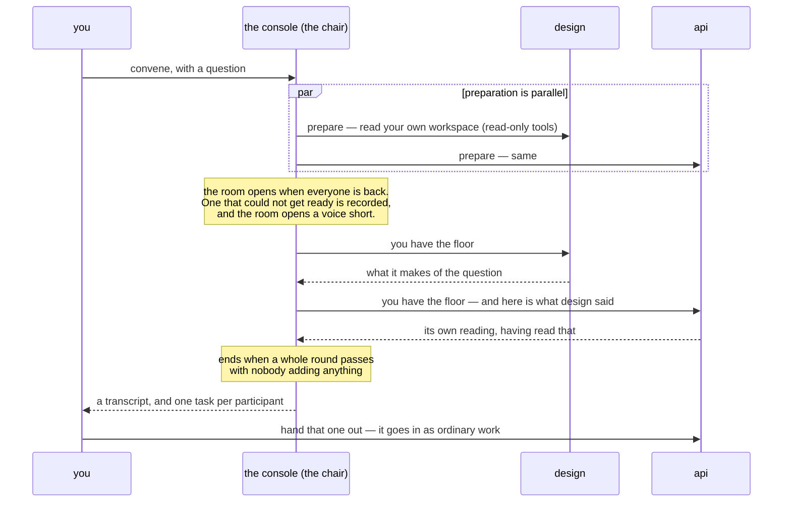
```mermaid
sequenceDiagram
    participant U as you
    participant C as the console (the chair)
    participant A as design
    participant B as api
    U->>C: convene, with a question
    par preparation is parallel
        C->>A: prepare — read your own workspace (read-only tools)
        C->>B: prepare — same
    end
    Note over C: the room opens when everyone is back.<br/>One that could not get ready is recorded,<br/>and the room opens a voice short.
    C->>A: you have the floor
    A-->>C: what it makes of the question
    C->>B: you have the floor — and here is what design said
    B-->>C: its own reading, having read that
    Note over C: ends when a whole round passes<br/>with nobody adding anything
    C-->>U: a transcript, and one task per participant
    U->>B: hand that one out — it goes in as ordinary work
```

**What the screen shows while it runs:**

| On the screen | What it is |
|---|---|
| the topic and the roster | pinned at the top: five rounds of four companions is several screens, and what the meeting is about and who is speaking now are the two things you need at every point of it |
| each participant's own colour | on their chip and down the side of everything they say. The name is on every line as well — a colour is never the only telling |
| "X is working on it" | the last few steps of what whoever holds the floor is doing right now: what it read, what it grepped, what it is thinking. The daemons write their room conversations to the same store this console reads, and the meeting's own stream carries them merged |
| how it got there | under every line, a fold with the thinking and tool calls that produced that sentence. It stays open across redraws |
| a pass, with its reason | silence from a companion that READ the discussion is information, and the transcript keeps it. Two passes in a row and the rules stop asking that one until somebody names it |
| the floor | pressing a participant's chip calls on them next; typing in the box takes the floor and hushes the room until you send |

**How it ends.** The room stops when nobody has anything to add — a whole round of passes — or when
the rounds run out, and the screen says which of the two it was. Then each participant is asked, in
one closing round, what it will do about the discussion. Those are the conclusions.

**Handing one out** sends that task to that companion as ordinary work, and it carries the meeting
with it: what was said in the room, what the others are taking away, and then the task itself under
a heading at the end. The task used to go alone, and a companion that had been in the room for an
hour received a one-line instruction with none of it — its session was not in the room even though
it was.

**Reopening.** A closed room can be put back in session with a reason, which is required: the
participants have all just said they had nothing to add, and what changes their minds is what you
type there. The conclusions are cleared with it — they belonged to the ending that has just been
undone — and the round ceiling doubles.

### 12.6 The routes, if you are automating

`GET` unless marked. Everything takes `?socket=` (or `?d=`) to name a companion, and `?peer=` to
name a federated console.

| Route | What it does |
|---|---|
| `/fleet` | the whole list as JSON — the same rows the table draws |
| `/events` | one companion's event stream (server-sent events) |
| `/plan` · `/handoffs` · `/context` · `/history` · `/cron` | the cards above, as JSON |
| `/search?q=` | earlier sessions of that workspace by keyword |
| `/skills` · `/remember` (POST) · `/forget` (POST) | the experience store |
| `/mcp` (GET/POST) | the MCP servers of one companion |
| `/submit` (POST) | steer text into the running session |
| `/resume` (POST) | continue another of that companion's conversations (`session=`) |
| `/me` | who this console thinks you are and what you may do (drawn from, never trusted as the check) |
| `/interrupt` (POST) · `/compact` (POST) | stop the turn · summarise the history now |
| `/answer` (POST) | resolve the permission or question it is blocked on, by call id |
| `/shell` (POST) | run a command in that workspace |
| `/dispatch` (POST) | address work by name, role or team, resolved by §13's rules |
| `/meet` (GET/POST) | the meetings this console holds; POST convenes one (`topic`, `who` repeated, `rounds`) |
| `/meet-say` (POST) · `/meet-hand` (POST) | say something in the room, or send one participant its task |
| `/meet-close` (POST) · `/meet-open` (POST) | end it, or put it back in session with a reason |
| `/console` | what this console is: its config dir, its host, its embedding model |
| `/push` (POST) | subscribe this browser to notifications, when the console was started with keys for them |

**Vocabulary.** One magi bound to one workspace is a **companion**. A person supervising several of
them is not each companion's operator but its supervisor — the reasoning, and what that means for
the interface, is in [`proposals/companions-and-supervision-2026-08-07.md`](proposals/companions-and-supervision-2026-08-07.md).

## 13. Companions, teams and clusters

Several magi handing work to each other. **No registry, no gateway, no broker** — every daemon
publishes a small record beside its socket, and that directory is the membership. Across machines
the same records travel by companions telling each other what they have seen.

The shape it makes, once two or three of them are running:

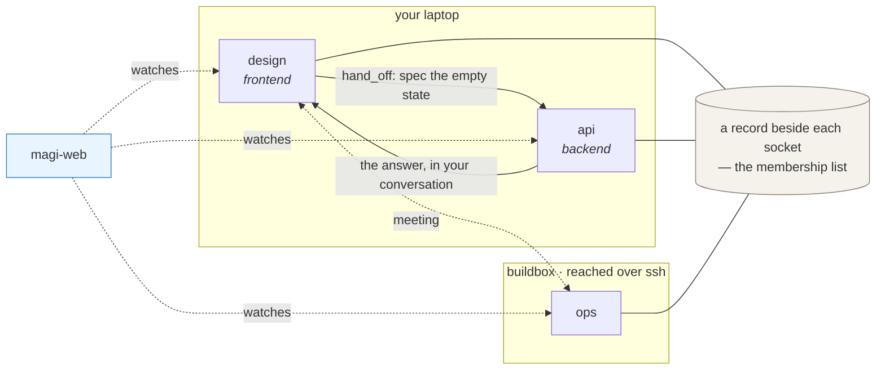
```mermaid
flowchart LR
    subgraph mac [your laptop]
        DS["design<br/><i>frontend</i>"]
        AP["api<br/><i>backend</i>"]
    end
    subgraph box [buildbox · reached over ssh]
        OP["ops"]
    end
    DS -- "hand_off: spec the empty state" --> AP
    AP -- "the answer, in your conversation" --> DS
    DS <-. meeting .-> OP
    DS & AP & OP --- REC[("a record beside each socket<br/>— the membership list")]
    CON[magi-web] -.watches.-> DS & AP & OP

    style REC fill:#f5f2ec,stroke:#8a8178
    style CON fill:#e8f4ff,stroke:#2c7fb8
```

Read it in this order: **13.1** gives a workspace a name, **13.2** is how they see each other,
**13.3** is how work crosses, and **13.8** is what changes when the other companion is on another
machine. The rest is detail you can come back for.

### 13.1 Saying who you are

In the workspace's `.magi/config.toml`:

```toml
[companion]
name = "design"                                          # what others address it as
role = "the design system: component specs and review"   # one line: what it is for
team = "frontend"                                        # optional: companions doing related work
hub  = false                                             # optional: a preference, not a claim (13.6)
mcp_peers = false                                        # optional: the ear (13.5)
```

It rides in the daemon's record, so `magi --agents`, the console and the tools all read one source.
A companion that declares nothing is exactly what companions were before: a workspace.

### 13.2 Seeing each other

`companions` is read-only and gives each one's name, role, team, state, whether it is blocked on a
person, and **what that workspace has learned** — up to three lessons from its own experience tier,
most-observed first. `matching` narrows it, and a narrowed answer **always says how many it left
out**, because otherwise it reads as the whole team.

> That last part is what makes a specialist. The one that keeps getting the design work accumulates
> design lessons, whoever is choosing sees the record, and picks it again. **magi does not rank
> them** — it shows the evidence and the caller chooses.

`companion_can` asks one of them what it can actually do, and the answer comes from **that
companion** rather than being worked out about it: its role, its skills, the MCP servers it can
reach. A companion that is not running therefore cannot be described — which is the right way
round, since it cannot be handed anything either.

### 13.3 Handing a piece over — `hand_off`

```
hand_off(to, request, so_that, answer_as, looking?)
```

It **returns at once** with a receipt. The asker keeps working; the answer arrives in its
conversation when the other finishes, and is folded in there. It does not wait and does not ask
twice.

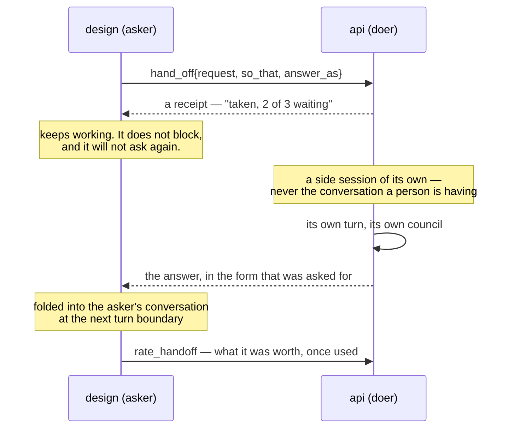
```mermaid
sequenceDiagram
    participant A as design (asker)
    participant B as api (doer)
    A->>B: hand_off{request, so_that, answer_as}
    B-->>A: a receipt — "taken, 2 of 3 waiting"
    Note over A: keeps working. It does not block,<br/>and it will not ask again.
    Note over B: a side session of its own —<br/>never the conversation a person is having
    B->>B: its own turn, its own council
    B-->>A: the answer, in the form that was asked for
    Note over A: folded into the asker's conversation<br/>at the next turn boundary
    A->>B: rate_handoff — what it was worth, once used
```

Note what the diagram does not contain: a way for `api` to pass this on to a third companion, and a
way for `design` to ask a follow-up question inside the same exchange. Neither exists. The first is
what keeps every piece of work owned by exactly one companion; the second is why `so_that` is a
required field — see §13.5 for the channel that *does* let two working companions talk.

All four fields are required, and the last two are the ones that make the difference:

| Field | What it is for |
|---|---|
| `to` | a name from the roster in the tool's own description — which is rebuilt every step, so it names who is running **now** |
| `request` | the whole instruction, standing on its own. They cannot see your conversation, your files or your reasoning |
| `so_that` | what the answer is for, in one clause. It is what lets them adapt when they hit something you did not foresee — **and they cannot ask you**, which is the asymmetry that makes this worth a field |
| `answer_as` | the **form** the answer comes back in: the headings you will read, in order. They fill it in |
| `looking` | optional, and it changes WHEN rather than what. `true` says this is a question about their workspace and nothing in it should change |

`answer_as` is a form and not a sentence about being finished. "Done when the tokens are named" is
checked afterwards by reading carefully; a form is checked by looking. It also changes what a gap
looks like — a part that could not be done comes back **as that part**, marked, instead of as a
paragraph about why the whole thing was hard. magi rejects a form that is one word (observed: a
model filling the field with `"text"`), and goes no further: whether a form is a *good* one is a
judgement about the task.

**Asking is not the same as asking for work.** A companion does one piece of handed-over work at a
time and, if it can write, waits for the workspace to be free — two turns in one tree are two agents
editing the same files. A request marked `looking` is not part of that: the receiver runs it in a
conversation whose tools are fixed at the four that only read, so it collides with nothing and is
answered **while that companion is busy with something else**. Set it whenever you are asking rather
than asking for work; it is the difference between an answer now and an answer after their current
turn.

The asker declares it and the **receiver enforces it**. The session is opened in a role whose
allowlist is read, glob, grep and list, checked in the same place every other allowlist is — so the
flag cannot become false by wording, and a question that turns out to need a change comes back
saying so rather than making one.

**No chaining.** Work handed to you cannot be handed on. The rule is read off the label left in the
transcript, so it survives a restart, an attach from elsewhere, and a resumed session.

### 13.4 What comes back, and what it was worth

The answer arrives quoted next to the form that was asked for and the receipt that names it — a
companion can be given two pieces, and the only thing telling two answers apart is which request
they answer.

Afterwards the asker is asked `rate_handoff(who, verdict, why, asked)`, which appends to
`<workspace>/.magi/handoffs.jsonl`. It is a **record, not a score**: nothing sorts, filters or
ranks by it. It comes back into the next `hand_off` description as a plain tally ("2 of 3 useful"),
name-sorted, and **only when there are at least two candidates** — with one companion there is
nothing to choose between and it would be weight in every prompt for nothing.

### 13.5 The ear — talking while you both work

`hand_off` gives a piece away. The ear is for the exchange that happens while two of them are
already working: a question one needs answered to carry on, or the answer to something the other
asked.

Set `mcp_peers = true` and every companion running here attaches as an MCP server with one tool
each, named after them: `ask`. **The recipient is the tool name**, deliberately — a name in a field
is a name a model can invent, and this tree has a recorded failure of exactly that (a request
addressed to a companion called "ssh", which does not exist).

It is off by default and that is not an oversight: two tools per peer in the tool list of every
prompt, and a subprocess per peer held open for the life of the daemon. Peers are attached and
detached at **turn boundaries**, the only instant the tool set may change. A companion that starts
up later is therefore heard at the next turn, not at the next restart.

### 13.6 One at a time, a queue, and how busy it is

A companion's conversations are isolated but its **work is not**. Each asker gets a side session of
its own, so nobody's request lands in the conversation a person is having and two askers never
share a history — but only one turn runs in a workspace at a time, the person's included. Two turns
in one tree are two agents editing the same files with nothing between them.

So a busy companion **queues** rather than refuses. Work is taken immediately (that is what the
receipt is for), and asked about before it starts it says so — "not started yet, 2 of 3 waiting".
The queue holds four. Past that it refuses, in a sentence that tells the asker to go elsewhere,
because a queue longer than that is not an answer coming later.

```
   one workspace ────────────────────────────────────────────────────────────
                   ┌────────────┐
   the person  ───▶│            │   only ONE of these runs at a time
   design      ───▶│  the queue │   ── the person's turn included
   ops         ───▶│  (holds 4) │
   cron        ───▶│            │──▶ [ running turn ]──▶ answer, to whoever asked
                   └────────────┘
                         │
                 a 5th   ▼
                 refused, in a sentence that says go elsewhere —
                 a queue longer than four is not "an answer coming later"
```

Two numbers ride in the published record and travel with it, so an asker choosing between
companions can see how busy each is:

```
worker (writes short files) · can: 3 · 1 in hand, 2 waiting
```

Neither can be derived from the state beside it: **state is read from the session a person attaches
to**, and handed-over work runs in conversations of its own — so a companion busy with three
people's requests correctly reads as `idle`, and these are the numbers that say otherwise. From a
sighting they are as old as the sighting. The authority is still the refusal, which is never stale.

**And it is kept.** Every arrival is written to `<socket>.load` — taken, with how many were already
in front of it, or turned away because there was no room. `magi --agents` sums the last week under
the table:

```
Handed-over work over the last 7 days:
  worker  31 taken, up to 4 already waiting, 12 turned away
  Turned away means the queue was full when somebody asked. Repeatedly, and one copy of
  that companion is not enough for what is being asked of it.
```

That is the whole point of writing it down: how busy a companion is right now is an instant, and
whether one of it is enough is a **pattern**. The file decays after a month, and is **not** removed
when the daemon stops — the week after a companion was killed is exactly when somebody asks whether
it was overloaded. It is deliberately not kept with the delegation record above: a verdict is a
judgement about a companion's work and belongs in the repository, this is operational and belongs
beside the socket.

### 13.7 Teams and hubs

`team` groups companions doing related work. Addressing the team reaches **whichever member has the
least on it**, with the elected hub breaking a tie — so an idle team has one stable address, and a
loaded one spreads. It used to always reach the hub, which made a team of three work like a queue
of one: nobody can pass handed-over work on (13.3), so everything piled up behind whoever had been
elected. Which is the opposite of what somebody who starts a second copy is trying to buy.

The hub is **elected, not declared**. `hub = true` is a preference; among companions that are
actually there, the one that can do the most speaks for the team, ties broken deterministically so
every machine elects the same one. A team whose members have all gone quiet elects nobody and is
not addressable as a group — it resolves to every member, and the caller is told to pick.

What a `to` field goes through, whether it was typed by you or written by a model:

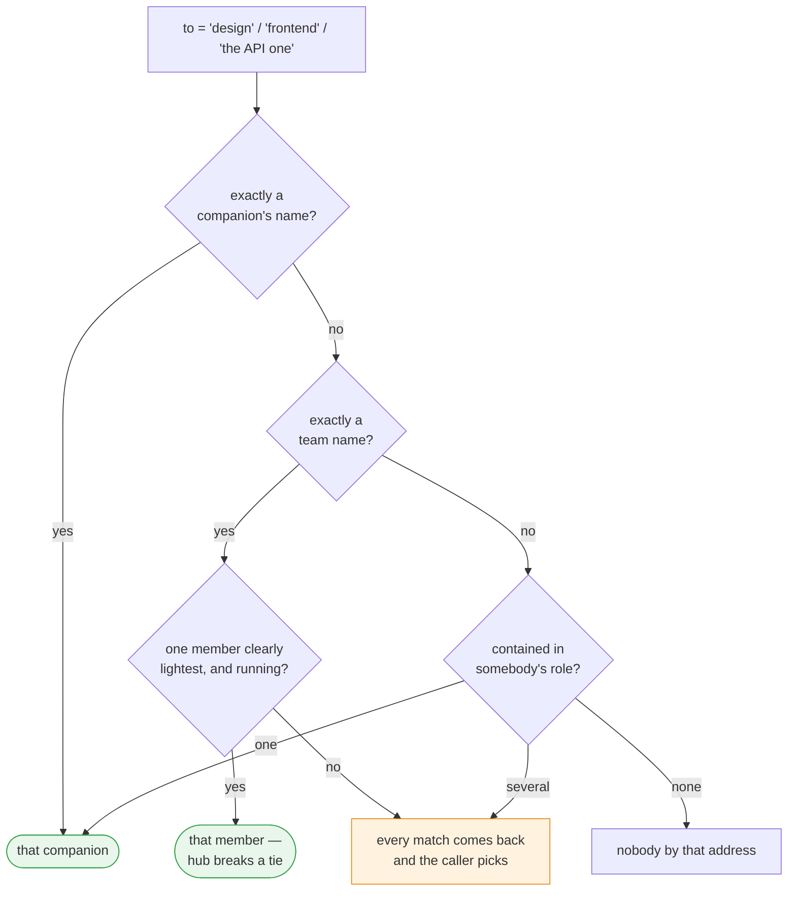
```mermaid
flowchart TD
    A["to = 'design' / 'frontend' / 'the API one'"] --> N{"exactly a<br/>companion's name?"}
    N -->|yes| ONE([that companion])
    N -->|no| T{"exactly a<br/>team name?"}
    T -->|yes| Q{"one member clearly<br/>lightest, and running?"}
    Q -->|yes| L(["that member —<br/>hub breaks a tie"])
    Q -->|no| ASK["every match comes back<br/>and the caller picks"]
    T -->|no| R{"contained in<br/>somebody's role?"}
    R -->|one| ONE
    R -->|several| ASK
    R -->|none| NONE["nobody by that address"]

    style ONE fill:#e8f6ec,stroke:#2f9e44
    style L fill:#e8f6ec,stroke:#2f9e44
    style ASK fill:#fff3e0,stroke:#e8820c
```

Two things in that shape are deliberate. A chosen name beats a role, because a name was picked to
address one companion while a role is a sentence that may describe several. And an ambiguous
address is never ranked into a winner: every match comes back for the caller to choose between,
since the cost of guessing is a turn running in somebody else's workspace. The console's
`POST /dispatch` calls the same resolver, so work typed into a page and work handed over by another
companion arrive by exactly one route.

### 13.8 Across machines

Companions on other machines are reached over **ssh**, and the only thing that crosses is the
daemon's own protocol:

```sh
ssh buildbox magi --relay /path/to/their/daemon-....sock
```

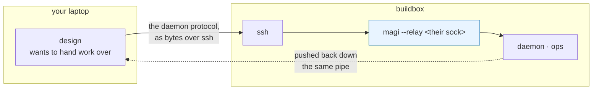
```mermaid
flowchart LR
    subgraph here [your laptop]
        A["design<br/>wants to hand work over"]
    end
    subgraph there [buildbox]
        S["ssh"] --> RL["magi --relay &lt;their sock&gt;"] --> D["daemon · ops"]
    end
    A -->|"the daemon protocol,<br/>as bytes over ssh"| S
    D -.->|"pushed back down<br/>the same pipe"| A

    style RL fill:#e8f4ff,stroke:#2c7fb8
```

`--relay` is a dumb byte pipe on purpose, and that is the design decision worth noticing: taking
work, asking what became of it, and asking what a companion can do are three **methods of one
protocol**, not three subcommands that each re-derive what the running daemon already knows.

You do not run that; magi does, when the companion it is addressing is not here. `--relay` pipes
stdin and stdout to that socket, so taking work, asking what became of it and asking what a
companion can do are three **methods** of one protocol rather than three subcommands that each
re-derive what the daemon already knows. The answer is **pushed** back down the same pipe as it
changes, rather than polled.

Whether a companion is here or elsewhere is decided by the record published beside the socket, not
by comparing hostnames: a config directory can be shared (two containers with a mount in common,
two workstations with one network home), and a record naming a different machine is somebody else's
path — dialling it would open the wrong workspace and the work would arrive looking delivered.

**Joining a cluster:**

```sh
magi --join-cluster buildbox      # trade member lists with that machine, over ssh
```

One exchange is the whole transport and the whole join: this machine sends what it knows, the other
merges it, answers with what it knows, and both write the result. After that the daemons keep it
current themselves — every minute (jittered), each picks two hosts and trades again, so a third
machine hears about the first from the second without anybody being told twice.

What is written is `<config>/cluster.json`, and it **decays**: a companion nobody has sighted for
**5 minutes** is shown but not offered work, and one nobody has sighted for **an hour** is dropped.
That is why it is a runtime file and not configuration — configuration does not go out of date on
its own. This machine's own companions are never written into it: they are read from the published
records every time, and a copy would be a second answer that goes stale the moment a daemon stops.

Requirements: `ssh` with key auth (magi uses `BatchMode=yes` — it will not prompt), and `magi` on
the remote `PATH`. The remote binary is named plainly, not by this machine's path to it.

### 13.9 A cluster, end to end

Two machines, three companions. `mac` runs the design work, `buildbox` runs a builder and a
reviewer.

**On each workspace, say who it is:**

```sh
# mac:~/work/design/.magi/config.toml
[companion]
name = "design"
role = "the design system: component specs, tokens and review"
team = "frontend"
```

```sh
# buildbox:~/work/api/.magi/config.toml
[companion]
name = "api"
role = "the Go service: handlers, storage and its tests"
team = "backend"
hub  = true
```

**Start a daemon in each** (one per workspace — the socket is named from the workspace's real path,
so this is enforced by a lock rather than by convention):

```sh
cd ~/work/design && magi --daemon &
```

**Join them, once, from either side:**

```sh
mac$ magi --join-cluster buildbox
```

**Check what each machine believes:**

```sh
$ magi --agents
STATE  AGENT                                       IDLE  STEPS  WORKSPACE
idle   design  — the design system: …              12s   -      /Users/me/work/design
idle   api *  — the Go service: …          [backend*]  4s   -   /home/me/work/api
```

From here the model does the rest: `hand_off`'s description already lists who is out there, with
each one's host, what it can do, and what it is carrying. Nothing else has to be configured.

**Watch it:** `magi-web` on either machine shows that machine's companions, and `-peer` puts the
other console's rows in the same table (§12.1).

**When one keeps refusing,** start another copy of it — a second workspace with the same `team` —
and the team address starts spreading work between them (13.7). `magi --agents` is where the case
for doing that is (13.6).

### 13.10 Two other things that share the word "join"

`magi --join <name>` is **not** `--join-cluster`. It reads one companion's project config and
writes `.magi/joined-<name>.toml` beside your own — **a proposal, applied to nothing**. What it
carries: their team, their `experience_dir` (the one line that makes a newcomer start knowing
things), the MCP servers they use, and a pointer to their `AGENTS.md`. What it does not carry:
their model, permission posture or sandbox — those are their workspace's choices, not the team's.

Everything in it is commented out, deliberately. An `[mcp]` entry is a **command with arguments
that this process would start**, and a hook is a shell line; "the companion I joined to told me to"
is not a sentence anybody should find in an incident report. Environment variables are named and
never valued — a token copied into a second workspace is a token in two places.

`POST /dispatch` takes `to=`, which may be a name, words from a role, or a team. It resolves that
through the same rules and down the same path as somebody typing into the companion's page, so both
reach the daemon by exactly one route. Two matches are an error, never a choice.

### 13.11 What this deliberately is not

- **A scheduler.** Nothing balances the fleet or decides who should do what. A model picks from a
  list that says who is there, what each can do and how loaded each is, and every refusal is a
  sentence it can act on.
- **A message bus.** There is no broker to run, nothing to keep alive, and no state that outlives
  the daemons. Stop them all and the cluster is a few files that expire within the hour.
- **Authentication.** A unix socket is owner-only, and across machines the security boundary is
  ssh — whoever can `ssh` to that host as that user can already do everything magi could.
- **Consensus.** The membership is gossip and it decays; two machines can briefly disagree about a
  third. Everything downstream is written to treat a sighting as advisory and the refusal as
  authoritative.

### 13.12 What is encrypted, and what is not

Worth stating plainly, because "agents talking to each other" sounds like a network protocol and is
not one.

| Path | Transport | Encrypted |
|---|---|---|
| companion → companion, same machine | unix domain socket, `0600` | **No, and it does not leave the kernel.** The file is owner-only, so who may speak to a daemon is the operating system's answer at connect time |
| companion → companion, across machines | `ssh <host> magi --relay <socket>` | **Yes — ssh.** magi opens no port of its own between machines and speaks no protocol of its own over the wire |
| gossip (`--join-cluster`, and the minute loop) | `ssh <host> magi --members` | **Yes — ssh**, the same way |
| the ear (`mcp_peers`) | a local subprocess over stdio | **No, and it does not leave the machine** |
| you → the console | plain HTTP on loopback | **No.** Put it behind your own tunnel or proxy — that is the documented way to reach it (§12.1) |
| console → console (`-peer`) | plain HTTP to the URL you gave | **Only if you gave an `https://` URL or a tunnel.** This is the one hop that can cross a network in the clear, and it carries transcripts |

So magi has **no keys of its own and no certificate of its own**, deliberately: the security
boundary across machines is ssh, and whoever can `ssh` to that host as that user can already do
everything magi could do there. Adding a second credential system beside it would be one more thing
to rotate, leak, and get wrong — without narrowing what an attacker who had the first one could do.

The one place to be careful is `-peer`: it is the only magi-to-magi link that is not ssh, it is
console-to-console rather than agent-to-agent, and it carries what people read. Give it a tunnelled
or `https://` URL on anything that is not loopback.

## 14. Unattended work (`schedule`, `[cron]`)

A daemon that is already resident can do work on a timer. The jobs live in config, as a named
table so they can be edited by name:

```toml
[cron.nightly-audit]
schedule = "0 3 * * *"        # five fields, local time; or @hourly @daily @weekly @monthly
prompt   = "Read yesterday's commits and report anything that looks like a regression risk."
enabled  = true               # optional; absent means on
```

- **Daemon only.** An interactive `magi` never schedules anything — otherwise every open terminal
  in a repo would fire the same job.
- **One firing is one new session.** It is submitted as a fresh conversation, not steered into a
  live one, and it shows up in `/resume` and in the console's history like any other.
- **It does not catch up.** A daemon started at noon does not run the 3 a.m. job. A week away should
  not produce a storm.
- **It does not overlap itself.** A firing whose previous run has not finished is skipped, with the
  reason recorded.
- **Local time**, with the daylight-saving consequence that implies: an hour that repeats can fire
  twice and an hour that is skipped does not fire. It is written down rather than pretended away.
- The config is re-read every tick, so editing the file takes effect without a restart.

Those five rules are easier to hold as a picture. A tick either fires or it doesn't, and every way
it doesn't is a deliberate choice:

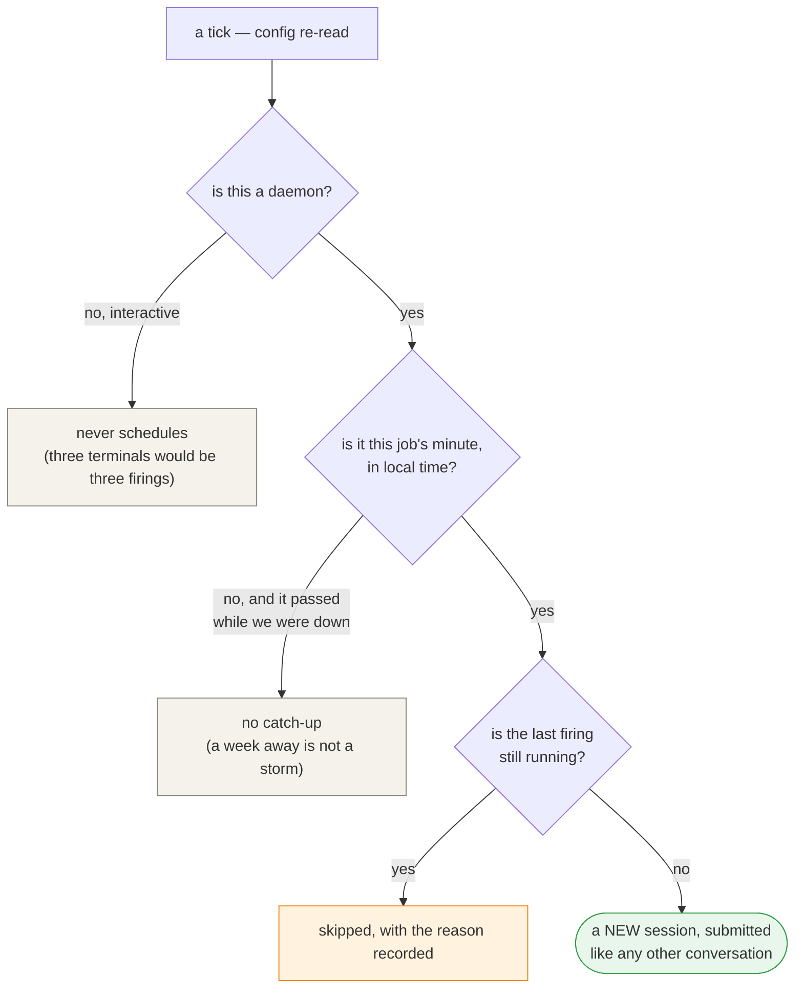
```mermaid
flowchart TD
    TK["a tick — config re-read"] --> D{"is this a daemon?"}
    D -->|"no, interactive"| SKIP1["never schedules<br/>(three terminals would be three firings)"]
    D -->|yes| M{"is it this job's minute,<br/>in local time?"}
    M -->|"no, and it passed<br/>while we were down"| SKIP2["no catch-up<br/>(a week away is not a storm)"]
    M -->|yes| P{"is the last firing<br/>still running?"}
    P -->|yes| SKIP3["skipped, with the reason recorded"]
    P -->|no| RUN(["a NEW session, submitted<br/>like any other conversation"])

    style RUN fill:#e8f6ec,stroke:#2f9e44
    style SKIP1 fill:#f5f2ec,stroke:#8a8178
    style SKIP2 fill:#f5f2ec,stroke:#8a8178
    style SKIP3 fill:#fff3e0,stroke:#e8820c
```

The agent can see and change its own schedule with the `schedule` tool, the TUI has `/cron`, and
the console shows the same jobs on a companion's page (§12.3).

## 15. Status & scope

The **loop-engineering track is shipped**, not planned — it is the signature of the tool and is described throughout this manual: the **council** the agent declares completion to (Melchior · Balthasar · Casper, §3 · §6), the **Loop map** (`/loop`), the live deliberation panel, **rewind/fork/session-diff** (`/rewind` · `/fork` · `/loopdiff`, §4), and **re-hydratable compaction** (§4). Likewise already implemented: the **OS sandbox** (`--profile`/`sandbox`, §3), **post-edit LSP diagnostics** (§5), **web search** (`websearch`), and **prompt caching** (`cache_control`, on by default with automatic fallback). The feature/milestone spec with test examples lives in [`SPEC.md`](SPEC.md); the internals in [`ARCHITECTURE.md`](ARCHITECTURE.md).

**Genuinely out of scope (today).** No accounts, sessions or permissions of magi's own: the console binds loopback and is reached through whatever the organisation already uses, because every company answers that question differently and a second door beside theirs would be the weaker one (§12). Automatic context *ranking* is deliberately lexical/deterministic (BM25-lite, §4), not embedding-based, so there is no vector-DB dependency. These are scope choices, not gaps to be silently filled.

> ⚠️ **Corrected 2026-08-07.** This paragraph used to say "no web UI or hosted remote sharing — magi
> is a terminal client". `magi-web` (§12) has existed since the daemon landed, and it federates
> across machines. What remains true is the part that was doing the real work in that sentence:
> magi ships no authentication and no multi-tenant server.

[Ollama]: https://ollama.com
</content>
</invoke>
