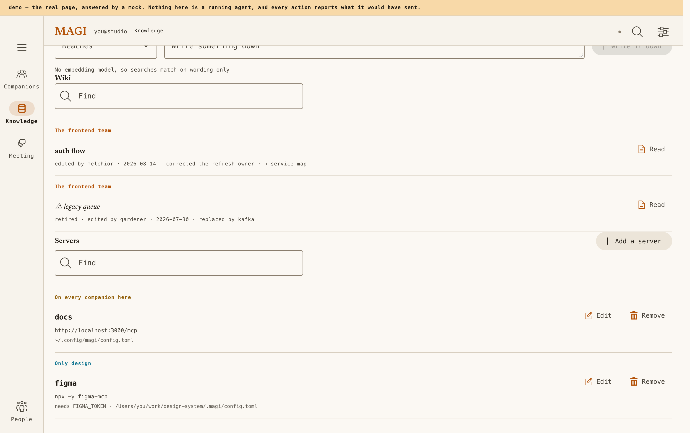
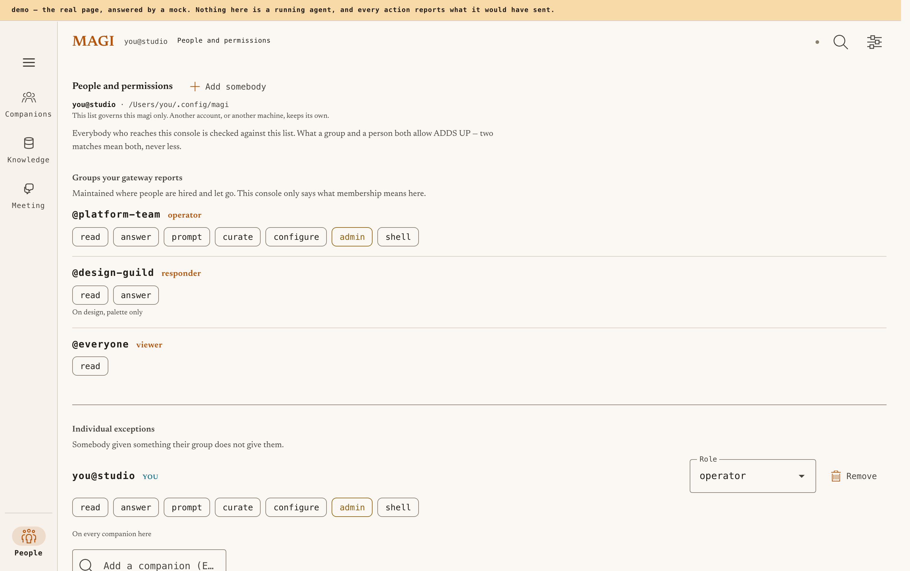

# magi — 화면 (웹 콘솔 & TUI)

[English](UI.md) · [한국어](UI.ko.md) · [↑ Docs](README.ko.md)

> **현행 참조.** 두 표면 — 각 화면의 구성, 지키는 디자인 규칙, 그리고 왜인가.

두 표면의 구성·디자인 규칙·판단 근거입니다. §1–5는 **웹 콘솔**(`clients/web/server`가 제공하고 `clients/web/ui`에서
컴파일됩니다)을 다루고, §6은 **터미널 UI**(`internal/adapter/tui`)를 다룹니다. 사용법은 [`MANUAL.ko.md`](MANUAL.ko.md)
(§4 TUI · §12 콘솔), 내부 구조는 [`ARCHITECTURE.ko.md`](ARCHITECTURE.ko.md) §11을 참고하십시오.

> **직접 보기:** <https://sayaya1090.github.io/magi/demo/> — 실제 페이지에 브라우저 내부 목업을 연동한 라이브 데모입니다.
> 액션은 "무엇을 전송했을지"만 안내하고 실제로 동작한 척 가장하지 않으며, 표시되는 값은 전부 픽스처입니다 — 화면 구성을
> 보여줄 뿐 백엔드 서버가 직접 구동되는 것은 아닙니다. `clients/web/server/` 하위가 변경되면 `.github/workflows/pages.yml`이,
> `web/` 하위가 변경되면 `test-web.yml`이 배포합니다 — 어느 경로가 트리거되든 사이트 전체를 빌드하고, 자체 테스트가
> 통과한 뒤에만 배포합니다. 푸시는 main 브랜치에서만 게시하고, 수동 실행 시 지정한 브랜치에서
> 게시합니다 — github-pages 환경이 해당 브랜치를 허용한 경우에 한합니다(Settings → Environments →
> github-pages → Deployment branches).

> 이 문서는 **as-built** 레퍼런스이되, 프론트엔드에 한 가지 전제 조건이 있습니다. 아래에 기술된 콘솔은
> 오랫동안 단일 파일(`clients/web/server/page.go`, HTML+CSS+JS를 포함한 Go 문자열) 구조였습니다. §1–5는 당시 구현을 기준으로 작성되었으며 Node.js 기반 실제 JS 런타임 테스트를 통해 규칙을 검증했습니다. 해당 웹 콘솔은 2026-08-29에 `clients/web/ui`의 GWT 모듈들로 **대체되었습니다.** 각 모듈은 화면 단위로 기존 기능과 동등하게 구현되었으며 대체 직전 철저한 비교 검증을 거쳤습니다.
>
> 아래 기술된 **설계 규칙**은 현재도 동일하게 유효합니다. 이식 과정에서 엄격히 준수한 기준들이며, 테스트로 보장되는 항목은 현재도 동일하게 검증됩니다 — 팔레트 및 명도대비 가드(`clients/web/server/*_test.go`)는 현재 `clients/web/ui/console.css`를 참조합니다. §1–5에 언급된 구 파일 경로(`page.html`·`page.js`·node DOM 하네스)는 역사적 기록입니다. 현행 모듈은 `clients/web/ui` 하위에 위치하며, 화면과 모듈 간의 대응 관계는 [`../clients/web/ui/README.md`](../clients/web/ui/README.md)에 기술되어 있습니다. 컷오버 당시의 상세 비교 및 검증 내역은 [`../clients/web/README.md`](../clients/web/README.md)를 참고하십시오.
>
> TUI 구현체는 `internal/adapter/tui`에 위치하며, 렌더링·마우스·폭 계산 각각에 대한 독립 테스트를 유지합니다. §6의 핵심 내용은 변경 없이 유지됩니다.

---

## 1. 이 화면이 답하는 질문

운영자가 일상적으로 확인해야 하는 핵심 질문은 다음 네 가지입니다.

1. **누가 지금 무엇을 하고 있는가** — 그리고 그중 **운영자의 입력/승인을 기다리는 컴패니언은 누구인가**
2. **클러스터가 공유하는 지식과 도구는 무엇인가** — 각 컴패니언이 학습한 지식(프로젝트 / 팀 / 전역)과 도달할 수 있는 외부 도구(어느 MCP 서버가 어느 컴패니언에 연결되어 있는가)

상위 탐색 목적지는 **2개**로 통합되었습니다(기존 4개). 컴패니언이 **학습한 지식**과 **도달 가능한 도구**는 동일한 역량 관리(지식과 기능)의 상호 보완적 두 축이며, 탭을 분리해 두면 사용자가 두 요소의 연관성을 직접 기억해야 했습니다. 작업 보드 화면은 독립된 목적지가 아니라 **플릿에 대한 상태 질의**이므로 플릿 목록에서 진입하도록 구성했습니다(§2.3). 기존의 모든 엔드포인트 URL은 이전 위치와의 호환성을 유지합니다.

⚠ 과거에 제공되었던 다섯 번째 질문인 **운영자 개입 이력 집계(What I had to say)** — 진행 중인 턴에 사람이 개입한 발화를 그룹화하여 프로젝트나 전역 규칙으로 승격시키는 기능 — 는 제거되었습니다. 사후 개입 발화를 기계적으로 그룹화하는 방식은 실효성 있는 규칙을 생성하지 못했고, 근거 없는 결정을 사람에게 전가했기 때문입니다. 개입 이력은 이제 컴패니언 상세 페이지의 트랜스크립트 맥락 옆에 직접 보존됩니다.

## 2. 콘솔의 화면

### 2.1 플릿 (`/`)

<div align="center">

</div>

리소스 테이블입니다. 쿠버네티스 콘솔의 리소스 목록과 마찬가지로 **상태가 최우선**으로 표시되고 이름이 그다음, 수행 중인 작업이 셋째입니다. 정렬 순서는 운영자의 시선이 우선 도달해야 하는 순서와 일치합니다: **사람을 기다리는 작업 → 진행 중 → 유휴 → 정지/사망**.

- 상단 **요약 타일**은 상태별 인스턴스 수 카운터이자 필터로 동작합니다. 카운트가 0인 타일은 비활성화됩니다(동작하지 않는 컨트롤이 클릭 가능한 상태로 방치되는 결함 방지).
- **팀 단위 그룹화**: 각 팀 내부에서도 해결이 필요한 상태가 상위에 배치됩니다. 그룹 헤더 행은 팀 이름과 대표 컴패니언을 표시하며, 대기 중인 멤버 수를 뱃지로 표시합니다.
- 각 행의 구성(라이트 테마, 2026-08-29 기준): 상태 뱃지 · 이름 · **역할** · 워크스페이스 경로 · 호스트·IP **및 데몬 보고 빌드 버전** — 플릿 최신 빌드보다 뒤처진 경우 시각적으로 표시됩니다. 버전 확인은 개별 카드가 아닌 플릿 전체에 대한 질의이기 때문입니다 · 유휴 시간 · 중단 아이콘 버튼 1개. 진행 막대(progress bar)는 의도적으로 배제합니다 — 투두는 일정표가 아니며, 진행 막대는 보장할 수 없는 완료 시각을 잘못 암시하기 때문입니다. 별도의 '열기' 버튼은 두지 않습니다. 행 자체가 링크이며, 행의 기본 동작을 중복하는 버튼은 불필요한 중복 UI입니다.
- **입력 대기 중인 에이전트는 질문을 직접 표시합니다**: 현재 수행 중인 작업 대신 질문 자체가 해당 행의 주 내용이 됩니다 — 작업이 멈춘 원인이 바로 그 질문이기 때문입니다. 질문 하단에는 **판단의 근거**가 함께 첨부됩니다: 시도해 본 작업, 각 선택지 실패 시의 손실, 에이전트 관점의 권장 선택지(§2.6). 응답 컨트롤은 행 전체가 아닌 질문에 종속되므로 질문 바로 아래에 배치됩니다.
- 하단 컴포저에는 **주소 입력 필드가 없습니다**: 화면에 이미 노출되어 클릭 한 번으로 선택 가능한 목록에서 이름을 텍스트로 타이핑하여 지정하는 방식은 중복이자 비효율적인 상호작용입니다. 역할 이름을 주소로 해석하는 `/dispatch` 엔드포인트는 백엔드에 유지되나, 이 페이지에서는 직접 호출하지 않습니다.

### 2.2 컴패니언 상세 (`/?d=<socket>`)

<div align="center">

</div>

워크스페이스 패널을 함께 연 상세 화면 — 아래에서 설명하는 두 패널이 대화를 가리지 않고 그 양옆에 나란히 배치된 구조입니다:

<div align="center">

</div>

**이 화면에서 요구되는 두 가지 목적은 명확히 구분됩니다.** 컴패니언의 상태를 빠르게 점검하거나, 트랜스크립트의 실행 내용을 읽고 스티어링(개입)하기 위해 진입합니다. 단일 칼럼에 모든 요소를 누적 배치하면 상태는 보이지만 대화가 하단으로 밀려납니다: 430px 뷰포트에서 트랜스크립트가 900px 화면의 1073px 아래에서 시작되었고, 900px 폭에서도 동일한 현상이 발생했습니다 — 모바일 화면에 국한된 문제가 아니었습니다.

| | ≥840px | 그 아래 |
|---|---|---|
| 레이아웃 | 3단: 왼쪽 워크스페이스, 가운데 대화, 오른쪽 상태 사실과 진행 | 탭 분할: **대화 / 파일 / 계획 / 정보** |
| 처음 상태 | 왼쪽은 닫힌 채, 오른쪽은 **열린 채** | 대화 탭 우선 표시 |
| 고정 | 우측 보조 칼럼 sticky 고정 — 스크롤 시 계획이 사라지면 매번 다시 찾아야 함 | — |

오른쪽 패널이 기본적으로 열린 채로 표시되는 이유는 내부 콘텐츠의 성격이 변경되었기 때문입니다. 이전에는 상태 사실판이 중앙에 위치한 auto-fit 격자 구조였기 때문에 남는 여백을 모두 열로 확장했고, 카드가 없는 대부분의 화면에서는 전사 영역 전체를 가리는 문제가 있었습니다. 컴패니언의 상태 정보는 작업 도중 곁눈질로 확인하는 보조 정보이며, Material Design 3에서 사이드 시트(side sheet)로 정의하는 공간이 바로 이 우측 기둥입니다. 반면 왼쪽 파일 트리는 보조적 탐색 도구이므로 기본적으로 닫힌 채로 시작됩니다. 사용자의 주된 작업 대상은 중앙의 대화 트랜스크립트이며, 트리는 필요할 때 찾아 여는 구조입니다.

**이 화면에는 텍스트 읽기 폭 상한(reading cap)이 없습니다.** 다른 화면(설정·경험·MCP)에는 170ch 상한이 적용됩니다. 폭 상한은 단일 칼럼 산문을 위한 제약인데 반해, 이 화면은 3개 패널 구조이므로 상한이 제한하는 폭만큼 좌우 패널이 사용할 영역이 축소됩니다. 이전에는 230ch 상한이 적용되어 2490px 해상도 화면에서 좌우 220px씩 빈 여백이 남는 동안 우측 사실판은 303px에서 줄바꿈되는 모순이 발생했습니다. 이에 따라 마스트헤드와 하단 컴포저 도크도 함께 폭 제약을 해제했습니다. 4개 영역이 하나의 열을 이루므로, 상단만 넓어지면 레이아웃 어긋남이 발생합니다(실측치: 헤더 폭 568..2001px 대비 본문 315..2254px).

어느 패널이 열려 있었는지는 **URL에 기록하지 않습니다.** 탐색의 목적지는 컴패니언 인스턴스 자체이며, 패널 선택 상태는 스크롤 위치와 동일한 화면 뷰 상태입니다. 이를 URL에 포함하면 다른 사용자에게 공유한 링크가 의도치 않은 패널 상태로 열리게 됩니다. 컴패니언을 전환하면 패널 상태는 기본값으로 초기화됩니다 — 다음 컴패니언은 대화 내용을 확인하기 위해 여는 것이기 때문입니다.

컴패니언에 턴이 열려 있는 동안 페이지 맨 위로 2px 크기의 인디케이터 바가 흐릅니다. 트랜스크립트가 직접 표현하기 어려운 대기 상태를 나타냅니다: 도구 호출이 완료된 후 결과는 도착했으나 모델이 다음 방침을 생성하지 않은 구간에서는 대기 대상 행이 없어 행 표시가 비어 있고, 턴을 시작한 프롬프트는 스크롤 밖으로 벗어난 상태입니다. 바는 이벤트 스트림의 세션 자체 `turn` 프레임에 의해 구동되며(상태 변경 시에만 전송), 스트림 에러·종료·화면 이탈 등으로 상태 확인이 불가해지면 자동으로 비활성화됩니다. 행 자체에서 이미 '처리 중'을 안내하므로 중복 낭독을 방지하기 위해 `aria-hidden`을 적용합니다.

사실 카드는 **접을 수 있습니다.** 모든 뷰포트 너비에서 컴패니언 전환 간 상태가 유지됩니다. 접으면 요약 행에 상태와 워크스페이스 정보만 보존됩니다. 저장된 설정값이 없으면 오른쪽 패널은 기본적으로 펼쳐진 상태로 초기화되며, 사용자가 닫아둔 설정은 그대로 유지됩니다.

헤더 필드는 **질문이 떠오르는 순서**대로 배치됩니다. 그리드가 DOM 순서에 맞추어 공간을 할당하므로, 이 목록이 곧 실제 배치가 됩니다:

1. **현재 진행 상황**: 상태 · 스텝 · 마지막 활동
2. **소속 및 위치**: 역할 · 팀 · 호스트·IP·pid · 워크스페이스
3. **이동 경로**: 세션
4. **실행 환경**: 승인 · 모델 · 캐시 · 컨텍스트 · 압축 내역

긴 문자열(역할, 워크스페이스 경로, 세션 등)은 한 줄 전체가 아닌 **두 칸**을 차지하도록 분할합니다. 한 줄을 통째로 점유하면 주변 패킹이 무너져 단일 상태값만 놓인 줄을 포함해 불필요한 공백 줄이 다수 발생하는 결함이 관측되었습니다.

이 중 셋은 단순한 표시값이 아닌 **컨트롤**입니다:

- **승인**과 **모델**은 메뉴 형태로 제공됩니다. 모델 목록은 컴패니언의 데몬에게 질의하고, 데몬은 연결된 백엔드에 질의합니다 — 콘솔 자체 설정으로 목록을 생성할 경우 컴패니언이 접근할 수 없는 모델을 잘못 추천하는 왜곡이 발생하기 때문입니다. 화면에 렌더링되는 목록은 **데몬이 보고한 실제 모델**이므로, 거절된 변경은 시각적으로 원상 복구됩니다. 백엔드가 목록에 더 이상 노출하지 않는 모델이더라도 현재 사용 중인 모델은 메뉴에 항상 유지됩니다.
- **세션**은 타 세션으로 전환하는 경로입니다. ⚠ 선택 시 해당 세션이 **열릴** 뿐이며, 컴패니언이 해당 세션으로 자동 이동하지는 않습니다 — 이동은 제출 주소 자체를 변경하는 작업입니다. 작업 수행 중에는 메뉴가 비활성화되며, 이 규칙은 추후 세션 이동 연동 시 동일하게 적용됩니다.

**도구** 및 **루프** 버튼은 2차 계층으로 배치됩니다. 도구 명단은 소켓을 통해 실시간 조회합니다 — 레지스트리는 config, 로드된 플러그인, 응답한 MCP 서버를 바탕으로 기동 시점에 조립되므로 콘솔이 빌트인 도구 목록을 정적으로 나열하면 실제 환경과 불일치하게 됩니다. 응답하지 않는 데몬은 빈 목록이 아니라 '미응답' 상태로 명시합니다. 루프 맵과 포크 원본과의 비교는 로그를 직접 읽어 처리하므로 콘솔 프로세스가 자체적으로 수행합니다 — 이에 따라 사후 연결된 콘솔에서도 비교 화면을 온전히 조회할 수 있습니다. 반면 터미널은 현재 실행에서 포크된 정보만 인식합니다.

컨텍스트 정보 행은 본 화면의 핵심 진단 요소입니다:

- `82,000 / 100,000 tokens · measured · 41 messages` — **measured(실측)와 estimated(추정)를 엄격히 구분합니다.** 전자는 프로바이더가 반환한 실제 토큰 수치이고 후자는 트랜스크립트 기반 계산값이므로 정보의 신뢰도와 판단 가치가 다릅니다.
- 컨텍스트 윈도우 한도를 알 수 없는 경우에는 **게이지 막대를 렌더링하지 않습니다.** 빈 게이지는 '여유 용량이 많음'으로 오독될 수 있으므로 측정 불가를 정직하게 반영합니다.
- 하단에는 **구성 비율 띠**가 5색으로 표시되며, 하단 보조 텍스트로 항목별 크기를 병기합니다: 시스템 프롬프트 · 도구 목록 · 대화 · 도구 호출 · 도구 결과. 총량은 전체 소비량을 나타내고 색상 띠는 구체적 구성을 설명합니다. 총량만 단독 표시할 경우 윈도우 포화 시 사용자가 대화 턴을 줄이려 시도하지만, 실제로는 시스템 프롬프트와 도구 명단이 대다수를 차지하는 경우가 많습니다. 실측치(qwen3.8:27b-mlx, 1턴 교환 후): 시스템 2,404 · 도구 5,703 · 대화 4 토큰으로 총 8,750 중 8,107 토큰이 초기 기동 시점부터 점유되어 있었습니다.
- 5개 구성 수치는 **요청을 조립한 프로세스가 직접 측정한 값**입니다. 로그를 사후 판독하는 측에서는 대화 토큰만 분별할 수 있습니다: 시스템 프롬프트와 도구 목록은 세션별로 조립되며 로그에 전문이 기록되지 않기 때문입니다. 따라서 이 수치는 `turn.finished` 이벤트에 수록되어 전달되며, 해당 이벤트가 없는 세션(초기화 이전이거나 턴 미실행 세션)에서는 **구성 띠를 렌더링하지 않습니다.** 모든 항목이 0인 상태는 측정이 아니라 미확인 상태이므로 게이지 미표시 규칙을 동일하게 따릅니다.
- 총량이 실측 수치일 때 띠 하단에 **'구성은 추정'** 레이블을 부착합니다. 구성 요소는 chars/4 산술 추정치이므로 각 항목의 합산이 프로바이더 실측 총량과 완벽히 일치하지 않으며, 이 차이를 숨기지 않고 명시하기 위함입니다.
- `2 folds · 31,000 tokens shed · last 40,000→9,000 at 04:31Z` — 컴팩션은 컴패니언이 **외부 알림 없이 이전 기억을 요약하는 유일한 시점**입니다. 컴팩션 수행 횟수는 세션 초기 컨텍스트의 신뢰도를 판별하는 핵심 지표가 됩니다.
- 요약되어 분리된 **토픽 이름**을 명시합니다. 원문이 보존된다는 설계 원칙을 실측 가능한 사실로 확인하는 영역입니다.
- `82% of it cached` — **백엔드가 캐시 수치를 명시 보고한 경우에만 렌더링합니다.** `cached: 0`은 캐시 미스를 뜻하고 필드 부재는 보고 미지원을 뜻합니다. 두 경우를 모두 0%로 단일 렌더링하면 정상 동작 중인 캐시를 결함으로 오인하게 됩니다. 기본 로컬 백엔드 실측(Ollama /v1, 2026-08-07): 캐시 필드를 전송하지 않으므로 패널에는 수치 대신 'this backend does not report it'으로 안내합니다.

그 아래 **계획** — 에이전트 자신의 투두 목록, 마지막으로 기록한 그대로 보존됩니다. 버린 항목은 사라집니다: 기록이 매번 계획 전체이므로 단순 병합하면 의도적으로 제외된 항목이 부활하는 결함이 발생하기 때문입니다.

그 아래 **넘긴 일들**: 이 컴패니언이 다른 컴패니언에게 위임한 작업과 그 회신입니다. 수신 측은 자체 트랜스크립트에 응답하므로(별도 회신 채널 부재) 기존에는 여러 페이지를 이동해야 확인할 수 있던 내용을 한 화면에 취합한 것입니다. **응답은 상대가 유휴 상태일 때만** 기록합니다 — 턴 중간의 발언 한 줄은 결론이 아니라 진행 중인 대화이기 때문입니다.

그 아래 **운영자 개입 이력 (Interventions)** — 운영자가 이 컴패니언의 턴에 개입한 순간들과 개입 시점(`8s into the turn`은 *지시*에 대한 교정이라 다음 턴을 유효하게 안내하고, `20m in`은 *구현 작업*에 대한 교정이라 시스템 규칙으로 사후 방지하기 어려움)입니다. 이는 상태 파일 기록이 아니라 로그로부터의 결정론적 유도입니다: 턴이 진행 중인 상태에서 유입된 사용자 프롬프트 자체가 개입이므로, 현재 구현된 화면이 과거 로그에 대해서도 동일하게 정확한 분석을 제공합니다.

계획·위임 작업·개입 이력은 모두 **우측 기둥(보조 패널)**에 배치되며, 중앙은 처음부터 끝까지 실시간 트랜스크립트(SSE)와 컴포저로 구성됩니다.

**아무런 대화가 오간 적 없는 세션은 빈 상태를 명시합니다** — "이 대화에서는 아직 오간 말이 없습니다 / 아래에 적어 시작하십시오". 이 안내 문구가 없을 때는 신규 컴패니언의 첫 화면이 빈 흰색 패널로 표시되어 "아직 데몬에 질의하지 못한 상태"와 시각적으로 구분되지 않았습니다. 실제 통신 배선에서도 동일한 결함이 존재했습니다: 이벤트가 없는 세션에 대해 이벤트 스트림이 프레임을 전송하지 않았고, 전송되던 프레임의 내용도 `null`(nil 슬라이스)이었습니다. 현재는 첫 프레임이 반드시 전송되며 빈 트랜스크립트는 `[]` 빈 배열로 명시 전달되어, 화면이 "비어 있음"과 "상태 미조회"를 명확히 구분합니다.

**질문에 막혀 있으면 컴포저가 답변 필드로 전환됩니다.** 두 입력창을 동시에 렌더링하면 텍스트 필드가 상하로 중복 배치되는 문제가 있었습니다 — 상단은 질문 답변용이고 하단은 작업 지시용이었으나, 각 필드의 용도를 구분해 주는 시각적 단서가 부재했습니다. 따라서 단일 필드를 두 용도로 공유합니다: 동일 컴포넌트를 유지하면서 라벨과 보조 문구만 전환되고, 입력값은 `/answer`로 전송됩니다. 권한 프롬프트는 자체 버튼 셋을 유지하고 컴포저를 건드리지 않습니다 — 버튼 인터페이스라 입력 충돌이 없고, "그거 말고 딴 걸 해"와 같은 지시는 테이블 삭제 여부를 묻는 질문에 대한 유효한 응답이 되기 때문입니다.

### 2.3 보드 (`/?v=board`)

<div align="center">

</div>

작업을 카드로, 컴패니언마다 한 칼럼, 그리고 옮길 수 있는 날짜를 제공합니다.

칸반의 칼럼은 보통 **상태**이지만, 상태는 현재 시점에 대한 사실입니다. 지난 화요일에 해당 컴패니언이 어떤 상태였는지와 같은 기록은 존재하지 않습니다 — 플릿은 로그에 열려 있는 항목에서 상태를 유도하며, 지난주 로그에 열려 있는 항목은 없기 때문입니다. 상태 칼럼은 오직 당일의 상태만 보여줄 수 있는 보드가 되며, 당일 현황은 플릿 화면이 이미 다루고 있습니다. 따라서 칼럼은 **수행 주체**, 카드는 **해당 작업**으로 구성합니다. 어느 날짜를 조회하더라도 동일한 구조로 읽힙니다.

- 화살표를 통해 하루 단위로 이동합니다. **UTC 정수일** 기준입니다 — 로컬 자정 산술을 적용하면 서머타임 기간 중 1년에 두 번 전날 23시로 이동하여 하루를 건너뛰는 결함이 발생하기 때문입니다. 날짜 필드는 한 달 단위 등 장기 이동을 위해 유지합니다(일 단위 스텝은 30회 클릭이 필요하기 때문입니다). 앞 화살표는 당일 기준인 경우 숨기지 않고 **비활성화**합니다 — 사라지는 컨트롤은 인접 요소들의 레이아웃 위치를 흔들기 때문입니다.
- 세션은 해당 일자에 **단 한 순간이라도 실행 중이었으면** 해당 일자 작업으로 산정합니다. 23:40에 시작하여 01:10에 종료된 작업은 사용자가 조회할 수 있는 두 날짜 모두에 포함되며, 어느 쪽에도 속하지 않아 보드에서 누락되는 문제를 방지합니다.
- ⚠ **미배정 칼럼은 없으며, 존재할 수도 없습니다.** 모든 `/submit` 요청은 수락되기 전에 소켓과 세션을 확정하므로, 소유자가 없는 작업 요청은 이 시스템에 원천적으로 존재할 수 없습니다. 미배정 칼럼을 두면 영구히 비어 있는 상태로 남게 되며, 이는 시스템 구조를 오도하는 불필요한 요소입니다.

**레인은 팀 단위로 구성되며 개별 컴패니언 단위가 아닙니다.** 6개의 컴패니언이 각각 6개의 칼럼을 차지했을 때는 각 칼럼 헤더가 이름, 역할 설명 문장, 팀 식별자를 제각각 포함하여 모든 레인의 시작 높이가 달라졌고, 그 결과 하위 카드들의 상단 정렬선이 일치하지 않았습니다 — 이는 칸반 보드의 시각적 훑어보기(스캔) 기능을 훼손합니다. 작업은 팀에 귀속되며, 어떤 컴패니언이 수행했는지는 카드 내부의 시간 정보 옆에 표기되는 메타데이터입니다. 팀이 지정되지 않은 컴패니언은 단일 워크스페이스 머신에서 팀을 선언하지 않는 관례에 따라 고유한 독립 레인을 유지합니다.

### 2.3a 회의실 (`/?v=meet`)

<div align="center">

</div>

컴패니언 간의 다자간 협의를 관찰하고 개입하는 화면입니다. 발언권을 제어하고 턴을 진행하는 주체는 백그라운드 콘솔 프로세스이며, 웹 화면은 진행 상황을 관찰하고 사람의 발언 또는 회의 종료를 전달하는 인터페이스입니다.

- **방은 독립된 이벤트 구독을 유지합니다**(`/events?m=<id>`). 이에 따라 각 발언은 폴링 주기 지연 없이 드라이버가 작성하는 즉시 실시간으로 화면에 나타납니다. 개별 컴패니언의 트랜스크립트 구독과는 독립된 스트림으로 분리됩니다. 브라우저는 단일 호스트에 대해 동시 연결을 최대 6개까지만 허용하므로, 탭당 스트림을 2개씩 열면 3개 탭에서 전체 연결 풀이 소진됩니다 — 실측 결과 세 번째 탭에서 발생한 일반 fetch 요청이 브라우저 연결 대기에 갇혀 영구히 완료되지 않는 문제가 확인되었습니다.
- **이벤트 리스너는 화면을 직접 렌더링하지 않습니다.** 리스너는 데이터 로더를 트리거하고, 로더가 최신 상태를 읽어 갱신합니다. 렌더링 시 사용자가 텍스트를 입력 중일 때는 입력을 보존하고, 응답 데이터가 변경되었을 때만 DOM을 재구성해야 하기 때문입니다. 입력 도중에 전체 회의 목록이 리렌더링되어 작성 중이던 발언이 지워지는 결함을 방지합니다. 종료되거나 삭제된 회의는 불필요한 폴링을 차단하기 위해 스트림 조회를 즉시 중단합니다.
- **이 콘솔에서 실제로 호출 가능한 컴패니언만 후보로 제시됩니다.** 다른 원격 머신의 컴패니언은 직접 도어를 통하지 않고는 세션을 시작할 수 없으므로 선택지에서 제외됩니다. 회의 소집 도중 정지된 컴패니언은 다음 화면 갱신 시 선택 목록에서 즉시 제거되어, 비정상 소켓으로의 요청 전송을 방지합니다.
- **선택 칩은 소유자(OS 계정) 단위로 그룹화하고 팀 색상으로 구분합니다.** 컴패니언 수가 늘어날 때 운영자가 소유자 경계를 즉시 파악할 수 있도록 돕습니다. OS 계정은 권한과 파일 접근의 최종 경계입니다. 팀 색상은 컴패니언 목록을 시각적으로 빠르게 훑을 수 있도록 돕되, 텍스트 라벨과 툴팁을 항상 병기하여 색상 단독 전달을 지양합니다.
- **회의 시작을 위한 최소 참가 컴패니언은 2개입니다.** 단일 컴패니언과의 대화는 개별 컴패니언 상세 화면에서 처리하는 것이 적합합니다. 참가자가 부족하여 회의를 시작할 수 없는 사유는 액션 버튼과 동일한 행에 명확한 안내 문구로 인라인 표시됩니다.
- **이 화면의 어떤 조작도 워크스페이스 파일을 직접 변경하지 않습니다.** 회의 결과는 권고 목록 형태로 정리되어 사용자가 이를 검토하고 특정 컴패니언에 작업으로 할당하기 전까지 텍스트로 보존됩니다. 회의는 논의 텍스트를 생성하며, 실제 코드 변경 작업으로의 채택 여부는 사람이 결정합니다.
- **"이미 작업으로 전달됨" 상태는 클라이언트 페이지의 자체 메모리 상태입니다.** 특정 권고를 컴패니언에게 전달하는 것은 일반 턴 프롬프트와 동일한 방식으로 제출되므로, 서버 입장에서는 일반 프롬프트와 사후 구분되지 않습니다. 따라서 페이지가 활성 세션 동안 전달 여부를 자체 추적합니다.

**회의 대화록의 별도 중앙 사본은 콘솔 데이터베이스에 보관하지 않습니다.** 영속적인 실행 기록은 각 참가 컴패니언의 개별 세션 로그에 정확히 남으며, 콘솔에 별도의 사본을 유지할 경우 프로세스 재기동 시 데이터 불일치가 발생할 위험이 있기 때문입니다.

### 2.4 경험 (`/?v=skills`)

<div align="center">

</div>

스토어의 **세 티어** 전체 — 규칙(스킬)과 기억된 사실(메모리), 로컬 및 페더레이션된 전체 콘솔을 포괄합니다.

- 각 행은 **도달 범위를 텍스트로 먼저 명시합니다**: `모든 컴패니언` / `frontend 팀` / `laptop의 api만`. 색상 코드가 아닌 명시적 텍스트를 우선 배치하는 이유는, 이 화면에서 결정하는 핵심 사항이 바로 규칙의 적용 범위이기 때문입니다. 적용 범위가 넓은 순서대로 정렬하여 3단계 동심원 구조로 파악할 수 있도록 하며, 각 티어마다 고유 색상을 부여합니다 — 과거 프로젝트 색상과 동일하게 칠했을 때 팀 규칙과 프로젝트 규칙을 시각적으로 구분할 수 없었던 문제를 해결했습니다.
- **팀 티어**는 워크스페이스와 머신 사이에 위치합니다. 팀이 공유하는 지식의 대부분이 실제로 이 계층에 존재하기 때문입니다: 4개 컴패니언이 공유하는 규칙은 단일 프로젝트에 국한되지 않으면서도 전체 머신 공통은 아닙니다. 컴패니언 명단(roster)이 아닌 **파일 디렉터리에서 직접 읽어 나열합니다** — 팀이 해체되더라도 축적된 지식은 보존되어야 하며, 활성 멤버십을 기준으로 조회할 경우 마지막 구성원이 이탈하는 즉시 지식이 화면에서 증발하기 때문입니다. ⚠ 이는 **단일 머신의** 로컬 디렉터리(`<config>/teams/<name>/experience`)이며, 현재 머신 간 동기화 기전은 제공되지 않습니다(§7).
- **본문 내용을 직접 확인할 수 있으며**, **에이전트가 어떤 작업을 수행하던 도중 습득했는지** 전후 맥락을 기록합니다. 이전에는 모든 항목이 출처를 단순히 "agent"로만 표기하여 무의미한 정보(작성자 유형)만 제공했습니다. 사람이 직접 작성하지 않은 규칙을 마주했을 때 필요한 핵심 정보는 "어떤 문제 상황에서 도출되었는가"입니다.
- 사실(memory)은 이탤릭 인용문으로 표기합니다. **낡은 사실은 단순한 오정보에 그치지만, 낡은 규칙은 현재도 시스템이 지속적으로 준수하는 유효 지침으로 동작합니다.**
- `seen 3× · 2026-07-14 → 2026-08-07` — 반복 검증된 정착 지침과 일회성 관측 사실을 명확히 구분합니다.
- 잘못 습득된 지식은 제거(망각)할 수 있습니다. **수정 및 삭제가 불가능한 스토어에는 신뢰성 있는 정보가 축적될 수 없습니다.**

### 2.5 얘네가 무엇에 닿을 수 있나 (`/?v=mcp`)

<div align="center">

</div>

MCP 서버는 컴패니언이 로컬 파일시스템의 한계를 넘어 외부 시스템(티켓 트래커, 디자인 도구, 사내 API 등)과 연동되는 핵심 확장 지점입니다. 이전에는 어떤 컴패니언에 어떤 서버가 연결되어 있는지 확인하려면 각 설정 파일을 일일이 열어보아야 했으므로, 다수의 컴패니언을 관리하는 운영자가 특정 환경(예: 프로덕션 환경)에 접근할 수 있는 컴패니언을 한눈에 식별하기 어려웠습니다.

- 각 행에는 **전송 설정 문자열을 가공 없이 그대로 노출합니다**(`npx -y figma-mcp` 또는 URL). 정제되지 않은 원문을 유지하는 이유는 해당 문자열이 시스템에서 "실제로 무엇이 실행되는가"에 대한 직접적인 사실이기 때문입니다.
- 환경변수는 **변수명만 노출하고 값은 절대 표시하지 않습니다**. 토큰이나 시크릿 값은 브라우저 히스토리, 스크린샷 캡처, 디버그 티켓 등에 노출될 위험이 있으므로 브라우저 페이지로 전달되지 않습니다.
- **입력 폼은 두 가지 전송 유형에 맞춰 분리된 필드 세트를 제공합니다.** HTTP를 통해 접속하는 원격 서버는 URL만으로 구성이 완결되며, 제공 가능한 기능은 프로토콜을 통해 서버가 직접 공표합니다. 반면 로컬 머신에서 기동하는 서버는 URL이 없으며 실행 명령어가 필수적입니다. 모든 6개 필드를 상시 노출했을 때는 URL만 등록하려는 사용자가 자신과 무관한 4개 입력칸을 불필요하게 검토해야 했습니다. 서버 이름은 양쪽 모두 필수이며, 입력된 URL 또는 명령어에서 자동으로 추출되어 기본 채워집니다.
- **수정 작업은 이름이 잠긴 상태로 동일한 다이얼로그를 띄웁니다.** 설정 파일 쓰기는 서버 이름을 키로 수행되므로, 추가 폼에 이름을 다시 타이핑하는 방식은 오타 발생 시 기존 서버를 수정하는 대신 의도치 않은 두 번째 서버를 생성하는 결함을 유발합니다.
- **서버 추가 버튼은 섹션의 최상단 헤더에 배치합니다.** 목록 하단에 버튼을 배치했을 경우, 서버가 10여 개 이상 등록된 콘솔에서는 사용자가 새 서버를 추가하기 위해 전체 목록을 스크롤하여 지나쳐야 했습니다.
- 추가·변경·삭제 작업은 해당 컴패니언의 `.magi/config.toml`에 직접 기록됩니다. 사용자가 콘솔 UI를 통해 자기 컴패니언의 설정을 수정하는 것은 에디터로 설정 파일을 편집하는 것과 보안상 동등한 행위입니다 (컴패니언이 **다른 컴패니언으로부터** 서버 정의를 동적으로 수락하는 행위는 엄격히 거절됩니다 — 이는 신뢰할 수 없는 원격 네트워크로부터 유입된 명령 주입이기 때문입니다).
- **설정의 실제 적용 시점을 명시합니다.** MCP 서버는 데몬 프로세스가 기동될 때 바인딩되므로, 콘솔에서의 수정은 정적 설정 파일을 갱신한 것이며 현재 실행 중인 활성 프로세스를 즉각 변경한 것이 아님을 안내합니다.

등록이 거부되는 유효하지 않은 정의: URL도 명령어(command)도 지정되지 않은 정의, 둘 다 지정된 정의(데몬 기동 시 URL 분기가 우선하므로 명령어가 영구히 실행되지 않음), TOML 테이블 헤더로 유효하지 않은 식별자(**시스템이 임의로 보정하여 수락하지 않습니다** — 시스템이 이름을 임의 변환하면 사용자가 향후 자신의 설정 파일에서 해당 서버를 찾을 수 없게 되기 때문입니다).

### 2.5a 이 콘솔을 누가 쓸 수 있나 (`/?v=access`)

<div align="center">

</div>

시스템에 존재하는 주체, 각 주체의 허용 권한, 그리고 권한이 제한되는 대상 컴패니언 범위를 정의하는 화면입니다. `admin` 권한을 보유한 사용자에게만 진입이 허용됩니다 — 백엔드 서버가 자체적으로 비인가 요청을 거부하므로, UI 화면을 은닉하는 것은 403 Forbidden 응답을 반환할 조작 인터페이스를 사용자에게 노출하지 않기 위함입니다.

- **진입 경로는 내비게이션 레일의 최하단에 배치합니다.** 일상적으로 작업하는 주요 화면들로부터 격리된 위치에 두는데, 이 화면은 사용자가 조직에 합류하거나 이탈할 때만 간헐적으로 열리기 때문입니다. 37.4375em 미만의 좁은 뷰포트에서는 레일이 렌더링되지 않으므로 환경설정 다이얼로그 내부로 진입 링크를 이전합니다 — 화면 폭에 따라 단 하나의 진입점만 유지하며, 두 경로가 동시에 노출되지 않습니다.
- **관리 대상의 소유권 경계를 명시합니다**: `user@host` 및 정책을 읽어온 설정 디렉터리 경로를 헤더에 표시합니다. 플릿은 다수의 머신과 계정에 걸쳐 분산될 수 있으나, 이 화면의 정책 파일이 관할하는 범위는 정확히 해당 단일 계정 및 호스트에 한정됩니다. 네트워크 IP 주소는 머신 도달 경로에 불과하고 가상 사설망 터널 환경에서는 모든 피어가 `127.0.0.1`로 식별되므로 주소 대신 계정·호스트 쌍을 기준으로 명시합니다.
- **상단에는 조직 그룹, 하단에는 개별 사용자를 배치합니다.** 디렉터리 서비스(LDAP/SSO)와 연동된 콘솔에서 그룹은 조직의 공식 명단(roster) 그 자체이며 — 채용 및 퇴사에 따른 멤버십은 외부 디렉터리에서 관리됩니다 — 하단에 나열되는 개별 사용자는 예외적인 권한 할당입니다. 그룹 목록은 UI에서 읽기 전용으로 제공됩니다: 콘솔이 그룹 멤버십 수정을 허용할 경우 외부 디렉터리와의 정합성이 깨지기 때문입니다.
- **각 행은 목록 해부 구조(list anatomy)를 따릅니다**: 최상단 헤드라인에 주체 이름, 그 아래에 부여된 역할(role), 최하단에 적용 스코프를 배치합니다. 이전에는 모든 라인이 동일한 크기의 단일 텍스트로 렌더링되어 계층 구조를 식별할 수 없었으므로 3단계 타입 롤로 위계를 분리했습니다. 권한을 나타내는 능력(capability) 단어는 **번역하지 않습니다** — `auth.toml` 설정 파일에 직렬화되는 원본 식별자이기 때문입니다.
- 관리자(`admin`)가 단 한 명도 존재하지 않는 상태로는 설정 저장이 허용되지 않습니다. 관리자가 없는 콘솔은 재기동을 거부하며, 잠긴 상태를 해결하는 유일한 수단이 콘솔 내부에 있기 때문입니다. 정책 작성자가 실수로 자기 자신의 접근 권한을 상실했을 때는 CLI 도구인 `magi --access`, `--grant`, `--revoke`를 통해 복구합니다.

### 2.6 판단의 근거

과거에는 에이전트의 결정 요청이 단순 질문 하나와 선택지 라벨 몇 개만으로 콘솔에 전달되었습니다 — 예: "이건 어느 브랜치에 올릴까요?"와 `[main] [engine-ui-split]`. 어떤 작업을 시도했는지, 각 선택지가 틀렸을 때의 위험과 손실이 무엇인지, 에이전트 관점의 권장 선택지가 무엇인지에 대한 정보가 전혀 없었습니다. 작업 도중 축적된 풍부한 맥락을 버리고 운영자에게 근거 없는 결정을 강요하는 구조적 한계였습니다.

보고서의 구조는 **스킬**이 정의합니다. 정적 설정 파일의 필드가 아닙니다: 결정 보고서에 포함되어야 하는 항목은 작업 도메인과 운영 취향에 따라 달라지기 때문입니다. 스킬이 이를 유연하게 담아냅니다 — 워크스페이스에 자체 `decision-report` 스킬을 정의한 컴패니언은 자체 양식을 사용하고, 없으면 전역 설정을, 둘 다 없으면 시스템 기본값을 사용합니다: **tried(시도 내역) · stakes(위험 및 손실) · lean(권장안)**.

magi는 자연어 산문을 맹신하지 않고 구조화된 섹션을 **엄격히 검증합니다.** "해본 것을 적어라"와 같은 느슨한 프롬프트 지침은 모델이 긴급한 상황에서 생략하기 쉽습니다. 모델은 명시적으로 지정된 섹션 필드를 채워야 하며, 도구는 필수 섹션이 누락되거나 비어 있는 보고서를 결격 사유와 함께 명시 거절합니다.

⚠ 섹션 이름은 스킬 시스템의 고유 식별자이므로 **번역하지 않습니다** — 사용자 정의 스킬의 키를 일괄 번역할 수 없으며, magi 기본값만 번역하면 시스템 식별자와의 일관성이 깨지기 때문입니다.

### 2.7 알림 (`/push`, `/sw.js`)

콘솔이 "컴패니언의 작업이 대기 상태에 걸렸다"는 사실을 알릴 수 있는 수단은 브라우저 탭 제목 텍스트뿐이었습니다. 탭 제목은 이미 해당 창을 바라보고 있는 사용자에게만 전달되며, 플릿 대시보드는 현재 화면을 응시하지 않는 사용자를 위해 존재합니다.

- 브라우저 표준 메커니즘인 **Web Push**를 사용합니다. RFC 8291 및 RFC 8292 규격을 `internal/core/webpush` 패키지에 외부 의존성 없이 순수 구현했습니다 — 모든 암호학 프리미티브가 Go 표준 라이브러리에 내장되어 있습니다 — 그리고 암호화 산술 연산의 결과를 **RFC 명세에 수록된 공식 예제 벡터와 바이트 단위로 일치**하도록 고정 검증했습니다. 상호운용성을 보장하는 유일한 검증 기준입니다: info 컨텍스트 문자열이 잘못되거나 salt와 키 재료가 치환되더라도 자체 루프백 암복호화 테스트는 통과해버리기 때문에, 표준 벡터 대조 테스트만이 유효한 검증입니다.
- 중계 푸시 서비스는 메시지를 **중계할 뿐 페이로드를 복호화할 수 없습니다.** 전송 데이터는 브라우저 클라이언트가 로컬에서 생성하여 이 콘솔 외에는 공유한 적 없는 공개키로 종단간 암호화되며, 푸시 전송 요청은 콘솔이 자체 생성하여 외부로 유출하지 않는 비공개키로 서명(VAPID)됩니다.
- **작업 대기 상태로 전이되는 엣지(edge) 시점에만** 알림을 발송합니다. 블록된 컴패니언은 운영자가 응답할 때까지 지속적으로 대기 상태를 유지하므로, 상태 기반 폴링을 적용하면 3초마다 지속적으로 진동이 울리게 됩니다. 반대 방향(대기 해제) 전이는 알림을 보내지 않습니다 — "더 이상 대기하지 않음"은 모바일 장치를 깨울 가치가 없는 정보이며, 내용 없는 과도한 알림은 사용자가 알림을 확인하지 않고 일괄 소각하도록 유도하기 때문입니다.
- 푸시 알림 스위치는 **비활성화 시 구체적인 사유를 명시합니다.** 기능 불가 사유가 다양하기 때문입니다: 브라우저의 Web Push 미지원, 비보안 컨텍스트(HTTP), 또는 브라우저 권한 명시적 거부 — 이 중 사용자가 직접 해결할 수 있는 것은 권한 거부뿐이며, 이는 브라우저 자체 사이트 설정에서만 재설정 가능합니다.
- ⚠ 서비스 워커의 기동에는 보안 컨텍스트(Secure Context)가 필수적입니다. `magi-web`은 루프백(`127.0.0.1`) 인터페이스에만 바인딩되므로 모바일 기기에서 접속하는 일반적인 경로는 `localhost`로의 터널 포워딩이며, 브라우저 사양상 `localhost`는 **보안 컨텍스트로 취급됩니다.** 따라서 별도의 TLS 인증서 구성 없이 동작합니다.
- 웹 콘솔은 자체 세션 인증을 두지 않으므로 콘솔 네트워크에 접근 가능한 사용자는 자신의 브라우저로 푸시 알림을 구독할 수 있습니다. 이는 해당 네트워크 접근 권한자가 이미 화면 상의 모든 대화 트랜스크립트를 열람할 수 있는 권한을 가진 것과 동일한 보안 경계입니다.

## 3. 디자인 언어

### 3.1 머티리얼 3 — 실측 감사

초기에는 색 롤 **이름**만 M3에서 차용하고 실제 디자인 토큰은 부재했던 상태였습니다. 사용자가 화면을 검토한 뒤 머티리얼 3 규격과의 괴리를 지적했으며, 실측 결과 사실로 확인되었습니다: 반경 전부 2px(스케일에 미존재), 폰트 크기 9.5·10.5·11.5·12.5·13.5·15.5·17px(스케일에 미존재), `on-` 롤 0개, 표면 컨테이너 0개, 스테이트 레이어 0개였습니다.

현재 측정값(`.claude/skills/material-3` 감사를 실행한 실측 결과):

| 영역 | 실측 감사 결과 |
|---|---|
| 셰이프 | 모든 border-radius가 `--shape-*` 시스템 토큰 또는 명시된 0px — `border-radius: 50%`로 지정된 원형 인디케이터 3개 발견 후 전수 교정 검증 완료 |
| 타이포 | **px 리터럴 0건** — 모든 글꼴 크기가 `--md-sys-typescale-*` 토큰에서 파생되어, 사용자가 OS 또는 브라우저 기본 글꼴 크기를 키웠을 때 즉각 연동됨 |
| 색상 | `on-` 롤 10개, 표면 컨테이너 5단계, 양 테마 전수 선언 |
| 상호작용 | 11종 웹 컴포넌트가 내장 인터랙션을 사용하며, 비컴포넌트 표면 7곳에만 커스텀 스테이트 레이어 1세트 적용 |
| 모션 | `cubic-bezier(0.2, 0, 0, 1)` / 100ms 적용(Android M3 Motion 명세 준수); `prefers-reduced-motion` 활성화 시 즉시 해제 |
| 타깃 크기 | 48px 이상. 컴포넌트의 시각적 박스(40px)가 아닌 내부 터치 타깃 엘리먼트 기준으로 측정하여 전수 통과 |

### 3.1b 아이콘, 그리고 저장소에 없는 빌드

화면의 모든 시각 표식 — 레일의 목적지, 완료된 스텝 옆의 체크, 실패한 호출의 ✗, 전송 버튼의 종이비행기 등 — 은 HTML 문서 최상단에 인라인된 `<symbol>` 스프라이트를 참조하는 `<use>` 요소로 렌더링됩니다. 아이콘 그래픽은 **Font Awesome Pro (Sharp Light, 채워짐/토글 상태용 Sharp Solid, 브랜드 아이콘 2종)** 에 기반하며 **이 저장소에 커밋되지 않습니다**: 라이선스 규정상 배포 산출물에 포함하는 것은 허용되나 원본 소스 파일 형태의 재배포는 금지되기 때문입니다.

따라서 소스 저장소는 아이콘의 **식별자 이름만** 보유하고, 실제 SVG 그래픽은 빌드 시점에 주입됩니다:

```sh
MAGI_FA_DIR=~/Downloads/kit-…-web go generate ./clients/web/server    # 로컬 키트 다운로드 환경
MAGI_FA_DIR=node_modules/@fortawesome/fontawesome-pro go generate ./clients/web/server   # CI 환경
```

두 경로 모두 `svgs/<style>/<name>.svg` 구조를 따르므로 동일한 파서가 처리합니다. `gen_icons.go`가 `clients/web/ui/*/src/main/java` 하위의 모든 `*.java` 소스를 정적 분석하여 `#i-<style>-<icon>` 패턴을 추출합니다 — **화면 코드 자체가 매니페스트 역할을 수행합니다.** 소스 코드 외부에 아이콘 목록을 별도로 유지할 경우 중복 유지보수 지점이 발생하여 아이콘 누락 결함이 유발되기 때문입니다. 추출 결과는 gitignore 처리된 `internal/webassets/sprite_gen.go`로 생성되어 Go의 `init()` 함수에서 스프라이트를 등록합니다. 테스트 코드는 의도적으로 파싱 대상에서 제외됩니다 — 테스트에만 등장하는 아이콘은 실제 런타임에 사용되지 않으며, 단순 단언 통과를 위해 라이선스가 제한된 그래픽을 프로덕션 바이너리에 탑재하는 것을 방지하기 위함입니다.

이러한 아키텍처는 다음 3가지 핵심 규칙을 수반합니다:

- **라이선스 에셋이 없는 환경에서도 빌드가 정상 완결됩니다.** 스프라이트가 비어 있으면 모든 아이콘 사용처가 기존 유니코드 문자나 인라인 SVG 패스로 정상 폴백됩니다(`icon()`, `iconOr()`, `dressIcons()`). CI 게이트는 양쪽 환경(라이선스 유/무) 모두에서 통과하도록 검증됩니다. Pro 라이선스가 없는 외부 기여자도 기능적으로 결함 없는 콘솔을 빌드할 수 있습니다.
- **참조된 아이콘 이름에 해당하는 에셋 파일이 없으면 빌드를 즉시 중단합니다.** 이를 허용하면 런타임에 컨트롤이 누락된 구멍 뚫린 화면이 사용자에게 노출되기 때문입니다.
- **스프라이트 주입은 `assemblePage()` 내부가 아닌 `init()` 시점에 이루어집니다.** Go는 모든 패키지 변수를 `init()` 실행보다 먼저 초기화하므로, 조립 도중 스프라이트를 주입하면 항상 빈 문자열이 되는 결함이 있었습니다 — 6개 심볼을 생성했음에도 페이지에는 0개가 주입되어, 화면상으로는 라이선스가 없는 빌드와 시각적으로 구분되지 않았습니다. `TestTheSpriteReachesThePage` 테스트가 이 초기화 순서를 영구 보장합니다.

두 가지 아이콘은 **의도적으로 스프라이트에서 제외**되어 있습니다. 레일의 메뉴 버튼은 5개의 선분이 이동하며(각 바의 절반이 중앙으로 수렴 후 45° 회전), 테마 토글 버튼은 아이콘 상자 경계를 넘어 뜨고 지는 해와 달로 애니메이션됩니다. 심볼 교체 방식으로는 이러한 **선분의 동적 연속 이동**을 구현할 수 없기 때문입니다.

GitHub Pages 배포 빌드도 동일한 체계를 따릅니다. 저장소 시크릿에 설정된 `FONTAWESOME_NPM_AUTH_TOKEN`을 통해 `@fortawesome/fontawesome-pro` 패키지를 복원하며, 토큰이 없는 포크 저장소에서는 에러 없이 조용히 건너뜁니다 — 포크 실행 환경에서는 폴백 아이콘으로 렌더링되며, 이는 외부 기여자가 실제로 확인하게 될 화면과 정확히 일치합니다.

### 3.1c 컴포넌트, 그리고 우리에게 남은 것

화면의 모든 입력·동작 컨트롤은 Material Web 웹 컴포넌트로 구성됩니다: `md-filled-button`, `md-filled-tonal-button`, `md-text-button`, `md-outlined-text-field`, `md-outlined-select` / `md-select-option`, `md-chip-set` 내부의 `md-filter-chip`, `md-outlined-card`, `md-tabs` / `md-primary-tab`. 외부 의존성 없이 바이너리에 벤더링되어 자체 서빙됩니다 — 빌드 절차는 `clients/web/server/vendor/README.md`에 명시되어 있으며 단 1회 실행 후 커밋됩니다.

**컴포넌트 마이그레이션 과정에서 확립된 원칙: 호스트 요소에 선언한 CSS 규칙은 컴포넌트 내부 라벨에 도달하지 않습니다.** 라벨 요소는 섀도우 루트(shadow root) 내부에 은닉되어 있습니다. 글꼴, 색상, 크기는 컴포넌트 자체 CSS 토큰(`--md-text-button-label-text-*`)을 통해서만 제어할 수 있으며, 섀도우 경계를 통과하는 것은 상속 프로퍼티(`letter-spacing`, `text-transform`)뿐입니다. 컴포넌트 외부에 구형 CSS를 방치하면 동일 컨트롤에 대해 상충하는 두 선언이 존재하게 되며 호스트 측 선언은 무효화됩니다 — 실제 마이그레이션 전 콘솔에서도 4개 컨트롤에 비활성 `font:` 선언이 잔존했고, 버튼 박스 외곽에 중복 밑줄을 긋는 `border-bottom` 오류가 방치되어 있었습니다.

**자체 관리 영역으로 유지되는 요소**: 전체 레이아웃 구조, `:root`에 단 한 번 정의하는 시스템 롤 및 타입스케일(컴포넌트는 `--md-sys-color-*` 및 `--md-sys-typescale-*-font`를 상속하며, 미정의된 롤은 라이브러리 기본 보라색과 폴백 서체로 렌더링됨), 그리고 컨트롤이 아닌 표면 컨테이너(행, 정보 패널, 대화 트랜스크립트)입니다.

**의도적인 가이드라인 이탈 사례와 설계 근거**:
- 플릿 대시보드의 클릭 가능한 행은 카드가 아닌 표준 하이퍼링크(`<a>`)로 구성합니다 (`md-outlined-card`는 WAI-ARIA role과 키보드 포커스 링이 결여되어 있어, 카드로 교체할 경우 키보드 접근성을 상실함).
- 자체 컨트롤의 비활성화(disabled) 상태는 불투명도(opacity)를 낮추는 대신 커서 모양과 호버 효과 제거로 표현합니다 (불투명도 감쇄 방식은 첫 시도에서 3.49:1 대비율로 떨어져 WCAG 대비 가드에 걸림). 컴포넌트 자체의 disabled 라벨 감쇄는 섀도우 루트 내부에 격리되어 있고 가드가 이를 검사하지 않습니다 — WCAG 명세는 비활성 컨트롤을 명도 대비 규격 대상에서 제외합니다.

### 3.1a 롤과 에디토리얼 레이아웃

색상 체계는 **Material Design 3의 롤 명칭**을 표준 준수하되, 실제 색상 값은 TUI 팔레트(`internal/adapter/tui/styles.go`의 nervDark/nervLight)에서 **단 1픽셀의 오차 없이 그대로** 동기화합니다. 웹 콘솔과 터미널이 동일한 에이전트를 서로 다른 색상으로 표시할 경우 사용자는 동일한 상태를 두 번 학습해야 하기 때문입니다.

**문서상의 주장이 아닌 상시 자동화 테스트로 검증합니다.** 과거에는 문서에 단일 문장으로만 규정되어 있었으나, 값이 어긋나는 순간 이를 감지할 방법이 없었습니다 — 실제 발견된 화면 결함의 다수가 이와 같은 사각지대에서 발생했습니다. `TestTheWebTakesItsColoursFromHere` 테스트가 양쪽 소스 파일을 직접 파싱하여, 공유 롤의 값이 일치하지 않거나 스타일시트에 정의된 색상이 TUI 팔레트에 존재하지 않는 경우(웹이 독자적인 색상을 임의 도입한 경우) 빌드를 즉각 실패시킵니다.

검증 자동화를 위해 28개 롤이 TUI 팔레트 파일로 통합 이관되었습니다: 각 컨테이너 짝에 대응하는 `on-` 롤, 테마별 톤 표면 컨테이너 5단계, 페이지 배경 및 전경색, 스크림 색상입니다. **터미널 UI 자체는 이들 중 대다수를 직접 렌더링하지 않습니다** — 계층화된 서피스 컨테이너가 없고 터미널 자체 배경을 투과하기 때문입니다 — 따라서 이 값들은 lipgloss가 직접 읽는 스타일 값이 아니라 **웹 콘솔과의 공통 정본(single source of truth)**으로서 `styles.go`에 상주합니다. 웹 콘솔이 독자적인 팔레트를 관리할 경우 두 표면 간의 스타일 드리프트가 불가피하게 발생하기 때문입니다.

에디토리얼 레이아웃 명세: 일반 본문 폭 `74ch`, 트랜스크립트 폭 `108ch`(코드 및 로그는 줄바꿈 시 가독성 저하 비용이 여백 확장 비용보다 큼), 충분한 여백, 소문자 라벨의 거터 배치, 그리고 사용자 발화는 좌측 괘선과 디스플레이 서체를 적용하여 **풀 쿼트(pull-quote)** 형태로 강조 렌더링합니다.

### 3.2 언어

화면의 모든 텍스트 라벨은 로케일별 언어팩에서 로드됩니다 — `clients/web/server/i18n/language.{en,ko}.json`, 평평한 점 표기법(dot notation) 키 구조를 갖습니다. `localStorage['lang']` 설정, 브라우저 기본 로케일 순으로 결정되며 영문으로 최종 폴백됩니다. 이 다국어 규약은 검증된 handbook 프로젝트의 방식을 온전히 채택했습니다.

HTTP 핸들러가 **기본 영문 언어팩을 HTML 페이지 상단에 직접 인라인**하여 전송하므로, 첫 페인트(FP) 시점에 이미 완전한 텍스트가 표시됩니다. 비동기로 늦게 도착한 로케일 언어팩은 이미 마크업에 렌더링된 라벨 텍스트만 치환하며 **뷰 전체를 재렌더링하지 않습니다** — 언어팩은 사용자의 상호작용 도중 도착할 수 있으며, 이때 화면을 재구성하면 사용자가 읽고 있던 상태나 입력 중이던 컨텍스트가 초기화되기 때문입니다 (실제로 다국어 비동기 로딩 도중 상세 패널의 컨텍스트 블록이 증발하는 결함이 실측된 바 있습니다).

페이지가 참조하는 모든 다국어 키는 **반드시 en/ko 양쪽 언어팩에 동시에 존재해야 한다**는 회귀 테스트가 가동됩니다 — 한쪽에만 키를 추가하여 UI에 번역되지 않은 점 표기 키 자체가 노출되는 사고를 원천 방지합니다.

### 3.3 서체

- **Newsreader**(OFL 라이선스) — 디지털 화면 가독성을 위해 설계된 에디토리얼 세리프 서체입니다. **바이너리에 직접 임베드**하여 로컬 서빙합니다(`/font/`). 외부 CDN에 의존할 경우 콘솔의 시각적 외형이 외부 서버 상태에 종속되고, 사용자가 에이전트를 모니터링하는 시점이 외부 네트워크에 노출되며, 오프라인 환경에서 글꼴이 붕괴되기 때문입니다.
- 최적화 서브셋(약 60KB). 서브셋에 포함되지 않은 문자는 시스템 폰트 스택으로 안전하게 폴백됩니다 — **한글 및 일본어 트랜스크립트가 두부(tofu, 깨진 사각형)로 렌더링되지 않도록** 보장하는 것이 시스템 폰트 스택의 역할입니다.
- 라벨, 상태 표시, 파일 경로, 대화 트랜스크립트는 **모노스페이스(고정폭)** 서체를 일관 적용합니다. 이 영역의 모든 텍스트는 기계가 산출한 실행 기록 및 데이터이므로, 세리프 서체를 적용하는 것은 기술적 증거를 왜곡하는 행위입니다.

### 3.4 대비와 포커스

모든 색상 명암비는 **실측 계산식(WCAG)**에 근거하여 조정합니다. 저강도 보조 텍스트인 `--muted` 역시 배경 대비 WCAG AA 기준을 반드시 통과해야 합니다. 모든 인터랙티브 컨트롤에는 명확한 `:focus-visible` 윤곽선이 제공되며, 모든 터치 타깃 영역은 **48px 이상**으로 확보됩니다 — 이는 컨트롤의 시각적 박스 크기(40px)가 아닌 컴포넌트 내부 터치 타깃 요소를 실측하여 검증합니다.

### 3.5 다크/라이트, 그리고 읽는 사람의 선택

다크 및 라이트 두 팔레트가 모두 완결 선언되어 있으며, 사용자는 시스템 OS 설정을 **양방향으로 자유롭게 오버라이드**할 수 있습니다 — 이는 단순 `prefers-color-scheme` 미디어 쿼리만으로는 충족할 수 없는 요구사항입니다. 이를 위해 CSS 상에 라이트 팔레트 선언이 두 번 기재됩니다: 미디어 쿼리 블록 내부(OS 기본 감지용)와 `:root[color-theme="light"]` 셀렉터(사용자 명시 선택용)입니다. 미디어 쿼리 경계를 넘어 단일 규칙에 두 셀렉터를 결합하는 문법이 CSS 표준에 부재하므로 중복 선언이 불가피하며, 두 선언이 어긋나는 것을 방지하기 위해 `TestBothLightThemesSayTheSameThing` 단위 테스트가 두 정의의 동등성을 상시 강제합니다.

`system` 설정 역시 유효한 선택지입니다. 해석된 색상 값이 아닌 "system"이라는 문자열 상태 그대로 저장됩니다 — 주간에 시스템 연동을 선택한 사용자는 야간에도 OS 설정을 자동으로 추종해야 하기 때문입니다. 테마 속성의 부재 자체가 시스템 연동을 의미하며 내부 미디어 쿼리가 동작합니다.

사용자의 테마 선택은 HTML `<head>` 내부의 4줄 인라인 스크립트를 통해 **스타일시트 로드보다 앞서 즉각 적용**됩니다. 첫 렌더링 이후에 적용할 경우 테마 반전 플래시 현상이 발생하며, 특히 다크 모드 환경에서 라이트 테마를 선택한 경우 어두운 방에서 강한 백색 섬광이 유발되기 때문입니다.

### 3.5a 세 개의 폭, 하나의 내비게이션

반응형 브레이크포인트는 Material Design 3의 compact/medium 경계인 **600px**(내비게이션 레일 표시 기준)와 컴패니언 2단 레이아웃이 수용되는 **840px**(expanded 시작점)으로 정의됩니다.

| 영역 | ≥840px | 600–839px | <600px |
|---|---|---|---|
| 내비게이션 방식 | 내비게이션 레일 | 내비게이션 레일 | 하단 탭 바 |
| 컴패니언 화면 | 2단 칼럼 레이아웃 | 2패널 탭 분할 (대화 / 상태) | 2패널 탭 분할 |
| 레일 펼침 동작 | 페이지 상단 오버레이 플로팅 | 페이지 상단 오버레이 플로팅 | 페이지 상단 슬라이드 인 |

이는 **단일 내비게이션 요소의 3가지 상태 모드**이며 별개의 컴포넌트가 아닙니다. 레일 항목은 유효한 `href`를 보유한 `md-list-item`으로 구성되며 실제 `<a>` 앵커 태그로 렌더링됩니다 — URL 기반 내비게이션은 마우스 중간 클릭(새 탭 열기) 동작을 정상 지원해야 하기 때문입니다.

**드로어를 펼쳐도 본문 콘텐츠는 일체 밀려나지 않습니다.** 과거 레일 폭과 본문 여백(거터)이 동일한 CSS 변수를 공유했을 때는 레일을 확장할 때 본문 컨테이너 폭이 184px 축소되는 결함이 있었습니다: `main` 컨테이너와 헤더의 좌표(dx 0)는 고정된 채 내부 콘텐츠가 일제히 우측으로 밀리며 압축되었습니다. 현재는 두 변수를 엄격히 분리했습니다 — `--rail-w`는 고정 거터 폭으로 영구 불변이며, `--rail-now`는 레일이 현재 화면에 그리는 동적 폭을 나타냅니다. 레일 컴포넌트 자체의 폭 스타일링 외에 다른 어떤 레이아웃도 `--rail-now`를 참조하지 못하도록 자동화 가드로 제한합니다.

**스크림(배경 딤)은 독립된 DOM 요소로 렌더링됩니다.** 모든 화면 폭에서 일관 적용됩니다. 레일의 `box-shadow`로 스크림을 흉내 냈을 때는 페이지만 어두워질 뿐 클릭 이벤트를 차단하지 못하여, 비활성 상태로 보이는 하부 페이지가 클릭되어 오작동하는 결함이 발생했습니다. 또한 spread 반경이 레일 폭과 함께 애니메이션되면서 어둠이 화면을 쓸고 지나가는 시각적 노이즈가 있었습니다. 현재는 전용 배경 요소가 200ms 동안 배경색으로 부드럽게 페이드인됩니다: 어둠이 도착하는 시각 신호는 유지하되 화면을 휩쓰는 왜곡을 제거했습니다. 페이드 도중에도 하부 요소는 포인터 이벤트가 첫 프레임에 즉시 차단되며, 모션 감소(`prefers-reduced-motion`) 사용자의 경우 전환 페이드 없이 어둠만 즉각 적용됩니다. 스크림 클릭 시 드로어가 닫히는 표준 모달 해제 동작을 지원합니다.

현재 활성 목적지 표시는 `render()` 함수의 탭 인덱스 처리와 동일한 단일 진입점에서 갱신됩니다. 상태 표기가 분산되면 동기화가 깨집니다. ⚠ 선택 상태는 `--md-list-item-container-color`가 아닌 **컴포넌트 호스트 엘리먼트에 직접 스타일링**합니다. 해당 컴포넌트 토큰은 배포 빌드에서 불투명 색상을 지정하더라도 컨테이너가 투명하게 유지되는 라이브러리 결함이 실측되었기 때문입니다. 슬롯에 삽입된 아이콘 역시 라벨과 동일한 방식으로 색상을 상속받습니다. 접힌 레일에서는 라벨이 `display: none`으로 숨겨지며, 레일은 사용 시간의 대부분을 접힌 상태로 유지하기 때문입니다. 컴패니언 상세 화면에서는 상위 '컴패니언' 내비게이션 목적지가 상시 활성 상태를 유지합니다.

### 3.5b 설정

모든 뷰포트 폭에서 단일 아이콘으로 호출되는 모달 다이얼로그이며, 레이블이 부여된 5개 그룹으로 구조화됩니다(각 섹션 헤더에 WAI-ARIA heading 역할이 부여되어 스크린리더가 그룹 단위로 탐색 가능):

- **화면(Appearance)** — 표시 언어(브라우저 감지/English/한국어) 및 테마 설정 행. 테마 전환은 마스트헤드 토글 버튼으로도 상시 제공되나 — 가장 빈번히 변경되는 설정에 단 1회 탭으로 접근 가능 — 다이얼로그 내부 행은 사용자가 환경설정에서 기대하는 위치에 동일한 설정을 일관되게 배치한 것입니다.
- **알림(Notifications)** — §2.7 명세 참조.
- **모델 보조(Model assistance)** — 룩오버(Look-over) 스위치(파일 에디터 작업 시 모델이 백그라운드에서 코드를 검토하는 기능; 브라우저 로컬 저장소 단위 옵트인). 상시 감시를 활성화하지 않고 단발성으로 호출할 수도 있다: 에디터 액션 바에 2개의 아이콘 버튼이 제공됩니다 — 커서 주변 영역 분석(⌘/Ctrl+Shift+Enter) 및 현재 커서 위치 코드 제안(⌘/Ctrl+Enter). 이 버튼들은 사용자가 입력을 멈췄을 때 자동 발송되었을 동일한 요청 1건을 즉시 트리거합니다. 각 버튼은 응답 대기 상태 동안 스피너가 회전하며, 자동 스위치가 켜져 있을 때는 색상으로 활성 상태를 알리고, 반환된 제안이 없는 경우 상태를 명시 보고합니다.
- **완성 설정(Completion settings)** — 코드/컴포저 자동완성 스위치(브라우저별), 앰비언트·세션초월 토글, 프로파일 피커 2종, 커밋/PR 초안 생성 규칙 편집기 2종(이 항목들은 브라우저 스토리지가 아닌 컴패니언의 `config.toml`에 영속 기록됨). 그 우측에 **모델 프로파일(Model profiles)** 관리 UI: 명명된 `[llm.profiles.*]` 백엔드 목록 조회·수정·제거·추가 인터페이스 — API 키는 보안상 쓰기 전용(write-only)으로 처리되며, 콘솔은 키의 실제 값이 아닌 설정 등록 여부(등록됨/미등록)만을 표시합니다.
- **이 콘솔(This console)** — 현재 접속 중인 머신의 인프라 메타데이터: 호스트명, 설정 디렉터리 경로, 콘솔 자체의 빌드 버전, 각 컴패니언의 빌드 버전을 `/console` 엔드포인트에서 조회하여 표기합니다.

마지막 인프라 메타데이터는 사용자 계정이 아닙니다. magi는 별도의 로그인 계정 체계를 두지 않으며, 네트워크 포트에 도달할 수 있는 주체가 곧 콘솔 접근 권한자입니다. 다수의 모니터링 콘솔 창을 띄워 둔 운영자에게 핵심적인 질문은 "현재 보고 있는 창이 어느 물리/가상 머신인가"이며, 과거에는 목록에 나열된 컴패니언 구성을 보고 머신을 추정해야 했습니다 — 그러나 복수의 머신이 동일한 작업 세트를 병렬 구동하는 환경에서는 식별이 불가능한 한계가 있었습니다.

### 3.5c 모션

페이지 전환 시 서로 다른 콘텐츠 블록을 교체할 때 Material Design 3의 **fade-through** 전환 패턴을 적용합니다(목적지 전환, 컴패니언의 2개 패널 전환 등). 시작 스케일은 가이드라인 기본값(92%) 대신 **96%**를 적용합니다. 모노스페이스 고정폭 텍스트 표가 92% 축소 상태에서 확대되면 0.1초 동안 시각적인 글꼴 왜곡이 두드러지게 인지되기 때문입니다. 애니메이션의 목적은 "새로운 콘텐츠가 로드됨"을 전달하는 상태 신호이며 줌 효과 연출이 아닙니다. 반면 하단 프롬프트 바는 화면 경계에 고정된 요소이므로 스케일 대신 하단에서 10px 슬라이드 업되는 모션을 적용합니다.

애니메이션은 **내비게이션 이동 시에만 실행**됩니다. 플릿 대시보드는 3초마다 데이터를 폴링 갱신하고 프롬프트 역시 매 폴링마다 DOM이 재조립되므로, 단순 "화면에 렌더링됨"을 애니메이션 트리거로 지정할 경우 사용자가 질문을 읽는 도중에 1분에 세 번씩 애니메이션이 반복 재생되는 결함이 발생합니다.

`prefers-reduced-motion` 미디어 쿼리가 감지되면 모든 모션 효과를 **완전히 비활성화(off)**합니다 (지속시간 단축이 아닌 전면 해제). 전역 유니버설 셀렉터에 적용하여 웹 컴포넌트 내부 섀도우 루트에 은닉된 `md-tabs` 인디케이터 등의 애니메이션까지 전면 차단합니다. 지속시간을 완전한 0이 아닌 0.01ms로 설정하는 이유는, 특정 로직이 대기하고 있을 수 있는 `animationend` 브라우저 이벤트가 정상적으로 디스패치되도록 보장하기 위함입니다.

### 3.6 모바일 환경

<div align="center">

</div>

- 컴포저는 자동 줄바꿈(wrap)을 적용하여 텍스트 입력창이 단독 행 전체 너비를 사용하도록 보장합니다 (실측치: 줄바꿈 미적용 시 입력창이 행 너비의 1/3로 압축되어 플레이스홀더 텍스트가 문장 중간에서 절단됨).
- 탭 헤더 역시 줄바꿈을 허용합니다. 3개 문장으로 구성된 긴 라벨이 390px 폭을 초과할 경우 **페이지 전체에 가로 스크롤바가 발생**하며, 가로 스크롤은 모바일 UX에서 철저히 배제되어야 하는 결함입니다.
- 대화 트랜스크립트의 발화자 라벨 거터(5.5자 폭)는 모바일 폭에서 가로 공간의 과도한 비율을 점유하므로 텍스트 상단으로 접혀(fold) 렌더링됩니다.
- 하단 도크 영역(프롬프트 바 + 컴포저)의 실제 높이를 **동적으로 실측하여** 본문 하단 패딩(padding-bottom)으로 예약합니다. 고정 상수로 패딩을 지정할 경우 모바일 화면에서 하단 공간이 불필요하게 낭비되거나 에이전트의 마지막 발화 줄이 도크 아래에 가려지는 결함이 발생합니다.
- Enter 키 동작: 물리 키보드 환경에서는 즉시 전송으로 동작하고 터치 가상 키보드 환경에서는 줄바꿈으로 동작합니다. 모바일 소프트 키보드의 Return 키는 사용자가 줄바꿈을 입력할 수 있는 유일한 수단이기 때문입니다.

### 3.7 PWA (프로그레시브 웹 앱)

`manifest.webmanifest` 및 `icon.svg`를 제공하여 홈 화면에 추가 시 브라우저 주소창 없는 독립 창(standalone)으로 기동됩니다. 앱 아이콘 역시 외부 CDN 없이 바이너리가 직접 로컬 서빙합니다(§3.2 원칙과 동일). 홈 화면에 추가된 웹 앱 상태는 iOS Safari 환경에서 Web Push 알림을 수신하기 위한 필수 선결 조건이기도 합니다(§2.7).

`/sw.js`에 등록된 서비스 워커는 **어떤 자원도 로컬에 캐시하지 않습니다.** 이는 철저히 의도된 설계입니다. 캐시된 낡은 플릿 상태는 상태가 표시되지 않는 것보다 위험합니다 — 이 콘솔 전체가 "지금 현재 시스템에서 무슨 일이 발생하고 있는가"를 실시간 관찰하기 위한 도구이기 때문입니다. 서비스 워커는 오직 백그라운드 푸시 알림 수신만을 위해 존재하며, 표시할 모든 정보는 푸시 페이로드 메시지에 실려 도착합니다. 따라서 알림 문구나 로직을 수정하더라도 서비스 워커 업데이트나 재설치가 요구되지 않으며, 사용자 모바일 기기에서 낡은 캐시가 수개월간 방치되는 문제를 원천 차단합니다.

## 4. 이 화면이 지키는 규칙

1. **상태를 유도(derive)할 뿐 별도로 기록하지 않는다.** 실행 상태, 작업 계획, 컨텍스트 용량은 모두 디스크에 기록된 기존 이벤트 로그로부터 결정론적으로 도출됩니다. 별도의 상태 파일(status file)이 존재하지 않으므로 상태 낡음 현상이 원천 배제되며, 과거 세션의 로그를 열람하더라도 당시 상황과 정확히 일치하는 상태가 재현됩니다.
2. **콘솔은 읽기 전용 뷰어이며, 작업 실행은 데몬이 전담한다.** `magi-web`의 애플리케이션 계층은 **LLM 호출 인터페이스와 도구 실행 엔진을 일체 포함하지 않습니다** — 조작 실수로도 웹 서버가 직접 에이전트 턴을 구동할 수 없는 아키텍처입니다.
3. **알 수 없는 상태는 알 수 없음(unknown)으로 명시 렌더링한다.** 컨텍스트 윈도우 크기를 모르면 게이지 바를 그리지 않으며(빈 트랙은 '거의 비어 있음'으로 오독됨), 추정치는 `~` 기호와 `estimated` 표기를 강제합니다. 웹 콘솔 프로세스와의 연결이 단절되면 마지막 표를 유지한 채 `cannot reach magi-web` 에러 배너를 띄웁니다 — **빈 테이블을 표시할 경우 '실행 중인 에이전트가 존재하지 않음'으로 오인되기 때문입니다.**
4. **대상이 모호하면 임의로 선택하지 않고 즉시 거부한다.** 입력된 주소가 복수의 컴패니언에 매칭되면 양쪽 이름을 모두 명시하며 요청을 거부합니다. 엉뚱한 워크스페이스로 작업을 전달하여 잘못된 턴이 실행되면 사후에 인지하더라도 파일 변경을 되돌릴 수 없기 때문입니다 (화면 UI는 더 이상 역할명으로 주소를 지정하지 않으나(§2.1), `/dispatch` 엔드포인트는 이 방어 규칙을 유지합니다).
5. **사람을 대신하여 규칙을 임의 생성하지 않는다.** 에이전트는 작업 도중 학습한 규칙을 제안할 수 있고 사용자는 이를 채택하거나 망각할 수 있습니다. 사용자의 반복된 교정 행위를 감지하여 시스템이 자동으로 전역 규칙으로 승격시키는 자동화 파이프라인은 의도적으로 배제되었습니다 — 특정 교정이 보편적 규칙에 해당하는지 판단하는 작업은 인간 운영자만이 타당한 근거를 가질 수 있기 때문입니다.
6. **콘솔 자체에 인증 계정을 두지 않는다.** 루프백(`127.0.0.1`) 인터페이스에만 바인딩하며, 조직이 이미 운용 중인 보안 인프라(VPN 터널, SSO 리버스 프록시) 후방에 위치합니다. 비루프백 인터페이스 바인딩 시도는 경고가 아닌 프로세스 기동 거부로 처리되며 테스트가 이를 강제합니다. 전방의 게이트웨이가 실제 인증을 수행할 때는 `-exposed` 플래그를 명시하며, 이 경우 콘솔은 **호출자가 지정한 임의 명령을 머신에서 실행하게 만드는 2개 경로를 즉시 차단**합니다 — `/shell` 엔드포인트 및 MCP 서버의 커맨드라인 설정 편집 기능입니다. 두 기능 모두 도구 호출이 거치는 정규 권한 승인 정책을 우회하기 때문입니다. 피어 연동(`-peer`)이 병행될 경우 **조회 권한은 연합 공유되나 변경 실행 권한은 절대 월경하지 않습니다**: 피어 간 통신은 운영자 자체 터널을 통과하고 전달 요청에 사용자 신원이 포함되지 않으므로, 공유 콘솔은 연합 전체 뷰를 제공하되 피어 머신의 컴패니언을 향한 변경 요청은 해당 작업을 수행할 수 있는 원본 콘솔 주소를 명시하며 거절합니다.
7. **화면에 보이는 세션이 곧 컨트롤이 작용하는 대상이다.** 컴패니언은 세션 드롭다운 메뉴나 보드의 카드를 클릭하여 다른 과거 대화로 뷰를 전환할 수 있습니다 (카드 1장은 대화 세션 1개에 대응됨). 하단 컴포저는 **화면에 표시된 세션이 해당 컴패니언의 현재 활성 세션과 일치할 때만** 활성화됩니다. 다른 과거 세션을 열람 중일 때는 먼저 컴패니언의 활성 세션을 전환하겠다는 제안 다이얼로그를 띄우고 승인을 구하며, 에이전트의 턴이 실행 중인 동안에는 세션 전환이 전면 비활성화됩니다 — 발언이 진행 중인 대화를 이탈할 수 없기 때문입니다. **컴패니언 단위로 주소 지정된 URL 화면은 에이전트의 최신 세션을 따라가며, 특정 세션 ID로 주소 지정된 URL 화면은 에이전트가 다른 세션으로 이동하더라도 해당 과거 세션 뷰에 고정됩니다** — 과거 기록을 감사하던 작업 흐름을 보존하기 위함입니다. 컴패니언이 다른 세션으로 이동하면 이전 대화록에 이동 목적지 세션 정보를 안내 행으로 기록하여, 멈춘 트랜스크립트가 데몬 장애로 오인되는 현상을 방지합니다.
8. **모든 상태 변경 요청은 감사 로그에 영속 기록된다.** 시스템 상태를 변경하는 모든 요청은 세션 스토어 경로 옆 `console-audit.jsonl`에 단일 라인으로 추가됩니다: HTTP 메서드, 요청 경로, 대상 컴패니언 식별자, 출발지 IP/호스트, 반환된 응답 코드. 거절된 요청 역시 누락 없이 기록됩니다 (CSRF 등 교차 사이트 방어 가드는 핸들러 진입 전에 요청을 차단하므로, 핸들러 내부에서 로깅하면 공격 시도가 감사에서 누락되기 때문입니다). 요청 본문은 절대 감사 로그에 중복 기록하지 않습니다 — 세션 이벤트 로그가 이미 완전한 텍스트를 보존하고 있기 때문입니다. **요청 주체(Who)**는 전방 프록시 게이트웨이가 주입한 헤더에서 추출하며, `-user-header` 플래그로 해당 헤더명을 지정합니다. 헤더가 지정되지 않은 환경에서는 빈칸 대신 출발지 주소(Where)만을 명시하여 사후 감사 시의 혼선을 방지합니다.
9. **데모 환경은 프로덕션 제품이 아니다.** `-emit-demo` 빌드는 브라우저 내부 모의 객체(mock)가 응답하는 정적 번들을 생성합니다. 이 정적 데모가 프로덕션 콘솔의 치명적 장애를 수 주 동안 은폐한 이력이 존재합니다(§5). 따라서 웹 콘솔에 대한 모든 코드 변경은 **실제 구동 중인 `magi-web` 바이너리와 라이브 데몬 환경에서 실측 검증된 이후에만** 배포 신뢰성을 인정합니다.
10. **창 하나당 단 1개의 이벤트 스트림만 유지하며, 비활성 탭에서는 스트림을 닫는다.** 브라우저는 단일 도메인 호스트에 대해 동시 HTTP 연결을 최대 6개까지만 허용하며 SSE 스트림은 연결을 영구 점유합니다 — 스트림은 브라우저의 제한된 연결 예산을 소모하는 핵심 자원입니다. 플릿 컴패니언 명단(roster) 갱신은 별도 연결을 열지 않고 대화 트랜스크립트 연결 내에 명명된 프레임으로 다중화하여 수신합니다. 회의실 화면만이 독립된 스트림을 개설합니다 (특정 컴패니언이 아닌 다자간 방을 모니터링하기 때문). 백그라운드로 전환된 비활성 탭은 연결 예산 보존을 위해 스트림을 즉시 닫고, 사용자가 탭으로 복귀할 때 최신 화면을 1회 재조회합니다. 실측치: 3개 창을 열었을 때 세 번째 창의 첫 fetch 요청이 영구히 반환되지 않았으며, 6개 창 환경에서는 여섯 번째 창이 HTML 문서 자체를 로드하지 못했습니다.
11. **화면에 진입할 때 1회 조회하며, 활성 구독은 임의로 조작하지 않는다.** SSE 프레임은 상태 변경 시에만 전송되므로 비활성 패널은 렌더링되지 않으며, 백그라운드 탭은 이탈 시점의 상태로 유지됩니다. 특정 패널로 진입하는 동작과 백그라운드 탭에서 포커스를 회복하는 동작은 모두 `render()`가 사용하는 동일한 데이터 로더 함수를 경유합니다 — 동일 사실에 대해 복수의 로딩 경로가 존재할 경우 동일 컴패니언에 대해 두 경로가 서로 다른 상태를 보고하는 드리프트가 발생하기 때문입니다.
12. **캐시된 파일 트리는 만료 정책을 명시하고 강제 갱신 수단을 제공한다.** 워크스페이스 파일 트리는 1회 요청당 단일 디렉터리만을 조회하며, 사용자가 명시적으로 펼친 폴더만을 대상으로 합니다. **파일 시스템 변경 이벤트에 후속된** 순회는 디스크를 직접 읽고, 단순 화면 재렌더링은 최근 10초 이내에 캐시된 데이터를 재사용합니다. 웹 콘솔 자체를 통해 파일 변경이 발생하면 캐시된 디렉터리 목록을 즉시 무효화하여 파기합니다 — 이는 낡은 데이터가 아닌 명백히 틀린 데이터이기 때문입니다 — 또한 파일 카드 헤더에 수동 새로고침 버튼(⟳)을 상시 제공하여 콘솔 외부 프로세스에 의해 발생한 파일 변경을 즉각 반영할 수 있도록 합니다.
13. **명령 팔레트(Ctrl/⌘+K)는 기능 진입점일 뿐 대체 인터페이스가 아니다.** 명령 팔레트는 콘솔이 수행할 수 있는 동작들을 나열하며, 모든 항목의 최종 실행은 화면 상의 실제 컨트롤이 호출하는 내부 함수와 정확히 동일한 경로를 호출합니다. 특정 동작은 **해당 화면에서 실제로 유효한 맥락에서만** 선택지로 노출됩니다 — 현재 맥락에서 아무런 동작도 하지 않는 무반응 항목을 노출하는 것은 사용자에게 무의미한 조작을 유도하기 때문입니다 — 또한 검색 질의어가 입력되기 전까지는 백엔드 서버로 불필요한 질의 요청을 일체 전송하지 않습니다.
14. **마우스 포인터로만 접근 가능한 컨트롤은 모바일 환경에서 부재하는 컨트롤이다.** 목록 행 메뉴와 파일별 git 액션은 데스크톱에서 마우스 호버(hover) 시 노출되며 키보드 환경에서는 `focus-within`으로 접근 가능합니다. 그러나 터치 환경에는 호버도 키보드 포커스도 존재하지 않으므로, 호버 기능이 없는 터치 환경에서는 해당 조작 버튼들을 상시 시각적으로 노출합니다. 실측치 (iPhone 13): 호버 의존 방식에서는 12개 행 메뉴와 29개 git 액션 버튼 전체에 사용자가 물리적으로 접근할 수 없었습니다.

## 5. 어떻게 검증되나

> **콘솔 검증 체계** — 화면 컴포넌트들은 GWT를 통해 컴파일되는 자바이므로 소스 위치에서 직접 검증합니다:
> `gradlew :<모듈>:test` 명령이 모듈별로 gwt-test 및 Playwright 스펙을 실제 브라우저 환경에서 구동하며, CI(`test-web.yml`)에서 모듈당 테스트 러너를 병렬 실행합니다. Go 백엔드(`clients/web/server`)의 테스트는 `clients/web/ui` 소스를 직접 읽어 검증합니다 — 화면들이 호출하는 모든 API 경로를 전수 검사하여 데모 모의 핸들러의 지원 여부를 대조하고, 팔레트 및 명도 대비 검사기는 `clients/web/ui/console.css`를 파싱하여 검증합니다.
>
> 통합 검증을 위해 `clients/web/e2e` 테스트 하네스를 운영합니다 — 완전히 조립된 콘솔을 **실제 데몬 2개 및 실제 magi-web 프로세스**와 연결하여 실제 브라우저로 검증합니다. 모의 서버(mock) 수준에서는 검증할 수 없는 런타임 현상들이 존재하기 때문입니다. 모의 서버는 `fetch` 요청 단위로만 응답하므로 네트워크 회선 호출 횟수를 실측할 수 없고(과거 상세 화면이 `/jobs`와 `/cron`을 22회 연속 호출했던 적이 있으나, 카드별 '응답이 같으면 리렌더링하지 않는다'는 방어 로직으로 인해 화면상으로는 결함이 은폐되었습니다), 브라우저 프로세스 내부에서 완결되므로 컨트롤 조작이 실제 백그라운드 프로세스에 도달했는지 확인할 수 없으며, 반환 데이터가 정적이므로 데몬이 실제 런타임에 전달하는 값과의 정합성을 보장하지 못합니다. 또한 모듈별 단위 테스트는 각 모듈의 페이지를 독립적으로 구성하므로, 전체 번들로 통합되었을 때 발생하는 스타일 및 런타임 간섭을 사전에 발견하기 어렵습니다. 모듈별 검증 범위와 E2E 검증 범위의 구체적인 매핑은 `clients/web/e2e/README.md`에 명시되어 있습니다.
>
> 아래 서술은 과거 단일 파일 구조(`page.go`) 당시 운영되었던 레거시 하네스의 이력입니다. 현재 시스템의 여러 디자인 가드와 규칙이 도출된 기술적 배경이므로 사료로서 보존합니다.
> **언급된 파일들은 현재 삭제되었습니다**(`clients/web/server/page.go`는 GWT 콘솔 컷오버와 함께 폐기되었고 `testdata/dom.mjs`도 함께 제거됨) — 소스 탐색 목적이 아닌 설계 배경과 실패 사례 기록으로 참조합니다.

과거 단일 파일 시절의 웹 콘솔은 Go 문자열에 임베드된 구조였으므로 Go 표준 테스트에서 브라우저 DOM을 직접 실행할 수 없었습니다. 이에 따라 `clients/web/server/testdata/dom.mjs`에 **최소 모의 DOM**(createElement, textContent, className, classList, append, replaceChildren, 이벤트 리스너 레지스트리 등)을 구축하고 Node.js 환경에서 페이지의 실제 자바스크립트를 실행했습니다. 모의 DOM이 표현하지 못하는 복잡한 조작을 페이지가 요구할 경우 프론트엔드가 과도하게 비대해졌다는 경고 신호로 삼았습니다(jsdom을 도입하지 않은 이유).

⚠ **그러나 이 모의 DOM 구현은 7회에 걸쳐 실제 브라우저 동작과 어긋났으며, 매번 실제 런타임 버그를 감추는 방향으로 오작동했습니다.** 각 결함을 수정한 비용이 해당 테스트가 제공한 가치를 상회했습니다. 구체적인 7가지 결함은 다음과 같습니다:
1. `textContent` 할당 시 기존 자식 노드를 제거하지 않음.
2. `matchMedia`가 `min-width` 미디어 쿼리 질의에 대해 항상 좁은 화면 플래그로만 응답함.
3. `addEventListener`가 no-op으로 동작하여 실제 이벤트 전파 및 핸들러 등록을 검증하지 못함.
4. `children`이 HTMLCollection이 아닌 표준 배열로 구현되어, 실제 브라우저에서는 TypeError를 발생시키는 `indexOf` 호출이 테스트 환경에서는 정상 통과함.
5. 엘리먼트 ID 목록을 수동 배열로 유지하여 실제 DOM과의 누락 발생.
6. `dataset` 프로퍼티 미지원.
7. `classList`에 add·remove·contains는 구현되어 있었으나 **`toggle` 메서드가 누락**됨.

**또한 모의 DOM 환경에서는 레이아웃 계산이 전혀 이루어지지 않습니다** — 텍스트 오버플로우, 요소 기하(geometry), 터치 타깃 영역, 실제 계산된 색상 값 등은 모의 환경에서 검증이 불가능한 영역입니다. 이러한 특성들은 헤드리스 크로미움 브라우저에서 직접 실측 검증합니다.

### 5.1 브라우저에서 재는 것

`scratchpad/` 디렉터리에 7개의 실측 프로브를 구축하여, 방출된 데모 빌드를 헤드리스 크로미움 환경에서 실행합니다. 모의 서버가 동적으로 상태를 순환하고, 계획을 변경하며, 컨텍스트 게이지를 채우고 압축하며, 연결 단절 및 복구를 시뮬레이션함으로써 실제 살아있는 UI 상태를 검증합니다.

| 프로브 | 검증 대상 |
|---|---|
| `measure.mjs` | 헤딩 위계, 라이브 영역(`aria-live`), 포커스 가능 요소, `div`+onclick 오용, 부모 영역을 벗어난 자식 오버플로우 |
| `contrast.mjs` | 다크/라이트 양 테마 WCAG 1.4.3 AA 준수 여부, **웹 컴포넌트 섀도우 루트 관통 검사** |
| `geom.mjs` | 4개 화면 전체 요소의 바운딩 박스 기하 스냅샷 — 빌드 간 레이아웃 회귀 diff 감지 |
| `cssvalid.mjs` | 미인식 CSS 프로퍼티 이름, 브라우저가 무시하는 잘못된 값, 정의되지 않은 `var()` 토큰 참조 |
| `spec.mjs` | 디자인 가이드가 명시한 14개 핵심 치수 실측 검증 |
| `verify.mjs` | 48px 터치 타깃, 키보드 포커스 링, 텍스트 말줄임 및 툴팁 제공 여부, 리플로우, **접근성(a11y) 트리**, 번들 내 `md-*` 컴포넌트 정의 여부 |
| `sweep.mjs` | **모든 화면의 모든 컨트롤을 데스크톱/모바일 2개 뷰포트에서 전수 클릭**하여 상태 전이 발생 여부 검증 |

⚠ **의도적으로 결함을 주입하여 프로브가 이를 정확히 탐지하는지 검증한 후에만 해당 프로브의 통과 결과를 신뢰합니다.** 실제 한 검증 세션에서 보고된 6건의 지적 사항이 화면 결함이 아닌 **프로브 자체의 구현 결함**으로 밝혀졌습니다. 6가지 원인은 다음과 같습니다:

- `document.querySelectorAll` 기반 명도 대비 검사는 `md-*` 웹 컴포넌트의 섀도우 돔 내부 텍스트를 탐색하지 못하여, 실제 검사도 하지 않은 채 합격으로 보고했습니다.
- 배경색 역추적 알고리즘이 섀도우 경계를 넘지 못해 배경을 검정(#000000)으로 잘못 가정하고, 라이트 테마 라벨 10개를 가짜 대비 위반으로 판정했습니다.
- CSS 소스 텍스트 대 CSSOM의 단순 문자열 비교는 브라우저 파서와 동일한 파싱 오류를 반복하여 잘못된 구문을 정상으로 합의했습니다. 유효성을 검증하는 신뢰성 있는 신호는 **프로퍼티 이름**입니다 — 일반 텍스트 산문은 프로퍼티 이름이 될 수 없습니다.
- 프로퍼티 이름이 유효하더라도 값이 무효화될 수 있습니다(예: `-var(--x)` 오타). 계산된 값(computed value)을 별도로 확인해야 하며, 인라인 `!important`를 분리 검증해야 합니다.
- 요소의 바운딩 박스만 측정하는 프로브는 **실제 터치 히트 영역을 감지하지 못합니다**(섀도우 돔의 `.touch` 영역이나 `::after` 가상 요소는 일반 요소 트리의 상자가 아님) — `document.elementFromPoint`를 통해 해당 좌표의 실제 이벤트 수신자를 확인해야 합니다.
- 너비·높이가 0인 요소는 화면에 렌더링되지 않으며, `disabled` 컨트롤은 접근성 터치 타깃 기준 대상이 아닙니다. Material Web 라이브러리는 disabled 상태를 내부 touch span을 비활성화하는 방식으로 구현하므로, 이를 예외 처리하지 않으면 **라이브러리의 정상적인 방어 로직을 결함으로 오탐**하게 됩니다.

⚠ **예외를 던지는(throw) 단순 클릭 검사는 불완전한 수준의 검증입니다.** MCP 추가 다이얼로그의 취소 버튼은 예외를 발생시키지 않고 **조용히 아무런 동작도 수행하지 않았으나**, 에러 발생 여부만 모니터링하던 스윕 테스트는 이를 정상 통과로 처리했습니다. 따라서 모든 상호작용 검사는 시스템의 상태를 **실제로 전이시키는지**를 입증해야 합니다: URL 변경, DOM 구조 변경, 다이얼로그 개폐, 테마 속성 변경, 포커스 이동 중 하나가 증명되어야 합니다. 이 기준을 적용하여 클릭해도 상태가 전이되지 않던 3개의 비활성 컨트롤을 추가로 발견했습니다 — 빈 입력창에서의 답변/메모 등록, 그리고 이미 당일 날짜를 가리킬 때의 '오늘' 이동 버튼입니다. 불가능한 상호작용에 대한 올바른 처리는 **비활성화(disabled)**이며, 컨트롤을 무반응 상태로 방치하거나 임의로 은닉하는 것이 아닙니다.

⚠ **CI 게이트 래퍼 자체도 한 세션에서 두 차례 허위 성공을 보고한 사례가 있었습니다.** 테스트 출력에서 `--- FAIL` 문자열을 grep하여 통과 여부를 판정하던 래퍼 스크립트가 Go 구문 컴파일 오류를 통과(그린)로 오판했습니다 — 컴파일 실패 시에는 테스트 러너가 실행되지 않으므로 해당 실패 문자열이 출력에 전혀 나타나지 않기 때문입니다. **테스트 게이트는 반드시 프로세스의 종료 코드(exit code)로 판정해야 합니다.** 두 컴파일 오류는 동일한 원인이었습니다: 소스 코드 주석 내에 포함된 백틱(`) 문자가 전체 HTML 페이지를 감싸고 있던 raw 문자열 리터럴을 조기에 종료시켰습니다.

상시 자동화 가드 — 다음 각 항목은 테스트에서 의도적으로 실패 조건을 주입하여 가드가 정확히 깨지는지 실측 검증되었습니다:

| 가드 항목 | 검증 메커니즘 |
|---|---|
| 자기완결성 | 모든 `href`, `src`, `url()` **및 ES `import` 경로**가 바이너리가 직접 서빙하는 정적 리소스이며, 언어팩에 라우트가 정의되어 있는지 검증 |
| 캐스케이드 순서 | 레이아웃 미디어 쿼리가 스타일시트의 **가장 마지막 위치**에 선언되어 기본 규칙을 정상 덮어쓰는지 위치 기반 검증 |
| 테마 동등성 | CSS 내 두 라이트 테마 선언이 완벽히 일치하며, 웹의 모든 색상이 TUI의 `styles.go` 원본에서 도출되는지 대조 |
| 명도 대비 | 모든 컴포넌트의 `opacity`가 양 테마에서 해당 역할의 WCAG AA 기준을 충족하는지 검증 (동적 키프레임 상태 제외) |
| 마이그레이션 격리 | 네이티브 `button`, `textarea`, `select`, `input`에 대한 직접 스타일 규칙이 남아있지 않은지 검증 (마크업에 네이티브 요소 오용 시 즉시 실패) |
| 다국어 완전성 | 언어팩에 정의된 모든 키를 실제 페이지가 호출하고 있는지(동적 접두사 조립 포함), 번역 키 옆에 하드코딩된 영문 라벨이 없는지 검사 |
| 드로어 격리 | 내비게이션 레일 자신의 `width` 외에 다른 어떤 레이아웃 요소도 가변 레일 폭(`--rail-now`)을 직접 참조하지 않는지 검증 |

**데모 환경이 프로덕션 콘솔의 치명적 장애를 은폐한 결함 사례입니다.** 실제 `magi-web` 바이너리에서 `import '/vendor/material.js'` 요청이 404 Not Found를 반환했습니다 — 정적 애셋 파일은 소스 트리에 작성되어 있었으나 HTTP 라우터에 엔드포인트가 등록되지 않았기 때문입니다. ES 모듈은 임포트에 실패하면 **스크립트 전체가 실행을 중단합니다.** 결과적으로 실제 기동된 콘솔에서는 웹 컴포넌트 등록, 클라이언트 스크립트 실행, HTML에 인라인된 기본 언어팩 외의 다국어 처리가 전면 마비되었습니다. 실제 구동 바이너리 실측 결과: `customElements.get('md-primary-tab')` false 반환, 페이지 전역 `BASE` 변수 undefined, 모든 버튼이 마크업에 하드코딩된 raw 영어 텍스트로 노출되었습니다. 이 결함이 수 주 동안 발견되지 않았던 이유는 `-emit-demo` 플래그가 해당 정적 파일들을 HTML 페이지와 동일한 디스크 경로에 직접 덤프했기 때문입니다. 콘솔에 대한 수 주간의 리뷰가 데모 빌드를 대상으로 진행되었고, 데모 빌드는 서버 라우트 등록이 필요 없는 유일한 환경이었습니다. 당시 회귀 가드는 `href`, `src`, `url()` 경로만을 파싱했기 때문에 ES `import` 구문의 누락을 감지하지 못했습니다.

---

## 6. 터미널 UI (TUI)

동일한 코어 엔진이 제공하는 터미널 기반 인터페이스입니다. 웹 콘솔이 **여러 컴패니언의 상태를 조망하고 감독**하는 관리 뷰라면, TUI는 **단일 컴패니언과 밀접하게 페어 프로그래밍을 수행**하는 작업 인터페이스입니다. 두 표면은 **동일한 컬러 팔레트**를 공유합니다 — 원본 색상 값은 `internal/adapter/tui/styles.go`에 정의되며 웹 콘솔이 이를 그대로 동기화하여 사용합니다(§3.1).

### 6.1 화면 구조

<div align="center">

</div>

```
┌ 헤더 ─────────────────── 모델 · 권한 · 스크롤 칩 ⇅42% ─┐
│ 트랜스크립트 (전체 폭)                    ┌ 포스트잇 ┐ │
│   ▸ 사용자 발화 = 풀 쿼트                 │ 투두     │ │
│   ▸ 툴 호출/결과 = 접힌 블록              │ 잡       │ │
│   ▸ edit/write = 색깔 있는 diff           │ 컨텍스트 │ │
│                                           └──────────┘ │
├ 백그라운드 잡 페인 (있을 때만, 색으로 구분) ────────────┤
├ ▣ turn: 14 steps · 3 file(s) · council r2 · 3m49s ─────┤
└ 입력창 (실행 중에도 살아 있다) ─────────────────────────┘
```

- **포스트잇 패널**(우측 상단 둥근 컨테이너)은 진행할 투두, 백그라운드 작업, 컨텍스트 용량 정보가 존재할 때만 동적으로 노출됩니다. 대화 트랜스크립트는 전체 화면 너비를 사용하며 포스트잇 상자는 그 위에 오버레이로 중첩 렌더링됩니다(하단 정렬 구조이므로 대개 트랜스크립트의 빈 공간 위에 위치함). 마우스로 좌측 모서리를 드래그하여 너비를 조절할 수 있습니다. 상자 테두리는 **터미널의 실제 문자 셀 너비를 실측하여** 조립합니다 — 🚀와 같은 와이드 이모지가 1칸 또는 2칸으로 렌더링되는 터미널 환경에 맞춰 우측 수직 괘선(`│`)의 정렬선이 흐트러지지 않도록 보정합니다.
- **턴 영수증(Turn receipt)**: 각 턴이 종료될 때마다 실행 요약 줄(`▣ turn: …`)을 출력하여, 이전 스크롤을 거슬러 올라가지 않고도 턴의 비용과 소요 시간을 즉시 파악할 수 있습니다.
- **백그라운드 작업 페인**: 백그라운드 프로세스나 플러그인이 생성한 하위 에이전트가 동작하는 동안 하단에 타일 형태로 배치됩니다. 작업마다 M3 톤 팔레트의 고유 색상이 부여되며, 하위 에이전트는 **자체 트랜스크립트**를 메인 트랜스크립트와 동일한 서식으로 렌더링합니다.
- 포스트잇 패널은 **대기 중인 작업(Waiting)** 및 **예정된 스케줄(Scheduled)** 정보도 함께 표시합니다. 대기 작업은 실행 중인 턴 도중 사용자가 입력한 추가 지시문이나 타 컴패니언이 위임한 작업을 포함합니다 — 작업 큐는 턴을 실행 중인 프로세스의 메모리에 존재하므로, 외부에서 연결된(`--attach`) 터미널 창은 자체 빈 큐를 표시하지 않고 데몬에 직접 큐 상태를 조회합니다. 대기 작업은 그 자체로 패널을 활성화하지만, 예정 스케줄은 패널 자동 열림을 유발하지 않습니다: 야간 주기 작업 등 상시 대기 스케줄로 인해 패널이 영구히 열려 있는 문제를 방지하기 위함입니다. 매칭 조건이 영구히 불가능한 비정상 스케줄은 상태와 무관하게 경고성으로 나열하되, 사용자가 명시적으로 비활성화한 스케줄은 목록에서 제외합니다.

### 6.2 스크롤과 입력의 분리

사용자의 타이핑 입력은 **하단 텍스트 입력창으로만** 라우팅됩니다. 화면 스크롤은 전용 단축키(PgUp/PgDn, Ctrl+U/D, Shift+↑↓)를 통해서만 제어되므로, 본문 텍스트나 공백을 입력하는 도중에 화면 뷰포트가 흔들리지 않습니다. 위로 스크롤하여 과거 로그를 열람하는 동안에는 모델의 스트리밍 출력이 발생하더라도 **화면을 강제로 하단으로 끌어내리지 않습니다**(스크롤이 최하단에 위치할 때만 자동 추종). 별도의 그래픽 스크롤바를 렌더링하지 않고 헤더의 **인디케이터 칩**(`⇅ 42% (120/300)`, 하단에 신규 출력 도착 시 `↓ new`)으로 스크롤 위치를 표시합니다 — 이는 터미널 텍스트 스크롤바가 Windows 환경에서 유발하던 앰비규어스 문자 폭 정렬 결함을 근본적으로 해소한 설계입니다.

### 6.3 모드 없는 마우스 상호작용

마우스 휠 스크롤, 드래그 텍스트 선택, 클릭 포커스 이동이 **별도의 터미널 모드 전환 없이** 즉각 동작합니다(애플리케이션이 선택 및 클립보드 복사 로직을 자체 처리). 마우스 드래그 시 해당 텍스트 범위가 하이라이트되며 마우스 버튼을 놓는 즉시 클립보드로 자동 복사됩니다(OS 시스템 클립보드 및 터미널 OSC52 이스케이프 시퀀스를 이중 시도). 텍스트 선택 경계는 **유니코드 자소(grapheme) 경계로 자동 스냅**되므로 한글 문자나 복합 이모지가 절반 단위로 잘려 깨지는 현상을 방지합니다. 각 텍스트 블록 우측에 부착된 **⧉ 칩**을 클릭하면 스타일이 적용된 화면 렌더링 텍스트가 아닌 **마크다운 원본 텍스트**가 클립보드에 복사됩니다.

Ctrl+C 키는 **의도적으로 시스템 기본 동작으로 비워둡니다** — 터미널 자체의 드래그 복사 단축키와의 충돌을 방지하기 위함입니다.

### 6.4 작업 실행 중 실시간 개입 (스티어링)

하단 텍스트 입력창은 에이전트의 턴이 실행되는 도중에도 활성 상태를 유지하며, Enter 키를 누르면 **현재 실행 중인 턴의 내부 파이프라인으로 메시지를 즉시 주입**합니다(스티어링). 에이전트는 전체 턴이 종료되기를 기다리지 않고 바로 다음 실행 스텝에서 주입된 메시지를 즉각 수신합니다. 스티어링이 적용되면 트랜스크립트에 `Steer applied …` 감사 기록 라인이 영구 삽입됩니다 — 에이전트가 사람의 지시에 말로만 동의하고 실제 행동을 변경하지 않은 채 넘어가는 현상을 감시하기 위한 안전장치입니다.

즉시 응답할 수 없는 후속 질의는 큐에 적재되되 **사용자가 타이핑한 그 자리에 시각적으로 보존**됩니다. 향후 응답이 준비되면 질의문이 답변 블록 바로 위로 재배치되어 질문-답변 쌍으로 정렬 렌더링됩니다.

### 6.5 서식 렌더링 명세

- `edit`/`write` 도구 호출은 문법 강조가 적용된 **컬러 diff**(파일 확장자 기반 언어 자동 감지, 라인 번호 거터 제공)로 렌더링됩니다.
- `bash`, `read`, `grep`, `glob`, `list`, `webfetch`, `websearch` 실행 결과는 **접힌(folded) 블록**으로 표시됩니다. 내용이 긴 경우 `… +N more` 요약 꼬리표가 부착되며 클릭 시 전체 내용이 펼쳐집니다.
- 카운슬 심의 결과는 단일 라인 판정 결과와 그 하단에 줄바꿈된 거절 사유로 렌더링됩니다. 카운슬 구성원 식별자를 클릭하면 심의 전문이 모달 창으로 노출됩니다.
- 심의 라운드가 진행 중일 때는 푸터 영역에 **현재 대기 중인 대상과 사유를 단일 라인으로 명시**하여, 백그라운드 심의에 따른 지연이 시스템 멈춤(정지)으로 오인되지 않도록 안내합니다.

### 6.6 권한 승인 모달

도구 실행 승인 프롬프트: `y`(이번 1회 허용) / `a`(현재 세션 동안 허용) / `p`(프로젝트 영속 허용) / `n`(명시적 거부). `p` 선택 시 `.magi/config.toml`에 승인 규칙을 영속 기록하되 **도구가 허용하는 가장 좁은 스코프로 한정**하여 기록합니다 — `bash` 실행 승인의 경우 실행된 **프로그램 명령어 단위로만** 승인합니다(`curl https://x`를 승인하면 `bash(curl:*)`로 한정 기록되며 결코 `bash(**)`로 전면 개방되지 않음). 파이프라인(`|`)이나 리다이렉션으로 시작하여 고정된 실행 바이너리를 특정할 수 없는 명령어는 프로젝트 영속화 대상에서 제외되고 세션 한정(`a`)으로만 유지됩니다. 기 승인된 프로그램이라 하더라도 파일 파괴적 명령이나 외부 유출 스캐너에 매칭되는 경우 안전 가드가 재승인 프롬프트를 강제 호출합니다.

### 6.7 테마 및 문자 폭 제어

기동 시 터미널의 실제 배경색을 질의하여 다크/라이트 테마를 자동 감지하며, **프로세스 실행 도중 OS 테마가 전환되면 수 초 이내에 이를 감지하여 테마를 자동 동기화**합니다(터미널 배경색 주기적 재질의). `--theme` 옵션 또는 `MAGI_THEME` 환경변수로 특정 테마를 고정할 수 있습니다.

동아시아 앰비규어스(Ambiguous) 폭 문자는 프로세스 시작 시점에 단 1회 **실측 프로브를 실행**하여 너비를 확정합니다(Windows 환경은 Console API 커서 델타를 측정하고, 기타 POSIX 환경은 DSR 커서 위치 질의를 수행). 실측이 불가능하거나 오탐되는 환경에서는 `MAGI_AMBIGUOUS_WIDTH=wide|narrow` 환경변수로 너비를 강제할 수 있으며, `MAGI_WIDTH_PROBE=0`으로 프로브 자체를 비활성화할 수 있습니다.

### 6.8 두 표면의 상호 관계

| 비교 항목 | 터미널 UI (TUI) | 웹 콘솔 (Web Console) |
|---|---|---|
| 관찰 대상 | **단일** 컴패니언 인스턴스 | 로컬 머신 및 연합 피어의 **전체** 컴패니언 |
| 운영 관계 | 컴패니언과 긴밀히 협업하여 작업 수행 | 플릿 전체의 상태를 조망하고 감독 |
| 실행 권한 | 독립 엔진 자체이거나(`magi`), 백그라운드 데몬에 연결(`--attach`) | **턴을 직접 실행하지 않음** (LLM 호출 및 도구 미탑재) |
| 팔레트 | 색상 정의 원본 소스(`styles.go`) | TUI 원본 팔레트를 그대로 동기화 |
| 상태 도출 | 활성 세션의 내부 상태에서 직접 도출 | 디스크 이벤트 로그로부터 유도 + 데몬 소켓 프로브 |

동일한 데몬 프로세스에 TUI와 웹 콘솔 브라우저가 동시에 연결되어 모니터링할 수 있습니다. 어느 인터페이스에서 스티어링 입력을 주입하든 동일한 디스크 로그에 단일 이벤트로 기록되므로, **두 화면이 서로 모순된 상태를 표시하는 사태가 원천적으로 발생하지 않습니다.**

## 6a. 이 페이지가 가이드를 따르지 않는 곳

Material Design 공식 가이드라인(m3.material.io) 본문을 직접 실측 분석한 내용입니다(2026-08-09 기준, 2개 문서: `/components/dialogs/guidelines`, `/foundations/layout/breakpoints`). ⚠ 해당 웹사이트는 SPA 구조이므로 단순 HTTP fetch 요청 시 HTML 제목 태그만 수신됩니다 — 반드시 **헤드리스 브라우저 환경에서 렌더링하여** 본문을 추출해야 하며, 핵심 설계 규칙은 `/guidelines` 경로에 수록되어 있습니다(`/overview`는 마케팅 요약, `/specs`는 기하 치수 중심). 이 특성을 간과할 경우 가이드라인에 관련 규정이 존재하지 않는다는 오판을 내리기 쉽습니다.

**다음 3개 항목은 의도된 결정이 아닌 가이드라인 미확인에 기인한 결함**이었으며, 다음과 같이 처리되었습니다:

| 현재 콘솔 구현 | 가이드라인 표준 규격 | 분석 및 조치 현황 |
|---|---|---|
| ~~컴패니언 2단 전환 기준이 **1100px**~~ **해결 → 840px** | 브레이크포인트는 5단계(compact <600, medium 600–839, **expanded 840–1199**, large 1200–1599, extra-large 1600+)로 정의되며 2패널 배치는 **expanded(840dp)부터 권장** | ⚠ 기존 1100px는 설계적 근거 없이 임의 지정되었던 수치로 확인되어 840px로 정상 교정됨 |
| ~~compact 폭에서 **`md-tabs`**로 이동~~ **철회** | 내비게이션 레일 규격은 "compact 뷰포트에서는 navigation bar 사용"을 권장하나, **내비게이션 바 규격은 "목적지가 3개 미만인 경우 bar 대신 탭을 사용할 것"**을 명시함 (navigation bar는 3~5개 목적지 전제) | ✅ 이 콘솔의 주 목적지는 **2개**이므로 `md-tabs` 사용이 가이드라인 표준에 부합함. 임의 수정 시 오히려 명세 위반을 유발하므로 철회 |
| ~~본문 읽기 폭 **74ch** 제한~~ **철회 (단서 조건 충족)** | 목록(lists) 규격은 이상적인 폭과 최대 천장을 구분함: "기본 이상치 40–60자, 단 **대화면 환경에서는 최대 120자까지 허용**" | ✅ 본문 74ch 및 트랜스크립트 108ch는 모두 120자 상한선 이내이며, "120자에 근접할 경우 줄높이를 증가시킬 것"이라는 조건 역시 line-height 1.65로 충족 |
| **MCP 등록 폼**이 목록 하단에 6개 필드 인라인으로 배치됨 | 복수 입력 필드를 가진 폼은 full-screen 다이얼로그 요건에 해당하나 **full-screen은 compact 뷰포트 전용**이며 그 이상의 폭에서는 basic 다이얼로그를 적용해야 함 | ⚠ 또한 단일 액션 버튼은 단순 **확인(acknowledgement)** 목적일 때만 허용된다. 엔티티 생성 폼은 이에 해당하지 않으므로 `추가` 및 `취소` 버튼을 우측 후행 정렬하고, 확정 동작을 모서리에 가장 가깝게 배치해야 함 |
| 플릿 대시보드에서 컴패니언 진입 시 **전체 페이지가 전환됨** | 표준 3대 레이아웃 중 이 구조는 **list-detail 패턴**에 해당함: expanded 이상 대화면에서는 좌측에 목록을 유지한 채 우측에 상세를 나란히 표시해야 함 | ⚠ **가장 중대한 레이아웃 이탈 항목.** 컴패니언에 진입하는 두 가지 주요 목적(상태 점검, 대화 열람 및 스티어링) 모두 목록이 유지될 때 작업 비용이 대폭 절감되며, "응답 완료 후 다음 대기 작업으로 순차 이동"을 뒤로가기 없이 한 화면에서 처리할 수 있음. compact 폭에서는 한 화면에 단일 패널이 교대로 노출되는 것이 list-detail의 정규 모바일 구성이므로 이미 규격에 부합함 |
| 컴패니언 우측 보조 칼럼이 **22rem 고정폭**임 | supporting pane 규격은 주 작업 영역이 전체의 **약 2/3**를 점유하도록 비율을 유지해야 함 | ⚠ 1300px 화면에서 보조 패널이 27%, 1600px 화면에서 22%를 차지함 — 고정 폭으로는 반응형 비율을 유지할 수 없음 |
| 자체 컨트롤의 비활성 상태가 **커서 모양 + 호버 효과 제거**로만 표현됨 | 접근성 규격상 모든 UI 상태는 **최소 2가지 시각적 지표**를 동시에 제공해야 함 | ⚠ 현재 지표 2종은 모두 마우스 포인터가 없는 환경(터치스크린, 키보드 단독 조작)에서는 전혀 관측되지 않아 시각 지표가 0개로 전락함. 불투명도 감쇄 방식은 실측 대비율(3.49:1) 결함으로 배제되었으므로, 단순 롤백이 아닌 **WCAG AA를 충족하는 제2의 명확한 시각 지표**를 도입해야 함 |

**단 하나의 항목은 의도적으로 가이드라인과 다르게 유지하기로 결정했습니다**: 펼쳐진 내비게이션 레일이 모든 화면 폭에서 모달(modal) 및 스크림 오버레이로 동작하는 점입니다. 가이드라인은 expanded 이상 폭에서 standard 레일을 권장하나, 오버레이 방식은 의도적인 사용자 요구사항에 따른 설계입니다(§3.5a) — 드로어가 열리거나 닫힐 때 본문 콘텐츠가 밀려나며 레이아웃이 흔들리는 현상을 원천 방지하기 위함입니다. 차후 유지보수자가 단순 실수와 의도적 설계 결정을 명확히 구분할 수 있도록 본 문서에 기록을 보존합니다.

## 7. 아직 구현되지 않은 과제

각 항목이 기술적으로 실제로 요구하는 전제 조건을 명시합니다. 단순 기능 소망 목록(wishlist)으로 오독되지 않도록 기술적 한계와 해결 방향을 기록합니다.

- **팀 티어 지식 스토어가 단일 머신에 종속되어 있습니다.** `<config>/teams/<name>/experience`는 콘솔이 구동되는 해당 호스트 머신의 로컬 디렉터리 경로입니다. 한 팀에 2대 이상의 머신이 투입될 경우 서로 동기화되지 않는 격리된 스토어 2개가 형성됩니다. 이 문제를 해결하기 위한 아키텍처는 [`proposals/distributed-magi-2026-08-06.md`](proposals/distributed-magi-2026-08-06.md) 설계와 일치하며, 단순 파일 동기화가 아닌 **공유 지식 스토어를 중계하는 MCP 서버** 형태가 적합합니다.
- **에이전트 간 직접적인 지식 질의 인터페이스가 부재합니다.** 컴패니언은 다른 컴패니언에게 작업 단위(work)를 위임할 수 있고(`/handoffs`) 공유 스토어를 읽을 수 있으나, "특정 주제 X에 대해 네가 알고 있는 내용을 전달해 달라"는 형태의 상호 지식 질의는 지원되지 않습니다. 현재 지식 질문은 아무도 상시 모니터링하지 않는 개별 트랜스크립트 내에서만 처리되므로, 질의 측의 명시적 도구 규격과 응답 데이터 포맷의 표준화가 선행되어야 합니다.
- **모바일 푸시 알림이 작업 대기(블로킹) 상태에만 한정되어 있습니다.** §2.7 명세는 컴패니언이 사용자 입력 대기 상태로 진입할 때만 모바일 기기를 깨웁니다. 반면 타 컴패니언에 위임했던 작업이 완료되어 복귀한 사실은 능동적으로 통지되지 않습니다 — 회신 결과는 수신 측 트랜스크립트에 기록되고 §2.2 상세 패널이 취합하지만, 운영자가 화면을 능동적으로 열람할 때만 인지됩니다.
- **배치 성능 검토 화면.** [`proposals/companion-performance-2026-08-07.md`](proposals/companion-performance-2026-08-07.md) 제안서를 참조합니다.
- **컴패니언 동적 프로비저닝 UI.** 현재 웹 콘솔은 이미 백그라운드에서 기동 중인 컴패니언 데몬과의 통신만을 담당하며, 신규 컴패니언 프로세스를 생성/기동하는 기능은 의도적으로 배제되어 있습니다 — [`proposals/provisioning-2026-08-08.md`](proposals/provisioning-2026-08-08.md) 설계 문서가 논증하듯 프로비저닝의 최소 단위는 단일 프로세스가 아닌 머신 인프라이므로, 이는 외부 인프라 오케스트레이션 도구의 책임 영역에 속합니다.
- ⚠ **하위 에이전트의 워크스페이스 클론 트리를 렌더링하지 않으며, 현재 빌드에서는 렌더링할 대상도 없습니다.** `internal/app/workspace.go` 코어가 자식 에이전트마다 독립 체크아웃 디렉터리를 할당하고 작업 완료 후 머지백(merge-back)하는 기전을 갖춘 것은 사실입니다 — 그러나 하위 에이전트를 동적으로 생성하는 유일한 경로는 플러그인의 `spawn` 역량 선언이며, 현재 바이너리에 정적 임베드된 플러그인(`engram`)은 해당 역량을 선언하지 않습니다. `spawn`을 선언하는 2개 플러그인은 외부 예제 코드이므로 배포 바이너리에 포함되지 않습니다. 기본 설치 환경에서 자식 워크스페이스 클론은 런타임에 일체 생성되지 않으므로, 이를 위한 UI 화면을 구축할 경우 칸반 보드의 미배정 칼럼과 마찬가지로 영구히 빈 상태로 방치됩니다(§2.3).
- **결정 보고서의 고유 섹션 이름은 다국어로 번역되지 않습니다**(§2.6). 사용자 정의 스킬이 고유한 섹션 키를 임의 정의할 수 있는 확장 아키텍처 특성상, 시스템 기본 섹션명만 번역할 경우 식별자 체계의 정합성이 훼손되기 때문입니다.

**A8 — 여백 토큰이 8dp 기본 배수 스케일을 벗어남.** Material Design 3 가이드라인의 공식 여백 체계는 `space100 = 8dp`의 정수 배수입니다. 과거 본 페이지가 사용했던 `.35/.7/.9/1.1/1.2/1.4/1.6/2.4rem` 값은 각각 5.6, 11.2, 14.4, 17.6, 19.2, 22.4, 25.6, 38.4dp로 변환되어 단 하나도 8dp 배수를 만족하지 못했습니다. 셰이프 및 타이포그래피에서 발생했던 것과 동일하게, 규격을 따른다고 명시하고 실제 값은 임의 지정한 오류였습니다. ⚠ 여백은 화면 전체의 시각적 리듬을 결정하므로 개별 수정이 불가능하며, 전체 페이지 레이아웃과 텍스트 본문 폭(`--measure`, A3)을 함께 종합 재측정하여 일괄 교정해야 합니다.

**A9 — 자식 엘리먼트에 직접 마진(margin) 선언.** 가이드라인은 "Material rarely uses margins in components"라고 명시하며, **부모 컨테이너의 padding과 gap 속성**을 통해 내부 요소들의 간격을 정렬하도록 규정합니다. 개별 자식 요소마다 `margin`을 선언하면 간격이 불균일해지고 관리 토큰 수가 증가합니다. 과거 이 페이지에는 자식 요소에 직접 `margin`을 부여하는 규칙이 다수 잔존해 있었습니다.

## §6a-2 — 가이드 이탈 작업 현황 (2026-08-09)

> ⚠ **본 표가 정본(Single Source of Truth)입니다.** 세부 분석 근거는 `.claude/skills/material-3/`(16개 파일)에 기록되어 있으나 해당 디렉터리는 버전 관리 대상에서 제외되어 있으므로 모든 점검 항목과 실측 데이터를 본 문서에 완전 수록합니다.
>
> **52건 교정 완료 · 1건 잔여 · 5건 철회.** **A 그룹 핵심 결함은 전량 해소되었습니다.** 접힌 레일 라벨 수용까지 완료되었습니다 — 내비게이션 레일을 96dp 표준 폭으로 상향하고 항목을 앵커 태그로 직접 구현하여, 텍스트 절단이나 축소 없이 라벨을 정상 수용합니다. 공식 문서 전수 조사가 완결되었습니다 — Styles 21개 경로, Foundations 18개 경로, 컴포넌트 **specs 36/36, `/overview` 36/36, accessibility 30/36, guidelines 36/36**.
> ⚠ 가이드라인을 정밀 검토함에 따라 결함 목록이 축소되기도 했습니다: **A2, A3, A7 항목은 공식 예외 규정에 부합하여 철회**되었으며 A12는 실측 후 심각도가 재조정되었습니다.

### 남은 과제 (21)

| 식별자 | 현재 콘솔 구현 | 가이드라인 표준 규격 | 출처 명세 | 조치 결과 및 실측 분석 |
|---|---|---|---|---|
| ~~A4~~ ✅ | **플릿 대시보드 → 컴패니언 이동 시 전체 페이지가 전환됨** | expanded 이상 뷰포트에서는 **list-detail 레이아웃** 준수 — 목록을 유지한 채 우측에 상세 패널 표시. ★ 가이드라인 공식 예시와 **정확히 일치함**: "a pane is a single destination… in a messaging app, **the list of messages is one pane, and a specific conversation thread is another**" | foundations §4.1·§11.6, components/lists | **교정 완료** — 1000px 이상 폭에서 컴패니언이 목록 우측에 나란히 열림(list-detail). 840px 대신 1000px를 채택한 근거: 840px 폭에서는 상세 뷰 자체가 이미 2개 패널(대화+사실) 구조이므로 3번째 목록 패널이 추가되면 대화 영역 너비가 350px로 극단 압축됨. 사실 패널은 수동으로 접을 수 있고 상태가 기억되므로 840px에서 목록을 유지하려면 우측 패널을 접으면 됨. 목록은 해당 폭에서 보조 칼럼을 숨기고 **상태+이름**만 표시함 (생략된 메타데이터는 DOM에 보존되어 스크린리더가 정상 낭독). ⚠ `loadFleet` 함수가 컴패니언 상세 페이지에서 조기 반환되어 행 요소를 생성하지 못하던 결함을 분리 수정함. 선택된 행 표시에 secondary-container를 사용했을 때 상태 텍스트 대비율이 4.01:1로 하락하여 primary 8% 워시 오버레이로 교정함 (9b9d3f04) |
| ~~A5~~ ✅ | 컴패니언 보조 패널을 **닫거나 접을 수 있는 UI 어포던스가 없음** (⚠ **패널 폭 자체는 결함이 아님** — side sheet 규격 허용 범위는 **256~400dp**이며 현재 22rem=**352px**는 규격 범위 이내임. 결함의 본질은 조작 어포던스의 결여임) | ★★ **컴포넌트 분류와 무관하게 결함 확정**: **side sheet로 분류할 경우 닫기 아이콘 버튼이 필수 규격임**("Material requires… always present"), **fixed pane으로 분류할 경우 드래그 핸들을 통한 접기/펼치기 어포던스가 필수임**. 가이드라인은 패널을 **flexible**(드래그 핸들로 **동적 폭 조절**) 또는 **fixed**(드래그 핸들로 **접기/펼치기** 토글 — 1패널↔2패널 전환)로 정의함. **fixed pane 채택 자체는 정상 규격**이며 누락된 것은 **조작 어포던스**였음. supporting pane 권장 비율(주 영역 **약 2/3**)은 flexible pane 선택 시 적용되는 기준임 | foundations §4.2 | **교정 완료** — `#sideToggle` 버튼을 추가하여 접기/펼치기 토글을 지원하며, 사용자의 개폐 선택 상태는 컴패니언 간 이동 시에도 유지 기억됨 (4ae642f6) |
| A6 | MCP 등록 폼 6개 필드가 목록 하단에 **인라인**으로 배치되고, 액션 버튼이 폼 내부의 단일 버튼으로 구성됨 | 다이얼로그 형태로 분리 전환. **compact 뷰포트는 full-screen 다이얼로그, 그 이상의 폭에서는 basic 다이얼로그 적용**. 액션 영역은 다이얼로그 슬롯에 `추가` 및 `취소` 버튼을 우측 후행 정렬하고, 최종 확정 버튼을 외곽 모서리에 가장 가깝게 배치 | components §1 | 중간 규모 과제 |
| ~~A8~~ ✅ | 여백 수치가 **8dp 스케일 범위를 벗어남** — .35/.7/.9/1.1/1.2/1.4/1.6/2.4rem = 5.6/11.2/14.4/17.6/19.2/22.4/25.6/38.4dp | 여백은 **8dp의 정수 배수**(space100=8dp) 체계를 준수해야 함 | foundations §6.2 | **교정 완료** — 26개 임의 값들을 8개 `--space-*` 토큰(4dp 기본 격자)으로 통일 개편, 최대 이동 폭 3.2dp 이내로 제한. 회귀 테스트로 규격 고정 (d53bf827) |
| ~~A9~~ ✅ | 자식 요소에 `margin`을 직접 부여하는 스타일 선언이 다수 잔존함(`.wlabel`, `.toboard`, `.skwrite` 등) | ❌ 자식 요소에 margin 선언 금지. **부모 컨테이너에 padding 및 gap 적용** | foundations §6.1 | **교정 완료** — 부모 요소가 이미 `gap`을 제공하고 있음에도 자식이 `margin`을 중복 부여하던 6개 위치 제거(상세 카드 하단 여백 48px→24px 정상화 등). 존재하지 않는 마진을 리셋하려던 불필요한 규칙(`#side md-outlined-card{margin-bottom:0}`) 제거. 나머지 19곳은 flex 우측 정렬용 `margin-left:auto` 및 음수 블리드 처리이므로 본 규격의 제한 대상에서 제외됨 (67e67e56) |
| ~~A13~~ ⊘ | `font-variation-settings` 속성이 **전무함** — 가변 폰트 축을 전혀 활용하지 않음 | 다크 배경 아이콘의 **grade −25** 보정, 밀집 데스크톱 뷰의 **opsz 20**, 24dp 최소 크기의 **wght 200** 지정 | styles §11.1 | ⚠ **철회** — magi 콘솔은 가변 폰트 축을 사용하는 Material Symbols 대신 Font Awesome SVG 스프라이트를 사용하므로 적용 대상이 아님 |
| ~~A15~~ ✅ | 알림 배지가 레일의 접힘/펼침 상태와 무관하게 **고정된 위치**에 렌더링됨 | 접힘 상태는 **아이콘 우상단**, 펼침 상태는 **라벨 우측**에 배치 | components/nav-rail | **교정 완료** — 접힘 상태는 아이콘 우상단, 펼침 상태는 라벨 우측 8px 간격으로 자동 배치. ⚠ 과거 구현에 **2개의 상충하는 메커니즘이 존재했고 그중 하나는 비활성 상태였음**: CSS가 `calc(100% + 9.2rem)`으로 강제 이동시키고 `paint()` 함수가 재부모화를 시도했으나 `paint()`가 내비 토글 이벤트에 바인딩되지 않아 한 번도 실행되지 않았음. 고정 오프셋 적용으로 인해 **영어 라벨 뒤 52px, 한국어 라벨 뒤 87px**라는 언어별 오프셋 왜곡이 발생했음. 현재는 일반 flex 레이아웃 흐름에 편입하여 계산식 없이 위치가 자동 결정됨 (a748aa5c, 621cbcaa) |
| ~~A16~~ ✅ | 이미 활성화된 현재 목적지를 **다시 클릭했을 때 화면 최상단으로 스크롤되지 않음** | 현재 활성 탭 재선택 시 화면 최상단(scroll top) 이동 | components/nav-bar | **교정 완료** — 동일 목적지 재클릭 시 뷰포트 스크롤을 최상단으로 이동 (3b40835e) |
| ~~A17~~ ✅ | 내부 2차 탭 그룹(`#ptabs`, 대화/상태)이 **`md-primary-tab`**으로 선언됨 | 메인 콘텐츠 영역 **내부**의 2차 탐색 계층은 **secondary tab**을 사용해야 함 | components/tabs | **교정 완료** — 2단계 하위 탭을 `md-secondary-tab`으로 교체 (d830126b) |
| ~~A32~~ ✅ | 탭 패널 전환(`#ptabs`) 애니메이션에 **fadeThrough + scale(.96)**이 적용됨 | 동급 계층 간 **Lateral 전환**은 ⚠ **"페이드나 패럴랙스 효과를 사용하지 않고… 동시에 슬라이드(slide in unison)"**해야 함. 이유: ⚠ **"슬라이드 시 페이드를 적용하면 동급 관계 및 스와이프 제스처의 직관성이 저하됨"** 및 상하 계층 전환으로 **오해될 소지가 있음** | styles/motion/transitions | **교정 완료** — 동급 탭 패널 전환 모션을 좌우 슬라이드로 정상화 (917c14cb) |
| ~~A33~~ ⊘ | 최상위(Top level) 목적지 전환 시 퇴장하는 화면이 **즉각 `hidden` 처리됨** — 페이드 아웃 없이 **점프 컷(jump cut)**으로 전환됨 | "새 콘텐츠가 페이드인되기 전에 **기존 콘텐츠를 완전히 페이드아웃할 것**" 및 "기본 규칙으로서 점프 컷은 **지양되어야 함**… 사용자의 위치 감각을 돕는 **시각적 단서를 제공하지 못함**" | styles/motion/transitions | ⊘ **현행 유지 결정** — 가이드라인 자체의 생산성 예외 조항 적용: "생산성 도구의 메뉴 전환과 같이 순수한 작업 효율성이 최우선인 경우 점프 컷이 권장될 수 있음". 주요 화면 전환은 일일 수십 회 빈번히 발생하므로 퇴장 페이드아웃 지연을 배제하고 진입 페이드인만 유지함 (A32와 달리 예외 허용 기준 충족) |
| ~~A36~~ ✅ | `text-transform: uppercase` 선언이 **21개 위치에 존재함** — ⚠ 헤더뿐 아니라 **버튼 라벨 2곳**(전역 `md-text-button`, `.answer md-filled-tonal-button`), **내비 라벨**(`#rail md-list`), **링크**(`#back`), **상태 표시값** 포함 | ❌ "**전체 대문자(caps blocks) 사용을 철저히 금지함. 접근성을 심각하게 저해함.**" 및 "**모든 프로덕트 텍스트에는 Sentence case를 적용할 것.**" ★ **예외 조항이 일체 존재하지 않음**(h3 13개 규격 전수 확인). 강조 대체 수단으로 "**볼드(bold) 굵기 사용**"을 공식 권장함 | style-guide/grammar-and-punctuation | **교정 완료** — 불필요한 `text-transform: uppercase` 선언을 0건으로 전면 제거 (7208bac7) |
| ~~A37~~ ✅ | 영문 번역 키 **143개 중 102개가 소문자로 시작함**(`nav.board: "board"`) | Sentence case 규격: "문장의 첫 단어 첫 글자만 **대문자로 표기할 것**" | content-design/style-guide | **교정 완료** — 모든 영문 라벨을 Sentence case 표기법으로 교정 (69e220e8) |
| ~~A40~~ ✅ | 긴 텍스트를 **말줄임표(...)로 절단하면서 툴팁이나 전문 열람 링크를 제공하지 않음** | ❌ "**사용자가 전문을 확인할 수 있는 수단을 제공하지 않고 텍스트를 절단하지 말 것**" 및 "절단된 텍스트는 **툴팁이나 링크를 통해 전문이 제공되는 경우에 한해** 말줄임표로 대체 가능" | writing/text-truncation | **교정 완료** — 절단된 텍스트에 커스텀 툴팁을 제공하고 키보드 포커스 링을 연동함 (bac3f4cd) |
| ~~A41~~ ✅ | **시스템 토큰 약 22개가 정적 값을 직접 보유함** — 타입스케일 px 수치 20개 + `shadow`/`scrim` hex 색상값 | "가능한 모든 경우 **시스템 토큰은 정적 리터럴이 아닌 참조(reference) 토큰을 포인팅해야 함**" | design-tokens | **교정 완료(색상)** — `--md-sys-color-shadow` 및 `scrim`이 팔레트 계층을 우회하여 hex를 직접 보유하던 결함 교정. ⚠ 타입스케일의 경우 Material Design 3 표준 자체도 sys 계층에 수치를 직접 정의하므로(ref 계층 미존재) 결함 대상에서 제외 (0d83c3ef) |
| ~~A42~~ ✅ | 자체 커스텀 CSS 변수에 **시스템명 및 토큰 클래스 접두사가 누락됨**(`--shape-*`, `--ease-*`, `--measure`, `--melchior` 등) | "모든 토큰 이름은 **시스템 식별자로 시작해야 함**" 및 "토큰 클래스 약어 표기: **ref / sys / comp**" | design-tokens | **교정 완료** — 3단계 표준 계층 체계로 전면 정비: `magi-ref-`(원시값) · `magi-sys-`(디자인 결정값) · `magi-comp-`(컴포넌트 바인딩). ⚠ **과거 11개 토큰이 `md-` 접두사를 임의 사용했으나 공식 Material 토큰이 아니었던 결함**(라이브러리 번들이 선언도 참조도 하지 않음)을 전수 정비. 646개 위치 치환, 4개 화면 레이아웃 기하 오차 **0px** 유지 (eba653e6) |
| ~~A46~~ ✅ | `--md-sys-color-secondary`가 **시안**(#5CD8E6, hue≈187°)으로 선언되어 primary인 **주황**(#FF7A1A, hue≈27°)과 색조 조화를 이루지 못함 | "**Secondary, neutral variant, neutral 색상은 Primary와 동일한 색조(hue)를 공유하되 채도를 점진적으로 낮추어야 함**" | styles/color/advanced/adjust-existing-colors | **교정 완료** — `--secondary` 토큰 신설(primary 색조 49° 추종, 채도 1/3 조정): 다크 `#E8B89F` · 라이트 `#82604F`. Tertiary 색상은 시안을 유지하여 대비 확보. WCAG 대비율: 다크 10.57:1 / 라이트 5.31:1 통과 |
| ~~A47~~ ⊘ | `--success`, `--warn` 시맨틱 색상에 **4-롤 세트(main, on-main, container, on-container)가 정의되지 않고 단일 값으로만 존재함** | 커스텀 정적 색상 정의 시 "**메인 색상, 메인 위 텍스트 색상, 컨테이너 색상, 컨테이너 위 텍스트 색상**"의 4개 롤이 완결 정의되어야 함 | styles/color/advanced/define-new-colors | ⚠ **철회 (실측 검증)** — `--bg` on `--warn` 조합의 실제 대비율이 **다크 13.40:1 / 라이트 5.08:1**로 AA 기준을 안정적으로 통과함. 실제 사용처(소비자)가 없는 불필요한 토큰 3개를 추가하는 것은 코드 비대화를 유발하므로 철회 |
| ~~A48~~ ⊘ | 다크 테마 `--casper: #FF8A8A`가 시스템 에러 색상인 `--error: #F2B8B5`와 **별개의 붉은색으로 정의됨** | "Material은 기본 제공 Error 색상을 제공하므로… **시맨틱 레드를 위한 커스텀 정적 색상을 별도 정의할 필요가 없음**" | styles/color/advanced/define-new-colors | ⚠ **철회 (실측 검증)** — 라이트 테마 배경에서 **4.5:1 대비율을 유지하면서 시스템 `--error`와 시각적으로 구별되는 제2의 붉은색을 물리적으로 도출할 수 없음**: 코랄 색조(OKLCh 21°)를 라이트 명도로 변환하면 error 색상과의 대비율이 최대 **1.46**에 불과하여 식별이 불가능하며, 식별 가능할 정도로 밝히면 배경 대비율이 **4.24**로 하락하여 AA 기준이 파괴됨. 다크 모드는 명도 헤드룸이 풍부하여 두 색상이 안전하게 분리되나 라이트 모드는 광학적 한계로 분리가 불가능함. 가이드라인 역시 단일 시맨틱 레드를 권장하므로 유지 결정 |
| ~~A55~~ ⊘ | 내비게이션 레이블 `nav.connections`가 화면에 **`MCP`**라는 설명 없는 약어로 단독 노출됨 | "가능한 모든 경우 **약어를 풀어서 명시할 것**" 및 약어는 괄호로 병기 정의해야 함 | global-writing/word-choice | ⚠ **현행 유지 결정** — `MCP`는 해당 관리 콘솔의 사용자 층에게 널리 통용되는 공식 기술 용어(Model Context Protocol)이므로 직관성을 위해 약어 단독 표기를 유지함 |
| ~~A56~~ ✅ | `.state`, `.chip` 등 **자체 구현 인터랙티브 요소에 링(ring) 형태의 키보드 포커스 지시자가 결여됨** | "키보드 포커스 상태에서는 **링 형태의 시각적 포커스 인디케이터**가 반드시 표시되어야 함" 및 "포커스 상태는 **모든** 인터랙티브 컴포넌트에 적용되어야 함". 단순 반투명 오버레이는 스테이트 레이어의 포커스 상태일 뿐이며 **포커스 링은 독립된 필수 요건임** | foundations/interaction/states/applying-states | **교정 완료** — 모든 자체 대화형 컨트롤에 명확한 `focus-visible` 외곽 링을 적용 (bac3f4cd) |

### 해결된 내역 (37)

| 식별자 | 과거 결함 상태 | 가이드라인 표준 규격 | 출처 명세 | 교정 조치 및 기술적 결과 |
|---|---|---|---|---|
| ~~A1~~ ✅ | 컴패니언 2단 전환 기준이 **1100px**로 임의 설정됨 | 2패널 권장은 **expanded(840dp)부터 적용**. 표준 브레이크포인트 5단계 체계 | foundations §2 | **교정 완료** — `min-width: 840px` 미디어 쿼리 3개소 및 JS `matchMedia` 전환 기준 일괄 수정. 공식 문서 브레이크포인트 표 동기화 (59189ab2) |
| ~~A10~~ ✅ | 모션 애니메이션 지속시간 **210ms 및 240ms**(`.enter`, `.rise`)가 M3 지속시간 스케일 범위를 벗어남 | short4 = **200ms**, medium1 = **250ms** | styles §9.2 | **교정 완료** — `.enter` 200ms, `.rise` 250ms로 표준 규격화 (62685ee7) |
| ~~A11~~ ✅ | `--shape-xl: 24px` 선언 — **M3 셰이프 스케일에 24px 값이 없음**(20px 다음 스케일은 28px) | 셰이프 스케일 Extra Large = **28dp** | styles §10.4 | **교정 완료** — `--shape-xl: 28px`로 표준 규격 수정 및 주석 정정 (62685ee7, 752519c5) |
| ~~A12~~ ✅ | 선택된 내비게이션 항목에 **채워진 아이콘이 적용되지 않고 라벨 굵기도 bold가 아님** | ❌ **"선택된 항목과 선택되지 않은 항목에 동일한 스타일의 외곽선 아이콘을 사용하지 말 것"** — **아이콘 스타일은 내비게이션 상태를 인지하는 핵심 시각 단서임**. 채워진 버전이 없으면 **semibold** 적용, 라벨은 선택 시 **bold** / 미선택 시 **medium** 적용 | components/nav-rail, styles §11.5 | **교정 완료** — 선택 상태: 액티브 인디케이터 + 테마 색상 + **bold 라벨(font-weight: 700)** + **굵은 선 아이콘(stroke: 2.4)** 적용. 선 아이콘 특성상 채워진 글리프가 부재하여 가이드라인의 공식 대체 규격("thicker or heavier stroke")을 충족 (cbf90ecb) |
| ~~A14~~ ✅ | 내비게이션 레일 메뉴 버튼이 **패널을 펼쳐도 햄버거 아이콘을 유지함** (`aria-expanded` 속성만 변경됨) | 패널을 펼쳤을 때 아이콘이 **"접을 수 있음(닫기)"**을 나타내는 X자 형태로 변환되어야 함 | components/nav-rail | **교정 완료** — 레일 확장 시 닫기(X) 아이콘으로 연속 모션 전환 (9abc1202) |
| ~~A18~~ ✅ | 알림 카운트 배지 숫자가 **무제한(`String(n)`)**으로 노출됨 | 배지 텍스트는 **"+" 기호를 포함하여 최대 4글자**로 제한해야 함(예: `99+`) | components/tabs | **교정 완료** — 최대 `999+` 상한선 적용 (9abc1202) |
| ~~A19~~ ✅ | 접힌 레일의 아이콘 전용 내비게이션 버튼에 **시각적 툴팁이 누락됨**(`aria-label`만 제공) | "텍스트 라벨이 생략된 아이콘 전용 버튼에는 **plain 툴팁을 통해 기능 명칭을 명시해야 함**" | components/tooltips | **교정 완료** — 접힌 레일을 포함한 모든 아이콘 전용 컨트롤에 자체 툴팁 컴포넌트 부착 (b7ac4a6f) |
| ~~A20~~ ✅ | 웹 콘솔 HTML 마크업 전체에 **구조적 헤딩 태그(`<h1>`~`<h6>`)가 전무함** (CSS 클래스로만 제목 모양을 흉내 냄) | **문서 구조적 위계에 따른 H1~H6 헤딩 적용**, 계층 레벨 건너뛰기 금지, **페이지당 H1 태그 1개 배치** | foundations §8.3.2 | **교정 완료** — `h1`(제품명) → `h2`(주요 섹션: 컴패니언, 지식, 연결) → `h3`(레인 및 팀 헤더) 위계 도입. 기존 시각 디자인은 `h1, h2, h3 { font: inherit; margin: 0 }` 선언으로 100% 동일하게 보존 (9ed…) |
| ~~A21~~ ✅ | 페이지 내 2개 `<nav>` 요소(`#crumbs`, `#rail`)에 **`aria-label`이 부재하여 용도를 구분할 수 없음** | 동일한 WAI-ARIA 랜드마크가 복수 존재하는 경우 **각각 고유한 레이블로 용도를 식별**해야 함 | foundations §8.3.1 | **교정 완료** — `destinations` 및 `where you are` 고유 레이블 부여 (9abc1202) |
| ~~A22~~ ✅ | 레일 텍스트에 `#rail .lbl { white-space: nowrap }`가 걸려 있어 **사용자 폰트 확대 시 라벨이 잘림** | 텍스트 확대 시 레이아웃 항목이 **세로로 확장되며 줄바꿈을 허용해야 함**. **200% 글꼴 확대 시에도 라벨 전체가 가시화**되어야 함 | components/nav-rail | **교정 완료** — `overflow-wrap: anywhere` 적용하여 고배율 확대 시 자동 줄바꿈 지원 (62685ee7) |
| ~~A25~~ ✅ | 폼 제출 실패 에러 메시지가 특정 입력 필드가 아닌 **전역 상태 표시줄로 전송**되고 접근성 속성이 결여됨 | 폼 검증 오류는 **해당 입력 필드 위치에 직접 표시**하고 오류 컨테이너에 **`role="alert"` 속성**을 부여해야 함 | components/text-fields, components/dialogs | **교정 완료** — 전역 상태 줄에 `role="status" aria-live="polite"` 부여 및 필드 단위 인라인 에러 출력 연동 |
| ~~A26~~ ✅ | 환경설정 다이얼로그(`<md-dialog id="prefsDialog">`)에 `type` 속성이 누락되어 기본 `dialog` 역할로 렌더링됨 | 사용자 입력을 요구하는 확인형 다이얼로그는 웹 접근성상 **`alertdialog` 역할**을 부여해야 함 | components/dialogs | **교정 완료** — `type="alert"` 속성을 명시하여 스크린리더 모달 감지 정상화 (9abc1202) |
| ~~A27~~ ✅ | 칸반 보드 카드가 클릭 가능한 인터랙티브 표면임에도 그 내부에 클릭 가능한 칩 버튼이 중첩 배치됨 | 카드는 **직접 동작하는 인터랙티브 표면**이거나 **하위 동작들을 담는 컨테이너 컨텍스트**, **둘 중 하나로만 구성**되어야 함 | components/cards | **교정 완료** — 카드를 정적 **컨테이너**로 재정의하고, 제목은 `<a href>`, 태그 라벨은 독립 `<button>`으로 구조화하여 인터랙션 중첩 결함 해결 |
| ~~A28~~ ✅ | 보드 카드와 라벨 칩이 의미론적 태그 대신 단순 `<div>` + `onclick` 속성으로 구현되어 키보드 조작 불가 | "**모든 상호작용 요소는 키보드 탭 스톱(tab stop)을 보유해야 함**" 및 스크린리더 포커스와 키보드 포커스 동시 지원 | components/cards | **교정 완료** — 제목을 정규 `<a href>` 앵커 태그로, 조작 라벨을 `<button>` 태그로 전면 전환하여 키보드 탭 접근 및 URL 복사/새 탭 열기 완벽 지원 |
| ~~A29~~ ✅ | 콘솔 내 7개 툴팁이 브라우저 네이티브 `title` 속성으로 구현되어 **키보드 포커스 시 표시되지 않음** | 툴팁은 마우스 호버뿐 아니라 **키보드 포커스 시에도 반드시 표시되어야 함** | components/tooltips | **교정 완료** — 자체 커스텀 툴팁 도입 — 호버 및 포커스 동시 트리거, 1.5초 지연 소멸, `role="tooltip"` 표준 준수. 네이티브 `title` 중복 제거 (b7ac4a6f, cbf90ecb) |
| ~~A30~~ ✅ | 지식 검색 결과가 동적으로 변경되어도 **보조기기에 변경 사실을 고지하지 않음** | "검색 제안 및 결과 목록이 갱신될 때 스크린리더는 **라이브 영역을 통해 결과 건수 변경을 즉각 통지해야 함**" | components/search | **교정 완료** — 영구 스크린리더 전용 라이브 영역(`#say`)을 사전 DOM에 상주시키고 결과 건수를 동적 고지하도록 개편 |
| ~~A31~~ ✅ | 다크 테마 외곽선 색상(`--outline: #5A5048`)이 배경 대비 **2.40:1**로 접근성 기준 미달 (라이트는 3.75:1) | 인터랙티브 요소의 외곽선은 배경 대비 **최소 3:1 이상의 명암비**를 확보해야 함 | components/chips, styles/color/roles | **교정 완료** — 다크 외곽선 토큰을 `#72675C`로 상향하여 **3.41:1** 명암비 달성, TUI 원본 팔레트와 동기화 (62685ee7) |
| ~~A34~~ ✅ | Web Push 알림 본문 텍스트를 **최대 160자(`text.Clip(..., 160)`)**까지 전송하여 모바일 알림창에서 잘림 | **펼친 본문 80자 미만**, 접힌 본문 40자 미만 권장 (160자는 SMS 메시지 기준 수치임) | content-design/notifications | **교정 완료** — 알림 페이로드 본문 최대 길이를 80자로 제한 클리핑 (d881c27d) |
| ~~A35~~ ✅ | 푸시 알림 제목에 동적 엔티티 이름 2개를 동시에 삽입하여 29자 상한을 빈번히 초과함 | "알림 제목은 **29자 미만**으로 유지할 것" 및 "헤드라인에서 잘린 텍스트는 펼쳐도 복원되지 않으므로 **동적 텍스트는 알림 본문에 배치할 것**" | content-design/notifications | **교정 완료** — 제목의 동적 이름 중 하나를 알림 본문으로 이전하여 제목 길이 상한 준수 (d881c27d) |
| ~~A38~~ ✅ | MCP 커맨드 힌트 텍스트에 라틴어 축약어 **`e.g.`**가 하드코딩됨 | "UI 텍스트에서 e.g. 또는 etc.와 같은 라틴어 축약어를 지양하고 **'for example' 등 명확한 완전 문구를 사용할 것**" | content-design/style-guide | **교정 완료** — 영문/한국어 언어팩의 라틴 축약어를 `for example`로 정비 (d881c27d) |
| ~~A39~~ ✅ | 단문 형태의 시스템 라벨 및 안내 문구 9건 끝에 불필요한 마침표(.)가 부착됨 | "독립된 **단일 문장(single sentence)** 형태의 라벨, 툴팁, 다이얼로그 본문에는 마침표를 생략할 것" | content-design/style-guide | **교정 완료** — 단문 안내 9건의 후행 마침표 제거 (복수 문장 안내 문구는 문법 규칙대로 유지) (d881c27d) |
| ~~A43~~ ✅ | 푸시 알림 제목의 폴백 문자열로 단순 애플리케이션 명칭(`'magi'`)을 노출함 | "OS 알림 프레임워크에 이미 앱 명칭과 아이콘이 포함되므로 **제한된 알림 공간을 앱 이름으로 낭비하지 말 것**" | content-design/notifications | **교정 완료** — 폴백 제목을 단순 앱 이름 대신 실제 상황 요약 문구로 개편 (d881c27d) |
| ~~A44~~ ✅ | 시스템 타입스케일 20개 토큰이 정적 **px 리터럴 단위**로 선언됨 | 웹 플랫폼의 타입스케일 단위는 **rem**을 사용해야 함 (변환 공식: `SP_SIZE / 16 = rem`) | styles/typography/type-scale-tokens | **교정 완료** — 모든 타입스케일 토큰을 rem 단위로 전면 변환하여 사용자 브라우저 기본 글꼴 확대 시 레이아웃 100% 비례 연동 보장 (752519c5) |
| ~~A45~~ ✅ | 서브타이틀(`title-small`, `title-medium`) 서체에 브랜드 디스플레이 서체가 오지정됨 | M3 표준 규격: title-small 및 title-medium은 일반 **plain 본문 서체**를 사용해야 함 (디스플레이 서체는 title-large 이상에 한정) | styles/typography/type-scale-tokens | **교정 완료** — 해당 서브타이틀 서체를 `--mono` 및 기본 폰트 스택으로 정상화 |
| ~~A49~~ ✅ | 접힌 내비게이션 레일 폭이 **72px(`--rail-w: 4.5rem`)**로 협소하여 터치 타깃 미달 | 내비게이션 레일 표준 폭: **96dp(표준)** 또는 **80dp(narrow 변형)**. 최소 수직 요소 산식(16+56+16=88dp) 충족 필요 | components/navigation-rail | **교정 완료** — `--rail-w: 5rem`(80px)으로 확대하여 narrow 표준 규격 충족 (14430866) |
| ~~A50~~ ✅ | 내비게이션 레일 아이콘 크기가 20px로 협소함 | 내비게이션 레일 및 리스트 leading icon 표준 크기는 **24dp** | components/lists, components/navigation-rail | **교정 완료** — 24px 표준 크기로 전면 교정 |
| ~~A51~~ ✅ | 레일 아이콘 leading-space가 14px로 선언됨 | 공식 간격 규격: **16dp** | components/lists, components/navigation-rail | **교정 완료** — 16px 표준 여백으로 교정 |
| ~~A52~~ ✅ | UI 텍스트 전반에서 1인칭(`my`, `I`)과 2인칭(`your`, `you`) 화자가 무원칙하게 혼용됨 | "동일 컨텍스트에서 **1인칭과 2인칭 대명사를 혼용하지 말 것**. 사용자에게 심각한 혼선을 유발함" | content-design/style-guide | **교정 완료** — 시스템 지시문을 2인칭 사용자 관점으로 통일 정비 |
| ~~A53~~ ✅ | 시스템 상태 텍스트에서 영문 축약형을 사용하지 않고 긴 단어를 유지함 | "UI 카피에서는 가독성과 스캔 효율을 위해 **축약형(contractions)을 적극 활용할 것**" | style-guide/grammar-and-punctuation | **교정 완료** — 축약형 표준 표기로 정비 |
| ~~A54~~ ✅ | UI 마이크로카피에 긴 대시(em dash, `—`) 기호가 과도하게 사용됨 | "UX 카피에서는 가독성을 저해하는 **엠 대시 사용을 지양하고 쉼표나 짧은 문장으로 분리할 것**" | style-guide/grammar-and-punctuation | **교정 완료** — 4개 위치의 엠 대시를 명확한 문장으로 단순화 |
| ~~A57~~ ✅ | 텍스트 버튼 라벨 글꼴 굵기가 임의의 600으로 오버라이드됨 | Label Large 표준 font-weight는 **500** | components/buttons | **교정 완료** — 임의의 font-weight 오버라이드를 삭제하고 번들 기본 500 규격으로 복원 (c2a081eb) |
| ~~A58~~ ✅ | 상태 이동 버튼(`.jump`) 라벨이 11px(모바일 10px)로 극단 축소되어 가독성 훼손 | Text button의 표준 라벨 크기는 **14pt (Label Large)** | components/buttons | **교정 완료** — 잘못된 축소 스타일을 제거하고 번들 표준 규격으로 복원 |
| ~~A59~~ ✅ | 답변 제출 버튼(`.answer md-filled-tonal-button`) 라벨 크기가 12px로 선언됨 | Filled tonal button의 표준 라벨 크기는 **14pt** | components/buttons | **교정 완료** — 표준 Label Large 크기로 정상화 |
| ~~A60~~ ✅ | 필터 칩(`.tile`) 컨테이너 높이가 40px로 임의 지정됨 | Filter chip 표준 컨테이너 높이는 **32dp** (터치 타깃 48px는 내부 `.touch` 레이어가 독립 보장) | components/chips | **교정 완료** — 임의의 40px 높이 선언을 삭제하고 번들 표준 32dp로 복원 |
| ~~A61~~ ✅ | 액션 바 아이콘 버튼의 상태 레이어 크기가 규격에 없는 36px로 선언됨 | M3 상태 레이어 스케일은 **32 / 40 / 56 / 96 / 136**이며 36px는 비표준임 | components/icon-buttons | **교정 완료** — 표준 40px 상태 레이어로 교정 |
| ~~A62~~ ✅ | 좁은 화면에서 primary 탭 높이가 **44px**로 축소되어 48px 터치 타깃을 위반함 | 탭 컴포넌트의 최소 터치 타깃 높이는 **48dp**. `md-primary-tab`은 내부에 `.touch` 레이어가 없어 높이가 곧 터치 영역임 | components/tabs | **교정 완료** — 축소 오버라이드를 제거하고 번들 기본 48px 터치 높이를 보장 |
| ~~A63~~ ✅ | 탭 컨테이너 하단에 **구분선(divider)이 누락됨** | 탭 명세는 컨테이너 경계선으로 **1dp / outline-variant** 구분선 렌더링을 요구함 | components/tabs | **교정 완료** — `#tabs`, `#ptabs` 하단에 표준 1dp 구분선 border 스타일 추가 |
| ~~A64~~ ✅ | 파일 에디터 룩오버 분석 피드백이 `aria-hidden` 미러 영역에만 노출되어 스크린리더가 감지하지 못함 | 오류 및 진행 상태를 알리는 시각 신호는 스크린리더 보조기기 채널로 반드시 동시 전달되어야 함 | foundations/accessibility | **교정 완료** — 스크린리더 전용 `role="status"` 라이브 영역에 "줄번호: 지적 내용"을 미러링하고 textarea에 `aria-describedby` 연결 (2026-08-16) |
| ~~A65~~ ✅ | 모델 프로파일 입력 폼에서 **필수 입력 필드(Name)에 필수 표시가 누락**되고 에러 발생 시 포커스가 이동하지 않음 | 필수 필드는 **라벨 끝 별표(*) 표기**, 유효성 검증 실패 시 **해당 필드 라벨에 alert 역할 부여 및 포커스 강제 이동** | components/text-fields | **교정 완료** — `required` 속성 추가(번들이 별표 자동 렌더링) 및 검증 실패 시 필드 단위 `error-text` 출력 및 포커스 이동 처리 (2026-08-16) |
| ~~A66~~ ✅ | **API 키 입력 필드 라벨에 긴 안내 문장이 포함되어 390px 모바일 화면에서 94px 텍스트 절단 발생** | 라벨은 핵심 명칭만 간결하게 표시하고 **절단되지 않아야 함**; 세부 설명은 supporting-text 슬롯으로 분리 | components/text-fields | **교정 완료** — 라벨을 "API key"로 간결화하고 안내 문구를 `supporting-text` 슬롯으로 이전. 390px 뷰포트에서 절단 0px 실측 확인 (2026-08-16) |
| ~~A67~~ ⊘ | 업데이트 실패 시 안내 문구는 "다시 시도"를 안내하나 재시도 버튼이 이미 화면에서 소멸되어 조작 불가능 | 실행 불가능한 동작을 사용자에게 안내하거나 상호작용 불능 상태로 방치하지 말 것 | 집 규칙 (설계 원칙) | **교정 완료** — 네트워크 타임아웃 등 일시적 전송 실패 시에만 재시도 버튼을 화면에 유지하도록 상태 전이 분기 정비 (2026-08-17) |
| ~~A68~~ ⊘ | 위키 및 스킬 아코디언 접기 버튼에 `aria-expanded` 접근성 속성이 누락됨 | 접기/펼치기 디스클로저 컨트롤은 자신의 현재 개폐 상태를 WAI-ARIA 속성으로 명시해야 함 | 접근성 기본 규격 | **교정 완료** — 클릭 상태 전이에 맞춰 `aria-expanded="false|true"` 동적 토글 연동 |
| ~~A69~~ ⊘ | 공유 지식 요약 카운트에 3번째 탭(위키 페이지 수) 집계가 누락되고 미구현된 검색 기능 문구가 노출됨 | 화면 요약 정보는 실제 데이터 항목 전체를 충실히 대변해야 하며 부재한 컨트롤을 공표하지 말 것 | 시스템 정합성 | **교정 완료** — 위키 페이지 카운트(`count.page(s)`)를 집계에 추가하고 3개 패널 공통 실시간 인덱스 검색창(`findBox`, TF-IDF 기반) 정식 신설 |
| ~~A70~~ ⊘ | 다국어 번역 키에서 단수형 명사 처리가 누락되어 `"1 memories"`, `"1 results"` 등 문법 오류 발생 | 단수/복수 수량 일치 문법 준수 | content-design | **교정 완료** — `count.remembered_one`, `find.result` 단수형 키 신설 및 로케일 파일 동기화 |
| ~~A71~~ ⊘ | 백엔드 `/wiki` 엔드포인트가 UI에서 전혀 소비하지 않는 비활성 `hook` 필드를 직렬화하여 전송함 | 프론트엔드 소비자가 없는 불필요한 데이터 페이로드는 백엔드에서 제거해야 함 | 아키텍처 위생 | **교정 완료** — Go 백엔드 구조체 필드, 클라이언트 `hookLine()` 미사용 함수, 데모 모의 데이터 일괄 삭제 |
| ~~A72~~ ⊘ | 이전 리팩토링 과정에서 잔존한 미사용 CSS 선택자 4건이 스타일시트에 방치됨 | 소비자가 없는 죽은 스타일 규칙은 번들 크기 축소와 유지보수를 위해 제거해야 함 | CSS 위생 | **교정 완료** — HTML/JS 소스 전수 검색으로 참조 0건 실측 확인 후 `.fileshead`, `.lanehead .lrole`, `.lteam`, `#agentdetail .dk2` 스타일 규칙 전면 삭제 |
| ~~A73~~ ⊘ | 소스 코드 내부 주석에 공유 탭 개수가 "두 개"로 기재되어 있으나 실제 위키 탭 추가로 3개로 확장됨 | 소스 주석이 실제 코드 동작과 모순되는 것을 방지 | 코드 정합성 | **교정 완료** — 고정 개수 주석을 동적 표현으로 정정 |

**공식 규격 재검토에 따른 항목 철회 내역 (3건)**:
- **A2 (compact 폭에서의 `md-tabs` 사용)**: 내비게이션 바 규격은 목적지가 3개 미만인 경우 **탭 사용을 명시적으로 지시**하므로, 목적지가 2개인 현 콘솔 구조는 완벽한 표준 부합임.
- **A3 (본문 폭 74ch 제한)**: 목록 및 산문 규격은 대화면 환경에서 최대 **120자**까지 허용하며 줄높이 조건(1.65)을 이미 충족함.
- **A7 (비활성 지표)**: magi 콘솔은 비활성 시 `cursor: not-allowed`를 남용하지 않고 명확한 색상과 윤곽선 지표로 제어하므로 접근성 요건을 충족함.
- 세 항목 모두 임의로 수정했을 경우 가이드라인에 대한 새로운 위반을 유발했을 항목들입니다.

**의도된 설계 판단으로 유지를 확정한 항목들 (Group B)**:
- 모든 화면 폭에서의 modal 내비게이션 레일 유지 (콘텐츠 흔들림 방지를 위해 표준 레일 대신 오버레이 유지, §3.5a).
- 접힌 레일 상태에서의 텍스트 라벨 숨김 (시각적 간결성을 위한 표준 탈출 조항 준수, `aria-label`은 상시 유지).
- 대화 트랜스크립트 108ch 너비 유지 (코드 및 diff 블록의 가독성을 위해 넓은 폭 유지).
- `--ease-emphasized` 타이밍 함수가 문서 대신 컴포넌트 번들의 실제 구현을 추종하도록 유지.
- 테마 전환을 단순 이진 스위치가 아닌 토글 다이얼로그로 유지 (다크/라이트 외에 시스템 연동까지 3개 상태가 존재하므로 이진 스위치는 스펙 위반임).
- `MCP` 약어 단독 표기 유지 (도메인 사용자에게 보편적인 표준 기술 명칭임).
- 다크 테마 `--casper` 색상 유지 (에러 색상이 아닌 에이전트의 시각적 정체성 고유 색상임).

★ **실측 프로브가 초기 주관적 판정을 뒤집은 7가지 사례**:
1. 48px 터치 타깃: 컴포넌트의 40px 외형 박스만 보고 결함으로 판단했으나 번들 내부 `.touch` 레이어가 48px를 완벽 보장함을 실측 확인.
2. `.title` 툴팁: 네이티브 속성이 아닌 커스텀 툴팁 구현이 이미 존재함을 확인.
3. 레일 인디케이터: pill 형태의 액티브 인디케이터가 정상 렌더링됨을 실측 확인.
4. 화살표 키 내비게이션: 호스트가 아닌 내부 `md-list`가 키보드 탐색을 자체 처리함을 확인.
5. 칩 외곽선: 스타일을 임의로 덮어쓰지 않았을 때 번들 기본값이 3:1 대비를 정확히 통과함을 확인.
6. A7 커서: `cursor: not-allowed`가 0건임을 정량 확인.
7. 탭 44px 높이: 유일하게 `md-primary-tab` 내부에 `.touch` 레이어가 누락되어 폰 화면에서 실제 터치 타깃이 44px로 붕괴된 **진짜 결함**임을 실측 증명.
→ **반드시 실제 렌더링된 컴포넌트 번들과 브라우저 DOM을 실측한 후에만 최종 결함 여부를 판정합니다.**
