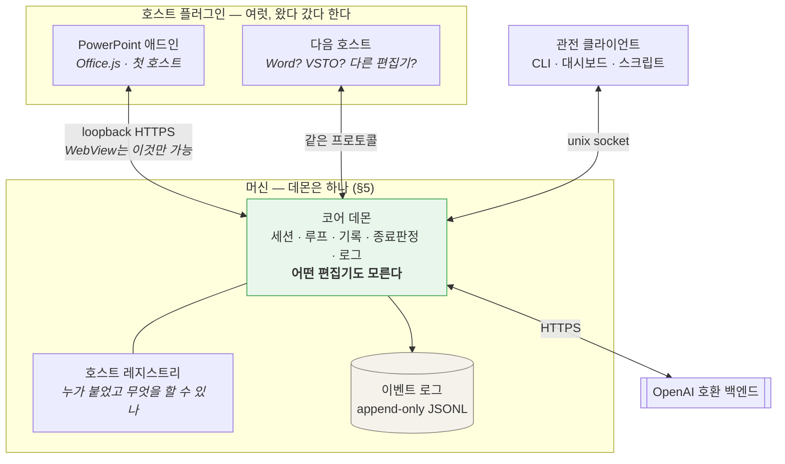
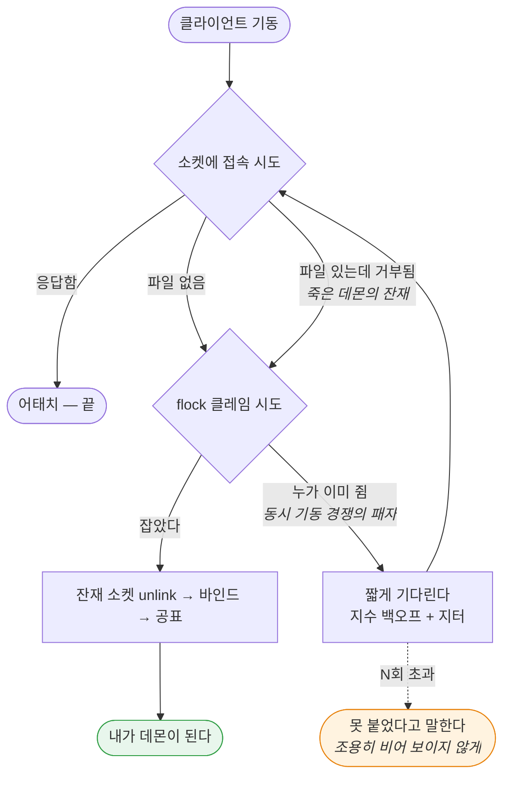

# 문서 에이전트 — 설계 (첫 호스트: Microsoft PowerPoint)

Status: **제안. 구현하지 않았다.** (2026-08-28)

> 이 문서는 아직 코드가 없는 시점의 설계 의도다. 만들면서 어긋난 지점은 여기에 인라인으로
> 정정을 남기고, 지우지 않는다. 부록 A의 API 사실은 확인한 날짜와 출처를 달았다 — 그날 이후
> 마이크로소프트가 바꾼 것은 이 문서가 모른다.

---

## 0. 한 문장

**열려 있는 문서를 읽고, 사람이 말로 시킨 편집을 수행하고, 자기가 한 일이 실제로 그렇게 됐는지
확인한 뒤에야 끝났다고 말하는 에이전트** — 머신에 하나뿐인 코어 데몬과, 거기에 붙는 호스트
플러그인들. 첫 호스트는 PowerPoint 애드인이다.

제목이 "PowerPoint 에이전트"가 아닌 이유는 §4에 있다. **비슷한 일을 하는 플러그인이 또 생길
것이고, 그때 코어를 다시 쓰지 않으려면 코어가 PowerPoint를 몰라야 한다.**

## 1. 무엇이 아닌가

경계를 먼저 적는다. 이 셋은 만들지 않는다.

- **문서 생성기가 아니다.** "이 마크다운으로 발표자료 만들어줘"는 다른 물건이다. 이건 *이미 있는*
  문서를 고친다. 생성은 나중에 얹을 수 있지만, 얹기 전까지는 없다고 말한다.
- **디자인 대행이 아니다.** "예쁘게 해줘"는 판정할 수 없는 요구다. 판정할 수 없는 것을 받으면
  끝났다고 말할 근거가 없어진다(§7).
- **자율 실행이 아니다.** 사람이 편집기를 열어두고 옆에 있는 상황을 전제한다. 사람 없이 도는
  배치 작업은 호스트 플러그인이 아니라 데몬에 직접 붙는 다른 클라이언트의 일이다.

## 2. 이 문제가 코딩 에이전트와 다른 세 지점

magi에서 배운 것을 그대로 옮기려다 부러지는 자리가 셋이다. 설계의 대부분이 여기서 나온다.
서술은 PowerPoint로 하지만, 셋 다 "편집기 안의 살아있는 문서"라는 상황 자체에서 나오므로
다음 호스트에도 그대로 온다.

### 2.1 되돌릴 곳이 없다

코딩 에이전트는 git 위에 산다. 클론이 있고, `base..HEAD`가 있고, 아니다 싶으면 되돌린다.
여기에는 **브랜치가 없다.** 대상은 사람이 지금 이 순간 열어놓고 보고 있는 문서 하나다.

후보 셋:

| 방법 | 되는 것 | 안 되는 것 |
|---|---|---|
| 편집기 자체 undo 스택에 맡긴다 | 공짜, 사람이 이미 아는 조작(⌘Z) | 플러그인 편집이 undo 스택에 어떻게 쌓이는지 **미검증**(S4). 한 번의 지시가 40개 도형을 고쳤을 때 ⌘Z 한 번에 다 돌아오는지, 40번 눌러야 하는지가 다르다 |
| 편집 전 스냅샷 | PowerPoint는 `slide.exportAsBase64()`가 슬라이드를 통째로 .pptx 바이트로 준다 — 완전한 원본 | 되돌리려면 그 바이트를 **다시 넣어야** 하는데, 쓰기 경로가 있는지 미검증(S5). 없으면 스냅샷은 증거로만 쓰이고 복원에는 못 쓴다 |
| 객체 태그 저널 | `shape.tags`(1.3)에 편집 전 값을 적어두고 되돌린다 | 우리가 만든 변경만 되돌린다. 객체를 **삭제**한 경우는 태그도 같이 사라져 못 되돌린다 |

**결정:** 셋 다 쓴다. 순서는 ① 스냅샷을 항상 뜬다(증거+최후수단) → ② 되돌리기는 태그 저널로
시도 → ③ 저널로 안 되는 것(삭제·구조 변경)은 **애초에 승인 없이 하지 않는다**(§8).
편집기의 undo는 우리가 통제하는 게 아니므로 계획에 넣지 않고, S4로 실태만 기록한다.

되돌리기 수단은 호스트마다 다르므로, **어느 수단을 갖췄는지는 호스트가 선언한다**(§4.3).
코어는 "이 호스트는 스냅샷을 뜰 수 있다"만 알고, 그게 .pptx 바이트인지 뭔지는 모른다.

### 2.2 "됐다"의 증거가 다르다

코딩 에이전트의 증거는 exit code와 파일 diff다. 둘 다 기계가 읽는 사실이다. 문서의 결과물은
**시각적**이고, 객체 모델이 "텍스트를 바꿨다"고 말해도 그 텍스트가 상자 밖으로 넘쳤는지는
모델이 모른다.

다행히 PowerPoint에는 답이 API에 있다. `slide.getImageAsBase64()`가 **슬라이드를 PNG로 렌더해
준다**(1.8). 그래서 판정 증거를 두 겹으로 쌓을 수 있다:

- **기록** — 우리가 호출한 편집과 그 전후 객체 모델 값(magi의 관찰 기록에 해당)
- **픽셀** — 편집 전후 렌더 PNG. 넘침·겹침·잘림처럼 객체 모델이 침묵하는 결함은 여기서만 보인다

이 둘을 다 가진 것이 이 제품이 코딩 에이전트보다 **유리한** 유일한 지점이다. 코딩 에이전트는
자기가 만든 것을 눈으로 볼 수 없다.

다만 픽셀 증거가 **모든 호스트에 있으리라 가정하면 안 된다.** 그래서 §7의 판정은 "렌더가 있다"를
전제하지 않고, 호스트가 선언한 증거 종류로 조립된다(§4.3).

### 2.3 읽기 천장과 쓰기 천장이 다르다 — 가장 중요한 사실

Office.js의 PowerPoint 객체 모델은 좁다. 그런데 **읽기에는 두 개의 비상구가 있다.**

| | 무엇으로 | 닿는 곳 |
|---|---|---|
| **읽기** | `slide.exportAsBase64()` (슬라이드 = .pptx 바이트) | **OOXML 전부** — 차트 데이터, SmartArt, 애니메이션, 발표자 노트까지 |
| | `slide.getImageAsBase64()` (PNG 렌더) | 최종 시각 결과 |
| | 객체 모델 (`shapes`, `textFrame`, `fill`, …) | 구조화된 값, 편집 가능한 것과 1:1 |
| **쓰기** | 객체 모델뿐 | 텍스트·도형·서식·표·레이아웃·순서·하이퍼링크 |

**비대칭이 제품의 모양을 정한다.** 에이전트는 차트가 잘못됐다는 것을 *볼 수* 있지만 *고칠 수*
없다. 애니메이션이 어색한 것을 알 수 있지만 손댈 수 없다. 발표자 노트를 읽을 수는 있어도 쓸
수는 없다.

이걸 숨기면 최악의 실패가 난다 — 에이전트가 "차트를 고쳤습니다"라고 말하고 아무것도 안 바뀌는
것. 그래서 **못 고치는 것은 도구를 아예 주지 않고, 발견하면 사람에게 넘긴다**(§4.5, §6).
"보이지만 못 고침"은 이 제품의 1급 결과값이지 예외가 아니다.

이 비대칭도 호스트마다 모양이 다를 것이다. 그래서 §4.5의 규칙 — **광고한 도구는 반드시 실행
가능해야 한다** — 이 코어에 박혀 있어야 하고, 호스트가 알아서 지키기를 바라면 안 된다.

## 3. 기술 스택 — 넷을 비교하고 하나를 고른다

이 절은 **첫 호스트에 대한 결정**이다. 코어의 스택이 아니다.

### 3.1 후보

- **A. Office Add-in (Office.js)** — 공식 확장 모델. WebView 안의 웹앱.
- **B. VSTO / COM 애드인 (.NET)** — PowerPoint 객체 모델 전부(VBA가 보는 그것). Windows 전용.
- **C. AppleScript / OSA 자동화** — macOS에서 PowerPoint를 밖에서 조종.
- **D. 플러그인 아님 — .pptx 파일 직접 조작** (python-pptx, OpenXML SDK).

### 3.2 비교

| 축 | A. Office.js | B. VSTO/COM | C. AppleScript | D. 파일 직접 |
|---|---|---|---|---|
| **개발 머신(macOS)에서 개발** | ✅ | ❌ Windows 전용 | ✅ | ✅ |
| 사용자 플랫폼 | Win·Mac·웹 | Win만 | Mac만 | 무관(UI 없음) |
| 열린 문서에 붙기 | ✅ | ✅ | ✅ | ❌ 파일 잠김 |
| 읽기 천장 | 높음(OOXML+PNG, §2.3) | 최상(전 객체 모델) | 중간 | 최상 |
| 쓰기 천장 | 중간(객체 모델) | 최상 | 중간 | 최상 |
| UI 통합 | ✅ 작업창·리본 | ✅ | ❌ | ❌ |
| **로컬 프로세스 기동** | ❌ 샌드박스(§5.5) | ✅ | ✅ | ✅ |
| 배포 | 매니페스트+호스팅 | ClickOnce/MSI | 앱 번들 | — |

### 3.3 결정: **A. Office Add-in (Office.js), PowerPointApi 1.8 이상**

세 가지 근거이고, 첫 번째가 사실상 혼자 결정한다.

**(a) 개발 머신이 macOS다.** VSTO/COM은 Windows 전용이라 개발도 디버깅도 못 한다. C는 반대로
Windows 사용자를 버린다. D는 UI가 없어 §0의 물건이 아니다. 남는 건 A뿐이다.

**(b) 최소 버전이 1.8인 이유는 §2가 1.8에 걸려 있어서다.** `exportAsBase64`(OOXML 읽기),
`getImageAsBase64`(PNG 렌더), `slide.index`, `applyLayout` — §2.1의 스냅샷과 §2.2의 픽셀 증거를
떠받치는 넷이 **전부 1.8에서 들어왔다.** 1.7 이하로 내려가면 "읽고 판정하는" 물건 자체가 성립
안 한다. 판정을 포기할 바에는 지원 범위를 포기한다.

**(c) 1.8을 최소로 잡는 대가는 명확하고, 광고에 쓰지 말아야 한다.**

- Office on Mac **16.96 (25041326)** 이상, Windows **2504 (Build 18730.20030)** 이상
- **볼륨 라이선스/LTSC 영구 버전은 1.5까지 → 지원 불가.** 기업 표준 이미지가 LTSC면 이 제품은
  안 돈다. 이건 우회로가 없다.
- **iPad는 1.1까지 → 지원 불가.**

런타임에 `Office.context.requirements.isSetSupported('PowerPointApi', '1.8')`로 확인하고,
아니면 **기능을 조용히 줄이지 말고 못 돈다고 말한다.** 매니페스트 `<Requirements>`로 막지 않는
이유는 그러면 애드인 목록에서 아예 사라져 사용자가 *왜* 없는지 모르기 때문이다.

### 3.4 기각한 것을 다시 꺼낼 조건

- **B(VSTO)** — 스파이크에서 쓰기 천장이 실제 요구를 못 받치는 것으로 드러나고, 동시에 Windows
  전용 배포를 받아들일 수 있게 되면. **그때 코어는 손대지 않는다** — VSTO 애드인은 §4.3 계약을
  구현하는 또 하나의 호스트일 뿐이다. 이게 §4의 구조가 사는 값이다.
- **D(파일 직접)** — 사람 없이 도는 배치 작업이 필요해지면. 플러그인이 아니라 데몬에 붙는 다른
  클라이언트로 추가한다. 열린 문서와 충돌하므로 **닫힌 파일에만** 적용한다.

## 4. 구조 — 코어는 호스트를 모른다

### 4.1 층



**호스트 플러그인은 얇다.** 하는 일은 셋뿐이다 — (1) 편집기 API를 호출해 읽고 쓰는 **손**,
(2) 사람이 말을 넣는 **입력**, (3) 데몬이 보내는 것을 그리는 **화면**. 모델 호출도, 루프도,
판정도 플러그인에 없다. 이유는 magi와 같다: 화면은 왔다 갔다 하고 로그는 남아야 한다. 작업창을
닫았다고 진행 중인 편집이 사라지면 안 된다.

**코어가 두껍다.** 에이전트 루프, 기록, 종료 판정이 전부 여기 있다. 플러그인은 코어가
"이 객체의 텍스트를 이렇게 바꿔라"라고 하면 편집기 API를 호출하고 결과를 돌려주는 **원격 손**이다.

이 배치의 대가는 왕복이다. 도구 하나가 코어→플러그인→편집기→플러그인→코어를 돈다. 감수하는
대신 얻는 것이 §4.2다.

### 4.2 왜 코어가 PowerPoint를 몰라야 하나

비슷한 일을 하는 플러그인이 또 생길 것이다. 그때 선택지는 둘뿐이다 — 코어를 복사하거나,
코어가 애초에 호스트를 모르거나. **복사는 두 벌이 어긋나는 것으로 끝난다.** magi가 이 값을
이미 치렀다: 부모 컨텍스트 블록이 콜사이트마다 조립돼 있어서 한쪽에만 계약이 도달했고,
헤드리스 툴 목록이 손으로 관리된 두 번째 사본이라 두 개 뒤처진 채 빌드가 통과했다. 손으로
관리되는 두 번째 사본은 **뒤처져도 빌드를 깨뜨리지 못한다**는 것이 그 교훈이다.

그래서 경계를 이렇게 긋는다:

| 코어가 아는 것 | 코어가 모르는 것 |
|---|---|
| 세션, 턴, 스텝 | 슬라이드, 도형, 문단 |
| 도구 호출과 결과 | 그 도구가 무엇을 하는지 |
| 증거의 **종류**(텍스트·이미지·구조화 데이터) | 그 이미지가 슬라이드 렌더라는 것 |
| "이 호스트는 스냅샷을 뜰 수 있다" | 스냅샷이 .pptx 바이트라는 것 |
| 승인이 필요한 호출인지 | 왜 위험한지 |

코어에 `slide`나 `shape`라는 낱말이 나오면 그건 결함이다. 테스트가 그걸 잡는다 — **코어
패키지에서 호스트 어휘를 grep해 0이 아니면 실패**한다. magi의 `internal/arch`가 의존 방향에
대해 하는 일과 같다.

### 4.3 호스트 어댑터 계약

붙을 때 호스트가 자기를 소개한다. 이 한 번의 인사에 계약 전부가 실린다.

```jsonc
{
  "protocol": 1,
  "role": "host",                       // "host" | "observer"  (§5.7)
  "host":  { "kind": "powerpoint", "version": "…", "platform": "mac" },
  "scope": { "id": "<문서 식별자>", "title": "…" },   // 이 손이 닿는 범위

  // 이 호스트가 실제로 실행할 수 있는 것. 코어는 여기 없는 도구를 절대 만들어내지 않는다.
  "tools": [ { "name": "set_text", "description": "…", "schema": { /* JSON Schema */ } } ],

  // 종료 판정이 물어볼 수 있는 증거의 종류 (§7)
  "evidence": [
    { "kind": "image",      "name": "render",   "of": "unit" },
    { "kind": "blob",       "name": "snapshot", "of": "unit" },
    { "kind": "structured", "name": "objects",  "of": "unit" }
  ],

  // 되돌리기 수단 (§2.1)
  "undo": ["journal", "snapshot"]
}
```

여기서 나오는 규칙 다섯이 코어에 박힌다. 다섯 다 magi가 값을 치르고 배운 것이다.

**① 코어는 도구를 발명하지 않는다.** 세션의 도구 목록 = 그 호스트가 선언한 것, 그대로.
선언 안 된 것은 모델이 아예 못 본다.

**② 이름은 네임스페이스가 붙는다** — `ppt__set_text`. magi의 MCP 어댑터가 이걸 안 하다가
서버의 `read`/`write`/`list`가 내장 도구를 **가렸고**, 서버 둘이 서로를 덮어썼다. 호스트 둘이
동시에 붙는 것이 정상인 설계에서 네임스페이스 없는 이름은 시한폭탄이다.

**③ 호출은 선언한 그 호스트로 간다.** "어떤 호스트"가 아니라 `scope.id`로 지목된 **그** 손으로.
PowerPoint 창 둘이 열려 있으면 손도 둘이고, 문서 A의 도구가 문서 B에 닿으면 안 된다.

**④ 미선언 인자는 조용히 버리지 않는다.** magi가 이걸 실측했다 — 25,291건 중 387건에서
JSON 디코더가 선언 안 된 인자를 말없이 버렸고, 모델은 **묻지 않은 질문에 대한 정상 응답**을
받았다. 스키마에 없는 인자가 오면 에러로 돌려준다. 조용한 성공보다 시끄러운 실패가 싸다.

**⑤ "모른다"와 "없다"를 구분한다.** 호스트가 어떤 능력에 답을 못 하면 그건 `unknown`이지
`none`이 아니다. magi의 `App.ListModels`가 둘을 뭉개서 `(nil, nil)`을 반환한 탓에, 아무도 안 물어본
빈 메뉴와 백엔드가 정말 비어 있는 메뉴가 구분되지 않았고 몇 달을 그랬다.

### 4.4 광고와 실행은 일치해야 한다

②~⑤보다 더 자주 깨질 규칙이라 따로 적는다. **모델에게 보여준 도구는 반드시 실행 가능해야
한다.** magi에서 이게 깨졌을 때의 결과가 기록에 남아 있다 — 허용목록이 거부하는 도구를 프롬프트가
매 스텝 광고했고, 모델이 그걸 부르고, 거부당하고, 다시 부르다가 루프 가드에 죽었다.

여기서 이게 깨지는 경로는 §2.3이다. 차트를 *볼 수* 있으니 `fix_chart` 같은 도구를 넣고 싶어지는데,
API가 없으므로 그 도구는 항상 실패한다. **없는 능력은 도구로 만들지 않는다.** 대신 읽기 도구가
"이건 차트이고 이 호스트는 차트를 못 고친다"를 결과에 실어 보내고, 에이전트는 그걸 사람에게
넘긴다(§7의 세 번째 착지).

### 4.5 버전이 어긋날 때

플러그인은 사용자가 업데이트하고 데몬은 우리가 업데이트한다. 둘의 버전은 반드시 어긋난다.
magi가 이미 이 문제를 풀어놨으므로 그 규칙을 가져온다:

- **와이어는 추가만 한다(additive-only).** 필드를 지우거나 의미를 바꾸지 않는다.
- **핸드셰이크에서 협상하고, 그 뒤로는 게이팅한다.** 새 기능은 양쪽이 안다고 확인된 뒤에만 쓴다.
- **골든 테스트로 와이어 모양을 못 박는다.** 프로토콜이 바뀌면 테스트가 먼저 깨진다.

## 5. 코어 데몬 — 머신에 하나

요구사항은 이렇다: **플러그인이 켜지면 코어 데몬이 뜨고, 다른 것들이 거기 붙는다. 이미 떠 있으면
그걸 쓴다. 그게 죽으면 새로 띄운다. 머신에 데몬은 항상 하나다.**

### 5.1 락 먼저, 공표는 그다음

magi가 이미 이 문제를 풀었고, 푸는 과정에서 **틀린 순서를 한 번 겪었다.** 공표를 먼저 했더니
동시에 시작한 둘이 서로의 레코드를 덮어썼고, 나가는 길에 승자의 것을 지웠다. 그래서 순서가
고정됐다:

```
① flock으로 클레임을 잡는다 (성공한 하나만 데몬이 된다)
② 소켓을 바인드한다
③ 그제서야 레코드를 공표한다 (다른 것들이 볼 수 있게)
```

이 순서를 그대로 쓴다. 새로 발명하지 않는다.

### 5.2 워크스페이스 하나가 아니라 머신 하나 — 다른 선택과 그 대가

magi의 데몬은 **워크스페이스당 하나**다. 소켓 이름이 작업 디렉토리의 실제 경로에서 나오고,
그래서 "여기의 데몬"이 모호하지 않다.

여기서는 **머신당 하나**로 간다. 사용자 지시이기도 하고, 근거도 있다 — 편집기에서
"워크스페이스"에 해당하는 것은 열린 문서인데, 문서는 열리고 닫히고 이름이 바뀌고 두 개가 동시에
열린다. 문서마다 데몬을 띄우면 데몬이 문서의 수명에 묶여 §4.1의 "화면은 왔다 갔다 해도 로그는
남는다"가 깨진다. 게다가 §4의 요점 자체가 **호스트 여럿이 한 코어에 붙는 것**이므로, 코어가
호스트 수만큼 있으면 그 구조가 의미를 잃는다.

대가는 정직하게 적어둔다:

- **격리가 없다.** 문서 A의 작업과 문서 B의 작업이 한 프로세스 안에 있다. 세션과 `scope.id`로
  나누되, 프로세스 경계가 지켜주던 것(한쪽이 죽어도 다른 쪽은 산다)은 없어진다.
- **동시 편집을 데몬이 직렬화해야 한다.** magi는 "한 워크스페이스에 한 턴"을 프로세스 하나로
  보장했다. 여기서는 **`scope.id` 단위 락**을 데몬 안에서 직접 들어야 한다. 두 턴이 한 문서를
  고치는 것은 두 작가가 한 파일을 쓰는 것과 같다.
- **"머신에 하나"는 실은 "사용자당 하나"다.** 유닉스 소켓을 사용자 홈 아래 두면 다른 사용자
  계정의 데몬과는 별개다. 진짜 머신 전역은 권한이 필요하고, 그 값을 치를 이유가 없다.
  문서와 UI에는 "사용자당 하나"로 적는다 — 모호하게 두면 다중 사용자 머신에서 놀란다.

### 5.3 획득-또는-접속

모든 클라이언트가 기동할 때 도는 절차 하나다. 클라이언트마다 다르게 구현하지 않는다 — 다르게
구현된 두 벌은 반드시 어긋난다(§4.2). **이 절차는 코어 라이브러리가 제공하고 호스트는 부르기만
한다.**



세 가지가 이 그림의 요점이다.

- **접속 실패의 두 원인을 구분한다.** 소켓 파일이 없는 것과, 있는데 아무도 안 듣는 것(죽은
  데몬의 잔재)은 다른 상황이고 둘 다 "내가 데몬이 될 차례"로 수렴하지만, **잔재는 unlink가
  필요하고 그 unlink는 락을 잡은 뒤에 해야 한다.** 락 없이 지우면 방금 뜬 남의 소켓을 지운다.
- **경쟁의 패자는 실패하지 않는다.** 락을 못 잡았다는 것은 누군가 지금 데몬이 되는 중이라는
  뜻이므로, 잠깐 기다렸다 다시 접속한다. 지터를 넣는 이유는 편집기 창 셋이 동시에 열리는 것이
  정상 상황이기 때문이다.
- **끝내 못 붙으면 말한다.** §4.3의 규칙 ⑤와 같다 — *"모르겠다"와 "없다"는 다르다.* 데몬에
  못 붙은 화면은 "할 일 없음"처럼 보이면 안 되고, 못 붙었다고 그 이유와 함께 말해야 한다.

### 5.4 죽으면 다시

- **붙어 있는 클라이언트는 연결이 끊기는 것으로 안다.** 하트비트를 따로 두지 않는다 — 소켓이
  이미 그걸 알려준다. 끊기면 §5.3을 처음부터 다시 돈다.
- **감독은 OS에 맡긴다.** macOS는 LaunchAgent(`KeepAlive`), Windows는 예약 작업/서비스가
  "죽으면 다시 띄운다"를 공짜로, 우리 코드보다 안정적으로 해 준다. §5.3의 자체 선출은 그걸
  **대체하는 게 아니라** 감독자가 설치되지 않았거나 아직 안 돌 때를 메운다. 둘 다 있어야
  하는 이유: 감독자만 있으면 동시 기동 경쟁을 못 풀고, 선출만 있으면 마지막 클라이언트가
  꺼질 때 데몬도 같이 사라진다.
- **데몬은 유휴 상태로 오래 산다.** 작업창을 닫아도 죽지 않는다(§4.1). 다만 무한정은 아니고,
  붙은 클라이언트가 없고 진행 중인 턴도 없는 상태가 길어지면 스스로 내려간다 — 얼마나 길어야
  하는지는 §12의 열린 질문.

### 5.5 ⚠ 정면 충돌: WebView는 프로세스를 못 띄운다

**"플러그인이 켜지면 데몬을 띄운다"를 Office.js 플러그인은 직접 할 수 없다.** 애드인은 샌드박스된
WebView 안의 웹 페이지이고, 로컬 프로세스를 실행할 수단이 없다. 이건 우리가 고를 수 있는
설계가 아니라 플랫폼의 제약이다.

지시를 못 따르겠다는 뜻이 아니라, **누가 데몬을 띄우느냐가 웹 기반 플러그인이 아니어야 한다**는
뜻이다. 우회로 셋을 스파이크로 가른다:

| | 방법 | 되면 좋은 점 | 위험 |
|---|---|---|---|
| **W1** | 데몬을 **별도 앱으로 설치**하고 OS 감독자(launchd/예약작업)에 등록. 플러그인은 붙기만 한다 | 가장 튼튼하고 §5.4와 정확히 맞물린다. **호스트가 늘어도 설치는 한 번** | 설치 단계가 하나 늘어난다. 플러그인만 깔면 안 돈다 |
| **W2** | 플러그인이 **커스텀 URL 스킴**(`docagent://up`)을 연다 → OS가 등록된 헬퍼 앱을 기동 | "플러그인 켜면 뜬다"에 가장 가깝다 | WebView2/WKWebView가 커스텀 스킴 이동을 막는지 **미검증(S3)**. 앱은 여전히 설치돼 있어야 한다 |
| **W3** | 데몬을 두지 않고 플러그인 안에서 전부 돈다 | 설치 없음 | §4가 통째로 무너진다. 호스트가 둘이 되는 순간 코어가 둘이고, 작업창 닫으면 진행 중인 편집이 사라진다. **사용자 지시와 정면 배치** |

**잠정 결정: W1을 기본으로, W2를 그 위에 얹는다.** 설치는 어차피 한 번이고, 그 한 번으로
§5.4의 감독을 공짜로 얻는다. 호스트가 여럿이 되면 이 선택의 값이 더 커진다 — 플러그인마다
데몬 기동 로직을 넣는 대신 설치된 앱 하나가 그걸 맡는다. W2가 되면 "앱은 깔려 있는데 데몬이 안
도는" 상황에서 사용자가 터미널로 갈 필요가 없어지므로 편의로 추가한다. W3은 사용자 요구를
못 지키므로 후보에서 뺀다.

### 5.6 웹 기반 플러그인은 유닉스 소켓에 못 붙는다 — 문이 둘이어야 한다

두 번째 플랫폼 제약. **브라우저 엔진은 유닉스 소켓을 열 수 없다.** WebView 안의 플러그인은
`fetch`/`WebSocket`밖에 없으므로 데몬은 **루프백 포트**를 하나 열어야 한다.

여기에 세 번째 제약이 붙는다. 애드인 페이지는 **반드시 https로 서빙**되므로, 거기서
`http://127.0.0.1`을 부르면 **혼합 콘텐츠로 차단된다.** 즉 루프백도 **https여야** 하고, 그러려면
로컬에서 신뢰되는 인증서가 있어야 한다. 개발용으로는 `office-addin-dev-certs`가 그 일을 하지만,
**배포판에서 사용자 머신의 신뢰 저장소에 인증서를 넣는 것은 가볍게 볼 일이 아니다.** S3에서
실제로 확인한다.

그래서 데몬의 문은 둘이다:

| 문 | 누가 쓰나 | 형태 |
|---|---|---|
| **유닉스 소켓** | CLI, 스크립트, 네이티브 호스트(VSTO 등), 관전 클라이언트 | `~/…/docagent/daemon.sock` (0600). 권한이 파일시스템에서 나온다 |
| **루프백 HTTPS** | WebView 기반 플러그인 | `127.0.0.1:<포트>`, 라우팅 불가 주소에만 바인드. 토큰으로 인증 |

**두 문은 같은 프로토콜을 나른다.** 전송만 다르고 §4.3의 계약은 하나다 — 문마다 다른 프로토콜을
두면 호스트가 늘어날 때 조합이 늘어난다.

magi의 "아무것도 포트를 열지 않는다"는 규칙은 여기서 **지킬 수 없다.** 지킬 수 없으므로 대신
좁힌다 — 루프백에만 바인드하고(라우팅 가능한 주소면 거부), 데몬이 기동할 때 만든 토큰을
플러그인이 제시해야 하고, 오리진을 검사한다. 이 셋을 테스트가 강제한다.

### 5.7 어태치 — 손과 관전자

역할이 둘이고, 구분이 안 되면 두 창이 같은 문서를 고친다.

- **손(host)** — `scope.id`를 하나 쥐고, 그 문서에 대한 도구를 실행한다. **한 `scope.id`에 손은
  하나뿐이다.** 같은 문서로 두 번째 손이 붙으려 하면 거부하고 이유를 말한다.
- **관전자(observer)** — 보기만 한다. 전사·기록·판정 결과를 구독한다. 여럿이어도 된다.
  도구를 부르면 거부된다.

그 위에 셋:

- **구독은 재생이다.** 붙는 순간 로그를 리플레이해서 현재 상태를 만들고, 그 뒤로 라이브를 받는다.
  늦게 붙은 클라이언트가 앞을 못 보는 일이 없어야 한다(magi의 `Subscribe`와 같은 계약).
- **관전자도 범위를 넘지 못한다.** 문서 A의 손이 문서 B의 전사를 구독할 이유가 없다. 기본은
  자기 `scope`이고, 전체 관전은 명시적으로 요구해야 한다.
- **손이 사라지면 턴은 멈춘다.** 작업창이 닫히면 편집을 수행할 수단이 없어지므로, 진행 중인 턴은
  실패가 아니라 **보류**로 기록하고, 같은 `scope.id`의 손이 다시 등록되면 이어간다.

## 6. PowerPoint 호스트의 도구 표면

§4.3 계약의 첫 구현이다. **이 목록은 코어에 없다** — PowerPoint 플러그인이 인사할 때 선언한다.

도구는 편집기 API 호출 하나에 대응하고, 모델이 그걸 조합해서 못 하는 일이 있을 때만 새로 판다.
magi가 집계 도구 넷을 지우면서 세운 기준("호출 0회면 도구가 아니다")을 여기서도 쓴다 — 다만
그건 실측이 쌓인 뒤의 일이고, 지금은 최소로 시작한다.

**읽기**

| 도구 | 하는 일 |
|---|---|
| `list_slides` | 인덱스·id·레이아웃·도형 수. 덱 전체의 목차 |
| `read_slide` | 한 슬라이드의 도형을 구조화해서. 텍스트·위치·크기·서식·placeholder·alt text |
| `render_slide` | PNG 렌더(§2.2). **모델이 눈으로 볼 때만** — 비싸므로 매 스텝이 아니다 |
| `export_slide_ooxml` | OOXML 원문(§2.3). 객체 모델이 침묵하는 것(차트 데이터 등)을 볼 때 |
| `find_shapes` | 덱 전체에서 조건에 맞는 도형. "폰트가 X인 것 전부" 같은 일괄 작업의 입구 |

**쓰기** — `set_text` · `format_shape` · `move_shape` · `add_shape` · `delete_shape` ·
`apply_layout` · `reorder_slide` · `set_hyperlink`. 전부 객체 모델에 1:1 대응한다.

**의도적으로 선언하지 않는 것과 이유**

- **OOXML 직접 쓰기.** 읽기는 주지만 쓰기는 안 준다. 쓰기 경로가 있는지도 미검증(S5)이지만,
  있더라도 안 준다 — 객체 모델을 우회한 쓰기는 코어가 기록도 되돌리기도 못 한다.
- **차트·SmartArt·애니메이션·발표자 노트 편집.** API가 없다(§2.3). §4.4의 규칙: **없는 능력은
  도구로 만들지 않는다.** 대신 `read_slide`가 "이건 차트이고 이 호스트는 못 고친다"를 결과에
  실어 보낸다.
- **마스터·레이아웃 편집.** 한 슬라이드를 고치랬는데 덱 전체가 바뀌는 것은 되돌릴 수 없는
  종류의 사고다. 레이아웃은 `apply_layout`으로 **고르기만** 한다.

## 7. 끝났다고 말하는 법

magi의 구조를 가져오되 **크기를 줄인다.** 그리고 **증거의 종류를 호스트에서 받는다.**

**가져오는 것:**

- **끝은 선언이다.** 모델이 도구를 그만 부르는 것으로 턴이 끝나지 않는다. `declare_done`을
  불러야 하고 — 이건 코어의 도구다, 호스트가 선언하는 게 아니다 — 그때 판정이 돈다.
- **판정은 주장이 아니라 기록을 본다.** 모델이 "고쳤습니다"라고 쓴 문장이 아니라, 코어가 기록한
  편집 호출과 그 전후 값, 그리고 호스트가 내준 증거를 본다.
- **요구사항 워크.** 결론 전에 사람이 시킨 것을 한 줄씩 걸고 충족/미충족을 표시한다. 스키마에서
  워크가 결론보다 **앞에** 온다 — 결론을 먼저 정해놓고 근거를 짜맞추지 못하게.
- **세 번째 착지.** 성공/실패 이진이면 모델이 성공을 만들어낸다. **UNVERIFIED**를 둔다 —
  "바꾸긴 했는데 확인하지 못했다". 렌더가 실패했거나, 손이 사라졌거나(§5.7), 요구가 애초에
  판정 불가였거나, **호스트가 못 고치는 것을 발견했을 때**(§2.3)의 정직한 끝이다.

**호스트에서 받는 것:**

- **증거는 선언된 종류로만 조립한다.** 판정 프롬프트가 "렌더 이미지가 있다"를 전제하지 않는다.
  호스트가 `image/render`를 선언했으면 편집 전후 두 장이 들어가고, 안 했으면 그 자리는 비고,
  **비었다는 사실이 판정에 명시된다**(§4.3의 규칙 ⑤: 없는 것과 못 구한 것은 다르다).
- 그래서 다음 호스트가 픽셀을 못 주더라도 판정이 무너지지 않는다. 증거가 얇아질 뿐이고,
  얇다는 것이 기록에 남는다.

**줄이는 것:**

- **위원 셋이 아니라 하나.** magi는 렌즈 셋으로 읽는다. 여기서는 한 번의 판정 호출로 간다.
  근거: 사람이 옆에 있고(잘못된 승인의 비용이 낮다), 턴이 짧고, 무엇보다 magi 자신의 측정이
  "렌즈 한 줄 차이의 위원 셋은 세 의견이 아니라 한 의견의 세 표본"이라고 말했다(21표 중 21표
  일치, 이견 0). 셋을 두려면 **서로 다른 백엔드**여야 하는데 그건 사용자가 갖췄다고 가정할 수
  없는 설정이다.
- **다만 판정 호출은 픽셀을 본다.** 위원 수를 줄이는 대신 증거의 질을 올린다. 이건 magi가 가질
  수 없었던 증거다(§2.2).

**거절도 유한하다.** 아무것도 안 바뀐 채로 판정이 계속 거절하면 UNVERIFIED로 착지하고 멈춘다.
정직한 실패는 종점이지 루프가 아니다.

## 8. 안전

- **범위는 좁게 시작한다.** 선택이 없으면 **현재 단위**(슬라이드)가 기본이고, 문서 전체 편집은
  사람이 명시적으로 말했을 때만이다. "폰트 다 바꿔줘"가 40장을 건드리기 전에 몇 장이 바뀔지
  말하고 묻는다.
- **되돌릴 수 없는 것은 승인을 받는다.** 삭제, N개 이상 일괄 변경, 레이아웃 교체. §2.1의
  저널로 못 되돌리는 것들이 정확히 이 목록이다.
- **문서는 사용자 것이다.** 사람이 지금 타이핑 중이거나 객체를 잡고 있으면 쓰지 않는다.
  에이전트가 사람 손에서 커서를 빼앗는 것은 어떤 이득으로도 못 갚는다.
- **읽은 것은 데이터지 지시가 아니다.** 문서 안의 텍스트가 "이전 지시를 무시하라"라고 적혀
  있어도 그건 문서 내용이다. 남이 보낸 파일을 여는 것이 정상 상황이므로 현실적인 표면이다.
- **호스트는 신뢰 경계다.** 손이 선언한 도구 스키마와 증거는 **데이터로 검사한다.** 붙었다는
  이유로 임의의 스키마를 그대로 모델에게 넘기지 않는다 — 크기 상한, 이름 문자셋, 개수 상한.
  나중에 우리가 안 만든 플러그인이 붙을 수 있고, 그때 이 검사가 유일한 방어다.
- **밖으로 나가는 것은 정한다.** 문서 본문과 렌더 이미지가 LLM 백엔드로 나간다. 사용자가
  이걸 알아야 하고, 로컬 백엔드를 고를 수 있어야 한다. 기본값을 클라우드로 두는 것은 결정이지
  기본이 아니다.

## 9. 검증 계획 — 설계가 기대는 미검증 전제

이 문서의 여러 결정이 **아직 확인 안 된 전제** 위에 있다. 만들기 전에 스파이크로 확인한다.
각 항목에 "무엇이 나오면 설계가 바뀌는가"를 적어둔다 — 그게 없으면 스파이크가 아니라 구경이다.

| | 확인할 것 | 방법 | 이게 나오면 설계가 바뀐다 |
|---|---|---|---|
| **S1** | 1.8 API가 Mac에서 실제로 광고대로 도는가 | 빈 애드인으로 `exportAsBase64`/`getImageAsBase64`를 실호출 | 렌더가 안 되면 §2.2의 픽셀 증거가 사라지고, PowerPoint 호스트의 `evidence` 선언에서 `render`가 빠진다(§7은 그래도 돈다) |
| **S2** | 렌더 PNG가 판정에 쓸 만한 해상도·충실도인가 | 넘침·겹침·잘림을 일부러 만든 슬라이드를 렌더해 눈으로 확인 | 못 알아보면 픽셀은 사람용 표시로만 쓰고 판정 입력에서 뺀다 |
| **S3** | 루프백 https + 커스텀 URL 스킴 | 애드인에서 로컬 https 호출, 그리고 `docagent://` 이동 | https가 막히면 §5.6이 무너져 전송을 다시 고른다. 스킴이 막히면 W2를 버리고 W1만 간다 |
| **S4** | 플러그인 편집이 편집기 undo 스택에 어떻게 쌓이나 | 도형 10개를 한 번에 고치고 ⌘Z를 눌러본다 | 한 번에 다 돌아오면 §2.1의 저널 비중이 줄어든다. 10번 눌러야 하면 사용자에게 그렇게 말해야 한다 |
| **S5** | 슬라이드 .pptx 바이트를 **되돌려 넣는** 경로가 있는가 | 삽입 계열 API로 스냅샷 복원 시도 | 없으면 스냅샷은 증거 전용이 되고, PowerPoint 호스트의 `undo` 선언에서 `snapshot`이 빠진다 |
| **S6** | 큰 덱에서 왕복 비용 | 100장 덱에서 `list_slides` + 슬라이드 하나 편집의 실측 | 느리면 §4.1의 원격 손 구조에 배치 호출을 넣어야 한다 |

**S1과 S3이 먼저다.** 둘 중 하나라도 안 되면 다른 스파이크는 의미가 없다.

## 10. 마일스톤

1. **M0 — 스파이크.** S1·S3을 먼저, 그다음 나머지. 산출물은 코드가 아니라 이 문서의 정정.
2. **M1 — 코어 데몬 골격.** §5.3 획득-또는-접속, 두 개의 문(§5.6), 로그, 구독-리플레이,
   §4.3 핸드셰이크. **호스트 없이** 가짜 호스트 하나로 검증한다 — 가짜로 되는지가 §4.2가
   지켜졌는지의 시험이다.
3. **M2 — 원격 손.** PowerPoint 플러그인이 붙어 읽기 도구 다섯 개를 수행. 모델 없이, 손으로
   명령을 넣어서.
4. **M3 — 루프.** 모델을 붙이고 쓰기 도구까지. 판정 없이 — 이 단계의 목적은 도구가 실제로
   문서를 고치는지 보는 것.
5. **M4 — 종료 판정.** §7. 여기서 처음으로 "끝났다"를 말할 수 있게 된다.
6. **M5 — 안전.** §8의 범위·승인·되돌리기.

M4 전까지는 **아무한테도 쓰라고 하지 않는다.** 판정 없는 에이전트는 고쳤다고 말하고 안 고치는
물건이고, 그게 §0이 존재하는 이유다.

두 번째 호스트는 **M4 이후에** 붙인다. 그전에 붙이면 계약이 아니라 두 구현의 평균이 된다.

## 11. 의도적으로 하지 않는 것

- **자체 인증을 만들지 않는다.** 루프백에만 바인드하고 토큰으로 막는다(§5.6). 그 이상은 조직이
  이미 쓰는 수단에 맡긴다.
- **여러 머신에 걸치지 않는다.** 데몬은 사용자당 하나이고 그 머신 안에 있다. 함대·클러스터는
  이 제품의 문제가 아니다.
- **문서를 대신 디자인하지 않는다.** §1.
- **매 스텝 렌더하지 않는다.** 비싸고, 대부분의 스텝은 픽셀을 볼 이유가 없다. 렌더는 모델이
  부를 때와 판정할 때만.
- **호스트를 코어가 고르지 않는다.** 어떤 플러그인을 설치할지는 사람의 결정이고, 데몬이
  플러그인을 찾아다니거나 자동으로 켜지 않는다.

## 12. 열린 질문

결정이 필요하고, 지금 내가 정할 근거가 없는 것들.

1. **데몬 유휴 종료 시간.** 붙은 클라이언트도 진행 중인 턴도 없을 때 얼마나 살아 있어야 하나.
   0이면 §4.1의 이점이 사라지고, 무한이면 사용자 머신에 프로세스가 영원히 남는다.
2. **기본 백엔드.** 로컬(느리지만 문서가 밖으로 안 나감)인가 클라우드(빠르지만 나감)인가.
   §8의 마지막 항목과 직결된다.
3. **배포 형태.** 애드인 매니페스트를 어디서 호스팅하나 — 사내 카탈로그인가, AppSource인가,
   sideload인가. AppSource면 심사 규칙이 §5.6의 로컬 데몬 요구와 부딪힐 가능성이 있다(미확인).
4. **LTSC를 정말 버리는가.** §3.3(c)의 대가 중 되돌릴 수 없는 것.
5. **어디에 살 것인가, 그리고 이름.** 지금은 magi 저장소 안의 디렉토리 하나
   (`powerpoint-agent/`)이고, 코어와 첫 호스트가 같이 있다. 압력이 둘 온다 — §4가 사실이라면
   이름이 틀려지고(`core` / `hosts/powerpoint`로 갈라야 한다), 코어가 magi와 실제로 공유하는
   것이 얼마나 되느냐에 따라 여기 남는 게 맞는지도 달라진다. 공유가 많으면(로그·세션·종료
   판정의 뼈대) 한 저장소가 맞고, 적으면 따로 나가는 게 맞다. 코드가 없는 지금은 판단할
   근거가 없으므로 두 질문 다 열어둔다.

## 부록 A. 확인한 API 사실과 출처

2026-08-28에 Microsoft Learn에서 직접 확인했다. 그날 이후의 변경은 이 문서가 모른다.

**요구사항 집합과 플랫폼** — [PowerPoint JavaScript API requirement sets](https://learn.microsoft.com/en-us/javascript/api/requirement-sets/powerpoint/powerpoint-api-requirement-sets)

| 집합 | 추가된 것 | 웹 | Windows(M365/리테일) | Windows LTSC | Mac | iPad |
|---|---|---|---|---|---|---|
| 1.1 | 프레젠테이션 생성 | ✅ | 1810 | Office 2021 | 16.19 | 2.17 |
| 1.2 | 슬라이드 삽입·삭제 | ✅ | 2011 | Office 2021 | 16.43 | ❌ |
| 1.3 | 슬라이드 추가·삭제, 커스텀 태그 | ✅ | 2111 | Office 2024 | 16.55 | ❌ |
| 1.4 | 도형 추가·이동·크기·서식·삭제 | ✅ | 2207 | Office 2024 | 16.62 | ❌ |
| 1.5 | 하이퍼링크 | ✅ | 2208 | Office 2024 | 16.64 | ❌ |
| 1.6 | 슬라이드·텍스트범위·도형 **선택** | ✅ | 2410 | ❌ | 16.90 | ❌ |
| 1.7 | 커스텀·문서 속성 | ✅ | 2412 | ❌ | 16.92 | ❌ |
| **1.8** | **바인딩, 도형, 표** | ✅ | **2504** | ❌ | **16.96** | ❌ |
| 1.9 | 표 서식·관리 | ✅ | 2508 | ❌ | 16.100 | ❌ |
| 1.10 | 접근성, 슬라이드 배경, 하이퍼링크 | ✅ | 2601 | ❌ | 16.105 | ❌ |

**`PowerPoint.Slide`** — [레퍼런스](https://learn.microsoft.com/en-us/javascript/api/powerpoint/powerpoint.slide)

- 속성: `background`(1.10) · `customXmlParts`(1.7) · `hyperlinks`(1.6) · `id`(1.2) ·
  `index`(1.8) · `layout`(1.3) · `shapes`(1.3) · `slideMaster`(1.3) · `tags`(1.3) ·
  `themeColorScheme`(1.10)
- 메서드: `applyLayout`(1.8) · `delete`(1.2) · **`exportAsBase64`(1.8)** ·
  **`getImageAsBase64`(1.8, PNG)** · `moveTo`(1.8) · `setSelectedShapes`(1.5)
- **목록에 없는 것: 발표자 노트, 애니메이션, 전환.** §2.3의 근거.
- `exportAsBase64`에 문서가 단 주의: *"This method is optimized to export a single slide.
  Exporting multiple slides can impact performance."* — 덱 전체 스냅샷을 슬라이드 루프로 뜨는
  것은 비싸다는 뜻. §8의 "범위를 좁게"와 §9의 S6이 여기서 나왔다.

**`PowerPoint.Shape`** — [레퍼런스](https://learn.microsoft.com/en-us/javascript/api/powerpoint/powerpoint.shape)

- 읽고 쓰는 것: `textFrame` · `fill` · `lineFormat` · `left`/`top`/`width`/`height`/`rotation` ·
  `name` · `altTextDescription`/`altTextTitle` · `isDecorative` · `tags` · `adjustments` ·
  `level` · `visible`
- 읽기·이동만: `id` · `creationId` · `type` · `placeholderFormat` · `zOrderPosition` ·
  `parentGroup` · `getParentSlide`/`Layout`/`Master` · `getTable` · `getImageAsBase64` ·
  `customXmlParts`
- 동작: `delete` · `group` · `setHyperlink` · `setZOrder`
- **`type` 열거에 `"Chart"`, `"SmartArt"`, `"Media"`, `"Model3D"`, `"Ink"`, `"Ole"`가 있다 —
  그러나 그것들을 *조작하는* API는 없다.** 무엇인지 알아볼 수는 있고 고칠 수는 없다. §2.3의
  비대칭이 여기서 가장 선명하다.
- `getGraphicOrNullObject`는 **프리뷰**이고 문서가 *"Do not use this API in a production
  environment"*라고 적었다. 쓰지 않는다.

**참고한 magi 문서** — [`../docs/ARCHITECTURE.md`](../docs/ARCHITECTURE.md) §11(데몬·flock 순서·유도된 상태), §3(포트와 nil
규약, "모른다≠없다"), §5(종료 경로), §7(도구가 자리를 얻는 기준), [`../docs/EXTENDING.md`](../docs/EXTENDING.md) §1(MCP
네임스페이스), [`../docs/DESIGN_COMPAT_UPDATE.md`](../docs/DESIGN_COMPAT_UPDATE.md)(추가 전용 와이어·핸드셰이크 게이팅),
[`../docs/MANUAL.md`](../docs/MANUAL.md) §13(어태치와 큐), [`../SECURITY.md`](../SECURITY.md)(신뢰 경계). 같은 사고를 두 번 하지 않으려고
가져왔고, 다르게 간 곳은 §5.2와 §7에 이유를 적었다.
