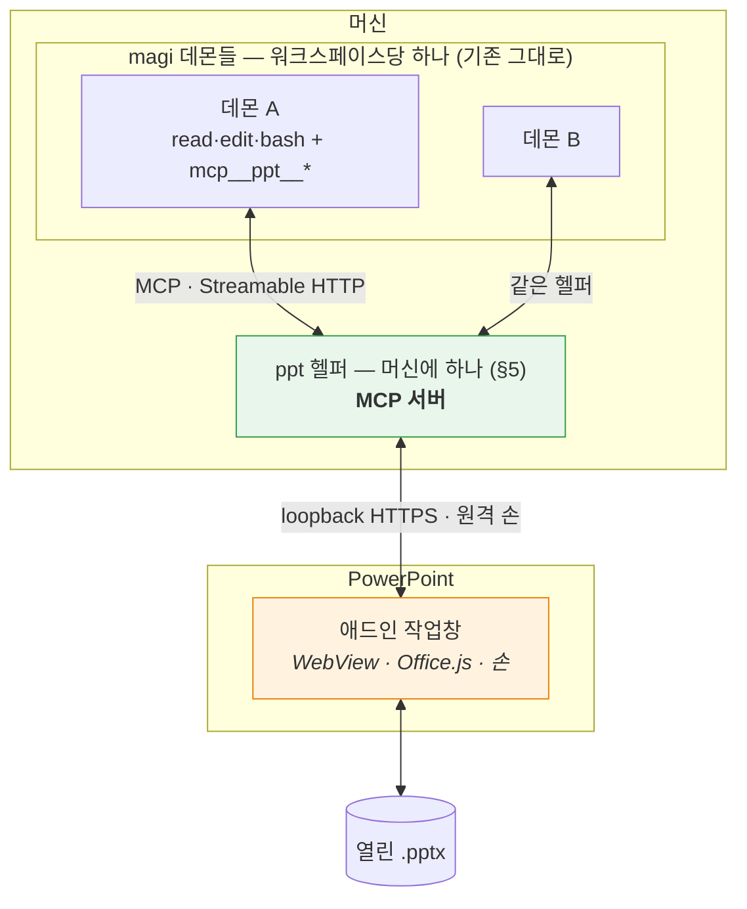
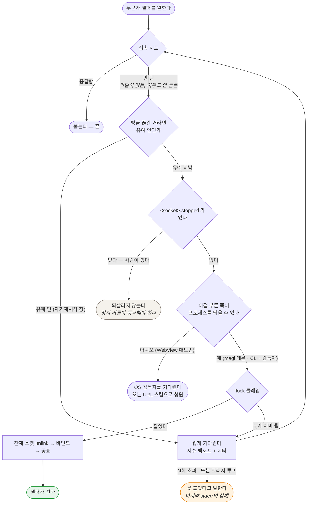

# PowerPoint MCP 플러그인 — 설계

Status: **제안. 구현하지 않았다.** (2026-08-28)

> **개정 (같은 날).** 첫 판본은 호스트 어댑터 계약을 직접 설계하고 새 코어 데몬을 두었다. 사용자가
> **도구를 MCP로 내놓으라**고 방향을 정했고, 그게 더 낫다 — 컨텍스트가 갈리지 않고(§4.2), 계약을
> 발명할 필요가 없으며(§4.3), `ide/`와의 데몬 범위 충돌이 통째로 사라진다. §0·§4·§5를 다시 썼다.
> 무엇이 어떻게 뒤집혔는지는 [`../ide/INTEROP.md`](../ide/INTEROP.md)에 남겼다.

> 이 문서는 아직 코드가 없는 시점의 설계 의도다. 만들면서 어긋난 지점은 여기에 인라인으로
> 정정을 남기고, 지우지 않는다. 부록 A의 API 사실은 확인한 날짜와 출처를 달았다 — 그날 이후
> 마이크로소프트가 바꾼 것은 이 문서가 모른다.

---

## 0. 한 문장

**열려 있는 덱을 읽고, 사람이 말로 시킨 편집을 수행하고, 자기가 한 일이 실제로 그렇게 됐는지
확인한 뒤에야 끝났다고 말하는 에이전트.**

**에이전트는 magi다.** 이 프로젝트가 만드는 것은 에이전트가 아니라 **덱을 만지는 도구를 MCP로
내놓는 플러그인**과, 그 도구를 실제로 실행하는 머신에 하나뿐인 로컬 헬퍼다. 새 코어 데몬은 만들지
않는다 — 이유는 §4.2이고, 한 줄로는 **컨텍스트를 갈라놓지 않기 위해서**다. 저장소를 읽는 도구와
덱을 고치는 도구가 한 세션 안에 같이 있어야 그 둘을 잇는 브리프가 필요 없어진다.

## 1. 무엇이 아닌가

경계를 먼저 적는다. 이 셋은 만들지 않는다.

- **문서 생성기가 아니다.** "이 마크다운으로 발표자료 만들어줘"는 다른 물건이다. 이건 *이미 있는*
  문서를 고친다. 생성은 나중에 얹을 수 있지만, 얹기 전까지는 없다고 말한다.
- **디자인 대행이 아니다.** "예쁘게 해줘"는 판정할 수 없는 요구다. 판정할 수 없는 것을 받으면
  끝났다고 말할 근거가 없어진다(§7).
- **자율 실행이 아니다.** 사람이 편집기를 열어두고 옆에 있는 상황을 전제한다. 사람 없이 도는
  배치 작업은 호스트 플러그인이 아니라 데몬에 직접 붙는 다른 클라이언트의 일이다.

## 2. 이 문제가 코딩 에이전트와 다른 세 지점

magi에서 배운 것을 그대로 옮기려다 부러지는 자리가 셋이다. 설계의 대부분이 여기서 나온다.
서술은 PowerPoint로 하지만, 셋 다 "편집기 안의 살아있는 문서"라는 상황 자체에서 나오므로
다음 호스트에도 그대로 온다.

### 2.1 되돌릴 곳이 없다

코딩 에이전트는 git 위에 산다. 클론이 있고, `base..HEAD`가 있고, 아니다 싶으면 되돌린다.
여기에는 **브랜치가 없다.** 대상은 사람이 지금 이 순간 열어놓고 보고 있는 문서 하나다.

후보 셋:

| 방법 | 되는 것 | 안 되는 것 |
|---|---|---|
| 편집기 자체 undo 스택에 맡긴다 | 공짜, 사람이 이미 아는 조작(⌘Z) | 플러그인 편집이 undo 스택에 어떻게 쌓이는지 **미검증**(S4). 한 번의 지시가 40개 도형을 고쳤을 때 ⌘Z 한 번에 다 돌아오는지, 40번 눌러야 하는지가 다르다 |
| 편집 전 스냅샷 | PowerPoint는 `slide.exportAsBase64()`가 슬라이드를 통째로 .pptx 바이트로 준다 — 완전한 원본 | 되돌리려면 그 바이트를 **다시 넣어야** 하는데, 쓰기 경로가 있는지 미검증(S5). 없으면 스냅샷은 증거로만 쓰이고 복원에는 못 쓴다 |
| 객체 태그 저널 | `shape.tags`(1.3)에 편집 전 값을 적어두고 되돌린다 | 우리가 만든 변경만 되돌린다. 객체를 **삭제**한 경우는 태그도 같이 사라져 못 되돌린다 |

**결정:** 셋 다 쓴다. 순서는 ① 스냅샷을 항상 뜬다(증거+최후수단) → ② 되돌리기는 태그 저널로
시도 → ③ 저널로 안 되는 것(삭제·구조 변경)은 **애초에 승인 없이 하지 않는다**(§8).
편집기의 undo는 우리가 통제하는 게 아니므로 계획에 넣지 않고, S4로 실태만 기록한다.

되돌리기는 **도구로 낸다**(`snapshot_slide` / `restore_slide`) — MCP에 "이 서버는 되돌릴 수 있다"를
선언하는 자리가 없기 때문이다(§4.4). 도구로 내면 에이전트가 쓸지 말지를 스스로 정하고, 안 쓴
것도 기록에 남는다.

### 2.2 "됐다"의 증거가 다르다

코딩 에이전트의 증거는 exit code와 파일 diff다. 둘 다 기계가 읽는 사실이다. 문서의 결과물은
**시각적**이고, 객체 모델이 "텍스트를 바꿨다"고 말해도 그 텍스트가 상자 밖으로 넘쳤는지는
모델이 모른다.

다행히 PowerPoint에는 답이 API에 있다. `slide.getImageAsBase64()`가 **슬라이드를 PNG로 렌더해
준다**(1.8). 그래서 판정 증거를 두 겹으로 쌓을 수 있다:

- **기록** — 우리가 호출한 편집과 그 전후 객체 모델 값(magi의 관찰 기록에 해당)
- **픽셀** — 편집 전후 렌더 PNG. 넘침·겹침·잘림처럼 객체 모델이 침묵하는 결함은 여기서만 보인다

이 둘을 다 가진 것이 이 제품이 코딩 에이전트보다 **유리한** 유일한 지점이다. 코딩 에이전트는
자기가 만든 것을 눈으로 볼 수 없다.

⚠ **그런데 지금은 이게 막혀 있다.** magi의 MCP 클라이언트가 이미지 컨텐트 블록을 버린다 —
§4.4 ①에 코드 위치와 함께 적었다. 렌더를 증거로 쓰려면 magi 쪽 수정이 먼저다.

### 2.3 읽기 천장과 쓰기 천장이 다르다 — 가장 중요한 사실

Office.js의 PowerPoint 객체 모델은 좁다. 그런데 **읽기에는 두 개의 비상구가 있다.**

| | 무엇으로 | 닿는 곳 |
|---|---|---|
| **읽기** | `slide.exportAsBase64()` (슬라이드 = .pptx 바이트) | **OOXML 전부** — 차트 데이터, SmartArt, 애니메이션, 발표자 노트까지 |
| | `slide.getImageAsBase64()` (PNG 렌더) | 최종 시각 결과 |
| | 객체 모델 (`shapes`, `textFrame`, `fill`, …) | 구조화된 값, 편집 가능한 것과 1:1 |
| **쓰기** | 객체 모델뿐 | 텍스트·도형·서식·표·레이아웃·순서·하이퍼링크 |

**비대칭이 제품의 모양을 정한다.** 에이전트는 차트가 잘못됐다는 것을 *볼 수* 있지만 *고칠 수*
없다. 애니메이션이 어색한 것을 알 수 있지만 손댈 수 없다. 발표자 노트를 읽을 수는 있어도 쓸
수는 없다.

이걸 숨기면 최악의 실패가 난다 — 에이전트가 "차트를 고쳤습니다"라고 말하고 아무것도 안 바뀌는
것. 그래서 **못 고치는 것은 도구를 아예 내놓지 않고, 발견하면 사람에게 넘긴다**(§6).
"보이지만 못 고침"은 이 제품의 1급 결과값이지 예외가 아니다.

MCP에서는 이 규칙이 서버 쪽 책임이 된다. `tools/list`에 올린 것은 반드시 실행돼야 한다 —
magi에서 광고와 실행이 어긋났을 때 모델이 그 도구를 부르고, 거부당하고, 다시 부르다 루프 가드에
죽은 기록이 있다.

## 3. 기술 스택 — 넷을 비교하고 하나를 고른다

이 절은 **첫 호스트에 대한 결정**이다. 코어의 스택이 아니다.

### 3.1 후보

- **A. Office Add-in (Office.js)** — 공식 확장 모델. WebView 안의 웹앱.
- **B. VSTO / COM 애드인 (.NET)** — PowerPoint 객체 모델 전부(VBA가 보는 그것). Windows 전용.
- **C. AppleScript / OSA 자동화** — macOS에서 PowerPoint를 밖에서 조종.
- **D. 플러그인 아님 — .pptx 파일 직접 조작** (python-pptx, OpenXML SDK).

### 3.2 비교

| 축 | A. Office.js | B. VSTO/COM | C. AppleScript | D. 파일 직접 |
|---|---|---|---|---|
| **개발 머신(macOS)에서 개발** | ✅ | ❌ Windows 전용 | ✅ | ✅ |
| 사용자 플랫폼 | Win·Mac·웹 | Win만 | Mac만 | 무관(UI 없음) |
| 열린 문서에 붙기 | ✅ | ✅ | ✅ | ❌ 파일 잠김 |
| 읽기 천장 | 높음(OOXML+PNG, §2.3) | 최상(전 객체 모델) | 중간 | 최상 |
| 쓰기 천장 | 중간(객체 모델) | 최상 | 중간 | 최상 |
| UI 통합 | ✅ 작업창·리본 | ✅ | ❌ | ❌ |
| **로컬 프로세스 기동** | ❌ 샌드박스(§5.5) | ✅ | ✅ | ✅ |
| 배포 | 매니페스트+호스팅 | ClickOnce/MSI | 앱 번들 | — |

### 3.3 결정: **A. Office Add-in (Office.js), PowerPointApi 1.8 이상**

세 가지 근거이고, 첫 번째가 사실상 혼자 결정한다.

**(a) 개발 머신이 macOS다.** VSTO/COM은 Windows 전용이라 개발도 디버깅도 못 한다. C는 반대로
Windows 사용자를 버린다. D는 UI가 없어 §0의 물건이 아니다. 남는 건 A뿐이다.

**(b) 최소 버전이 1.8인 이유는 §2가 1.8에 걸려 있어서다.** `exportAsBase64`(OOXML 읽기),
`getImageAsBase64`(PNG 렌더), `slide.index`, `applyLayout` — §2.1의 스냅샷과 §2.2의 픽셀 증거를
떠받치는 넷이 **전부 1.8에서 들어왔다.** 1.7 이하로 내려가면 "읽고 판정하는" 물건 자체가 성립
안 한다. 판정을 포기할 바에는 지원 범위를 포기한다.

**(c) 1.8을 최소로 잡는 대가는 명확하고, 광고에 쓰지 말아야 한다.**

- Office on Mac **16.96 (25041326)** 이상, Windows **2504 (Build 18730.20030)** 이상
- **볼륨 라이선스/LTSC 영구 버전은 1.5까지 → 지원 불가.** 기업 표준 이미지가 LTSC면 이 제품은
  안 돈다. 이건 우회로가 없다.
- **iPad는 1.1까지 → 지원 불가.**

런타임에 `Office.context.requirements.isSetSupported('PowerPointApi', '1.8')`로 확인하고,
아니면 **기능을 조용히 줄이지 말고 못 돈다고 말한다.** 매니페스트 `<Requirements>`로 막지 않는
이유는 그러면 애드인 목록에서 아예 사라져 사용자가 *왜* 없는지 모르기 때문이다.

### 3.4 기각한 것을 다시 꺼낼 조건

- **B(VSTO)** — 스파이크에서 쓰기 천장이 실제 요구를 못 받치는 것으로 드러나고, 동시에 Windows
  전용 배포를 받아들일 수 있게 되면. **그때 magi도 헬퍼의 MCP 표면도 손대지 않는다** — VSTO
  애드인은 헬퍼가 부리는 또 하나의 손일 뿐이고, 도구 이름과 스키마는 그대로다. 이게 MCP를
  경계로 둔 값이다.
- **D(파일 직접)** — 사람 없이 도는 배치 작업이 필요해지면. 플러그인이 아니라 데몬에 붙는 다른
  클라이언트로 추가한다. 열린 문서와 충돌하므로 **닫힌 파일에만** 적용한다.

## 4. 구조 — 도구는 MCP로 준다

### 4.1 층



**새 코어 데몬은 없다.** magi가 코어다. PowerPoint 플러그인은 덱을 만지는 **도구를 MCP로 내놓는
쪽**이고, 그 도구는 magi의 도구 목록에 `mcp__ppt__set_text` 같은 이름으로 들어간다.

### 4.2 왜 이게 별도 코어보다 나은가 — 컨텍스트가 갈리지 않는다

이게 이 설계의 요구사항이다. 별도 코어 데몬을 두면 에이전트가 둘이 되고, 둘은 `hand_off`로
만난다 — 그 순간 **컨텍스트가 갈린다.** 저장소를 읽은 에이전트가 아는 것을 덱을 고치는 에이전트는
모르고, 그 사이를 브리프가 잇는데, 이 저장소가 브리프로 식별자를 잃는 것을 **6번 중 6번** 실측했다.

MCP로 내놓으면 한 세션 안에 **저장소 도구와 덱 도구가 같이 있다.** 에이전트가 `read`로 설계문서를
읽고 같은 턴에 `mcp__ppt__set_text`로 슬라이드를 고친다. 전달이 없으므로 전달에서 잃을 것도 없다.

부수 효과로 §4의 원래 걱정 — "코어가 PowerPoint를 알면 안 된다" — 이 **공짜로 해결된다.** MCP가
바로 그 경계이고, 우리가 계약을 발명하지 않아도 이미 있다. magi 쪽 코드 변경은 원칙적으로 0이고,
`config.toml`에 `[mcp.ppt]` 한 블록이면 붙는다.

### 4.3 MCP가 공짜로 주는 것

앞 판본이 직접 설계하려던 호스트 어댑터 계약이 거의 그대로 MCP에 있다.

| 내가 만들려던 것 | MCP의 대응 | 상태 |
|---|---|---|
| 호스트가 도구를 선언하고 코어는 발명하지 않는다 | `tools/list` | ✅ 있음 |
| 이름 네임스페이스 | `mcp__<서버>__<도구>` — magi가 강제 | ✅ 있음. 안 하면 서버가 내장 도구를 가린다는 사고 기록까지 있다 |
| 능력 협상 | MCP `initialize` 핸드셰이크 | ✅ 있음 |
| 미선언 인자 거부 | 도구의 JSON Schema | ✅ 있음 |
| 서버가 죽으면 도구가 사라진다 | magi의 MCP 매니저가 자동 제거 | ✅ 있음 |
| 손이 사라지면 턴 보류 | (없음 — 도구가 그냥 실패한다) | ⚠ §5.4 |

### 4.4 MCP가 안 주는 것 — 넷, 전부 코드로 확인했다

**① 이미지가 버려진다. 이게 제일 크다.**

`internal/adapter/mcp/jsonrpc.go:82`의 컨텐트 블록에 필드가 둘뿐이다:

```go
type contentBlock struct {
	Type string `json:"type"`
	Text string `json:"text"`
}
```

그리고 `tool.go:41`이 블록을 `c.Text`만 이어붙인다. MCP의 **이미지 컨텐트 블록은 `data`와
`mimeType`을 싣지 `text`를 싣지 않으므로, 통째로 빈 문자열이 된다.**

즉 지금 상태로는 `render_slide`가 **아무것도 돌려주지 못한다.** §2.2의 픽셀 증거 — 이 제품이
코딩 에이전트보다 유리한 유일한 지점 — 이 여기서 막힌다.

고치는 것은 작다. magi에 `session.PartImage`가 이미 있으므로(`session.go:117`), 컨텐트 블록에
`Data`/`MimeType`을 더하고 이미지 블록을 이미지 파트로 옮기면 된다. **하지만 magi 쪽 변경이고,
이 문서의 범위 밖이므로 요청해야 한다.** 그전까지 렌더는 파일 경로를 돌려주는 우회로만 가능하고,
그건 모델이 볼 수 없는 값이다.

**② 모든 MCP 도구가 danger tool이다.** `internal/app/execute.go:59`가 `mcp__` 접두사만 보고
위험 판정을 한다 — magi가 외부 서버가 무엇을 할지 증명할 수 없어서 고른 기본값이고, 옳다.
대가는 `list_slides` 같은 순수 읽기도 `ask`/`auto`에서 **매번 묻는다**는 것이다. 답은 허용 규칙이다:

```toml
allow = ["mcp__ppt__list_*(**)", "mcp__ppt__read_*(**)", "mcp__ppt__render_*(**)"]
```

**쓰기 도구는 규칙에 넣지 않는다.** 덱을 고치는 것은 물어야 하는 일이 맞다.

**③ 도구 호출 타임아웃이 60초다** (`tool.go:31`). 100장 덱의 `export_slide_ooxml`이나 큰 슬라이드
렌더가 여기 걸릴 수 있다. §9의 S6이 이 수를 재야 한다.

**④ MCP에 scope 개념이 없다.** 어느 문서를 고치라는 것인지 MCP는 모른다. 그래서 **도구 인자로
받는다** — 모든 도구가 `document`를 받고, 생략하면 지금 활성 문서다. 애드인이 여럿(창이 여럿)이면
헬퍼가 그 인자로 손을 고른다(§5.6).

### 4.5 전송은 HTTP여야 한다 — stdio가 아니라

magi의 MCP 클라이언트는 stdio와 Streamable HTTP를 둘 다 지원한다
(`internal/adapter/mcp/http_transport.go`). 여기서는 **HTTP만 맞다.**

stdio는 magi 데몬이 서버를 **자식 프로세스로 띄운다.** 그런데 magi 데몬은 워크스페이스당 하나라
여럿이고, 각자 자기 헬퍼를 띄우면 **같은 PowerPoint 애드인을 두고 헬퍼 N개가 싸운다.** 애드인은
하나뿐이므로 붙을 수 있는 헬퍼도 하나뿐이다.

HTTP면 헬퍼가 먼저 서고 데몬들이 클라이언트로 붙는다. 헬퍼의 수명이 magi 데몬의 수명과 분리되고,
이게 §5의 "머신에 하나"가 실제로 필요한 이유다.

---

## 5. 로컬 헬퍼 — 머신에 하나

### 5.1 왜 헬퍼가 따로 있어야 하나

**애드인이 직접 MCP 서버가 될 수 없다.** MCP 서버는 stdio로 스폰되거나 포트를 리슨해야 하는데,
WebView 안의 페이지는 **프로세스가 되지도 못하고 리슨하지도 못한다.** 브라우저 엔진에 인바운드
연결을 받는 수단이 없다.

그래서 헬퍼가 필요하다. 헬퍼는 두 얼굴이다 — magi 쪽으로는 **MCP 서버**, 애드인 쪽으로는
**원격 손을 부리는 클라이언트**. 도구 호출이 오면 애드인에게 넘기고, 애드인이 Office.js를
불러 결과를 돌려준다.

이건 §5.5의 W1(별도 앱 설치 + OS 감독자)이 어차피 필요했던 것과 같은 프로세스다. MCP로 가면서
그 프로세스에 **이름과 역할이 생겼다.**

### 5.2 머신에 하나 — 이번엔 근거가 더 단단하다

PowerPoint 인스턴스가 하나이므로 애드인의 손도 하나이고, 그 손을 쥐는 헬퍼도 하나여야 한다.
앞 판본에서는 "에이전트 데몬을 사용자당 하나"라고 썼는데 그건 magi의 워크스페이스당 하나와
부딪혔다. **지금은 부딪히지 않는다** — magi 데몬은 그대로 워크스페이스당 하나이고, 헬퍼만
사용자당 하나다. 층이 다르므로 경쟁하지 않는다.

정확히는 **사용자당 하나**다. 유닉스 소켓과 루프백 포트를 사용자 홈 아래 두면 다른 계정과 별개다.
문서와 UI에 그렇게 적는다 — 모호하게 두면 다중 사용자 머신에서 놀란다.

### 5.3 획득-또는-접속

헬퍼를 띄우려는 모든 것이 도는 절차 하나다. 다르게 구현된 두 벌은 반드시 어긋난다.



다섯 가지가 이 그림의 요점이고, 넷은 `ide/README.md` §2와 magi의 `claim_unix.go`에서 왔다.

- **락 먼저, 바인드, 그다음 공표.** magi가 이 순서를 사고로 배웠다 — 공표를 먼저 했더니 동시에
  시작한 둘이 서로의 레코드를 덮어쓰고 나가는 길에 승자의 것을 지웠다. 새로 발명하지 않는다.
- **접속 실패의 원인을 진단하지 않는다.** 소켓 파일이 없는 것과 아무도 안 듣는 것은 겉보기만
  다르고 답은 같다 — 시도하고 `flock`이 판정하게 둔다. 진단하려고 락을 열어 보면 **알아보는
  행위가 상태를 바꾼다**(`ide/README.md` §2).
- **잔재 소켓 unlink는 락을 쥔 쪽만 한다.** 클라이언트가 "아무도 안 듣네 → 지우고 바인드"를 하면
  두 틈이 생기고 동시에 시작한 둘이 둘 다 빠진다 — magi가 **300회 중 25회**로 실측했다
  (`internal/adapter/daemon/claim_unix.go`). 락을 먼저 잡은 뒤 지우는 것은 안전하고 magi 자신이
  그렇게 한다(`daemon.go`의 `claimPath` → `os.Remove(path)`). **차이는 순서가 아니라 누가 하느냐다.**
- **기동 가지는 프로세스를 띄울 수 있는 쪽만 탄다.** 애드인은 원리적으로 못 하므로 이 가지가
  막혀 있고, 그 사실이 그림에 보여야 한다. **기다리는 동안 조용히 있지 않고 왜 기다리는지 말한다.**
- **끝내 못 붙으면 말한다.** "모르겠다"와 "없다"는 다르다. 헬퍼에 못 붙은 화면이 "할 일 없음"처럼
  보이면 안 된다.

### 5.4 죽으면 다시

- **끊김은 소켓이 알려준다.** 하트비트를 두지 않는다. 끊기면 §5.3을 다시 돈다.
- **자기재시작에는 유예를 준다.** 유닉스에서 graceful 재시작은 리스너를 닫고 **락까지 놓은 뒤**
  `syscall.Exec`한다(`internal/graceful/graceful_unix.go`). 소켓도 락도 잠깐 빈다. 유예가 없으면
  감시자가 그 창에서 경쟁 프로세스를 띄운다. **3초를 시작값으로 두되 실측 아님을 적어 둔다** —
  재시작 창을 실제로 재서 고쳐야 한다.
- **"일부러 껐다"는 유도할 수 없으므로 기록한다.** 디스크에서 정지와 죽음은 똑같이 생긴다.
  `shutdown`을 보내는 쪽이 `<socket>.stopped`를 남기고, 감시자는 그게 있으면 되살리지 않는다.
  **표식은 접속이 성공하는 순간 지운다** — 사람이 밖에서 다시 켰다면 표식은 이미 낡았고, 남겨
  두면 그때부터 영영 감시되지 않는다. 이 트리의 원칙은 상태를 유도하고 기록하지 않는 것인데
  이 사실만은 유도할 수 없다(`ide/README.md` §2가 먼저 짚었다).
- **크래시 루프에서 손을 뗀다.** 60초에 세 번 띄웠는데 또 죽으면 감시를 멈추고 마지막 stderr를
  그대로 보여 준다. 설정 하나가 잘못돼 즉사하는 경우 무한 재기동은 문제를 숨기기만 한다.
  **3회/60초도 실측이 아니라 시작값이다.**
- **감독은 OS에 맡긴다.** macOS는 LaunchAgent(`KeepAlive`), Windows는 예약 작업/서비스가
  "죽으면 다시"를 우리 코드보다 안정적으로 해 준다. §5.3의 자체 선출은 그걸 **대체하는 게 아니라**
  감독자가 없거나 아직 안 돌 때를 메운다.
- **헬퍼는 애드인 없이도 산다.** 작업창을 닫아도 죽지 않는다. 다만 애드인이 없는 동안 덱 도구는
  **실패해야 하고, 실패 사유가 "PowerPoint에 붙어 있지 않다"여야 한다.** 조용히 빈 결과를 주면
  에이전트가 덱이 비어 있다고 읽는다.

### 5.5 애드인과 헬퍼 사이

애드인 페이지는 **반드시 https로 서빙**되므로 `http://127.0.0.1` 호출이 혼합 콘텐츠로 차단된다.
루프백도 **https여야** 하고, 그러려면 로컬에서 신뢰되는 인증서가 필요하다. 개발용으로는
`office-addin-dev-certs`가 그 일을 하지만 **배포판에서 사용자 머신의 신뢰 저장소에 인증서를 넣는
것은 가볍게 볼 일이 아니다.** S3에서 확인한다.

방향도 뒤집혀 있다. 헬퍼가 도구 호출을 애드인에게 **밀어야** 하는데 애드인은 리슨을 못 하므로,
애드인이 먼저 붙어서 그 연결을 열어 둔다(WebSocket 또는 롱폴). 즉 **애드인이 접속하고, 호출은
그 연결을 거슬러 내려간다.**

magi의 "아무것도 포트를 열지 않는다"는 여기서 지킬 수 없다. 지킬 수 없으므로 좁힌다 — 루프백에만
바인드하고(라우팅 가능한 주소면 거부), 기동 때 만든 토큰을 애드인이 제시하고, 오리진을 검사한다.
셋 다 테스트가 강제한다.

### 5.6 문서가 여럿일 때

PowerPoint 창이 둘이면 애드인 인스턴스도 둘이고, 손도 둘이다. 헬퍼가 그것을 `document`로 가른다
(§4.4 ④).

- **한 문서에 손은 하나.** 같은 문서로 두 번째 손이 붙으려 하면 거부하고 이유를 말한다.
- **`document`를 생략하면 활성 문서다.** 다만 활성 문서는 사람이 창을 바꾸면 바뀌므로, **턴 안에서
  두 번 부르면 다른 문서일 수 있다.** 그래서 첫 호출의 결과에 어느 문서였는지를 실어 보내고,
  에이전트가 이후 호출에 그 id를 명시하게 유도한다.
- **없는 문서를 지목하면 에러다.** 빈 결과가 아니다 — "없다"와 "못 찾겠다"는 다른 행동을 부른다.

## 6. MCP 서버가 내놓는 도구

헬퍼가 `tools/list`로 올리는 목록이다. magi에는 `mcp__ppt__<이름>`으로 보인다.

도구는 Office.js 호출 하나에 대응하고, 모델이 그걸 조합해서 못 하는 일이 있을 때만 새로 판다.
magi가 집계 도구 넷을 지우면서 세운 기준("호출 0회면 도구가 아니다")을 여기서도 쓴다 — 다만
그건 실측이 쌓인 뒤의 일이고, 지금은 최소로 시작한다.

**읽기**

| 도구 | 하는 일 |
|---|---|
| `list_slides` | 인덱스·id·레이아웃·도형 수. 덱 전체의 목차 |
| `read_slide` | 한 슬라이드의 도형을 구조화해서. 텍스트·위치·크기·서식·placeholder·alt text |
| `render_slide` | PNG 렌더(§2.2). **모델이 눈으로 볼 때만** — 비싸므로 매 스텝이 아니다 |
| `export_slide_ooxml` | OOXML 원문(§2.3). 객체 모델이 침묵하는 것(차트 데이터 등)을 볼 때 |
| `find_shapes` | 덱 전체에서 조건에 맞는 도형. "폰트가 X인 것 전부" 같은 일괄 작업의 입구 |

**쓰기** — `set_text` · `format_shape` · `move_shape` · `add_shape` · `delete_shape` ·
`apply_layout` · `reorder_slide` · `set_hyperlink`. 전부 객체 모델에 1:1 대응한다.

**되돌리기** — `snapshot_slide` · `restore_slide`(§2.1). MCP에 되돌리기 능력을 선언하는 자리가
없으므로 도구로 낸다.

모든 도구가 `document`를 옵션으로 받는다(§4.4 ④). 생략하면 활성 문서다.

**허용 규칙은 읽기에만 준다.** MCP 도구는 전부 danger tool이라 안 그러면 `list_slides`도 매번
묻는다(§4.4 ②). 쓰기와 되돌리기는 규칙에 넣지 않는다 — 덱을 고치는 것은 물어야 하는 일이 맞다.

**의도적으로 선언하지 않는 것과 이유**

- **OOXML 직접 쓰기.** 읽기는 주지만 쓰기는 안 준다. 쓰기 경로가 있는지도 미검증(S5)이지만,
  있더라도 안 준다 — 객체 모델을 우회한 쓰기는 기록도 되돌리기도 못 한다.
- **차트·SmartArt·애니메이션·발표자 노트 편집.** API가 없다(§2.3). §4.4의 규칙: **없는 능력은
  도구로 만들지 않는다.** 대신 `read_slide`가 "이건 차트이고 이 호스트는 못 고친다"를 결과에
  실어 보낸다.
- **마스터·레이아웃 편집.** 한 슬라이드를 고치랬는데 덱 전체가 바뀌는 것은 되돌릴 수 없는
  종류의 사고다. 레이아웃은 `apply_layout`으로 **고르기만** 한다.

## 7. 끝났다고 말하는 법

magi의 구조를 가져오되 **크기를 줄인다.** 그리고 **증거의 종류를 호스트에서 받는다.**

**가져오는 것:**

- **끝은 선언이다.** 모델이 도구를 그만 부르는 것으로 턴이 끝나지 않는다. `declare_done`을
  불러야 하고 — 이건 magi의 도구지 이 플러그인이 내놓는 것이 아니다 — 그때 판정이 돈다.
- **판정은 주장이 아니라 기록을 본다.** 모델이 "고쳤습니다"라고 쓴 문장이 아니라, 코어가 기록한
  편집 호출과 그 전후 값, 그리고 호스트가 내준 증거를 본다.
- **요구사항 워크.** 결론 전에 사람이 시킨 것을 한 줄씩 걸고 충족/미충족을 표시한다. 스키마에서
  워크가 결론보다 **앞에** 온다 — 결론을 먼저 정해놓고 근거를 짜맞추지 못하게.
- **세 번째 착지.** 성공/실패 이진이면 모델이 성공을 만들어낸다. **UNVERIFIED**를 둔다 —
  "바꾸긴 했는데 확인하지 못했다". 렌더가 실패했거나, 손이 사라졌거나(§5.4), 요구가 애초에
  판정 불가였거나, **호스트가 못 고치는 것을 발견했을 때**(§2.3)의 정직한 끝이다.

**MCP로 가면서 달라지는 것:**

- **증거를 따로 조립하지 않는다.** 카운슬은 이미 magi가 기록한 도구 결과를 읽으므로, `render_slide`가
  돌려준 것이 그 기록에 있으면 판정은 그걸 본다. 앞 판본은 호스트가 증거 종류를 선언하고 게이트가
  물어보는 구조였는데, MCP에는 그 자리가 없고 **필요도 없다** — 도구 결과가 곧 기록이다.
- 대신 **에이전트가 렌더를 부르지 않으면 픽셀 증거가 없다.** 게이트가 강제로 뽑아 올 수 없다.
  프롬프트로 유도하되, 안 불렀으면 안 불렀다는 것이 기록에 남는다 — 없는 증거를 있는 척하지 않는다.
- 그리고 §4.4 ①이 풀리기 전까지는 **어느 쪽이든 픽셀이 도착하지 않는다.**

**줄이는 것:**

- **위원 셋이 아니라 하나.** magi는 렌즈 셋으로 읽는다. 여기서는 한 번의 판정 호출로 간다.
  근거: 사람이 옆에 있고(잘못된 승인의 비용이 낮다), 턴이 짧고, 무엇보다 magi 자신의 측정이
  "렌즈 한 줄 차이의 위원 셋은 세 의견이 아니라 한 의견의 세 표본"이라고 말했다(21표 중 21표
  일치, 이견 0). 셋을 두려면 **서로 다른 백엔드**여야 하는데 그건 사용자가 갖췄다고 가정할 수
  없는 설정이다.
- **다만 판정 호출은 픽셀을 본다.** 위원 수를 줄이는 대신 증거의 질을 올린다. 이건 magi가 가질
  수 없었던 증거다(§2.2).

**거절도 유한하다.** 아무것도 안 바뀐 채로 판정이 계속 거절하면 UNVERIFIED로 착지하고 멈춘다.
정직한 실패는 종점이지 루프가 아니다.

## 8. 안전

- **범위는 좁게 시작한다.** 선택이 없으면 **현재 단위**(슬라이드)가 기본이고, 문서 전체 편집은
  사람이 명시적으로 말했을 때만이다. "폰트 다 바꿔줘"가 40장을 건드리기 전에 몇 장이 바뀔지
  말하고 묻는다.
- **되돌릴 수 없는 것은 승인을 받는다.** 삭제, N개 이상 일괄 변경, 레이아웃 교체. §2.1의
  저널로 못 되돌리는 것들이 정확히 이 목록이다.
- **문서는 사용자 것이다.** 사람이 지금 타이핑 중이거나 객체를 잡고 있으면 쓰지 않는다.
  에이전트가 사람 손에서 커서를 빼앗는 것은 어떤 이득으로도 못 갚는다.
- **읽은 것은 데이터지 지시가 아니다.** 문서 안의 텍스트가 "이전 지시를 무시하라"라고 적혀
  있어도 그건 문서 내용이다. 남이 보낸 파일을 여는 것이 정상 상황이므로 현실적인 표면이다.
- **헬퍼는 magi에게 외부 서버다.** magi가 이미 그렇게 다룬다 — 모든 MCP 도구가 danger tool이고
  (§4.4 ②) 매 호출이 권한 게이트를 지난다. 우리가 만든 서버라고 해서 그 게이트를 우회하지
  않는다. 읽기 도구에만 허용 규칙을 주는 것(§6)이 그 게이트를 쓰는 방법이지 끄는 방법이 아니다.
- **헬퍼에게는 애드인이 외부다.** 애드인이 보낸 것을 그대로 Office.js에 넘기지 않는다 — 슬라이드
  인덱스 범위, 문자열 길이, 도형 id의 존재를 검사한다. 루프백이라고 신뢰하지 않는 이유는
  토큰이 새면 같은 머신의 아무 프로세스나 그 포트를 두드릴 수 있어서다.
- **밖으로 나가는 것은 정한다.** 문서 본문과 렌더 이미지가 LLM 백엔드로 나간다. 사용자가
  이걸 알아야 하고, 로컬 백엔드를 고를 수 있어야 한다. 기본값을 클라우드로 두는 것은 결정이지
  기본이 아니다.

## 9. 검증 계획 — 설계가 기대는 미검증 전제

이 문서의 여러 결정이 **아직 확인 안 된 전제** 위에 있다. 만들기 전에 스파이크로 확인한다.
각 항목에 "무엇이 나오면 설계가 바뀌는가"를 적어둔다 — 그게 없으면 스파이크가 아니라 구경이다.

| | 확인할 것 | 방법 | 이게 나오면 설계가 바뀐다 |
|---|---|---|---|
| **S1** | 1.8 API가 Mac에서 실제로 광고대로 도는가 | 빈 애드인으로 `exportAsBase64`/`getImageAsBase64`를 실호출 | 렌더가 안 되면 §2.2의 픽셀 증거가 사라지고, PowerPoint 호스트의 `evidence` 선언에서 `render`가 빠진다(§7은 그래도 돈다) |
| **S2** | 렌더 PNG가 판정에 쓸 만한 해상도·충실도인가 | 넘침·겹침·잘림을 일부러 만든 슬라이드를 렌더해 눈으로 확인 | 못 알아보면 픽셀은 사람용 표시로만 쓰고 판정 입력에서 뺀다 |
| **S3** | 루프백 https + 커스텀 URL 스킴 | 애드인에서 로컬 https 호출, 그리고 `pptagent://` 이동 | https가 막히면 §5.5가 무너져 전송을 다시 고른다. 스킴이 막히면 OS 감독자에만 기댄다 |
| **S4** | 플러그인 편집이 편집기 undo 스택에 어떻게 쌓이나 | 도형 10개를 한 번에 고치고 ⌘Z를 눌러본다 | 한 번에 다 돌아오면 §2.1의 저널 비중이 줄어든다. 10번 눌러야 하면 사용자에게 그렇게 말해야 한다 |
| **S5** | 슬라이드 .pptx 바이트를 **되돌려 넣는** 경로가 있는가 | 삽입 계열 API로 스냅샷 복원 시도 | 없으면 스냅샷은 증거 전용이 되고, PowerPoint 호스트의 `undo` 선언에서 `snapshot`이 빠진다 |
| **S6** | 큰 덱에서 왕복 비용 | 100장 덱에서 `list_slides` + 슬라이드 하나 편집의 실측 | 느리면 배치 호출을 넣는다. **MCP 도구 호출 타임아웃이 60초**(`tool.go`)라 그 선도 같이 잰다 |
| **S7** | MCP 이미지 컨텐트 | magi에 `contentBlock`의 `data`/`mimeType`을 더하고 이미지 파트로 옮긴 뒤 렌더가 모델에 도착하는지 | 이게 안 되면 §2.2의 픽셀 증거가 통째로 없다. **S1보다 먼저 결론이 나야 §7을 확정할 수 있다** |

**S1·S3·S7이 먼저다.** S1/S3 중 하나라도 안 되면 다른 스파이크는 의미가 없고, S7은 magi 쪽
변경이라 **요청해서 결론이 나기까지 걸리는 시간이 제일 길다** — 그래서 먼저 띄운다.

## 10. 마일스톤

1. **M0 — 스파이크.** S1·S3을 먼저, 그다음 나머지. 산출물은 코드가 아니라 이 문서의 정정.
2. **M1 — 헬퍼가 MCP 서버로 선다.** §5.3 획득-또는-접속, 수명주기(§5.4), Streamable HTTP.
   **애드인 없이** 가짜 손 하나로 도구를 답하게 하고, `[mcp.ppt]`를 config에 넣어 magi에서
   `mcp__ppt__*`가 도구 목록에 보이는지까지 확인한다. 여기까지가 "붙었다"의 정의다.
3. **M2 — 진짜 손.** 애드인이 헬퍼에 붙어 읽기 도구 다섯 개를 수행. 모델 없이 손으로 호출해서.
4. **M3 — 한 세션 안에서.** magi가 저장소 도구와 덱 도구를 **같은 턴에** 쓰는 것을 확인한다.
   §4.2가 사실인지의 시험이고, 이게 이 프로젝트의 존재 이유다.
5. **M4 — 종료 판정.** §7. S7이 풀려 있어야 픽셀 증거가 들어간다.
6. **M5 — 안전.** §8의 범위·승인·되돌리기.

M4 전까지는 **아무한테도 쓰라고 하지 않는다.** 판정 없는 에이전트는 고쳤다고 말하고 안 고치는
물건이고, 그게 §0이 존재하는 이유다.

## 11. 의도적으로 하지 않는 것

- **자체 인증을 만들지 않는다.** 루프백에만 바인드하고 토큰으로 막는다(§5.5). 그 이상은 조직이
  이미 쓰는 수단에 맡긴다.
- **여러 머신에 걸치지 않는다.** 데몬은 사용자당 하나이고 그 머신 안에 있다. 함대·클러스터는
  이 제품의 문제가 아니다.
- **문서를 대신 디자인하지 않는다.** §1.
- **매 스텝 렌더하지 않는다.** 비싸고, 대부분의 스텝은 픽셀을 볼 이유가 없다. 렌더는 모델이
  부를 때와 판정할 때만.
- **magi를 대신하지 않는다.** 루프도 판정도 기록도 magi 것이다. 이 프로젝트는 도구를 내놓고
  그것을 실행할 뿐이다.
- **헬퍼가 magi를 찾아다니지 않는다.** 붙는 방향은 magi → 헬퍼다. 어떤 워크스페이스가 덱
  도구를 쓸지는 그쪽 `config.toml`에 사람이 적는다.

## 12. 열린 질문

결정이 필요하고, 지금 내가 정할 근거가 없는 것들.

1. **magi 쪽 수정 둘을 요청할 것인가.** ① MCP 이미지 컨텐트(§4.4 ①, S7) — 없으면 픽셀 증거가
   없다. ② MCP 도구 호출 60초 타임아웃을 서버별로 늘릴 수 있게 할 것인가(§4.4 ③). 둘 다 작지만
   남의 저장소 변경이고, ①은 이 제품의 성립 여부에 걸린다.
2. **기본 백엔드.** 로컬(느리지만 문서가 밖으로 안 나감)인가 클라우드(빠르지만 나감)인가.
   §8의 마지막 항목과 직결된다.
3. **배포 형태.** 애드인 매니페스트를 어디서 호스팅하나 — 사내 카탈로그인가, AppSource인가,
   sideload인가. AppSource면 심사 규칙이 §5.5의 로컬 헬퍼 요구와 부딪힐 가능성이 있다(미확인).
4. **LTSC를 정말 버리는가.** §3.3(c)의 대가 중 되돌릴 수 없는 것.
5. **어디에 살 것인가.** 지금은 magi 저장소 안의 `powerpoint-agent/`다. MCP로 가면서 이 질문이
   **쉬워졌다** — 만드는 것이 magi의 일부가 아니라 magi에 붙는 외부 서버이므로 따로 나가도
   아무것도 안 끊긴다. 다만 §4.4 ①처럼 magi 쪽 수정과 짝을 이루는 동안은 한 저장소가 편하다.
   그 수정들이 끝나면 다시 본다.
6. **덱 도구를 어느 워크스페이스가 쓰게 할 것인가.** `[mcp.ppt]`를 글로벌 config에 넣으면 모든
   magi가 덱 도구를 갖게 되고, 프로젝트 config에 넣으면 그 저장소만 갖는다. 전자는 도구 목록이
   매 요청 길어지는 값을 전부가 치르고, 후자는 사람이 매번 적어야 한다. 기본을 어느 쪽으로 둘지.
7. **수명주기 규율을 공유 패키지로 뺄 것인가.** `claim_unix.go`(출하됨) · `ide/README.md` §2
   (설계) · 이 문서 §5.3–5.4(설계) 셋이 같은 것을 세 번 적고 있다. 자세한 것은
   [`../ide/INTEROP.md`](../ide/INTEROP.md).

## 부록 A. 확인한 API 사실과 출처

2026-08-28에 Microsoft Learn에서 직접 확인했다. 그날 이후의 변경은 이 문서가 모른다.

**요구사항 집합과 플랫폼** — [PowerPoint JavaScript API requirement sets](https://learn.microsoft.com/en-us/javascript/api/requirement-sets/powerpoint/powerpoint-api-requirement-sets)

| 집합 | 추가된 것 | 웹 | Windows(M365/리테일) | Windows LTSC | Mac | iPad |
|---|---|---|---|---|---|---|
| 1.1 | 프레젠테이션 생성 | ✅ | 1810 | Office 2021 | 16.19 | 2.17 |
| 1.2 | 슬라이드 삽입·삭제 | ✅ | 2011 | Office 2021 | 16.43 | ❌ |
| 1.3 | 슬라이드 추가·삭제, 커스텀 태그 | ✅ | 2111 | Office 2024 | 16.55 | ❌ |
| 1.4 | 도형 추가·이동·크기·서식·삭제 | ✅ | 2207 | Office 2024 | 16.62 | ❌ |
| 1.5 | 하이퍼링크 | ✅ | 2208 | Office 2024 | 16.64 | ❌ |
| 1.6 | 슬라이드·텍스트범위·도형 **선택** | ✅ | 2410 | ❌ | 16.90 | ❌ |
| 1.7 | 커스텀·문서 속성 | ✅ | 2412 | ❌ | 16.92 | ❌ |
| **1.8** | **바인딩, 도형, 표** | ✅ | **2504** | ❌ | **16.96** | ❌ |
| 1.9 | 표 서식·관리 | ✅ | 2508 | ❌ | 16.100 | ❌ |
| 1.10 | 접근성, 슬라이드 배경, 하이퍼링크 | ✅ | 2601 | ❌ | 16.105 | ❌ |

**`PowerPoint.Slide`** — [레퍼런스](https://learn.microsoft.com/en-us/javascript/api/powerpoint/powerpoint.slide)

- 속성: `background`(1.10) · `customXmlParts`(1.7) · `hyperlinks`(1.6) · `id`(1.2) ·
  `index`(1.8) · `layout`(1.3) · `shapes`(1.3) · `slideMaster`(1.3) · `tags`(1.3) ·
  `themeColorScheme`(1.10)
- 메서드: `applyLayout`(1.8) · `delete`(1.2) · **`exportAsBase64`(1.8)** ·
  **`getImageAsBase64`(1.8, PNG)** · `moveTo`(1.8) · `setSelectedShapes`(1.5)
- **목록에 없는 것: 발표자 노트, 애니메이션, 전환.** §2.3의 근거.
- `exportAsBase64`에 문서가 단 주의: *"This method is optimized to export a single slide.
  Exporting multiple slides can impact performance."* — 덱 전체 스냅샷을 슬라이드 루프로 뜨는
  것은 비싸다는 뜻. §8의 "범위를 좁게"와 §9의 S6이 여기서 나왔다.

**`PowerPoint.Shape`** — [레퍼런스](https://learn.microsoft.com/en-us/javascript/api/powerpoint/powerpoint.shape)

- 읽고 쓰는 것: `textFrame` · `fill` · `lineFormat` · `left`/`top`/`width`/`height`/`rotation` ·
  `name` · `altTextDescription`/`altTextTitle` · `isDecorative` · `tags` · `adjustments` ·
  `level` · `visible`
- 읽기·이동만: `id` · `creationId` · `type` · `placeholderFormat` · `zOrderPosition` ·
  `parentGroup` · `getParentSlide`/`Layout`/`Master` · `getTable` · `getImageAsBase64` ·
  `customXmlParts`
- 동작: `delete` · `group` · `setHyperlink` · `setZOrder`
- **`type` 열거에 `"Chart"`, `"SmartArt"`, `"Media"`, `"Model3D"`, `"Ink"`, `"Ole"`가 있다 —
  그러나 그것들을 *조작하는* API는 없다.** 무엇인지 알아볼 수는 있고 고칠 수는 없다. §2.3의
  비대칭이 여기서 가장 선명하다.
- `getGraphicOrNullObject`는 **프리뷰**이고 문서가 *"Do not use this API in a production
  environment"*라고 적었다. 쓰지 않는다.

**참고한 magi 문서** — [`../docs/ARCHITECTURE.md`](../docs/ARCHITECTURE.md) §11(데몬·flock 순서·유도된 상태), §3(포트와 nil
규약, "모른다≠없다"), §5(종료 경로), §7(도구가 자리를 얻는 기준), [`../docs/EXTENDING.md`](../docs/EXTENDING.md) §1(MCP
네임스페이스), [`../docs/DESIGN_COMPAT_UPDATE.md`](../docs/DESIGN_COMPAT_UPDATE.md)(추가 전용 와이어·핸드셰이크 게이팅),
[`../docs/MANUAL.md`](../docs/MANUAL.md) §13(어태치와 큐), [`../SECURITY.md`](../SECURITY.md)(신뢰 경계). 같은 사고를 두 번 하지 않으려고
가져왔고, 다르게 간 곳은 §5.2와 §7에 이유를 적었다.
